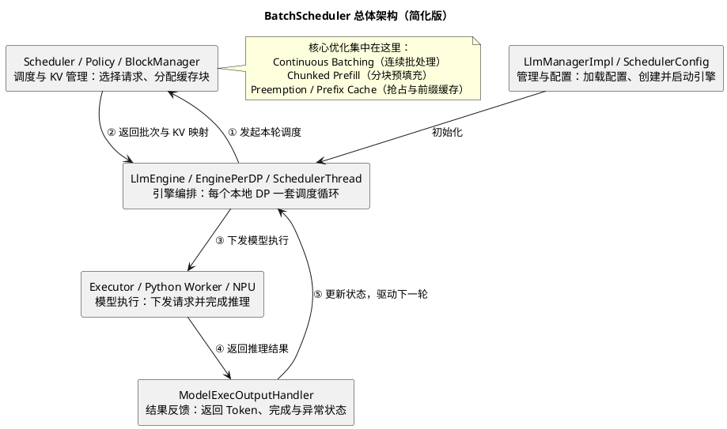
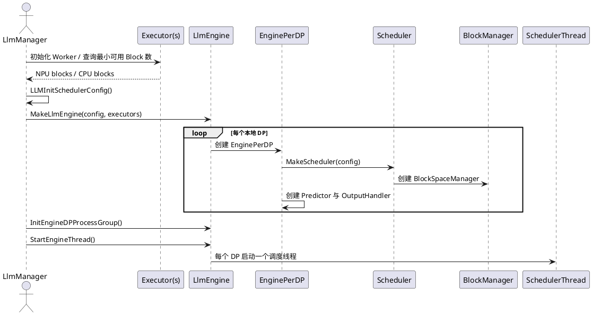
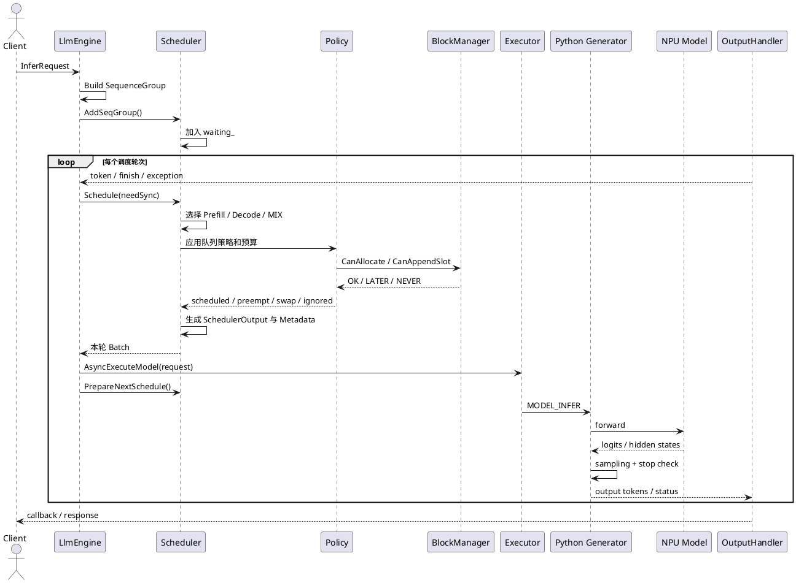

# PyServer BatchScheduler 整体架构调研

> 目标：先从源码建立 MindIE LLM PyServer BatchScheduler 的全局心智模型，再按专题深入 Continuous Batching、异步调度、KV Cache 和 SLO 调度等引擎优化。

## 1. 调研范围与源码快照

本次结论基于本地仓库 `MindIE-LLM-PyServer`：

| 项目 | 内容 |
|---|---|
| 分支 | `feat/py-config-manager` |
| Commit | `9204b2a671ed35b5b458294e1ad498ae3244a999` |
| Commit 时间 | 2026-04-03 11:25:42 +08:00 |
| 核心范围 | `src/engine`、`src/scheduler`、`src/block_manager`、`src/executor`、`mindie_llm/connector`、`mindie_llm/text_generator` |
| 调研层级 | 单机 PyServer 内部，从请求进入 LlmEngine 到 Python Worker 发起模型推理，再到输出回流 |

文中的行号只对应上述快照。不同分支的配置名、并发上限和策略细节可能变化，面试时应以“当前源码快照中”限定口径。

## 2. 一句话结论

PyServer 的 BatchScheduler 不是一个孤立的 `BatchScheduler` 类，而是由 **LlmEngine 编排线程、Scheduler 决策核心、BlockManager KV 资源层、Executor/Worker 执行通路、OutputHandler 反馈通路**共同构成的持续调度闭环。

它的核心价值不是“把请求凑成一个静态 Batch”，而是每轮根据请求阶段、Token/序列预算、KV 可用量、SLO 与集群角色，重新选择本轮进入模型的 SequenceGroup，并把执行结果反馈到下一轮决策。

## 3. 先澄清命名与边界

源码和官方特性文档会使用“BatchScheduler”概念，但 C++ 主实现类型名是 `Scheduler`：

- `LlmEngine`：运行每个 DP 的调度线程，串起 Schedule、Execute、Output。
- `Scheduler`：管理请求状态和策略，产出 `SchedulerOutput` 与 `SequenceGroupMetadata`。
- `BlockSpaceManager`：负责物理 KV Block 的分配、追加、换入换出、前缀复用与远端 KV 查询。
- `Executor`：把模型执行请求发送给对应 Rank 的 Python 进程，本身不执行 Attention 算子。
- `RouterImpl` / `Generator`：把协议对象转成模型输入，执行 KV 搬运、前向、采样和停止判断。

因此需要区分两类优化：

| 类型 | BatchScheduler 是否直接实现 | 例子 |
|---|---:|---|
| 调度与资源优化 | 是 | Continuous Batching、Chunked Prefill、抢占、动态 Batch、Prefix Cache 选块、PD Transfer 调度 |
| 模型与算子优化 | 否，主要传递元数据或触发接口 | Flash/Paged Attention 内核、融合算子、图执行、量化矩阵乘、通信算子 |

将“调度器支持 MTP/CP/SP 的元数据”表述为“调度器实现了投机解码或并行算子”是不准确的。

## 4. 总体分层架构



这张图可以沿着“**初始化 → 调度 → 执行 → 反馈 → 再调度**”的主线理解：

1. `LlmManagerImpl` 读取 `SchedulerConfig`，根据模型角色、并行配置和可用 KV Block 数创建并启动 `LlmEngine`。
2. `LlmEngine` 是整个闭环的编排者。它为每个本地 DP 维护一套 `EnginePerDP`，由独立的 `SchedulerThread` 持续驱动调度和模型执行。
3. `Scheduler` 根据 Waiting、Running、Swapped 等请求状态，通过 `Policy` 选择本轮 Batch；`BlockManager` 同时判断 KV Cache 是否足够，并生成物理 Block 映射。
4. 调度完成后，`LlmEngine` 把 Batch、Token 和 Block Table 组装成模型执行请求，由 `Executor` 发送给 Python Worker，最终在 NPU 上完成前向计算和采样。
5. `ModelExecOutputHandler` 接收生成 Token、完成状态和异常信息，并在下一轮调度开始前反馈给 `LlmEngine`，用于更新请求状态、释放 KV 资源或继续 Decode。

这里最重要的边界是：`LlmEngine` 负责串联流程，`Scheduler` 负责决定“本轮谁执行、占用哪些资源”，`Executor` 和 Python Worker 负责真正执行模型。结果回流后，调度器会重新组合下一轮 Batch，这正是 Continuous Batching 能持续运行的基础。

### 4.1 管理与配置层

`LlmManagerImpl::LaunchLlmEngine()` 汇总 Executor 返回的可用 KV Block 数，构造 `SchedulerConfig`，创建 `LlmEngine`，初始化 DP 通信组并启动调度线程。

`SchedulerConfig` 并非只有 Batch 大小，而是整个调度系统的能力开关，主要包含：

- 调度策略：`schedulerPolicy`、`stageSelectPolicy`、`maxPreemptCount`。
- 容量预算：`maxPrefillBatchSize`、`maxPrefillTokens`、`maxBatchSize`、`maxQueueDelay`。
- KV 资源：NPU/CPU Block 数、`cacheBlockSize`、Prefix Cache、KV Pool。
- 执行方式：异步调度、Chunked Prefill、动态 Batch。
- 并行拓扑：DP、TP、SP、CP，以及分布式调度开关。
- SLO/分层部署：首 Token/每 Token 时延目标、Layerwise 调度配置。

角色由模型配置映射为：

- 默认：`PnD`，同一实例同时处理 Prefill 和 Decode。
- `P`：Prefill 节点。
- `D`：Decode 节点。
- `FlexP`：可在阶段间切换的弹性 Prefill 节点。

源码锚点：

- `src/llm_manager_v2/impl/llm_manager_impl.cpp:1230`，`LaunchLlmEngine()`。
- `src/include/config/config_info.h:397`，`SchedulerConfig`。

### 4.2 Engine 编排层

`LlmEngine` 会为每个本地 DP 创建一个 `EnginePerDP`。每个实例都有独立的：

- `Scheduler`
- `Executor`
- `ModelExecOutputHandler`
- `LatencyPredictor`
- 调度线程和结果队列

这意味着最自然的理解不是“全局只有一个大 Scheduler”，而是“**每个本地 DP 一个调度闭环，必要时通过 PreScheduler/PostScheduler 做跨 DP 对齐**”。

`AddRequest()` 将外部请求构造成 `SequenceGroup`，再通过本地轮询或 Load Balancer 选择 DP，加入其 Scheduler 的 Waiting 队列。

源码锚点：

- `src/engine/llm_engine.h:43`，`EnginePerDP`。
- `src/engine/llm_engine.cpp:36`，按 Executor/DP 初始化闭环。
- `src/engine/llm_engine.cpp:112`，`AddRequest()`。
- `src/engine/llm_engine.cpp:403`，`SchedulerThreadEntry()`。

### 4.3 Scheduler 决策层

Scheduler 内部有三条核心并发队列和一张传输表：

| 状态 | 含义 | 典型来源/去向 |
|---|---|---|
| `waiting_` | 尚未获得完整运行所需 KV Block | 新 Prefill；被 RECOMPUTE 的请求 |
| `running_` | KV 在设备侧，可继续执行 | Prefill 完成后；Decode 每轮回填 |
| `swapped_` | KV 已换出到 Host | 设备 KV 紧张时抢占；资源允许后 Swap In |
| `transferringMap_` | 等待或进行跨节点 KV 传输 | PD 分离中 P 产出 KV，D 拉取 KV |

调度器围绕 `SequenceGroup` 做决策，而不是直接围绕单个 HTTP 请求或单 Token。它可以覆盖普通单序列请求，也为 beam、多序列和推测槽位预留统一表达。

源码锚点：`src/scheduler/scheduler.h:218`。

### 4.4 KV/Block 资源层

Scheduler 通过 `BlockSpaceManager` 使用 KV Cache，而不是直接维护裸内存地址：

- `BlockTable`：维护逻辑 Token Block 到物理 KV Block 的映射。
- `CpuNpuBlockAllocator`：统一协调设备和 Host Block。
- `PrefixCacheBlockAllocator`：以 Prefix Hash 查找可复用的完整 Block，配合引用计数和 LRU Evictor。
- Copy-on-Write：Fork 后共享已有 Block，发生写入时再复制。
- Remote KV Pool：按模型、TP Rank 等键查询远端已计算 Block。
- SP/CP Block Table：按并行 Rank 生成对应的物理 Block 布局。

该层向 Scheduler 提供 `CanAllocate`、`CanAppendSlot`、`SwapIn/SwapOut`、`GetComputedBlockIds` 等能力；Scheduler 决定“谁先用”，BlockManager 决定“如何安全地给出物理 Block”。

源码锚点：

- `src/include/block_manager/block_manager_interface.h`。
- `src/block_manager/self_attn_block_manager.cpp`。
- `src/block_manager/prefix_cache_block_allocator.cpp`。

### 4.5 Executor 与 Python Worker 层

每个模型 Rank 对应一个 `mindie_llm_backend` Python 进程。C++ `Executor` 负责进程和通信，把 `ExecuteModelRequest` 以 `MODEL_INFER` 消息交给 Python RequestRouter。

Python 侧调用链为：

```text
RequestRouter
  -> RouterImpl.execute()
      -> protobuf request 转 InputMetadata
      -> KV block copy / swap
      -> Generator.generate_token()
          -> input preprocessing
          -> model forward
          -> sampling
          -> stop check
```

真正的模型前向、Attention 和采样发生在 Generator/Plugin/ModelRunner 一侧。Scheduler 负责提供 Batch 组成、Token、Block Table、Forward Mode、并行元数据和 Swap/Copy 操作列表。

源码锚点：

- `src/executor/executor.cpp:356`，`AsyncExecuteModel()`。
- `src/executor/executor.cpp:735`，Worker 命令构造与进程启动。
- `mindie_llm/connector/request_router/request_router.py`。
- `mindie_llm/connector/request_router/router_impl.py`。
- `mindie_llm/text_generator/generator.py:473`，`generate_token()`。

### 4.6 结果反馈层

`ModelExecOutputHandler` 将执行结果拆分进线程安全队列：

- 新生成 Token
- 已完成 Sequence ID
- 异常 Sequence ID
- Abort 和异步 Batch 计数

下一轮 `SchedulerThreadEntry()` 开始时取回这些结果，替换异步占位 Token、更新完成状态、释放资源，再发起下一次 Schedule。因此执行反馈不是旁路，而是调度状态机的一部分。

源码锚点：`src/engine/model_exec_output_handler.cpp:76`。

## 5. 初始化流程



关键点：可用 Block 数来自实际 Worker 初始化结果，最终调度容量不是仅由静态配置文件拍脑袋决定。

## 6. 单请求端到端生命周期



`SchedulerThreadEntry()` 的关键顺序是：

1. 取回上一轮 Token、完成、异常和 Abort 结果。
2. `Scheduler::Schedule()` 产出本轮 Batch。
3. 跨 DP 场景执行 Post-Schedule 同步和形状对齐。
4. 构造 `ExecuteModelRequest`。
5. `Executor::AsyncExecuteModel()` 下发执行。
6. `Scheduler::PrepareNextSchedule()` 为异步下一轮维护状态。

源码锚点：`src/engine/llm_engine.cpp:519-562`。

## 7. `Schedule()` 的内部决策流水线

一次 `Schedule()` 可以概括为七步：

```text
DecidePDPriority
  -> Create SchedulingBudget
  -> PrepCandidatesForPolicy
  -> Policy.Apply
  -> BackfillConcurrentQueue
  -> ConvertToSchedulerOutput
  -> GenerateSequenceGroupMetadata
  -> Metrics / Predictor / DynamicBatch feedback
```

### 7.1 阶段选择

`DecidePDPriority()` 决定本轮是：

- `PREFILL_FIRST`
- `DECODE_FIRST`
- `MIX`

主要决策信号包括：

- 部署角色是 P、D、PnD 还是 FlexP。
- 是否启用 Chunked Prefill。
- Waiting、Running、Swapped 队列状态。
- Prefill 请求是否达到立即执行条件或 `maxQueueDelay`。
- NPU 空闲 Block 是否跌到预留阈值附近。
- StagePolicy 的吞吐或 SLO 选择。
- 多 DP 下 PreScheduler 的全局对齐结果。

当前实现中，PnD 开启 Chunked Prefill 时进入 `MIX`，并非严格隔离成两个静态阶段。

### 7.2 双重预算

`SchedulingBudget` 同时约束：

- 本轮 Batched Token 总数。
- 本轮 Sequence 总数。

普通模式主要由 `maxBatchSize`、`maxSeqLen`、`maxPrefillTokens` 共同约束；Chunked Prefill 模式以 `maxPrefillTokens` 作为 Token 槽位上限，并用 `maxBatchSize` 限制 Sequence 数。

仅控制 Batch 中的请求个数不够：一个超长 Prompt 可能把本轮算力和 KV 预算全部吃掉，所以必须同时控制 Token 维度。

### 7.3 候选集合与回填

候选请求最多会预取到序列预算的约两倍，让 Policy 有一定选择空间：

- P 优先：主要从 `waiting_` 取候选。
- D 优先：从 `running_` 和 `swapped_` 取候选。
- MIX：同时查看三条队列。

Policy 处理结束后，Scheduler 把请求回填到正确状态：

- Decode 继续回 `running_`。
- PnD 中 RECOMPUTE 的请求回 `waiting_`。
- Swap Out 的请求进 `swapped_`。
- PD 分离中 P 完成 Prefill 后进入 `transferringMap_`。
- Chunked Prefill 未完成的部分请求继续保留可运行状态。

### 7.4 Metadata 组装

Scheduler 最终不仅给出“哪些请求执行”，还会组装模型运行所需元数据：

- 输入 Token 和已计算 Token 数。
- 每个 Sequence 的物理 Block Table。
- Prefill、Decode 或 Mixed Forward Mode。
- Prefix Cache 的本地与远端已计算长度。
- SP/CP/TP 相关布局。
- Swap In、Swap Out、Copy 操作列表。
- 推测执行需要的 Slot/Placeholder 信息。

## 8. 策略矩阵

PolicyFactory 根据部署角色和场景选择实现：

| 场景 | 请求调度 Policy | 阶段选择 Policy | 备注 |
|---|---|---|---|
| PnD | `FcfsPolicy` | PrefillFirst / TPT / Latency / EdgeCloud | 可做 Prefill、Decode 或 MIX |
| P | `PDDSPolicy` | 角色固定为 Prefill | 产出 KV 后进入传输流程 |
| D | `PDDSPolicy` | 角色固定为 Decode | 拉取远端 KV 后持续 Decode |
| FlexP | `FcfsPolicy` | `TimeDivisionPolicy` | 支持阶段切换 |
| Layerwise | `LayerwiseFcfsPolicy` | 自定义 Layerwise 逻辑 | 面向分层/边云执行 |

FCFS 并不等于无条件先来先服务。它还要满足：

- Prompt 长度和预算限制。
- KV 是否可分配/可追加。
- Prefix 已命中的 Token 数。
- 长请求分块配额。
- 新请求首 Token 等待时间。
- Swap/Recompute 抢占上限。

## 9. 从架构中抓出的推理优化地图

以下是后续最值得展开成独立专题的引擎优化。

| 优化机制 | 所在层 | 核心思路 | 收益 | 代价与边界 |
|---|---|---|---|---|
| Continuous Batching | Scheduler | 每个 Token 轮次重新组合活跃 Sequence | 减少静态 Batch 空洞，提高吞吐 | 调度和元数据维护更复杂 |
| Chunked Prefill | Policy + Budget | 长 Prompt 按 Token 预算切块，与 Decode 混排 | 降低长 Prefill 对 TPOT 的阻塞 | Prefill 完成更慢；需限制 partial/long partial 数量 |
| Decode-first Mixed Batch | FCFS Policy | MIX 中先安排 Running/Swapped Decode，再填 Prefill | 优先保护在线 Decode 时延 | 可能牺牲新请求 TTFT |
| 异步调度 | Engine + Scheduler | 用 NPU 执行时间隐藏下一轮 CPU 调度、组包和结果处理 | 降低 Host 调度气泡 | 需要 Placeholder；EOS 可能多算一轮；有特性兼容限制 |
| 动态 Batch | Predictor + Scheduler | 用实测回归模型预测执行时延，闭环调整 Prefill Batch | 在吞吐与 Decode SLO 间自适应 | 预测误差、收敛和跨 DP 同步成本 |
| Paged KV | BlockManager | 固定大小物理 Block 与逻辑 Block Table 解耦 | 降低连续大块分配和外部碎片问题 | Block Table 和尾块内部碎片开销 |
| Prefix Cache | Block Allocator | 按完整前缀 Block Hash 复用 KV，引用计数 + LRU | 重复系统 Prompt/公共前缀减少 Prefill | 非完整尾块通常不能直接共享；命中率决定收益 |
| Swap / Recompute 抢占 | Policy + BlockManager | KV 紧张时在 Host 换出或释放后重算 | 防止大请求长期占满设备 KV | Swap 受带宽影响；Recompute 消耗算力 |
| Copy-on-Write | BlockTable | Fork/Beam 先共享 KV，写入时复制 | 降低多分支初始 KV 占用 | 写分叉时产生 Copy 成本 |
| PD 分离 + KV Transfer | Scheduler + KVPool | P/D 独立调度，P 产 KV、D 按传输预算拉取 | 隔离 Prefill/Decode 干扰，便于独立扩缩 | 网络传输、亲和路由和资源协调复杂 |
| Local/Remote KV reuse | BlockManager | 同时汇总本地已计算 Block 与远端 KV Pool 命中 | 跨实例复用公共前缀 | 一致性、模型/Rank 键匹配和远端时延 |
| 多 DP 协同 | Pre/Post Scheduler | 同步阶段、最大 Shape、序列长度，必要时 Dummy/Padding | 保持集合通信形状一致 | Padding 浪费与同步开销 |
| SLO-aware StagePolicy | StagePolicy + Predictor | 按 laxity 或目标 TPOT 选择 Prefill/Decode | 比纯 FCFS 更能保护时延目标 | 依赖可靠预测和正确 deadline |
| MTP Slot/Placeholder | Scheduler metadata | 预留未来 Token 槽位并维护异步状态一致性 | 支撑多 Token/推测路径 | 调度器只提供资源与状态基础，不等于实现模型推测算法 |

## 10. 三个需要特别纠正的口径

### 10.1 异步调度不是“默认同时飞两个普通 Batch”

当前快照中 `MAX_ASYNC_SCHEDULE_TIMES = 1`，Scheduler Thread 的门控默认只允许一个未完成的 Execute Batch；Layerwise 场景另有最大派发数。开启异步后，Scheduler 内部会把占位状态维护窗口设为两轮，以便 CPU 准备下一轮并与 NPU 执行重叠。

所以更准确的说法是：

> 当前实现通过异步下发、独立结果队列与下一轮 Placeholder 状态维护来隐藏 CPU 调度开销；“两轮状态窗口”不等于默认有两个普通模型 Batch 同时在 NPU 上执行。

源码锚点：

- `src/include/scheduler/ischeduler.h:34`。
- `src/engine/llm_engine.cpp:403`。
- `src/scheduler/scheduler.cpp` 中 `maxScheduledBatch_` 初始化与 Placeholder 维护逻辑。

### 10.2 Chunked Prefill 不只是“切 Prompt”

它同时改变：

- Token Budget 的计算方式。
- PnD 的阶段类型为 MIX。
- 候选队列来源。
- Decode 与 Prefill 的安排顺序。
- Partial Prefill 和 Long Partial Prefill 配额。
- 未完成 Prefill 请求的回填状态。

因此它是调度策略、预算和状态机的联合改造，不只是输入预处理。

### 10.3 Prefix Cache 命中不等于整条 Prompt 零计算

前缀复用按完整物理 Block 工作，Scheduler 仍需处理：

- 尾部未满 Block。
- 新增 Token 的 KV 分配。
- 本地和远端命中长度。
- 引用计数、Eviction 和 COW。

面试时应说“跳过已命中的完整前缀 Block 对应计算”，不要泛化成“相同 Prompt 完全不计算”。

## 11. 跨 DP 和 PD 分离补充

### 11.1 多 DP 对齐

各 DP 虽然有独立 Scheduler，但模型并行或集合通信要求执行 Shape 可对齐：

- PreScheduler 汇总队列和阶段信息，协调本轮 P/D 优先级。
- PostScheduler 同步最大 Batch、最大序列长度等信息。
- 必要时添加 Dummy Sequence 或 Padding，避免不同 Rank 的执行形状不一致。
- 单进程集中式与多进程分布式分别通过线程组或进程组通信。

这种设计体现了“局部自治 + 执行前全局对齐”，而不是所有请求都先进入一个重锁的全局队列。

### 11.2 PD 分离下的传输预算

调度线程除模型执行外，还会调用 `ScheduleExecTransfer()`：

- P 节点在对端拉取完成后释放本地 KV。
- D 节点在拉取前检查可用 KV Token。
- D 会为正常 Decode 保留约 `maxBatchSize` 的余量，剩余空间才作为本轮传输预算。
- KV 拉取完成的请求进入 D 的 Running 队列继续 Decode。

所以 PD 分离不只是部署拓扑变化，它在 Scheduler 中引入了独立的传输状态、传输预算与 KV 生命周期。

源码锚点：

- `src/engine/llm_engine.cpp:636`，`ScheduleExecTransfer()`。
- `src/scheduler/scheduler.cpp:394`，`ScheduleTransfer()`。
- `src/scheduler/scheduler.cpp:1391`，KV 拉取完成后入队。

## 12. SLO 与动态 Batch 闭环

Latency StagePolicy 使用类似 laxity 的量衡量紧迫程度：

```text
laxity = (deadline - waited_time - predicted_process_time) / deadline
```

laxity 越小，请求越接近违反时延目标，应获得更高优先级。

`LatencyPredictor` 按实测数据拟合：

- Prefill：执行时间与 Batched Token 数的关系。
- Decode：执行时间与 Token 数、KV Block 数的关系。

动态 Batch 再利用预测和实际反馈调整 `maxPrefillBatchSize`；当 Decode 时延压力过大时，甚至可以暂时把 Prefill Batch 压到 0。多 DP 场景会先聚合各 DP 的不利反馈，再用更保守的结果调整。

这形成了：

```text
调度参数 -> 本轮 Batch -> 实际执行时延 -> Predictor -> 动态调整 -> 下一轮调度参数
```

相比固定 Batch Size，这是一条显式的在线控制回路。

## 13. 90 秒面试口述版

> MindIE PyServer 的 BatchScheduler 在代码里不是单一类，而是一套每 DP 独立运行的调度闭环。请求先被构造成 SequenceGroup 进入 Waiting 队列，调度线程每轮先消费上一轮的 Token 和完成结果，再根据节点角色、Prefill/Decode 阶段、Token 与 Sequence 双预算、KV Block 水位和 SLO 选择本轮 Batch。策略层会处理 Continuous Batching、Chunked Prefill、Swap/Recompute 抢占等决策，BlockManager 负责 Paged KV、Prefix Cache、COW 和远端 KV。Scheduler 随后生成 Block Table 和执行元数据，由 Executor 发给 Python Worker，Generator 执行前向、采样和停止判断，结果通过 OutputHandler 回流到下一轮。PD 分离时还多一条独立的 KV Transfer 调度链；多 DP 时通过前后置同步保证阶段和执行 Shape 对齐。整个设计本质上是控制面调度、资源面 KV 管理和数据面模型执行解耦，再用结果反馈形成在线闭环。

白板顺序建议：

1. 先画 `LlmEngine -> Scheduler -> BlockManager -> Executor -> Worker/NPU -> OutputHandler` 环。
2. 在 Scheduler 下画 `waiting/running/swapped/transferring` 四种状态。
3. 在箭头旁补 `Schedule -> Execute -> Feedback`。
4. 最后挂上 Async、Chunked Prefill、Prefix Cache、PD Transfer 四个优化点。

## 14. 后续深挖优先级

### P0：调度主链

1. `FcfsPolicy` 如何在 Waiting、Running、Swapped 间安排 Continuous Batch。
2. Chunked Prefill 的双预算、partial quota 和 Decode-first 行为。
3. Swap 与 Recompute 的选择条件，以及抢占受害者为什么从队尾选择。

### P0：异步与状态一致性

1. Placeholder Token 的添加、累计、替换与异常清理。
2. CPU Scheduler、通信线程、Python Worker 与 NPU 的实际时间线。
3. EOS 多执行一轮的原因和适用场景。

### P0：KV Cache

1. BlockTable 的 Append、Fork 和 Copy-on-Write。
2. Prefix Hash、引用计数和 LRU Evictor。
3. 本地 Prefix Cache 与远端 KV Pool 的命中合并。

### P1：在线控制与集群调度

1. LatencyPredictor 的采样、回归特征和失真场景。
2. DynamicBatchSize 的调整步长、上下界与跨 DP 聚合。
3. PreScheduler/PostScheduler 的 Shape 对齐与 Dummy Batch 成本。
4. PD Transfer 的拉取预算、释放时机和故障路径。

### P2：扩展架构

1. Layerwise/Edge-Cloud 调度。
2. SP/CP 下 Block Table 的 Rank 布局。
3. MTP 与普通异步调度的 Slot 语义差异。

## 15. 关键源码导航

| 主题 | 文件/入口 |
|---|---|
| Engine 创建与启动 | `src/llm_manager_v2/impl/llm_manager_impl.cpp::LaunchLlmEngine` |
| 每 DP 组件 | `src/engine/llm_engine.h::EnginePerDP` |
| 调度主循环 | `src/engine/llm_engine.cpp::SchedulerThreadEntry` |
| Scheduler 主流程 | `src/scheduler/scheduler.cpp::Schedule` |
| 队列与内部状态 | `src/scheduler/scheduler.h::Scheduler` |
| FCFS/Chunked/抢占 | `src/scheduler/policy/fcfs_policy.cpp` |
| Policy 创建矩阵 | `src/scheduler/policy/policy_factory.cpp` |
| Token/Sequence 双预算 | `src/sequence/scheduling_budget.cpp` |
| BlockManager 接口 | `src/include/block_manager/block_manager_interface.h` |
| Self-Attention KV 管理 | `src/block_manager/self_attn_block_manager.cpp` |
| Prefix Cache | `src/block_manager/prefix_cache_block_allocator.cpp` |
| C++ 执行器 | `src/executor/executor.cpp::AsyncExecuteModel` |
| Python 请求路由 | `mindie_llm/connector/request_router/request_router.py` |
| 请求转模型输入 | `mindie_llm/connector/request_router/router_impl.py` |
| 前向与采样 | `mindie_llm/text_generator/generator.py::generate_token` |
| 结果反馈 | `src/engine/model_exec_output_handler.cpp::Entry4Executor` |

## 16. 与已有面试资料的关系

- [PagedAttention 与 Continuous Batching 调度专题](../2026-07-10/01-PagedAttention与ContinuousBatching调度专题.md)：偏通用原理与 vLLM 对照；本文补齐 MindIE PyServer 源码主链。
- [MindIE 并行策略与调度调优专题](../interview-review/09-MindIE并行策略与调度调优专题.md)：偏调优视角；本文补齐组件职责和调用关系。
- [KV 亲和调度与 Mooncake 专题](../interview-review/04-KV亲和调度与Mooncake专题.md)：偏跨实例 KV 路由；本文解释远端 KV 如何进入单机 Scheduler/BlockManager 视角。

后续专题应复用本文的五层边界，避免把调度策略、KV 资源管理和模型算子实现揉成一个概念。
