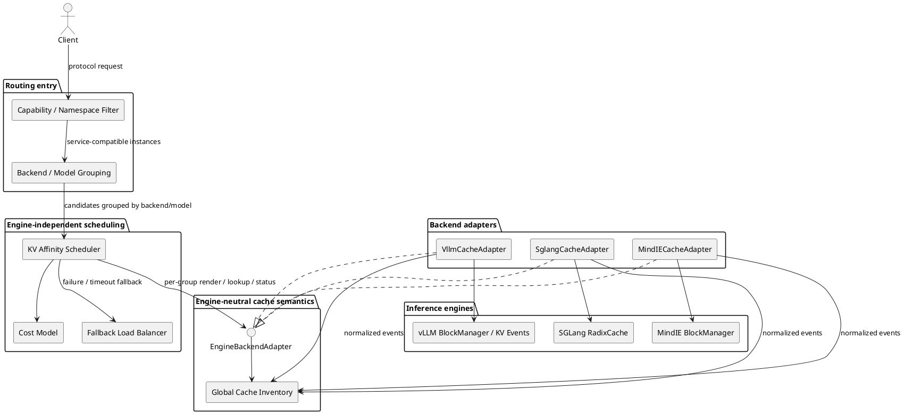

# KV 亲和性调度的多推理引擎后端扩展设计

> 面试问题：当前 KV 亲和性调度依赖 vLLM 的 KV block 与 KV Events，后续如何将这项能力扩展到 SGLang、MindIE 或其他自研推理引擎？

## 1. 先回到 KV 亲和性调度的本质

LLM 的 Prefill 会为输入序列中的每个 token 计算各层 Attention 的 K/V，并把结果写入 KV Cache。假设两个请求是：

```text
请求 A = [system prompt] + [tools] + [用户问题 A]
请求 B = [system prompt] + [tools] + [用户问题 B]
```

如果前两段经过模板和 Tokenizer 后得到相同的 token 前缀，那么 B 不需要重新计算这段前缀的 KV，只需要复用 A 已经生成的 KV，再从第一个不同 token 开始继续 Prefill。

因此，KV 亲和性调度真正解决的是：

```text
对一个新请求，找出哪个实例已经保存了它从 token 0 开始的最长连续前缀 KV，
并在“少做多少 Prefill”与“实例当前有多忙”之间选择收益最高的落点。
```

这里有三个不可省略的条件：

1. **必须从 token 0 连续命中**。只持有中间某一段 KV 没有用，因为自回归 Attention 的当前状态依赖之前完整前缀。
2. **比较的是实际进入引擎的 token 序列**。原始字符串相同，不代表经过 chat template、tools、Reasoning 或多模态处理后的 token IDs 相同。
3. **命中不是最终目标，减少计算才是目标**。命中很多但实例排队很长、KV 即将驱逐或需要高成本远程传输，仍可能不如落到空闲实例重新 Prefill。

所以最本质的输入和输出不是 block ID 或 radix node，而是：

```text
输入：引擎最终看到的 token_ids
查询结果：某实例从 token 0 开始可以连续复用多少 token
调度结果：复用收益 - 排队/传输/驱逐成本最大的实例
```

## 2. vLLM 如何复用 Prefix KV

### 2.1 KV 的组织方式

vLLM 用 PagedAttention 将 KV Cache 切成固定大小的物理 block。每个请求维护一张 BlockTable，把逻辑 token block 映射到 GPU 上的物理 KV block。

启用 Automatic Prefix Caching 后，vLLM 会为完整 token block 计算链式 Hash：

```text
H0 = Hash(tokens[0:block_size], extra_keys)
H1 = Hash(H0, tokens[block_size:2*block_size], extra_keys)
H2 = Hash(H1, tokens[2*block_size:3*block_size], extra_keys)
```

`extra_keys` 用于隔离 LoRA、多模态输入、cache salt 等语义。链式 Hash 保证第二个 block 的身份不仅取决于本 block token，还取决于此前完整前缀。

### 2.2 新请求如何命中

假设一个请求被切成：

```text
请求 token blocks：B0 → B1 → B2 → B3
实例 X 已缓存：   B0 → B1 → B2
```

vLLM 从 B0 开始连续查 Hash：

- B0 命中，继续；
- B1 命中，继续；
- B2 命中，继续；
- B3 miss，停止。

最终复用 3 个完整 block，对外应表达成：

```text
matched_tokens = 3 * block_size
```

命中后的物理 block 通过引用计数共享；未命中的部分再申请新 block 做 Prefill。可驱逐 block 通常由 LRU 类策略管理，正在被请求引用的 block 不能驱逐。

### 2.3 对跨实例调度意味着什么

单个 vLLM 实例自己的 BlockManager 知道本实例有哪些 KV，但普通多实例 Router 不知道。要做精确亲和，需要把各实例的：

```text
BlockStored / BlockRemoved / AllBlocksCleared
```

转换为全局 Cache Directory。Motor 当前使用 Mooncake Conductor 维护这份目录，再用请求 token IDs 查询每个实例连续命中的 block 数。

因此，当前 Motor 与 vLLM 的绑定点不是“亲和算法只能理解 vLLM”，而是：

- 元数据来源是 vLLM KV Events；
- Prefix Key 是 vLLM 的 block hash chain；
- 查询粒度由 vLLM block size 决定。

## 3. SGLang 如何复用 Prefix KV

### 3.1 KV 的组织方式

SGLang 的 RadixAttention 使用 Radix Tree 管理可复用前缀。树的一条边保存一段 token ID 序列，边对应的 value 保存这段 token 在 GPU KV Pool 中的物理索引。

例如缓存过三个请求后，树可能是：

```text
[1, 2]
  ├─ [3]
  └─ [4, 5]
       └─ [6, 7]
```

查询 `[1, 2, 4, 5, 8]` 时，RadixCache 会沿树匹配 `[1, 2] → [4, 5]`，在 token `8` 处分叉，因此返回 4 个 token 对应的 KV indices。

### 3.2 Radix Tree 与 Block Hash 的差异

| 维度 | vLLM APC | SGLang RadixCache |
|---|---|---|
| 索引结构 | 链式 block hash table | 压缩 token Radix Tree |
| Key 粒度 | 完整 token block | 一段可变长 token 序列；分页模式下按 page 对齐 |
| 命中方式 | 从 B0 开始连续查 Hash | 沿树做最长公共前缀匹配，必要时分裂边 |
| 返回内部结果 | 可复用物理 block | 可复用 KV pool indices + 匹配终点节点 |
| 引用保护 | block `ref_cnt` | 节点及祖先 `lock_ref` |
| 驱逐 | 空闲 block 的 LRU 类回收 | 从未锁定叶子开始的 LRU/LFU/优先级级联驱逐 |
| 调度局部性 | APC 主要负责命中与共享 | LPM/DFS_WEIGHT 还能调整引擎内 waiting queue 顺序 |

两者数据结构不同，但回答的是同一个问题：

```text
给定 token_ids，当前实例能从 token 0 开始复用多少 KV？
```

因此调度层不需要知道 SGLang 是否发生了 Radix edge split，也不需要知道 vLLM 返回了哪些物理 block。它只需要统一后的 `matched_tokens` 和资源状态。

### 3.3 需要区分 SGLang 引擎内缓存与 Gateway 路由

SGLang 有两层容易混淆：

- **引擎内 RadixCache**：是真实 KV Cache 索引，知道 GPU 中实际有哪些 token 前缀和 KV indices。
- **外层 Gateway 的 cache-aware tree**：常见生产路径根据历史路由维护字符级近似树，记录“之前把类似文本发给了哪个 worker”，并不等于读取引擎内 RadixCache 真值。

近似 Gateway 的好处是零事件同步、接入简单；缺点是字符不等于 token、无法感知真实驱逐、多个 Gateway 副本之间还可能状态分裂。要达到 Motor + Conductor 的精确程度，SGLang 后端同样需要把引擎内 RadixCache 的查询或生命周期事件暴露给全局目录。

## 4. 从两种实现中抽取最小公共语义

把两条链路并排来看：

```text
vLLM:
token_ids → 切固定 block → 计算 hash chain → 连续查 block → matched_tokens

SGLang:
token_ids → 构造 RadixKey → 沿 Radix Tree 做 LCP → 返回 KV indices → matched_tokens
```

差异都发生在 `token_ids` 与 `matched_tokens` 之间。因此屏蔽引擎时，最稳定的抽象边界就是：

```text
PrefixCacheBackend.match(token_ids, namespace) -> PrefixHit

PrefixHit
- matched_tokens
- cache_tier
- estimated_transfer_cost
- confidence
```

但只有查询接口还不够。跨实例 Router 还需要知道：

- **状态怎么建立**：直接向实例逐个查询，或订阅事件建立中心目录；
- **状态怎么删除**：收到 Removed/Cleared 或 TTL 到期；
- **结果是否可信**：精确事件、直接查询，还是根据路由历史推测；
- **命中能否兑现**：实例是否健康、KV 是否有容量、队列是否过载。

因此最小公共能力可拆成四组：

| 能力 | 本质问题 | vLLM 实现 | SGLang 实现 |
|---|---|---|---|
| Request Render | 引擎最终看到哪些 token？ | vLLM 同源 Renderer | SGLang 同源 tokenizer/template endpoint 或 sidecar |
| Prefix Lookup | 当前实例命中多少 token？ | hash chain 连续命中 | `RadixCache.match_prefix` |
| Cache Lifecycle | 全局目录如何保持真值？ | BlockStored/Removed/Cleared | Radix 节点 Insert/Evict/Clear 事件或直接查询 |
| Instance State | 命中是否值得选择？ | queue、free blocks、KV utilization | running queue、KV pool capacity、radix evictable/protected size |

这四组能力就是后续 Adapter 接口的来源，而不是为了“代码好看”人为增加一层抽象。

## 5. 跨实例 KV 亲和调度的完整决策链

对任意底层引擎，一次调度都可以统一为：

```text
① Render：请求 → 目标引擎真正使用的 token_ids
② Filter：筛出能承载该模型和请求特性的健康实例
③ Locate：查询各实例从 token 0 开始的 matched_tokens
④ Normalize：把 block/radix 结果统一成 PrefixHit
⑤ Score：计算 Prefill 节省 - 排队 - 传输 - 驱逐/过期风险
⑥ Select：选最高收益实例；任何关键能力失败则回退 LoadBalance
⑦ Feedback：记录实际 prefix hit、TTFT 和驱逐，校准后续决策
```

最朴素的目标函数是：

```text
saved_prefill_tokens = matched_tokens
```

更准确的工程目标是：

```text
saved_prefill_ms = T_prefill(input_tokens)
                 - T_prefill(input_tokens - matched_tokens)

net_benefit = saved_prefill_ms
            - queue_delay_ms
            - kv_transfer_ms
            - eviction_and_staleness_risk
```

这也解释了为什么不能简单写“选最长命中实例”：KV 亲和的目标是减少端到端代价，不是把命中率指标本身做高。

## 6. 屏蔽底层引擎的总体架构



职责划分：

1. Capability/Namespace Filter 先排除不能执行该模型、协议或请求特性的实例。
2. 候选实例按 backend/model namespace 分组，每组调用自己的 Render Adapter 生成引擎真实 token IDs。
3. Backend Adapter 把 vLLM block hash、SGLang radix node 或 MindIE BlockTable 转换成 `PrefixHit`。
4. Global Cache Inventory 可选择事件驱动，也可由 Adapter 直接查询；上层不关心目录如何构建。
5. 通用调度器把不同后端返回的收益统一到时间/成本量纲后再排序。
6. Adapter、目录或 Render 异常时回退普通负载均衡，KV 亲和不能成为服务可用性的硬依赖。

## 7. 统一数据模型

### 7.1 请求前缀描述

```text
RenderedRequest
- request_id
- engine_type
- model_id
- model_revision
- tokenizer_fingerprint
- chat_template_version
- cache_salt / tenant_id
- token_ids
- input_length
```

`tokenizer_fingerprint` 至少需要覆盖 Tokenizer 文件或 revision；对于工具调用、Reasoning 和多模态模型，还需要保证 chat template、tools 序列化、Harmony/特殊协议和多模态占位符处理一致。

如果候选实例混合了多个引擎后端，不能默认一次 Render 的结果适用于所有后端。更稳妥的流程是先按 `engine_type + model namespace` 分组，每组调用自己的 Render Adapter；只有 Tokenizer 和模板指纹完全一致时，才可以复用同一份 token IDs。

### 7.2 统一命中结果

```text
PrefixHit
- instance_id
- endpoint / dp_rank
- engine_type
- compatibility_domain
- matched_tokens
- cache_tier              # GPU / CPU / remote store
- estimated_transfer_ms
- kv_utilization
- free_capacity
- queue_load
- event_version
- updated_at
- confidence
```

`confidence` 用于区分精确索引与近似索引：订阅真实 Stored/Removed 事件或直接查询引擎的结果可以标为高置信；仅根据历史路由构建的本地树应标为低置信，并在成本函数中施加惩罚。

### 7.3 两种“兼容”不要混淆

对于统一路由，需要区分：

- **服务能力兼容**：某实例能否正确执行该请求，例如模型、API、Tokenizer、Tool Call 与多模态能力是否匹配。满足后即可作为路由候选。
- **KV 数据兼容**：某实例能否直接消费另一个实例产生的 KV tensor。它还要求 KV layout、dtype、Attention 类型和并行布局一致。

单纯的亲和路由只要求第一种兼容：调度器可以同时比较“vLLM 实例自己的缓存收益”和“SGLang 实例自己的缓存收益”，选中后在对应实例本地复用 KV。只有要跨实例、跨后端搬运同一份 KV 时，才需要第二种兼容。

### 7.4 KV 数据兼容域

只有以下关键属性兼容的实例才能直接共享或传输同一份 KV 数据：

```text
model + revision
tokenizer + chat template
attention type: MHA / GQA / MLA
KV dtype / quantization
TP / DP / CP layout
RoPE and cache salt semantics
engine KV layout version
```

第一阶段通常把 `engine_type` 也放入 KV 数据兼容域，即 vLLM 的 KV 只在 vLLM 实例之间搬运，SGLang 的 KV 只在 SGLang 实例之间搬运。它们仍可同时参与统一路由：调度器分别查询各实例的本地命中收益，再选择最终后端；只是不能拿 vLLM 产生的 KV tensor 直接塞给 SGLang。

## 8. EngineBackendAdapter 接口

建议把面向一种推理引擎的能力收敛成 Adapter，而不是暴露底层 Block/Radix 结构：

```text
EngineBackendAdapter

render(request, model_namespace) -> RenderedRequest
lookupPrefix(rendered_request, candidates) -> list[PrefixHit]
getInstanceStatus(instance_ids) -> list[InstanceStatus]

registerInstance(instance) -> Result
unregisterInstance(instance_id) -> Result

watchCacheState(instance) -> EventStream       # 可选：事件模式
refreshCacheSnapshot(instance) -> Snapshot     # 可选：事件恢复
```

Adapter 可以采用两种实现模式：

| 模式 | 做法 | 优点 | 代价 |
|---|---|---|---|
| Direct Query | 每次向各实例/sidecar 查询真实 Prefix Cache | 实现直观、状态最新 | 请求扇出随实例数增长，查询可能进入热路径 |
| Event Directory | 订阅缓存事件，在中心维护每实例目录 | 查询快、适合大规模实例 | 需要处理事件丢失、乱序、重启和 replay |

通用调度层只依赖 `lookupPrefix()`，不关心 Adapter 选择了哪一种模式。小规模或接入初期可以 Direct Query；规模化后建议切换事件目录。

事件的名称可以统一，但事件中的 Prefix Key 允许保留后端内部表示：vLLM Adapter 可以使用 block hash chain，SGLang Adapter 可以使用 token/page Radix 路径。真正必须统一的是查询结果 `PrefixHit`，不是目录内部如何存 Key。

事件语义至少包括：

```text
CacheStored
- instance_id
- compatibility_domain
- logical_prefix_key
- token_count
- cache_tier
- event_version

CacheRemoved
- instance_id
- logical_prefix_key
- event_version

CacheCleared
- instance_id
- event_version
```

事件需要具备实例 epoch 或单调递增版本，防止实例重启后旧事件覆盖新状态。全量 replay/快照与增量事件应当组合使用，避免订阅断连造成永久脏索引。

## 9. 各后端的适配方式

### 9.1 vLLM Adapter

现有 Motor + Conductor 路径可作为第一个 Adapter：

- 使用引擎同源 Render 获得 `token_ids`；
- 订阅 `BlockStored`、`BlockRemoved`、`AllBlocksCleared`；
- 在 Adapter/Conductor 内维护 vLLM 链式 block hash 与 block size，查询时必须从第一个 block 开始连续命中；
- 向上层只返回 `matched_tokens`、DP rank、缓存层级和新鲜度；
- 对同一个实例使用 `BlockRemoved/Cleared` 删除目录状态，实例重启后用 epoch/replay 重建；
- Conductor 查询超时或事件链异常时回退 LoadBalance。

### 9.2 SGLang Adapter

SGLang Adapter 可以分三步演进：

1. **近似路由复用**：直接复用 Gateway 历史字符树，快速接入，但返回结果标记为低置信；字符前缀需要换算成保守收益，不能冒充真实 token 命中。
2. **直接精确查询**：在 Engine 或 sidecar 暴露只读接口，内部调用 `RadixCache.match_prefix(token_ids)`，将 KV indices 数量转换为 `matched_tokens`。它最容易验证正确性，但不能让 Router 对大量实例逐个同步请求。
3. **事件目录模式**：在 RadixCache 的 insert、evict、clear 等生命周期点发布事件，由 SGLang Adapter 维护中心化 Radix/Prefix Directory；Router 查询目录，避免每请求对所有实例 fan-out。

适配时还要处理 SGLang 特有语义：

- `page_size > 1` 时命中必须向下对齐 page 边界；
- `match_prefix` 可能在匹配落到 Radix edge 中间时触发节点分裂，因此精确查询最好进入引擎 Scheduler/Cache Manager 所在的串行执行域，不能由外部线程无锁读取树结构；
- `extra_key` 隔离 LoRA、cache salt 等命名空间；
- `lock_ref > 0` 的路径不可驱逐，目录可利用 protected/evictable 信息估计命中存活概率；
- HiCache 场景要区分 GPU、Host 和远端层，不能把 L2/L3 命中当作零成本 L1 命中；
- EAGLE bigram 等特殊视图应由 Adapter 在内部处理，上层仍只接收普通 token 数和成本。

### 9.3 MindIE 或其他自研后端 Adapter

需要在 PrefixCache/BlockManager 层补三类能力：

- `FindLongestPrefix(token_ids)`：返回可复用 token 数，而非内部 block 数；
- `Stored/Removed/Cleared` 事件：真实反映缓存生命周期；
- `GetCacheCapacity()`：返回 KV 水位、空闲 block 和预计可接纳的 uncached tokens。

如果已经存在 BlockTable、PrefixCache allocator 或 KV Pool，应由 Adapter 翻译这些内部结构；不应为了适配调度层重写引擎的缓存管理。

## 10. 通用调度成本函数

最长命中不是最终目标，最终目标是降低端到端延迟并避免热点。建议使用统一成本模型：

```text
benefit(i) = estimate_prefill_time(input_tokens)
           - estimate_prefill_time(input_tokens - matched_tokens_i)

cost(i) = estimated_queue_delay_i
        + estimated_remote_kv_transfer_i
        + eviction_or_preemption_risk_i
        + metadata_staleness_penalty_i

score(i) = benefit(i) - cost(i)
```

并增加硬约束：

```text
instance is healthy
instance belongs to compatibility domain
free_blocks >= required_uncached_blocks + safety_margin
request does not violate engine/model capability constraints
```

不同缓存层的命中可以先折算为有效命中：

```text
effective_match = w_gpu * gpu_matched_tokens
                + w_cpu * cpu_matched_tokens
                + w_remote * remote_matched_tokens

w_gpu > w_cpu > w_remote
```

权重不应长期依赖手工经验值。上线后应根据 `预期命中 - 引擎实际命中`、排队时间、传输时间和 TTFT 反馈做离线拟合或在线校准。

## 11. 与 MindIE BatchScheduler 的衔接

外层亲和调度解决“去哪台实例”，引擎内 BatchScheduler 解决“到了实例后何时执行、执行多少”。为了兑现外层收益，路由结果应向 BatchScheduler 传递：

```text
matched_tokens
uncached_tokens
cache_tier
estimated_transfer_bytes / transfer_ms
cache_confidence
request priority / deadline
```

BatchScheduler 可据此实现：

- 按 `uncached_tokens` 申请 KV block，而不是按完整输入长度估算新增容量；
- 远程 KV 未到位时进入 `WAITING_FOR_REMOTE_KVS`，由完成事件驱动回到可调度队列；
- 在 Chunked Prefill 中优先处理高收益且资源已就绪的请求；
- 抢占时考虑已计算进度、Prefix 热度和重算成本，减少驱逐高价值公共前缀；
- 把实际 prefix hit、KV 水位、驱逐和排队时间回传给全局调度器，形成闭环。

完整的 BatchScheduler 分层和请求生命周期见 [00-PyServer-BatchScheduler整体架构调研.md](./00-PyServer-BatchScheduler整体架构调研.md)。

## 12. 故障与降级设计

KV 亲和是性能优化，不应升级为可用性单点：

| 故障 | 处理 |
|---|---|
| Render/tokenize 失败 | 不使用残缺 token 序列，直接回退 LoadBalance |
| Adapter 查询失败或超时 | 回退 LoadBalance，记录后端和原因 |
| 缓存事件断流 | 降低该实例 cache confidence，触发 snapshot/replay |
| 元数据过期 | 对命中收益增加 staleness penalty，超过 TTL 后视为无命中 |
| Engine 不支持精确查询 | 使用低置信近似模式或关闭该后端的 KV 亲和 |
| 实际命中低于预期 | 统计假命中并降低对应实例/Adapter 的置信度 |

## 13. 分阶段落地计划

### P0：抽象调度语义

- 定义 `RenderedRequest`、`PrefixHit`、服务能力域与 KV 数据兼容域；
- 从现有 vLLM + Conductor 逻辑中抽出 `VllmCacheAdapter`；
- 保持现有行为不变，先完成架构解耦和回归测试。

### P1：接入 SGLang

- 优先实现精确 `match_prefix(token_ids)` 查询；
- 补 RadixCache 插入/驱逐/清空事件；
- 对照同一流量验证 `expected_match` 与 `actual_match`。

### P2：接入 MindIE 自研后端

- 在 BlockManager/PrefixCache 层提供最长前缀和事件接口；
- 输出 KV 水位与 free blocks；
- 与 BatchScheduler 打通 `matched/uncached_tokens` 和远程 KV 状态。

### P3：成本模型与闭环优化

- 引入排队时间、KV 容量、传输成本和元数据新鲜度；
- 增加热点 Prefix 防 Herding、预测条目与副本放置；
- 根据实际 TTFT/TPOT 和命中兑现率校准权重。

## 14. 验证指标与测试矩阵

### 14.1 核心指标

- Render/tokenize P50/P99；
- Adapter 查询 P50/P99、超时率；
- 预期命中 token 与实际命中 token 的差值；
- 假阳性率、假阴性率；
- KV cache utilization、驱逐率、抢占率；
- TTFT P50/P99、TPOT P50/P99、吞吐；
- KV 亲和回退到 LoadBalance 的比例和原因。

### 14.2 最小测试矩阵

| 维度 | 用例 |
|---|---|
| 引擎 | vLLM、SGLang、MindIE/Mock Engine |
| Prefix | 全命中、部分命中、无命中、短于一个 block |
| 生命周期 | Stored、Removed、Cleared、实例重启、事件重放 |
| 一致性 | tokenizer revision、template、tools、cache salt 不一致 |
| 负载 | 空载、热点 Prefix、高 KV 水位、并发 Herding |
| 故障 | Render 失败、Adapter 超时、事件断流、索引过期 |

## 15. 面试口述版

### 60 秒版本

> KV 亲和的本质是把请求发到已经保存最长连续前缀 KV 的实例，少做重复 Prefill。vLLM 和 SGLang 的底层实现不同：vLLM 把 token 切成固定 block，用链式 hash 从 B0 开始连续匹配；SGLang 用 token Radix Tree 做最长公共前缀查询，返回对应 KV pool indices。但它们最终都能归一成“当前实例从 token 0 开始命中了多少 token”。因此我会把 Render、Prefix Lookup、缓存生命周期和实例容量抽成 `EngineBackendAdapter`，上层只消费 `matched_tokens`、预计 Prefill 节省、负载和 KV 水位；vLLM Adapter 翻译 block hash/KV Events，SGLang Adapter 翻译 `RadixCache.match_prefix` 或 Radix 生命周期事件，自研引擎则从 BlockManager 暴露同样能力。这样统一的是调度语义，不强行统一 block/radix 数据结构；异常时回退 LoadBalance。跨引擎直接搬 KV 还需要解决 layout、dtype 和并行切分，是另一层数据面问题。

### 追问：为什么不直接统一 Block ID？

> 因为 block ID 只在单个引擎实例内部有意义，而且不同引擎 block size 不同。调度真正关心的是能少算多少 token、能省多少 Prefill 时间，所以统一量纲应是 `matched_tokens` 或 `estimated_prefill_saved_ms`。

### 追问：SGLang 没有和 vLLM 一样的事件怎么办？

> 最优方案是在 RadixCache 生命周期上补插入、驱逐和清空事件；短期可以直接查询 `match_prefix`，或用带 TTL 的近似树降级，但必须标记低置信度，不能把路由历史当成引擎缓存真值。

### 追问：支持多个后端是否意味着可以跨后端复用 KV？

> 不意味着。第一阶段是统一调度能力，KV 仍在同一兼容域内复用。跨后端传输还需要解决 tensor layout、block size、dtype、Attention 类型和并行切分等兼容问题，是独立的数据面工程。

## 16. 一句话收口

> 多后端扩展时，应该抽象“缓存能力与调度语义”，而不是抽象 vLLM 的 KV block；通过引擎同源 Render、服务能力过滤、KV 数据兼容域和 Backend Adapter，让不同推理引擎共享一套 KV 亲和决策，同时保留各自的缓存实现与演进空间。
