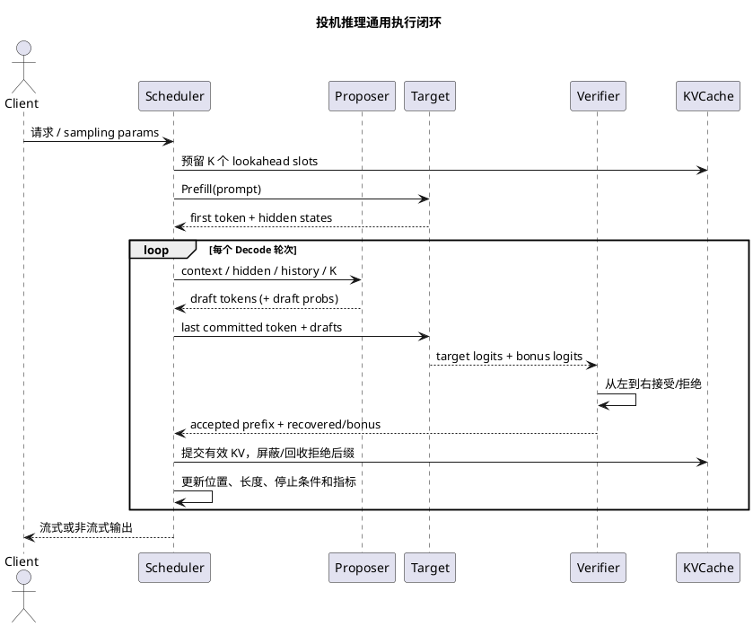
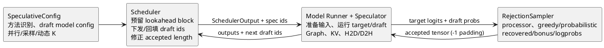

# MindIE 与 vLLM 投机推理：从算法设计到工程实现

> 目标：建立一份可以同时用于架构设计、源码走读、性能调优、故障排查和技术面试的投机推理全景文档。本文不只介绍 draft-verify 算法，还追到调度器、输入展开、Attention Mask、KV Slot、采样校验、异步流水、Graph、指标和测试。

## 1. 调研范围、快照与结论口径

本文以仓库内两份源码快照为事实基线：

| 项目 | 快照 | 时间 | 主要范围 |
|---|---|---|---|
| MindIE-LLM | `238c543c3ce34e64260d1a4ed99c3e210f13793f` | 2026-06-23 | `mindie_llm/text_generator/plugins`、Generator、C++ Scheduler/BlockManager、官方中英文档 |
| vLLM | `8df14cfc8c8a09b4e57f082e59593a3abce4ffb3`，`v0.23.1rc0-1050` | 2026-07-12 | V1 Scheduler、GPU Model Runner V1/V2、Speculator、Rejection Sampler、配置与测试 |

所有“支持”“限制”默认只对上述快照成立。两点需要特别注意：

1. **公开用户文档、配置类型和主线源码可能不同步。** 例如 MindIE 用户文档把 MTP 推荐范围写成 1～2，而参数校验代码允许到 5；vLLM 的概览文档对 rejection 配置的命名与当前 `SpeculativeConfig` 也存在版本差异。生产部署应以实际安装版本的配置类、启动日志和模型支持矩阵为准。
2. **源码出现不等于稳定产品能力。** vLLM 快照中的 DFlash、DSpark、部分 Model Runner V2 路径和 custom proposer 应视为快速演进或实验能力；本文会明确标注，不把它们与稳定文档能力混为一谈。

一句话结论：

> MindIE 的核心是“插件改写一次 Generator 执行”：`mtp / la / memory_decoding` 分别生成草稿，统一改写 input、mask、slot、sampling 和 cache；vLLM 的核心是“统一 proposer + scheduler + model runner + rejection sampler”：不同草稿算法接入同一验证闭环，并把 batch 内变长、异步调度和 GPU 化做得更彻底。

## 2. 投机推理到底优化什么

### 2.1 Decode 为什么慢

自回归 Decode 每轮只生成一个 token。小 Batch 时，一次前向的矩阵乘规模不大，却仍要从 HBM 搬运大量模型权重，通常是 memory-bound。投机推理用额外、便宜的草稿计算，尝试让一次昂贵 Target 前向验证多个位置，从而减少 Target 执行轮数。

它不是无条件提高吞吐的技术，而是把空闲算力兑换为更少的串行轮次：

```text
普通 Decode： Target -> 1 token -> Target -> 1 token -> ...

投机 Decode： Draft  -> K 个候选
             Target -> 一次验证 K 个候选并额外给出 bonus
             Verify -> 提交 1..K+1 个正确 token
```

### 2.2 性能模型

设：

- `K`：每轮草稿 token 上限；
- `T_base`：普通 Target Decode 一步耗时；
- `T_draft(K)`：生成草稿的耗时；
- `T_verify(K, B)`：Target 对 Batch `B` 中草稿展开后的验证耗时；
- `T_overhead`：输入重排、采样、D2H/H2D、调度和缓存修正开销；
- `alpha_i`：前 `i-1` 个已接受时，第 `i` 个草稿仍被接受的条件概率。

一轮期望提交 token 数为：

```text
E[L] = 1 + sum(i=1..K, product(j=1..i, alpha_j))
```

前面的 `1` 是“第一个拒绝位置的 Target token”或“全部接受后的 bonus token”。近似加速比为：

```text
Speedup ~= T_base * E[L] / (T_draft + T_verify + T_overhead)
```

因此所有工程优化最终只做三件事：

- 降低 `T_draft`：轻量 MTP/EAGLE、n-gram、并行草稿、共享权重、Graph；
- 提高 `E[L]`：更强的 drafter、领域匹配、低熵生成、动态树/Markov 依赖；
- 控制 `T_verify`：动态 K、低并发启用、高并发缩短或关闭、避免无效 padding。

### 2.3 什么时候会负优化

| 场景 | 原因 | 典型表现 |
|---|---|---|
| 高并发、大 Batch | `B * (K+1)` 让 Verify 进入 compute-bound | 吞吐下降、TPOT 上升 |
| 高温度/高熵生成 | 接受率低，草稿大量作废 | `E[L]` 接近 1 |
| Draft 太大或跨卡通信重 | 起草成本吃掉节省的 Target 步数 | Draft latency 接近 Verify latency |
| 输出很短 | Decode 收益不足以摊销 Prefill 和初始化 | E2E 基本无变化 |
| 草稿挤占 KV/权重显存 | 最大 Batch 或 KV 容量下降 | OOM、抢占、吞吐下降 |
| 复杂 Logits Processor | 每个草稿位置都要重放状态 | sampler 开销明显增大 |

## 3. 正确性：不是“猜中就返回”这么简单

### 3.1 Greedy 校验

Greedy 场景最简单。Target 在草稿前缀上并行计算每个位置的 argmax，从左到右比较：

```text
draft:  d1 d2 d3 ... dK
target: t1 t2 t3 ... tK bonus
```

- `d1 == t1` 时继续比较下一位；
- 第一个 `di != ti` 时，提交此前接受的草稿和 `ti`，丢弃后缀；
- 全部相等时，提交 K 个草稿和 bonus。

只要 Target 第 `i` 个 logits 的前缀在此前均相等，它就与普通自回归第 `i` 步的 logits 相同，所以输出逐 token 等价。

### 3.2 概率采样与拒绝采样

若草稿模型按分布 `q` 采样，Target 分布为 `p`，标准无损算法对草稿 token `x` 使用：

```text
accept(x) = min(1, p(x) / q(x))
```

拒绝时不能简单再从 `p` 采样，否则会重复计算已被 `q` 覆盖的概率质量；应从修正分布采样：

```text
p_recover(x) = normalize(max(p(x) - q(x), 0))
```

全部接受才从 Target 的下一位置分布取 bonus。这样最终序列分布与只用 Target 采样一致，差异仅来自浮点数值、随机数实现和 Batch 非确定性。

如果 proposer 没有提供完整 `q`，可以把草稿视为 one-hot 分布。vLLM 的 n-gram 路径正是这种处理：接受概率退化为 `p(draft_token)`，拒绝恢复分布等价于从 `p` 排除该草稿 token 后重采样。

### 3.3 “Target 采样后逐 token 相等”也可以无损

MindIE 三类插件的源码主路径不是显式计算 `p/q`，而是先对 Target 每个验证位置完成采样，再把草稿与 Target 样本逐位比较。第一个不相等处提交 Target 样本。

对第一位，输出 `y` 的概率是：

```text
P(output=y)
= P(draft=y, target=y) + sum(x!=y, P(draft=x, target=y))
= q(y)p(y) + sum(x!=y, q(x)p(y))
= p(y)
```

后续位置在此前草稿与 Target 样本一致的条件下同理。因此该方式仍保持 Target 分布，但通常没有 `min(1,p/q)` 的最优接受率。源码函数名 `verify_greedy_one_batch` 容易造成误解：它实现的是“token equality 的前缀验证”，不应仅凭名字推断整条服务链只支持 temperature=0。

### 3.4 Logits Processor 必须逐位置重放

重复惩罚、presence/frequency penalty、bad words、min tokens、thinking budget、结构化输出都会依赖“到当前位置为止已经提交了哪些 token”。验证 K 个位置时，不能把请求级参数简单复制 K 次就结束，必须让第 `i` 个位置看到“真实历史 + 前 i-1 个草稿”。

这是实现中最隐蔽的正确性风险之一：模型原始 logits 没错，但 processor 使用了错误历史，最终仍会有损。vLLM 在 RejectionSampler 中显式组合历史与 speculative tokens，并为各位置重复 request metadata；MindIE 插件会展开 sampling metadata 和 `all_token_ids`。

## 4. 通用执行状态机



无论框架如何命名，都必须维护以下不变量：

| 不变量 | 违反后的后果 |
|---|---|
| 只有已接受 token 才能推进 committed length | 后续 position 与历史错位 |
| 拒绝后缀的 KV 不得被下一轮读到 | 输出静默错误，通常不会立刻崩溃 |
| 第 `i` 个验证 logits 必须对应正确前缀 | 校验失去数学意义 |
| EOS/stop/max length 要在多 token 输出上逐位截断 | 越界多返回 token |
| 每请求 K 可以不同，但 flatten/cumsum 索引必须一致 | Batch 间串 token |
| Sampling RNG 的消耗顺序必须可解释 | 同 seed 难以复现 |
| 结构化语法需验证整段草稿，而非只验证第一位 | 非法 token 穿透约束 |

## 5. MindIE：插件化投机推理总设计

### 5.1 能力分类

MindIE 快照中有三种 speculative plugin：

| 插件 | 草稿来源 | 是否需要额外模型权重 | 核心优势 | 主要场景 |
|---|---|---:|---|---|
| `mtp` | 模型原生 MTP 层 + Target hidden states | 是，模型自带 | 接受率高、语义对齐好 | DeepSeek 等原生 MTP 模型 |
| `la` | Jacobi 轨迹 + prompt/output n-gram map | 否 | 通用、无需小模型 | 对话、文本生成、重复模式 |
| `memory_decoding` | 输入输出历史构建的 Trie | 否 | 代码/检索类重复片段命中好 | 代码生成、模板化输出 |

`plugin_utils.py` 中 `SPECULATIVE_PLUGIN_LIST` 统一把三者标记为 Decode PA；`PluginManager.initialize()` 再按字符串动态导入对应类。插件不是只提供 `propose()`，而是完整参与：

```text
preprocess
  -> model_inputs_update     # 改 input_ids/position/slots/q_len/mask
forward
  -> sample_preprocess       # 展开 sampling metadata / logits
sample
  -> plugin_verify           # 取最长接受前缀
postprocess
  -> plugin_cache_update     # 更新 token map/trie/hidden states
  -> plugin_cache_clear      # 请求完成后清理
```

源码锚点：

- `MindIE-LLM/mindie_llm/text_generator/plugins/plugin_utils.py:9-38`
- `MindIE-LLM/mindie_llm/text_generator/plugins/plugin_manager.py:162-184`
- `MindIE-LLM/mindie_llm/text_generator/plugins/plugin_manager.py:201-279`

### 5.2 `speculationGamma` 是跨层容量契约

MindIE 的插件参数描述算法需要多少候选，而 `ModelDeployConfig.speculationGamma` 描述系统预留上限。两者不是重复字段：

- Generator 用 `max_generated_tokens = speculation_gamma + 1` 预留一次最多返回的 token；
- C++ Scheduler 按 speculative 长度扩大本轮 token/slot 预算；
- BlockManager 通过 `speculativeSlots_` 判断是否还能 append；
- 输出协议用 `speculativeTokenNum` 表示本轮实际有效 token 数；
- 插件 validator 保证算法展开规模不超过 Gamma。

参数校验关系为：

```text
lookahead:       (level - 1) * (window + guess_set_size) <= speculationGamma
memory_decoding: decoding_length <= speculationGamma
mtp:             max(K, 2*K - 2) <= speculationGamma
```

工程含义是：Gamma 不只是“最多猜几个”，还决定最坏情况下 Attention query、临时 slot、结果 tensor 和调度预算。配置过小会越界或启动失败；盲目配大则会减少可服务 Batch、增大静态 Graph shape。

### 5.3 MindIE 一轮执行

PluginManager 在普通插件路径调用：

```text
model_inputs_update_manager()
  -> generator_backend.forward(... q_lens, attn_mask ...)
  -> sample_preprocess_manager()
  -> generator_backend.sample()
  -> plugin_verify_manager()
  -> postprocess/cache_update
```

MTP 因为需要主模型与子模型输入、hidden states，走专用 forward 参数：

```text
forward(
  main_model_inputs,
  spec_mask,
  sub_model_inputs=mtp_model_inputs,
  hidden_states=last_target_hidden_states,
)
```

这揭示了 MindIE 的边界：调度器只为多 token 结果和 KV slot 提供资源语义，真正的算法发生在 Generator/Plugin/ModelRunner，不应表述为“C++ Scheduler 实现了 MTP”。

## 6. MindIE MTP 源码级流程

### 6.1 Prefill 对齐

假设 prompt 为 `A B C D`：

1. Target Prefill `ABCD`，采样得到 `E`，并输出最后层 hidden states；
2. MTP 输入 token 左移为 `B C D E`，同时接收 Target 对 `A B C D` 的 hidden states；
3. MTP 完成自己的 Prefill，建立与 Target 对齐的 KV Cache；
4. 本轮 MTP 额外算出的草稿被丢弃，保证后续 Decode 从统一状态开始。

“左移 token + 未左移 hidden”正是 MTP 的条件建模：用位置 `t` 的 Target 表征和真实 token `t+1` 去预测更远的 token。

### 6.2 Decode 与 Verify

以 `K=2` 为例：

```text
上一轮已提交：E

MTP-1(E, hidden(D)) -> f
MTP-2(f, hidden_mtp(E)) -> g

Target(E, f, g) -> F, G', H'

比较：f ?= F
      若相等，再比较 g ?= G'
      第一个不相等位置提交 Target token
```

因此 Target 的 query length 固定为 `K+1`：一个已提交 anchor 加 K 个 drafts。`plugin_verify()` 遍历草稿与 Target 采样结果，保存 `[已接受草稿前缀 + 1 个 Target token]` 的 indices，再把二维 speculative 输出 reshape 回每请求结果。

源码锚点：

- `plugins/mtp/decoding_policy.py`：构造 main/sub model inputs、展开 sampling 参数、缓存 hidden states；
- `plugins/mtp/mtp_plugin.py:239-294`：展开 logits 与逐位 verify；
- `docs/zh/developer_guide/architecture_design/mtp.md`：Prefill、第一次 Decode、后续 Decode 的完整张量示例。

### 6.3 固定 shape 与 padding trick

每个请求每轮都按 `K+1` 构造：

```text
input_ids:       [anchor, draft_1, ..., draft_K]
position_ids:    连续 K+1 个位置
q_lens:          每请求固定 K+1
hidden_states:   [(K+1)*BS, hidden_size]
```

第一轮或上一轮接受不足时，空位用 0 padding。这样做的收益是：

- MTP 多层复用同一组 input shape 和 LM-head indices；
- NPU Graph/算子编译 shape 稳定；
- Batch 内不同接受长度仍可合并执行。

代价是必须用 mask、真实长度和 slot mapping 阻止 padding 写坏 KV。

### 6.4 Batch 变化与原地回填

异步或 Continuous Batching 下，本轮 Batch 与上轮可能不同。MTP 用 sequence id 构造 `hit_mask`：

- 命中上轮请求：从上轮输出取实际 token 数和 hidden states，原地更新 MTP 输入；
- 新请求：走首次 Decode 初始化；
- 接受长度不足 K+1：补 0，但同时修正 LM-head index、position、context length；
- 根据 BlockTable 重新计算每个 token 的物理 slot；SP/CP 场景还要分 rank 计算 token 和 slot。

`fill_in_model_result()` 把这些更新尽量放到 device tensor 上，并只将必要长度元数据搬运到 Host。这是 MTP 能与动态 Batch 共存的关键，不是简单缓存“上一轮最后一个 hidden state”即可。

### 6.5 PD 分离的 dummy block trick

首次 Decode 需要 Prefill 的最后 hidden state，但 D 节点未必能从 P 节点拿到它。MindIE 的设计是：

- D 节点以全 0 hidden state 占位；
- MTP 第一层所需的正确 KV 已随 P->D KV transfer 到达；
- 第一轮 MTP 不应再覆盖这些 KV，于是把可能写入指向 dummy BlockTable。

这是“读正确缓存、写垃圾槽”的典型技巧：保持执行图和 tensor shape 不变，同时避免错误输入污染真实 KV。

### 6.6 MTP 限制要看产品文档，不看校验上限猜能力

当前用户文档将 `num_speculative_tokens` 描述为 1 或 2，并建议高吞吐场景不超过 1；源码 validator 虽允许到 5，但这只是通用资源保护上限，不代表任意模型有 5 层可用权重，也不代表性能为正。

同理，MTP 与 PD、CP/SP、异步调度、Prefix Cache、量化的组合支持依赖具体模型和部署形态。正确做法是同时核对：模型页支持矩阵、特性页限制、启动配置校验和实际权重中的 MTP 层数。

## 7. MindIE Lookahead Decoding

### 7.1 N/W/G 的含义

Lookahead 不加载小模型，而是在一次 Target 前向中组合两类工作：

- Jacobi trajectory：并行迭代未来 token，逐轮让候选稳定；
- n-gram verification：从 prompt 和已输出 token 中维护 `head_token -> N-1 token suffixes`，把最近的 G 组候选一起验证。

参数可理解为：

- `N = level`：候选 n-gram 长度，真正可额外接受 `N-1` 个 token；
- `W = window`：并行 Jacobi 窗口宽度；
- `G = guess_set_size`：同一 head 最多保留的候选 n-gram 数。

最坏展开量 `(N-1)*(W+G)`，因此 Gamma 必须覆盖它。

### 7.2 候选池与更新

`CacheEngine` 为每个 request 维护：

```text
requests_idx_mapping
token_map[head] -> 最近 G 个 (N-1)-gram
past_tokens      -> Jacobi 各层轨迹
input_tail_tokens / last_gen_tokens
need_cal_kv
```

Prompt 先进入 tail buffer，按滑窗提取 n-gram；Decode 每轮提交的新 token 再追加到池中。相同候选会被移动到末尾，不同候选超过 G 后淘汰最旧项，本质是一个轻量的 recency policy。

### 7.3 Attention Mask 是算法核心

一次前向中同时放入 Jacobi token 和多组猜测分支，如果仍使用普通 causal mask，各分支会互相看见，产生不存在于真实自回归路径的依赖。Lookahead 的 `make_single_mask()` 为每个猜测分支建立独立下三角区域，并控制各 Jacobi 行只能读取合法前驱。

所以该算法不是“把多段 token 拼起来 Forward”这么简单；正确性依赖：

- 每条候选分支只看共享前缀和本分支前驱；
- 不同 G 分支相互隔离；
- position id 对应逻辑深度而不是 flatten 后下标；
- Verify 只接受某条分支的最长相等前缀。

### 7.4 适用边界

Lookahead 的优点是不增加模型权重和独立 KV；弱点是候选来自上下文重复与 Jacobi 稳定性。输入短、输出高度开放或采样熵高时，G 个候选会消耗 Verify 算力却很少命中。

MindIE 用户文档还明确限制其与 PD 分离、Multi-LoRA、SplitFuse、长序列、MTP、异步调度和多机推理等组合；该限制是当前产品实现边界，不是 Lookahead 算法的理论限制。

## 8. MindIE Memory Decoding

### 8.1 Trie 知识库

Memory Decoding 将历史输入输出写入 Trie：

- 以当前 token 为起点查找后续路径；
- 节点分别记录 prompt 输入频次和跨请求/输出频次；
- 静态模式取最高频路径；动态/树模式可取多个分支并生成 tree mask；
- `max_size` 和 `max_output_size` 超限时衰减或裁剪旧输出节点；
- `ENV.performance_prefix_tree` 可切换 C++ `_PrefixTree` 加速实现。

这与 KV Prefix Cache 不同：Trie 存的是“可能出现的 token 后缀”，不是已经计算好的各层 K/V。它生成草稿后仍要 Target 验证。

### 8.2 输入、输出混合频次

节点频次按 `use_batch` 区分本请求输入模式，`-1` 表示输出历史。候选排序可以使用：

```text
mix_freq = (1 - output_weight) * input_freq
         + output_weight * output_freq
```

这样既能优先利用当前 prompt 中强相关的局部重复，也能从历史生成结果中借候选。代码生成、固定 JSON/SQL、检索答案模板因此通常比开放问答更受益。

### 8.3 动态候选长度

`dynamic_algo=true` 时，`DynamicBranch` 根据上一轮接受长度/验证长度计算命中率，并做 EWMA：

```text
filtered = alpha * current_hit_ratio + (1-alpha) * filtered
```

- 命中率低则 branch length 每次减 1；
- 命中率高则每次加 1；
- 大 Batch 直接回到较小初始值，避免验证展开过大；
- 最终还会受剩余输出长度、当前 KV Block 剩余 slot 和 `decoding_length` 限制。

这比固定 K 多了一层反馈控制，但阈值是源码中的经验参数，迁移到新硬件/模型前应重新标定。

## 9. vLLM：统一 Speculator 架构

### 9.1 方法矩阵

vLLM 的 `SpeculativeConfig` 快照包含以下方法：

| 方法 | 草稿来源 | 额外权重 | 草稿生成形态 | 成熟度口径 |
|---|---|---:|---|---|
| `ngram` / `ngram_gpu` | 当前请求 token 历史 | 否 | CPU NumPy/Numba 或 GPU KMP 类匹配 | 文档化；GPU 路径较新 |
| `suffix` | prompt tree + 全局历史响应 suffix tree | 否 | 动态长度、频率阈值 | 文档化 |
| `draft_model` | 独立小模型 | 是 | 自回归 K 步 | 文档化 |
| `parallel_drafting` / PARD | 支持并行预测的小模型 | 是 | 一次出 K 个 | 文档化 |
| `eagle` / `eagle3` | Target hidden features + 轻量头 | 是 | 特征/Token 自回归 | 文档化 |
| `mtp` | Target 原生 MTP 层 | 模型自带 | 自回归多步 | 文档化 |
| `medusa` | 多个预测头 | 是 | 并行多头 | 源码与 E2E 测试存在，概览非主推 |
| `mlp_speculator` | 多阶段 MLP 头 | 是 | 轻量自回归 | 文档化 |
| `dflash` | Block diffusion drafter | 是 | 并行 mask block | 快速演进能力 |
| `dspark` | 并行 backbone + 顺序 Markov bias | 是 | 半自回归 | V2 runner 源码/E2E，实验性较强 |
| `custom_class` | 用户实现 | 可选 | 自定义 | Experimental |

配置类型出现某 method 只代表解析层认识它。真正可运行还取决于 Model Runner 版本、模型 architecture、Attention backend、PP/DP/TP 和 checkpoint 格式。

### 9.2 四层职责



与 MindIE 相比，vLLM 把“草稿怎么产生”抽象得更窄，把验证和调度做成更统一的公共设施。

## 10. vLLM 一轮执行链

### 10.1 Scheduler：先调度上轮草稿

Request 持有 `spec_token_ids`。Scheduler 每轮：

1. 根据 token budget、KV block、max model length 决定每个请求能调度多少普通/草稿 token；
2. 把草稿写入 `scheduled_spec_decode_tokens`；
3. 为 Verify 和下一轮 proposer 预留 lookahead slots；
4. 若结构化输出启用，先用 grammar 裁剪草稿；
5. 若 chunked prefill、抢占或长度限制导致只能处理部分草稿，进行 trim/pad。

Model Runner 结束后把新草稿通过 `DraftTokenIds(req_ids, draft_token_ids)` 回填 Scheduler。同步调度在 engine step 间完成这次握手；异步调度则用 placeholder 和延迟修正避免阻塞。

### 10.2 Verify 输入是 ragged flatten

一个 Batch 的 K 不必相同，例如：

```text
num_draft_tokens = [3, 0, 2, 0, 1]
cu_num_draft     = [3, 3, 5, 5, 6]
num_sampled      = [4, 1, 3, 1, 2]
```

`SpecDecodeMetadata` 用 flatten tensor 加 cumulative offsets 描述：

- `draft_token_ids`：所有请求的草稿拼平；
- `target_logits_indices`：每个草稿位置对应哪个 Target logits；
- `bonus_logits_indices`：每个请求的 bonus logits；
- `logits_indices`：从模型总输出中 gather 所需位置。

这样既保留 per-request 变长，又避免 Python 循环逐请求运行 sampler。

### 10.3 Target Sample 与 RejectionSampler

Model Runner 先运行 Target 得到验证 logits，再调用统一 RejectionSampler：

1. gather bonus logits，使用普通 Sampler 处理 top-k/top-p 等参数；
2. gather target logits，转 FP32；
3. 针对每个 speculative prefix 应用 penalty、bad words、allowed ids、min tokens 等 processor；
4. 展开 temperature/top-k/top-p；
5. Greedy 请求走 Triton argmax equality 快路径；
6. Random 请求计算 target probs，按 `p/q` 接受并采 recovered token；
7. 输出固定 `[BS, max_K+1]` tensor，拒绝后缀填 `-1`；
8. parse 阶段再过滤 placeholder 和无效 logprobs。

源码锚点：

- `vllm/vllm/v1/sample/rejection_sampler.py:37-197`
- `vllm/vllm/v1/sample/rejection_sampler.py:394-507`
- `vllm/vllm/v1/sample/rejection_sampler.py:715-845`
- `vllm/vllm/v1/spec_decode/metadata.py`

### 10.4 Recovered sampling 的 GPU trick

Recovered 分布需要对大词表计算 `max(p-q,0)`。vLLM 不显式 normalize，而是用 exponential/Gumbel-max 等价采样：

```text
score[token] = corrected_prob[token] / Exp(1)[token]
recovered    = argmax(score)
```

argmax 对统一缩放不敏感，所以省掉归一化。Triton kernel 按词表 tile 做 local reduction，再归并最大值。另一个细节是 uniform random 使用 FP64，降低恰好采到 0 导致边界异常的概率。

### 10.5 Logprobs 的“先多算、后过滤”

为了避免 GPU->CPU 同步获取每个请求实际接受长度，vLLM 暂时对所有可能位置计算 accepted logprob；拒绝 token 先替换成 0 以避免 gather 越界，最后在 `parse_output()` 用 valid mask 过滤。

这是一种典型吞吐取舍：多做少量 GPU 计算，换掉一次会破坏流水的 CPU 同步。

## 11. vLLM Proposer 实现细节

### 11.1 n-gram：无模型草稿

CPU `NgramProposer` 在 token 历史中找与当前 suffix 匹配的最长 n-gram，再复制其后的 K 个 token。实现使用 LPS/KMP 风格线性匹配，Numba batch 路径避免 Python 热循环。

GPU 版本把 token history 常驻 GPU，减少 D2H，并异步只拷每请求有效草稿长度给 Scheduler。它适合代码、重复 prompt 和 agent 模板，高熵自然语言的收益较弱。

### 11.2 Suffix Decoding：跨请求历史

Suffix Decoding 不只查当前 prompt，还缓存历史请求响应到全局 suffix tree：

- `max_cached_requests` 控制 FIFO 请求级驱逐；
- `max_tree_depth` 限制 prefix match + speculation 总深度；
- `max_spec_factor` 让草稿长度随匹配前缀长度动态增长；
- `min_token_prob` 用频次估计过滤低置信候选。

与 MindIE Memory Decoding 的思想相近，但树组织、全局缓存边界和调度接入不同。

### 11.3 独立 Draft Model

Target 和 Draft 各有 ModelConfig、ParallelConfig、LoadConfig、KV Cache。实现要处理：

- Target/Draft tokenizer 和 vocab 一致性；
- Draft max model length 小于 Target 时按请求跳过 speculation；
- TP 通信与 rank 对齐；当前快照 V1 draft proposer 对 TP mismatch 有显式限制；
- Draft 权重量化和 Attention backend 可独立设置；
- probabilistic draft 需缓存完整 draft logits/probs，显存开销明显高于 greedy。

### 11.4 TLI 异构词表

`use_heterogeneous_vocab=true` 时，vLLM 在启动阶段：

1. 规范化两个 tokenizer 的 token string；
2. 建立 token-level intersection；
3. Draft logits 只允许公共 token；
4. 将 Draft token id 翻译到 Target id 后验证。

它不是任意 tokenizer 间无损映射：只覆盖可一一对应的公共 token，当前快照还限制 probabilistic draft。工程上应记录 intersection coverage；覆盖率低时接受率和文本域能力都会下降。

### 11.5 EAGLE/EAGLE3/MTP

三者复用 `SpecDecodeBaseProposer` / V2 speculator 基础设施：

- 接收 Target sampled token 和 hidden states；
- 准备 shifted token、position、slot 和 attention metadata；
- 运行轻量 drafter 多步；
- 每步采样后更新下一步输入；
- 需要时从 Target 多层 gather aux hidden states；
- 复用 Target embedding、LM head 或特定 KV group。

EAGLE3 的关键工程差异是多层 Target hidden feature，因此 Target forward 的计算图和输出签名会变化，相关 layer ids 也进入 config hash，防止错误复用编译图。

### 11.6 Parallel Drafting / DFlash

并行草稿不是把自回归 loop 粗暴并行化，而是模型训练时就支持在 mask block 中同时预测多个位置。vLLM 的 fused input kernel 每请求构造：

```text
[bonus/anchor, MASK, MASK, ..., MASK]
```

并一次完成：

- context/query position 生成；
- BlockTable -> slot mapping；
- mask token 写入；
- sampling indices 写入。

DFlash 还需要 non-causal drafter Attention、Target 多层特征上下文和额外 query slot。验证仍由 Target 的标准闭环完成。

### 11.7 DSpark：半自回归草稿

当前 V2 源码中的 DSpark 复用 DFlash 的并行 backbone，一次得到整个 block 的 base hidden/logits，然后用轻量 Markov head 左到右补块内依赖：

```text
base_logits[i] + markov_bias(previous_sampled_token)
```

工程 trick 包括：

- backbone 只跑一次，Markov 串行部分只是 embedding + bias head；
- reduced draft vocab 预计算 draft->target scatter index；
- FULL CUDA Graph 同时捕获并行 backbone 和顺序 Markov sampling；
- checkpoint 有 anchor-first 与 bonus-anchor 两种 layout，不能混用；
- 当前实现要求 non-causal attention，且不支持 pipeline parallelism。

这部分应标注为快照中的前沿实现，不应直接套用旧版 vLLM 运维手册。

## 12. KV Cache、Slot 与拒绝后缀

### 12.1 为什么不能“验证后 truncate tensor”

Target Verify 已经为草稿位置写过 KV。请求 A 接受 3 个、请求 B 只接受 1 个时，物理内存中可能都有 K 个位置的计算结果。下一轮必须确保：

- committed sequence length 只增加实际输出数；
- 被拒位置的 slot 不会成为下一轮有效历史；
- proposer 的 KV 也回到一致位置；
- Block 边界处额外预留的 slot 可安全复用或释放。

因此“逻辑回滚”比物理清零更常见：修正长度和 slot mapping，后续覆盖旧值即可。

### 12.2 vLLM 的 padding slot

vLLM fused kernel 识别四段区域：

```text
valid input | bonus | parallel draft slots | rejected slots
```

拒绝位置的 slot mapping 被设为 `PADDING_SLOT_ID`，阻止写 KV；位置超过 max model length 也走同一屏蔽路径。`is_rejected_token_mask` 与 `is_masked_token_mask` 分开保存，因为 MASK query 和 rejected tail 的语义不同。

### 12.3 MindIE 的预分配与 dummy slot

MindIE C++ BlockManager 用 `speculativeSlots_` 提前考虑一次追加多个 token。Python 插件再按 BlockTable、block size 和 context length 计算具体 slots。MTP 的 PD 首轮还会把不应落盘的 KV 指向 dummy BlockTable。

两者共同原则是：**静态执行形状可以保留，逻辑 KV 可见性必须严格按 accepted length 更新。**

## 13. 异步调度与动态 Batch

### 13.1 vLLM 的异步 Spec Decode

同步实现通常需要：本轮 Target 完成 -> CPU 得知接受长度/新草稿 -> Scheduler 下一轮。这个 D2H 依赖会形成气泡。

vLLM 使用 pinned CPU buffer、独立 copy stream 和 CUDA event 异步搬运 draft ids/valid counts；下一轮 batch 已开始准备时再消费结果。由于请求可能插入、完成或换位，GPU 侧维护：

```text
prev_positions
prev_num_draft_tokens
valid_sampled_token_count
num_computed_tokens
```

再用 fused/compiled correction：参与上轮投机的请求按 `prev_computed + valid_count` 修正，新请求或普通 Prefill 直接采用 CPU 真值。

异步优化的核心不是多开线程，而是把“上轮结果属于当前 Batch 哪一行”变成显式映射。

### 13.2 MindIE 的 Batch hit mask

MindIE MTP 用当前 sequence ids 与上轮 ids 做 `np.isin`，构造 request-level 和 token-level hit mask，再原地填入实际 token/hidden/slot。Lookahead/Memory Decoding 当前被参数校验明确排除异步推理；MTP 则存在专门的结果回填路径。

### 13.3 动态 K

固定 K 在低负载最优，不代表高负载也最优。两套框架都出现了动态思想：

- MindIE Memory Decoding：根据接受率 EWMA、Batch size、剩余 slot 动态调 branch length；
- vLLM Dynamic SD：配置 `(batch_start, batch_end, K)` 查表，高并发可令 K=0；
- DSpark 一类前沿方案还可进一步使用 per-token confidence，但生产调度必须考虑 Graph shape 和 collective 一致性。

vLLM 当前文档明确指出 Dynamic SD 与 DP 不兼容：不同 DP rank 独立观察到的 Batch 可能选择不同 K，collective shape 分叉会死锁，因此 DP 下自动退回静态 K。

## 14. Graph、编译与融合算子 trick

| Trick | 解决的问题 | 代价/约束 |
|---|---|---|
| 固定 `K+1` shape + placeholder | 避免每种接受长度重新编译 | 多算 padding，需严格 mask |
| Padded drafter batch | Graph key 更稳定、全 GPU 流水 | 请求间浪费与额外 slots |
| Ragged flatten + cumulative offsets | 支持每请求变长，减少 Python loop | 索引复杂、易 off-by-one |
| Fused input expansion kernel | 合并 token/position/slot/mask 更新 | kernel 需覆盖 Block 边界和 max length |
| Local argmax reduction | TP 下不 all-gather 全词表，从 `O(V)` 降到近似 `O(2*TP)` 通信 | 只适合 greedy/non-tree 等满足条件的路径 |
| FP32 target probs / FP64 uniform | 提升拒绝边界数值稳定性 | 少量转换与带宽成本 |
| Pinned memory + copy stream | 隐藏 D2H 草稿/长度同步 | 需要 event 生命周期管理 |
| 先计算后 filter logprobs | 避免为接受长度同步 CPU | 多做被拒位置计算 |
| Dummy/PADDING slot | 不改变图形状但禁止错误 KV 写入 | 必须保证 Attention 不读占位槽 |
| CUDA/ACL Graph 捕获 Draft loop | 降低 K 次轻量模型 launch 开销 | 动态 K、动态 shape 更难 |
| 共享 embedding/LM head | 降低 drafter 显存和带宽 | checkpoint architecture 必须严格匹配 |

Graph 优化前应先确认 Draft 真的是 launch-bound。若 Draft 已被 vocab projection、MoE 或通信主导，捕获 Graph 只能减少小部分开销。

## 15. MindIE 与 vLLM 设计对照

| 维度 | MindIE | vLLM |
|---|---|---|
| 扩展抽象 | Generator Plugin，多生命周期 hook | Proposer/Speculator，统一 Runner/Sampler |
| 主要硬件 | Ascend NPU / ATB / torch_npu | CUDA GPU 为主，平台抽象扩展 |
| 无模型草稿 | Lookahead、Memory Decoding | n-gram、n-gram GPU、Suffix |
| 模型草稿 | 原生 MTP | Draft model、EAGLE、MTP、Medusa、MLP、PARD、DFlash、DSpark |
| Verify | Target sample 与草稿逐位 equality | Greedy equality + 标准 probabilistic rejection |
| 变长表示 | 插件按 K+1 展开并 reshape | ragged flatten metadata + 固定输出 tensor |
| KV 处理 | speculativeSlots、BlockTable、dummy slot | lookahead blocks、padding slot、拒绝 mask |
| 动态长度 | Memory Decoding EWMA feedback | Batch-size schedule；部分 proposer 自带动态长度 |
| 异步 | MTP 专门适配；LA/Memory 当前限制 | async scheduler + pinned D2H + drift correction |
| 结构化输出 | 当前文档明确不与 MTP/投机叠加 | Scheduler grammar 裁剪 + sampler processor 适配，仍需按 method 测试 |
| 可观测性 | 插件统计/日志，LA 有 request statistics | Prometheus counters + mean/per-position acceptance |
| 配置风格 | `plugin_params` 是 JSON 字符串 + 全局 Gamma | `speculative_config` 嵌套对象，内部构造 draft configs |

抽象层面，MindIE 更像“插件拥有一次推理的多个阶段”，对硬件输入改写非常直接；vLLM 更像“框架拥有统一闭环，算法只负责 propose”，更利于新增 proposer 和统一正确性测试。

## 16. 如果从零实现：推荐分层

### 16.1 最小接口

```python
class DraftProposal:
    token_ids: Tensor           # flattened or [B, K]
    lengths: Tensor             # [B]
    probs: Tensor | None        # probabilistic rejection 可选
    state_delta: object         # proposer KV/hidden 的暂存更新

class Proposer:
    def prepare(self, committed_state, target_outputs, budget) -> object: ...
    def propose(self, prepared) -> DraftProposal: ...
    def commit(self, accepted_lengths) -> None: ...
    def rollback(self, accepted_lengths) -> None: ...

class Verifier:
    def build_target_batch(self, committed, proposal) -> VerifyBatch: ...
    def verify(self, target_logits, proposal, sampling_state) -> VerifyResult: ...

class SpeculationPolicy:
    def choose_k(self, load, acceptance_stats, memory) -> int: ...
```

接口里必须有 proposer state 的 commit/rollback；否则带 KV 的 Draft 模型迟早会因拒绝后缀状态漂移。

### 16.2 一轮伪代码

```text
K_per_req = policy.choose(batch, metrics, free_slots)
reserve_lookahead_slots(K_per_req)

proposal = proposer.propose(committed_state, K_per_req)
verify_batch = build_target_inputs(last_committed_token, proposal)
target_logits = target.forward(verify_batch)

result = verifier.verify(
    target_logits,
    proposal.tokens,
    proposal.probs,
    per_position_sampling_state,
)

for req in batch:
    commit output[:result.valid_len]
    commit target KV for valid prefix
    invalidate target KV for rejected suffix
    proposer.commit_or_rollback(result.accepted_drafts)
    apply eos/stop/max_len token-by-token

metrics.observe(drafted, accepted, draft_ms, verify_ms)
```

### 16.3 先做 Greedy，再做 Sampling

推荐实现顺序：

1. 单请求、固定 K、Greedy equality；
2. Batch 内不同接受长度；
3. EOS/stop/max length；
4. KV block 边界与抢占；
5. logits processors/structured output；
6. probabilistic rejection + draft probs；
7. async scheduler/Graph/dynamic K；
8. 多模态、PD、TP/DP/PP 组合。

直接从第 6 步开始容易把算法正确性、Batch 索引 bug 和硬件异步问题混在一起。

## 17. 正确性测试设计

### 17.1 单元测试

| 模块 | 必测项 |
|---|---|
| Rejection sampler | `p=q` 全接受；互斥分布全拒绝；Monte Carlo 收敛到 p；mixed greedy/random batch |
| Metadata | K=[0,1,Kmax] 混合；cumsum/logits indices；空草稿 |
| KV/slot | 同 block、跨 block、max length、拒绝 0/K 个、抢占后恢复 |
| Processor | repetition/presence/frequency、bad words、min tokens、top-k/top-p |
| Stop | EOS 在接受前缀中间；stop token；剩余输出空间小于 K+1 |
| Proposer | context 太长跳过；新请求/完成请求；Batch reorder |
| Vocab map | 公共 token、缺失 token、special token、低 coverage |

### 17.2 E2E 等价测试

Greedy 模式应在相同模型、prompt 和参数下逐 token 等于 baseline。Sampling 模式不要只比较单次输出文本，应：

- 固定 seed 验证可复现边界，但不把跨 Batch bitwise 相同当唯一标准；
- 大样本比较 token frequency/分布距离；
- 对温度、top-p、penalty 组合做统计检验；
- 同时测试 acceptance > 0，避免“永远拒绝但结果正确”的假实现通过。

### 17.3 并发与故障测试

- 请求每轮插入/完成，Batch index 持续变化；
- Draft OOM、Target OOM、Graph capture fallback；
- DP rank 选择不同 K 的保护；
- 异步 D2H event 延迟、请求已完成后旧草稿到达；
- 结构化 grammar 在第 2～K 位拒绝；
- PD 首轮 hidden 缺失与 dummy slot；
- 长上下文逼近 drafter/target max length。

## 18. Benchmark 与调参方法

### 18.1 不要只看 acceptance rate

至少采集：

- TTFT、TPOT/ITL、E2E latency；
- output throughput、request throughput；
- drafted tokens、accepted draft tokens；
- mean acceptance length：`1 + accepted_drafts / num_drafts`；
- per-position survival rate；
- Draft/Verify/Sampler/Scheduler 分段时间；
- KV 使用量、抢占次数、Graph 命中率；
- GPU/NPU 带宽、算力、通信利用率。

高 acceptance 仍可能更慢，因为 drafter 或 Verify 太贵；低 acceptance 的 n-gram 也可能有正收益，因为起草几乎免费。

### 18.2 公平实验矩阵

Baseline 与实验组必须固定：

- 完全相同的 Target 权重、量化和并行度；
- prompt token 和输出长度分布；
- sampling 参数、seed 策略和 stop；
- QPS/open-loop 到达过程；
- warmup、Graph capture 和 prefix cache 状态。

建议扫参：

```text
K:             0, 1, 2, 3, 5, 8, 16
concurrency:   1, 2, 4, 8, 16, 32, 64, ...
input length:  short / medium / long
output length: short / medium / long
temperature:   0 / 0.2 / 0.8
workload:      chat / code / retrieval / agent-template / structured output
```

### 18.3 选 K 的实用规则

离线为每个 `(模型, 硬件, 并行度, QPS 桶, workload)` 建表：

1. 找到 TPOT 或 E2E 最优 K；
2. 若吞吐下降超过业务阈值，优先减 K；
3. 线上以 Batch/QPS 做粗粒度查表；
4. 再用 acceptance EWMA 做小步修正；
5. 设置 hysteresis，避免 K 在阈值附近频繁抖动；
6. 指标异常或模型/processor 不支持时回退 K=0。

不要在每请求每轮随意改变 K，除非 Runner、Graph key、KV 预算和跨 rank collective 都支持该动态性。

## 19. 可观测性与排障

### 19.1 核心指标关系

```text
draft_acceptance_rate = accepted_draft_tokens / drafted_tokens

mean_acceptance_length
= 1 + accepted_draft_tokens / draft_rounds

per_position_survival[i]
= accepted_at_position_i / draft_rounds
```

vLLM 当前 metrics 源码已经记录 draft rounds、drafted、accepted 和 per-position accepted counters。MindIE LA 统计还会记录 guess steps、guess groups、accept per step 等。生产侧应额外补充分段 latency，才能判断是“猜不准”还是“猜得太贵”。

### 19.2 症状 -> 排查路径

| 症状 | 优先检查 |
|---|---|
| 开启后 TPOT 更差 | Batch 是否越过 compute-bound 临界点；K；Verify token 数；Draft latency |
| 接受率突然掉到 0 | tokenizer/vocab；hidden layer ids；position shift；checkpoint method；processor/grammar |
| 偶发输出错位 | rejected KV 可见性；Batch reorder 映射；cumsum indices；异步旧结果 |
| 只在 Block 边界错 | slot mapping、lookahead block 预留、max length clamp |
| 同 seed 不一致 | RNG 消耗顺序、Batch 大小、FP 数值、draft probabilistic sampling |
| Graph 频繁重捕获 | 动态 K、padded/unpadded 切换、Batch bucket、aux hidden signature |
| OOM | Draft 权重/KV、完整 q logits、K+1 Verify 展开、Graph workspace |
| 结构化输出非法 | grammar 是否先裁草稿；processor 是否逐 speculative prefix 重放 |
| PD 首轮异常 | hidden 是否传输；dummy BlockTable；MTP KV 是否已 pull |

## 20. 选型建议

| 条件 | 优先方案 |
|---|---|
| 模型原生带 MTP | 先测 MTP=1，再测 2；通常是最低接入成本的模型型方案 |
| 有高质量 EAGLE/EAGLE3 checkpoint | vLLM 中优先 EAGLE3/EAGLE，兼顾接受率与 drafter 成本 |
| 不能增加权重，代码/模板重复多 | MindIE Memory Decoding 或 vLLM n-gram/suffix |
| 不能增加权重，通用对话 | MindIE Lookahead，必须实测 N/W/G |
| 独立小模型家族成熟 | vLLM draft model，重点核对 vocab/TP/显存 |
| 希望较长 block 且 Draft loop 成本高 | PARD/DFlash；接受模型和 backend 的更强约束 |
| 负载波动大 | 动态 K；高并发允许 K=0 |
| 结构化输出/复杂 processor 是主流 | 先验证组合正确性，再谈加速；不支持则关闭投机 |
| 高 QPS 已 compute-bound | 默认关闭或 K=1，优先优化 batching/attention/kernel |

最终标准不是“框架支持哪种最先进算法”，而是：

```text
在真实 workload 和 SLO 下，是否以可接受的显存/复杂度，
稳定降低 TPOT/E2E，且不牺牲输出分布、吞吐和可运维性。
```

## 21. 容易说错的边界

1. **MTP 不是一次主模型前向天然输出 K 个最终 token。** MTP 层先起草，Target 仍要验证。
2. **投机推理不总是提高吞吐。** 它首先优化低并发 memory-bound 下的串行延迟。
3. **KV Prefix Cache 不是 Memory Decoding。** 前者复用已计算 K/V，后者只从历史 token 生成候选。
4. **“无损”不等于 bitwise 完全一致。** 理论分布无损仍受浮点、Batch 和 RNG 实现影响。
5. **接受率不是加速比。** 必须同时计入 Draft、Verify 和系统开销。
6. **参数 parser 允许不等于产品支持。** 模型权重、Runner、硬件和组合特性才是最终边界。
7. **拒绝 token 不是从显存清零才算回滚。** 屏蔽 slot、修正逻辑长度并在后续覆盖即可。
8. **vLLM 的 lookahead slots 与 Lookahead Decoding 算法不是一回事。** 前者是 Scheduler 为未来 token/KV 预留容量的通用概念。

## 22. 配置模板与启动核对

### 22.1 MindIE

MTP：

```json
{
  "ModelDeployConfig": {
    "speculationGamma": 2,
    "ModelConfig": [
      {
        "plugin_params": "{\"plugin_type\":\"mtp\",\"num_speculative_tokens\":2}"
      }
    ]
  }
}
```

Lookahead：

```json
{
  "ModelDeployConfig": {
    "speculationGamma": 30,
    "ModelConfig": [
      {
        "plugin_params": "{\"plugin_type\":\"la\",\"level\":4,\"window\":5,\"guess_set_size\":5}"
      }
    ]
  }
}
```

Memory Decoding：

```json
{
  "ModelDeployConfig": {
    "speculationGamma": 16,
    "ModelConfig": [
      {
        "plugin_params": "{\"plugin_type\":\"memory_decoding\",\"decoding_length\":16,\"dynamic_algo\":true}"
      }
    ]
  }
}
```

启动前检查：

- Gamma 覆盖插件最坏展开量，同时 `maxSeqLen/maxIterTimes` 留出 speculative 余量；
- 模型页明确支持该插件、量化、卡型和并行组合；
- MTP 权重真实包含所配层数；
- Lookahead/Memory Decoding 没有与当前版本不支持的异步、PD、多机等特性叠加；
- 服务启动日志中的 plugin list、max generated tokens 和 KV block 数与预期一致。

### 22.2 vLLM

原生 MTP：

```bash
vllm serve <target-model> \
  --speculative-config '{
    "method": "mtp",
    "num_speculative_tokens": 1
  }'
```

独立 Draft Model：

```bash
vllm serve <target-model> \
  --speculative-config '{
    "method": "draft_model",
    "model": "<draft-model>",
    "num_speculative_tokens": 3,
    "draft_tensor_parallel_size": 1
  }'
```

n-gram：

```bash
vllm serve <target-model> \
  --speculative-config '{
    "method": "ngram",
    "num_speculative_tokens": 5,
    "prompt_lookup_min": 2,
    "prompt_lookup_max": 5
  }'
```

动态 K 当前优先用于官方已验证的方法，例如 EAGLE：

```bash
vllm serve <target-model> \
  --speculative-config '{
    "method": "eagle",
    "model": "<eagle-drafter>",
    "num_speculative_tokens": 5,
    "num_speculative_tokens_per_batch_size": [
      [1, 16, 5],
      [17, 64, 2],
      [65, 512, 0]
    ]
  }'
```

概率草稿需要当前版本支持的配置组合：

```json
{
  "rejection_sample_method": "standard",
  "draft_sample_method": "probabilistic"
}
```

本快照 `rejection_sample_method` 的源码枚举是 `standard / synthetic / block`，`draft_sample_method` 是 `greedy / probabilistic`。若安装版本的生成文档仍出现 `strict` 等旧命名，应以 `vllm.config.SpeculativeConfig` 和 `vllm serve --help` 为准。

启动后检查：

- 日志解析出的 `method` 没有被误识别为 `draft_model`；
- Draft/Target architecture、vocab、dtype、Attention backend 和 TP 满足当前 Runner 限制；
- `num_speculative_tokens` 未超过模型原生头数或 checkpoint block size；
- Dynamic SD 在 DP 场景已按预期禁用/回退；
- 指标中 drafted tokens 和 acceptance 非 0，并与 baseline TPOT/E2E 对比，而不是只看启动成功。

## 23. 源码导航

### 23.1 MindIE

- 用户能力与限制：`MindIE-LLM/docs/zh/user_guide/feature/speculative_decoding.md`
- MTP 用户配置：`MindIE-LLM/docs/zh/user_guide/feature/mtp.md`
- MTP 架构长文：`MindIE-LLM/docs/zh/developer_guide/architecture_design/mtp.md`
- 插件注册与参数契约：`MindIE-LLM/mindie_llm/text_generator/plugins/plugin_utils.py`
- 推理生命周期：`MindIE-LLM/mindie_llm/text_generator/plugins/plugin_manager.py`
- MTP：`MindIE-LLM/mindie_llm/text_generator/plugins/mtp/`
- Lookahead：`MindIE-LLM/mindie_llm/text_generator/plugins/la/`
- Memory Decoding：`MindIE-LLM/mindie_llm/text_generator/plugins/memory_decoding/`
- C++ PrefixTree：`MindIE-LLM/mindie_llm/text_generator/cpp/prefix_tree/`
- speculative slot：`MindIE-LLM/src/block_manager/self_attn_block_manager.cpp`
- 多 token 输出：`MindIE-LLM/src/engine/model_exec_output_handler.cpp`

### 23.2 vLLM

- 用户概览：`vllm/docs/features/speculative_decoding/README.md`
- 方法文档：`vllm/docs/features/speculative_decoding/`
- 配置：`vllm/vllm/config/speculative.py`
- V1 Model Runner：`vllm/vllm/v1/worker/gpu_model_runner.py`
- V1 proposer：`vllm/vllm/v1/spec_decode/`
- V2 speculator：`vllm/vllm/v1/worker/gpu/spec_decode/`
- RejectionSampler V1：`vllm/vllm/v1/sample/rejection_sampler.py`
- RejectionSampler V2：`vllm/vllm/v1/worker/gpu/spec_decode/rejection_sampler.py`
- Scheduler：`vllm/vllm/v1/core/sched/scheduler.py`
- Spec metadata：`vllm/vllm/v1/spec_decode/metadata.py`
- 指标：`vllm/vllm/v1/spec_decode/metrics.py`
- 正确性测试：`vllm/tests/v1/sample/test_rejection_sampler.py`
- E2E：`vllm/tests/v1/e2e/spec_decode/`

## 24. 官方资料与论文

- [MindIE-LLM 官方仓库](https://gitcode.com/Ascend/MindIE-LLM)
- [vLLM Speculative Decoding 官方文档](https://docs.vllm.ai/en/latest/features/speculative_decoding/)
- [Fast Inference from Transformers via Speculative Decoding](https://arxiv.org/abs/2211.17192)
- [Accelerating Large Language Model Decoding with Speculative Sampling](https://arxiv.org/abs/2302.01318)
- [Break the Sequential Dependency of LLM Inference Using Lookahead Decoding](https://arxiv.org/abs/2402.02057)
- [EAGLE: Speculative Sampling Requires Rethinking Feature Uncertainty](https://arxiv.org/abs/2401.15077)
- [Medusa: Simple LLM Inference Acceleration Framework with Multiple Decoding Heads](https://arxiv.org/abs/2401.10774)
- [DeepSeek-V3 Technical Report（含 MTP）](https://arxiv.org/abs/2412.19437)

---

## 25. 30 秒总结

投机推理的本质是用便宜草稿减少昂贵 Target 的串行 Decode 轮次，收益由“每轮接受多少 token”除以“Draft + Verify + 系统开销”决定。MindIE 通过 `mtp / la / memory_decoding` 插件深度改写 Generator 的 input、mask、slot、sampling 和 cache；vLLM 通过统一 Speculator、Scheduler、Model Runner 和 RejectionSampler 接入更多 proposer，并用 ragged metadata、Triton、Graph、异步 D2H 和动态 K 处理生产复杂度。真正难点不是提出草稿，而是保证每个验证位置的前缀、processor、KV 可见性、Batch 映射和停止条件都与普通自回归完全一致。
