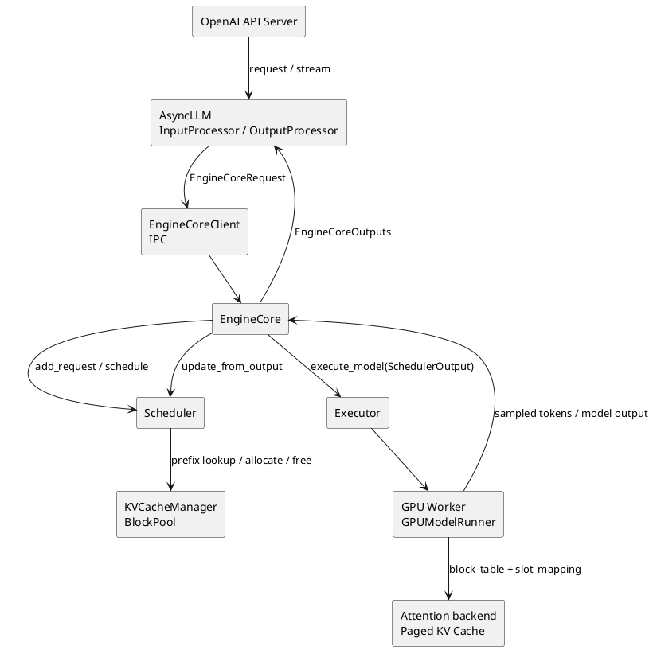
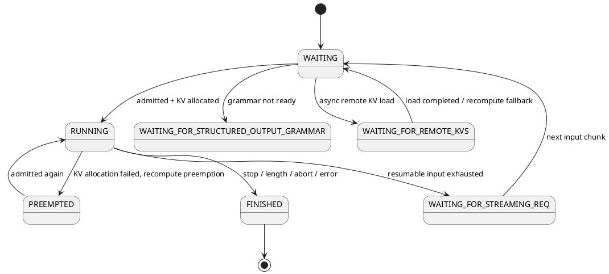

# vLLM 框架重点特性与请求调度、抢占源码分析

> 归档日期：2026-07-22  
> 源码基线：工作区 `vllm/`，`main@8df14cfc8c8a09b4e57f082e59593a3abce4ffb3`，`v0.23.1rc0-1050-g8df14cfc8`  
> 分析范围：以 vLLM V1 为主；V0 只用于解释历史差异。  
> 阅读建议：先看 §1、§5、§7；需要源码走读时再看 §3、§6、§8、§14。
> 对比阅读：[`01-vLLM与MindIE-LLM框架调度抢占源码对比.md`](./01-vLLM与MindIE-LLM框架调度抢占源码对比.md)。

---

## 1. 结论先行

vLLM 的核心不是某一个 Attention kernel，而是一套围绕 **KV Cache 分页管理、迭代级 Continuous Batching 和统一 token 调度**构建的推理系统。它把请求的 prompt、普通 decode token、投机 token、前缀命中 token、远程 KV token 都归一到“该请求还有多少 token 未计算”这个状态量上，再在每个 engine step 内分配 token、序列和 KV block 三类资源。

关于本文最关注的调度与抢占，可先记住六点：

1. **V1 调度器没有独立的 prefill 队列和 decode 队列。** 请求统一用 `num_computed_tokens` 追赶 `num_tokens_with_spec`；prefill/decode 是当前进度呈现出的执行形态，而不是两个互斥调度阶段。
2. **每一步先处理 `running`，再接纳 `waiting`。** 因此已有 decode 通常天然优先于新 prefill；长 prefill 通过 chunking 使用剩余 token budget。
3. **FCFS/priority 主要决定 waiting queue 的排序和 KV 压力下的 victim。** priority 不是“高优请求一到就立即中断低优请求”的硬实时抢占。
4. **V1 的常规抢占是 recompute。** KV 分配失败时释放 victim 的 KV block，把 `num_computed_tokens` 清零，状态改为 `PREEMPTED`，重新进入 waiting；没有 V0 那套 GPU↔CPU swap 恢复链路。
5. **抢占的直接触发器是 KV slot 分配失败，不是 token budget 用完。** token budget 用完只表示本 step 不再调度更多 token；KV 空间不足才会进入释放其他 running 请求的逻辑。
6. **当前源码已经在用 admission control 降低抖动。** `scheduler_reserve_full_isl` 可要求新请求完整输入序列能放入 KV，`watermark` 可留出空闲块余量；它们的目的都是避免 chunked prefill 只看首 chunk 而过度接纳，随后反复抢占。

一句话概括：

> vLLM 的调度器在每个迭代里解决“有限 token 预算和 KV block 下，哪些请求推进多少 token”；抢占是在已经运行的请求无法继续申请 KV 时，用重算换出空间的最后保护机制。

---

## 2. vLLM 的框架定位与重点特性

### 2.1 特性全景

| 层次 | 重点特性 | 解决的问题 | 主要代价或边界 | 源码入口 |
|---|---|---|---|---|
| 服务层 | OpenAI-compatible API、流式输出、离线 `LLM` | 降低接入成本 | 协议处理不在 GPU 热路径 | `vllm/entrypoints/openai/` |
| 引擎层 | `AsyncLLM`、独立 `EngineCore`、输入/输出处理分离 | 前端异步、后端持续驱动 GPU | 跨进程通信与状态同步更复杂 | `vllm/v1/engine/async_llm.py`、`core.py` |
| 调度层 | Continuous Batching、统一 token scheduler | 动态请求混批、提高利用率 | 吞吐、TTFT、TPOT 相互制约 | `vllm/v1/core/sched/scheduler.py` |
| 显存层 | Paged KV Cache、block table | 降低外部碎片，支持动态长度 | block 元数据和尾块内部碎片 | `kv_cache_manager.py`、`block_pool.py` |
| 复用层 | Automatic Prefix Caching、KV events | 跳过重复前缀 prefill | 只复用完整可缓存块；命中不等于跨实例可见 | `kv_cache_utils.py`、`block_pool.py` |
| 长请求 | Chunked Prefill | 避免长 prefill 长时间阻塞 decode | 一个 prompt 需多 step，TTFT 可能增加 | `scheduler.py::schedule` |
| 低延迟 | CUDA/HIP Graph、`torch.compile`、融合 kernel | 降低 launch/框架开销 | shape、模型和后端存在约束 | `vllm/config/compilation.py` |
| 算法层 | Speculative Decoding | 一次 target forward 验证多个 token | 接受率低或 batch 大时可能负收益 | `vllm/v1/spec_decode/` |
| 输出约束 | Structured Outputs | JSON/grammar 合法性 | grammar 编译和逐步 mask 开销 | `vllm/v1/structured_output/` |
| 模型与显存 | 多种量化、FP8 KV | 降显存和访存量 | 精度、硬件和 kernel 支持矩阵 | `vllm/model_executor/layers/quantization/` |
| 并行 | TP、PP、DP、EP、CP | 承载大模型和扩吞吐 | 通信成本、负载均衡复杂度 | `vllm/config/parallel.py` |
| 解耦部署 | Disaggregated P/D、KV Connector | TTFT/TPOT 独立扩缩、隔离干扰 | KV 传输、撮合和失败恢复 | `vllm/distributed/kv_transfer/` |
| 可观测性 | Prometheus、OTel、iteration stats、KV events | 定位排队、KV、执行瓶颈 | 指标需要按 workload 解读 | `vllm/v1/metrics/` |

官方稳定版首页也把 PagedAttention、continuous batching、chunked prefill、prefix caching、graph、量化、投机解码和分离式推理列为核心能力：[vLLM stable documentation](https://docs.vllm.ai/en/stable/)。

### 2.2 为什么 PagedAttention 与 Continuous Batching 必须一起理解

Continuous Batching 会让 batch 在每个 step 都变化：有请求完成、有请求进入、不同请求上下文长度持续增长。如果 KV 必须按一段连续大内存预留，动态 batch 很容易产生外部碎片或按最大长度过度预留。

Paged KV Cache 把 KV 切成固定 block：

```text
request logical block 0  ──> physical block 41
request logical block 1  ──> physical block  7
request logical block 2  ──> physical block 93
```

Worker 侧用 block table 完成逻辑块到物理块映射，再由 slot mapping 找到每个 token 的写入位置。因此：

- 调度器可以按 step 增量申请 KV block；
- 请求完成或被抢占时可以快速归还 block；
- 相同完整前缀 block 可以共享；
- batch 不要求各序列 KV 连续或等长。

代价也要讲清：PagedAttention 主要消除的是**外部碎片和连续预留浪费**，固定 block 最后一个未填满时仍有内部碎片；block 越小，内部碎片越少，但 block table、hash 和调度元数据更多。

---

## 3. V1 请求全链路源码走读

### 3.1 组件关系



### 3.2 请求进入

在线服务最终通过 `AsyncLLM` 组织异步请求：

- `InputProcessor` 把外部输入转为 `EngineCoreRequest`；
- `EngineCoreClient` 把请求发送给后台 engine core；
- `OutputProcessor` 把 core 输出还原为流式/非流式 `RequestOutput`。

源码锚点：

- [`AsyncLLM.__init__`](../../vllm/vllm/v1/engine/async_llm.py)：创建 renderer、input/output processor 和异步多进程 client；
- [`LLMEngine.add_request`](../../vllm/vllm/v1/engine/llm_engine.py)：处理 `n>1` 的 child request fan-out；
- [`Scheduler.add_request`](../../vllm/vllm/v1/core/sched/scheduler.py)：新请求进入 `waiting` 或 `skipped_waiting`，并放入 `requests` 索引。

### 3.3 每个 engine step

[`EngineCore.step`](../../vllm/vllm/v1/engine/core.py) 的主链很短：

```python
scheduler_output = scheduler.schedule(...)
future = model_executor.execute_model(scheduler_output, non_block=True)
grammar_output = scheduler.get_grammar_bitmask(scheduler_output)
model_output = future.result()
engine_core_outputs = scheduler.update_from_output(
    scheduler_output, model_output)
```

这五步对应：

1. Scheduler 决定本步执行哪些请求、各自多少 token、用哪些 KV block；
2. Executor 把 `SchedulerOutput` 分发给 worker；
3. Structured Output 在采样前提供 grammar bitmask；
4. Worker 完成模型 forward / sampling；
5. Scheduler 接收 token，回滚被拒绝的 spec token，更新停止状态和请求进度。

`step_with_batch_queue()` 还允许多个 batch 重叠：优先填充 batch queue，再等待最早完成结果。这是 CPU 调度与 GPU 执行 overlap 的关键路径之一。

### 3.4 Worker 如何消费调度结果

`GPUModelRunner` 为新请求或新增 block 更新 `input_batch.block_table`，提交到 GPU 后计算 slot mapping：

```text
physical_block = block_table[request_row, token_position // block_size]
slot = physical_block * block_size + token_position % block_size
```

源码锚点：

- [`BlockTable`](../../vllm/vllm/v1/worker/block_table.py)：维护 CPU/GPU block table 与 slot mapping buffer；
- `_compute_slot_mapping_kernel`：Triton kernel 批量计算 token 到 KV slot 的映射；
- [`GPUModelRunner.execute_model`](../../vllm/vllm/v1/worker/gpu_model_runner.py)：准备输入、attention metadata、执行模型和采样。

---

## 4. 请求状态与调度队列

### 4.1 状态机

[`RequestStatus`](../../vllm/vllm/v1/request.py) 当前包含：

```text
WAITING
WAITING_FOR_STRUCTURED_OUTPUT_GRAMMAR
WAITING_FOR_REMOTE_KVS
WAITING_FOR_STREAMING_REQ
RUNNING
PREEMPTED
FINISHED_STOPPED / LENGTH_CAPPED / ABORTED / IGNORED / ERROR / REPETITION
```



### 4.2 三种队列/容器

| 容器 | 内容 | 数据结构 |
|---|---|---|
| `running` | 已持有执行态、可能在本 step 被调度的请求 | `list[Request]` |
| `waiting` | 当前具备准入条件的请求 | FCFS deque 或 priority heap |
| `skipped_waiting` | grammar、远程 KV、streaming input 等依赖尚未就绪的请求 | 同策略 request queue |

`skipped_waiting` 的意义是避免一个异步依赖未完成的队头把后续请求全部堵住。FCFS 模式调度时会先尝试 `skipped_waiting`；priority 模式则比较两个队头，仍按 `(priority, arrival_time, request_id)` 选择。

这里已经体现一个重要事实：vLLM 的“FCFS”不是所有场景下的严格 FIFO。源码在某些请求因 encoder budget、block alignment 等原因本步无法推进时会 `continue`，允许后面的请求执行，以避免 GPU 空转。

---

## 5. 统一 Scheduler 的核心算法

### 5.1 统一 token 进度模型

[`Scheduler.schedule`](../../vllm/vllm/v1/core/sched/scheduler.py) 的注释明确说明：调度器没有独立 prefill/decode phase。核心量是：

```text
num_tokens_with_spec
  = prompt tokens + output tokens + speculative tokens

remaining tokens
  = num_tokens_with_spec + output placeholders - num_computed_tokens
```

每个 step 都尝试让 `num_computed_tokens` 追上当前目标。这个抽象同时容纳：

- 普通 prefill：一次追赶多个 prompt token；
- chunked prefill：只追赶 budget 能容纳的一段；
- decode：通常追赶 1 个 token；
- speculative decode：追赶 bonus token 和多个 draft token；
- prefix caching：先把命中的 block 计入 computed；
- jump decoding/结构化输出：目标 token 数可被扩展或校正。

### 5.2 主循环伪代码

```python
token_budget = max_num_scheduled_tokens

# 1. 先推进 running
for request in running:
    num_new_tokens = min(remaining(request), token_budget, model_len_limit)
    num_new_tokens = apply_long_prefill_cap_and_encoder_constraints(...)

    while allocate_slots(request, num_new_tokens) failed:
        victim = lowest_priority_running_or_running_tail()
        preempt(victim)
        if victim is request:
            break

    if allocation succeeded:
        schedule(request, num_new_tokens)
        token_budget -= num_new_tokens

# 2. 本 step 一旦发生抢占，不再接纳 waiting
if not preempted_requests:
    while waiting and token_budget > 0 and running_count < max_num_seqs:
        request = select_waiting_head()
        resolve_local_prefix_hit_and_remote_kv_hit(request)
        num_new_tokens = min(remaining(request), token_budget)
        if allocate_slots(...) failed:
            break
        move request to running
        token_budget -= num_new_tokens

# 3. 生成 SchedulerOutput，并乐观推进 num_computed_tokens
```

需要特别注意：

- running 阶段 `allocate_slots()` 失败会尝试抢占其他 running 请求；
- waiting 阶段分配失败只是停止准入，不会为了新请求直接踢 running；
- 本 step 已发生抢占时，waiting 准入整个跳过，避免刚释放的空间又被新请求占走；
- `num_computed_tokens` 在 `_update_after_schedule()` 中先乐观增加；如果 spec token 被拒绝，稍后在 `update_from_output()` 修正。

### 5.3 五类约束，不只是两个旋钮

| 约束 | 关键字段 | 达到上限后的行为 |
|---|---|---|
| 单步 token | `max_num_scheduled_tokens` / `max_num_batched_tokens` | 本 step 不再派更多 token，或切小 prefill chunk |
| 活跃序列 | `max_num_seqs` | waiting 暂不准入 |
| 模型长度 | `max_model_len` | 限制本步 token，最终 length capped |
| KV block | `KVCacheManager.allocate_slots()` | waiting 停止准入；running 可能触发抢占 |
| Encoder/多模态 | encoder compute/cache budget | 跳过或暂缓相应请求 |

此外还有 LoRA 数量、Mamba block alignment、PP cadence、structured-output token 是否就绪、KV Connector 是否返回命中信息等条件。

因此不能把“调度失败”统一归因于 KV 不够，也不能把 `max_num_batched_tokens` 当成最大并发数。

---

## 6. FCFS 与 Priority 调度策略源码分析

### 6.1 Waiting queue 排序

[`request_queue.py`](../../vllm/vllm/v1/core/sched/request_queue.py) 只提供两种内置策略：

| 策略 | waiting 顺序 | 同优先级规则 |
|---|---|---|
| `fcfs` | deque 到达顺序 | 到达顺序 |
| `priority` | 最小堆，数值越小优先级越高 | `arrival_time` 越早越先，再用 request id 稳定排序 |

`Request.__lt__()` 的比较键可近似写为：

```python
(priority, arrival_time, request_id)
```

### 6.2 Running 请求的推进顺序

`running` 是 list，正常情况下按准入顺序扫描。调度器先给已有 running 请求分配本 step token，所以 decode 请求通常先占预算，新 waiting prefill 使用剩余 budget。这就是官方优化文档所说的 decode-first / chunked-prefill 行为基础：[Optimization and Tuning](https://docs.vllm.ai/en/v0.10.1.1/configuration/optimization.html)。

但要避免两个过度简化：

1. “先 running”不等于所有 running 都一定 decode；长 prompt 的后续 chunk 也在 running 中。
2. “FCFS”不等于严格逐请求执行到底；无法在本步推进的 running 请求可能被跳过。

### 6.3 Priority 并非到达即抢占

priority 模式有两层作用：

- waiting：高优先级先准入；
- running 遭遇 KV 分配失败：选择最低优先级 running 请求作为 victim。

它**不会**在高优先级请求刚到达时无条件打断低优先级 running 请求。waiting 阶段如果无空间，只会 `break`；只有某个 running 请求增长 KV 时分配失败，才进入 victim 选择。

这意味着 priority 更接近“优先准入 + 内存压力下的优先保护”，不是带时间片和立即中断语义的操作系统硬抢占调度。

### 6.4 Victim 的精确选择

当前源码：

```python
if policy == PRIORITY:
    victim = max(running, key=lambda r: (r.priority, r.arrival_time))
else:
    victim = running.pop()
```

因此：

- priority：`priority` 数值最大者最先被抢；相同优先级下，到达更晚者先被抢；
- FCFS：从 running 尾部开始抢，通常保护更早进入的请求；
- 如果被抢的请求已在本 step 分配过 token，要撤销它本步的 token budget、KV block 记录、spec token 和 encoder budget；
- 如果最终 victim 就是当前正在尝试推进的 request，说明已经没有其他可释放对象，本轮停止。

测试锚点：[`test_priority_scheduling_preemption`](../../vllm/tests/v1/core/test_scheduler.py) 明确验证低优先级 running request 在 KV 压力下被抢，高优先级请求保留。

---

## 7. 请求抢占机制深挖

### 7.1 触发条件

直接触发链路是：

```text
Scheduler schedules a RUNNING request
  -> KVCacheManager.allocate_slots(...)
  -> required_blocks > available_blocks
  -> returns None
  -> Scheduler chooses a running victim
  -> _preempt_request(victim)
```

`allocate_slots()` 计算的并非只是一段 prompt 所需 block，还可能包括：

- 新计算 token；
- speculative decode lookahead slots；
- prefix hit / external KV 对应的新引用或本地承载 block；
- encoder-decoder cross-attention block；
- `reserved_blocks`；
- admission `watermark_blocks`。

所以“明明本步只 decode 1 token，为什么仍抢占”并不矛盾：当当前位置跨入新 block，或 lookahead/预留使 available blocks 不足时，1-token decode 也可能触发新 block 分配。

### 7.2 `_preempt_request()` 做了什么

[`Scheduler._preempt_request`](../../vllm/vllm/v1/core/sched/scheduler.py) 的语义可以压缩为：

```python
free_request_kv_blocks(request)
free_encoder_cache_reference(request)
remove_from_inflight_prefills(request)
request.status = PREEMPTED
request.num_computed_tokens = 0
request.spec_token_ids = []
request.num_preemptions += 1
waiting.prepend_request(request)
```

注意两点：

- 请求已有的 `output_token_ids` 不会被删除；清零的是模型计算进度。恢复后需要重新 prefill prompt + 已生成输出 token，直到计算状态追上请求 token 序列。
- prefix caching 仍可能让“重算”命中残留的可缓存块，因此物理代价不一定永远等于从 token 0 完整 forward；但不能依赖这一点，因为释放和后续复用会改变 block 的存活情况。

### 7.3 为什么 V1 选择 recompute，而不是 swap

V0 的 `PreemptionMode` 曾区分：

- recompute：丢弃 GPU KV，恢复时重新计算；
- swap：把 KV 搬到 CPU，恢复时 swap in。

V1 的统一 scheduler 不再保留常规 GPU↔CPU swap 状态，官方 V1 指南也把 swapping 标为 deprecated：[vLLM V1 guide](https://docs.vllm.ai/en/v0.11.2/usage/v1_guide/)。工程权衡是：

| 方案 | 优点 | 代价 |
|---|---|---|
| Recompute | 状态机简单；无 PCIe swap in/out；释放立即生效 | 长上下文重算昂贵，浪费算力并恶化 E2E latency |
| Swap | 保留计算成果，长上下文可能更划算 | CPU 内存、PCIe 带宽、异步搬运和一致性复杂；恢复延迟不稳定 |

在现代 GPU 上，是否“重算一定比 swap 快”不能脱离模型、上下文、互连和量化判断；V1 做的是架构默认选择，不是普适定律。

### 7.4 抢占的成本模型

可以用一个简化式理解单次抢占浪费：

```text
C_preempt
  ~= C_recompute(prompt + committed output - reusable prefix)
   + extra queueing delay
   + cache churn / graph batch-shape disturbance
```

影响最大的因素：

- 已计算上下文越长，重算成本越大；
- prefix cache 可复用比例越高，实际重算越少；
- 同一请求被多次抢占会产生放大效应；
- 高峰期释放的 block 很快被其他请求占用，恢复等待更长；
- prefill 是 compute-bound，重算还会干扰其他 decode 的 TPOT。

### 7.5 Admission control 如何避免抢占风暴

当前源码提供两个值得重点关注的保护：

#### `scheduler_reserve_full_isl`

为 `True` 时，新 waiting/preempted 请求准入前先估算完整 input sequence 所需 KV block，而不是只看当前首个 prefill chunk。若完整输入放不下，当前就不准入。

它解决的典型问题：

```text
多个长 prompt 的第一小块都能放下
 -> 全部进入 running
 -> 后续 chunk 同时增长
 -> KV 顶满
 -> 互相抢占并从头重算
```

代价是准入更保守，短期 GPU 可能没有被“塞到最满”，但能减少 thrashing。

#### `watermark`

`watermark_blocks = int(watermark * total_blocks)`。对 waiting/preempted 的准入，在已有 scheduled request 时额外要求保留这部分空闲块；running 正常增长不额外加 watermark。

它是显式 headroom，不是 CUDA allocator watermark，也不是 prefix-cache 驱逐阈值。

### 7.6 Async scheduling 下的释放安全

异步调度或 PP 会允许多个 batch in flight。此时“Scheduler 已决定抢占并释放 block”不代表旧 batch 的 GPU 写入已经完成。如果 KV consumer 又立即把这些 block 分给远程 KV load，可能出现写入竞争。

当前 Scheduler 在“多 in-flight batch + KV consumer”条件下启用 `defer_block_free`，使用调度序号/fence 延迟真正归还 block。测试 [`test_deferred_block_free.py`](../../vllm/tests/v1/core/test_deferred_block_free.py) 专门覆盖 preemption 路径。

这是源码分析中很容易漏掉的点：同步 scheduler 里的“free”是逻辑生命周期问题，异步 scheduler 里还必须满足 GPU 操作完成顺序。

---

## 8. KV Cache 管理与 Prefix Caching 源码分析

### 8.1 三层职责

| 层 | 职责 | 关键对象 |
|---|---|---|
| Scheduler | 决定何时查命中、申请、释放 | `Scheduler` |
| KV 管理 | 计算需要多少 block、维护 request→blocks | `KVCacheManager`、coordinator |
| 物理块池 | block 分配、引用计数、缓存索引、驱逐顺序 | `BlockPool`、`KVCacheBlock` |

### 8.2 BlockPool

[`BlockPool`](../../vllm/vllm/v1/core/block_pool.py) 同时维护：

- `blocks[]`：物理 block 对象；
- `free_block_queue`：既是空闲队列，也是可驱逐 cached block 的顺序；
- `cached_block_hash_to_block`：block hash 到物理 block 的索引；
- `ref_cnt`：当前活跃请求引用数；
- null block：为滑动窗口等场景提供占位。

释放时，无 hash 的普通 block 放到队头，优先再次分配；有 hash 的 cached block 放到队尾，使其尽可能继续服务前缀命中，内存紧张时再按队列顺序被复用/驱逐。

### 8.3 Prefix hash 链

完整 block 的 hash 可抽象为：

```text
H_i = H(H_{i-1}, tokens_i, extra_keys)
```

父 hash 使第 i 块绑定其完整历史前缀；`extra_keys` 还用于隔离 LoRA、multimodal 等会改变 KV 语义的输入。请求到达时，`get_computed_blocks()` 查找最长连续命中前缀，并增加相应 block 引用。

边界：

- 通常只缓存完整 hash block；尾部不完整 block 可能需要重算；
- 为了产生下一 token logits，不能把请求所有 token 都视为无需 forward；
- APC 是单实例/单 KV pool 的复用机制；跨实例复用还需要 KV events、路由亲和或 KV Connector。

### 8.4 Hybrid KV Cache

当前 V1 还通过 coordinator 隔离 full attention、sliding window、Mamba 等不同 KV 形态。`KVCacheBlocks.blocks` 的外层是 KV cache group，而不是假设所有层永远共享同一种 block 布局。

这说明 PagedAttention 的工程实现已经不再只是“一张统一 block table”：混合模型需要按 group 管理不同 cache spec、命中长度和可释放窗口。

---

## 9. Chunked Prefill 与调度策略

### 9.1 它解决的是 HOL，不直接增加 KV 容量

关闭 chunked prefill 时，如果 waiting 请求剩余 prefill token 大于本 step token budget，调度器会停止 waiting 调度。开启后：

```python
num_new_tokens = min(remaining_prefill_tokens, token_budget)
```

长 prompt 被分成多个 engine step，并与已有 decode 混批。主要收益：

- decode 不必等待整段长 prefill 完成，TPOT/ITL tail 更稳定；
- compute-bound prefill 与 memory-bound decode 混合，GPU 利用率可能更好；
- 单 step shape 更受控制。

主要代价：

- 同一个长 prompt 需要多个 step 才出首 token，TTFT 可能增加；
- chunk 太小会增加调度、launch 和中间状态开销；
- 它不能凭空增加 KV blocks，池太小仍会抢占。

### 9.2 `long_prefill_token_threshold`

该阈值会进一步限制长 prefill 单 step 的 token 数。它是在总 `max_num_batched_tokens` 之外的 per-request cap，适合防止一个长 running prefill 吃完所有 budget。

### 9.3 并发 partial-prefill 配置的源码现状

`SchedulerConfig` 和 CLI 当前仍定义：

- `max_num_partial_prefills`；
- `max_long_partial_prefills`。

但在本次基线的 V1 `Scheduler.schedule()` 中，这两个字段没有参与实际选择/计数；只有配置校验和日志仍引用它们。不能仅根据配置声明就声称当前 V1 主循环已经实现“最多 N 个 partial prefill、其中最多 M 个长请求”的运行时约束。

这是读源码时应坚持的原则：**配置存在不等于热路径已消费该配置。** 后续版本若重新接入，应以目标 commit 为准。

### 9.4 Chunked Prefill 与 P/D 分离

| 方案 | 解决层次 | 优点 | 代价 |
|---|---|---|---|
| Chunked prefill | 单实例内的 P/D 干扰 | 部署简单、无 KV 网络传输 | 仍共享 GPU、KV 和调度器 |
| P/D 分离 | 实例/集群级资源隔离 | TTFT/TPOT 可独立扩缩，tail ITL 更可控 | KV 传输、路由和故障恢复复杂 |

官方文档明确提示 disaggregated prefill 主要用于独立调优 TTFT/ITL 和控制 tail ITL，并不天然提升吞吐：[Disaggregated Prefilling](https://docs.vllm.ai/en/v0.14.0/features/disagg_prefill/)。

---

## 10. 调度器与其他高级特性的交互

### 10.1 Speculative Decoding

Scheduler 需要同时处理：

- `spec_token_ids`；
- lookahead KV slots；
- 本步调度的 draft token 数；
- target 验证后被拒绝 token 的进度回滚；
- 为 graph shape 补齐的 placeholder。

因此 `max_num_scheduled_tokens` 可能小于 `max_num_batched_tokens`：模型执行/投机路径可能在 batch 中追加 token，需要提前留出空间。

调度层含义：投机解码不是“采样器内部的小优化”，它会改变单请求每步 token 数、KV 预留、batch shape 和抢占概率。

### 10.2 Structured Outputs

grammar 尚未编译完成的请求进入 `WAITING_FOR_STRUCTURED_OUTPUT_GRAMMAR`；调度器可跳过它继续处理其他请求。执行后采样前，由 `get_grammar_bitmask()` 提供合法 token mask。

异步调度时，如果下一步需要前一步真实 token 才能推进 grammar，就通过 `pending_structured_output_tokens` 延迟采样，避免 placeholder 与 grammar 状态错位。

### 10.3 Remote KV / P-D Disaggregation

waiting 请求先查本地 prefix cache，再让 scheduler-side connector 返回额外命中 token 和是否异步加载：

```text
WAITING
 -> local prefix lookup
 -> connector.get_num_new_matched_tokens()
 -> allocate local destination blocks
 -> WAITING_FOR_REMOTE_KVS
 -> worker async receive
 -> promote to WAITING/RUNNING
```

异步 KV load 期间不会执行本地 forward，但会占用目标 KV block。当前源码用 `_inflight_prefill_reserved_blocks()` 保护其他正在 prefill 的请求，避免远程 load 抢走其完成所需空间而形成死锁。

### 10.4 Async Scheduling

[`AsyncScheduler`](../../vllm/vllm/v1/core/sched/async_scheduler.py) 在基础 Scheduler 上增加 output placeholder，使下一 step 可以在前一步 token 尚未完全回到 scheduler 时提前构造。收益是减少 CPU scheduling gap；代价是：

- 进度是带 placeholder 的乐观状态；
- 停止条件、structured output、spec decode 都需要额外校正；
- block 释放需要 fence/defer；
- PP 下同一请求 decode 还要遵守 pipeline cadence。

---

## 11. 调度参数：语义、影响与建议

| 参数 | 真正控制什么 | 调大/开启的常见收益 | 主要风险 |
|---|---|---|---|
| `max_num_batched_tokens` | 模型单 iteration 可处理 token 上限 | prefill 吞吐、较大 batch | 单步执行变长，TPOT tail 可能上升 |
| `max_num_scheduled_tokens` | Scheduler 单步实际可签发 token 上限 | 显式给投机/模型追加 token 留空间 | 过小导致执行 batch 吃不满 |
| `max_num_seqs` | running/request slot 上限 | 并发和吞吐 | KV 压力、元数据和调度开销增大 |
| `enable_chunked_prefill` | prefill 是否可按剩余 budget 分块 | 稳 TPOT、减 HOL | 长 prompt TTFT 可能上升 |
| `long_prefill_token_threshold` | 单个长 prefill 每步 cap | 防单请求吞掉 token budget | 过小增加 step 数 |
| `scheduler_reserve_full_isl` | 准入时是否检查完整输入能否放入 KV | 防过度接纳、减少反复抢占 | 准入更保守 |
| `watermark` | waiting/preempted 准入预留 KV 比例 | 给 running 增长留余量 | 空闲块更多、峰值并发下降 |
| `gpu_memory_utilization` | 整体 GPU 内存预算，间接决定 KV pool | 更多 KV block | OOM 余量变小 |
| `kv_cache_memory_bytes` | 显式 KV cache 字节预算 | 容量可控 | 覆盖 utilization 推导，配置不当会挤压其他内存 |
| `scheduling_policy` | waiting 排序和 victim 策略 | 业务分级 | 低优请求饥饿，非硬实时 |
| `async_scheduling` | CPU 调度/输出与 GPU 执行重叠 | 减少 GPU bubble | 状态与兼容性复杂 |

推荐调参顺序：

1. 固定模型、并行度、最大上下文和量化，先确认可用 KV 容量；
2. 按真实 ISL/OSL/arrival 分布扫描 `max_num_batched_tokens × max_num_seqs`；
3. 长短请求混合时开启 chunked prefill，观察 TTFT 与 TPOT P95/P99；
4. 若出现抢占，先判断是容量不足还是过度准入，再调 full-ISL reservation / watermark；
5. 最后评估 priority、async scheduling、spec decode，不要同时一次性打开所有高级项。

---

## 12. 抢占问题的排障手册

### 12.1 先看什么指标

当前 Prometheus logger 暴露的关键指标包括：

- `vllm:num_preemptions`：累计/计数型抢占指标；
- `vllm:kv_cache_usage_perc`：KV cache 使用率；
- running / waiting request 数；
- prompt/generation token throughput；
- TTFT、inter-token latency / TPOT、E2E latency；
- prefix cache queries/hits；
- KV connector 的命中和传输统计（启用时）。

不能只看 KV usage 的瞬时均值：block 边界增长、同 step 多请求竞争和 prefix block 驱逐会让抢占发生在短时峰值。

### 12.2 诊断树

```text
num_preemptions 上升
|
+-- KV usage 长期接近 100%？
|   +-- 是：KV 容量/并发不匹配
|   |   +-- 降 max_num_seqs
|   |   +-- 增 KV cache memory / gpu_memory_utilization
|   |   +-- 缩 max_model_len 或使用 FP8 KV（先验精度）
|   +-- 否：查 block 边界尖峰、lookahead、remote KV reservation
|
+-- 多个长 prompt 同时 chunked prefill？
|   +-- 开/确认 scheduler_reserve_full_isl
|   +-- 适度 watermark
|   +-- 限制 per-request long prefill chunk
|
+-- priority 场景低优请求反复被抢？
|   +-- 查低优请求等待/重算放大
|   +-- 增 aging/准入层保护需自定义 scheduler 或上层队列
|
+-- PD / async KV load？
    +-- 查 in-flight reservation、传输失败回退和 deferred free
```

### 12.3 常见误判

| 误判 | 正确解释 |
|---|---|
| token budget 用完就是抢占 | budget 用完通常只是本 step 停止；KV 分配失败才进入常规抢占 |
| 开 chunked prefill 就不会抢占 | chunking 治 token-budget HOL，不增加 KV 容量 |
| priority 会立即赶走低优请求 | 只有 running KV 分配失败时才选 victim；waiting 无空间只等待 |
| PagedAttention 没有碎片 | 仍有尾块内部碎片和元数据成本 |
| 被抢占后只重算 prompt | 要重建 prompt + 已提交 output 的模型状态，直到追上 token 序列 |
| prefix cache 命中就完全零计算 | 尾块、logits 和未命中部分仍需 forward |
| 降 `max_num_batched_tokens` 能直接增加 KV 容量 | 它主要限制单步计算 token；KV 总容量由 cache 配置和模型 KV 形态决定 |

---

## 13. 三个典型调度场景推演

### 13.1 场景 A：decode + 新增长 prefill

假设 token budget=8：running 中有 4 个 decode，各需 1 token；waiting 头部有 20-token prompt。

```text
先 running：D1 D2 D3 D4，消耗 4
剩余 budget=4
再 waiting：长 prompt 调度首个 4-token chunk
下一 step：4 个 decode + prompt 下一 chunk
```

结果：decode 不被 20-token prefill 原子阻塞；长请求 TTFT 需要多个 step。

### 13.2 场景 B：FCFS 下 KV 不足

running 顺序 `[A, B, C]`。扫描 A 时申请新 block 失败：

```text
FCFS victim = running.pop() = C
C: RUNNING -> PREEMPTED -> waiting front
释放 C blocks 后重试 A
```

若仍失败，再抢 B；最后可能抢到 A 自己并停止。本 step 不再接纳普通 waiting。

### 13.3 场景 C：Priority 下高优请求并非立即抢占

低优 L 已 running；高优 H 到达：

1. 若 `max_num_seqs` 或 KV 准入不允许，H 继续 waiting，L 不会仅因 H 到达就被踢；
2. 若 H 能准入，两者共同 running；
3. 后续任一 running 增长导致 KV allocation 失败时，victim 按最大 `(priority, arrival_time)` 选择，L 更可能被抢。

这正是“优先准入 + 压力下保护”，不是 arrival-triggered immediate preemption。

---

## 14. 源码阅读地图

### 14.1 按调用链阅读

| 顺序 | 文件 | 建议关注的符号 |
|---|---|---|
| 1 | [`vllm/v1/engine/async_llm.py`](../../vllm/vllm/v1/engine/async_llm.py) | `AsyncLLM`、input/output processor |
| 2 | [`vllm/v1/engine/core.py`](../../vllm/vllm/v1/engine/core.py) | `EngineCore.step`、`step_with_batch_queue` |
| 3 | [`vllm/v1/request.py`](../../vllm/vllm/v1/request.py) | `Request`、`RequestStatus`、`__lt__` |
| 4 | [`vllm/v1/core/sched/request_queue.py`](../../vllm/vllm/v1/core/sched/request_queue.py) | FCFS / priority queue |
| 5 | [`vllm/v1/core/sched/scheduler.py`](../../vllm/vllm/v1/core/sched/scheduler.py) | `schedule`、`_preempt_request`、`update_from_output` |
| 6 | [`vllm/v1/core/sched/async_scheduler.py`](../../vllm/vllm/v1/core/sched/async_scheduler.py) | placeholder、异步进度校正 |
| 7 | [`vllm/v1/core/kv_cache_manager.py`](../../vllm/vllm/v1/core/kv_cache_manager.py) | `get_computed_blocks`、`allocate_slots`、`free` |
| 8 | [`vllm/v1/core/block_pool.py`](../../vllm/vllm/v1/core/block_pool.py) | `cache_full_blocks`、`get_new_blocks`、`free_blocks` |
| 9 | [`vllm/v1/worker/block_table.py`](../../vllm/vllm/v1/worker/block_table.py) | `BlockTable`、slot mapping kernel |
| 10 | [`vllm/v1/worker/gpu_model_runner.py`](../../vllm/vllm/v1/worker/gpu_model_runner.py) | `execute_model`、input batch 更新 |

### 14.2 按问题查源码

| 问题 | 第一落点 |
|---|---|
| 为什么本步没调度这个请求？ | `scheduler.py::schedule` 的 running/waiting 分支 |
| 为什么发生抢占？ | `kv_cache_manager.py::allocate_slots` 返回 `None` 的条件 |
| 抢了谁？ | `scheduler.py` 中 policy 分支的 victim selection |
| 抢占后清了什么？ | `scheduler.py::_preempt_request` |
| priority 怎么比较？ | `request.py::Request.__lt__`、`request_queue.py` |
| prefix 命中了多少？ | `kv_cache_manager.py::get_computed_blocks` |
| block 如何驱逐？ | `block_pool.py::free_blocks/get_new_blocks` |
| 逻辑 block 如何落到 KV 地址？ | `worker/block_table.py::_compute_slot_mapping_kernel` |
| 异步时为什么不能立即 free？ | `scheduler.py::defer_block_free`、对应测试 |
| PD 请求为什么卡在 waiting？ | `WAITING_FOR_REMOTE_KVS` 与 connector promotion 路径 |

---

## 15. 如何扩展调度策略

`SchedulerConfig.scheduler_cls` 支持传入自定义 scheduler class 或完整类路径，但源码警告该接口目前不是稳定 public API，升级兼容性不能保证。

适合自定义的需求：

- priority aging，避免低优请求永久饥饿；
- deadline / SLO-aware token allocation；
- 按估计 ISL/OSL 的 shortest-job-first 或 size-aware admission；
- tenant quota / weighted fair scheduling；
- cache-aware、PD-aware 或跨实例 global scheduling。

实现时至少要维护以下不变量：

1. `sum(num_scheduled_tokens) <= max_num_scheduled_tokens`；
2. `len(running) <= max_num_seqs`；
3. Scheduler 与 Worker 对 request slot、finished/preempted id 的视图一致；
4. KV block 引用、prefix hash 和 deferred free 生命周期正确；
5. spec token/placeholder 被拒绝后能够回滚；
6. blocked waiting 状态不能造成全局 HOL；
7. priority/fairness 策略不能绕过 max model len、encoder 和 connector 约束。

如果目标是生产级全局调度，通常更合理的边界是：上层 router 做实例选择、租户配额和 admission，vLLM 内部 scheduler 负责单实例 iteration/token/KV 调度。把所有策略塞进 engine scheduler 会扩大与执行热路径的耦合。

---

## 16. 面试回答模板

### 16.1 60 秒：vLLM 核心特性

> vLLM 的底座是 PagedAttention 和 Continuous Batching。PagedAttention 把 KV 切成固定 block，通过 block table 做逻辑到物理映射，避免按最大长度连续预留；Continuous Batching 每个 iteration 动态加入和移除请求。V1 Scheduler 又把 prefill、decode、prefix hit 和 speculative token 统一成 `num_computed_tokens` 的推进问题，在 `max_num_batched_tokens`、`max_num_seqs` 和 KV blocks 三类预算下调度。上层还有 prefix caching、chunked prefill、CUDA Graph、量化、投机解码、结构化输出以及 P/D 分离。框架优势不是单一 kernel，而是内存、调度、执行和服务的一体化。

### 16.2 90 秒：请求调度与抢占

> V1 每步先扫描 running，再接纳 waiting，所以已有 decode 通常先拿 token budget，新长 prefill 用剩余 budget 做 chunk。内置 waiting 策略是 FCFS 和 priority：priority 数值越小越先；但它不是高优请求到达就立即中断低优请求。常规抢占只在 running 请求申请 KV slot 失败时触发。FCFS 从 running 尾部选 victim，priority 选 `(priority, arrival_time)` 最大的最低优请求。抢占采用 recompute：释放 KV 和 encoder 引用，清空 `num_computed_tokens`，状态改成 `PREEMPTED`，放回 waiting；保留已生成 token，恢复时重建模型状态。为避免长 prompt 首 chunk 过度准入，当前源码还有完整 ISL admission check 和 KV watermark。排障时重点看 KV usage、抢占计数、ISL/OSL 分布、`max_num_seqs` 和 KV pool，而不是把 token budget 用完误判成抢占。

### 16.3 追问：为什么不 swap

> V1 选择 recompute 是为了去掉 CPU KV、PCIe 搬运和 swap 状态机，释放空间也更直接。代价是长上下文重算贵，所以真正的优化方向不是频繁抢占后选 swap，而是通过 KV 容量、并发上限、完整 ISL 准入、watermark、chunked prefill 或 P/D 隔离减少抢占发生。

---

## 17. 本文相对旧笔记的关键校正

1. 不再把 token budget 争用写成抢占触发条件；常规抢占的直接触发是 running 的 KV allocation failure。
2. 不再把 priority 描述成“高优到达立即抢低优”；当前实现只在 waiting 排序和 KV 压力 victim 选择上体现 priority。
3. 明确 waiting 分配失败不会主动抢 running；且某 step 发生抢占后会跳过 waiting 准入。
4. 明确 `PREEMPTED` 清零计算进度但不删除已生成 token，恢复要重建完整模型状态。
5. 补入当前提交的 `scheduler_reserve_full_isl`、`watermark` 和 async deferred block free。
6. 标注 `max_num_partial_prefills` / `max_long_partial_prefills` 在当前 V1 热路径中未被消费，避免把配置注释当成已实现行为。
7. 区分单实例 APC、跨实例 KV 复用和上层 cache-aware routing，避免把三层混为一谈。

---

## 18. 参考资料

### 18.1 本地源码（本文事实主基线）

- [`vllm/vllm/v1/core/sched/scheduler.py`](../../vllm/vllm/v1/core/sched/scheduler.py)
- [`vllm/vllm/v1/core/sched/request_queue.py`](../../vllm/vllm/v1/core/sched/request_queue.py)
- [`vllm/vllm/v1/core/sched/async_scheduler.py`](../../vllm/vllm/v1/core/sched/async_scheduler.py)
- [`vllm/vllm/v1/core/kv_cache_manager.py`](../../vllm/vllm/v1/core/kv_cache_manager.py)
- [`vllm/vllm/v1/core/block_pool.py`](../../vllm/vllm/v1/core/block_pool.py)
- [`vllm/vllm/v1/request.py`](../../vllm/vllm/v1/request.py)
- [`vllm/vllm/v1/engine/core.py`](../../vllm/vllm/v1/engine/core.py)
- [`vllm/vllm/v1/worker/block_table.py`](../../vllm/vllm/v1/worker/block_table.py)
- [`vllm/vllm/config/scheduler.py`](../../vllm/vllm/config/scheduler.py)
- [`vllm/tests/v1/core/test_scheduler.py`](../../vllm/tests/v1/core/test_scheduler.py)
- [`vllm/tests/v1/core/test_deferred_block_free.py`](../../vllm/tests/v1/core/test_deferred_block_free.py)

### 18.2 官方资料

- [vLLM stable documentation](https://docs.vllm.ai/en/stable/)
- [Optimization and Tuning](https://docs.vllm.ai/en/v0.10.1.1/configuration/optimization.html)
- [vLLM V1 guide](https://docs.vllm.ai/en/v0.11.2/usage/v1_guide/)
- [Disaggregated Prefilling](https://docs.vllm.ai/en/v0.14.0/features/disagg_prefill/)
- [vLLM examples index](https://docs.vllm.ai/en/stable/examples/index.html)

---

## 19. 自检清单

- [x] 有明确源码 commit，不混用 V0/V1 语义
- [x] 覆盖 vLLM 框架重点特性与请求全链路
- [x] 展开 FCFS、priority、running/waiting 的实际行为
- [x] 展开抢占触发、victim、状态变化、恢复成本
- [x] 区分 token budget、sequence limit 和 KV capacity
- [x] 覆盖 chunked prefill、prefix caching、spec decode、structured output、PD
- [x] 补充 admission control、异步释放与可观测性
- [x] 提供源码阅读地图、排障树和面试口述模板
