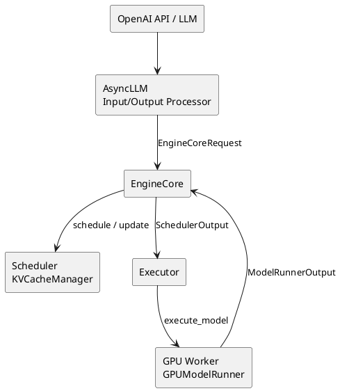
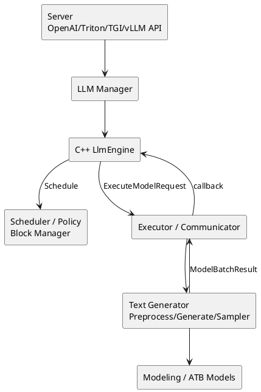
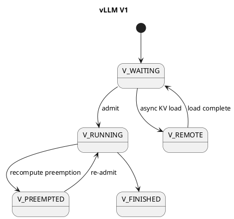
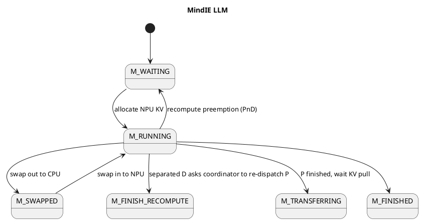

# vLLM 与 MindIE LLM：框架、请求调度与抢占源码对比

> 归档日期：2026-07-22  
> vLLM 基线：`main@8df14cfc8c8a09b4e57f082e59593a3abce4ffb3`，`v0.23.1rc0-1050-g8df14cfc8`  
> MindIE LLM 基线：`master@238c543c3ce34e64260d1a4ed99c3e210f13793f`  
> 对比范围：框架架构、请求生命周期、调度策略、KV 管理、抢占、SplitFuse/Chunked Prefill、异步调度与 P/D 分离。  
> 前置阅读：[`00-vLLM框架重点特性与请求调度抢占源码分析.md`](./00-vLLM框架重点特性与请求调度抢占源码分析.md)。

---

## 1. 结论先行

vLLM V1 和 MindIE LLM 都具备 Paged KV Cache、Continuous Batching、Prefix Cache、分块 Prefill、异步执行、投机解码和 P/D 分离能力，但两者的调度抽象明显不同：

- **vLLM V1 是统一 token scheduler。** 不把 prefill/decode 作为两个互斥调度阶段，而是让每个请求的 `num_computed_tokens` 追赶当前 token 总量；每步先推进 running，再用剩余预算接纳 waiting。
- **MindIE LLM 是显式阶段 scheduler。** `SequenceData` 保存 `PREFILL/DECODE`，Scheduler 先决定本轮是 `PREFILL_FIRST`、`DECODE_FIRST` 还是 `MIX`，再把 waiting/running/swapped 中的请求交给对应 FCFS policy。
- **vLLM V1 常规抢占只有 recompute；MindIE 同时保留 swap 和 recompute。** MindIE 在 NPU KV 不足时优先尝试 NPU→CPU swap，受 `maxPreemptCount` 和 CPU block 容量约束，否则回退 recompute。
- **两者的常规 victim 都偏向队尾。** vLLM FCFS 从 `running` 尾部抢，priority 模式选最低优先级 running；MindIE FCFS 从候选 running 队尾抢。
- **vLLM 有真正进入调度热路径的 request priority；MindIE 当前主 FCFS 热路径没有消费请求的 `priority_` 字段。** MindIE 文档/源码里的“优先级”更多指 P/D 阶段优先、首 Token 等待超时保护或 SLO stage policy，不能与 vLLM request priority 直接等同。
- **分块调度上，vLLM 的 chunking 更内生；MindIE 的 SplitFuse 更显式。** vLLM 统一 scheduler 自然支持混合 query length；MindIE 需要 `MIX` forward、显式 partial-prefill 统计和 Text Generator 的 SplitFuse plugin 配合。
- **MindIE 的生产调度旋钮更偏阶段/SLO。** 它有 `maxQueueDelayMicroseconds`、`maxFirstTokenWaitTime`、`stageSelectPolicy`、LLF 和动态 batch size；vLLM 内置策略更简洁，复杂 SLO/tenant 策略通常交给 router 或自定义 scheduler。

一句话总结：

> vLLM V1 追求以 token 进度统一 prefill/decode/spec/prefix 的调度模型；MindIE LLM 以 P/D 阶段、设备分层 KV 和 Ascend 执行链为中心，保留更显式的阶段选择、swap 和 SLO 调度能力。

---

## 2. 总览对照表

| 维度 | vLLM V1 | MindIE LLM | 核心差异 |
|---|---|---|---|
| 主要硬件生态 | CUDA/ROCm/CPU/XPU 等多后端 | Ascend NPU | 通用多后端 vs 昇腾深度优化 |
| 核心引擎 | Python V1 EngineCore + Executor/Worker | C++ LLM Manager/Engine/Scheduler + Python Text Generator | MindIE 控制面更重 C++ |
| 请求抽象 | `Request` | `SequenceGroup` / `Sequence` | MindIE 保留 group/多序列语义 |
| 阶段模型 | 无严格 prefill/decode scheduler phase | 显式 `SequenceStage::PREFILL/DECODE` | 统一 token vs 阶段化 |
| 主队列 | `waiting`、`skipped_waiting`、`running` | `waiting`、`running`、`swapped`、`transferringMap` | MindIE 显式 CPU swap 与传输态 |
| 默认请求排序 | FCFS | FCFS | 两者都非所有条件下的绝对严格 FIFO |
| 请求 priority | `fcfs` / `priority` 可选，热路径生效 | 请求有 `priority_`，当前 FCFS policy 未读取 | vLLM 内置 request priority 更完整 |
| P/D 优先 | running 先于 waiting，chunked 后自然 decode-first | 显式 P/D stage policy | MindIE 可独立选择本轮阶段 |
| 单步 token 预算 | `max_num_scheduled_tokens` / `max_num_batched_tokens` | `maxPrefillTokens` / `SchedulingBudget` | 字段映射不完全一一对应 |
| 序列预算 | `max_num_seqs` | `maxBatchSize`、`maxPrefillBatchSize` | MindIE 区分 P/D batch size |
| KV 准入 | `allocate_slots`，可 full-ISL gate + watermark | `CanAllocate` / `CanAppendSlot` | vLLM 当前有显式 admission headroom |
| 常规抢占 | recompute only | swap 优先，不能 swap 时 recompute | 最大架构差异之一 |
| victim | FCFS 队尾；priority 最低优先级 | running 候选队尾 | MindIE 未按 request priority 选 victim |
| 分块 Prefill | V1 默认开启，统一 scheduler 内生 | SplitFuse，`MIX` + TG plugin | MindIE 特性组合约束更多 |
| Prefix Cache | block hash + ref count + free queue | prefix hash + ref count + LRU evictor + CoW | 原理相近，实现对象不同 |
| KV 池化/P-D | KV Connector | Block Manager + KV pool/transfer policy | 两者都有 scheduler/worker 两侧协同 |
| 异步调度 | `AsyncScheduler`、placeholder、deferred free | async batch + placeholder + AsyncExecuteModel | 都需处理乐观进度和 KV 生命周期 |
| SLO-aware | 内置较轻，常上移到 router | LLF stage policy + latency predictor + dynamic batch | MindIE 内置更强阶段 SLO 控制 |
| 指标 | KV usage、preemption、queue、latency | NPU/CPU block、swapped、preemption、prefix hit | MindIE 额外关注 CPU swap 层 |

MindIE 官方开源说明把框架划分为 Server、LLM Manager、Text Generator、Modeling 四层，并明确调度器支持 FCFS/PDDS/Layerwise，Block Manager 支持 LRU/Prefix Cache/CoW：[MindIE-LLM 官方仓库](https://gitcode.com/Ascend/MindIE-LLM/)。

---

## 3. 框架架构对比

### 3.1 vLLM V1



特点：

- 前端异步协议处理与 EngineCore 分离；
- Scheduler 本身用 Python 实现，KV 管理和 worker input batch 紧密协作；
- `SchedulerOutput` 是 scheduler→worker 的核心执行契约；
- ModelRunner 直接管理 block table、slot mapping、graph 和模型 forward。

### 3.2 MindIE LLM



特点：

- Server、LLM Manager、Text Generator、Modeling 分层明确；
- C++ Engine/Scheduler/Block Manager 负责控制面和请求状态；
- Python Text Generator 负责模型前处理、forward、sample、插件；
- Executor/Communicator 负责跨进程、跨机、跨卡任务下发；
- 一个 DP 域对应调度和 KV 管理语义，跨 DP 还可能同步 stage decision、batch metadata 或执行 dummy batch。

官方架构文档也把 KV Connector、SpecDecoding 和 ChunkPrefill 放在上述分层中：[MindIE LLM 架构设计](https://gitcode.com/Ascend/MindIE-LLM/blob/dev/docs/zh/developer_guide/architecture_design/architecture_overview.md)。

### 3.3 请求执行主链

| 阶段 | vLLM | MindIE LLM |
|---|---|---|
| 入队 | `AsyncLLM` → `EngineCoreClient` → `Scheduler.add_request` | Server/Manager → `LlmEngine::AddRequest` → `Scheduler::AddSeqGroup` |
| 调度 | `EngineCore.step()` 调 `Scheduler.schedule()` | `LlmEngine::SchedulerThreadEntry()` 调 `Scheduler::Schedule()` |
| 计划 | `SchedulerOutput` | `SchedulerOutputs` + `SequenceGroupMetaDatas` |
| 执行 | `model_executor.execute_model()` | `Executor::AsyncExecuteModel()` |
| 进度推进 | `_update_after_schedule` + `update_from_output` | `PrepareNextSchedule` + response handler |
| 输出 | `EngineCoreOutputs` → `OutputProcessor` | `ModelBatchResult` → output handler → manager callback |

两者都采用“调度与执行解耦 + 异步回调/结果处理”，但 MindIE 的跨 DP 同步、dummy batch 和 Executor 通信层更加显式。

---

## 4. 请求状态与队列对比

### 4.1 vLLM

核心状态：

```text
WAITING
WAITING_FOR_STRUCTURED_OUTPUT_GRAMMAR
WAITING_FOR_REMOTE_KVS
WAITING_FOR_STREAMING_REQ
RUNNING
PREEMPTED
FINISHED_*
```

队列：

- `waiting`：可参与准入；
- `skipped_waiting`：grammar、远程 KV、streaming input 等异步依赖未就绪；
- `running`：已持有执行态/KV 的请求。

### 4.2 MindIE LLM

[`SequenceStatus`](../../MindIE-LLM/src/include/dataclass/sequence.h) 更接近经典 vLLM V0 模型：

```text
WAITING
RUNNING
SWAPPED
FINISH_STOPPED
FINISH_LENGTH_CAPPED
FINISH_ABORTED
FINISH_IGNORED
FINISH_RECOMPUTE
```

另有显式：

```text
SequenceStage::PREFILL
SequenceStage::DECODE
```

容器：

- `waiting_`：尚未分配 KV 的新请求；P/D 分离下也可能包含 D 侧等待拉 KV 的请求；
- `running_`：持有 NPU KV 的 decode 或未完成 chunked prefill；
- `swapped_`：KV 已在 CPU；
- `transferringMap_`：P 节点已完成 prefill、等待 KV 被拉取/释放的请求。

### 4.3 状态机差异





最本质的区别是：vLLM V1 用 `PREEMPTED` 表达“释放后等待重算”；MindIE 用 `SWAPPED` 保留 CPU KV 恢复通路，而 recompute 后通常回 `WAITING`，PD 分离 D 侧还可能结束当前 engine 生命周期并通知 coordinator 重新走 P。

---

## 5. 调度抽象：统一 token vs 显式 P/D 阶段

### 5.1 vLLM 的统一模型

vLLM 每一步计算：

```text
remaining = num_tokens_with_spec
          + num_output_placeholders
          - num_computed_tokens
```

然后先推进 running，再准入 waiting。prefill/decode 只是 `remaining` 大小和当前进度的结果。

优势：

- chunked prefill、prefix hit、spec decode 共用同一进度模型；
- 混合 query length 是正常 batch，不必先选本轮 P 或 D；
- scheduler 主循环较统一。

代价：

- 复杂约束集中在一个大 `schedule()` 中；
- P/D 独立 SLO 策略需额外机制或上层路由；
- async/spec/grammar/connector 的 placeholder 与回滚逻辑复杂。

### 5.2 MindIE 的两级决策

MindIE 每轮先调用 [`Scheduler::DecidePDPriority`](../../MindIE-LLM/src/scheduler/scheduler.cpp)：

```text
Stage decision
  PnD:
    enableChunkedPrefill -> MIX
    otherwise -> PREFILL_FIRST or DECODE_FIRST
  P node -> PREFILL_FIRST
  D node -> DECODE_FIRST

Policy decision
  PREFILL_FIRST -> ApplyToWaitingQueue
  DECODE_FIRST  -> ApplyToRunningQueue -> ApplyToSwappedQueue
  MIX           -> running -> swapped -> waiting
```

优势：

- 可以直接表达 Prefill-first、Decode-first、吞吐优先或 SLO stage policy；
- P/D 混部与分离角色逻辑清楚；
- swap queue 是一级调度对象。

代价：

- 非 SplitFuse 的混部模式下，P 和 D 通常分 batch，容易产生阶段空泡或 tail latency；
- prefix/spec/chunking 要跨阶段和 plugin 协作；
- 阶段选择和请求排序是两套不同策略，概念更容易混淆。

### 5.3 MindIE 的 P/D 阶段策略

当前 `StagePolicyType` 包括：

- `PREFILL_FIRST`；
- `FIXED_COST_TIME_TPT_FIRST`：固定代价/吞吐倾向；
- `LATENCY_FIRST`：基于 latency predictor 和 laxity 选择阶段；
- `EDGE_CLOUD`：Layerwise/边云场景。

`stageSelectPolicy=2` 对应 TTFT/TPOT 预测和 LLF（Least Laxity First），还可以配合动态 batch size。官方文档说明该能力面向 PD 混部，且不能与 SplitFuse 同时开启：[MindIE SLO 调度优化](../../MindIE-LLM/docs/zh/user_guide/feature/slo_aware_scheduling_optimization.md)。

vLLM 内置 scheduler 没有直接对应的 LLF stage selector；类似目标一般通过优先级、router、PD 分离或自定义 scheduler 实现。

---

## 6. 调度预算与准入控制

### 6.1 参数映射

| 目标 | vLLM | MindIE LLM | 备注 |
|---|---|---|---|
| 单步 token 上限 | `max_num_batched_tokens` / `max_num_scheduled_tokens` | `maxPrefillTokens` / `SchedulingBudget.maxNumBatchedTokens_` | MindIE 初始化还会取 `max(maxSeqLen, maxPrefillTokens)`，chunked 构造时再覆盖 |
| Decode 并发 | `max_num_seqs` | `maxBatchSize` | MindIE 明确称最大 decode batch |
| Prefill 并发 | 同一 `max_num_seqs` | `maxPrefillBatchSize` | MindIE P/D 分开配置 |
| 排队聚批 | 上层/engine loop 行为 | `maxQueueDelayMicroseconds` | MindIE 显式等待请求积累 batch |
| 长 prefill cap | `long_prefill_token_threshold` | `prefillChunkSize` / `longPrefillTokenThreshold` | MindIE 固定 chunk 与长请求判定分离 |
| partial prefill 数 | 配置存在，但当前 V1 热路径未消费 | `maxNumPartialPrefills` | MindIE 热路径 `Statistics4PartialPrefill` 使用 |
| 长 partial 数 | 配置存在，但当前 V1 热路径未消费 | `maxLongPartialPrefills` | MindIE 会跳过超额长请求 |
| KV headroom | `watermark` | 固定 `reservedBlockNum_` 当前通常为 0；另有 5% decode reserve 用于 stage decision | 语义不同 |
| 完整输入准入 | `scheduler_reserve_full_isl` | `CanAllocate` 按当前完整 `GetTokenIds()` 算块 | 两者都可避免只放首 chunk 的盲目准入，但实现位置不同 |

### 6.2 vLLM 的准入

waiting 请求调用 `KVCacheManager.allocate_slots()`：

- 可先检查 full input sequence 是否整体能放入；
- 考虑 prefix/external KV、lookahead、encoder、reserved blocks；
- 对 waiting/preempted 可额外保留 watermark；
- 失败时停止 waiting 准入，不主动踢 running。

### 6.3 MindIE 的准入

waiting 请求先调用 `SelfAttnBlockManager::CanAllocate()`：

```text
required = ceil(len(GetTokenIds()) / blockSize)
if required > total NPU blocks -> NEVER
if free NPU blocks >= required -> OK
else -> LATER
```

随后再检查 token/seq budget，成功才 `AllocateAndSetRunning()`。

这里与 vLLM 有一个关键的“检查 vs 实际分配”差异：

- vLLM 开启 `scheduler_reserve_full_isl` 后，先用完整输入长度做 admission gate，但随后真正 `allocate_new_blocks()` 的仍是当前 computed/prefix/chunk/lookahead 所需 slots；
- MindIE `Allocate()` 直接把完整 `GetTokenIds()` 交给 `BlockTable::Allocate()`，为整段当前序列建立 block table。对首次 prefill，它通常就是完整 prompt；recompute 时还可能包含已有 output token。

因此 SplitFuse 主要切的是**每轮计算 token**，不意味着 MindIE 只为当前 chunk 增量占用 prompt KV block。vLLM 的 chunk allocation 更增量，但 full-ISL gate 会阻止完整输入明显放不下的请求进入。

running 请求增长则走 `CanAppendSlot()`：根据 block table 尾部剩余 slot、当前新增 token 和 speculative slots 计算是否需要新 block。

### 6.4 一个重要差别

vLLM waiting 准入失败时通常只是等待；MindIE waiting `CanAllocate=LATER` 时还会检查 `maxFirstTokenWaitTime`。如果新请求首 Token 等待超时，会置 `newRequestFirst_`，在后续 running 调度中主动制造一次抢占，为新请求让位。

所以 MindIE 除了 capacity-triggered preemption，还有 wait-time-triggered preemption；vLLM 当前内置 priority 没有完全等价的“等待超时后强制踢 running”逻辑。

另一个重要差别是 KV 占用时间：MindIE 新 prompt 准入时通常已经为完整 prompt 建表，KV 压力更早暴露；vLLM 增量分配当前 chunk，靠 full-ISL gate/watermark 控制未来增长风险，而不是提前物理占满全部 prompt slots。

---

## 7. FCFS、请求 Priority 与阶段 Priority

### 7.1 vLLM

vLLM 内置两种 request queue policy：

```text
fcfs:
  waiting 按 arrival order
  KV 不足 victim = running tail

priority:
  waiting 按 (priority, arrival_time, request_id)
  数值越小越优先
  KV 不足 victim = max(priority, arrival_time)
```

priority 对 waiting 顺序和 victim 都生效，但仍不是高优请求到达即立即中断。

### 7.2 MindIE

MindIE 的请求入口和 `SequenceGroup` 确实保存 `priority` / `priority_`，但对当前基线执行：

```bash
rg "priority_" src/scheduler src/sequence src/engine
```

只发现构建 `SequenceGroup` 时赋值，没有在 `FcfsPolicy`、stage policy 或 victim selection 中读取。因此不能声称当前主 Scheduler 已按请求 `priority_` 排序。

### 7.3 MindIE 中三种“优先”必须区分

| 名称 | 含义 | 是否是 request priority |
|---|---|---|
| FCFS | waiting/running/swapped 内按队列顺序 | 否 |
| `PREFILL_FIRST/DECODE_FIRST/MIX` | 本轮选择哪一阶段/组合 | 否 |
| `newRequestFirst_` | 新请求 TTFT 等待超时后触发一次 running 抢占 | 不是通用 priority queue |
| `priority_` | 请求携带的优先级字段 | 当前 FCFS 热路径未消费 |
| LLF | 比较 P/D 两类工作的 laxity | 阶段 SLO，不是单请求 heap |

这也是两框架面试对比最容易答错的地方：vLLM 的 `scheduling_policy=priority` 和 MindIE 的 `stageSelectPolicy` 不在同一个抽象层。

---

## 8. 抢占机制逐行对比

### 8.1 触发器

| 触发场景 | vLLM | MindIE LLM |
|---|---|---|
| running 增长无 KV | `allocate_slots()` 返回 `None` | `CanAppendSlot()` 为 false |
| beam/parallel sampling 新分支无块 | 统一在 allocation 约束内 | `AllocBlocks4ParallelSeqGrp()` false |
| waiting 无 KV | 停止准入 | 通常停止准入；TTFT 超时可设置 `newRequestFirst_` |
| 新请求等待超时 | 无等价内置强制抢占 | `maxFirstTokenWaitTime` → 下一轮强制抢占 |
| thinking budget 等特殊状态 | 普通 stop/processor 机制 | `UpdateStatusForRecompute()` 可主动 recompute |

### 8.2 Victim 选择

vLLM：

```python
FCFS:     victim = running.pop()
PRIORITY: victim = max(running, key=(priority, arrival_time))
```

MindIE：

```cpp
if (!candidate_running.empty()) {
    victim = candidate_running.back();
    candidate_running.pop_back();
} else {
    victim = current;
}
```

两者 FCFS 都保护更早的 running 请求，优先牺牲队尾；vLLM priority 能按业务优先级改变 victim，MindIE 当前 FCFS 不能。

### 8.3 vLLM 的 recompute

```text
free KV/encoder state
remove from inflight prefill
status = PREEMPTED
num_computed_tokens = 0
clear spec tokens
prepend waiting
```

请求的 prompt/output token 仍保留，恢复时重新构建模型状态。

### 8.4 MindIE 的 swap / recompute 决策

[`FcfsPolicy::Preempt`](../../MindIE-LLM/src/scheduler/policy/fcfs_policy.cpp)：

```cpp
mode = RECOMPUTE;
if (swapNum < maxPreemptCount && CanSwapOut(seqGroup)) {
    mode = SWAP;
    swapNum++;
}
```

#### SWAP

```text
NPU block -> CPU block mapping
SequenceStatus::RUNNING -> SWAPPED
request enters swapped_ queue
later CanSwapIn -> CPU block -> NPU block -> RUNNING
```

#### RECOMPUTE

```text
status = WAITING
free sequence NPU blocks
ResetStateForCompute()
PnD: re-enter local waiting
separated D: send RECOMPUTED_TRIGGERED to coordinator, re-dispatch from P
```

### 8.5 `maxPreemptCount` 的准确语义

当前源码里的 `swapNum` 是 `ApplyToRunningQueue()` 的局部变量，每次调用从 0 开始，只在本轮成功选择 SWAP 时递增。因此在该提交下：

> `maxPreemptCount` 实际限制的是一次 running-policy 调用中最多有多少个 victim 采用 SWAP；超过后其余 victim 用 RECOMPUTE。

它不是“同一个请求累计被抢占 N 次后才从 swap 改为 recompute”，也不是全局累计抢占上限。旧笔记中如有后一种表述，应以当前源码为准。

此外配置校验要求 `maxPreemptCount <= maxBatchSize`；启用 swap 还需要 `cpuMemSize/cpuBlockNum` 提供 Host KV 空间。

### 8.6 两种方案的成本

| 成本 | vLLM recompute | MindIE swap | MindIE recompute |
|---|---|---|---|
| 释放设备 KV | 是 | 是 | 是 |
| Host 内存 | 不需要常规 swap pool | 需要 | 不需要保存 KV |
| PCIe/互连传输 | 无 swap 传输 | NPU→CPU + CPU→NPU | 无 swap 传输 |
| 恢复计算 | prompt + output 状态重建 | 通常不重算已保存 KV | prompt + output 状态重建 |
| 状态机 | 简单 | 更复杂 | 中等 |
| 长上下文 | 重算代价高 | Host 足够且链路可接受时可能更优 | 重算代价高 |

MindIE 的选择不是“swap 永远优于 recompute”：CPU block 不够、单轮 swap 配额用完或传输过慢时，recompute 仍是必要回退。

### 8.7 特殊限制

- MindIE PnD 中 parallel sampling 遇到 recompute 当前会被标记为不支持并中止该请求；
- MindIE P 节点正常不做本地 recompute，D 节点 recompute 需要重新经过 P；
- vLLM async/connector 场景通过 deferred block free 防止旧 in-flight GPU 写与新 KV load 竞争；
- MindIE async batch 同样用 placeholder 和执行 batch 计数限制并发在途轮次，但释放/交换由其 C++ block/executor 协议处理。

---

## 9. Chunked Prefill 与 SplitFuse

### 9.1 共同目标

两者都解决：

```text
长 prefill 原子执行
 -> decode 长时间得不到调度
 -> TPOT/ITL tail 抖动
```

方法都是把 prompt 切成多 step，并让 decode 优先使用预算。

### 9.2 vLLM

- V1 scheduler 默认允许 chunked prefill；
- running 先调度，waiting prefill 用剩余 token budget；
- prefill chunk 和 decode 在统一 batch 语义内；
- `long_prefill_token_threshold` 可限制单请求每 step token；
- 不要求另一个“SplitFuse plugin”决定输出过滤。

### 9.3 MindIE SplitFuse

MindIE 开启后：

1. `DecidePDPriority()` 对 PnD 返回 `MIX`；
2. `FcfsPolicy::ScheduleChunkedPrefill()` 依次处理 running、swapped、waiting；
3. `SchedulerOutputs.forwardMode_ = MIXED`，decode 放在 batch 前部；
4. Text Generator 的 `SplitfusePlugin` 生成 per-request prefill/decode metadata；
5. 非最后一个 prefill chunk 的 sampled token 被过滤/丢弃；
6. 未完成 prefill 回到 running。

需要强调：这里的“切块”是 forward 计算切块。根据当前 `SelfAttnBlockManager::Allocate()`，首次准入仍按完整 prompt token IDs 建立 BlockTable；不能把 SplitFuse 理解成 KV 也只为当前 chunk 延迟分配。

官方文档称 SplitFuse 默认在 Decode 优先基础上把 Prefill 填入 batch 空隙：[MindIE SplitFuse](../../MindIE-LLM/docs/zh/user_guide/feature/split_fuse.md)。

### 9.4 Partial-prefill 配额形成反差

MindIE 当前热路径真正构建 `Statistics4PartialPrefill`，并用：

- `maxNumPartialPrefills`；
- `maxLongPartialPrefills`；
- `longPrefillTokenThreshold`

限制长请求并允许短请求跳过超额长请求。

vLLM 当前基线虽仍定义类似配置，但 V1 `schedule()` 没有读取前两个计数字段。

### 9.5 MindIE 当前源码的动态 chunk 可疑点

[`SchedulingBudget::GetPrefillSlots`](../../MindIE-LLM/src/sequence/scheduling_budget.cpp) 当前结构是：

```cpp
if (prefillChunkSize != 0) {
    return prefillChunkSize;
} else {
    return maxPrefillTokens;
}

// 后面才是根据 SchedulablePrefills 动态计算的代码
```

因此本提交中“动态切分长度”分支在控制流上不可达。文档描述“不配置 `prefillChunkSize` 时根据请求数动态切分”，但当前源码实际会直接返回 `maxPrefillTokens`。

这是一次**源码审计发现**，不应外推到其他发布版本；如果要依赖动态 SplitFuse，需在目标构建版本上复核或补测试。相对地，长请求数量的 `CanSchedule()` 过滤逻辑仍实际生效。

### 9.6 特性组合

vLLM 的统一调度通常允许 chunked prefill 与 prefix/spec/structured output 在同一引擎抽象下组合，但仍受具体模型和 backend 限制。

MindIE 文档对 SplitFuse 的硬件、模型、量化和特性叠加列出更明确限制；例如当前文档声明与 MTP、并行解码、长序列等存在互斥。部署前应按目标版本特性矩阵验收，不能仅看 scheduler 支持 `MIX` 就推断模型执行侧一定兼容。

---

## 10. Paged KV 与 Prefix Cache

### 10.1 共同结构

两者都有：

- 固定 token block；
- request/sequence 的逻辑 block table；
- 物理 block allocator；
- prefix hash 链；
- reference count；
- 空闲/可驱逐 cached block；
- full block 复用和尾块重算；
- speculative lookahead slot。

### 10.2 vLLM

```text
Scheduler
  -> KVCacheManager
     -> KVCacheCoordinator
        -> BlockPool
Worker
  -> BlockTable
  -> Triton slot mapping
```

`BlockPool` 用统一 free queue 表达普通 free block 与可驱逐 cached block 的顺序；不同 cache spec 用 KV cache group/coordinator 隔离。

### 10.3 MindIE

```text
Scheduler / PolicyHelper
  -> SelfAttnBlockManager
     -> BlockTable
        -> CpuNpuBlockAllocator
           -> PrefixCacheBlockAllocator / HashlessBlockAllocator
```

MindIE `PrefixCacheBlockAllocator` 维护：

- `cachedBlocks_`：prefix hash → block id；
- `refCounter_`；
- `evictor_`：LRU；
- `cowTracker_`：共享尾块写入时 Copy-on-Write；
- `touchedBlocks_` / computed attribute。

### 10.4 粒度与默认配置

MindIE 服务参数文档给出的 `cacheBlockSize` 默认/建议值为 128，并要求其他值通常为 16 的整数倍。vLLM 当前 block size 是 platform 决定或用户指定，不应笼统固定成 16；不同 backend 和混合 KV 模型可能调整。

block 更大：

- hash/metadata 少；
- 大块传输和 Ascend 执行更规整；
- 尾块内部浪费、prefix 复用粒度更粗。

### 10.5 Prefix Cache 组合差异

MindIE 当前公开文档对 Prefix Cache 与 SplitFuse、DP、Function Call 等组合有明确版本约束；vLLM 更倾向让 cache key 的 extra fields 和统一 scheduler 承载组合，但同样需要以 backend/model 支持矩阵为准。

MindIE 还把 DRAM/外部 KV pool 作为 Prefix Cache 的层级扩展；vLLM 则通过 KV Connector/LMCache/Mooncake 等插件化后端连接远程或外部 KV。

---

## 11. 异步调度对比

### 11.1 vLLM

`AsyncScheduler`：

- 为下一轮输出增加 placeholder；
- Scheduler 可在上一轮 token 返回前继续签发；
- structured output/spec token 返回后校正；
- 多 batch in flight 时延迟 block free；
- PP 下限制同一请求下一次 decode eligible step。

### 11.2 MindIE

MindIE：

- `activateAsyncInference` 打开异步推理；
- Scheduler 设置 `maxScheduledBatch_`；
- `PrepareNextSchedule()` 累加 computed token 并添加 placeholder；
- `AsyncExecuteModel()` 回调交给 output handler；
- 通过 async batch num 限制在途 batch；
- MTP 下 placeholder 数还要覆盖 `(1 + speculationGamma)`。

### 11.3 共同风险

| 风险 | 两者的共同本质 |
|---|---|
| 乐观进度 | 调度时真实 token 尚未返回 |
| stop 越界 | 可能多签发一步，需要丢弃或阻止 |
| spec reject | draft token 数与实际接受数不同 |
| KV 生命周期 | 逻辑 finish/preempt 早于设备操作完成 |
| grammar/mask | 下一轮合法 token 集依赖上一轮输出 |

vLLM 把这些大多集中在 Scheduler/ModelRunner；MindIE 分散在 C++ Scheduler、Executor、output handler 和 Python plugin manager。

---

## 12. P/D 混部与分离

### 12.1 vLLM

- 普通实例：统一 scheduler 内混合 P/D；
- 分离实例：KV Connector 区分 producer/consumer；
- consumer waiting 请求查远程命中、分配目标 block、异步 load；
- `WAITING_FOR_REMOTE_KVS` 显式表示传输依赖；
- P/D orchestration 通常由示例 proxy 或外部系统负责。

### 12.2 MindIE

Scheduler 角色明确：

```text
Role::PnD     混部
Role::P       Prefill 节点
Role::D       Decode 节点
Role::Flex*   灵活角色
```

- P：prefill 完成后请求进入 `transferringMap_`，直到 D 拉取并通知释放；
- D：`ScheduleTransfer()` 为 KV pull 单独建 budget；
- free token 要减去 `maxBatchSize`，给 decode 保留空间，避免 KV pull 导致 swap/recompute；
- D 收到 KV 后进入 running；
- D recompute 时向 coordinator 返回 `RECOMPUTED_TRIGGERED`，由 P 重新计算。

### 12.3 对比

| 维度 | vLLM | MindIE LLM |
|---|---|---|
| 传输状态 | request status + connector metadata | role queue + transferring map + transfer scheduler |
| 调度耦合 | Connector 插入统一 scheduler | KV transfer 有独立 policy/budget |
| 重算回退 | consumer 可按 failure policy recompute | D 通知 coordinator，重新调度 P |
| 资源保护 | in-flight reserved blocks | transfer budget 预留 decode token/block 空间 |
| 集群控制 | 通常外置 | 与 MindIE Motor/coordinator 体系结合更紧 |

MindIE 的 P/D 语义更“产品化地内建角色”；vLLM 的 Connector 抽象更插件化、生态化。

---

## 13. 投机解码、结构化输出与调度

### 13.1 投机解码

共同点：

- 都需预留 lookahead KV slot；
- 都需要 placeholder 表示尚未确认的输出；
- 验证拒绝后要回收/校正进度；
- batch 大、接受率低时可能负收益。

差异：

- vLLM 的 spec token 是统一 scheduler 的 `num_tokens_with_spec` 一部分；
- MindIE 用 `speculationGamma`、TG plugin 和 scheduler placeholder 共同实现，且与 SplitFuse 等特性存在更明确互斥矩阵。

### 13.2 结构化输出 / Function Call

vLLM 有 `WAITING_FOR_STRUCTURED_OUTPUT_GRAMMAR` 和 scheduler-side grammar bitmask 协调。

MindIE 的 Function Call/约束输出更多位于 Server/Text Generator/plugin 路径，主 C++ `FcfsPolicy` 没有等价的 grammar waiting 状态。其调度影响往往通过 plugin compatibility、采样路径和异步 placeholder 体现。

这反映两者边界不同：vLLM Scheduler 更直接感知 structured output；MindIE Scheduler 更聚焦 batch/KV/P-D，输出语义更多由 TG 层承载。

---

## 14. 可观测性与排障映射

| 目标 | vLLM 指标/状态 | MindIE 指标/状态 |
|---|---|---|
| 设备 KV 水位 | `vllm:kv_cache_usage_perc` | NPU block usage/free blocks |
| Host swap 水位 | V1 常规无 swap queue | CPU block usage/free blocks |
| 抢占 | `vllm:num_preemptions` | `num_preemptions_total` / cumulativePreemptCount |
| swap backlog | 无 | `swappedRequestNum` |
| 排队 | running/waiting | running/waiting/transferring/swapped |
| Prefix 命中 | prefix cache hit stats | `npu_prefix_cache_hit_rate`、radix match counters |
| 执行 | prompt/generation throughput | prefill/decode throughput |
| 阶段决策 | batch 中 token 组成 | forwardMode + PD priority type |

### 14.1 vLLM 抢占排障

```text
KV usage / block boundary / max_num_seqs
 -> full-ISL admission / watermark
 -> chunk size / lookahead / remote KV reservation
 -> prefix cache churn
```

### 14.2 MindIE 抢占排障

```text
NPU free blocks 低？
 -> maxBatchSize / maxPrefillBatchSize / maxPrefillTokens
 -> cacheBlockSize / npuMemSize / KV dtype

CPU free blocks 低？
 -> swap 无法使用，转 recompute
 -> cpuMemSize / maxPreemptCount

newRequestFirst 日志？
 -> maxFirstTokenWaitTime 触发的 TTFT 保护

swapped queue 长？
 -> swap-in 得不到 NPU 空间，可能形成 Host 堆积

PnD P/D tail 抖动？
 -> stageSelectPolicy / maxQueueDelay / SplitFuse / dynamic batch
```

### 14.3 不能直接照搬的调参经验

| 在 vLLM 中 | 到 MindIE 时不能简单映射为 |
|---|---|
| 调 `max_num_seqs` | 只调 `maxBatchSize`；还要看 `maxPrefillBatchSize` 和 stage policy |
| 开 chunked prefill | 只开一个 scheduler bool；还涉及 Mix/SplitFuse plugin 和兼容矩阵 |
| 增 KV cache memory | 只增 `npuMemSize`；MindIE 还可能需要 CPU swap pool |
| priority | `stageSelectPolicy`；一个是 request priority，一个是 P/D stage priority |
| preempt=recompute | MindIE 默认也一定重算；`maxPreemptCount>0` 且 Host 空间足时会 swap |

---

## 15. 典型场景推演

### 15.1 长 Prefill 到达，已有 Decode

#### vLLM

```text
running decode 先消耗 token budget
 -> waiting long prefill 使用剩余 budget
 -> 自动成为 chunked prefill
 -> 下一轮仍在 running，与 decode 一起推进
```

#### MindIE，SplitFuse 关闭

```text
DecidePDPriority 选择 P 或 D
 -> 本轮通常是纯 prefill 或纯 decode batch
 -> stage policy 决定 TTFT/TPOT 权衡
```

#### MindIE，SplitFuse 开启

```text
MIX
 -> running decode first
 -> swapped in if possible
 -> waiting prefill 填剩余 budget
 -> mixed forward + TG SplitFuse preprocess
```

### 15.2 Decode 跨 block 边界，设备 KV 不足

#### vLLM

```text
allocate_slots fails
 -> FCFS/priority 选 victim
 -> free victim KV
 -> victim PREEMPTED + num_computed_tokens=0
 -> retry current request
```

#### MindIE

```text
CanAppendSlot false
 -> running tail victim
 -> swapNum < maxPreemptCount and CPU has blocks?
      yes: NPU -> CPU, victim SWAPPED
      no:  free KV, reset compute, victim recompute
 -> retry current request
```

### 15.3 新请求 TTFT 已超时，但 NPU 放不下

#### vLLM

若只是 waiting 准入失败，请求继续 waiting；除非已有 running 后续增长触发常规抢占，或业务在上层采取 admission/priority 策略。

#### MindIE

waiting 检测 `CanAllocate=LATER` 且等待超过 `maxFirstTokenWaitTime`，设置 `newRequestFirst_`；后续 running policy 即使当前请求本可 append，也会抢占一个队尾请求，为新请求腾出机会。

这使 MindIE 能以内置机制用部分 TPOT/E2E 代价换 TTFT tail。

### 15.4 CPU swap 空间耗尽

MindIE `CanSwapOut=false` 后 `Preempt()` 选择 recompute，不会继续强行 swap。若大量请求已在 `swapped_` 等不到 swap-in，需要同时降低 NPU 过度并发、增加 Host KV 或减少每轮 swap 配额；只增加 CPU 空间可能把问题从重算变成长期 swap backlog。

---

## 16. 选型与设计启示

### 16.1 何时更偏向 vLLM 的设计

- 需要多硬件/多模型生态和快速接入；
- 希望 prefix/spec/chunked/structured output 共享统一调度抽象；
- request priority 简单分级已经足够；
- 接受把全局 SLO、租户公平、cache-aware placement 放在 router；
- 不希望维护 CPU KV swap 状态机。

### 16.2 何时更偏向 MindIE 的设计

- Ascend 上追求深度适配和 ATB/MindIE 生产栈；
- 需要显式 P/D stage control、跨 DP 协同或 SLO stage policy；
- 希望在 Host 内存充足时用 swap 保存长上下文计算成果；
- 需要 P/D role、KV pool、Motor/coordinator 更紧密的体系；
- 能接受特性组合矩阵与平台版本约束。

### 16.3 对自研 Scheduler 的启示

可组合两者优点：

1. 单实例内部使用 vLLM 式统一 token accounting；
2. 外层增加 MindIE 式 SLO-aware admission/stage controller；
3. victim score 同时考虑 priority、已计算 token、重算 FLOPs、swap bytes 和 deadline；
4. swap/recompute 不用固定二选一，而是比较：

```text
T_swap_out + expected_wait + T_swap_in
vs
T_recompute(prefix_miss_tokens)
```

5. 增加 aging，避免 priority 或短请求优先造成饥饿；
6. admission 时检查 full-ISL/KV growth，避免先塞满再抢占；
7. 把跨实例 cache affinity 和单实例 KV allocation 保持分层。

---

## 17. 源码审计发现与版本风险

### 17.1 已确认的源码事实

1. vLLM V1 常规抢占是 recompute，无 `SWAPPED` 状态。
2. MindIE `FcfsPolicy` 同时实现 SWAP 和 RECOMPUTE。
3. MindIE `maxPreemptCount` 在当前代码中是单次 running-policy 调用的 swap 数上限。
4. MindIE 请求 `priority_` 当前没有进入 Scheduler/Policy 热路径。
5. vLLM 的 `max_num_partial_prefills` / `max_long_partial_prefills` 当前未进入 V1 主循环。
6. MindIE 的 partial-prefill 长请求数量过滤进入了热路径。
7. MindIE `GetPrefillSlots()` 的动态 slot 计算在当前控制流上不可达。

### 17.2 文档与源码冲突时怎么处理

- 产品支持范围、硬件/模型/特性组合：优先看与部署包同版本的官方文档；
- 运行时实际分支、victim 和状态变化：优先看构建产物对应 commit；
- 配置字段存在但是否生效：必须确认热路径引用；
- 性能结论：必须用真实 ISL/OSL、arrival、并发和硬件压测，不从机制直接推百分比。

---

## 18. 源码阅读地图

### 18.1 vLLM

| 主题 | 文件 |
|---|---|
| Engine step | [`vllm/vllm/v1/engine/core.py`](../../vllm/vllm/v1/engine/core.py) |
| 调度主循环 | [`vllm/vllm/v1/core/sched/scheduler.py`](../../vllm/vllm/v1/core/sched/scheduler.py) |
| FCFS/Priority queue | [`vllm/vllm/v1/core/sched/request_queue.py`](../../vllm/vllm/v1/core/sched/request_queue.py) |
| 请求状态 | [`vllm/vllm/v1/request.py`](../../vllm/vllm/v1/request.py) |
| KV allocation | [`vllm/vllm/v1/core/kv_cache_manager.py`](../../vllm/vllm/v1/core/kv_cache_manager.py) |
| 物理 block pool | [`vllm/vllm/v1/core/block_pool.py`](../../vllm/vllm/v1/core/block_pool.py) |
| Worker block table | [`vllm/vllm/v1/worker/block_table.py`](../../vllm/vllm/v1/worker/block_table.py) |
| Async Scheduler | [`vllm/vllm/v1/core/sched/async_scheduler.py`](../../vllm/vllm/v1/core/sched/async_scheduler.py) |

### 18.2 MindIE LLM

| 主题 | 文件 |
|---|---|
| Engine 主循环 | [`MindIE-LLM/src/engine/llm_engine.cpp`](../../MindIE-LLM/src/engine/llm_engine.cpp) |
| Scheduler/阶段选择 | [`MindIE-LLM/src/scheduler/scheduler.cpp`](../../MindIE-LLM/src/scheduler/scheduler.cpp) |
| FCFS/抢占 | [`MindIE-LLM/src/scheduler/policy/fcfs_policy.cpp`](../../MindIE-LLM/src/scheduler/policy/fcfs_policy.cpp) |
| Policy KV 操作 | [`MindIE-LLM/src/scheduler/policy/policy_helper.cpp`](../../MindIE-LLM/src/scheduler/policy/policy_helper.cpp) |
| 调度预算/partial prefill | [`MindIE-LLM/src/sequence/scheduling_budget.cpp`](../../MindIE-LLM/src/sequence/scheduling_budget.cpp) |
| 状态/阶段 | [`MindIE-LLM/src/include/dataclass/sequence.h`](../../MindIE-LLM/src/include/dataclass/sequence.h) |
| Block Manager | [`MindIE-LLM/src/block_manager/self_attn_block_manager.cpp`](../../MindIE-LLM/src/block_manager/self_attn_block_manager.cpp) |
| Block Table | [`MindIE-LLM/src/block_manager/block_table.cpp`](../../MindIE-LLM/src/block_manager/block_table.cpp) |
| Prefix Cache allocator | [`MindIE-LLM/src/block_manager/prefix_cache_block_allocator.cpp`](../../MindIE-LLM/src/block_manager/prefix_cache_block_allocator.cpp) |
| SplitFuse TG plugin | [`MindIE-LLM/mindie_llm/text_generator/plugins/splitfuse/splitfuse_plugin.py`](../../MindIE-LLM/mindie_llm/text_generator/plugins/splitfuse/splitfuse_plugin.py) |
| SLO stage policy | [`MindIE-LLM/src/scheduler/policy/stage_policy/latency_stage_policy.cpp`](../../MindIE-LLM/src/scheduler/policy/stage_policy/latency_stage_policy.cpp) |
| 服务参数 | [`MindIE-LLM/docs/zh/user_guide/user_manual/service_parameter_configuration.md`](../../MindIE-LLM/docs/zh/user_guide/user_manual/service_parameter_configuration.md) |

---

## 19. 面试回答模板

### 19.1 90 秒总对比

> 两者都有 PagedAttention、Continuous Batching、Prefix Cache、Chunked Prefill 和 PD 分离，但调度抽象不同。vLLM V1 是统一 token scheduler，没有严格 P/D phase，每步让 `num_computed_tokens` 追上 prompt、output 和 spec token，先 running 后 waiting；MindIE 保留显式 PREFILL/DECODE stage，先选本轮 P-first、D-first 或 Mix，再从 waiting、running、swapped 三队列组 batch。抢占上 vLLM V1 只有 recompute，释放 KV、计算进度归零、回 waiting；MindIE 优先在 `maxPreemptCount` 和 Host KV 容量允许时做 NPU↔CPU swap，否则 recompute。vLLM 内置 request priority 会影响 waiting 和 victim；MindIE 当前主 FCFS 没消费请求 priority，它的 stageSelectPolicy 是 P/D 阶段优先，不是同一概念。SplitFuse 打开后 MindIE 才像 vLLM chunked prefill 一样 decode-first 混 P/D，但还需要 TG plugin 和特性兼容矩阵。

### 19.2 追问：谁的抢占更好

> 不能脱离 workload。vLLM recompute 状态简单、没有 Host KV 和 PCIe 搬运，短上下文或算力富余时合适；MindIE swap 能保存长上下文成果，但占 CPU 内存并付两次传输，swapped queue 还可能堆积。正确选择应比较 swap out+等待+swap in 与 prefix miss 部分重算的时间，同时先用 admission、KV 容量和并发限制减少抢占。

### 19.3 追问：Priority 有什么差异

> vLLM priority 是 request-level，数值越小越先准入，KV 不足时最低优先级 running 先被抢。MindIE 当前 `priority_` 虽传入 SequenceGroup，但 FCFS policy 没读取；它主要有 P/D stage priority、LLF SLO policy 和 `maxFirstTokenWaitTime` 触发的新请求优先。三者不能混称请求优先级。

---

## 20. 最终对照速记

```text
vLLM V1
  unified token progress
  waiting/skipped/running
  FCFS or request priority
  recompute-only preemption
  chunked prefill is scheduler-native
  connector-centric external KV

MindIE LLM
  explicit PREFILL/DECODE stage
  waiting/running/swapped/transferring
  FCFS + stage/SLO decision
  SWAP then RECOMPUTE fallback
  SplitFuse = MIX scheduler + TG plugin
  role/transfer-policy-centric P/D
```

---

## 21. 参考资料

### 本地源码

- vLLM：`main@8df14cfc8c8a09b4e57f082e59593a3abce4ffb3`
- MindIE LLM：`master@238c543c3ce34e64260d1a4ed99c3e210f13793f`
- 具体文件见 §18 源码阅读地图。

### 官方资料

- [vLLM stable documentation](https://docs.vllm.ai/en/stable/)
- [vLLM Optimization and Tuning](https://docs.vllm.ai/en/v0.10.1.1/configuration/optimization.html)
- [MindIE-LLM 官方仓库](https://gitcode.com/Ascend/MindIE-LLM/)
- [MindIE LLM 架构设计](https://gitcode.com/Ascend/MindIE-LLM/blob/dev/docs/zh/developer_guide/architecture_design/architecture_overview.md)
- [MindIE SplitFuse](../../MindIE-LLM/docs/zh/user_guide/feature/split_fuse.md)
- [MindIE SLO 调度优化](../../MindIE-LLM/docs/zh/user_guide/feature/slo_aware_scheduling_optimization.md)
- [MindIE Prefix Cache](../../MindIE-LLM/docs/zh/user_guide/feature/prefix_cache.md)

---

## 22. 自检清单

- [x] 两个框架均锁定源码 commit
- [x] 区分统一 token scheduler 与显式 P/D stage scheduler
- [x] 对齐 waiting/running/swapped/remote/transferring 状态
- [x] 展开常规抢占触发、victim、swap、recompute 和恢复路径
- [x] 校正 `maxPreemptCount` 的当前源码语义
- [x] 区分 request priority、stage priority、LLF 和 TTFT 超时抢占
- [x] 对比 Chunked Prefill 与 SplitFuse 的 scheduler/TG 分工
- [x] 对比 Prefix Cache、异步调度、P/D 分离和指标
- [x] 标注配置存在但热路径未消费、文档与源码不一致的风险
- [x] 提供调参映射、场景推演、源码地图和口述模板
