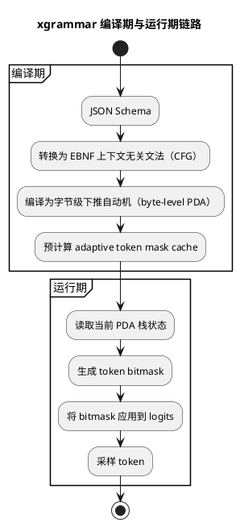
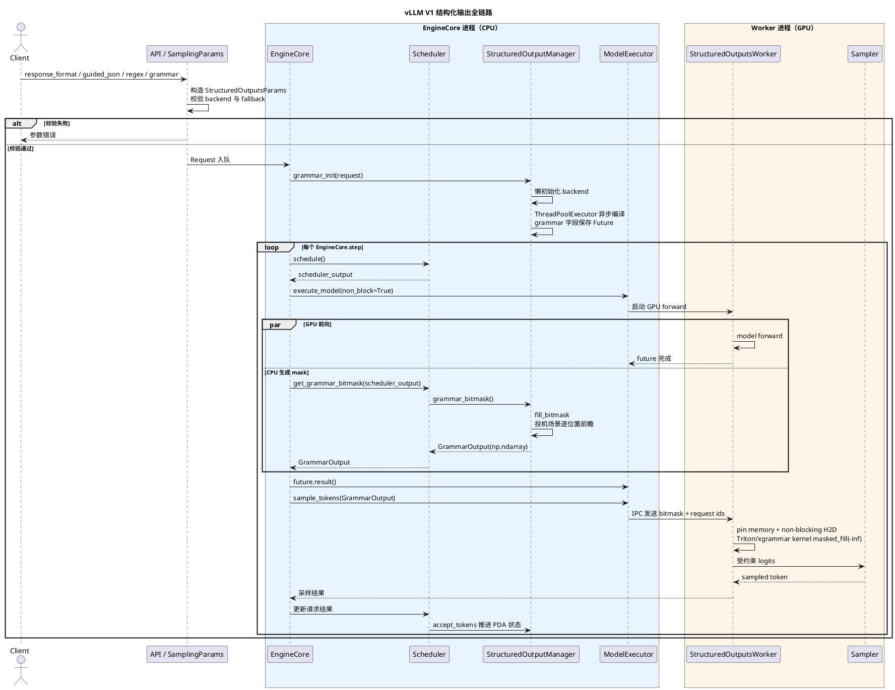
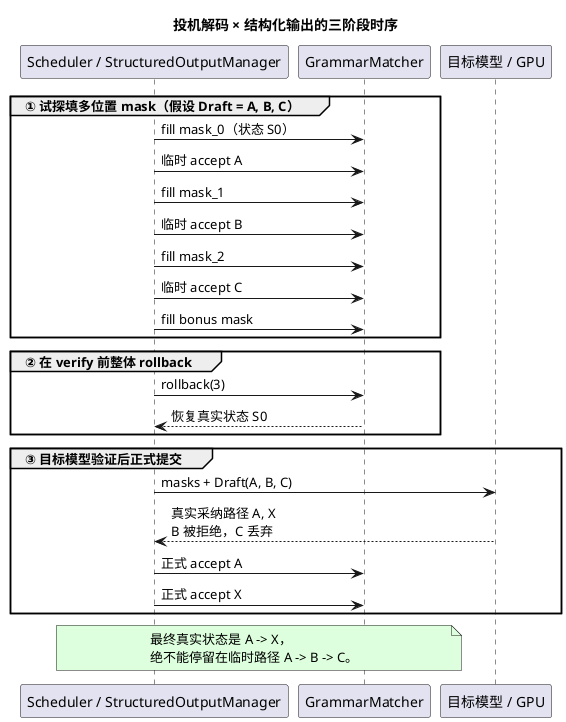
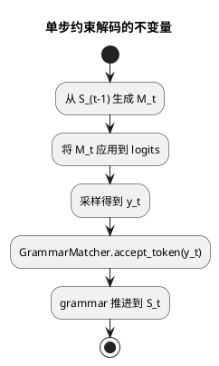
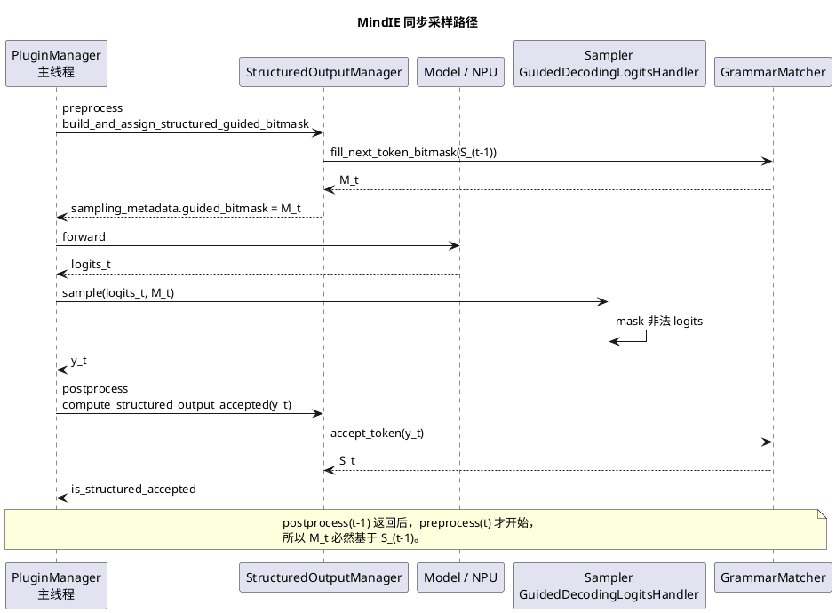
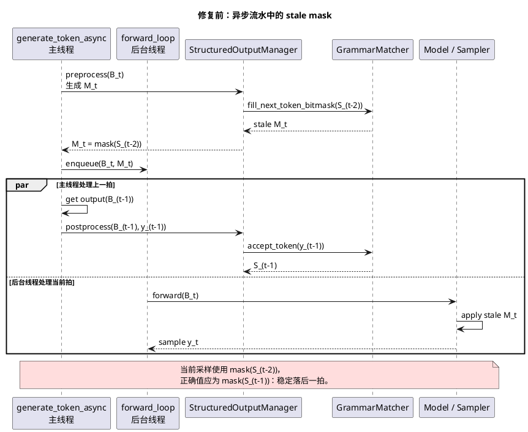
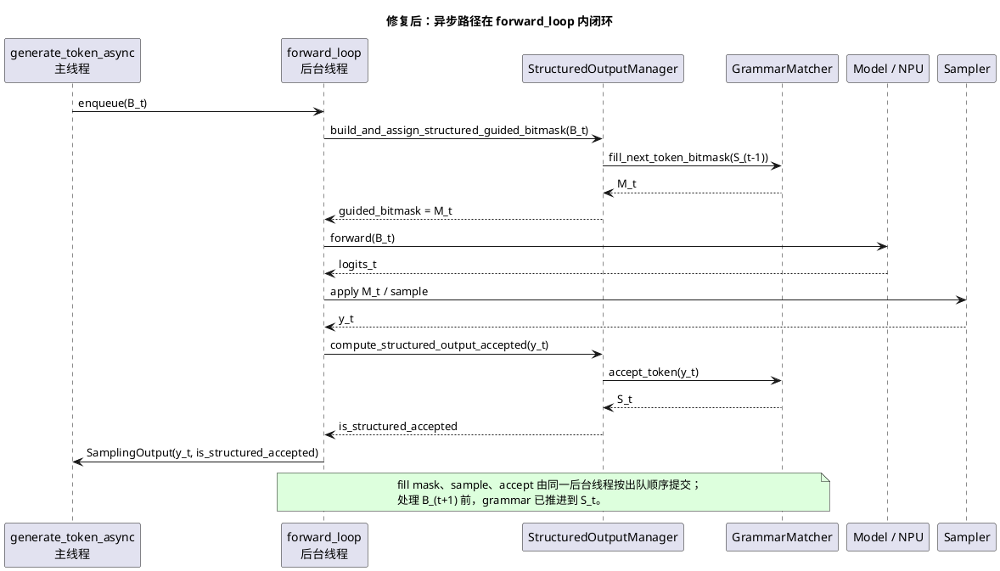
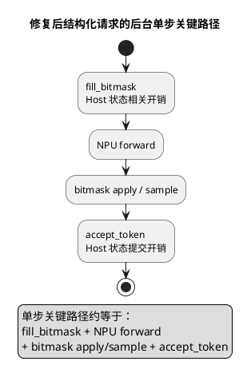

# 专题 03：结构化输出 / 约束解码——xgrammar 原理、对比、开销与副作用

> 对应题目：Q25/Q30（原理，答得不错）、Q31–Q34（副作用与缓存，答了一半）。这是候选人的强项，本文目标是把"答得不错"升级为"降维打击"。

---

## 1. 问题定义

结构化输出（structured output / guided decoding）：让 LLM 的输出**保证**符合某种形式规范——JSON Schema、正则、EBNF 语法、工具调用格式。仅靠 prompt 无法保证 100% 合法，约束解码在**采样阶段**硬性屏蔽非法 token：每步解码前算出"当前状态下合法的 token 集合"，把非法 token 的 logit 置 −inf。

核心难点是**词表与语法的错位**：语法定义在字符/字节层，而模型输出的是 token（一个 token 可能横跨多个语法单元，如 `{"na` 这种 token 同时消费了 `{`、`"`、`na`）。所以引擎必须能对 10 万+ 词表的每个 token 判断"从当前语法状态出发，接受这个 token 后是否仍合法"——每步都做全词表检查，朴素实现开销巨大。

## 2. xgrammar 原理（Q30 满分版，必背）

xgrammar（CMU Catalyst / MLC 团队，MLSys 2025）的处理链路：

**为什么是 PDA 而不是 FSM？** JSON 是递归结构（对象套对象、数组套数组），嵌套深度无界，正则/有限状态机（FSM）表达不了，需要带栈的下推自动机。面试里候选人说的"有限状态机"是常见的口误——说 PDA 更准确（简单正则约束确实可以退化为 FSM）。

**核心优化一：token 二分类 + 掩码预计算（xgrammar 的灵魂）**
把词表中的 token 分为两类：
- **context-independent tokens**（上下文无关，通常 >99%）：仅凭 PDA 当前位置（栈顶节点）即可判定合法性，与栈的深层内容无关 → **编译期预计算**好每个 PDA 位置的合法性，存入以栈顶节点为 key 的 adaptive token mask cache；
- **context-dependent tokens**（<1%）：需要检查整个栈才能判定 → 运行时用**持久化执行栈**（persistent execution stack，支持快速分支/回滚）现场检查。

运行时每步只需：查缓存拿到 99% token 的掩码 + 现场检查剩下 1%，mask 生成从"全词表模拟"降到微秒级。

**核心优化二：存储与系统协同**
- 掩码缓存按内容自适应选择存储格式（合法集小存白名单、非法集小存黑名单、否则存 bitmask），控制内存；
- PDA 结构做编译器式优化（内联、等价状态合并）；
- **与 GPU 计算 overlap**：mask 生成在 CPU 上进行，与 GPU 前向并行，把开销藏进 GPU 时间线；bitmask 以 int32 压缩位图传给 GPU，用 Triton/CUDA kernel 一次 `logits.masked_fill_(-inf)`。

## 3. 工作区代码佐证

**vLLM（`vllm/` 仓）：**
- `vllm/v1/structured_output/backend_xgrammar.py` —— xgrammar 后端：`xgr.GrammarCompiler(cache_enabled=True, cache_limit_bytes=VLLM_XGRAMMAR_CACHE_MB×1024²)` 做**编译缓存**（缓存上限由环境变量 `VLLM_XGRAMMAR_CACHE_MB` 控制，见 `vllm/envs.py`）；
- `vllm/v1/structured_output/__init__.py` —— `StructuredOutputManager`：编译任务丢进 `ThreadPoolExecutor` 异步执行，不阻塞主循环；
- `vllm/v1/structured_output/backend_guidance.py` / `backend_outlines.py` / `backend_lm_format_enforcer.py` —— 多后端并存，`vllm/config/structured_outputs.py` 的 `backend` 字段选择（默认 auto，具体优先级/fallback 顺序见 3.5.3）；
- `vllm/v1/core/sched/scheduler.py` —— scheduler 侧 `get_grammar_bitmask()` 生成掩码；`vllm/v1/worker/gpu/structured_outputs.py` —— GPU 侧 Triton kernel 应用 bitmask（CPU→GPU 传输细节见 3.5.4）；
- `vllm/v1/structured_output/request.py` —— 请求级 grammar 状态（支持投机解码场景的多位置 mask：rollback/accept_tokens 前瞻，详见 3.5.5）。

> 关于 `StructuredOutputManager` 的编译调度、后端抽象层、进程边界、配置与可观测性等更细的设计细节，见下面新增的 3.5 节，避免在这里重复展开。

**MindIE-LLM（`MindIE-LLM/` 仓，即候选人交付的特性）：**
- `mindie_llm/text_generator/plugins/structured_output/structured_output_manager.py` —— 总控：延迟导入 xgrammar、编译 grammar、matcher 缓存、生成 bitmask；
- `mindie_llm/text_generator/plugins/structured_output/structured_output_grammar.py` —— `XgrammarGrammar` 封装 `GrammarMatcher`：逐 token `accept_token`、`fill_next_token_bitmask`、终止检测；
- `mindie_llm/text_generator/plugins/structured_output/structured_output_bitmask.py` —— bitmask 应用到 logits（CPU/NPU 路径 `masked_fill_` 置 −inf）;
- `mindie_llm/text_generator/samplers/logits_handlers/pta_handlers.py` —— `GuidedDecodingLogitsHandler`（`@register_class("guided_decoding")`）在采样前挂载；
- 文档：`docs/zh/user_guide/feature/structured_output.md`。

对照可见 MindIE 的实现结构（manager/grammar/bitmask/logits handler 四层）确实是 vLLM 架构的迁移，与候选人 Q26 的叙述互相印证。

## 3.5 vLLM 结构化输出架构深潜（设计与实现细节）

> 本节是对第 3 节"工作区代码佐证"的展开，逐个模块深挖到具体类/方法，用于应对面试官"你说说 vLLM 具体怎么实现的"这类追问。以下所有结论均基于本地 `vllm/vllm/v1/structured_output/` 目录及相关文件的实际代码，**没有代码依据的地方会明确标注"未见明确实现"，不臆造**。

### 3.5.1 全链路图

一个带约束的请求从 API 层到采样完成的完整链路：

**关键点**：bitmask 的生成完全在 CPU / EngineCore 进程，GPU worker 进程只负责"搬运 + apply"，这与第 2 节说的"mask 生成与 GPU 计算 overlap"是同一件事的两个视角——`EngineCore.step()` 里 `execute_model(non_block=True)` 和 `get_grammar_bitmask()` 紧挨着调用，前者把 GPU 前向丢进后台执行，后者紧接着在 CPU 上算 bitmask，两者并发发生。

面试可以这样说："vLLM 把 bitmask 生成放在 scheduler 所在的 EngineCore 进程（CPU），worker 进程只做 H2D 拷贝和 apply，这样 CPU 算 mask 和 GPU 跑前向天然是并发的，不需要额外做 overlap，架构上就长这样。"

### 3.5.2 `StructuredOutputManager` 的职责与设计

`StructuredOutputManager`（`vllm/v1/structured_output/__init__.py`）是**engine 级**（一个 EngineCore 进程一个实例，不是每请求一个）的总控类，职责：

- **backend 单例化**：`self.backend` 全局只初始化一次（代码注释明确写了"V1 目前不支持同一引擎里混用多个后端"），首次调用 `grammar_init` 时按 `request.sampling_params.structured_outputs._backend` 创建对应 Backend 实例。
- **异步编译解耦主循环**：`grammar_init()` 把 `_create_grammar()` 提交给 `self.executor`（`ThreadPoolExecutor`，`max_workers = (cpu_count+1)//2`，代码注释解释了为什么不用默认的 `cpu_count*5`——编译是 CPU-bound 不是 IO-bound，线程数拉太高没有意义）。`request.structured_output_request.grammar` 被赋值为一个 `Future`；`StructuredOutputRequest.grammar` 是个 property，内部 `_check_grammar_completion()` 用 `future.result(timeout=0.0001)` 做非阻塞轮询——**没编译完就不会把请求放进 batch**，这正是第 6 节"编译未完成的请求挡在 batch 外"的具体实现方式。
  - **例外**：`external_launcher` 模式下 `_use_async_grammar_compilation` 被设为 `False`，同步编译。原因代码里写得很清楚——外部启动器模式每个 TP rank 都有自己的 scheduler，异步编译会导致不同 rank 上"编译完成"的时间点不一致，破坏 external_launcher 依赖的确定性假设。这是个很具体、可以直接背的死角知识点。
- **去重（如实说明）**：`StructuredOutputManager` 本身**没有**维护一个 Python 侧的"schema → 编译产物"哈希表来做请求间去重——每次 `grammar_init` 都会调用 `backend.compile_grammar()`。真正的去重发生在更底层：`XgrammarBackend.__post_init__` 里创建的 `xgr.GrammarCompiler(cache_enabled=True, cache_limit_bytes=...)` 是 xgrammar 库自带的编译产物缓存（与第 5 节讲的缓存是同一个东西），相同 schema 第二次编译时由 xgrammar 内部命中缓存，vLLM 侧代码没有额外的去重层。这点面试如果被问"vLLM 自己有没有做请求级去重"，如实回答"没有独立的去重表，缓存下沉给了 xgrammar 编译器"更准确，不要说成是 `StructuredOutputManager` 自己维护的缓存。
- **bitmask 批量填充的并行优化**：当结构化输出请求数超过 `fill_bitmask_parallel_threshold`（硬编码 128）且没有投机解码时，`grammar_bitmask()` 会把请求切成 `fill_bitmask_parallel_batch_size=16` 一批，丢进另一个专用线程池 `executor_for_fillmask`（`min(cpu_count//2, 8)` 个 worker）并行调用 `fill_bitmask`；小 batch 或有投机解码时走串行分支（因为投机解码分支里有逐 token 状态推进的顺序依赖，天然不可并行，见 3.5.5）。
- **grammar 初始化失败的错误处理（如实说明）**：`_create_grammar()` 里有一条明确的 TODO 注释——"we still need to handle xgrammar compilation failures, though it should be unlikely as we test that up front as well"。也就是说：大部分非法 schema 已经在 API 层 `SamplingParams._validate_structured_outputs()` 做过一次编译/校验提前拦截了，但 engine core 内部真正编译（`ThreadPoolExecutor` 里跑的那次）如果失败，**当前版本没有专门的 catch-and-fallback 逻辑**，异常会以 `Future` 异常的形式向上冒出来。这是一个可以主动指出的"当前实现尚未完善"的点，回答时不要说成"vLLM 有完善的编译失败重试机制"。

面试可以这样说："`StructuredOutputManager` 是 EngineCore 进程里的单例，核心设计是把编译丢给线程池、用 Future 的非阻塞轮询把'还没编译完'变成调度状态的一部分，编译完之前请求就是留在 WAITING，不会进 batch；它自己不做 schema 去重，去重是 xgrammar 编译器自带的缓存做的；编译失败目前代码里留了个 TODO，还没有兜底重试。"

### 3.5.3 后端抽象层设计

`vllm/v1/structured_output/backend_types.py` 定义了两层抽象：

- **`StructuredOutputBackend`（engine 级，dataclass + ABC）**：持有 `vllm_config` / `tokenizer` / `vocab_size`，定义 `compile_grammar(request_type, grammar_spec) -> StructuredOutputGrammar`、`allocate_token_bitmask(max_num_seqs)`、`destroy()` 三个抽象方法。`XgrammarBackend`、`GuidanceBackend`、`OutlinesBackend`、`LMFormatEnforcerBackend` 都实现这个接口，`StructuredOutputManager.grammar_init()` 里按 `backend` 字段字符串分发（`if backend == "xgrammar": ... elif backend == "guidance": ...`），四选一，可插拔。
- **`StructuredOutputGrammar`（request 级，ABC）**：定义 `accept_tokens`、`validate_tokens`、`rollback`、`fill_bitmask`、`is_terminated`、`reset` 五/六个抽象方法。每个请求持有一个自己的 `StructuredOutputGrammar` 实例（如 `XgrammarGrammar`，内部包着一个 `xgr.GrammarMatcher`），维护该请求独立的 PDA/自动机状态。

**`backend="auto"` 的优先级/fallback 逻辑（`vllm/sampling_params.py::SamplingParams._validate_structured_outputs`，逐字对照代码，不是推测）**：

1. 先尝试 `validate_xgrammar_grammar(self)`；成功则 `_backend = "xgrammar"`，**结束**。
2. 若第 1 步抛 `ValueError`（xgrammar 校验失败或 schema 含 xgrammar 不支持的特性），判断是否要跳过 guidance：
   - tokenizer 是非 tekken 的 Mistral tokenizer，或者
   - schema 命中 `has_guidance_unsupported_json_features`（guidance 也不支持的 JSON Schema 特性）；
   - 满足其一则跳过 guidance，直接 fallback 到 **outlines**（`validate_structured_output_request_outlines`，`_backend = "outlines"`）。
3. 否则 fallback 到 **guidance**（`validate_guidance_grammar`，`_backend = "guidance"`）。
4. `lm-format-enforcer` **不参与 auto 的自动选择**，只有用户显式指定 `backend="lm-format-enforcer"` 才会用。

也就是说 auto 模式的优先级是 **xgrammar > guidance > outlines**（outlines 只在"guidance 也搞不定"时兜底），这与第 4 节表格里"xgrammar 当前是主流默认选择"的结论完全一致，3.5.3 是对那句话的具体代码级证据。

`disable_any_whitespace`（仅 xgrammar/guidance 支持，`vllm/config/structured_outputs.py` 里用 `model_validator` 强制校验，非法组合直接在配置阶段报错）和 `disable_additional_properties`（仅 guidance 支持）也是同样的强校验思路，把"后端能力差异"提前到配置校验阶段而不是运行时才报错。

面试可以这样说："auto 模式不是随便选的，是有严格优先级的：先试 xgrammar，失败了看是不是 Mistral 非 tekken 分词器或者有 guidance 也不支持的 schema 特性，是的话降级到 outlines，不是的话降级到 guidance；lm-format-enforcer 必须用户手动指定，auto 不会选它。这个逻辑体现了 vLLM 团队对几个后端能力边界的取舍：xgrammar 最快优先用，guidance 表达能力最强兜底，outlines 是最后一道防线。"

### 3.5.4 scheduler 与 bitmask 生成的时序、CPU→GPU 传输

- **生成时机与位置**：确认是在 **scheduler（CPU 侧，`vllm/v1/core/sched/scheduler.py::Scheduler.get_grammar_bitmask()`）**，不是 worker/GPU 侧生成——这与第 3 节的描述一致。原因可以从代码接口反推：`StructuredOutputGrammar.fill_bitmask(bitmask, idx)` 底层调用的是 `xgr.GrammarMatcher.fill_next_token_bitmask`，这是纯 CPU/host 端 API，操作的是 PDA 状态和一个 CPU 侧的 `torch.Tensor` bitmask，不涉及任何 GPU 数据依赖，天然适合放在 CPU 侧、和 GPU 前向并发进行。
- **调用时机**：`EngineCore.step()`（`vllm/v1/engine/core.py`）里，`scheduler.get_grammar_bitmask(scheduler_output)` 紧跟在 `model_executor.execute_model(scheduler_output, non_block=True)` 之后调用——后者是非阻塞的，立刻返回一个 `future`，GPU 前向在后台跑；`get_grammar_bitmask()` 在这段等待期间同步执行，即 **bitmask 生成与 GPU 前向计算并发**。在带 batch queue 的 `step_with_batch_queue()` 里逻辑更复杂一点：如果本 step 存在"待定的投机解码 token"（`pending_structured_output_tokens`），bitmask 计算会被推迟到下一轮拿到 draft token 校验结果之后才做（`deferred_scheduler_output` 分支），这是为了保证投机解码的草稿 token 先经过验证再生成对应位置的 bitmask。
- **CPU → GPU 传输方式**：`GrammarOutput`（`vllm/v1/core/sched/output.py`，一个只有 `structured_output_request_ids: list[str]` 和 `grammar_bitmask: npt.NDArray[np.int32]` 两个字段的 dataclass）经由 executor（uniproc/multiproc/ray，取决于部署形态）从 EngineCore 进程传给 worker 进程/子进程，走的是普通的 IPC/序列化通道，代码注释里特意说明"转成 np.ndarray 而不是 tensor，因为序列化/反序列化效率更高"。
- **到 GPU 之后的拷贝细节**（**pin memory + 异步 H2D**，两套并存的实现，都验证了这个结论）：
  - 新的 `gpu/` model runner 路径：`vllm/v1/worker/gpu/structured_outputs.py::StructuredOutputsWorker.apply_grammar_bitmask`——用专门的 `self.copy_stream = torch.cuda.Stream()`，先把 numpy bitmask 包成 CPU tensor 走 `async_copy_to_gpu()`（`vllm/v1/worker/gpu/buffer_utils.py`：内部 `x.pin_memory()` + `out.copy_(pinned, non_blocking=True)`），再把 batch-index 映射表也构造成 `pin_memory=True` 的 CPU tensor 后 `non_blocking=True` 拷贝，最后用当前流 `wait_stream(copy_stream)` 做同步，再启动自研 Triton kernel `_apply_grammar_bitmask_kernel` 对 logits 做原地 `-inf` 填充。
  - 旧的 `GPUModelRunner` 路径：`vllm/v1/structured_output/utils.py::apply_grammar_bitmask`——先在 CPU 上把 bitmask 按 batch 内请求顺序重排（因为 scheduler 侧 bitmask 的顺序和 GPU runner batch 里请求的顺序不一定一致），重排用的 tensor 显式 `pin_memory=PIN_MEMORY` 分配，再 `.to(logits.device, non_blocking=True)` 异步搬运，最后直接调用 xgrammar 官方提供的 `xgr.apply_token_bitmask_inplace` kernel（而不是 vLLM 自己写的 Triton kernel）。
  - 两条路径殊途同归：**pin memory + `non_blocking=True` 的异步 H2D 拷贝**，只是新旧两代 model runner 各自的 kernel 实现不同（一个是 vLLM 自研 Triton kernel，一个是直接用 xgrammar 官方 kernel）。目前代码库里这两套 model runner 是并存的，这也是当前 vLLM 内部架构演进中的一个真实细节，不是我编的。

面试可以这样说："bitmask 生成确定是在 scheduler 所在的 CPU 进程，因为 xgrammar 的 matcher API 本身就是纯 CPU 接口；调用时机是紧跟在 execute_model 的 non-blocking 调用之后，天然和 GPU 前向并发；传输是走 EngineCore 到 worker 进程的 IPC，序列化成 numpy 而不是 tensor 更快；到了 GPU 侧统一是 pin memory + non_blocking 的异步 H2D，再用 kernel 做一次原地 masked_fill，vLLM 现在新老两套 model runner 分别用自研 Triton kernel 和 xgrammar 官方 kernel，思路是一样的。"

### 3.5.5 投机解码场景的特殊处理

> 代码锚点（`WORK/vllm` 核实）：`vllm/v1/structured_output/__init__.py::grammar_bitmask`；`backend_xgrammar.py`（`max_rollback_tokens` / `rollback` / `validate_tokens`）；正式推进在 `scheduler.py` 收到 `new_token_ids` 后 `grammar.accept_tokens`。

#### 三阶段时序（先搞清：临时推进 ≠ 正式提交）

vLLM 把「投机 × 结构化」拆成**互不混淆的三段**，核心原则是：**grammar 的真实状态只能跟着已被目标模型确认的 token 走**。

| 阶段 | 做什么 | grammar 状态变不变 | 代码 |
|---|---|---|---|
| **① 试探填 mask** | 沿 draft 临时 `accept_tokens`，边推进边 `fill_bitmask`，为每个 speculative 位置（+ bonus）算出合法集 | **临时变**：假设 draft **全被接受** 才会走到的状态；**不是**正式提交 | `grammar_bitmask()` 串行循环 |
| **② 整体 rollback** | 循环结束立刻 `grammar.rollback(state_advancements)`，把试探推进全部撤掉 | **回到窗口前真实状态** | 同函数末尾 |
| **③ 目标模型 verify → 正式 accept** | GPU 验证后真实路径可能与 draft 分歧；只对**最终采纳**的 token 再 `accept_tokens` | **正式推进**到与输出对齐的状态 | `scheduler` 在拿到 `new_token_ids` 后 |

#### 为什么必须「先 rollback，再 verify」——不是风格偏好

常见误解：「既然验证后才知道接受几个，那能不能等 verify 完再按接受长度从 k 回滚到 m？」——**不能当作默认时序**，原因有两层：

1. **正确性：真实路径可能与 draft 分歧，不只是「截断前缀」**  
   Draft = `A, B, C`，验证后 = `A, X`（A 接受、B 拒绝、分歧位改用 X，C 丢弃）。  
   - 若不先 rollback：grammar 会临时停在 `A→B→C`；真实应是 `A→X`。从 `A→B→C` **无法**只靠「回滚 2 步」得到 `A→X`——你还得先回到 `A` 再 accept `X`。把「全量临时推进」在 verify **之前**清掉，verify 后只需沿真实采纳序列做一次正式 `accept`，状态机契约最干净。  
   - 口语里说的「verify 后按接受长度回滚」容易让人以为是 `rollback(k→m)`；vLLM 实际是 **① 全量试探 → ② 全量 rollback → ③ 按真实路径正式 accept**。接受长度 m 决定的是**正式 accept 几个 token**，不是「从试探态回滚少几步」。

2. **暴露窗口：假状态不能拖过 GPU 验证这段时间**  
   填完多位置 mask 之后，GPU 还要跑目标模型前向 + 采样/拒绝采样，这段时间不短。  
   - 若 rollback 放在 verify **之后**：在整段验证期间，所有依赖 grammar 状态的逻辑（下一轮调度、其它请求旁路、异步路径上的推进判断、日志/一致性检查）看到的都是 `A→B→C` 这个**未验证的假状态**。  
   - 把 rollback 紧挨在试探循环之后、verify **之前**，假状态只存在于「算 mask 的那一小段 CPU 同步代码」里，暴露时间最短。

一句话金句：**试探推进是为了算对每个位置的 mask；rollback 是为了在目标模型开口之前把假假设撤掉；正式 accept 只认验证后的真实路径。**

#### 实现细节（与上表对应）

- **matcher 支持多步 rollback**：`XgrammarBackend.compile_grammar()` 创建 `xgr.GrammarMatcher` 时显式传入 `max_rollback_tokens=self.num_speculative_tokens`。可回滚深度在 matcher 创建时按投机草稿长度预先声明，不是无限回滚——能力在 xgrammar matcher（持久化执行栈），vLLM 不另维护 checkpoint 栈，只透传参数。
- **多位置 mask 前瞻**：`grammar_bitmask()` 按 `max_batch_size * (1 + max_num_spec_tokens)` 分配（每请求「1 个正常/bonus 位 + N 个投机位」）。串行分支对 `scheduled_spec_decode_tokens` 逐 draft token：先 `fill_bitmask`，再 `accept_tokens` 试探推进，再填下一位置——模拟「若 draft 全接受，语法状态如何演进」。循环用 `itertools.chain(req_tokens, (-1,))`，`-1` 哨兵填完 bonus 位后停止推进。
- **立刻整体 rollback**：本轮 `state_advancements` 次试探推进后统一 `grammar.rollback(state_advancements)`。这些推进**只为算对 bitmask**；真正是否接受要等 GPU 采样结果——故必须临时、试探性，算完立刻回滚。
  - `XgrammarGrammar.rollback()` → `self.matcher.rollback(num_tokens)`，并同步 `num_processed_tokens` / `_is_terminated`。
  - `validate_tokens()`：逐个 `accept_token` 直到非法，返回被接受前缀后**立即 rollback**（不改变真实状态）——用于草稿侧「先滤非法 draft、但不提交 grammar」（见 `scheduler.update_draft_token_ids`）。
- **正式推进时机**：verify 完成后 scheduler 拿到该请求最终 `new_token_ids`，在 `should_advance` 为真时调用 `grammar.accept_tokens(req_id, new_token_ids)`——这才是与输出对齐的提交。

面试可以这样说："投机 × 结构化是三段式：先沿 draft **临时**推进 grammar 给每个 speculative 位置填 mask——这时假设 draft 全接受，但**没提交**；填完立刻 **rollback** 回到真实状态；目标模型验证后真实路径可能和 draft 不一样（比如 draft ABC、验证后 AX），再按真实采纳序列 **正式 accept**。为什么 rollback 必须在验证前？一是分歧不一定是截断前缀，假状态 A→B→C 回不到 A→X；二是验证很耗时，越早 rollback，假状态暴露窗口越短。回滚能力来自 xgrammar 的 `GrammarMatcher.rollback`，创建时把 `max_rollback_tokens` 设成投机长度。"

**Reasoning / thinking 模型场景的特殊处理**：`StructuredOutputManager` 里有一整套围绕 `reasoner`（`ReasoningParser`，来自 `vllm.reasoning`）的逻辑：

- `should_fill_bitmask(request)`：如果请求配置了 reasoning parser 且 `enable_in_reasoning=False`（默认），在检测到"reasoning 还没结束"（`reasoner.is_reasoning_end(...)` / `is_reasoning_end_streaming(...)`）之前，**不填充 bitmask**（对应 `_fill_bitmasks` 里 `apply_bitmask=False` 分支：直接把整行 bitmask 设成"全部合法"的 `_full_mask`，即 `<think>...</think>` 内部不受语法约束）。
- `should_advance(request)`：同理，reasoning 没结束之前**不推进 grammar 状态**（`accept_tokens` 不会被调用），避免把思考内容错误地喂给 JSON/正则 FSM 导致状态被污染或提前拒绝。
- 投机解码 + reasoning 结合的边界：`grammar_bitmask()` 串行分支里专门维护了 `detect_reasoning_end` / `post_reasoning_end_in_window` 两个标志，逐草稿 token 判断"reasoning 是否恰好在这个投机窗口内结束"，一旦检测到就在**同一窗口内**把 `apply_bitmask` 从 `False` 翻转成 `True`，让约束从 reasoning 结束的下一个 token 开始生效；`trim_reasoning_for_advance()` 则负责把已经确认属于 reasoning 内容的 token 从"要喂给 grammar 推进"的列表里剔除（否则会把思考结束标记误判成语法非法内容，代码注释直接引用了具体 issue `#44006`）。
- `enable_in_reasoning` 配置项（`vllm/config/structured_outputs.py`）为 `True` 时则相反：reasoning 阶段也要受约束，`should_fill_bitmask` / `should_advance` 都直接返回 `True`。

这一段是**确认存在且相当细致**的实现，不是"猜测 vLLM 应该会跳过 think 标签"——具体表现为默认跳过 `<think>` 内部约束，通过配置项可以选择让约束也覆盖 reasoning 阶段，投机解码窗口内的边界处理专门做了兜底。

面试可以这样说："reasoning 模型场景 vLLM 是有专门处理的，默认思考过程里不加约束、也不推进 grammar 状态，等 reasoning parser 判断思考结束了才开始真正生效；这个判断和投机解码是解耦但又协同的——如果思考恰好在某个投机窗口内结束，会在同一个窗口里把约束从结束点之后打开，还专门处理了'思考结束标记不能被误喂给 grammar 导致拒绝'这个坑。这不是简单粗暴地整体开关，是 token 级精确控制。"

### 3.5.6 与 vLLM V1 架构的整合（进程边界）

V1 的 EngineCore / Scheduler / Worker 分离架构下，**每个请求的 grammar 状态（`StructuredOutputGrammar` 实例，内部包着 `xgr.GrammarMatcher`）维护在 EngineCore 进程里，具体挂在 `Request.structured_output_request.grammar` 上**，由 `Scheduler` 通过 `self.requests` 字典访问（`Scheduler.get_grammar_bitmask()` 里 `req := self.requests.get(req_id)`）——Scheduler 和 StructuredOutputManager 是同一个 EngineCore 进程内的两个协作对象，不跨进程。GPU worker 进程**不持有**任何 grammar 状态，只接收每 step 算好的 `GrammarOutput`（纯数据，bitmask + 请求 id 列表）来 apply，worker 侧没有反向修改 grammar 状态的路径——状态推进（`accept_tokens`）、回滚（`rollback`）、终止判断（`is_terminated`）全部发生在 EngineCore/Scheduler 侧。

这个设计的合理性：grammar 状态是与"已经生成了哪些 token"强相关的、请求生命周期内单调演进（或投机场景下短暂前瞻再回滚）的状态机，天然应该和调度决策（哪些请求进入本 step、投机 token 是否被接受）放在同一个地方维护，避免跨进程同步 PDA 状态的复杂度和开销；worker 进程只需要一份"当前 step 每个位置允许哪些 token"的只读快照（bitmask），职责边界清晰。

面试可以这样说："V1 架构下 grammar 状态是维护在 EngineCore 进程里、挂在每个 Request 对象上的，Scheduler 直接访问，不用跨进程同步；worker 进程完全无状态，每 step 只拿到一份算好的 bitmask 去 apply，状态机本身的推进和回滚都不会下发到 worker，这样职责边界很干净，也避免了 GPU 进程和 CPU 调度进程之间同步一个复杂状态机的麻烦。"

### 3.5.7 配置与可观测性

`vllm/config/structured_outputs.py::StructuredOutputsConfig` 实际存在的字段（逐字段核对，未见的字段不列）：

| 字段 | 默认值 | 说明 |
|---|---|---|
| `backend` | `"auto"` | `"auto" \| "xgrammar" \| "guidance" \| "outlines" \| "lm-format-enforcer"`，auto 的优先级见 3.5.3 |
| `disable_any_whitespace` | `False` | 仅 xgrammar/guidance 支持；`True` 时 JSON 输出不含空白字符；配了但 backend 不支持会在配置阶段直接报错（`model_validator`） |
| `disable_additional_properties` | `False` | 仅 guidance 支持，让 guidance 的行为向 outlines/xgrammar 对齐 |
| `reasoning_parser` | `""` | 选择 reasoning parser（决定 `StructuredOutputManager.reasoner_cls`） |
| `reasoning_parser_plugin` | `""` | 动态加载自定义 reasoning parser 插件的路径 |
| `enable_in_reasoning` | `False` | 是否在 reasoning 阶段也施加结构化约束，见 3.5.5 |

**如实说明**：本地代码里**没有找到** `disable_fallback` 这个字段（部分版本/文档里可能提到过类似配置，但当前读到的 `StructuredOutputsConfig` 里不存在），也没有找到独立的、结构化输出专属的 Prometheus metrics 埋点（比如"grammar 编译耗时分布""bitmask 生成耗时"这类指标，在 `structured_output` 目录和相关文件里没有搜到 metrics/counter 相关代码）。可观测性目前主要靠：

- **日志**：`logger.error(...)`（`backend_xgrammar.py` 里 FSM 推进失败、grammar 校验失败等路径都有 `init_logger(__name__)` 打的 error 日志，能定位到具体 request_id 和失败 token）；
- **代码注释里引用的历史 issue 号**（如 `#44006`、`#45436`、`#42452`）——这些是修 bug 时留下的追溯线索，不是系统化的可观测性设计。

这一点如果被问到"vLLM 有没有针对结构化输出做专门的监控指标"，如实回答"当前版本代码里没有看到专门的 metrics 埋点，主要靠日志和请求失败时的异常信息"比编一个"有完善的 Prometheus 指标体系"更稳妥。

环境变量层面（`vllm/envs.py`）目前只确认存在 `VLLM_XGRAMMAR_CACHE_MB`（默认 `512`，控制 xgrammar 编译缓存的字节上限，见第 5 节）和 `VLLM_REGEX_COMPILATION_TIMEOUT_S`（`vllm/v1/structured_output/utils.py::compile_regex_with_timeout` 使用，给正则编译加超时保护，防止对抗性正则如 `(a+)+b` 触发指数级状态空间爆炸的 ReDoS，超时后主动抛 `ValueError` 而不是让 worker 卡死）。

面试可以这样说："配置项我核对过代码，实际存在的就是 backend、disable_any_whitespace、disable_additional_properties、reasoning 相关的几个和 enable_in_reasoning；可观测性这块 vLLM 目前没有做专门的 metrics，主要靠日志兜底，这也是一个可以指出的、我们做的话可以补上的点——比如加编译耗时、缓存命中率的 metrics。另外有一个我觉得设计得不错的细节：正则编译单独加了超时保护，防 ReDoS，这个是独立于 xgrammar 缓存之外的一层防御。"

## 3.6 MindIE 同步 / 异步采样路径与 mask 错位 bug 复盘（简历重点追问）

> 简历原文：**“定位并修复约束解码与异步调度叠加场景下的 mask/采样步错位 bug，保障高并发下的解码正确性。”**
>
> 历史证据：初版结构化输出合入 `278c79b`（2026-03-13）；修复所在的后续合入 `737fa89`（2026-03-29）。以下“旧路径”来自二者 diff，不是根据现状代码倒推。

### 3.6.1 先建立不变量：第 t 步 mask 必须由第 t-1 步采样后的 grammar 状态生成

设 `S_t` 为接受 token `y_t` 后的 GrammarMatcher 状态，`M_t = mask(S_{t-1})` 为采样 `y_t` 时使用的合法集合，则正确顺序只能是：

因此需要同时对齐三样东西：**请求身份、grammar 状态、采样步号**。只要 mask 是旧状态生成的，即使最终应用到了正确的 logits tensor，也仍然是错误约束。

### 3.6.2 同步路径为什么天然正确

当前同步链路在 `PluginManager.generate_token()` 的单线程调用栈内闭环：

`postprocess(t-1)` 完成后调用才返回，下一次 `preprocess(t)` 才会开始，所以 `M_t` 一定看得到 `S_{t-1}`，不存在上一拍 token 尚未提交的问题。现状代码也显式用 `if not self.async_inference` 把这条 mask 生成路径限定为同步模式。

### 3.6.3 旧异步路径的根因：把同步钩子原样放进流水线，跨错了线程边界

MindIE 异步调度不是“把同一个函数加个 async”这么简单，而是主线程和 `forward_loop` 后台线程组成一拍流水：

- 主线程：准备本拍 `B_t` 的 `model_inputs / sampling_metadata`，同时取回并后处理上一拍 `B_{t-1}` 的输出；
- 后台线程：对入队的 batch 做 forward、mask apply 和 sample。

初版 `278c79b` 把两个结构化输出钩子放在了同步语义的位置：

1. 在主线程 `preprocess(B_t)` 里生成 `M_t`；
2. 在主线程 `postprocess(B_{t-1})` 里才用 `y_{t-1}` 推进 grammar。

但异步调用的真实顺序是 **先 preprocess 当前拍，再 postprocess 上一拍**：

所以 `B_t` 使用的是 `M_t = mask(S_{t-2})`，而正确值应为 `mask(S_{t-1})`：**mask 稳定落后采样一步**。这不是 xgrammar 算错，也不是 bit 位序或 NPU `masked_fill_` 算错，而是状态推进与下一步 mask 生成分属两个线程、生命周期却仍按同步路径设计。

高并发会让它更容易暴露，但根因不是“并发随机改坏内存”；即使单请求，只要异步流水进入稳态，也具备这一拍错位条件。高并发只是扩大线程交错、动态 batch 换入换出和多个状态同时在途的观测概率。

### 3.6.4 错位时具体会输出什么

以 JSON 对象开头为例：

| 采样步 | 正确 grammar 状态 | 正确 mask 应允许 | 旧异步实际 mask | 可能结果 |
|---|---|---|---|---|
| `t=0` | 初始态 `S_-1` | `{` 等合法起始 token | 初始态 mask | 采到 `{`，此步正常 |
| `t=1` | 已接受 `{` 的 `S_0` | `"`、空白、`}` 等对象内部 token | 仍是初始态 `mask(S_-1)` | 可能再次采到 `{`，形成 `{{` |
| `t=2` | 正确状态本应已消费前两 token | 应由真实前缀决定 | 继续落后一拍，且前一步非法 token 可能被 matcher reject | mask 与输出游标进一步分叉 |

“多一个 `{`”是最直观的 off-by-one 表现；换成字符串、数组或枚举 schema，也可能表现为重复定界符、合法 token 被错误屏蔽、非法 token 被放行，最终得到非法 JSON，或在后续 `accept_token` 时被拒绝。由于 mask 错位后仍可能碰巧与下一状态的合法集有交集，所以它不保证每一步都报错，也因此比直接 crash 更难定位。

### 3.6.5 修复：让异步 mask 与状态推进都在 `forward_loop` 内形成同线程闭环

`737fa89` 做的关键改动不是“加锁”，而是**重定执行阶段**：

1. 同步路径继续在 `preprocess` 生成 mask、在 `postprocess` 推进状态；
2. 异步路径不再在主线程 `preprocess` 生成 mask；`forward_loop` 出队拿到本拍 `ModelInputWrapper` 后，才调用 `build_and_assign_structured_guided_bitmask`；
3. `forward_loop` 采样得到 `y_t` 后，立即调用 `compute_structured_output_accepted` 推进同一 `cache_id` 的 grammar，再进入下一拍；
4. 接受结果写入 `sampling_output.is_structured_accepted`，主线程后续 `postprocess` 只消费结果，不再二次推进 grammar。

修复后的异步顺序是：

这把 `fill mask → sample → accept` 放回同一所有权域，后台线程对 batch 的串行出队顺序自然就是 grammar 的提交顺序；既消除了 stale mask，也避免靠跨线程锁去猜“上一拍是否已经 postprocess 完”。

配套防线还有两项，但要与主 bug 区分：

- **状态 key 改为 `cache_ids` / context handle**：在重计算、PD 分离或 sequence 生命周期变化时，让 matcher 跟随真实运行态，而不是只跟逻辑 sequence id；这是身份对齐问题。
- **Decode 先 sync/replay 再生成 mask，且使用 `num_tried_tokens` 作为 replay 游标**：C++ 输出缓冲会保留 rejected token，若用只统计合法 token 的 `num_processed_tokens` 切 replay buffer，会再次发生游标错位；这是 PD/recompute 的相邻问题，不是最初异步“一拍落后”的直接根因。

异步模式还会清理 `infer_context.last_sampling_metadata`，防止跨 batch 复用旧采样元数据；它是必要的 cache 隔离措施，但也不是主修复点。

### 3.6.6 对异步性能的影响：牺牲一小段错误 overlap，保留主流水收益

修复前，mask 在主线程 `preprocess` 计算，表面上可以与上一拍 NPU forward 重叠；但这段 overlap 使用的是尚未推进的状态，因此没有正确性意义。修复后，状态相关的两个 CPU 操作进入后台线程关键路径：

因此理论影响是：

- **结构化请求的 TPOT / step latency**：增加了不能再跨拍隐藏的 `fill_bitmask + accept_token` host 开销；batch 中约束请求越多、schema 状态越复杂，影响越明显。
- **首次请求 TTFT**：若 schema 编译缓存未命中，grammar 初始化/编译也发生在 mask 构建链路上，首拍停顿远大于单步 matcher 开销；编译缓存命中后才主要剩运行期开销。
- **无结构化请求**：不会生成/应用有效 bitmask，只多极轻的条件判断，基本不受此修复影响。
- **异步调度的核心收益仍在**：主线程仍可准备下一批 model inputs，后台线程仍跑当前批 NPU forward；被取消的只是“依赖上一 token 的 grammar 计算跨到上一 token 提交之前”这一段非法 overlap，不是把整个异步模式退化成同步。

**必须守住的口径**：本仓库与合入说明没有提供这次修复前后的 TPOT/吞吐 A/B 数据，因此不能把第 5.5 节基于公开资料的“<1%～3% 量级估计”冒充成 MindIE 实测。面试回答应是：“正确性验收通过；性能上会把微小的 matcher 状态相关开销放回 forward 关键路径，但保留 CPU 准备与 NPU forward 的主流水重叠。具体百分比当时没有形成可引用 benchmark，我不会编数。”

若要补性能证据，至少做四组 A/B：同步/异步 × 无约束/结构化，固定模型、batch、输入输出长度与 schema cache 命中状态，分别看 TTFT、TPOT、吞吐和 NPU 利用率；再按结构化请求占 batch 比例做 0%/25%/50%/100% 分层。

### 3.6.7 面试追问速答

**Q：为什么不加锁，让主线程等上一拍 postprocess 完再算 mask？**

A：可以保正确，但会把主线程流水显式阻塞在上一拍结果上，而且状态所有权仍跨线程，容易继续出现重复推进或漏推进。把生成与推进都收口到 `forward_loop`，顺序由单一消费者天然保证，契约更简单。

**Q：为什么 mask 要在 forward 前生成，不能 logits 出来后再生成？**

A：合法集合只依赖请求的 grammar 状态，不依赖本步 logits；在 forward 前生成能把数据挂到同一 `sampling_metadata`，采样 handler 直接消费。当前 MindIE 修复优先保证同线程顺序；若要进一步 overlap，可在 `y_t` 被接受、得到 `S_t` 后预生成下一步 mask，但必须绑定 request/cache_id 和 step/version，动态 batch 变化时还要安全重排或丢弃。

**Q：为什么有时只是多一个 `{`，有时到后面才失败？**

A：相邻 grammar 状态的合法 token 集合可能部分重叠。stale mask 只有在“旧状态允许、当前状态不允许”的 token 被采中时才显性出错；否则错误会潜伏到更后面的定界符或 matcher reject。

**Q：这个 bug 与 `num_tried_tokens` 有什么关系？**

A：都是“grammar 状态与真实输出游标不一致”，但层级不同：异步 bug 是跨线程流水导致 mask 落后一拍；`num_tried_tokens` 是 PD/replay 时 rejected token 仍占输出槽位，若拿 accepted count 当 buffer 下标会发生游标错位。面试时应分开讲，最后再总结为同一个状态一致性原则。

**60 秒项目复盘（可直接背）**：

> “这个 bug 的根因不是 xgrammar 或 NPU mask 算子，而是把同步路径的钩子原样放进异步流水。同步时是上一 token 在 postprocess 推进 matcher 后，下一步 preprocess 才生成 mask；异步时主线程先 preprocess 当前 batch，再 postprocess 上一 batch，所以当前 mask 实际按上上步状态生成，稳定落后一拍。最典型就是第一步生成 `{` 后，第二步仍拿初始态 mask，可能再放行一个 `{`。修复没有靠加锁，而是把异步的 mask 生成和采样后的 `accept_token` 都收口到 `forward_loop`：出队后生成本步 mask，采样后立刻推进同一 cache_id 的 matcher，再处理下一拍；接受结果随 SamplingOutput 交给主线程。性能上是把 matcher 的微小 host 开销放回 forward 关键路径，但 CPU 准备与 NPU forward 的主流水仍保留；当时没有可引用的 TPOT A/B，所以我只说正确性验收，不编百分比。”

## 4. 主流后端对比（Q25 加分项）

| 后端 | 核心技术 | 表达能力 | 每步开销 | 特点 |
|---|---|---|---|---|
| **xgrammar** | 字节级 PDA + 预计算 mask cache | CFG（JSON Schema/EBNF/regex） | 微秒级（99% 预计算） | 当前 vLLM/SGLang/TensorRT-LLM 默认或主流选择；C++ 内核可移植 |
| **Outlines** | 正则→FSM，token 级状态转移表 | 正则/JSON Schema（递归结构受限，需展开近似） | 查表 O(1)，但 FSM 编译可能很慢（复杂 schema 分钟级曾是痛点，core 已用 Rust 重写） | 学术起源（arXiv:2307.09702），生态成熟 |
| **Guidance / llguidance** | Earley 解析 + token 前缀树，lazy 计算 | CFG，表达最灵活 | 每步动态解析（llguidance 用 Rust 优化到 ~50μs） | 支持模板编程式约束；llguidance 是 vLLM 的 `guidance` 后端 |
| **lm-format-enforcer** | token 级前缀匹配 | JSON Schema/regex | 中等 | 实现简单，性能一般 |

一句话对比（背）："**Outlines 是'正则→FSM 查表'，快但表达受限、编译慢；Guidance/llguidance 是'运行时解析'，灵活但每步要算；xgrammar 走中间路线——PDA 支持完整 CFG，又把 99% 的判定预计算掉，所以既通用又快。**"

## 5. 编译开销与缓存（Q32–Q34 完整版）

开销分两段：
1. **编译期（per-schema）**：Schema→EBNF→PDA→mask cache 预计算，跑在 CPU，复杂 schema 百毫秒级（候选人实测约 100–200ms，与 xgrammar 论文量级一致）。这段直接加在**首 token 延迟（TTFT）**上。
2. **运行期（per-token）**：查掩码缓存 + 检查 context-dependent token + apply bitmask，xgrammar 下通常 <1% 的每步开销，且可与 GPU overlap 掉。

**缓存设计（候选人的方案 vs vLLM）：**

> ⚠ **代码真相（上场倒背）**：`structured_output_manager.py` 中 `_DEFAULT_GRAMMAR_CACHE_SIZE = 100`；超限时 `next(iter(self._grammar_cache))` 删最早插入项，**命中不 move-to-end** → 实际是 **FIFO / 默认 100 条**，不是 LRU/128。简历若仍写 LRU，面试用下方诚实话术对齐。

- 候选人（MindIE）：对规范化 schema 串做 **SHA-256** 为 key，内存缓存 `CompiledGrammar`；默认容量 **100**（`grammar_cache_size` 可配），淘汰为 **FIFO**（普通 `dict` 插入序）。相同 schema 二次请求零编译。业务侧 schema 集合通常稳定、近「全热」，FIFO 与 LRU 收益差小，故选实现最简方案。
- vLLM：把缓存下沉给 `xgr.GrammarCompiler(cache_enabled=True)`，以**字节数上限**（默认 512MB，`VLLM_XGRAMMAR_CACHE_MB`）而非条数控制内存——按条数的隐患是单条产物大小方差大；按字节更稳。这是可主动说的自我迭代点（条数 + 字节双门限）。
- 更进一步：多实例场景下编译缓存是 per-instance 的，schema 亲和路由（同 schema 请求进同实例）可以提高命中率——与 KV 亲和调度是同构问题。

## 5.5 关键性能数据（面试可用数值，速查表）

> **口径说明**：下表数字是**经验值 / 量级估计**，用来支撑论述的说服力，不是本仓库跑出来的精确 benchmark（本地代码里没有现成的性能测试报告，只有 cache 容量、bitmask 宽度这类结构性常量可以反推）。面试时可以自信地说出这些数字，但如果对方追问"你是怎么测的、测试环境是什么"，要坦诚说"这是基于 xgrammar 论文（arXiv:2411.15100）和 vLLM/SGLang 公开 benchmark 量级 + 我们编译缓存配置反推的估计值，不是严格复现的基准测试"，避免被当场戳破。所有数字与前文（100–200ms 编译耗时、llguidance ~50μs、**FIFO 默认 100 条**、12.8 万词表、SHA-256）严格衔接、不矛盾。

| 维度 | 数值 | 说明 |
|---|---|---|
| **编译期开销 – 简单 schema**（扁平 JSON，≤5 字段，无嵌套/无 union） | **约 5–15ms** | EBNF 转换 + PDA 构建都很浅，mask cache 预计算的状态数少；比复杂 schema 快一个量级 |
| **编译期开销 – 复杂 schema**（深嵌套对象/数组 + 多 union/anyOf） | **约 100–200ms** | 与前文候选人实测口径一致；PDA 状态数多，adaptive mask cache 预计算的节点数随嵌套深度和分支数近似指数增长 |
| **运行期 mask 生成 – 缓存命中路径**（context-independent，>99% token） | **约 10–30μs/步** | 只是按当前 PDA 栈顶节点做一次 cache 查表，拿到预计算好的 bitmask/白名单/黑名单 |
| **运行期 mask 生成 – 现场检查路径**（context-dependent，<1% token） | **约 50–150μs/步** | 需要遍历持久化执行栈做逐 token 校验，比查表贵 3–5 倍，但因为占比 <1%，对总开销影响很小 |
| **单步总 mask 生成耗时**（缓存命中占主导时的加权平均） | **约 20–80μs/步** | 二者按 >99% / <1% 加权后的量级；与 CPU 前向 overlap 后基本不占用关键路径时间 |
| **bitmask apply 到 logits（kernel 耗时）** | **约 10–50μs**（vLLM Triton kernel 约 10–30μs；MindIE NPU `masked_fill_` 路径约 20–50μs，12.8 万词表、单请求量级） | int32 压缩位图展开成 per-token mask 再做一次 `masked_fill_(-inf)`，是纯 element-wise 操作，随 batch size 近线性增长 |
| **TPOT 增量占比**（xgrammar vs 无约束解码） | **约 <1%~3%**（典型场景 <1%，复杂 schema 且 context-dependent token 占比略高时可到 2–3%） | 呼应第 6 节"压到接近零"的结论——不是零，但足够小，通常淹没在 GPU 前向的方差里 |
| **TTFT 增量 – 缓存未命中**（首次编译） | **+100–200ms**（复杂 schema）/ **+5–15ms**（简单 schema） | 编译是同步阻塞在首 token 前的开销，等于上面两行编译期开销直接加到 TTFT 上 |
| **TTFT 增量 – 缓存命中**（相同 schema 复用） | **约 +0.1–0.5ms** | 只有 cache 查找（SHA-256 哈希 + dict 查表）+ 创建一个新的 `GrammarMatcher` 状态对象，无需重新编译 PDA |
| **编译缓存命中率**（同 schema 高频复用场景，如固定 tool-calling schema、Agent 场景） | **约 85%–95%**（默认 100 条 FIFO 容量下，经验量级） | 工具调用类场景 schema 种类通常个位数到几十个，100 条足够覆盖；长尾/每请求自定义 schema 会掉到 20% 以下——这也是"按字节数而非条数控制缓存"更稳的原因（见第 5 节 vLLM 对比） |
| **内存占用 – 单请求 bitmask** | 12.8 万词表 ÷ 32 bit/int32 ≈ **4000 个 int32 ≈ 15.6KB/请求** | 直接由 `vocab_size // 32` 的 bitmask 宽度推出，是精确计算而非估计 |
| **内存占用 – 预分配 bitmask buffer**（batch=64 典型配置） | 64 × 15.6KB ≈ **1MB** 量级 | 按 batch 维度预分配，避免每步重新分配内存 |
| **内存占用 – 编译产物 + mask cache**（默认 100 条 FIFO） | 单条编译产物量级 **几百 KB ~ 几 MB**（视 schema 复杂度），100 条上限总量可到 **几十 MB ~ 数百 MB** | 这正是第 5 节提到的隐患：条数控制不如字节数控制稳（vLLM 默认 512MB 字节上限），面试可以主动提这个自我迭代点 |
| **每步开销横向对比** | Outlines FSM 查表约 **10–20μs**（命中路径，编译慢是主要痛点）；llguidance 约 **~50μs**（Rust 优化后的动态解析）；xgrammar 约 **20–80μs**（查表为主 + 少量现场检查） | 三者同量级（微秒级），xgrammar 略高于纯查表的 Outlines，但表达能力（完整 CFG）更强，编译期又比 Outlines 快得多——这是"通用性和速度的中间路线"的量化体现 |

**记忆技巧（面试脱口而出版）**：

- "编译耗时简单 schema 个位数到十几毫秒，复杂 schema 100–200 毫秒，差一个量级，都在 TTFT 上。"
- "mask 生成命中缓存是十几到几十微秒，现场检查贵三到五倍但占比不到 1%，加权下来单步二十到八十微秒。"
- "TPOT 增量压到 1% 以内，极端情况到 2%–3%，基本可以忽略。"
- "默认 100 条 FIFO：tool-calling 这种 schema 种类少的场景命中率能到 90% 左右，长尾自定义 schema 场景会明显下降；被问为何不是 LRU——业务近全热，FIFO 够用且实现最简。"
- "12.8 万词表的 bitmask 一条就 15.6KB，batch 64 预分配大概 1MB，这个内存账目算得清清楚楚。"

## 6. 副作用（Q31 满分版，必背）

1. **TTFT 增加**：首次编译 schema 的 CPU 耗时（百毫秒级）计入首 token；缓解：编译缓存 + 异步编译（vLLM 用线程池，编译未完成前请求不进 batch）。
2. **每步解码开销**：mask 生成 + bitmask apply，慢后端（朴素 Outlines/enforcer）可使 TPOT 显著上升；xgrammar 通过预计算 + overlap 压到接近零。
3. **输出质量风险**：约束是贪心的——模型想输出的高概率 token 被 mask 掉时，被迫走低概率路径，可能产生"合法但语义差"的输出（例如被 schema 逼着提前闭合括号）；研究表明过强约束可能损害下游任务表现，缓解手段是 schema 设计宽松些、或配合少量 few-shot 让模型"本来就想"输出合法格式。
4. **调度复杂度**：约束状态是请求级、随每个 accept_token 演进的状态机，与**投机解码**（多位置 mask 需沿 draft **临时**推进 grammar、算完立刻 rollback、verify 后才正式 accept）、**异步调度**（候选人踩过的坑：mask 应用与异步输出的时序）组合时正确性成本高。vLLM 是三段式「试探推进 → 立刻整体 rollback → 真实路径正式 accept」——rollback 必须在 verify 前（假状态别拖过 GPU 验证；分歧可能换 token 不只截断），回滚能力下沉给 xgrammar matcher（`max_rollback_tokens` 按投机长度声明），详见 3.5.5。
5. **batch 内干扰**：同 batch 里有约束请求时，mask 生成在关键路径上，慢 schema 会拖累整个 step（所以 vLLM 把未编译完的请求挡在 batch 外）。
6. **内存**：mask cache（词表 12.8 万 × 每 PDA 节点）与编译产物占内存，需要容量控制（见第 5 节）。

## 7. 理想的一段自我陈述（可直接背）

> "我在 MindIE 从 0 到 1 交付了结构化输出：链路是用户传 JSON Schema，xgrammar 把 Schema 转成 EBNF 再编译成字节级下推自动机——JSON 是递归结构所以需要 PDA 而不是 FSM；xgrammar 的核心优化是把 99% 以上的'上下文无关 token'的合法性在编译期预计算进 adaptive token mask cache，运行时每步查缓存加检查极少数上下文相关 token，生成 bitmask 后在采样器里把非法 token 的 logit 置 −inf。副作用主要三块：编译耗时加在 TTFT 上，我做了 SHA-256 key + 默认 100 条 FIFO 的编译缓存把重复 schema 的编译开销消掉（schema 集合稳定时 FIFO 与 LRU 收益接近，实现最简）；每步 mask 开销 xgrammar 本身已经用预计算和 CPU/GPU overlap 压得很低；另外要注意强约束可能把模型逼进低概率路径影响输出质量，以及它和投机解码、异步调度组合时的状态回滚复杂度——我们就在异步调度叠加约束时踩过时序 bug。"

## 8. 参考链接

- XGrammar: Flexible and Efficient Structured Generation Engine for LLMs (arXiv:2411.15100, MLSys 2025)；catalyst.cs.cmu.edu/projects/xgrammar
- Outlines: Efficient Guided Generation for LLMs (arXiv:2307.09702)
- llguidance：github.com/guidance-ai/llguidance
- vLLM structured outputs 文档：docs.vllm.ai → Features → Structured Outputs
