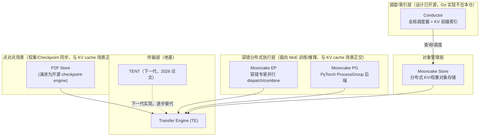
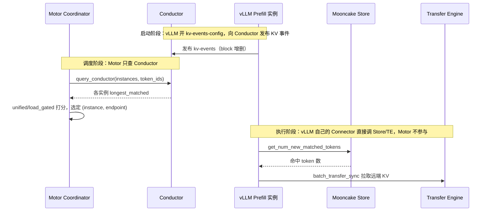

# 专题 04：KV cache 亲和调度 / prefix-aware routing 与 Mooncake 架构

> 对应题目：Q4–Q9（候选人的核心项目，其中 Q6–Q7 Mooncake 底层没答上）。本文把 Motor 的做法、vLLM production-stack router 的做法、Mooncake 底层三块打通，全部配工作区真实代码路径。

---

## 1. 问题：多实例下的前缀缓存碎片化

单实例的 vLLM 有自动前缀缓存（automatic prefix caching）：KV cache 按 block（如 16 token）组织，每个 block 的哈希 = 链式哈希(父 block hash, 本 block token ids)，新请求按 block hash 找最长命中前缀，跳过已算部分的 prefill。工作区佐证：

- `vllm/v1/core/kv_cache_utils.py` —— `BlockHash`、`hash_block_tokens()`（链式哈希，算法可选 sha256，见 `vllm/config/cache.py` 的 `prefix_caching_hash_algo`）
- `vllm/v1/core/kv_cache_manager.py` —— `get_computed_blocks()` 返回最长命中
- `vllm/v1/core/single_type_kv_cache_manager.py` —— `find_longest_cache_hit()`
- 开关：`enable_prefix_caching`（`vllm/config/cache.py`，V1 默认开启）

**多实例部署时问题出现**：普通负载均衡（round-robin）把同前缀的请求打散到不同实例，每个实例都要重复 prefill 同样的前缀——缓存命中率随实例数下降。**KV 亲和调度（prefix-cache-aware routing）**要做的就是：请求进来前先判断"哪个实例已经缓存了这个请求的最长前缀"，在缓存收益与负载均衡之间做权衡。

## 2. MindIE Motor 的设计（候选人项目，配 PyMotor 仓佐证）

Motor（工作区 `MindIE-PyMotor/`）是多实例调度层：拉起/管理底下多个 vLLM 引擎实例，在其上做负载均衡、KV 亲和、PD 分离路由与高可用。

**调度策略框架：**
- `motor/coordinator/scheduler/policy/factory.py` —— 注册三种策略：`ROUND_ROBIN`、`LOAD_BALANCE`、`KV_CACHE_AFFINITY`
- `motor/coordinator/scheduler/policy/load_balance.py` —— 基于实例 workload score 的负载均衡
- `motor/coordinator/scheduler/scheduler.py` —— 调度门面

**KV 亲和核心（`motor/coordinator/scheduler/policy/kv_cache_affinity.py`）三步：**

1. **Tokenize 前置**：文件内的 `TokenizerManager` 单例用 HuggingFace `AutoTokenizer` + `apply_chat_template`（含 tools 处理）在 coordinator 层把请求转成与下层 vLLM/SGLang **一致的 token ids**；tokenizer 是实例拉起时从下层模型动态加载的（对应 Q9 的回答）。tokenize 失败则返回空并回退负载均衡。辅助：`motor/coordinator/scheduler/policy/utils.py` 做 OpenAI 兼容的 messages/tools 预处理。
2. **查询最长前缀**：拿 token ids 通过 `motor/coordinator/api_client/conductor_api_client.py` 调 Mooncake Conductor 的 `/query` 接口，Conductor 按 **KV block（token 级整块哈希）** 索引返回各实例的 `longest_matched`。实例上下线时由 `motor/coordinator/domain/instance_manager.py` 调 `/register`、`/unregister` 维护 Conductor 侧的 kv-events 订阅。注意：Motor 本地**没有** radix tree，前缀索引整体托管给 Conductor；prompt 短于一个 block 会走 fast path 跳过查询。
3. **亲和与负载的权衡**：支持两种模式——`unified`（亲和收益与负载分数加权融合）与 `load_gated`（先筛出低负载实例、再在其中比前缀命中），避免"所有同前缀请求都灌进一个实例"造成热点。副产品：`motor/coordinator/domain/workload_calculator.py` 里，已有 token ids 时用真实 token 数估算 prefill 负载（比字节长度启发式更准）——tokenize 前置的第二收益。

**效果**：客户场景（约 4K 上下文、前缀重复率高）TTFT 降约 70%。

**高可用（Q20 提到的另一职责）**：`motor/controller/fault_tolerance/fault_manager.py`（故障分级）、`strategy/token_reinference.py`（token 级重推理恢复）、`motor/common/standby/standby_manager.py`（ETCD 锁主备切换）等。

## 3. 对比：vLLM production-stack / SGLang router 的做法（工作区 `router/` 仓）

工作区 `router/` 仓是 Rust 实现的 vLLM Router（README 确认），路由策略在 `src/policies/factory.rs` 注册：`random`、`round_robin`、`power_of_two`、`cache_aware`、`consistent_hash`、`rendezvous_hash`。

**关键对照——cache_aware 策略：**
- `src/policies/cache_aware.rs`：为每个 worker 维护近似前缀树，按最长前缀匹配选 worker，并在负载不均时切回负载均衡模式；
- `src/tree.rs`：近似 radix tree，**节点 key 是 `char`（字符级）**（`DashMap<char, NodeRef>`），带 LRU 淘汰与 per-model 多租户；文件注释明确"存原始文本字符、避免 tokenization 开销"，返回 `matched_char_count`。

这正是候选人 Q8 的论点来源，且经代码证实：**该 router 的前缀匹配是字符级的，是刻意用精度换 tokenize 开销的设计**。字符级的问题：
1. 字符前缀相同 ≠ token 前缀相同（tokenizer 合并规则、chat template、system prompt、tools 注入都会让 token 序列分叉），估出的"命中长度"与引擎内部按 token block 哈希的真实命中对不上；
2. 引擎 prefix cache 以 block（16 token 等）为粒度，字符数无法对齐 block 边界，无法精确估算可复用的 block 数。

**Motor 的 token 级方案**准确性高，代价是 coordinator 层多一次 tokenize（毫秒级 CPU）和 tokenizer 加载/一致性维护。另注意 production-stack 的 Python router（vllm-project/production-stack 的 `src/vllm_router/routers/routing_logic.py`）还有 `kvaware` 策略：直接查 LMCache controller 的 KV 元数据找最长前缀持有者，低于 `kv-aware-threshold`（默认 2000 token）回退 QPS 路由——思路与 Motor+Conductor 相同（问真正的 KV 元数据而不是猜）。

**面试表述升级（背）：**
> "字符级匹配是拿精度换开销：不用 tokenize、trie 便宜，但 chat template 和 tools 注入会让字符前缀和真实 token 前缀分叉，且对不齐引擎 16-token 的 block 边界。我们把 tokenize 前置到调度层，用与引擎一致的 tokenizer 拿到真实 token ids，再按 block 粒度问 Mooncake Conductor 谁持有最长前缀——本质上和 production-stack 后来加的 kvaware 路由是同一哲学：不猜缓存，查真实缓存元数据。"

## 4. Mooncake 底层原理（Q6–Q7 的完整答案，配 `Mooncake/` 仓佐证）

Mooncake 是月之暗面 Kimi 的推理平台（FAST'25 最佳论文《Mooncake: Trading More Storage for Less Computation—A KVCache-centric Architecture for Serving LLM Chatbot》），核心哲学：**以 KV cache 为中心组织整个推理集群，用更多存储换更少计算**。

**先纠正一个容易搞错的层级问题**：`MooncakeConnector`/`MooncakeStoreConnector`（vLLM 侧）、`MooncakeKVManager`/`Sender`/`Receiver`（SGLang 侧）**不是 Mooncake 自己的组件**，是推理引擎为了"消费" Mooncake 能力自己写的适配层，调用的是 Mooncake 暴露出来的 Python API（`mooncake.engine.TransferEngine`、`mooncake.store.MooncakeDistributedStore`）。Mooncake 本身完全不知道 vLLM/SGLang 的存在——**Mooncake 是被集成的基础设施，Connector 是集成方写的胶水代码**。

Mooncake 官方仓库真正的组件（每个都是独立子项目，共享同一个底层 Transfer Engine）：



KV cache 场景（PD 分离 + 前缀共享）核心只用到 Conductor / Store / Transfer Engine 三块，是本节的重点；EP / PG / P2P Store / TENT 见第 4.6 节（面试如果被追问"还有什么组件"能接上，不深挖也没关系）。

### 4.1 Conductor（全局调度器 / KV 索引）
- 论文角色：全局调度器。为每个请求选择 prefill/decode 实例对，决策综合三要素：**前缀缓存命中长度、实例负载、KV 迁移代价**；还会对热点 KV block 主动**复制**、冷 block 换出。
- 开源仓中：`docs/source/design/conductor/conductor-architecture-design.md` —— Conductor 作为 **KV cache 索引器**：订阅 vLLM/SGLang 的 KV events，维护 PrefixCacheTable，对外提供 HTTP 注册/查询 API（`docs/source/design/conductor/indexer-api-design.md`）。Motor 调用的正是这套 API。（注意：Conductor 的 Go 实现 `mooncake-conductor/conductor-ctrl/` 不在本仓内，仓内只有设计文档。）

### 4.2 Mooncake Store（分布式 KV cache 池）
把 GPU 集群里**闲置的 CPU、DRAM、SSD** 组成分布式对象存储，KV block 作为对象管理：
- `mooncake-store/src/master_service.cpp` —— Master：对象元数据、空间分配、副本放置、后台 `BatchEvict()` 淘汰（near-LRU：优先淘汰 lease 快到期的、尊重 soft pin）；HA 模式多 master 用 etcd 选主（`mooncake-store/src/ha/`）；
- `mooncake-store/src/client_service.cpp` —— Client 数据面：`Put/Get/BatchPut/BatchGet`，数据不过 Master、经 Transfer Engine 点对点直传（控制面/数据面分离）；
- `mooncake-store/include/replica.h` —— `ReplicateConfig`（副本数、preferred segments）；
- `mooncake-store/include/eviction_strategy.h` —— 可插拔 LRU/FIFO 淘汰。

### 4.3 Transfer Engine（高性能传输引擎）
统一抽象的零拷贝数据面：
- `mooncake-transfer-engine/include/transfer_engine.h` —— Segment 注册 + `submitTransfer()` 批量异步传输 API；
- `mooncake-transfer-engine/src/transport/` —— 多后端：`rdma_transport/`（主力，GPUDirect、多网卡聚合）、`tcp_transport/`、`nvmeof_transport/`、`nvlink_transport/`、`cxl_transport/`、`ascend_transport/`（昇腾 HCCL，vllm-ascend 集成用的就是它）等；
- `mooncake-transfer-engine/src/topology.cpp` —— **拓扑感知路径选择**：探测 NIC/NUMA/GPU 亲和生成拓扑矩阵，按 buffer 位置（`cuda:0`/`cpu:0`）选 preferred 网卡，大传输切片走多路径；
- 元数据服务：`mooncake-transfer-engine/src/transfer_metadata_plugin.cpp` —— etcd / Redis / HTTP / P2P handshake 四种可选。

### 4.4 与推理引擎的集成，以及 Motor 在整条调用链里的位置

- vLLM PD 分离：`MooncakeConnector`（**已原生合入 vLLM 主仓库** `vllm/distributed/kv_transfer/kv_connector/v1/mooncake/mooncake_connector.py`，实现 `KVConnectorBase_V1`，prefill→decode 经 RDMA 传 KV；历史上曾靠外部 `mooncake-wheel` 动态加载，专题 11 有完整的新旧对比）；
- 跨实例 KV 共享：`MooncakeStoreConnector`（同样已原生合入 `vllm/.../mooncake/store/{connector,scheduler,worker}.py`），scheduler 侧 `get_num_new_matched_tokens` 查 Store 有没有更长命中，有就无条件拉取（详见专题 10 第 3.4 节的三方策略对比）；
- SGLang：HiCache 三级缓存（L1 GPU / L2 CPU / L3 Mooncake Store）。

**Motor 在这条链路里只对接 Conductor，不直接碰 Store/TE**——这是理解"Motor 到底做了什么"最关键的一张图：



三点结论：
1. `motor/coordinator/api_client/conductor_api_client.py` 是 Motor **唯一**直接对接 Mooncake 的地方；
2. vLLM 既是 Conductor 索引的**生产者**（发 kv-events），又是 Store/TE 的**执行者**（真正搬数据）；
3. 这是一个闭环：vLLM 喂数据给 Conductor → Motor 查 Conductor 做路由决策 → vLLM 再执行决策去调 Store/TE，Motor 全程不碰真正的 KV 数据。

### 4.5 论文级要点（提到能加分）
- **PD 分离 + KVCache 分层**：prefill 集群追求 TTFT 与缓存复用，decode 集群追求 TBT 与大 batch；KV 从 prefill 侧分块/分层流式传给 decode 侧（chunked pipeline）；
- **过载调度（overload-oriented scheduling）**：高负载时基于预测的 early rejection，避免在注定超 SLO 的请求上浪费 prefill；
- 效果：真实 trace 下有效请求容量 +59%~498%，线上支撑 Kimi 每日千亿级 token。

### 4.6 其他组件：EP、PG、P2P Store、TENT（存在但和当前 KV 亲和场景正交）

- **Mooncake EP**（`mooncake-ep/`）：对齐 DeepEP 低延迟 dispatch/combine 编程模型，加了 `active_ranks` 感知——某个专家并行 rank 挂了，MoE 推理可以绕开它继续用健康专家服务，不需要重启整个服务。SGLang 的 Elastic EP 用的就是这个，跟 KV cache 传输是两条不同产品线，共享底层 Transfer Engine。
- **Mooncake PG**（`mooncake-pg/`，Process Group）：可注册成 `torch.distributed` 的 ProcessGroup 后端，让 `all_gather` 这类标准集合通信底层换成 Mooncake 的通信+故障上报机制，提供 rank 恢复原语，替换进程可以重新加入现有 process group 而不用重启整个训练/推理作业。
- **P2P Store**（`mooncake-p2p-store/`）：早期开源的点对点存储 demo，演进成独立开源项目 **checkpoint-engine**，在 Kimi-K2（1T 参数）训练/RL 场景做千卡级权重同步（~20 秒），跟 KV cache 场景不是一回事，走的是 TE 的通用传输能力。
- **TENT**（`docs/source/design/tent/`，2026 新论文 arXiv:2604.00368《A Declarative Slice Spraying Engine for Performant and Resilient Data Movement》）：Transfer Engine 的下一代实现，更强调 QoS 和韧性容错的"声明式切片喷洒"设计。代码上能看到新旧并存的证据——`transfer_engine.h` 里 `TransferEngine` 类同时持有 `impl_`（旧实现）和 `impl_tent_`（TENT 实现），用 `use_tent_` 标志切换，对上层 Store/Connector 透明。

**面试话术**：这几个组件如果被问到，可以答"存在，但和我们当前 KV 亲和调度/PD 分离场景的调用链正交——EP/PG 服务的是大规模 MoE 训练/推理的故障容忍，P2P Store 服务的是权重同步，TENT 是传输引擎的下一代实现且对上层透明，Motor 和 vLLM 目前这套部署都不需要直接感知它们"。

## 5. vLLM 调度器如何处理"等待远程 KV"的请求（RequestStatus.WAITING_FOR_REMOTE_KVS）

PD 分离场景下，Decode 侧的请求要等 Prefill 传完 KV 才能真正开始跑，vLLM V1 调度器（`vllm/v1/core/sched/scheduler.py`）对这类请求有一套明确的**优先级 + 轮询激活**机制，面试被问"调度器怎么处理正在等远程 KV 的请求"可以直接照这个答：

1. **每个 step 先调度 RUNNING 队列**，用完 `token_budget` 才轮到 WAITING 队列——即正在跑的请求（包括正常 decode 和 prefill chunk）永远比新请求优先拿到本 step 的计算预算：

```440:442:vllm/vllm/v1/core/sched/scheduler.py
# First, schedule the RUNNING requests.
req_index = 0
while req_index < len(self.running) and token_budget > 0:
```

2. **WAITING 队列用 RUNNING 剩下的预算调度**，其中处于"阻塞态"（`WAITING_FOR_REMOTE_KVS` / 等结构化输出 grammar 编译 / 等流式请求）的请求会被单独分到 `skipped_waiting` 队列，每个 step 尝试"提升"（promote）一次，提升失败就继续留在原地，不占用本 step 的调度尝试：

```1852:1857:vllm/vllm/v1/core/sched/scheduler.py
def _is_blocked_waiting_status(status: RequestStatus) -> bool:
    return status in (
        RequestStatus.WAITING_FOR_STRUCTURED_OUTPUT_GRAMMAR,
        RequestStatus.WAITING_FOR_REMOTE_KVS,
        RequestStatus.WAITING_FOR_STREAMING_REQ,
    )
```

3. **"轮询激活"的真正触发点**：不是傻等，是 Worker 侧 KVConnector 每步汇报 `finished_recving`（比如 MooncakeConnector 判断某个 request 的 RDMA 传输已完成），调度器在 `update_from_output` 里把这个 request_id 记进 `finished_recving_kv_req_ids`；下一次调度循环走到这个请求时，`_try_promote_blocked_waiting_request` 检查这个集合命中就把状态从 `WAITING_FOR_REMOTE_KVS` 打回 `WAITING`（或 `PREEMPTED`，如果之前被抢占过），重新进入正常可调度队列：

```2436:2451:vllm/vllm/v1/core/sched/scheduler.py
def _try_promote_blocked_waiting_request(self, request: Request) -> bool:
    if request.status == RequestStatus.WAITING_FOR_REMOTE_KVS:
        # finished_recving_kv_req_ids is populated during
        # update_from_output(), based on worker-side connector signals
        if request.request_id not in self.finished_recving_kv_req_ids:
            return False
        self._update_waiting_for_remote_kv(request)
        request.status = (
            RequestStatus.PREEMPTED if request.num_preemptions else RequestStatus.WAITING
        )
        return True
```

**一句话总结**："vLLM 调度器每个 step 都优先跑 RUNNING 队列，剩余预算才给 WAITING 队列；WAITING 队列里等远程 KV 的请求不会真的空转轮询，而是被隔离到一个'阻塞态'子队列，靠 Worker 侧 KVConnector 汇报 `finished_recving` 事件驱动状态迁移（`WAITING_FOR_REMOTE_KVS → WAITING`），下一次调度循环自然把它捡回正常队列——本质是事件驱动 + 每步一次的低成本轮询检查，不是忙等。"

## 6. 认知补充：集群级 KV Cache 调度类项目（如面试官提到的"High Scheduler"）

> 这类方案通常是团队里独立的项目/合作方产出，不是候选人主导开发。**面试作答口径把握好边界**：讲清楚"它要解决什么问题、大致往哪个方向做、和我们 Motor+Mooncake 的关系与结论"即可，不需要深挖对方内部实现细节，避免说错话或被追问到答不上来。

### 6.1 问题出发点（和我们已有认知同源）
- Agentic 推理、多轮对话场景下重复前缀极其常见（系统 prompt、工具定义、历史对话），但**单机 KV cache 无法跨节点复用**——请求一旦被负载均衡分到不同实例，即使前缀完全相同也要重新 prefill。
- 解法方向：把 KV cache 从"单机私有资源"升级为"集群级可调度资源"，靠一个全局元数据平面记录"哪个前缀的 KV 缓存在哪台机器"，调度时做全局最长前缀匹配，从而降低 TTFT。
- **这和 Motor 查询 Mooncake Conductor 的 `PrefixCacheTable` 是同一个问题、同一个解法方向**：都是"不猜缓存命中，查全局真实缓存位置"（对照本文第 2、3 节）。

### 6.2 架构选型的认知：旁挂式 vs NVIDIA Dynamo 全栈绑定
- 这类方案常见做法是**旁挂式**：在 vLLM（或 SGLang）之外挂一层调度/元数据服务，直接复用 Mooncake 现成的 Transfer Engine 做搬运、Mooncake Store 做存储，不改推理框架核心调度逻辑——接入成本低，能在存量集群上快速试点。
- 对比对象 NVIDIA Dynamo：Dynamo 是官方全栈式分布式推理运行时，自带 Frontend/Router/Planner，自研传输库 **NIXL**（对标 Mooncake Transfer Engine）、自研 **KV Block Manager**（对标 Mooncake Store），路由、传输、存储三层都自己做，并与 NVIDIA 自家硬件栈（NVLink、GPUDirect）深度绑定，换来的是端到端协同优化的更高天花板。
- **一句话认知**："旁挂式方案是站在 Mooncake 已经把'传输'和'存储'两个硬骨头啃下来的基础上，往上加一层集群调度大脑，好处是不用重新造轮子、接入快；Dynamo 是把这三层全包了并绑定自家硬件栈，换更极致的协同优化空间，但迁移/绑定成本更高。这是'借力现成基础设施'和'全栈自研换上限'两种工程路线的取舍，没有绝对优劣，看团队想要多快落地还是多高天花板。"

### 6.3 待优化点其实是 Motor 已经踩过的坑——可以直接迁移结论
- 这类方案常提到的局限："当前 cache-aware 调度只匹配 KV 复用最多的节点，后续需要加入节点负载、排队情况等因子优化成本函数。"
- **这正是本文第 2.3 节 Motor 的 `unified` / `load_gated` 两种模式要解决的问题**：`unified` 模式把前缀命中收益和负载分数加权融合成一个综合分；`load_gated` 模式先筛出低负载实例、再在筛选结果里比前缀命中，目的都是避免"所有同前缀请求全灌进一个节点"的热点。
- **面试话术**："这个待优化点我们在 Motor 里已经做过、验证过了——只看命中率会有热点风险，我们的解法是 xxx（挑 unified 或 load_gated 展开讲，见第 2.3 节），这不是新问题，是 KV 亲和调度绕不开的经典权衡。"

## 7. 一分钟版 Mooncake 回答（背）

> "Mooncake 是 Kimi 的推理平台、FAST'25 最佳论文，核心是'以 KV cache 为中心、用存储换计算'。它不是单体，是一组共享底层 Transfer Engine 的独立子项目：Transfer Engine 是零拷贝传输地基，抽象 RDMA/TCP/NVMe-oF 等后端并做拓扑感知选路；Mooncake Store 建在它上面，把集群闲置的 DRAM/SSD 组成分布式 KV 池，Master 管元数据和副本、数据面点对点直传、near-LRU 淘汰；Conductor 是调度层兼 KV 索引，订阅各引擎的 KV events 维护前缀表，请求进来综合缓存命中、负载、迁移代价选实例。此外还有 Mooncake EP/PG 面向大规模 MoE 的容错专家并行和分布式通信、P2P Store 面向权重同步、TENT 是刚发的下一代传输引擎，这几个跟我们的 KV 亲和场景是正交的。Connector 不是 Mooncake 自己的东西，是 vLLM/SGLang 各自写的适配层。我们 Motor 在这条链路里位置很干净——只对接 Conductor 的索引查询接口做路由决策，注册 kv-events、拿 token ids 查各实例最长前缀命中，真正的存/传都是 vLLM 实例自己的 Connector 在调 Store/TE 完成的。"

## 8. 参考链接

- Mooncake 论文：FAST'25（usenix.org/conference/fast25/presentation/qin）；arXiv:2407.00079
- 开源仓：github.com/kvcache-ai/Mooncake；文档 kvcache-ai.github.io/Mooncake
- vLLM prefix caching 设计文档：docs.vllm.ai → Design → Automatic Prefix Caching
- NVIDIA Dynamo 架构文档：docs.nvidia.com/dynamo（Overall Architecture / Disaggregated Serving，NIXL 传输库、KV Block Manager）
- production-stack router：github.com/vllm-project/production-stack；SGLang router：docs.sglang.ai/router
