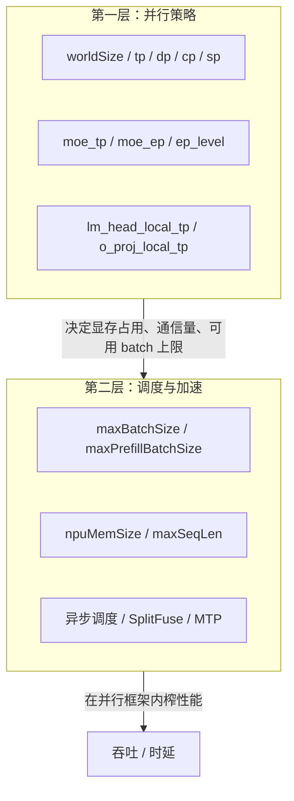
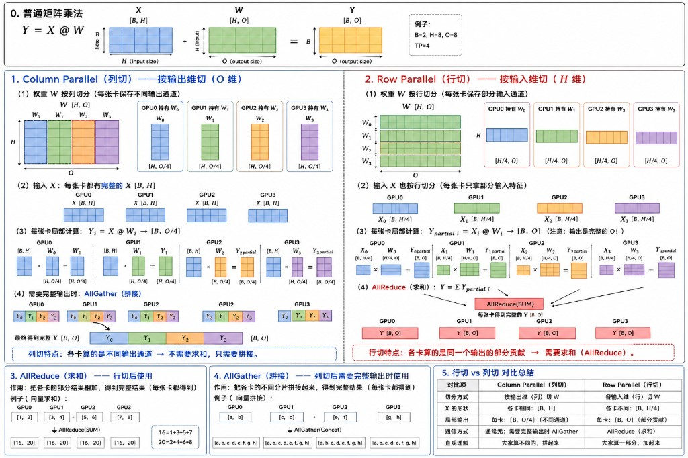
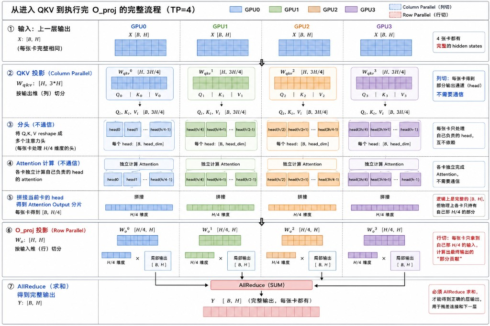

# 专题 09：MindIE 并行策略 ×调度调优——面试问答准备

> 主题：MindIE-LLM（`mindie_llm/` 仓）的并行策略参数（TP/DP/CP/SP/MoE-EP/MoE-TP/local_tp）与调度调优参数（`maxBatchSize`/`npuMemSize`/异步调度…）的关系。
> 代码与文档均在本工作区核实：约束校验见 `mindie_llm/runtime/utils/distributed/parallel_info_manager.py`；MoE 通信策略见 `mindie_llm/runtime/layers/fused_moe/moe_comm_strategy.py`；官方限制见 `docs/zh/user_guide/feature/{context_parallel,sequence_parallel,tensor_parallel,expert_parallel}.md` 与 `docs/zh/user_guide/optimization_and_tuning.md`。

---

## 1. 一句话定位（面试开口先说这句）

> "MindIE 的配置分两层：**并行策略**（`tp`/`dp`/`cp`/`sp`/`moe_tp`/`moe_ep`）决定模型和 KV Cache 怎么切到多卡、单卡显存够不够；**调度调优**（`maxBatchSize`/`npuMemSize`/异步调度/SplitFuse）在并行框架确定之后，决定每张卡具体跑多少活、怎么榨吞吐。前者是'架构选择'，后者是'架构内的性能旋钮'，调参必须先定并行再调 batch，顺序反了容易 OOM 或者 batch 虚高。"



---

## 2. 并行策略基础原理（TP/DP/CP/SP/EP 分别切什么）

先建立直觉：**并行策略的核心问题永远是"切什么维度、切完之后要不要通信、通信是 AllGather 还是 AllReduce"**。下面结合矩阵乘法示意图逐一说明。



**图解逐块说明（对照图中 0~5 号色块）：**

- **0. 普通矩阵乘法（基线）**：`Y = X @ W`，`X:[B,H]`、`W:[H,O]`、`Y:[B,O]`。图中给的例子 `B=2, H=8, O=8, TP=4`——4 张卡、把 `H` 或 `O` 都均分成 4 份（每份 2）。后面 1~5 号色块都是在这个基线上做切分，理解这一块是看懂全图的前提。
- **1. Column Parallel（列切）**：`W` 按列切成 `W₀..W₃`，每张卡 `[H, O/4]`；输入 `X` 每张卡都是完整的 `[B,H]`（图中 4 张卡的 `X[B,H]` 完全一样）；每张卡局部算出 `Yᵢ:[B,O/4]`，四块**颜色互不重叠**（分别是不同的输出通道），拼起来（AllGather）刚好还原成 `[B,O]`——图中第 4 步画的就是 `Y₀,Y₁,Y₂,Y₃` 横向拼接成一整条。
- **2. Row Parallel（行切）**：`W` 按行切成 `W₀..W₃`，每张卡 `[H/4, O]`；这次连输入 `X` 也要按同样的方式切成 `X₀..X₃`（每张卡 `[B, H/4]`，只拿到部分输入特征）；每张卡局部算出的 `Y_partial_i` 形状已经是完整的 `[B,O]`，但只是"用了 1/4 输入特征"算出来的**残缺贡献**，图中用浅色/半透明表示这是"partial"而非最终值，必须做 AllReduce 求和才能还原正确的 `Y`。
- **3. AllReduce（求和）**：图中给的小例子是向量 `[1,2],[3,4],[5,6],[7,8]` 逐元素求和得到 `[16,20]`（`1+3+5+7=16`，`2+4+6+8=20`），四张卡最后**每张卡都拿到同一份完整求和结果**——对应 Row Parallel 里 4 张卡的 `Y_partial` 求和后，每张卡都能拿到完整的 `Y`。
- **4. AllGather（拼接）**：图中给的小例子是把 `[a,b],[c,d],[e,f],[g,h]` 按顺序拼接成 `[a,b,c,d,e,f,g,h]`，同样是**每张卡最后都拿到完整拼接结果**——对应 Column Parallel 里 4 张卡的 `Yᵢ` 拼接后，每张卡都能拿到完整的 `Y`。AllReduce 和 AllGather 的共同点是"操作完之后所有参与的卡都持有同一份完整结果"，区别只在于"怎么合并各卡的局部数据"——**求和**还是**拼接**，这一步选错就会得到错误的 `Y`。
- **5. 对比总结表**：图里把"切分方式 / X 的形状 / 局部输出 / 通信方式 / 直观理解"五行并排放在一起，本质就是在提示"看到权重矩阵的切分方向，就能直接推出后面要用哪种集合通信"——**这也是本节 2.1 下面表格的原始出处**，面试被问到 TP 原理时，脑子里过一遍这张图就能把 Column/Row Parallel 讲全。

### 2.1 TP（Tensor Parallel，张量并行）—— 切权重矩阵，是其他所有并行的基础

普通矩阵乘法 `Y = X @ W`，`X: [B,H]`，`W: [H,O]`，`Y: [B,O]`。TP 把 `W` 切到多张卡上，按切分维度分两种：

**① Column Parallel（列切）—— 按输出维 O 切**

- 每张卡持有 `W` 的一列切片 `Wᵢ: [H, O/4]`，但 `X` 是**完整拷贝**（每张卡都有全量 `[B,H]`）。
- 每张卡局部算 `Yᵢ = X @ Wᵢ → [B, O/4]`，各卡算的是**不同的输出通道**，互不重叠。
- 需要完整输出时用 **AllGather**（拼接）：`Y = concat(Y₀,Y₁,Y₂,Y₃) → [B,O]`。
- 特点：**只拼接，不用求和**，因为每张卡贡献的是不同的列。

**② Row Parallel（行切）—— 按输入维 H 切**

- 每张卡持有 `W` 的一行切片 `Wᵢ: [H/4, O]`，同时 `X` 也按输入特征切分 `Xᵢ: [B, H/4]`（每张卡只拿部分输入特征）。
- 每张卡局部算 `Y_partial_i = Xᵢ @ Wᵢ → [B, O]`——注意**输出已经是完整的 O 维**，但只是"部分贡献"（只用了 1/4 的输入特征）。
- 需要完整输出时用 **AllReduce（求和）**：`Y = Σ Y_partial_i`。
- 特点：**各卡算的是同一个输出的部分贡献，必须求和**，因为每张卡只看到了一部分输入特征，缺的部分靠别的卡补。

**两者对比（面试背这张表）：**

| 维度 | Column Parallel（列切） | Row Parallel（行切） |
|------|------------------------|----------------------|
| 切分方式 | 按输出维 O 切 W | 按输入维 H 切 W |
| X 的形状 | 每卡都是完整的 `[B,H]` | 每卡不同，`[B,H/4]` |
| 局部输出 | 每卡 `[B,O/4]`（不同通道） | 每卡 `[B,O]`（部分贡献，同一组通道） |
| 汇总通信 | AllGather（拼接） | AllReduce（求和） |
| 直观理解 | 大家算不同的输出，拼起来 | 大家算同一个输出的一部分，加起来 |

**为什么这个区分很重要**：MindIE/vLLM 里 Attention/MLP 的 TP 实现通常是"列切 QKV/gate_up_proj + 行切 O_proj/down_proj"的组合——列切之后不立即通信（留到下一层输入前才需要完整值），行切之后必须立即 AllReduce 才能拿到正确结果。**这也是为什么"AllReduce 通信量随 TP 增大而增大"是 TP 的主要代价**：TP 每切一次，Attention 的 O_proj 和 MLP 的 down_proj 都要做一次 AllReduce，TP 越大，AllReduce 的调用次数不变但参与的卡数和跨卡带宽压力增大——这是"TP 越大、单卡权重越省但单步 decode 通信时延可能越高"的根本原因，也是第 4 节"并行传导到调度调优"要考虑的代价之一。

`o_proj_local_tp`（本文第 5 节表格）本质就是：全局 `tp=1` 不做常规 TP，但在 O_proj 这一个矩阵上单独临时开一个"局部行切 TP 域"做 AllReduce，只为了降低这一步的计算时延，而不承担全局 TP 的通信开销。

**把 Column/Row Parallel 串起来看：一个 Attention block 内完整的 TP 流程（TP=4）**



上面的抽象结论（"QKV 列切、O_proj 行切"）具体对应到 Attention 计算里是这 7 步（严格对照图中 ①~⑦）：

1. **① 输入**：上一层输出 `X:[B,H]`，4 张卡拿到的是**完全相同**的一份（这也是为什么进入 TP block 之前不需要通信——上一层如果也是 TP block，刚好在上一层末尾的 AllReduce 后每张卡已经拿到了完整的 `X`）。
2. **② QKV 投影（Column Parallel）**：`W_qkv:[H,3H]` 按输出维（列）切成 4 份，每张卡只算出自己那一份 `Qᵢ,Kᵢ,Vᵢ`（对应部分注意力头），**列切完不需要通信**——这一步的关键提醒：不是先算完整 QKV 再切，而是每张卡直接算的就是"局部"的 Q/K/V。
3. **③ 分头（不通信）**：把每张卡的 `Qᵢ,Kᵢ,Vᵢ` reshape 成多个注意力头，每张卡处理 `H/4` 维度对应的那几个头，头与头之间、卡与卡之间**天然不依赖**，所以这一步纯本地操作。
4. **④ Attention 计算（不通信）**：每张卡独立算自己负责的那几个头的 attention（`softmax(QKᵀ/√d)V`），因为 Q/K/V 都已经是本卡私有的切片，算 attention 全程不需要跨卡通信——**这是 TP 相比"完整算完再切"节省通信的关键一步**，真正的矩阵乘法和 softmax 都在本地完成。
5. **⑤ 拼接当前卡的 head**：每张卡把自己算完的几个头的 Attention Output 在**本地**拼接，得到 `[B, H/4]`——注意这一步的拼接是卡内本地操作，不是跨卡 AllGather；此刻"逻辑上"4 张卡拼起来就是完整的 `[B,H]`，但物理上每张卡只**实际持有**自己那 `H/4` 维度的部分。
6. **⑥ O_proj 投影（Row Parallel）**：`W_o:[H,H]` 按输入维（行）切成 4 份 `[H/4,H]`，正好和第⑤步每张卡手里的 `[B,H/4]` 对齐做矩阵乘，每张卡算出的是**最终输出的部分贡献** `[B,H]`（不是不同的通道，是同一组输出的不完整累加）。
7. **⑦ AllReduce（求和）**：4 张卡的部分贡献求和，才能得到正确的层输出 `Y:[B,H]`，而且**每张卡都要拿到这份完整结果**——因为下一步的残差连接（`X + Y`）和送入下一层，都要求每张卡手里是完整、正确的 `[B,H]`。

**这张图补上了上一张 Column/Row Parallel 原理图缺的两个关键点**：

- **通信只发生在一个地方**：从②列切开始，到⑤本地拼接，中间③④⑤全程"不通信"，只有最后⑥→⑦的 Row Parallel 才触发一次 AllReduce——也就是说**一个 Attention block 只需要 1 次 AllReduce**，不是"切一次就通信一次"。这是"列切先算、行切后汇总"这套组合设计的核心价值：把通信压缩到整个 block 的最后一步。
- **"局部"和"完整"在图里是分得很清楚的两种状态**：②③④⑤全程每张卡手里的数据都是**局部**（只对应本卡负责的那部分头/维度），只有⑦AllReduce 之后才变成**全局完整**——这也是为什么第 4 节里"MoE 通信策略要按 prefill/decode 阶段区分""`local_tp` 会改变 padding 逻辑"这些设计，本质都是在管理"局部 vs 完整"这个状态切换的时机和代价。

### 2.2 DP（Data Parallel，数据并行）—— 不切矩阵，切请求

- 每一路 DP 持有**完整的模型副本**（内部可能还各自开 TP），处理**不同的请求**。
- 没有对权重矩阵的切分，也没有 AllGather/AllReduce 意义上的"结果拼接"，各路之间近似无通信（除非做同步的 EP 路由统计等）。
- 直觉：TP/CP/SP 是"一个请求，多卡协作算"；DP 是"多个请求，各自的卡独立算"。

### 2.3 CP（Context Parallel，上下文并行）—— 切同一个请求的 sequence 维

- 按 sequence 维把同一条长输入逻辑分给多个 CP rank（MindIE 当前仅支持 `cp=2`）；为平衡因果 attention 的工作量，实际输入会切成 `2×cp` 个 chunk，再首尾配对分给各 rank，详见 2.4.1。
- 各卡算自己那部分 token 的局部 attention，卡间用 **ring 通信**传递 KV，类似 ring-attention，最后修正合并分块结果。这里的"修正"不是近似：通过分块 FlashAttention 的在线 softmax 归并，得到的结果与每个 Query 一次性看到全部历史 KV 的因果 attention 等价。
- 和 Row Parallel 的相似之处：都是"局部结果需要跨卡修正/合并"；不同之处：CP 切的是 sequence 维（数据切分），TP 切的是权重矩阵维（模型切分）。
- 收益：多卡并行处理长 prompt 的 attention 计算，降低首 token 时延（TTFT）。

### 2.4 SP（Sequence Parallel，序列并行）—— 切 KV Cache

- 严格来说这里的 SP 是"KV Cache 按 sequence 切分到 sp 个 rank"，每个 sp rank 只保存自己那部分序列位置的 KV，`sp` 必须等于 `tp`（沿用 TP 的通信域）。
- 收益：单卡 KV Cache 显存占用降低，支持更长序列；代价是访问 KV 时需要跨卡查找/聚合，调度逻辑更复杂。
- 和 CP 的关系：CP 负责"计算"怎么切长序列的 attention，SP 负责"存储"怎么切长序列的 KV Cache，两者通常配套开启（`cp` 开必须开 `sp`）。

### 2.4.1 深挖 CP：长上下文切开后，为什么每个 token 仍能看到全局上下文？

先抓住一个容易混淆的点：**CP 切的是 Query 的计算归属和 KV 的常驻归属，不是把注意力的可见范围切小。** 对于位置为 `t` 的 token，正确的 causal attention 仍是：

```text
O_t = Softmax(Q_t · K_[0:t]^T / √d) · V_[0:t]
```

也就是说，`t` 所在的 CP rank 虽然只常驻一部分 KV，却必须把 `[0:t]` 的所有 KV 分块都纳入计算；CP 用 **KV 流动、Q 不动** 来做到这一点。

**1）MindIE 的 CP=2 如何实际切序列：不是简单二分，而是首尾配对。**

公开实现中，`_cp_partition_data` 会把一条序列切为 `2 × cp` 个等长 chunk；对 CP rank `r`，分到第 `r` 个和倒数第 `r` 个 chunk。以 16 个 token、`cp=2` 为例：

```text
全局位置：  [ 0 ...  3] [ 4 ...  7] [ 8 ... 11] [12 ... 15]
chunk 编号：       0           1           2           3
CP rank 0：  chunk 0                                  + chunk 3
CP rank 1：                  chunk 1   + chunk 2
```

这是**因果负载均衡**：前面的 Query 可见 KV 少，后面的 Query 可见 KV 多。上例中 rank 0 的三角计算量是 `(1+2+3+4) + (13+14+15+16) = 68`，rank 1 是 `(5+6+7+8) + (9+10+11+12) = 68`；若只按前/后 8 个 token 二分，二者会是 `36` 和 `100`。代码同时保留原始 `position_ids`，因此即使物理输入被重排，RoPE 的位置语义和 causal mask 的全局位置语义也不变。

**2）一次 ring 的计算过程：每个 rank 的 Q 留在本地，KV 块依次绕环。**

```text
                    第 0 轮：各自的本地 KV
  rank 0: Q(chunk 0 + chunk 3)  ×  KV block A  ──send──► rank 1
  rank 1: Q(chunk 1 + chunk 2)  ×  KV block B  ──send──► rank 0

                    第 1 轮：收到对方的 KV
  rank 0: 本地 Q       ×  KV block B
  rank 1: 本地 Q       ×  KV block A

  对每一个 Q：只累计 mask 后允许看到的历史位置；不允许的未来位置仍被 causal mask 排除。
```

真实的长序列会按更细的 FlashAttention block 做同样的事。环上传的是当前需要参与计算的 `K/V` 工作块；每块在本卡完成一次 `QK^T → softmax → PV` 后继续传给下一 rank。因而每张卡从未需要常驻一份完整 KV，却让自己的 Query 逐块“见过”全局历史。

**3）分块 softmax 怎么精确合并：保存 `(m, l, u)` 三个在线状态。**

softmax 不能把每个 KV 块各自归一化后直接相加。对一个 Query，处理到第 `j` 个块时维护：`m`（已见 score 的最大值）、`l = Σ exp(s-m)`（归一化分母）和 `u = Σ exp(s-m)V`（未归一化输出分子）。新块算出自己的 `(m_b, l_b, u_b)` 后，令 `m' = max(m, m_b)`：

```text
l' = exp(m - m') · l   + exp(m_b - m') · l_b
u' = exp(m - m') · u   + exp(m_b - m') · u_b
O  = u' / l'                 （所有 KV 块处理完后）
```

这个合并满足结合律，并且数值稳定；所以 KV 块按 ring 的到达顺序、按多少块切分，都不会改变最终的 `O`。这就是 CP 能“切长上下文但保持全局信息”的数学原因，而不是把别的分片的 hidden state 复制一份。

**4）输出如何回到后续层：不需要把 sequence 维 AllGather 回全量。**

完成 attention 后，每个 token 的输出仍归属其 CP rank，并在本地继续残差、MLP 和下一层；下一层对同一批局部 Query 重复 ring-attention。只有模型末端需要取每个请求最后一个有效 token 的 logits 时，运行时用全局位置计算 `prefill_head_indices`，定位该 token 落在哪个 CP rank、哪个局部偏移，再取对应的 lm-head 结果。换言之，**全局依赖在 attention 内通过 KV 和在线状态完成，全局“取最后一个 token”的需求通过位置索引完成**，而不是每层都还原完整序列。

> 面试一句话：CP 保持全局信息靠的是“Q 留本地、KV 绕环、online softmax 精确归并”；它并不要求每张卡保存全局 KV 或每层 AllGather 全序列输出。

### 2.4.2 深挖 SP：分片间的 KV 到底保存什么、传什么、谁负责定位？

把 KV 的生命周期分成两类，最不容易答错：

| 内容 | 生命周期 | 是否长期保存 | 作用 |
|------|----------|--------------|------|
| 本 rank 负责的 KV Cache page/block | 请求存活期间，逐层累积 | 是 | 保存某层、某些全局 token 位置的 `K` 和 `V`，供后续 decode / attention 使用 |
| ring 中收到的远端 KV 工作块 | 一次 attention block / 一轮 ring | 否 | 让本地 Query 计算对远端上下文的贡献；用完转发或释放 |
| `(m,l,u)`、局部 attention output | 一次 attention 计算 | 否 | 归并各 KV 块，得到本地 Query 的精确最终输出 |
| `request_id, layer_id, global_position/block_id, cp/sp rank` 等元数据 | 请求存活期间 | 是 | 把逻辑位置映射到正确的 KV 分片，保证重排后仍能查到正确历史 |

**SP 的持久化职责**是把 KV Cache 沿 sequence 维分到 `sp` 个 rank：每个 rank 只为自己拥有的全局位置写入本地 KV pool，不保存整条请求的重复副本。MindIE 文档要求 `sp = tp`，因此 KV shard 与 TP 通信域对齐；在 `cp=2, sp=tp=8` 的配置中，可以把它理解为“先确定 CP 下本 rank 负责的 token 块，再在对应 TP/SP 域内按 SP rank 放置 KV page”。具体的物理 page-table / block 地址属于后端实现细节，公开代码没有把其完整布局暴露为一个稳定接口；面试时应说清**逻辑归属和访问协议**，不要臆造某个固定的连续地址排布。

**CP 与 SP 的配合**可以这样记：

```text
CP：Prefill 时把“谁算哪些 Query、谁参与哪轮 ring”切开，主要解决长 prompt 的计算并行度/TTFT。
SP：把“历史 token 的 KV 长期落在哪张卡”切开，主要解决 KV Cache 显存；后续访问按位置元数据找到 shard。
```

因此，分片之间不会把“完整上下文状态”持久地互相复制。远端 KV 在需要时以通信工作块形式到达，结合本地在线 softmax 状态完成本轮计算，随后即可释放；真正留下的是各自拥有的 KV page 和全局位置到 shard 的映射。Decode 的新 token 也遵循同一原则：新产生的 KV 被写入它所属 shard；计算该新 Query 时，运行时依靠 CP/SP 的长度与位置元数据访问全部历史 shard，而不是重新构造完整 KV Cache。

**和 Prefix Cache / PD 分离的关系：**SP 分片后，可复用或传输的基本单位也应携带上述逻辑位置信息和 shard 归属。否则即使拿到了字节内容，也无法保证把第 `L` 层、第 `p` 个 token 的 KV 放回正确 rank；这正是“KV Cache 是带位置语义的状态”，而不只是可随意拼接的一段内存。

### 2.4.3 对比 vLLM：PCP/DCP 是两套目的不同的 Context Parallel

**先给结论：vLLM 能支持 `CP > 2`，但要先问清是在说 Prefill 还是 Decode。** 它没有沿用 MindIE 单一的 `cp` 参数，而是拆成两个独立旋钮：

| vLLM 参数 | 解决的主要问题 | 是否增加进程/GPU 数 | CP 大于 2 的主要约束 |
|---|---|---|---|
| `--prefill-context-parallel-size`（`-pcp`） | 长 prompt Prefill 的 TTFT | **会增加**，`worldSize = pp × tp × pcp` | 参数本身只要求 `>=1`；attention backend 必须声明支持 PCP。当前官方文档仍把两种 PCP 算法标为 active development，不能把“配置可填”误说成所有模型/后端均可生产使用。 |
| `--decode-context-parallel-size`（`-dcp`） | Decode 时减少 KV Cache 重复、提升可容纳 batch | **不会增加**，复用一个 TP 组内的 GPU | `dcp` 必须整除 `tp`；通常 `dcp ≤ tp`。GQA/MQA 还受 `dcp ≤ tp / num_kv_heads` 且每 KV head 对应的 Q head 数可被 `dcp` 整除的限制。 |

因此，**“vLLM 支不支持 CP=4/8？”答案是支持，最成熟、文档明确支持的是 DCP=4/8 一类配置**。例如 DeepSeek-R1 的 MLA 是单 KV head；`tp=8, dcp=8` 可以把传统 TP 下的 8 份 KV 重复消掉。对于有 4 个 KV head 的 Qwen3-235B，`tp=8` 时最大 DCP 通常是 `8/4=2`，此时 `dcp=4` 反而会被配置校验拒绝。不要只看卡数，还要看 KV head 数。

**1）vLLM DCP：不是 ring 把 KV 转一圈，而是“KV 常驻分片 + 局部 attention + softmax 状态合并”。**

vLLM 将一个 TP 组切为若干 DCP group；DCP 不增 world size。它使用 `cp_kv_cache_interleave_size` 做交错存储：设总 CP rank 为 `r`、总 CP 度为 `C = pcp × dcp`，每连续 `interleave_size` 个 token 放到一个 rank，下一段放到下一个 rank。`interleave_size=1` 时就是 token `i` 落在 `i mod C` 对应的 shard；这样 Decode 持续追加新 token 时，新 KV 天然轮转到后续 rank，不必搬迁旧 cache。

对某个 decode Query，DCP 的每个 rank 只读取本地 paged-KV shard，得到自己的局部 `(O_r, LSE_r)`。随后用 LSE（log-sum-exp，也就是上一节 `(m,l)` 的对数形式）恢复各 shard 的相对 softmax 权重，精确合并为全局输出：

```text
rank r:  O_r, LSE_r = Attention(Q, K_r, V_r)
所有 rank:  LSE = logsumexp_r(LSE_r)
全局输出:   O = Σ_r exp(LSE_r - LSE) · O_r
```

默认通信后端是 **AllGather + ReduceScatter**：聚合必要的局部结果后把已合并输出分发到后续 TP 计算所需的 rank。对 MLA，vLLM 还提供 `--dcp-comm-backend a2a`，以 All-to-All 交换部分输出与 LSE，再用 Triton kernel 合并，目标是将每层 NCCL 调用由 3 次降为 2 次。这里与 MindIE CP 的共同点是“在线 softmax 保持精确全局 attention”；差异是 vLLM DCP 的优化中心是**长期 KV 的交错常驻和 Decode 的显存去重**，而非 MindIE CP=2 的 Prefill ring 流转。

**2）vLLM PCP：把 Prefill 的 Q/K/V 分到更多 GPU。**

对一个含 `T` 个新 token 的长 prompt，PCP 把 token 切为 `pcp` 个 chunk，各 GPU 计算自己 chunk 的 Q/K/V。官方设计文档列出两条路径：

- **partial Q + full KV**：先收集全部 KV，再让各 rank 只算自己 Query chunk 的输出；适用于 KV 可以临时全量容纳、目标是降低 TTFT 的情况。
- **partial Q + partial KV**：若完整 KV 也放不下，则以 ring-attention 类方法按块 send/recv KV，并以 LSE/online-softmax 合并；这和 2.4.1 的“Q 留本地、KV 流动”原理相同。

从当前 vLLM 源码可见，PCP 是一个独立通信组：rank 布局为 `(DP, PP, PCP, TP)`，并将 `PCP` 计入 world size；attention 初始化时会检查 backend 的 `supports_pcp` 能力。故 PCP 在拓扑语义上更接近“为 Prefill 新增并行资源”，而 DCP 是“在已有 TP 资源内消除 KV 冗余”。两者可同时配置，总 KV 的逻辑分片数为 `pcp × dcp`；相关 KV Cache 容量、block/hash 粒度也会按这个乘积调整。

**3）和 MindIE 的面试对照：不要混用约束。**

```text
MindIE：单一 cp，目前只支持 2；cp 必须与 sp 搭配，重点是 P 侧长上下文计算 + KV 存储协同。
vLLM ：PCP 与 DCP 分离；DCP 可以 >2，但必须嵌在 TP 的可分组范围及 KV-head 约束内；
       PCP 也无“只能 2”的参数上限，但属于后端/版本相关的开发中能力，应实测确认。
```

代码定位（以本工作区 vLLM `8df14cfc8` 为准）：参数和 DCP 整除校验见 `vllm/config/parallel.py`；GQA/MQA 的 `tp/kv-head` 上限见 `vllm/config/model.py`；DCP/PCP 通信组的构造见 `vllm/distributed/parallel_state.py`；KV 的交错映射语义见 `cp_kv_cache_interleave_size` 注释；attention backend 对 PCP/DCP 的能力校验见 `vllm/v1/worker/cp_utils.py`。官方文档为 [Context Parallel Deployment](https://docs.vllm.ai/en/latest/serving/context_parallel_deployment/)。

### 2.5 MoE-EP / MoE-TP —— 对 MoE 层单独的一套并行

- **MoE-EP（Expert Parallel）**：把不同的专家（expert）分布到不同卡上，每张卡只保存一部分专家的权重；token 路由到哪个专家，就要通过 AllToAll（或 MC2 融合算子）把 token 发送到对应专家所在的卡。这是"按专家切分"，类似把一个大 MoE 层的多个"列切分支"（每个专家本身就是一个 FFN）分给不同卡。
- **MoE-TP**：在单个专家内部再做一次 TP（Column+Row 切分同前面 2.1 的原理），用于专家本身太大单卡放不下的场景。
- 二者满足 `moe_tp × moe_ep = worldSize`，因为要覆盖所有的卡：先按专家分组（EP 维度），组内再切分单个专家的权重矩阵（TP 维度）。

### 2.6 一张图总结 5 种并行切的是什么

```
矩阵乘法视角：Y = X @ W
├─ TP  Column：切 W 的输出列 → AllGather 拼接
├─ TP  Row   ：切 W 的输入行 → AllReduce 求和
├─ DP        ：不切矩阵，复制整套 W，切的是"请求批次"
├─ CP        ：不切 W，切 X 的 sequence 维，ring 通信修正
├─ SP        ：不切 W，切 KV Cache 的 sequence 维（配合 CP/TP）
└─ MoE-EP/TP ：MoE 层专用，EP 切"哪些专家在哪张卡"，TP 切"专家内部矩阵"
```

---

## 3. 并行参数的硬约束（代码 + 文档双重核实）

### 3.1 代码里真实存在的校验：MoE TP × EP 必须等于 world_size

```121:127:mindie_llm/runtime/utils/distributed/parallel_info_manager.py
        if self.moe_tp.group_size * self.moe_ep.group_size != self.world_size:
            error_msg = (
                f"MoE parallel strategy process number mismatch: "
                f"global world_size({self.world_size}) != "
                f"moe_tp.group_size({self.moe_tp.group_size}) × moe_ep.group_size({self.moe_ep.group_size})"
            )
            raise ValueError(error_msg)
```

这是 `ParallelInfoManager.__init__` 里在**构造分布式进程组之前**做的硬校验，配错了直接 `ValueError`，服务起不来（不是运行时性能差，是启动失败）。

### 3.2 `ParallelInfoManager` 怎么把参数变成通信组

```94:152:mindie_llm/runtime/utils/distributed/parallel_info_manager.py
    def __init__(self, local_rank: int, llm_config=None, server_config=None):
        ...
        self.world_size: int = torch.distributed.get_world_size()
        self.attn_tp = self._init_tp_parallel_info(server_config.get("tp", self.world_size))
        self.attn_dp = self._init_dp_parallel_info(server_config.get("dp", -1))
        self.attn_cp = self._init_dp_parallel_info(server_config.get("cp", -1))
        ...
        self.moe_tp = self._init_tp_parallel_info(server_config.get("moe_tp", -1), moe_tp_buffer_size)
        self.moe_ep = self._init_dp_parallel_info(server_config.get("moe_ep", -1), moe_ep_buffer_size)
        if self.moe_tp.group_size * self.moe_ep.group_size != self.world_size:
            raise ValueError(...)
        ...
        group_size = server_config.get("sp", -1)
        self.attn_inner_sp = self._init_tp_parallel_info(group_size)
```

两个关键私有方法揭示了 TP 类和 DP 类并行的**本质区别**（面试常问"TP 和 DP 在实现上有什么不同"）：

```245:289:mindie_llm/runtime/utils/distributed/parallel_info_manager.py
    def _init_tp_parallel_info(self, group_size=None, ...):
        """Initializes tensor-parallel-style groups (contiguous ranks)."""
        ...
        for group_idx in range(parallel_info.num_group):
            ranks = range(group_idx * parallel_info.group_size, (group_idx + 1) * parallel_info.group_size)
            parallel_info.rank_per_group.append(list(ranks))
        ...

    def _init_dp_parallel_info(self, group_size=None, ...):
        """Initializes data-parallel-style groups (strided ranks)."""
        ...
        for group_idx in range(parallel_info.num_group):
            ranks = range(group_idx, self.world_size, parallel_info.num_group)
            parallel_info.rank_per_group.append(list(ranks))
```

- **TP 分组是"连续切片"**：8 卡 tp=4 时，组是 `[0,1,2,3]`、`[4,5,6,7]`——因为 TP 要在同一份权重的切片之间频繁 AllReduce，连续 rank 通常映射到同机内 NVLink/HCCL 高带宽互联。
- **DP（以及 CP、MoE-EP）分组是"跳跃采样"**：8 卡 dp=4 时，组是 `[0,4]`、`[1,5]`、`[2,6]`、`[3,7]`——因为 DP 各组之间几乎不通信，跳跃排布是为了让"同一个 TP 域"内部保持连续，DP 维度横跨 TP 域采样。
- 这解释了为什么"TP+DP 可以叠加"：TP 组连续、DP 组跳着取，两者天然不冲突，`tp × dp = world_size` 就把 rank 空间划分完了。

### 3.3 文档明确的互斥/绑定关系（一定要背）

| 并行组合 | 是否允许 | 依据 |
|---------|---------|------|
| TP + DP | ✅ 可叠加，`tp × dp = worldSize` | `sequence_parallel.md`/`tensor_parallel.md` |
| TP + CP | ✅ 可叠加，但 **dp 必须为 1** | `context_parallel.md`：「开启 CP 特性时，DP 必须等于 1」 |
| DP + CP | ❌ 不可叠加 | 同上，CP 要求 dp=1，与 DP>1 互斥 |
| CP 单独开 | ❌ 必须同时开 SP | `context_parallel.md`：「当前不支持 CP 单独开启，开启 CP 需要同时开启 SP」 |
| SP | 必须 `sp = tp` | `sequence_parallel.md`表1：「sp \| int \| sp=tp」 |
| ep_level=2 时 moe_tp | 只能为 1 | 见下方 `moe_comm_strategy.py` 校验 |
| CP/SP 支持模型 | 仅 DeepSeek-R1/V3/V3.1 的 W8A8/W4A8 | 两个文档均写「当前仅 DeepSeek-R1 的 W8A8...支持此特性」，且**不支持 BF16** |

真实的服务化配置示例（`context_parallel.md`，DeepSeek-R1，16 卡）：

```json
"dp": 1, "cp": 2, "sp": 8, "tp": 8, "moe_ep": 16, "moe_tp": 1
```

验证一下等式：`cp × tp = 2 × 8 = 16 = worldSize`；`sp(8) = tp(8)`；`dp=1`。四条约束同时满足。

---

## 4. 并行策略如何"传导"到调度调优参数

### 4.1 传导路径：并行 → 显存分配 → batch 上限

MindIE 官方公式（`optimization_and_tuning.md` 及模型参数文档）指出：多卡 TP 场景下，**注意力头数要除以卡数**才能算单卡显存占用——也就是"权重和 KV Cache 都随 TP 均摊"。所以调参顺序是：

1. `tp` 定了 → 单卡权重显存、单卡 KV Cache 单 token 占用就定了；
2. `npuMemSize`（一般设 `-1` 自动分配剩余显存）定了可用的 KV Cache 总容量；
3. 总容量 / 每请求所需 block 数 ≈ `maxBatchSize` 的理论上限。

**不能反过来先拍 `maxBatchSize`，再去凑 `tp`**——这是新手最容易踩的坑：`tp` 太小导致单卡权重占用过大，`npuMemSize` 自动分配后 KV 池很小，`maxBatchSize` 设大了直接 OOM 或者调度器把请求排队卡住。

### 4.2 代码证据：`enable_lm_head_local_tp` 直接改变调度期 padding 逻辑

并行策略不仅影响"能不能跑""显存多大"，还会直接进入调度热路径，改变 batch 的 padding 方式：

```783:788:mindie_llm/text_generator/adapter/generator_torch.py
    def _get_dp_ep_inputs(self, batch_size, input_ids):
        if self.mapping.enable_lm_head_local_tp or self.mapping.enable_o_proj_local_tp or \
                self.model_wrapper.config.ep_level == 1:
            max_decode_dp_token_size = self.max_batch_size * (self.num_speculative_tokens + 1)
            padding_batch_size = max_decode_dp_token_size - batch_size
        elif batch_size % self.mapping.attn_tp.group_size != 0:
            ...
```

要点：一旦开了 `lm_head_local_tp` / `o_proj_local_tp`，或者 MoE 走 `ep_level=1`（AllGather 通信），Decode 阶段就必须把 batch **padding 到 `maxBatchSize × (投机 token 数+1)` 的固定大小**，而不是普通 TP 场景下"补齐到 `attn_tp.group_size` 的整数倍"即可。也就是说：**并行策略的选择，直接决定了调度器 padding 的粒度和额外的计算浪费**——`local_tp` 场景下 `maxBatchSize` 调大，每一步的 padding 开销也会跟着放大，这是评估"该不该开 local_tp"时要考虑的隐性代价。

### 4.3 MoE 并行如何自动选择通信算子（会影响 decode 时延和吞吐）

`moe_comm_strategy.py` 是一个典型的"策略模式"：按优先级依次尝试 `FusedMC2 → MC2 → All2All → AllGather`，每一步都要读当前的 `MOE_EP`/`MOE_TP`/`ATTN_DP` 并行状态：

```48:82:mindie_llm/runtime/layers/fused_moe/moe_comm_strategy.py
class FusedMC2Strategy(MoECommStrategyBase):
    """Fused MC2 strategy: highest priority for Ascend 910C.
    Requirements: EP group size <= 32, no MoE TP, tokens within capacity.
    """
    @staticmethod
    def is_applicable(quant_type, max_num_tokens_per_device) -> bool:
        ...
        if not parallel_mgr.get(ParallelType.MOE_EP).is_enabled():
            return False
        if device_type != DeviceType.ASCEND_910_93:
            return False
        is_ep_valid = parallel_mgr.get(ParallelType.MOE_EP_MC2).group_size <= 32
        tp_size = parallel_mgr.get(ParallelType.ATTN_TP).group_size
        num_tokens_per_device = (forward_ctx.batch_descriptor.num_tokens + tp_size - 1) // tp_size
        is_num_tokens_valid = num_tokens_per_device <= max_num_tokens_per_device
        if not (is_ep_valid and is_num_tokens_valid):
            return False
        if parallel_mgr.get(ParallelType.MOE_TP).is_enabled():
            return False
        return True
```

```130:158:mindie_llm/runtime/layers/fused_moe/moe_comm_strategy.py
class All2AllStrategy(MoECommStrategyBase):
    @staticmethod
    def is_applicable(quant_type, max_num_tokens_per_device) -> bool:
        ...
        if parallel_mgr.get(ParallelType.MOE_TP).is_enabled():
            if parallel_mgr.get(ParallelType.ATTN_DP).is_enabled():
                raise RuntimeError('MoECommType.MC2 and MoECommType.ALLTOALL: Do not support moe_tp > 1')
            return False
        return True
```

面试要点提炼：

- **`FusedMC2`/`MC2` 都强制要求 `moe_tp` 不开启**（`if parallel_mgr.get(ParallelType.MOE_TP).is_enabled(): return False`），对应文档里"`ep_level=2` 时 `moe_tp` 只能为 1"的约束——**这是代码校验和文档描述完全一致的例子**。
- **`MC2` 在 910B 上要求 `world_size >= 16` 且只在 decode 阶段生效**（prefill 阶段会被排除），说明**同一份并行配置在 prefill/decode 两个阶段可能走完全不同的通信算子**，这是"调度调优要分阶段考虑"的直接代码证据。
- **`ATTN_DP` 开启 + `MOE_TP` 开启 是显式禁止的组合**，代码里甚至用 `raise RuntimeError` 而不是静默降级——说明这条约束比"不推荐"更严格，是"不支持"。

---

## 5. 加速特性与并行的兼容关系（背这张表）

| 加速特性 | 与并行的强制关系 | 证据来源 |
|---------|-----------------|---------|
| CP（上下文并行） | 必须同时开 SP；开 CP 时 `dp` 必须为 1；`sp = tp`；`cp × tp = worldSize`（当前 cp 只支持 2） | `context_parallel.md` |
| SP（序列并行） | `sp = tp`；可以和 DP、CP 叠加但需满足各自等式 | `sequence_parallel.md` |
| CP/SP 支持范围 | 仅 DeepSeek-R1/V3/V3.1 的 W8A8/W4A8 量化模型，不支持 BF16，仅 Atlas 800I A2/A3 | 两文档一致 |
| MoE `ep_level=2`（MC2/FusedMC2） | 要求 `moe_tp` 不开启；EP group ≤ 32（FusedMC2）；仅 Ascend 910C 支持 FusedMC2 | `moe_comm_strategy.py` |
| MoE `ep_level=1`（AllGather） | 可配 `enable_init_routing_cutoff` + `topk_scaling_factor` 做 topk 截断省显存 | `expert_parallel.md` |
| `lm_head_local_tp` / `o_proj_local_tp` | 仅 DeepSeek-R1/V3/V3.1 支持；取值范围 `[1, worldSize/节点数]`；开启后 decode padding 固定为 `maxBatchSize × (投机token数+1)` | `tensor_parallel.md` + `generator_torch.py` |
| 异步调度 | 与并行策略正交，但**明确要求 `maxBatchSize` 较大、输入输出较长**才有收益，否则 EOS 请求被重复计算，浪费 NPU 资源 | `optimization_and_tuning.md` |
| CP/SP + MTP + 异步调度 + Prefix Cache | 文档写明可叠加使用 | `context_parallel.md`/`sequence_parallel.md` |

---

## 6. 推荐调参顺序（回答"你会怎么调参"时的框架）

1. **定 worldSize**：卡数由模型大小和预算决定。
2. **定并行拓扑（先满足硬约束）**：
   - 单卡放不下权重 → 开 TP；
   - 长 prompt 要降 TTFT → `cp=2` + `sp=tp` + `dp=1`（仅限 DeepSeek 系列量化模型）；
   - MoE 模型 → `moe_ep × moe_tp = worldSize`，`ep_level=2` 时 `moe_tp` 固定为 1；
   - PD 分离 D 节点、想降低单步矩阵计算时延 → `tp=1` + `lm_head_local_tp`/`o_proj_local_tp`。
3. **定显存与序列上限**：`npuMemSize` 先用 `-1` 自动分配，`maxSeqLen`/`maxInputTokenLen` 按业务定，OOM 就先加大 TP 而不是先砍 batch。
4. **定 batch 与调度**：`maxBatchSize`/`maxPrefillBatchSize` 在上面确定的显存余量内压测微调；如果开了 `local_tp` 或 `ep_level=1`，注意 decode padding 会被固定为 `maxBatchSize` 的整倍数，评估这部分浪费。
5. **开加速特性**：`maxBatchSize` 大、长输出场景开异步调度；MoE 按硬件型号让 `moe_comm_strategy.py` 自动选算子，不需要手动指定。

---

## 7. 高频追问与参考答案

**Q1：为什么 TP 的 rank 分组是连续的，DP 是跳跃的？**

> TP 组内的卡要对同一份切分权重做高频 AllReduce/AllGather，连续 rank 通常对应同一台机器内的高速互联（NVLink/HCCL），把 TP 组放在连续 rank 上能保证组内通信走最快的链路。DP（以及 CP、MoE-EP）各组之间几乎不通信，用跳跃采样（`range(group_idx, world_size, num_group)`）能保证"同一个 TP 域"始终完整地落在某一个连续区间里，不会被 DP 拆散。代码上体现为 `_init_tp_parallel_info` 用 `range(idx*gs, (idx+1)*gs)`，`_init_dp_parallel_info` 用 `range(idx, world_size, num_group)`。

**Q2：CP 和 DP 为什么不能叠加，但 TP 和 CP 可以？**

> CP 是在 attention 内部按 sequence 维度做 ring 通信，本质上是"同一个请求"被拆到多张卡上协同完成一次 attention 计算；DP 是"不同请求"分别独立处理。如果 DP>1 又开 CP，就会出现"一部分卡在为请求 A 做 ring-attention 协同，另一部分卡在为请求 B 做"，这打破了 CP 需要的固定通信拓扑，所以文档强制 `dp=1`。TP 只是把矩阵乘法切分到多卡，不改变"一个请求由哪些卡协同处理"的拓扑，所以能和 CP 叠加，只要满足 `cp × tp = worldSize`。

**Q3：`ep_level=1` 和 `ep_level=2` 的本质区别？为什么 2 要求 `moe_tp=1`？**

> `ep_level=1` 是基于 AllGather 的 EP：每张卡先把需要的 token 从别的卡"聚过来"再算，实现简单但通信量大，允许专家计算内部再做 `moe_tp` 切分。`ep_level=2` 是基于 AllToAll + 通算融合（MC2/FusedMC2）的 EP：通信和计算融合成一个算子，这类融合算子（`FusedMC2Strategy`/`MC2Strategy`）在代码里显式检查 `if parallel_mgr.get(ParallelType.MOE_TP).is_enabled(): return False`，只要 `moe_tp>1` 就直接放弃这条路径退化到 AllGather，所以官方约束里`ep_level=2` 必须 `moe_tp=1`，否则融合算子的收益就没了甚至可能报错（All2All 策略里对 `attn_dp` + `moe_tp>1` 的组合直接 `raise RuntimeError`）。

**Q4：并行策略和调度调优谁先调？为什么？**

> 先调并行策略，再调调度。因为并行策略决定了单卡权重占用和 KV Cache 单 token 占用，这两个数定了以后，`npuMemSize` 自动分配后剩多少显存给 KV Cache 池是确定的，`maxBatchSize` 的理论上限是"KV 池容量 / 单请求 KV 占用"算出来的。如果先拍一个很大的 `maxBatchSize` 再去凑并行度，很容易出现 TP 太小、单卡权重占用大、KV 池被压缩，`maxBatchSize` 设的值远超实际可用容量，服务跑起来就 OOM 或请求排队打不满。

**Q5：`local_tp`（`lm_head_local_tp`/`o_proj_local_tp`）解决什么问题，代价是什么？**

> 用在 `tp=1` 的场景（典型是 PD 分离的 D 节点、DeepSeek 系列），全局不做 TP 以避免层间频繁 AllReduce，但 LmHead 和 Attention 的 O 矩阵这两个计算量大的矩阵单独做"局部 TP"切分来降低这两步的计算时延。代价在代码里能看到：一旦开启，`_get_dp_ep_inputs` 里 decode 阶段的 padding 策略从"补齐到 `attn_tp.group_size` 整数倍"变成"固定 padding 到 `maxBatchSize × (投机token数+1)`"，也就是不管实际 batch 多大，都要按最大配置去 padding，小 batch 场景下这部分 padding 开销占比会更明显，需要结合实际流量评估。

**Q6：为什么 CP/SP 只支持 DeepSeek 系列量化模型，不支持 BF16？**

> 这是文档给出的现有限制（`context_parallel.md`/`sequence_parallel.md` 明确列出支持范围），本质是这两个特性的算子实现（ring-attention 分块修正、KV Cache 切分索引）目前只针对 DeepSeek-R1/V3/V3.1 的 W8A8/W4A8 量化路径做了适配和验证，BF16 路径的数值稳定性和算子融合还没有覆盖，属于工程落地的阶段性限制而非架构性限制。

---

## 8. 三个可以直接背的配置示例（均来自官方文档，非杜撰）

**长序列 DeepSeek-R1，16 卡，CP+SP（`context_parallel.md`）：**

```json
{
  "worldSize": 16, "dp": 1, "cp": 2, "sp": 8, "tp": 8,
  "moe_ep": 16, "moe_tp": 1, "npuMemSize": -1
}
```
校验：`cp(2) × tp(8) = 16 = worldSize`；`sp(8) = tp(8)`；`moe_tp(1) × moe_ep(16) = 16`。

**DeepSeek-R1，16 卡，DP+SP 混部（`sequence_parallel.md`）：**

```json
{
  "worldSize": 16, "dp": 2, "sp": 8, "tp": 8,
  "moe_ep": 16, "moe_tp": 1, "npuMemSize": -1
}
```
校验：`dp(2) × tp(8) = 16`；`sp(8) = tp(8)`。

**MoE ep_level=2，8 卡（`expert_parallel.md`）：**

```json
{
  "worldSize": 8, "moe_ep": 8,
  "models": { "deepseekv2": { "ep_level": 2,
    "alltoall_ep_buffer_scale_factors": [[1048576,1.32],[524288,1.4],[262144,1.53],[131072,1.8],[32768,3.0],[8192,5.2],[0,8.0]]
  }}
}
```
校验：`moe_tp` 未显式配置即默认与 `ep_level=2` 兼容为 1，`moe_tp(1) × moe_ep(8) = 8`。

---

## 9. 一分钟总结（面试收尾）

> "并行策略回答'能不能跑、单卡显存够不够'——`tp`/`dp`/`cp`/`sp`/`moe_ep`/`moe_tp` 之间有严格的等式约束和互斥关系，代码里 `ParallelInfoManager` 会在启动时直接校验，配错了服务起不来。调度调优回答'跑得多快'——在并行拓扑确定、`npuMemSize` 分配好 KV Cache 池之后，`maxBatchSize` 才有上限可算；MoE 场景下具体走哪种通信算子（AllGather/MC2/FusedMC2/All2All）也是由当前的并行状态（`moe_ep`/`moe_tp`/`attn_dp`）在运行时自动选出来的，而不是手动指定。所以我调参的顺序始终是：先按模型大小和场景确定并行拓扑，再在这个拓扑内调 batch 和调度特性。"

---

## 10. 模拟面试实录（10 问，由浅入深 + 代码阅读 + 现场设计题）

> 面试官视角出题，覆盖：概念区分 → 图片推导 → 约束原理 → 代码阅读 → 故障排查 → 现场设计。每题先给"追问点"提示，再给参考回答，回答里能落到具体代码行的都标了引用。

**Q1（开场，考基础）：你刚才画的图里，Column Parallel 用 AllGather，Row Parallel 用 AllReduce，能不能反过来？比如 Column Parallel 也用 AllReduce 行不行？**

> 不行，这是由数学结构决定的，不是实现选择。Column Parallel 里每张卡算的是**不同的输出通道**（`Yᵢ = X @ Wᵢ`，`Wᵢ` 是不同的列），这些通道之间没有重叠、不需要相加，只需要按顺序拼在一起还原成 `[B,O]`，用 AllReduce 求和反而会把不同通道的值加错。Row Parallel 里每张卡算的是**同一组输出通道的部分贡献**（只用了 1/4 的输入特征），必须把 4 张卡的部分贡献加起来才是正确结果，用 AllGather 拼接的话，拼出来的是 4 份"残缺"的 `[B,O]`，不是想要的答案。一句话：**输出维度被切分 → 拼接（AllGather）；输入维度被切分 → 求和（AllReduce）**，这是矩阵乘法分配律决定的，不能互换。

**Q2（追问，考迁移能力）：那 Attention 里的 QKV 矩阵和 O_proj 矩阵，分别用哪种切法，为什么？**

> QKV 用 Column Parallel（列切）：每张卡切出一部分注意力头，各自独立算完整的这几个头的 attention，互不依赖，算完不需要立即通信，可以留到后面再处理。O_proj 用 Row Parallel（行切）：因为输入是"多头 attention 拼接后的结果"，每张卡只有自己那部分头的输出，O_proj 的权重也按输入维（也就是头维度）切分，每张卡算出的是最终输出的"部分贡献"，必须 AllReduce 求和才能还原正确的层输出。这也是为什么"列切之后不立即通信，行切之后必须立即通信"——QKV 切完直接进 attention 计算，O_proj 切完必须 AllReduce 才能进下一层。

**Q3（考图片信息提取 + 计算）：图里 B=2, H=8, O=8, TP=4。如果我把 TP 改成 8，Column Parallel 每张卡的 `Wᵢ` 形状变成什么？会不会有问题？**

> 每张卡的 `Wᵢ` 从 `[H, O/4] = [8,2]` 变成 `[H, O/8] = [8,1]`，也就是每张卡只负责 1 个输出通道。理论上可以继续切，但会有两个问题：一是 O=8 时 TP 最多切到 8，再大就没法均分了（`even_divide` 会报错，`ParallelInfoManager` 里所有 `_init_tp_parallel_info`/`_init_dp_parallel_info` 都调用 `even_divide(self.world_size, group_size)` 做整除校验）；二是每张卡的计算量变得极小（`[B,H]@[H,1]`），这时候 AllGather 的通信延迟可能超过计算本身节省的时间，TP 切得过细反而不划算，这也是为什么实际生产里 TP 一般不会无限往大调，需要结合矩阵实际大小压测。

**Q4（考代码阅读，给一段没讲过的代码）：我给你看 `parallel_info_manager.py` 里没细讲的一段，`_create_npu_process_group` 里为什么要遍历所有分组去 `dist.new_group`，即使当前 rank 不在这个组里？**

```178:196:mindie_llm/runtime/utils/distributed/parallel_info_manager.py
    def _create_npu_process_group(parallel_info, is_all_reduce=False):
        cur_process_group = None
        for group_idx, group_ranks in enumerate(parallel_info.rank_per_group):
            options = dist_c.ProcessGroupHCCL.Options()
            ...
            process_group = dist.new_group(ranks=group_ranks, pg_options=options)
            if group_idx == parallel_info.current_group_id:
                cur_process_group = process_group
        return cur_process_group
```

> 因为 `torch.distributed.new_group` 是一个**集合操作**：所有 rank（不管是否属于这个组）都必须参与同一次 `new_group` 调用序列，且调用顺序要严格一致，否则不同进程会把不同的通信组匹配到不同的 HCCL 通信域上，造成死锁或者串组。也就是说，即使某个 rank 不属于 group 1，它也要在自己的进程里"陪跑"一次 `dist.new_group(ranks=group1_ranks)`（只是最终返回的 `process_group` 它自己用不到），这样才能保证全局所有进程建通信域的顺序和数量对齐。代码注释里也写了"Need to traverse all groups... otherwise it will affect the global communication domain count"，这是分布式训练框架里一个常见但容易被忽略的坑。

**Q5（考约束原理，反向推导）：如果我告诉你一个配置报错了——`moe_tp.group_size(2) × moe_ep.group_size(4) != world_size(16)`，除了改小 moe_tp/moe_ep，还有没有别的可能原因？你会怎么排查？**

> 先看这个等式本身：2×4=8≠16，说明 worldSize 和 moe_tp/moe_ep 没对齐。排查顺序：① 先确认 `worldSize` 是不是被改过（比如从 8 卡扩到 16 卡但没同步改 moe_tp/moe_ep）；② 确认 `moe_tp`/`moe_ep` 是不是用了默认值 `-1`（代码里 `server_config.get("moe_tp", -1)`，如果没显式配置，`_init_tp_parallel_info` 会把 `-1` 当成"用 world_size"，但 `_init_dp_parallel_info` 的 `-1` 是保持默认 `group_size=1`，两者语义不一样，容易配错）；③ 如果是双机部署，确认两台机器的 `worldSize` 认知是否一致（比如一台机器只起了 8 个进程但 config 里写的是 16）。这个校验在 `ParallelInfoManager.__init__` 里、**建通信组之前**就执行，所以报错时进程组还没建好，不会是"某张卡挂了"这种运行时问题，一定是配置层面的数值对不上。

**Q6（考对比 vLLM/Megatron 的知识边界）：Megatron-LM 的 TP 实现和你这里说的 Column/Row Parallel 是同一套东西吗？**

> 本质思路一致，都是"输出维切分用 AllGather，输入维切分用 AllReduce"这套矩阵并行分配律，Megatron-LM 论文（Shoeybi et al. 2019）里对 MLP 和 Attention 的切分方式就是"第一个矩阵列切、第二个矩阵行切"的组合，和这里 MindIE 的"QKV/gate_up 列切、O_proj/down_proj 行切"是同一个套路，业界基本收敛到这个方案上，因为它能保证一个 Transformer block 内部只需要 2 次 AllReduce（Attention 后一次、MLP 后一次），通信次数最少。差异更多在工程实现细节上：比如 MindIE 针对 Ascend NPU 的 HCCL 通信库和融合算子（MC2/FusedMC2），Megatron 主要针对 NVIDIA NCCL，通信原语的底层实现和缓冲区管理不同，但数学上的切分逻辑是相通的。

**Q7（考代价意识/工程权衡）：假设显存完全够用，为什么不无限加大 TP，反而要在够用的前提下尽量减小 TP？**

> 因为 TP 每加大一倍，Attention 和 MLP 里各一次的 AllReduce 通信量基本不变（要传输完整的 `[B,O]` 张量），但参与通信的卡数变多，通信轮次或跨卡跳数增加，尤其跨机时还要过网络，AllReduce 的延迟会上升，直接影响 decode 阶段单步时延（TPOT）。而且 TP 越大，每张卡分到的计算量越小，容易出现"计算时间 < 通信时间"，卡在等通信上，NPU 算力利用率下降。所以工程上的原则是：**TP 只用来解决"单卡放不下"的问题，用刚好能放下的最小 TP**，剩下的显存和卡数交给 DP 去提吞吐——DP 几乎不通信，扩展性比 TP 好得多。

**Q8（现场设计题，综合运用）：给你 32 卡 Atlas 800I A3，部署 DeepSeek-V3 W4A8，业务方要求：平均输入 8K 长 prompt（要求 TTFT 低），同时要支撑较高并发。你会怎么配 `tp`/`dp`/`cp`/`sp`/`moe_ep`/`moe_tp`？说出配置和理由。**

> 先看硬约束：DeepSeek-V3 W4A8 支持 CP/SP；CP 要求 `dp=1`，所以"降 TTFT"和"DP 提并发"在同一份配置里是冲突的——CP 用 `dp=1` 会牺牲并发扩展性。这里有两个方向：① 如果坚持单实例内既要降 TTFT 又要提并发，只能靠加大 `worldSize` 内的 `tp` 撑单请求吞吐，同时开 `cp=2` 降 TTFT，牺牲掉 DP；比如 `worldSize=32, tp=16, cp=2, sp=16, dp=1, moe_ep=32, moe_tp=1`（校验：`cp×tp=2×16=32`，`sp=tp=16`）。② 更推荐的做法是 PD 分离：Prefill 侧的实例专门开 CP+SP 降 TTFT（不需要 DP，因为 P 节点本身就是处理"当前这一批"长 prompt，多实例横向扩展并发而不是靠 DP），Decode 侧的实例用 TP+DP（比如 `tp=8,dp=4`）提升 decode 并发吞吐，两者通过 KV 传输连接。第二种方案是业界主流做法，也是本文档里"CP/SP 支持 PD 分离场景，仅在 P 节点开启"这条约束背后的设计意图——**约束本身就在提示你"CP 是给 Prefill 用的，别指望它同时兼顾 Decode 的并发"**。

**Q9（挑战/深挖题，考是否真的理解而不是背表）：你说"CP 单独开必须搭配 SP"，如果我把这条约束去掉、强行只开 CP 不开 SP，理论上会出什么问题？**

> 不能把它简单回答成“ring 里见过远端 KV，所以各卡必然会把全量 KV 都存下来”——ring 中收到的 KV 本可以只是临时工作块。正确说法是：MindIE 的公开约束明确规定 CP 必须与 SP 一起开；CP 只定义了 Prefill 中 Query/KV 的分块计算，而服务要在 Prefill 后继续正确地管理 KV Cache、Decode 访问和请求级 page 索引，还必须有一致的 KV shard 归属与长度/位置元数据。SP 正是这套持久化切分协议。若仅强行绕过配置校验，可能计算某次 Prefill attention 的数学结果，却没有受支持的 KV 分配、索引和后续访问语义，结果会是 cache 地址/长度不一致、错误读取或 OOM，而不是一个可用的“纯 CP 模式”。所以官方将两者绑定：CP 解决计算并行度，SP 解决 KV 的持久化归属和显存缩减。

**Q10（收尾开放题，考工程判断力/表达）：如果面试官问你"这套并行体系设计得好在哪里，有没有你觉得可以改进的地方"，你会怎么答？**

> 好的地方：`ParallelInfoManager` 用统一的 `ParallelType` 枚举 + 一张 map 管理所有并行域，TP 类和 DP 类分组分别用连续/跳跃两种排布方式对齐硬件互联拓扑，MoE 通信策略又用策略模式按硬件型号/并行状态自动选算子，扩展新的并行维度或新的通信策略时不需要改调用方代码，是比较标准的"关注点分离"设计。可以改进的地方：一是很多约束目前是**运行时报错**（比如 MoE 的等式校验、All2All 里的 `RuntimeError`），如果能在服务启动前做一次完整的"配置静态校验"（类似 lint），把所有并行参数的等式和互斥关系一次性检查完并给出清晰的报错定位，而不是跑到某个特定通信策略分支才发现配置不对，能减少调参时的排查成本；二是 `local_tp`/`ep_level` 这些特性目前和具体模型（DeepSeek 系列）强绑定，如果能把"是否支持某并行特性"做成模型能力的自描述（比如模型配置里声明自己支持哪些并行组合），而不是分散在各个文档和代码校验里，长期维护性会更好。
