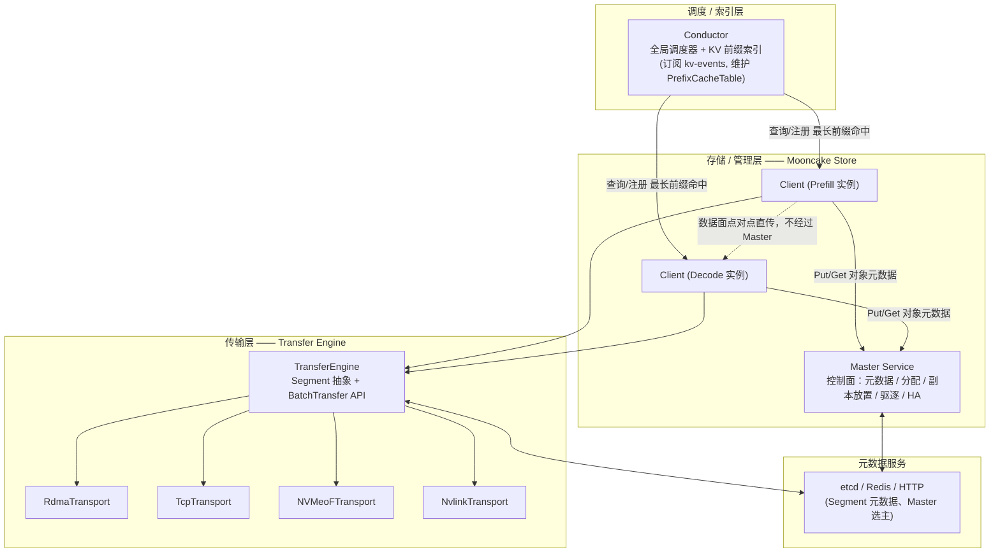
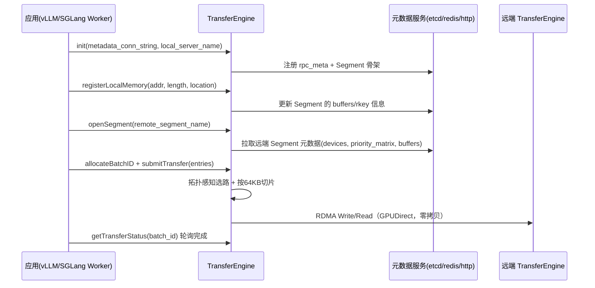
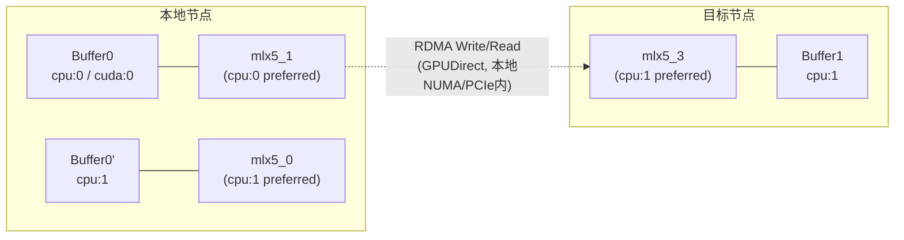
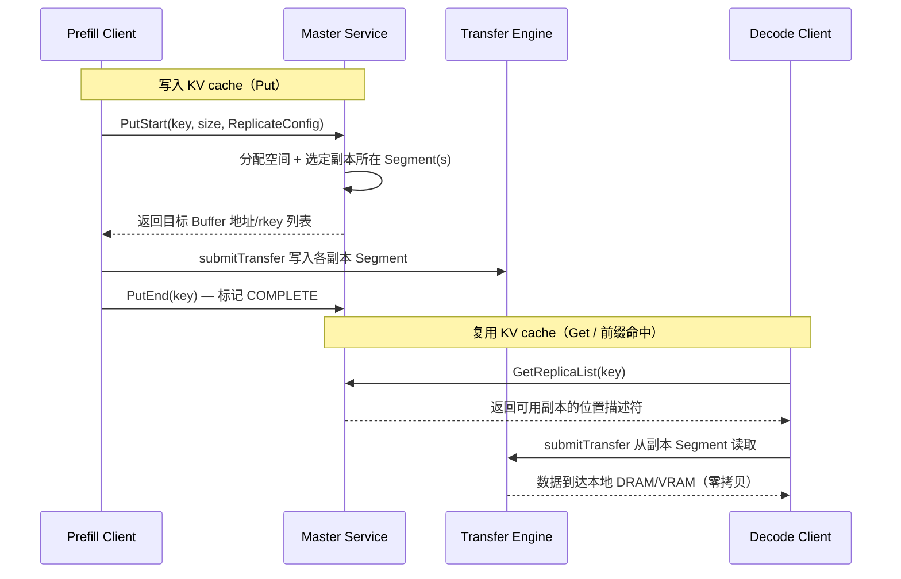
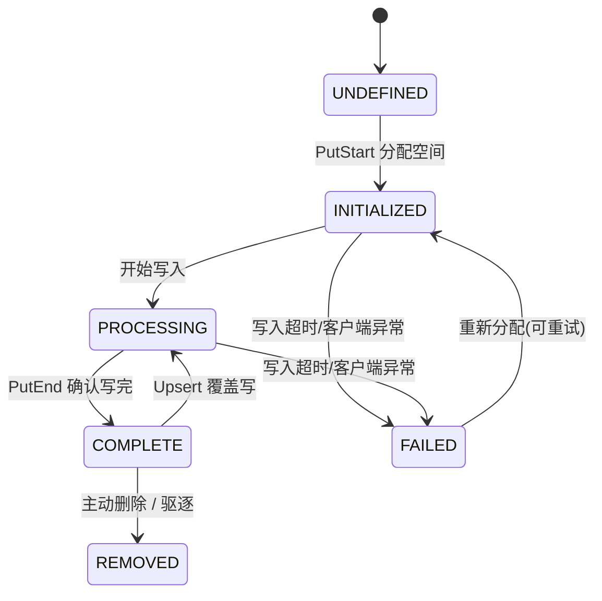
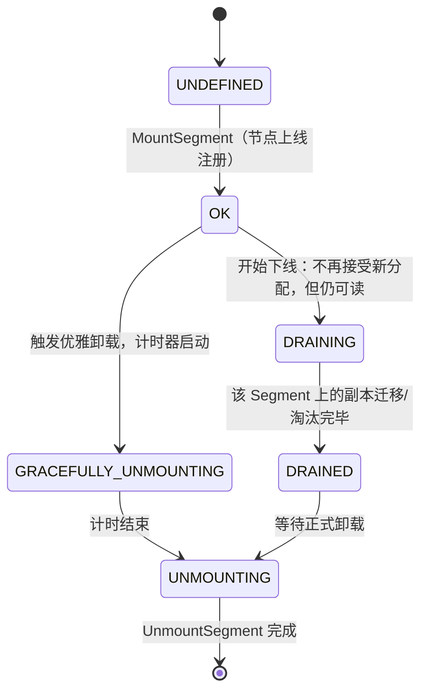
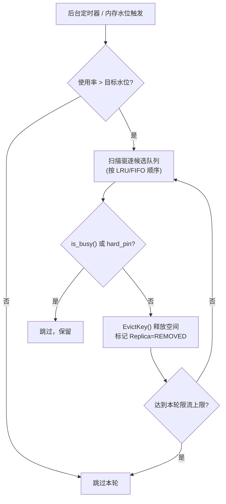
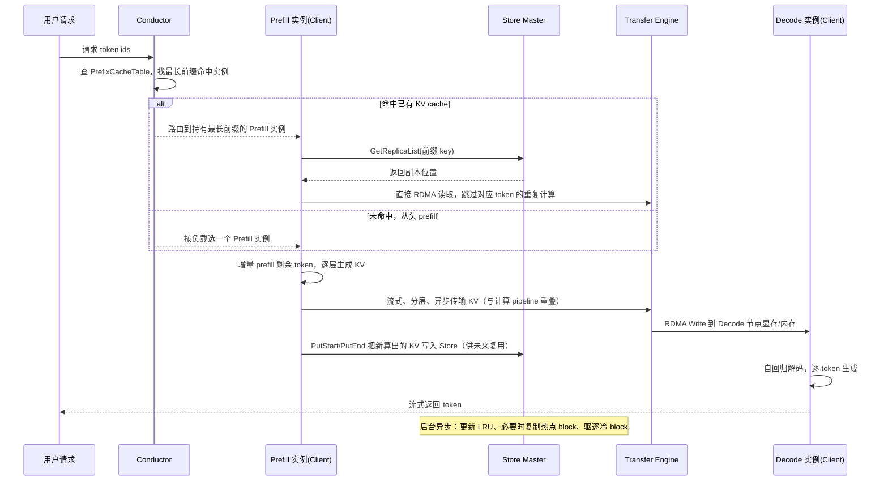

# 专题 10：Mooncake 深度拓展 —— Transfer Engine 怎么传、Mooncake Store 怎么管

> 与专题 04（`04-KV亲和调度与Mooncake专题.md`）的关系：04 讲清楚了"KV 亲和调度为什么需要 Mooncake、Motor 怎么用 Conductor 的索引"，本篇是 04 第 4 章的**放大镜**——只聚焦两个问题：
> 1. **Transfer Engine 如何把一段 KV cache 从 A 机器搬到 B 机器**（传输机制、协议、选路、容错）；
> 2. **Mooncake Store 如何管理这些 KV cache 对象**（元数据、副本、生命周期、淘汰、高可用）。
>
> 所有结论均可在工作区 `Mooncake/` 源码中核实，关键路径已标注文件名。图表用 Mermaid 绘制。

---

## 0. 一图总览：三层架构与职责边界



**关键设计判断（面试高频）：控制面与数据面分离**——Master 只管"这个 key 的 KV cache 在哪几个 Segment 上、状态如何"，真正的数据搬运（GB 级）完全由 Client 之间通过 Transfer Engine 点对点完成，不经过 Master、不占用 Master 的网络带宽。这也是为什么 Master 可以是单点瓶颈也不影响整体吞吐——它只做轻量的元数据操作。

---

## 1. 传输怎么做：Transfer Engine

### 1.1 两个核心抽象：Segment 与 BatchTransfer

源码：`mooncake-transfer-engine/include/transfer_engine.h`

- **Segment**：一段可被远程读写的连续地址空间。每个进程启动时自动创建一个以自己 `local_server_name` 命名的 **RAM Segment**，逻辑上覆盖整个虚拟地址空间；实际只有注册过的部分（**Buffer**）才能被 RDMA 访问。此外还有 **NVMeof Segment**，代表远端 NVMe 上可挂载的文件，用于 KV cache 落盘/取回。
- **BatchTransfer**：一次批量、异步的 Read/Write 请求集合，可以在一个 Segment 内的多段不连续地址和另一批 Segment 的对应地址间做同步，语义类似"更灵活的异步 AllScatter/AllGather"。

对应 C++ API（`TransferEngine` 类）核心调用序列：



要点：

- **零拷贝**：无论是 RDMA（GPUDirect，网卡直接读写 GPU 显存）还是 NVMe-oF（PCIe 直连 NVMe 到 DRAM/VRAM），数据搬运都不经过 CPU 中转、不做 memcpy。
- **异步 + 批量**：`submitTransfer` 提交一批请求立即返回，通过 `getTransferStatus`/`getBatchTransferStatus` 轮询，天然适合把 KV cache 传输和 prefill 计算做 pipeline 重叠（论文里的 *streaming KVCache transfer*，逐层生成逐层传，不等全部算完再传）。

### 1.2 多协议后端：一套接口，多种传输介质

`Transport` 抽象出统一接口，具体实现按后端分文件：`rdma_transport/`、`tcp_transport/`、`nvmeof_transport/`、`nvlink_transport/`、`hip_transport/`（AMD ROCm）、`ascend_transport/`（华为昇腾 HCCL）、`efa_transport/`（AWS EFA）等。

| 场景 | 首选协议 | 特点 |
|---|---|---|
| 跨节点 DRAM ↔ DRAM/VRAM（主力） | RDMA (GPUDirect) | 绕过 CPU 和内核，微秒级延迟，多网卡可聚合带宽 |
| 无 RDMA 网络环境 | TCP | 通用兜底，走 socket，延迟高但无硬件依赖 |
| KV cache 落盘/取回 | NVMe-oF (cuFile/GDS) | PCIe 直连 NVMe 到 DRAM/VRAM，也是零拷贝 |
| 单机多卡 | NVLink / HIP IPC | 利用卡间高速互联，不走网卡 |
| 昇腾 NPU 集群 | Ascend Transport (HCCL) | vLLM-Ascend 集成用的就是它 |

同一份上层代码（Mooncake Store 的 Put/Get）不关心底层协议，`TransferEngine` 会根据 Segment 元数据里的 `protocol` 字段和内存位置自动选择合适的 `Transport` 实例——这正是"统一传输语义 API"的含义。

**补充：跨厂商异构加速卡场景下，为什么通用 RDMA 传输要"先落 DRAM 再转显存"？**

这是异构互联的通用限制，不是某家方案独有的取舍：同厂商加速卡之间（如 NVLink/NVSwitch，昇腾的 HCCS）有专用高速互联，网卡/互联控制器能直接读写对方的显存/HBM；但跨厂商场景下，通用 RDMA 网卡不一定拿得到目标加速卡显存的直接访问权限（没有对应的 GPUDirect/HBM-Direct 驱动支持），只能先把数据从源端 HBM 拷到本地 DRAM，再用 RDMA 把 DRAM 数据传到对端，对端再从 DRAM 拷回目标显存——多一次中转。

Mooncake 自己在**异构昇腾传输**（910B 做 Prefill、H20 做 Decode 的跨芯片场景）里就是这么处理的，见 `Mooncake/docs/source/design/transfer-engine/heterogeneous_ascend.md`：

```12:13:Mooncake/docs/source/design/transfer-engine/heterogeneous_ascend.md
The copy bandwidth from HBM to DRAM is constrained by the size of data blocks. Small
data blocks smaller than 2MB result in underutilized bandwidth. We have implemented
an optimization using "data aggregation + pipeline parallelism": first, small data
blocks are aggregated into 8MB blocks within HBM before being transferred to DRAM,
while data copying and RDMA transmission are executed in parallel.
```

关键优化点：HBM→DRAM 的拷贝带宽受数据块大小限制（小于 2MB 的小块利用率低），所以先在 HBM 内把小块聚合成 8MB 大块再转 DRAM，且**拷贝和 RDMA 传输并行执行**（流水线掩盖中转延迟），而不是拷完再传。这个"聚合+流水线"手法可以当作任何"需要中转的异构传输场景"的通用应对模板来记。

### 1.3 拓扑感知路径选择（Topology-Aware Path Selection）

这是 Transfer Engine 区别于"随便拿一张网卡传数据"的核心创新，源码见 `mooncake-transfer-engine/src/topology.cpp`。

**问题**：现代推理服务器有多 CPU 插槽、多 GPU、多 RDMA 网卡，如果传输时随意选网卡，数据要跨 UPI（跨 CPU 插槽互联）或 PCIe Switch 中转，带宽和延迟都会打折扣。

**做法**：

1. 节点启动时探测硬件拓扑（NUMA 节点、GPU、RDMA 网卡的 PCIe 挂载关系），生成一份**拓扑矩阵**并广播到集群（存入 etcd 的 Segment 元数据 `priority_matrix` 字段）；
2. 矩阵把每种内存类型（如 `cpu:0`、`cuda:0`）关联到一份 **preferred 网卡列表**和一份 **secondary 列表**：与该内存同 NUMA 节点/同 PCIe Switch 下的网卡进入 preferred；
3. 正常情况下只从 preferred 列表选网卡，保证 RDMA 走本地 NUMA 或本地 PCIe Switch 下的 GPUDirect 路径；只有链路故障时才降级用 secondary 列表；
4. 单次传输若超过 64KB，会被**切片**，不同分片可以走不同网卡路径，多网卡协同工作，实现带宽聚合。



配套的**多网卡带宽聚合**：8×400Gbps 级别的网卡聚合带宽可以接近 DRAM 带宽，这也是论文里强调"当聚合带宽足够高时，跨节点复用 KVCache 比重新 prefill 更划算"的物理基础。这个"划算不划算"背后有一套严格的带宽阈值推导（LLaMA3-70B 场景下 6~19 GB/s 打平，现代 RDMA 网络轻松提供 100+ GB/s）——完整公式和"什么时候反而不该传"的讨论见第 3 节。

### 1.4 Endpoint 管理、连接池与故障处理

- **按需建连**：本地 RDMA 网卡与远端 RDMA 网卡之间的连接抽象为 **Endpoint**（内部含一个或多个 QP），Endpoint 在首次请求时才建立，不预先全连接。
- **连接池 + SIEVE 淘汰**：为防止 Endpoint 数量无限增长拖慢请求处理，Mooncake 对活跃连接数设上限，用 **SIEVE 算法**做淘汰（`MC_ENDPOINT_STORE_TYPE` 可选 `FIFO`/`SIEVE`，默认 `SIEVE`）。被淘汰/删除的 Endpoint 先进入等待队列，待其未完成的 in-flight 分片全部结束后再异步回收（避免正在传输的连接被误杀）。
- **故障自动切换**：链路失败时（网卡掉线、QP 出错），自动识别可用的备用路径重新提交请求到另一张 RDMA 网卡；出问题的 RDMA context/CQ 会被临时隔离，故障恢复后再重新纳入可用池——这是"自动 failover"能力的具体实现方式，不是简单重试。

### 1.5 元数据服务与关键运行参数

- Transfer Engine 自身也依赖一个轻量元数据服务（`etcd` / `redis` / `http`，见 `transfer_metadata_plugin.cpp`）来存 Segment 的地址、设备列表、`rkey`、拓扑矩阵等，这与 Mooncake Store Master 用 etcd 做高可用是两个独立但可共用的机制。
- 生产可调参数（环境变量，`MC_*`）覆盖了 QP 数量（`MC_NUM_QP_PER_EP`）、切片粒度（`MC_SLICE_SIZE`）、重试次数（`MC_RETRY_CNT`）、握手超时（`MC_HANDSHAKE_CONNECT_TIMEOUT`，防止连到已下线节点卡住整个内核 TCP 超时周期）、多网卡负载均衡（`MC_MLX5_QP_LAG_PORT_BALANCE`）等——面试如果被问"生产环境怎么调优"，可以提这几个方向：QP/CQ 规模、切片大小、握手超时、设备亲和性（`MC_ENABLE_DEST_DEVICE_AFFINITY`，rail-optimized 拓扑下优先选同名远端网卡减少 QP 数）。
- **实测性能**：论文给出 Transfer Engine 的 RDMA 传输比同类方案快约 **2.4×~4.6×**；官方 benchmark 单机可跑出 19.87 GiB/s（超过单卡网卡理论上限，说明多网卡聚合生效）。

---

## 2. 管理怎么做：Mooncake Store

### 2.1 Master（控制面）与 Client（数据面）分离

源码：`mooncake-store/src/master_service.cpp`（Master）、`mooncake-store/src/client_service.cpp`（Client）。

- **Master** 只做"账本"：对象元数据（key → 副本列表）、空间分配决策、副本放置策略、后台驱逐、Segment 上下线、HA 选主。所有操作走 RPC（`PutStart`/`PutEnd`/`GetReplicaList`/`BatchEvict` 等），本身不搬数据。
- **Client** 做"搬砖"：`Put`/`Get`/`BatchPut`/`BatchGet` 对象 API 的实际数据搬运，通过 Transfer Engine 与目标 Segment 点对点直传，不经过 Master。



这套"两阶段提交"（`PutStart` 分配 + 写入 + `PutEnd` 确认完成）保证了并发场景下不会有 Client 读到"分配了但还没写完"的半成品数据——对应下面的副本状态机。

**补充：Master 元数据是全局一把锁，还是分片锁？**——是分片锁，且分片数量、路由方式都能在源码里精确核实。`master_service.h` 把对象元数据切成 **1024 个 shard**，每个 shard 有自己的 mutex，用 key 的哈希取模路由到对应分片，而不是一个全局锁串行化所有 Put/Get：

```1206:1235:Mooncake/mooncake-store/include/master_service.h
static constexpr size_t kNumShards = 1024;  // Number of metadata shards
...
std::array<MetadataShard, kNumShards> metadata_shards_;
```

```1372:1381:Mooncake/mooncake-store/include/master_service.h
return std::hash<std::string>{}(user_key) % kNumShards;
...
return std::hash<std::string>{}(key) % kNumShards;
```

文件头部注释里还规定了严格的**加锁顺序**（避免死锁）：`client_mutex_ → tenant_quota_policy_mutex_ → snapshot_mutex_ → metadata_shards_[shard_idx_].mutex → tenant_quota_shards_[shard_idx_].mutex → segment_mutex_`。这是典型的"哈希分片 + 分片锁降低锁竞争"设计，任何自建集群级 KV 元数据服务（不管是不是叫 Mooncake）大概率都会收敛到同一个模式——如果被问到"怎么设计一个能扛高并发的 KV 元数据服务"，这就是标准答案骨架：先按 key 哈希分片、每片一把锁，再考虑要不要在分片锁之前加一层布隆过滤器做"快速确定不存在"的短路判断（Mooncake 本身没做布隆过滤器这层，是可以主动提的优化点）。

### 2.2 对象模型：Key → Replica，Replica 状态机

源码：`mooncake-store/include/replica.h`。每个 key 对应一组 `Replica`，每个 Replica 有类型（`MEMORY` / `DISK` / `LOCAL_DISK` / `NOF_SSD`）和独立的状态机：



只有 `COMPLETE` 状态的副本才能被 `Get` 读取；`refcnt`（引用计数）在有请求正在读取该副本时 >0，驱逐器不会淘汰"正忙"（`is_busy()`）的副本，这是防止"读的时候被驱逐掉"竞态的关键机制。

### 2.3 副本策略：`ReplicateConfig`

- `replica_num` / `nof_replica_num`：DRAM 副本数、NVMe-oF SSD 副本数，可分别配置——冷数据可以只留 SSD 副本，热点数据加多个 DRAM 副本；
- `preferred_segments`：指定优先放置的 Segment（配合"就近部署"降低跨机传输）；
- `with_soft_pin` / `with_hard_pin`：软钉住（驱逐时最后考虑）/硬钉住（禁止驱逐，比如正在被多个下游引用的系统 prompt 前缀）；
- `group_ids`：把多个 key 分到一组，共享元数据路由、租约续期、驱逐行为的合并处理（减小大量小 KV block 时的元数据开销）。
- 三种写入模式 `ReplicaWriteMode`：`SINGLE_REPLICA`（单副本，最省资源）、`FLEXIBLE_DUAL_REPLICA`（DRAM+SSD 各一份，兼顾速度与成本）、`RELIABLE_MULTI_REPLICA`（任一维度 >1，追求可靠性/热点承载）。

**这就是论文里"热点 block 主动复制到多个节点、冷 block 换出"的落地方式**：Conductor/上层根据访问频率动态调整某个 key 的 `ReplicateConfig`（提高 `replica_num`，或去掉 soft pin 让它更快被淘汰）。

### 2.4 Segment 生命周期

源码：`mooncake-store/include/segment.h`。Segment 代表一台机器贡献出来的一块存储资源（DRAM/SSD），有独立状态机，支持**优雅下线**（不是直接拔线）：



意义：扩缩容 Prefill/Decode 节点池时，可以先把某台机器标记 `DRAINING`，让它上面缓存的 KV cache 自然被读完/淘汰完，再安全下线，不会导致正在被引用的副本突然丢失。

### 2.5 驱逐策略：可插拔 + 后台批量执行

源码：`mooncake-store/include/eviction_strategy.h` + `master_service.cpp` 的 `BatchEvict`。

- **策略抽象** `EvictionStrategy`：`AddKey` / `UpdateKey`（访问时移到链表头，LRU 语义）/ `EvictKey`（从链表尾淘汰）。目前内置 `LRUEvictionStrategy`（最近最少使用）和 `FIFOEvictionStrategy`（先进先出，不响应访问更新）；Transfer Engine 的 Endpoint 池用的是 SIEVE（一种近似 LRU 但更省锁开销的算法，二者是不同层面的驱逐，不要混淆——一个淘汰"连接"，一个淘汰"数据对象"）。
- **触发方式**：Master 有后台线程周期性调用 `BatchEvict(evict_ratio_target, evict_ratio_lowerbound)`，把使用率降到目标水位以下；为避免一次淘汰太多打爆队列，每个周期只处理"淘汰队列上限的一部分"（`kEvictionBatchRatio` 之类的限流）。
- **保护机制**：`is_busy()`（refcnt>0，正被读）和 `with_hard_pin` 的副本永不进入淘汰候选；`with_soft_pin` 的副本优先级最低（最后淘汰）。



### 2.6 高可用（HA）

- **Master 选主**：多 Master 实例通过 etcd 做 leader 选举（`mooncake-store/src/ha/`，`MasterViewHelper::ElectLeader`），Client 和 Transfer Engine 通过 `Master 视图` 元数据感知当前 leader 地址；
- **故障恢复**：Master 重启/切主后，存活的 Client 会重新 `MountSegment` 把本地贡献的存储资源重新注册回新 Master；`CleanupStaleHandles` 之类的逻辑会清理属于已下线 Client 的 `LOCAL_DISK` 副本（通过对比"存活 client 集合"判断陈旧副本）；
- **快照**（源码里能看到 `snapshot` 相关测试）：Master 元数据可以做快照，加速故障后的状态恢复，避免全量重新扫描所有 Client。

---

## 3. 关键权衡：调度到"没缓存"的节点，还值不值得跨节点搬 KV？

这是 04/10 两篇文档背后一个容易被追问的核心问题：**如果请求被调度到了本地没有对应前缀缓存的 Prefill 节点（比如 Conductor 路由没命中、或负载均衡覆盖了亲和性决策），这个节点还能不能从集群里"抓"别处已经算好的 KV cache 过来用？重新算一遍 prefill 和跨节点搬这段 KV，到底哪个更贵？**

### 3.1 能不能抓：可以，这是 Mooncake Store 而不是 PD Connector 的职责

要先分清两条不同的路径，容易被面试问混：

| 路径 | 触发者 | 语义 |
|---|---|---|
| **Conductor 路由**（专题 04 第 2 节） | 调度层，请求还没开始处理前 | "计算追着缓存走"——尽量把请求送到已经持有最长前缀命中的节点，理想情况下不需要传输 |
| **Mooncake Store `Get()` 兜底**（本节） | Prefill 节点自己，请求已经落地之后 | "缓存追着计算走"——不管当前节点是不是 Conductor 选出来的最优节点，只要前缀 block 的 KV 存在于集群任意 Segment 上，当前节点都能主动 `GetReplicaList(key)` 查到位置，再通过 Transfer Engine RDMA 把它读过来，只对未命中的尾部 `[p:n]` 做增量 prefill |

第二条路径正是 vLLM `MooncakeStoreConnector` / SGLang `HiCache` L3（专题 11 有详细对比）存在的意义：**KV cache 是集群共享资源，取用权不取决于"当初是哪个节点算的"**。所以答案是肯定的——即便调度"失手"送到了冷节点，这个节点仍然可以把别处的缓存拉过来，代价只是多了一次跨节点 RDMA，而不是必须从头算。

### 3.2 重复 prefill vs 跨节点传输，哪个更贵：论文的严格推导

Mooncake 论文（FAST'25）§2.2 给出了完整的数学分析，不是拍脑袋估的，公式如下（`l`=层数，`d`=模型维度，`n`=当前 prompt 总长度，`p`=命中的前缀长度，`gqa`=Q head 数/KV head 数，`s`=元素字节数，`a`/`b`=常数系数）：

- **Prefill 计算量**（Equation 1）：`flops(n) = l × (a·n²·d + b·n·d²)`——注意力部分随长度**平方**增长，MLP/QKVO 投影部分随长度**线性**增长；
- **复用前缀 p 能省下的算力**：`l × (a·p²·d + b·p·d²)`；
- **需要传输的数据量**：`p × l × (2d/gqa) × s`（K、V 各一份，GQA 场景下头数按 `gqa` 折算）；
- **划算条件**（Equation 2，`G`=GPU 算力吞吐，`B`=有效传输带宽）：

```
B/G > 2ds / (gqa × (a·p·d + b·d²))
```

**关键洞察**：右边分母里有一个 `a·p·d` 项——**p 越大，分母越大，所需的最低带宽阈值反而越低**。直觉解释：注意力重算的开销是 `p²` 量级（平方增长），而要传输的数据量只是 `p` 量级（线性增长），前缀越长，"重算"相对"搬运"就越吃亏，复用的性价比只会越来越高，不会随长度增长而变差。

**论文给出的具体数字**（LLaMA3-70B）：
- 8× A800（`G=8×312 TFLOPS`），前缀长度 8192 时，最低有效带宽阈值仅 **6 GB/s**；
- 8× H800（算力更强，`G` 更大），阈值上升到 **19 GB/s**（GPU 越快，需要更快的网络才能喂饱它，符合直觉）；
- 现代 RDMA 网络轻松做到 100+ GB/s 聚合带宽（论文实测 4×200Gbps 下 87 GB/s，8×400Gbps 下 190 GB/s），**比阈值高一到两个数量级**——意味着在绝大多数长上下文、大模型场景下，跨节点传输的开销远小于重新 prefill 的开销，不是"差不多"，是"差一个数量级以上"。

### 3.3 什么时候反而不该传，直接本地重算更快

阈值分析是"稳态"结论，但现实里还有几个因素会把天平拨回"本地重算"这一侧，面试如果被追问"是不是任何时候都该传"要能接住：

1. **前缀太短**：`p` 很小时，省下的算力（`~p²` 量级里的低阶项，实际很小）可能还不够抵消一次 RDMA 握手/元数据查询（`GetReplicaList` RPC）的固定延迟开销——这也是为什么 Motor 的 KV 亲和查询会有"prompt 短于一个 block 直接走 fast path 跳过查询"的短路逻辑（专题 04 第 2.2 节），Mooncake Store 的 block size 通常也设在 256 token 量级，不会为几十个 token 的前缀去查表传输；
2. **网络本身不够快**：论文 §5.4.2 实测给出建议阈值——集群总带宽低于 100 Gbps 时 TTFT 会明显恶化，是"实测建议下限"而不是上面理论最小阈值（理论阈值是 6~19 GB/s ≈ 48~152 Gbps，实测建议留了安全边际，因为传输阶段不可能完美和计算重叠）；
3. **热点拥塞**：如果某个高频复用的前缀 block 只有一份副本，大量 Decode/Prefill 节点同时抢着读，这一份 Segment 的 NIC 会成为瓶颈——这就是专题 04/10 反复提到的"热点 block 主动复制到多个节点"（`ReplicateConfig.replica_num`）要解决的问题，本质是把"传输开销"从一份带宽的瓶颈分摊成多份带宽；
4. **传输本身能被计算重叠掉，进一步压低传输的"有效成本"**：即使传输时间本身不为零，只要它能和后续的增量 prefill / decode 计算重叠（Mooncake 的分层流式传输设计），它占用的"额外墙钟时间"可以趋近于零——这进一步放大了传输相对重算的优势。

**一句话总结（背）**："能不能传——能，Mooncake Store 的 Get 语义决定了 KV cache 是集群共享资源，跟当前节点是不是 Conductor 选中的最优节点无关；该不该传——几乎总是该传，因为重算的代价是前缀长度的平方增长，传输的代价只是线性增长，前缀越长传输越划算，论文给的实测阈值是 6~19 GB/s，现代 RDMA 网络的实际带宽比这个阈值高一到两个数量级；真正不该传的场景是前缀短到 RDMA 握手/查表的固定开销盖过了省下的算力，或者网络本身太差、或者一份缓存被太多节点同时抢导致拥塞——这些都是可以用 block 粒度阈值、多副本策略解决的工程问题，不是'传输天然更贵'。"

### 3.4 三个真实系统各自的策略：谁做了完整成本模型，谁在偷懒简化

上面 3.1/3.2/3.3 讲的是理论上"该怎么权衡"，但 Mooncake 论文（Conductor）、Motor（KV 亲和调度）、vLLM 自己的 `MooncakeStoreConnector` 三个真实系统，对这个权衡的**实现精细度是不一样的**，面试如果被连续追问"那具体谁是这么做的"，要能分清层次：

| 系统 | 做决策的层级 | 策略类型 | 有没有显式的 Ttransfer 成本项 |
|---|---|---|---|
| **Mooncake Conductor**（论文 Algorithm 1） | 调度层，请求分配给哪个 Prefill 实例之前 | **完整成本模型**：对每个候选实例都估算 `TTFT = Ttransfer + Tqueue + Tprefill`，取全局最小 | **有**，且有显式的 `kvcache_balancing_threshold` 门限——只有远端命中比本地命中长出的部分超过门限才真正触发跨节点传输 |
| **Motor `KvCacheAffinityPolicy`** | 调度层（Coordinator），比 Conductor 更上一层的路由决策 | 简化打分：`unified` 模式 `score = prefill_load_scale × max(0, isl − overlap_credit × matched) + load_weight × load` | **没有**——`overlap_credit` 默认 `1.0`，隐式假设命中即可几乎免费复用，不单独建模传输耗时 |
| **vLLM `MooncakeStoreConnector`**（scheduler 侧） | 执行层，请求已经落在某个 Prefill 实例之后 | 二元查表：`get_num_new_matched_tokens` 只做存在性查询，命中数超过本地已算 token 数就无条件决定拉取 | **没有**——`lookup()` 只回答"存不存在、有多少"，不比较值不值 |

Mooncake Conductor 的调度算法核心片段（真实伪代码，非改写）：

```text
if best_len − instance.prefix_len > kvcache_balancing_threshold then
    prefix_len ← best_len
    transfer_len ← best_len − instance.prefix_len
    Ttransfer ← EstimateKVCacheTransferTime(transfer_len)
else
    prefix_len ← instance.prefix_len
    Ttransfer ← 0
Tqueue ← EstimatePrefillQueueTime(instance)
Tprefill ← EstimatePrefillExecutionTime(len(R.prompt_tokens), prefix_len)
if TTFT > Ttransfer + Tqueue + Tprefill then
    TTFT ← Ttransfer + Tqueue + Tprefill; p ← instance
```

Motor 对应的打分逻辑（`motor/coordinator/scheduler/policy/kv_cache_affinity.py`）：

```262:264:MindIE-PyMotor/motor/coordinator/scheduler/policy/kv_cache_affinity.py
matched_tokens = min(matched, isl) if isl > 0 else 0
prefill_cost = max(0.0, isl - overlap_credit * matched_tokens)
load_cost = ep.workload.calculate_workload_score(PDRole.ROLE_P)
```

vLLM `MooncakeStoreConnector` 对应的判定逻辑（`vllm/distributed/kv_transfer/kv_connector/v1/mooncake/store/scheduler.py`）：

```73:120:vllm/vllm/distributed/kv_transfer/kv_connector/v1/mooncake/store/scheduler.py
def get_num_new_matched_tokens(self, request, num_computed_tokens):
    token_len = request.num_tokens // self._block_size * self._block_size
    if token_len < self._block_size:
        return 0, False
    num_external_hit_tokens = self.client.lookup(
        request.request_id, token_len, request.block_hashes,
        non_block=self.lookup_async,
    )
    ...
    if need_to_allocate <= 0:
        return 0, False
    ...
    return need_to_allocate, self.load_async
```

**三层为什么可以这样分工，不算"vLLM/Motor 偷懒"**：这是典型的分层设计——**"该不该传"这个最贵的决策（需要维护实时负载、离线拟合的 prefill 时间模型、动态网络拥塞估计）只在调度层算一次**（Mooncake Conductor 的 Algorithm 1，或者 Motor 的打分），一旦请求被分配到具体实例，执行层（vLLM Connector）只需要"老实执行"，不需要重新验证这个决策是否还成立——重复计算没有意义，只会增加延迟。真正的风险点在于：**如果有人把 `MooncakeStoreConnector` 从 Mooncake Conductor/Motor 这类调度层剥离、单独使用**（比如只用 vLLM 自带的负载均衡 + `MooncakeStoreConnector` 兜底），那"该不该传"这个判断就没人做了，退化成"是命中就传"的贪心策略——在前缀很短、命中增益很小的场景下可能不划算，这也是为什么面试官如果问"独立部署 MooncakeStoreConnector 有什么风险"，可以直接指出这一点。

---

## 4. 串联：一次 PD 分离 + 跨实例前缀命中的完整链路

结合专题 04 的 Conductor 调度视角，把"调度→传输→管理"串成一条完整时序：



这张图把三个组件的分工说清楚：**Conductor 决定"去哪"，Master 决定"东西在哪、还能不能用"，Transfer Engine 负责"怎么把东西真正搬过去"**——面试被问"KV 亲和调度怎么落地到 Mooncake"时，这是最完整的回答骨架。

---

## 5. 面试高频问答（聚焦传输 + 管理，与 04 的一分钟版互补）

**Q1：Transfer Engine 为什么能做到零拷贝？**
> RDMA 场景下用 GPUDirect RDMA，网卡直接读写远端 GPU 显存/DRAM，不经过 CPU、不做 memcpy；NVMe-oF 场景下用 cuFile/GPUDirect Storage，数据从远端 NVMe 经 PCIe 直达本地 DRAM/VRAM，同样绕过 CPU。上层统一抽象成 Segment + BatchTransfer，屏蔽了协议差异。

**Q2：多网卡怎么聚合带宽，会不会传输时选错网卡导致跨 NUMA？**
> 每台机器启动时探测 NUMA/PCIe 拓扑生成矩阵，按内存位置（`cpu:0`/`cuda:0`）区分 preferred/secondary 网卡列表，正常只走 preferred（本地 NUMA 或本地 PCIe Switch 下的 GPUDirect 路径）；超过 64KB 的传输会切片，不同分片走不同网卡路径并行，从而聚合多网卡带宽；链路故障时降级用 secondary 列表并自动重试。

**Q3：Master 会不会成为单点瓶颈？**
> 不会，因为 Master 走的是控制面/数据面分离架构：Master 只处理元数据 RPC（`PutStart`/`GetReplicaList` 等，KB 级请求），真正的 GB 级数据搬运由 Client 间通过 Transfer Engine 点对点完成，完全不经过 Master。Master 本身也支持多实例 + etcd 选主做高可用。

**Q4：Mooncake Store 怎么决定一个 KV block 该不该保留多个副本？**
> 通过 `ReplicateConfig`：`replica_num`（DRAM 副本数）、`nof_replica_num`（SSD 副本数）可独立配置，配合 `with_soft_pin`/`with_hard_pin` 控制驱逐优先级。热点前缀可以配置更多副本分散读压力，冷数据降级到 SSD 副本甚至允许被驱逐。

**Q5：驱逐策略和淘汰时的一致性怎么保证？**
> Replica 有独立状态机（`INITIALIZED → PROCESSING → COMPLETE → REMOVED`），只有 `COMPLETE` 才可读；驱逐候选队列跳过 `refcnt>0`（正被读取/正忙）和 `hard_pin` 的副本，`soft_pin` 副本优先级最低但可淘汰。后台 `BatchEvict` 按批限流执行，避免一次性淘汰过多打爆系统。

**Q6：节点下线（扩缩容）时 KV cache 怎么处理，会不会数据丢失导致下游读失败？**
> Segment 有优雅下线状态机：`OK → DRAINING`（停止新分配但仍可读）→ `DRAINED`（副本迁移/淘汰完毕）→ `UNMOUNTING`。不是直接拔线，给了在用副本自然消耗完的窗口。

**Q7：RDMA 连接是不是一开始就全连接好？出故障怎么处理？**
> 按需建连（Endpoint 首次请求时才建立），用连接池 + SIEVE 算法限制活跃连接数上限，防止连接数无限增长拖慢请求处理；被淘汰的连接先进等待队列，未完成的分片传输完再回收。链路故障时自动切换到备用网卡重新提交请求，故障的 RDMA context/CQ 会被临时隔离直到问题解决。

**Q8：Transfer Engine 和 Mooncake Store 是什么关系，能分开用吗？**
> Transfer Engine 是纯传输库（Segment + BatchTransfer 语义），可以独立拿来做点对点高速数据搬运（P2P Store 场景）；Mooncake Store 是在 Transfer Engine 之上加了一层对象管理（Master 元数据 + 副本 + 驱逐 + HA），提供 Put/Get 这种更高层的 KV cache 存取语义。类比：Transfer Engine 相当于"高速公路"，Mooncake Store 相当于"物流公司的调度和仓储系统"。

**Q9：Master 的元数据锁怎么设计才能扛住高并发 Put/Get？**
> 不能用一个全局锁串行化所有请求。Mooncake Master 实测是哈希分片方案：`kNumShards = 1024`，按 `hash(key) % 1024` 把对象元数据路由到 1024 个独立分片，每个分片有自己的 mutex，配合严格的加锁顺序规范（先 client_mutex_，再 shard mutex，最后 segment_mutex_）避免死锁。这是高并发 KV 元数据服务的标准解法；如果还要再优化，可以在分片锁前面加一层布隆过滤器做"快速判断一定不存在"的短路，省掉一次哈希和加锁开销（Mooncake 目前没有这一层）。

**Q10：请求被调度到没有缓存的 Prefill 节点，还能不能把别处的 KV cache 抓过来？重算和传输谁贵？**
> 能，这是 Mooncake Store `Get()` 语义本身决定的——KV cache 是集群共享对象，不是"谁算的归谁"，当前节点查到 key 在别的 Segment 上就能直接 RDMA 拉过来，跟 Conductor 当初有没有把请求路由对没关系（详见第 3 节）。谁贵谁便宜看论文 §2.2 的公式：重算的 FLOPs 随前缀长度 `p` 平方增长（`a·p²·d` 项，主要是 attention），要传输的数据量只随 `p` 线性增长，所以前缀越长传输越划算；LLaMA3-70B 在 8×A800 上的实测阈值只要 6 GB/s，现代 RDMA 网络（100+ GB/s）比这个阈值高一到两个数量级，绝大多数场景传输明显比重算便宜。只有前缀很短（RDMA 握手/查表的固定开销盖过省下的算力）、网络本身很差、或者热点 block 只有一份副本被并发抢导致拥塞时，才会出现"传不如算"，这些都是可以靠 block 粒度阈值和多副本策略工程化解决的问题。

**Q11：Mooncake、Motor、vLLM 三个系统，谁真的在做"传输值不值得"这个成本比较？**
> 只有 Mooncake Conductor 的论文 Algorithm 1 做了完整版：对每个候选 Prefill 实例都估算 `Ttransfer+Tqueue+Tprefill`，取全局 TTFT 最小的实例，并且有一个显式的 `kvcache_balancing_threshold` 门限决定要不要真的触发跨节点传输。Motor 的 `KvCacheAffinityPolicy` 是简化版，只在打分里把命中的 token 数从要算的量里扣掉（`overlap_credit` 默认按 100% 折算，隐式假设复用几乎免费），没有单独建模传输耗时。vLLM 自己的 `MooncakeStoreConnector`（scheduler 侧 `get_num_new_matched_tokens`）更简单，纯粹是"Store 里有没有更长命中"的二元查表，有就无条件拉取，完全不比较值不值。三者由粗到细排列刚好是：vLLM Connector（执行层，只管拉不管算不算账）< Motor（路由层，简化打分）< Mooncake Conductor（调度层，完整成本模型）——这是合理的分层设计，"该不该传"这个最贵的判断只在最上层算一次，下层负责老实执行，不重复验证。详见第 3.4 节。

---

## 6. 参考

- 论文：《Mooncake: Trading More Storage for Less Computation — A KVCache-centric Architecture for Serving LLM Chatbot》FAST'25 最佳论文，arXiv:2407.00079
- 官方文档：kvcache-ai.github.io/Mooncake（Design → Transfer Engine / Mooncake Store / Conductor）
- 源码：工作区 `Mooncake/` 仓
  - 传输：`mooncake-transfer-engine/include/transfer_engine.h`、`src/topology.cpp`、`src/transport/`
  - 管理：`mooncake-store/include/{replica.h, segment.h, eviction_strategy.h}`、`src/master_service.cpp`、`src/client_service.cpp`、`src/ha/`
- 专题 04：`04-KV亲和调度与Mooncake专题.md`（Conductor 调度视角、Motor/router 对照、集成落地）
