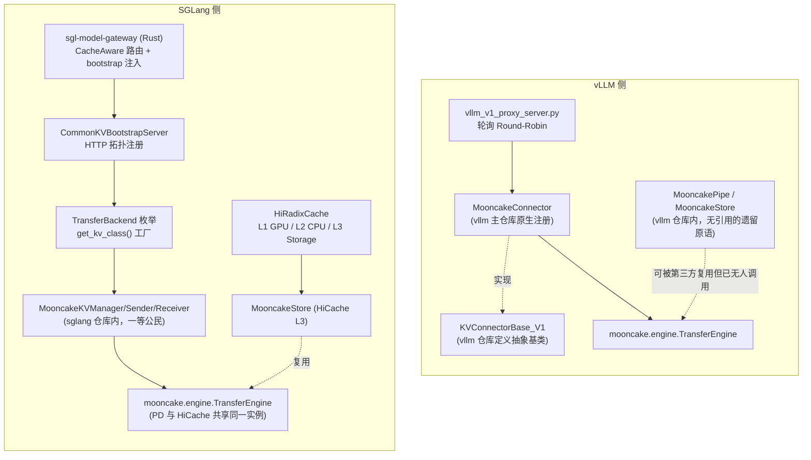
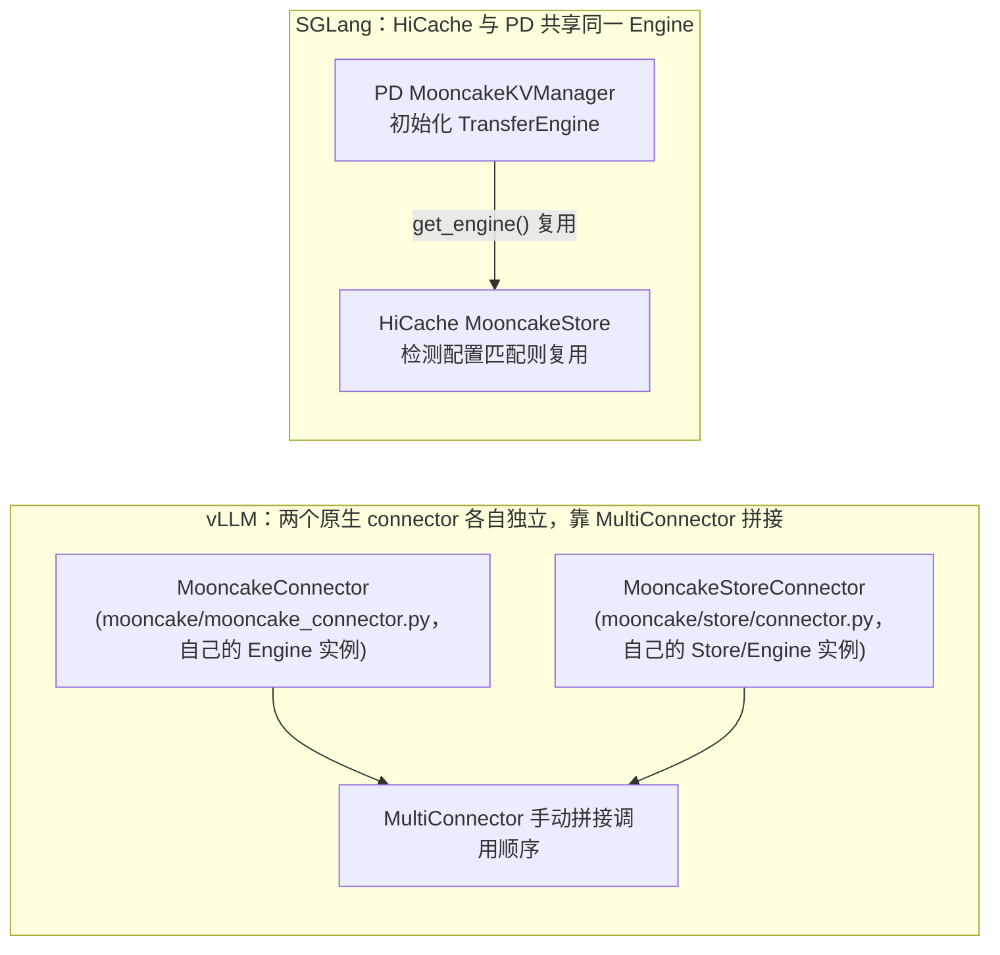
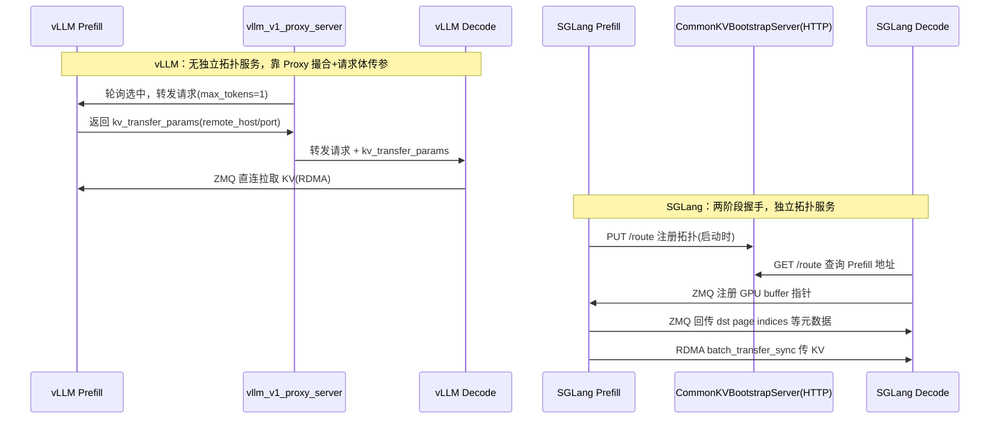

# 专题 11：Mooncake 在 vLLM 与 SGLang 中的集成异同（源码级对比）

> 承接专题 04/10。本文基于工作区 `vllm/`、`sglang/`、`Mooncake/`（含 `mooncake-wheel`）三个仓库的**实际源码**，逐项对比两大推理引擎如何"用"Mooncake。核心结论先说：**两者底层都调用同一份 `mooncake` Python wheel（`mooncake.engine.TransferEngine` + `mooncake.store.MooncakeDistributedStore`），工程集成的成熟度已经比较接近**——SGLang 一直是原生一等公民、可插拔 backend；vLLM 在本文档最初写成时（旧分支快照）还依赖外部 `mooncake-wheel` 动态加载，**但 `main` 分支现状已经变化：`MooncakeConnector`（PD）和 `MooncakeStoreConnector`（跨实例前缀共享）都已经直接合入 vLLM 主仓库并注册进默认 connector 工厂**，不再需要 `kv_connector_module_path` 外部动态加载。下面第 0.1 节先说明这个更新，其余章节的分析结论大部分仍然成立（尤其是"是否支持逐层流式传输"这个关键判断——即使代码搬进了主仓库，`MooncakeConnector` 依然没有做分层流式）。

> **更新记录**：2026-07-14 复查确认 vLLM 侧 Mooncake 代码归属已从"外部包动态加载"变为"主仓库原生注册"，本文档已同步修正第 0、1、2 节的相关结论，其余章节（传输粒度、握手机制、路由层对比等）未受影响，仍按原分析保留。

---

## 0. 结论速览表

| 维度 | vLLM | SGLang | 谁更"深" |
|---|---|---|---|
| Mooncake connector 代码位置 | **已原生合入 vllm 主仓库**：`vllm/distributed/kv_transfer/kv_connector/v1/mooncake/mooncake_connector.py`（PD）+ `.../mooncake/store/connector.py`（跨实例前缀共享），均在 `factory.py` 默认注册表里，不再需要外部动态加载 | **在 sglang 仓库内**，`sglang/srt/disaggregation/mooncake/conn.py`，与 nixl/mori/ascend 并列注册 | 打平（vLLM 已追上，不再是外部插件） |
| 多 backend 抽象 | 多个**独立 Connector 类**并列注册（`MooncakeConnector`/`MooncakeStoreConnector`/`P2pNcclConnector`/`NixlConnector`/`LMCacheConnectorV1`/...），彼此没有统一的"backend enum + 工厂"抽象，是并列的类而非同一接口下的可切换实现 | 统一 `TransferBackend` 枚举 + `get_kv_class()` 工厂，`mooncake`/`nixl`/`mori`/`ascend`/`fake` 五个 backend 共享一套 `BaseKVManager/Sender/Receiver/BootstrapServer` 接口 | SGLang（抽象层次更统一，vLLM 是"并列多个类"而不是"同一接口切换 backend"） |
| PD 传输粒度 | **Block 级，等 Prefill 全部算完后一次性批量传所有层**（`wait_for_layer_load`/`save_kv_layer` 在主仓库版本依然是空实现，见第 3 节） | **Page/chunk 级**，`enable_overlap` 时中间 chunk 边算边传（chunked-prefill 驱动的流式），最后一个 chunk 收尾 | SGLang（更接近论文里的流式思想；代码位置追平不代表传输策略追平） |
| 跨实例前缀缓存复用 | `MooncakeStoreConnector` 现已是主仓库原生 connector（`.../mooncake/store/connector.py` + `scheduler.py` + `worker.py`），可独立使用也可通过 `MultiConnector` 和 `MooncakeConnector` 拼接 | **HiCache 原生三级缓存树**（L1 GPU/L2 CPU/L3 Mooncake Store），`MooncakeStore` 是一等公民后端，且能**复用同一个 Transfer Engine 实例**（PD 用的和 HiCache 用的是同一个 C++ engine） | SGLang 仍略深（HiCache 是统一三级树 + engine 复用；vLLM 是两个独立 connector 拼接，无 engine 复用机制） |
| 握手/建连 | Proxy 层 round-robin 配对 + 请求体里传 `kv_transfer_params`（ZMQ 传指针） | 专门的 **HTTP Bootstrap Server**（`CommonKVBootstrapServer`）做拓扑注册，再叠加 ZMQ 传 buffer 元数据，两阶段更规范 | SGLang |
| 路由层 cache-aware | 无，`vllm_v1_proxy_server.py` 就是 `itertools.cycle` 轮询 | Rust `sgl-model-gateway` 有 `PDSelectionPolicy::CacheAware`（近似前缀树 + 负载权衡），虽不直查 Mooncake 元数据，但路由层本身更成熟 | SGLang |
| 底层调用方式 | Python 包直调 C++（`mooncake.engine.TransferEngine`） | 同上，且 PD 与 HiCache **共享同一 engine 实例**，减少重复初始化 | 打平，SGLang 工程细节更精 |
| 容错/黑名单 | 有限（connector 层面的超时/重试） | `failed_sessions` 黑名单 + `send_probe` 探活恢复 | SGLang |
| **是否对"传输值不值得"做成本比较**（详见专题 10 第 3.4 节） | **没有**：`MooncakeStoreConnector` 的 `get_num_new_matched_tokens` 只做存在性查询，Store 里有命中就无条件决定拉取，不比较传输代价 vs 省下的算力 | 未在本文覆盖范围内详细核实，但架构上也是"路由决定去哪、传输层按图执行"分层设计，通常不在 connector 层重复算成本 | 打平偏 Mooncake Conductor（两者都比 Mooncake 自己的 Algorithm 1 简化） |

一句话总结：**两边底层都是薄薄一层 Python binding 包住同一个 C++ Transfer Engine；SGLang 从一开始就把 Mooncake 深度产品化成了框架原生的可插拔组件（backend 抽象 + HiCache 三级树 + engine 复用），vLLM 之前是外挂第三方插件，现在（`main` 分支）已经把两个 Mooncake connector 原生合入主仓库，代码归属上追平了 SGLang，但传输策略层面（分层流式、成本感知决策、engine 复用）仍不如 SGLang 精细**。

---

## 1. 整体架构对比图



---

## 2. 维度一：代码归属与可插拔性

### vLLM：`main` 分支现状已经是原生注册（历史上曾是外部包动态加载）

> 本节结论已按 2026-07-14 复查更新。之前的分析（当时的分支快照）里 vLLM 仓库只留了 `MooncakePipe`/`MooncakeStore` 两个无人调用的旧原语，真正的 connector 要靠 `kv_connector_module_path` 从外部 `mooncake-wheel` 包动态加载。**现在 `main` 分支已经不是这样**：

```218:227:vllm/vllm/distributed/kv_transfer/kv_connector/factory.py
KVConnectorFactory.register_connector(
    "MooncakeConnector",
    "vllm.distributed.kv_transfer.kv_connector.v1.mooncake.mooncake_connector",
    "MooncakeConnector",
)
KVConnectorFactory.register_connector(
    "MooncakeStoreConnector",
    "vllm.distributed.kv_transfer.kv_connector.v1.mooncake.store.connector",
    "MooncakeStoreConnector",
)
```

两个 connector 都在 `vllm/distributed/kv_transfer/kv_connector/v1/mooncake/` 目录下原生实现：

| Connector | 文件 | 职责 |
|---|---|---|
| `MooncakeConnector` | `mooncake/mooncake_connector.py` | PD 点对点传输（对应本文第 3 节的传输策略） |
| `MooncakeStoreConnector` | `mooncake/store/connector.py` + `store/scheduler.py`（scheduler 侧）+ `store/worker.py`（worker 侧，含 `LookupKeyClient`） | 跨实例前缀共享（对应专题 10 第 3 节"Get 语义与成本判断"） |

现在启动只需要 `--kv-transfer-config '{"kv_connector":"MooncakeConnector", "kv_role":"kv_producer"}'`，**不再需要 `kv_connector_module_path` 这个外部动态加载参数**——这是判断"是插件还是原生"最直接的信号：需要 `kv_connector_module_path` 就是外部插件，不需要就是原生注册。

这个变化说明什么：vLLM 社区对 Mooncake 的重视程度在提升，正在把它从"第三方可选后端"逐步扶正为"官方一线支持的 connector"，和 NixlConnector、LMCacheConnectorV1 平级对待。但要注意——**代码搬进主仓库不代表传输策略也变得更精细**，第 3 节会展开讲：`MooncakeConnector` 依然没有做分层流式传输，`MooncakeStoreConnector` 的成本判断依然是"有就拿"的二元逻辑，这些是策略层面的差距，不会因为换个代码位置就消失。

### SGLang：Mooncake 是内置 backend，和 nixl/mori/ascend 平级

`disaggregation/utils.py` 里的 `TransferBackend` 枚举和 `get_kv_class()` 工厂，把 mooncake/nixl/mori/ascend/fake 五个后端统一抽象成 `KVManager`/`KVSender`/`KVReceiver`/`KVBootstrapServer` 四个角色：

```409:467:sglang/python/sglang/srt/disaggregation/utils.py
class TransferBackend(Enum):
    MOONCAKE = "mooncake"
    MORI = "mori"
    NIXL = "nixl"
    ASCEND = "ascend"

### SGLang：Mooncake 是内置 backend，和 nixl/mori/ascend 平级

`disaggregation/utils.py` 里的 `TransferBackend` 枚举和 `get_kv_class()` 工厂，把 mooncake/nixl/mori/ascend/fake 五个后端统一抽象成 `KVManager`/`KVSender`/`KVReceiver`/`KVBootstrapServer` 四个角色：

```409:467:sglang/python/sglang/srt/disaggregation/utils.py
class TransferBackend(Enum):
    MOONCAKE = "mooncake"
    MORI = "mori"
    NIXL = "nixl"
    ASCEND = "ascend"
    FAKE = "fake"

def get_kv_class(transfer_backend: TransferBackend, class_type: KVClassType):
    if transfer_backend == TransferBackend.MOONCAKE:
        from sglang.srt.disaggregation.mooncake import (
            MooncakeKVBootstrapServer, MooncakeKVManager,
            MooncakeKVReceiver, MooncakeKVSender,
        )
        class_mapping = {
            KVClassType.MANAGER: MooncakeKVManager,
            KVClassType.SENDER: MooncakeKVSender,
            KVClassType.RECEIVER: MooncakeKVReceiver,
            KVClassType.BOOTSTRAP_SERVER: MooncakeKVBootstrapServer,
        }
```

**面试话术**：vLLM 的多 connector 是"平铺的多个独立实现类"，谁想接入自己写一个 `KVConnectorBase_V1` 子类，Mooncake 只是其中一个外部实现；SGLang 是"统一角色接口 + backend 枚举"，Mooncake/NIXL/Mori/Ascend 四种硬件传输方案严格对齐同一套 Manager/Sender/Receiver/BootstrapServer 语义，切换 backend 只改一个配置项，代码结构更利于横向扩展新硬件（这也解释了为什么 SGLang 能更快接入 Ascend、Mori 等国产/新硬件后端）。

---

## 3. 维度二：PD 传输粒度与流水线程度

### vLLM MooncakeConnector：Prefill 算完再传，Block 粒度，非分层流式

`wait_for_layer_load` / `save_kv_layer` 是 `KVConnectorBase_V1` 特意为"逐层流水线传输"开的口子（论文里"streaming KVCache transfer, overlap with incremental prefill"说的就是这个），但 Mooncake 的实现直接留空——这在代码合入主仓库后**依然没变**：

```576:585:vllm/vllm/distributed/kv_transfer/kv_connector/v1/mooncake/mooncake_connector.py
def wait_for_layer_load(self, layer_name: str) -> None:
    """MooncakeConnector does not do layerwise saving."""
    pass

def save_kv_layer(
    self,
    layer_name: str,
    kv_layer: torch.Tensor,
    attn_metadata: AttentionMetadata,
    **kwargs,
```

真正的传输是在整块 block 分配好之后，一次性把所有层对应 block 的内存批量传走（`batch_transfer_sync_write`/`batch_transfer_sync` 语义，与专题 10 描述的 `submitTransfer` 批量传输一致），不是逐层触发。

反而是 vLLM 自家的 `P2pNcclConnector` 才用上了逐层流水线（`save_kv_layer` 里每层生成即发送）——**这是本次对比里一个容易被问到的"反直觉点"：Mooncake 论文强调的分层流式，在 vLLM 的 MooncakeConnector 实现里反而没做，框架层的 hook 留空了。**

### SGLang：Chunked-Prefill 驱动的 Page 级流式（介于"全量批传"和"逐层流式"之间）

SGLang 走的是"按 chunk 边算边传"，不是逐层，是按 chunked-prefill 的 chunk 边界：

```705:709:sglang/python/sglang/srt/disaggregation/prefill.py
if self.enable_overlap:
    ...
    self.send_kv_chunk(req, last_chunk=False, end_idx=req.tmp_end_idx)
```

```657:657:sglang/python/sglang/srt/disaggregation/prefill.py
self.send_kv_chunk(req, last_chunk=True)
```



```mermaid
gantt
    dateFormat X
    axisFormat %s
    title vLLM 与 SGLang 的 PD 传输时机对比（示意，非真实耗时）
    section vLLM MooncakeConnector
    Prefill 全部 chunk 计算 :p1, 0, 10
    Prefill 完成后一次性 batch 传所有 block/所有层 :t1, 10, 14
    section SGLang mooncake backend
    Chunk1 计算 :sc1, 0, 3
    Chunk1 边算边传(overlap) :st1, 3, 5
    Chunk2 计算 :sc2, 3, 6
    Chunk2 边算边传(overlap) :st2, 6, 8
    最后 chunk 计算+收尾传输 :sc3, 6, 10
```

**面试话术**："Mooncake 论文里说的分层流式传输，实际在两个引擎的落地都打了折扣——vLLM 的 MooncakeConnector 是等 prefill 全部完成才批量传（block 粒度但不分层不 overlap）；SGLang 是按 chunked-prefill 的 chunk 粒度 overlap，比 vLLM 细一档，但也不是逐 transformer 层传输。真正做到'生成一层传一层'的是 vLLM 自家的 P2pNcclConnector，不是 MooncakeConnector。"

---

## 4. 维度三：跨实例前缀缓存复用（Store 侧）

### vLLM：现已是主仓库原生 connector，仍靠 MultiConnector 和 PD 拼接

> 更新：`MooncakeStoreConnector` 之前只在 Mooncake 官方文档里出现、代码找不到；`main` 分支现状是它已经作为**独立的原生 connector**合入 `vllm/distributed/kv_transfer/kv_connector/v1/mooncake/store/`（`connector.py` + `scheduler.py` + `worker.py`），可以单独使用，不再依赖外部包。但它和 `MooncakeConnector`（PD 传输）在架构上仍然是**两个独立的 connector**，没有被合并成一个统一入口——想同时用 PD 传输 + 跨实例前缀共享，仍然要靠 `MultiConnector` 拼接：

```json
{
  "kv_connector": "MultiConnector",
  "kv_role": "kv_producer",
  "kv_connector_extra_config": {
    "connectors": [
      {"kv_connector": "MooncakeConnector", "kv_role": "kv_producer"},
      {"kv_connector": "MooncakeStoreConnector", "kv_role": "kv_producer"}
    ]
  }
}
```

这说明在 vLLM 侧，"PD 点对点传输"和"跨实例前缀共享"即便都已经原生化，架构上仍然是**两套独立机制、靠 `MultiConnector` 拼接调用顺序**，两者各自持有自己的 Transfer Engine 实例，耦合度低但也意味着没有内建的智能协同（比如"这个 block 该走 P2P 直传还是从 Store 里捞现成的"这类判断，需要额外逻辑，不像 SGLang 那样天然共享一个 engine）。

### SGLang：HiCache 原生三级树，且和 PD 共享同一个 Engine

SGLang 的 `HiRadixCache` 把 GPU 显存（L1）、CPU host pool（L2）、远程存储（L3，可选 mooncake/nixl/hf3fs）统一成一棵树，`MooncakeStore` 是通过后端工厂注册的标准 L3 实现：

```205:209:sglang/python/sglang/srt/mem_cache/storage/backend_factory.py
StorageBackendFactory.register_backend(
    "mooncake",
    "sglang.srt.mem_cache.storage.mooncake_store.mooncake_store",
    "MooncakeStore",
)
```

更值得注意的细节：如果同一进程内已经因为 PD 分离初始化过 `MooncakeTransferEngine`（RDMA + P2PHANDSHAKE 配置匹配），HiCache 的 `MooncakeStore` 会**直接复用这个 engine 实例**，而不是各起一个：

```454:491:sglang/python/sglang/srt/mem_cache/storage/mooncake_store/mooncake_store.py
if (self._shared_mooncake_transfer_engine is not None
        and device_name == self._shared_mooncake_transfer_engine.get_ib_device()
        and self.config.metadata_server == "P2PHANDSHAKE"
        and self.config.protocol == "rdma"):
    transfer_engine = self._shared_mooncake_transfer_engine.get_engine()
    ...
    ret_code = self.store.setup(client_hostname, self.config.metadata_server,
                                 ..., transfer_engine)
```



**面试话术**："这是两边工程成熟度差距最大的一点——vLLM 里 PD 传输和前缀共享是两个独立 connector，要用户自己拼 MultiConnector，且 Store connector 的代码我在仓库里没找到，可能还没完全 open source；SGLang 的 HiCache 是把 GPU/CPU/远程存储做成一棵统一的 radix tree，Mooncake Store 只是可插拔的 L3 backend之一，而且工程上做了'同进程复用同一个 Transfer Engine 实例'的优化，避免重复初始化 RDMA 资源。"

---

## 5. 维度四：握手/建连机制

### vLLM：Proxy 撮合 + 请求体传元数据，无独立拓扑服务

`vllm_v1_proxy_server.py` 用 `itertools.cycle` 轮询选 Prefill/Decode 实例，Prefill 完成后把 `kv_transfer_params`（含 remote host/port）通过 HTTP 响应体传给 Proxy，再由 Proxy 转发给 Decode 请求：

```135:154:Mooncake/mooncake-wheel/mooncake/vllm_v1_proxy_server.py
def get_next_client(app, service_type: str):
    """Get the next client in round-robin fashion."""
    if service_type == "prefill":
        client_idx = next(app.state.prefill_iterator)
        return app.state.prefill_clients[client_idx]
    elif service_type == "decode":
        client_idx = next(app.state.decode_iterator)
        return app.state.decode_clients[client_idx]
```

没有独立的"拓扑注册中心"，P/D 实例的地址信息完全靠请求体里裹带的字段传递，本质是**请求级、无状态**的撮合。

### SGLang：专门的 HTTP Bootstrap Server 做拓扑注册，两阶段握手更规范

`CommonKVBootstrapServer` 是跑在 Prefill 节点上的独立 aiohttp 服务，Prefill 启动时主动注册自己的拓扑信息：

```390:407:sglang/python/sglang/srt/disaggregation/common/conn.py
def register_to_bootstrap(self):
    """Register prefill server info to bootstrap server via HTTP PUT."""
    url = f"{bootstrap_na.to_url()}/route"
```

Decode 侧先通过这个 HTTP 服务 `GET /route` 拿到目标 Prefill 的地址，再走 ZMQ 交换 GPU buffer 指针等运行时元数据，进入 `Bootstrapping → WaitingForInput → Transferring → Success` 状态机。这是标准的**两阶段握手**：HTTP 层做持久化拓扑发现（类似服务注册中心），ZMQ 层做每次请求的实时元数据交换。



---

## 6. 维度五：路由层的 Cache-Aware 能力

- **vLLM**：仓库内示例 Proxy（无论是通用的 `disagg_proxy_p2p_nccl_xpyd.py` 还是 Mooncake 专用的 `vllm_v1_proxy_server.py`）都是**纯轮询**，没有前缀感知调度；真正的 cache-aware 路由要靠外部系统（比如专题 04 提到的 Motor、production-stack router）在 Proxy 之上再加一层。
- **SGLang**：自带 Rust 实现的 `sgl-model-gateway`，`PDSelectionPolicy::CacheAware` 策略维护每个 worker 的近似前缀树，在 Prefill/Decode worker 选择时做**缓存命中与负载的权衡**（`cache_threshold`/`balance_abs_threshold` 等参数）。注意：这个 cache-aware 是 gateway **本地**的启发式树，并不直接查询 Mooncake Store 或 Conductor 的全局 KV 元数据——和专题 04 里 Motor 通过 Mooncake Conductor 查"真实"前缀命中的思路不同，是两种不同的亲和调度实现路线（本地近似树 vs 查询中心化 KV 索引）。

**面试话术**："如果被问 SGLang 和 vLLM 谁的路由更强，可以说 SGLang 自带的 gateway 已经内置 cache-aware 策略，但它本质是路由层自己维护的近似前缀树（类似专题 04 里对比的 vLLM production-stack router 的做法），并不是去查 Mooncake 的全局 KV 索引；vLLM 官方示例 Proxy 干脆没有 cache-aware，这块完全留给了上层调度系统（比如我们项目里的 Motor + Mooncake Conductor）去做。"

---

## 7. 维度六：底层调用方式——共性远大于差异

两边**用的是同一个 Mooncake Python wheel**，没有本质区别：

```python
# vLLM MooncakeConnector / SGLang MooncakeKVManager 初始化方式几乎一致
from mooncake.engine import TransferEngine
engine = TransferEngine()
engine.initialize(...)  # 注册 rpc_meta、metadata server
engine.batch_register(ptrs, lens)          # 注册本地内存
engine.batch_transfer_sync(session_id, src_ptrs, dst_ptrs, lengths)  # 实际传输
```

HiCache/Store 侧也是同一套：

```python
from mooncake.store import MooncakeDistributedStore
store = MooncakeDistributedStore()
store.setup(local_hostname, metadata_server, global_segment_size, ...)
store.put(key, value_bytes)
store.get(key)
```

差异只在**谁调用得更"干净"**：SGLang 做了 engine 实例复用（PD 和 HiCache 共享），vLLM 的 `MooncakePipe`/`MooncakeStore` 原语和 `MooncakeConnector` 是两条不相干的调用路径（前者甚至已经是无人引用的遗留代码）。

---

## 8. 面试高频问答

**Q1：Mooncake 在 vLLM 和 SGLang 里是不是同一份代码？**
> 底层 C++ Transfer Engine 和 Python wheel（`mooncake.engine`/`mooncake.store`）是同一份，但上层集成代码完全不同、各自维护：vLLM 的 `MooncakeConnector`/`MooncakeStoreConnector`（现已原生合入 `vllm/distributed/kv_transfer/kv_connector/v1/mooncake/`）按 vLLM 的 `KVConnectorBase_V1` 接口写了一份适配；SGLang 的 `MooncakeKVManager` 等在 sglang 仓库里按自己的 `BaseKVManager` 接口写了另一份适配。两份适配代码互不复用，代码归属统一了不代表实现统一。

**Q2：为什么说 vLLM 的 Mooncake 集成"没有做到论文里的分层流式传输"？**
> vLLM v1 的 `KVConnectorBase_V1` 专门设计了 `wait_for_layer_load`/`save_kv_layer` 两个 hook 支持逐层流水线，但 `MooncakeConnector` 的实现是空函数，即使现在代码已经原生合入主仓库也没有改变这一点——实际传输是整块 block 分配好之后一次性批量传所有层。反而是同仓库的 `P2pNcclConnector` 用上了这套逐层 hook。

**Q3：SGLang 的 chunked-prefill overlap 和"分层流式"是一回事吗？**
> 不是。SGLang 是按 chunked-prefill 的 chunk 边界（比如每 512/1024 token 一个 chunk）做 overlap，一个 chunk 算完就传，不等整个 prompt 算完；但一个 chunk 内部还是所有层一起传，粒度比"每个 transformer 层传一次"粗，比"prefill 全部完成再传"细，是中间态。

**Q4：跨实例前缀缓存复用，两边分别怎么做？**
> vLLM 现在是 `MooncakeConnector`（PD 传输）+ `MooncakeStoreConnector`（前缀共享）两个**原生**connector，通过 `MultiConnector` 拼接使用（两者各自持有独立的 Store/Engine 实例，没有共享）。SGLang 是把远程存储做成 `HiRadixCache` 的 L3 层，`MooncakeStore` 只是可插拔 backend 之一（还可以换成 nixl/hf3fs），且和 PD 用的 Transfer Engine **共享同一个实例**，工程上仍然更完整——vLLM 追平了"有没有代码"，没追平"设计上是否统一"。

**Q4'：vLLM 的 `MooncakeStoreConnector` 决定"要不要跨节点拉取"时，考不考虑传输成本？**
> 不考虑，是二元查表逻辑：`get_num_new_matched_tokens` 只调 `lookup()` 查 Store 里存不存在更长的命中，只要命中数超过本地已算的 token 数就无条件决定拉取，没有 Mooncake Conductor 论文 Algorithm 1 里那套 `Ttransfer` 与 `kvcache_balancing_threshold` 的成本比较。这是因为"该不该传"这个决策已经被上一层的调度系统（Mooncake Conductor 或 Motor）在路由阶段做过一次，Connector 只是执行层，不需要重复判断。详见专题 10 第 3.4 节。

**Q5：两边的 PD 握手机制有什么本质区别？**
> vLLM 靠一个无状态的 Proxy 轮询撮合 P/D，双方地址信息靠请求体传递；SGLang 有独立的 HTTP Bootstrap Server 做持久化的拓扑注册（类似服务发现），Decode 先查询再握手，是更规范的两阶段设计，也更容易扩展成支持异构 TP（SGLang 的 staging buffer 模式就依赖这套拓扑信息判断是否需要 gather-scatter）。

**Q6：两个引擎的路由层谁能做 KV 亲和调度？**
> SGLang 自带 Rust gateway 且内置 `CacheAware` 路由策略（本地近似前缀树）；vLLM 官方示例 Proxy 只有轮询，KV 亲和调度需要靠外部系统（生产中常见做法是接入 Mooncake Conductor 的全局前缀索引，或类似 Motor 的方案，见专题 04）。

---

## 9. 关键文件速查表

| 引擎 | 组件 | 文件 |
|---|---|---|
| vLLM | KVConnector 抽象基类 | `vllm/vllm/distributed/kv_transfer/kv_connector/v1/base.py` |
| vLLM | Connector 工厂（**现已原生注册 Mooncake**） | `vllm/vllm/distributed/kv_transfer/kv_connector/factory.py` |
| vLLM | `MooncakeConnector`（PD 传输，原生） | `vllm/vllm/distributed/kv_transfer/kv_connector/v1/mooncake/mooncake_connector.py` |
| vLLM | `MooncakeStoreConnector`（跨实例前缀共享，原生） | `vllm/vllm/distributed/kv_transfer/kv_connector/v1/mooncake/store/{connector,scheduler,worker}.py` |
| vLLM | 遗留 Pipe/Store 原语（早期版本，无引用） | `vllm/vllm/distributed/kv_transfer/kv_pipe/mooncake_pipe.py`、`kv_lookup_buffer/mooncake_store.py` |
| vLLM | 逐层传输 hook（P2pNcclConnector 用，Mooncake 未用） | `vllm/vllm/attention/utils/kv_transfer_utils.py` |
| mooncake-wheel | vLLM 专用 Proxy（独立脚本，未纳入 connector 注册体系） | `Mooncake/mooncake-wheel/mooncake/vllm_v1_proxy_server.py` |
| SGLang | 多 backend 工厂 | `sglang/python/sglang/srt/disaggregation/utils.py` |
| SGLang | Mooncake PD 实现（Manager/Sender/Receiver） | `sglang/python/sglang/srt/disaggregation/mooncake/conn.py` |
| SGLang | Transfer Engine 封装（PD 与 HiCache 共享） | `sglang/python/sglang/srt/distributed/device_communicators/mooncake_transfer_engine.py` |
| SGLang | Bootstrap HTTP 服务 | `sglang/python/sglang/srt/disaggregation/common/conn.py` |
| SGLang | HiCache 三级树 | `sglang/python/sglang/srt/mem_cache/hiradix_cache.py` |
| SGLang | HiCache L3 Mooncake 实现 | `sglang/python/sglang/srt/mem_cache/storage/mooncake_store/mooncake_store.py` |
| SGLang | Cache-Aware 路由（Rust） | `sglang/sgl-model-gateway/src/policies/cache_aware.rs` |

---

## 10. 参考

- 专题 04：`04-KV亲和调度与Mooncake专题.md`（Conductor 调度视角）
- 专题 10：`10-Mooncake传输引擎与存储管理深度拓展.md`（Transfer Engine / Store 底层机制）
- Mooncake 官方文档：`Mooncake/docs/source/getting_started/examples/vllm-integration/`、SGLang `docs/advanced_features/{pd_disaggregation,hicache_design}.md`
- 本文所有代码引用均来自工作区 `vllm/`、`sglang/`、`Mooncake/` 三个仓库的当前快照，行号可能随版本更新漂移，核心结论（架构差异）不受影响。
