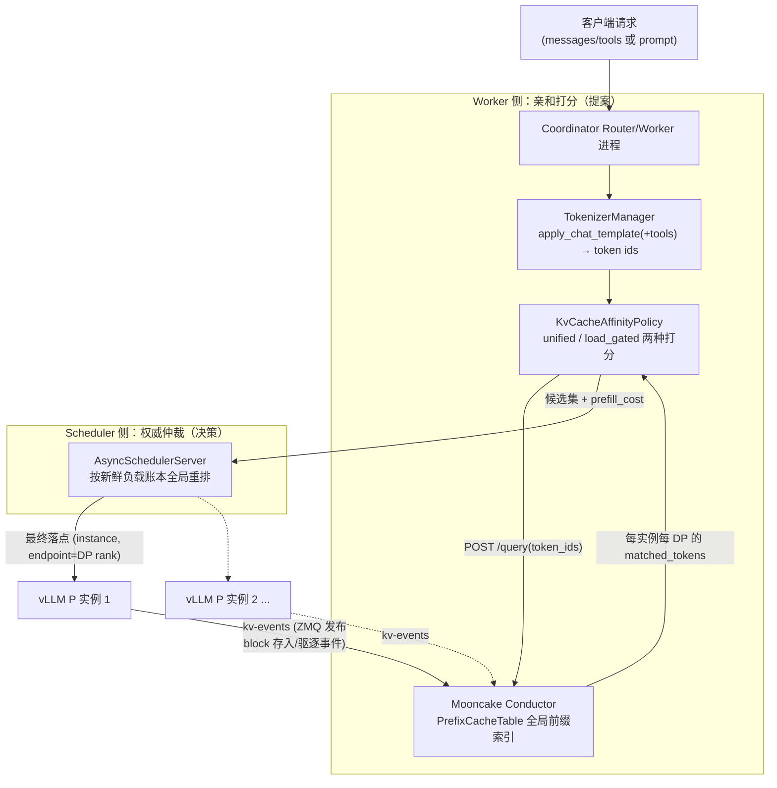
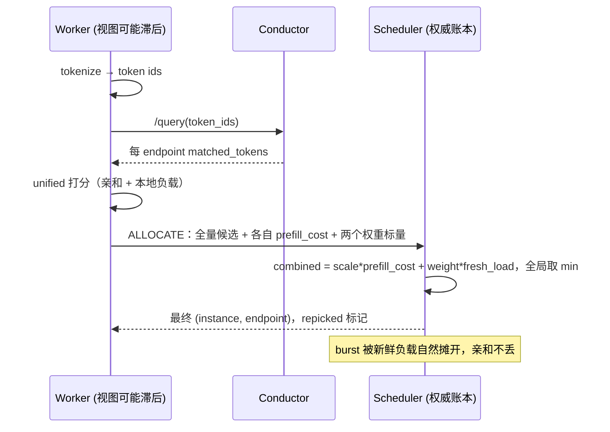

# 专题 12：PyMotor KV 亲和性调度特性全解（源码 + PR 演进 + 简历素材）

> 与前序专题的关系：04 讲"为什么需要 KV 亲和调度、Mooncake 三大组件是什么"；10 深挖 Mooncake 的传输与存储管理；11 对比 vLLM/SGLang 的 Mooncake 集成。**本篇聚焦你自己的工作**——MindIE-PyMotor（Motor）里 KV 亲和性调度特性的完整实现、你提交的 PR 演进脉络、以及可直接写进简历/在面试中展开的素材。
>
> 所有代码结论均在工作区 `MindIE-PyMotor/` 源码中核实；PR 信息来自 Gitcode `Ascend/MindIE-PyMotor` 仓（作者 tobking）的 23 个 PR（13 merged）。

---

## 0. 一句话与一张图

**一句话**：在多实例（含 PD 分离/PD 混部）部署下，Coordinator 层把请求 tokenize 成与引擎完全一致的 token ids，查询 Mooncake Conductor 的全局 KV 前缀索引，得到每个实例每个 DP rank 的缓存命中长度，再用"亲和收益 × 实时负载"的融合打分选择 prefill 落点，并由中心 Scheduler 按权威负载账本做最终仲裁；在长输入、短输出、高前缀复用的代表性模型中可测算出约七成以上 TTFT 降幅，但当前没有完整 A/B 原始数据，不能写成客户实测结论。



三个角色分工：**Conductor 回答"缓存在哪"**（订阅各实例 kv-events 维护前缀表），**Worker 回答"综合打分谁最优"**（亲和 + 本地负载视图），**Scheduler 回答"最终去哪"**（权威新鲜负载，防并发 herding）。

---

## 1. 需求分析与竞品对标

### 1.1 需求分析：为什么要做这个特性

**业务场景**：企业客户的典型流量是多轮对话、RAG、Agent/Function Call——每个请求携带很长的公共前缀（system prompt、tools schema、历史轮次），4K 上下文里前缀重复率极高。同时部署形态是多实例水平扩展（含 PD 分离、PD 混部、vLLM DP）。

**痛点量化**：vLLM 单实例的 automatic prefix caching 只在实例内部生效。N 个实例做 round-robin 时，同前缀请求落到"上次算过它的那个实例"的概率只有 1/N——**集群前缀命中率随实例数线性稀释**；而 prefill 恰是 TTFT 的主项，长前缀反复重算直接把 TTFT 打爆。

**需求拆解**（当时的设计约束，面试可以按这个顺序讲）：

| 类别 | 需求 | 落地对应 |
|---|---|---|
| 功能 | F1 请求路由感知"谁缓存了我的最长前缀" | Conductor 全局索引 + /query |
| 功能 | F2 亲和收益与负载均衡可控权衡（不能造热点） | unified / load_gated 双算法 |
| 功能 | F3 覆盖 PD 分离与 PD 混部两种形态 | `_KVA_SELECT_ROLES = {P, U}` |
| 功能 | F4 精确到 DP rank（每个 DP 有独立 KV 池） | per-endpoint 注册与打分 |
| 非功能 | N1 命中估计必须与引擎真实命中一致（含 tools/chat template） | tokenize 前置 + token 级 block 哈希 |
| 非功能 | N2 亲和是优化不是依赖：组件故障不影响服务可用性 | 0.2s 超时 + 逐级回退 LoadBalance |
| 非功能 | N3 调度延迟预算毫秒级 | sub-block fast path、SHM 负载、热路径优化 |
| 非功能 | N4 效果可观测 | cached_tokens 透传、权威分配日志 |

**关键选型**：前缀索引放哪？两条路线——① 调度层自建**本地近似 radix tree**（SGLang router 的做法）：零外部依赖、无网络往返，但它只能"猜"（按自己路由过什么推测缓存了什么），不知道引擎真实的存入/驱逐，且字符级匹配在 tools/chat template 场景误差大；② **中心化真实索引**：订阅引擎 kv-events 维护全局前缀表，准确、含驱逐感知，代价是每请求一跳 HTTP 和一个新组件的可用性风险。Motor 选 ②（Mooncake Conductor），用 0.2s 超时快速回退把可用性风险兜住——本质判断是：**我们的目标客户场景前缀很长，命中估计错一个 block 就是几百上千 token 的重复 prefill，精度比省一跳 HTTP 值钱**。

### 1.2 竞品对标：vLLM 与 SGLang 生态的同类方案

（细节佐证见专题 04 §3、专题 11；`router/`、`sglang/` 仓源码已核实）

| 维度 | SGLang sgl-router / model-gateway（Rust） | vLLM production-stack router（Python） | vLLM 官方示例 Proxy | **Motor（本特性）** |
|---|---|---|---|---|
| 策略名 | `cache_aware`（PD 场景 `PDSelectionPolicy::CacheAware`） | `session`（粘性）/ `prefix-aware` / `kvaware` | 无（`itertools.cycle` 轮询） | `kv_cache_affinity` |
| 索引来源 | **本地近似 radix tree**：路由器按"我路由过什么"自建树，无引擎反馈 | `kvaware` 查 LMCache controller 的**真实 KV 元数据**；`prefix-aware` 为本地 trie | — | **Conductor 中心索引**，订阅引擎 kv-events（真实存入+驱逐） |
| 匹配粒度 | **字符级**（`tree.rs`: `DashMap<char, NodeRef>`，文档明示为省 tokenize 的取舍） | kvaware 为 token/block 级 | — | **token 级、block 对齐**（与引擎哈希同构） |
| 驱逐感知 | 无（本地树自己 LRU，与引擎实际驱逐无关，会假阳性） | kvaware 有（查真实元数据） | — | 有（BlockRemoved 事件实时更新） |
| 负载权衡 | 树命中率超 `cache_threshold` 走亲和，负载失衡（`balance_abs/rel_threshold`）切回最短队列——**二选一开关式** | kvaware 低于阈值（默认 2000 token）回退 QPS 路由 | — | **融合打分（unified）或硬门控（load_gated），连续可调** |
| 决策粒度 | worker 级 | 实例级 | 实例级 | **DP rank 级** |
| 多调度进程一致性 | 单路由器进程，不涉及 | 不涉及 | 不涉及 | **worker 提案 + scheduler 权威账本全局重排** |
| tokenize 成本 | 零（字符匹配的卖点） | kvaware 需要 | — | 毫秒级，且一次 tokenize 三处复用（查询/打分/记账/长度预校验） |

**对标结论（面试话术）**：

> "业界同类方案分两派：'猜缓存'派（SGLang router 的字符级本地树——便宜但不准、无驱逐感知）和'查缓存'派（production-stack 的 kvaware 查 LMCache 元数据）。Motor 和 kvaware 同属'查'派哲学，但走得更完整：索引是事件驱动的中心索引（含驱逐）、粒度到 DP rank、命中长度按引擎同构的 token block 哈希算；并且在'亲和与负载怎么叠加'上比两家都细——SGLang 是超阈值二选一切换，我们是 token 统一量纲的连续融合分（或可选硬门控），外加多调度进程下的中心权威仲裁，这两点是竞品都没有的。"

差异的根源在架构假设：SGLang router 假设"路由器是唯一入口、单进程"，所以本地树够用；Motor 的 Coordinator 是多 worker 进程 + 中心 Scheduler 的架构，天然需要（也有条件做）权威仲裁这一层。

**补充参照：NVIDIA Dynamo。** Dynamo 也走真实 KV event 索引，但其成本模型比 Motor 更细：以 KV block 为单位显式分开 active/incoming Prefill 与 active/incoming Decode，再把 device/host/disk/shared 命中折成 Prefill credit；此外有短 TTL 预测 side-index 填补“路由已决定、KV event 尚未到达”的 burst 空窗。Motor 的统一 token 分更轻量、可解释性更强；Dynamo 更接近分层缓存和长输出场景下的完整资源成本。详见 [`kv knowledge/03-NVIDIA-Dynamo.md`](../kv%20knowledge/03-NVIDIA-Dynamo.md)。

---

## 2. 全链路机制逐层拆解

### 2.1 Tokenize 前置：调度层拿到与引擎一致的 token ids

源码：`motor/coordinator/scheduler/policy/kv_cache_affinity.py` 的 `TokenizerManager`（单例）。

- 用 HuggingFace `AutoTokenizer` 加载与下层引擎**同一份模型权重目录**的 tokenizer（`prefill_kv_event_config.model_path`），对 chat 请求走 `apply_chat_template(conversation, tools, add_generation_prompt=True, tokenize=True)`——产出的 token 序列与 vLLM/SGLang prefill 实际收到的**逐字节一致**，Conductor 返回的 `longest_matched` 才真实反映集群 KV 分布。
- **tools 必须透传**：函数调用请求的 tools 会被 chat template 注入 prompt，漏传会导致 token 序列分叉、命中长度虚高（这是修过的真实 bug，`apply_chat_template` 的 docstring 里特意写了 "dropping it silently was the bug fixed in this revision"）。
- **fail-closed 兜底**：主路径和 tools-aware fallback 都失败时返回 `[]`，让调度整体回退 LoadBalance——宁可放弃亲和，也不能拿"漏了 tools 的半对 token 序列"去误导 Conductor（`_safe_fallback_encode` 注释原话）。
- tokenize 结果缓存在 `req_info.token_ids`，一次 tokenize 三处复用：① Conductor 前缀查询；② `isl`（输入长度）参与亲和打分；③ `calculate_demand_workload` 用真实 token 数记账（见 2.6）。

**对比面**（详见专题 04 §3）：SGLang router / production-stack 的 `cache_aware` 用字符级近似 radix tree，省 tokenize 但对不齐 block 边界；Motor 用 token 级真实索引，代价是调度层毫秒级 CPU 和 tokenizer 一致性维护。

### 2.1.1 对照：vLLM 最新 Render 方案（必补知识点）

> 文档里 PR #349「长度预校验与 vLLM 最新 render 方案对齐」、周边 PR #235「render 前置到 coordinator」说的就是这一套。面试若被问"你们 tokenize 前置和业界最新做法什么关系"，按本节答。

#### A. Render 是什么：把"预处理"从推理引擎里拆出来

vLLM 把请求处理拆成两段：

| 阶段 | 做什么 | 是否需要 GPU |
|---|---|---|
| **Render（预处理）** | chat template / Harmony 变换、tools 注入、多模态预处理、tokenize、长度与参数校验 | 否，纯 CPU |
| **Engine（推理）** | 调度、prefill/decode、采样 | 是 |

官方动机（`vllm/docs/serving/online_serving/renderer.md`）：

1. **无 GPU 的前端**：预处理与后处理（detokenize、tool/reasoning 解析）可独立部署；
2. **解耦 tokenize**：llm-d、Dynamo、自定义网关可复用 **vLLM 自己的** 预处理逻辑，而不必再猜 chat template；
3. **Token-in / Token-out 引擎**：引擎只收 `prompt_token_ids`、只出 token，协议更干净。

对应 HTTP API：

- `POST /v1/chat/completions/render`
- `POST /v1/completions/render`
- 配套还有 derender：`/v1/chat/completions/derender`、`/v1/completions/derender`（token → 文本/结构化字段，服务后处理分离）

独立进程启动：

```bash
vllm launch render <model> --port 8100
# GPU-less；复用 serve 的模型/模板/tokenizer 配置面
```

引擎内路径：`OnlineRenderer.render_chat()` / `render_completion()`（`vllm/renderers/online_renderer.py`）被 ServingChat 与 Render endpoint **共用**——保证"render 出来的 token"与"真正进引擎生成时的 token"**同一条代码路径**。

对 GPT-OSS 等模型，render 会同时做 chat template **和** OpenAI Harmony 变换（不是只套 Jinja），这是为了与真实生成路径字节级一致。

#### B. 为什么 KV 亲和路由必须依赖 Render（或等价物）

精确前缀亲和的硬条件是：

```text
调度层看到的 token ids  ≡ 引擎 prefix cache / kv-events 里哈希的 token ids
```

任一不一致 → block hash 全 miss → 精确亲和静默退化成负载均衡。

分叉来源（Motor 也踩过）：

- chat template / `add_generation_prompt`
- `tools` 注入
- reasoning/thinking 模板、自定义 `--chat-template`
- Harmony、Mistral tool 序列化等引擎特有变换
- 多模态占位符展开

所以业界精确亲和路线收敛到同一哲学：**不要在路由层"自己猜"怎么 tokenize，要用引擎同源的 render 逻辑。**

#### C. llm-d Precise 路径：Render 的标准用法

llm-d 的 `precise-prefix-cache-routing`（见 `docs/kv knowledge/02-llm-d.md`）：

```text
请求 → EPP token-producer
     → 调 vLLM /v1/*/render（常为 EPP 旁路的 vllm launch render sidecar，或共享 Render Service）
     → 得到精确 token IDs
     → Indexer（订阅各 MS 的 ZMQ BlockStored/Removed）做最长连续前缀链匹配
     → prefix-cache-scorer 加权打分选 Pod
```

对比 Approximate：本地字符/滚动哈希猜测，无引擎驱逐反馈；Precise 依赖 render + ZMQ，精度 100% token 级。

旧方案 gRPC-over-UDS 独立 tokenizer 已 deprecated，官方推荐直接调 **vLLM render HTTP**——因为只有引擎自己的 OnlineRenderer 才能覆盖 Harmony/tools/MM 等全部边角。

#### D. Motor 的 TokenizerManager vs vLLM Render：同构、异实现

| 维度 | Motor（本特性） | vLLM Render / llm-d Precise |
|---|---|---|
| 目标 | 调度层拿到与引擎一致的 token ids | 同左 |
| 实现 | Coordinator 内 `TokenizerManager`：同源 `model_path` + `apply_chat_template(..., tools=...)` | 调用引擎/独立 render server 的 `/v1/*/render`，走 `OnlineRenderer` |
| 一致性保证 | **部署约定**（同 model_path、同默认 template）；无 revision/hash 握手 | **代码路径同源**（Serving 与 Render 共用 OnlineRenderer）；独立 `vllm launch render` 时仍需配置与引擎对齐 |
| 校验 | PR #349：入口按真实 token 数拒超长请求 | render 阶段即做模型长度/参数校验，非法请求不进 GPU 队列 |
| 结果复用 | token ids → Conductor 查询 + 亲和打分 + 负载记账 | token ids → Indexer 打分；可把 `prompt_token_ids` 直接下发，引擎跳过二次 tokenize |
| 演进 | PR #235「render 前置到 coordinator」：把 render 能力沉到调度入口，与引擎侧 `OpenAIServingRender` API 演进对齐（见 `motor/engine_server/core/vllm/vllm_openai_compat.py`） | 官方主线：`vllm serve` 内嵌 Renderer + 可选 `vllm launch render` 解耦 |

**面试一句话**：

> "vLLM Render 把'chat template + tokenize + 校验'正式产品化成可独立部署的 CPU 服务；llm-d Precise 用它拿精确 token 再查 ZMQ 索引。Motor 更早用 Coordinator 内 TokenizerManager 做了同一件事——哲学相同（调度必须看引擎真实 token），实现上我们是进程内同源加载，他们是 HTTP 调官方 OnlineRenderer。我们 PR #349 的长度预校验、#235 的 render 前置，就是在向这条官方主线收敛。"

#### E. Token-in / Token-out 的收益与坑

**收益**：

1. 路由与引擎各 tokenize 一次 → 可变成路由 render 一次、引擎直接吃 `input_ids`/`prompt_token_ids`（SGLang router 实验路径、llm-d precise 同理）；
2. GPU 实例不再被超长/非法请求占用排队；
3. 多模态重预处理可集中在 render 池横向扩展，不绑 GPU。

**坑（必须主动说）**：

1. **配置漂移**：render 与 engine 的 `--chat-template`、tokenizer revision、Harmony/tool parser 不一致 → 亲和全 0；
2. **Render 成为新瓶颈**：高 QPS 下 CPU tokenize/template 会打满，需要 `renderer-num-workers`、独立 render 池扩容（Motor 同问题，见规模化推演）；
3. **安全面**：render/tokenizer_info 暴露模板与实现细节，生产要鉴权（vLLM security 文档已提示）；
4. **`input_ids` 不等于跳过 prefill**：只省 CPU tokenize；KV 命中仍靠引擎 prefix cache / 亲和路由。

#### F. 可背的演进叙事（简历/口述）

```text
字符级本地树（便宜、不准）
  → 调度层自建 tokenize（Motor TokenizerManager / 早期自定义 tokenizer）
  → 引擎同源 Render API（vLLM /v1/*/render + vllm launch render）
  → 精确亲和 = Render tokens + KV-Events 真实索引（Motor Conductor / llm-d Precise）
```

你的差异化仍在后半段：双算法融合打分、worker+scheduler 两级防 herding、DP rank 粒度、fail-closed 回退——这些是 Render 本身不提供、调度系统要补的。

### 2.1.2 vLLM Render 当前方案：实现细节、进度、应用和 Motor 差距

> **核实基线**：本地 vLLM 提交 `8df14cfc`（2026-07-12）。以下“当前”均指该代码版本，而不是泛称某个历史 vLLM 版本。一个重要修正：当前实现位于 `vllm/entrypoints/scale_out/`，不是旧资料里常见的 `entrypoints/serve/render/`。

#### A. 当前方案不是“一个 tokenize API”，而是完整的三段式 Serving

```text
OpenAI Chat/Completion 请求
        │
        ▼
/v1/*/render  ── CPU-only 或与 Serving 同进程
  模型校验、模板/工具/Harmony、多模态、tokenize、采样参数解析
        │ GenerateRequest
        │  (token_ids + sampling_params + MM features + cache_salt ...)
        ▼
/inference/v1/generate ── GPU/NPU Engine
  token-in、token-out 推理；无需再由文本重建 prompt
        │ GenerateResponse / token stream
        ▼
/v1/*/derender ── CPU-only
  detokenize、tool-call/reasoning 解析、还原 OpenAI 响应
```

这三段都已在本地源码存在：

| 层 | 当前组件/接口 | 关键职责 |
|---|---|---|
| Render | `scale_out/render/serving.py::ServingRender`；`/v1/chat/completions/render`、`/v1/completions/render` | 把 OpenAI 请求变为可直接送引擎的 `GenerateRequest` |
| Token-in 推理 | `scale_out/token_in_token_out/serving.py::ServingTokens`；`/inference/v1/generate` | 直接消费 `token_ids`，返回 token 级结果 |
| Derender | `scale_out/derender/serving.py`；`/v1/*/derender` | 将结果还原为 Completion/Chat Completion 响应 |
| 组装 | `scale_out/factories.py` | 同时注册 render、derender；有 generate task 时再注册 token-in/token-out API |

所以 vLLM 的最新目标已经从“让外部路由器拿一次 token IDs”扩展到 **Disaggregated Everything / Token-in Token-out Serving**：前端、引擎、后处理可独立扩缩容，且前后端的模型语义由统一 Renderer 负责。

#### B. Render 阶段具体做了什么

`ServingRender.render_chat_request()` 的顺序是：

1. 模型注册与请求参数校验；不支持 beam search 时直接拒绝；
2. 调用 `OnlineRenderer.render_chat()`，它复用正常 OpenAI Serving 的预处理逻辑；
3. 处理 chat template、tools、tool choice、reasoning parser、Mistral 特殊序列化、GPT-OSS Harmony 等模型专属语义；
4. 多模态输入时执行占位符扩展、processor 处理，并提取可跨服务传输的多模态特征；
5. 取出最终 `token_ids`，按真实 prompt 长度计算 `max_tokens` 并构造完整采样参数；
6. 返回 `GenerateRequest`，而不是仅返回 token 数组。

`GenerateRequest` 当前包含：

```text
request_id
token_ids
sampling_params
model / stream / stream_options
cache_salt / priority
token_offsets（可选）
assistant_tokens_mask（可选）
features：多模态 hash、placeholder 位置、序列化后的 MM tensor 元数据
kv_transfer_params / ec_transfer_params（可选）
```

因此 Render 的价值不只是“把字符串转成 id”：它是 **请求语义编译器**。如果只复刻 `AutoTokenizer.apply_chat_template`，在文本 Chat 的常规路径上通常够用，但还没有覆盖 Harmony、模型专属工具格式、多模态占位符、采样参数默认值等完整契约。

#### C. CPU-only Render Server 的实现与边界

`vllm launch render <model>` 走 `init_render_app_state()`：

- 构造 `VllmConfig`、Model Registry、`renderer_from_config()`、`OnlineRenderer` 和 `OnlineDerenderer`；
- **不创建 `EngineClient`**，`state.engine_client = None`；
- 显式清除量化配置、将 CPU KV Cache 空间设为 0；没有权重推理、没有 GPU/NPU Kernel、没有 KV Cache 分配；
- 仍复用标准服务的模型、tokenizer、chat template、tool/reasoning parser 与多模态配置；
- endpoint plugin 若未排除 `render` task，会在没有 EngineClient 的情况下初始化，插件必须处理 `engine_client=None`。

这说明它不是“轻量 tokenizer binary”，而是完整 vLLM 前端依赖的 CPU 服务。优点是语义一致；成本是仍要加载 tokenizer、模板、processor 和相关 Python/Rust 运行时，规模化时要作为独立 CPU 服务做容量管理。

#### D. 当前功能完成度：有明确 API、E2E 测试，但不要夸大为所有部署的成熟默认路径

本地代码可确认的已实现能力：

| 能力 | 状态 | 证据 |
|---|---|---|
| Chat / Completion Render | 已实现 | `scale_out/render/api_router.py` |
| GPU-less Render Server | 已实现 | `vllm launch render`、`init_render_app_state()` |
| Token-in 推理 API | 已实现 | `/inference/v1/generate` |
| 非流式 Derender | 已实现 | `/v1/chat\|completions/derender` |
| 多 prompt、multi-turn、stream 参数透传 | 已有 E2E 测试 | `tests/entrypoints/scale_out/render/test_render*.py` |
| token offsets | 已实现 | `return_token_offsets` |
| assistant token mask | 已实现，但依赖模板 `` 标签 | `assistant_tokens_mask` |
| 多模态 token / feature 传递 | 已实现，含 hash、placeholder、序列化元数据 | `test_render_multimodal.py` |
| 工具/Reasoning 后处理 | Render/Derender 架构已承载；流式 derender 仍需单独设计 | 协议注释明确说明 streaming derender 尚未提供等价 endpoint |
| 精确 KV 亲和应用 | 已被 llm-d Precise 采用 | Render token IDs + vLLM ZMQ KVEvents + 全局 Index |

需要谨慎的边界：

1. `/render` 本身是同步 JSON 响应，即使原请求 `stream=true`，Render 不会流式生成，只是把 stream 选项带入 `GenerateRequest`；
2. `derender` 当前协议重点是**非流式**响应；流式版需要增量 detokenize、`parse_delta()` 和新的 endpoint 设计；
3. CPU-only Render 与 GPU Engine 必须共享模型 revision、tokenizer、chat-template、parser、MM processor 和相关开关。共享代码降低漂移概率，但独立部署**不是运行时自动证明一致**；
4. Render 省的是前端 CPU 预处理，不会自动跳过 prefill；只有下游实例命中 prefix KV 才会省模型计算。

#### E. 当前应用情况

**1. vLLM 自己的 Serving**  
普通 `vllm serve` 也会初始化 Renderer，Chat/Completion Serving 复用同一套 `OnlineRenderer`。因此 Render 不是另一套“旁路 tokenization”，而是被抽出的公共预处理层。

**2. 独立 Render 服务**  
`vllm launch render` 已有端到端测试：Chat、Completion、多 prompt、多轮对话、无效模型、性能烟雾测试、`/health`、`/v1/models`。它面向不想启动 GPU Engine、但需严格复刻 vLLM 输入语义的网关/Router。

**3. llm-d Precise Prefix Cache Routing**  
这是最直接的生产架构应用：EPP 的 token-producer 调 Render 获取精确 token IDs，Indexer 订阅 vLLM ZMQ `BlockStored/BlockRemoved`，再按最长连续 block 前缀对候选 Pod 打分。它取代了旧的独立 tokenizer/gRPC-UDS 路径，核心收益是将 tools、模板、多模态等复杂语义的 token 一致性责任交回 vLLM。

**4. 自定义网关与分离式 Serving**  
Token-in / token-out API 为 Dynamo、llm-d、K8s Gateway 或自定义 Router 提供标准边界：路由器做 render、选后端、把 `GenerateRequest` 直接转发；后处理可以留前端或交给 Derender 服务。

#### F. Motor 当前实现与 vLLM 最新方案的真实差距

先区分两层：

- **Motor 的强项**：精确 KV 索引、DP rank 粒度、unified/load-gated 负载权衡、worker + Scheduler 权威仲裁、PD 和故障回退；
- **vLLM Render 的强项**：将请求语义从 OpenAI 请求到 token-in/token-out 协议完整产品化。

| 能力 | vLLM 当前方案 | Motor 当前状态（本仓核实） | 差距/风险 |
|---|---|---|---|
| Token 来源 | `OnlineRenderer` 作为权威预处理路径 | `TokenizerManager`：本地同源模型目录 + HF `apply_chat_template` | 文本场景可对齐，但没有完整引擎语义覆盖 |
| Chat / tools | 模型专属 parser、工具格式、Harmony、请求模板参数一起处理 | 已明确处理 `tools`，这是重要正确性修复 | 未证明覆盖 Harmony、Mistral 专属格式、全部 tool/parser 行为 |
| 多模态 | 输出 token IDs + MM hash/placeholder/MM tensor 元数据 | 当前 KVA tokenizer 路径以文本 Chat/Prompt 为主 | 多模态前缀亲和不能安全宣称精确 |
| 参数校验 | 模型校验、真实 input length、max tokens、sampling params | 已有 max_model_len 预校验 | 还未将完整 OpenAI 参数解析收敛为统一契约 |
| 输出契约 | `GenerateRequest` 可直接转发至 `/inference/v1/generate` | 只在 Coordinator 内保存 `req_info.token_ids` 用于查 Conductor/打分/记账 | 没有 token-in 请求协议与转发链路，Engine 仍可二次 tokenize |
| 前后处理分离 | Render + Generate + Derender | 正常 OpenAI Serving 包装 | 无独立 Derender，Tool/Reasoning 后处理未服务化 |
| CPU-only 横向扩展 | `vllm launch render` 可独立部署 | Coordinator 内嵌 tokenizer 单例、同步路径 | 高 QPS 下会成为 Coordinator CPU 瓶颈 |
| 当前 vLLM API 兼容 | `scale_out/render/ServingRender` | `vllm_openai_compat.py` 尝试导入旧路径 `vllm.entrypoints.serve.render.serving.OpenAIServingRender` | **本地 vLLM 已无此路径**；当前创建失败会被 endpoint 捕获后仅 warning 并继续，说明适配并未跟上最新接口 |
| 精确 KV 路由 | Render + KVEvents 是 llm-d 的标准组合 | Conductor + kv-events 已有 | 查询/索引与打分很强，但 token producer 不是 vLLM 官方 Render |

特别注意最后一行：Motor 不是“没有 Render”，而是**没有接入当前 vLLM 的独立 Render/Token-in/Derender 架构**。当前的 `OpenAIServingRender` 兼容代码更像是为了让 Motor 内嵌的 OpenAI Chat Serving 适配某段 vLLM API 演进；它既不暴露 `/v1/*/render`，也不启动 CPU-only render server，更没有把 Render 结果作为跨服务协议下发。

#### G. 若要让 Motor 补齐 vLLM 同等能力：建议路线

按正确性优先、再性能和平台化推进。

**P0：令 token 等价性成为可验证契约**

1. 将 `TokenizerManager` 抽象为 `TokenProducer` 接口；
2. 实现两种后端：现有本地 HF 后端、远端 vLLM Render 后端；
3. Render 后端消费 `/v1/chat/completions/render` 与 `/v1/completions/render` 返回的 token IDs；
4. 在注册/健康检查阶段验证 model id、tokenizer revision、chat template hash、prefix-cache hash algorithm、block size；无法验证或请求语义不支持时 fail-closed，回退由 Engine 自行 tokenize 且禁用精确亲和；
5. 将 tools、thinking、Harmony、LoRA/cache salt、多模态等影响 prefix hash 的 extra keys 显式纳入 KVA key。

**P1：打通 token-in 以消除二次预处理**

1. 给 Motor 的上游/引擎 adapter 定义内部 `RenderedRequest`：`token_ids`、sampling params、MM features、cache salt、priority、request id；
2. 若目标 vLLM 支持 `/inference/v1/generate`，将 Render 结果原样转发；若不支持则保留 OpenAI 文本路径；
3. 保持 Router 选择、负载记账和 Engine 实际输入使用**同一份** token IDs，避免“用于路由的一套、进入引擎的另一套”；  
4. 以 request id 串联 Render、Conductor、Scheduler、Engine trace，并记录 route token hash、engine token hash、命中长度和二次 tokenize 次数。

**P2：补全多模态与前后处理分离**

1. 传递 vLLM `MultiModalFeatures` 等价物，而不是只传 image URL/text；  
2. 明确多模态 processor 版本与缓存 hash 的一致性；  
3. 对需要 OpenAI 协议输出的场景，接入/实现 Derender：非流式先落地，再设计流式 delta、tool/reasoning parser 的状态传递；  
4. Render 池按 CPU/内存/processor 吞吐横向扩缩，避免将 tokenize 与调度绑死在 Coordinator。

**P3：将 Render 接入现有 KVA 优势**

1. Render 完成即做长度预校验、block hash 计算、Conductor 查询；  
2. 在排队窗口触发慢层 KV prefetch；  
3. 保留 Motor 的 unified/load-gated + Scheduler 权威仲裁，不要退化成 Render 只做 token producer；  
4. 统一 KVEvents 的 block size、hash algorithm、cache salt、LoRA/MM extra keys 与 Render 元数据，建立端到端一致性测试矩阵。

#### H. 面试时可用的“差距认知”回答

> “我们做 KV 亲和时已经把最关键的原则落地了：调度必须用引擎等价的 token，而不是字符前缀；所以有同源 tokenizer、tools 透传和长度预校验。但 vLLM 最新 Render 已经把这件事升级为完整的 token-in/token-out 协议：Render 不只返回 token，还封装采样参数、多模态特征、cache salt，后面可直连 Generate 和 Derender。对比之下，Motor 当前强在缓存索引、负载融合和多进程仲裁，弱在请求预处理的标准化与跨服务传递。下一步我会先把 TokenProducer 抽象出来接 vLLM Render，再让 Scheduler 与 Engine 共享同一份 RenderedRequest，最后补多模态和 Derender。这样既能获得官方语义一致性，又保留 Motor 在集群亲和调度上的优势。”

### 2.2 Conductor 注册与查询：DP rank 粒度的前缀索引

源码：`motor/coordinator/api_client/conductor_api_client.py`。

- **注册**（实例上线时）：对每个 KVA 角色实例（`ROLE_P` 和混部 `ROLE_U`）的每个 endpoint（= DP rank）调 `POST /register`，上报该 DP 的 kv-events ZMQ 端点（`基础端口 + endpoint.id`）、`block_size`、`instance_id`（`vllm-prefill-{id}` / `vllm-union-{id}`）、`dp_rank`。Conductor 据此订阅各 DP 的 KV block 存入/驱逐事件流。
- **查询**（每个请求）：`POST /query` 带 `token_ids` 和 `block_size`，返回 `{tenant: {instance_id: {"DP": {dp_rank: matched_tokens}}}}`——**亲和粒度精确到 DP rank**，不是实例级。这与 vLLM DP 部署下"每个 DP rank 有独立 KV cache 池"的事实对齐。
- **超时即回退**：查询超时设 0.2s（注册 2s），Conductor 慢/挂时快速失败，调度回退 LoadBalance，不阻塞请求主路径。
- **对账重注册**：`re_register_kv_instances` 拉取 Conductor 的 `/services` 列表与本地期望比对，缺失即补注册——覆盖 Conductor 重启丢状态的场景。

### 2.3 kv-events：索引的数据从哪来（vLLM 侧机制）

Conductor 之所以"知道谁缓存了什么"，靠的是 vLLM 的 **KV cache events** 机制（源码：`vllm/vllm/distributed/kv_events.py`；开启方式即部署配置里的 `kv-events-config`）。

**事件是什么**：vLLM V1 的 prefix cache 以 block（默认 16 token）为单位、用链式哈希标识（`block_hash = hash(parent_hash, token_ids)`）。引擎每次缓存状态变化时发布三类事件：

| 事件 | 触发时机 | 关键字段 |
|---|---|---|
| `BlockStored` | 新 block 写入 prefix cache | `block_hashes`（本批 block 的哈希链）、`parent_block_hash`、`token_ids`、`block_size`、`lora_name`（LoRA 隔离命名空间）、`medium` |
| `BlockRemoved` | block 被 LRU 驱逐 | `block_hashes`、`medium` |
| `AllBlocksCleared` | 缓存整体清空（如 reset） | — |

事件按调度步聚合成 `KVEventBatch`（带时间戳和单调递增序列号）批量发布。

**怎么发布**：`ZmqEventPublisher`——ZMQ **PUB** socket 推送事件流（部署配置里的 `endpoint: tcp://*:5557`），外加一个 **ROUTER** socket 做重放服务（`replay_endpoint: tcp://*:6667`）：发布端在内存里保留最近 N 个 batch（`buffer_steps`），订阅者发现序列号跳变（丢包/晚加入/自己重启）时，发一个起始序列号过去即可**增量补拉**，不用全量重建。这正是 Conductor 重启后能快速恢复索引、以及 Motor 注册时要同时上报 `replay_endpoint` 的原因。

**DP 拓扑对齐**：DP 部署下**每个 DP rank 起独立的 publisher**（`EventPublisher` 的设计注释明确：避免重复事件、保证事件归属），端口按 rank 偏移——这与 Motor 侧"每个 endpoint 按 `基础端口 + endpoint.id` 单独注册"严格对齐，是 DP rank 粒度亲和成立的物理基础。TP 多 worker 场景另有 `KVEventAggregator` 做去重：只有所有 TP worker 都上报的事件才算数（KV 在 TP 组内是分片的同一份逻辑缓存）。

**Conductor 消费侧**：订阅各 DP 的事件流，把 `BlockStored/BlockRemoved` 应用到 PrefixCacheTable（哈希链 → 持有者集合）。`/query` 时把请求 token_ids 按同样的 block 哈希算法切块，逐块沿哈希链查表，返回每个 (instance, DP) 的最长连续命中 token 数。**索引是事件驱动的真实状态**（含驱逐），这就是它比路由器本地"猜测树"准的根本原因。

一句话串起来：**引擎每存/驱逐一个 block 就发事件 → Conductor 增量维护全局前缀表 → Motor 查表拿到与引擎真实缓存一致的命中长度**。

### 2.4 两种调度算法：unified 与 load_gated（PR #210）

源码：`kv_cache_affinity.py` 的 `_select_with_load` / `_select_load_gated`；配置常量在 `motor/config/coordinator.py`。

**unified（默认）——单一融合分数，全局最小者胜：**

\[
score = prefill\_load\_scale \times \max(0,\ isl - overlap\_credit \times matched) + load\_weight \times workload
\]

- 所有量纲统一为 **token 数**：第一项是"扣掉缓存命中后还要真算的 prefill 工作量"，第二项是该 endpoint 的实时负载分。
- `overlap_credit` 控制"命中 1 个 token 折抵多少 prefill 工作"（默认 1.0）；`load_weight=0` 时退化为纯亲和（最长前缀胜）。
- 关键性质：**没有缓存命中的空闲 endpoint 也可能赢**——避免同前缀请求全部灌进一个热点实例。

**load_gated——两阶段"负载优先、亲和次之"：**

1. 先按负载筛出 Top-N 最低负载 endpoint（`kv_affinity_load_gate_topn`，默认 2）；
2. 只在这 N 个里面按最长前缀命中排序（平局取更低负载）。

给了一个**硬负载上界**：亲和永远不能把请求拉到"最闲集合"之外——适合负载敏感、宁可牺牲部分命中率也不能出现长尾的场景。

| | unified | load_gated |
|---|---|---|
| 决策形式 | 软权衡（加权和） | 硬约束（先筛后选） |
| 亲和能否压过负载 | 能（取决于权重） | 不能（只在最闲 Top-N 内比） |
| 调参 | `load_weight`/`overlap_credit`/`prefill_load_scale` | `load_gate_topn` |
| 适用 | 前缀重复率高、想最大化命中收益 | 严控负载长尾、防止热点 |

**fast path**：prompt 短于一个 KV block（indexer 只对整块哈希）不可能命中，直接跳过 Conductor HTTP 往返，按全零命中排序——省一次网络调用，行为完全等价。

### 2.5 Worker 提案 + Scheduler 权威仲裁：并发下防 herding（PR #210 → #134 → #304 演进）

这是整个特性最"分布式系统"的部分，也是面试最容易被追问的点。

**问题**：多个 Coordinator worker 进程并发调度时，每个 worker 的本地负载视图有滞后。一波同前缀 burst 进来，所有 worker 都会算出同一个"最优" endpoint → 全部灌过去 → 打爆（herding/羊群效应）。

**演进三步**（对应你的 commit 记录）：

1. **最初方案（后被移除）**：worker 本地 in-flight overlay——本地记"我刚发过去还没确认的请求"临时加负载。问题：只能缓解单 worker burst，TTL 难调，跨 worker 无效。
2. **PR #210：top-k 候选 + scheduler 重选**。worker 亲和打分后上报 top-k（k=3）候选（best-first），Scheduler 在慢路径按**权威新鲜账本**在候选集内重选最低负载者——既权威又跨 worker，且候选集本身就是亲和 top-k，不破坏亲和。
3. **PR #304：unified 模式升级为全局重排**。固定 top-k 仍可能"最优解不在候选集里"。改为 worker 把**每个 endpoint** 的亲和折扣 prefill_cost 全量上报（`kv_affinity_debug` → `candidate_endpoints` 带 `prefill_cost` 字段），Scheduler 端用自己的新鲜负载重算完整 unified 分数：

```743:747:MindIE-PyMotor/motor/coordinator/scheduler/runtime/scheduler_server.py
            combined = pscale * prefill_cost + lweight * load
            if best is None:
                best = (instance, endpoint, combined, prefill_cost)
            elif combined < best[2] or (combined == best[2] and prefill_cost < best[3]):
                best = (instance, endpoint, combined, prefill_cost)
```

分工的精髓：**亲和的数学 worker 已经算完（prefill_cost 不随时间变），负载的新鲜值由 Scheduler 补上**——Scheduler 不需要 prompt、不需要再查 Conductor，一次全局 min 即可。平局时偏向更低 prefill_cost（更好亲和）。load_gated 模式则**保持固定 top-k 提案**——它的硬负载界不能被 Scheduler 的软分数"松绑"。



#### 2.5.1 实现难点复盘：为什么“最长前缀”最终演化成两级仲裁

这个特性的核心难点不是前缀匹配本身，而是把一个**单请求看似正确**的选择，变成在多 worker、突发流量下仍然正确的**集群决策**。

| 阶段 | 当时的直觉 | 暴露的问题 | 最终处理 |
|---|---|---|---|
| V1：本地 overlay | 在 worker 本地把刚提交的请求临时计入目标 endpoint 负载 | 状态只对本进程可见；其他 worker 仍会选同一 endpoint。TTL 短则覆盖不了排队/执行，TTL 长则过度惩罚；提交、完成、异常回退还会带来双写与重复扣减风险 | 整体移除，不把分布式一致性问题伪装成“调一个 TTL”问题 |
| V2：top-k + 仲裁 | worker 保留亲和最好的 `k=3` 个候选，交给 Scheduler 依据新鲜负载重选 | 跨 worker 的热点被打散，但候选截断会丢掉全局最优：某 endpoint 在 worker 的旧负载下排第 4，在 Scheduler 的新负载下却可能应当第一 | 作为 `load_gated` 的终态，因为该模式本来就需要保持硬候选边界 |
| V3：unified 全量重排 | 将可复用的亲和成本和易变的实时负载拆开 | 需要明确哪些量可跨进程传递，哪些量必须由权威端重算 | worker 上报每个 endpoint 的 `prefill_cost`；Scheduler 用权威负载做全局最小化 |

V3 的关键是把统一评分拆成静态项与动态项：

\[
\operatorname{score}(e)=
\underbrace{p\_{scale}\cdot \operatorname{prefill\_cost}(e)}_{\text{worker 已知、短时间不变}}
+\underbrace{l\_{weight}\cdot \operatorname{load}_{fresh}(e)}_{\text{Scheduler 权威且实时}}
\]

其中 `prefill_cost(e) = max(0, isl - overlap_credit × matched(e))`。同一请求的 `isl`、`matched(e)`、权重在一次调度决策中不变；真正会因并发迅速失真的只有 `load(e)`。因此 worker 不需要把 prompt 或 Conductor 查询搬到 Scheduler，只需传递足以重算的成本向量；Scheduler 也不再受 top-k 截断约束。

这是一条清晰的职责边界：**worker 负责理解请求和计算亲和，Scheduler 负责用全局事实作最终资源仲裁**。平分时选择 `prefill_cost` 更小者，避免在负载相同的情况下白白损失 KV 复用。

`load_gated` 则刻意不采用 V3 的软重排。它的语义是“先按负载筛出最闲 Top-N，再仅在该集合内比较亲和”；若让 Scheduler 按 unified 加权和扫描全体 endpoint，硬门槛会被命中收益绕过，模式语义就被破坏。因此它保留 V2 的受限候选仲裁，而不是“少做了一步”。

验证时不能只看某一次命中率或平均延迟：同一请求流要分别走有/无 KV 亲和的路由，并保证两侧 Prefix Cache 均开启；同时记录 P50/P95/P99、KV 命中/复用长度、endpoint 负载离散度、Scheduler `repicked` 次数、Conductor 超时与 LoadBalance fallback。现有材料中的翻盘阈值与收益百分比是公式测算例，**不应表述为已留存的端到端压测结论**；没有原始压测记录时，应如实报告机制、参数与待验证指标。

### 2.6 负载账本与量纲统一

源码：`motor/coordinator/domain/workload_calculator.py`。

- KV 亲和路径下 `req_info.token_ids` 已存在，prefill 负载记账直接用 `len(token_ids)`（真实 token 数）；否则回退历史的字节长度线性拟合（`length/4*0.0345+120`）。
- 这一步让 unified 分数的两项**共享 token 量纲**——`load_weight=1.0` 的物理含义是"1 token 排队负载 = 1 token 待算 prefill"，调参有原则可循，而不是两个不可比的数硬加。
- 负载分发/同步走共享内存（SHM）+ ZMQ：worker 每次调度前 `_refresh_cache_from_workload_reader()` 从 SHM 补新鲜负载，心跳过期或实例版本变化才拉全量列表。

#### 2.6.1 公式逐项推导：负载均衡究竟在比较什么

对每个候选 endpoint（粒度为 DP rank）`e`，令：

- `isl`：当前请求的输入 token 数；
- `matched_e`：Conductor 返回的最长连续命中 token 数；
- `m_e = min(matched_e, isl)`：钳制后的有效命中；
- `A_e = active_tokens`：该 endpoint 正在执行或排队的 token 工作量；
- `K_e = active_kv_cache`：活跃 KV cache 占用对应的 token 等价压力。

当前 `unified` 路径可写为：

\[
\begin{aligned}
prefill\_cost_e &= \max(0,\ isl - overlap\_credit \times m_e) \\
load\_cost_e &= A_e + 0.3 \times K_e \\
score_e &= prefill\_load\_scale \times prefill\_cost_e
          + load\_weight \times load\_cost_e
\end{aligned}
\]

取 `score_e` **最小**的 endpoint。第一项不是抽象的"命中奖励"，而是路由到该 endpoint 后仍须计算的 Prefill 工作量；第二项是已经在该 endpoint 前面排队的工作量。因此它近似在最小化“等待 + 剩余 Prefill”的 token 工作总量。若各 endpoint 的 prefill 吞吐近似一致，除以共同吞吐即可对应为延迟比较；Motor 当前直接在 token 域比较，避免为每次调度再估一个不稳定的毫秒模型。

`0.3` 是 **KV 内存/调度压力的启发式折算系数**，不是第一性定律：`active_tokens` 是主导的计算和排队信号，`active_kv_cache` 反映 KV 占用、可用块减少及潜在抢占风险，需纳入但通常不应与前者完全等权。文档和代码口径应明确把它视为可调经验值，而不是某个模型或硬件上普适的比例。

默认 `overlap_credit = prefill_load_scale = load_weight = 1.0` 是可解释的中性基线：命中 1 token 暂折抵 1 token Prefill，排队 1 token 暂视为与待算 1 token 等价。它隐含“缓存复用/传输的额外成本可忽略或已被系统吸收”的简化；当前 Motor 打分**没有**显式加入跨节点 KV 传输时间、网络拥塞或不同 endpoint 吞吐差异。

**翻盘临界值。** 若 A 命中 `m` token、B 零命中，且其余系数相同，则 B（更空闲但无命中）获胜的条件是：

\[
load_A-load_B >
\frac{prefill\_load\_scale \times overlap\_credit \times m}{load\_weight}
\]

例如 `isl=8192`、`m=6000`、三个系数均为 1 时，A 的分数为 `2192 + load_A`，B 的分数为 `8192 + load_B`；只有 A 比 B 多积压超过 6000 token 工作量，B 才应获胜。这就是 unified 能防止热门前缀持续制造热点、同时又不轻易丢弃长前缀收益的原因。

**纯 LoadBalance 与实例压力。** 亲和失效或不适用时，Motor 并非 round-robin，而是摊平所有 endpoint，按最小工作负载选择。该路径还使用复合 endpoint 分：

\[
endpoint\_score_e + endpoint\_instance\_score\_weight
\times \frac{instance\_score_{parent(e)}}{endpoint\_count_{parent(e)}}
\]

其中 `endpoint_instance_score_weight` 默认 `0.05`。前项保留 DP rank 的局部视角；后项以小权重感知同实例其他 DP 已满的整机压力；除以 endpoint 数避免 DP 更多的实例被系统性惩罚。它与 unified 的负载项共享同一套 token 记账口径，可理解为“去掉亲和 Prefill 项后的连续回退”，但纯 LB 额外保留了实例层压力修正和同分旋转。

**`load_gated` 不用上述加权和作最终选择。** 它先按 `load_cost` 升序取 Top-N，再在候选内按 `matched` 降序、负载升序打破平局。N=1 近似纯负载均衡；运行时默认 N=2（配置值 0 是默认值哨兵）。这是“负载绝不出最闲集合”的字典序硬约束，不能靠无限增大 `load_weight` 模拟：有限权重下足够长的命中总能翻盘，权重趋于无穷又会退化成纯 LB。

**参数怎样确定。** 初值可采用默认三项 1.0、`load_gated` 的 N=2；真正上线应在“两组均开启 Prefix Cache、只切 `load_balance` / `kv_cache_affinity`”的相同流量回放中网格搜索或分阶段灰度。至少联合观察 TTFT P50/P95/P99、token 吞吐、`cached_tokens`/命中率、endpoint 负载倾斜、回退率与 Conductor 查询延迟：若 P99 或负载倾斜先恶化，应增大 `load_weight`、降低 `overlap_credit` 或切 `load_gated`；若负载稳定而命中收益不足，再提高亲和侧相对权重。对特定模型/硬件，更严格的下一步是拟合

\[
\hat T_e = \hat T_{queue}(L_e) + \hat T_{prefill}(isl-m_e) + \hat T_{transfer}(m_e)
\]

再以预测 TTFT 最小化替换 token 等价近似；这属于演进方案，并非当前 Motor 的实现事实。

### 2.7 防御性工程（多个 PR 的 bugfix 沉淀）

- **上下文长度预校验（PR #349）**：tokenize 前置的副产品——调度层已知真实 token 数，直接在入口拒绝超过 `max_model_len` 的请求（与 vLLM 最新 render 方案的校验行为对齐），不用等请求穿透到引擎才报错。
- **多进程负载强一致（PR #134）**：全局 endpoint 打分 + scheduler 仲裁、DP 负载最小堆、修复 encode 负载异常、KVA 负载上报补齐。
- **P 负载及时释放（PR #368/#393）**：PD 分离下 prefill 完成即释放 P 实例负载（不等整个请求结束），并修复请求结束时负载更新被 cancel 的问题——直接改善后续请求的 TTFT；CPCD 场景改为 prefill 后再选 D 实例，D 的选择基于更新鲜的负载。
- **热路径优化（PR #394）**：UPDATE_WORKLOAD 幂等去重集改有界 FIFO 防无界增长；ALLOCATE 的 workload 用两个裸 float 传输省去 pydantic 序列化；request_id 用"一次性 uuid 前缀 + 进程内自增"替代每请求 uuid4；修复"增量当绝对负载写 SHM"的账本污染 bug。
- **错误码透传（PR #304/#450）**：引擎侧错误码直通客户端，P 阶段 `usage.prompt_tokens_details.cached_tokens`（命中的缓存 token 数）透传合并到最终响应——客户能直接观测亲和命中效果。
- **日志分层**：worker 的选择日志压到 DEBUG（只是提案），Scheduler 提交的最终分配打 INFO（含 matched/load/score/repicked）——负载分析只信权威日志。

---

## 3. 配置面与部署形态

源码：`motor/config/coordinator.py`（`SchedulerConfig`）；部署文档 `docs/zh/user_guide/features/KV_cache_affinity.md`。

```json
"motor_coordinator_config": {
  "scheduler_config": {
    "scheduler_type": "kv_cache_affinity",
    "kv_affinity_mode": "unified",        // 或 "load_gated"
    "kv_affinity_load_weight": 1.0,        // 0 = 纯亲和
    "kv_affinity_overlap_credit": 1.0,     // 命中 token 的 prefill 折扣
    "kv_affinity_prefill_load_scale": 1.0,
    "kv_affinity_load_gate_topn": 0        // load_gated 专用，0 → 默认 2
  }
}
```

引擎侧三件套：P 实例（或混部 union 实例）开 `enable-prefix-caching` + `kv-events-config`（ZMQ 发布 block 事件，含 `replay_endpoint` 供 Conductor 重放补状态）+ `kv_transfer_config`（`MultiConnector` 组合 `MooncakeLayerwiseConnector` PD 传输层与 `AscendStoreConnector` KV 池后端）。Conductor 独立部署（Go 实现，`kv_conductor_config.http_server_port` 默认 13333）。

**两种形态都支持**：PD 分离（亲和作用于 P 实例选择）与 PD 混部（`ROLE_U`，`vllm-union-{id}` 注册，`_KVA_SELECT_ROLES = {P, U}`；测试见 `tests/coordinator/scheduler/test_kv_cache_affinity.py::test_select_endpoint_union_conductor_id`）。非 KVA 角色（D/E）走 LoadBalance。

### 3.1 性能收益：代表性测算、正确 A/B 与证据边界

这部分必须把“代码证明”“历史口述”“代表性测算”和“标准化性能报告”分开。当前可核实内容如下：

| 项目 | 当前可核实口径 | 证据强度 |
|---|---|---|
| 历史口述 | 曾在面试中描述“客户约 4K、高重复前缀、TTFT 约降 70%” | 只有转写文本，无测试报告，无法独立核验 |
| 量化数字 | Qwen3-32B、8K 输入假设下，模型测算 TTFT 约 1.19s → 0.35s（−70.5%），E2E 约 1.71s → 0.88s（−48.9%） | 明确标注为代表性测算，非实测 |
| 收益机制 | 亲和把请求送往已有最长前缀的 P/U endpoint，减少重复 prefill | 源码、Conductor 查询和调度日志可验证 |
| 命中观测 | 响应透传 `usage.prompt_tokens_details.cached_tokens`；Scheduler 日志记录最终 endpoint 与亲和分 | 源码与 UT 可验证 |
| 部署覆盖 | PD 分离支持 P 角色，混部支持 U 角色 | 配置文档、角色判断和 UT 可验证 |
| 实测覆盖 | 没有找到 KVA ON/OFF 的原始结果、请求回放文件或性能日志；无法证明任一拓扑获得 70% | 必须保留边界 |

当前没有留存或未找到：实测使用的模型、NPU 型号、P/D/U 实例数、TP/DP、并发或 QPS、请求总数、输出长度、预热轮次、共享前缀 token 数、TTFT P50/P95/P99，以及 KVA ON/OFF 的原始毫秒值。面试时不要把部署文档中的 Qwen3-8B、800I A2/A3 或 1P1D 示例当成实测配置，它们只能证明特性可部署。

#### “约 70%”数字的透明测算来源

下面把原有 8B 测算替换为更接近大模型 Serving 的 **Qwen3-32B Dense** 理论场景。Qwen3-32B 总参数量约 32.8B（非 Embedding 参数约 31.2B），64 层，GQA 为 64 个 Q head / 8 个 KV head，原生上下文长度 32K。选 32B Dense 而不是超大 MoE，是因为它既能显著放大重复 Prefill 成本，又不会把 EP All-to-All、专家负载不均等变量混入 KV 亲和收益。

| 参数 | 假设值 |
|---|---|
| 模型 | Qwen3-32B Dense，32.8B 参数，BF16 |
| 模型结构 | 64 层，64 Q heads / 8 KV heads，head_dim=128，原生 32K context |
| PD 拓扑 | 4 个 P 实例 + 4 个 D 实例；每实例 TP4×DP1；每实例 4 张 Atlas 800I A3 NPU |
| 权重占用 | BF16 理论约 65.6GB；TP4 后约 16.4GB/卡，未计运行时与临时张量 |
| KV 占用 | 约 256KiB/token（全集群逻辑 KV）；8K 上下文约 2GiB/请求，TP4 后约 512MiB/卡 |
| 请求形态 | ISL=8192、OSL=16；约 6.5K 为共享 system/tools/文档前缀，约 1.7K 为请求特有后缀 |
| 压测流量 | 预热 200 请求，正式回放 10,000 请求；开放环 1/2 req/s 两档；并发上限 32 |
| Prefill 速率 | 假设单 P 实例有效约 6.5k token/s；8K 全量 Prefill 约 1.23s |
| 固定开销 \(c_0\) | 假设 80ms（调度、Conductor 查询、P→D KV 传输、首步 Decode） |
| 有效命中率 \(h\) | Baseline 0.10；Affinity 0.78（不超过约 6.5K/8K 的可复用前缀上限） |
| Decode | 假设 TPOT 约 35ms，15 个后续 token 共约 525ms |

\[
TTFT = c_0 + T_{prefill}^{full}(1-h)
\]

代入后（所有数值均为用于解释收益量级的理论假设）：

- Baseline：\(80 + 1230 \times 0.90 = 1187ms\)
- Affinity：\(80 + 1230 \times 0.22 = 351ms\)
- TTFT 降幅：\((1187-351)/1187 = 70.5\%\)
- 加上约 525ms Decode 后，E2E 从 1712ms 降至 876ms，降幅 48.9%

这个模型只能说明“32B 大模型、8K 长输入、短输出、高复用时出现七成量级 TTFT 收益是合理的”，不能替代真实压测；Prefill 速率、固定开销、TPOT 和命中率都是理论估计。真正复测时应以实际 `cached_tokens` 反算有效命中率，以引擎指标替换 1.23s Prefill 和 80ms 固定开销。

关键指标的预期方向：

| 指标 | Baseline 预期 | Affinity 预期 | 解释 |
|---|---:|---:|---|
| `cached_ratio` | 约 10% | 约 78% | 从响应 `cached_tokens/prompt_tokens` 聚合 |
| TTFT P50 | 约 1.2s | 约 0.3–0.4s | 主要来自少算约 5.7K Prefill token |
| TTFT P99 | 取决于排队 | 应显著下降但不保证等比例 | 热点和 Scheduler 重排决定尾延迟 |
| TPOT | 约 35ms | 理论上基本不变 | 亲和主要优化 Prefill，不直接优化 Decode |
| E2E | 约 1.7s | 约 0.88s | 短输出时 TTFT 占比较高 |
| Conductor 查询 | 无 | 目标 P50 < 5ms，P99 < 20ms | 应远小于节省的 Prefill 时间 |
| 回退率 | 无 | 目标 < 0.1% | 超时/无索引时回退 LoadBalance |
| endpoint 流量偏斜 | 较低 | 需要控制 P99/P50 < 1.5 | 防止高命中实例形成热点 |

#### A/B 对照应该怎样定义

要隔离“亲和路由”本身的收益，两组必须保持模型、硬件、拓扑、请求序列、到达速率和引擎参数一致：

| 对照组 | `scheduler_type` | 引擎 Prefix Cache | 目的 |
|---|---|---|---|
| Baseline | `load_balance` | **开启** | 有单实例缓存，但路由不知道缓存在哪 |
| Experiment | `kv_cache_affinity` | **开启** | 在相同缓存能力上增加全局感知路由 |

不能用“Baseline 关闭 Prefix Cache、Experiment 同时开启 Prefix Cache 和亲和”来宣称亲和收益，否则测到的是“引擎前缀缓存 + 路由亲和”的叠加效果。冷启动请求也应单独剔除或分桶：第一轮负责建缓存，稳定轮次才衡量亲和是否把后续请求送回正确 endpoint。

建议固定同一批请求做回放，并至少记录：

1. 输入总长度、公共前缀长度和 `prefix_ratio = shared_prefix_tokens / prompt_tokens`；
2. 请求数、并发/QPS、输出长度及预热轮次；
3. TTFT P50/P95/P99，而不只报平均值；
4. `cached_ratio = Σcached_tokens / Σprompt_tokens`，并分别统计冷请求和热请求；
5. 各 endpoint 的请求数、负载和 `repicked` 次数，排除为了命中缓存造成热点；
6. Conductor 查询耗时及超时回退比例，确认调度开销没有吞掉 prefill 收益。

TTFT 降幅统一按下式计算：

\[
improvement = \frac{TTFT_{baseline} - TTFT_{affinity}}{TTFT_{baseline}} \times 100\%
\]

如果未来实测得到“约降 70%”，等价于亲和组 TTFT 约为基线的 30%；必须同时给出原始毫秒值、分位数和样本量，不能只报百分比。

#### 为什么这个结果在该场景合理

长输入里若大部分 token 属于稳定公共前缀，Baseline 即使开启实例内 Prefix Cache，也可能因多实例负载均衡把请求发到没有该前缀的 endpoint；亲和命中后只需计算未缓存后缀，因此主要缩短的是 prefill 执行时间，并进一步减少 P 队列积压。收益不会普遍保持七成：前缀越短、重复率越低、亲和 endpoint 排队越长，收益越小；混部还会受到 Prefill/Decode 争用和 KV 驱逐影响，而 PD 分离通常有更稳定的 P 侧缓存空间，但需承担 KV 传输成本。

**面试可信话术**：

> “代码和可观测链路可以证明亲和机制成立，但我没有留存一组可复核的端到端 A/B 原始数据，所以不把 70% 说成客户实测。以 32.8B 的 Qwen3-32B、TP4、8K 输入和 6.5K 共享前缀为例，如果有效命中率从 10% 提升到 78%，按单 P 约 6.5k token/s 和 80ms 固定开销估算，TTFT 可从约 1.19s 降到 0.35s，约降 70.5%。若重新验证，我会保持两组 Prefix Cache 都开启，只切换 load_balance 与 kv_cache_affinity，并报告 TTFT P50/P95/P99、cached ratio、负载倾斜和回退率。”  

---

## 4. PR 演进时间线（tobking，Gitcode Ascend/MindIE-PyMotor）

| 时间 | PR | 内容 | 状态 | 规模 |
|---|---|---|---|---|
| 5月 | #134 | 多进程负载强一致 + KVA 负载上报修复；全局 endpoint 打分、scheduler 仲裁、DP 负载最小堆、高 QPS 优化 | merged | +1503/-174 |
| 6月初 | #210 | **两种算法落地**：unified 加权融合 + load_gated Top-2 最低负载选其一；top-k 候选 + scheduler 权威重选，移除 in-flight overlay；sub-block fast path | merged | +1092/-126 |
| 6月中 | #304 | **unified 升级全局重排**：并发时 scheduler 看全局 DP 负载而非固定 TopK；错误码透传、cached_tokens 透传 | merged | +3995/-1219 |
| 6月下 | #349 | KVA 请求长度预校验，超模型上下文直接拒绝 | open | +557/-4 |
| 6月底 | #368 | TTFT 恶化修复：prefill 完成即释放 P 负载 + 负载更新防 cancel；proxy 透传模式 | open | +3074/-323 |
| 7月初 | #393 | PD 分离负载释放流程 + CPCD 时 prefill 后再选 D | merged | +1579/-83 |
| 7月初 | #394 | scheduler workload 账本热路径优化（有界 FIFO 去重、裸 float 传输、SHM 绝对值修复）；ROLE_U 调度状态补全 | open | +1877/-758 |

配套周边（同作者）：#194 断链后释放引擎堆积请求、#83 CPCD D 故障转混部、#235 render 前置到 coordinator、#450 错误码与引擎侧对齐。**全部 23 个 PR、13 个已合入，围绕"KV 亲和 + 负载均衡 + PD 分离可靠性"一条主线。**

---

## 5. 面试高频追问 Q&A

**Q1：为什么把 tokenize 放在调度层？开销不大吗？**
> 因为亲和判断必须用与引擎一致的 token 序列——chat template、tools 注入都会让字符前缀与 token 前缀分叉，字符级近似（SGLang router 的做法）对不齐引擎 16-token block 边界。开销是毫秒级 CPU，且一次 tokenize 三处复用：查 Conductor、算亲和分、按真实 token 数记负载账，第三点还顺手解锁了入口长度预校验（超上下文直接拒绝）。

**Q2：亲和和负载均衡怎么"叠加"？**
> 两种模式。unified 是软融合：`prefill_load_scale*max(0, isl-overlap_credit*matched) + load_weight*load`，全部 token 量纲，取最小；`load_weight=0` 退化纯亲和。load_gated 是硬约束：先筛 Top-N 最低负载，再在里面比最长前缀——亲和永远出不了最闲集合。前者最大化命中收益，后者严控负载长尾，按业务 SLO 选。

**Q3：多个调度进程并发时，同前缀请求会不会都打到同一个实例？**
> 会，这正是我们迭代了三版的问题。一句话版：本地 overlay → top-k 候选 + 权威重选 → 全量上报 + 全局重排。三个版本的细节：

**V1：worker 本地 in-flight overlay（已废弃）**

- 做法：每个 worker 进程本地记一张"我刚派出去、还没在负载账本里体现"的 in-flight 表，打分时把这部分虚拟负载叠加到目标 endpoint 上，防止自己连续把请求灌向同一处。
- 为什么不行（三条都要能说）：① **作用域错了**——overlay 只对本 worker 可见，8 个 worker 各自的"最优"仍是同一个 endpoint，跨 worker 的 herding 一点没解；② **TTL 无解**——overlay 条目何时过期？过期太快等于没有，太慢会让该 endpoint 被长期高估负载、命中好的实例反而接不到请求（人为制造亲和损失）；③ **与真实账本双写**——请求真正落账后 overlay 还没清，同一份负载被算两次。
- 结论：局部视图上打补丁修不好全局一致性问题，方向本身错了，所以 PR #210 里整体移除而不是继续调参。

**V2（PR #210）：top-k 候选提案 + scheduler 权威重选**

- 做法：worker 完成亲和打分后不再只报 top-1，而是上报 **best-first 的 top-k（k=3）候选列表**；Scheduler 收到后在慢路径（检测到 worker 负载视图版本落后时）用自己的**权威新鲜账本**在这 k 个候选里重选最低负载者。快路径（视图一致）仍直接用 worker top-1，不加开销。
- 解决了什么：仲裁点从"每个 worker 自己"收敛到"唯一的 Scheduler"，跨 worker 的 burst 会被权威账本摊到 top-3 里负载最低的那个——**权威、跨进程、且候选集本身就是亲和排序的前 k 名，重选不破坏亲和**。
- 残留问题：k 是拍的。k=3 时，如果 top-3 恰好都被这波 burst 打热，而第 4 名（命中略差但完全空闲）才是真正的全局最优——它根本不在候选集里，Scheduler 无从选起。k 调大又增加消息体积和仲裁成本，本质是"截断集合"与"全局最优"的矛盾。

**V3（PR #304）：全量候选 + scheduler 全局重排（unified 模式最终形态）**

- 做法：利用 unified 分数可分解的性质——`score = scale × prefill_cost + weight × load`，其中 **prefill_cost（亲和折扣后的待算量）不随时间变化，load 才是易腐数据**。于是 worker 把**每一个** endpoint 的 prefill_cost 连同两个权重标量一起上报，Scheduler 用自己账本里的新鲜 load 对全部 endpoint 重算完整分数、取全局 min（平局偏向更低 prefill_cost，即更好亲和）。
- 妙处：Scheduler 不需要 prompt、不需要 tokenizer、不需要再查 Conductor——贵的亲和计算 worker 已做完，Scheduler 只做一次 O(endpoints) 的线性扫描加权求和。没有截断，"第 4 名才是最优"的场景自然覆盖。
- 边界：**load_gated 模式刻意不升级到 V3**，仍走 V2 的固定 top-k——因为它的语义是"硬负载上界"（选择永远不出最闲 Top-N 集合），如果让 Scheduler 拿软分数全局重排，等于把硬约束松绑成软权衡，模式的存在意义就没了。

**Q4：Conductor 挂了/慢了怎么办？**
> 查询超时 0.2s 快速失败，整条亲和路径返回 None，调度回退 LoadBalance——亲和是优化不是依赖，可用性不受影响。Conductor 重启后有 `/services` 对账重注册补状态，kv-events 有 replay_endpoint 重放机制。tokenize 失败同理 fail-closed 回退。

**这里的 LoadBalance 是什么**（`motor/coordinator/scheduler/policy/load_balance.py`，也是 D/E 等非 KVA 角色的默认策略）：

- **不是轮询**，是全局最小负载选择：把所有实例的所有 endpoint（DP rank）摊平打分，用 `heapq.nsmallest` 取负载分最低者。负载分来自 `Workload.calculate_workload_score`（active_tokens/active_kv_cache 记账，见 2.6），与 KV 亲和 unified 分数的第二项是**同一个数**——所以"回退"只是把亲和项去掉，负载视角完全连续。
- **复合打分保留实例压力感知**：`endpoint_score + weight × (instance_score / endpoint_count)`（`calculate_endpoint_score`）。纯 endpoint 最小值会漏掉"这个 DP 本身不忙、但同实例其他 DP 已经很满"的整机压力信号；instance 分除以 endpoint 数是为了不惩罚 DP 多的大实例。`endpoint_instance_score_weight` 默认 0.05，可配。
- **平局旋转**：`start_index` 按 worker 编号旋转遍历起点，只影响同分时的选择顺序——多 worker 在冷启动/全空闲时不会齐刷刷选中同一个 endpoint（herding 的低配版防护）。
- **同样受 Scheduler 仲裁**：LoadBalance 的候选也走"worker 提案 + scheduler 权威重选"通道（`_select_endpoint_candidates_by_load_balance` → scheduler 全局扫描），与亲和路径共享一套仲裁基础设施。
- 完整回退链：`kv_cache_affinity`（Conductor 无数据/超时/tokenize 失败）→ `load_balance`（异常）→ `round_robin` 兜底。

**Q5：亲和粒度是实例级还是更细？**
> DP rank 级。vLLM DP 部署下每个 DP rank 有独立 KV 池，注册时每个 endpoint（DP rank）单独上报 kv-events 端口（基础端口+rank），Conductor 返回 `{instance: {"DP": {rank: matched}}}`，打分和最终落点都精确到 (instance, endpoint)。

**Q6：怎么验证特性有效？**
> 三层：① 引擎返回的 `usage.prompt_tokens_details.cached_tokens` 透传到客户端响应，命中直接可观测；② Scheduler 权威分配日志带 matched/load/score/repicked，可验证是否因亲和造成负载倾斜；③ 在两组 Prefix Cache 都开启、只切换调度策略的 A/B 中比较 TTFT 分位数。当前七成量级只有透明测算，没有完整实测报告，因此面试时重点讲验证方案，不能称为客户实测。

**Q7：和 Mooncake 是什么关系？**（引专题 04/10）
> 我们用 Mooncake 的 Conductor 组件做全局 KV 前缀索引（订阅 kv-events、维护 PrefixCacheTable、HTTP register/query API），KV 传输与池化用 Transfer Engine/Store 系（昇腾场景 `ascend_transport` + `AscendStoreConnector`）。调度决策本身（打分算法、仲裁架构）是 Motor 自研。

**Q8：和 vLLM 最新 Render 方案是什么关系？**（见 §2.1.1）
> 同一哲学、不同落地。vLLM 把 chat template + tokenize + 校验拆成 `/v1/*/render` 与可选的 `vllm launch render`（无 GPU），llm-d Precise 用它拿精确 token 再查 ZMQ 索引。Motor 在 Coordinator 用 TokenizerManager 同源 `apply_chat_template(+tools)` 做等价的事，并做成亲和查询/打分/记账/长度预校验的复用点；PR #235/#349 是在向官方 Render 主线对齐。Render 解决"token 从哪来要一致"，亲和系统还要解决"查谁、怎么和负载叠加、多进程如何不 herding"。

---

## 6. 简历项目素材

### 6.1 项目描述（可直接粘贴）

> **大规模 LLM 推理服务 KV Cache 亲和性调度（MindIE-PyMotor，开源）**
> 面向多实例/PD 分离部署下前缀缓存碎片化导致的重复 prefill 问题，设计并落地 KV 亲和性调度特性：调度层前置与引擎一致的 tokenization（含 chat template/tools），基于 Mooncake Conductor 全局前缀索引获取 DP rank 粒度缓存命中，提出 unified（亲和-负载加权融合，token 统一量纲）与 load_gated（负载硬约束内选最长前缀）两种可配置算法；针对多调度进程并发 herding 问题，设计"worker 亲和提案 + 中心 scheduler 权威负载全局重排"的两级决策架构。配套完成负载账本强一致、prefill 完成即时释放负载、调度热路径优化（SHM/有界去重/序列化精简）等工程化改进，并通过 `cached_tokens` 与权威调度日志补齐命中可观测性；累计向开源仓提交 20+ PR。

### 6.2 STAR 展开（面试口述版）

- **S**：多实例部署下 round-robin/负载均衡把同前缀请求打散，每实例重复 prefill 相同前缀，缓存命中率随实例数下降，TTFT 恶化。
- **T**：让请求路由"知道"集群里谁缓存了它的最长前缀，并且在命中收益与负载均衡之间可控权衡；同时不能引入可用性风险和明显调度延迟。
- **A**：四个关键设计——① token 级精确索引（对比字符级 radix tree 的精度取舍）；② 双算法可配置（软融合 vs 硬门控）；③ 两级决策防 herding（亲和数学 worker 算、负载新鲜值 scheduler 补、全局 min）；④ 全链路 fail-closed 回退（Conductor 超时 0.2s/tokenize 失败均回退 LoadBalance）。
- **R**：`cached_tokens` 透传和权威调度日志让命中与最终落点可验证；代码、部署文档和 UT 覆盖 PD 分离与混部；相关 PR 合入开源主干。长输入、短输出、高复用模型中可测算出七成量级 TTFT 收益，但端到端 A/B 实测数据待补。

### 6.3 关键词（JD 匹配用）

LLM 推理服务、KV Cache / Prefix Caching、PD 分离（Prefill-Decode Disaggregation）、Mooncake（Conductor / Transfer Engine）、vLLM kv-events、分布式调度、负载均衡、一致性（权威账本仲裁）、昇腾 NPU、Kubernetes 云原生部署、ZMQ / 共享内存、高并发热路径优化。

### 6.4 追问防线（每条素材背后的代码依据）

| 简历表述 | 被追问时的展开点 | 代码/PR 依据 |
|---|---|---|
| "token 统一量纲的融合打分" | 公式逐项解释 + 为什么真实 token 数记账 | `kv_cache_affinity.py` `_select_with_load`；`workload_calculator.py` `_prefill_load_score` |
| "两级决策防 herding" | in-flight overlay → top-k → 全局重排三版演进 | PR #210/#304；`scheduler_server.py` `_extract_affinity_candidates` + combined 重算 |
| "DP rank 粒度亲和" | kv-events 端口 = 基址+rank；/query 返回 DP map | `conductor_api_client.py` `register_post`/`query_conductor` |
| "fail-closed 可用性" | 0.2s 超时、tokenize 兜底、对账重注册 | `query_conductor` timeout；`_safe_fallback_encode`；`re_register_kv_instances` |
| "七成量级 TTFT 收益" | 明确说是 Qwen3-32B、TP4、8K 输入、6.5K 共享前缀下的代表性测算；展开 1.19s→0.35s 的公式；实测应保持两组 Prefix Cache 均开启、只切调度策略 | 基于 `~/wiki/repos/mindie-pymotor/kv-affinity.md` 方法重算；机制证据为 `cached_tokens` 与 Scheduler 日志；不能标成客户实测 |
| "热路径优化" | 有界 FIFO 去重、裸 float 传输、SHM 绝对值 bug | PR #394 commit 记录 |

---

## 7. 参考

- 专题 04（问题背景与 Mooncake 三组件）、专题 10（Transfer Engine/Store 深挖）、专题 11（vLLM vs SGLang 集成对比）
- 源码：`MindIE-PyMotor/motor/coordinator/scheduler/policy/kv_cache_affinity.py`、`policy/load_balance.py`、`runtime/scheduler_client.py`、`runtime/scheduler_server.py`、`api_client/conductor_api_client.py`、`domain/workload_calculator.py`、`config/coordinator.py`；`motor/engine_server/core/vllm/vllm_openai_compat.py`（`OpenAIServingRender` 兼容）；`vllm/vllm/distributed/kv_events.py`（kv-events）；`vllm/vllm/renderers/online_renderer.py`、`vllm/docs/serving/online_serving/renderer.md`、`vllm/docs/cli/launch/render.md`
- 部署文档：`MindIE-PyMotor/docs/zh/user_guide/features/KV_cache_affinity.md`
- PR 列表：gitcode.com/Ascend/MindIE-PyMotor（作者 tobking，23 PR / 13 merged）
- Conductor API 设计：Mooncake 仓 `docs/source/design/conductor/indexer-api-design.md`（dev/kv-indexer 分支）
- llm-d Precise：`docs/kv knowledge/02-llm-d.md`；上游 prefix-cache-aware-routing 文档
- 收益测算：`~/wiki/repos/mindie-pymotor/kv-affinity.md` §“性能收益与典型场景”（明确为代表性测算，非实测）
