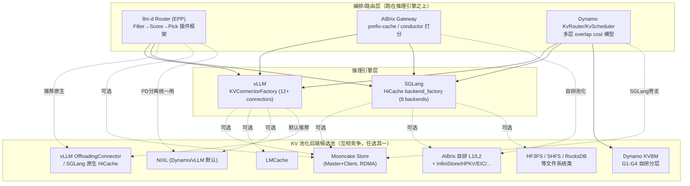
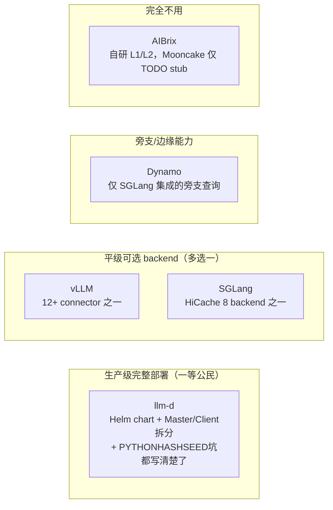

# 专题 19：KV Cache 池化技术全景 —— llm-d / AIBrix / vLLM / SGLang / Dynamo 是否使用 Mooncake Store

> 承接专题 04/10/11。前面三篇把 Mooncake 自己讲透了，本篇跳出 Mooncake 视角，回答一个更大的问题：**在当前的 LLM 推理生态里，KV cache 池化到底是不是"默认用 Mooncake"？**
>
> **与工作区其他两份综述的关系（避免重复阅读困惑）**：`docs/kv knowledge/12-KV池化完整综述.md`（覆盖 vLLM/SGLang/Mooncake/LMCache/Dynamo/llm-d/AIBrix/Motor 全景，偏概念分层与架构对比）和 `docs/interview-review/15-vLLM-Router与SGLang-KV亲和性设计调研.md`（偏路由算法对标）已经覆盖了这个生态的大部分内容。**本文的独特价值是本轮基于最新代码仓的三个专项深挖**：① AIBrix 的 `conductor` 打分策略源码（TTFT 公式）与其"几乎不用 Mooncake"的证据链（`pd/transfer/mooncake.go` TODO stub）；② llm-d 的 Mooncake 生产部署细节（`PYTHONHASHSEED` 坑、embedded/standalone 两种模式的 Master/Client 参数）与"PD 分离统一用 NixlConnector、不用 MooncakeConnector"这个反直觉结论；③ Dynamo KVBM 的 G1-G4 与 Mooncake 的边界核实（KVBM 核心不用 Mooncake，只在 SGLang 集成旁支查询共享池）。如果只看一份，先看《KV池化完整综述》建立全景，再看本文补充这三处细节。 结论提前说：**不是**——Mooncake Store 只是"可插拔存储 backend 市场"里的一个选项，vLLM/SGLang/llm-d 都同时支持好几种互相竞争的方案（LMCache、NIXL、Mooncake、AIBrix 自己的 L1/L2 引擎、HF3FS、EIC 等），AIBrix 甚至完全自研了一套不依赖 Mooncake 的独立池化框架。本文基于 `vllm/`、`sglang/`、`llm-d/`、`aibrix/`、`dynamo/` 五个仓库的最新代码/文档逐一核实。

---

## 0. 结论速览表

| 系统 | 是否用 Mooncake Store | 用在哪个环节 | 是否为默认/推荐路径 | 其他可选 backend | KV-aware 路由组件 |
|---|---|---|---|---|---|
| **vLLM** | 是，但只是 12+ 个 KVConnector 里的 1 个 | `MooncakeConnector`（PD 传输）+ `MooncakeStoreConnector`（跨实例前缀共享），均原生注册 | 否，默认是 `OffloadingConnector`（原生 CPU offload，零外部依赖） | LMCache、NIXL、FlexKV、HF3FS、MoRI-IO、SimpleCPUOffload... | vLLM 自身**没有**跨实例路由能力，是外部系统的职责 |
| **SGLang** | 是，但只是 HiCache 8 个 L3 backend 里的 1 个 | HiCache L3 层（`MooncakeStore` 类）+ disaggregation transfer backend 之一 | 否，同级还有 nixl/hf3fs/aibrix/eic/simm/mori/file | nixl、hf3fs、**aibrix**（AIBrix 自己的引擎反过来可以插进 SGLang！）、eic、simm、mori、file | 无内置全局路由，依赖外部 `sgl-model-gateway` |
| **llm-d** | 是，`MooncakeStoreConnector` 有完整 K8s 部署清单（Helm/Kustomize） | KV cache **分层 offload / 跨实例前缀共享**，**不是** PD 传输 | 否，官方推荐**原生路径**（vLLM `OffloadingConnector` / SGLang HiCache），Mooncake 是"需要额外能力时才选"的选项 | LMCache、vLLM 原生 Offloading、SGLang 原生 HiCache；**PD 分离统一走 `NixlConnector`，`MooncakeConnector` 只在文档里提及，无实际部署** | **llm-d Router / EPP**：`prefix-cache-scorer`（权重3）+ `kv-cache-utilization-scorer`/`queue-scorer`（负载均衡，权重2）+ `no-hit-lru-scorer`；分近似（字符级）和精确（事件驱动 token 级）两套实现 |
| **AIBrix** | **否，几乎不用**——只在 PD 传输的一个 TODO stub 里出现，L2 存储 backend 列表里**没有** Mooncake | 无实质集成 | 不适用 | 自研 L1(DRAM)+L2 框架，L2 支持 InfiniStore/HPKV/EIC/PrisKV/RocksDB/SHFS | Gateway 自研 `prefix-cache` 路由 + PD 场景**同名但独立实现**的 `conductor` 打分策略 |
| **NVIDIA Dynamo** | 是，但**不在 KVBM 核心里**，是 SGLang 集成的旁支能力 | SGLang HiCache 共享池查询（`HicacheSharedKvCache`）+ SGLang disagg 传输 backend 之一 | 否，KVBM 自己的 G1-G4 分层走的是 NIXL，不是 Mooncake | KVBM（自研 G1-G4）、NIXL（默认传输层）、LMCache、FlexKV（FlexKV 内部用 Mooncake TE） | **KvRouter/KvScheduler/KvIndexer**：device/host/disk/shared-cache 多层 overlap 折算 prefill cost，选 cost 最低的 worker |

**一句话总结**：五个系统里，**只有 llm-d 把 Mooncake Store 当成一条完整、生产级的部署路径**（有专门的 Helm chart、Master/Client 拆分、embedded/standalone 两种模式）；vLLM 和 SGLang 把它当成众多平级 connector/backend 之一；Dynamo 只在 SGLang 集成的旁支用到；**AIBrix 基本不用 Mooncake，走的是完全独立自研的 L1/L2 池化框架**。

---

## 1. 整体格局图



**看这张图要抓住的核心信息**：Mooncake 只是"候选池"里的一个节点，且不同系统对它的依赖程度差异极大——从"完整生产部署"（llm-d）到"完全不用"（AIBrix）。

---

## 2. vLLM：Mooncake 只是 12+ 个 KVConnector 里的 1 个

`vllm/distributed/kv_transfer/kv_connector/factory.py` 当前注册的全部 connector（主分支实测）：

| Connector | 用途 |
|---|---|
| `ExampleConnector` / `ExampleHiddenStatesConnector` | 官方示例，教学用 |
| `LMCacheConnectorV1` / `LMCacheMPConnector` | 集成 LMCache（另一个独立的分布式 KV cache 项目） |
| `NixlConnector` / `NixlPullConnector` / `NixlPushConnector` | 集成 NVIDIA NIXL |
| `MultiConnector` | 组合多个 connector（比如 PD 传输 + 前缀共享叠加使用） |
| `MoRIIOConnector` | AMD MoRI-IO 传输后端 |
| `OffloadingConnector` | **vLLM 原生**，零外部依赖，直接 CPU RAM/文件系统 offload |
| `DecodeBenchConnector` | 压测用 |
| `MooncakeConnector` / `MooncakeStoreConnector` | Mooncake（PD 传输 / 跨实例前缀共享），专题 11 深挖过 |
| `FlexKVConnectorV1` | 腾讯+NVIDIA 的 FlexKV（内部用 Mooncake Transfer Engine 做传输，但对外是独立 connector） |
| `SimpleCPUOffloadConnector` | 更简化版的 CPU offload |
| `HF3FSKVConnector` | 深度求索开源的 3FS 分布式文件系统 |

**vLLM 官方默认推荐的是 `OffloadingConnector`**（零外部依赖），Mooncake 是"需要跨节点共享池能力时"的可选项之一，和 LMCache、NIXL、FlexKV 是平级竞争关系，不是唯一方案。

---

## 3. SGLang：Mooncake 只是 HiCache 8 个 L3 backend 里的 1 个

`sglang/srt/mem_cache/storage/backend_factory.py` 当前注册的全部 backend：

| Backend 名 | 实现类 | 说明 |
|---|---|---|
| `file` | `HiCacheFile` | 本地磁盘 |
| `nixl` | `HiCacheNixl` | NVIDIA NIXL |
| `mooncake` | `MooncakeStore` | Mooncake（专题 11 深挖过） |
| `hf3fs` | `HiCacheHF3FS` | DeepSeek 3FS |
| **`aibrix`** | `AibrixKVCacheStorage` | **AIBrix 自己的引擎，反过来可以当 SGLang 的 L3 backend 用！**——这说明 AIBrix 和 Mooncake 在 SGLang 生态里是**平级竞品**，不是谁依赖谁 |
| `eic` | `EICStorage` | 火山引擎 Elastic Instant Cache |
| `simm` | `HiCacheSiMM` | 共享推理内存管理器 |
| `mori` | `UMBPStore` | AMD MoRI 相关（类名与 backend 名不完全对应，注册表里如此） |

**同一棵 `HiRadixCache` 树的 L3 层可以插拔换成上述任意一个**，Mooncake 没有特殊地位。

---

## 4. llm-d：Mooncake 是"非原生但生产级"的可选路径，PD 分离完全不用它

### 4.1 五条 Tiered Prefix Cache 路径，Mooncake 只是其中一条

llm-d 的 `guides/tiered-prefix-cache/README.md` 明确列出五条互斥的部署路径：

| Path | 实现 | 官方态度 |
|---|---|---|
| vLLM native | `OffloadingConnector` | **官方推荐**："requires no extra components" |
| SGLang HiCache | 原生 HiCache | **官方推荐**（native 的 SGLang 等价物） |
| LMCache | LMCache connector | 非原生，需要额外组件 |
| **MooncakeStore** | `MooncakeStoreConnector` | 非原生，需要额外组件（Mooncake Master，可选 Mooncake Client） |
| TPU | vLLM TPU 原生 connector | TPU 专用 |

原文态度非常直接：

> "We recommend each model server's **native** offloading path... Reach for a non-native connector (for example LMCache) **only when you need a capability the native path does not yet provide**."

也就是说，llm-d 把 Mooncake 定位成"原生方案覆盖不了某个需求时的补充选项"，不是首选。

### 4.2 Mooncake 部署细节（llm-d 提供的是目前最完整的 Mooncake 生产部署参考）

两种模式（`docs/architecture/advanced/kv-management/kv-offloader.md`）：

| 模式 | 说明 | `global_segment_size` | 组件 |
|---|---|---|---|
| **Embedded** | 每个 vLLM rank 就地贡献 CPU DRAM | `> 0`（如 `"80GB"`） | Mooncake Master + vLLM |
| **Standalone-store** | 独立 Mooncake Client 进程拥有 CPU+SSD 池，vLLM 只是请求方 | `0` | Master + Client + vLLM |

启动配置（embedded 模式）：

```json
{
  "mode": "embedded",
  "metadata_server": "P2PHANDSHAKE",
  "master_server_address": "mooncake-master-store.mooncake.svc.cluster.local:50051",
  "global_segment_size": "80GB",
  "protocol": "rdma",
  "enable_offload": false
}
```

`--kv-transfer-config '{"kv_connector":"MooncakeStoreConnector","kv_role":"kv_both"}'`

Master 的关键淘汰/租约参数（`helpers/mooncake-master-store/base/configmap.yaml`）：`eviction_high_watermark_ratio=0.95`、`eviction_ratio=0.05`、`default_kv_lease_ttl=5000ms`、`default_kv_soft_pin_ttl=1800000ms`（30分钟）、`enable_snapshot=true`——这些数字和专题 10 讲的驱逐机制（LRU、soft pin、快照）完全对得上，是理论到生产配置的直接映射。

**一个非常值得记的生产坑**（面试加分点）：

> KV cache block 的 key 是内容寻址（vLLM block hash），但 **Python 的 `hash()` 默认按进程随机种子**，不同 vLLM 实例对同样的 token 会算出不同 hash，导致永远命中不上彼此的缓存。**必须**给所有共享同一个 Mooncake Store 的 vLLM 实例设置固定的 `PYTHONHASHSEED=0`。

### 4.3 关键澄清：`MooncakeStoreConnector`（前缀共享）≠ `MooncakeConnector`（PD 传输），llm-d 只用了前者

llm-d 文档原文明确区分：

> "`MooncakeStoreConnector` (distributed cache offloading) is distinct from `MooncakeConnector` (point-to-point KV transfer for P/D disaggregation). They share the same Transfer Engine for RDMA data movement but serve different purposes."

**实测结论：llm-d 仓库里 `MooncakeConnector` 只在这段说明性文字里出现过，没有找到任何实际部署 yaml**。llm-d 的 **PD 分离统一使用 `NixlConnector`**（所有硬件变体：GPU/AMD/XPU/AWS/Wide-EP 全部如此），这是本次调研一个很反直觉但很重要的发现——**做 KV cache 跨实例共享时 llm-d 会考虑 Mooncake，但做 PD 点对点传输时完全不考虑 Mooncake，只用 NIXL**。

### 4.4 llm-d Router 的前缀感知路由：近似（字符级）+ 精确（token 级）两套实现，正好对应专题 04 的对比

llm-d 提供两种实现，选择权交给用户：

| | 近似实现 | 精确实现 |
|---|---|---|
| 匹配粒度 | **字符近似**（无 tokenizer，按字符/token 比例估算） | **精确 token**（真实调 vLLM tokenizer） |
| 状态来源 | EPP 本地 LRU 索引（路由后自行"假设"目标 pod 会缓存） | 订阅 vLLM 的 **KVEvents**（ZMQ），维护全局精确索引 |
| 依赖 | 无 | vLLM render 端点 + ZMQ |
| PD 支持 | 基础 | 原生/精细（能定位具体 block 做传输） |

**这和专题 04 第 3 节对比的"router 仓字符级 radix tree vs Motor token 级方案"是同一个技术选型问题在另一个项目里的重现**——llm-d 很聪明地把两种方案都做了，让用户按"轻量但近似"vs"精确但要多起一个 tokenizer 服务"自己选，而不是像 Motor 和 vLLM production-stack router 那样各自押注一种方案。

打分公式（`prefix-cache-scorer` 权重 3，是所有 scorer 里最高的）：

```yaml
schedulingProfiles:
  - name: default
    plugins:
      - pluginRef: queue-scorer                  # 权重2，负载均衡
      - pluginRef: kv-cache-utilization-scorer    # 权重2，负载均衡
      - pluginRef: prefix-cache-scorer             # 权重3，前缀命中优先
      - pluginRef: no-hit-lru-scorer                # 权重2，冷请求打散
```

理念上和 Mooncake Conductor 的"前缀命中优先 + 负载均衡"高度一致，工程实现是**多插件加权打分**（Filter→Score→Pick 框架），不是单体 Conductor。

---

## 5. AIBrix：基本不用 Mooncake，是完全独立自研的池化框架

这是本次调研最大的反差点——**AIBrix 的 KV cache 池化和 Mooncake 几乎没有关系**。

### 5.1 AIBrix 自己的分层架构

```
Gateway（前缀感知路由 + PD conductor 打分）
        ↓
vLLM/SGLang 侧：AIBrixOffloadingConnector / AIBrixPDReuseConnector
        ↓
BaseKVCacheManager
   ├─ L1Cache（本机 DRAM，S3FIFO/LRU/FIFO 淘汰）—— 不跨实例共享
   └─ L2Cache → Connector（direct 模式直连单 backend / cluster 模式经 Placement+Redis MetaService 选点）
        ↓
InfiniStore / HPKV / EIC / PrisKV / RocksDB（本地） / SHFS / MOCK
```

**Mooncake 在 AIBrix 里出现的全部三处，且都不是核心依赖**：
1. PD 分离场景的传输 backend 选项之一，但代码是 **TODO stub**（`pd/transfer/mooncake.go` 里 `MooncakeAgent` 是空实现）；
2. Benchmark 流量重放工具支持读取 **Mooncake trace 格式**的数据集（`--trace-type mooncake`），这只是数据源格式，不是运行时依赖；
3. vLLM v0.14.0 patch 里，AIBrix 的 connector 注册代码和 vLLM 自带的 `MooncakeConnector` 注册代码**并列共存**——说明二者是平级的可选 connector，AIBrix 完全没有包装或依赖 Mooncake。

**L2 存储后端列表里没有 Mooncake**：

```python
# l2/connectors/connector.py 的工厂分支
"ROCKSDB" | "INFINISTORE" | "HPKV" | "PRISKV"/"PRIS" | "MOCK" | "EIC" | "SHFS"
```

### 5.2 跨实例前缀复用：靠自己的 Rolling Hash + Gateway 索引，不靠 Mooncake

- **数据面**：多个引擎实例把 KV block 写到同一个 L2 backend，Key 用 `RollingHashKeyBuilder`（链式滚动哈希，前一个 block 的 hash 参与下一个 block 计算，保证前缀一致性）——概念上和 vLLM 的 block hash 链、Mooncake 的 block key 是同一套思路，但完全是 AIBrix 自己实现的。
- **控制面**：Gateway 的 `PrefixHashTable`/`SyncPrefixHashTable`（两级 hash 索引：前缀 hash → {model → {pod: 最近使用时间}}），`SyncPrefixHashTable` 还能订阅引擎侧真实的 KV Event 提升精度。

### 5.3 "conductor" 这个名字在 AIBrix 里也存在，但是完全独立的实现

AIBrix 的 PD 场景有一个叫 `conductorPrefillPolicy` 的打分策略，**命名撞车但代码完全独立**：

```go
// estimated_TTFT(pod) = queue(reqCnt, PrefillTimePerRequest) + prefix(matched_tokens) + prefill(unmatched_tokens)
type conductorPrefillPolicy struct {
    tok                tokenizer.Tokenizer
    prefixCacheIndexer *prefixcacheindexer.PrefixHashTable
    metricCache        cache.MetricCache
}
```

这个 TTFT 估算公式（排队时间 + 前缀命中部分耗时 + 未命中部分 prefill 耗时，取最小值的 pod）跟 Mooncake Conductor 论文 Algorithm 1 的思路**高度相似**（面试如果被问"AIBrix 是不是抄了 Mooncake Conductor"，准确的回答是"思路收敛到了同一个方案，但是独立实现，AIBrix 没有依赖 Mooncake 的 Go 版 Conductor 代码"）。

---

## 6. NVIDIA Dynamo：Mooncake 只在 SGLang 集成的旁支出现，KVBM 核心是自研 G1-G4 + NIXL

### 6.1 KVBM（KV Block Manager）自己的四层分级，和 Mooncake 无关

| Tier | 含义 | 实现 |
|---|---|---|
| G1 | GPU HBM | `DeviceStorage` |
| G2 | CPU pinned memory | `PinnedStorage` |
| G3 | 本地 SSD/NVMe | `DiskStorage` |
| G4 | 远程/云存储 | `NixlStorage`（KVBM 视为不透明 blob store） |

`KvBlockManager` + `OffloadManager`/`TransferManager` 统一调度这四层之间的迁移（Device↔Host、Host↔Disk、Disk→Device onboard），**底层传输走 NIXL，不是 Mooncake**。三层架构：LLM Runtime Connector → KVBM Logic → **NIXL Layer**（统一传输/存储抽象）。

### 6.2 Mooncake 真正出现的两个地方，都是"SGLang 引擎原生能力"，不是 KVBM 自己接入的

1. **SGLang HiCache 共享池查询**：Dynamo 的 `HicacheSharedKvCache`（`lib/llm/src/kv_router/shared_cache.rs`）直接用 HTTP 查询 Mooncake master 的 `/batch_query_keys` 接口，让 Router 在打分时"顺便"折算一下"这个 block 是不是任何 worker 都能从共享池拿到"，但这依赖的前提是 **SGLang worker 自己配置了 `--hicache-storage-backend mooncake`**——Dynamo 只是去查询，不负责这套 Mooncake 部署。
2. **SGLang disaggregation 传输 backend**：`--disaggregation-transfer-backend mooncake`，和 `nixl` 是平级的可选项，同样是 SGLang 引擎原生 flag，Dynamo 透传而已。

**没有找到"NIXL 内部把 Mooncake Transfer Engine 当 backend plugin"的代码证据**（这点在 Mooncake 官方 README 的更新日志里提到过"NIXL officially supports Mooncake Transfer Engine as a backend plugin"，但那是 NIXL 独立仓库 `ai-dynamo/nixl` 里的事，不在本 `dynamo` 仓库范围内，无法在这个仓库里核实）。

### 6.3 Dynamo 的 KV-aware 路由：多层 overlap 折算 cost，比 Mooncake Conductor 更细

`KvRouter`/`KvScheduler`/`KvIndexer` 的 cost 公式（cost 越低越优）：

```text
adjusted_prefill_blocks = max(
    prefill_blocks
    - overlap_score_credit * device_overlap_blocks     # G1 命中折扣
    - host_cache_hit_weight * host_overlap_blocks       # G2 命中折扣
    - disk_cache_hit_weight * disk_overlap_blocks       # G3 命中折扣
    - shared_cache_multiplier * shared_beyond_blocks,   # 共享池(如Mooncake)命中折扣
    0,
)
cost = prefill_load_scale * adjusted_prefill_blocks + decode_blocks
```

这比 Mooncake Conductor Algorithm 1 的"只区分本地命中 vs 远端命中"更细——**Dynamo 把命中分成 G1/G2/G3/共享池四个层级分别打折**，理念上是 Mooncake Conductor 思路的进一步细化（多级折扣而不是二元的"本地/远端"）。

### 6.4 与推理引擎的集成：vLLM/TRT-LLM 复用官方 connector 体系，SGLang 走原生能力

- **vLLM**：自研 `DynamoConnector`，但**严格继承 vLLM 的 `KVConnectorBase_V1`**；PD 场景用 `PdConnector`（继承 vLLM 的 `MultiConnector`），组合 KVBM/LMCache/FlexKV + vLLM 自带的 `NixlConnector`。
- **TensorRT-LLM**：`DynamoKVBMConnectorLeader/Worker`，挂载在 TRT-LLM 自己的 `kv_connector_config` 插件机制上。
- **SGLang**：**不走 connector 体系**，是引擎原生的 HiCache/disagg 能力，Dynamo 只在路由侧多查一次共享池。

---

## 7. 横向对比：谁把 Mooncake 当"一等公民"



面试如果被问"业界 KV cache 池化是不是都在用 Mooncake"，**正确答案是"不是，Mooncake 只是众多方案里工程最成熟、开源最早的一个，各家的态度从'当生产首选'到'完全不用、自研一套'都有"**，具体理由：

1. **vLLM/SGLang 官方都不把 Mooncake 当默认**——默认都是各自的原生方案（`OffloadingConnector`/原生 HiCache），Mooncake 是"需要跨节点共享池"时的可选项，和 LMCache、NIXL、FlexKV、AIBrix 引擎平级竞争；
2. **llm-d 给了 Mooncake 目前最完整的生产部署参考**（Helm chart、两种部署模式、淘汰/租约参数、`PYTHONHASHSEED` 这种生产级坑都写了），但官方仍然推荐先用原生方案；
3. **AIBrix 完全独立自研**了一套 L1/L2 池化框架（InfiniStore/HPKV/EIC/PrisKV/RocksDB/SHFS 做 L2 backend），Mooncake 在这套体系里几乎没有存在感，只在 PD 传输的一个未完成 stub 和 benchmark 数据格式里出现过；
4. **Dynamo 的 KVBM 自己有一套 G1-G4 分层 + NIXL 传输**，跟 Mooncake 完全独立，Mooncake 只在"Dynamo 支持的 SGLang 引擎"这一层被间接用到（SGLang 自己配置了才生效，Dynamo 不负责）。

---

## 8. 面试高频问答

**Q1：现在做 KV cache 池化是不是就是用 Mooncake Store？**
> 不是。Mooncake 只是一个开源最早、工程比较成熟的方案，但 vLLM、SGLang 官方默认都推荐各自的原生方案（零外部依赖），Mooncake 和 LMCache、NIXL、FlexKV、AIBrix 自研引擎是平级竞争关系。llm-d 给了 Mooncake 目前最完整的生产部署参考，但也说"没有额外需求就先用原生方案"；AIBrix 干脆完全自研了一套不依赖 Mooncake 的 L1/L2 框架。

**Q2：AIBrix 为什么不用 Mooncake？**
> 从代码看不是"不能用"，而是"选择了独立路线"——AIBrix 自己实现了分层缓存管理框架（L1 DRAM + L2 可插拔 Connector 抽象 + Placement 一致性选点 + K8s Operator 编排），远端存储依赖 InfiniStore/HPKV/EIC 等外部系统，但这套框架和 Mooncake Store 是平级的竞品关系，不是谁包装谁。有意思的是 SGLang 的 HiCache backend 列表里反而有一个 `aibrix` 选项，说明两者在 SGLang 生态里是互相竞争的可插拔后端。

**Q3：llm-d 做 PD 分离用 Mooncake 吗？**
> 不用。llm-d 的 PD 分离全部硬件变体统一使用 `NixlConnector`，`MooncakeConnector`（PD 点对点传输）只在文档里被提及用来做概念区分，仓库里没有任何实际部署配置。Mooncake 在 llm-d 里只用在"KV cache 分层 offload / 跨实例前缀共享"这一个环节（`MooncakeStoreConnector`），这是两个完全不同的产品线，容易被面试官拿来试探是否真的懂区分。

**Q4：Dynamo 的 KVBM 是不是基于 Mooncake？**
> 不是。KVBM 是 NVIDIA 自研的 G1-G4 分层块管理器（GPU/CPU pinned/本地SSD/远程存储），底层传输统一走 NIXL，跟 Mooncake 没有代码级依赖。Mooncake 只在"Dynamo 支持 SGLang 引擎"这条线上被间接用到——如果 SGLang worker 自己配置了 `--hicache-storage-backend mooncake`，Dynamo 的 Router 会额外去查一次 Mooncake 的共享池接口来更准确地估算 prefill 成本，但这是可选的旁支能力，不是 KVBM 核心。

**Q5：这么多系统、这么多 backend，选型的判断依据是什么？**
> 核心是三个维度权衡：① 要不要跨节点共享（本机 CPU RAM offload 用原生方案就够，要真正的集群级共享池才需要 Mooncake/LMCache/AIBrix 引擎级方案）；② 硬件/网络条件（有 RDMA 网络才能发挥 Mooncake/NIXL 的优势，否则退化到 TCP 或干脆用文件系统类方案如 HF3FS/SHFS）；③ 运维成本（原生方案零外部依赖，Mooncake/AIBrix 引擎都需要额外部署 Master/Client 或 Gateway，llm-d 的态度"先用原生，需要额外能力才上非原生方案"是目前业界比较有共识的判断顺序）。

---

## 9. 关键文件/证据速查表

| 系统 | 组件 | 文件路径 |
|---|---|---|
| vLLM | Connector 全量注册表 | `vllm/vllm/distributed/kv_transfer/kv_connector/factory.py` |
| SGLang | HiCache backend 全量注册表 | `sglang/python/sglang/srt/mem_cache/storage/backend_factory.py` |
| llm-d | Tiered Prefix Cache 五条路径对比 | `llm-d/guides/tiered-prefix-cache/README.md` |
| llm-d | KV Offloading 架构文档（含 Mooncake 完整说明） | `llm-d/docs/architecture/advanced/kv-management/kv-offloader.md` |
| llm-d | Mooncake Master/Client Helm 部署 | `llm-d/helpers/mooncake-master-store/`、`llm-d/helpers/mooncake-client/` |
| llm-d | 前缀感知路由（近似+精确两套） | `llm-d/docs/architecture/advanced/kv-management/prefix-cache-aware-routing.md` |
| llm-d | PD 分离统一用 NixlConnector 的证据 | `llm-d/guides/pd-disaggregation/modelserver/gpu/vllm/base/patch-prefill.yaml` |
| AIBrix | L1/L2 池化框架 | `aibrix/python/aibrix_kvcache/aibrix_kvcache/{l1,l2}/` |
| AIBrix | Mooncake PD 传输 TODO stub | `aibrix/pkg/plugins/gateway/algorithms/pd/transfer/mooncake.go` |
| AIBrix | Gateway `conductor` 打分策略 | `aibrix/pkg/plugins/gateway/algorithms/pd/prefill_scorer.go` |
| Dynamo | KVBM G1-G4 设计文档 | `dynamo/docs/design-docs/kvbm-design.md` |
| Dynamo | SGLang HiCache 共享池查询（Mooncake） | `dynamo/lib/llm/src/kv_router/shared_cache.rs` |
| Dynamo | KV Router cost 公式 | `dynamo/docs/design-docs/router-design.md`、`dynamo/lib/kv-router/src/scheduling/selector.rs` |

---

## 10. 参考

- 专题 04：`04-KV亲和调度与Mooncake专题.md`（Motor/router 字符级 vs token 级对比，可与本文第 4.4 节的 llm-d 近似/精确两套实现对照阅读）
- 专题 10：`10-Mooncake传输引擎与存储管理深度拓展.md`（Mooncake 自身的传输/驱逐/租约机制，可与本文第 4.2 节 llm-d 的生产配置参数对照）
- 专题 11：`11-Mooncake在vLLM与SGLang中的实现对比.md`（vLLM/SGLang 对 Mooncake 自身的集成细节）
- 本文所有结论基于工作区 `vllm/`、`sglang/`、`llm-d/`、`aibrix/`、`dynamo/` 五个仓库当前快照，行号可能随版本更新漂移，核心结论（生态格局）不受影响。
