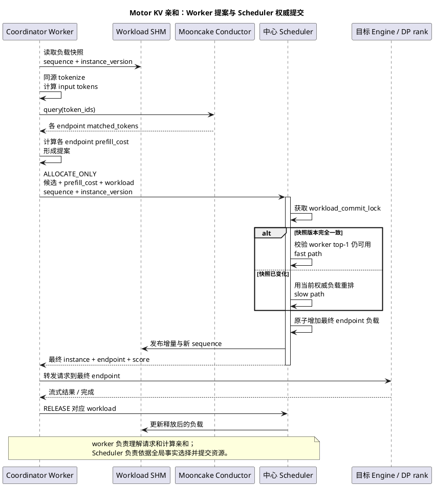
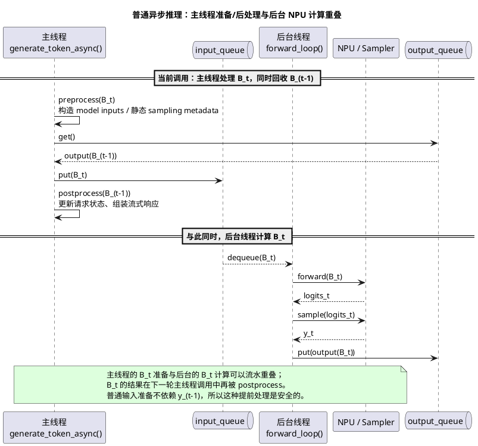
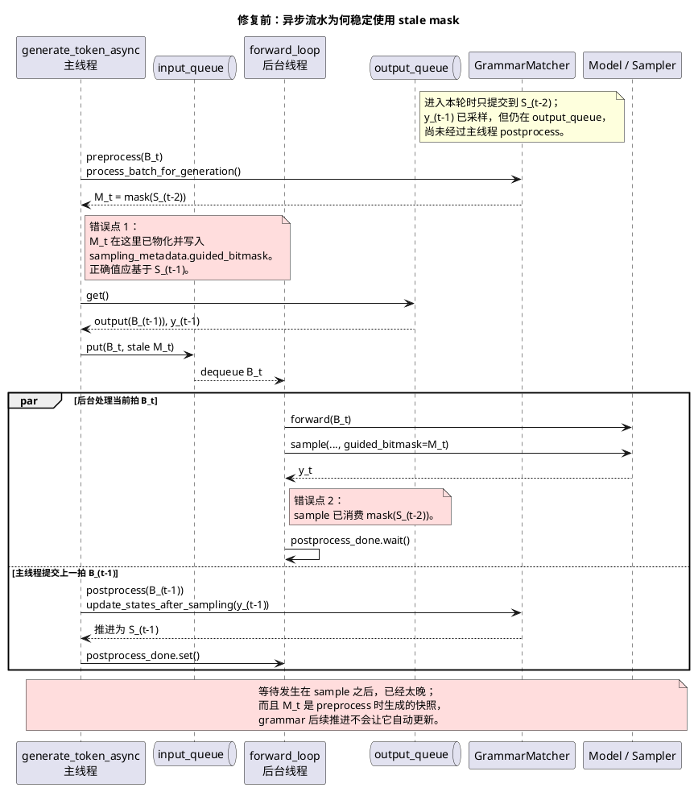
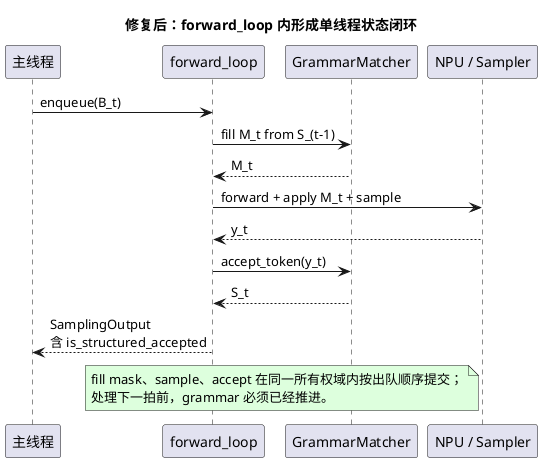

# 当前简历行为面试与业务题准备

> 基于 `cvs/林炜-v2.pdf` 整理。目标不是逐条复述简历，而是让回答形成一条清楚的主线：**我解决了什么业务问题，为什么这样设计，我具体做了什么，怎样和团队协同，结果如何，以及如果重来会怎样改进。**

## 一、先记住这条主线

面试中建议把经历分成“一主一备”：

| 定位 | 项目 | 最适合回答 |
|---|---|---|
| 主项目 | Motor KV Cache 亲和性调度 | 有挑战的项目、业务价值、方案选型、团队协作、量化结果、现场业务题 |
| 备选项目 | MindIE 结构化输出 | 从 0 到 1、个人主导、复杂技术问题、线上正确性、工程设计 |

不要一上来把所有技术名词全部铺开。先讲业务问题和结果，面试官追问后再进入实现。

推荐叙事顺序：

```text
场景和痛点 → 目标与约束 → 关键判断 → 我的职责 → 方案和难点 → 协作方式 → 验证结果 → 复盘
```

---

## 二、“你现在做什么？”

### 30 秒版本

> 我目前在华为昇腾计算产品线做大模型推理服务开发，主要参与 MindIE 自研推理框架的特性设计和性能优化。我的工作集中在服务和调度层，包括结构化输出、KV Cache 亲和性调度、Tool Call、Reasoning 解析以及 Server 架构重构。最近投入最多的是两块：一块是从 0 到 1 交付结构化输出，解决模型输出必须严格符合 JSON Schema 的问题；另一块是多实例下的 KV Cache 亲和路由，通过复用已有前缀计算降低 TTFT。

### 90 秒版本

> 我目前在华为昇腾计算产品线做大模型推理优化，主要面向 MindIE 推理服务。我的工作不是单纯做某一个算子，而是偏服务侧的完整交付：从需求分析、方案设计、接口抽象和核心编码，到联调、测试和性能验证。
>
> 目前比较有代表性的工作有三类。第一是结构化输出，我从 JSON Schema 编译、逐 token 合法集合维护，一直打通到 NPU 侧 logits mask，并处理过约束解码和异步调度叠加后的状态错位问题。第二是多实例 KV Cache 亲和调度，我把 tokenize 前置到 Coordinator，通过全局 KV 索引做 token 级最长前缀匹配，再把前缀收益和实时负载共同纳入路由。第三是 Tool Call、Reasoning 解析以及 Server C++ 请求处理链路重构。
>
> 这些工作让我比较熟悉大模型请求从协议接入、调度、Prefill/Decode、采样到流式返回的完整链路。我比较擅长把一个模糊的性能或正确性问题拆成可验证的工程方案，再推进到可交付状态。

### 面试官可能追问

**Q：你更偏算法、算子还是工程？**

> 我目前最深入的是推理服务和调度工程，包括请求处理、异步执行、约束采样、KV Cache 管理和多实例路由。我理解 PagedAttention、FlashAttention、并行和通信的基本机制，但不会把自己包装成底层算子专家。我的优势是能把推理原理转化成服务侧可落地、可回退、可观测的方案。

**Q：你最核心的竞争力是什么？**

> 一是有从 0 到 1 交付复杂特性的经验；二是既关注正确性，也能从 TTFT、负载和缓存命中角度做系统性权衡；三是遇到跨线程、跨实例的问题时，我会先建立完整状态和数据流，而不是只修表面现象。

---

## 三、主项目：Motor KV Cache 亲和性调度

### 3.1 两分钟完整回答

> 我做过最有挑战、也最能体现业务分析能力的项目，是 Motor 的多实例 KV Cache 亲和性调度。
>
> 背景是企业的大模型请求经常包含很长的 system prompt、tools schema 或多轮历史。在单实例里，Prefix Cache 可以复用这些前缀；但扩成多个实例后，如果仍然轮询或只看负载，同一个前缀很可能被打到没有缓存的实例，导致长 Prefill 重复计算，TTFT 明显上升。我们的目标是在不破坏负载均衡和服务可用性的前提下，让请求尽量落到真正持有对应 KV Cache 的实例。
>
> 我在项目里主要负责方案设计和核心开发。第一个关键选择是匹配粒度。我没有使用字符级或仅依赖请求历史的近似方案，而是把 tokenize 前置到 Coordinator，确保 system prompt、tools 和 chat template 处理后得到的 token 与引擎一致，再通过 Mooncake Conductor 的全局 KV 索引做 token 级最长前缀匹配。这样避免了字符相同但 token 不一致，以及缓存已经驱逐但路由层仍误判的问题。
>
> 第二个难点是亲和和负载并不总是一致。如果只选前缀最长的实例，同前缀突发流量会集中到一个节点，形成 herding。为此我设计了 unified 和 load_gated 两种模式：前者把剩余 Prefill 成本与实时负载做统一打分，后者先在最空闲的 Top-N 中筛选，再比较前缀命中。对于多 worker 负载视图滞后的问题，又把最终仲裁放到中心 Scheduler，用更新的权威负载进行重排。
>
> 第三个难点是部署形态。方案不仅要支持普通多实例，还要兼容 PD 分离、PD 混部和 vLLM DP。因为不同 DP rank 有独立 KV Cache 池，所以注册、查询和 endpoint 选择都做到 `(instance, DP rank)` 粒度，而不是只到实例级。
>
> 协作上，我负责调度方案和核心链路，需要和引擎侧确认 token、KV event 和 DP rank 的语义，和 Coordinator、Scheduler 相关开发对齐接口与负载账本，也需要和测试及部署侧共同覆盖多实例、PD 和异常回退场景。最终在简历所述的 8K 上下文、高前缀重复场景中，验证口径为 TTFT 约降低 70%、端到端时延约降低 50%，同时负载分布也得到改善。
>
> 如果重新做一次，我会更早建立标准化 A/B 数据集和全链路指标面板，把缓存命中、路由决策、Conductor 延迟、队列时间、Prefill 时间和 fallback 原因统一串起来，这样参数调优和效果归因会更快。

### 3.2 按问题拆开回答

#### Q1：这个项目为什么有挑战？

> 它不是“做一个最长前缀匹配”这么简单，而是同时包含四类约束：匹配必须与引擎真实 token 和缓存状态一致；亲和不能制造负载热点；方案要跨多实例、PD 和 DP rank 工作；外部索引异常时不能影响主服务可用性。真正难的是正确性、性能、部署兼容和可用性必须同时成立。

#### Q2：当时遇到的最大困难是什么？

推荐选择“亲和导致 herding”来讲，因为它能体现方案迭代，而不是只体现写代码。

> 最大困难是：局部最优的亲和选择会导致全局负载恶化。多个 Coordinator worker 可能同时看到相似的旧负载，又查询到同一个前缀最优实例，于是突发请求会一起打过去。早期如果只在 worker 本地叠加 in-flight 负载，只能约束本进程，跨 worker 仍然无效。
>
> 我的处理方式是把“亲和收益计算”和“资源最终仲裁”拆开。worker 负责计算各 endpoint 的 Prefill 成本或候选集，中心 Scheduler 使用更新的权威负载做最终选择。这样既保留缓存复用，又避免多个 worker 在旧视图下作出相同决定。验证时不只看平均 TTFT，还看 P99、各 endpoint 负载离散度、缓存命中、二次选择和 fallback 比例。

#### Q3：为什么不用轮询、会话粘性或字符级前缀树？

> 轮询只解决分流，不感知缓存；会话粘性对固定 session 有效，但不适合共享 system prompt、tools schema 或跨会话公共前缀，也依赖历史状态；字符级本地树便宜，但 chat template 和 tools 注入后，字符和 token 边界不一定一致，而且它通常不知道引擎真实的存入和驱逐。我们的客户场景是长输入、高前缀复用，错失一个前缀可能意味着重复计算几千 token，所以我选择 token 级、事件驱动的真实索引，同时通过超时和回退控制外部依赖风险。

#### Q4：为什么要 tokenize 前置？会不会增加延迟？

> 因为 KV Cache 的复用单位最终是 token/block。路由层若只看原始字符串，经过 chat template、system prompt 和 tools 注入后可能与引擎实际 token 序列不一致。前置 tokenize 确实增加了 CPU 开销，但它换来的是精确命中，而且 token 结果还可复用于长度校验、Conductor 查询和负载记账。若 tokenizer 异常或查询超时，方案会 fail closed，直接回退普通负载均衡，不让优化链路拖垮主链路。

#### Q5：为什么需要两种调度模式？

> 因为不同业务对收益和风险的偏好不同。`unified` 是软权衡，前缀收益足够大时允许覆盖一定负载差，更适合高重复率、长 Prefill 场景；`load_gated` 是硬门控，先限定最空闲 Top-N，再从中选最长前缀，更适合对尾延迟和负载上界敏感的场景。硬门控不是简单调大一个权重就能完全等价，所以保留两种策略更清晰。

#### Q6：你在里面承担什么角色？

> 我的角色不是只接一个小模块，而是负责把需求转成完整技术方案并推进核心落地。具体包括竞品和现状分析、token 级匹配方案、Conductor 查询链路、DP rank 粒度建模、双调度策略、配置化参数、异常回退，以及联调和验证。涉及引擎、Coordinator、Scheduler 或部署边界时，我负责把接口契约和失败语义明确下来，再和对应模块的同事共同完成联调。

#### Q7：团队怎么协同？

> 这个项目横跨路由层、中心调度、推理引擎、KV 索引和部署系统。我会先把接口契约写清楚：请求由谁 tokenize、实例和 DP rank 怎样唯一标识、Conductor 返回什么、worker 提交哪些候选、Scheduler 如何原子选择并记账、请求结束后怎样释放负载、异常时回退到哪里。开发阶段先用 mock 的 KV 命中和负载数据验证策略，再接 Conductor、Scheduler 和真实引擎；联调时重点核对 token、endpoint、负载增减和最终路由四条链路。验证阶段再和测试、性能及部署同事覆盖多实例、PD 分离、PD 混部、DP、缓存驱逐、扩缩容和组件超时。
>
> 负载均衡不是另外搭一套系统，而是沿用现有 `SchedulingFacade` 和 `scheduler_type` 扩展新的 `kv_cache_affinity` 策略：KV 亲和负责计算请求特有的 Prefill 成本，原有 LoadBalance 继续提供 endpoint 负载评分和 fallback；worker 只提出候选，中心 Scheduler 在同一个提交锁内完成最终选择和负载分配。这样新能力可以灰度开启，也可以在 Conductor 查询失败时退回原有负载均衡。

> 注意：如果被追问团队人数、项目周期、你是否担任 owner，请只说真实信息。当前简历没有给出这些数字，不要临场编造。

#### Q8：最后结果怎么样？

> 功能上，方案覆盖了多实例、PD 分离、PD 混部和 DP rank 粒度路由；性能上，在 8K 上下文、高前缀重复的代表性场景中，简历口径是 TTFT 约降低 70%、端到端时延约降低 50%；稳定性上，索引或 tokenize 异常时可以回退普通负载均衡，不影响基础推理服务。更重要的是，方案把缓存复用从单实例能力提升成了集群级调度能力。

#### Q9：如果再做一次，你会改进什么？

> 第一，更早建设标准化流量回放和 A/B 基线；第二，把命中率、有效复用 token、路由开销、队列时间、Prefill 时间、负载离散度和 fallback 原因放到同一个可观测链路；第三，根据模型、输入输出长度和重复率做参数自动推荐，而不只依赖静态配置；第四，评估 tokenizer/render 服务独立扩缩容，避免高 QPS 下 CPU 预处理成为新瓶颈。

### 3.3 中心 Scheduler 为什么是“权威最终选择”

#### 3.3.1 “权威”不是一句口号

worker 在每次选择前会从共享内存读取较新的负载，但读取和提交之间仍然存在时间窗口：多个 worker 可能基于同一个快照同时作出相同选择。因此，worker 的结果只能叫**提案**，不能直接视为最终分配。

中心 Scheduler 之所以是权威端，来自四个机制：

| 机制 | 具体含义 | 解决的问题 |
|---|---|---|
| 单一账本 | Scheduler 持有所有可用 `(instance, endpoint)` 的负载状态 | worker 之间不需要互相同步本地 in-flight 状态 |
| 版本校验 | worker 随请求携带 `workload_sequence` 和 `instance_version` | 判断 worker 的负载快照和实例集合是否仍与 Scheduler 一致 |
| 原子提交 | 在 `_workload_commit_lock` 内完成“重选 → ALLOCATION 记账 → SHM 增量发布” | 避免两个并发请求都在记账前看到同一个最低负载 endpoint |
| 最终结果回传 | Scheduler 返回实际提交的 instance、endpoint、score 和 fast-path 标记 | 转发、释放负载和观测都以最终结果为准，而不是以 worker top-1 为准 |

这里最重要的不变量是：

```text
选择哪个 endpoint 与给该 endpoint 增加本次请求负载，必须在同一个串行提交域内完成。
```

如果先选择、稍后再异步记账，那么下一请求仍会看到旧负载，中心化也无法阻止 herding。

#### 3.3.2 快路径与慢路径

一次分配的实际过程是：

1. worker 从 Scheduler 发布的共享内存读取 endpoint 负载，同时记住稳定的 `workload_sequence` 和 `instance_version`；
2. worker tokenize、查 Conductor，并计算本请求在各 endpoint 的 `prefill_cost`；
3. worker 通过 `ALLOCATE_ONLY` 上报候选、请求负载、快照序列和实例版本；
4. Scheduler 进入提交锁：
   - 如果 sequence 和 version 完全一致，说明 worker 确实基于当前账本选择，可走快路径，只校验 top-1 是否仍可用；
   - 如果任一版本不一致，说明快照已过期，走慢路径，使用 Scheduler 当前负载重新选择；
5. Scheduler 在锁内给最终 endpoint 增加本请求负载，并把最新条目写回共享内存；
6. 返回最终 endpoint，worker 按这个结果转发请求，并保存同一份 workload，供完成、失败或重试时精确释放。



#### 3.3.3 unified 为什么要上报全量 `prefill_cost`

`unified` 的分数可拆为一个请求静态项和一个快速变化项：

```text
prefill_cost(e) = max(0, input_tokens - overlap_credit × matched_tokens(e))
score(e) = prefill_load_scale × prefill_cost(e) + load_weight × fresh_load(e)
```

- `prefill_cost(e)` 取决于本次请求和 Conductor 查询结果，在一次分配过程中基本不变，适合由 worker 计算；
- `fresh_load(e)` 会随着所有 worker 的并发提交快速变化，必须由 Scheduler 在提交时读取；
- 因此 worker 不需要把 prompt 或 Conductor 查询搬到 Scheduler，只需上报所有 endpoint 的 `prefill_cost` 和两个权重；
- Scheduler 用当前负载扫描全量候选，选择最小 score；分数相同时优先更低的 `prefill_cost`，避免无意义地损失缓存命中。

早期只上报亲和 top-k，虽然能缓解热点，但可能把新的全局最优截断在候选集外。unified 后来升级为全量重排，就是为了消除这个误差。

`load_gated` 不采用全量 unified 重排。它的语义是“先锁定最闲 Top-N，再在其中比较亲和”，这是一条硬负载边界；如果 Scheduler 对所有 endpoint 重新做软加权，亲和可能把请求拉出 Top-N，策略语义就被破坏。因此它保留受限候选集内的权威重选。

#### 3.3.4 负载从哪里来，又怎样释放

负载不是瞬时 QPS，而是 endpoint 当前承担的工作量。亲和路径已经获得真实 token IDs，因此 Prefill 请求优先按真实输入 token 数记账；负载对象区分 `active_tokens` 与 `active_kv_cache`，LoadBalance 再根据角色计算 endpoint score。

请求分配成功后，Scheduler 立即增加 workload；请求完成、失败、取消或发生回滚时，Router/RequestManager 必须用分配时保存的同一 workload 做对应释放。这里需要与请求生命周期负责人对齐，否则只加不减会让节点永久“越来越忙”，重复释放则会把负载减成错误值。

共享内存用于把 Scheduler 账本低成本广播给 worker：实例集合变化时发布全量快照并提升 `instance_version`，普通负载变化只更新单个 entry 并推进 `workload_sequence`。共享内存提高读性能，但不取代 Scheduler 的最终提交权。

#### 3.3.5 60 秒口述版

> worker 本地看到的负载即使来自共享内存，也只是一个读快照；多个 worker 可以基于同一快照同时选中同一 endpoint，所以最终选择必须回到中心 Scheduler。worker 上报本请求在每个 endpoint 的静态 `prefill_cost`，同时携带自己读取的 workload sequence 和 instance version。Scheduler 在一个提交锁里检查版本：版本一致走 top-1 快路径；过期则用当前账本重排。unified 模式下按 `prefill_cost + fresh_load` 对全量 endpoint 重新取最小，然后在同一把锁内立刻增加该 endpoint 的 workload，再把增量写回共享内存。核心不是“中心节点再算一遍”，而是把最终选择和负载记账做成原子操作，这样下一请求才能看到刚才的分配，真正抑制跨 worker herding。

### 3.4 团队协作与接口对齐清单

| 合作对象/模块 | 必须对齐的接口或语义 | 最容易出问题的地方 | 联调/验收证据 |
|---|---|---|---|
| 业务/性能负责人 | 典型 ISL/OSL、前缀重复率、主指标是 TTFT 还是成本、可接受的 fallback | 把高复用场景收益泛化到所有流量 | 固定流量回放、A/B 基线、P50/P95/P99 |
| Coordinator/Router 开发 | `RequestInfo`、tools 透传、token_ids 复用、`SchedulingFacade.select_and_allocate`、最终 endpoint 转发 | 仍按 worker top-1 转发，忽略 Scheduler repick | request_id 串起提案与最终 endpoint |
| Scheduler/负载均衡开发 | `Workload` 定义、endpoint score、`ALLOCATE_ONLY`、sequence/version、原子分配与 RELEASE | 选择和记账分离；角色或量纲不一致 | 分配前后 workload、fast_path、selected_score |
| vLLM/推理引擎开发 | tokenizer/chat template 同源、Prefix Cache 开关、block size、KV event 格式、DP rank 到 endpoint 的映射 | tools 导致 token 分叉；实例命中但 rank miss | route token hash、cached tokens、KV event 日志 |
| Mooncake Conductor/索引开发 | `/query(token_ids)` 返回结构、tenant/instance 命名、BlockStored/Removed、replay、超时和空结果 | 命名映射错误、事件延迟、驱逐后假命中 | matched_tokens、事件序列、查询延迟、fallback reason |
| PD/部署/K8s 开发 | P/U 注册，D 不作为 Prefill KV 命中目标；服务端口、ZMQ endpoint、replay endpoint、扩缩容生命周期 | PD 角色配错、端口冲突、扩缩容后旧 endpoint 残留 | 普通多实例、PD 分离、混部、扩缩容矩阵 |
| 测试/性能/SRE | 故障注入、压测流量、指标和灰度回退 | 只看平均 TTFT，不看 P99、负载和 fallback | TTFT/Prefill/cached tokens/负载离散度/超时率 |

#### 负载均衡是怎样引入的

可以按下面四层向面试官解释：

1. **接入层不改主路由协议**：继续通过 `SchedulingFacade.select_and_allocate` 获取最终资源，KV 亲和是一个新的 scheduler policy，而不是 Router 里散落的特殊分支；
2. **配置层可切换**：`scheduler_type=kv_cache_affinity` 才启用；默认或异常场景仍可走 `load_balance`，便于灰度和回滚；
3. **评分层复用原负载模型**：亲和只新增 `prefill_cost`，endpoint 的 `fresh_load` 仍由原 LoadBalance 评分逻辑给出，避免出现两套负载定义；
4. **提交层统一**：无论普通 LoadBalance 还是 KV 亲和，最终都由 Scheduler 在 `ALLOCATE_ONLY` 内选择并记账，请求结束后走同一 workload release 生命周期。

#### 团队协作 60 秒口述版

> 这个模块要同时和五条线协作。第一是 Router/Coordinator，确定 request、tools 和 token_ids 怎样传，以及必须以 Scheduler 返回的最终 endpoint 转发；第二是 Scheduler 和负载均衡，统一 Workload 量纲、sequence/version、原子 allocate 和 release；第三是引擎侧，确认 chat template、Prefix Cache、KV event、block size 和 DP rank 映射；第四是 Conductor 与部署侧，对齐 query、实例命名、事件/replay、服务发现和 PD 角色；第五是测试与性能侧，建立多实例、PD、DP、驱逐、扩缩容和超时矩阵。我的做法是先定契约和失败语义，再按 request_id 把 token、matched、worker proposal、Scheduler final endpoint、cached tokens 和 workload 增减串成一条证据链。

### 3.5 深挖追问速答

**Q：为什么粒度必须到 DP rank？**

> 因为每个 DP rank 的 KV Cache 池独立。如果只知道某个实例有缓存，但请求最终进入该实例内另一个 rank，命中仍会丢失。实例级命中在 DP 场景下可能被稀释到约 `1 / DP`，所以注册、查询和选 endpoint 必须保持同一粒度。

**Q：Conductor 挂了怎么办？**

> 亲和是优化链路，不是正确性依赖。查询设置超时，失败后回退 LoadBalance；同时记录 fallback 类型并监控超时率，避免静默退化。

**Q：真实索引也可能不准吗？**

> 会。KV event 有传播时延，路由决定后也存在新请求尚未写入索引的窗口，所以它不是强一致事务系统。工程上要接受短暂假阴性或假阳性，通过事件更新、超时、最终引擎校验和普通 Prefix Cache 机制兜底。目标是显著提高命中概率，而不是承诺每次路由都百分之百命中。

**Q：如何证明收益来自 KV 亲和，而不是负载变化？**

> 做相同请求集、相同实例数和并发下的 A/B，对照普通负载均衡与亲和路由；固定模型、输入输出长度、前缀重复率和缓存预热方式；同时观测 effective cached tokens、queue time、prefill time、TTFT、TPOT 和 endpoint 负载。亲和主要应该降低 Prefill 和 TTFT，TPOT 不应出现同量级变化。如果只有总时延，没有这些中间指标，归因是不充分的。

---

## 四、备选项目：MindIE 结构化输出从 0 到 1

### 4.1 90 秒完整回答

> 另一个有挑战的项目是 MindIE 结构化输出，我负责从 0 到 1 打通完整链路。业务需求是让模型输出严格符合 JSON Schema，而不是生成后再用正则或重试修补。这对 Agent、API 参数生成和自动化流程很重要，因为格式错误会直接导致下游调用失败。
>
> 我把问题拆成四层：**接口层接收和校验 Schema；编译层把 Schema 转成 xgrammar 可执行的自动机；解码时由 GrammarMatcher 随 token 推进状态并生成合法 token 集合；最后在 NPU 侧用 bitmask 屏蔽非法 logits。** 为了**降低复杂 Schema 重复编译带来的 TTFT**，我又增加了按 Schema 内容哈希的容量受控编译缓存，并为后续多后端预留抽象。
>
> 项目中最难的问题发生在约束解码与异步调度叠加时。约束解码要求每一步严格遵循“根据当前状态生成 mask、采样、接受 token、推进状态”，但初版把同步路径的钩子原样放进异步流水：主线程先为当前 batch 生成 mask，之后才拿上一 batch 的 token 推进 grammar，导致当前采样稳定使用上上步状态生成的 stale mask。我先以同步路径建立正确时序，再对照历史提交和异步调用顺序，把问题定位到跨线程的状态所有权；修复时把异步的 mask 生成、采样和 `accept_token` 都收口到 `forward_loop`，让单一后台线程按 batch 出队顺序提交状态。
>
> 我的角色是该特性的主要设计和交付者，简历记录贡献代码 5000+ 行。结果是打通了 Schema 到 NPU 采样约束的完整能力，并解决异步高并发下的正确性问题。这个项目让我最深的体会是：复杂特性的难点往往不是单点算法，而是算法状态机和已有异步架构之间的契约。

### 4.2 高频追问

**Q：为什么不能生成完再校验或重试？**

> 事后校验只能发现错误，不能保证一次成功；重试会增加延迟和成本，复杂嵌套 JSON 还可能多次失败。约束解码是在每一步直接排除非法 token，从生成过程上保证输出落在 Schema 语言内，更适合有严格协议要求的生产服务。

**Q：为什么使用 xgrammar？**

> 它能把 JSON Schema、grammar 等约束编译为可在逐 token 解码中执行的状态机，并高效生成合法 token mask。选型时重点看正确性、词表适配、编译和运行开销、社区成熟度以及与现有采样链路的集成成本，而不只是 API 是否简单。

**Q：缓存解决了什么问题？**

> Schema 编译主要影响首 token 前的时间。Agent 或固定 API 经常重复使用同一个 Schema，因此用内容哈希作为 key 缓存编译结果，可以把重复请求的编译开销从主路径移除。缓存必须容量受控，并处理并发、对象生命周期和淘汰问题。

**Q：异步错位是怎么定位的？**

> 我先把同步路径写成 `fill mask → forward/sample → accept token` 的正确基线，再只打开异步复现，避免一开始把 PD、并发和 xgrammar 混在一起。接着对照修复前后的历史提交，按 batch 和 step 记录 mask 使用的 grammar 状态、采样 token、accept 时机和执行线程，发现异步真实顺序是“先 preprocess 当前拍，再 postprocess 上一拍”，因此当前 mask 稳定落后一拍。最后用首 token `{` 的最小例子验证：第二步仍使用初始态 mask，所以可能再次放行 `{`。PD/replay 的 `num_tried_tokens` 是相邻的游标问题，但不是这个主 bug 的根因。

**Q：结果如何衡量？**

> 第一是正确性：覆盖嵌套对象、数组、枚举、必填字段、转义字符和并发场景，非法输出应归零；第二是性能：分别测冷编译对 TTFT 的影响、缓存命中后的 TTFT、逐 token mask 对 TPOT 的增量；第三是稳定性：缓存并发、异常 Schema、取消请求和异步调度下不能出现状态串扰。

### 4.3 异步 stale mask：完整问题定位流程

这部分面试不要只讲“发现错位然后改到后台线程”，而要体现自己如何从复杂系统中排除错误方向、建立证据并验证根因。

#### 第一步：把现象转成可验证的不变量

设接受第 `t-1` 个 token 后的 grammar 状态为 `S_(t-1)`，第 `t` 步使用的 mask 为 `M_t`，正确关系必须是：

```text
M_t = mask(S_(t-1))
mask(S_(t-1)) → sample y_t → accept_token(y_t) → S_t
```

需要同时对齐三件事：请求/cache_id、grammar 状态和采样步号。只要 mask 来自旧状态，即使它被正确 apply 到本步 logits，结果仍然错误。

#### 第二步：建立同步路径基线

同步链路在一个调用栈内完成：

```text
preprocess: fill M_t from S_(t-1)
→ forward / apply mask / sample y_t
→ postprocess: accept y_t and advance to S_t
→ 下一轮 preprocess
```

因为 `postprocess(t-1)` 返回后才会进入 `preprocess(t)`，同步模式天然满足状态提交顺序。同步正常也说明 Schema 编译、xgrammar 状态转移、bitmask 位序和 NPU mask apply 并非首要嫌疑。

#### 第三步：用最小开关矩阵缩小范围

建议这样描述当时的排查思路：

| 变量 | 基线 | 逐步打开 | 判断目的 |
|---|---|---|---|
| 结构化输出 | 关闭 | 开启 | 确认与 grammar/mask 相关 |
| 调度模式 | 同步 | 异步 | 锁定路径分叉 |
| 并发 | 单请求 | 高并发/动态 batch | 判断并发是根因还是放大器 |
| 部署 | 单实例 | PD/recompute | 把主 bug 与 replay/迁移问题分开 |

关键结论是：**高并发是放大器，不是主因**。异步流水一旦进入稳态，单请求也具备 stale mask 条件；动态 batch 只让现象更容易暴露。

#### 第四步：按历史现场还原真实时序

不要只看修复后的现状代码。对比初版提交 `278c79b` 与修复提交 `737fa89`，可以明确看到：**问题不是两个线程同时修改了同一块 mask，也不是 NPU 读取 mask 太早，而是初版把“生成下一步 mask”和“提交上一步 token”分别放在了异步流水的错误阶段。**

异步模式之所以会触发、同步模式不会，是因为 `generate_token_async()` 使用 `input_queue/output_queue` 做一拍流水：主线程提前准备当前批次 `B_t`，后台线程执行已入队批次，主线程同时回收上一批次 `B_(t-1)` 的结果。普通采样参数可以提前准备，但结构化 mask 存在跨步数据依赖：

```text
生成 M_t 必须依赖刚采样出的 y_(t-1)
y_(t-1) 又必须先 accept 到 GrammarMatcher，才能得到 S_(t-1)
```

也就是说，`guided_bitmask` 看起来是 `sampling_metadata` 的一个字段，语义上却不是静态元数据，而是**依赖上一拍输出的状态快照**。初版把它和普通 metadata 一起提前到主线程 preprocess，正好跨过了这条不能被流水化的依赖边。

##### 4.1 旧代码把 mask 固化在主线程 `preprocess`

初版 `PluginManager.preprocess()` 无论同步还是异步都会执行结构化输出逻辑：

```python
# 278c79b: plugin_manager.py，旧 preprocess 核心逻辑
bitmask = self._structured_output_manager.process_batch_for_generation(
    sequence_ids=list(all_sequence_ids),
    response_format_array=response_format_array,
)
sampling_metadata.guided_bitmask = bitmask
```

`process_batch_for_generation()` 会读取此时 GrammarMatcher 的当前状态并生成 mask，然后把结果存进本批次的 `sampling_metadata`。这一步完成后，即使 grammar 随后推进，`B_t` 携带的 `guided_bitmask` 也不会自动刷新。

在同步模式中这没有问题，因为调用顺序是：

```text
postprocess(B_(t-1))：accept y_(t-1)，得到 S_(t-1)
→ 下一轮 preprocess(B_t)：从 S_(t-1) 生成 M_t
```

但 `generate_token_async()` 是一拍流水。旧代码的实际顺序是：

```python
# 278c79b: generate_token_async()，按真实代码顺序精简
cache_ids, model_input, sampling_metadata, trace_ids = self.preprocess(B_t)
# ↑ 此处已经生成并固化 B_t.guided_bitmask

model_output_wrapper = self.output_queue.get()
# ↑ 现在才取到后台完成的 B_(t-1)

self.input_queue.put(model_input_wrapper)
# ↑ B_t 入队，后台可以开始 forward/sample

generation_output = self.postprocess(
    model_output_wrapper.cache_ids,
    model_output_wrapper.input_metadata,
    ...,
    model_output_wrapper.sampling_output,
)
# ↑ 直到这里才提交 y_(t-1)，推进 grammar

postprocess_done.set()
```

因此执行 `preprocess(B_t)` 时，`y_(t-1)` 还躺在 `output_queue` 中，没有经过 `postprocess()`。GrammarMatcher 只提交到了 `S_(t-2)`，所以代码实际生成的是：

```text
旧代码：M_t = mask(S_(t-2))
正确值：M_t = mask(S_(t-1))
```

这就是“错一拍”的直接原因。

##### 4.2 `postprocess_done.wait()` 为什么没有阻止错误

初版后台线程的关键顺序是：

```python
# 278c79b: forward_loop()，按真实代码顺序精简
model_input_wrapper = self.input_queue.get()
model_output = self.generator_backend.forward_from_model_inputs(...)
sampling_output = self.generator_backend.sample(
    draft_filtered_logits,
    model_input_wrapper.sampling_metadata,  # 内含旧 guided_bitmask
)

model_input_wrapper.postprocess_done.wait()
```

这里虽然有 `postprocess_done.wait()`，但它位于 `forward + sample` **之后**。它只能保证后台线程在进入后续 verify/下一轮处理前等主线程完成 postprocess，无法挽救本轮采样，因为：

1. `M_t` 已经在更早的主线程 `preprocess(B_t)` 中按 `S_(t-2)` 生成；
2. `sample(B_t)` 已经消费了这个旧 mask；
3. 等待发生时，错误 token 已经采样完成。

即使某次线程调度恰好让主线程先完成 `postprocess(B_(t-1))`、后台稍后才执行 `sample(B_t)`，问题仍然存在：`B_t.sampling_metadata.guided_bitmask` 在 preprocess 时已经物化为旧值，不会随着 grammar 变成 `S_(t-1)` 而自动重算。

所以这不是一个“偶尔谁先抢到 CPU”的普通竞态，而是**流水阶段设计导致的确定性 stale snapshot**。异步稳态下，只要同一请求连续解码，就具备稳定落后一拍的条件；高并发和动态 batch 只是让非法输出更容易被观察到。

##### 4.3 旧 `postprocess` 提交得太晚

初版真正推进 GrammarMatcher 的代码在 `postprocess()`：

```python
# 278c79b: plugin_manager.py，旧 postprocess 核心逻辑
self._structured_output_manager.update_states_after_sampling(
    sequence_ids=list(all_sequence_ids),
    token_ids=token_ids,
)
```

对 `B_(t-1)` 来说，这段代码本应先于 `B_t` 的 mask 生成；异步路径却把它放到了 `B_t.preprocess()` 和 `B_t` 入队之后。根因可以准确概括为：

> **状态提交 `accept(y_(t-1))` 仍属于上一拍主线程 postprocess，而状态读取 `fill_mask(B_t)` 已提前发生在当前拍主线程 preprocess；异步流水把“先提交、后读取”的状态机契约反转成了“先读取旧状态、后提交新状态”。**

##### 4.4 普通异步推理：一拍流水本来如何工作

没有结构化输出时，`preprocess` 准备的主要是模型输入、position ids、采样参数等**不依赖上一 token 内容**的对象，因此可以提前处理。主线程不等待当前 `B_t` 的 NPU 计算结束，而是在本轮处理上一拍 `B_(t-1)` 的输出；`B_t` 的输出会在下一轮调用中从 `output_queue` 取回。



这条流水的收益是把 CPU 侧的输入构造、结果处理与 NPU 的 forward/sample 重叠。问题只在于结构化输出的 `guided_bitmask` 并非静态 metadata：它依赖 `y_(t-1)` 已经推进的 grammar 状态，因此不能像普通 model inputs 一样在 `B_t` 的主线程 preprocess 中提前固化。

##### 4.5 完整错误流水线图（主线程与后台线程）

下图按真实队列顺序画出一拍流水：主线程提前准备 `B_t`，后台线程执行 `B_t`，而主线程随后才提交 `B_(t-1)` 的 token。红色注释标出 stale mask 被生成和被消费的两个位置。



可以用一句话收口：

> **旧异步路径在 `preprocess(B_t)` 读取了尚未提交 `y_(t-1)` 的 GrammarMatcher，生成并冻结 `mask(S_(t-2))`；`postprocess_done` 又放在采样之后才等待，所以 `B_t` 会使用落后一拍状态的合法集合采样，并可能放行当前状态下的非法 token。**

#### 第五步：用 token 级最小例子证明

JSON 对象的首步通常允许 `{`：

| 步骤 | 正确状态 | 正确 mask | 旧异步 mask | 可见现象 |
|---|---|---|---|---|
| 第一步 | 初始态 | 允许 `{` | 初始态 | 正常采到 `{` |
| 第二步 | 已接受 `{` | 应允许对象内部的 `"`、空白或 `}` | 仍是初始态 | 可能再次放行 `{`，得到 `{{` |

并非每次都会立刻出错，因为相邻状态的合法 token 集合可能重叠。只有当采到“旧状态允许、当前状态不允许”的 token 时才显性失败，这解释了它为何看似偶发。

#### 第六步：明确排除项和相邻问题

| 问题 | 是否为主 bug | 区分依据 |
|---|---|---|
| xgrammar 自动机计算错误 | 否 | 同步路径使用同一 matcher 正常 |
| NPU bitmask apply 错误 | 否 | 问题在 mask 生成时已使用错误状态 |
| 高并发内存随机破坏 | 否 | 单请求异步稳态也满足一拍落后 |
| `cache_id` 身份隔离 | 相邻防线 | 解决重计算/迁移时 matcher 绑定谁 |
| `num_tried_tokens` replay 游标 | 相邻问题 | 解决 PD/replay 中 rejected token 也占 buffer 的游标对齐 |
| decode 先 sync/replay 再填 mask | 相邻问题 | 解决跨阶段状态恢复顺序，不是旧异步主线程时序根因 |

这一层区分很重要：可以最后总结它们都属于“grammar 状态与真实输出游标一致性”，但不能把三个不同 bug 混成一个故事。

#### 第七步：修复状态所有权，而不是只加锁

修复后的职责是：

1. 同步路径维持原来的 preprocess 生成 mask、postprocess accept；
2. 异步路径不再由主线程提前生成 mask；
3. `forward_loop` 出队后，根据最新 `S_(t-1)` 生成 `M_t`；
4. 同一后台线程完成 forward、mask apply、sample，并立即 `accept_token(y_t)`；
5. `is_structured_accepted` 随 `SamplingOutput` 返回主线程，主线程只消费结果，不重复推进。



不选择“主线程加锁等待上一拍完成”，是因为那会显式阻塞流水，而且状态所有权仍横跨两个线程，继续存在重复推进和漏推进风险。把闭环放到唯一消费者线程，契约更简单。

#### 第八步：验证修复与性能边界

正确性验证至少覆盖：

- 单请求同步/异步结果一致；
- 高并发、动态 batch 换入换出；
- 多个不同 Schema/cache_id 不串状态；
- 对象、数组、嵌套、枚举和转义等状态边界；
- 非法 token 不再放行，matcher reject 和非法 JSON 归零；
- PD/recompute 另做 replay 和游标专项测试。

性能上，修复把 `fill_bitmask + accept_token` 的 host 状态开销放回后台 forward 关键路径，失去一小段原本错误的跨拍 overlap；但主线程准备下一批与后台 NPU forward 的主流水仍然保留。仓库没有可引用的修复前后 TPOT/吞吐 A/B，因此面试只能说明机制影响和测试方法，不能宣称具体百分比。

#### 90 秒定位复盘口述版

> 我先没有从 xgrammar 内部猜，而是建立约束解码的不变量：第 t 步 mask 必须由接受第 t-1 个 token 后的状态生成。同步路径是 preprocess 填 mask、采样、postprocess accept，再进入下一轮，所以是正确基线。随后只打开异步并对照初版和修复提交，发现异步主线程的真实顺序是先 preprocess 当前 batch，再 postprocess 上一 batch，因此当前 mask 在上一 token 尚未 accept 时就生成了，稳定使用上上步状态。用 JSON 起始 token 做最小证明：第一步生成 `{` 后，第二步仍使用初始态 mask，可能再放行 `{`。修复没有简单加锁，而是把异步的 fill mask、sample、accept 全部放进 `forward_loop`，由同一后台线程按出队顺序提交；接受结果随 SamplingOutput 返回主线程。`cache_id`、PD replay 和 `num_tried_tokens` 是相邻一致性问题，我会和这个主 bug 分开讲。性能上损失一小段错误 overlap，但保留主异步流水；没有正式 A/B 数字，所以只承诺正确性结果。

---

## 五、现场业务题：通用分析框架

现场拿到业务题时，不要立即报技术方案。先用下面七步，把“题目”变成“可验收的项目”。

| 步骤 | 要回答的问题 | 推荐表达 |
|---|---|---|
| 1. 澄清目标 | 到底优化收入、体验、成本还是稳定性？ | “我先确认主指标和不能牺牲的约束。” |
| 2. 量化现状 | 流量、用户、峰值、分位数、基线是多少？ | “没有基线就无法判断方案收益。” |
| 3. 拆指标 | 总指标由哪些阶段构成？ | “我先把端到端时延拆到可归因的阶段。” |
| 4. 找主因 | 数据、代码、容量、依赖还是流程？ | “先用数据排优先级，不预设一定是某个组件。” |
| 5. 比方案 | 收益、成本、风险、时间、可逆性如何？ | “我会给短期止血、中期优化和长期演进三档方案。” |
| 6. 设计落地 | MVP、灰度、监控、回退、负责人和依赖是什么？ | “先小流量验证关键假设，再扩大范围。” |
| 7. 验收复盘 | 看什么指标，多久观察，失败如何收敛？ | “结果必须能回到最初的业务目标。” |

### 开场澄清问题模板

面对任何业务题，可以先问 5 个问题：

1. 目标用户和核心场景是什么？
2. 当前最痛的是哪个指标，平均值还是 P99？
3. 流量规模、峰谷、输入输出分布和资源约束是什么？
4. 哪些条件不能改变，例如协议兼容、正确性、预算或上线时间？
5. 成功标准是什么，是否有对照组和历史基线？

如果面试官不提供数据，可以主动建立假设，但要明确说：“下面我先基于这些假设分析，数据变化时方案也会调整。”

---

## 六、业务题示范：多实例大模型服务 TTFT 突然升高，怎么分析和落地？

### 题目

> 某企业 Agent 服务上线后，用户反馈首字延迟高。请求平均 8K 上下文，包含大量相同 system prompt 和 tools，多实例部署。请你提出解决方案。

### 1. 先澄清

> 我会先确认：TTFT 是平均值变差还是 P95/P99 变差；问题是一直存在还是扩容后出现；并发、实例数、模型和硬件是否变化；8K 中公共前缀占比和重复率是多少；输出长度如何；当前是否启用单实例 Prefix Cache；路由策略是轮询、最少连接还是会话粘性；最后确认目标，比如在不增加硬件的情况下把 P95 TTFT 降低 30%，且不能恶化错误率和负载长尾。

### 2. 拆解指标

把 TTFT 拆成：

```text
TTFT = 接入/排队 + 模板与 tokenize + 路由查询 + Prefill + 首 token 采样与返回
```

重点采集：

- 各阶段 P50/P95/P99；
- 输入 token 数、输出 token 数、公共前缀长度；
- 单实例 cached tokens 与集群有效命中率；
- 每个实例的 active requests、active tokens、KV 占用；
- 请求前缀与最终 endpoint 的关系；
- 扩容前后命中率和 TTFT 的变化。

### 3. 建立假设并排序

> 结合“8K、公共 system prompt/tools、多实例”这几个条件，我会把“扩容后相同前缀被随机打散，单实例 Prefix Cache 命中被稀释”列为优先假设，但不会直接认定。先验证 cached tokens 是否随实例数增加而下降，以及 Prefill 是否占 TTFT 主体。如果 Queue time 才是主因，则优先处理容量和负载；如果 tokenize 占比很高，则需要独立扩展 render/tokenizer；只有确认 Prefill 重算是主因，才进入 KV 亲和方案。

### 4. 比较候选方案

| 方案 | 优点 | 局限 | 适用 |
|---|---|---|---|
| 扩容 | 简单直接 | 成本高，随机路由还会继续稀释缓存 | 已确认容量不足 |
| 会话粘性 | 实现较轻 | 依赖 session；无法复用跨用户公共前缀；可能造热点 | 强会话业务 |
| 路由层字符前缀树 | 无外部查询，开销低 | token 不精确、无真实驱逐感知 | 可接受近似命中 |
| token 级真实 KV 索引 | 精确、可感知存入和驱逐 | 增加 tokenize 与索引依赖 | 长前缀、高复用、Prefill 主导 |

> 在题设下，我会选择 token 级真实 KV 索引，但前提是用超时和回退保证它只是优化链路。

### 5. 设计方案

```text
请求
  → 同源 render/tokenize，得到真实 token IDs
  → 查询全局 KV 索引，得到各 endpoint 的最长匹配长度
  → 结合剩余 Prefill 成本和实时负载打分
  → 中心调度做最终仲裁
  → 路由到具体实例或 DP rank
```

打分可先采用简单、可解释的形式：

```text
remaining_prefill = max(0, input_tokens - matched_tokens)
score = a × remaining_prefill + b × current_load
选择 score 最小的 endpoint
```

这里 `a` 和 `b` 不是拍脑袋常数，要通过回放压测按 TTFT、P99 和负载离散度调优。如果业务对热点极敏感，可改成“先选最空闲 Top-N，再比较前缀”的硬门控策略。

### 6. 分阶段落地

**阶段一：验证假设**

- 离线回放一批真实脱敏请求；
- 对比轮询、会话粘性、近似前缀和精确亲和；
- 确认收益主要来自 cached tokens 增加和 Prefill 降低。

**阶段二：MVP**

- 先支持单一模型、普通多实例；
- 上线查询超时、LoadBalance 回退和关键日志；
- 1% 流量灰度，观察错误率与尾延迟。

**阶段三：扩展**

- 支持 PD 分离、混部和 DP rank；
- 增加中心仲裁，解决多 worker herding；
- 做参数配置化和按场景推荐。

### 7. 验收标准

业务指标：P50/P95/P99 TTFT、端到端时延、超时率和单位请求成本。

系统指标：有效 cached tokens、Prefill time、queue time、各 endpoint 负载离散度、索引查询延迟、fallback 率和错误率。

判断逻辑：

- cached tokens 上升、Prefill 和 TTFT 同步下降：假设成立；
- TTFT 下降但 P99 或负载离散度恶化：亲和过强，需要提高负载权重或使用硬门控；
- 命中提升但 TTFT 不降：检查路由/tokenize 开销、KV 传输或 Prefill 并非瓶颈；
- 索引异常时基础服务无明显退化：回退机制有效。

### 8. 风险和回退

> 主要风险有 tokenizer 与引擎不一致、KV event 延迟造成假命中、索引服务超时、热点集中和 DP rank 映射错误。对应措施是同源 render/tokenize、事件和版本监控、短超时回退、中心负载仲裁、灰度开关以及按请求记录完整路由证据。上线初期保留一键切回原负载均衡策略。

### 9. 三分钟收口答案

> 我不会一开始就认定要做 KV 亲和，而是先把 TTFT 拆成排队、预处理、路由、Prefill 和首 token 返回，确认多实例扩容后缓存命中下降、Prefill 重算是主因。方案上比较扩容、会话粘性、近似前缀树和真实 KV 索引；在长输入、高公共前缀的场景下，选择同源 tokenize 加真实 KV 索引，再用剩余 Prefill 成本和实时负载共同决策。落地先做单模型 MVP 和离线回放，再小流量灰度，最后扩到 PD 和 DP rank。验收不仅看平均 TTFT，还看 P99、cached tokens、Prefill、负载离散度和 fallback。索引链路异常时立即回退普通负载均衡，确保优化能力不成为可用性依赖。

---

## 七、把技术回答提升为业务回答

下面几组改写，面试时优先使用右侧表达。

| 只讲技术 | 更好的业务表达 |
|---|---|
| “我做了最长前缀匹配。” | “我减少了多实例下长前缀的重复 Prefill，核心目标是降低用户首字等待。” |
| “我接了 Conductor。” | “我选择真实 KV 索引来提高命中可信度，同时用超时回退隔离依赖风险。” |
| “我设计了两个算法。” | “我把高复用收益和尾延迟风险做成两种可配置策略，适配不同客户流量。” |
| “我修了一个并发 bug。” | “我恢复了异步架构下状态机每步推进的正确性契约，并补齐高并发验证。” |
| “代码 5000 多行。” | “我负责从接口、编译、运行时到测试的完整交付；代码量只是范围证明，不是价值本身。” |

---

## 八、口径一致性与风险提示

以下内容在正式面试前必须确认，避免简历和实际实现冲突。

### 1. 结构化输出编译缓存

当前 PDF 写的是“LRU 置换”。现有复习材料记录的实际实现口径是“FIFO、默认容量 100，命中不调序”。面试前应以当前代码再次核实：

- 如果实现确实是 FIFO，应修改简历，面试时不要继续说 LRU；
- 如果后来已升级为 LRU，应准备说明数据结构、命中是否调序、锁粒度和容量配置。

### 2. TTFT 70% 与端到端 50%

当前 PDF 写“真实客户场景验证”。回答时至少绑定条件：8K 上下文、高前缀重复率、短输出或对应输出分布。除非手里有正式 A/B 报告和原始记录，否则不要扩展成“所有客户流量稳定降低 70%”或“客户线上 P99 降低 70%”。

### 3. 5000+ 行与约 1 万行

- `5000+` 对应结构化输出累计贡献范围；
- “削减约 1 万行”对应 Server 重构；
- 不要把 Tool Call、结构化输出和 Server 重构的行数混算；
- 面试官追问时，价值优先讲模块边界、复杂度和测试，不要把行数当核心成果。

### 4. 团队协作信息

当前简历没有团队人数、项目周期、正式 title、是否唯一 owner 等信息。请在面试前补齐以下真实答案：

```text
项目周期：________
核心参与人数：________
我的正式职责：________
我独立决策的范围：________
需要谁评审或拍板：________
测试与上线流程：________
```

---

## 九、上场前 10 分钟速记卡

### 一句话身份

> 我做的是 MindIE 大模型推理服务，擅长把调度、缓存和约束解码问题推进成可交付特性。

### 一个主项目

> 多实例随机路由稀释 Prefix Cache → 同源 tokenize → 全局真实 KV 索引 → 亲和与负载联合决策 → Scheduler 权威仲裁 → 支持 PD/DP rank → 降低 TTFT。

### 一个技术难题

> 结构化输出要求 mask、sample、accept 严格逐步一致；异步流水破坏状态时序 → 从线程、游标、初始化顺序定位并修复。

### 一个业务题框架

> 目标 → 基线 → 指标拆解 → 主因 → 方案对比 → MVP/灰度/回退 → 数据验收。

### 三句主动收口

> 这个方案的收益边界是长输入、高前缀重复、Prefill 主导；如果流量特征不同，我不会硬套。

> 亲和是优化链路，任何异常都必须能回退基础负载均衡。

> 如果重新做，我会更早建设标准化 A/B、全链路指标和参数自动推荐。

### 禁止临场编造

- 团队人数、项目周期、个人 title；
- 未保存的 P99、QPS 或成本数据；
- 未经代码确认的 LRU/FIFO；
- 把代表性场景结果泛化为所有客户和所有模型；
- 把服务侧工作描述成自研 NPU kernel 或底层通信实现。
