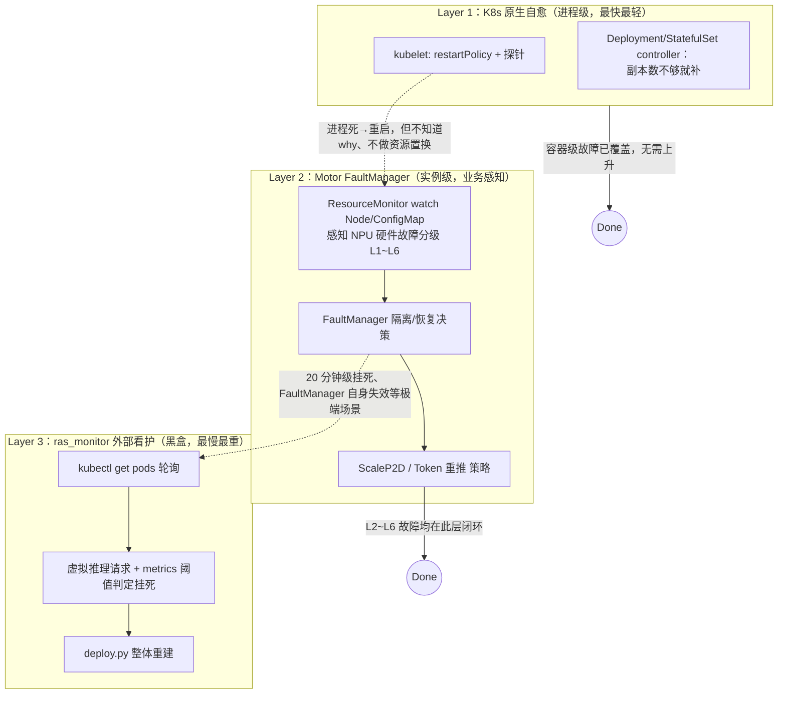
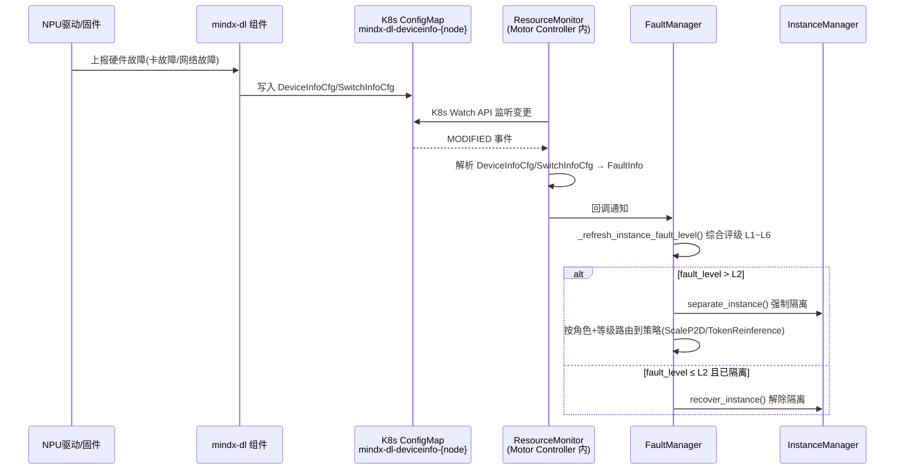
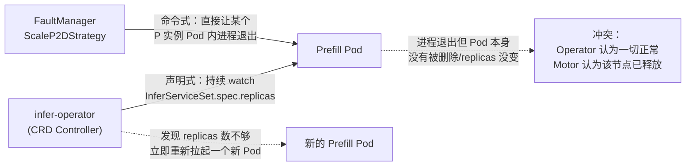

# 专题 13：MindIE-PyMotor 的 RAS 能力与 K8s 关系——面试官视角问答

> 承接 [12-K8s基础探针与Pod专题](12-K8s基础探针与Pod专题.md)：那一篇讲的是"K8s 原生能力本身怎么用"（探针、Pod、调度），本篇聚焦一个更进一步的问题——**MindIE-PyMotor 的 RAS（Reliability, Availability, Serviceability，可靠性/可用性/可服务性）能力，到底是"用 K8s 做的"还是"绕开 K8s 自己做的"，两者具体是什么分工关系**。这是理解"为什么一个推理框架要在 K8s 之上再造一层故障管理"的关键问题，也是容易被面试官追问"K8s 自己不是有健康检查和自愈吗，为什么还要自己写"的地方。
>
> 代码与文档均在本工作区核实：`MindIE-PyMotor/docs/zh/design/fault_tolerance/{overview,fault_manager,scale_p2d}.md`；`MindIE-PyMotor/motor/controller/fault_tolerance/`；`MindIE-PyMotor/motor/controller/fault_tolerance/k8s/{resource_monitor,configmap_parser,k8s_client}.py`；外部看护脚本 `MindIE-PyMotor/examples/features/fault_tolerance/ras_monitor/{ras_monitor.py,readme.md}`；配置文档 `MindIE-PyMotor/docs/zh/user_guide/deployment/k8s/config_reference.md`。

---

## 0. 一句话结论（面试开口先说这句）

> "K8s 原生的可靠性原语（`restartPolicy`、探针、`ReplicaSet`/`StatefulSet` 控制器）只能感知'容器进程死没死'这个粗粒度信号，既看不到 NPU 硬件故障的精细分级，也不知道'这是 Prefill 还是 Decode、坏了该不该做资源置换'这类业务语义。所以 MindIE-PyMotor 的 RAS 能力实际上是**在 K8s 之上叠了两层**：一层是 Controller 里常驻的 `FaultManager`，反过来**主动调用 K8s API**（watch Node、watch ConfigMap、反查 Pod-Node 映射）拿到硬件故障信号，做实例级的隔离/恢复/ScaleP2D/token 重推，这一层比 K8s 原生自愈更细粒度、更快、代价更低；另一层是完全在 K8s 之外的 `ras_monitor.py`，只用 `kubectl` 查询 Pod 状态、拿业务侧的推理请求做黑盒探活，作为前两层都失效时的最后兜底，代价是最重的——整个服务删了重新 `deploy.py` 拉起。这三层是**能力递进、代价递增**的关系，而不是互相替代。"



---

## 1. 先明确概念：RAS 是什么，为什么推理框架要单独做

**面试官**：RAS 具体指什么？为什么不直接依赖 K8s 的健康检查加 `restartPolicy: Always`？

**参考答案**：RAS = **Reliability（可靠性）+ Availability（可用性）+ Serviceability（可服务性）**，是电信/存储等基础设施领域的老概念，核心诉求是"故障发生时，尽量少丢流量、尽快恢复、恢复代价尽量小"。

K8s 原生自愈（`restartPolicy` + 探针 + 控制器补齐副本数）能覆盖的是**"容器活着还是死了"**这个二元信号；但大模型分布式推理的故障场景要复杂得多：

| 故障场景 | K8s 原生视角 | 业务实际需要的动作 |
|---|---|---|
| 某张 NPU 卡出现瞬时链路抖动（L2） | 容器进程还在跑，探针大概率还是绿的，K8s **完全无感** | 只重推受影响的几个 token，不该重启任何容器 |
| Decode 实例某几张卡需要隔离（L4+） | 只要容器没死、探针没连续失败，K8s 不会有动作 | 需要**跨实例**做资源置换（缩 P 保 D），这已经超出单个 Pod 的范畴 |
| Node 变为 NotReady | K8s 会打 Taint，`tolerationSeconds` 到期后驱逐重建 Pod | 但重建后的新 Pod 要重新向 Controller 注册、拿到正确的 `instance_id`/`ranktable`，这是**业务协议层**的事，K8s 不管 |
| 引擎进程还活着但推理请求全部超时（软件挂死） | 如果探针只测端口/简单 HTTP，可能长期"探测通过"却测不出真实挂死 | 需要业务级的"虚拟推理请求"才能测出来 |

**结论**：K8s 提供的是通用的"进程存活"原语，MindIE-PyMotor 的 RAS 能力要解决的是"NPU 硬件故障怎么分级处理"+"多 Pod 组成的一个推理实例怎么整体恢复"+"P/D 之间怎么做资源置换"这类业务语义问题，这些是 K8s 设计上就不该管、也管不了的部分——**RAS 能力的本质是在 K8s 通用可靠性原语之上叠加一层业务感知的调度智能**。

---

## 2. RAS 三层能力与 K8s 的具体交互方式

### 2.1 Layer 1：K8s 原生自愈——RAS 的地基，但只解决"重启"

这一层完全是 K8s 自带能力，Motor 不需要写任何代码：

- **kubelet 按 `restartPolicy` 重启容器**：容器异常退出，kubelet 直接原地重启（不换 Pod IP、不重新调度）。
- **探针驱动的重启/摘流量**：见 [专题 12](12-K8s基础探针与Pod专题.md#4-探针probestartup--readiness--liveness-三兄弟)，Liveness 探针连续失败触发容器重启。
- **`StatefulSet`/`Deployment` 控制器补齐副本数**：Pod 被彻底杀掉（比如所在 Node 被驱逐），控制器发现"实际副本数 < 期望副本数"，在其他可用 Node 上重新调度一个新 Pod。

**这一层恰好是"自动重拉起注册"能力的前置条件**：

```70:105:MindIE-PyMotor/docs/zh/design/fault_tolerance/overview.md
Pod 因故障被 K8s 重启
        │
        ▼
NodeManager 启动，EngineManager._register() 发送 RegisterMsg 到 Controller
        │
        ▼
Controller InstanceAssembler.register()
  ...
        ▼
NodeManager 接收 StartCmdMsg
  - Daemon.pull_engine(): 启动 engine_server 推理进程
  - HeartbeatManager.start(): 开始心跳上报
        ▼
InstanceManager 收到心跳 → 状态机: INITIAL → ACTIVE
实例恢复正常服务
```

这条链路第一步"Pod 因故障被 K8s 重启"完全依赖 K8s 原生机制（kubelet 重启容器，或控制器重新调度 Pod）；从第二步开始才是 Motor 自己的业务协议（NodeManager 重新注册 → Controller 重新组装实例 → 下发启动指令）。**换句话说：K8s 负责"把进程重新跑起来"，Motor 负责"让这个新进程重新变回集群里正确的那个角色"**——这正是"K8s 通用能力 + 业务框架专属协议"分层协作的典型例子。

### 2.2 Layer 2：FaultManager——RAS 的核心，反向调用 K8s API 做精细化决策

这一层是 RAS 能力的主体，运行在 Controller 进程内部，**主动**去 watch K8s 资源，而不是被动等 K8s 通知：



**这一层用到的 K8s 能力具体是三个 API，全部封装在 `motor/controller/fault_tolerance/k8s/` 目录下**：

| K8s 能力 | 对应代码 | 用途 |
|---|---|---|
| **Node Watch API** | `resource_monitor.py: _monitor_node()` | 监听 Node 的 `Ready` Condition，变为 `NotReady` 时注入 `NODE_REBOOT` 故障（L6） |
| **ConfigMap Watch API** | `resource_monitor.py: _monitor_configmap()` | 监听 `mindx-dl-deviceinfo-{node_name}` ConfigMap（由华为 MindX DL 设备插件写入），解析出 NPU 卡故障/网络故障/交换机故障 |
| **Pod 反查 Node** | `k8s_client.py: get_node_hostname_by_pod_ip()` | 按 `field_selector=status.podIP=xxx` 查询 Pod 所在 Node，用于故障定位和 ScaleP2D 里的节点所有权交换 |

值得展开的实现细节——**Watch 连接的健壮性设计**，这是"生产级 K8s Watch 客户端应该怎么写"的一个很好的范例：

```172:245:MindIE-PyMotor/motor/controller/fault_tolerance/k8s/resource_monitor.py
def _monitor_node(self) -> None:
    resource_version = None
    consecutive_failures = 0
    while not self.stop_event.is_set():
        try:
            if resource_version is None:
                nodes = self.v1.list_node(field_selector=f"metadata.name={node_name}")
                if nodes.items:
                    resource_version = nodes.metadata.resource_version
                    self._handle_node_change("ADDED", nodes.items[0])  # 立即处理当前状态
            w = watch.Watch()
            for event in w.stream(self.v1.list_node, resource_version=resource_version, ...):
                ...
        except ApiException as e:
            if e.status == 410:
                resource_version = None  # resourceVersion 过期，需要重新 LIST
            delay = self._compute_backoff(consecutive_failures, is_410=(e.status == 410))
            time.sleep(delay)
            consecutive_failures += 1
```

三个值得记住的设计点（面试如果被问"你写过 K8s Watch 客户端吗，要注意什么"可以直接抄这个模型回答）：

1. **先 List 再 Watch，且立即处理一次当前状态**——因为 K8s Watch 语义是"只推送 `resourceVersion` **之后**的增量事件"，如果不先处理一次 List 到的当前状态，会漏掉"Watch 建立前就已经存在的故障"。
2. **`HTTP 410 Gone` 的专门处理**——K8s apiserver 的 Watch 连接底层基于 etcd 的历史版本窗口，`resourceVersion` 太旧会被 apiserver 主动断开并返回 410，这不是"错误"而是**协议内正常事件**，需要专门识别、重新发起一次 List 拿到新的 `resourceVersion`，而不是当成普通异常做统一重试。
3. **指数退避 + 重连成功后重置计数**——避免 apiserver 抖动/重启期间大量客户端同时疯狂重连造成"惊群效应"。

**ConfigMap 里的故障信息具体长什么样、怎么被解析成分级故障**，可以对照 `configmap_parser.py` 里的字段结构：ConfigMap 由华为的 MindX DL 组件写入 `DeviceInfoCfg`（NPU 卡级故障）和 `SwitchInfoCfg`（交换机级故障）两类 JSON，`process_device_info`/`process_switch_info` 分别解析出 `fault_code`（十六进制故障码）和 `fault_level` 字符串（如 `RestartRequest`/`SeparateNPU`），再经 `map_fault_level()` 映射为 PyMotor 内部统一的 `FaultLevel`（L1~L6）。**这一整条链路的本质是：把 K8s 之外的硬件监控系统（MindX DL）的信息，通过 K8s ConfigMap 这个"通用配置分发/变更通知机制"搭便车传递给 Motor**——K8s 在这里被当成了一个跨组件的、自带 Watch 能力的消息总线，而不仅仅是配置存储。

**FaultManager 拿到分级故障后的动作，和 K8s 原生自愈完全不是一个数量级**：

- **L2（可自愈）**：只触发 `TokenReinferenceStrategy`，只重推受影响的 token，**不重启任何容器、不惊动 K8s**。
- **L4~L6（需要隔离/资源不足）**：触发 `ScaleP2DStrategy`——通过 `NodeManagerApiClient.stop()` 主动对若干 Prefill 实例的 NodeManager 发 HTTP 请求让它自己优雅退出，而不是找 K8s 去 `kubectl delete pod`；释放出来的物理节点由**新的 Decode 实例走"自动重拉起注册"流程**认领（这一步又要借助 Layer 1 的 Pod 重建机制）。

**关键认知**：Layer 2 并没有绕开 K8s，而是选择性地使用 K8s 能力——**读（Watch Node/ConfigMap、查 Pod）用 K8s 原生 API，写（让某个实例停止）走自己的业务 HTTP 协议而不是 `kubectl delete`**，这是因为"优雅停止"需要业务层面做"先通知 Coordinator 停止调度新请求、等在途请求完成"这类逻辑（参考专题 12 里 `prestop.sh` 的做法），直接粗暴删 Pod 拿不到这个语义。

### 2.3 Layer 3：ras_monitor.py——K8s 之外的黑盒兜底

这是三层里和 K8s 耦合最浅的一层，本质是一个**独立运行的外部看护脚本**（不在 Controller/NodeManager 进程内，需要用户单独 `nohup` 启动），设计目标是覆盖前两层都覆盖不到的场景：

```1:11:MindIE-PyMotor/examples/features/fault_tolerance/ras_monitor/readme.md
出于PD实例可靠性增强的目的，MindIE-pyMotor 提供一个参考脚本 ras_monitor 进行大EP服务的健康状态监控和快速重启，ras_monitor 启动后，当软件故障发生导致服务不可用时，该脚本20分钟左右可检测到并启动自动重拉。
适用范围说明：
- 适用场景：大EP出现挂死等服务不可用且不可自恢复的场景
```

它和 K8s 的交互方式极其"轻量"、完全是命令行黑盒调用，不使用 Python K8s client、不 watch 任何资源：

```99:101:MindIE-PyMotor/examples/features/fault_tolerance/ras_monitor/ras_monitor.py
def kubectl_get_pods_info():
    result = subprocess.run(
        [shutil.which("kubectl"), "get", "pods", "-A", "-owide"], capture_output=True, text=True, check=True
    )
```

主循环逻辑是"定期发一个虚拟推理请求 + 看 Prometheus 风格的 `request_success_total` 指标是否符合预期"，判定服务挂死后调用 `restart_service()`：

```330:344:MindIE-PyMotor/examples/features/fault_tolerance/ras_monitor/ras_monitor.py
def restart_service(namespace: str, boot_args):
    logging.info("Start to retain logs and restart service")
    ...
    # restart service
    ... 调用 deploy.py 重新部署 ...
```

**为什么要有这样一层看似"简陋"的兜底**：Layer 2 的 FaultManager 覆盖的是"能被硬件驱动/固件感知到、能通过 ConfigMap 上报的故障"以及"vLLM EngineCore 能通过 ZMQ 主动上报的软件故障"；但如果整个 Controller 进程自己卡死、或者故障模式压根没有被驱动层感知到（比如纯软件死锁、没有触发任何硬件故障码），Layer 2 会**完全失效且不自知**。`ras_monitor.py` 故意设计成一个**完全独立、外部、只依赖最基础的 `kubectl` + HTTP 探活**的进程，恰恰是为了避免自己也依赖 Motor 内部状态而"和 Motor 一起挂掉却察觉不到"——这是分布式系统里"看门狗要比被看的对象更简单、更独立"的经典设计原则。代价是它的检测周期是"20 分钟级"、恢复手段是最重的"整个服务删了重新 `deploy.py` 拉起"，符合"越兜底的层，代价可以越重但必须越可靠"的分层设计哲学。

---

## 3. 一个关键矛盾：RAS 能力与 CRD 部署模式目前互斥

**面试官**：你们的 K8s 部署有两种模式（CRD 方式 vs 传统多 YAML），RAS 能力在两种模式下都能用吗？

**参考答案**：**不能，这是当前架构一个明确记录在文档里的限制**——RAS 能力目前只支持 `multi_deployment`（传统多 YAML）部署模式，`infer_service_set`（CRD 方式，且是默认模式）尚未完成 RAS 能力的适配验证：

```46:46:MindIE-PyMotor/docs/zh/user_guide/deployment/k8s/config_reference.md
| deploy_mode | string | 部署方式...CRD 方式尚未完成 RAS 能力与池化能力的适配验证；若需 RAS（可靠性、可用性、可服务性）或 KV 池化能力，请设置为 `multi_deployment` |
```

**为什么会有这个限制？（面试官大概率会追问原因，这里给出基于架构设计的合理推断）**

核心矛盾在于：**FaultManager 的 ScaleP2D 等策略，是直接绕过"声明式期望状态"、命令式地对某个实例发号施令（调 `NodeManagerApiClient.stop()` 让 Pod 内进程自己退出）**；而 CRD 模式下，Pod 的存在性和数量是由 InferServiceSet 的 `spec.replicas` 决定、由 infer-operator 的 reconcile 循环持续"纠正"回期望状态的。这就会产生**两个控制回路互相打架**的经典问题：



如果在 `multi_deployment` 模式下，Prefill/Decode 的每个角色都是一个独立的 `Deployment`/`StatefulSet` YAML，**Motor 自己的 `deploy.py` 拥有对这些原生资源的完全控制权**（想缩容就改 YAML 里的 replicas 数再 apply，不会有第三方控制器抢着"纠正"）；而在 `infer_service_set` 模式下，这部分控制权被移交给了 infer-operator，Motor 的 FaultManager 如果继续用"直接让进程退出"这种旁路手段，就会和 CRD controller 的调谐循环产生状态不一致——这正是**"谁才是这个资源的唯一 owner（controller）"**这个 K8s 声明式系统设计中的核心原则（single writer principle）被打破的场景。要在 CRD 模式下支持 RAS，理论上需要让 ScaleP2D 这类策略也改为"修改 InferServiceSet.spec"而不是直接操作 Pod/进程，把恢复动作也纳入 CRD 的声明式语义里——这也是文档里"尚未完成适配验证"的合理技术原因。

**这个矛盾点非常适合作为面试的加分项来讲**：它体现了对"声明式系统里，多个控制器同时管理同一份资源会冲突"这一 K8s 设计核心原则的理解，而不是只会背"CRD 就是自定义资源"这种表面概念。

---

## 4. 全景对照表：三层 RAS 能力 × K8s 交互方式

| 维度 | Layer 1：K8s 原生自愈 | Layer 2：FaultManager | Layer 3：ras_monitor |
|---|---|---|---|
| 运行位置 | K8s 控制平面 + kubelet（集群内置组件） | Controller 进程内常驻线程 | 独立于 Motor 之外的外部脚本 |
| 感知的故障粒度 | 容器存活/端口探测（二元） | NPU 硬件故障 L1~L6 分级 + 软件故障（ZMQ 上报） | 业务级请求成功率/耗时指标 |
| 与 K8s 的交互方式 | 就是 K8s 自身 | **主动** Watch Node/ConfigMap（读）+ 业务 HTTP 协议（写，不走 kubectl） | 只用 `kubectl get pods` 查询（读），恢复靠重新 `deploy.py` apply（写） |
| 典型恢复动作 | 重启容器 / 重新调度 Pod | Token 重推（无感）/ ScaleP2D（跨实例资源置换） | 删除并整体重新拉起服务 |
| 检测时延 | 秒级（探针周期） | 秒级（ConfigMap Watch 是事件驱动，近实时） | 分钟级（约 20 分钟） |
| 恢复代价 | 低（只重启一个容器） | 中（可能停掉若干 P 实例做资源置换） | 高（整个服务重建，业务完全中断一段时间） |
| 对部署模式的依赖 | 两种模式都支持（K8s 通用能力） | **仅 `multi_deployment` 支持**，CRD 模式未适配 | 两种模式都可用（只依赖 kubectl + deploy.py，与部署模式解耦） |

---

## 5. 面试速答清单

| 问题 | 一句话答案 |
|---|---|
| MindIE-PyMotor 的 RAS 能力算不算"重复造 K8s 的轮子" | 不算，K8s 只感知容器存活这一种粗粒度信号，RAS 要处理的是 NPU 硬件故障分级、P/D 跨实例资源置换这类业务语义，K8s 设计上就不该管这些 |
| FaultManager 怎么拿到硬件故障信息 | 不是等 K8s 通知，而是主动用 K8s Watch API 监听 `mindx-dl-deviceinfo-{node}` ConfigMap（硬件监控组件写入）和 Node Ready 状态 |
| ScaleP2D 恢复时是调用 `kubectl delete pod` 吗 | 不是，是通过业务自定义的 HTTP 协议（`NodeManagerApiClient.stop()`）让目标 Pod 内的进程自己优雅退出，保留了"通知下游、等在途请求完成"的语义 |
| K8s Watch 出现 410 Gone 怎么处理 | 这是 `resourceVersion` 过期的正常协议行为（不是错误），需要重新发起一次 List 拿新的 `resourceVersion`，不能当普通异常无脑重试 |
| 为什么还要有 `ras_monitor.py` 这层看似简陋的兜底 | 覆盖 FaultManager 依赖的硬件驱动/ZMQ 上报都感知不到的"纯软件挂死"场景；看门狗要比被看对象更独立简单，避免自己也跟着挂掉却不自知 |
| RAS 能力两种部署模式都支持吗 | 不支持，目前只有 `multi_deployment`（传统多 YAML）支持，`infer_service_set`（CRD，默认模式）尚未适配——本质是"谁拥有资源调谐权"的单一 owner 原则冲突 |

---

## 延伸阅读

- 三层 RAS 的第二层细节：[FaultManager 设计文档](../../MindIE-PyMotor/docs/zh/design/fault_tolerance/fault_manager.md)、[ScaleP2D 特性文档](../../MindIE-PyMotor/docs/zh/design/fault_tolerance/scale_p2d.md)
- K8s 基础与探针/Pod：[专题 12](12-K8s基础探针与Pod专题.md)
- MindIE 并行与调度调优（"实例内"视角，与本篇"实例间"高可用视角互补）：[专题 09](../interview-review/09-MindIE并行策略与调度调优专题.md)
