# KV 池化完整综述：从引擎本地缓存到跨实例共享内存层

> 调研日期：2026-07-12  
> 本地源码：`vllm/`、`sglang/`、`Mooncake/`、`MindIE-PyMotor/`  
> 外部项目：LMCache、NVIDIA Dynamo/KVBM、llm-d、AIBrix  
> 目标：用统一模型解释“KV 池化是什么、各框架怎么做、Motor 做了什么与没做什么”。

---

## 0. 先给结论

1. **KV 池化不是单一功能**，而是一组能力的组合：
   - GPU 内 Automatic Prefix Caching（APC）；
   - GPU → CPU/SSD 的分层卸载；
   - 跨进程、跨节点共享 KV Store；
   - P→D 单次请求 KV 直传；
   - KV Events 全局索引与 cache-aware routing。
2. **池化管“KV 存在哪、怎么升降层”**；**亲和调度管“请求去哪”**；**PD 传输管“这一次请求的 KV 怎么从 P 搬到 D”**。三者正交，但组合后收益最大。
3. **vLLM 是标准接口层**：实现 GPU BlockPool、Connector 生命周期及内置 OffloadingConnector；Mooncake、LMCache 等外部系统实现共享池。
4. **SGLang HiCache 是引擎内生分层最完整的实现**：L1 GPU、L2 Host、L3 pluggable storage 共用 HiRadixTree，并提供预取、逐层 load-back 和 write-through。
5. **Mooncake 是共享 KV 池底座**：Store 管对象、副本、租约与淘汰；Transfer Engine 搬数据；Conductor 维护前缀索引。三者不要混为一谈。
6. **LMCache 和 Dynamo/KVBM 都试图把 KV 变成独立基础设施**：前者强调引擎中立、持久化和独立 daemon；后者强调统一内存 API 与 NIXL 数据面。
7. **llm-d 和 AIBrix 更偏云原生平台层**：既管理路由索引，也编排引擎侧 offload/store；它们不是单一 KV Store。
8. **Motor 的准确边界是集成与编排**：Motor 负责部署 Mooncake Master、注入 MultiConnector、选择 P/D 路由、调用 Conductor 做亲和调度及采集指标；真正的 `lookup/load/save` 在 vLLM-Ascend Connector，池内部实现在 Mooncake。

---

## 1. 统一概念：先把五件事拆开

### 1.1 GPU 本地 APC

APC（Automatic Prefix Caching）把已计算的 KV block 留在当前推理实例 GPU 中。新请求若拥有相同 token block 前缀，可以跳过相应 prefill。

```text
block_hash_i = H(parent_hash, block_token_ids, extra_keys)
```

它解决的是**同一实例内**的前缀复用：

- 优点：命中后无网络传输，收益最高；
- 缺点：容量受 HBM 限制；扩成 N 个实例后，缓存天然分片；
- 普通 round-robin 下，请求命中“上次计算该前缀的实例”的概率近似降到 `1/N`。

vLLM 主要代码：

- `vllm/v1/core/block_pool.py`
- `vllm/v1/core/kv_cache_manager.py`
- `vllm/v1/core/kv_cache_utils.py`

### 1.2 分层卸载（tiered offloading）

把 GPU 中暂时不用但可能复用的 KV 放到更大、更慢、更便宜的介质：

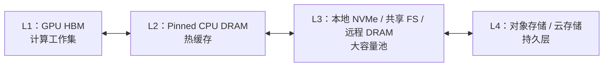

这主要扩大 **KV working set**：被 GPU 驱逐不等于丢弃，下次命中时再提升回 GPU。

### 1.3 跨实例共享 KV 池

多个引擎实例通过相同 key 访问同一份外部 KV：

```text
Engine A 生成前缀 KV → Shared Store
Engine B 收到相同前缀 → lookup → load → 跳过重复 prefill
```

共享池需要解决：

- 稳定 key：模型、tokenizer、block size、KV layout、并行配置必须兼容；
- 元数据：key 在哪一层、哪台机器、是否完整；
- 并发：同 key 并发写、读写竞态、正在传输时防驱逐；
- 生命周期：租约、pin、淘汰、promotion、failure recovery；
- 数据面：GPU↔CPU、RDMA、NVMe/GDS、文件系统和对象存储。

### 1.4 PD KV 传输

PD 分离中，Prefill 计算出的 KV 必须交给 Decode。它通常是一次请求的一次性 P→D 传输：

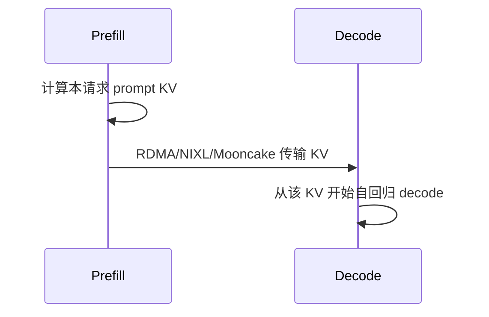

PD 传输和共享池不是一回事：

- PD 直传追求低延迟、明确的生产者与消费者；
- 共享池追求跨请求复用、容量与生命周期管理；
- MultiConnector 可以让同一份 KV **一边传给 D，一边写入共享池**。

### 1.5 KV Events 与亲和路由

引擎发出 `BlockStored`、`BlockRemoved`、`AllBlocksCleared` 等事件，外部 Indexer 据此维护“哪些实例/层持有哪些 block”。

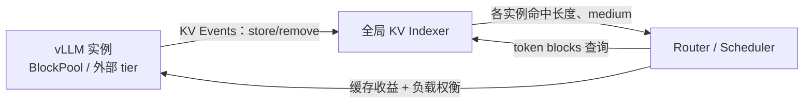

KV Events 本身不存 KV，也不搬 KV；它是**缓存真值的元数据流**。

---

## 2. 什么时候池化才有收益：成本模型

命中外部 KV 并不必然优于重算。最基本的判断是：

\[
T_{load}(L, medium) + T_{schedule} < T_{prefill}(L)
\]

其中：

- `L`：可复用的前缀 token 数；
- `T_load`：查元数据、分配 GPU block、传输和布局转换时间；
- `T_prefill`：重新执行 attention/MLP 的时间；
- `medium`：CPU、远程 DRAM、SSD、对象存储的传输代价完全不同。

更完整的期望收益：

\[
E[saving] = P_{reuse} \times (T_{prefill} - T_{load}) - T_{store} - C_{memory}
\]

所以池化最适合：

- 长 system prompt、tools schema、RAG 文档；
- 多轮对话和 Agent 工作负载；
- 前缀重复率高、GPU KV 容量不足；
- Prefill 计算昂贵，而网络/存储带宽足够；
- 扩缩容后仍希望新实例复用旧缓存。

收益较差的场景：

- 短 prompt 或低复用；
- 每次 prompt 尾部变化导致整块边界频繁失配；
- 远程存储读取比重算更慢；
- tokenizer、模型、并行布局或 hash seed 不一致；
- 大并发下 L3 读带宽成为新的共享瓶颈。

### 2.1 关键指标

- GPU/CPU/L3 各层命中 token 数与命中率；
- lookup、load、store、promotion 延迟；
- 外部 load 带宽与队列深度；
- 被驱逐后再次命中的比例；
- TTFT、ITL/TBT、吞吐；
- 重算 token 数；
- 池占用、水位、淘汰量、lease 过期量；
- 假命中：索引说有，但实际数据已失效或读取失败。

---

## 3. vLLM：GPU BlockPool + Connector 标准接口

### 3.1 架构边界

准确说法不是“vLLM 不做池”，而是：

- vLLM 核心实现 GPU 本地 `BlockPool`；
- vLLM 定义外部 KV Connector 的调度/执行生命周期；
- vLLM 已内置 CPU/多级 `OffloadingConnector`；
- Mooncake、LMCache、FlexKV、HF3FS 等共享系统通过 Connector 接入。

核心路径：

- `vllm/distributed/kv_transfer/kv_connector/v1/base.py`
- `vllm/distributed/kv_transfer/kv_connector/factory.py`
- `vllm/v1/core/sched/scheduler.py`
- `vllm/v1/worker/kv_connector_model_runner_mixin.py`
- `vllm/v1/kv_offload/`

### 3.2 Scheduler / Worker 双侧生命周期

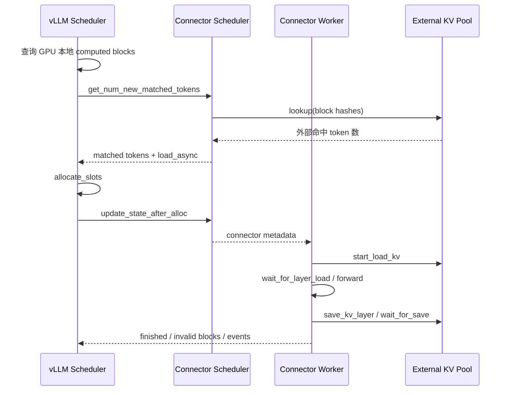

重要语义：

- 本地 GPU hit 先算，Connector 只处理本地未命中部分；
- async load 时请求进入 `WAITING_FOR_REMOTE_KVS`；
- 外部 load 成功后才把 block 正式加入 GPU prefix cache；
- 异步 save 未结束时，Scheduler 延迟释放原 GPU blocks，避免数据被覆盖；
- load 失败可以配置 `fail` 或 `recompute`。

### 3.3 MultiConnector

MultiConnector 的核心语义：

- **Load：按配置顺序，第一个有匹配 token 的子 Connector 负责加载**；
- **Save：所有子 Connector 都保存**；
- 未选中的 Connector 在分配阶段通常收到空 block；
- 多后端保存不是跨 Connector 原子事务。

因此可以组合：

```text
[0] MooncakeConnector       → P→D 直传
[1] MooncakeStoreConnector  → 跨请求共享池
```

### 3.4 vLLM 内置 OffloadingConnector

当前实现支持：

- CPU primary tier：Pinned Host Memory；
- secondary tiers：FS、Object Store、P2P；
- GPU↔CPU 通过异步 DMA；
- secondary tier 必须经 CPU staging，不能直接访问 GPU；
- CPU 层支持 LRU/ARC；
- 默认可只 offload prompt blocks；
- 支持请求级 `max_offload_tokens`；
- FS/OBJ 可发布带 `medium` 的 KV Events。

这是 vLLM 从“Connector 规范”走向“引擎内生分层池”的重要演进。

### 3.5 评价

优势：

- Connector API 已成为外部 KV 系统的事实集成面；
- Scheduler 明确知道 external hit，能正确分配和等待；
- 失败重算、异步 free、layerwise hooks 较完整；
- 内置 offload 减少对第三方依赖。

限制：

- 跨节点 Store 的副本、租约和 HA 仍由外部系统负责；
- MultiConnector 的多个保存目标无统一事务；
- 不同 Connector 的 layout、block/hash 配置必须严格兼容；
- FS 跨进程共享要求一致的 hash seed 和运行配置。

---

## 4. SGLang：HiCache 引擎内生三级缓存

### 4.1 核心结构

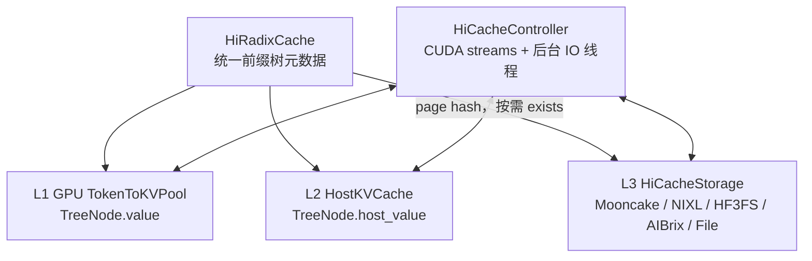

核心文件：

- `sglang/python/sglang/srt/mem_cache/hiradix_cache.py`
- `sglang/python/sglang/srt/mem_cache/radix_cache.py`
- `sglang/python/sglang/srt/managers/cache_controller.py`
- `sglang/python/sglang/srt/mem_cache/hicache_storage.py`
- `sglang/python/sglang/srt/mem_cache/storage/backend_factory.py`

### 4.2 L1/L2/L3 元数据

- L1：GPU token indices，`TreeNode.value`；
- L2：Host indices，`TreeNode.host_value`；
- L3：本地树不保存远端地址，只保存 page hash，命中时调用 `batch_exists`；
- L3 key 是链式 page hash；
- radix node 可跨多个 page，I/O 以 page 为主。

### 4.3 数据流

请求入队时：

1. 先查 L1/L2 前缀树；
2. 若开启 L3，Scheduler 可触发预取；
3. 后台线程 `batch_exists`，命中后 L3→L2；
4. 调度时 L2→L1，支持按 layer 在独立 CUDA stream 上加载；
5. prefill 计算与逐层 load-back 尽量重叠。

写入策略：

- `write_through`：首次命中/生成即备份；
- `write_through_selective`：默认达到命中阈值再备份；
- `write_back`：淘汰时才写，代码中已标记趋向废弃；
- L1→L2 完成后，再由后台线程 L2→L3。

### 4.4 L3 后端与 PD

内置/注册后端包括：

- Mooncake；
- NIXL；
- HF3FS；
- AIBrix；
- File；
- EIC、SiMM、Mori 等；
- dynamic backend。

PD 传输与 HiCache L3 是两条路径：

- PD：Prefill→Decode 实时传输；
- HiCache L3：跨请求共享存储；
- 当协议和设备匹配时，MooncakeStore 可复用同一进程的 Mooncake TransferEngine，减少重复注册和 RDMA 资源。

### 4.5 评价

优势：

- 前缀树和三级缓存统一在引擎内部，调度器能直接控制预取和 load-back；
- 逐层加载与计算 overlap；
- 后端工厂和零拷贝 page API 较完整；
- 对 Decode HiCache、Hybrid KV 类型已有扩展。

限制：

- L3 不在本地树保存完整地址元数据，跨实例一致性依赖后端；
- TP/PP/CP 的 all-reduce 次序严格，错误跳过可能死锁；
- Host 容量需大于 Device，预取和 staging 会争用 Host pool；
- 不同 attention/hybrid/draft 路径的 L3 支持仍不完全一致；
- Gateway cache-aware 路由默认仍是近似树，并不知道 HiCache L2/L3 的真实状态。

---

## 5. Mooncake：Store、Transfer Engine、Conductor 三层

### 5.1 三者边界

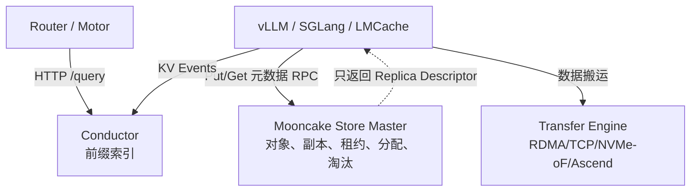

- **Conductor**：回答“哪些实例/medium 持有最长前缀”；
- **Store Master**：回答“对象有哪些副本、分配到哪些 Segment、是否完整”；
- **Transfer Engine**：按 descriptor 真正搬字节。

Conductor 不在 Store Put/Get 数据路径上；Master 不搬大块 KV 数据。

### 5.2 Store 对象模型

- Object → Replicas；
- Replica 类型包括 MEMORY、NOF_SSD、DISK、LOCAL_DISK；
- Segment 是节点贡献给池的内存/存储区域；
- `ReplicateConfig` 控制内存/NoF 副本数、preferred segment、soft/hard pin；
- lease 防止读/传输期间对象被驱逐；
- group 可合并 lease 与驱逐行为。

### 5.3 Put / Get

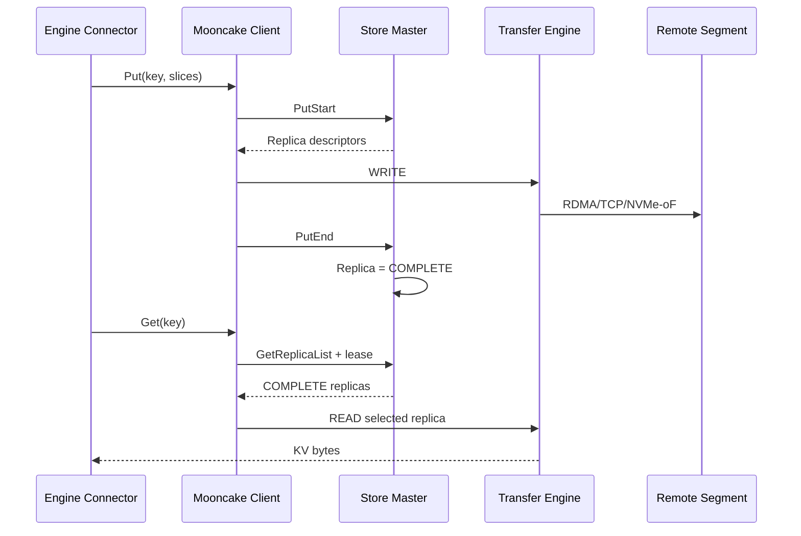

两阶段 Put 的意义：Get 只看 `COMPLETE` 副本，不读半写数据。

### 5.4 淘汰、分层与 HA

- 达到高水位后后台批量淘汰；
- hard lease、hard pin、busy replica 不可淘汰；
- soft pin 调低淘汰优先级；
- 可配置内存淘汰前 offload 到 SSD；
- SSD hit 可 promotion 回 RAM；
- Master 可通过 etcd/Redis/Kubernetes 做 leader 选举；
- snapshot/oplog/hot standby 用于恢复；
- Segment 支持 draining 和优雅下线。

### 5.5 评价

Mooncake 的优势是“控制面/数据面彻底分离 + 多传输后端 + Store 对象生命周期完整”。它更像 KV 专用分布式存储，而不是某个引擎内部的缓存插件。

需要注意：

- Conductor 开源状态和版本可能独立于 Store 主仓；
- P2PHANDSHAKE 是 Transfer Engine 元数据模式，不等于不需要 Store Master；
- Motor 当前部署未完整暴露 Mooncake 的多副本和多 Master 能力。

---

## 6. LMCache：引擎中立的独立 KV Cache 层

### 6.1 架构

LMCache 把 KV 从临时 GPU 状态变成可持久、可共享、可管理的对象：

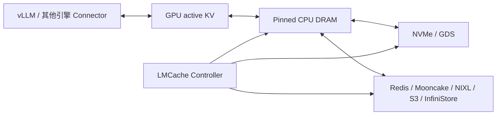

核心能力：

- 默认以 chunk（文档常见默认 256 token）建立 token database；
- `MemoryObj` + 自定义 pinned allocator；
- NUMA-aware CPU 分配；
- 异步 store/load；
- remote backend 插件；
- Controller 提供 lookup、clear、move、pin/unpin、compress/decompress。

### 6.2 Storage 与 Transport 两种模式

- Storage Mode：跨请求、跨会话持久化和复用；
- Transport Mode：PD 分离时实时 P→D 传输；
- 同一个项目覆盖两种模式，但逻辑目标不同。

### 6.3 2026 MP daemon 架构

MP 模式把 LMCache 运行成独立服务：

- 每节点一个 daemon 可服务多个 vLLM 实例；
- 引擎崩溃不带走 CPU/NVMe KV；
- L1 可为 CPU DRAM 或 GDS NVMe slab；
- L2 由 NIXL 适配 POSIX、GDS、HF3FS 等；
- `StorageManager` 下有 Store、Prefetch、Eviction Controller；
- vLLM 通过 `LMCacheMPConnector`/ZMQ 连接。

### 6.4 评价

优势：

- 引擎、硬件与后端中立；
- 独立进程隔离，生命周期不与引擎 fate-sharing；
- 存储、PD、控制 API 和可观测性覆盖广。

代价：

- 组件和部署复杂度高于 vLLM 原生 CPU offload；
- chunk 大小、layout 与引擎 block 的映射要额外管理；
- 远程后端收益强依赖网络、序列化和缓存复用率。

---

## 7. NVIDIA Dynamo/KVBM：统一内存 API + NIXL

### 7.1 三层架构

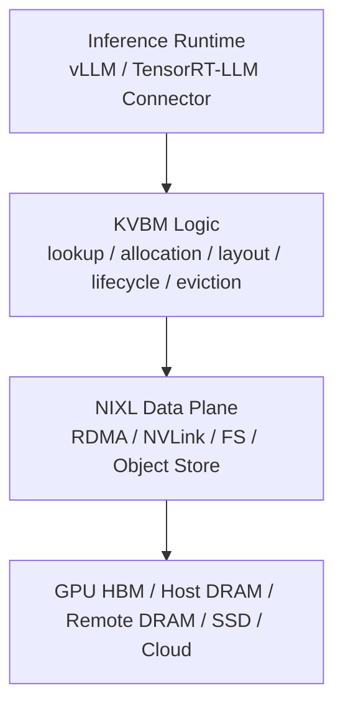

KVBM 的定位：

- 对推理引擎暴露统一 block memory API；
- 管理 allocate→register→match 生命周期；
- 作为 write-through cache；
- 标准化不同 runtime 的布局；
- 把传输与存储插件下沉到 NIXL。

### 7.2 分层

常用逻辑分层：

- G1：Device/HBM；
- G2：Pinned Host；
- G3：本地或池化 SSD；
- G4：远程文件、对象或云存储。

KV Router 可以按不同 medium 设置权重，把“命中多少”升级为“命中后搬运是否值得”。

### 7.3 评价

优势：

- 内存管理与传输协议统一；
- vLLM、TensorRT-LLM 可共享底层抽象；
- NIXL 插件覆盖 P2P、RDMA、文件和对象存储；
- 与 Dynamo 的分布式路由/PD 编排天然联动。

限制：

- 需要采用 Dynamo runtime 体系，集成面较大；
- 官方当前支持矩阵要按具体版本核对；截至本次调研，KVBM 页面明确支持 vLLM/TRT-LLM，SGLang KVBM 标为未支持；
- NIXL/KVBM 的调试和运维门槛高于纯文件系统 offload。

---

## 8. llm-d：云原生 KV 索引与 offload 组合平台

### 8.1 KVCache Indexer

llm-d 的 `llm-d-kv-cache` 提供：

- 订阅 vLLM KV Events；
- 按 endpoint 和 medium 维护全局 block locality；
- precise prefix scoring；
- 为 EPP（Endpoint Picker）提供 Pod 分数。

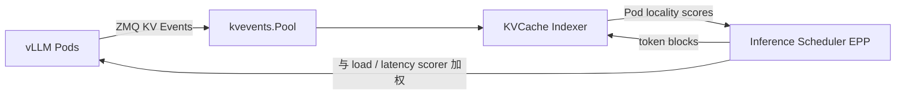

与 approximate prefix scorer 的区别：

- approximate：根据历史路由推测缓存；
- precise：根据引擎真实 store/remove 事件更新；
- block size、tokenizer 和 hash seed 必须与 vLLM 一致。

### 8.2 池数据面

llm-d 本身更像组合与产品化层：

- CPU offload 使用 vLLM native OffloadingConnector；
- 共享 FS/PVC 让多个 Pod 读写同一批 block files；
- 可组合 LMCache、Mooncake；
- PVC Evictor 管理磁盘水位；
- 原 `llmd-fs-backend` 已上游进入 vLLM `TieringOffloadingSpec` 的 FS tier，后续能力在 vLLM 维护。

### 8.3 评价

优势：

- Kubernetes Gateway/EPP 插件化，索引、负载、延迟可组合打分；
- precise 和 approximate 路由都可选；
- 与 vLLM 原生 offload 逐渐收敛，依赖更少；
- 共享 PVC 方案简单、持久、扩容新 Pod 可直接复用。

限制：

- 共享 FS 的性能上限由底层 Lustre/CephFS 等决定；
- 文件 key 兼容要求严格；
- EPP 索引和数据面由不同组件提供，需要跨组件观测与排障；
- 多 medium 的“命中收益”必须结合传输成本，而不能只按 block 数打分。

---

## 9. AIBrix：KVCache CRD + 自研数据面 + Gateway

### 9.1 三部分

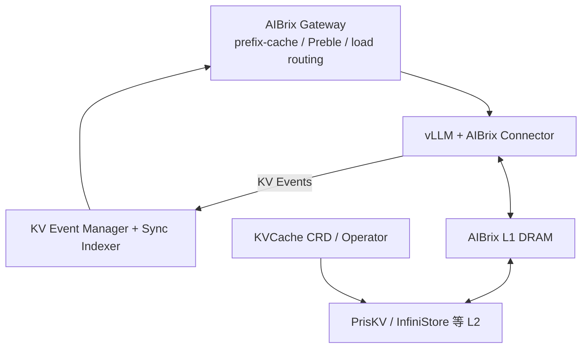

### 9.2 演进

- 早期：Vineyard 方案，通用 KV Store 语义不适合缓存生命周期；
- v0.3 左右：转向 InfiniStore/高性能 RDMA 后端，提供 LRU/S3FIFO 等；
- 当前版本：统一 `aibrix_kvcache` 数据面，L1 DRAM + pluggable L2，支持 PrisKV/InfiniStore、block-first layout；
- Connector 分同步/异步 offload 和 PD reuse；
- KVCache CRD 负责后端集群的 Kubernetes 编排。

### 9.3 KV Event Sync

Gateway 若要精确同步 vLLM 缓存状态，需要：

- vLLM 开启 ZMQ KV Events + replay；
- Gateway 开启 remote tokenizer；
- tokenization 与引擎保持一致；
- Event Manager 更新 Sync Prefix Cache Indexer；
- 路由策略再结合缓存命中与负载。

### 9.4 评价

优势：

- 从 CRD、Operator、Gateway 到 Connector/Store 的云原生闭环；
- 自研数据面可针对 RDMA 和 block layout 优化；
- 同时覆盖亲和路由、公平路由、PD reuse 和池化。

限制：

- 版本演进快，Vineyard、InfiniStore、PrisKV 等不同阶段不可混讲；
- Connector 与 vLLM 版本耦合较强；
- Gateway 路由索引和 L2 存储控制仍是两个子系统；
- 生产部署对 RDMA、CRD 和后端集群运维要求高。

---

## 10. MindIE-PyMotor：池化能力的编排与调度实现

### 10.1 必须先说清边界

Motor 仓内没有：

- `AscendStoreConnector` 的 lookup/load/save 实现；
- `MooncakeLayerwiseConnector` 的数据传输实现；
- Mooncake Store 内部副本、租约和淘汰代码；
- Conductor Indexer 的服务端实现。

Motor 自己实现的是：

- KV Pool 与 Conductor 的 K8s 部署编排；
- Mooncake Master 启动参数和配置文件生成；
- vLLM-Ascend MultiConnector 的角色、端口、并行度注入；
- Connector capability → PD dispatch plan；
- P/D trigger、handoff、混部路由；
- Conductor 注册/查询和 KV 亲和调度；
- pool metrics 采集与文档/测试。

### 10.2 组合架构

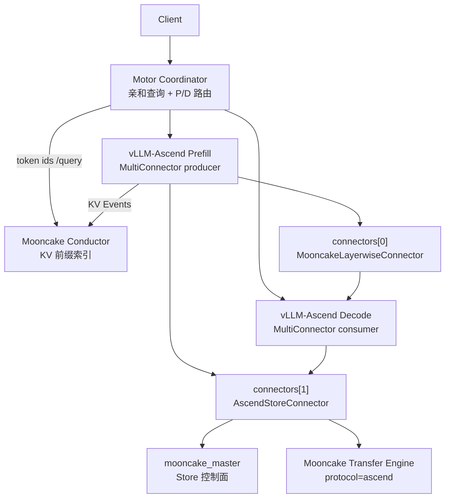

三条通路：

1. **PD 传输**：`connectors[0]`；
2. **共享池读写**：`connectors[1]`；
3. **亲和索引**：KV Events → Conductor → Motor `/query`。

### 10.3 配置到运行时

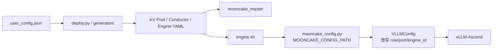

关键文件：

- `MindIE-PyMotor/docs/zh/user_guide/features/KV_pool.md`
- `MindIE-PyMotor/examples/deployer/lib/generator/kv_pool.py`
- `MindIE-PyMotor/examples/deployer/startup/roles/kv_pool.sh`
- `MindIE-PyMotor/examples/deployer/startup/mooncake_config.py`
- `MindIE-PyMotor/motor/engine_server/core/vllm/vllm_config.py`
- `MindIE-PyMotor/motor/common/resources/dispatch.py`

### 10.4 MultiConnector 设计

典型配置：

```json
{
  "kv_connector": "MultiConnector",
  "kv_role": "kv_producer",
  "kv_connector_extra_config": {
    "connectors": [
      {
        "kv_connector": "MooncakeLayerwiseConnector",
        "kv_role": "kv_producer",
        "kv_connector_extra_config": {"send_type": "PUT"}
      },
      {
        "kv_connector": "AscendStoreConnector",
        "kv_role": "kv_producer",
        "kv_connector_extra_config": {
          "lookup_rpc_port": "0",
          "backend": "mooncake"
        }
      }
    ]
  }
}
```

Motor 约定：

- `connectors[0]` 是传输 Connector，决定 `concurrent_engine_sync` 或 handoff capability；
- `connectors[1]` 是 Store Connector，不参与 capability 白名单；
- P/D 自动改写为 producer/consumer；
- 为每个实例注入 `engine_id`、lookup RPC 端口、DP/TP/PP 尺寸；
- 旧 vLLM-Ascend 版本需要 MultiConnector patch，让 Layerwise producer 即使不是 load chosen connector，也能收到完整分配状态。

### 10.5 请求数据流

#### PD 分离 + 池化

1. Coordinator 可先查 Conductor，选择缓存收益与负载综合最优的 P；
2. trigger 模式下 P/D 并发建立协同；
3. `MooncakeLayerwiseConnector` 把本次请求 KV 传给 D；
4. `AscendStoreConnector` 同时把可复用 KV 写入 Mooncake Store；
5. 后续相同前缀请求可从 Store 命中；
6. vLLM MultiConnector 按顺序选择首个命中的 load 后端。

#### PD 混部

- 可仅配置 `AscendStoreConnector` + `kv_both`；
- 没有 P→D 跨节点直传；
- 本地 APC + 外部 Store 共同提供前缀复用；
- ROLE_U 也可注册 KV Events 并参与亲和调度。

### 10.6 参数和观测

Motor 暴露/传递：

- `metadata_server=P2PHANDSHAKE`；
- `protocol=ascend`；
- `device_name`；
- `global_segment_size`；
- `eviction_high_watermark_ratio`；
- `eviction_ratio`；
- `default_kv_lease_ttl`，默认 11000ms，要求大于连接/传输 timeout；
- KV Pool CPU/SSD/all 层指标。

注意：这些参数的执行逻辑在 Mooncake/vLLM-Ascend，不在 Motor。

### 10.7 可靠性边界

Motor 已有：

- Conductor 查询 0.2s 超时，失败回退 LoadBalance；
- Conductor 服务对账与重新注册；
- Connector capability fail-closed；
- P/D 请求取消和 workload 释放；
- Master metrics 抓取；
- 配置、路由、亲和和指标的单元测试。

当前不足：

- 默认 KV Pool/Conductor 编排偏单副本；
- Mooncake 多 Master/多副本未完整暴露；
- Motor 仓无真实 Store 端到端测试；
- Conductor 索引与 Store 实体不是强一致事务；
- 池命中缺少统一的按 medium 传输成本打分；
- `global_segment_size` 等配置需要与实际 vLLM-Ascend/Mooncake 版本联合验证。

---

## 11. 全框架对比

| 系统 | 核心定位 | 本地分层 | 跨实例共享 | 索引/路由 | 数据面 | Kubernetes 产品化 |
|---|---|---|---|---|---|---|
| vLLM | 引擎 + Connector 标准 | GPU→CPU→FS/OBJ/P2P | 依赖具体 tier/Connector | KV Events，路由靠外部 | DMA/NIXL/Connector | 中 |
| SGLang HiCache | 引擎内统一层级缓存 | L1 GPU/L2 Host/L3 | L3 可共享 | 本地 HiRadix；Gateway 默认近似 | CUDA stream + backend | 中 |
| Mooncake | KV 专用 Store + 传输 | RAM/SSD/NoF | 强 | Conductor 精确索引 | Transfer Engine | 中 |
| LMCache | 引擎中立 KV 服务层 | CPU/NVMe/Remote | 强 | Controller/Connector | NIXL/GDS/后端插件 | 中高 |
| Dynamo/KVBM | 全栈统一内存层 | G1–G4 | 强 | Dynamo KV Router | NIXL | 高 |
| llm-d | K8s 路由索引 + 组合 offload | 借 vLLM/LMCache/Mooncake | 随后端 | EPP precise/approx plugins | 随 Connector | 高 |
| AIBrix | Gateway + CRD + 自研 KV 数据面 | DRAM + L2 | 强 | KV Event Sync / Preble | PrisKV/InfiniStore | 高 |
| Motor | 昇腾部署编排 + P/D/亲和调度 | 不直接实现 | 集成 Mooncake | Conductor 精确索引 | 集成 Ascend TE | 高 |

### 11.1 三种架构流派

**流派 A：引擎内生分层**

- vLLM OffloadingConnector；
- SGLang HiCache。

优点：调度器最了解 block 生命周期，overlap 容易做。  
缺点：引擎耦合高，跨引擎共享困难。

**流派 B：独立 KV 服务层**

- Mooncake Store；
- LMCache；
- Dynamo KVBM；
- AIBrix KVCache 数据面。

优点：跨实例共享、独立扩缩容、后端丰富。  
缺点：元数据、一致性、网络和部署复杂。

**流派 C：云原生索引与编排**

- llm-d；
- AIBrix Gateway/Operator；
- Motor。

优点：把 KV locality 纳入路由、扩缩容与 Kubernetes。  
缺点：自身通常不等于底层 Store，排障需要跨组件。

现实部署通常是组合：

```text
llm-d + vLLM Offloading/LMCache
AIBrix Gateway + AIBrix KVCache
Motor + vLLM-Ascend Connector + Mooncake
SGLang HiCache + Mooncake/NIXL L3
```

---

## 12. 场景化选型

### 单机、只想扩大 GPU 前缀缓存

- vLLM CPU OffloadingConnector；
- SGLang HiCache L2。

优先原因：部署简单、GPU↔CPU DMA 延迟低。

### 多 Pod，共享文件系统已成熟

- vLLM TieringOffloadingSpec FS tier；
- llm-d EPP + precise index + shared PVC；
- LMCache POSIX/HF3FS。

重点验证共享 FS 的随机 I/O、线程数和 hash 配置。

### RDMA 集群、跨节点高性能池

- Mooncake Store + Transfer Engine；
- LMCache + NIXL/Mooncake；
- Dynamo KVBM；
- AIBrix InfiniStore/PrisKV。

重点验证拓扑、注册内存、网卡亲和、故障恢复和 RDMA 运维。

### SGLang 原生部署

- 优先 HiCache；
- L3 可选 Mooncake、NIXL、HF3FS；
- 若需要全局精确路由，再叠加外部 Indexer，而不是只依赖 Gateway approximate tree。

### 昇腾 + Motor

- Motor + vLLM-Ascend MultiConnector + Mooncake；
- `connectors[0]` 处理 P/D；
- `connectors[1]` 处理共享池；
- Conductor + Motor 处理亲和；
- 生产化补强方向是 Pool/Conductor HA、E2E 故障测试和 per-medium 成本模型。

---

## 13. 常见误区

1. **“有 MooncakeConnector 就等于有共享池”**：错误。PD `MooncakeConnector` 可只用 Transfer Engine；共享池需要 Store Connector。
2. **“Conductor 存 KV”**：错误。它维护前缀元数据索引。
3. **“P2PHANDSHAKE 不需要 Master”**：错误。它只替代 Transfer Engine 的集中元数据服务。
4. **“命中外部 KV 一定更快”**：错误。必须比较 load 与 recompute 成本。
5. **“KV Events 是强一致数据库”**：错误。它是事件流，可能延迟/丢失，需要 replay、对账与实际 load failure 兜底。
6. **“Motor 实现了 Mooncake Store”**：错误。Motor 做编排、配置、路由与集成。
7. **“MultiConnector 会从所有池拼接加载”**：一般错误。vLLM 当前语义是首个有命中的 Connector 负责 load，所有 Connector save。
8. **“三级池化等于三级都跨节点”**：错误。L1/L2 常为实例私有，只有 L3 共享。
9. **“字符前缀相同就一定能复用 KV”**：错误。真实命中受 tokenizer、chat template、tools、block 边界和 extra keys 影响。

---

## 14. 面试回答

### 60 秒版本

> KV 池化是把原本局限在单实例 GPU 的 KV cache 扩展成分层、可共享的内存层。需要区分三件事：池化决定 KV 存在哪，亲和路由决定请求去哪，PD 传输负责本次请求从 Prefill 到 Decode 的 KV 搬运。vLLM 主要提供 GPU BlockPool、Connector 生命周期和原生 CPU/FS/对象存储 offload；SGLang HiCache 把 GPU、Host 和 L3 Store 统一进 HiRadixTree；Mooncake 用 Store Master 管对象、副本、租约和淘汰，用 Transfer Engine 走 RDMA/Ascend 数据面，用 Conductor 维护前缀索引。LMCache 和 Dynamo/KVBM 把 KV 做成独立服务层，llm-d、AIBrix、Motor则更偏云原生路由和编排。Motor 的设计是 MultiConnector 叠加：第一个 Connector 做 P/D 直传，第二个 AscendStoreConnector 写 Mooncake 池；同时 KV Events 进入 Conductor，Motor 用 token 级最长前缀命中和负载做亲和调度。

### 高频追问

**Q：为什么需要 L2 CPU？能不能 GPU 直接读 SSD？**  
A：CPU primary 不只是容量层，也是通用 staging 和 pinned DMA 层。vLLM 的 secondary tiers 默认必须经 CPU。GDS/NVMe-oF 能绕过部分 CPU copy，但布局、注册和后端兼容条件更严格。

**Q：池的 key 是什么？**  
A：通常是链式 block/page hash，输入包括 parent hash、token ids、模型/LoRA/attention group 等 extra keys。跨实例共享必须保证 tokenizer、block size、布局、并行配置和 hash seed 一致。

**Q：怎么避免读到写了一半的数据？**  
A：Mooncake 用 PutStart→数据传输→PutEnd，只有 COMPLETE 副本可读；vLLM 用 async save 完成信号延迟 block free；其他系统也需要对象状态或原子 publish。

**Q：怎么处理索引假命中？**  
A：事件 replay 和服务对账降低概率；实际 load 必须有失败语义，选择 recompute 或 fail。路由索引只能作为优化，不能成为正确性唯一来源。

**Q：池化和亲和谁优先？**  
A：不是优先关系。调度分数应把不同 medium 的命中收益减去搬运成本，再叠加排队负载；GPU hit 权重应高于 CPU/SSD hit。

---

## 15. 简历素材：如何准确描述 Motor 工作

### 推荐表述

> 负责 MindIE-PyMotor KV Cache 池化与亲和调度的云原生集成设计：构建从 user config、Kubernetes 部署到 vLLM-Ascend MultiConnector 的配置链路，组合 MooncakeLayerwiseConnector 完成 P/D KV 传输、AscendStoreConnector 接入 Mooncake 分布式 KV 池；基于 vLLM KV Events 与 Mooncake Conductor 建立 DP-rank 粒度全局前缀索引，并在 Coordinator 中实现缓存收益与权威负载融合调度。配套完善租约/水位参数透传、池指标、故障回退和 PD/混部路由。

### 不建议表述

> “从零实现分布式 KV Store、RDMA Transfer Engine 与副本一致性。”

原因：这些底层能力来自 Mooncake 和 vLLM-Ascend，Motor 的价值在**产品化编排、Connector 组合、调度决策和可靠集成**。

### 可深化的下一步

1. 在 Motor unified score 中引入 GPU/CPU/SSD 分层传输成本；
2. 对池 utilization、load queue、假命中率建立闭环指标；
3. 暴露 Mooncake 多副本、preferred segment 和 Master HA；
4. 建立真实 AscendStore + Mooncake E2E 故障测试；
5. 在扩容时进行热点 KV 预热和 locality-aware placement；
6. 让调度同时考虑“缓存位置、网络拓扑、P/D 配对和池水位”。

---

## 16. 源码与官方资料

### 本地源码

- vLLM：
  - `vllm/vllm/distributed/kv_transfer/kv_connector/v1/base.py`
  - `vllm/vllm/distributed/kv_transfer/kv_connector/v1/multi_connector.py`
  - `vllm/vllm/v1/core/sched/scheduler.py`
  - `vllm/vllm/v1/kv_offload/`
  - `vllm/vllm/distributed/kv_events.py`
- SGLang：
  - `sglang/python/sglang/srt/mem_cache/hiradix_cache.py`
  - `sglang/python/sglang/srt/managers/cache_controller.py`
  - `sglang/python/sglang/srt/mem_cache/storage/backend_factory.py`
  - `sglang/python/sglang/srt/mem_cache/storage/mooncake_store/mooncake_store.py`
- Mooncake：
  - `Mooncake/mooncake-store/src/master_service.cpp`
  - `Mooncake/mooncake-store/src/client_service.cpp`
  - `Mooncake/mooncake-store/include/replica.h`
  - `Mooncake/mooncake-transfer-engine/include/transfer_engine.h`
- Motor：
  - `MindIE-PyMotor/docs/zh/user_guide/features/KV_pool.md`
  - `MindIE-PyMotor/motor/engine_server/core/vllm/vllm_config.py`
  - `MindIE-PyMotor/motor/common/resources/dispatch.py`
  - `MindIE-PyMotor/motor/coordinator/scheduler/policy/kv_cache_affinity.py`
  - `MindIE-PyMotor/motor/coordinator/api_client/conductor_api_client.py`

### 官方资料

- vLLM KV Offloading：<https://docs.vllm.ai/en/latest/features/kv_offloading_usage/>
- LMCache Architecture：<https://docs.lmcache.ai/developer_guide/architecture.html>
- LMCache MP：<https://docs.lmcache.ai/mp/>
- Dynamo KVBM：<https://docs.dynamo.nvidia.com/dynamo/components/kvbm>
- llm-d KV Cache：<https://github.com/llm-d/llm-d-kv-cache>
- llm-d Tiered Prefix Cache：<https://github.com/llm-d/llm-d/blob/main/docs/well-lit-paths/tiered-prefix-cache.md>
- AIBrix：<https://github.com/vllm-project/aibrix>
- AIBrix KV Events：<https://aibrix.readthedocs.io/latest/features/kv-event-sync.html>

> 外部项目迭代很快，尤其是 vLLM Offloading、AIBrix Connector 与 Dynamo/KVBM。面试或方案评审时应同时说明调研日期和具体版本。
