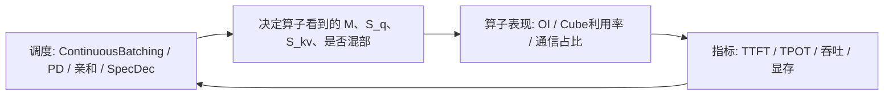

# 07 · 调度与算子交界（CB / Chunked / PD / SpecDec / Profiling）

> 很多「推理优化题」表面是调度，根因在算子与硬件。本篇把交界题收齐，避免只懂算子名却答不了系统题。

---

## L0 · 一张关系图

**金句**：调度改的是「喂给算子的 shape 与拓扑」；算子决定「这种 shape 下硬件能不能吃饱」。

### 指标三件套（补定义，原先默认你会）

| 指标 | 全称 | 主要反映 |
|------|------|----------|
| **TTFT** | Time To First Token | Prefill + 排队；首字体验 |
| **TPOT** | Time Per Output Token | 单步 Decode；生成流畅度 |
| **吞吐** | tokens/s 或 req/s | 集群效率；常与 TPOT/batch 权衡 |

优化时先问客户要的是哪一个——三者手段不同（见下节 Profiling）。

---

## L1 · Continuous Batching（连续批处理）

### 是什么
请求不等齐：有的在 Prefill，有的在 Decode，动态组成一个 batch 迭代。

### 算子层发生了什么
| 层 | 效果 |
|----|------|
| FFN Linear | 多请求 token 拼 M → 权重复用，OI↑，Cube↑ |
| Attention | **不能**跨请求拼 KV；靠多核并行 + Prefill 混部带飞 |
| 布局 | 常用 TND/VarLen packed + `actual_seq_*` |

### 面试怎么答
> CB 的收益首先来自 FFN 从 GEMV 变成更饱的 GEMM；Attention 侧是「别让核空着」，并尽量让 Prefill 大块和 Decode 共享设备。极限受 KV 显存限制——所以要 PagedAttention 和/或 KV 量化。

---

## L1 · Chunked Prefill

### 是什么
超长 prompt 切成 chunk（如 2048）分段 Prefill，中间可插 Decode，降低「长 Prefill 饿死 Decode」的尾延迟。

### 算子层要点
- 每个 chunk 仍是「较大 M」的 Prefill 算子（PFA），**chunk 内 OI 仍可很高**；
- 但每个 chunk 可能**重新搬运一遍权重** → 总权重读取次数 ↑，单 chunk OI 仍高；
- **chunk 太小** → M 不够 → Prefill 也会掉向访存密集，且 Cube 不满。

### 面试怎么答
> Chunk 是调度与公平性工具；大小是 OI/延迟的折中。默认量级常在 1K–2K 经验区，要用 profiling 看 TTFT/TPOT 与算子耗时。

---

## L1 · PD 分离 vs 混部

| | 混部 | 分离 |
|--|------|------|
| 设备 | Prefill/Decode 同池 | 分池 |
| 算子视角 | 大块 Prefill 与细粒度 Decode 抢 Cube/带宽 | 各自按 OI 选并行与量化 |
| 优点 | 部署简单、前缀本地性好 | TTFT/TPOT 更稳、好调参 |
| 代价 | 互相干扰 | KV 传输、调度更复杂 |

**算子层依据（必说）**：Prefill 计算密集 vs Decode 访存密集 → 最优 TP/DP/EP、图模式、量化策略都不同。

挂简历：Motor 支持 PD 分离与混部双形态调度——能说「调度必须感知阶段差异」。

---

## L1 · 投机解码 / MTP（算子视角）

| 机制 | 框架在做什么 | 算子得到什么 |
|------|--------------|--------------|
| Speculative Decoding | 草稿模型多提 token，目标模型一次验证 | 验证步 M>1，临时更像「小 Prefill」|
| MTP | 模型头一次预测多 token | Decode 步 S_q=4~8，Cube M↑、OI↑ |

**边界**：主场是算法与调度；算子侧「享受更大的 M」。不要说成自己写了 MTP kernel。

**深挖（验证步、拒绝回滚、接受率、与结构化输出弱连接）**：见 [`17-SpecDec-MTP验证步与算子像.md`](./17-SpecDec-MTP验证步与算子像.md)。MLA 翻转条件见 [`19`](./19-MLA-Decode-Roofline可信摘要.md)。

---

## L2 · Profiling 分层（算子向排查清单）

遇到「慢」时按层剥：

| 层 | 看什么 | 可能动作 |
|----|--------|----------|
| 1 Host | CPU 占用、下发间隙、Python | aclgraph/CUDA Graph、减小算子碎片 |
| 2 Kernel | 各算子耗时占比 | 融合、换 FA/IFA、量化 |
| 3 带宽 | HBM 吞吐、是否 memory-bound | 量化 W/KV、降精度、查重复搬运 |
| 4 通信 | HCCL/NCCL 耗时 | MC2、调 TP/EP、Flashcomm |
| 5 显存 | KV 占用、是否降 batch | Paged、KV 量化、前缀缓存 |
| 6 调度 | 队列、抢占、PD 干扰 | CB/chunk/PD/亲和 |

**口述套路**：先指标（TTFT/TPOT/吞吐）→ 再分层定位 → 再改一处用数据验证。忌「上来就开满量化」。

---

## L2 · 采样与 Logits

- Softmax + temperature/top-p 常在 **图外** 或轻量 kernel；
- 结构化输出 bitmask 在采样前改 logits（Vector）；
- Graph 常把 Sampler 留在图外（动态控制流）；
- LM Head / vocab parallel 见 [`18`](./18-LMHead与Vocab并行.md)。

**深入（脚印、异步错位、优化排序）**：[`15-Sampler-Logits-约束解码脚印.md`](./15-Sampler-Logits-约束解码脚印.md)；特性图：[`11`](./11-特性与算子交界专题.md) §1。

PD 下「传 KV vs 重算」：[`16`](./16-跨节点KV传输与重算账本.md)。

---

## L3 · 交界综合题

**Q：客户说 Decode 变慢，但 Prefill 很快，你怎么想？**  
> 符合访存密集画像。查 batch 是否掉下来、KV 是否随上下文涨、是否 Host-bound、权重/KV 是否可量化、通信是否暴露。不要先去「优化 FA 算法公式」。

**Q：亲和调度命中率很高，为何吞吐没线性涨？**  
> 命中省 Prefill；若瓶颈已在 Decode 带宽/采样/调度锁，Prefill 变少不会线性拉吞吐。要看阶段占比。

**Q：开了 Graph 反而慢？**  
> 检查是否频繁 re-capture、padding 过大、attention 参数未更新导致错误重试、或本身已 Device-bound（Graph 省不了 Device）。

---

## 自检

- [ ] 能讲 CB 对 FFN vs Attention 的不同影响
- [ ] 能讲 Chunked Prefill 的 OI 折中
- [ ] 能用 OI 论证 PD 分离
- [ ] 能把 SpecDec/MTP 说到「拉大 M」
- [ ] 能按 6 层做 profiling 口述

---

## 简历挂钩（林炜）

| 你的点 | 怎么接到本文 |
|--------|----------------|
| PD 分离/混部 | 本文 L1 PD 节 + OI；你是「调度支持双形态」的人 |
| unified / load_gated | CB+亲和下的负载与前缀权衡，直接作用 Decode batch 质量 |
| 结构化输出异步错位 | CB/异步引擎下 mask 与步进对齐（见 [`11`](./11-特性与算子交界专题.md) §1） |
| TTFT vs E2E | 本文指标三件套；亲和主要动 TTFT；数字卡 [`13`](./13)§1.1 |

深挖：[`09`](./09)、[`10`](./10) B/D；口误 [`24`](./24)；传 KV [`16`](./16)。
