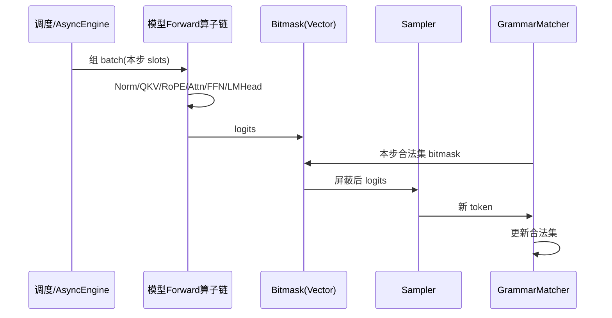
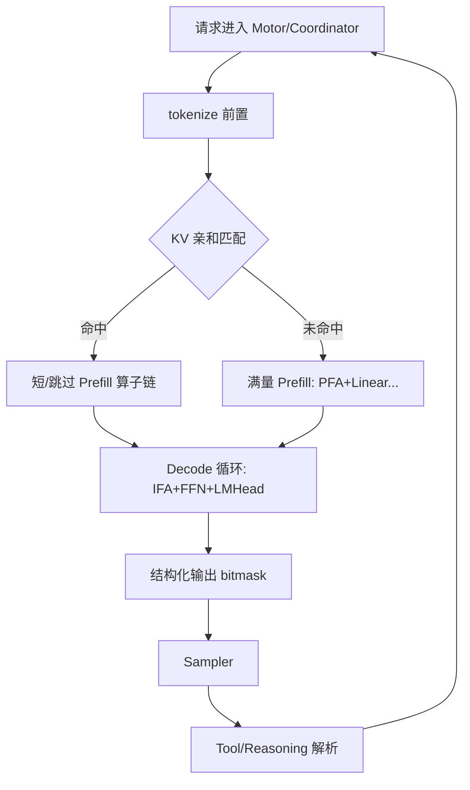

# 11 · 特性×算子专题：结构化输出 · KV亲和 · PD · Graph边界

> 把简历三大特性拆成「执行路径上的算子脚印」。补齐 09/10 的机制细节，便于白板画图。

---

## 1. 结构化输出：一步 Decode 的完整脚印



### 1.1 与主算子链的交界

| 段 | 算子形态 | 结构化输出是否改它 |
|----|----------|-------------------|
| Prefill/Decode 层叠 | PFA/IFA、Linear、融合 Norm/RoPE | **不改** |
| LM Head | MatMul → logits | **不改** |
| mask | Vector element-wise | **你的插入点** |
| sample | 常图外 | 消费 masked logits |

### 1.2 为什么容易和 Graph「打架」

- aclgraph/CUDA Graph 偏好静态 shape 与少控制流；  
- Grammar 状态机、变长合法集、采样随机性 → **常留图外**；  
- 实践：中间层可捕获，**logits→mask→sample** 分段 eager，或整段 Decode 不用满图。  
- 你修的异步错位：图外段与引擎步进的同步契约。

### 1.3 性能优化清单（诚实排序）

1. **正确性**（错位、假合法集）优先于速度；  
2. Schema 编译缓存（Host：SHA256+FIFO≈100，勿说 LRU）；  
3. mask 生成与 H2D 是否可与上一步计算重叠；  
4. 勿指望 bitmask 本身打出 TTFT -70%（那是亲和的故事）。

---

## 2. KV 亲和：从路由到少跑哪些算子

### 2.1 命中时「少跑」的清单

| 若满量 Prefill | 命中后 |
|----------------|--------|
| Embed + 多层 RMSNorm/QKV/RoPE | 视实现跳过或极短 |
| **PFA / flash attn prefill** | 显著减少 |
| 多层 FFN GEMM（大 M） | 显著减少 |
| 写满段 KV（scatter） | 只写增量或不写历史 |

Decode 仍要逐步：IFA + FFN GEMV + sample（+ 你的 mask）。

### 2.2 假命中的算子后果

```
字符级假前缀 → 复用错误 KV
  → Attention 数学输入错 → 输出崩 / 或强制重算
  → 最坏：错误结果；次坏：回退满量 Prefill（TTFT 仍差）
```

token 级匹配是为 **Attention/KV 读写的正确性**，不只是「调度好看」。

### 2.3 与 PD 的矩阵

| 部署 | 亲和关注点 | 算子池 |
|------|------------|--------|
| 混部 | 同实例 Prefill 大块 vs Decode 延迟 | 同卡 PFA+IFA 争用 |
| 分离 | P 节点索引与 D 节点缓存传递/路由 | P 侧重 PFA；D 侧重 IFA |

简历点「原生支持两种形态」：面试可画上表，再补一句 OI 依据（Prefill 算力 / Decode 带宽）。

---

## 3. PD 分离：调度策略如何映射到算子配置（加分）

| 侧 | 算子偏好 | 并行偏好 | 图模式 |
|----|----------|----------|--------|
| Prefill | PFA、大融合、大 chunk | 适度 TP | Device-bound 时 GE/融合收益更大 |
| Decode | IFA、W/KV 量化、少碎算子 | DP/EP | Host-bound 时 aclgraph 更香 |

你作为框架开发者的价值：路由与部署形态让上述配置「有机会生效」，而不是只调一个 kernel。

---

## 4. Tool Call 与多模型族：算子侧只需知道的

- Qwen3 / DeepSeek V3：差异主要在**模板与解析**；  
- DeepSeek V3 后端可能 MLA+MoE → 性能话题转 `03`/`04`；  
- Tool 参数若走 JSON Schema，可复用结构化输出约束链路。

**半页钉清「解析 vs 生成期约束」**：[`23-ToolCall与结构化输出交界.md`](./23-ToolCall与结构化输出交界.md)。

---

## 5. 一张「简历特性」总脚印图



---

## 6. 自检

- [ ] 能画结构化输出在 Decode 一步的插入点  
- [ ] 能列出亲和命中后少跑的算子  
- [ ] 能解释假命中的正确性风险  
- [ ] 能把 PD 形态说到 PFA/IFA 与 Graph 偏好  

---

## 7. 延伸（交界补强）

| 主题 | 文档 |
|------|------|
| Sampler / bitmask 脚印 | [`15`](./15-Sampler-Logits-约束解码脚印.md) |
| 传 KV vs 重算 | [`16`](./16-跨节点KV传输与重算账本.md) |
| LM Head | [`18`](./18-LMHead与Vocab并行.md) |
| 面试复盘长文 | `docs/interview-review/03`、`04`、`12`、`16`、`18` |
