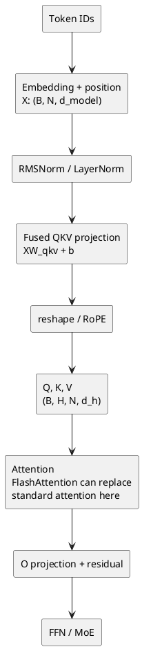
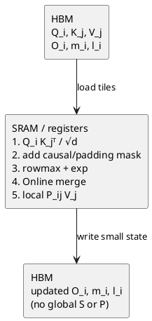

# 25 · FlashAttention V1：从 Transformer 的 X/Q/K/V 到 IO 感知 Attention

> 目标：把 `输入 X → Q/K/V → S → Softmax → O` 的理论计算，和 FlashAttention V1 的分块、Online Softmax、GPU 存储层级串成一条完整链路。
>
> 结论先行：**FlashAttention 是精确 Attention，不改变 `O(N²d)` 的主计算量；它通过 tiling 与 Online Softmax 不物化 `N×N` 的 `S/P` 矩阵，减少 HBM↔片上 SRAM 的读写，因此降低显存占用并通常加速。**

---

## 1. 先定位：它在 Transformer 的哪里

以 decoder-only LLM 的一个 Transformer block 为例，注意力子层位于 FFN 之前（省略残差的细节）：



FlashAttention 只重排图中的 **Attention** 计算；它不负责 tokenizer、Embedding、QKV Linear、RoPE、FFN 或调度。

### 1.1 记号与形状

下文先讨论单层、单个 batch 样本、一个 attention head；多 batch、多 head 只是并行复制。

| 符号 | 形状 | 含义 |
|---|---|---|
| `B` | 标量 | batch size |
| `N` | 标量 | 当前序列长度；训练/Prefill 时常很大 |
| `d_model` | 标量 | 模型隐藏维度 |
| `H` | 标量 | query head 数 |
| `d_h` | 标量 | 单 head 维度，通常 `d_model / H` |
| `X` | `[B, N, d_model]` | 进入注意力子层的 hidden states |
| `Q/K/V` | `[B, H, N, d_h]` | Query、Key、Value |
| `S` | `[B, H, N, N]` | softmax 前的 attention logits |
| `P` | `[B, H, N, N]` | softmax 后的 attention probabilities |
| `O` | `[B, H, N, d_h]` | 每个 head 的 attention 输出 |

为减少符号噪音，后续省去 `B,H`，把单 head 的 `Q,K,V` 写成 `[N, d]`，其中 `d=d_h`。

---

## 2. 输入 X 如何变成 Q、K、V

### 2.1 从 token 到 X

输入 token IDs 先查 embedding 表，得到每个位置的向量；decoder-only LLM 随后叠加或通过 RoPE 注入位置信息。经过前一层 block 后，注意力层接到：

$$
X \in \mathbb{R}^{N \times d_{model}}
$$

实际模型通常先做 RMSNorm/LayerNorm，记为 $\hat X$。它只改变数值尺度，不改变本节的核心形状。

### 2.2 三组可学习投影

每个 token 的同一份 hidden state 要扮演三种角色，因此用三组权重投影：

$$
Q = \hat XW_Q + b_Q,\quad K = \hat XW_K + b_K,\quad V = \hat XW_V + b_V
$$

在普通 multi-head attention（MHA）中：

$$
W_Q,W_K,W_V \in \mathbb{R}^{d_{model}\times d_{model}}
$$

工程实现往往把它们拼成一次大的 GEMM：

$$
[Q'\;K'\;V'] = \hat XW_{QKV},\quad
W_{QKV}\in\mathbb{R}^{d_{model}\times 3d_{model}}
$$

再把每个 `[N, d_model]` reshape 为 `[H, N, d_h]`。这样减少三次独立 kernel launch 和中间读写；**QKV projection 是 GEMM/Linear 优化问题，不是 FlashAttention 本体。**

### 2.3 Q、K、V 的语义直觉

对位置 $t$ 的 token：

- $q_t$：当前位置“要查询什么”；
- $k_j$：位置 $j$“可被匹配的索引”；
- $v_j$：位置 $j$“真正被取回的内容”。

点积 $q_tk_j^\top$ 是相似度；softmax 将所有候选位置变成权重；最后对 $v_j$ 加权求和。

### 2.4 RoPE 与 mask 在什么位置

RoPE 通常应用在 $Q,K$ 上而不作用于 $V$，随后才进入 Attention。decoder 的因果约束通过 mask 实现：当 key 的位置 $j$ 在 query 位置 $i$ 之后时，设：

$$
S_{ij}=-\infty,\quad j>i
$$

因此这些未来 token 的 softmax 概率为零。padding mask 也是同一原则：无效位置的 logit 置为 $-\infty$。

> GQA/MQA 只改变 Q head 和 KV head 的共享关系，不改变单个 Q-head 对一组 K/V 做 Attention 的 FlashAttention 核心推导。

---

## 3. 标准 Scaled Dot-Product Attention 到底算了什么

### 3.1 三个显式中间量

给定单 head 的 $Q,K,V\in\mathbb{R}^{N\times d}$：

$$
S = \frac{QK^\top}{\sqrt d}\in\mathbb{R}^{N\times N}
$$

$$
P = \operatorname{softmax}_{row}(S)\in\mathbb{R}^{N\times N}
$$

$$
O = PV\in\mathbb{R}^{N\times d}
$$

对输出第 $i$ 行，更直观的标量形式为：

$$
o_i=\sum_{j=1}^{N}\frac{\exp(q_i k_j^\top/\sqrt d)}{\sum_{t=1}^{N}\exp(q_i k_t^\top/\sqrt d)}v_j
$$

### 3.2 为什么普通实现慢：不是只看 FLOPs

标准 Attention 的两次矩阵乘法仍然需要 $O(N^2d)$ FLOPs。问题在于常见分解实现会：

```text
Q,K,V (HBM)
  → QKᵀ
  → S [N,N] 写回 HBM
  → 读 S，softmax
  → P [N,N] 写回 HBM
  → 读 P、读 V，计算 PV
  → O 写回 HBM
```

`S` 和 `P` 均为 $N\times N$。例如 `N=4096`、FP16 时，**单 head 的一个 `N×N` 矩阵约 32 MiB**；多头、batch 和反向传播会放大这一代价。GPU 的 HBM 容量大但相对片上 SRAM 慢，反复落盘的大矩阵会让 Attention 受内存带宽限制。

注意两个常见误解：

1. FlashAttention **没有**把全量 Attention 的二次计算变成线性计算；长序列的精确 Attention 仍是 $O(N^2d)$ FLOPs。
2. “不存 `S/P`”不等于完全没有局部 score。kernel 仍会在片上暂存一个 tile 的局部 score；区别是它不写回 HBM，也不保留完整全局矩阵。

---

## 4. Softmax 的数值稳定性与 Online Softmax

### 4.1 Safe Softmax

直接算 $e^{s_j}$ 容易溢出。对一行 logits $s$，标准稳定写法先减去行最大值：

$$
m=\max_j s_j,\qquad l=\sum_j e^{s_j-m},\qquad
\operatorname{softmax}(s_j)=\frac{e^{s_j-m}}{l}
$$

传统实现需要先知道整行的 $m$，再得到整行的 $l$，这看似要求完整 `S` 都已存在，和“逐 KV 块处理”冲突。

### 4.2 能合并的统计量

假设一行已经处理过若干 KV 块，维护：

$$
m^{old}=\max(\text{已处理 logits}),\quad
l^{old}=\sum e^{s-m^{old}},\quad
u^{old}=\sum e^{s-m^{old}}v
$$

新到一个 score block $S^{blk}$ 和对应 value block $V^{blk}$ 后，逐行计算：

$$
m^{blk}=\operatorname{rowmax}(S^{blk})
$$

$$
m^{new}=\max(m^{old},m^{blk})
$$

$$
\alpha=e^{m^{old}-m^{new}}
$$

$$
l^{new}=\alpha l^{old}+\operatorname{rowsum}\left(e^{S^{blk}-m^{new}}\right)
$$

$$
u^{new}=\alpha u^{old}+e^{S^{blk}-m^{new}}V^{blk}
$$

全部 KV block 处理完成后：

$$
O=\operatorname{diag}(l)^{-1}u
$$

初值是 $m=-\infty,l=0,u=0$。由于 $m^{new}\ge m^{old}$，修正项 $\alpha\le1$；所有指数的指数部分不大于零，数值稳定性保持。

### 4.3 为什么它是精确的

旧块的每一项都只是换了一个基准最大值：

$$
e^{s-m^{new}}=e^{s-m^{old}}e^{m^{old}-m^{new}}
$$

所以只要把旧的分母累加量 $l$ 与未归一化输出 $u$ 同时乘以 $\alpha$，新旧块就处在同一个尺度上。最终结果与整行一次性 safe softmax 数学等价；差异只可能来自浮点加法顺序带来的微小舍入误差，而非算法近似。

### 4.4 一个 4 个分数、2 个块的数值例子

先只看一行 attention score，按两个 KV block 到达：

```text
第 1 块：scores = [2, 1]，对应 values = [v1, v2]
第 2 块：scores = [3, 0]，对应 values = [v3, v4]
完整行： scores = [2, 1, 3, 0]
```

如果一开始就拿到完整行，safe softmax 的全局最大值是 `3`，分母为：

$$
e^{2-3}+e^{1-3}+e^{3-3}+e^{0-3}
=e^{-1}+e^{-2}+1+e^{-3}
$$

现在假设第 2 块还没来。处理第 1 块后：

```text
m_old = max(2, 1) = 2
l_old = exp(2 - 2) + exp(1 - 2) = 1 + e⁻¹
u_old = 1 · v1 + e⁻¹ · v2
```

这里的 `u_old` 是**尚未除分母的加权 value 和**；若现在就输出，才会计算 `O_old = u_old / l_old`。

第 2 块 `[3, 0]` 到来后，最大值从 `2` 提升到 `3`。第 1 块以前的指数项原本以 `2` 为基准，现在必须换成以 `3` 为基准：

$$
\alpha=e^{m_{old}-m_{new}}=e^{2-3}=e^{-1}
$$

因此第 1 块的旧权重全部乘 `e⁻¹`，第 2 块在新基准下的权重是 `[1, e⁻³]`：

```text
l_new = e⁻¹ · (1 + e⁻¹) + 1 + e⁻³
      = e⁻¹ + e⁻² + 1 + e⁻³

u_new = e⁻¹ · (v1 + e⁻¹ · v2) + 1 · v3 + e⁻³ · v4
      = e⁻¹v1 + e⁻²v2 + v3 + e⁻³v4

O = u_new / l_new
```

这正是完整行直接做 safe softmax 的分子和分母。核心不是“把两块各自 softmax 后再平均”；而是**当新块出现更大的最大值时，把旧块的统计量重缩放到新的共同基准**。

可以把三个状态记成一句话：

```text
m：当前见过的最大 score，负责数值稳定；
l：以 m 为基准的未归一化权重和，最终是分母；
u：以 m 为基准的「权重 × V」之和，最终是分子。
```

---

## 5. FlashAttention V1 前向：tile 如何流动

### 5.1 分块与片上工作集

把 sequence 维切为：

$$
Q_i\in\mathbb{R}^{B_r\times d},\quad
K_j,V_j\in\mathbb{R}^{B_c\times d}
$$

片上 SRAM（CUDA 中主要是 shared memory + register）一次至少需要容纳：$Q_i,K_j,V_j$、局部 score $S_{ij}$、输出累加量及每行的 $m,l$。块大小不能只追求大，而要受 shared memory、寄存器、occupancy 和 tensor core tile 形状共同约束。

### 5.2 V1 的循环顺序

论文 V1 的抽象算法以 K/V block 为外循环：一个 $K_j,V_j$ 读入 SRAM 后，复用给全部 $Q_i$。

```text
初始化 HBM 中 O=0, m=-∞, l=0

for every KV block (K_j, V_j):
    从 HBM 加载 K_j, V_j 到 SRAM
    for every Q block Q_i:
        从 HBM 加载 Q_i，以及当前 O_i, m_i, l_i
        S_ij = Q_i K_jᵀ / √d，并在 tile 内应用 causal/padding mask
        用 Online Softmax 合并 (m_i, l_i, O_i) 与当前 block
        将更新后的 O_i, m_i, l_i 写回 HBM
```

这和“每个输出行独立”的数学定义完全一致。V1 的代价是同一个 `Q_i/O_i` 会随不同 KV block 多次读写；FA2 改善了并行工作划分和循环顺序，但那是后续版本问题，不能混入 V1 的核心定义。

### 5.3 单个 `(Q_i, K_j, V_j)` tile 内发生的事



局部概率 $P_{ij}=\exp(S_{ij}-m_i^{new})$ 仅在 tile 内存活：它立刻与 $V_j$ 相乘并并入 $u/O$，不会以完整全局矩阵形式落到 HBM。

### 5.4 面向学习的伪代码

```python
# 单 head，省略 batch/head 维；这是算法伪代码，不是高性能 CUDA 实现。
for i in q_blocks:
    m[i] = -inf
    l[i] = 0
    u[i] = 0

for j in kv_blocks:
    Kj, Vj = load_to_sram(K[j], V[j])
    for i in q_blocks:
        Qi = load_to_sram(Q[i])
        S = Qi @ Kj.T * scale
        S = apply_causal_and_padding_mask(S, i, j)

        block_m = rowmax(S)
        new_m = maximum(m[i], block_m)
        alpha = exp(m[i] - new_m)
        P_unnorm = exp(S - new_m[:, None])

        l[i] = alpha * l[i] + rowsum(P_unnorm)
        u[i] = alpha[:, None] * u[i] + P_unnorm @ Vj
        m[i] = new_m

O = u / l[:, None]
```

实际 CUDA kernel 会把上面的矩阵块、row reduction、mask、exp 和乘 $V$ 映射到 warp、shared memory、register 与 tensor core 指令；伪代码的重点是数据依赖，不是 launch 配置。

---

## 6. 它究竟优化了什么

| 维度 | 标准分解 Attention | FlashAttention V1 |
|---|---|---|
| 数学结果 | exact | exact |
| 主 FLOPs | $O(N^2d)$ | $O(N^2d)$，可有重计算 |
| `S/P` 的全局物化 | 写入/读回 HBM | 不物化完整矩阵 |
| 中间激活存储 | 训练时显著受 $N^2$ 影响 | 前向主要保存 $O,m,l$ 等 $O(N)$ 状态 |
| 优化核心 | 常按算子边界拆开 | tile 内融合，减少 IO |
| 瓶颈视角 | 容易被 HBM 往返拖慢 | IO-aware：尽量用 SRAM 做完再写回 |

因此应把它称作：**重排计算与数据流的 fused attention algorithm**，而不只是“更快的 softmax”。

---

## 7. 反向传播为什么还能省内存

训练反向需要 attention 概率及相关梯度；若保存完整 $S/P$，前向的显存节省会失效。FA1 前向保留 $Q,K,V,O$ 和每行统计量 $m,l$，反向时按相同分块重新计算局部 $S_{ij}$ 和：

$$
P_{ij}=e^{S_{ij}-m_i}/l_i
$$

用额外 FLOPs 换回大规模 HBM/显存节省。这符合 GPU 的现实：在许多长序列设置中，额外计算比保存、读回巨大的 `N×N` 中间矩阵更便宜。

对于当前推理学习，优先掌握前向即可；反向的重点结论是“**重计算不是失败，而是 IO-aware 的有意取舍**”。

---

## 8. 与推理系统、PagedAttention 和当前项目的边界

### 8.1 Prefill 与 Decode

FlashAttention 的前向推导最贴近 **Prefill**：Q 的长度接近 prompt 长度，`QKᵀ` 是大矩阵乘，tiling 能有效提高计算利用率并避免 `N²` 中间矩阵。

Decode 时每条序列的新 Q 常只有一行（`q_len≈1`），主矛盾转为读取大量历史 KV、权重以及 kernel launch 开销，通常更偏 memory-bound。此时仍会使用 online softmax 分块归并，但 tile、并行划分和 reduce 方式不同；不能把 Prefill 的 FA 性能直觉机械套到 Decode。

### 8.2 FlashAttention 与 PagedAttention 不冲突

| 名称 | 回答的问题 |
|---|---|
| FlashAttention | Attention **怎么算**：tile、online softmax、少 HBM 中间量 |
| PagedAttention | KV **怎么存/怎么索引**：block table、分页分配、前缀共享 |

工程中可由一个 attention kernel 按 `block_table` 直接读取非连续 paged KV，然后用 FlashAttention/online-softmax 思路完成计算；并非必须 `gather → FlashAttention → scatter`。

### 8.3 与 KV 亲和调度的因果链

你的 KV 亲和不是“让 FlashAttention 算得更快”，而是：

```text
前缀 KV 命中
  → 跳过已命中 token 的 Prefill
  → 少执行 QKV Linear、Attention（可由 FA/PFA 实现）、FFN
  → TTFT 下降
```

FlashAttention 解释的是“未命中的 Prefill 如何高效执行”；KV 亲和解释的是“为何可以少执行它”。二者互补、层次不同。

---

## 9. 读源码/写 CUDA 时应观察什么

若后续手写 Softmax 或教学版 Attention，不要试图第一周复刻工业 FA。按这个阶梯学习：

1. **Row Softmax**：safe softmax，掌握 row max 与 row sum reduce；
2. **Online Softmax**：让两个 score chunk 的 `(m,l)` 正确合并；
3. **块化 attention 的 CPU/PyTorch 参考实现**：验证输出与标准 attention 一致；
4. **CUDA tile 实验**：shared memory 加载 `K/V` tile、warp 规约、观察访存和寄存器压力；
5. **再读 FA kernel**：重点问“这块数据在 HBM、shared memory 还是 register？何时写回？”

每一步都做三项验收：输出与 PyTorch `scaled_dot_product_attention` 对齐、不同序列长度/causal mask 正确、记录耗时与峰值显存。没有真实 benchmark 时，不把未经测量的倍数写进简历。

---

## 10. 面试高频问答

### Q1：FlashAttention 为什么快？

不是因为把 $N²$ 计算变成线性，而是把 `QKᵀ → softmax → PV` 融进片上 tile，避免完整 `S/P` 在 HBM 的反复读写；长序列时带宽和显存收益显著。

### Q2：Online Softmax 是近似吗？

不是。新块让最大值变化时，用 $e^{m^{old}-m^{new}}$ 重缩放旧的指数和与未归一化输出；它与 safe softmax 数学等价，仅有浮点求和顺序差异。

### Q3：既然不保存 S/P，怎么得到正确输出？

每一行保留三个足够统计量：running max `m`、running exponential sum `l`、running unnormalized weighted sum `u`。每个 KV tile 到来都更新三者，最后 `O=u/l`。

### Q4：FlashAttention 与 PagedAttention 的关系？

前者优化计算和 IO，后者优化 KV 的内存管理；前者可以在读取 paged KV 时工作，两者正交。

### Q5：为什么 Decode 不能直接照搬 Prefill 的高吞吐？

Decode 的 Q 长度通常为 1，矩阵乘 M 维很小，历史 KV/权重读取相对主导；需要针对 KV 分块、批处理、图重放和带宽重新 tiling 与调度。

---

## 参考资料

1. Tri Dao et al., [FlashAttention: Fast and Memory-Efficient Exact Attention with IO-Awareness](https://arxiv.org/abs/2205.14135), NeurIPS 2022.
2. AIInfraGuide, [FlashAttention V1 详解](https://caomaolufei.github.io/AIInfraGuide/cuda/%E6%A8%A1%E5%9D%97%E4%BA%8C-cuda%E7%BC%96%E7%A8%8B%E4%B8%8E%E7%AE%97%E5%AD%90%E4%BC%98%E5%8C%96/61-flashattention-v1%E8%AF%A6%E8%A7%A3/).
3. 本仓关联：[Attention 家族 / PagedAttention / MLA](./03-Attention家族-Paged-MLA.md)、[Linear / FFN / MatMul / SwiGLU](./01-Linear-FFN-MatMul-SwiGLU.md)、[推理算子学习索引](./00-推理算子学习索引与覆盖清单.md)。
