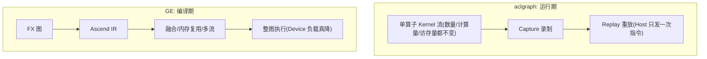

# 算子与图编译学习笔记

> 面向昇腾 MindIE 推理框架方向的 P0 盲区补齐：GE vs aclgraph 两种整图下发方案对照（概念级），FlashAttention + online softmax（AscendC 源码级）。
> 目标：会用、知道怎么回事、面试能防守。对照 `runtime`（CANN Runtime）与 `ops-transformer`（AscendC 算子）两个仓。

---

# 模块一：GE 图编译 vs aclgraph 整图下发（对照，不看实现）

## 一句话锚点

**两者不在同一层，比的是"省什么"**：

- **aclgraph = 运行期 Capture & Replay**：把 forward 里已有的一串**单算子 Kernel** 原样录下来，之后从 Host 一次性重放。不碰 Kernel 内部，**只省 Host 侧逐个下发 Kernel 的调度开销**。
- **GE = 编译期整图优化**（`torch.compile` 的 `max-autotune`）：FX 图 → Ascend IR → 图引擎编译，能做算子融合 / SuperKernel / 全图内存复用 / 多流并行，**直接降低 Device 侧的计算与访存负载**。



## 核心对比表（面试可直接背）

| 维度 | aclgraph（Capture & Replay） | GE 图模式（Ascend IR） |
|---|---|---|
| 优化时机 | **运行期**：录已有 Kernel 流，重放省 Host 调度 | **编译期**：整图融合/内存/调度优化 |
| 省的是什么 | **Host 侧调度开销** | **Device 侧计算/访存负载** + Host |
| 算子融合 | **不做**，Kernel 原样录制 | 支持（图融合 + UB 融合 + SuperKernel）|
| 中间结果搬运 | 不变（照旧 UB↔GM 往返）| 融合后留片上，显著减少 |
| 内存规划 | 各图独立，复用有限 | 全图内存复用，峰值显存更低 |
| 约束 | 强静态 shape、Stream 预算约 1800 图、attention 需打补丁 | 需算子注册 Ascend IR、编译慢、动态性弱 |
| 上线成本 | 低（交付件同 Torch 原生图模式）| 高（要实现 Ascend Converter）|
| 擅长场景 | **Host-bound**（小 shape、decode）、快速上线 | **Device-bound**、算子可融合、追求极致 |

> 两者**可叠加**：编译期先用 FX/`npugraph_ex` 做融合（省 Device），运行期再叠加捕获重放（省 Host）。

## aclgraph 到底怎么用（API 链，会用即可）

看的是 `runtime` 仓（华为 CANN Runtime），核心 API 链就三步（对应 CUDA Graph 的 capture/replay）：

```
aclmdlRICaptureBegin(stream, MODE)   // 开始捕获，此后任务只下沉不执行
   ...下发算子/拷贝任务...
aclmdlRICaptureEnd(stream, &modelRI) // 结束，得到可复用的 CaptureModel
aclmdlRIExecuteAsync(modelRI, stream)// 重放，可循环多次，Host 不再逐个下发
aclmdlRIDestroy(modelRI)             // 用完销毁
```

关键源码/文档定位（都在 `runtime/`）：

- 设计总览：`runtime/docs/zh/design/features/aclgraph.md`
- 单流捕获实操 + add 完整样例：`runtime/docs/zh/dev_guide/04-01_单流捕获.md`
- 任务更新（打补丁）：`runtime/docs/zh/dev_guide/04-03_任务更新.md`
- 可运行样例：`runtime/example/2_advanced_features/model_ri/`

从样例能看出两个"为什么"：

1. **为什么必须静态 shape**：捕获时 Host 侧 tiling 只算一次，把 `tiling data / block_dim / 输入输出地址`全冻进图；重放时 Host 这段不再执行，直接复用冻结值。shape 一变就对不上。
2. **为什么 attention 要打补丁**：attention 的 tiling 依赖每步在变的 `seq_lens`，冻结的 tiling 会算错，重放又不能自动回退 Host 重算。所以上层（vLLM-Ascend）要用 `update_attn_params` 这类 hook，在独立 stream 上用新 `seq_lens` 重算 tiling 并"打补丁"进捕获图——底层能力就是 runtime 的 `aclmdlRICaptureTaskUpdateBegin/End`。

> 注意边界：**GE 编译器本身不在 runtime 仓**（在 ge/torchair 仓），本轮概念层用 `docs/suanzi/ops-Q&A.md` 最后一节的对比章节已经足够，不用去啃 GE 编译实现。

## 选型口诀

- 瓶颈在 **Host 调度**（小/中 shape、decode、层数多下发跟不上）+ 想快速上线 → **aclgraph**，性价比最高。
- 瓶颈在 **Device 计算/访存**、有大量可融合小算子、显存吃紧、要通信计算重叠 → **GE**。
- 二者不互斥，可叠加。

### 怎么判断该上谁？（补全原先缺失的「诊断」）

| 现象（profiling） | 更可能 | 优先动作 |
|-------------------|--------|----------|
| NPU 利用率低，Host/驱动下发间隙大 | Host-bound | aclgraph / CUDA Graph，减少碎 kernel |
| NPU 忙，HBM 带宽打满 | memory-bound | 量化、融合减往返、压 KV、查是否重复搬 |
| NPU 算力打满，带宽仍有余量 | compute-bound | TP、减冗余计算、算法侧减 FLOPs |
| 小算子多、中间结果频繁落 GM | Device 访存碎 | 手写/GE 融合；单靠 aclgraph **不够** |

**误区**：已经 Device-bound 时只开 aclgraph，Device 负载不变，收益很小甚至因 padding/重捕获变慢。

### 简历挂钩：结构化输出与 Graph

- bitmask + Sampler 常含动态控制流 → **往往留在图外**；  
- 你修的异步 mask 错位，属于「图外段与引擎步进的契约」，不是 Capture API 本身；  
- 面试可说：中间层可上 aclgraph 降 Host，约束解码段保持 eager/可更新。详见 [`11`](./11) §1.2、[`15`](./15)。  
- 口误/边界：[`24`](./24)；指标勿把 Graph 收益说成 TTFT −70%（见 [`13`](./13)§1.1）。

---

# 模块二：FlashAttention + online softmax（ops-transformer，AscendC）

## FA 三招（一句话锚点）

朴素 Attention：`S=QKᵀ → P=softmax(S) → O=PV`，中间的 `S/P` 反复进出 HBM，O(N²) 访存，算力闲置。FA 靠三招把它砍掉：

| 招 | 作用 |
|---|---|
| **Tiling** | Q/K/V 分块驻留片上（SRAM/UB），不物化完整 `S/P` |
| **融合** | 块内一口气做 `QK→softmax→×V`，只把最终 `O` 写回 HBM |
| **Online Softmax** | 维护 running max/sum，分块增量修正，**数学等价**于对全行做 softmax |

> 核心是第三招 online softmax。下面手推 + 对源码。

## Online Softmax 增量公式（能白板手推）

问题：softmax 要先对**整行**求 max（数值稳定）再求 sum，但 FA 把 KV 按块流入，看不到整行。解法是"边看边修正"。

设处理到第 `i` 个 KV 块，维护三个 running 状态：`m`（running max）、`l`（running sum）、`O`（部分输出）。来一个新块 `S_i`：

```
m_i   = max(m_{i-1}, rowmax(S_i))          # 更新全局最大值
scale = exp(m_{i-1} - m_i)                  # 旧状态的修正因子（关键！）
l_i   = scale · l_{i-1} + rowsum(exp(S_i - m_i))
O_i   = scale · O_{i-1} + exp(S_i - m_i) · V_i
```

最后一步统一除 sum：`O = O_last / l_last`。

**直觉**：max 变大了，之前用旧 max 算的 `exp`、`sum`、`O` 都"偏大"，乘上 `exp(m_{i-1}-m_i)`（一个 ≤1 的因子）把它们缩放到新基准，就跟一次性看整行完全等价。

**两块手算例子**（建议自己算一遍）：`S0=[2,1]`，`S1=[3,0]`。
- 块0：`m0=2`，`l0=e^0+e^{-1}≈1.368`
- 块1：`m1=3`，`scale=e^{-1}≈0.368`，`l1=scale·l0+(1+e^{-3})≈1.553`
- 与对整行做 safe softmax 的分母一致。完整步骤见 [`08-易混淆概念与数值直觉.md`](./08-易混淆概念与数值直觉.md) §4。

设计文档 `ops-transformer/attention/flash_attention_score/docs/FA算子设计介绍.md` §1 就是这个公式：

```
exp[i] = e^{max_{i-1} - max_i}
```

i=0 时直接存 `MM[PV]`；i≥1 时把上一次 `MM[PV]` 乘 `exp[i]` 再加本次结果；除 sum 后移到最后输出前。

## 对到源码（这段最值得精读）

最直观的 online softmax 实现在 `fused_infer_attention_score` 的 epilogue，文件：`ops-transformer/attention/fused_infer_attention_score/op_kernel/attn_infra/epilogue/block/online_softmax/fused_block_epilogue_online_softmax_softmax.inc.hpp`。

变量命名规律：`lm/ll`=local（本块的）max/sum，`gm/gl`=global（running）max/sum，`hm`=本轮合并后的新 max，`dm`=修正因子 `exp(gm-hm)`。

**① 更新 running max + 算修正因子** `UpdateGlobalRowMax`（对应 `m_i` 和 `scale`）：

```cpp
// hm = vmax(lm, gm)         → m_i = max(m_{i-1}, rowmax(S_i))
AscendC::Max<float, false>(hmUbTensor[rowOffset], lmUbTensor[rowOffset], gmUbTensor[rowOffset], ...);
// dm = gm - hm
AscendC::Sub<float, false>(dmUbTensor[dmUbOffsetCurCycle], gmUbTensor[rowOffset], hmUbTensor[rowOffset], ...);
// dm = exp(dm)              → scale = exp(m_{i-1} - m_i)
AscendC::Exp<float, false>(dmUbTensor[dmUbOffsetCurCycle], dmUbTensor[dmUbOffsetCurCycle], ...);
```

第一个块（`isFirstStackTile`）直接把 `lm` 拷进 `hm`，无需修正——对应 i=0。

**② 算本块概率** `CalcExp`（对应 `exp(S_i - m_i)`）：

```cpp
// hm_block = expand_to_block(hm)
AscendC::Brcb(...);
// ls = ls - hm_block
AscendC::Sub<float, false>(lsUbTensor..., tvUbTensor, ...);
// ls = exp(ls)              → exp(S - m_i)，减去当前 running max 保证数值稳定
AscendC::Exp<float, false>(lsUbTensor[sUbOffset], lsUbTensor[sUbOffset], ...);
```

**③ 更新 running sum** `UpdateGlobalRowSum`（对应 `l_i = scale·l_{i-1} + rowsum`）：

```cpp
// gl = dm * gl             → scale · l_{i-1}
AscendC::Mul<float, false>(glUbTensor[rowOffset], dmUbTensor[dmUbOffsetCurCycle], glUbTensor[rowOffset], ...);
// gl = ll + gl             → + rowsum(exp(S_i - m_i))
AscendC::Add<float, false>(glUbTensor[rowOffset], glUbTensor[rowOffset], llUbTensor[rowOffset], ...);
```

`gl = dm*gl + ll`，一字不差就是 `l_i = scale·l_{i-1} + rowsum(exp(S_i-m_i))`。

其中 `ll`（本块行和）由同目录 `fused_block_epilogue_online_softmax_row_ops.inc.hpp` 的 `BlockReduceSum` 三级归约算出；`lm`（本块行最大）由 `BlockReduceMax` 算出。

> 部分输出 `O` 的 `scale·O_{i-1} + P·V` 修正在算子的 `MM[PV]` 累加/输出阶段完成（对应设计文档"上一次 MM[PV] 乘 exp 再加本次"）。

**训练/prefill 主算子**用的是 AscendC 高阶封装 `SoftmaxFlashV2`（同一套逻辑，只是 API 层次高）：

- 调用点：`ops-transformer/attention/flash_attention_score/op_kernel/arch22/flash_attention_score_s1s2_bn2gs1.h`（`using AscendC::SoftmaxFlashV2`）。
- prefill 对照：`ops-transformer/attention/prompt_flash_attention/op_kernel/prompt_flash_attention_s1s2_bns1_x310_base.h`。
- decode 对照：`ops-transformer/attention/incre_flash_attention/op_kernel/incre_flash_attention_allvec_new.h`（`SoftmaxFlashV2Compute`）。

## AscendC 算子的工程组织：host tiling + kernel 两段式（会用层面）

一个算子目录就是"Host 切分 + Device 计算"两段：

```
flash_attention_score/
├── op_host/     # Host 侧：算子定义 + infershape + tiling（决定怎么切到各核/核内）
│   ├── flash_attention_score_def.cpp
│   ├── flash_attention_score_tiling.cpp        # 多核/核内切分策略
│   └── arch22/ arch35/ ...                      # 按芯片代际分
├── op_kernel/   # Device 侧：真正跑在 AI Core 上的 kernel
│   └── arch22/flash_attention_score_s1s2_bn2gs1.h  # 含 SoftmaxFlashV2 调用
├── op_api/      # aclnn 接口（aclnnFlashAttentionScore）
├── examples/    # 端到端调用样例
└── docs/        # 设计文档
```

- **Host tiling 在干嘛**：数据太大一次算不完，要决定"怎么分到多个核 + 每个核内怎么循环最优"。FA 有 B/N2/G/S1/S2 五个轴，先核内（按基本块选切分轴）再核间（剩余轴合并按核数切）。CV 分离下 Cube 基本块 `128×128`、Vector 基本块 `8×1024`，按 1:16 配比减少 CV 通信（见设计文档 §3）。
- **Kernel 在干嘛**：按 tiling 给的切分，跑 `IterateBmm1（QKᵀ）→ ProcessVec1（online softmax）→ IterateBmm2（PV）→ ProcessVec2` 四阶段流水（设计文档 §2）。
- **想跑起来看什么**：`ops-transformer/examples/flash_attn_example/` + `ops-transformer/docs/zh/develop/aicore_develop_guide.md`。学习阶段不用真编译，读懂两段式结构即可。

---

# 面试可复述的产出（自检）

- **GE vs aclgraph**：能画对比表，答"Host-bound 选 aclgraph、Device-bound 选 GE、可叠加"，能解释 aclgraph 为何静态 shape + attention 为何要 `update_attn_params` 打补丁。
- **FlashAttention**：能讲三招（tiling / 融合 / online softmax），能白板手推 `m_i / scale=exp(m_{i-1}-m_i) / l_i / O_i` 增量公式，并把它定位到 `fused_block_epilogue_online_softmax_softmax.inc.hpp` 的 `Max→Sub→Exp（算 dm）`、`gl=dm*gl+ll` 几行。
- **AscendC 工程**：能说清 op_host（tiling 切分）+ op_kernel（四阶段流水）两段式，以及 CV 分离 / 1:16 配比的动机。

---

# 延伸阅读（本仓）

- [`08-易混淆概念与数值直觉.md`](./08-易混淆概念与数值直觉.md)：Host-bound 诊断、online softmax 手算、M/N/K。
- `docs/suanzi/ops-Q&A.md`：最后一节「GE 图编译方式和 aclgraph 方式比对」为本模块一的深度来源；「大 batch 计算优势」「prefill/decode 计算密集 vs 访存密集」为算子层 Roofline 背景。
- `docs/2026-07-10/02-算子层加速FlashAttention-CUDAGraph专题.md`：FA / CUDA Graph 的 vLLM/NVIDIA 侧对照与面试 12 题。
- 总索引：[`00-推理算子学习索引与覆盖清单.md`](./00-推理算子学习索引与覆盖清单.md)。
