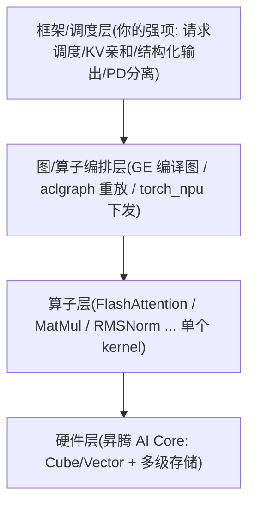

# 算子基础术语与面试问答

> 面向对象：熟悉推理框架/调度（结构化输出、KV 亲和调度、Tool Call、Server 重构），但**没接触过算子/底层硬件**的开发者。
> 用途：先用大白话把 `算子与图编译学习笔记.md`、`ops-Q&A.md` 里反复出现的术语讲清楚，再结合简历过一遍推理加速岗常见追问。

---

# 第一部分：基础术语解释

## 1. 先建立一张"从框架到硬件"的全景图

你熟悉的是最上层。这份文档补的是下面两层：



- **框架层**：决定"哪个请求先算、KV 放哪、batch 怎么攒"。
- **算子层**：决定"一次矩阵乘/一次 attention 具体怎么在芯片上算"。一个"算子(operator)"≈ 深度学习里的一个计算操作（如 MatMul、Softmax、Attention）。
- **硬件层**：算子最终跑在 AI Core 上。理解算子必须先懂一点硬件。

## 2. 硬件术语（昇腾 NPU）

| 术语 | 大白话解释 | 类比 NVIDIA |
|---|---|---|
| **NPU / 昇腾 910B** | 华为的 AI 加速卡，对标 GPU | GPU |
| **AI Core** | NPU 里真正干活的计算核心，一张卡有几十个 | SM（流多处理器）|
| **Cube（AIC）** | AI Core 里**专做矩阵乘**的单元，算力极高 | Tensor Core |
| **Vector（AIV）** | AI Core 里做**逐元素/向量运算**的单元（加、乘、exp、softmax、归一化）| CUDA Core |
| **Scalar** | 做标量控制/地址计算的小单元 | — |
| **HBM / GM** | 显存（Global Memory），容量大（几十 GB）但**慢**，所有核共享 | HBM |
| **L2 Cache** | 全片共享的高速缓存，硬件自动管理（软件不显式控制）| L2 |
| **L1 Buffer** | 每个核私有、**软件显式管理**的高速缓存（约 512KB/核）| Shared Memory 附近 |
| **L0A / L0B / L0C** | Cube 专用的最贴近计算的小缓存（放矩阵乘的左/右/输出）| 寄存器/Tensor Core 输入 |
| **UB（Unified Buffer）** | Vector 专用的片上缓存 | — |

**一句话记忆**：数据默认躺在**慢而大的 HBM**，算之前要一层层搬到**快而小的片上缓存**（L2→L1→L0/UB）里，算完再搬回去。**推理优化的很大一部分，就是想办法少搬数据、让搬进来的数据多算几次。**

### 2.1 Cube 为什么怕"M=1"（fractal 16×16×16）

- Cube 做矩阵乘的**最小硬件粒度**叫 fractal，形状固定是 `M×N×K = 16×16×16`。
- 一次 fractal 必须凑够 16 行（M=16）才启动。
- Decode 阶段每次只算 1 个 token，矩阵乘的 M 维只有 1 → 硬件被迫 padding 到 16，**只有 1/16 的算力在做有用功**（其余 15 行是垃圾）。
- 这就是"decode 阶段 attention 是访存密集、Cube 利用率极低"的微观原因。记住这个数字 **1/16 ≈ 6.25%**，面试常问。

### 2.2 矩阵乘三维度 M / N / K（必懂）

```
A[M, K] × B[K, N] → C[M, N]
```

| 维 | 含义 | Decode 里常出什么问题 |
|----|------|------------------------|
| **M** | 输出行数 ≈ token 数 | Decode 常 =1 → Cube 喂不饱 |
| **K** | 归约维（inner）| 一般够大，不是主因 |
| **N** | 输出列数 | 也可切分；TP Column 常切 N |

**只看 K、N 大不能说明 Cube 打满——关键看 M。** 更细的对照与数值见 [`08-易混淆概念与数值直觉.md`](./08-易混淆概念与数值直觉.md)。

## 3. 性能分析术语（Roofline，判断"卡在哪"）

| 术语 | 大白话 |
|---|---|
| **算术强度 OI** | 每从 HBM 搬 1 字节数据，能做多少次计算（FLOPs/Byte）。**越高越划算**（搬一次多算几次）。 |
| **屋脊点 Ridge Point** | 一个阈值 = 峰值算力 ÷ 峰值带宽（昇腾 910B ≈ 209）。 |
| **计算密集（compute-bound）** | OI > 屋脊点，瓶颈在**算力**。加大 batch、切 TP 有用。典型：**prefill**。 |
| **访存密集（memory-bound）** | OI < 屋脊点，瓶颈在**搬数据的带宽**。典型：**decode**。 |
| **Host-bound** | 瓶颈不在算，而在 **CPU（Host）逐个下发算子太慢**，Device 空等。典型：小 shape、层数多的 decode。aclgraph 专治这个。 |
| **TTFT** | Time To First Token，首 token 时延，主要看 Prefill。 |
| **TPOT** | Time Per Output Token，每生成 token 时延，主要看 Decode。 |
| **吞吐** | tokens/s 或 requests/s；Decode 优化常追吞吐，Prefill 常追 TTFT。 |

> **关键结论（必背）**：
> - **Prefill 计算密集**：一段 prompt 几千 token 共用一份 KV，搬一次算几千次，OI 高。
> - **Decode 访存密集**：每次只出 1 个 token，搬一大堆权重/KV 却只算 1 次，OI 低。
> - 这条结论直接推出 **PD 分离**：prefill 节点开大 TP 打满算力降 TTFT，decode 节点用 DP 扩吞吐。
>
> **如何区分 Host-bound 与 memory-bound（排查口令）**：
> - NPU 利用率低 + CPU/下发间隙大 → 先怀疑 Host-bound → Graph。
> - NPU 忙 + HBM 带宽打满 → memory-bound → 量化 / 减 KV / 融合物化。
> - NPU 忙 + 算力打满、带宽还有余量 → compute-bound → TP / 算法减算。

## 4. 算子工程术语（怎么写/怎么用一个算子）

| 术语 | 大白话 |
|---|---|
| **Kernel** | 真正跑在 AI Core 上的那段计算代码（device 侧）。 |
| **Host / Device** | Host = CPU 侧（做准备、下发指令）；Device = NPU 侧（真算）。 |
| **Tiling（切分）** | 数据太大一次算不完，Host 侧先算好"怎么切成小块分给各个核、每个核内怎么循环"。**Tiling 是算子性能的灵魂**。 |
| **TilingData** | Host 算出来的切分参数，传给 kernel，kernel 照着切。 |
| **AscendC** | 华为写昇腾算子的 C++ 编程语言/框架（对标 CUDA C++ / Triton）。 |
| **aclnn** | 算子对外的调用接口（框架通过它调算子），类似 API 层。 |
| **Workspace** | 算子运行需要的临时 Device 内存；常见两段式：`GetWorkspaceSize` → `Malloc` → 真正执行。 |
| **Eager / 单算子模式** | 一个算子算完再下发下一个，边下边算，好调试但 Host 开销大。 |
| **图模式** | 把整串算子当成一张图一起处理（见图下发术语）。 |
| **block_table** | PagedAttention 的索引：逻辑 token 位置 → 物理 KV block。 |

**AscendC 算子的两段式结构（会用即可）**：

```
某算子/
├── op_host/    # Host 侧：算子定义 + 形状推导 + tiling（怎么切）
├── op_kernel/  # Device 侧：真正的计算 kernel（照 tiling 切分来算）
├── op_api/     # aclnn 接口（框架/用户怎么调）
└── examples/   # 端到端调用样例
```

### 4.1 算子融合（面试高频）

把多个小算子合并成一个，减少"算完写回 HBM 又读回来"的往返：

| 类型 | 大白话 |
|---|---|
| **图融合（Graph Fusion）** | 数学层面合并，如 `Conv+BN+ReLU` 合一。硬件无关。 |
| **UB 融合（Buffer Fusion）** | 让前一个算子的中间结果**留在片上 UB**，省掉 `UB→HBM→UB` 的往返。硬件相关。 |
| **SuperKernel** | 把多个已编译好的子 kernel 用一个"超级 kernel"串起来**一次启动**，省 Device 侧逐个启动的固定开销。 |
| **常见融合大算子** | FlashAttention（把 QK/softmax/PV 融成一个）、`add_rms_norm`、`swiglu`、`rope`。 |

### 4.2 流水线术语（让硬件不空转）

| 术语 | 大白话 |
|---|---|
| **Double Buffer（乒乓）** | 开两块 buffer，一块在算的时候另一块在搬数据，搬和算重叠起来，不互相等。 |
| **CV 流水** | Cube（矩阵）和 Vector（向量）是两个独立单元，让它们并行干活（Cube 算 QKᵀ 时 Vector 算上一块的 softmax）。 |
| **CV 分离 / 1:16 配比** | FA 里 Cube 一次算大块（128×128），Vector 处理小块（8×1024），按比例配起来减少两者通信。 |

## 5. Attention 算子家族（推理最核心）

| 算子 | 用在哪 | 特点 |
|---|---|---|
| **FAS**（flash_attention_score）| 训练 + 通用 | FlashAttention 标准实现，切 Q 块 |
| **PFA**（prompt_flash_attention）| **Prefill** 推理 | Q 长，切 Q 块（M=128），Cube 打满，计算密集 |
| **IFA**（incre_flash_attention）| **Decode** 推理 | Q=1，切 KV，Cube 打不满，访存密集，会降级到纯 Vector |
| **FIA**（fused_infer_attention_score）| 推理融合 | prefill/decode 统一入口，online softmax 实现最清晰 |
| **MLA 系列**（mla_preprocess / mla_prolog / kv_quant_sparse_flash_attention）| DeepSeek-V3 | 把 KV Cache 从 32768 维压到 576 维，decode 有翻盘机会 |

配套概念：
- **PagedAttention**：KV Cache 像操作系统分页一样按 block 存，不用连续大块显存，靠 `block_table` 索引。
- **TND packed / VarLen**：把多条不同长度的请求拼成一个大 tensor，用累积长度数组 `actual_seq_qlen` 标边界，让 Cube 一直有大块可算。

## 6. 算法术语（算子内部在算什么）

| 术语 | 大白话 |
|---|---|
| **KV Cache** | 自回归生成时，把历史 token 的 K/V 存下来复用，避免每步重算。 |
| **Prefill / Decode** | Prefill = 一次性处理整段 prompt（并行）；Decode = 一个一个往外蹦 token（串行）。 |
| **MHA / GQA / MQA / MLA** | 注意力头怎么共享 KV：MHA 每头独立 KV；GQA 几个头共享；MQA 全共享；MLA 压缩成低维 latent。 |
| **safe softmax** | softmax 前先减去整行最大值，防止 `exp` 溢出。 |
| **online softmax** | FlashAttention 的核心：**看不到整行**也能算 softmax，靠边看边修正 running max/sum（见下）。 |
| **RMSNorm** | 均方根归一化：`x / rms(x) * weight`（无比 LayerNorm 的减均值）。Vector 算子。 |
| **RoPE** | 旋转位置编码，给 Q/K 注入位置信息；**V 通常不转**。 |
| **SwiGLU / silu_and_mul** | FFN 里的激活函数组合。 |
| **MTP** | Multi-Token Prediction，一步预测多个 token，把 decode 的 M 从 1 拉到 4~8，缓解 Cube 利用率低。 |

### 6.1 online softmax 一图讲透（面试必考）

普通 softmax 要先看**整行**求最大值再求和。FlashAttention 把 KV 切成块**一块块流进来**，看不到整行，怎么办？——**边看边修正**：

维护 3 个"运行中"的状态：`m`（当前见过的最大值）、`l`（当前的分母和）、`O`（当前的部分输出）。每来一个新块：

```
m_new  = max(m_old, 本块最大值)
scale  = exp(m_old - m_new)              # ← 修正因子，把旧结果缩放到新基准
l_new  = scale × l_old + 本块的 exp 和
O_new  = scale × O_old + 本块的 exp × V
```

最后统一 `O = O / l`。**直觉**：发现更大的最大值后，之前按旧最大值算的东西都"偏大"，乘一个 ≤1 的 `scale` 拉回来即可，结果和一次性看整行**完全等价**。

## 7. 图下发术语（GE vs aclgraph）

| 术语 | 大白话 |
|---|---|
| **GE 图编译** | 编译期把整张图优化（融合/内存复用/多流），**真降 Device 计算和访存**。慢编译、强优化。 |
| **aclgraph（Capture & Replay）** | 运行期把已有的一串 kernel 录下来重放，**只省 Host 逐个下发的开销**。不改 kernel。 |
| **Capture / Replay** | 录制 / 重放。`aclmdlRICaptureBegin → 录 → CaptureEnd → ExecuteAsync（重放多次）`。 |
| **Stream / SQ / CQ** | 任务队列。Stream 是逻辑流，SQ/CQ 是硬件下发/完成队列。 |
| **TorchAir** | 昇腾上 `torch.compile` 的图后端，提供 GE 和 aclgraph 两条路径。 |

---

# 第二部分：面试问答（结合简历 + 推理加速岗常见追问）

> 你的简历强项在**框架/调度**（结构化输出、KV 亲和、Tool Call、Server 重构）。面试算子/加速方向时，策略是：**用框架视角切入，诚实标注底层边界，用 Roofline + 源码理解撑住追问**。

## A. 从你的框架背景过渡到算子层

**Q1：你做推理框架，为什么还要懂算子？**
> 框架决定"调度和数据流"，算子决定"单次计算的效率"，两者要对齐才有整体性能。比如我做 KV 亲和调度提升前缀命中，本质是减少 prefill 重算；而 prefill 之所以是**计算密集**、值得省，是算子层 Roofline 决定的（一段 KV 被几千个 query 复用，OI 高）。再比如我做的结构化输出，bitmask 屏蔽 logits 这一步就是**算子组合**，在 NPU 侧执行。懂算子能让我在框架层做出更合理的调度/融合决策。

**Q2：你简历里的"NPU 侧 bitmask logits 屏蔽"，这算算子吗？**
> 算，是算子层面的操作。GrammarMatcher 每步算出合法 token 集合，转成 bitmask，在采样前把非法 token 的 logits 置成负无穷。它落到 NPU 上是 element-wise 的向量运算（Vector 单元），可以和采样融合减少 HBM 往返。我主要在框架侧打通全链路，底层 kernel 是调用现成算子组合，没有手写 AscendC——这是我的诚实边界。Schema 编译缓存是 Host 侧 **SHA256+FIFO≈100**（勿说 LRU），见 [`24`](./24-答辩用词对照.md)、[`15`](./15-Sampler-Logits-约束解码脚印.md)。

**Q3：Server C++ 重构削减 1 万行，和性能有关系吗？**
> 主要是可维护性和接入效率，不是直接的算子性能。但重构后请求处理链路更清晰，有利于后续接入算子融合、图模式这类优化——减少了改动风险。

## B. FlashAttention / online softmax（核心考点）

**Q4：FlashAttention 为什么快？**
> 朴素 attention 的中间矩阵 `S=QKᵀ`、`P=softmax(S)` 是 O(N²)，反复进出 HBM，带宽被打满而算力闲置。FA 三招：**Tiling**（Q/K/V 分块驻留片上，不物化完整 S/P）、**融合**（块内一口气做 QK→softmax→×V，只把最终 O 写回）、**online softmax**（分块也能等价算 softmax）。本质是**用少搬数据换性能**。

**Q5：online softmax 为什么和普通 softmax 等价？（白板题）**
> 维护 running max `m`、running sum `l`、部分输出 `O`。新块来时 `m_new=max(m_old, 块内max)`，修正因子 `scale=exp(m_old-m_new)`，然后 `l_new=scale·l_old+块内exp和`、`O_new=scale·O_old+块内exp·V`，最后 `O/l`。发现更大最大值时，旧结果乘 `scale` 缩放到新基准，数学上和一次性对整行做 safe softmax 完全一致。（可对到 `ops-transformer` 的 `fused_block_epilogue_online_softmax_softmax.inc.hpp`：`Max→Sub→Exp` 算 dm，`gl=dm*gl+ll`。）

**Q6：为什么 prefill 用一个算子、decode 用另一个？**
> Prefill 的 Q 长（几百~几千 token），切成 128 的块后 Cube 的 M 维=128 打满，是计算密集，用 **PFA**（切 Q）。Decode 的 Q=1，Cube fractal 16 行只填 1 行（1/16 利用率），是访存密集，用 **IFA**（切 KV，甚至降级到纯 Vector）。同一套 online softmax，但 tiling 策略和多核切分方向相反。

**Q7：FlashAttention 有版本区别吗？**
> 有。v1 提出 tiling+online softmax；v2 改成 Q 外层循环、更好的 warp 切分；v3 针对 Hopper（TMA/WGMMA/FP8）；v4 Blackwell。昇腾侧对应的是 FAS/PFA/IFA/FIA 这套算子，算法内核（分块+online softmax）一致，实现栈不同。

## C. 图模式 GE vs aclgraph

**Q8：aclgraph 和 GE 图编译区别？**
> 不在一层。**aclgraph 是运行期 Capture&Replay**，把已有 kernel 流录下来重放，只省 Host 逐个下发的调度开销，不改 kernel、不融合。**GE 是编译期整图优化**，能算子融合、内存复用、多流并行，真正降低 Device 侧计算和访存。aclgraph 上线快、约束多（强静态 shape）；GE 优化天花板高、编译慢。两者可叠加。

**Q9：aclgraph 为什么要求静态 shape？attention 怎么办？**
> 捕获时 Host 侧的 tiling、地址都被冻进图，重放时不再重算，shape 一变就对不上。attention 的 tiling 依赖每步变化的 `seq_lens`，所以需要 `update_attn_params` 这类 hook，在重放前用新 `seq_lens` 重算 tiling 并"打补丁"进捕获图（底层是 runtime 的 TaskUpdate 能力）。

**Q10：什么场景选哪个？**
> 瓶颈在 Host 调度（小 shape、decode、层数多）且想快速上线 → aclgraph；瓶颈在 Device 计算/访存、有大量可融合小算子、显存紧 → GE。

## D. 硬件与 Roofline

**Q11：为什么 decode 是访存密集、prefill 是计算密集？**
> 看算术强度 OI。Prefill 一段 KV 被 S_q 个 query 复用，搬一次算几千次，OI 远超屋脊点（约 209）→ 计算密集。Decode 每步 Q=1，搬一大堆权重和 KV 只算 1 个 token，OI≈1 → 访存密集。这也是 PD 分离的物理依据。

**Q12：大 batch 为什么能提升利用率？对 FFN 和 Attention 一样吗？**
> 不一样。**FFN**：所有请求共享同一份权重，多条请求拼成大 M，Cube tile 从空填满，单核就变快。**Attention**：每条请求 KV 不同，**不能跨请求拼 M**，只能靠多核并行"以量换效"——单核 Cube 还是打不满，但核都有活干。所以 decode attention 靠 batching 救不了，得靠 MLA（把 128 个头拼到 M）+ MTP。

**Q13：MLA 为什么能改善 decode？**
> MLA 把 KV Cache 从 MHA 的 32768 维压到 576 维（约 57 倍），且让 128 个头共享同一份 latent KV。这样 decode 单 token 也能把 128 个头拼进矩阵乘的 M 维（M=128），Cube fractal 不再浪费。但整步是否翻转成计算密集还要看 W_absorb（约 200MB/步）搬运，短上下文下仍访存密集；极长+MTP 才更可能翻转——默认口径见 [`19`](./19-MLA-Decode-Roofline可信摘要.md)。

## E. 结合简历特性的深追问

**Q14：你的 KV 亲和调度，和算子/硬件有什么关联？**
> 我把 tokenize 前置到 Coordinator（4K 输入约 6ms），基于全局 KV 索引做 token 级最长前缀匹配，把同前缀请求路由到持有缓存的实例。它省的是 **prefill 重算**——而 prefill 算子是计算密集的，省下来的收益大（实测 TTFT 降 70%；E2E −50% 因仍含 Decode）。数量级卡见 [`13`](./13-指标拆解与归因反模式.md)§1.1。这就是框架调度和算子特性对齐的例子：因为 prefill 贵，所以命中前缀缓存价值高。

**Q15：你没写过 AscendC 算子/HCCL，怎么和岗位匹配？**
> 诚实说：我的主战场是框架和调度，算子层是通过 Roofline 分析 + 阅读昇腾算子源码（FAS/PFA/IFA、online softmax）建立的理解，能看懂 tiling 策略、能定位性能瓶颈在算力还是带宽，也理解 GE/aclgraph 两种图下发的取舍。手写融合 kernel 和 HCCL 通信我还在补，但框架侧我能判断"该不该融合、该走哪种图模式、该怎么调度",这是和算子团队协作的基础。

**Q16：给你一个 decode 变慢的 case，你怎么排查？**
> 分层排查：先看是不是 Host-bound（Host 下发跟不上、Device 空等）→ 上 aclgraph；再看 attention 是不是访存密集吃满带宽 → 看 KV Cache 大小、能否用 MLA/量化压 KV；看 batch 够不够大 → continuous batching 拉高 FFN 的 M；看有没有可融合的小算子（RMSNorm+Quant、SwiGLU）→ 上融合或 GE。用 profiling 定位到具体算子和阶段，再对症下药。

## F. 快速自检清单

- [ ] 能用大白话解释 Cube/Vector、HBM/L1/UB、fractal 16×16×16 及 1/16 利用率。
- [ ] 能说清 OI/屋脊点/计算密集 vs 访存密集，并推出 PD 分离。
- [ ] 能白板手推 online softmax，并说明为什么等价。
- [ ] 能区分 prefill(PFA/切Q) 和 decode(IFA/切KV) 算子。
- [ ] 能画 GE vs aclgraph 对比表，讲清各省什么、怎么选。
- [ ] 能把自己简历的框架工作和算子/硬件特性挂上钩，并诚实标注边界。

---

## G. 简历专页（迁出详解）

本文件 Part II 仍保留通用过渡题；**按简历深挖**请改读：

| 文档 | 用途 |
|------|------|
| [`09-简历与算子挂钩地图.md`](./09-简历与算子挂钩地图.md) | 条目→算子总表 + 追问树 |
| [`10-简历向追问题库.md`](./10-简历向追问题库.md) | 结构化输出/亲和专项题 |
| [`11-特性与算子交界专题.md`](./11-特性与算子交界专题.md) | 数据流/脚印图 |
| [`12-面试故事线与白板稿.md`](./12-面试故事线与白板稿.md) | 20/45 分钟讲述稿 |
| [`13-指标拆解与归因反模式.md`](./13-指标拆解与归因反模式.md) | −70%/−50% 答辩 |
| [`14-Prefill复用与亲和命中后少算什么.md`](./14-Prefill复用与亲和命中后少算什么.md) | 命中后少跑哪些算子 |
| [`15-Sampler-Logits-约束解码脚印.md`](./15-Sampler-Logits-约束解码脚印.md) | 采样/bitmask 脚印 |
| [`16-跨节点KV传输与重算账本.md`](./16-跨节点KV传输与重算账本.md) | PD：传 KV vs 重算 |
| [`17`](./17-SpecDec-MTP验证步与算子像.md) / [`18`](./18-LMHead与Vocab并行.md) / [`19`](./19-MLA-Decode-Roofline可信摘要.md) | SpecDec / LM Head / MLA 摘要 |
| [`21-简历算子60秒标准答卡片.md`](./21-简历算子60秒标准答卡片.md) | 8 题 × 60 秒口述 |
| [`22`](./22-Embed半页.md) / [`23`](./23-ToolCall与结构化输出交界.md) | Embed；Tool vs 结构化交界 |
| [`24-答辩用词对照.md`](./24-答辩用词对照.md) | PDF/口误 → 现场口径 |

---

# 延伸阅读（本仓）

- **总索引（从这里按序学）**：`docs/suanzi/00-推理算子学习索引与覆盖清单.md`（含冲刺一页纸）
- **易混淆 + 手算例子**：`docs/suanzi/08-易混淆概念与数值直觉.md`（建议在术语之后立刻读）
- `docs/suanzi/算子与图编译学习笔记.md`：GE vs aclgraph + FA/online softmax（源码级）。
- `docs/suanzi/01`~`07`：Linear/Norm/Attn/MoE/量化/题库/调度交界（由浅入深）。
- **简历冲刺**：`09`–`14`、`21`（计时模考）、`23`/`24`（交界与用词）
- `docs/suanzi/ops-Q&A.md`：Roofline 长文（MLA 先读 `19`）。
- `docs/2026-07-10/02-算子层加速FlashAttention-CUDAGraph专题.md`：FA / CUDA Graph 的 vLLM/NVIDIA 对照与面试 12 题。
