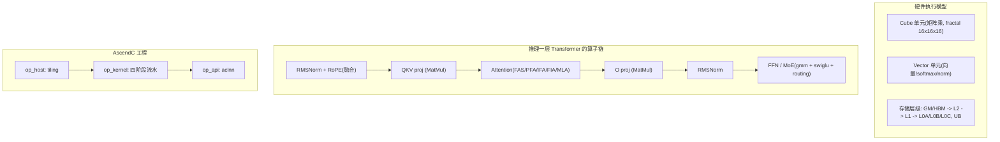

# 算子学习拓展 · 面试追问弹药

> 承接 `算子与图编译学习笔记.md`，把算子层的学习面从「FlashAttention + online softmax」向外扩一圈，覆盖昇腾常见的可能追问。
> 全部对照 `ops-transformer`（AscendC 算子）真实目录。定位：知道有哪些算子家族、各自解决什么、怎么组织、和 NVIDIA 怎么对照——够防守，不求手写。
> 诚实边界口径：主战场是框架/调度，算子层是"读源码理解 + Roofline 撑追问"，不谎称独立交付过 AscendC/HCCL kernel。

---

## 0. 一张图先建立全局



---

## 1. 昇腾硬件与执行模型基础（追问的"地基"）

被问算子几乎必先问硬件，先把地基背熟：

| 概念 | 要点 | 面试一句话 |
|---|---|---|
| **Cube / Vector 分离（达芬奇架构）** | AIC（Cube，矩阵乘）与 AIV（Vector，逐元素/归约）物理独立、各有指令队列，可并行 | "Cube 算 BMM，Vector 算 softmax/norm，两条流水错开跑" |
| **Cube fractal** | 最小执行粒度 `M×N×K = 16×16×16`，M<16 要 padding | "decode M=1 时 fractal 只 1/16 有效，其余是垃圾数据" |
| **存储层级** | GM/HBM → L2（硬件 LRU，透明）→ L1（512KB/核，软件管）→ L0A/L0B/L0C；Vector 侧 UB | "OI 里的 Bytes 专指 HBM↔片上；L1/L2 内复用不计" |
| **CV 分离 tiling** | Cube 基本块 `128×128`、Vector `8×1024`，1:16 配比减少 CV 通信 | "让 Cube 一次发大块，别被小块通信拖死" |
| **double buffer / ping-pong** | 搬运与计算流水重叠，同片数据串行、不同切片并行 | "掩盖 MTE2 搬运延迟，逼近 bound" |
| **多核切分** | 核间切 B/N/S 等轴，`totalSize` 远超核数才流水充盈 | "先核内按基本块，再核间按核数" |

> 深入背景（Roofline / OI / 屋脊点 / prefill 计算密集 vs decode 访存密集）已在 `docs/suanzi/ops-Q&A.md` 展开，追问到"为什么 decode 是访存密集"直接引用那份。

---

## 2. Attention 算子家族全景与选型（最可能追问）

`ops-transformer/attention/` 下算子极多，按"场景 × 架构"记，别死背名字：

| 算子 | 场景 | 关键点 | 路径（`attention/` 下）|
|---|---|---|---|
| **flash_attention_score (FAS)** | 训练 / 长 Q | 切 Q（`s1BaseSize=128`），Cube 满载；含反向 `_grad` | `flash_attention_score` |
| **prompt_flash_attention (PFA)** | 推理 Prefill | Q 长、计算密集；A2 上复用 FAS 的 RegBase kernel | `prompt_flash_attention` |
| **incre_flash_attention (IFA)** | 推理 Decode | Q=1，切 KV + 最后 reduce；`ALL_VEC` / `CUBE_VIEW_MM` 模式切换 | `incre_flash_attention` |
| **fused_infer_attention_score (FIA)** | 推理统一入口 | prefill/decode 融合，显式 `online_softmax/` 目录（学习首选）| `fused_infer_attention_score` |
| **mla_preprocess / mla_prolog** | DeepSeek-V3 MLA | 压 latent（576 维）/ 升维恢复 K/V | `mla_preprocess(_v2)`、`mla_prolog(_v1/2/3)` |
| **kv_quant_sparse_flash_attention** | MLA-absorb decode | 强制 `attentionMode=2`（MLA-absorb）| `kv_quant_sparse_flash_attention` |
| **sparse_flash_attention / sparse_flash_mla** | 稀疏/长序列 | 只算选中的 KV block | `sparse_flash_*` |
| **block_sparse_attention (BSA)** | 块稀疏 | 任务分核 L2 友好 | `block_sparse_attention(_grad)` |
| **NSA 系列 (nsa_*)** | Native Sparse Attention | compress + selected + indexer | `nsa_compress*`、`nsa_selected_attention*` |
| **scatter/gather_pa_kv_cache** | PagedAttention | 按 block_table 散列/聚集 KV cache | `scatter_pa_kv_cache`、`gather_pa_kv_cache` |

**选型口诀**：训练用 FAS（带反向）；推理 prefill 用 PFA、decode 用 IFA，或统一走 FIA；DeepSeek MLA 走 mla_preprocess/prolog + absorb attention；长序列上稀疏（sparse/BSA/NSA）。

**追问：为什么 prefill 和 decode 用不同算子？**
- PFA 切 Q（M=128，Cube 满）、不需要跨核 reduce；IFA 切 KV（Q 只 1 行）、需要跨核 reduce 合并各段 online softmax。多核策略正好反向：`PFA: B×N_kv×G×S1_outer`（切 Q）vs `IFA: B×N_q×S2_outer`（切 KV）。

---

## 3. FlashAttention 版本演进 + 反向 + 数值稳定

**版本演进（NVIDIA 语境，能对照即可）**：

| 版本 | 要点 |
|---|---|
| v1 | tiling + online softmax 框架 |
| v2 | Q 外层循环、更好的 warp 切分，减少非矩阵乘操作 |
| v3 | Hopper 专用：TMA + WGMMA，paged KV + FP8，`AttentionCGSupport.ALWAYS` |
| v4 | Blackwell，CuTeDSL |

**反向为什么要 recompute**：前向不物化 `S/P`（省 HBM），反向需要它们算梯度 → 用保存的 `m/l` 统计量重算 `S=QKᵀ`、`P`，**用算力换显存**。对应 `flash_attention_score_grad` 算子。

**safe softmax vs online softmax**：
- safe softmax：`softmax(x)_i = exp(x_i - max(x)) / Σexp(x_j - max(x))`，减 max 防溢出，但要看到整行。
- online softmax：把 max/sum 变成 running 状态，分块增量修正（见主笔记公式），数学等价 safe softmax，但不需一次看整行 → 才能 tiling。

---

## 4. 融合算子：RMSNorm / RoPE / SwiGLU 在本仓多是"融合形态"

**重要考点**：`ops-transformer` 里几乎找不到孤立的 `rms_norm` / `swiglu` 单算子，它们被**融合进更大的算子**——这正体现"减 HBM 往返"的算子设计哲学：

| 逻辑算子 | 在本仓的融合落点 | 说明 |
|---|---|---|
| RMSNorm + RoPE + 写 KV cache | `posembedding/qkv_rms_norm_rope_cache`、`kv_rms_norm_rope_cache` | norm→rope→cache 一个 kernel 做完，中间结果不落 GM |
| RoPE（旋转位置编码）| `posembedding/rotary_position_embedding`（`rotate_half` / `interleaved` 两类）| 有 `rope_rotate_half` / `rope_interleaved` 多套 tiling |
| SwiGLU（+量化）| `gmm/grouped_matmul_swiglu_quant(_v2)` | MoE 里 GEMM + SwiGLU + 量化融合 |
| MatMul + AllReduce + AddRMSNorm | `mc2/matmul_all_reduce_add_rms_norm` | 通算 + norm 三合一 |

**追问：为什么把 norm/rope/cache 融合？** 单独算 RMSNorm 是 Vector 小算子，启动开销 + `UB↔GM` 往返占比大；融合后中间结果留片上，一次搬运做完多步 → 省访存。这也解释了"aclgraph 不融合、GE 融合"里 GE 的收益来源。

---

## 5. MoE 算子链路（DeepSeek/Qwen MoE 追问）

`ops-transformer/moe/` + `gmm/` 组成 MoE 的完整链路：

```
gating(打分) -> topk 选专家 -> init_routing/permute(按专家重排 token)
   -> grouped_matmul(每专家 GEMM) -> swiglu -> unpermute/finalize_routing(还原顺序+加权)
```

| 阶段 | 算子 |
|---|---|
| 门控打分 + softmax | `moe/moe_gating_top_k_softmax(_v2)`、`moe_fused_topk` |
| 路由初始化 / token 重排 | `moe/moe_init_routing(_v2/v3)`、`moe_token_permute(_with_ep)` |
| 专家 GEMM（分组矩阵乘）| `gmm/grouped_matmul`、`grouped_matmul_swiglu_quant` |
| 结果还原 + 加权 | `moe/moe_token_unpermute`、`moe_finalize_routing(_v2)` |
| EP 跨卡分发/合并（通算）| `mc2/moe_distribute_dispatch(_v2/v3)`、`moe_distribute_combine*` |

**为什么用 grouped_matmul 而非普通 MatMul**：每个 token 只激活 top-k 个专家，不同专家权重不同、token 数不等 → 用分组矩阵乘一次处理多个不等长的 GEMM，避免 padding 浪费。

---

## 6. 通算融合 mc2（TP/EP 场景追问）

`ops-transformer/mc2/` 是**通信 + 计算融合**（Matmul-Communication，简称 MC2），对应主笔记里 GE"多流并行 / 通信计算掩盖"落到算子层：

| 算子 | 融合内容 | 用途 |
|---|---|---|
| `matmul_all_reduce` | GEMM + AllReduce | TP Row-Parallel 的 down_proj/o_proj |
| `matmul_reduce_scatter` / `all_gather_matmul` | GEMM + RS / AG | SP + TP 组合 |
| `matmul_all_reduce_add_rms_norm` | GEMM + AllReduce + AddRMSNorm | 进一步把 norm 也吸进来 |
| `moe_distribute_dispatch/combine` | All2All + 量化/norm | EP 专家并行的 token 分发合并 |

**收益本质**：让 AI Core 计算与 HCCL 通信在不同硬件资源上重叠（comm-compute overlap），把 all-reduce 的通信时延藏进 GEMM 计算里。对应 vllm-ascend 的 `npu_mm_all_reduce_base`。

---

## 7. 量化算子（W8A8 / KV 量化追问）

| 方向 | 本仓落点 | 要点 |
|---|---|---|
| 分组量化 GEMM | `gmm/quant_grouped_matmul_dequant`、`grouped_matmul_activation_quant` | per-channel / per-token scale |
| KV cache 量化 | `attention/kv_quant_sparse_flash_attention`、`posembedding/*with_k_scale` | KV 存 int8 省显存/带宽 |
| RoPE + 量化 + 写 cache | `posembedding/dequant_rope_quant_kvcache`、`rope_quant_kvcache` | 融合反量化→rope→量化→cache |

**per-token vs per-tensor**：per-token 每行一个 scale，精度高、开销大；per-tensor 全张量一个 scale，快但精度差。decode 常用 per-token 动态量化。

---

## 8. 算子融合三层次 + 与 NVIDIA 对照（高频对比题）

**昇腾融合三层次**（区分开是加分项）：

| 层次 | 机制 | 省什么 |
|---|---|---|
| **图融合（Graph Fusion）** | FE 引擎按规则改图（`Conv+BN+ReLU` 合一），数学层面合并 | 减 Kernel 数 |
| **UB 融合（Buffer Fusion）** | TBE/AscendC 把相邻算子中间结果留 UB，编译期拼成一个 Kernel | 省 `UB→GM→UB` 往返 |
| **SuperKernel（二进制融合）** | 不改子 kernel 计算逻辑，把多个已编译 kernel 用超级 kernel 串起一次启动 | 省 Device 逐 kernel 启动固定开销 |

**融合是查表还是自动生成**：大颗粒（FA/MLA/add_rms_norm）≈ **查表替换**（库里预写好的融合大算子 + 子图同构匹配）；UB 融合/小算子链 = **编译期 codegen**（DSL 描述 → 自动映射 Vector/Cube 流水）。介于纯查表和纯自动生成之间。

**与 NVIDIA 对照**：

| 维度 | NVIDIA | 昇腾 |
|---|---|---|
| 融合引擎 | TorchInductor + Triton codegen | FE 图融合 + TBE UB 融合 + 新栈 HFusion/AutoFuse |
| 任意算子链自动生成融合 | 能（Triton→PTX，库里无需预存）| 受限（主靠规则库匹配），新栈在补齐 |
| 大算子（attention/norm）| cuDNN / 手写 / FlashAttention | 预写融合大算子（FAS/FIA/MLA）|
| 主路径 vs 长尾 | CUDA 主路径 + Triton 补融合长尾 | AscendC 主路径 + 规则库融合 |

---

## 9. AscendC 编程模型（"你会写算子吗"防守）

**三段式**（比两段式更完整）：

```
op_host/    Host 侧: def(算子定义) + infershape + tiling(切分策略, 产出 TilingData)
op_kernel/  Device 侧: __aicore__ kernel, 按 TilingData 跑四阶段流水
op_api/     aclnn 接口: aclnnXxxGetWorkspaceSize + aclnnXxx(两段式调用)
op_graph/   (可选) GE 图模式注册
```

**四阶段流水**（以 FA 为例）：`IterateBmm1(QKᵀ) → ProcessVec1(online softmax) → IterateBmm2(PV) → ProcessVec2`。

**动态 shape 的 tiling 怎么走**（重要，连回 aclgraph）：
- 静态 shape：编译期算好 tiling 固化进 kernel（`block_dim` 定死）。
- 动态 shape（AscendC 主流）：Host 侧 `TilingFunc` 每次下发前跑，算出 `tiling data`（放 GM）+ `tilingKey`，指针作为入参传给 kernel，kernel 进来先读切分参数。
- **aclgraph 冻结**：捕获时 TilingFunc 跑一次，`tiling data / block_dim / 地址`全冻进图，重放不再跑 Host → 所以必须静态 shape，attention 才需 `update_attn_params` 打补丁重算 tiling。

---

## 10. 高频追问速答卡

1. **Cube 利用率为什么 decode 低？** M=1，fractal 16×16×16 只 1 行有效 → 1/16；且大部分时间等 KV 搬运。
2. **online softmax 怎么保证等价？** running max/sum + 修正因子 `exp(m_{i-1}-m_i)` 把旧状态缩放到新基准。
3. **FA 反向为什么 recompute？** 前向不存 S/P 省显存，反向用 m/l 重算，算力换显存。
4. **prefill/decode 算子差异？** PFA 切 Q 不 reduce，IFA 切 KV 需 reduce，多核策略反向。
5. **MLA absorb 为什么能拉 M=128？** latent KV 无 head 维度，128 个 head 共享一份 → 沿 M 拼 head。
6. **grouped_matmul 干嘛的？** MoE 里一次算多个不等长专家 GEMM，免 padding。
7. **MC2 融合收益？** 计算与 HCCL 通信重叠，藏通信时延。
8. **RMSNorm 为什么融合进 rope_cache？** Vector 小算子启动+搬运占比大，融合省 UB↔GM 往返。
9. **UB 融合 vs SuperKernel？** UB 融合省中间结果搬运（改计算逻辑），SuperKernel 省逐 kernel 启动开销（不改逻辑）。
10. **PagedAttention 在算子层？** `scatter/gather_pa_kv_cache` 按 block_table 散列/聚集非连续 KV。
11. **per-token vs per-tensor 量化？** per-token 每行 scale 精度高，decode 动态量化常用。
12. **昇腾能像 Triton 那样任意融合吗？** 传统受规则库限制，新栈（HFusion/AutoFuse/Triton-Ascend）在补齐。

---

## 11. 学习优先级建议（承接主笔记）

完整由浅入深正文：`00` 索引 + `08` 易混淆 + `01`~`07` + `06` 题库。  
**简历结合**：`09`–`14`、`21`、`23`；**交界补强**：`15`–`22`。本篇保留为**速查卡**。

1. 入门：`算子基础术语` → `08`
2. 核心：`算子与图编译学习笔记`
3. 展开：`01`–`07`、`14`–`23`
4. 简历冲刺：`09` → `14` → `13` → `12` → `10` → `15` → `16` → `21` → `23`/`24`
5. 闭环：`06`；深度：`ops-Q&A`（MLA 先读 `19`）

---

## 12. 本仓索引

- 总索引与验收：`docs/suanzi/00-推理算子学习索引与覆盖清单.md`（冲刺一页纸 + §11 模考确认）
- 主笔记：`docs/suanzi/算子与图编译学习笔记.md`
- Roofline / OI / prefill-decode 深度：`docs/suanzi/ops-Q&A.md`（可信摘要：`19`）
- 60 秒口述 + 计时模考：`21`；用词对照：`24`；Tool 交界：`23`
- FA / CUDA Graph / 融合（vLLM 侧）：`docs/2026-07-10/02-算子层加速FlashAttention-CUDAGraph专题.md`
- 算子源码仓：`ops-transformer/`（attention / ffn / gmm / moe / mc2 / posembedding）
- 图下发运行时：`runtime/`（aclgraph 设计文档 + model_ri 样例）
- 简历 PDF：`cvs/林炜-推理框架方向.pdf`
- 外链导航：`docs/suanzi/外链一览-KV与面试复盘.md`
