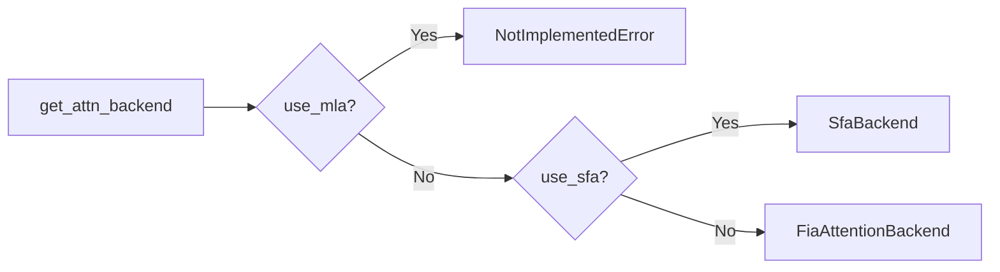
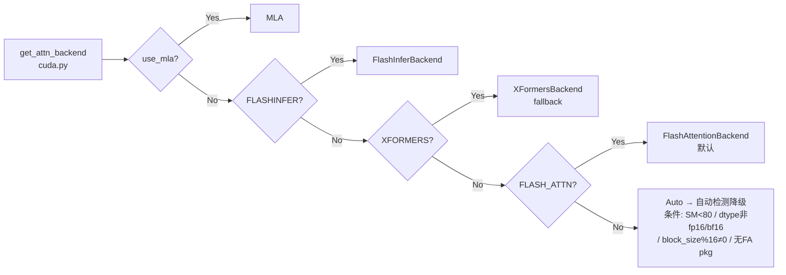
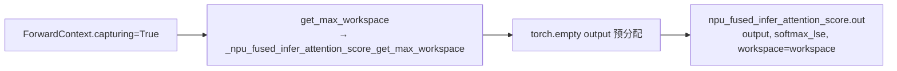

# Flash Attention 与算子加速

> 来源: 3 files | 最后更新: 2026-07-11

## 核心概念

> **MindIE Flash Attention 昇腾 NPU 实现** | 类型: repo | 标签: `architecture`, `attention`, `inference`, `npu`, `mindie`

# Flash Attention 昇腾 NPU 实现
*(来源: wiki/repos/mindie-pyserver/flash-attention.md)*

> **Flash Attention 深度分析**

# Flash Attention 落地流程
*(来源: wiki/raw/articles/pyserver/flash_attention_deep_analysis.md)*

## 深入分析

### 注意力层调用链路

```mermaid
flowchart TB
    subgraph MindIE[MindIE-LLM-PyServer]
        A1[Qwen2Attention<br/>qwen2.py · QKV + RoPE]
        A2[AttentionLayer<br/>attention_layer.py]
        A3[get_attn_backend<br/>→ Fia / Sfa 工厂]
        A4[FiaAttentionBackendImpl<br/>fia_attention.py]
        A5[torch_npu FIA Kernel<br/>npu_fused_infer_attention_score]
        A1 --> A2 --> A3 --> A4 --> A5
    end

    subgraph vLLM[vLLM v0.8.3]
        B1[Model Attention<br/>Qwen2 / Llama]
        B2[Attention nn.Module<br/>layer.py]
        B3[get_attn_backend<br/>→ selector.py + cuda.py]
        B4[FlashAttentionImpl<br/>flash_attn.py]
        B5[flash_attn_varlen_func / flash_attn_with_kvcache]
        B1 --> B2 --> B3 --> B4 --> B5
    end
```



MindIE 使用单个 FIA 融合算子覆盖 Prefill + Decode，通过 `input_layout` 参数（TND/BSH）切换模式。[^flash]

*(来源: wiki/repos/mindie-pyserver/flash-attention.md)*

### Backend 选择

**MindIE** — 极简二选一：



**vLLM** — 多 Backend + 自动降级链：



| Backend | 平台 | Prefill | Decode | 备注 |
|---------|------|---------|--------|------|
| FiaAttentionBackend | Ascend NPU | `npu_fused_infer_attention_score` TND | 同 API，BSH + block_table | 默认，block_size=128 |
| SfaBackend | Ascend NPU | Sparse FA | Sparse decode | `use_sfa=True` |
| FLASH_ATTN | CUDA | `flash_attn_varlen_func` | `flash_attn_with_kvcache` | 默认（条件满足时） |
| FLASHINFER | CUDA | BatchPrefillWithPagedKVCache | BatchDecodeWithPagedKVCache | FP8 KV 友好 |
| XFORMERS | CUDA | memory_efficient_attention | PagedAttention v1/v2 | Fallback |

*(来源: wiki/repos/mindie-pyserver/flash-attention.md)*

### Prefill 路径对比

**MindIE** 使用 **TND** layout（Token × Num_heads × head_dim）：

```
seq_lens = torch.cumsum(attn_metadata.seq_lens, dim=0)
attn_output, _ = torch_npu.npu_fused_infer_attention_score(
    query=query, key=key, value=value,
    block_table=None, input_layout="TND",
    actual_seq_lengths=seq_lens.to(torch.int64),
    sparse_mode=3)  # sliding window via NPU fusion
```

**vLLM** 使用 **1D flattened + cu_seqlens**：

```
attn_output = flash_attn_varlen_func(
    q=query, k=key, v=value,
    cu_seqlens_q=seq_start_loc, cu_seqlens_k=seq_start_loc,
    max_seqlen_q=max_prefill_seq_len, max_seqlen_k=max_prefill_seq_len,
    causal=True, window_size=...)
```

| 对比项 | MindIE | vLLM |
|--------|--------|------|
| 布局 | TND: `(tokens, num_heads, head_dim)` | Varlen: flattened 1D + cu_seqlens |
| 变长边界 | `actual_seq_lengths = cumsum(seq_lens)` | `cu_seqlens_q / cu_seqlens_k` |
| Mask | `atten_mask` 显式传入 | causal=True 内建 |
| Prefix Cache | block_table=None（prefill 路径） | Case C: block_table + seqused_k |
| Sliding Window | `sparse_mode=3` | `window_size` 参数 |

*(来源: wiki/repos/mindie-pyserver/flash-attention.md)*

### Decode 路径对比

**MindIE** reshape query 为 BSH 并传入 block_table：

```
query = query.view(batch_size, 1, self.q_size)  # BSH
attn_output, _ = torch_npu.npu_fused_infer_attention_score(
    input_layout="BSH", block_table=block_tables,
    actual_seq_lengths=[1] * len(seq_lens),
    actual_seq_lengths_kv=seq_lens,
    antiquant_scale=self.quant_method.kv_dequant_scale if ... else None)
```

**vLLM** 默认使用专用 `flash_attn_with_kvcache`：

```
attn_output = flash_attn_with_kvcache(
    q=decode_query.unsqueeze(1),
    k_cache=key_cache, v_cache=value_cache,
    block_table=block_tables, cache_seqlens=seq_lens, causal=True, ...)
```

| 对比项 | MindIE | vLLM FA | vLLM Fallback |
|--------|--------|---------|---------------|
| Query 形状 | `(batch, 1, q_size)` BSH | `(batch, 1, heads, dim)` | `(batch, heads, dim)` |
| KV 来源 | flatten paged cache | flat k_cache / v_cache | split key/value cache views |
| Kernel | npu_fused_infer_attention_score | flash_attn_with_kvcache | paged_attention_v1/v2 CUDA |

*(来源: wiki/repos/mindie-pyserver/flash-attention.md)*

### KV Cache 管理

| 参数 | MindIE (FIA) | vLLM (FA) |
|------|-------------|-----------|
| 写入 API | `torch_npu._npu_reshape_and_cache` | `torch.ops._C_cache_ops.reshape_and_cache_flash` |
| block_size | 128（硬编码） | 可配置，默认 16 |
| block_table shape | `[batch, 64]` input_buffer 预分配 | `[batch, max_blocks_per_seq]` |
| slot_mapping | `slot_indices` 参数名 | `slot_mapping` tensor |
| 量化 KV | AttentionQuant + C8 int8 | FP8 via FA3 (SM9x) 或 FlashInfer |

*(来源: wiki/repos/mindie-pyserver/flash-attention.md)*

### Fullgraph / CUDA Graph 路径

MindIE 通过 `ForwardContext.capturing` 触发 `apply_fullgraph_attention`：



vLLM 注册 `torch.ops.vllm.unified_attention` custom op 支持 cudagraph。

*(来源: wiki/repos/mindie-pyserver/flash-attention.md)*

### 设计洞察

MindIE 以 CANN FIA 融合算子为核心，用最少 Backend 实现昇腾原生 Attention。**融合算子 vs 分步 Attention**：昇腾 CANN 对 Attention 提供了高度优化的 FIA 融合实现，一次调用完成 QK^T、Softmax、AV 及 paged KV 读取。优势是 Python 层代码简洁（~310 行 Impl），代价是与 CANN 强绑定，可移植性低。[^flash]

[^flash]: [[raw/articles/pyserver/flash_attention_deep_analysis.md]]

*(来源: wiki/repos/mindie-pyserver/flash-attention.md)*

### 1\. 应用背景

### 1.1 Flash Attention 解决了什么问题

标准 Self-Attention 在序列长度 _n_ 时需要 materialize 完整的 _n×n_ 注意力矩阵，显存/内存复杂度为 O(n²)，且大量 HBM↔SRAM 数据搬运成为瓶颈。Flash Attention 通过 **IO-aware tiling** 将 Q/K/V 分块加载到片上 SRAM，在线计算 softmax 与加权求和，将内存复杂度降至 O(n)，同时保持数值等价。

标准 Attention O(n²) 显存 · 全矩阵写回 HBM Flash Attention O(n) 显存 · Tiling + Online Softmax Paged KV Cache block_table 间接寻址 Continuous Batching 推理框架将 Flash Attention 与 Paged KV Cache 结合，支撑高吞吐 serving

从 O(n²) 内存到 IO-aware 分块，再到分页 KV 与连续批处理

痛点| 传统方案| Flash Attention 方案  
---|---|---  
长上下文显存| 存储完整 attention map| 分块计算，不 materialize 全矩阵  
内存带宽| 反复读写 HBM| Tile 驻留 SRAM，减少 IO  
批处理多样性| Padding 浪费算力| Varlen / TND 等紧凑布局  
Decode 阶段| 逐 token 扩展 KV| Paged cache + 专用 decode kernel  
  
### 1.2 各自为什么选择了特定方案

**硬件决定 API 形态** MindIE 面向昇腾 NPU，直接调用华为 `torch_npu.npu_fused_infer_attention_score` 单一融合算子；vLLM 面向 NVIDIA GPU，采用开源 `vllm-flash-attn` 分叉包，Prefill 用 `flash_attn_varlen_func`，Decode 用 `flash_attn_with_kvcache`。 

维度| MindIE| vLLM  
---|---|---  
硬件| 昇腾 NPU — CANN / torch_npu 生态| NVIDIA GPU — CUDA / cuDNN 生态  
核心策略| 单个 FIA 融合算子覆盖 Prefill + Decode| Prefill/Decode 分离 API + 多 Backend 降级  
Backend 数量| 2（FiaAttentionBackend / SfaBackend）| 10+（FA / FlashInfer / XFormers / SDPA / …）  
历史路径| ATB Graph SelfAttention（examples/atb_models）| PagedAttention CUDA kernel → FA with kvcache  
  
### 1.3 在各自整体架构中的定位

Attention 在推理栈中的位置

MindIE-LLM-PyServer

Qwen2Attentionqwen2.py · QKV + RoPE

↓

AttentionLayerattention_layer.py

↓

get_attn_backend()Fia / Sfa 工厂

↓

FiaAttentionBackendImplfia_attention.py

↓

torch_npu FIA Kernelnpu_fused_infer_attention_score

vLLM v0.8.3

Model LayerQwen2 / Llama Attention

↓

Attention(nn.Module)layer.py

↓

get_attn_backend()selector.py + cuda.py

↓

FlashAttentionImplflash_attn.py

↓

vllm_flash_attn / PagedAttnvarlen_func / with_kvcache

*(来源: wiki/raw/articles/pyserver/flash_attention_deep_analysis.md)*

### 2\. 整体架构对比

### 2.1 分层链路对比（Model → Kernel）

Layer 1 — Model

Qwen2AttentionMindIE runtime/models/qwen2

Model Attention Modulevllm/model_executor

↓

Layer 2 — Attention Layer

Attention + AttentionQuantprefix 注册 · C8 量化

Attention + unified_attention opCUDA Graph 兼容

↓

Layer 3 — Backend Factory

get_attn_backend(use_sfa)2 路分支

get_attn_backend + platform10+ 路 + env 覆盖

↓

Layer 4 — Impl

FiaAttentionBackendImplprefill / decode / fullgraph

FlashAttentionImplsplit prefill/decode query

↓

Layer 5 — Kernel

npu_fused_infer_attention_scoreTND prefill · BSH decode

flash_attn_varlen_func / flash_attn_with_kvcache或 paged_attention_v1/v2 fallback

### 2.2 关键类名与职责映射

抽象角色| MindIE 类| vLLM 类| 关键差异  
---|---|---|---  
Backend 工厂| `FiaAttentionBackend`| `FlashAttentionBackend`| MindIE 无 Metadata/State/Builder 完整五件套  
Impl| `FiaAttentionBackendImpl`| `FlashAttentionImpl`| MindIE 同一 API 分 layout；vLLM 分两个 flash 函数  
Metadata| `FiaAttentionMetadata` \+ ForwardContext| `FlashAttentionMetadata` \+ Builder| MindIE 用 input_buffer D2D copy  
阶段判定| `ForwardContext.is_prefill`| `num_prefill_tokens` 切分 query| MindIE 显式 flag；vLLM 按 token 边界  
KV 写入| `_npu_reshape_and_cache`| `reshape_and_cache_flash`| slot_mapping vs slot_indices 命名  
Graph Capture| `apply_fullgraph_attention`| `unified_attention` custom op| workspace 预分配 vs op 注册

*(来源: wiki/raw/articles/pyserver/flash_attention_deep_analysis.md)*

### 3\. Backend 选择机制

### 3.1 MindIE Backend 选择

get_attn_backend() use_mla? Yes NotImplementedError No use_sfa? Yes SfaBackend No FiaAttentionBackend

MindIE backend/__init__.py — 极简二选一，默认 FIA

### 3.2 vLLM Backend 选择决策树

get_attn_backend() → cuda.py use_mla → MLA FLASHINFER XFORMERS FLASH_ATTN / Auto Auto-detect 降级条件（任一命中 → XFormers） SM < 80 dtype 非 fp16/bf16 block_size % 16 ≠ 0 head_size 不支持 无 FA pkg FlashAttentionBackend XFormersBackend (fallback) VLLM_ATTENTION_BACKEND 环境变量可强制覆盖

vLLM selector.py + platforms/cuda.py — 多 Backend + 自动降级链

### 3.3 Backend 对比表

Backend| 平台| Prefill| Decode| 备注  
---|---|---|---|---  
FiaAttentionBackend| Ascend NPU| `npu_fused_infer_attention_score` TND| 同 API，BSH + block_table| 默认路径，block_size=128  
SfaBackend| Ascend NPU| Sparse FA| Sparse decode| `use_sfa=True` 启用  
FLASH_ATTN| CUDA| `flash_attn_varlen_func`| `flash_attn_with_kvcache`| 默认（条件满足时）  
FLASHINFER| CUDA| BatchPrefillWithPagedKVCache| BatchDecodeWithPagedKVCache| FP8 KV 友好  
XFORMERS| CUDA| memory_efficient_attention| PagedAttention v1/v2| Fallback，保留原始 CUDA kernel  
TORCH_SDPA| 通用| F.scaled_dot_product_attention| PagedAttention| 最低依赖路径

*(来源: wiki/raw/articles/pyserver/flash_attention_deep_analysis.md)*

### 4\. 核心实现深度分析

### 4.1 KV Cache 管理

MindIE vLLM key, value AttnQuant C8 _npu_reshape_and_cache key, value reshape_and_cache_flash Paged KV: key_cache / value_cache slot_indices ← slot_mapping · block_size=128 Paged KV: [2, num_blocks, block_size, kv_heads, head_size] slot_mapping · block_size 可配 (默认 16)

两侧均使用 Paged KV + slot mapping，MindIE 额外支持 C8 量化写入

参数| MindIE (FIA)| vLLM (FA)  
---|---|---  
写入 API| `torch_npu._npu_reshape_and_cache`| `torch.ops._C_cache_ops.reshape_and_cache_flash`  
block_size| 128（fia_attention.py 硬编码）| 可配置，默认 16  
block_table shape| `[batch, 64]` input_buffer 预分配| `[batch, max_blocks_per_seq]`  
slot_mapping| `slot_indices` 参数名| `slot_mapping` tensor  
量化 KV| AttentionQuant + C8 int8| FP8 via FA3 (SM9x) 或 FlashInfer  
Cache 绑定| Impl 内 `self.key_cache` 懒绑定| forward 传入 kv_cache tuple  
  
MindIE — reshape_and_cache (fia_attention.py)

171| torch_npu._npu_reshape_and_cache( key=key_int8 if self.quant_method else key, value=value_int8 if self.quant_method else value, key_cache=kv_cache[0], value_cache=kv_cache[1], slot_indices=attn_metadata.slot_mapping)  
---|---  
  
### 4.2 Prefill 路径

Prefill 阶段处理新 prompt token 的自注意力。MindIE 使用 **TND** layout（Token × Num_heads × head_dim），通过 `cumsum(seq_lens)` 构造变长边界；vLLM 使用 FlashAttention 标准的 **1D flattened + cu_seqlens** 接口。

MindIE — apply_prefill_attention (fia_attention.py:179-200)

181| seq_lens = torch.cumsum(attn_metadata.seq_lens, dim=0)  
---|---  
184| attn_output, _ = torch_npu.npu_fused_infer_attention_score(  
185|  query=query, key=key, value=value,  
189|  block_table=None,  
190|  input_layout="TND",  
192|  actual_seq_lengths=seq_lens.to(torch.int64),  
197|  sparse_mode=3, # sliding window via NPU fusion  
198| )  
  
vLLM — Prefill Case A: 首次 prompt (flash_attn.py 逻辑)

—| attn_output = flash_attn_varlen_func(  
---|---  
—|  q=query, k=key, v=value,  
—|  cu_seqlens_q=seq_start_loc, cu_seqlens_k=seq_start_loc,  
—|  max_seqlen_q=max_prefill_seq_len, max_seqlen_k=max_prefill_seq_len,  
—|  causal=True, window_size=..., ...)  
  
对比项| MindIE Prefill| vLLM Prefill  
---|---|---  
布局| TND: `(tokens, num_heads, head_dim)`| Varlen: flattened 1D + cu_seqlens  
变长边界| `actual_seq_lengths = cumsum(seq_lens)`| `cu_seqlens_q / cu_seqlens_k`  
Mask| `atten_mask` 显式传入| causal=True 内建  
Prefix Cache| block_table=None（prefill 路径）| Case C: block_table + seqused_k  
Sliding Window| `sparse_mode=3`| `window_size` 参数  
  
### 4.3 Decode 路径

Decode 阶段每序列仅 1 个新 query token，需从 Paged KV Cache 读取历史 K/V。MindIE reshape query 为 BSH 并传入 block_table；vLLM 默认路径使用专用 `flash_attn_with_kvcache`，Fallback 走 PagedAttention CUDA kernel。

MindIE Decode query BSH flatten KV cache npu_fused_inferBSH + block_table vLLM Decode query unsqueeze(1) flash_attn_with_kvcacheblock_table + cache_seqlens Fallback: PagedAttention.forward_decode → paged_attention_v1/v2

MindIE 统一 FIA 算子；vLLM FA 路径用 with_kvcache，XFormers 降级用 PagedAttention

MindIE — apply_decode_attention (fia_attention.py:202-230)

206| query = query.view(batch_size, 1, self.q_size) # BSH  
---|---  
214| attn_output, _ = torch_npu.npu_fused_infer_attention_score(  
220|  input_layout="BSH", block_table=block_tables,  
224|  actual_seq_lengths=[1] * len(seq_lens),  
225|  actual_seq_lengths_kv=seq_lens,  
226|  antiquant_scale=self.quant_method.kv_dequant_scale if self.quant_method else None,  
  
vLLM — Standard Decode (flash_attn.py)

—| attn_output = flash_attn_with_kvcache(  
---|---  
—|  q=decode_query.unsqueeze(1),  
—|  k_cache=key_cache, v_cache=value_cache,  
—|  block_table=block_tables, cache_seqlens=seq_lens,  
—|  causal=True, ...)  
  
对比项| MindIE| vLLM FA| vLLM Fallback  
---|---|---|---  
Query 形状| `(batch, 1, q_size)` BSH| `(batch, 1, heads, dim)`| `(batch, heads, dim)`  
KV 来源| flatten paged cache| flat k_cache / v_cache| split key/value cache views  
Kernel| npu_fused_infer_attention_score| flash_attn_with_kvcache| paged_attention_v1/v2 CUDA  
Multi-query decode| 不支持 (query_len=1)| speculative: varlen_func| —  
KV 反量化| antiquant_scale/offset| FA3 FP8 dequant| kernel param KV_DTYPE  
  
### 4.4 Fullgraph / CUDA Graph 路径

Decode 阶段的 Graph Capture 要求算子输入输出地址固定。MindIE 通过 `ForwardContext.capturing` 触发 `apply_fullgraph_attention`，预分配 workspace 并使用 `.out()` 变体；vLLM 在 CUDA 平台注册 `torch.ops.vllm.unified_attention` custom op 以支持 cudagraph。

MindIE Fullgraph

ForwardContext.capturing=True

↓

get_max_workspace()

↓

torch.empty(output) 预分配

↓

npu_fused_infer_attention_score.out()

vLLM CUDA Graph

Attention.forward (CUDA)

↓

unified_attention custom op

↓

callback → impl.forward()

↓

unified_attention_with_output (decode)

维度| MindIE| vLLM  
---|---|---  
触发条件| `forward_context.capturing`| CUDA 平台 + batch-size padded decode  
Workspace| `_npu_fused_infer_attention_score_get_max_workspace`| Backend State 内复用 buffer  
输出分配| `torch.empty` \+ `.out([output, softmax_lse])`| `unified_attention_with_output`  
适用范围| Decode fullgraph| Decode only (prefill 通常不 capture)  
跨 Backend| FIA 专用| unified op 抽象所有 CUDA backend  
  
MindIE — apply_fullgraph_attention (fia_attention.py:232-277)

239| workspace = torch_npu._npu_fused_infer_attention_score_get_max_workspace(  
---|---  
253| output = torch.empty((batch_size, 1, self.num_heads * self.head_size), ...)  
260| torch_npu.npu_fused_infer_attention_score.out(  
273|  workspace=workspace, out=[output, softmax_lse],  
  
### 4.5 ATB 路径 (MindIE 特有)

除 runtime 层直接调用 `torch_npu` 外，MindIE 在 `examples/atb_models` 中保留了 ATB (Ascend Tensor Boost) Graph 构建路径，通过 `ATBFlashAttentionCommonOpBuilder` 将 SelfAttention 操作编入 ATB 计算图。

ATBFlashAttentionCommonOpBuilder is_match: AttnType.FLASH_ATTENTION + ATB add_reshape K/V add_reshape cache add_reshape V heads atb.BaseOperation(op_type="SelfAttention") 输入: Q,K,V,K_cache,V_cache,mask,token_offset,seq_len,layer_id → attention_out

ATB Graph 路径 — 编译期构图；runtime FIA 路径 — 运行时直接调 torch_npu 融合算子

路径| 调用层| 算子形态| 适用场景  
---|---|---|---  
Runtime FIA| mindie_llm/runtime/layers/attention| `npu_fused_infer_attention_score`| PyServer 主路径，Continuous Batching  
ATB Graph| examples/atb_models/atb_llm| `SelfAttention` ATB Operation| ATB 模型编译、Legacy 部署  
关系| ATB 为编译期 Graph 抽象；FIA 为 Eager 运行时融合 API，二者底层均依赖 CANN Attention 能力

*(来源: wiki/raw/articles/pyserver/flash_attention_deep_analysis.md)*

### 5\. 数据流完整追踪

### 5.1 MindIE 一次 Forward 调用链

Qwen2Attention.forward(hidden_states) QKV proj + RoPE AttentionLayer.forward(q,k,v) FiaAttentionBackendImpl.forward() reshape_and_cache → _npu_reshape_and_cache is_prefill? apply_prefill TND apply_fullgraph (capturing) apply_decode BSH cumsum seq_lens block_table + seq_lens

MindIE: ForwardContext 三态分支 — prefill / capturing / decode

### 5.2 vLLM 一次 Forward 调用链

Model Attention.forward(q,k,v) Attention.forward → unified_attention op FlashAttentionImpl.forward() reshape_and_cache_flash(key, value, slot_mapping) split query at num_prefill_tokens prefill decode flash_attn_varlen_funccu_seqlens · causal flash_attn_with_kvcacheblock_table · cache_seqlens XFormers: PagedAttention.forward_decode Chunked Prefill: prefill + decode tokens 同 batch，按边界切分

vLLM: Metadata 驱动 prefill/decode 切分，FA backend 统一 flash-attn 接口

阶段| MindIE 关键函数| vLLM 关键函数  
---|---|---  
QKV + RoPE| Qwen2Attention| Model-specific Attention  
Attention 入口| AttentionLayer → impl.forward| Attention → unified_attention op  
KV 写入| reshape_and_cache → _npu_reshape_and_cache| reshape_and_cache_flash  
阶段判定| ForwardContext.is_prefill / capturing| attn_metadata.num_prefill_tokens  
Prefill Kernel| npu_fused_infer_attention_score (TND)| flash_attn_varlen_func  
Decode Kernel| npu_fused_infer_attention_score (BSH)| flash_attn_with_kvcache

*(来源: wiki/raw/articles/pyserver/flash_attention_deep_analysis.md)*

### 6\. 竞品深度对比表

### 6.1 全维度对比

维度| MindIE-LLM-PyServer| vLLM (v0.8.3)  
---|---|---  
硬件平台| Ascend NPU (昇腾)| NVIDIA GPU (CUDA)  
核心 API| `torch_npu.npu_fused_infer_attention_score`| `flash_attn_varlen_func` / `flash_attn_with_kvcache`  
Backend 模式| 强类型 Backend 类 (Fia/Sfa) + Impl| 抽象 Backend + Impl + Metadata + Builder + State  
Prefill 布局| TND (token-num_heads-head_dim)| varlen (1D flattened + cu_seqlens)  
Decode 布局| BSH (batch-single-head_dim×num_heads)| BSH with unsqueeze(1)  
KV Cache 接口| `torch_npu._npu_reshape_and_cache`| `torch.ops._C_cache_ops.reshape_and_cache_flash`  
Block size| 128 (fia_attention.py 硬编码)| 可配置 (默认 16)  
量化 KV| AttentionQuant + C8 量化方法| FP8 KV cache via FA3  
Sliding window| sparse_mode=3 (via npu fusion)| window_size 参数  
Multi-query decode| 不支持 (decode query_len=1)| 支持 speculative decode (multi-query)  
Graph Capture| fullgraph 模式 + workspace 预分配| unified_attention custom op  
Backend 数量| 2 (Fia, Sfa)| 10+ (FA, FlashInfer, XFormers, SDPA, blocksparse, MLA, ROCm, HPU, IPE, Pallas)  
第三方依赖| torch_npu (华为)| vllm-flash-attn, flashinfer, xformers  
Legacy 路径| ATB SelfAttention Graph Builder| PagedAttention v1/v2 CUDA (XFormers fallback)

*(来源: wiki/raw/articles/pyserver/flash_attention_deep_analysis.md)*

### 7\. 设计洞察与架构决策

### 7.1 MindIE 为何选择单个 fused 算子

**融合算子 vs 分步 Attention** 昇腾 CANN 对 Attention 提供了高度优化的 FIA（Fused Infer Attention）融合实现，一次调用完成 QK^T、Softmax、AV 及 paged KV 读取。MindIE 无需像 vLLM 那样在 Python 层拆分 varlen prefill 与 kvcache decode 两个 API，而是通过 `input_layout`（TND/BSH）和 `block_table` 参数在同一算子内切换模式，降低 Python 调度开销并更好匹配 NPU 编译器融合策略。 

优势| 代价  
---|---  
Python 层代码简洁（~310 行 Impl）| 算子参数语义与 CANN 强绑定，可移植性低  
Prefill/Decode 统一 workspace 管理| layout 切换（TND↔BSH）需调用方保证 reshape 正确  
sparse_mode 内建 sliding window| 新特性需等待 CANN 算子升级  
  
### 7.2 vLLM 为何从 PagedAttention 迁移到 flash_attn_with_kvcache

vLLM 早期 XFormers 路径在 Decode 阶段使用自研 `paged_attention_v1/v2` CUDA kernel，Prefill 用 xformers memory_efficient_attention。FlashAttention v2/v3 原生支持 `block_table` 与变长序列后，`FlashAttentionBackend` 将 Decode 切换为 `flash_attn_with_kvcache`，PagedAttention kernel 仅作为 Fallback 保留。核心洞察：**flash-attn 的 paged decode 与 vLLM 的 PagedAttention 解决同一问题，但前者与 FA prefill 共享实现栈，减少维护两套 kernel 模板的成本。**

vLLM Decode 路径演进

vLLM v0.x 早期XFormers prefill + PagedAttn decode

→

FlashAttentionBackendvarlen prefill + with_kvcache decode

→

PagedAttn 仅 FallbackXFormers / TorchSDPA 降级路径

### 7.3 扩展性与可移植性权衡

维度| MindIE 取向| vLLM 取向  
---|---|---  
Backend 抽象深度| 浅 — Backend + Impl，Metadata 与 ForwardContext 耦合| 深 — 五件套 + Platform 选择 + env 覆盖  
硬件移植| 需新 CANN 算子或 ATB Operation| 新 Platform 模块 + 新 Backend 类即可  
降级策略| 无（NPU 单栈）| 10+ backend 自动/手动降级链  
社区生态| 华为 CANN / torch_npu 文档| flash-attn / flashinfer 开源社区  
Speculative Decode| 尚未支持 multi-query decode| varlen_func 处理多 query token  
  
### 7.4 Backend 抽象模式对 Ascend NPU 的启示

vLLM 的 Backend 模式证明：Attention 层只需固定接口（KV shape、Metadata、Impl.forward），即可在不动 Model 层的前提下切换 kernel 实现。MindIE 当前 FIA 路径已遵循 Backend/Impl 分离（借鉴 vllm-ascend），后续若引入 MLA、FlashInfer 等价 NPU 库或新 CANN 算子，可参照 vLLM 扩展 `get_attn_backend()` 分支而不修改 Qwen2Attention。关键集成面：

集成面| 当前 MindIE 状态| vLLM 参考  
---|---|---  
KV Cache| block_table + slot_mapping 已对齐| `reshape_and_cache_flash`  
Metadata| FiaAttentionMetadata + ForwardContext 耦合| Metadata + Builder + State 分离  
Graph Capture| workspace 预分配 + `.out()`| `unified_attention` custom op  
量化| C8 antiquant_scale/offset| FA3 FP8 dequant  
新 Backend 注册| `get_attn_backend(use_sfa)` 二选一| Platform.get_attn_backend_cls()  
  
**结论** MindIE 以 CANN FIA 融合算子为核心，用最少 Backend 实现昇腾原生 Attention；vLLM 以多层 Backend 抽象 + flash-attn 生态实现 GPU 最大兼容与降级。二者在 Paged KV、Prefill/Decode 分离、Graph Capture 等概念上高度同构，差异主要在硬件 API 形态与抽象粒度。 

📚 相关文档 [文档索引](<index.html>) [Scheduler 分析](<scheduler_deep_analysis.html>) [Prefix Cache 分析](<prefix_cache_analysis.html>)

分析日期: 2026-06-01 · 基于 MindIE-LLM-PyServer feat/py-config-manager 分支

参考: mindie_llm/runtime/layers/attention/, docs/research/vllm_flash_attention.md, vLLM v0.8.3 tag

Generated by Hermes Agent → Cursor Agent (composer-2.5-fast)

◀ 1/27 ▶

*(来源: wiki/raw/articles/pyserver/flash_attention_deep_analysis.md)*

### 0. 30 秒总览

> Decode 瓶颈通常是 **(1) Linear 的 memory-bound GEMV**、**(2) 随 ctx 增长的 KV 读取**、**(3) 小 batch launch 开销**。FlashAttention 用 SRAM tiling + online softmax 把 O(N²) HBM 读写砍掉。CUDA Graph 用 FULL / PIECEWISE / Breakable 三模式解决「固定 shape vs paged 动态」矛盾。昇腾侧对应 ATB 融合算子 + ACL/NPU Graph。

---

*(来源: interview/2026-07-10/02-算子层加速FlashAttention-CUDAGraph专题.md)*

### 1. FlashAttention

### 1.1 为什么快

朴素 Attention：S=QKᵀ、P=softmax(S)、O=PV —— S/P 反复进出 **HBM**，算力闲置。

| 机制 | 作用 |
|------|------|
| Tiling | Q/K/V 分块驻留 SRAM |
| 融合 | 块内完成 QK→softmax→×V，只写 O |
| Online Softmax | running max/sum，数学等价全行 softmax |
| Recompute（反向） | 不存 S，重算换显存 |

### 1.2 v1/v2/v3/v4 口述

| 版本 | 要点 | vLLM 证据 |
|------|------|-----------|
| v1 | tiling + online softmax 框架 | 默认回退 FA2 |
| v2 | Q 外层循环、更好 warp 切分 | `_vllm_fa2_C.varlen_fwd` |
| v3 | Hopper TMA+WGMMA；paged KV + scheduler_metadata + FP8 | `_vllm_fa3_C.fwd`；`AttentionCGSupport.ALWAYS` |
| v4 | Blackwell CuTeDSL | `fa_version==4` |

选择：`v1/attention/backends/fa_utils.py` → `get_flash_attn_version()`（SM90→FA3，SM100+→FA4，否则 FA2）。

### 1.3 vLLM 调用链

```
LlamaAttention.qkv_proj → RoPE → Attention.forward
  → FlashAttentionImpl.forward (v1/attention/backends/flash_attn.py)
       ├─ reshape_and_cache_flash()  # 写 paged KV
       └─ flash_attn_varlen_func(block_table, seqused_k, fa_version, ...)
            → FA2/FA3/FA4 C extension
```

---

*(来源: interview/2026-07-10/02-算子层加速FlashAttention-CUDAGraph专题.md)*

### 2. Decode Step Kernel 时间线

路径：`model_executor/models/llama.py` + `gpu_model_runner.py`

```
Embed → RMSNorm → QKV GEMV → RoPE → KV write → FA decode
     → O proj → RMSNorm → GateUp GEMV → silu_and_mul → Down GEMV
     × L 层 → LM Head → Sampler（图外）
```

**形状**：decode 时 M≈1（+spec），N=hidden 很大 → **GEMV / 窄 GEMM → memory-bound**。

perf 模型证据：`vllm/v1/metrics/perf.py` —— decode attention 读字节随 `decode_context_len` 线性增长。

**Prefill vs Decode**

| | Prefill | Decode |
|--|---------|--------|
| M | 大 | ≈1 |
| 形态 | 大 GEMM，偏 compute | GEMV，偏 memory |
| 优化 | FA tiling、chunked | CUDA Graph、融合、量化、凑 batch、投机 |

---

*(来源: interview/2026-07-10/02-算子层加速FlashAttention-CUDAGraph专题.md)*

### 3. CUDA Graph

### 3.1 为什么降延迟
把 L 层 × 多 kernel 的 launch 合成一次 replay，消灭 Python/driver 逐 op dispatch。小 batch decode 收益最大。

### 3.2 与 paged 的矛盾
Graph 要固定地址/shape；`block_table`/`seqused_k` 每步变；prefill 变长。

### 3.3 三模式（`config/compilation.py`）

```python
NONE / PIECEWISE / FULL
FULL_DECODE_ONLY / FULL_AND_PIECEWISE
```

| 模式 | 做法 |
|------|------|
| FULL | 整段 forward 一张图；FA3 可 `supports_update_block_table` 只更新 metadata |
| PIECEWISE | attention/KV 段 eager，其余段 capture（`piecewise_backend.py`） |
| Breakable | 单 capture 流在 attention op 处 break（受 SGLang 启发） |

Dispatcher：`v1/cudagraph_dispatcher.py` —— 按 `BatchDescriptor` 匹配；真实 batch **padding** 到 `cudagraph_capture_sizes`。

路径：
```
CompilationConfig.cudagraph_mode
  → CudagraphDispatcher
  → set_forward_context(...)
  → CUDAGraphWrapper replay/capture
```

SGLang：`decode_cuda_graph_runner.py` + piecewise 文档；NPU：`npu_cudagraph_backend.py`。

---

*(来源: interview/2026-07-10/02-算子层加速FlashAttention-CUDAGraph专题.md)*

### 4. 算子融合（仓内证据）

| 融合 | 路径 |
|------|------|
| RMSNorm + Quant | `compilation/passes/fusion/rms_quant_fusion.py` → `_C.rms_norm_dynamic_per_token_quant` |
| SwiGLU | `MergedColumnParallelLinear` + `_C.silu_and_mul`（`activation.py`） |
| SwiGLU+FP8 | Triton `silu_mul_per_token_group_quant_fp8`（`fp8_utils.py`） |
| QKV 合并 | `QKVParallelLinear`（`linear.py`）——三次 GEMV→一次，权重只读一遍 |
| QK Norm+RoPE | `fused_qk_norm_rope.py` |

---

*(来源: interview/2026-07-10/02-算子层加速FlashAttention-CUDAGraph专题.md)*

### 5. Triton vs CUDA

| | CUDA custom op | Triton |
|--|----------------|--------|
| 上限 | 最高 | 接近，靠 autotune |
| 效率 | 低 | 高 |
| 场景 | FA、GEMM、RMSNorm 主路径 | 量化/激活融合、长尾、快速迭代 |

金句：**CUDA 主路径 + Triton 补融合长尾**。

---

*(来源: interview/2026-07-10/02-算子层加速FlashAttention-CUDAGraph专题.md)*

### 6. 昇腾对照（诚实边界）

| NVIDIA | 昇腾/MindIE | 路径 |
|--------|-------------|------|
| CUDA Graph | ACL Graph / NPUGraph | `aclgraph_model_wrapper_exp.py`（Experimental） |
| FA / Paged | ATB `SelfAttention` / `PagedAttention` | `atb_*_common_op_builder.py` |
| 融合 | ATB Quant Linear、`npu_dequant_swiglu_quant` | 测试与 builder |

**可以说**：主路径是 ATB 图 + torch_npu；Prefill/Decode 分 op builder；bitmask apply 是算子组合。  
**不要说**：写过 AscendC 融合 kernel / 开发过 HCCL。

金句：优化目标一致（减 HBM、减 launch、融合 narrow op），实现栈不同。

---

*(来源: interview/2026-07-10/02-算子层加速FlashAttention-CUDAGraph专题.md)*

### 7. 面试 12 题（精简口述）

1. **FA 核心瓶颈？** HBM 上 O(N²) S/P 读写；tiling+online softmax 只写 O。
2. **Online Softmax 为何等价？** 维护 running max/sum，新块用 exp 缩放修正。
3. **FA2 vs FA3？** FA3 Hopper 专用，支持 scheduler_metadata/FP8/更好 paged；CG ALWAYS。
4. **调用链？** qkv→RoPE→FlashAttentionImpl→reshape_and_cache→varlen_func。
5. **Decode 瓶颈？** GEMV 读权重 + KV 随 ctx 增长 + launch。（必背）
6. **CG 为何快？** 一次 replay 替代逐 kernel launch。
7. **CG×paged 怎么解？** FULL+更新 metadata / PIECEWISE / Breakable + padding。
8. **RMSNorm+Quant？** FX pass 合成单 kernel，少一次 HBM round-trip。
9. **SwiGLU？** 合并 Gate+Up GEMM + silu_and_mul custom op。
10. **QKV 合并？** 权重一次读完，利于 TP 按 head 切。
11. **Triton vs CUDA？** 主路径 CUDA，融合长尾 Triton。
12. **Prefill/Decode 策略差？** Prefill 打满算力；Decode 打满带宽+降 launch。

---

*(来源: interview/2026-07-10/02-算子层加速FlashAttention-CUDAGraph专题.md)*

### 附录索引

- FA Backend：`vllm/v1/attention/backends/flash_attn.py`
- FA 接口：`vllm/vllm_flash_attn/flash_attn_interface.py`
- ModelRunner：`vllm/v1/worker/gpu_model_runner.py`
- CG：`vllm/compilation/cuda_graph.py`、`piecewise_backend.py`、`v1/cudagraph_dispatcher.py`
- Perf：`vllm/v1/metrics/perf.py`
- MindIE ATB：`mindie_llm/modeling/model_wrapper/atb/atb_model_wrapper.py`

*(来源: interview/2026-07-10/02-算子层加速FlashAttention-CUDAGraph专题.md)*

## 面试要点

**算子层加速：FlashAttention / 融合 / CUDA Graph / Decode 时间线**

# 算子层加速：FlashAttention / 融合 / CUDA Graph / Decode 时间线

> 基于 `vllm/`、`sglang/`、`MindIE-LLM/` 真实代码。JD 盲区 P0。
> 诚实边界：主战场在框架/调度；HCCL/AscendC 手写算子未独立交付——用 Roofline + 源码理解撑住追问。

---

*(来源: interview/2026-07-10/02-算子层加速FlashAttention-CUDAGraph专题.md)*

## 源文件索引

- wiki/repos/mindie-pyserver/flash-attention.md — MindIE Flash Attention 昇腾 NPU 实现
- wiki/raw/articles/pyserver/flash_attention_deep_analysis.md — Flash Attention 深度分析
- interview/2026-07-10/02-算子层加速FlashAttention-CUDAGraph专题.md — 算子层加速：FlashAttention / 融合 / CUDA Graph / Decode 时间线
