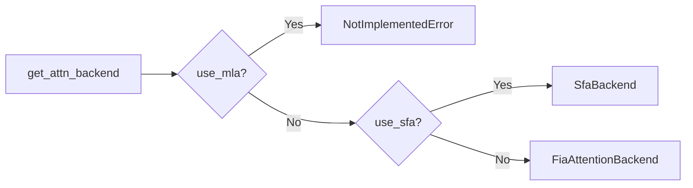
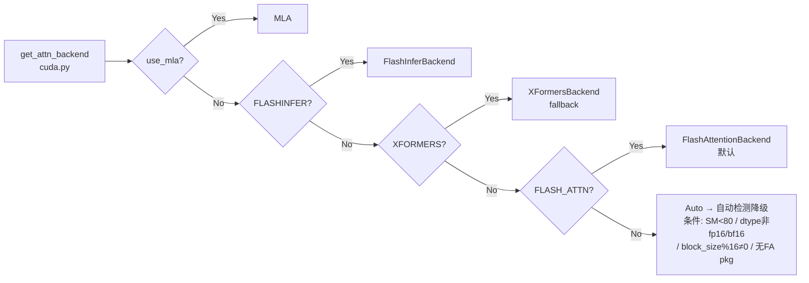

```mermaid
flowchart TB
    subgraph MindIE[MindIE-LLM-PyServer]
        A1[Qwen2Attention<br/>qwen2.py · QKV + RoPE]
        A2[AttentionLayer<br/>attention_layer.py]
        A3[get_attn_backend<br/>→ Fia / Sfa 工厂]
        A4[FiaAttentionBackendImpl<br/>fia_attention.py]
        A5[torch_npu FIA Kernel<br/>npu_fused_infer_attention_score]
        A1 --> A2 --> A3 --> A4 --> A5
    end

    subgraph vLLM[vLLM v0.8.3]
        B1[Model Attention<br/>Qwen2 / Llama]
        B2[Attention nn.Module<br/>layer.py]
        B3[get_attn_backend<br/>→ selector.py + cuda.py]
        B4[FlashAttentionImpl<br/>flash_attn.py]
        B5[flash_attn_varlen_func / flash_attn_with_kvcache]
        B1 --> B2 --> B3 --> B4 --> B5
    end
```

# Flash Attention 与算子加速
> 覆盖 24 个知识点 | 来源 5 个文件 | 更新于 2026-07-15

## 1. 一句话总结

Flash Attention 通过 **IO-aware tiling** 和 **online softmax** 将注意力计算的内存复杂度从 O(n²) 降至 O(n)，避免在 HBM 上物化完整的注意力矩阵。在推理框架落地中，MindIE 通过昇腾 CANN 的 `npu_fused_infer_attention_score` 单一融合算子覆盖 Prefill/Decode，vLLM 则采用 `flash_attn_varlen_func` 与 `flash_attn_with_kvcache` 分离 API 配合多 Backend 降级链。配合 Paged KV Cache 与 CUDA Graph/ACL Graph，三者共同支撑高吞吐 Continuous Batching 推理。

## 2. 核心原理

### 2.1 问题背景

标准 Self-Attention 在序列长度 _n_ 时需要物化完整的 _n×n_ 注意力矩阵，显存/内存复杂度为 O(n²)，且大量 HBM↔SRAM 数据搬运成为瓶颈。

| 痛点 | 传统方案 | Flash Attention 方案 |
|------|----------|---------------------|
| 长上下文显存 | 存储完整 attention map | 分块计算，不物化全矩阵 |
| 内存带宽 | 反复读写 HBM | Tile 驻留 SRAM，减少 IO |
| 批处理多样性 | Padding 浪费算力 | Varlen / TND 等紧凑布局 |
| Decode 阶段 | 逐 token 扩展 KV | Paged cache + 专用 decode kernel |

### 2.2 方案概述

Flash Attention 将 Q/K/V 分块加载到片上 SRAM，在块内完成 QKᵀ → softmax → 乘 V 的融合计算，仅将最终结果 O 写回 HBM。同时通过 **online softmax**（维护 running max/sum）保证分块计算的数值结果与全局 softmax 数学等价。

配合计算特性，推理引擎在 **Prefill** 阶段使用高算术强度切分策略（切 Q），在 **Decode** 阶段使用低算术强度切分策略（切 KV），并结合 Paged KV Cache 实现高效显存管理。

## 3. 实现细节

### 3.1 Flash Attention 加速机制

朴素 Attention 路径中，S = QKᵀ 和 P = softmax(S) 两个 O(n²) 矩阵反复进出 HBM，计算单元大量闲置。Flash Attention 通过四重机制解决：

| 机制 | 作用 |
|------|------|
| Tiling | Q/K/V 分块驻留 SRAM，避免全矩阵落地 HBM |
| 融合 | 块内完成 QK→softmax→×V，只写回输出 O |
| Online Softmax | 维护 running max/sum，数学等价于全行 safe softmax |
| Recompute（反向） | 不存储 S/P 矩阵，反向时重算换显存 |

#### Online Softmax 等价性（手算验证）

一行 score 切两块：`S₀=[2,1]`，`S₁=[3,0]`。

**一次性 safe softmax 标准答案：**
- 整行 max = 3
- exp = [e²⁻³, e¹⁻³, e³⁻³, e⁰⁻³] = [e⁻¹, e⁻², 1, e⁻³]
- sum ≈ 0.368 + 0.135 + 1 + 0.050 = 1.553
- P ≈ [0.237, 0.087, 0.644, 0.032]

**Online 分块：**
块 0：`m₀ = max(2,1) = 2`，`l₀ = e⁰ + e⁻¹ ≈ 1.368`
块 1：
- `m₁ = max(m₀, max(3,0)) = max(2,3) = 3`
- `scale = exp(m₀ - m₁) = exp(-1) ≈ 0.368`
- `l₁ = scale·l₀ + (e⁰+e⁻³) ≈ 0.368×1.368 + 1.050 ≈ 1.553` ✓

**核心公式：`scale = exp(m_old - m_new)`**，用新旧 max 的差值缩放累积值。

#### FA 版本演进

| 版本 | 要点 | vLLM 证据 |
|------|------|-----------|
| v1 | tiling + online softmax 基础框架 | 默认回退 FA2 |
| v2 | Q 外层循环、更好 warp 切分 | `_vllm_fa2_C.varlen_fwd` |
| v3 | Hopper TMA+WGMMA；paged KV + scheduler_metadata + FP8 | `_vllm_fa3_C.fwd`；`AttentionCGSupport.ALWAYS` |
| v4 | Blackwell CuTeDSL | `fa_version==4` |

选择逻辑：`v1/attention/backends/fa_utils.py` → `get_flash_attn_version()`（SM90→FA3，SM100+→FA4，否则 FA2）。

### 3.2 Prefill vs Decode：算力与访存的分水岭

算术强度 OI = FLOPs / 从 HBM 搬运的字节数，决定算子落在 Roofline 模型的哪一段。

| 维度 | Prefill | Decode |
|------|---------|--------|
| M（矩阵行数） | 大（整条 prompt） | ≈1（单 token） |
| 形态 | 大 GEMM，偏 compute-bound | GEMV，偏 memory-bound |
| OI 水平 | 高（一份 KV 服务很长 Q） | 低（搬权重+KV 只算一行） |
| 切分策略 | PFA（切 Q），Cube 易打满 | IFA（切 KV），Cube 常吃不满 |
| 优化方向 | Chunked prefill、TP、FA tiling | CUDA Graph、融合、量化、凑 batch |

**大 batch 对 FFN 和 Attention 的不同影响：**

- **FFN 共享权重**：多请求拼大 M，权重搬运被摊薄。粗算 OI 近似随 M 线性增长（OI ≈ M），M 到几十上百时有机会跨过屋脊点（昇腾 910B 约 209）。
- **Attention 各请求 KV 不同**：不能跨请求拼 KV/M，主要靠多核并行打满。要拉 Attention 的 M 需靠 GQA/MLA（head 维）或 MTP/SpecDec（token 维）。

**IFA 为何要跨核 reduce：**
- PFA 每个核负责不同的 Q 行块，各自输出自己的 O 行，无需合并 softmax 状态。
- IFA 的 Q 只有 1 行，KV 切给多个核，各核只有局部 `(m,l,O)`，必须按 online softmax 规则跨核合并才能得到全局正确输出。

### 3.3 MindIE 昇腾 NPU 实现

MindIE-LLM-PyServer 通过华为昇腾 CANN 生态提供的 `torch_npu.npu_fused_infer_attention_score`（FIA）融合算子实现 Flash Attention，与 vLLM 基于 flash-attn 开源库的路径有本质差异。

#### 调用链路



MindIE 使用单个 FIA 融合算子覆盖 Prefill + Decode，通过 `input_layout` 参数（TND/BSH）切换模式。

#### Prefill 路径（TND Layout）

使用 **TND** layout（Token × Num_heads × head_dim），通过 `cumsum(seq_lens)` 构造变长边界：

```python
# fia_attention.py:179-200
seq_lens = torch.cumsum(attn_metadata.seq_lens, dim=0)
attn_output, _ = torch_npu.npu_fused_infer_attention_score(
    query=query, key=key, value=value,
    block_table=None,           # Prefill 路径无需 block_table
    input_layout="TND",
    actual_seq_lengths=seq_lens.to(torch.int64),
    sparse_mode=3               # Sliding window via NPU fusion
)
```

#### Decode 路径（BSH Layout）

Query reshape 为 BSH 并传入 block_table，统一 FIA 算子：

```python
# fia_attention.py:202-230
query = query.view(batch_size, 1, self.q_size)  # BSH
attn_output, _ = torch_npu.npu_fused_infer_attention_score(
    input_layout="BSH",
    block_table=block_tables,
    actual_seq_lengths=[1] * len(seq_lens),
    actual_seq_lengths_kv=seq_lens,
    antiquant_scale=self.quant_method.kv_dequant_scale if self.quant_method else None
)
```

#### Fullgraph 路径

通过 `ForwardContext.capturing` 触发 `apply_fullgraph_attention`，预分配 workspace 并使用 `.out()` 变体：

```python
# fia_attention.py:232-277
workspace = torch_npu._npu_fused_infer_attention_score_get_max_workspace(...)
output = torch.empty((batch_size, 1, self.num_heads * self.head_size), ...)
torch_npu.npu_fused_infer_attention_score.out(
    ..., workspace=workspace, out=[output, softmax_lse]
)
```

#### KV Cache 管理

| 参数 | MindIE (FIA) | vLLM (FA) |
|------|-------------|-----------|
| 写入 API | `torch_npu._npu_reshape_and_cache` | `torch.ops._C_cache_ops.reshape_and_cache_flash` |
| block_size | 128（硬编码） | 可配置，默认 16 |
| block_table shape | `[batch, 64]` input_buffer 预分配 | `[batch, max_blocks_per_seq]` |
| slot_mapping | `slot_indices` 参数名 | `slot_mapping` tensor |
| 量化 KV | AttentionQuant + C8 int8 | FP8 via FA3 (SM9x) 或 FlashInfer |

```python
# fia_attention.py:171 — reshape_and_cache
torch_npu._npu_reshape_and_cache(
    key=key_int8 if self.quant_method else key,
    value=value_int8 if self.quant_method else value,
    key_cache=kv_cache[0], value_cache=kv_cache[1],
    slot_indices=attn_metadata.slot_mapping
)
```

#### ATB 路径（MindIE 特有）

除 runtime 层直接调用 `torch_npu` 外，MindIE 在 `examples/atb_models` 中保留了 ATB (Ascend Tensor Boost) Graph 构建路径，通过 `ATBFlashAttentionCommonOpBuilder` 将 SelfAttention 操作编入 ATB 计算图。ATB 为编译期 Graph 抽象，FIA 为 Eager 运行时融合 API，二者底层均依赖 CANN Attention 能力。

### 3.4 vLLM CUDA 实现

vLLM 早期 XFormers 路径在 Decode 阶段使用自研 `paged_attention_v1/v2` CUDA kernel。FlashAttention v2/v3 原生支持 `block_table` 与变长序列后，`FlashAttentionBackend` 将 Decode 切换为 `flash_attn_with_kvcache`，PagedAttention kernel 仅作为 Fallback 保留。

#### 调用链

LlamaAttention.qkv_proj → RoPE → Attention.forward
  → FlashAttentionImpl.forward (v1/attention/backends/flash_attn.py)
       ├─ reshape_and_cache_flash()  # 写 paged KV
       └─ flash_attn_varlen_func(block_table, seqused_k, fa_version, ...)
            → FA2/FA3/FA4 C extension

#### Prefill 路径（Varlen Layout）

使用 FlashAttention 标准的 **1D flattened + cu_seqlens** 接口：

```python
attn_output = flash_attn_varlen_func(
    q=query, k=key, v=value,
    cu_seqlens_q=seq_start_loc, cu_seqlens_k=seq_start_loc,
    max_seqlen_q=max_prefill_seq_len, max_seqlen_k=max_prefill_seq_len,
    causal=True, window_size=...
)
```

#### Decode 路径

```python
attn_output = flash_attn_with_kvcache(
    q=decode_query.unsqueeze(1),
    k_cache=key_cache, v_cache=value_cache,
    block_table=block_tables, cache_seqlens=seq_lens,
    causal=True, ...
)
```

#### CUDA Graph 路径

vLLM 注册 `torch.ops.vllm.unified_attention` custom op 以支持 cudagraph。三模式（`config/compilation.py`）：

| 模式 | 做法 |
|------|------|
| FULL | 整段 forward 一张图；FA3 可 `supports_update_block_table` 只更新 metadata |
| PIECEWISE | attention/KV 段 eager，其余段 capture（`piecewise_backend.py`） |
| Breakable | 单 capture 流在 attention op 处 break（受 SGLang 启发） |

Dispatcher：`v1/cudagraph_dispatcher.py` —— 按 `BatchDescriptor` 匹配；真实 batch padding 到 `cudagraph_capture_sizes`。

### 3.5 Graph Capture 与 Paged Attention 的动态冲突

CUDA Graph / ACL Graph 要求算子输入输出地址固定（捕获时冻结 tiling/地址），但 Paged Attention 的 `block_table` 和 `seq_lens` 每一步都在变化。

| 方案 | 实现 |
|------|------|
| FULL + 更新 metadata | FA3 支持只更新调度元数据，不改 tensor 地址 |
| PIECEWISE | 只捕获非 attention 段，attention 段保持 eager |
| Breakable | 单 capture 流中在 attention op 处 break |
| TaskUpdate / update_attn_params | 昇腾侧 hook，重放时注入动态参数 |

**aclgraph vs GE 的区别（昇腾语境）：**
- **aclgraph**：运行期 Capture & Replay，只省 Host 逐 kernel 下发；不融合，Device 负载基本不变。
- **GE**：编译期整图优化（融合/内存复用/多流），真降 Device 负载。
- 选型：Host-bound（小 shape、Decode、层多） → 先 Graph；Device 忙且可融合/显存紧 → GE/融合。

### 3.6 算子融合

vLLM 仓内典型融合模式：

| 融合 | 路径 | 收益 |
|------|------|------|
| RMSNorm + Quant | `compilation/passes/fusion/rms_quant_fusion.py` → `_C.rms_norm_dynamic_per_token_quant` | 少一次 HBM round-trip |
| SwiGLU | `MergedColumnParallelLinear` + `_C.silu_and_mul` (`activation.py`) | 合并 Gate+Up GEMM |
| SwiGLU + FP8 | Triton `silu_mul_per_token_group_quant_fp8` (`fp8_utils.py`) | 量化融合 |
| QKV 合并 | `QKVParallelLinear` (`linear.py`) | 三次 GEMV→一次，权重只读一遍 |
| QK Norm + RoPE | `fused_qk_norm_rope.py` | 小算子融合 |

金句：**CUDA 主路径 + Triton 补融合长尾**。

## 4. 框架对比

### 4.1 MindIE（昇腾 NPU）vs vLLM（NVIDIA GPU）

#### 架构总览

**MindIE Backend 选择 — 极简二选一：**



**vLLM Backend 选择 — 多 Backend + 自动降级链：**



#### 全维度对比

| 维度 | MindIE-LLM-PyServer | vLLM (v0.8.3) |
|------|---------------------|---------------|
| 硬件平台 | Ascend NPU (昇腾) | NVIDIA GPU (CUDA) |
| 核心 API | `torch_npu.npu_fused_infer_attention_score` | `flash_attn_varlen_func` / `flash_attn_with_kvcache` |
| Backend 模式 | 强类型 Backend 类 (Fia/Sfa) + Impl | 抽象 Backend + Impl + Metadata + Builder + State |
| Prefill 布局 | TND (token-num_heads-head_dim) | varlen (1D flattened + cu_seqlens) |
| Decode 布局 | BSH (batch-single-head_dim×num_heads) | BSH with unsqueeze(1) |
| Backend 数量 | 2 (Fia, Sfa) | 10+ (FA, FlashInfer, XFormers, SDPA, blocksparse, MLA, ROCm, HPU, IPE, Pallas) |
| Block size | 128（fia_attention.py 硬编码） | 可配置，默认 16 |
| 降级策略 | 无（NPU 单栈） | 10+ backend 自动/手动降级链 |
| 第三方依赖 | torch_npu (华为) | vllm-flash-attn, flashinfer, xformers |

| 对比项 | MindIE Prefill | vLLM Prefill |
|--------|---------------|--------------|
| 变长边界 | `actual_seq_lengths = cumsum(seq_lens)` | `cu_seqlens_q / cu_seqlens_k` |
| Mask | `atten_mask` 显式传入 | causal=True 内建 |
| Prefix Cache | block_table=None（prefill 路径） | Case C: block_table + seqused_k |
| Sliding Window | `sparse_mode=3` | `window_size` 参数 |

| 对比项 | MindIE Decode | vLLM FA Decode | vLLM Fallback |
|--------|--------------|----------------|---------------|
| Query 形状 | `(batch, 1, q_size)` BSH | `(batch, 1, heads, dim)` | `(batch, heads, dim)` |
| KV 来源 | flatten paged cache | flat k_cache / v_cache | split key/value cache views |
| Kernel | npu_fused_infer_attention_score | flash_attn_with_kvcache | paged_attention_v1/v2 CUDA |

#### 关键类名对照

| 抽象角色 | MindIE 类 | vLLM 类 |
|----------|-----------|---------|
| Backend 工厂 | `FiaAttentionBackend` | `FlashAttentionBackend` |
| Impl | `FiaAttentionBackendImpl` | `FlashAttentionImpl` |
| Metadata | `FiaAttentionMetadata` + ForwardContext | `FlashAttentionMetadata` + Builder |
| 阶段判定 | `ForwardContext.is_prefill` | `num_prefill_tokens` 切分 query |
| KV 写入 | `_npu_reshape_and_cache` | `reshape_and_cache_flash` |
| Graph Capture | `apply_fullgraph_attention` | `unified_attention` custom op |

#### 设计洞察

**MindIE 选择单一融合算子的原因：** 昇腾 CANN 对 Attention 提供了高度优化的 FIA 融合实现，一次调用完成 QKᵀ、Softmax、AV 及 paged KV 读取。优势是 Python 层代码简洁（~310 行 Impl），代价是与 CANN 强绑定、可移植性低、新特性需等待 CANN 算子升级。

**vLLM 迁移到 flash_attn_with_kvcache 的原因：** flash-attn 的 paged decode 与 vLLM 自研的 PagedAttention 解决同一问题，但前者与 FA prefill 共享实现栈，减少维护两套 kernel 模板的成本。PagedAttention kernel 仅作为 Fallback 保留。

## 5. 面试要点

### 5.1 常见追问

#### Q: Prefill 和 Decode 在算子层瓶颈差在哪？

- 算术强度 OI = FLOPs / Bytes 决定瓶颈类型
- Prefill：一份 KV 服务很长 Q，OI 高 → **计算密集**，典型用 PFA（切 Q），Cube 易打满
- Decode：每步 Q≈1，搬权重 + KV 只算一行，OI 低 → **访存密集**，典型用 IFA（切 KV），Cube 常吃不满
- 口令：**Prefill 打满算力；Decode 打满带宽 + 降 launch**

#### Q: Flash Attention 为什么快？Online Softmax 为何等价？

- 朴素路径把 O(N²) 的 S/P 反复进出 HBM
- FA 三招：**tiling**（块驻片上）+ **块内融合**（QK→softmax→×V）+ **online softmax**
- Online 维护 running `m, l, O`：新块 `m'=max(m, 块max)`，`scale=exp(m-m')`，旧 `l/O` 乘 scale 再累加块内项，最后 `O/l` — 与整行 safe softmax 数学等价
- 核心公式：`scale = exp(m_old - m_new)`

#### Q: PagedAttention 算子层谁做？block_size 怎么说？

- KV 按页分配，靠 `block_table` 逻辑→物理寻址
- 写：常 `scatter_pa_kv_cache`（可融进 rope_cache）
- 读：多数路径 FA/IFA 内核内按表间接寻址，**不一定先 gather**
- `block_size` 每页 token 数（常见 16/128）：太小索引开销大，太大碎片浪费
- PagedAttention 和 Continuous Batching 配套使用

#### Q: Graph 要静态 shape，Attention 的 block_table 怎么办？

- 捕获时冻结 tiling/地址；`block_table`/`seq_lens` 每步变
- CUDA 侧解法：FULL + 更新 metadata / PIECEWISE / Breakable + padding
- 昇腾侧解法：`update_attn_params` / TaskUpdate 一类 hook
- 结构化 mask/sample 动态多，常留图外，中间层可分段捕获

#### Q: 大 batch 对 FFN 和 Attention 一样吗？

- **不一样**。FFN 共享权重：多请求拼大 M，权重搬运被摊薄（粗算 OI 近似随 M 涨）
- Attention：各请求 KV 不同，不能跨请求拼 KV/M，主要靠多核并行打满
- 要拉 Attention 的 M 靠 GQA/MLA（head） 或 MTP（token）
- TP 不切序列维（切序列是 SP）

#### Q: Decode 变慢，先查什么？

- 先分界：NPU 闲 + 下发间隙大 → **Host-bound** → Graph
- NPU 忙 + HBM 打满 → **memory-bound** → 量化/融合/压 KV
- 算力满带宽有余 → compute → TP/减算
- 按链查：Linear 权重？Attn 读 KV？通信可 MC2？小算子碎片？用 profiling 验证，忌无数据调参

#### Q: 昇腾 aclgraph 和 GE 有什么区别？

- **aclgraph**：运行期 Capture & Replay，只省 Host 逐 kernel 下发；不融合，Device 负载基本不变
- **GE**：编译期整图优化（融合/内存复用/多流），真降 Device 负载
- 二者可叠加：Host-bound → 先 Graph；Device 忙且可融合/显存紧 → GE/融合

#### Q: MLA 为何改善 Decode？M=128 满载等于计算密集吗？

- MLA 把 KV 压到约 **576 维 latent**，砍显存与读带宽
- absorb 下多 head 共享 latent，BMM 的 **M 可拼到 head 维（如 128）**，Cube fractal 不再只填 1 行
- 但：fractal 满 ≠ 整步计算密集 — 短上下文 **W_absorb** 仍可主导搬运，整步仍偏访存；长上下文 + MTP 才更可能翻转

### 5.2 口述话术

**30 秒总览话术：**
> Decode 瓶颈通常是 Linear 的 memory-bound GEMV、随 ctx 增长的 KV 读取、小 batch launch 开销。FlashAttention 用 SRAM tiling + online softmax 把 O(N²) HBM 读写砍掉。CUDA Graph 用 FULL / PIECEWISE / Breakable 三模式解决「固定 shape vs paged 动态」矛盾。昇腾侧对应 ATB 融合算子 + ACL/NPU Graph。

**诚实边界话术（针对昇腾 NPU 岗位）：**
> 主战场是框架/调度（结构化输出、KV 亲和、Tool Call、Server）。算子层：用 Roofline + 读源码补齐 FA/online softmax、PFA/IFA/MLA 选型、GE/aclgraph、MoE/MC2 与量化动机，能把调度对齐到「算力还是带宽、该融合还是该捕获」，并与算子团队用同一套归因语言协作。不谎称独立交付生产 kernel / HCCL。

**自我介绍算子向收尾：**
> 我在昇腾 MindIE 做推理框架：结构化输出、KV 亲和调度、Tool Call 与 Server 重构。算子层我补齐了硬件 Roofline、FA/online softmax、PFA/IFA/MLA 选型、GE/aclgraph、MoE/MC2 与量化动机，能把调度决策对齐到「算力还是带宽、该融合还是该捕获」。AscendC/HCCL 手写不是我已交付范围，但我具备与算子团队协作并做性能归因的能力。

## 6. 延伸阅读

### 6.1 相关主题

- 算子融合与 Decode 时间线优化
- CUDA Graph / ACL Graph 三种模式
- MLA 架构与 Decode Roofline 分析
- 量化（W8A8 / KV INT8）在算子层的实现
- MoE / MC2 / Grouped MatMul
- 面试易混淆概念对照（见源文件 `08-易混淆概念与数值直觉.md`）

### 6.2 源文件

| 文件路径 | 标题 | 类型 |
|----------|------|------|
| wiki/repos/mindie-pyserver/flash-attention.md | Flash Attention 昇腾 NPU 实现 | 技术文档 |
| wiki/raw/articles/pyserver/flash_attention_deep_analysis.md | Flash Attention 落地流程 — 深度分析 | 深度分析 |
| interview/2026-07-10/02-算子层加速FlashAttention-CUDAGraph专题.md | 算子层加速：FlashAttention / 融合 / CUDA Graph / Decode 时间线 | 面试专题 |
| interview/2026-07-15/06-算子速答12题卡.md | 算子速答 12 题卡 | 面试刷题卡 |
| interview/suanzi/06-推理优化算子全景面试题库.md | 推理优化算子全景面试题库 | 面试题库 |
| interview/suanzi/08-易混淆概念与数值直觉.md | 易混淆概念对照与数值直觉 | 面试参考 |