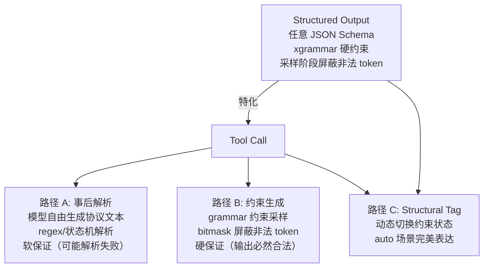
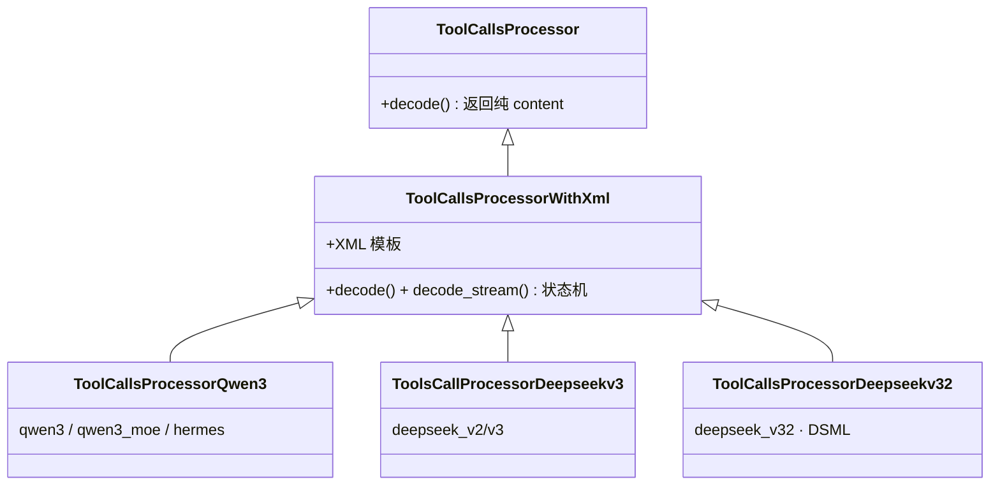

# Function Call 与结构化输出
> 覆盖 8 个知识点 | 来源 6 个文件 | 更新于 2026-07-14

## 1. 一句话总结
Function Call 让模型在生成过程中声明并调用外部工具，它是 Agent 能力的基石；结构化输出（Structured Output / Guided Decoding）通过约束解码在采样阶段保证输出 100% 符合 JSON Schema 等格式规范。两者是“特化子集”关系：Tool Call 是结构化输出的一个应用场景，但实现路径上存在“事后解析”（软保证）和“约束生成”（硬保证）两条路线，业界正在通过 Structural Tag 机制将两者收敛统一。

## 2. 核心原理
### 2.1 问题背景
大语言模型的下游应用（Agent、数据抽取、API 编排）有两个刚性需求：
- **工具调用**：模型需在生成过程中声明“我要调用哪个函数，参数是什么”，由框架解析并执行后回填结果，形成多步 Agent 循环。
- **格式保证**：模型输出必须符合 JSON Schema 等机器可消费的格式，仅靠 prompt 无法达到 100% 合法性。

核心痛点：**不同模型族使用截然不同的工具调用输出协议**（Qwen3 XML、DeepSeek DSML 等），推理框架必须为每个模型族适配解析；流式场景下每步只能拿到一小段截断文本，必须做增量解析；约束解码引入了编译开销、推理开销、输出质量风险等副作用。

### 2.2 方案概述
Function Call 全链路分三段：**① 请求阶段** tools 定义通过 InputBuilder 注入 chat template → token IDs；**② 生成阶段** 模型按原生协议输出工具调用文本（可选 xgrammar 约束解码保证格式合法）；**③ 解码阶段** 解析器将模型原生协议文本转为 OpenAI `tool_calls` 结构化字段，支持流式增量输出，置 `finish_reason = "tool_calls"`。

结构化输出与 Tool Call 的关系：


**核心创新**：MindIE 在解码阶段的 ToolCallsProcessor 体系中实现了 JSON Completor（递归下降解析器，两种 FillMode）、token ID 计数驱动的流式状态机、DSML 的 Hard Cut-off 反幻觉机制。约束解码采用 xgrammar（字节级 PDA + 预计算 mask cache），编译耗时通过 SHA-256 + LRU 缓存消除重复开销。

## 3. 实现细节
### 3.1 ToolCallsProcessor 类体系与注册中心
MindIE 通过**注册中心模式**为不同模型族提供专属 Processor：



各模型族输出协议对比：

| 模型族 | 输出协议 | 流式检测方式 | 反幻觉机制 |
|---|---|---|---|
| Qwen3 / hermes | XML `<tool_call>` 包 JSON | token ID 计数 | EOS 截断 |
| DeepSeek V3 | 特殊 token 块 + \`\`\`json | Token ID 计数 | EOS 截断 |
| DeepSeek V3.2 | DSML XML `<invoke>` 标签 | Token ID + XML 状态机 | **Hard Cut-off 永久静默** |

注册名与格式映射：

| 注册名 | Processor 类 | 格式 |
|---|---|---|
| qwen3, qwen3_moe, hermes | ToolCallsProcessorQwen3 | `<tool_call>` JSON `</tool_call>` |
| deepseek_v2, deepseek_v3 | ToolsCallProcessorDeepseekv3 | redacted_tool_call + ```json |
| deepseek_v32 | ToolCallsProcessorDeepseekv32 | DSML XML invoke/parameter |

#### 关键代码路径
- 基类与流式状态机：`mindie_llm/runtime/models/base/tool_calls_processor.py`
- 注册中心：`mindie_llm/runtime/models/base/tool_calls_processor_registry.py`（`@register_module` 装饰器）
- Qwen3：`mindie_llm/runtime/models/qwen3/tool_calls_processor_qwen3.py`（start token `<tool_call>` ID = 151657）
- DeepSeek V3.2：`mindie_llm/runtime/models/deepseek_v32/tool_calls_processor_deepseekv32.py`
- JSON 补全器：`mindie_llm/runtime/utils/helpers/json_completor.py`

### 3.2 流式解析：4-Case 状态机 + JSON Completor
#### 流式检测：token ID 计数 vs 文本重解析
MindIE 用 **token ID 计数**驱动状态机，而非对部分文本做正则：
- `_count_tool_tokens()` 统计 start/end token ID 出现次数，O(1) 判定状态
- 优势：不受“文本在任意位置截断”影响（半个标签、半个多字节字符），天然对齐生成粒度
- 代价：需要每个模型子类硬编码 token ID

#### 4-Case 状态机

| Case | 条件 | 行为 |
|---|---|---|
| Case 1 | start == end，delta 中无 end token | 普通内容，返回 `{content: delta_text}` |
| Case 2 | 新 tool_call 开始（start > end, start 增加）| `current_tool_id++`，返回 start 前的 content |
| Case 3 | tool_call 进行中（start > end, start 不变）| 提取 tool_call_portion → JSON 补全 |
| Case 4 | tool_call 结束（start == end, end 增加）| 发送最终 arguments delta 或 `{}` |

#### JSON Completor — 递归下降解析器
MindIE 独有的 JSON 补全引擎，不以 `json.loads` 为主路径：

| FillMode | 策略 | 使用时机 |
|---|---|---|
| `FillMode.Full` | 递归下降 `_parse_object()` 提取已完成的 key-value | name 尚未发送（需推断完整结构） |
| `FillMode.BraceOnly` | 先尝试 json.loads，失败则补齐 `}` | name 已发送（仅补尾部括号） |

#### 流式实例走查（Qwen3 协议）
假设模型生成 `好的 ⟨tc⟩ {"name": "get_weather", "arguments": {"city": "北京"}} ⟨/tc⟩`：

| 步 | delta_text | 计数状态 | 命中 | 发给客户端的 chunk |
|---|---|---|---|---|
| 1 | `好的` | start=0 | 无 tool call | `{"content": "好的"}` |
| 2 | `⟨tc⟩` | start 1>end 0，start 刚+1 | **Case 2** | `{}`（标签吞掉） |
| 3 | `{"name":` | start 1>end 0，不变 | Case 3→阶段A，name 不完整 | `{}` |
| 4 | ` "get_weather"` | 同上 | Case 3→阶段A，Full 解析出 name | `{"tool_calls":[{"index":0,"id":"...","function":{"name":"get_weather","arguments":""}}]}` |
| 5 | `, "arguments": {"city":` | 同上 | Case 3→阶段B 首发 | `{"tool_calls":[{"index":0,"function":{"arguments":"{\"city\": \""}}]}` |
| 6 | ` "北京"}` | 同上 | Case 3→阶段B 增量 | `{"tool_calls":[{"index":0,"function":{"arguments":"北京\""}}]}` |
| 7 | `}` | 同上 | Case 3→阶段B 增量 | `{"tool_calls":[{"index":0,"function":{"arguments":"}"}}]}` |
| 8 | `⟨/tc⟩` | start==end，end+1 | **Case 4** | `{}`，置 `finish_reason="tool_calls"` |

**关键结论**：name 是“攒齐了一次性发”，arguments 是“边生成边发”。

### 3.3 DeepSeek V3.2 DSML 三阶段与反幻觉
#### DSML 流式三阶段

| 阶段 | 行为 |
|---|---|
| P1: Prefix 拦截 | 丢弃部分 start tag，防止标签泄露到 content |
| P2: Hard Cut-off | 检测到 `</｜DSML｜function_calls>` 后永久返回空 delta（反幻觉）|
| P3: Snapshot-Diffing | XML → JSON 字符串 diff 计算 arguments delta |

#### Schema-aware type coercion
`_get_param_type_from_schema()` 从 tools schema 读取参数类型，对数值/布尔字段智能转换：
```python
# _convert_xml_to_json_string() 核心逻辑
schema_type = self._get_param_type_from_schema(tool_name, p_name)
if schema_type in ["string", "str"]:
    part = f'"{p_name}": "{escaped_val}'  # 字符串加引号
else:
    part = f'"{p_name}": {clean_val}'      # 数值/布尔直接嵌入
```

#### Hard Cut-off 设计意义
检测到 end tag 后**永久返回空 delta**，阻断模型在工具调用结束后继续生成虚假回复或推理内容的幻觉行为。这是 MindIE 独有的反幻觉机制。

### 3.4 约束解码：xgrammar 原理
#### 核心链路
JSON Schema ──转换──> EBNF 上下文无关文法（CFG）
    ──编译──> 字节级下推自动机（byte-level PDA）
    ──预计算──> adaptive token mask cache
运行时：PDA 栈状态 ──> token bitmask ──> apply 到 logits ──> 采样

#### 三个核心优化
1. **token 二分类 + 掩码预计算**：>99% context-independent token 编译期预计算进 mask cache；<1% context-dependent token 运行时持久化执行栈现场检查。mask 生成从"全词表模拟"降到微秒级。
2. **CPU/GPU overlap**：mask 生成在 CPU，与 GPU 前向并行；bitmask 以 int32 压缩位图传 GPU。
3. **为什么是 PDA 不是 FSM**：JSON 是递归结构（对象套对象、数组套数组），嵌套深度无界，FSM 表达不了，需要带栈的下推自动机。

#### MindIE 四层实现结构
- `structured_output_manager.py`——总控：延迟导入 xgrammar、编译 grammar、matcher 缓存、生成 bitmask
- `structured_output_grammar.py`——`XgrammarGrammar` 封装 `GrammarMatcher`：逐 token `accept_token`、`fill_next_token_bitmask`、终止检测
- `structured_output_bitmask.py`——bitmask 应用到 logits（CPU/NPU 路径 `masked_fill_` 置 −inf）
- `pta_handlers.py`——`GuidedDecodingLogitsHandler`（`@register_class("guided_decoding")`）在采样前挂载

### 3.5 编译缓存：SHA-256 + LRU
编译开销分两段：
- **编译期**：简单 schema 约 5–15ms，复杂 schema 约 100–200ms，直接加在 TTFT 上
- **运行期**：<1% 每步开销，且可与 GPU overlap

缓存设计：
- **MindIE**：SHA-256 哈希规范化 schema 为 key，容量 128 条，LRU 置换。tool-calling 场景命中率约 85%–95%
- **vLLM**：缓存下沉给 `xgr.GrammarCompiler(cache_enabled=True)`，按字节数上限（默认 512MB）控制，更稳健

多实例场景下**schema 亲和路由**（同 schema 请求进同实例）可同时提高编译缓存与 KV prefix cache 的命中率。

### 3.6 错误处理：五层软降级
核心哲学：**流式解析失败绝不抛异常中断请求，分层"软降级"**：

| 层级 | 机制 | 降级行为 |
|---|---|---|
| ① JSON Completor | `_parse_object()` 遇到坏字段调 `_skip_field()` 跳过；BraceOnly 失败返回 `{}` | 永不 raise |
| ② `_decode_stream_tool_calls` | try/except 包住 `complete_json_for_tool_calls` | 返回 `{}` |
| ③ 状态机守卫 | 没把握算增量时返回 `{}` | 语义："这一步不产出，等下一步" |
| ④ `decode_stream` 顶层 | try/except 包住整次流式解析 | 打印 error 日志，返回 `{}` |
| ⑤ `tokenizer_wrapper.py` | 无 `decode_stream` 的模型或解析彻底失败 | `{CONTENT: delta_text}` 原样透传 |

DSML 叠加两道专有兜底：Prefix 缓冲（防半截标签泄露）+ Hard Cut-off（永久静默幻觉输出）。

## 4. 框架对比
### 4.1 MindIE vs vLLM 核心差异

| 维度 | MindIE | vLLM |
|---|---|---|
| **流式检测** | **token ID 计数**：O(1)，对齐生成粒度，依赖 special token ID | **每步重解析全量文本**：regex + `partial_tag_overlap`，通用但每步 O(n) |
| **残缺 JSON 处理** | 自研**递归下降 JSON Completor**（Full/BraceOnly 双模式 + `_skip_field`），零三方依赖 | 复用三方库 **`partial_json_parser`**（Hermes 路径字符串级 diff，通用路径对象级 diff） |
| **约束解码集成度** | tool call 与结构化输出**独立**，无 structural tag | **深度集成**：`adjust_request` 把 tool_choice 转为 guided decoding；structural tag 按模型注册 |
| **反幻觉** | DSML **Hard Cut-off** 永久静默 | 主要靠 structural tag 的 name 枚举约束 + stop token |
| **热路径** | 全部 Python | 新模型走 `engine_based_streaming=True` + 引擎级/Rust 解析适配器 |
| **解析失败兜底** | 五层软降级，最终纯文本透传 | try/except → 降级为普通 content |
| **注册机制** | `ToolCallsProcessorManager` 饿汉式注册 | `ToolParserManager` 懒加载 + 支持用户插件 |
| **模型覆盖** | Qwen3、DeepSeek V2/V3/V3.2 | 40+ 个 parser 文件 |

**一句话定调**：两者都走“事后解析”主路径、都是“每模型族一个解析器 + 降级为 content”的骨架，但在流式检测机制（token 计数 vs 文本重解析）、残缺 JSON 处理（自研递归下降 vs 复用 partial_json_parser）、约束解码集成度（两者独立 vs structural tag 统一）三个维度分道扬镳。

## 5. 面试要点
### 5.1 常见追问
#### Q: Tool Call 和结构化输出什么关系？
- Tool Call 是结构化输出的**特化子集**——模型输出格式受限于特定的工具调用协议
- 两条实现路径：路径 A（事后解析，软保证）+ 路径 B（约束生成，硬保证）
- 两者在架构上独立：约束解码作用在**采样阶段**（限制 token），解析器作用在**解码阶段**（协议文本→OpenAI 格式）；开了约束，parser 依然要跑
- **Structural Tag 是收敛点**：trigger 驱动的动态约束切换，完美表达 `tool_choice=auto` 语义

#### Q: 流式为何用 token count 不用 regex？
- partial text decode 有延迟且文本在任意位置截断（半标签、半多字节字符），正则误判风险高
- token ID 计数 O(1)，天然对齐生成粒度
- 缺点：依赖 special token 有独立 token ID（如 Qwen3 `<tool_call>` = 151657）
- vLLM 走文本方案通用性更强，但每步 O(n) 重扫

#### Q: JSON 解析失败怎么处理？
- 五层软降级，**绝不抛异常中断请求**：
  1. JSON Completor 尽力补全不抛错（Full 模式 `_skip_field` 跳过坏字段；BraceOnly 失败返回 `{}`）
  2. 内层 try/except 返回 `{}`
  3. 状态机“没把握不发”返回 `{}`（语义：等下一步）
  4. 顶层 try/except + error 日志
  5. 最外层降级为纯文本 content 透传
- **根治**（而非兜底）要靠约束生成：grammar 硬保证不会产生非法 JSON

#### Q: Hard Cut-off 是什么？有什么意义？
- DSML（DeepSeek V3.2）专有机制：检测到 `</｜DSML｜function_calls>` 后**永久返回空 delta**
- 阻断模型在工具调用结束后继续生成虚假回复/推理内容的幻觉行为
- 代价：若 end tag 误触发会丢失尾部 content，但工具调用场景下利大于弊

#### Q: tool_choice=auto 为什么难约束？
- 输出可能是自由文本，也可能是“自由文本 + tool call 块”的混合，静态 grammar 无法同时表达
- 全程约束会把模型自由回答也逼成 JSON
- 不约束又回到软保证
- 需要 **Structural Tag** 机制：自由文本段无约束，一旦采样出 trigger 序列（如 `<tool_call>`）立即切入对应 grammar 约束，结束标签后回到自由文本

#### Q: 开约束还要 tool parser 吗？
- **要**。两者职责正交：
  - 约束管 token **合法性**（采样阶段）——保证不会产生非法格式
  - parser 管**字段抽取与流式增量**（解码阶段）——name 先整体发、arguments 逐步发、`DeltaToolCall` 的 index 管理
- 约束能简化 parser 的容错路径（BraceOnly 补救、regex 抢救等兜底逻辑在硬保证下理论上不再触发）

#### Q: 编译缓存和 KV 亲和什么关系？
- **同构问题**：schema 亲和路由（同 tools 集合的请求进同实例）可同时提高编译缓存与 KV prefix cache 命中率
- tools 注入发生在 chat template 层，token 级前缀匹配才能精确命中
- Agent 多步循环中 System+Tools 前缀高度重复，是两者收益最大的负载

### 5.2 口述话术
**30 秒版（简历自我介绍）**：
> “我在 MindIE 从 0 到 1 交付了结构化输出和 Tool Call 两个特性：结构化输出用 xgrammar 约束解码，把 Schema 编译成下推自动机后在采样阶段硬性屏蔽非法 token，我做 SHA-256 加 LRU 编译缓存来消掉重复编译的 TTFT 开销；Tool Call 我为 Qwen3、DeepSeek 多协议实现了流式解析器，核心是用 token 计数驱动状态机做增量解析、自研 JSON 补全器处理残缺 JSON、DSML 用 Hard Cut-off 防幻觉；两者目前走独立路径，但我知道业界正用 Structural Tag 把它们收敛到一起——trigger 驱动的动态约束切换，完美表达 auto 语义，这是下一步该补的。”

**60 秒版（追问展开）**：
> “结构化输出的核心是 xgrammar——它把 JSON Schema 转成 EBNF 再编译成字节级下推自动机，因为 JSON 是递归结构需要 PDA 而不是 FSM；优化上它把 99% 以上的上下文无关 token 在编译期预计算进缓存，运行时每步只查缓存加极少现场检查，mask 生成在 CPU 和 GPU 前向 overlap，基本不占关键路径。编译开销加在 TTFT 上，我做了 SHA-256 加 LRU 的缓存，tool-calling 场景命中率能到 90% 左右。Tool Call 这边，流式解析最核心的挑战是残缺 JSON 补全——我用自研递归下降解析器，name 没发之前做全结构推断，发了之后只补尾部括号；状态检测用 token 计数不用正则，因为文本在任意位置截断正则会误判。和 vLLM 最大的差异是约束集成度：vLLM 已经用 structural tag 把 tool call 和结构化输出统一了，MindIE 两条路还是各走各的，这也是我清楚的差距和改进方向。”

## 6. 延伸阅读
### 6.1 相关主题
- **约束解码深层原理**：xgrammar PDA 编译、vLLM 架构深潜、后端对比、性能数值速查
- **KV 缓存与亲和调度**：Agent 循环中 System+Tools 前缀高复用，token 级前缀匹配
- **Agent 生态与趋势**：MCP 协议标准化、推理模型 + Tool Use 新范式
- **流式解析兜底机制**：五层软降级的设计哲学与容错边界

### 6.2 源文件
| 文件路径 | 标题 | 类型 |
|---|---|---|
| wiki/repos/mindie-pyserver/function-call.md | MindIE Function Call 工具调用实现 | 实现分析 |
| wiki/raw/articles/pyserver/mindie_function_call_deep_analysis.md | Function Call 深度分析（含 Agent 生态视野） | 深度分析 |
| interview/interview-review/03-结构化输出与约束解码专题.md | 结构化输出 / 约束解码——xgrammar 原理、对比、开销与副作用 | 面试专题 |
| interview/interview-review/14-FunctionCall专题.md | Function Call（Tool Call）独立专题 | 面试专题 |
| interview/interview-review/16-结构化输出复习专题.md | 结构化输出独立复习专题 | 面试专题 |
| interview/interview-review/17-FunctionCall与结构化输出综合专题.md | Function Call 与结构化输出综合专题（交叉与串线） | 面试专题 |