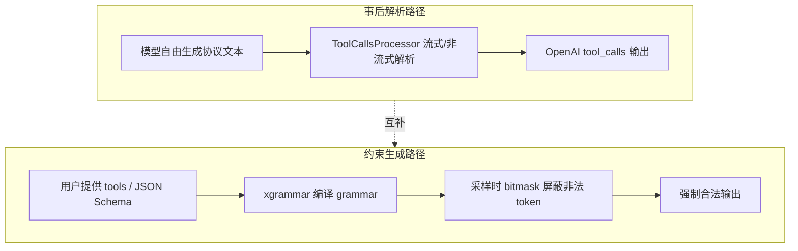

# Function Call 与结构化输出
> 覆盖 8 个知识点 | 来源 6 个文件 | 更新于 2026-07-14

## 1. 一句话总结
Function Call（Tool Call）是让大模型决定调用外部函数并生成合法参数的能力，结构化输出（约束解码）则保证模型输出符合给定的形式规范（如 JSON Schema）。两者是“特化与通用”的关系：Function Call 是结构化输出的子集，但实现上存在“事后解析（软保证）”和“采样阶段约束（硬保证）”两条互补路径，业界正通过 Structural Tag 将二者统一为“动态约束 + 流式抽取”的协同架构。

## 2. 核心原理
### 2.1 问题背景
LLM 的原生输出是自由文本，无法保证语法合法性。在 Agent、工具调用、数据抽取等场景中，下游系统需要一个可靠的结构化字段（如函数名、参数 JSON）。仅靠 prompt 无法做到 100% 合法，因此需要两种技术：
- **Function Call 解析**：模型输出约定协议文本（如 `<tool_call>{"name":"get_weather","arguments":{"city":"北京"}}</tool_call>`），由解析器将其转为 OpenAI 兼容的 `tool_calls` 字段。
- **结构化输出/约束解码**：在采样阶段提前算出“当前语法状态下合法的 token 集合”，把非法 token 的 logit 置 -∞，从根本上杜绝格式错误。

**核心痛点**：不同模型族使用截然不同的 tool call 输出协议（Qwen3 的 XML、DeepSeek V3 的特殊 token 块、DeepSeek V3.2 的 DSML XML），推理框架需要为每个模型族提供专属协议适配器；流式场景下每步只拿到一小段 delta_text，无法直接 `json.loads`，需要实时补全残缺 JSON 并抽取增量。

### 2.2 方案概述
整体方案分两条互补路径：

- **路径 A：事后解析**（MindIE/ vLLM 默认）  
  模型自由生成协议文本 → 解码阶段用正则/状态机提取 tool call 块 → JSON 补全（流式）或直接 `json.loads`（非流式）→ 转换成 OpenAI `tool_calls` 格式。软保证，存在解析失败的可能。
- **路径 B：约束生成**（xgrammar 约束解码）  
  在生成阶段用语法约束（如 JSON Schema）限制 token 选择，强制模型输出符合预期格式。对于 Function Call，可将工具的 parameters schema 编译成 grammar，通过 `tool_choice` 语义决定约束范围。硬保证，但无法处理 `auto` 模式下“自由文本 + 工具调用”的混合输出——此时需要 Structural Tag 动态切换约束状态。

两条路径在架构上独立：约束解码作用于**采样阶段**（限制 token 合法性），解析器作用于**解码阶段**（字段抽取与流式增量），即使开了约束，解析器仍需运行以完成 OpenAI 字段组装。



## 3. 实现细节
### 3.1 Function Call 全链路与 ToolCallsProcessor 体系
一次完整的 tool call 请求在 MindIE 中走三段流水线：
1. **Encode 阶段**：`InputBuilder` 将用户的 `tools` 定义注入 chat template（例如 Qwen3InputBuilder），通过 `apply_chat_template` 转为 token IDs。
2. **Generate 阶段**：Text Generator 驱动模型输出原生协议文本（可选叠加 xgrammar 约束）。
3. **Decode 阶段**：`TokenizerWrapper.decode()` 统一编排，先由 `ReasoningParser` 剥离 `<think>` 内容，再由 `ToolCallsProcessor` 解析为 OpenAI 格式，最后置 `finish_reason = "tool_calls"`。

`ToolCallsProcessor` 类体系采用“基类 + 模型特化 + 注册中心”模式：
- **基类 `ToolCallsProcessor`**：仅返回纯 content，找不到匹配处理器时的 fallback。
- **`ToolCallsProcessorWithXml`**：处理 XML 模板，包含非流式的正则提取和流式的 4-Case 状态机框架。
- **模型特化子类**：
  - `ToolCallsProcessorQwen3`：Qwen3 / hermes 协议，`<tool_call>` 包 JSON。
  - `ToolsCallProcessorDeepseekv3`：DeepSeek V2/V3 的 redacted_tool_call + \`\`\`json 格式。
  - `ToolCallsProcessorDeepseekv32`：DeepSeek V3.2 的 DSML XML（`<invoke>` 标签），完全重写解析逻辑。

注册中心 `ToolCallsProcessorManager` 通过 `@register_module` 装饰器按 `tool_call_parser` 字段路由，Router 在初始化时根据模型配置实例化相应处理器。

### 3.2 流式解析：4-Case 状态机与 JSON Completor
流式输出每步只收到一小段 delta_text，需要判断当前处于 tool call 的哪个阶段。MindIE 采用**token ID 计数**而非正则表达式：

- 每步统计 `start_token_id` 和 `end_token_id` 在历史 token 中的出现次数，驱动 4-Case 状态机：

| Case | 条件 | 行为 |
|------|------|------|
| Case 1 | start == end，delta 中无 end token | 正常内容，返回 `{content: delta_text}` |
| Case 2 | 新 tool_call 开始（start > end，start 增加） | `current_tool_id++`，发送 start 前的 content |
| Case 3 | tool_call 进行中（start > end，start 不变） | 提取 `tool_call_portion` → JSON Completor 补全 |
| Case 4 | tool_call 结束（start == end，end 增加） | 发送最终 arguments delta 或空 |

选择 token 计数的原因：部分文本可能在任意位置截断（半个标签、半个多字节字符），正则容易误判；token ID 计数 O(1) 且对齐生成粒度。

**JSON Completor** 是 MindIE 自研的递归下降解析器，不依赖 `json.loads` 作为主路径：
- `FillMode.Full`：递归下降 `_parse_object()` 提取已完成的 key-value，用于 name 尚未发送时推断完整结构。
- `FillMode.BraceOnly`：先尝试 `json.loads`，失败则补齐尾部 `}`，用于 name 已发送时仅需补括号的场景。

流式发送策略：**name 攒齐一次发，arguments 边生成边发**，完美匹配 OpenAI 流式 `tool_calls` 语义。

#### 3.2.1 DeepSeek V3.2 DSML 三阶段处理
DSML 解析不走通用 JSON Completor，而是专用三阶段流水线：
- **P1 Prefix 拦截**：丢弃部分 start tag，防止标签泄露到 content。
- **P2 Hard Cut-off**：检测到结束标签 `</function_calls>` 后永久返回空 delta，阻断模型幻觉继续输出。
- **P3 Snapshot-Diffing**：将 XML 快照转为 JSON 字符串后做 diff 计算 arguments delta。

另有 **Schema-aware type coercion**：`_get_param_type_from_schema()` 从 tools schema 读参数类型，对数值/布尔字段智能转换。

### 3.3 结构化输出：xgrammar 约束解码
MindIE 的结构化输出基于 xgrammar（CMU/MLC，MLSys 2025），整体链路：
```text
JSON Schema ──> EBNF 上下文无关文法（CFG）
    ──> 字节级下推自动机（byte-level PDA）
    ──> 预计算 adaptive token mask cache
运行时：PDA 栈状态 → token bitmask → apply 到 logits → 采样
```

**核心设计决策**：
- **为什么用 PDA 而非 FSM**：JSON 是递归结构（对象套对象、数组套数组），嵌套深度无界，有限状态机无法表达，需带栈的下推自动机。简单正则约束可退化为 FSM。
- **为什么快**：将词表中 >99% 的 context-independent token 在编译期预计算合法性并缓存；<1% 的 context-dependent token 运行时用持久化执行栈现场检查。每步 mask 生成从“全词表模拟”降到微秒级。
- **开销 overlap**：bitmask 在 CPU（scheduler 进程）生成，与 GPU 前向计算并行；以 int32 压缩位图传输，GPU 侧一次 `masked_fill_(-inf)` 即可完成。

MindIE 实现四层架构：`StructuredOutputManager`（总控，编译 grammar、matcher 缓存）→ `XgrammarGrammar`（封装 `GrammarMatcher`，逐 token 状态推进）→ `StructuredOutputBitmask`（bitmask 应用到 logits）→ `GuidedDecodingLogitsHandler`（采样前挂载）。

### 3.4 编译缓存：SHA-256 + LRU
约束解码的编译期开销（简单 schema 约 5~15ms，复杂 schema 约 100~200ms）直接加在首 token 延迟（TTFT）上。MindIE 的缓存方案：
- 对规范化后的 schema 字符串做 **SHA-256** 哈希作为 key。
- 内存缓存编译产物，容量上限 128 条，**LRU** 淘汰。
- 命中时二次请求零编译，TTFT 仅增加约 0.1~0.5ms（cache 查找 + 创建新 `GrammarMatcher`）。

vLLM 则将缓存下沉给 `xgr.GrammarCompiler`，以**字节数上限**（默认 512MB）控制内存，更稳定——单条编译产物大小差异极大，按字节控制优于按条数。这是可自提的改进点。

### 3.5 Function Call 与结构化输出的交叉：Structural Tag
`tool_choice=auto` 是核心难点：输出可能是自由文本，也可能是“自由文本 + 工具调用块”，静态 grammar 无法表达。xgrammar 的 **Structural Tag** 机制解决了这一问题：定义触发词（如 `<tool_call>`），模型输出自由文本时无约束，一旦采样出触发词，立即切入对应 grammar 约束（如该函数的 JSON Schema），结束后切回自由文本。一次前向中动态切换“无约束 ↔ 有约束”状态。

vLLM 已深度集成 Structural Tag，`structural_tag_registry.py` 为 11 个模型族注册了协议模板，将 tool call 的协议知识从各框架的 parser 代码收敛到 xgrammar 内置模板。MindIE 当前尚未实现 Structural Tag，tool call 纯走事后解析，这是下一步的演进方向。

## 4. 框架对比
### 4.1 MindIE vs vLLM — Function Call 实现
两者均采用“每模型族一个解析器 + 降级为 content”的骨架，但关键维度存在差异：

| 维度 | MindIE | vLLM |
|------|--------|------|
| **流式检测** | token ID 计数（O(1)，对齐生成粒度） | 每步重解析全量 `current_text`（regex + 半截标签回退，O(n)） |
| **残缺 JSON 处理** | 自研递归下降 `JSON Completor`（Full/BraceOnly 双策略） | 复用三方 `partial_json_parser` + 部分 parser 用字符串 diff |
| **与约束解码集成** | 未打通：tool call 走纯解析，结构化输出走全程约束 | 深度集成：`tool_choice` 转 `StructuredOutputsParams`，Structural Tag 按模型注册 |
| **反幻觉机制** | DSML Hard Cut-off 永久静默 | 主要靠 structural tag name 枚举 + stop token |
| **新模型热路径** | 纯 Python（含 DSML XML 状态机） | 部分新模型下沉到引擎级/Rust 解析适配器 |
| **注册机制** | 饿汉式 `register_module` | 懒加载 `register_lazy_module`，支持用户插件 |

### 4.2 约束解码后端对比（xgrammar vs Outlines vs Guidance）
| 后端 | 核心技术 | 表达能力 | 每步开销 | 特点 |
|------|----------|----------|----------|------|
| **xgrammar** | 字节级 PDA + 预计算 mask cache | CFG（JSON Schema/EBNF/regex） | 微秒级（>99% 预计算） | 当前主流选择；C++ 内核 |
| **Outlines** | 正则→FSM，token 级状态转移表 | 正则/JSON Schema（递归受限） | 查表 O(1)，但编译可能很慢 | 学术起源，生态成熟 |
| **Guidance/llguidance** | Earley 解析 + token 前缀树 | CFG，最灵活 | 每步动态解析 ~50μs | 支持模板编程式约束 |

**一句话总结**：xgrammar 在通用性（完整 CFG）和速度（预计算 mask）之间取得最佳平衡，是 vLLM/SGLang/MindIE 的默认或推荐后端。

## 5. 面试要点
### 5.1 常见追问
#### Q: Tool Call 和结构化输出是什么关系？
- Tool Call 是结构化输出的**特化子集**，但实现上有“事后解析”和“约束生成”两条路径。
- 约束解码管 token 合法性（采样阶段），ToolCallsProcessor 管字段抽取与流式增量（解码阶段），职责正交，不可互相替代。
- Structural Tag 是二者的统一收敛点：通过动态触发词实现“auto”场景下无约束与有约束的切换。

#### Q: 流式 tool call 为什么用 token ID 计数而不用正则？
- 部分 delta_text 可能在任意位置截断（半个标签、半个多字节字符），正则容易误判。
- token ID 计数 O(1)，且天然对齐生成粒度、不受文本截断干扰。
- 代价是需要为每个模型族硬编码特殊 token ID。

#### Q: MindIE 和 vLLM 的 Function Call 最大区别在哪？
- **流式检测**：MindIE token 计数 vs vLLM 每步重扫文本。
- **残缺 JSON**：MindIE 自研递归下降补全器 vs vLLM 复用 partial_json_parser。
- **约束集成度**：vLLM 已用 Structural Tag 将 tool call 与结构化输出打通，MindIE 仍未集成。

#### Q: 结构化输出有什么副作用？如何缓解？
- TTFT 增加（编译耗时）：用 SHA-256 + LRU 缓存消除重复编译。
- 每步 mask 开销：xgrammar 通过预计算和 CPU/GPU overlap 压至 <1%。
- 强约束可能损害输出质量：模型被迫走低概率路径，schema 设计应宽松，配合 few-shot。
- 与投机解码组合时状态回滚复杂：xgrammar 的 `GrammarMatcher` 内置 rollback 支持。

#### Q: 编译缓存怎么做？按条数还是按字节好？
- 对规范化 schema 做 SHA-256 哈希为 key，LRU 淘汰。
- vLLM 按字节上限（512MB）控制，比按条数（128 条）更稳——单条编译产物大小差异极大。
- 可进一步做 schema 亲和路由，与 KV 亲和调度同构，提高缓存命中率。

#### Q: agent 循环中 KV cache 如何复用？
- System + Tools 定义：同 session 100% 命中（Prefix Cache 必选）。
- 用户对话历史：session 内累积复用，KV 连续增长。
- Tool 执行结果：每步全新（10~100 token，prefill 很快）。
- Qwen3 thinking token：跨步复用率接近零，可主动 evict 避免 HBM 浪费。

#### Q: 解析失败如何兜底？
- 五层软降级：JSON Completor 尽力补全不抛错 → 内层 try/except → 状态机返回 `{}` 表示“等下一步” → 顶层 try/except → 最外层降级为纯文本 content。DSML 额外叠加 Prefix 缓冲和 Hard Cut-off 两道闸门。
- 根因上，配合约束生成可让解析失败在机制上不再发生（但流式抽取仍需 parser）。

### 5.2 口述话术
“我在 MindIE 负责了 Function Call 和结构化输出两条特性。Function Call 这边，我实现了 Qwen3、DeepSeek V3/V3.2 等主流模型族的协议适配器体系，核心是 token 计数驱动的 4-Case 流式状态机 + 自研递归下降 JSON Completor，解决了流式场景下残缺 JSON 的实时补全和增量发送问题，DeepSeek V3.2 的 DSML 还实现了 Hard Cut-off 反幻觉机制。结构化输出这边，我基于 xgrammar 从 0 交付了约束解码能力，把 JSON Schema 编译成字节级 PDA，通过 adaptive mask cache 将 >99% 的 token 合法性判定预计算掉，每步开销压到微秒级；并做了 SHA-256 + LRU 的编译缓存，把重复 schema 的 TTFT 增加从百毫秒降到亚毫秒。其实这两件事是一条链的两端：Function Call 是结构化输出的特化子集，现在业界正在用 Structural Tag 把‘事后解析’和‘约束生成’统一起来，vLLM 已经按模型注册了 structural tag 模板，我知道这是 MindIE 下一步要补的——把 tool_choice 映射成动态约束，从机制上消灭幻觉工具名和非法 JSON，同时保留流式解析的增量抽取能力。”

## 6. 延伸阅读
### 6.1 相关主题
- xgrammar 原理深潜、vLLM 架构细节、性能数值速查表 → `03-结构化输出与约束解码专题`
- Function Call 全链路、协议适配器、流式例子走查 → `14-FunctionCall专题`
- Structural Tag 收敛趋势、失败模式对照、Agent 循环 KV 复用 → `17-FunctionCall与结构化输出综合专题`
- KV 亲和调度与 Mooncake → `04-KV亲和调度与Mooncake专题`

### 6.2 源文件
| 文件路径 | 标题 | 类型 |
|----------|------|------|
| wiki/repos/mindie-pyserver/function-call.md | MindIE Function Call 工具调用实现 | 实现分析 |
| wiki/raw/articles/pyserver/mindie_function_call_deep_analysis.md | MindIE Function Call / Tool Use 深度分析 | 深度分析（含 Agent 生态视野） |
| interview/interview-review/03-结构化输出与约束解码专题.md | 专题 03：结构化输出 / 约束解码 | 面试专题（xgrammar 原理/对比/开销） |
| interview/interview-review/14-FunctionCall专题.md | 专题 14：Function Call（Tool Call）独立专题 | 面试专题（MindIE vs vLLM） |
| interview/interview-review/16-结构化输出复习专题.md | 专题 16：结构化输出独立复习专题 | 面试复习（概览） |
| interview/interview-review/17-FunctionCall与结构化输出综合专题.md | 专题 17：Function Call 与结构化输出综合专题 | 面试综合（交叉与串线） |