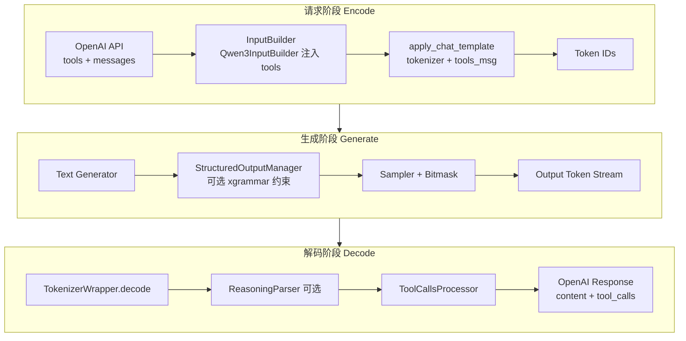

# Function Call 与结构化输出
> 覆盖 10 个知识点 | 来源 5 个文件 | 更新于 2026-07-15

## 1. 一句话总结
让 LLM 输出符合形式规范（JSON Schema / 工具调用格式）的两种路径：**结构化输出**在采样阶段用 token 位掩码硬性屏蔽非法 token（"必然合法"），**Function Call** 是它的特化子集——模型按各厂商原生协议（`<tool_call>` 包 JSON、DSML 等）输出工具调用指令，再由框架解析器转为 OpenAI 兼容的 `tool_calls` 字段；xgrammar 的 **Structural Tag** 机制正将二者收敛为统一体系。

## 2. 核心原理
### 2.1 问题背景
大语言模型仅靠 prompt 无法保证输出 100% 合法 JSON 或工具调用格式；Agent、数据抽取、API 编排等下游系统必须消费结构化输出，需将"大概率合法"升级为"机制性保证"。

**核心难点**：词表与语法的错位——语法定义在字符/字节层，而模型输出的是 token（一个 token 可能横跨多个语法单元，如 `{"na` 同时消费 `{`、`"`、`na`），引擎必须对 10 万+ 词表的每个 token 判断"接受后是否仍合法"，朴素实现开销巨大。

### 2.2 方案概述
                 Structured Output（任意 JSON Schema，xgrammar 硬约束）
                        │ 特化
                        ▼
                    Tool Call
                   ┌────┴─────┐
        路径 A：事后解析          路径 B：约束生成
        模型自由生成协议文本        grammar 约束采样过程
        regex/状态机 + JSON 补全   bitmask 屏蔽非法 token
        软保证（可能解析失败）      硬保证（输出必然合法）
MindIE 默认走**路径 A**（`ToolCallsProcessor` 事后解析），xgrammar 可选叠加约束 arguments。路径 B 的 engine——xgrammar——将 JSON Schema 转为字节级下推自动机（PDA），把 >99% token 的合法性预计算进缓存；运行时查缓存生成 bitmask，将非法 token 的 logit 置 −inf。

## 3. 实现细节
### 3.1 ToolCallsProcessor 类体系与解码阶段编排
MindIE 通过 `TokenizerWrapper.decode()` 统一编排 reasoning 解析与 tool call 解析：

类体系：`ToolCallsProcessor`（基类）→ `ToolCallsProcessorWithXml`（XML 模板 + 流式状态机）→ `ToolCallsProcessorQwen3`（qwen3/qwen3_moe/hermes）、`ToolsCallProcessorDeepseekv3`（deepseek_v2/v3）、`ToolCallsProcessorDeepseekv32`（DSML）。

注册中心 `ToolCallsProcessorManager` 按 `tool_call_parser` 字段路由，使用装饰器 `@register_module` 饿汉式注册。

### 3.2 流式 4-Case 状态机（token ID 计数）
流式场景下 MindIE 用**token ID 计数**而非正则判断阶段——`_count_tool_tokens` 统计 start/end token ID 出现次数，O(1) 且不受文本截断干扰。

| Case | 条件 | 行为 |
|------|------|------|
| Case 1 | start == end，无 end token 在 delta 中 | 返回 `{content: delta_text}` |
| Case 2 | 新 tool_call 开始（start > end, start 增加） | `current_tool_id++`，返回 start 前的 content |
| Case 3 | tool_call 进行中（start > end, start 不变） | 提取 `tool_call_portion` → JSON 补全 |
| Case 4 | tool_call 结束（start == end, end 增加） | 发送最终 arguments delta |

name 发送采用"攒齐一次性发"，arguments 采用"边生成边发"，符合 OpenAI 流式 `tool_calls` 语义。

### 3.3 JSON Completor——递归下降补全器
流式场景下 arguments JSON 永远残缺，MindIE 自研递归下降解析器，不以 `json.loads` 为主路径：

| FillMode | 策略 | 使用时机 |
|----------|------|----------|
| `Full` | 递归下降 `_parse_object()` 提取已完成 key-value | name 尚未发送（需推断完整结构） |
| `BraceOnly` | 先尝试 `json.loads`，失败则补齐 `}` | name 已发送（仅补尾部括号） |

容错：`_skip_field()` 靠括号配平跳过坏字段，`BraceOnly` 失败后数 `{`/`}` 差额补尾括号再试。解析失败时**绝不抛异常**，返回 `{}` 表示"本步无产出、等下一步"。

### 3.4 DeepSeek V3.2 DSML 三阶段与 Hard Cut-off
`ToolCallsProcessorDeepseekv32` 完全重写解析逻辑：

| 阶段 | 行为 |
|------|------|
| P1: Prefix 拦截 | 丢弃部分 start tag，防止标签泄露到 content |
| P2: Hard Cut-off | 检测到 `</DSML function_calls>` 后**永久返回空 delta**（反幻觉） |
| P3: Snapshot-Diffing | XML → JSON 字符串 diff 计算 arguments delta |

另有 **Schema-aware type coercion**：`_get_param_type_from_schema()` 从 tools schema 读取参数类型，对数值/布尔字段智能转换。

### 3.5 xgrammar 约束解码原理
JSON Schema ──转换──> EBNF 上下文无关文法（CFG）
    ──编译──> 字节级下推自动机（byte-level PDA）
    ──预计算──> adaptive token mask cache
运行时：PDA 栈状态 ──> token bitmask ──> apply 到 logits ──> 采样

**核心优化**：token 二分类——
- **context-independent tokens**（>99%）：仅凭 PDA 栈顶节点即可判合法 → 编译期预计算进 mask cache；
- **context-dependent tokens**（<1%）：需检查整个栈 → 运行时用持久化执行栈现场检查。

mask 生成在 CPU 侧、与 GPU 前向 overlap，bitmask 以 int32 压缩位图传 GPU。

**编译缓存**：MindIE 对规范化后的 schema 串做 SHA-256 哈希为 key，内存缓存，128 条 LRU 置换，相同 schema 二次请求零编译。vLLM 下沉给 `xgr.GrammarCompiler(cache_enabled=True)` 按字节数上限（默认 512 MB）控制，更稳。

**副作用**：TTFT 增加（首次编译 5–200 ms）、强约束可能损害输出质量（逼进低概率路径）、投机解码下需多位置 mask 前瞻再整体 rollback。

### 3.6 约束与解析的职责正交
约束解码和输出解析是两条独立路径：
- **约束解码**在采样阶段限制 token 选择（bitmask → 非法 token logit = −inf）；
- **ToolCallsProcessor** 在解码阶段将模型输出转为 OpenAI 格式（协议文本 → `tool_calls` 字段）。

两者互补：开了约束后 parser 不能省（约束不负责"字段抽取与流式增量"），但约束能简化容错路径（补括号、regex 抢救等兜底逻辑在硬保证下不再触发）。

### 3.7 流式解析失败的兜底五层防线
1. **JSON Completor 本身不抛异常**：`_skip_field()` 跳过坏字段，`BraceOnly` 失败返回 `{}`；
2. **`_decode_stream_tool_calls` 内层 try/except**：异常返回 `INIT_RETURN_NONE`（{}）；
3. **状态机"没把握就不发"守卫**：name 不完整、找不到 delta 位置等全部返回 `{}`；
4. **`decode_stream` 顶层 try/except**：打印日志，返回 `{}`；
5. **最外层降级**：若 processor 无 `decode_stream` → 警告 + `{CONTENT: delta_text}` 原样透传；非流式路径正则匹配不到 → `{CONTENT: lines}`。

DSML 专属叠加：Prefix 缓冲（防半截 start tag 泄露）+ Hard Cut-off（永久静默 post-end-tag 幻觉）。

## 4. 框架对比
### 4.1 MindIE vs vLLM Function Call 实现

| 维度 | MindIE | vLLM |
|------|--------|------|
| 流式检测 | **token ID 计数**（O(1)，对齐生成粒度） | 每步重解析全量 `current_text`（regex + `partial_tag_overlap`） |
| 残缺 JSON 处理 | 自研**递归下降** `JSON Completor`（Full/BraceOnly） | 三方库 `partial_json_parser` + dict diff / Hermes 字符串 diff |
| 与约束解码集成 | 未打通（tool call 走纯解析，结构化输出走全程约束） | **深度集成**：`adjust_request` 把 `tool_choice` 转 guided decoding；structural tag 按模型注册 |
| 热路径 | 纯 Python | 新模型走 `engine_based_streaming=True` + 引擎级/Rust 适配器 |
| 反幻觉 | DSML Hard Cut-off | structural tag name 枚举 + stop token |
| 注册机制 | `ToolCallsProcessorManager.register_module` 饿汉式 | `ToolParserManager.register_lazy_module` 懒加载（40+ 模型） |

### 4.2 约束解码后端对比

| 后端 | 核心技术 | 表达能力 | 特点 |
|------|---------|---------|------|
| **xgrammar** | 字节级 PDA + 预计算 mask cache | CFG（JSON Schema/EBNF/regex） | vLLM/SGLang 默认；C++ 内核，编译快 |
| **Outlines** | 正则→FSM，token 级状态转移表 | 正则/JSON Schema（递归受限，需展开近似） | 学术起源；查表 O(1)，但编译慢（分钟级） |
| **Guidance/llguidance** | Earley 解析 + token 前缀树 | CFG，最灵活 | 运行时动态解析，Rust 优化到 ~50 μs |
| **lm-format-enforcer** | token 级前缀匹配 | JSON Schema/regex | 实现简单，性能一般 |

**xgrammar** 走中间路线：PDA 支持完整 CFG（通用性等同 llguidance），又把 99% 判定预计算掉（速度逼近 Outlines）。

### 4.3 Structural Tag——约束与解析的收敛点（vLLM 已实现，MindIE 需补）
xgrammar 的 **Structural Tag** 机制：定义若干 trigger（如 `<tool_call>`），自由文本段无约束，一旦采样出 trigger 立即切入对应 grammar（按该函数 schema 约束到结束标签），结束后回到自由文本。**一次前向里动态切换"无约束 ↔ 有约束"状态**，完美表达 `tool_choice=auto` 语义，同时兼容 reasoning（`<think>` 块自然处于无约束段）。

vLLM 的 `structural_tag_registry.py` 为 11 个模型族注册了 structural tag 构造器（`qwen_3`、`deepseek_v3_2`、`llama` 等），上游 xgrammar 内置协议模板，推理框架只做编排。**MindIE 尚未引入 structural tag**（tool call 与结构化输出两条路未打通），这是下一步该补的核心能力。

## 5. 面试要点
### 5.1 常见追问
#### Q: JSON 解析失败怎么处理？
- JSON Completor 五层软降级：补括号 → regex 抢救 name → 降级空 arguments / 本步返回 `{}` → 顶层 try/except → 最终 `{CONTENT: lines}` 降级为普通 content
- DSML 额外叠加 Prefix 缓冲 + Hard Cut-off
- **绝不抛异常中断请求**，根治靠约束生成

#### Q: 流式为何用 token ID 计数而不用正则？
- partial text decode 存在延迟，且文本在任意位置截断（半标签、半多字节字符）会误判
- token ID 计数 O(1)，且天然对齐生成粒度，不受文本截断干扰
- vLLM 用文本重解析（O(n) 每步重扫），通用性强但不依赖 special token ID

#### Q: Tool Call 和结构化输出什么关系？
- Tool Call 是结构化输出的特化子集：两条实现路径——事后解析（软保证） vs 约束生成（硬保证）
- 约束和解析职责正交：约束管 token 合法性（采样阶段），parser 管字段抽取与流式增量（解码阶段）
- structural tag 是收敛点：把"约束"和"解析"统一为 trigger 驱动的动态切换体系

#### Q: tool_choice 四种取值如何映射到约束？
- `none`：无需约束（或屏蔽 start token）
- forced（具名函数）：单函数 parameters schema 全程约束（退化为普通结构化输出）
- `required`：各函数 anyOf 并集 + name 枚举化
- `auto`：需 structural tag——自由文本无约束，触发后切入对应 grammar（最难）

#### Q: 开约束还要 tool parser 吗？
要。约束保证 token 合法（bitmask），但不负责"字段抽取与流式增量"（name 先整体发、arguments 逐步发、`DeltaToolCall` index 管理），两者职责正交。

### 5.2 口述话术
"这三个特性其实是一条链路：**结构化输出**解决'输出必须合法'，用 xgrammar 把 Schema 编译成 PDA、预计算 token mask cache，采样阶段硬性屏蔽非法 token；**Tool Call** 是它的特化场景——我实现了 Qwen3/DeepSeek 多协议的 `ToolCallsProcessor` 体系，核心是 token ID 计数驱动的 4-Case 流式状态机和自研递归下降 JSON Completor；业界正用 structural tag 把约束和解析收敛到一起，vLLM 已按模型注册 structural tag 模板，这是 MindIE 下一步该补的；而 Agent 多步循环里 System+Tools 前缀高度重复，正是 KV 亲和调度收益最大的负载——tools 注入在 chat template 层，token 级匹配才能精确命中，这也是我们做 token 级匹配的动机。"

## 6. 延伸阅读
### 6.1 相关主题
- KV 亲和调度与 Prefix Cache
- Agent 多步循环与 KV 复用
- xgrammar 原理深潜（Schema→PDA→bitmask、vLLM 架构挖潜、性能数值）
- Reasoning 与 Tool Call 组合解析（Qwen3 `enable_thinking`）

### 6.2 源文件
| 文件路径 | 标题 | 类型 |
|---------|------|------|
| wiki/repos/mindie-pyserver/function-call.md | MindIE Function Call 工具调用实现 | 实现分析 |
| wiki/raw/articles/pyserver/mindie_function_call_deep_analysis.md | MindIE Function Call 深度分析 | 深度分析（含 Agent 生态视野） |
| interview/interview-review/03-结构化输出与约束解码专题.md | xgrammar 原理、对比、开销与副作用 | 面试专题 |
| interview/interview-review/14-FunctionCall专题.md | Function Call 独立专题 | 面试专题 |
| interview/interview-review/16-结构化输出复习专题.md | 结构化输出复习专题 | 面试专题 |
| interview/interview-review/17-FunctionCall与结构化输出综合专题.md | 交叉与串线综合专题 | 面试专题 |