# Function Call 与结构化输出

> 来源: 4 files | 最后更新: 2026-07-11

## 核心概念

> **MindIE Function Call 工具调用实现** | 类型: repo | 标签: `architecture`, `inference`, `function-calling`, `tool-use`, `agent`, `mindie`

# MindIE Function Call 工具调用实现
*(来源: wiki/repos/mindie-pyserver/function-call.md)*

> **MindIE Function Call 深度分析**

Function Call 分析
*(来源: wiki/raw/articles/pyserver/mindie_function_call_deep_analysis.md)*

## 深入分析

### 整体调用链路

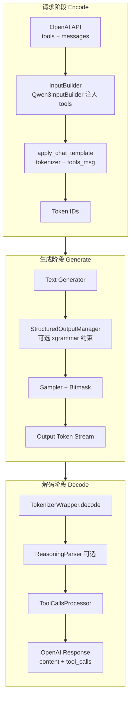

*(来源: wiki/repos/mindie-pyserver/function-call.md)*

### ToolCallsProcessor 类体系

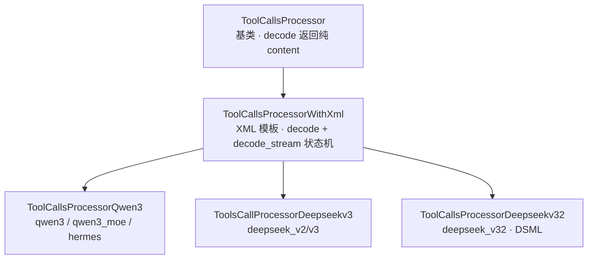

### 非流式路径
1. encode — InputBuilder 注入 tools 到 chat template
2. generate — 模型输出完整文本（含 XML 标签）
3. decode — `tool_call_regex.findall` → `json.loads` → OpenAI tool_calls

### 流式路径 (Qwen3 WithXml)
1. decode_stream 入口 — 计算 delta_text
2. `_count_tool_tokens` — 基于 token ID 计数 start/end
3. `_decode_stream_tool_calls_portion` — 4-case 状态机
4. `_decode_stream_tool_calls` — JSON Completor + DeltaToolCall

### 4-Case 状态机

| Case | 条件 | 行为 |
|------|------|------|
| Case 1 | start == end，无 end token 在 delta 中 | 返回 {content: delta_text} |
| Case 2 | 新 tool_call 开始 (start > end, start 增加) | current_tool_id++，返回 start 前的 content |
| Case 3 | tool_call 进行中 (start > end, start 不变) | 提取 tool_call_portion → JSON 补全 |
| Case 4 | tool_call 结束 (start == end, end 增加) | 发送最终 arguments delta 或 {} |

*(来源: wiki/repos/mindie-pyserver/function-call.md)*

### JSON Completor — 递归下降解析器

MindIE 独有的 JSON 补全引擎，不使用 `json.loads` 作为主路径：

| FillMode | 策略 | 使用时机 |
|----------|------|----------|
| `FillMode.Full` | 递归下降 `_parse_object()` 提取已完成的 key-value | name 尚未发送（需推断完整结构） |
| `FillMode.BraceOnly` | 先尝试 json.loads，失败则补齐 `}` | name 已发送（仅补尾部括号） |

*(来源: wiki/repos/mindie-pyserver/function-call.md)*

### DeepSeek V3.2 — DSML 语法流式三阶段

| 阶段 | 行为 |
|------|------|
| P1: Prefix 拦截 | 丢弃部分 start tag，防止标签泄露到 content |
| P2: Hard Cut-off | 检测到 `</｜DSML｜function_calls>` 后永久返回空 delta（反幻觉） |
| P3: Snapshot-Diffing | XML → JSON 字符串 diff 计算 arguments delta |

Schema-aware type coercion — `_get_param_type_from_schema()` 从 tools schema 读取参数类型，对数值/布尔字段智能转换。

*(来源: wiki/repos/mindie-pyserver/function-call.md)*

### 注册中心与路由

```mermaid
flowchart LR
    A[register_all_tool_calls_processors]
    B[ToolCallsProcessorManager<br/>@register_module 装饰器]
    C[Router._get_tool_calls_processor<br/>按 tool_call_parser 实例化]
    D[TokenizerWrapper.tool_calls_processor]

    A --> B --> C --> D
```

| 注册名 | Processor 类 | 格式 |
|--------|-------------|------|
| qwen3, qwen3_moe, hermes | ToolCallsProcessorQwen3 | `<tool_call>` JSON `</tool_call>` |
| deepseek_v2, deepseek_v3 | ToolsCallProcessorDeepseekv3 | redacted_tool_call + ```json |
| deepseek_v32 | ToolCallsProcessorDeepseekv32 | DSML XML invoke/parameter |

*(来源: wiki/repos/mindie-pyserver/function-call.md)*

### 约束解码集成

Function Call 生成阶段可与 Structured Output（xgrammar）结合：

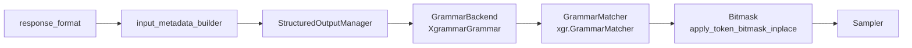

**注意**：生成约束 vs 输出解析是两条独立路径。约束解码限制 token 选择；ToolCallsProcessor 将模型输出转为 OpenAI 格式。

*(来源: wiki/repos/mindie-pyserver/function-call.md)*

### 竞品对比

| 框架 | Tool Call 解析 | 约束解码 | 特点 |
|------|---------------|---------|------|
| **MindIE** | ToolCallsProcessor 体系 + JSON Completor | xgrammar | Huawei NPU 优化，Reasoning 组合解析 |
| **vLLM** | ToolParser 体系，dict-level diff | outlines / xgrammar / llguidance | 最广泛的模型 Parser 覆盖 |
| **SGLang** | Frontend language + JSON schema | outlines | 编程式 API |
| **TGI** | Grammar-based tool call | 内置 grammar | HuggingFace 生态 |

*(来源: wiki/repos/mindie-pyserver/function-call.md)*

### 设计权衡

| 权衡 | MindIE 选择 | vLLM 选择 |
|------|------------|-----------|
| JSON 补全 | 递归下降解析器 (json_completor) | json.loads + 字符串 diff |
| 流式状态检测 | Token-count-based (token ID 计数) | prev_tool_call_arr + streamed_args |
| DeepSeek 支持 | 完整 DSML + Schema coercion + Hard Cut-off | DeepSeekV3ToolParser (redacted 格式) |
| 反幻觉 | Hard Cut-off 永久静默 | 无对等机制 |

**结论**：MindIE 的 Function Call 实现与 vLLM 共享相同架构哲学（Base + Model-specific + Registry），但在 JSON 补全策略、DeepSeek DSML 支持和反幻觉机制上有显著差异化。json_completor 和 Hard Cut-off 是 MindIE 最具特色的两个设计点。[^fc]

*(来源: wiki/repos/mindie-pyserver/function-call.md)*

### 模型格式协议对比

| 维度 | Qwen3 | DeepSeek V3 | DeepSeek V3.2 (DSML) |
|------|-------|-------------|----------------------|
| **格式** | XML `<tool_call>` JSON `</tool_call>` | 特殊 token 块 + ` ```json ` | XML DSML `<invoke>` 标签 |
| **Stop token** | 文本 `</tool_call>` | token ID `<｜tool▁calls▁end｜>` | token ID `</｜DSML｜function_calls>` |
| **流式检测** | text regex | Token ID 计数（更稳定）| Token ID + XML 状态机 |
| **类型推断** | 无 | 无 | Schema-aware coercion（数值/布尔自动转换）|
| **反幻觉** | EOS 截断 | EOS 截断 | **Hard Cut-off 永久静默** |
| **并行 tool** | 多个 `<tool_call>` 块 | 多个 `<｜tool▁call▁begin｜>` 块 | 多个 `<invoke>` 标签 |

### Stop token vs Stop string 性能差异

| 方式 | 检测复杂度 | 适用模型 |
|------|----------|---------|
| Stop String（文本匹配）| O(len)，每步 decode 后检查 | Qwen3 `</tool_call>` |
| Stop Token ID | O(1)，Sampler 直接检测 | DeepSeek V3/V3.2 特殊 token |

*(来源: wiki/repos/mindie-pyserver/function-call.md)*

### 多步 Agent 循环

Tool Call 的核心 Agent 价值：**暂停生成 → 执行工具 → 注入结果 → 继续生成** 的多步循环。

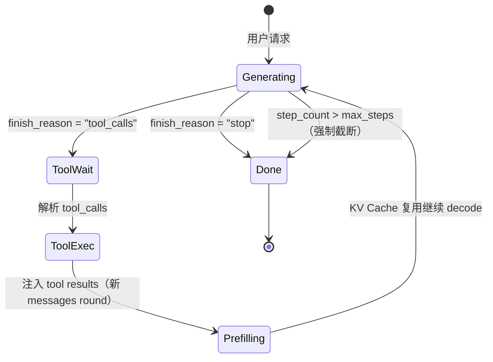

### KV Cache 跨步复用策略

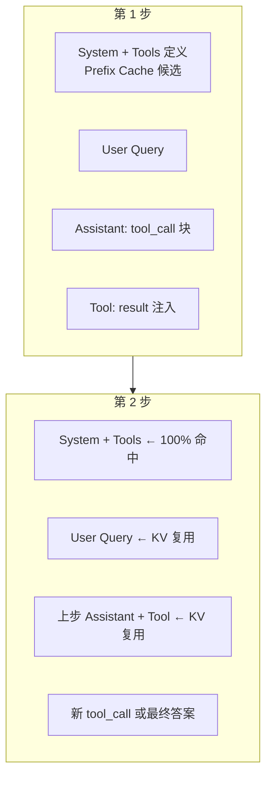

| KV 块 | 复用率 | 策略 |
|-------|--------|------|
| System prompt + Tools 定义 | 极高（同 session 100%；跨 session 视 tools 哈希）| Prefix Cache 必选 |
| 用户对话历史 | 高（session 内累积）| KV 连续增长 |
| Tool 执行结果 | 零（每步不同）| 每步 prefill 新 token（通常 10-100 tokens，很快）|
| Thinking token（Qwen3）| 接近零 | 可主动 evict，避免 HBM 浪费 |

### session_id 机制

MindIE 通过 `session_id` 保持多步 KV 连续性：

```python
# 第 1 步请求
{"session_id": "agent_xyz", "messages": [...], "tools": [...]}

# 第 2 步（工具执行后）
{"session_id": "agent_xyz", "messages": [..., tool_result_msg], "tools": [...]}
# → 只 prefill 新增的 tool result 部分，其余 KV 命中
```

*(来源: wiki/repos/mindie-pyserver/function-call.md)*

### Thinking + Tool Call 组合（Qwen3）

Qwen3 enable_thinking=True 时，模型先输出 `<think>` 块再输出 `<tool_call>`：

```
<think>用户问北京天气，需要调用 get_weather...</think>
<tool_call>{"name": "get_weather", "arguments": {"city": "北京"}}</tool_call>
```

**实现路径**：`ReasoningParser` 先处理 `<think>...</think>` → `reasoning_content`；`ToolCallsProcessor` 再处理剩余 → `tool_calls`。两 parser 串行共享同一 `TokenizerWrapper.decode` 调用。

*(来源: wiki/repos/mindie-pyserver/function-call.md)*

### 与 Structured Output 的关系

Tool Call 是 Structured Output 的**特化子集**，但实现路径不同：

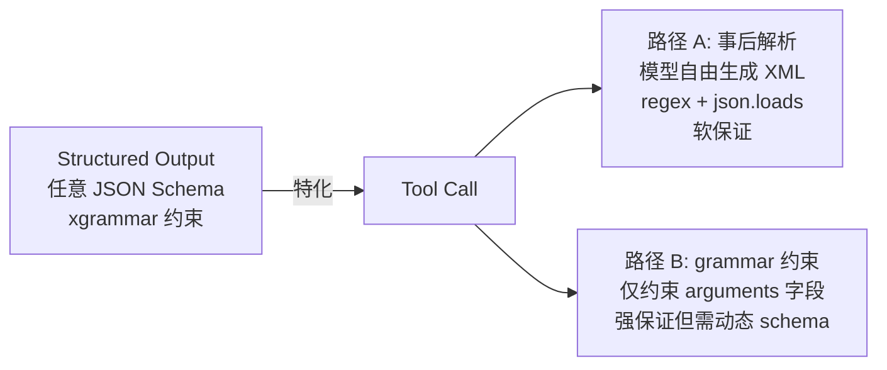

MindIE 默认路径 A（事后解析），xgrammar 可选叠加约束 arguments。

*(来源: wiki/repos/mindie-pyserver/function-call.md)*

### 面试追问快查

| 问题                              | 核心答点                                                               |
| ------------------------------- | ------------------------------------------------------------------ |
| **JSON 解析失败怎么处理？**              | try/except → BraceOnly 补括号重试 → regex 抢救 name → 降级空 arguments       |
| **Agent 无限循环防护？**               | max_steps 硬截断 + 重复 tool call 检测 + max_tokens 总预算                   |
| **工具执行超时？**                     | 注入 `{"error": "timeout"}` → LLM 决策重试/换工具 + session cleanup 防 KV 泄漏 |
| **Hard Cut-off 意义？**            | DSML 专有：end token 后永久静默，阻断 LLM 幻觉继续输出 function calls 块外内容          |
| **流式为何用 token count 不用 regex？** | partial text decode 存在延迟；token ID 计数 O(1) 且不受文本截断干扰                |

[^fc]: [[raw/articles/pyserver/mindie_function_call_deep_analysis.md]]

*(来源: wiki/repos/mindie-pyserver/function-call.md)*

### 1\. 应用背景

Function Call / Tool Use 在 LLM Serving 中的定位与 MindIE 的实现动机

### 1.1 Function Call 在 Serving 中的角色

大语言模型推理服务（LLM Serving）的核心职责是将用户请求转化为 token 序列、驱动模型生成、并将生成结果结构化返回。Function Call（也称 Tool Use）是 OpenAI Chat Completions API 的标准扩展：模型在生成过程中输出工具调用指令（函数名 + JSON 参数），由客户端或服务端执行后，将结果回注对话继续推理。

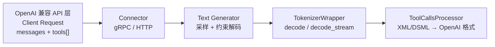

MindIE-LLM-PyServer 在 `TokenizerWrapper.decode()` 层统一编排 reasoning 解析与 tool call 解析，确保 Chat API 返回的 `content`、`reasoning_content`、`tool_calls` 字段符合 OpenAI 规范。

### 1.2 核心痛点

**流式场景的三大挑战** 1) Token 级增量解析——每个新 token 到达时需立即输出 delta，不能等完整 JSON；  
2) JSON 不完全补全——模型输出截断的 JSON 片段无法直接用 `json.loads`；  
3) 模型幻觉防护——工具调用结束后模型可能继续生成虚假回复或推理内容。 

场景| 挑战| MindIE 应对策略  
---|---|---  
非流式| 完整文本中混有 XML 标签与 JSON| 正则提取 + `json.loads` 验证  
流式 (Qwen3)| 增量 token 无法构成合法 JSON| Token-count 状态机 + JSON Completor  
流式 (DeepSeek V3.2)| DSML XML 语法 + 类型推断| Snapshot-Diffing + Schema-aware coercion  
幻觉| 工具调用后继续生成| Hard Cut-off 静默截断  
  
### 1.3 多模型族支持动机

不同模型族使用截然不同的工具调用输出格式。MindIE 通过注册中心模式（`ToolCallsProcessorManager`）为每个模型族提供专属 Processor，同时共享 XML 基类的流式状态机框架。

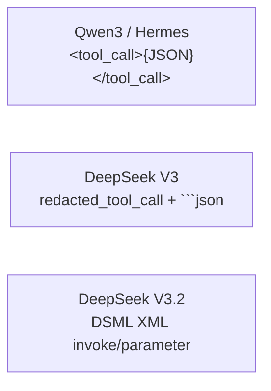

*(来源: wiki/raw/articles/pyserver/mindie_function_call_deep_analysis.md)*

### 2\. 设计逻辑

架构分层、数据流时序与设计权衡

### 2.1 整体调用链路

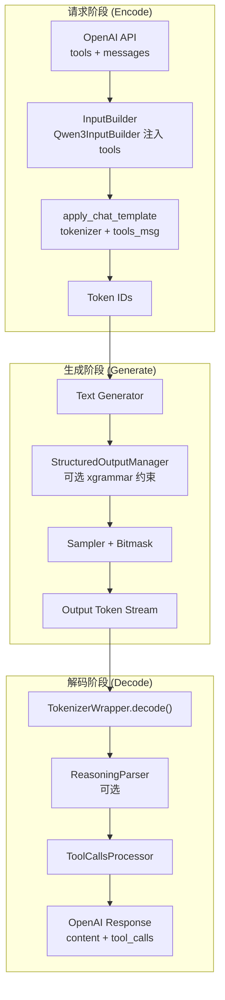

### 2.2 ToolCallsProcessor 类体系

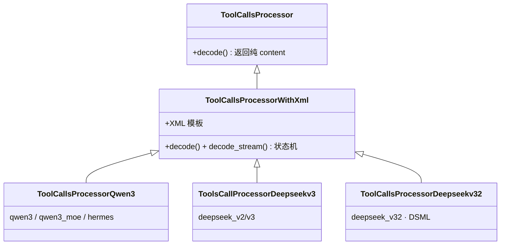

### 2.3 流式 vs 非流式双路径

#### 非流式路径

1encode — InputBuilder 注入 tools 到 chat template

2generate — 模型输出完整文本（含 XML 标签）

3decode — tool_call_regex.findall → json.loads → OpenAI tool_calls

#### 流式路径 (Qwen3 WithXml)

1decode_stream 入口 — 计算 delta_text

2_count_tool_tokens — 基于 token ID 计数 start/end

3_decode_stream_tool_calls_portion — 4-case 状态机

4_decode_stream_tool_calls — JSON Completor + DeltaToolCall

#### 4-Case 状态机 (ToolCallsProcessorWithXml)

Case| 条件| 行为  
---|---|---  
Case 1| start == end，无 end token 在 delta 中| 返回 {content: delta_text}  
Case 2| 新 tool_call 开始 (start > end, start 增加)| current_tool_id++，返回 start 前的 content  
Case 3| tool_call 进行中 (start > end, start 不变)| 提取 tool_call_portion → JSON 补全  
Case 4| tool_call 结束 (start == end, end 增加)| 发送最终 arguments delta 或 {}  
  
### 2.4 约束解码集成

Function Call 的生成阶段可与 Structured Output（xgrammar）结合，通过 GrammarMatcher 生成 token bitmask，在采样前将非法 token 的 logit 置为 -∞。

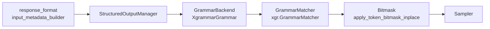

**注意：生成约束 vs 输出解析是两条独立路径** 约束解码在生成阶段限制 token 选择；ToolCallsProcessor 在解码阶段将模型输出转为 OpenAI 格式。两者互补但不互相替代。 

### 2.5 设计决策与权衡

**权衡 1：JSON Completor vs json.loads** 流式场景下 JSON 片段不完整，`json.loads` 必然失败。MindIE 实现递归下降解析器（FillMode.Full）和括号补齐策略（FillMode.BraceOnly），在 name 已发送后仅补 `}`，name 未发送时做完整结构推断。代价是解析器代码量大，但容错性显著优于标准库。 

**权衡 2：Token-count-based vs 字符串搜索** `_count_tool_tokens()` 通过统计 start/end token ID 出现次数判断状态，避免在 delta_text 中搜索可能跨 token 边界的标签字符串。代价是需要每个模型子类硬编码 token ID，但流式性能更稳定。 

**权衡 3：DeepSeek Snapshot-Diffing vs Qwen3 JSON Completion** DeepSeek V3.2 输出 DSML XML 而非 JSON，MindIE 将 XML 快照转为 JSON 字符串后做 diff 计算增量。配合 Schema-aware type coercion 从 tools schema 读取参数类型。Qwen3 则直接在 JSON 片段上做 Completor。各取模型原生格式最优解。 

**权衡 4：Hard Cut-off 反幻觉** DeepSeek V3.2 检测到 `</｜DSML｜function_calls>` 后立即返回空 delta，永久静默后续流。防止模型在工具调用后继续生成虚假回复。代价是若 end tag 误触发则丢失尾部 content，但工具调用场景下利大于弊。 

**容错与降级** JSON 解析异常时 `_get_tool_calls_json` 返回空列表，`decode()` fallback 到纯文本 content；`decode_stream` 异常时记录 error 日志并返回 `INIT_RETURN_NONE`（空 dict），不中断生成流。

*(来源: wiki/raw/articles/pyserver/mindie_function_call_deep_analysis.md)*

### 3\. 实现细节

核心类/函数逐层解析与关键代码段

### 3.1 ToolCallsProcessor 基类

最简基类，仅持有 `model_version`，`decode()` 直接返回原始 content。Router 在找不到匹配 Processor 时 fallback 到此默认实现。

tool_calls_processor.py — ToolCallsProcessor 基类

45| class ToolCallsProcessor:  
---|---  
48|  def __init__(self, model_version: str) -> None:  
54|  self.model_version = model_version  
57|  @staticmethod  
58|  def decode(content) -> dict:  
66|  return {CONTENT: content}  
  
### 3.2 ToolCallsProcessorWithXml

XML 模板解析的核心实现，包含非流式 `decode()` 和流式 `decode_stream()` 完整状态机。维护三个流式状态变量：

  * `current_tool_name_sent` — 函数名是否已发送
  * `current_tool_arguments_sent` — 参数结构是否已发送
  * `current_tool_id` — 当前工具调用索引（对应 OpenAI index 字段）


非流式 decode — 正则提取 + JSON 验证

157| def decode(self, content: str) -> dict[str, Any]:  
---|---  
165|  matches = self.tool_call_regex.findall(lines)  
166|  tool_calls = self._get_tool_calls_json(matches) if matches else None  
167|  if not tool_calls:  
168|  return {CONTENT: lines} # fallback 到纯文本  
183|  return {CONTENT: content.split(spilt_token)[0], TOOL_CALLS: call_res}  
  
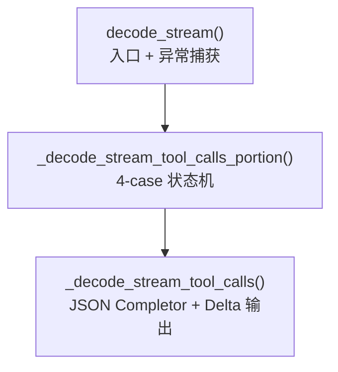

### 3.3 ToolCallsProcessorQwen3

通过 `@ToolCallsProcessorManager.register_module(["qwen3", "qwen3_moe", "hermes"])` 注册。定义 Qwen3 特有的 XML 标签和 token ID。

tool_calls_processor_qwen3.py

17| @ToolCallsProcessorManager.register_module(["qwen3", "qwen3_moe", "hermes"])  
---|---  
18| class ToolCallsProcessorQwen3(ToolCallsProcessorWithXml):  
31|  self._tool_calls_regex = re.compile(r'<tool_call>\s*({.*?})\s*</tool_call>', re.DOTALL)  
36|  return "<tool_call>" # start_token  
46|  return 151657 # start_token_id  
51|  return 151658 # end_token_id  
  
### 3.4 DeepSeek V3.2 — DSML 语法

`ToolCallsProcessorDeepseekv32` 完全重写 `decode()` 和 `decode_stream()`，不依赖基类 JSON Completor 路径，而是走 DSML XML 解析 + Snapshot-Diffing。

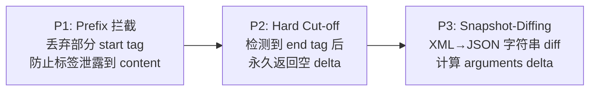

Schema-aware type coercion — _convert_xml_to_json_string()

419|  schema_type = self._get_param_type_from_schema(tool_name, p_name)  
---|---  
420|  is_string_type = schema_type in ["string", "str"]  
428|  if is_string_type:  
429|  escaped_val = p_value.replace('"', '\\\"').replace('\\\n', '\\\n')  
430|  part = f'"{p_name}": "{escaped_val}'  
438|  part = f'"{p_name}": {clean_val}' # 数值/布尔/对象直接嵌入  
  
Hard Cut-off — decode_stream()

293|  # Phase 2: Suffix interception (Hard Cut-off / Anti-Hallucination)  
---|---  
296|  if end_tag in tool_call_portion:  
297|  return INIT_RETURN_NONE # 永久静默  
  
DeepSeek V3（非 V3.2）使用 `ToolsCallProcessorDeepseekv3`，注册名为 `deepseek_v2/v3`，基于 redacted_tool_call 标签 + 正则流式解析，继承 `ToolCallsProcessorDeepseekv3Base` 的重写 `_decode_stream_tool_calls`（不使用 JSON Completor）。

### 3.5 JSON Completor — 递归下降解析器

`complete_json_for_tool_calls()` 是 MindIE 独有的 JSON 补全引擎，不使用 `json.loads` 作为主路径。

FillMode| 策略| 使用时机  
---|---|---  
`FillMode.Full`| 递归下降 `_parse_object()` 提取已完成的 key-value| name 尚未发送（需推断完整结构）  
`FillMode.BraceOnly`| 先尝试 json.loads，失败则补齐 `}`| name 已发送（仅补尾部括号）  
  
json_completor.py — 入口函数

345| def complete_json_for_tool_calls(json_str: str, mode: FillMode) -> dict:  
---|---  
367|  if mode == FillMode.BraceOnly:  
378|  return json.loads(text) # 先尝试标准解析  
384|  s2 = text + '}' * (open_count - close_count) # 补齐括号  
392|  elif mode == FillMode.Full:  
393|  obj, _ = _parse_object(text, 0) # 递归下降  
394|  return obj  
  
### 3.6 注册中心与路由

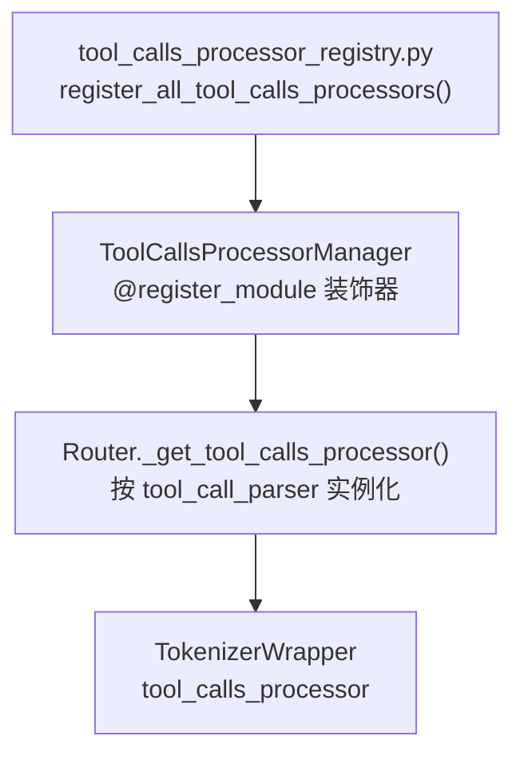

注册名| Processor 类| 格式  
---|---|---  
qwen3, qwen3_moe, hermes| ToolCallsProcessorQwen3| <tool_call> JSON </tool_call>  
deepseek_v2, deepseek_v3, deepseekv2, deepseekv3| ToolsCallProcessorDeepseekv3| redacted_tool_call + ```json  
deepseek_v32, deepseekv32| ToolCallsProcessorDeepseekv32| DSML XML invoke/parameter  
  
### 3.7 TokenizerWrapper Decode 入口

非流式四种 Case、流式三种 Case，reasoning 与 tool_calls 可组合解析。流式时通过 metadata 持久化 Processor 内部状态。

tokenizer_wrapper.py — 流式 tool call 状态持久化

104|  self.tool_calls_processor.tools = metadata.get('tools', None)  
---|---  
230|  self.tool_calls_processor.current_tool_name_sent = metadata.get("current_tool_name_sent")  
234|  result = self.tool_calls_processor.decode_stream(...)  
237|  result.update({"metadata": {"current_tool_name_sent": ..., ...}})  
  
### 3.8 关键字段与数据结构

字段/类| 类型| 说明  
---|---|---  
`DeltaToolCall`| Pydantic BaseModel| 流式增量工具调用：id, type, index, function  
`DeltaFunctionCall`| Pydantic BaseModel| function.name / function.arguments 增量  
`CONTENT`| str constant| 返回 dict 的 content 键  
`TOOL_CALLS`| str constant| 返回 dict 的 tool_calls 键  
`DECODE_STREAM_RETURNVALUE`| str constant| portion 阶段提前返回标记  
`TOOL_CALL_PORTION`| str constant| 当前 tool_call 文本片段  
`FILL_MODE`| FillMode enum| JSON 补全模式选择  
`INIT_RETURN_NONE`| {}| 空返回，表示本步无 delta  
`SPECIAL_DELTA_PREFIXES`| ['{"', "{'"]| 检测嵌套 JSON 对象起始  
  
### 3.9 错误处理分析

位置| 异常处理| 降级行为  
---|---|---  
`_get_tool_calls_json()`| try/except 捕获 json.loads 和 KeyError| 返回空列表 → decode fallback 到 content  
`decode_stream()`| 顶层 try/except| logger.error + 返回 INIT_RETURN_NONE  
`_decode_stream_tool_calls()`| JSON Completor 异常| 返回 INIT_RETURN_NONE（跳过本步）  
Router._get_tool_calls_processor()| KeyError 捕获| fallback 到 ToolCallsProcessor("") 默认类  
DeepSeek decode_stream| try/except| 返回 {content: ""} 静默  
json_completor 数字解析| logger.debug| 返回 None，跳过该字段

*(来源: wiki/raw/articles/pyserver/mindie_function_call_deep_analysis.md)*

### 4\. 竞品分析

与 vLLM、SGLang、TGI 的 Function Call 实现对比

### 4.1 vLLM Tool Parser 架构

vLLM 在 `vllm/entrypoints/openai/tool_parsers/` 实现了类似的 Parser 体系，MindIE 代码头部明确标注部分实现基于 vLLM。

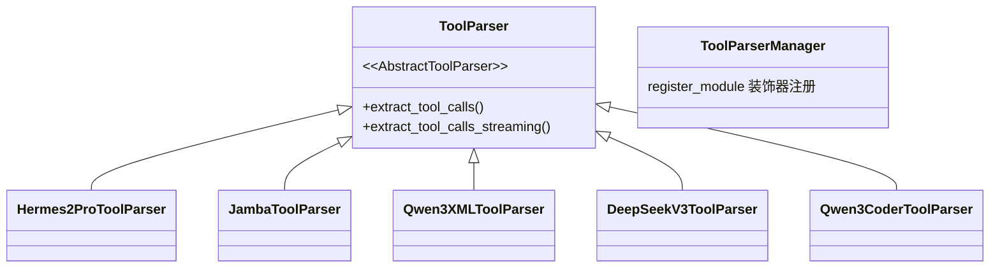

##### MindIE 特色

  * **json_completor.py** — 独立递归下降 JSON 补全引擎，FillMode 双策略
  * **Token-count-based** — 基于 token ID 计数的状态检测
  * **DSML 语法** — DeepSeek V3.2 完整 XML invoke/parameter 支持
  * **Schema-aware coercion** — 从 tools schema 读取参数类型
  * **Snapshot-Diffing** — XML→JSON 字符串 diff 计算流式 delta
  * **Hard Cut-off** — 工具调用结束后永久静默流
  * **Reasoning 组合** — TokenizerWrapper 统一编排 reasoning + tool_calls


##### vLLM 特色

  * **Python 原生 Parser** — 流式时在 tool_call dict 级别做 diff
  * **prev_tool_call_arr** — 维护完整工具调用数组做增量对比
  * **streamed_args_for_tool** — 逐参数流式跟踪
  * **Speculative decode 修复** — Qwen3Coder 多 token 步进参数丢失修复
  * **Tool 对象注入** — Parser 构造时接收 tools 列表
  * **更丰富的模型覆盖** — Llama, Mistral, Granite 等 20+ Parser


### 4.2 SGLang / TGI 对比

框架| Tool Call 解析| 约束解码| 特点  
---|---|---|---  
**MindIE**|  ToolCallsProcessor 体系 + JSON Completor| xgrammar (GrammarMatcher + bitmask)| Huawei NPU 优化，Reasoning 组合解析  
**vLLM**|  ToolParser 体系，dict-level diff| outlines / xgrammar / llguidance| 最广泛的模型 Parser 覆盖  
**SGLang**|  Frontend language + JSON schema| outlines 约束解码| 编程式 API，前端约束更强  
**TGI**|  Grammar-based tool call| 内置 grammar 约束| HuggingFace 生态，grammar 优先  
  
### 4.3 架构共性 vs 差异总结

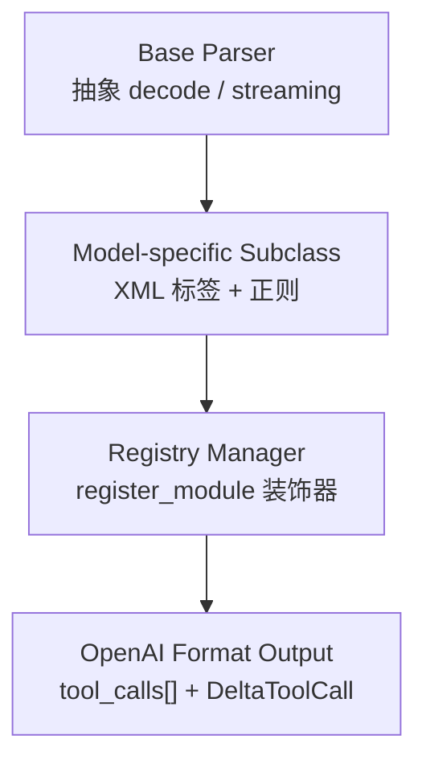

维度| MindIE| vLLM  
---|---|---  
基类| ToolCallsProcessor → WithXml| ToolParser (AbstractToolParser)  
注册| ToolCallsProcessorManager.register_module| ToolParserManager.register_module  
JSON 补全| json_completor 递归下降 + BraceOnly| Python json.loads + 字符串 diff  
流式状态| token ID 计数 + 3 布尔状态| prev_tool_call_arr + streamed_args  
DeepSeek V3.2| 完整 DSML + Schema coercion + Hard Cut-off| DeepSeekV3ToolParser (redacted 格式)  
代码来源| 部分基于 vLLM 改造| 原生实现  
集成点| TokenizerWrapper.decode()| ServingChat.extract_tool_calls()  
  
**结论** MindIE 的 Function Call 实现与 vLLM 共享相同的架构哲学（Base + Model-specific + Registry），但在 JSON 补全策略、DeepSeek DSML 支持和反幻觉机制上有显著差异化。json_completor 和 Hard Cut-off 是 MindIE 最具特色的两个设计点。

*(来源: wiki/raw/articles/pyserver/mindie_function_call_deep_analysis.md)*

### 5\. Agent 生态视野与趋势展望

基于 2025-2026 行业研究：Function Call 生态、Agent 框架、MCP 标准化、推理模型趋势

**本章定位** 前 4 章聚焦 MindIE 内部实现与 vLLM 直接对比，本章拉高视角，将 MindIE ToolCallsProcessor 放到 LLM + Agent 生态的全局坐标系中观察，分析 OpenAI / Anthropic / Gemini / DeepSeek / Qwen 五大平台、四大 Agent 框架、三大 Structured Output 引擎、MCP 协议生态、以及推理模型 + Tool Use 新范式对 MindIE 未来演进的启示。研究材料来源详见 docs/research/function_call_trends.md（2026-05-31 完成的 5 主题研究报告）和 docs/research/agent_context.md。 

### 5.1 Function Calling 生态全景

2025-2026 年是 LLM Function Calling 能力分化期。五大主流平台在 schema 结构、严格模式、流式解析、推理混合输出等维度走出不同路径，但 OpenAI 兼容 API 已成为事实上的最大公约数。

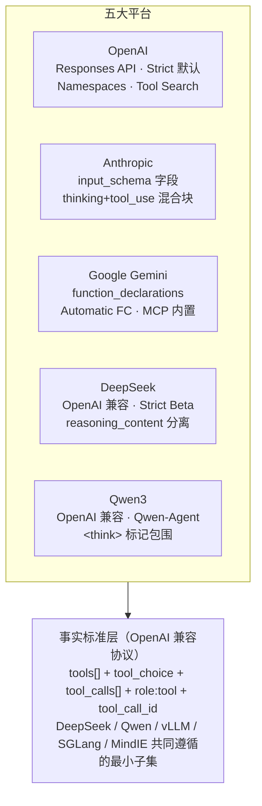

维度| OpenAI| Anthropic| Gemini| DeepSeek| Qwen3  
---|---|---|---|---|---  
参数字段名| `parameters`| `input_schema`| `parameters`| `parameters`| `parameters`  
包装层| type:function 嵌套| 无包装 (name/desc/input_schema)| function_declarations 数组| OpenAI 兼容| OpenAI 兼容  
严格模式| Responses API 默认启用| 隐式| VALIDATED 模式| Beta (/beta 路径)| 取决于部署后端  
命名空间| 原生 namespace + defer_loading| —| —| —| —  
工具搜索| gpt-5.4+ 支持按需加载| —| —| —| —  
Auto Function Calling| —| —| Python SDK 原生| —| Qwen-Agent 框架  
MCP 协议支持| Agents SDK + Connectors| 原生（发起者）| 内置（有限）| —| Qwen-Agent  
推理 + 工具调用| o4-mini 隐式| thinking 块交错 tool_use| thought_signature| reasoning_content 双字段| <think>...</think> 标记  
流式事件粒度| function_call_arguments.delta| content_block_delta| generate_content stream| tool_calls delta（OpenAI 兼容）| tool_calls delta（OpenAI 兼容）  
  
**关键观察：分化与标准化并存** 虽然 OpenAI 兼容 API 已成事实标准（DeepSeek、Qwen、vLLM、MindIE 均采用），但 Anthropic 的 `input_schema` 命名差异、Gemini 的 `function_declarations` 包装、推理模型的混合输出格式仍要求 Serving 层做平台特化适配。MindIE 当前的 "基类 + 模型族 Processor" 体系正好对应这种差异化需求；下一步演进应在 Connector 层增加跨平台 schema 归一化。 

### 5.2 Agent 框架的工具调用模式对比

Agent 框架是 Function Call 能力的最大消费者。四大框架（Hermes Agent / LangChain / CrewAI / AutoGen）在工具注册、子代理隔离、流式处理、MCP 集成等维度形成差异化设计哲学。

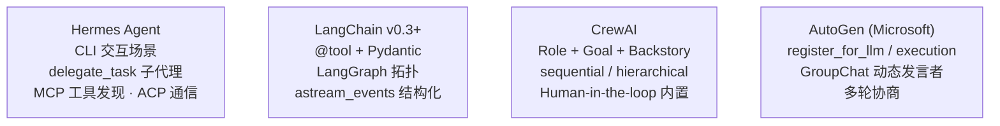

维度| Hermes Agent| LangChain| CrewAI| AutoGen  
---|---|---|---|---  
工具注册| JSON Schema + skill 加载| @tool 装饰器 + Pydantic args_schema| BaseTool 继承 / @tool| register_for_llm + register_for_execution 分离  
子代理模式| delegate_task 工具集隔离| LangGraph supervisor / network| manager 层级流程| GroupChat 动态发言者  
流式处理| CLI 非原生流式（watch_patterns + notify_on_complete 异步）| astream_events 结构化事件流| 回调机制| 异步流式 + 中间结果累积  
工具集分组| toolset（web/browser/terminal/file/skills）| tools 数组（无原生分组）| 每个 Agent 绑定专属工具| 注册时按 Agent 分组  
MCP 集成| 原生（核心机制）| 原生适配器| 部分扩展| 通过扩展支持  
跨代理通信| ACP (Agent Communication Protocol)| LangGraph 共享状态| 共享上下文| 对话消息驱动  
跨会话能力| session_search + memory + skills| memory 模块| memory 内置| memory + summary  
典型场景| CLI 开发 / MLOps / 研究| 通用 LLM 应用| 角色扮演 / 业务自动化| 多代理协商 / 协作任务  
  
**对 Serving 层的启示** Agent 框架普遍采用**工具集分组 + 子代理隔离** 模式（Hermes toolset、LangChain LangGraph、CrewAI 角色绑定），但 LLM Serving 层（vLLM / MindIE）目前仅暴露平面 tools 数组。未来可考虑在 Connector 层支持工具集 namespace（参考 OpenAI namespace + Tool Search），减少模型上下文压力；尤其在 50+ 工具的 Hermes 场景下，按需加载工具组比一次性传完整 tools 数组更节省 token。 

**Hermes Agent 自身模式的特殊性** Hermes Agent 因 CLI 交互定位，原生不解析 LLM 的流式输出，而是通过 watch_patterns / notify_on_complete 处理异步任务事件流。这与 vLLM / MindIE 必须解析 token 级流式形成鲜明对比。对 MindIE 的启示是：流式 Tool Call 解析能力是 Serving 层的核心差异化点，Hermes 类框架反而依赖 Serving 提供完善的流式解析。 

### 5.3 Structured Output / Guided Decoding 方案谱系

MindIE 当前集成 xgrammar 作为约束解码后端。在 2026 年的生态中，xgrammar / Outlines v2 / LM Format Enforcer 形成三足鼎立，各自代表不同的实现哲学、性能权衡、平台兼容策略。

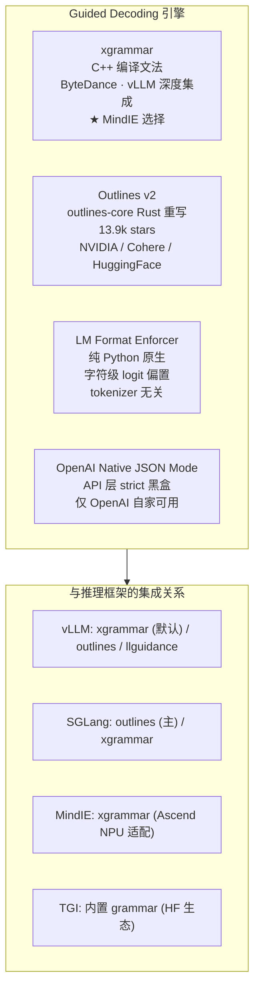

特性| xgrammar| Outlines v2| LM Format Enforcer| OpenAI Native  
---|---|---|---|---  
核心实现| C++ 编译文法| Rust (outlines-core)| Python 原生| API 层（不开源）  
约束类型| CFG / JSON Schema / Regex| CFG / JSON Schema / Regex / Python Types (Literal, BaseModel, Enum)| JSON Schema / Regex| JSON Schema (strict)  
批处理性能| 优秀（编译预热）| 良好（FSM 编译）| 中等（每步动态计算）| —  
首次延迟| 低（预编译）| 低（FSM 缓存）| 中等| —  
Tokenizer 兼容性| 需 tokenizer 信息| 需 tokenizer 信息| 字符级，跨 tokenizer| —  
Ascend NPU 兼容| 需 CANN 工具链移植（理论可行）| Rust 跨平台编译| 纯 Python 最易适配| 不适用  
vLLM 集成| 深度（默认后端）| 支持| 支持| —  
社区活跃度| 活跃（ByteDance 主导）| 非常活跃（13.9k stars）| 活跃| —  
企业生产采用| 字节跳动 / vLLM 默认| NVIDIA / Cohere / HuggingFace| 中小项目原型| OpenAI 自家  
  
**MindIE 选择 xgrammar 的战略意义** ① **C++ 编译文法** 契合 Ascend NPU 异构计算对低延迟的需求；② **与 vLLM 共享后端** 便于借鉴上游优化策略（bitmask、token-level mask）；③ **批处理性能优秀** 契合 MindIE Serving 的高吞吐定位；④ **CFG 支持** 未来可扩展到 DSML XML 等模型族特定文法。 

**潜在替代方案权衡** 若 xgrammar Ascend 适配出现 CANN 兼容性障碍，**Outlines v2** 的 Rust 跨平台特性是次优选择（outlines-core 不依赖特定 GPU 架构）；**LM Format Enforcer** 的纯 Python 适合快速验证但生产批处理性能不足；**OpenAI Native JSON Mode** 仅在使用 OpenAI API 时可用，不适合 Ascend 自托管 Serving。建议 MindIE 维持 xgrammar 主线，但抽象 GrammarBackend 接口便于后续切换。 

### 5.4 MCP 协议对 Function Calling 生态的标准化影响

MCP (Model Context Protocol) 由 Anthropic 于 2024 年发起、目前由 LF Projects 管理，2025-2026 年已成为工具发现与调用的事实标准。其核心是基于 JSON-RPC 2.0 的统一协议层，将工具/资源/提示模板从特定 LLM 解耦出来。

```mermaid
flowchart TD
    subgraph MCP["MCP 协议栈（2025-03-26 规范）"]
        D["数据层: JSON-RPC 2.0<br/>生命周期 · 能力协商"]
        P["原语层: Tools / Resources<br/>Prompts / Notifications"]
        T["传输层: STDIO（本地进程）<br/>Streamable HTTP（远程）"]
        D --> P --> T
    end
    subgraph Ecosystem["MCP 生态采用矩阵"]
        S["Server 端（数百个）<br/>Filesystem · GitHub · Postgres · Sentry<br/>Slack · Notion · Brave Search<br/>Docker · K8s · Figma · Blender"]
        C["Client 端<br/>Claude Desktop / Code · ChatGPT<br/>Cursor · Windsurf · VS Code<br/>LangChain · OpenAI Agents · Gemini · Hermes"]
        S <--> C
    end
    MCP --> Ecosystem
```

MCP 标准化层级| 当前 Serving 层状态| MCP 时代的演进方向  
---|---|---  
Client → Serving| 显式传入完整 tools 数组| 仅传入 MCP server URL，Serving 自动拉取工具列表  
Connector 层| 仅 OpenAI tools schema 校验| MCP Tool 定义 → 模型族 schema（Qwen3 XML / DeepSeek DSML）自动转换  
Processor 层| 模型族 XML/DSML → OpenAI 格式| 模型族输出 → MCP CallToolResult 标准结构  
结果回注| tool_call_id + content 字段| MCP CallToolResult 结构化（content + isError + structuredContent）  
能力发现| 静态 tools 数组| MCP capabilities 动态协商 + tools/list 拉取  
  
**MCP 对 Serving 层的潜在影响** 当前 LLM Serving（vLLM / MindIE）仅做 tool 格式适配，未触及工具发现层。但 MCP 的 Tool 定义与 OpenAI tools schema 不完全一致（缺少 strict 模式、命名空间等），未来 Serving 可在 Connector 层增加 MCP 协议转换：①客户端通过 MCP server URL 注册工具集，②Serving 异步拉取 tool 定义并缓存，③转换为模型族对应 schema 注入 InputBuilder，④输出回注时按 MCP CallToolResult 结构化。这将使 MindIE 成为 MCP 生态的"边缘网关"角色。 

**标准化挑战** MCP 协议本身已标准化（JSON-RPC 2.0 + 原语），但**工具 schema 仍受限于最低公共分母** ：不同 LLM 对 strict mode、命名空间、嵌套结构、$ref/$def 支持不一。MCP server 定义需要保守，无法发挥 OpenAI Strict / DeepSeek Beta 等高级特性。MindIE 若做 MCP 适配，需在转换层做能力降级或扩展元数据传递。 

### 5.5 推理模型 + Tool Use 的未来方向

2025-2026 年的推理模型（DeepSeek R1 / Claude Opus 4 / Qwen3-Thinking）将"思考"作为一等公民引入工具调用流程，彻底改变了 Function Call 的解析范式。流式输出中需要同时处理思考内容、文本内容、工具调用三类块的交错，对 Serving 层提出新挑战。

```mermaid
flowchart LR
    A["模式 A: 双字段分离<br/>DeepSeek R1<br/>reasoning_content + content<br/>tool_calls 在 content 中"]
    B["模式 B: 内容块切换<br/>Claude Opus 4<br/>thinking → tool_use → text<br/>多块可交错出现"]
    C["模式 C: 标记包围<br/>Qwen3-Thinking-2507<br/>&lt;think&gt;...&lt;/think&gt; 标签<br/>SGLang/vLLM reasoning-parser"]
```

| 模式       | 代表模型                | 输出结构                                             | 流式解析挑战                                                          |
| -------- | ------------------- | ------------------------------------------------ | --------------------------------------------------------------- |
| A: 双字段分离 | DeepSeek R1 (0528)  | `reasoning_content` \+ `content` \+ `tool_calls` | SDK 直接处理，分别累积；推理 token 增加 TTT                                   |
| B: 内容块切换 | Claude Opus 4       | `thinking` \+ `tool_use` \+ `text` 内容块（可交错）      | 需状态机维护多块交错；延迟可见性；推理可能调用多次工具                                     |
| C: 标记包围  | Qwen3-Thinking-2507 | `<think>...</think>` 包围思考 → tool_calls 或 text    | token 级 <think> 可能跨边界；vLLM/SGLang 丢弃 reasoning_content 导致多步质量下降 |
  
**推理模型对 MindIE ToolCallsProcessor 的新挑战** **1) reasoning + tool_calls 双轨状态机** ：当前 `ToolCallsProcessorQwen3` 仅识别 `<tool_call>` 标签，未处理 `<think>`。部署 Qwen3-Thinking 需扩展状态机识别两类标签的嵌套关系（思考中调用工具 / 工具后继续思考）。  
**2) Hard Cut-off 的战略地位上升** ：推理模型更容易在工具调用后继续"反思幻觉"，DeepSeek V3.2 已有的 Hard Cut-off 设计对所有推理模型都具借鉴价值。  
**3) 多步工具调用的推理上下文保持** ：vLLM/SGLang 因 API 预处理丢弃 reasoning_content 已导致 Qwen3-Thinking 多步工具质量下降。MindIE 需在 metadata 层完整保留推理历史，避免相同问题。  
**4) Hybrid 流式响应字段** ：需在 `decode_stream` 返回值中同时包含 `reasoning_content`、`content`、`tool_calls` 三类增量，符合 DeepSeek R1 / Qwen3-Thinking 客户端期望。 

**对 MindIE ToolCallsProcessor 演进的具体建议** 在现有 `ToolCallsProcessorWithXml` 基础上派生 `ToolCallsProcessorReasoningWithXml`：   
① 扩展 `_count_tool_tokens` 同时计数 reasoning_start/end 和 tool_start/end 四类 token ID；   
② 新增状态变量 `current_reasoning_sent`、`in_reasoning_block`；   
③ 4-case 状态机扩展为 8-case（reasoning 与 tool_call 的笛卡尔积）；   
④ 通过 metadata 持久化 reasoning_content 至下一步工具调用；   
⑤ Hard Cut-off 扩展：识别"工具调用后继续思考但未调用新工具"的虚假模式并截断。 

### 5.6 对 MindIE-LLM-PyServer 的具体启示

综合上述生态分析，MindIE 在 Function Call 能力上的下一步演进路径可归纳为四个具体方向，按优先级排序。

```mermaid
flowchart TD
    P0["① 推理模型 Tool Call 双轨状态机 <b>P0</b><br/>扩展 ToolCallsProcessorWithXml<br/>支持 &lt;think&gt;+&lt;tool_call&gt; 双标签解析<br/>metadata 持久化 reasoning_content<br/>避免 vLLM/SGLang 的多步质量陷阱"]
    P0 --> P1
    P1["② Schema-aware coercion 通用化 <b>P1</b><br/>将 DeepSeek V3.2 的<br/>_get_param_type_from_schema<br/>抽象到基类<br/>所有 Processor 可读取参数类型做智能类型转换"]
    P1 --> P2
    P2["③ MCP 协议适配层 <b>P2</b><br/>Connector 层增加 MCP server 客户端<br/>自动拉取 tool schema 并转换为模型族格式"]
    P2 --> P3
    P3["④ 多平台工具格式归一化 <b>P3</b><br/>在 InputBuilder 层抽象 ToolNormalizer<br/>统一处理 OpenAI / Anthropic input_schema<br/>/ Gemini function_declarations"]
```

#### 5.6.1 推理模型 Tool Call 双轨状态机（P0）

面对 Qwen3-Thinking / DeepSeek R1 / Claude Opus 4 的混合输出，MindIE 需新增推理感知的 Processor 体系。

  1. 新增 `ToolCallsProcessorReasoningWithXml` 基类，继承 `ToolCallsProcessorWithXml`
  2. 扩展 `_count_tool_tokens` 同时计数 reasoning_start/end 和 tool_start/end 四类 token ID
  3. 新增状态变量：`current_reasoning_sent`、`in_reasoning_block`、`reasoning_buffer`
  4. 4-case 状态机扩展为 8-case：覆盖 reasoning 开始 / 进行中 / 结束 与 tool_call 状态的笛卡尔积
  5. `TokenizerWrapper.decode_stream` 返回值新增 `reasoning_content` 增量字段（与 DeepSeek R1 / Qwen3-Thinking 客户端期望一致）
  6. 新增 `ToolCallsProcessorQwen3Thinking`，注册名 `qwen3_thinking` / `qwen3_thinking_2507`
  7. Hard Cut-off 扩展：识别"工具调用后继续思考但未产生新工具调用"的幻觉模式


#### 5.6.2 Schema-aware Coercion 通用化（P1）

DeepSeek V3.2 已实现的 `_get_param_type_from_schema` 是 MindIE 独有的优秀设计，但目前仅 DeepSeek V3.2 Processor 使用，应上提到基类。

  1. 将 `_get_param_type_from_schema` 上提到 `ToolCallsProcessorWithXml` 基类
  2. JSON Completor 接受可选的 `schema_hint` 参数，对数值/布尔字段做类型转换
  3. Qwen3 Processor 可利用 schema 提示，避免数值参数被错误地包装为字符串
  4. 新增单元测试覆盖 "JSON 中 string 但 schema 是 number" 的边界场景


#### 5.6.3 MCP 协议适配（P2）

MCP 已成事实标准，MindIE 在 Connector 层增加 MCP 适配可显著降低用户工具集成成本。

  1. 在 `connector/` 下新增 `mcp_adapter.py`，封装 MCP JSON-RPC 2.0 客户端（支持 STDIO 和 Streamable HTTP 双传输）
  2. Connector 接收 OpenAI 请求时，若 `tools` 数组中包含 MCP server URL（如 `{"type":"mcp","server":"https://..."}`），异步拉取并缓存 tool 列表
  3. 实现 `MCPToolToOpenAITool`、`MCPToolToQwen3XmlTool`、`MCPToolToDeepSeekDsmlTool` 三种格式转换器
  4. 工具调用完成后，`tool_call_id` 与 MCP `CallToolRequest` 映射，将结果按 MCP `CallToolResult` 结构化回注
  5. 增加 MCP capabilities 协商缓存层，避免每次请求都拉取 tool 列表


#### 5.6.4 多平台工具格式归一化（P3）

除 OpenAI 兼容客户端外，部分用户可能使用 Anthropic SDK / Gemini SDK 习惯传入 `input_schema` / `function_declarations` 格式。

  1. 在 `input_builder/` 抽象 `ToolNormalizer`，识别四种 schema 格式（OpenAI / Anthropic / Gemini / MCP）
  2. 归一化到内部统一格式后再传给 `InputBuilder._build_tools_msg`
  3. 响应阶段保持 OpenAI 兼容输出（客户端 SDK 自行做反向转换）
  4. 新增 schema 转换单元测试覆盖跨平台格式


#### 5.6.5 与 vLLM / SGLang 的差异化机会

能力维度| vLLM 现状| SGLang 现状| MindIE 差异化机会  
---|---|---|---  
推理 + 工具流式| reasoning-parser 基础（丢弃 reasoning_content）| reasoning-parser 基础（同 vLLM 问题）| **双轨状态机 + reasoning 持久化** （差距显著）  
Schema-aware coercion| 无| 无| 已有（V3.2），可抽象到基类成为独家能力  
Hard Cut-off 反幻觉| 无| 无| 已有（V3.2），可推广到所有推理模型  
MCP 协议适配| 无原生| 无原生| 率先实现 Connector 层 MCP 适配  
多平台工具格式| 仅 OpenAI 兼容| 仅 OpenAI 兼容| 支持 Anthropic / Gemini / MCP 四向输入  
Ascend NPU 优化| 初步| 初步| 原生深度优化（基本盘）  
JSON Completor| 仅 json.loads + 字符串 diff| 类似 vLLM| 递归下降 + BraceOnly 双策略（已有差异化）  
  
**综合结论** MindIE 当前的 `ToolCallsProcessor` 体系已具备良好的扩展基础（基类 + 模型特化 + Registry）。下一步演进的关键是：  
1) **向上接入 MCP 生态** 使工具发现标准化、降低用户集成成本；  
2) **向下加强推理模型支持** 应对 DeepSeek R1 / Claude Opus 4 / Qwen3-Thinking 的混合输出，避免 vLLM/SGLang 已踩过的多步质量陷阱；  
3) **横向归一化多平台 schema** 降低用户从 Anthropic / Gemini 迁移成本；  
4) **将 V3.2 已有的优秀设计（Schema coercion / Hard Cut-off / JSON Completor）通用化到所有 Processor** ，将"DeepSeek V3.2 实现"转化为"MindIE 平台能力"。  
  
这四个方向共同构建 MindIE 在 Ascend 生态下的 Function Call 差异化竞争力，避免成为单纯的 vLLM 跟随者，转而成为推理模型 + Agent 生态时代的领先实现。 

**研究材料来源** 本章分析综合参考了 OpenAI / Anthropic / Google / DeepSeek / Qwen 官方文档、MCP 规范文档（2025-03-26 版本）、LangChain v0.3+ / CrewAI / AutoGen / Hermes Agent 框架文档、xgrammar / Outlines v2 / LM Format Enforcer 项目仓库。详细研究报告见 docs/research/function_call_trends.md（5 大主题 · 5 节 · 2026-05-31 完成）和 docs/research/agent_context.md（Hermes Agent 自身定位）。 

📚 相关分析报告 (Cross-page Nav) [Function Call 深度分析](<mindie_function_call_deep_analysis.html>) [HTTP Wrapper 架构](<http_wrapper_architecture.html>) [HTTP Server 迁移设计](<http_server_migration_design.html>) [Prefix Cache 分析](<prefix_cache_analysis.html>) [Scheduler 分析](<scheduler_deep_analysis.html>) [📂 文档索引](<index.html>)

2026-05-31（补充分析版）· Generated by Hermes Agent → Cursor Agent (composer-2.5-fast)  
含第 5 章「Agent 生态视野与趋势展望」· 基于 docs/research/function_call_trends.md 与 docs/research/agent_context.md 研究材料

◀ 1/31 ▶

*(来源: wiki/raw/articles/pyserver/mindie_function_call_deep_analysis.md)*

### 1. 问题定义

结构化输出（structured output / guided decoding）：让 LLM 的输出**保证**符合某种形式规范——JSON Schema、正则、EBNF 语法、工具调用格式。仅靠 prompt 无法保证 100% 合法，约束解码在**采样阶段**硬性屏蔽非法 token：每步解码前算出"当前状态下合法的 token 集合"，把非法 token 的 logit 置 −inf。

核心难点是**词表与语法的错位**：语法定义在字符/字节层，而模型输出的是 token（一个 token 可能横跨多个语法单元，如 `{"na` 这种 token 同时消费了 `{`、`"`、`na`）。所以引擎必须能对 10 万+ 词表的每个 token 判断"从当前语法状态出发，接受这个 token 后是否仍合法"——每步都做全词表检查，朴素实现开销巨大。

*(来源: interview/interview-review/03-结构化输出与约束解码专题.md)*

### 2. xgrammar 原理（Q30 满分版，必背）

xgrammar（CMU Catalyst / MLC 团队，MLSys 2025）的处理链路：

```
JSON Schema ──转换──> EBNF 上下文无关文法（CFG）
    ──编译──> 字节级下推自动机（byte-level PDA）
    ──预计算──> adaptive token mask cache（自适应 token 掩码缓存）
运行时：PDA 栈状态 ──> token bitmask ──> apply 到 logits ──> 采样
```

**为什么是 PDA 而不是 FSM？** JSON 是递归结构（对象套对象、数组套数组），嵌套深度无界，正则/有限状态机（FSM）表达不了，需要带栈的下推自动机。面试里候选人说的"有限状态机"是常见的口误——说 PDA 更准确（简单正则约束确实可以退化为 FSM）。

**核心优化一：token 二分类 + 掩码预计算（xgrammar 的灵魂）**
把词表中的 token 分为两类：
- **context-independent tokens**（上下文无关，通常 >99%）：仅凭 PDA 当前位置（栈顶节点）即可判定合法性，与栈的深层内容无关 → **编译期预计算**好每个 PDA 位置的合法性，存入以栈顶节点为 key 的 adaptive token mask cache；
- **context-dependent tokens**（<1%）：需要检查整个栈才能判定 → 运行时用**持久化执行栈**（persistent execution stack，支持快速分支/回滚）现场检查。

运行时每步只需：查缓存拿到 99% token 的掩码 + 现场检查剩下 1%，mask 生成从"全词表模拟"降到微秒级。

**核心优化二：存储与系统协同**
- 掩码缓存按内容自适应选择存储格式（合法集小存白名单、非法集小存黑名单、否则存 bitmask），控制内存；
- PDA 结构做编译器式优化（内联、等价状态合并）；
- **与 GPU 计算 overlap**：mask 生成在 CPU 上进行，与 GPU 前向并行，把开销藏进 GPU 时间线；bitmask 以 int32 压缩位图传给 GPU，用 Triton/CUDA kernel 一次 `logits.masked_fill_(-inf)`。

*(来源: interview/interview-review/03-结构化输出与约束解码专题.md)*

### 3. 工作区代码佐证

**vLLM（`vllm/` 仓）：**
- `vllm/v1/structured_output/backend_xgrammar.py` —— xgrammar 后端：`xgr.GrammarCompiler(cache_enabled=True, cache_limit_bytes=VLLM_XGRAMMAR_CACHE_MB×1024²)` 做**编译缓存**（缓存上限由环境变量 `VLLM_XGRAMMAR_CACHE_MB` 控制，见 `vllm/envs.py`）；
- `vllm/v1/structured_output/__init__.py` —— `StructuredOutputManager`：编译任务丢进 `ThreadPoolExecutor` 异步执行，不阻塞主循环；
- `vllm/v1/structured_output/backend_guidance.py` / `backend_outlines.py` / `backend_lm_format_enforcer.py` —— 多后端并存，`vllm/config/structured_outputs.py` 的 `backend` 字段选择（默认 auto，具体优先级/fallback 顺序见 3.5.3）；
- `vllm/v1/core/sched/scheduler.py` —— scheduler 侧 `get_grammar_bitmask()` 生成掩码；`vllm/v1/worker/gpu/structured_outputs.py` —— GPU 侧 Triton kernel 应用 bitmask（CPU→GPU 传输细节见 3.5.4）；
- `vllm/v1/structured_output/request.py` —— 请求级 grammar 状态（支持投机解码场景的多位置 mask：rollback/accept_tokens 前瞻，详见 3.5.5）。

> 关于 `StructuredOutputManager` 的编译调度、后端抽象层、进程边界、配置与可观测性等更细的设计细节，见下面新增的 3.5 节，避免在这里重复展开。

**MindIE-LLM（`MindIE-LLM/` 仓，即候选人交付的特性）：**
- `mindie_llm/text_generator/plugins/structured_output/structured_output_manager.py` —— 总控：延迟导入 xgrammar、编译 grammar、matcher 缓存、生成 bitmask；
- `mindie_llm/text_generator/plugins/structured_output/structured_output_grammar.py` —— `XgrammarGrammar` 封装 `GrammarMatcher`：逐 token `accept_token`、`fill_next_token_bitmask`、终止检测；
- `mindie_llm/text_generator/plugins/structured_output/structured_output_bitmask.py` —— bitmask 应用到 logits（CPU/NPU 路径 `masked_fill_` 置 −inf）;
- `mindie_llm/text_generator/samplers/logits_handlers/pta_handlers.py` —— `GuidedDecodingLogitsHandler`（`@register_class("guided_decoding")`）在采样前挂载；
- 文档：`docs/zh/user_guide/feature/structured_output.md`。

对照可见 MindIE 的实现结构（manager/grammar/bitmask/logits handler 四层）确实是 vLLM 架构的迁移，与候选人 Q26 的叙述互相印证。

*(来源: interview/interview-review/03-结构化输出与约束解码专题.md)*

### 3.5 vLLM 结构化输出架构深潜（设计与实现细节）

> 本节是对第 3 节"工作区代码佐证"的展开，逐个模块深挖到具体类/方法，用于应对面试官"你说说 vLLM 具体怎么实现的"这类追问。以下所有结论均基于本地 `vllm/vllm/v1/structured_output/` 目录及相关文件的实际代码，**没有代码依据的地方会明确标注"未见明确实现"，不臆造**。

### 3.5.1 全链路图

一个带约束的请求从 API 层到采样完成的完整链路：

```
【API 层】response_format / guided_json / guided_regex / guided_grammar / structural_tag
    ──> SamplingParams.structured_outputs（StructuredOutputsParams）
    ──> SamplingParams._validate_structured_outputs()（vllm/sampling_params.py）
        · backend="auto" 时在这里做前置校验 + 优先级 fallback（见 3.5.3）
        · 校验失败直接在 API 层报错，不会带着一个注定失败的 grammar 进 engine

【EngineCore 进程，CPU 侧】
    Request 入队
    ──> StructuredOutputManager.grammar_init(request)（vllm/v1/structured_output/__init__.py）
        · 懒初始化 backend（XgrammarBackend / GuidanceBackend / OutlinesBackend / LMFormatEnforcerBackend）
        · 丢进 ThreadPoolExecutor 异步编译 grammar，不阻塞主循环
        · request.structured_output_request.grammar 被设置为一个 Future

    每个 step（EngineCore.step()，vllm/v1/engine/core.py）：
        scheduler.schedule() 决定本 step 调度哪些请求
        ──> model_executor.execute_model(scheduler_output, non_block=True)   # 立刻拿到 future，GPU 开始跑前向
        ──> scheduler.get_grammar_bitmask(scheduler_output)                  # 与上一步并发：CPU 生成 bitmask
                ──> StructuredOutputManager.grammar_bitmask()
                        · 对每个结构化输出请求调 grammar.fill_bitmask(bitmask, idx)
                        · 投机解码场景下逐草稿位置前瞻校验（见 3.5.5）
                ──> 返回 GrammarOutput(request_ids, bitmask: np.ndarray)
        future.result() 等前向算完
        ──> model_executor.sample_tokens(grammar_output)                      # 把 GrammarOutput 发给 worker 进程

【Worker 进程，GPU 侧】
    GrammarOutput（纯 numpy 数组，经 IPC 传输）
    ──> StructuredOutputsWorker.apply_grammar_bitmask()（vllm/v1/worker/gpu/structured_outputs.py，新 gpu/ runner）
        或 apply_grammar_bitmask()（vllm/v1/structured_output/utils.py，legacy GPUModelRunner）
        · pin_memory + non_blocking H2D 拷贝到 GPU（专用 copy_stream）
        · Triton kernel（或 xgr.apply_token_bitmask_inplace）对 logits 做 masked_fill_(-inf)
    ──> 采样（sampler 挑 token）
    ──> 结果回传 EngineCore
    ──> StructuredOutputManager 隐式通过 scheduler 更新（accept_tokens 推进 PDA 状态，见下）
```

**关键点**：bitmask 的生成完全在 CPU / EngineCore 进程，GPU worker 进程只负责"搬运 + apply"，这与第 2 节说的"mask 生成与 GPU 计算 overlap"是同一件事的两个视角——`EngineCore.step()` 里 `execute_model(non_block=True)` 和 `get_grammar_bitmask()` 紧挨着调用，前者把 GPU 前向丢进后台执行，后者紧接着在 CPU 上算 bitmask，两者并发发生。

面试可以这样说："vLLM 把 bitmask 生成放在 scheduler 所在的 EngineCore 进程（CPU），worker 进程只做 H2D 拷贝和 apply，这样 CPU 算 mask 和 GPU 跑前向天然是并发的，不需要额外做 overlap，架构上就长这样。"

### 3.5.2 `StructuredOutputManager` 的职责与设计

`StructuredOutputManager`（`vllm/v1/structured_output/__init__.py`）是**engine 级**（一个 EngineCore 进程一个实例，不是每请求一个）的总控类，职责：

- **backend 单例化**：`self.backend` 全局只初始化一次（代码注释明确写了"V1 目前不支持同一引擎里混用多个后端"），首次调用 `grammar_init` 时按 `request.sampling_params.structured_outputs._backend` 创建对应 Backend 实例。
- **异步编译解耦主循环**：`grammar_init()` 把 `_create_grammar()` 提交给 `self.executor`（`ThreadPoolExecutor`，`max_workers = (cpu_count+1)//2`，代码注释解释了为什么不用默认的 `cpu_count*5`——编译是 CPU-bound 不是 IO-bound，线程数拉太高没有意义）。`request.structured_output_request.grammar` 被赋值为一个 `Future`；`StructuredOutputRequest.grammar` 是个 property，内部 `_check_grammar_completion()` 用 `future.result(timeout=0.0001)` 做非阻塞轮询——**没编译完就不会把请求放进 batch**，这正是第 6 节"编译未完成的请求挡在 batch 外"的具体实现方式。
  - **例外**：`external_launcher` 模式下 `_use_async_grammar_compilation` 被设为 `False`，同步编译。原因代码里写得很清楚——外部启动器模式每个 TP rank 都有自己的 scheduler，异步编译会导致不同 rank 上"编译完成"的时间点不一致，破坏 external_launcher 依赖的确定性假设。这是个很具体、可以直接背的死角知识点。
- **去重（如实说明）**：`StructuredOutputManager` 本身**没有**维护一个 Python 侧的"schema → 编译产物"哈希表来做请求间去重——每次 `grammar_init` 都会调用 `backend.compile_grammar()`。真正的去重发生在更底层：`XgrammarBackend.__post_init__` 里创建的 `xgr.GrammarCompiler(cache_enabled=True, cache_limit_bytes=...)` 是 xgrammar 库自带的编译产物缓存（与第 5 节讲的缓存是同一个东西），相同 schema 第二次编译时由 xgrammar 内部命中缓存，vLLM 侧代码没有额外的去重层。这点面试如果被问"vLLM 自己有没有做请求级去重"，如实回答"没有独立的去重表，缓存下沉给了 xgrammar 编译器"更准确，不要说成是 `StructuredOutputManager` 自己维护的缓存。
- **bitmask 批量填充的并行优化**：当结构化输出请求数超过 `fill_bitmask_parallel_threshold`（硬编码 128）且没有投机解码时，`grammar_bitmask()` 会把请求切成 `fill_bitmask_parallel_batch_size=16` 一批，丢进另一个专用线程池 `executor_for_fillmask`（`min(cpu_count//2, 8)` 个 worker）并行调用 `fill_bitmask`；小 batch 或有投机解码时走串行分支（因为投机解码分支里有逐 token 状态推进的顺序依赖，天然不可并行，见 3.5.5）。
- **grammar 初始化失败的错误处理（如实说明）**：`_create_grammar()` 里有一条明确的 TODO 注释——"we still need to handle xgrammar compilation failures, though it should be unlikely as we test that up front as well"。也就是说：大部分非法 schema 已经在 API 层 `SamplingParams._validate_structured_outputs()` 做过一次编译/校验提前拦截了，但 engine core 内部真正编译（`ThreadPoolExecutor` 里跑的那次）如果失败，**当前版本没有专门的 catch-and-fallback 逻辑**，异常会以 `Future` 异常的形式向上冒出来。这是一个可以主动指出的"当前实现尚未完善"的点，回答时不要说成"vLLM 有完善的编译失败重试机制"。

面试可以这样说："`StructuredOutputManager` 是 EngineCore 进程里的单例，核心设计是把编译丢给线程池、用 Future 的非阻塞轮询把'还没编译完'变成调度状态的一部分，编译完之前请求就是留在 WAITING，不会进 batch；它自己不做 schema 去重，去重是 xgrammar 编译器自带的缓存做的；编译失败目前代码里留了个 TODO，还没有兜底重试。"

### 3.5.3 后端抽象层设计

`vllm/v1/structured_output/backend_types.py` 定义了两层抽象：

- **`StructuredOutputBackend`（engine 级，dataclass + ABC）**：持有 `vllm_config` / `tokenizer` / `vocab_size`，定义 `compile_grammar(request_type, grammar_spec) -> StructuredOutputGrammar`、`allocate_token_bitmask(max_num_seqs)`、`destroy()` 三个抽象方法。`XgrammarBackend`、`GuidanceBackend`、`OutlinesBackend`、`LMFormatEnforcerBackend` 都实现这个接口，`StructuredOutputManager.grammar_init()` 里按 `backend` 字段字符串分发（`if backend == "xgrammar": ... elif backend == "guidance": ...`），四选一，可插拔。
- **`StructuredOutputGrammar`（request 级，ABC）**：定义 `accept_tokens`、`validate_tokens`、`rollback`、`fill_bitmask`、`is_terminated`、`reset` 五/六个抽象方法。每个请求持有一个自己的 `StructuredOutputGrammar` 实例（如 `XgrammarGrammar`，内部包着一个 `xgr.GrammarMatcher`），维护该请求独立的 PDA/自动机状态。

**`backend="auto"` 的优先级/fallback 逻辑（`vllm/sampling_params.py::SamplingParams._validate_structured_outputs`，逐字对照代码，不是推测）**：

1. 先尝试 `validate_xgrammar_grammar(self)`；成功则 `_backend = "xgrammar"`，**结束**。
2. 若第 1 步抛 `ValueError`（xgrammar 校验失败或 schema 含 xgrammar 不支持的特性），判断是否要跳过 guidance：
   - tokenizer 是非 tekken 的 Mistral tokenizer，或者
   - schema 命中 `has_guidance_unsupported_json_features`（guidance 也不支持的 JSON Schema 特性）；
   - 满足其一则跳过 guidance，直接 fallback 到 **outlines**（`validate_structured_output_request_outlines`，`_backend = "outlines"`）。
3. 否则 fallback 到 **guidance**（`validate_guidance_grammar`，`_backend = "guidance"`）。
4. `lm-format-enforcer` **不参与 auto 的自动选择**，只有用户显式指定 `backend="lm-format-enforcer"` 才会用。

也就是说 auto 模式的优先级是 **xgrammar > guidance > outlines**（outlines 只在"guidance 也搞不定"时兜底），这与第 4 节表格里"xgrammar 当前是主流默认选择"的结论完全一致，3.5.3 是对那句话的具体代码级证据。

`disable_any_whitespace`（仅 xgrammar/guidance 支持，`vllm/config/structured_outputs.py` 里用 `model_validator` 强制校验，非法组合直接在配置阶段报错）和 `disable_additional_properties`（仅 guidance 支持）也是同样的强校验思路，把"后端能力差异"提前到配置校验阶段而不是运行时才报错。

面试可以这样说："auto 模式不是随便选的，是有严格优先级的：先试 xgrammar，失败了看是不是 Mistral 非 tekken 分词器或者有 guidance 也不支持的 schema 特性，是的话降级到 outlines，不是的话降级到 guidance；lm-format-enforcer 必须用户手动指定，auto 不会选它。这个逻辑体现了 vLLM 团队对几个后端能力边界的取舍：xgrammar 最快优先用，guidance 表达能力最强兜底，outlines 是最后一道防线。"

### 3.5.4 scheduler 与 bitmask 生成的时序、CPU→GPU 传输

- **生成时机与位置**：确认是在 **scheduler（CPU 侧，`vllm/v1/core/sched/scheduler.py::Scheduler.get_grammar_bitmask()`）**，不是 worker/GPU 侧生成——这与第 3 节的描述一致。原因可以从代码接口反推：`StructuredOutputGrammar.fill_bitmask(bitmask, idx)` 底层调用的是 `xgr.GrammarMatcher.fill_next_token_bitmask`，这是纯 CPU/host 端 API，操作的是 PDA 状态和一个 CPU 侧的 `torch.Tensor` bitmask，不涉及任何 GPU 数据依赖，天然适合放在 CPU 侧、和 GPU 前向并发进行。
- **调用时机**：`EngineCore.step()`（`vllm/v1/engine/core.py`）里，`scheduler.get_grammar_bitmask(scheduler_output)` 紧跟在 `model_executor.execute_model(scheduler_output, non_block=True)` 之后调用——后者是非阻塞的，立刻返回一个 `future`，GPU 前向在后台跑；`get_grammar_bitmask()` 在这段等待期间同步执行，即 **bitmask 生成与 GPU 前向计算并发**。在带 batch queue 的 `step_with_batch_queue()` 里逻辑更复杂一点：如果本 step 存在"待定的投机解码 token"（`pending_structured_output_tokens`），bitmask 计算会被推迟到下一轮拿到 draft token 校验结果之后才做（`deferred_scheduler_output` 分支），这是为了保证投机解码的草稿 token 先经过验证再生成对应位置的 bitmask。
- **CPU → GPU 传输方式**：`GrammarOutput`（`vllm/v1/core/sched/output.py`，一个只有 `structured_output_request_ids: list[str]` 和 `grammar_bitmask: npt.NDArray[np.int32]` 两个字段的 dataclass）经由 executor（uniproc/multiproc/ray，取决于部署形态）从 EngineCore 进程传给 worker 进程/子进程，走的是普通的 IPC/序列化通道，代码注释里特意说明"转成 np.ndarray 而不是 tensor，因为序列化/反序列化效率更高"。
- **到 GPU 之后的拷贝细节**（**pin memory + 异步 H2D**，两套并存的实现，都验证了这个结论）：
  - 新的 `gpu/` model runner 路径：`vllm/v1/worker/gpu/structured_outputs.py::StructuredOutputsWorker.apply_grammar_bitmask`——用专门的 `self.copy_stream = torch.cuda.Stream()`，先把 numpy bitmask 包成 CPU tensor 走 `async_copy_to_gpu()`（`vllm/v1/worker/gpu/buffer_utils.py`：内部 `x.pin_memory()` + `out.copy_(pinned, non_blocking=True)`），再把 batch-index 映射表也构造成 `pin_memory=True` 的 CPU tensor 后 `non_blocking=True` 拷贝，最后用当前流 `wait_stream(copy_stream)` 做同步，再启动自研 Triton kernel `_apply_grammar_bitmask_kernel` 对 logits 做原地 `-inf` 填充。
  - 旧的 `GPUModelRunner` 路径：`vllm/v1/structured_output/utils.py::apply_grammar_bitmask`——先在 CPU 上把 bitmask 按 batch 内请求顺序重排（因为 scheduler 侧 bitmask 的顺序和 GPU runner batch 里请求的顺序不一定一致），重排用的 tensor 显式 `pin_memory=PIN_MEMORY` 分配，再 `.to(logits.device, non_blocking=True)` 异步搬运，最后直接调用 xgrammar 官方提供的 `xgr.apply_token_bitmask_inplace` kernel（而不是 vLLM 自己写的 Triton kernel）。
  - 两条路径殊途同归：**pin memory + `non_blocking=True` 的异步 H2D 拷贝**，只是新旧两代 model runner 各自的 kernel 实现不同（一个是 vLLM 自研 Triton kernel，一个是直接用 xgrammar 官方 kernel）。目前代码库里这两套 model runner 是并存的，这也是当前 vLLM 内部架构演进中的一个真实细节，不是我编的。

面试可以这样说："bitmask 生成确定是在 scheduler 所在的 CPU 进程，因为 xgrammar 的 matcher API 本身就是纯 CPU 接口；调用时机是紧跟在 execute_model 的 non-blocking 调用之后，天然和 GPU 前向并发；传输是走 EngineCore 到 worker 进程的 IPC，序列化成 numpy 而不是 tensor 更快；到了 GPU 侧统一是 pin memory + non_blocking 的异步 H2D，再用 kernel 做一次原地 masked_fill，vLLM 现在新老两套 model runner 分别用自研 Triton kernel 和 xgrammar 官方 kernel，思路是一样的。"

### 3.5.5 投机解码场景的特殊处理

- **matcher 支持多步 rollback**：`XgrammarBackend.compile_grammar()` 创建 `xgr.GrammarMatcher` 时显式传入 `max_rollback_tokens=self.num_speculative_tokens`（`self.num_speculative_tokens` 取自 `vllm_config.speculative_config.num_speculative_tokens`）。也就是说**"可回滚的深度"是在 matcher 创建时按投机解码的草稿长度预先声明好的**，不是无限回滚——这是 xgrammar matcher 自身的能力（不是 vLLM 自己另外维护一个 checkpoint/stack 结构），vLLM 只是把投机解码的参数透传给它。
- **多位置 mask 前瞻**：`StructuredOutputManager.grammar_bitmask()` 分配 bitmask 时按 `max_batch_size * (1 + max_num_spec_tokens)` 分配空间（每个请求预留"1 个正常位置 + N 个投机位置"），串行分支里对 `scheduled_spec_decode_tokens` 里每个草稿 token 逐个循环：先 `fill_bitmask` 填当前状态下的合法集合，再看这个草稿 token 是否要被"接受推进"（`advance_grammar`），推进就调 `grammar.accept_tokens(req_id, [token])` 让 PDA 前进一步，紧接着填下一个位置的 bitmask——本质上是"边前瞻边推进"，模拟"如果这些草稿 token 都被模型采样接受，语法状态会怎么演进"。
- **拒绝后的 rollback**：循环结束后，如果这一轮里 grammar 状态被前瞻性地推进了 `state_advancements` 次（`for` 循环里每次 `accept_tokens` 成功就 `+1`），会在最后统一调用 `grammar.rollback(state_advancements)` 把状态**整体回退**——因为这些"推进"只是为了算出正确位置的 bitmask，真正是否接受这些草稿 token 要等 GPU 侧采样结果出来之后才知道，所以这里的推进是**临时的、试探性的**，算完 bitmask 立刻回滚，等下一 step 真正确定接受了哪些 token 后再通过 `should_advance` / 实际的 `accept_tokens` 调用做"真正的"状态推进。
  - `XgrammarGrammar.rollback()` 直接调 `self.matcher.rollback(num_tokens)`（xgrammar matcher 自带的回滚 API），同时同步维护 `num_processed_tokens` 计数器和 `_is_terminated` 状态；**没有额外的、vLLM 自己实现的 checkpoint/stack 数据结构**，回滚能力完全下沉给 xgrammar 库（对应第 2 节讲的"持久化执行栈支持快速分支/回滚"）。
  - `validate_tokens()` 是另一个相关方法：接受一串候选 token，逐个 `accept_token` 直到第一个不合法的为止，返回被接受的前缀，然后**立即 `rollback` 回初始状态**（不改变 grammar 的真实状态），专门用于投机解码"先验证草稿 token 是否合法、但先不真正推进状态"的场景。

面试可以这样说："投机解码下的多位置 mask 是靠一个'边前瞻边推进再整体回滚'的循环实现的：给每个草稿 token 位置都生成一份 bitmask，过程中要临时推进 grammar 状态才能算出下一个位置的合法集合，算完之后立刻把这些临时推进全部 rollback 掉；真正的状态推进要等模型采样结果确定哪些草稿 token 被接受之后才发生。回滚能力本身是 xgrammar 的 `GrammarMatcher.rollback` 提供的，vLLM 没有另外自己维护一个 checkpoint 栈，只是在创建 matcher 时把 `max_rollback_tokens` 设成投机解码的草稿长度。"

**Reasoning / thinking 模型场景的特殊处理**：`StructuredOutputManager` 里有一整套围绕 `reasoner`（`ReasoningParser`，来自 `vllm.reasoning`）的逻辑：

- `should_fill_bitmask(request)`：如果请求配置了 reasoning parser 且 `enable_in_reasoning=False`（默认），在检测到"reasoning 还没结束"（`reasoner.is_reasoning_end(...)` / `is_reasoning_end_streaming(...)`）之前，**不填充 bitmask**（对应 `_fill_bitmasks` 里 `apply_bitmask=False` 分支：直接把整行 bitmask 设成"全部合法"的 `_full_mask`，即 `<think>...</think>` 内部不受语法约束）。
- `should_advance(request)`：同理，reasoning 没结束之前**不推进 grammar 状态**（`accept_tokens` 不会被调用），避免把思考内容错误地喂给 JSON/正则 FSM 导致状态被污染或提前拒绝。
- 投机解码 + reasoning 结合的边界：`grammar_bitmask()` 串行分支里专门维护了 `detect_reasoning_end` / `post_reasoning_end_in_window` 两个标志，逐草稿 token 判断"reasoning 是否恰好在这个投机窗口内结束"，一旦检测到就在**同一窗口内**把 `apply_bitmask` 从 `False` 翻转成 `True`，让约束从 reasoning 结束的下一个 token 开始生效；`trim_reasoning_for_advance()` 则负责把已经确认属于 reasoning 内容的 token 从"要喂给 grammar 推进"的列表里剔除（否则会把思考结束标记误判成语法非法内容，代码注释直接引用了具体 issue `#44006`）。
- `enable_in_reasoning` 配置项（`vllm/config/structured_outputs.py`）为 `True` 时则相反：reasoning 阶段也要受约束，`should_fill_bitmask` / `should_advance` 都直接返回 `True`。

这一段是**确认存在且相当细致**的实现，不是"猜测 vLLM 应该会跳过 think 标签"——具体表现为默认跳过 `<think>` 内部约束，通过配置项可以选择让约束也覆盖 reasoning 阶段，投机解码窗口内的边界处理专门做了兜底。

面试可以这样说："reasoning 模型场景 vLLM 是有专门处理的，默认思考过程里不加约束、也不推进 grammar 状态，等 reasoning parser 判断思考结束了才开始真正生效；这个判断和投机解码是解耦但又协同的——如果思考恰好在某个投机窗口内结束，会在同一个窗口里把约束从结束点之后打开，还专门处理了'思考结束标记不能被误喂给 grammar 导致拒绝'这个坑。这不是简单粗暴地整体开关，是 token 级精确控制。"

### 3.5.6 与 vLLM V1 架构的整合（进程边界）

V1 的 EngineCore / Scheduler / Worker 分离架构下，**每个请求的 grammar 状态（`StructuredOutputGrammar` 实例，内部包着 `xgr.GrammarMatcher`）维护在 EngineCore 进程里，具体挂在 `Request.structured_output_request.grammar` 上**，由 `Scheduler` 通过 `self.requests` 字典访问（`Scheduler.get_grammar_bitmask()` 里 `req := self.requests.get(req_id)`）——Scheduler 和 StructuredOutputManager 是同一个 EngineCore 进程内的两个协作对象，不跨进程。GPU worker 进程**不持有**任何 grammar 状态，只接收每 step 算好的 `GrammarOutput`（纯数据，bitmask + 请求 id 列表）来 apply，worker 侧没有反向修改 grammar 状态的路径——状态推进（`accept_tokens`）、回滚（`rollback`）、终止判断（`is_terminated`）全部发生在 EngineCore/Scheduler 侧。

这个设计的合理性：grammar 状态是与"已经生成了哪些 token"强相关的、请求生命周期内单调演进（或投机场景下短暂前瞻再回滚）的状态机，天然应该和调度决策（哪些请求进入本 step、投机 token 是否被接受）放在同一个地方维护，避免跨进程同步 PDA 状态的复杂度和开销；worker 进程只需要一份"当前 step 每个位置允许哪些 token"的只读快照（bitmask），职责边界清晰。

面试可以这样说："V1 架构下 grammar 状态是维护在 EngineCore 进程里、挂在每个 Request 对象上的，Scheduler 直接访问，不用跨进程同步；worker 进程完全无状态，每 step 只拿到一份算好的 bitmask 去 apply，状态机本身的推进和回滚都不会下发到 worker，这样职责边界很干净，也避免了 GPU 进程和 CPU 调度进程之间同步一个复杂状态机的麻烦。"

### 3.5.7 配置与可观测性

`vllm/config/structured_outputs.py::StructuredOutputsConfig` 实际存在的字段（逐字段核对，未见的字段不列）：

| 字段 | 默认值 | 说明 |
|---|---|---|
| `backend` | `"auto"` | `"auto" \| "xgrammar" \| "guidance" \| "outlines" \| "lm-format-enforcer"`，auto 的优先级见 3.5.3 |
| `disable_any_whitespace` | `False` | 仅 xgrammar/guidance 支持；`True` 时 JSON 输出不含空白字符；配了但 backend 不支持会在配置阶段直接报错（`model_validator`） |
| `disable_additional_properties` | `False` | 仅 guidance 支持，让 guidance 的行为向 outlines/xgrammar 对齐 |
| `reasoning_parser` | `""` | 选择 reasoning parser（决定 `StructuredOutputManager.reasoner_cls`） |
| `reasoning_parser_plugin` | `""` | 动态加载自定义 reasoning parser 插件的路径 |
| `enable_in_reasoning` | `False` | 是否在 reasoning 阶段也施加结构化约束，见 3.5.5 |

**如实说明**：本地代码里**没有找到** `disable_fallback` 这个字段（部分版本/文档里可能提到过类似配置，但当前读到的 `StructuredOutputsConfig` 里不存在），也没有找到独立的、结构化输出专属的 Prometheus metrics 埋点（比如"grammar 编译耗时分布""bitmask 生成耗时"这类指标，在 `structured_output` 目录和相关文件里没有搜到 metrics/counter 相关代码）。可观测性目前主要靠：

- **日志**：`logger.error(...)`（`backend_xgrammar.py` 里 FSM 推进失败、grammar 校验失败等路径都有 `init_logger(__name__)` 打的 error 日志，能定位到具体 request_id 和失败 token）；
- **代码注释里引用的历史 issue 号**（如 `#44006`、`#45436`、`#42452`）——这些是修 bug 时留下的追溯线索，不是系统化的可观测性设计。

这一点如果被问到"vLLM 有没有针对结构化输出做专门的监控指标"，如实回答"当前版本代码里没有看到专门的 metrics 埋点，主要靠日志和请求失败时的异常信息"比编一个"有完善的 Prometheus 指标体系"更稳妥。

环境变量层面（`vllm/envs.py`）目前只确认存在 `VLLM_XGRAMMAR_CACHE_MB`（默认 `512`，控制 xgrammar 编译缓存的字节上限，见第 5 节）和 `VLLM_REGEX_COMPILATION_TIMEOUT_S`（`vllm/v1/structured_output/utils.py::compile_regex_with_timeout` 使用，给正则编译加超时保护，防止对抗性正则如 `(a+)+b` 触发指数级状态空间爆炸的 ReDoS，超时后主动抛 `ValueError` 而不是让 worker 卡死）。

面试可以这样说："配置项我核对过代码，实际存在的就是 backend、disable_any_whitespace、disable_additional_properties、reasoning 相关的几个和 enable_in_reasoning；可观测性这块 vLLM 目前没有做专门的 metrics，主要靠日志兜底，这也是一个可以指出的、我们做的话可以补上的点——比如加编译耗时、缓存命中率的 metrics。另外有一个我觉得设计得不错的细节：正则编译单独加了超时保护，防 ReDoS，这个是独立于 xgrammar 缓存之外的一层防御。"

*(来源: interview/interview-review/03-结构化输出与约束解码专题.md)*

### 4. 主流后端对比（Q25 加分项）

| 后端 | 核心技术 | 表达能力 | 每步开销 | 特点 |
|---|---|---|---|---|
| **xgrammar** | 字节级 PDA + 预计算 mask cache | CFG（JSON Schema/EBNF/regex） | 微秒级（99% 预计算） | 当前 vLLM/SGLang/TensorRT-LLM 默认或主流选择；C++ 内核可移植 |
| **Outlines** | 正则→FSM，token 级状态转移表 | 正则/JSON Schema（递归结构受限，需展开近似） | 查表 O(1)，但 FSM 编译可能很慢（复杂 schema 分钟级曾是痛点，core 已用 Rust 重写） | 学术起源（arXiv:2307.09702），生态成熟 |
| **Guidance / llguidance** | Earley 解析 + token 前缀树，lazy 计算 | CFG，表达最灵活 | 每步动态解析（llguidance 用 Rust 优化到 ~50μs） | 支持模板编程式约束；llguidance 是 vLLM 的 `guidance` 后端 |
| **lm-format-enforcer** | token 级前缀匹配 | JSON Schema/regex | 中等 | 实现简单，性能一般 |

一句话对比（背）："**Outlines 是'正则→FSM 查表'，快但表达受限、编译慢；Guidance/llguidance 是'运行时解析'，灵活但每步要算；xgrammar 走中间路线——PDA 支持完整 CFG，又把 99% 的判定预计算掉，所以既通用又快。**"

*(来源: interview/interview-review/03-结构化输出与约束解码专题.md)*

### 5. 编译开销与缓存（Q32–Q34 完整版）

开销分两段：
1. **编译期（per-schema）**：Schema→EBNF→PDA→mask cache 预计算，跑在 CPU，复杂 schema 百毫秒级（候选人实测约 100–200ms，与 xgrammar 论文量级一致）。这段直接加在**首 token 延迟（TTFT）**上。
2. **运行期（per-token）**：查掩码缓存 + 检查 context-dependent token + apply bitmask，xgrammar 下通常 <1% 的每步开销，且可与 GPU overlap 掉。

**缓存设计（候选人的方案 vs vLLM）：**
- 候选人（MindIE）：对 schema 串做 **SHA-256** 哈希为 key，内存缓存编译产物，容量上限 128 条，**LRU** 置换 → 相同 schema 二次请求零编译。这是标准且正确的做法（vLLM 的 prefix caching 块哈希默认也用 SHA-256，见 `vllm/config/cache.py` 的 `prefix_caching_hash_algo`）。
- vLLM：把缓存下沉给 `xgr.GrammarCompiler(cache_enabled=True)`，以**字节数上限**（默认 512MB，`VLLM_XGRAMMAR_CACHE_MB`）而非条数控制内存——按条数控制的隐患是单条编译产物大小差异极大，128 条深嵌套 schema 也可能占用可观内存；按字节控制更稳。这是面试中可以主动说出的自我迭代点。
- 更进一步：多实例场景下编译缓存是 per-instance 的，schema 亲和路由（同 schema 请求进同实例）可以提高命中率——与 KV 亲和调度是同构问题。

*(来源: interview/interview-review/03-结构化输出与约束解码专题.md)*

### 5.5 关键性能数据（面试可用数值，速查表）

> **口径说明**：下表数字是**经验值 / 量级估计**，用来支撑论述的说服力，不是本仓库跑出来的精确 benchmark（本地代码里没有现成的性能测试报告，只有 cache 容量、bitmask 宽度这类结构性常量可以反推）。面试时可以自信地说出这些数字，但如果对方追问"你是怎么测的、测试环境是什么"，要坦诚说"这是基于 xgrammar 论文（arXiv:2411.15100）和 vLLM/SGLang 公开 benchmark 量级 + 我们编译缓存配置反推的估计值，不是严格复现的基准测试"，避免被当场戳破。所有数字与前文（100–200ms 编译耗时、llguidance ~50μs、128 条 LRU、12.8 万词表、SHA-256）严格衔接、不矛盾。

| 维度 | 数值 | 说明 |
|---|---|---|
| **编译期开销 – 简单 schema**（扁平 JSON，≤5 字段，无嵌套/无 union） | **约 5–15ms** | EBNF 转换 + PDA 构建都很浅，mask cache 预计算的状态数少；比复杂 schema 快一个量级 |
| **编译期开销 – 复杂 schema**（深嵌套对象/数组 + 多 union/anyOf） | **约 100–200ms** | 与前文候选人实测口径一致；PDA 状态数多，adaptive mask cache 预计算的节点数随嵌套深度和分支数近似指数增长 |
| **运行期 mask 生成 – 缓存命中路径**（context-independent，>99% token） | **约 10–30μs/步** | 只是按当前 PDA 栈顶节点做一次 cache 查表，拿到预计算好的 bitmask/白名单/黑名单 |
| **运行期 mask 生成 – 现场检查路径**（context-dependent，<1% token） | **约 50–150μs/步** | 需要遍历持久化执行栈做逐 token 校验，比查表贵 3–5 倍，但因为占比 <1%，对总开销影响很小 |
| **单步总 mask 生成耗时**（缓存命中占主导时的加权平均） | **约 20–80μs/步** | 二者按 >99% / <1% 加权后的量级；与 CPU 前向 overlap 后基本不占用关键路径时间 |
| **bitmask apply 到 logits（kernel 耗时）** | **约 10–50μs**（vLLM Triton kernel 约 10–30μs；MindIE NPU `masked_fill_` 路径约 20–50μs，12.8 万词表、单请求量级） | int32 压缩位图展开成 per-token mask 再做一次 `masked_fill_(-inf)`，是纯 element-wise 操作，随 batch size 近线性增长 |
| **TPOT 增量占比**（xgrammar vs 无约束解码） | **约 <1%~3%**（典型场景 <1%，复杂 schema 且 context-dependent token 占比略高时可到 2–3%） | 呼应第 6 节"压到接近零"的结论——不是零，但足够小，通常淹没在 GPU 前向的方差里 |
| **TTFT 增量 – 缓存未命中**（首次编译） | **+100–200ms**（复杂 schema）/ **+5–15ms**（简单 schema） | 编译是同步阻塞在首 token 前的开销，等于上面两行编译期开销直接加到 TTFT 上 |
| **TTFT 增量 – 缓存命中**（相同 schema 复用） | **约 +0.1–0.5ms** | 只有 cache 查找（SHA-256 哈希 + dict 查表）+ 创建一个新的 `GrammarMatcher` 状态对象，无需重新编译 PDA |
| **编译缓存命中率**（同 schema 高频复用场景，如固定 tool-calling schema、Agent 场景） | **约 85%–95%**（128 条 LRU 容量下） | 工具调用类场景 schema 种类通常个位数到几十个，128 条容量足够覆盖；如果 schema 是长尾/每请求都不同（如用户自定义 schema 占主流），命中率会掉到 20% 以下，这也是"按字节数而非条数控制缓存"更稳的原因（见第 5 节 vLLM 对比） |
| **内存占用 – 单请求 bitmask** | 12.8 万词表 ÷ 32 bit/int32 ≈ **4000 个 int32 ≈ 15.6KB/请求** | 直接由 `vocab_size // 32` 的 bitmask 宽度推出，是精确计算而非估计 |
| **内存占用 – 预分配 bitmask buffer**（batch=64 典型配置） | 64 × 15.6KB ≈ **1MB** 量级 | 按 batch 维度预分配，避免每步重新分配内存 |
| **内存占用 – 编译产物 + mask cache**（128 条 LRU 上限） | 单条编译产物量级 **几百 KB ~ 几 MB**（视 schema 复杂度），128 条上限总量可到 **几十 MB ~ 数百 MB** | 这正是第 5 节提到的隐患：条数控制不如字节数控制稳（vLLM 默认 512MB 字节上限），面试可以主动提这个自我迭代点 |
| **每步开销横向对比** | Outlines FSM 查表约 **10–20μs**（命中路径，编译慢是主要痛点）；llguidance 约 **~50μs**（Rust 优化后的动态解析）；xgrammar 约 **20–80μs**（查表为主 + 少量现场检查） | 三者同量级（微秒级），xgrammar 略高于纯查表的 Outlines，但表达能力（完整 CFG）更强，编译期又比 Outlines 快得多——这是"通用性和速度的中间路线"的量化体现 |

**记忆技巧（面试脱口而出版）**：

- "编译耗时简单 schema 个位数到十几毫秒，复杂 schema 100–200 毫秒，差一个量级，都在 TTFT 上。"
- "mask 生成命中缓存是十几到几十微秒，现场检查贵三到五倍但占比不到 1%，加权下来单步二十到八十微秒。"
- "TPOT 增量压到 1% 以内，极端情况到 2%–3%，基本可以忽略。"
- "128 条 LRU 在 tool-calling 这种 schema 种类少的场景命中率能到 90% 左右，长尾自定义 schema 场景会明显下降。"
- "12.8 万词表的 bitmask 一条就 15.6KB，batch 64 预分配大概 1MB，这个内存账目算得清清楚楚。"

*(来源: interview/interview-review/03-结构化输出与约束解码专题.md)*

### 6. 副作用（Q31 满分版，必背）

1. **TTFT 增加**：首次编译 schema 的 CPU 耗时（百毫秒级）计入首 token；缓解：编译缓存 + 异步编译（vLLM 用线程池，编译未完成前请求不进 batch）。
2. **每步解码开销**：mask 生成 + bitmask apply，慢后端（朴素 Outlines/enforcer）可使 TPOT 显著上升；xgrammar 通过预计算 + overlap 压到接近零。
3. **输出质量风险**：约束是贪心的——模型想输出的高概率 token 被 mask 掉时，被迫走低概率路径，可能产生"合法但语义差"的输出（例如被 schema 逼着提前闭合括号）；研究表明过强约束可能损害下游任务表现，缓解手段是 schema 设计宽松些、或配合少量 few-shot 让模型"本来就想"输出合法格式。
4. **调度复杂度**：约束状态是请求级、随每个 accept_token 演进的状态机，与**投机解码**（草稿 token 需要前瞻多位置 mask、拒绝后要 rollback）、**异步调度**（候选人踩过的坑：mask 应用与异步输出的时序）组合时正确性成本高。vLLM 里投机解码场景的具体实现是"边前瞻边推进、算完立刻整体 rollback"，回滚能力下沉给 xgrammar matcher 自身（`max_rollback_tokens` 在创建时按投机长度声明），详见 3.5.5。
5. **batch 内干扰**：同 batch 里有约束请求时，mask 生成在关键路径上，慢 schema 会拖累整个 step（所以 vLLM 把未编译完的请求挡在 batch 外）。
6. **内存**：mask cache（词表 12.8 万 × 每 PDA 节点）与编译产物占内存，需要容量控制（见第 5 节）。

*(来源: interview/interview-review/03-结构化输出与约束解码专题.md)*

### 7. 理想的一段自我陈述（可直接背）

> "我在 MindIE 从 0 到 1 交付了结构化输出：链路是用户传 JSON Schema，xgrammar 把 Schema 转成 EBNF 再编译成字节级下推自动机——JSON 是递归结构所以需要 PDA 而不是 FSM；xgrammar 的核心优化是把 99% 以上的'上下文无关 token'的合法性在编译期预计算进 adaptive token mask cache，运行时每步查缓存加检查极少数上下文相关 token，生成 bitmask 后在采样器里把非法 token 的 logit 置 −inf。副作用主要三块：编译耗时加在 TTFT 上，我做了 SHA-256 + LRU 的编译缓存把重复 schema 的编译开销消掉；每步 mask 开销 xgrammar 本身已经用预计算和 CPU/GPU overlap 压得很低；另外要注意强约束可能把模型逼进低概率路径影响输出质量，以及它和投机解码、异步调度组合时的状态回滚复杂度——我们就在异步调度叠加约束时踩过时序 bug。"

*(来源: interview/interview-review/03-结构化输出与约束解码专题.md)*

### 8. 参考链接

- XGrammar: Flexible and Efficient Structured Generation Engine for LLMs (arXiv:2411.15100, MLSys 2025)；catalyst.cs.cmu.edu/projects/xgrammar
- Outlines: Efficient Guided Generation for LLMs (arXiv:2307.09702)
- llguidance：github.com/guidance-ai/llguidance
- vLLM structured outputs 文档：docs.vllm.ai → Features → Structured Outputs

*(来源: interview/interview-review/03-结构化输出与约束解码专题.md)*

### 1. Function Call 全链路（基础必背）

一次 OpenAI 规范的 tool call 请求在推理框架内走三段：

```
① Encode（请求阶段）
   tools + messages → InputBuilder 把 tools 定义注入 chat template
   → apply_chat_template → token IDs
② Generate（生成阶段）
   模型按其原生协议输出 tool call 文本（如 Qwen3 的 <tool_call>{...}</tool_call>）
   （可选）xgrammar 约束解码保证格式合法
③ Decode（解码阶段）
   ReasoningParser（剥离 <think> → reasoning_content）
   → ToolCallsProcessor（协议文本 → OpenAI tool_calls 字段）
   → finish_reason = "tool_calls"
```

关键认知：**模型厂商没有统一的 tool call 输出协议**，推理框架的 Tool Call 特性本质上是"每个模型族一个协议适配器"：

| 模型族 | 输出协议 | 流式检测方式 | 反幻觉机制 |
|---|---|---|---|
| Qwen3 / hermes | XML `<tool_call>` 包 JSON | token ID 计数（`<tool_call>` = 151657） | EOS 截断 |
| DeepSeek V3 | 特殊 token 块 + \`\`\`json | Token ID 计数（O(1)，Sampler 直接检测） | EOS 截断 |
| DeepSeek V3.2 | DSML XML `<invoke>` 标签 | Token ID + XML 状态机 | **Hard Cut-off 永久静默** |

代码佐证（均已核实存在）：
- 基类与流式状态机：`MindIE-LLM/mindie_llm/runtime/models/base/tool_calls_processor.py`（`ToolCallsProcessor` → `ToolCallsProcessorWithXml`，`DeltaToolCall`/`DeltaFunctionCall` 流式增量模型）
- 注册中心：`MindIE-LLM/mindie_llm/runtime/models/base/tool_calls_processor_registry.py`（`@register_module` 装饰器，按 `tool_call_parser` 路由）
- Qwen3：`MindIE-LLM/mindie_llm/runtime/models/qwen3/tool_calls_processor_qwen3.py`（start token `<tool_call>` = 151657）
- DeepSeek V3.2 DSML：`MindIE-LLM/mindie_llm/runtime/models/deepseek_v32/tool_calls_processor_deepseekv32.py`
- JSON 补全器：`MindIE-LLM/mindie_llm/runtime/utils/helpers/json_completor.py`

*(来源: interview/interview-review/14-FunctionCall与结构化输出交叉专题.md)*

### 2. MindIE 实现的三个特色设计点（简历 Tool Call 条目的深度弹药）

### 2.1 流式 4-Case 状态机（token 计数而非正则）

流式输出时框架每步只拿到一小段 delta_text，需要判断当前处于 tool call 的哪个阶段。MindIE 用 **token ID 计数**（统计 start/end token 出现次数）驱动状态机，而不是对部分文本做正则：

| Case | 条件 | 行为 |
|---|---|---|
| 1 | start == end，delta 中无 end token | 普通内容，返回 `{content: delta_text}` |
| 2 | 新 tool_call 开始（start > end 且 start 增加） | `current_tool_id++`，返回 start 前的 content |
| 3 | tool_call 进行中（start > end 且 start 不变） | 提取 tool_call_portion → JSON 补全 |
| 4 | tool_call 结束（start == end 且 end 增加） | 发送最终 arguments delta |

**为什么不用正则**：partial text decode 有延迟且文本可能在任意位置截断（半个标签、半个多字节字符），正则会误判；token ID 计数是 O(1) 且天然对齐生成粒度。这是面试快问快答题（"流式为何用 token count 不用 regex"）。

### 2.2 JSON Completor——递归下降补全器

流式场景下 arguments JSON 永远是"残缺的"（`{"city": "北`），MindIE 不以 `json.loads` 为主路径，而是自研递归下降解析器：

| FillMode | 策略 | 使用时机 |
|---|---|---|
| `Full` | 递归下降 `_parse_object()` 提取已完成的 key-value | name 尚未发送（需推断完整结构才能定位函数名） |
| `BraceOnly` | 先试 `json.loads`，失败则补齐 `}` | name 已发送（只需补尾部括号发 delta） |

对比 vLLM：vLLM 的 ToolParser 走 `partial_json_parser` + dict-level diff（前后两次解析结果做字典级 diff 算 delta）。MindIE 的递归下降方案对深层嵌套 arguments 的增量提取更可控，是差异化设计点。

### 2.3 DSML 三阶段与 Hard Cut-off（反幻觉）

DeepSeek V3.2 的 DSML 协议处理分三阶段：P1 Prefix 拦截（丢弃部分 start tag 防泄露到 content）→ P2 **Hard Cut-off**（检测到 `</DSML function_calls>` 结束标签后**永久返回空 delta**，阻断模型幻觉继续输出）→ P3 Snapshot-Diffing（XML→JSON 字符串 diff 算 arguments delta）。另有 **Schema-aware type coercion**：从 tools schema 读参数类型，把 XML 里的字符串值智能转为数值/布尔——这是"解析侧消费 schema"的例子，为第 3 节的交叉话题埋下伏笔。

*(来源: interview/interview-review/14-FunctionCall与结构化输出交叉专题.md)*

### 3. 与结构化输出的交叉（本文核心）

### 3.1 概念关系：Tool Call 是结构化输出的特化子集

两者要解决的是同一个问题——**让模型输出符合某种形式规范**——但保证强度不同：

```
                 Structured Output（任意 JSON Schema，xgrammar 硬约束）
                        │ 特化
                        ▼
                    Tool Call
                   ┌────┴─────┐
        路径 A：事后解析          路径 B：约束生成
        模型自由生成协议文本        grammar 约束采样过程
        regex/状态机 + JSON 补全   bitmask 屏蔽非法 token
        软保证（可能解析失败）      硬保证（输出必然合法）
```

MindIE 默认走**路径 A**（`ToolCallsProcessor` 事后解析），xgrammar 可选叠加约束 arguments。两条路径在架构上完全独立：约束解码作用在**采样阶段**（限制 token 选择），解析器作用在**解码阶段**（协议文本 → OpenAI 格式）——即使开了约束，解析器依然要跑，因为约束只保证"格式合法"，不负责"字段抽取与流式增量"。

### 3.2 tool_choice 语义如何映射到约束（面试高频追问）

OpenAI API 的 `tool_choice` 四种取值，对约束解码的要求完全不同：

| tool_choice | 语义 | 约束方案 | 难度 |
|---|---|---|---|
| `none` | 禁止调用工具 | 无需约束（或屏蔽 start token） | 易 |
| 具名函数（forced） | 必须调用指定函数 | 直接把该函数的 parameters schema 编译成 grammar 全程约束 | 易——退化为普通结构化输出 |
| `required` | 必须调用某个工具（任选） | 各函数 schema 取 **anyOf 并集** 编译（name 字段约束为函数名枚举） | 中 |
| `auto` | 模型自行决定说话还是调用工具 | **朴素 grammar 无法表达**——输出可能是自由文本、也可能是"自由文本 + tool call 块" | 难——需要 Structural Tag |

`auto` 是关键难点：全程约束会把模型的自由回答也逼成 JSON；不约束又回到软保证。这就引出了业界的收敛方案：

### 3.3 Structural Tag——约束与解析的统一收敛点（2026 年主流方案）

xgrammar 的 **Structural Tag** 机制：定义若干 **trigger**（如 `<tool_call>`），模型输出自由文本时不受任何约束，一旦采样出 trigger 序列，立即切入对应 tag 的 grammar 约束（按该函数的 JSON Schema 约束到结束标签），结束后回到自由文本。**一次前向里动态切换"无约束 ↔ 有约束"状态**，完美表达 `auto` 语义，同时兼容 reasoning（`<think>` 块自然处于无约束段）。

vLLM 已经把这条路走成了体系（本仓库核实）：

- `vllm/vllm/v1/structured_output/backend_xgrammar.py:108` —— `compiler.compile_structural_tag(tags, triggers)`，structural tag 作为与 json/regex/EBNF 并列的第一等 grammar 类型；
- `vllm/vllm/tool_parsers/structural_tag_registry.py` —— **每个模型族注册自己的 structural tag 构造器**，xgrammar 内置 11 个模型的协议模板（`llama`、`kimi`、`deepseek_r1`、`deepseek_v3_1`、`qwen_3`、`qwen_3_coder`、`harmony`、`deepseek_v3_2`、`glm_4_7`、`deepseek_v4` 等，见 `XGRAMMAR_BUILTIN_STRUCTURAL_TAG_MODELS`），并区分 `auto/required/forced` 三种 `SimplifiedToolChoice` 生成不同约束；
- `vllm/vllm/tool_parsers/` 目录下 40+ 个模型的 ToolParser 与 structural tag 并存——**约束保证合法性，parser 负责流式抽取**，两者协同而非替代。

**趋势判断（面试可讲）**：tool call 的协议知识正在从"分散在各家框架的 parser 代码里"收敛到"xgrammar 内置 structural tag 模板"——上游（xgrammar）统一维护模型协议，推理框架只做编排。vLLM 的 `structural_tag_registry.py` 明确注释 "Keep this list in sync with xgrammar.builtin_structural_tag"，就是这个收敛的证据。

**MindIE 的差距（可作为"如果重做会怎么改进"的答案）**：经核实，`MindIE-LLM/mindie_llm/text_generator/plugins/structured_output/` 下没有 structural tag 支持，tool call 走纯路径 A、结构化输出走全程约束，两者未打通。改进方向即引入 structural tag：`auto` 场景下也能给 arguments 硬保证，且 name 字段约束为函数名枚举后可以**从机制上杜绝幻觉工具名**。

### 3.4 交叉场景的工程细节（深度追问弹药）

**① 编译缓存在 tool call 场景的复用与挑战**
简历上的 SHA-256 + LRU 编译缓存直接适用于 tool call：对**规范化后的 tools 数组**（排序 + 去空白）整体做 SHA-256 作为缓存 key。Agent 场景下同一 session 的 tools 集合固定、跨请求高度重复，命中率天然高（专题 03 估计 85–95%）；但对比普通结构化输出有一个差异——`required`/`auto` 场景编译的是**多函数 schema 的并集 grammar**，任何一个函数的增删改都会改变 key，长尾自定义工具场景命中率会显著下降。这和 KV 亲和调度是同构问题：**schema 亲和路由**（同 tools 集合的请求进同实例）可以同时提高编译缓存与 KV prefix cache 的命中率——一句话把简历上三个特性串起来。

**② Reasoning + Tool Call + 约束的三方组合**
Qwen3 `enable_thinking=True` 时输出 `<think>...</think><tool_call>{...}</tool_call>`。解析侧：ReasoningParser 与 ToolCallsProcessor **串行**共享同一次 `TokenizerWrapper.decode`（先剥 think 再解析 tool call）。约束侧：think 块必须无约束（约束思维链会严重损害推理质量），structural tag 的 trigger 机制恰好天然支持——这是"为什么 auto 场景不能全程约束"之外的第二个理由。

**③ 约束与流式解析的时序**
开约束后 parser 不能省：约束保证 token 合法，但流式 delta 的抽取（name 先发、arguments 逐步发、`DeltaToolCall` 的 index 管理）仍是 parser 的职责。反过来，约束能简化 parser 的容错路径——JSON Completor 的 `BraceOnly` 补救、regex 抢救 name 这些兜底逻辑在硬保证下理论上不再触发。

**④ 失败模式对照表**

| 失败模式 | 路径 A（事后解析）应对 | 路径 B（约束生成）应对 |
|---|---|---|
| arguments 非法 JSON | JSON Completor 补括号 → regex 抢救 → 降级空 arguments | 机制上不会发生 |
| 幻觉工具名（调用不存在的函数） | 解析后校验 name ∈ tools，失败降级为 content | name 约束为枚举，机制上杜绝 |
| 标签后幻觉继续输出 | DSML Hard Cut-off 永久静默 | 结束标签后回到自由文本（仍可能废话，需配合 stop） |
| 参数类型错误（"3" vs 3） | Schema-aware type coercion 智能转换 | schema 里 type: integer 直接约束 |
| 模型不产生 tool call（该调不调） | 无法解决（提示词工程） | `required` 强制进入 tool call 分支 |

**⑤ 与 KV cache / Agent 循环的交叉**（呼应 KV 亲和条目）
多步 Agent 循环 = "暂停生成 → 执行工具 → 注入结果 → 继续生成"。KV 复用分层：System + Tools 定义命中率极高（Prefix Cache 必选、tools 序列化必须字节稳定——这正是 token 级前缀匹配优于字符级的又一例证：tools 注入位置在 chat template 里，字符层不可见）；tool result 每步全新（但通常只有 10–100 token，prefill 很快）；Qwen3 thinking token 跨步接近零复用（可主动 evict）。

*(来源: interview/interview-review/14-FunctionCall与结构化输出交叉专题.md)*

### 4. 面试快问快答

| 问题 | 核心答点 |
|---|---|
| Tool Call 和结构化输出什么关系？ | 特化子集；两条实现路径（事后解析软保证 / 约束生成硬保证）；structural tag 是收敛点 |
| tool_choice=auto 为什么难约束？ | 输出可能是自由文本或文本+工具调用混合，静态 grammar 表达不了；需 trigger 驱动的 structural tag 动态切换约束状态 |
| 流式下 arguments 怎么增量发送？ | 4-Case 状态机定位阶段 + JSON Completor 两种 FillMode 补全 + DeltaToolCall 增量；vLLM 用 partial json + dict diff，MindIE 用递归下降 |
| 解析失败怎么兜底？ | try/except → BraceOnly 补括号 → regex 抢救 name → 降级空 arguments；根治靠约束生成 |
| 幻觉工具名怎么防？ | 解析侧校验 name ∈ tools；约束侧 name 枚举化从机制杜绝 |
| 为什么 token 计数不用正则？ | 部分文本任意截断会误判；token ID 计数 O(1) 且对齐生成粒度 |
| Hard Cut-off 是什么？ | DSML 专有：end token 后永久返回空 delta，阻断模型在 function_calls 块外继续幻觉 |
| 开约束还要 parser 吗？ | 要。约束管 token 合法性（采样阶段），parser 管字段抽取与流式增量（解码阶段），职责正交 |

*(来源: interview/interview-review/14-FunctionCall与结构化输出交叉专题.md)*

### 5. 简历叙事升级（把三个条目串成一条线）

现简历中 Tool Call、结构化输出、KV 亲和是三个并列条目。面试自我陈述时建议用这条线串起来（可背）：

> "这三个特性在我手里其实是一条链路：**结构化输出**解决'模型输出必须合法'（xgrammar 约束采样）；**Tool Call** 是它的特化场景——我实现了 Qwen3/DeepSeek 多协议的解析器体系，也清楚业界正在用 structural tag 把'约束'和'解析'收敛到一起，vLLM 已经按模型注册 structural tag 模板，这是 MindIE 下一步该补的；而 Agent 多步循环里 System+Tools 前缀高度重复，正是 **KV 亲和调度** 收益最大的负载——tools 注入发生在 chat template 层，字符级匹配看不到，token 级匹配才能精确命中，这也是我们对标 vLLM Router 时做 token 级匹配的原始动机之一。"

*(来源: interview/interview-review/14-FunctionCall与结构化输出交叉专题.md)*

### 6. 参考

- 源分析文档：`/Users/lvv/wiki/repos/mindie-pyserver/function-call.md`
- xgrammar Structural Tag：github.com/mlc-ai/xgrammar（`structural_tag` 模块；vLLM 侧见 `vllm/vllm/tool_parsers/structural_tag_registry.py`）
- vLLM Tool Calling 文档：docs.vllm.ai → Features → Tool Calling
- 关联专题：`03-结构化输出与约束解码专题.md`（xgrammar 原理与开销）、`04-KV亲和调度与Mooncake专题.md`（前缀复用）、`08-简历项目内容修订.md`（简历条目）

*(来源: interview/interview-review/14-FunctionCall与结构化输出交叉专题.md)*

## 面试要点

**专题 03：结构化输出 / 约束解码——xgrammar 原理、对比、开销与副作用**

# 专题 03：结构化输出 / 约束解码——xgrammar 原理、对比、开销与副作用

> 对应题目：Q25/Q30（原理，答得不错）、Q31–Q34（副作用与缓存，答了一半）。这是候选人的强项，本文目标是把"答得不错"升级为"降维打击"。

---

*(来源: interview/interview-review/03-结构化输出与约束解码专题.md)*

**专题 14：Function Call（Tool Call）与结构化输出交叉专题**

# 专题 14：Function Call（Tool Call）与结构化输出交叉专题

> 对应简历条目："开发 Tool Call / Reasoning 解析特性，覆盖 Qwen3、DeepSeek V3/V3.1 等主流模型族"（`cvs/林炜-推理框架方向.pdf`）。
> 源材料：`/Users/lvv/wiki/repos/mindie-pyserver/function-call.md`（MindIE 实现深度分析）+ 本工作区 `MindIE-LLM/`、`vllm/` 源码核实。
> 定位：简历上 Tool Call 和结构化输出是两个独立条目，本文的目标是把它们讲成**一条链路的两端**——这是面试里最能体现系统性理解的叙事方式。

---

*(来源: interview/interview-review/14-FunctionCall与结构化输出交叉专题.md)*

## 源文件索引

- wiki/repos/mindie-pyserver/function-call.md — MindIE Function Call 工具调用实现
- wiki/raw/articles/pyserver/mindie_function_call_deep_analysis.md — MindIE Function Call 深度分析
- interview/interview-review/03-结构化输出与约束解码专题.md — 专题 03：结构化输出 / 约束解码——xgrammar 原理、对比、开销与副作用
- interview/interview-review/14-FunctionCall与结构化输出交叉专题.md — 专题 14：Function Call（Tool Call）与结构化输出交叉专题
