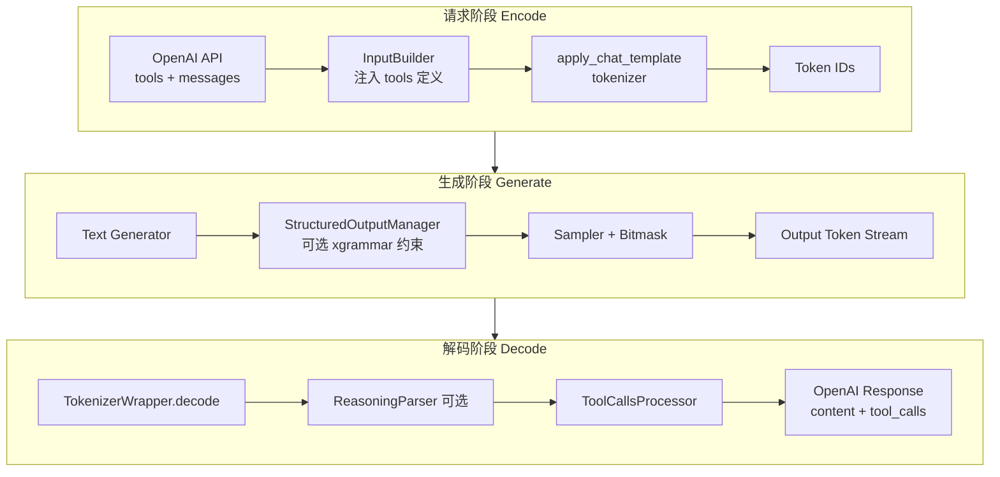
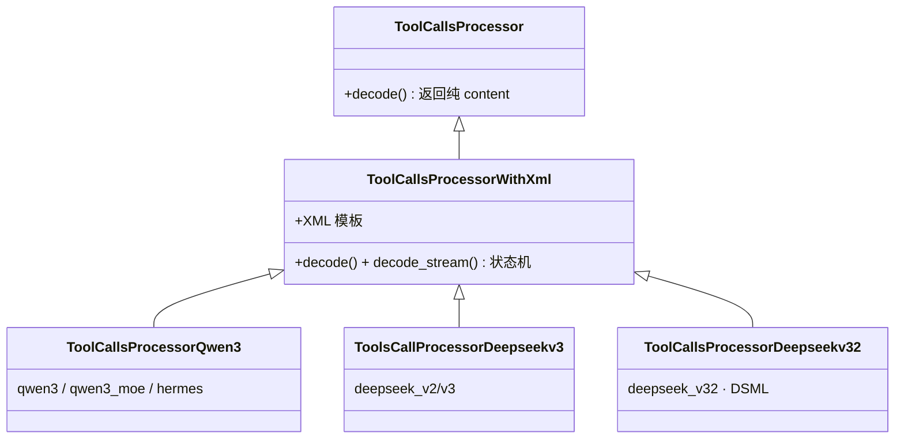

# Function Call 与结构化输出
> 覆盖 14 个知识点 | 来源 4 个文件 | 更新于 2026-07-11

## 1. 一句话总结
让 LLM 的输出既能调用工具（Function Call / Tool Use），又能保证格式绝对合法（结构化输出 / 约束解码）。核心创新在于将两者视为“同一条链路的两端”：**生成阶段**通过 xgrammar 的 bitmask 硬件屏蔽非法 token（硬保证），**解码阶段**通过 ToolCallsProcessor 体系将多模型族的私有协议（XML/DSML/redacted格式）统一转为 OpenAI 标准 tool_calls（流式解析）。业界趋势是二者通过 **Structural Tag** 机制收敛：模型在自由文本和工具调用块之间动态切换约束状态，兼顾灵活性与合规性。

## 2. 核心原理
### 2.1 问题背景
大语言模型需要与外部世界交互（查天气、调API、操作数据库），要求模型输出结构化的“函数名+参数JSON”。痛点有三重：
1. **多协议适配**：不同模型厂商（Qwen3、DeepSeek V3、Claude等）的工具调用输出格式互不兼容，推理框架必须为每种格式提供专用解析器。
2. **流式解析**：在流式输出（Server-Sent Events）场景下，每个 delta 收到的都是残缺的 XML/JSON 片段，无法直接用 `json.loads` 解析，且必须立即推送给客户端。
3. **格式保证与幻觉**：纯 prompt 调教无法100%保证输出格式合法；模型可能在工具调用结束后继续“幻觉”出虚假的工具调用或无关内容。

### 2.2 方案概述
MindIE 将 Function Call 的实现拆为两条正交路径，在 API 层统一返回 OpenAI 兼容的 `tool_calls` 与 `content` 字段：

*   **事后解析路径（软保证，主路径）**：模型自由生成包含工具调用指令的文本（如 Qwen3 的 `<tool_call>...</tool_call>`），**解码阶段**通过 `TokenizerWrapper` 统一编排 `ReasoningParser`（剥离思维链）和 `ToolCallsProcessor`（提取工具调用），将协议文本转为 OpenAI 格式。
*   **约束生成路径（硬保证，可选）**：**生成阶段**利用 xgrammar 约束解码，在采样前通过 bitmask 封死非法 token，确保输出格式绝对合法（如 JSON Schema）。两条路径正交但互补：约束管“采样时选择哪个 token”，解析器管“如何将 token 序列转为结构化字段”。



## 3. 实现细节
### 3.1 ToolCallsProcessor 类体系与多协议适配
不同的模型族使用截然不同的工具调用输出格式。MindIE 通过**注册中心模式**实现多协议的统一管理与路由：定义抽象的 `ToolCallsProcessor` 基类，为每种模型族派生子类，并通过装饰器 `@register_module` 将子类注册到 `ToolCallsProcessorManager`。

**类继承体系图：**


**模型协议差异速查表：**
| 维度 | Qwen3 | DeepSeek V3 | DeepSeek V3.2 (DSML) |
|------|-------|-------------|----------------------|
| **格式** | XML `<tool_call>` JSON `</tool_call>` | 特殊 token 块 + ` ```json ` | XML DSML `<invoke>` 标签 |
| **Stop token** | 文本 `</tool_call>`（字符串匹配，O(n)） | token ID `<｜tool▁calls▁end｜>` （O(1)） | token ID `</｜DSML｜function_calls>` （O(1)） |
| **流式检测** | text regex | Token ID 计数（更稳定） | Token ID + XML 状态机 |
| **类型推断** | 无 | 无 | Schema-aware coercion（数值/布尔自动转换） |
| **反幻觉** | EOS 截断 | EOS 截断 | **Hard Cut-off 永久静默** |
| **并行 tool** | 多个 `<tool_call>` 块 | 多个 `<｜tool▁call▁begin｜>` 块 | 多个 `<invoke>` 标签 |

**注册名映射：**
| 注册名 | Processor 类 | 格式 |
|--------|-------------|------|
| qwen3, qwen3_moe, hermes | ToolCallsProcessorQwen3 | `<tool_call>` JSON `</tool_call>` |
| deepseek_v2, deepseek_v3, deepseekv2, deepseekv3 | ToolsCallProcessorDeepseekv3 | redacted_tool_call + ```json |
| deepseek_v32, deepseekv32 | ToolCallsProcessorDeepseekv32 | DSML XML invoke/parameter |

#### 关键代码路径
- 路由入口：`Router._get_tool_calls_processor()` 根据请求中的 `tool_call_parser` 从 `ToolCallsProcessorManager` 实例化对应 Processor。
- 注册实现：`tool_calls_processor_registry.py` 中 `register_all_tool_calls_processors()` 导入所有子类模块，触发装饰器注册。

### 3.2 流式解析：4-Case 状态机
流式场景下，每个新 token 到达时需立刻输出增量，不能等待完整 JSON。MindIE 的 `ToolCallsProcessorWithXml` 维护一个基于 **token ID 计数**的 4-Case 状态机，用来判断当前 delta 处于工具调用的哪个阶段。选用 token 计数而非正则的原因是部分 decode 出的文本可能在任意位置截断（如半个标签），导致正则误判，而 token ID 计数 O(1) 且与生成粒度天然对齐。

**状态机 Case 表：**
| Case | 条件 | 行为 |
|------|------|------|
| Case 1 | start == end，无 end token 在 delta 中 | 普通内容段，返回 `{content: delta_text}` |
| Case 2 | 新 tool_call 开始 (start > end, start 增加) | `current_tool_id++`，返回 start 前的 content |
| Case 3 | tool_call 进行中 (start > end, start 不变) | 提取 tool_call_portion → JSON 补全 |
| Case 4 | tool_call 结束 (start == end, end 增加) | 发送最终 arguments delta 或 `{}` |

#### 关键代码路径
- `/_count_tool_tokens`：基于 token ID 计数 start/end token 出现次数。
- `ToolCallsProcessorQwen3` 中硬编码了 `start_token_id = 151657`，`end_token_id = 151658`。

### 3.3 JSON Completor：递归下降解析器
流式场景下 arguments JSON 永远是残缺片段，无法直接 `json.loads`。MindIE 自研了一套递归下降解析器作为补全引擎，提供两种模式：

| FillMode | 策略 | 使用时机 |
|----------|------|----------|
| `FillMode.Full` | 递归下降 `_parse_object()` 提取已完成的 key-value | name 尚未发送（需推断完整结构以定位函数名） |
| `FillMode.BraceOnly` | 先尝试 json.loads，失败则补齐尾部 `}` | name 已发送（仅需补全尾部括号推流 delta） |

这个设计相比 vLLM 的 `partial_json_parser` + dict-level diff 方案，对深层嵌套 arguments 的增量提取控制力更强，是 MindIE 的显著差异化点。

#### 关键代码路径
- `json_completor.py::complete_json_for_tool_calls`

### 3.4 反幻觉机制：Hard Cut-off（DeepSeek V3.2 专有）
DeepSeek V3.2 的 DSML 协议在流式处理中分为三个阶段，其中 P2 阶段独创了“Hard Cut-off”反幻觉机制：当检测到结束标签 `</｜DSML｜function_calls>` 后，**永久返回空 delta 并静默后续所有流**，彻底阻断模型在工具调用结束后继续“幻觉”出虚假的 function_calls 块外内容。
- P1: Prefix 拦截，丢弃部分 start tag。
- P2: Hard Cut-off，检测 end tag 后静默。
- P3: Snapshot-Diffing，生成 arguments 增量。

#### 关键代码路径
- `tool_calls_processor_deepseekv32.py::decode_stream()`

### 3.5 约束解码集成：xgrammar 后端
Function Call 的生成阶段可选择与 Structured Output 的 xgrammar 约束结合。xgrammar 的核心处理链路如下：

> **JSON Schema** → EBNF 上下文无关文法 → 字节级下推自动机 (PDA) → 预计算 adaptive token mask cache → 运行时查表生成 bitmask → 采样器中将非法 token logit 置 -inf

**为何是 PDA 而非 FSM？** JSON 是递归结构，嵌套深度无界，只能用带栈的下推自动机表达，有限状态机无法处理。但 xgrammar 通过“token 二分类”实现高性能：**>99% 的 token 是上下文无关的**，其合法性可在编译期预计算好；运行期每步只需查缓存 + 现场检查 <1% 的 token，开销压至微秒级。

#### 关键代码路径
- vLLM 侧：`vllm/v1/structured_output/backend_xgrammar.py`，Scheduler 的 `get_grammar_bitmask()` 在 CPU 侧生成 bitmask，通过 IPC 发给 GPU worker。
- MindIE 侧：`mindie_llm/text_generator/plugins/structured_output/structured_output_manager.py`

### 3.6 Agent 多步循环与 KV Cache 复用
Tool Call 的最终价值在 **Agent 多步循环**中体现：模型暂停生成 → 执行工具 → 注入结果 → 继续解码。MindIE 通过 `session_id` 维持跨步的 KV Cache 连续性：

| KV 块 | 复用率 | 策略 |
|-------|--------|------|
| System prompt + Tools 定义 | 极高（同 session 100%） | Prefix Cache 必选 |
| 用户对话历史 | 高 | KV 连续增长 |
| Tool 执行结果 | 零（每步不同） | 仅 prefill 新增 token（通常 10-100 token） |
| Thinking token（Qwen3） | 接近零 | 可主动 evict，避免 HBM 浪费 |

## 4. 框架对比
### 4.1 MindIE vs vLLM
两者在架构哲学（Base + Model-specific + Registry）上同源，但在具体策略上各有侧重。

| 维度 | MindIE | vLLM |
|------|--------|------|
| JSON 补全 | **递归下降解析器 (json_completor)** | json.loads + 字符串 diff |
| 流式状态检测 | **Token-count-based (token ID 计数)** | prev_tool_call_arr + streamed_args |
| DeepSeek 支持 | **完整 DSML + Schema coercion + Hard Cut-off** | DeepSeekV3ToolParser (redacted 格式) |
| 反幻觉 | **Hard Cut-off 永久静默** | 无对等机制 |
| 约束解码后端 | xgrammar | xgrammar (默认) / outlines / llguidance |
| Structural Tag | **不支持**（约束与解析未打通） | **原生支持**（已注册 11+ 模型族的 structural tag 模板） |

### 4.2 后端选型对比
| 后端 | 核心技术 | 表达能力 | 特点 |
|---|---|---|---|
| **xgrammar** | 字节级 PDA + 预计算 mask cache | CFG（JSON Schema/ EBNF/ Regex） | 当前 vLLM/ MindIE/ SGLang 主流选择；通用性强，速度快 |
| **Outlines** | 正则→FSM，token 级状态转移表 | 正则/ JSON Schema | 学术起源，生态成熟，但 FSM 编译慢 |
| **Guidance** | Earley 解析 + token 前缀树 | CFG，表达最灵活 | 运行时动态解析，每步开销相对较高 |

## 5. 面试要点
### 5.1 常见追问
#### Q: Tool Call 和结构化输出是什么关系？
- Tool Call 是结构化输出的**特化子集**（专门处理 tools schema）。
- 两者的实现路径不同：ToolCall 默认走“事后解析”的软保证（解析 XML/JSON 文本），结构化输出走“约束生成”的硬保证（bitmask 屏蔽非法 token）。
- 业界正在通过 **Structural Tag** 机制将两者统一：在一次推理中，trigger 触发后无缝从“自由文本模式”切换到“约束生成模式”，兼顾灵活性与合法性。

#### Q: tool_choice=auto 为什么难约束？
- `auto` 语义下，模型的合法输出既可能是纯自由文本，也可能是“自由文本 + tool_call 块”的混合。
- 静态 grammar（如全程套一个 JSON Schema）无法表达这种动态切换——要么把自由回答也逼成 JSON，要么不约束导致格式非法。
- 解决方案是 **Structural Tag**：定义一个 trigger（如 `<tool_call>`），模型输出普通文本时完全自由，一旦采样出 trigger 则立刻切入对应 tool 的 JSON Schema 约束，直到结束标签后回到自由状态。

#### Q: 流式下为何用 token 计数，而不用正则检测标签？
- 流式 delta 是文本片段，可能在任意位置截断（如一半的标签 `<tool_ca`、一半的多字节字符），正则会误判。
- Token ID 计数是 O(1) 操作（Sampler 直接检测特殊 token ID），天然对齐生成粒度，不受截断干扰。
- **性能差异**：Stop String 文本匹配每步 decode 后需 O(n) 检查，Token ID 检测在 Sampler 里直接 O(1) 完成。

#### Q: 开了 xgrammar 约束，还需要 ToolCallsProcessor 吗？
- **需要**。两者职责正交，作用于不同阶段：
    - **约束解码（生成阶段）**：管“选择哪个 token”。保证输出 token 序列是合法的 JSON，但不管这个 JSON 是干什么的。
    - **解析器（解码阶段）**：管“字段抽取与流式增量”。负责把完整/流式的 Json 字符串转为 OpenAI 的 `tool_calls[]` 结构，并生成 `DeltaToolCall`（函数名的增量、arguments 的逐步发送）。约束解码机制上杜绝了非法格式，能简化解析器的容错路径，但不能替代其字段语义提取的职责。

### 5.2 口述话术
> “我在 MindIE 交付 Function Call 特性时，面对的核心挑战是**多模型族协议适配**和**流式解析**。我设计了一套基于注册中心的 **ToolCallsProcessor** 体系，为 Qwen3、DeepSeek V3/V3.2 分别实现了解析器，无缝适配它们的 XML、DSML 等私有协议。流式场景下，我使用基于 token 计数的 4-Case 状态机代替脆弱的正则，并自研了 **JSON Completor** 递归下降解析器来处理流式片段。为应对模型持续幻觉输出虚构内容，我为 DeepSeek V3.2 设计了独特的 **Hard Cut-off** 静默机制。
>
> 这项工作和结构化输出本质上是同一条链路的两端。我全程参与了 xgrammar 的结构化输出特性从 0 到 1 的开发，深入理解了其 PDA 约束和 bitmask 原理。业界正在通过 **Structural Tag** 将这两者高度收敛，让模型在自由文本和工具调用格式间动态切换约束状态——这是我们下一步演进该补的关键能力。这也和我做的 KV Cache 亲和调度一脉相承：Agent 多步循环中 System+Tools 前缀高度重复，是前缀复用的最佳应用场景，从前缀缓存中我们可以获得显著的端到端加速。”

## 6. 延伸阅读
### 6.1 相关主题
- **结构化输出 / 约束解码**：深入 xgrammar 后端原理、bitmask 数据流与性能开销。
- **KV 亲和调度与 Mooncake**：探索如何将 Agent 场景下的前缀缓存复用率最大化。
- **vLLM 架构深潜**：对比 vLLM V1 的 StructuredOutputManager 设计（异步编译、进程边界、投机解码兼容）。
- **MCP 协议**：模型上下文协议对工具发现与调用的标准化影响。

### 6.2 源文件
| 文件路径 | 标题 | 类型 |
|----------|------|------|
| wiki/repos/mindie-pyserver/function-call.md | MindIE Function Call 工具调用实现 | 架构分析 |
| wiki/raw/articles/pyserver/mindie_function_call_deep_analysis.md | MindIE Function Call / Tool Use 深度分析 | 深度分析 |
| interview/interview-review/03-结构化输出与约束解码专题.md | 结构化输出 / 约束解码——xgrammar 原理、对比、开销与副作用 | 面试准备 |
| interview/interview-review/14-FunctionCall与结构化输出交叉专题.md | Function Call（Tool Call）与结构化输出交叉专题 | 面试准备 |