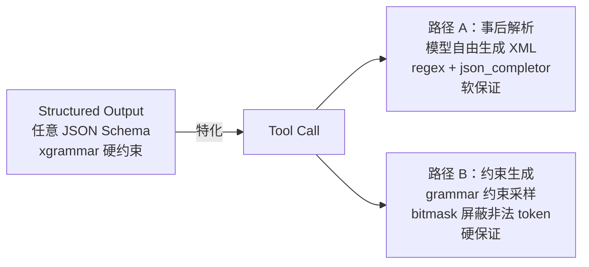
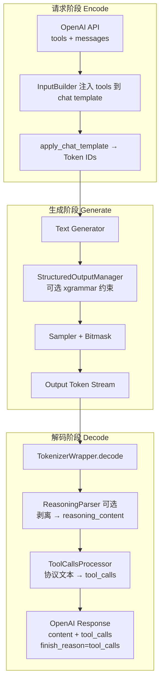

# Function Call 与结构化输出
> 覆盖 18 个知识点 | 来源 8 个文件 | 更新于 2026-07-23

## 1. 一句话总结
结构化输出（约束解码）用 xgrammar 在**采样阶段**硬性保证 LLM 输出符合 JSON Schema / 正则等格式；Function Call 是其**特化子集**，通过 TokenizerWrapper 解码层的解析器将各模型族原生协议（XML/DSML）转换为 OpenAI 兼容 `tool_calls`。两者在生成与解析两条路径上独立但可协同 — 约束管 token 合法性，解析器管字段抽取与流式增量；业界正通过 Structural Tag 收敛为“自由文本 ↔ 受约束工具块”的统一机制。

## 2. 核心原理
### 2.1 问题背景
- **格式刚性**：下游系统（Agent、数据管线）要求输出 JSON 必须合法，仅靠 prompt 无法 100% 保证。
- **协议碎片化**：模型厂商没有统一的 Function Call 输出协议 — Qwen3 用 `<tool_call>` XML 包 JSON，DeepSeek V3 用特殊 token 块，V3.2 用 DSML XML。
- **流式挑战**：开放式协议下，流式增量 token 不可直接解析 JSON，需要补全残缺片段并防标签泄露。
- **幻觉**：工具调用结束后模型可能继续杜撰回复或推理内容。

### 2.2 方案概述
MindIE 在 `TokenizerWrapper.decode()` 层统一编排 **Reasoning 解析**与 **Tool Call 解析**，形成两条正交路径：
- **路径 A（事后解析）**：模型自由生成协议文本 → `ToolCallsProcessor` 用正则/状态机 + JSON Completor 提取 → OpenAI 格式，软保证。
- **路径 B（约束生成）**：xgrammar 将 JSON Schema 编译为字节级下推自动机（PDA），每步生成 `bitmask` 在采样前屏蔽非法 token → 硬保证。

两者协同：路径 B 保证格式合法，路径 A 负责流式字段抽取。业界进一步用 **Structural Tag** 实现自由文本与约束工具块的动态切换，完美支撑 `tool_choice=auto` 语义。

## 3. 实现细节
### 3.1 Function Call 全链路
一次 OpenAI 工具调用在三段完成：

### 3.2 流式解析：Token 计数状态机 + JSON Completor
流式场景每步只获得一小段 `delta_text`，MindIE 用**token ID 计数**驱动 4-Case 状态机，避免部分文本在标签/多字节字符处截断导致的误判。

| Case | 条件 | 行为 |
|------|------|------|
| Case 1 | `start == end`，无 end token | 返回 `{content: delta_text}` |
| Case 2 | `start > end` 且 start 刚增加 | `current_tool_id++`，返回 start 前 content |
| Case 3 | `start > end` 且 start 不变 | 提取 `tool_call_portion` → JSON Completor 补全 |
| Case 4 | `start == end` 且 end 增加 | 发送最终 arguments delta，结束 |

**JSON Completor** 是 MindIE 独有的递归下降补全引擎，不用 `json.loads` 作为主路径：
- `FillMode.Full`：递归下降 `_parse_object()` 提取完整 key-value，用于函数名尚未出现时推断结构。
- `FillMode.BraceOnly`：先试 `json.loads`，失败则补齐 `}`，用于函数名已发送后仅补尾部括号。

流式发送策略：函数名 `name` “攒齐一次性发送”，`arguments` “边生成边发 delta”。

#### 流式解析失败兜底
五层软降级，绝不抛异常中断请求：
1. JSON Completor 内部 `_skip_field` 跳过坏字段，返回尽力而为的部分 dict，不 raise。
2. `_decode_stream_tool_calls` 包住 JSON Completor 调用，异常时返回 `{}`（本步不发）。
3. 状态机在信息不足时（name 未完整、arguments 未开始等）返回 `{}`，表示“等下一步”。
4. `decode_stream` 顶层 try/except → logger.error + 返回 `{}`。
5. 上层 `tokenizer_wrapper` 若无 `decode_stream` 能力，则直接透传 `{content: delta_text}`；最坏降级为普通文本。

### 3.3 多模型族适配器
通过 `ToolCallsProcessorManager` 注册中心按 `tool_call_parser` 路由：

| 注册名 | Processor 类 | 原生协议 | 特色 |
|--------|-------------|---------|------|
| `qwen3`, `qwen3_moe`, `hermes` | `ToolCallsProcessorQwen3` | `<tool_call>` JSON `</tool_call>` | stop string 检测 |
| `deepseek_v2`, `deepseek_v3` | `ToolsCallProcessorDeepseekv3` | 特殊 token + \`\`\`json | Token ID 检测 |
| `deepseek_v32` | `ToolCallsProcessorDeepseekv32` | DSML XML `<invoke>` 标签 | **Hard Cut-off 反幻觉** + Schema-aware type coercion + Snapshot-Diffing |

**Hard Cut-off**（DeepSeek V3.2）：检测到 `</｜DSML｜function_calls>` 后永久返回空 delta，阻断模型在工具块之后继续幻觉输出。

### 3.4 结构化输出：xgrammar 约束解码
xgrammar（CMU Catalyst/MLC，MLSys 2025）将 JSON Schema 转为**字节级下推自动机（PDA）**，JSON 递归结构需要带栈的 PDA 而非有限状态机。

核心优化：
- **token 二分类**：>99% 的 token 上下文无关（仅依赖 PDA 栈顶节点），编译期预计算进 `adaptive token mask cache`；<1% 上下文相关 token 运行时用持久化执行栈现场检查。
- **计算与 GPU 重叠**：mask 生成在 CPU 上，与 GPU 前向并行；bitmask 以 int32 压缩位图传输，一次 `masked_fill_(-inf)` 完成屏蔽。

NPU 侧实现（MindIE）：
- `apply_token_bitmask_inplace_npu` 使用 `repeat_interleave` + `masked_fill_`（PyTorch/torch_npu 算子组合，非自研 Ascend C kernel）。
- 与 vLLM 的 Triton fused kernel 不同，设计取向前提是可移植性与快速落地。

#### 编译缓存
- MindIE：规范化 schema 串 SHA-256 为 key，默认容量 **100 条 FIFO**（命中不调序），避免重复编译。简单 schema 编译 5~15ms，复杂 100~200ms，直接打在 TTFT 上。
- vLLM：缓存下沉给 xgrammar 编译器，按字节上限（默认 512MB）控制，更稳定。
- 未来方向：条数 + 字节双门限，schema 亲和路由提高多实例缓存命中率。

### 3.5 Function Call 与结构化输出的协同
- 即使开了约束解码，解析器仍需运行：约束保证 token 合法性，解析负责流式 delta 抽取和字段组装。
- **Structural Tag**（xgrammar 支持）是 2026 年主流方案：定义 trigger（如 `<tool_call>`），触发后切换到对应 grammar 约束，结束后返回自由文本，完美表达 `tool_choice=auto` 语义。
- vLLM 已按模型注册 Structural Tag 模板（如 `qwen_3`、`deepseek_v3_2`），MindIE 目前未集成该能力，tool call 与结构化输出两条路未打通。

### 3.6 失败模式对照

| 失败模式 | 路径 A（事后解析） | 路径 B（约束生成） |
|---------|-------------------|-------------------|
| arguments 非法 JSON | JSON Completor 补齐 → 降级空 arguments | 机制上不会发生 |
| 幻觉工具名 | 解析后校验 → 降级 content | name 约束为枚举，杜绝 |
| 标签后幻觉 | DSML Hard Cut-off | 结束标签后回自由文本，仍需 stop token |
| 参数类型错误 | Schema-aware type coercion | schema 限定类型 |
| 模型不产生调用 | 无法解决 | `required` 强制进入工具分支 |

### 3.7 Agent 循环与 KV 复用
多步 Agent 循环中 System + Tools 定义前缀高度重复，KV Prefix Cache 命中率极高，可与编译缓存亲和路由形成同构优化。

## 4. 框架对比
### 4.1 MindIE vs vLLM

| 维度 | MindIE | vLLM |
|------|--------|------|
| **Tool Call 流式检测** | Token ID 计数（O(1)，依赖 special token ID） | 文本重解析（regex + partial_tag_overlap，通用但 O(n)） |
| **JSON 补全** | 自研递归下降 JSON Completor（Full/BraceOnly） | partial_json_parser + dict diff |
| **约束解码集成** | Tool Call 与结构化输出未打通，无 Structural Tag | **深度集成**：`tool_choice` 转 JSON Schema 约束 + Structural Tag 按模型注册 |
| **解析失败兜底** | 五层软降级 + DSML Hard Cut-off | try/except → 降级为 content |
| **多后端** | 仅 xgrammar（抽象层预留但未实现） | auto 链（xgrammar > guidance > outlines），真多后端 |
| **热路径下沉** | 纯 Python（JSON Completor、DSML 状态机） | 新模型走 `engine_based_streaming=True` + Rust 引擎适配器 |

一句话定调：MindIE 在 JSON 补全策略、反幻觉（Hard Cut-off）和 Token 级检测上独具特色，但约束解码与解析的协同（Structural Tag）方面尚未对齐 vLLM。

### 4.2 其他框架对比

| 框架 | Tool Call 解析 | 约束解码 | 特点 |
|------|---------------|---------|------|
| **vLLM** | ToolParser 体系，dict-level diff | xgrammar / outlines / llguidance | 最广泛模型覆盖，Structural Tag 集成 |
| **SGLang** | Frontend language + JSON schema | outlines | 编程式 API，前端约束强 |
| **TGI** | Grammar-based | 内置 grammar | HuggingFace 生态 |

## 5. 面试要点
### 5.1 常见追问
#### Q: Tool Call 全链路怎么走？
- Encode：InputBuilder 注入 tools → chat template → token IDs。
- Generate：模型按原生协议输出，可选 xgrammar 约束。
- Decode：ReasoningParser 剥 `<think>` → ToolCallsProcessor 解析 → `finish_reason=tool_calls`。

#### Q: 为什么每个模型族需要一个适配器？
- 厂商没有统一 tool call 输出协议：Qwen3 用 XML JSON，DeepSeek V3 用特殊 token 块，V3.2 用 DSML XML。框架本质是“每模型族一个协议适配器”。

#### Q: 流式下 arguments 怎么增量发送？
- 4-Case 状态机定位阶段 + JSON Completor 两种 FillMode 补全残缺 JSON + `DeltaToolCall` 增量；函数名攒齐一次性发，arguments 边生成边发。

#### Q: JSON 解析失败怎么处理？
- 五层软降级：JSON Completor 内部不抛异常尽力补全；外层 try/except 返回 `{}` 不发；状态机信息不足时返回 `{}` 等待；顶层异常记录日志返回 `{}`；最坏降级为普通 content。

#### Q: Hard Cut-off 是什么？
- DSML 专有：检测到 `</｜DSML｜function_calls>` 结束标签后永久返回空 delta，阻断模型在工具块外继续幻觉输出。

#### Q: 约束解码有什么副作用？
- TTFT 增加（编译耗时）；每步 mask 生成开销（xgrammar 预计算 + overlap 压到 <1%）；强约束可能将模型逼进低概率路径，损害输出质量；与投机解码、异步调度组合时状态回滚正确性成本高；编译产物和 bitmask 占用内存。

#### Q: 编译缓存怎么设计？
- MindIE：SHA-256 规范化 schema 为 key，默认 100 条 FIFO（业务 schema 稳定时 FIFO≈LRU）。vLLM：xgrammar 自带字节上限缓存（512MB）。迭代方向：双门限（字节 + 条数）兜底。

#### Q: 为什么 Tool Call 和结构化输出要一起讲？
- Tool Call 是结构化输出的特化子集；两条路径互补——约束保证合法性，解析负责流式抽取；Structural Tag 是业界将两者收敛统一的方案。

#### Q: MTP（投机解码）与结构化输出能同时开吗？
- MindIE 当前 **硬互斥**（`ValidateMtpConstraints` 直接报错）。工程原因：插件层未打通——grammar 无 rollback 接口、bitmask 仅单位置、MTP 不碰 grammar；产品原因：fail-fast 避免“加速但 JSON 破防”。vLLM 通过多位置 mask + rollback 支持组合。

#### Q: 异步调度下结构化输出踩过什么坑？
- 异步流水线中 mask 生成与状态推进跨线程，导致 mask 落后一拍（stale mask），典型现象为多出一个 `{`。修复：将 mask 生成与 `accept_token` 都收口到 `forward_loop` 线程串行化。

### 5.2 口述话术
> “在我交付的结构化输出里，xgrammar 把 JSON Schema 编译成字节级 PDA，预计算 99% token 的合法性，运行时每步查缓存 + 极少现场检查，生成 bitmask 在采样器里屏蔽非法 token。针对 Tool Call，我实现了一套可注册的多模型族解析器——Qwen3 用 token 计数状态机 + 自研 JSON Completor 做流式增量发送，DeepSeek V3.2 用 DSML 三阶段 + Hard Cut-off 防幻觉。这两条路在我的代码里是正交的：约束管 token 合法性，解析器管字段抽取；未来演进方向是引入 Structural Tag 把它们统一起来，这也是 vLLM 已经做到的。性能上，bitmask apply 占 TPOT <1%，编译缓存用 SHA-256 做 key 默认 100 条 FIFO，多步 Agent 循环里 System+Tools 前缀高度复用 KV Cache，亲和调度还能进一步提高命中率。”

## 6. 延伸阅读
### 6.1 相关主题
- `03-结构化输出与约束解码专题.md`：xgrammar 原理深潜、开销数值、副作用
- `14-FunctionCall专题.md`：Tool Call 全链路、流式状态机、JSON Completor
- `16-结构化输出复习专题.md`：结构化输出功能点、编译缓存
- `17-FunctionCall与结构化输出综合专题.md`：Structural Tag、tool_choice 映射、失败模式
- `02-简历第三层追问弹药.md`：诚实边界与口径红线

### 6.2 源文件

| 文件路径 | 标题 | 类型 |
|---------|------|------|
| wiki/repos/mindie-pyserver/function-call.md | MindIE Function Call 工具调用实现 | 源码分析 |
| wiki/raw/articles/pyserver/mindie_function_call_deep_analysis.md | Function Call 深度分析 | 技术报告 |
| interview/interview-review/03-结构化输出与约束解码专题.md | 结构化输出/约束解码专题 | 面试复习 |
| interview/interview-review/14-FunctionCall专题.md | FunctionCall 独立专题 | 面试复习 |
| interview/interview-review/16-结构化输出复习专题.md | 结构化输出独立复习 | 面试复习 |
| interview/interview-review/17-FunctionCall与结构化输出综合专题.md | 综合专题（交叉与串线） | 面试复习 |
| interview/interview-review/18-结构化输出模拟面试实录.md | 模拟面试实录 | 面试实录 |
| interview/2026-07-15/02-简历第三层追问弹药.md | 第三层追问弹药（工程向） | 面试弹药 |