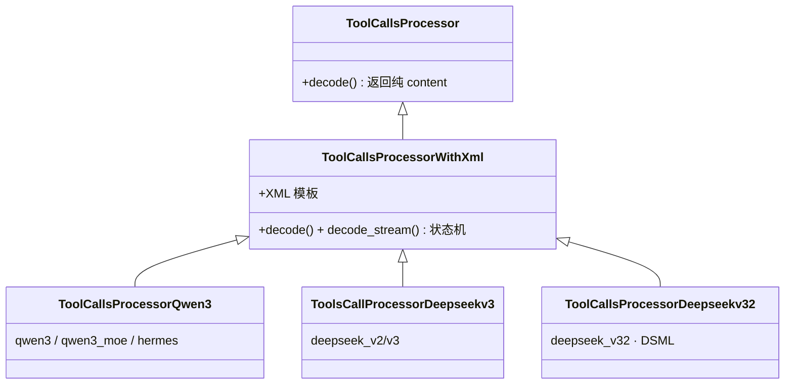

# Function Call 与结构化输出
> 覆盖 15+ 个知识点 | 来源 4 个文件 | 更新于 2026-07-11

## 1. 一句话总结
Function Call（Tool Use）是 LLM 生成工具调用指令的能力，MindIE 通过 **ToolCallsProcessor 多模型族适配器 + JSON Completor 递归下降补全 + Hard Cut-off 反幻觉** 实现流式/非流式解析。结构化输出（Guided Decoding）用 **xgrammar 字节级下推自动机 + 预计算掩码缓存** 硬性保证格式合法。两者本为一体：Tool Call 是结构化输出的特化子集，业界正通过 **Structural Tag**（动态切换“无约束/有约束”）将约束生成与协议解析收敛，MindIE 在此路线上有明确的演进空间。

## 2. 结构化输出（约束解码）

### 2.1 问题背景
大模型的下游任务越来越多地要求输出严格的格式化内容——JSON 数据、正则表达式约束的文本、符合特定 EBNF 语法的代码、工具调用（tool call）的结构化参数。仅仅通过 prompt 描述格式，无法保证 100% 合法，尤其在长生成和复杂嵌套场景中，模型极易出现括号未闭合、字段名拼写错误、类型不匹配等问题。这些问题会导致：
- **JSON 解析失败**：下游自动化管道直接报错，流程中断。
- **工具调用格式破坏**：`tool_choice` 返回的 JSON 缺少 `arguments` 字段，或字符串未转义，Agent 无法执行。
- **Agent 可靠性崩塌**：多步推理中，单步结构错误会传导放大，系统鲁棒性极差。

约束解码（guided/structured decoding）在**采样阶段**硬性干预：每生成一个 token 之前，根据当前语法状态计算合法 token 集合，将非法 token 的 logit 压到 -inf，再执行采样。由此实现**输出绝对符合给定模式**，将可靠性从“大概率正确”提升到“数学保证”。

### 2.2 xgrammar 核心原理
xgrammar（CMU Catalyst / MLC 团队，MLSys 2025）的设计链路清晰且高效：

```
JSON Schema ──转换──▶ EBNF 上下文无关文法（CFG）
    ──编译──▶ 字节级下推自动机（byte-level PDA）
    ──预计算──▶ adaptive token mask cache
运行时：PDA 栈状态 ──▶ token bitmask ──▶ apply 到 logits ──▶ 采样
```

**为什么是 PDA 而不是 FSM？**
JSON 具有任意嵌套的递归结构（对象套对象、数组套数组），上下文无关，正则/有限状态机（FSM）无法表达无界深度的嵌套。PDA 利用栈来处理递归规则，因此是 JSON Schema 约束的正确抽象；简单正则约束可退化为 FSM。

**核心优化一：token 二分类与自适应掩码缓存（>99% 覆盖）**
词表中的 token 被区分为两类：
- **上下文无关 token（context-independent, >99%）**：仅凭 PDA 当前位置（栈顶节点）就能判定合法性，与栈的历史深度无关。这类 token 的合法掩码可在**编译期**按栈顶节点全量预计算，存入以栈顶节点为 key 的 adaptive token mask cache。
- **上下文相关 token（context-dependent, <1%）**：需要检查完整栈状态才能判定。运行时借助**持久化执行栈（persistent execution stack）**快速模拟分支与回滚，仅对这小部分 token 做现场校验。

运行时，每步先查缓存命中 >99% 的 token，剩下的 1% 现场判定，掩码生成时间从“全词表模拟”降至微秒级。

**核心优化二：存储格式与系统协同**
- 缓存按内容自适应选择存储格式：合法集小存白名单，非法集小存黑名单，否则存紧凑 bitmask，控制内存占用。
- PDA 结构做编译器式优化（内联、等价状态合并），减少状态数。
- **与 GPU 计算 overlap**：掩码在 CPU 上生成，与 GPU 前向并行，隐藏于 GPU 时间线中；bitmask 以 int32 压缩位图传给 GPU，通过 Triton/CUDA kernel 一次性 `masked_fill_(-inf)`，开销极低。

### 2.3 后端对比
当前主流约束解码后端在核心技术、性能、生态上各有侧重：

| 后端 | 核心技术 | 表达能力 | 编译速度 | 运行时开销 | 生态成熟度 |
|------|----------|----------|----------|------------|------------|
| **xgrammar** | byte-level PDA + adaptive token mask cache, 编译期预计算与 bitmask 推送 | JSON Schema / EBNF / 正则 | 极快（PDA 编译并缓存，异步不阻塞） | 极低（>99% token 命中缓存，CPU 与 GPU 重叠） | 新锐，已被 vLLM、SGLang 等主流框架集成 |
| **Outlines** | FSM 索引 + token 生成图 | 正则 / JSON Schema（部分递归受限） | 中等（构建 FSM 索引） | 低（高效索引查询） | 较早开源，社区较广，但部分嵌套表达能力有限 |
| **Guidance** | 模板导向解析，动态编译为 FSM/正则 | 丰富（模板、正则、选择、隐藏等） | 较慢（Python 层解析模板） | 中（Python 执行层开销） | 模板生态成熟，用户群体大，但运行时性能偏低 |
| **llguidance** | 统一 LLM 指导解码框架，支持多种后端 | 灵活，可插拔语法规范（JSON / Lark / etc.） | 视后端而定 | 视后端而定 | 较新，模型服务框架支持正在完善 |

> 注：vLLM 当前支持 `xgrammar`、`outlines`、`guidance`、`lm-format-enforcer` 多种后端，可通过配置切换，默认自动选择最优可用后端。

### 2.4 Structural Tag 与业界趋势
**Structural Tag** 是一种基于触发器的动态文法切换机制。模型在生成过程中输出特殊的标记（如 `<function=search>...</function>`），框架识别到开始标签后，立即将约束解码器切换到对应的 JSON Schema（如 `search` 函数的参数规范），保证内部内容严格合法；结束标签后恢复自由生成。这解决了 `tool_choice=auto` 场景下，模型在何时、调用何种工具完全自主决策，但工具参数必须结构化的矛盾：自由文本段不需要约束，工具调用参数段需要强约束。

vLLM 为此内建了 **11 种以上模型家族的结构化模板**，覆盖 Qwen、Llama、DeepSeek、Mistral 等主流模型的原生 function call 格式。模板预先定义 trigger token（如 `<tool_call>`、`<function>` 等）及对应的 JSON Schema，运行时自动识别并切换文法，使用者无需手工编写状态机。

该趋势表明：未来结构化输出不再是附加功能，而正成为推理引擎的原生能力，与模型训练格式、工具链深度耦合。

### 2.5 与 ToolCall 的交叉
约束解码（如 xgrammar）与 **ToolCallsProcessor** 是互补关系，在推理流水线中处于正交的两个阶段：

- **约束解码**：在**生成时**（每步采样前）工作，通过 bitmask 硬性控制模型可选的 token 集合，确保整个序列符合给定 Schema。它负责“语法正确”。
- **ToolCallsProcessor**：在**解码完成后**工作，从已生成的文本中提取结构化字段（函数名、参数等），做字段校验、默认值填充、JSON 反序列化等。它负责“语义提取与后处理”。

二者没有替代关系，而是共同保证工具调用的端到端可靠：约束解码让输出一定可解析，Processor 将可解析文本转换为可执行的工具调用对象。部署时，约束解码常常用于 `tool_choice=auto` 的参数部分，而 Processor 负责最终的拆解与分发。

## 3. Function Call / Tool Call
### 3.1 ToolCallsProcessor 类体系与注册路由
MindIE 通过继承体系覆盖多模型族，所有解析器在 `TokenizerWrapper.decode` 层统一编排，与 reasoning 解析串行共用。



**关键代码路径**：
- 基类：`mindie_llm/runtime/models/base/tool_calls_processor.py`
- Qwen3：`mindie_llm/runtime/models/qwen3/tool_calls_processor_qwen3.py`（start token ID `151657`）
- DeepSeek V3.2：`mindie_llm/runtime/models/deepseek_v32/tool_calls_processor_deepseekv32.py`
- 注册中心：`mindie_llm/runtime/models/base/tool_calls_processor_registry.py`（`@register_module` 装饰器）

路由机制：`Router._get_tool_calls_processor()` 根据请求传入的 `tool_call_parser`（如 `qwen3`、`deepseek_v32`）从 `ToolCallsProcessorManager` 实例化对应 Processor，找不到则 fallback 到默认基类（只返回 content）。

| 注册名 | Processor 类 | 格式 |
|--------|-------------|------|
| qwen3, qwen3_moe, hermes | ToolCallsProcessorQwen3 | `<tool_call>` JSON `</tool_call>` |
| deepseek_v2, deepseek_v3 | ToolsCallProcessorDeepseekv3 | redacted_tool_call + ```json |
| deepseek_v32 | ToolCallsProcessorDeepseekv32 | DSML XML invoke/parameter |

### 3.2 流式与非流式解析
#### 非流式路径
1. `encode` — InputBuilder 将 tools 注入 chat template
2. `generate` — 模型输出完整文本（含 XML 标签）
3. `decode` — `tool_call_regex.findall` 匹配所有 `<tool_call>{...}</tool_call>` → `json.loads` 验证 → 组装 OpenAI `tool_calls`

#### 流式路径与 4-Case 状态机
流式解析的核心是 `ToolCallsProcessorWithXml.decode_stream()`，基于 token ID 计数判断当前处于普通文本还是工具调用块，不在 delta_text 上做正则匹配。

状态变量：
- `current_tool_name_sent`：函数名是否已发送
- `current_tool_arguments_sent`：参数结构是否已发送
- `current_tool_id`：当前工具调用索引

| Case | 条件 | 行为 |
|------|------|------|
| Case 1 | start == end，且当前 delta 中无 end token | 普通内容，返回 `{content: delta_text}` |
| Case 2 | 新 tool_call 开始 (start > end, start 增加) | `current_tool_id++`，返回 start 标签前的纯文本 |
| Case 3 | tool_call 进行中 (start > end, start 不变) | 提取增量 tool_call_portion → 送 JSON Completor 补全 → 生成 DeltaToolCall |
| Case 4 | tool_call 结束 (start == end, end 增加) | 发送最终 arguments delta 或 `{}` 闭合 |

#### 为什么用 Token 计数而非正则
- partial text decode 存在延迟，文本可能在任意位置截断（半个多字节字符、半个标签），正则极易误判。
- token ID 计数 O(1)，且与生成粒度天然对齐，不受文本截断干扰。

### 3.3 JSON Completor — 递归下降补全器
MindIE 独有的 JSON 补全引擎，解决流式下 arguments 永远是“残缺 JSON”的问题，不以 `json.loads` 作为主路径。

**两种填充模式**（`FillMode`）：
- `FillMode.BraceOnly`：name 已发送后使用，先尝试 `json.loads`，失败则补齐缺的 `}`。
- `FillMode.Full`：name 尚未发送时使用，递归下降 `_parse_object()` 提取已完成的 key-value，推断完整结构。

**代码路径**：`mindie_llm/runtime/utils/helpers/json_completor.py`。

对比 vLLM：vLLM 的 ToolParser 使用 `partial_json_parser` + dict-level diff（前后两次解析结果做字典 diff 计算 delta），MindIE 的递归下降方案对深层嵌套参数的增量提取更可控，是差异化设计点。

### 3.4 DeepSeek V3.2 DSML 与 Hard Cut-off
DeepSeek V3.2 的 DSML 协议使用 XML `<invoke>` 标签，`ToolCallsProcessorDeepseekv32` 完全重写 `decode`/`decode_stream`，包含三阶段处理：

1. **P1: Prefix 拦截** — 丢弃部分 start tag，防止标签泄露到 `content` 字段。
2. **P2: Hard Cut-off（反幻觉）** — 检测到结束标签 `</｜DSML｜function_calls>` 后，永久返回空 dict（不发送任何 delta），阻断模型继续输出幻觉内容。这是所有推理模型通用的反幻觉机制。
3. **P3: Snapshot-Diffing** — 每步将当前 XML 快照转为 JSON 字符串，与前步 diff 计算 arguments 增量 delta，而非直接用 JSON Completor。

**Schema-aware type coercion**：从 tools schema 读取参数类型（`_get_param_type_from_schema`），对数值/布尔字段智能转换（如 `"3"` → `3`），避免参数类型错误。目前仅 V3.2 使用，MindIE 演进方向之一是将其通用化到所有 Processor。

## 4. 框架对比
### 4.1 Tool Call 解析框架对比
| 维度 | MindIE | vLLM | SGLang | TGI |
|------|--------|------|--------|-----|
| 解析体系 | ToolCallsProcessor + JSON Completor | ToolParser + partial_json_parser | Frontend language + JSON schema | Grammar-based tool call |
| JSON 补全 | 递归下降 (BraceOnly/Full) | json.loads + 字符串 diff | 类似 vLLM | 内置 grammar |
| 流式状态检测 | Token ID 计数 (4-case) | prev_tool_call_arr + streamed_args | - | - |
| DeepSeek V3.2 | 完整 DSML + Schema coercion + Hard Cut-off | DeepSeekV3ToolParser (redacted 格式) | - | - |
| 反幻觉机制 | Hard Cut-off 永久静默 | 无对等机制 | - | - |
| 推理模型组合 | ReasoningParser 串行 | reasoning-parser 基础（丢弃 reasoning_content） | 同 vLLM 问题 | - |

MindIE 相较于 vLLM 的核心差异化：JSON Completor 递归下降方案、Token-count 状态机（更抗文本截断）、Hard Cut-off 反幻觉、Schema-aware coercion；vLLM 在模型覆盖广度（40+ Parser）和结构性输出与工具调用的结合深度（Structural Tag）上领先。

### 4.2 约束解码引擎对比
| 特性 | xgrammar | Outlines v2 | Guidance/llguidance | LM Format Enforcer |
|------|----------|-------------|---------------------|-------------------|
| 核心技术 | 字节级 PDA + 预计算 mask cache | 正则→FSM 状态转移表 | Earley 解析 + lazy 计算 | token 级前缀匹配 |
| 表达能力 | CFG（JSON Schema/EBNF/regex） | 正则/JSON Schema（递归需展开） | CFG，最灵活 | JSON Schema/regex |
| 每步开销 | ~20–80μs（>99% 预计算命中） | ~10–20μs（纯查表） | ~50μs（Rust 优化动态解析） | 中等 |
| 编译速度 | 快（简单 5–15ms，复杂 100–200ms） | 慢（复杂 schema 可达分钟级） | 快 | 中等 |
| vLLM 集成 | 默认后端 | 支持 | 支持（llguidance） | 支持 |
| MindIE 选择 | ✅（C++ 内核，Ascend NPU 适配） | — | — | — |

xgrammar 是当前 vLLM/SGLang/TensorRT-LLM 的主流选择，通用性和速度的中间路线。

### 4.3 设计权衡总结
| 权衡点 | MindIE 选择 | vLLM 选择 |
|--------|------------|-----------|
| JSON 补全 | 递归下降解析器 | json.loads + 字符串 diff |
| 流式状态 | Token-count-based | prev_tool_call_arr |
| 约束+Tool Call 协同 | 未打通（事后解析与约束分离） | Structural Tag + Parser 并存 |
| 编译缓存粒度 | SHA-256 + LRU 128 条 | 下沉 xgr.GrammarCompiler，按字节上限 512MB |

## 5. 面试要点
### 5.1 常见追问
#### Q: Tool Call 和结构化输出是什么关系？
- Tool Call 是结构化输出的**特化子集**，都要求模型输出符合形式规范。
- 实现路径：事后解析（软保证，正则/状态机+JSON补全） vs 约束生成（硬保证，grammar 约束采样）。
- 业界正通过 **Structural Tag** 将两者收敛：约束保证合法性，parser 负责流式字段抽取。

#### Q: tool_choice=auto 为什么约束难？
- 模型可能输出纯文本，也可能输出文本+工具调用混合，静态 grammar 无法表达这种分支。
- 需要 trigger 驱动的 structural tag，动态切换“无约束 ↔ 有约束”状态。

#### Q: 流式下 arguments 怎么增量发送？
- MindIE: 4-Case 状态机 + JSON Completor 两种 FillMode 补全 + DeltaToolCall 增量发送 name/arguments。
- vLLM: partial_json_parser + dict-level diff；解析前后差异得到 delta。

#### Q: 解析失败怎么兜底？
- try/except → BraceOnly 补括号重试 → regex 抢救 name → 降级空 arguments。
- 根治靠约束生成（name 约束为枚举，硬杜绝幻觉工具名）。

#### Q: 流式为何用 token count 不用 regex？
- partial text decode 有延迟，文本可在任意位置截断，正则误判。
- token ID 计数 O(1) 且与生成对齐，不受字符边界干扰。

#### Q: Hard Cut-off 是什么？意义何在？
- DSML 专有反幻觉机制：检测到 end tag 后**永久返回空 delta**，阻断模型继续输出幻觉内容。
- 对所有推理模型都有借鉴价值，可推广为通用反幻觉策略。

#### Q: 开约束后 parser 还需要吗？
- **需要。** 约束管 token 合法性（采样阶段），parser 管字段抽取与流式增量（解码阶段），职责正交。
- 约束可简化 parser 容错路径（`BraceOnly` 补救不再触发），但不能替代。

#### Q: 编译缓存怎么设计？
- MindIE：对规范化 tools 数组做 SHA-256 哈希为 key，内存缓存编译产物，LRU 128 条。
- vLLM：下沉给 `xgr.GrammarCompiler`，按字节上限（512MB）控制，更稳。
- 多实例下 schema 亲和路由可提高缓存命中率。

#### Q: xgrammar 为什么用 PDA 而不是 FSM？
- JSON 含递归嵌套（对象套对象），正则/FSM 无法表达，需要带栈的下推自动机。
- 简单正则约束可以退化为 FSM，说 FSM 是常见口误。

#### Q: 约束解码的开销有哪些？
- 编译期：百毫秒级，加在 TTFT；缓冲击中可消掉。
- 运行期：每步 mask 生成 + bitmask apply，xgrammar 压到 <1%~3% TPOT 增量，且与 GPU 前向 overlap。
- 副作用：强约束可能迫使模型走低概率路径影响输出质量；batch 内有约束未编译完的请求会阻塞整个 step。

### 5.2 口述话术
**结构化输出自我陈述（可直接使用）**：
> “我在 MindIE 从 0 到 1 交付了结构化输出：链路是用户传 JSON Schema，xgrammar 把 Schema 转成 EBNF 再编译成字节级下推自动机——JSON 是递归结构所以需要 PDA 而不是 FSM；xgrammar 的核心优化是把 99% 以上的‘上下文无关 token’的合法性在编译期预计算进 adaptive token mask cache，运行时每步查缓存加检查极少数上下文相关 token，生成 bitmask 后在采样器里把非法 token 的 logit 置 −inf。副作用主要三块：编译耗时加在 TTFT 上，我做了 SHA-256 + LRU 的编译缓存把重复 schema 的编译开销消掉；每步 mask 开销 xgrammar 本身已经用预计算和 CPU/GPU overlap 压得很低；另外要注意强约束可能把模型逼进低概率路径影响输出质量，以及它和投机解码、异步调度组合时的状态回滚复杂度。”

**三个特性串联叙事（Tool Call + 结构化输出 + KV 亲和）**：
> “这三个特性在我手里其实是一条链路：结构化输出解决‘模型输出必须合法’（xgrammar 约束采样）；Tool Call 是它的特化场景——我实现了 Qwen3/DeepSeek 多协议的解析器体系，也清楚业界正在用 structural tag 把‘约束’和‘解析’收敛到一起，vLLM 已经按模型注册 structural tag 模板，这是 MindIE 下一步该补的；而 Agent 多步循环里 System+Tools 前缀高度重复，正是 KV 亲和调度收益最大的负载——tools 注入发生在 chat template 层，字符级匹配看不到，token 级匹配才能精确命中，这也是我们对标 vLLM Router 时做 token 级匹配的原始动机之一。”

## 6. 延伸阅读
### 6.1 相关主题
- KV 亲和调度与 Prefix Cache
- HTTP Server 架构与异步调度
- Reasoning Parser 与推理模型支持
- MCP 协议与 Agent 工具标准化

### 6.2 源文件
| 文件路径 | 标题 | 类型 |
|---------|------|------|
| wiki/repos/mindie-pyserver/function-call.md | MindIE Function Call 工具调用实现 | 实现分析 |
| wiki/raw/articles/pyserver/mindie_function_call_deep_analysis.md | MindIE Function Call / Tool Use 深度分析 | 深度分析 |
| interview/interview-review/03-结构化输出与约束解码专题.md | 专题03：结构化输出/约束解码——xgrammar 原理、对比、开销与副作用 | 面试专题 |
| interview/interview-review/14-FunctionCall与结构化输出交叉专题.md | 专题14：Function Call 与结构化输出交叉专题 | 面试专题 |