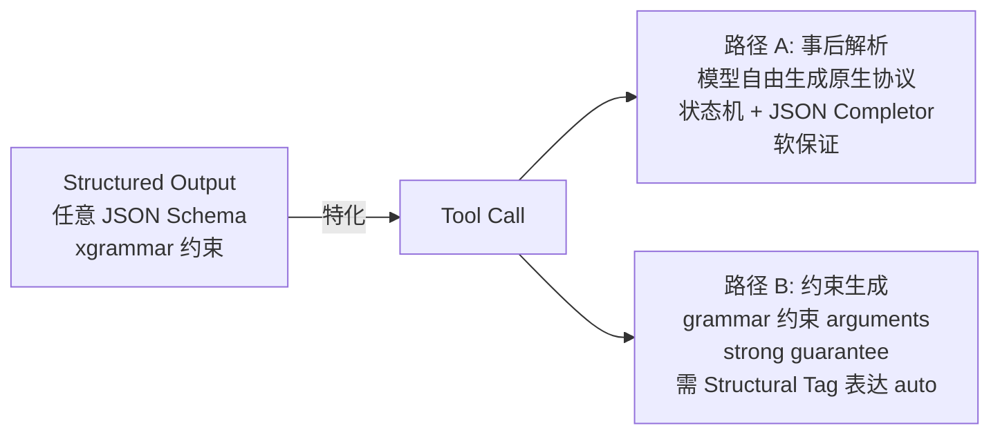
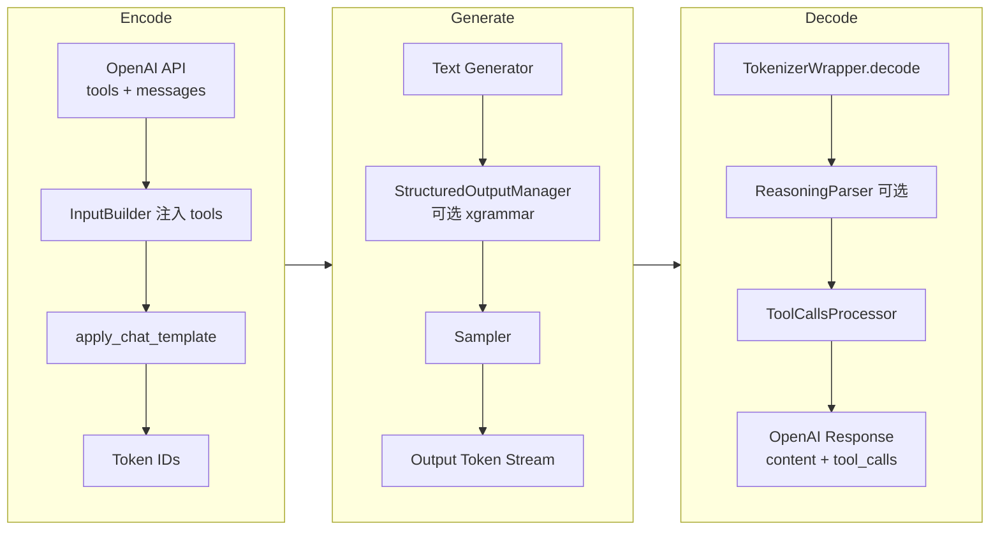

# Function Call 与结构化输出
> 覆盖 26 个知识点 | 来源 5 个文件 | 更新于 2026-07-13

## 1. 一句话总结
Function Call 让模型在生成中声明外部工具调用，结构化输出通过 xgrammar 约束解码保证输出形式合规。两者是**特化与泛化**关系，由“事后解析”（ToolCallsProcessor + JSON Completor）和“约束生成”（xgrammar bitmask）两条路径协同实现。MindIE 的特色在于**递归下降 JSON 补全器、基于 token ID 的流式状态机、DSML Hard Cut‑off 反幻觉**；vLLM 已通过 **Structural Tag** 将约束与解析统一，是下一步演进方向。

## 2. 核心原理
### 2.1 问题背景
1. **格式不可靠**：仅靠 prompt 无法保证模型输出 100% 符合 JSON Schema 或特定工具调用格式，必须从机制上保证语法正确性。
2. **多协议碎片化**：Qwen3 用 `<tool_call>` 包裹 JSON，DeepSeek V3 用特殊 token 块，V3.2 用 DSML XML——每个模型族需要独立的协议适配器。
3. **流式增量解析**：每 step 只拿到一小段 `delta_text`，且可能在标签、JSON、多字节字符处截断，要求框架在 token 级实时定位阶段并抽取增量。
4. **推理 + 工具组合**：Qwen3-Thinking、DeepSeek R1 等模型在工具调用前后输出 `<think>` 块，需要双标签解析；生成结束后可能继续“反思幻觉”，需要反幻觉机制。
5. **约束与解析的分离**：约束解码保证格式合法，但流式字段抽取、函数名提取仍需解析器，两者职责正交且需协同。

### 2.2 方案概述
整体方案分为两条互补路径：

- **路径 A：事后解析（软件保证）**  
  模型自由生成原生协议文本 → 在 `TokenizerWrapper.decode()` 层由 `ReasoningParser` 剥离思考内容 → `ToolCallsProcessor` 通过状态机/正则/补全器将文本转换为 OpenAI `tool_calls` 字段。MindIE 以此为主路径，并与 xgrammar 可选叠加。

- **路径 B：约束生成（硬件保证）**  
  利用 xgrammar 在采样阶段将 Schema/协议文本编译为**字节级下推自动机（PDA）**，每步生成前把非法 token 的 logit 置 −inf。vLLM 通过 **Structural Tag** 进一步实现“无约束自由文本 ↔ 有约束触发块”的动态切换，完美覆盖 `tool_choice=auto` 场景。

两条路径的关系如下：

## 3. 实现细节
### 3.1 Function Call 全链路（编码 → 生成 → 解码）
一次完整的 tool call 请求在框架内经历三段处理：

- **Encode**：`InputBuilder` 将 `tools` 定义按模型族模板注入 `messages`，调用 `apply_chat_template` 得到 token IDs。  
- **Generate**：模型按原生协议输出（如 Qwen3 的 `<tool_call>…</tool_call>`），可选的 `StructuredOutputManager` 通过 xgrammar 在采样时限制 token 合法性。  
- **Decode**：`TokenizerWrapper` 统一调用 `ReasoningParser`（剥离 `<think>` 等块）和 `ToolCallsProcessor`（将原生文本转为 OpenAI 格式），并设置 `finish_reason="tool_calls"`。

**关键代码路径**：  
- `MindIE-LLM/mindie_llm/runtime/models/base/tool_calls_processor.py` – 基类与状态机。  
- `MindIE-LLM/mindie_llm/runtime/utils/helpers/json_completor.py` – 递归下降 JSON 补全器。

### 3.2 流式解析：Token 计数状态机
流式场景每步只获得一小段 `delta_text`，MindIE **不使用正则**（正则易受文本截断干扰），而是通过统计特殊 token ID 的出现次数驱动 4‑Case 状态机。

| Case | 条件 | 行为 |
|------|------|------|
| Case 1 | `start_id` == `end_id`，delta 中无 end token | 普通内容，返回 `{content: delta_text}` |
| Case 2 | 新 tool_call 开始（`start_id` > `end_id` 且 start 计数+1） | `current_tool_id++`，返回 start 前的内容 |
| Case 3 | tool_call 进行中（`start_id` > `end_id`，start 不变） | 提取 `tool_call_portion` → JSON 补全 |
| Case 4 | tool_call 结束（`start_id` == `end_id`，end 计数+1） | 发出最终 arguments delta，或 `{}` |

**为什么 token 计数优于正则**：partial decode 可能在半个标签、半个多字节字符处截断，正则易误判；token ID 计数 O(1)，且天然对齐生成粒度。

以 Qwen3 协议为例，一次完整的工具调用流式走查：

好的  ⟨tool_call⟩ {"name": "get_weather", "arguments": {"city": "北京"}}  ⟨/tool_call⟩

| 步 | `delta_text` | 状态 | 输出 |
|----|--------------|------|------|
| 1 | `好的` | 无 tool call | `{content: "好的"}` |
| 2 | `⟨tool_call⟩` | Case 2 新调用 | `{}`（标签吞掉）|
| 3 | `{"name":` | Case 3 阶段A（name 未完整） | `{}` |
| 4 | ` "get_weather"` | Case 3 阶段A 完整 name | 发送 `tool_calls` 对象（一次性 name） |
| 5 | `, "arguments": {"city":` | Case 3 阶段B 首发 arguments delta | 补全后发送增量 |
| 6 | ` "北京"}` | Case 3 阶段B 增量 | 发送增量 |
| 7 | `}` | Case 3 阶段B 增量（吞多余括号） | 发送增量 |
| 8 | `⟨/tool_call⟩` | Case 4 结束 | `{}`，随后 `finish_reason=tool_calls` |

**关键代码路径**：`ToolCallsProcessorWithXml._count_tool_tokens()`, `_decode_stream_tool_calls_portion()`

### 3.3 JSON Completor：递归下降补全器
流式场景下 arguments JSON 永远残缺，MindIE 自研递归下降解析器，不使用 `json.loads` 为主路径，而是按 `FillMode` 选择性处理：

| FillMode | 策略 | 使用时机 |
|----------|------|----------|
| `Full` | 递归下降 `_parse_object()`，提取已完成 key‑value | name 尚未发送（需推断完整结构以定位函数名） |
| `BraceOnly` | 先尝试 `json.loads`，失败则补齐 `}` | name 已发送（仅补尾部括号发增量） |

`Full` 模式通过 `_skip_field()` 跳过坏字段，**永不抛异常**，仅返回尽力而为的对象。`BraceOnly` 在补齐括号失败后退化为空 dict。此设计为 MindIE 独有，与 vLLM 依赖三方库 `partial_json_parser` 形成差异。

**关键代码路径**：`json_completor.py:complete_json_for_tool_calls()`

### 3.4 DeepSeek V3.2 DSML 与 Hard Cut‑off 反幻觉
`ToolCallsProcessorDeepseekv32` 完全重写解析逻辑，分三阶段：

- **P1 Prefix 拦截**：丢弃部分 start tag，防止半个标签泄露到 content。  
- **P2 Hard Cut‑off**：检测到结束标签 `</｜DSML｜function_calls>` 后**永久返回空 dict**，阻断模型在工具块外继续幻觉输出。  
- **P3 Snapshot‑Diffing**：将 DSML XML 片段转为 JSON 字符串，再与上一快照做 diff 计算 arguments 增量。

此外，DSML 解析还包含 **Schema‑aware type coercion**：`_get_param_type_from_schema()` 从 tools schema 读取参数类型，对数值/布尔字段自动进行类型转换，避免 “3” vs 3 的问题。

**关键代码路径**：`tool_calls_processor_deepseekv32.py`

### 3.5 结构化输出：xgrammar 约束解码原理
xgrammar 将 JSON Schema、正则或 EBNF 语法转换为**字节级下推自动机（PDA）**，因为 JSON 是递归结构（无限嵌套），有限状态机无法表达。

处理链路：
JSON Schema ──转换──> EBNF 上下文无关文法
    ──编译──> 字节级 PDA
    ──预计算──> adaptive token mask cache
运行时：PDA 栈状态 ──> token bitmask ──> apply 到 logits ──> 采样

核心优化 **token 二分类**：
- **context‑independent tokens**（>99%）：仅凭 PDA 的栈顶节点即可判定合法性 → 编译期预计算进 mask cache。  
- **context‑dependent tokens**（<1%）：运行时用持久化执行栈现场检查。

每步只需查缓存 + 现场检查极少部分 token，mask 生成降到微秒级。bitmask 以 int32 压缩位图从 CPU 传 GPU，与 GPU 前向计算并发，额外开销通常 <1% TPOT。

**关键代码路径**：  
- `MindIE-LLM/mindie_llm/text_generator/plugins/structured_output/structured_output_manager.py`  
- `vllm/v1/structured_output/backend_xgrammar.py`

### 3.6 编译缓存设计
结构化输出的编译（Schema→PDA→mask cache）耗时累加在首 token 延迟（TTFT）上（简单 schema ~5‑15ms，复杂 schema ~100‑200ms）。为此：

- **MindIE（简历方案）**：对规范化 schema 串做 **SHA‑256** 哈希，内存缓存编译产物，容量上限 **128 条**，**LRU** 置换。同 schema 再次请求零编译开销。  
- **vLLM**：缓存下沉给 `xgr.GrammarCompiler(cache_enabled=True)`，以**字节数上限**（默认 512MB）控制内存，比按条数控制更稳定。  

多实例部署时，可通过 **schema 亲和路由**（同 schema 请求固定到同一实例）同时提高编译缓存和 KV prefix cache 的命中率。

### 3.7 Structural Tag：约束与解析的统一收敛点
`tool_choice` 四个可选值对约束的要求完全不同：

| tool_choice | 语义 | 约束方案 |
|-------------|------|----------|
| `none` | 禁止工具调用 | 无需约束 |
| 具名函数 (forced) | 必须调用指定函数 | 单函数 schema 编译 grammar 硬约束 |
| `required` | 必须调用某个工具（任选） | 多函数 schema **anyOf 并集** + name 枚举 |
| `auto` | 自行决定说话或调用工具 | **Structural Tag** 动态切换“无约束 ↔ 有约束” |

`auto` 场景下，输出可能是自由文本，也可能是“自由文本 + 工具调用块”，静态 grammar 无法覆盖，需要 **Structural Tag**：定义 trigger（如 `<tool_call>`），模型输出自由文本时无约束，一旦命中 trigger，立即切入对应工具参数的 grammar 硬约束，直至结束标签，再回到自由文本。

vLLM 已将 Structural Tag 作为一等类型集成，`structural_tag_registry.py` 按模型注册协议模板（11 个模型族），并区分 `auto/required/forced` 生成不同约束。在 MindIE 当前版本中，tool call 与结构化输出仍未打通，这是下一步应补的架构演进点。

### 3.8 交叉工程细节
**编译缓存在 tool call 场景**：对 `tools` 数组整体做 SHA‑256 作为缓存 key。Agent 场景 tools 集合固定，命中率高；但 `required` 编译的是多函数并集 grammar，任一函数变更都会刷新 key。

**Reasoning + Tool Call + 约束**：Qwen3 enable_thinking 时先输出 `<think>…</think>`，约束解码必须跳过思考块（否则严重损害推理质量），Structural Tag 的 trigger 机制天然支持；vLLM 的 `StructuredOutputManager.should_fill_bitmask()` 在 reasoning 未结束前不对 bitmask 行施加约束。

**约束与流式解析的时序**：开启约束后 parser 依然需要运行——约束管 token 合法性，parser 管字段抽取（name 一次性发送、arguments 增量发送），两者协同；约束的成功可以大幅简化 parser 的容错路径。

**失败模式对照**：

| 失败模式 | 路径 A（事后解析）应对 | 路径 B（约束生成）应对 |
|----------|------------------------|------------------------|
| arguments 非法 JSON | JSON Completor 补括号 → 降级空 arguments | 机制上不会发生 |
| 幻觉工具名 | 解析后校验 name ∈ tools，失败降级 content | name 约束为枚举 |
| 标签后继续输出 | Hard Cut‑off 静默 | 结束标签后回到自由文本（仍需配合 stop） |
| 参数类型错误（"3" vs 3） | Schema‑aware type coercion | schema 定义 `type: integer` 硬约束 |
| 模型不产生 tool call | 无法解决（提示词工程） | `required` 强制进入工具分支 |

**与 KV cache 交叉**：多步 Agent 循环中，System + Tools 前缀高度复用，是 KV 亲和调度收益最大的负载；tools 注入发生在 chat template 层，token 级匹配才能命中前缀缓存，字符级匹配不可见。Qwen3 thinking token 跨步几乎零复用，可主动 evict。

## 4. 框架对比
### 4.1 MindIE vs vLLM Function Call 对比
| 维度 | MindIE | vLLM |
|------|--------|------|
| 流式检测 | **token ID 计数**（4‑Case 状态机） | 每步重新正则匹配累积文本（Hermes）；部分模型用 engine 级 Rust 解析 |
| 残缺 JSON 处理 | 自研**递归下降 JSON Completor**（Full/BraceOnly） | 使用三方库 `partial_json_parser` 或字符串 diff |
| 流式增量 diff | 状态机分阶段：name 攒齐一次发，arguments 增量发 | 多数 parser 做字符串级 diff 或 dict 级 diff |
| 注册机制 | `register_module` 饿汉式注册 | `register_lazy_module` 懒加载 + 插件路径 |
| 约束解码集成 | **未打通**，tool call 纯解析 | **深度集成**：`adjust_request` 转 guided decoding，structural tag 按模型注册 |
| 反幻觉 | DSML **Hard Cut‑off** 永久静默 | 主要靠结构 tag 枚举约束 + stop token |
| 热路径 | 全部 Python（含 DSML XML 状态机） | 新模型逐步下沉至引擎级/Rust 解析适配器 |

核心差异总结：MindIE 在流式检测和补全器上有独到设计，但约束与解析未统一；vLLM 已用 Structural Tag 完成收敛，且开始将解析热路径下沉到 Rust/引擎层。

### 4.2 结构化输出后端对比
| 后端 | 核心技术 | 表达能力 | 每步开销 | 特点 |
|------|----------|----------|----------|------|
| **xgrammar** | 字节级 PDA + 预计算 mask cache | CFG（JSON Schema/EBNF/Regex） | 微秒级（>99% 缓存命中） | 当前 vLLM/MindIE 默认选择；C++ 可移植 |
| **Outlines** | 正则→FSM，token 级状态转移表 | 正则/JSON Schema（递归需展开） | 查表 O(1)，但编译可能很慢 | Rust 重写后性能改善 |
| **Guidance / llguidance** | Earley 解析 + token 前缀树，lazy 计算 | CFG，最灵活 | ~50μs（Rust 优化） | 支持模板编程式约束 |
| **lm-format-enforcer** | token 级前缀匹配 | JSON Schema/Regex | 中等 | 实现简单，性能一般 |

## 5. 面试要点
### 5.1 常见追问
#### Q: Tool Call 和结构化输出是什么关系？
- Tool Call 是 Structured Output 的**特化子集**，要求输出符合工具调用约定格式。
- 两条实现路径：① 事后解析（模型自由生成，regex/状态机 + 补全器，软保证）；② 约束生成（xgrammar 限制采样，硬保证）。vLLM 的 Structural Tag 可使 `auto` 模式也获得硬保证。

#### Q: 流式解析为何用 token 计数而不用正则？
- 部分文本可能在标签/多字节字符任意处截断，正则误判率高。
- token ID 计数 **O(1)**，无需解码文本，天然与生成粒度对齐，不受截断影响。
- 缺点是需要为每个模型族硬编码 start/end token ID。

#### Q: MindIE 的 JSON Completor 和 vLLM 的 partial_json_parser 有何不同？
- MindIE 是**自研递归下降**解析器，不依赖 `json.loads`，通过 `FillMode.Full` 递归提取对象、`BraceOnly` 补尾括号；能更好地控制名称一次性发送和深层嵌套的增量粒度。
- vLLM 使用成熟的 `partial_json_parser` 库，代码量小，维护成本低，但对增量粒度控制不及自研精细。

#### Q: Hard Cut‑off 是什么？为什么重要？
- DSML 处理器在检测到 `</｜DSML｜function_calls>` 结束标签后，**永久返回空 delta**，静默后续所有流式输出。
- 防止推理模型在工具调用结束后继续“反思”或产生幻觉内容，是反幻觉的机制化手段。

#### Q: 编译缓存选了 SHA‑256 + LRU，有什么改进空间？
- vLLM 采用**字节数上限**（512MB）而非条数上限，更稳定地控制内存，因为编译产物大小差异极大。
- 可引入**schema 亲和路由**，把相同 tools/schema 的请求定向到同一实例，同时提升编译缓存和 KV cache 命中率。

#### Q: 开 constraint 后还需要 tool parser 吗？
需要。约束解码只保证 token 合法性，不负责字段抽取和流式增量发送。parser 负责将合规的 token 序列转换为 OpenAI 的 `name` 和 `arguments` 增量，两者职责正交。

#### Q: tool_choice=auto 为什么是最难的？
模型可能输出纯文本，也可能输出“文本 + 工具调用”，静态 grammar 无法表达这种可变输出。需要 **Structural Tag** 的 trigger 机制：自由文本时无约束，一旦命中 trigger 则切入工具约束，结束标签后回到自由文本。

### 5.2 口述话术
**“一句话串联三个简历条目”**（可背）：
> “我在 MindIE 从 0 到 1 交付了结构化输出和 Tool Call 解析：结构化输出我们用 xgrammar 做硬保证，把 schema 编译成 PDA 约束采样；Tool Call 我实现了 Qwen3、DeepSeek 多协议的状态机解析器，自研了 JSON Completor。这两个特性在我手里是一条链路的两端——vLLM 已经用 Structural Tag 把约束和解析收敛到一起，这也是 MindIE 下一步该走的方向。而 Agent 多步循环里 System+Tools 前缀高度重复，正是 KV 亲和调度收益最大的场景，tools 注入在 chat template 层，必须 token 级匹配才能精准命中——这也是我们做 Router 时坚持 token 级匹配的原始动机之一。”

## 6. 延伸阅读
### 6.1 相关主题
- `03-结构化输出与约束解码专题.md` — xgrammar 原理深潜、vLLM 架构细节、副作用完整版。
- `04-KV亲和调度与Mooncake专题.md` — 前缀复用与亲和调度。
- `14-FunctionCall专题.md` — Tool Call 单特性复习。
- `16-结构化输出复习专题.md` — 结构化输出功能点与技术点复习。
- `17-FunctionCall与结构化输出综合专题.md` — 交叉与串线叙事。

### 6.2 源文件

| 文件路径 | 标题 | 类型 |
|----------|------|------|
| wiki/repos/mindie-pyserver/function-call.md | MindIE Function Call 工具调用实现 | 实现分析 |
| wiki/raw/articles/pyserver/mindie_function_call_deep_analysis.md | MindIE Function Call / Tool Use 深度分析 | 深度分析 |
| interview/interview-review/03-结构化输出与约束解码专题.md | 结构化输出 / 约束解码——xgrammar 原理、对比、开销与副作用 | 面试专题 |
| interview/interview-review/14-FunctionCall专题.md | Function Call（Tool Call）独立专题 | 面试专题 |
| interview/interview-review/16-结构化输出复习专题.md | 结构化输出独立复习专题 | 面试专题 |
| interview/interview-review/17-FunctionCall与结构化输出综合专题.md | Function Call 与结构化输出综合专题（交叉与串线） | 面试专题 |