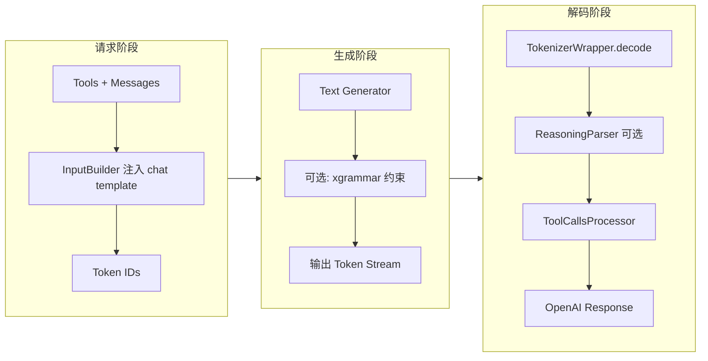

# Function Call 与结构化输出
> 覆盖 23 个知识点 | 来源 8 个文件 | 更新于 2026-07-29

## 1. 一句话总结
Function Call（Tool Call）让模型在生成过程中输出符合特定协议的工具调用指令，而结构化输出/约束解码（xgrammar）通过采样阶段屏蔽非法 token 保证输出格式完全合法。MindIE 通过 ToolCallsProcessor 体系（含 JSON Completor、DSML Hard Cut-off）与 xgrammar 约束解码协作，将语义决策、格式保证和协议适配三层职责解耦，构建了覆盖 Qwen3、DeepSeek 等多模型族的工具调用与结构化生成能力。

## 2. 核心原理
### 2.1 问题背景
大模型虽能通过 prompt 输出 JSON 或工具调用格式，但无法 100% 保证合法性。尤其在高并发、自动化 Agent 场景下，输出非法 JSON、幻觉工具名或格式错误会导致流程中断。LLM Serving 层需在“生成”和“解码”阶段引入硬保证机制，同时隐藏不同模型族间迥异的调用协议（XML、DSML、JSON 块等）。

核心痛点：流式场景下的增量解析、残缺 JSON 补全、模型幻觉防护，以及多模型族输出格式的不统一。

### 2.2 方案概述
MindIE 将 Function Call / 结构化输出拆分为三个正交职责：
- **语义决策**：模型根据 chat template 注入的 tools 定义自行决定调用哪个函数、填充什么参数。
- **格式约束**：（可选）xgrammar 基于字节级下推自动机（PDA）将 JSON Schema 编译为每步的 token bitmask，在采样前将非法 token 的 logit 置为 -∞，实现“生成期硬保证”。
- **协议适配**：ToolCallsProcessor 负责将模型原生输出（XML、DSML 等）解析为 OpenAI 兼容的 `tool_calls` 字段，并支持流式增量输出。

整体调用链路：

```mermaid
flowchart LR
    subgraph Encode[请求阶段]
        A[Tools + Messages] --> B[InputBuilder 注入 chat template] --> C[Token IDs]
    end
    subgraph Generate[生成阶段]
        D[Text Generator] --> E[可选: xgrammar 约束] --> F[输出 Token Stream]
    end
    subgraph Decode[解码阶段]
        G[TokenizerWrapper.decode] --> H[ReasoningParser 可选] --> I[ToolCallsProcessor] --> J[OpenAI Response]
    end
    Encode --> Generate --> Decode
```

## 3. 实现细节
### 3.1 Function Call 全链路解析
#### 3.1.1 请求注入与模型协议
用户传入 `tools` 数组后，`InputBuilder`（如 Qwen3 的 `Qwen3InputBuilder`）调用 `apply_chat_template(tools=...)` 将工具定义注入对话模板，使其成为模型上下文的一部分。模型按各自原生协议生成工具调用：
- **Qwen3 / Hermes**：`<tool_call>{"name":"...","arguments":{...}}</tool_call>`
- **DeepSeek V3**：特殊 token 块 + ````json`
- **DeepSeek V3.2**：DSML XML 格式 `<invoke name="...">`

#### 3.1.2 非流式与流式解析
- **非流式**：生成完整文本后，用正则提取工具调用块，`json.loads` 验证并构造 OpenAI `tool_calls`。
- **流式（Qwen3 等）**：基于 **token ID 计数** 的 4-Case 状态机，每步根据 `<tool_call>` / `</tool_call>` 特殊 token 的出现次数判断阶段：

| Case | 条件 | 行为 |
|------|------|------|
| 1 | start==end，无 end token | 返回普通 content |
| 2 | start>end，start 增加 | 新工具调用开始，`current_tool_id++` |
| 3 | start>end，start 不变 | 提取部分 JSON，交给 JSON Completor |
| 4 | start==end，end 增加 | 发送最终 arguments 增量，置 finish_reason="tool_calls" |

#### 3.1.3 JSON Completor 补全引擎
流式下 arguments 往往是不完整 JSON 片段。MindIE 自研递归下降补全器，不用 `json.loads` 作主路径，而是按两种 FillMode 工作：

| FillMode | 策略 | 使用时机 |
|---|---|---|
| `Full` | 递归下降 `_parse_object()` 提取已完成 key-value | name 字段尚未发送（需推断完整结构） |
| `BraceOnly` | 先试标准解析，失败则补齐尾部 `}` | name 已发送，仅补尾括号便计算增量 |

#### 3.1.4 DeepSeek V3.2 DSML 处理
- **三阶段**：Prefix 拦截（防标签泄露）→ Hard Cut-off（检测到 `</｜DSML｜function_calls>` 后永久返回空 delta，反幻觉）→ Snapshot-Diffing（XML 转 JSON 字符串 diff 算增量）。
- **Schema-aware type coercion**：从 tools schema 读取参数类型，对数值/布尔字段智能转换。

#### 3.1.5 错误处理与降级
五层软降级确保绝不中断请求：JSON Completor 尽力补全不抛错 → 内层 try/except → 状态机返回 `{}` 表示“等下一步” → 外层 try/except → 最终将工具调用文本降级为普通 content 返回。DSML 专有 Prefix 缓冲和 Hard Cut-off 额外防泄露/幻觉。

### 3.2 结构化输出：xgrammar 约束解码
#### 3.2.1 xgrammar 工作流
```mermaid
flowchart LR
    S1[用户提供 JSON Schema] --> S2[编译为字节级下推自动机 (PDA)] --> S3[预计算 adaptive token mask cache]
    S3 --> S4[运行时：PDA 栈状态生成 token bitmask] --> S5[应用 bitmask 到 logits：非法 token 置 -inf] --> S6[采样]
```
关键优化：
- **Token 二分类**：>99% context-independent token 编译期预计算合法性，<1% context-dependent token 运行时判定，mask 生成降至微秒级。
- **CPU/GPU overlap**：mask 生成在 CPU 侧，与 GPU 前向并发；bitmask 以 int32 压缩位图传输，比重小。

#### 3.2.2 MindIE 实现四层结构
- **Manager**：`StructuredOutputManager` 总控，懒加载 xgrammar，管理编译缓存（SHA-256 key + FIFO 100 条）。
- **Grammar**：`XgrammarGrammar` 封装 `GrammarMatcher`，提供 `accept_token`、`fill_next_token_bitmask`、终止检测。
- **Bitmask**：将 int32 位图展开并通过 `masked_fill_` 应用到 logits（NPU 侧走 PyTorch 算子组合）。
- **Logits Handler**：`GuidedDecodingLogitsHandler` 在采样前挂载，对每个请求的 logits 做屏蔽。

#### 3.2.3 编译缓存设计
- **Key**：规范化的 schema 串 SHA-256 哈希。
- **容量**：默认 100 条，FIFO 淘汰（命中不调序）。符合业务侧 schema 集合稳定、近“全热”的特点。
- **TTFT 影响**：首次编译复杂 schema 约 100–200ms，缓存命中后接近零开销。

### 3.3 Function Call 与结构化输出的交叉
- **路径 A（事后解析）**：MindIE 默认方式，模型自由生成 → ToolCallsProcessor 解析，提供软保证。
- **路径 B（约束生成）**：xgrammar 可选叠加约束 arguments，提供硬保证。
- **tool_choice 语义映射**：`forced`/`required` 可退化为普通结构化输出（编译单/多函数 schema 并集）；`auto` 场景需 xgrammar 的 **Structural Tag**（在自由文本与工具调用块间动态切换约束）——这是 MindIE 当前缺失、vLLM 已实现的关键能力。

### 3.4 MTP 与结构化的互斥
Serving 入口 `ValidateMtpConstraints` 硬互斥：`mtp + response_format` 直接报错。工程上插件层未打通（grammar 无 rollback、bitmask 仅单位置），产品上 fail-fast 保正确性。

## 4. 框架对比
### 4.1 MindIE vs vLLM：Function Call 实现

| 维度 | MindIE | vLLM |
|------|--------|------|
| **流式检测** | Token ID 计数，O(1)，对齐生成粒度 | 文本级整体重新 regex 匹配，O(n) 重扫 |
| **残缺 JSON 处理** | 自研 JSON Completor（递归下降 + 双模式） | 复用 `partial_json_parser`，部分 parser 用字符串 diff |
| **流式增量** | 状态机分阶段：name 攒齐一次发，arguments 按 delta 发 | Hermes 用 `streamed_args_for_tool` 字符串 diff；通用路径用对象 diff |
| **与约束解码集成** | 未打通，Tool Call 仅事后解析 | `tool_choice` 自动转为结构化输出参数或 Structural Tag，硬保证 |
| **反幻觉** | DSML Hard Cut-off 永久静默 | 主要靠约束（枚举 name）配合 stop token |
| **热路径下沉** | 全部 Python | 新模型有引擎级/Rust 解析适配器 |

### 4.2 约束解码后端对比

| 后端 | 核心技术 | 表达能力 | 每步开销 | 特点 |
|---|---|---|---|---|
| **xgrammar (MindIE)** | 字节级 PDA + 预计算 mask cache | CFG（JSON Schema/Regex） | 微秒级（99%预计算，CPU/GPU overlap） | vLLM/SGLang 主流选择，C++ 内核可移植 |
| **Outlines** | 正则→FSM，token 级状态转移表 | 正则/JSON Schema（递归需展开） | 查表 O(1)，但编译慢 | 生态成熟，纯查表最快但表达受限 |
| **Guidance/llguidance** | Earley 解析 + token 前缀树，惰性计算 | CFG，最灵活 | 每步动态解析 ~50μs | 支持模板编程式约束 |
| **lm-format-enforcer** | token 级前缀匹配 | JSON Schema/Regex | 中等 | 实现简单，性能一般 |

### 4.3 Agent 生态视野下 Function Call 的平台分化
2025-2026 年，OpenAI/Anthropic/Gemini/DeepSeek/Qwen 五大平台在 schema 结构、strict 模式、推理混合输出等维度存在差异，但 OpenAI 兼容 API 已成为事实最大公约数。MindIE 的“基类+模型族 Processor”体系恰好对应这种差异化需求。

## 5. 面试要点
### 5.1 常见追问
#### Q: Function Call 全链路怎么走？
**答**：Encode（tools 注入 chat template）→ Generate（模型按原生协议输出，可选约束解码保证格式）→ Decode（ReasoningParser 剥离 thinking，ToolCallsProcessor 解析为 OpenAI `tool_calls`，流式通过 token 计数状态机和 JSON Completor 增量发送）。

#### Q: 流式解析为什么用 token 计数，不用正则匹配？
**答**：1) 部分文本可能在任意位置截断（半标签、半多字节字符），正则易误判；2) Token ID 计数为 O(1)，且天然对齐生成粒度，不受文本截断干扰；3) 某些模型的特殊 token 有独立 ID，计数更稳定。

#### Q: MindIE 的 JSON Completor 和 vLLM 的 `partial_json_parser` 有何不同？
**答**：MindIE 是自研递归下降解析器，有 Full（推断完整结构用于提取 name）和 BraceOnly（仅补尾括号用于 arguments 增量）双模式，对深嵌套 JSON 增量提取更可控；vLLM 复用第三方库，部分路径用字符串或对象级 diff，实现简洁但对增量粒度控制不如自研精细。

#### Q: 结构化输出的副作用有哪些？
**答**：1) TTFT 增加（首次编译 schema 耗时）；2) 每步 mask 生成和 apply 微小开销（xgrammar 已压至 <1%）；3) 强约束可能迫使模型走低概率路径，影响输出质量；4) 与投机解码、异步调度组合时状态回滚复杂度高；5) 约束请求存在 batch 内拖慢可能；6) 编译缓存及 bitmask buffer 占用内存。

#### Q: 你和团队踩过的异步调度 + 约束解码时序 bug 是什么？
**答**：异步流水线下，主线程先为当前 batch 生成 mask，再处理上一 batch 的采样结果推进 grammar 状态，导致 mask 基于旧状态生成，稳定落后一拍（off-by-one），可能造成多一个 `{` 等非法输出。根因是 grammar 状态推进与 mask 生成跨越线程边界。修复是将异步路径下 mask 生成、采样、accept token 全部收拢到后台 forward_loop 线程串行完成，确保状态对齐。

#### Q: MTP（投机解码）和结构化输出能一起开吗？
**答**：当前产品入口硬互斥，直接报错。工程上插件层未打通——grammar 无 rollback 接口、bitmask 仅支持单位置，无法为多 draft token 提供合法 mask。若未来要支持，需补上多位置 mask、matcher 的 rollback 能力，并采用三段式（试探填 mask → 立即 rollback → verify 后正式 accept）保证正确性。

### 5.2 口述话术
**理想自我陈述（结构化输出部分）**：
> “我在 MindIE 从 0 到 1 交付了结构化输出。用户传 JSON Schema，xgrammar 将其编译成字节级下推自动机——因为 JSON 是递归结构，必须用带栈的 PDA 而非普通 FSM。xgrammar 的核心优化是将超过 99% 的 token 合法性在编译期预计算，运行时每步查缓存加少量现场检查，生成 int32 压缩位图，在采样器里把非法 token 的 logit 置为负无穷。我做了 SHA-256 为 key、默认 100 条 FIFO 的编译缓存来消除重复编译开销，并踩过异步调度叠加约束导致 mask 状态错位的 off-by-one 时序 bug，最终通过将 mask 生成和状态推进收拢到 forward_loop 线程闭环来修复。”

**Function Call 与结构化输出关系串讲**：
> “这两个特性在我手里是一条链。结构化输出解决‘模型输出必须合法’的硬保证问题；Tool Call 是它的特化场景，我实现了 Qwen3/DeepSeek 多协议的流式解析和 JSON 补全。二者通过 tool_choice 语义和 Structural Tag 收敛：vLLM 已经用 xgrammar 内置模板对 auto 场景做动态约束切换，这是 MindIE 下一步该补齐的。而 Agent 多步循环里 System+Tools 前缀高度重复，正是 KV 亲和调度收益最大的负载，token 级前缀匹配比字符级更能精确命中。”

## 6. 延伸阅读
### 6.1 相关主题
- **KV Cache 与 Agent 循环**：多步工具调用场景下 System Prompt + Tools 定义的前缀高度可复用，与 KV 亲和调度结合可大幅降低 Prefill 开销。
- **推理模型 + Tool Use**：DeepSeek R1、Qwen3-Thinking 等将 `reasoning_content` 与 `tool_calls` 混合输出，对双轨状态机和 reasoning token 持久化提出新需求。
- **MCP 协议**：由 Anthropic 发起的 Model Context Protocol 正在将工具发现与调用标准化，未来 Serving 层可作为 MCP 网关，自动拉取和转换工具 schema。
- **投机解码与约束的结合**：多位置 mask、matcher rollback 和试探-提交三段式是工程实现的关键正确性保证。

### 6.2 源文件

| 文件路径 | 标题 | 类型 |
|----------|------|------|
| wiki/repos/mindie-pyserver/function-call.md | MindIE Function Call 工具调用实现 | 技术文档 |
| wiki/raw/articles/pyserver/mindie_function_call_deep_analysis.md | Function Call 深度分析 | 深度分析报告 |
| interview/interview-review/03-结构化输出与约束解码专题.md | 结构化输出 / 约束解码——xgrammar 原理、对比、开销与副作用 | 面试复习专题 |
| interview/interview-review/14-FunctionCall专题.md | Function Call（Tool Call）独立专题 | 面试复习专题 |
| interview/interview-review/16-结构化输出复习专题.md | 结构化输出独立复习专题 | 面试复习专题 |
| interview/interview-review/17-FunctionCall与结构化输出综合专题.md | Function Call 与结构化输出综合专题（交叉与串线） | 面试复习专题 |
| interview/interview-review/18-结构化输出模拟面试实录.md | 结构化输出——模拟面试实录 | 模拟面试记录 |
| interview/2026-07-15/02-简历第三层追问弹药.md | 简历第三层追问弹药（可背 · 工程向） | 面试弹药 |