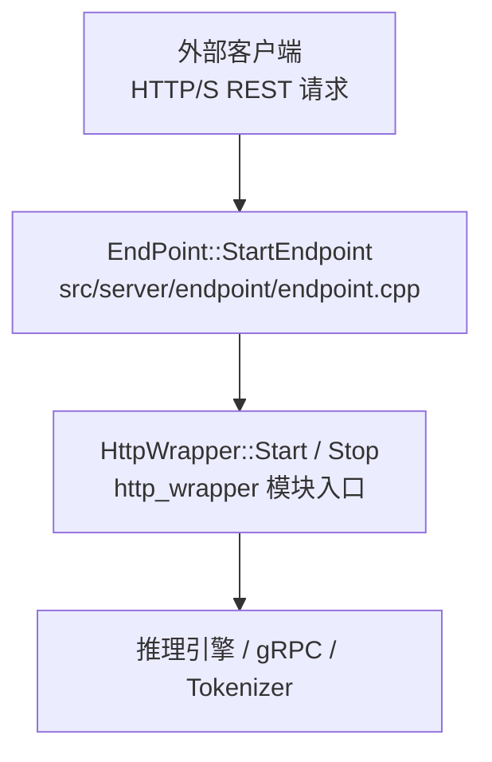
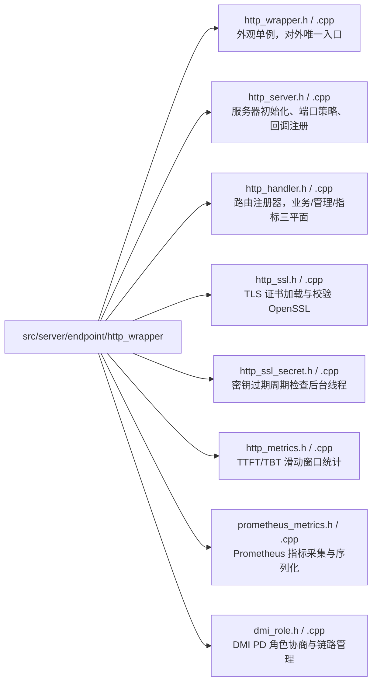
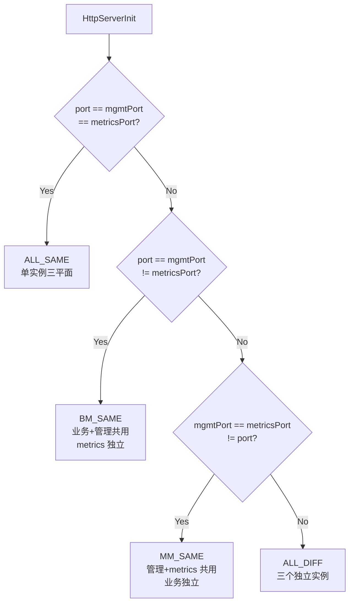
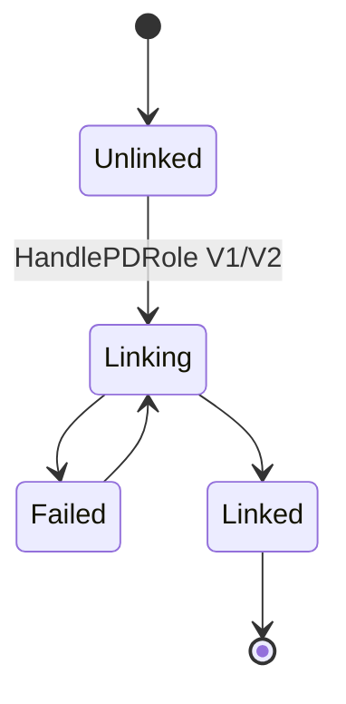
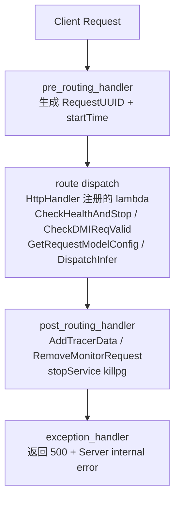
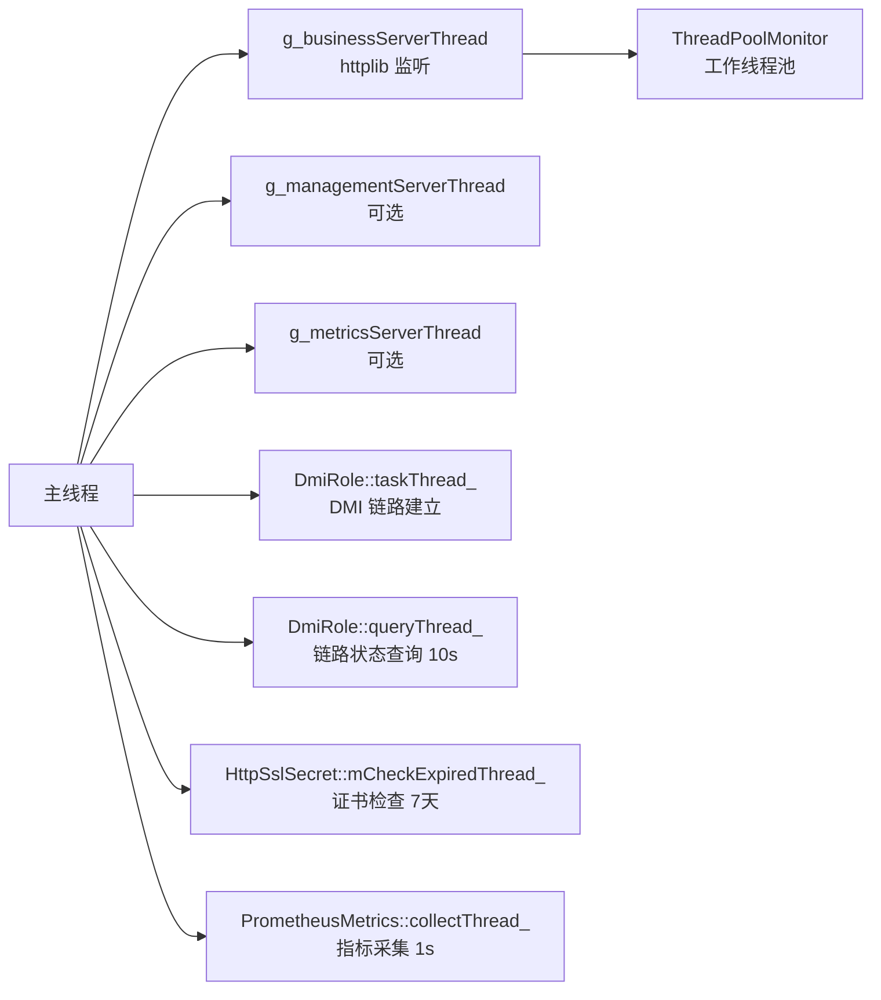
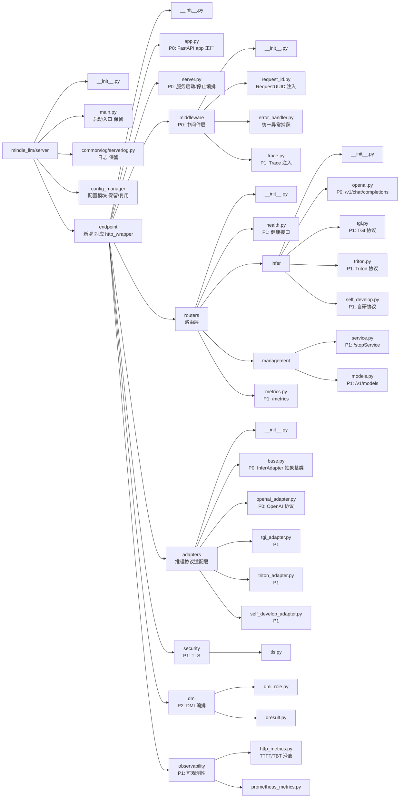
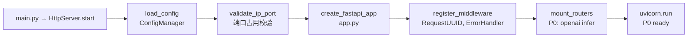
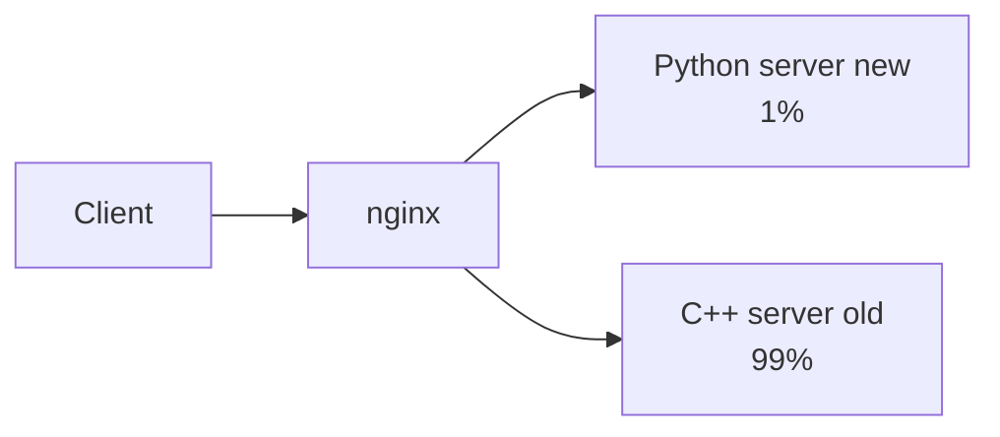

# HTTP 服务层架构

> 来源: 4 files | 最后更新: 2026-07-11

## 核心概念

> **HTTP Wrapper Architecture HTTP Wrapper 架构分析** | 类型: repo | 标签: `architecture`, `inference`, `http`, `server`, `mindie`

# HTTP Wrapper 架构分析
*(来源: wiki/repos/mindie-pyserver/http-wrapper.md)*

> **HTTP Server Migration HTTP Server 迁移设计方案** | 类型: repo | 标签: `architecture`, `inference`, `http`, `server`, `migration`, `mindie`

# HTTP Server 迁移设计方案
*(来源: wiki/repos/mindie-pyserver/http-migration.md)*

> **HTTP Wrapper 架构分析**

HTTP Wrapper 架构
*(来源: wiki/raw/articles/pyserver/http_wrapper_architecture.md)*

> **HTTP Server 迁移设计方案**

HTTP Server 迁移设计
*(来源: wiki/raw/articles/pyserver/http_server_migration_design.md)*

## 深入分析

### 模块定位



*(来源: wiki/repos/mindie-pyserver/http-wrapper.md)*

### 目录结构



| 功能组 | 文件 |
|--------|------|
| 生命周期管理 | `http_wrapper`, `http_server` |
| 路由与处理 | `http_handler` |
| 安全 TLS | `http_ssl`, `http_ssl_secret` |
| 可观测性 | `http_metrics`, `prometheus_metrics` |
| DMI 分布式 | `dmi_role` |

*(来源: wiki/repos/mindie-pyserver/http-wrapper.md)*

### 分层架构

```mermaid
flowchart TB
    Client[外部: HTTP/HTTPS 客户端]
    EP[EndPoint 层<br/>EndPoint Start/Stop]
    HW[http_wrapper 模块]

    subgraph HW_INNER[http_wrapper 模块]
        direction TB
        subgraph FACADE[外观 & 初始化]
            HW1[HttpWrapper<br/>外观单例]
            HS[HttpServer<br/>静态初始化器]
        end
        subgraph HANDLER[HttpHandler]
            HH[路由注册器<br/>BusinessInitialize<br/>ManagementInit<br/>MetricsInit]
        end
        subgraph TLS[TLS 层]
            SSL[HttpSsl 三平面<br/>HttpSslSecret]
        end
        subgraph METRICS[指标层]
            HM[HttpMetrics<br/>PrometheusMetrics]
        end
        subgraph DMI[DMI 分布式]
            DR[DmiRole<br/>FlexP%Processor]
        end
        FACADE --> HH
        HH --> TLS
        HH --> METRICS
        TLS --> DMI
        METRICS --> DMI
    end

    Infra[基础设施<br/>InferInstances | ConfigManager | msServiceProfiler]

    Client --> EP --> HW --> HW_INNER --> Infra
```

*(来源: wiki/repos/mindie-pyserver/http-wrapper.md)*

### 核心类职责

### HttpWrapper — 外观入口
- **模式**: Singleton + Facade
- 对 `EndPoint` 层隐藏所有 HTTP 栈细节，仅暴露 `Start`/`Stop`
- `mStarted` + `mMutex` 防止重复启动

### HttpServer — 服务初始化器
- 静态类，核心方法：`HttpServerInit()`、`HttpServerDeInit()`
- IP/端口合法性校验（`CheckIp`、`IsPortUsed`）
- 端口策略判断 → 创建 `HttpsServerHelper` 实例
- 注册 pre_routing / post_routing / exception_handler 钩子
- 配置 `ThreadPoolMonitor`（工作线程数、队列长度=2×并发数）、payload 限制（512MB）

### HttpHandler — 路由注册器
- 纯静态工具类（无实例化，无继承）
- `DispatchInfer` 模板：通过 `BuildInterfaceFn` 在编译期绑定推理协议适配器

### 三平面路由

| 平面 | 初始化方法 | 典型路由 |
|------|-----------|---------|
| Business | `BusinessInitialize` | `POST /generate`, `POST /v1/chat/completions`, `POST /generate_stream` |
| Management | `ManagementInitialize` | `GET /health`, `GET /status`, `POST /stopService` |
| Metrics | `InitializeMetricsResource` | `GET /metrics` (Prometheus) |

*(来源: wiki/repos/mindie-pyserver/http-wrapper.md)*

### 三平面端口策略



| ServerGroupType | 实例数 | 实例1 路由 | 实例2 路由 | 实例3 路由 |
|----------------|--------|-----------|-----------|-----------|
| ALL_SAME | 1 | Business + Management + Metrics | — | — |
| BUSINESS_MANAGEMENT_SAME | 2 | Business + Management | Metrics | — |
| MANAGEMENT_METRICS_SAME | 2 | Business | Management + Metrics | — |
| ALL_DIFFERENT | 3 | Business | Management | Metrics |

*(来源: wiki/repos/mindie-pyserver/http-wrapper.md)*

### 请求生命周期

```mermaid
flowchart LR
    Client1[HTTP 客户端]
    HL[httplib<br/>HttpsServerHelper]
    PreR[pre_routing_handler<br/>生成 UUID + startTime]
    HH2[HttpHandler<br/>HandlePostGenerate]
    DI[DispatchInfer<br/>buildFn → InferInterface]
    SRI[SingleReqInferInterface<br/>调用 InferInstances 推理]
    HDR[HandleDResult<br/>res.set_content json]
    PostR[post_routing_handler<br/>AddTracerData + RemoveMonitorRequest]
    Client2[HTTP 客户端<br/>200 + JSON]

    Client1 --> HL --> PreR --> HH2 --> DI --> SRI --> HDR --> PostR --> Client2
```



**流式差异**：`res.set_chunked_content_provider` 设置；`post_routing` 跳过 `RemoveMonitorRequest`；由 `DResultKeepAlive` 负责清理。

*(来源: wiki/repos/mindie-pyserver/http-wrapper.md)*

### DMI Role 状态机



- V1/V2 协议分别处理不同版本的角色协商
- `taskThread_` 执行建链操作（可能阻塞），`queryThread_` 周期轮询链路健康度

*(来源: wiki/repos/mindie-pyserver/http-wrapper.md)*

### TLS/SSL 安全

- **TLS 版本**: TLS 1.3，指定 cipher suites
- **三证书分离**: Business / Management / Metrics 各持独立 `HttpSsl` 实例
- **CRL 校验**: 支持证书吊销列表
- **双向 TLS**: `CaVerifyCallback` 实现客户端证书校验
- **HttpSslSecret**: 后台线程周期性检查密钥过期（框架已搭建，循环体为占位逻辑）

*(来源: wiki/repos/mindie-pyserver/http-wrapper.md)*

### 可观测性三层

| 层 | 能力 | 实现 |
|----|------|------|
| 层1 | 分布式追踪 | W3C TraceContext + Zipkin B3，post_routing 中执行 |
| 层2 | 延迟指标 | HttpMetrics: TTFT/TBT 滑动窗口（1000 窗口，O(1) 查询） |
| 层3 | Prometheus | Counter/Gauge/Histogram，`GET /metrics` 导出，MIES_SERVICE_MONITOR_MODE 控制 |

*(来源: wiki/repos/mindie-pyserver/http-wrapper.md)*

### 设计模式

| 模式 | 实现位置 |
|------|---------|
| Singleton | HttpWrapper (Meyer's), HttpMetrics, FlexPPercentageProcessor, PrometheusMetrics (shared_ptr), DmiRole (shared_ptr) |
| Facade | HttpWrapper 对 EndPoint 屏蔽所有细节 |
| Factory Method | `CreateHttpServerPoint(SSLCertCategory, ServerGroupType)` |
| Strategy | `DispatchInfer` 模板，编译期绑定推理协议适配器 |

[^http]: [[raw/articles/pyserver/http_wrapper_architecture.md]]

*(来源: wiki/repos/mindie-pyserver/http-wrapper.md)*

### 迁移目标

- **协议兼容**: URL、方法、请求/响应体、HTTP 状态码与 C++ 侧保持完全一致
- **行为等价**: 健康检查语义、推理分发逻辑、停服流程对齐
- **扩展性良好**: 按层分包，新协议以插件方式加入
- **渐进交付**: 分 P0/P1/P2 三阶段

*(来源: wiki/repos/mindie-pyserver/http-migration.md)*

### C++ 现状基线

### 分层架构 (C++)

```mermaid
flowchart TB
    HW[HttpWrapper<br/>单例 Facade — 外部调用入口]
    HS[HttpServer<br/>编排器 — 多平面、多实例管理]

    subgraph HS_INSTANCES[HttpServer 实例]
        BIZ[Business 实例]
        MGMT[Management 实例]
        MET[Metrics 实例]
    end

    HH[HttpHandler<br/>控制器 — 路由注册 + 协议适配]
    Protocols[OpenAI | Triton | TGI | 自研 | 管理 | 健康 | 指标]

    Sub[HttpSsl | DmiRole | PrometheusMetrics<br/>HttpSslSecret | HttpMetrics]

    Infra[InferInstance 推理引擎 | ConfigManager 配置]

    HW --> HS --> HS_INSTANCES
    HS_INSTANCES --> HH
    HH --> Protocols
    Protocols --> Sub
    Sub --> Infra
```

### 多实例部署策略

| 场景 | 实例数 | 说明 |
|------|--------|------|
| 三端口完全相同 | 1 | ALL_SAME，一个实例挂载全部路由 |
| Business=Management, Metrics 独立 | 2 | BUSINESS_MANAGEMENT_SAME |
| Management=Metrics, Business 独立 | 2 | MANAGEMENT_METRICS_SAME |
| 三端口全不同 | 3 | ALL_DIFFERENT |

### 请求处理全链路 (C++)



### 线程模型 (C++)



*(来源: wiki/repos/mindie-pyserver/http-migration.md)*

### Python 目标架构

### 技术选型

| 组件 | 选型 | 理由 |
|------|------|------|
| Web 框架 | FastAPI | 原生 async、OpenAPI 文档、流式响应、类型校验 |
| ASGI 服务器 | uvicorn | 高性能、HTTP/1.1 keep-alive |
| 配置校验 | pydantic v2 | 与 FastAPI 深度集成 |
| 指标 | prometheus_client | Python 官方 Prometheus 客户端 |
| TLS | uvicorn ssl 参数 | 支持证书/私钥/CA 配置 |

### 目标包结构



### Python 目标分层架构

```mermaid
flowchart TB
    Svr[server.py<br/>启动/停止编排 — 对应 http_server<br/>uvicorn 启动 · 多 app 实例 · 端口配置 · 优雅关闭]
    App[app.py<br/>FastAPI App 工厂 — 对应 http_wrapper<br/>路由挂载 · 中间件注册 · lifespan]
    MW2[middleware<br/>中间件层 — 对应 pre/post routing<br/>RequestUUID · ErrorHandler · Trace]
    RT2[routers<br/>路由层 — 对应 HttpHandler<br/>health · infer · management · metrics]
    ADP2[adapters<br/>协议适配层 — 对应 SingleReq*Interface<br/>TGIAdapter · OpenAIAdapter · TritonAdapter]
    Misc[security | dmi | observability]
    IB[InferBackend 推理后端 | ConfigManager 已有]

    Svr --> App --> MW2 --> RT2 --> ADP2 --> Misc --> IB
```

*(来源: wiki/repos/mindie-pyserver/http-migration.md)*

### P0 关键路径

### 启动链路


### 推理链路 (P0)
```
@router.post("/v1/chat/completions")
async def chat_completions(request):
    body = await request.json()
    stream = body.get("stream", False)
    adapter = OpenAIAdapter(get_infer_backend())
    if stream:
        return StreamingResponse(adapter.infer_stream(body, headers),
                                 media_type="text/event-stream")
    result = await adapter.infer(body, headers)
    return JSONResponse(result)
```

*(来源: wiki/repos/mindie-pyserver/http-migration.md)*

### 模块迁移映射

| C++ 文件 | Python 文件 | 优先级 |
|----------|------------|--------|
| `http_wrapper.cpp` | `endpoint/app.py` | P0 |
| `http_server.cpp` | `endpoint/server.py` | P0 |
| `http_handler.cpp` (OpenAI) | `routers/infer/openai.py` + `adapters/openai_adapter.py` | P0 |
| `http_handler.cpp` (pre/post routing) | `middleware/request_id.py`, `error_handler.py` | P0 |
| `http_handler.cpp` (健康) | `routers/health.py` | P1 |
| `http_handler.cpp` (停服) | `routers/management/service.py` | P1 |
| `prometheus_metrics.cpp` | `observability/prometheus_metrics.py` | P1 |
| `http_metrics.cpp` | `observability/http_metrics.py` | P1 |
| `http_ssl.cpp` | `security/tls.py` | P1 |
| `dmi_role.cpp` | `dmi/dmi_role.py` | P2 |

*(来源: wiki/repos/mindie-pyserver/http-migration.md)*

### 兼容性设计

| 方面 | 要求 |
|------|------|
| 错误体格式 | `{"error": "...", "error_type": "..."}` 一致 |
| HTTP 状态码 | 400/413/422/500/503 语义一致 |
| 响应 Header | `RequestUUID` 必须保留 |
| 流式格式 | `Transfer-Encoding: chunked`, SSE `data: {...}\n\n` |
| 停服语义 | JudgeRestProcess 轮询 100ms → in_flight_counter 异步轮询 |
| 读超时 60s | httplib set_read_timeout → uvicorn timeout_keep_alive |

*(来源: wiki/repos/mindie-pyserver/http-migration.md)*

### 并发模型对比

| 维度 | C++ | Python |
|------|-----|--------|
| 请求并发 | ThreadPoolMonitor (maxLinkNum 个线程) | asyncio 协程 |
| 推理调用 | 同步阻塞线程 | run_in_executor 或 async 后端 |
| 指标采集 | std::thread (1s) | asyncio.create_task (1s) |
| DMI 链路 | taskThread_ + queryThread_ | asyncio.Task (P2) |
| 全局停服标志 | atomic\<bool\> | asyncio.Event |

*(来源: wiki/repos/mindie-pyserver/http-migration.md)*

### 双栈并行方案



[^migrate]: [[raw/articles/pyserver/http_server_migration_design.md]]

*(来源: wiki/repos/mindie-pyserver/http-migration.md)*

### 1\. 模块概述

HTTP 接入层子系统在 MindIE-LLM-PyServer 中的定位

`http_wrapper` 是 MindIE-LLM-PyServer 的 **HTTP 接入层子系统** ，负责将外部 HTTP(S) 请求路由至底层推理引擎（`InferInstances`）。它在整个服务器栈中的位置如下：

外部客户端HTTP(S) REST 请求

↓

EndPoint::StartEndpoint()src/server/endpoint/endpoint.cpp

↓

HttpWrapper::Start() / Stop()http_wrapper 模块入口

↓

推理引擎 / gRPC / Tokenizer

`EndPoint` 在完成 Tokenizer 与健康检查初始化后，调用 `HttpWrapper::Instance().Start()` 启动整个 HTTP 栈；退出时调用 `Stop()` 优雅关闭。部分角色（如多机推理 slave 节点）会跳过 `HttpWrapper` 初始化。

*(来源: wiki/raw/articles/pyserver/http_wrapper_architecture.md)*

### 2\. 目录结构

文件组织与功能分组

src/server/endpoint/http_wrapper/

├── http_wrapper.h / .cpp # 外观单例，对外唯一入口

├── http_server.h / .cpp # 服务器初始化、端口策略、回调注册

├── http_handler.h / .cpp # 路由注册器，业务/管理/指标三平面

├── http_ssl.h / .cpp # TLS 证书加载与校验（OpenSSL）

├── http_ssl_secret.h / .cpp # 密钥过期周期检查后台线程

├── http_metrics.h / .cpp # TTFT/TBT 滑动窗口统计

├── prometheus_metrics.h / .cpp # Prometheus 指标采集与序列化

└── dmi_role.h / .cpp # DMI PD 角色协商与链路管理

文件按功能分为四组：

功能组| 文件  
---|---  
**生命周期管理**| `http_wrapper`, `http_server`  
**路由与处理**| `http_handler`  
**安全 TLS**| `http_ssl`, `http_ssl_secret`  
**可观测性**| `http_metrics`, `prometheus_metrics`  
**DMI 分布式**| `dmi_role`

*(来源: wiki/raw/articles/pyserver/http_wrapper_architecture.md)*

### 3\. 架构分层

模块内部组件架构与外部依赖关系

外部

HTTP/HTTPS 客户端

↓ REST

endpoint 层

EndPoint

↓ Start/Stop

http_wrapper 模块

外观 & 初始化

HttpWrapper外观单例

HttpServer静态初始化器

↓ Create

HttpsServerHelper 实例（三平面）

Business Serverport

Management ServermanagementPort

Metrics ServermetricsPort

HttpHandler路由注册器

TLS 层

HttpSslBUSINESS

HttpSslMANAGEMENT

HttpSslMETRICS

HttpSslSecret密钥检查线程

指标层

HttpMetricsTTFT/TBT 滑窗

PrometheusMetricsCounter/Gauge

DmiRolePD 角色协商

↓

基础设施

InferInstances推理引擎

ConfigManager

msServiceProfilerTracing

*(来源: wiki/raw/articles/pyserver/http_wrapper_architecture.md)*

### 4\. 核心类职责分析

各核心类的设计、接口与职责边界

### 4.1 `HttpWrapper` — 外观入口

**文件** ：`http_wrapper.h / http_wrapper.cpp`

http_wrapper.h — HttpWrapper 类定义

1| class HttpWrapper {  
---|---  
2| public:  
3|  static HttpWrapper& Instance(); // Meyer's Singleton  
4|  bool Start(); // → HttpServer::HttpServerInit()  
5|  void Stop(); // → HttpServer::HttpServerDeInit()  
6| private:  
7|  std::mutex mMutex;  
8|  bool mStarted{false};  
9| };  
  
  * **模式** ：Singleton + Facade
  * **职责** ：对 `EndPoint` 层隐藏所有 HTTP 栈细节，仅暴露 `Start`/`Stop` 两个接口
  * `mStarted` 与 `mMutex` 防止重复启动


### 4.2 `HttpServer` — 服务初始化器

**文件** ：`http_server.h / http_server.cpp`

http_server.h — HttpServer 类定义

1| class HttpServer {  
---|---  
2| public:  
3|  static uint32_t HttpServerInit(); // 端口检查 → 策略分支 → 创建线程  
4|  static uint32_t HttpServerDeInit(); // 停止线程，释放 HttpsServerHelper  
5| };  
  
**核心职责** ：

  1. **IP/端口合法性校验** （`CheckIp`、`IsPortUsed`）
  2. **端口策略判断** （见第 6 节），选择 `ServerGroupType`
  3. **`CreateHttpServerPoint`** ：按 `SSLCertCategory` \+ `ServerGroupType` 组合，创建并配置 `HttpsServerHelper` 实例
  4. **`HttpServerInitCallback`** ：向 `HttpsServerHelper` 注册 pre_routing / post_routing / exception_handler 钩子
  5. **`HttpServerInitHttpLibConfig`** ：配置 `ThreadPoolMonitor`（工作线程数、队列长度 = 2×并发数）、payload 限制（512MB）、超时参数


**全局状态** （文件作用域）：

变量| 说明  
---|---  
`g_businessHttpSsl` / `g_managementHttpSsl` / `g_metricsHttpSsl`| 三类 TLS 实例  
`g_httpSslSecret`| 密钥检查后台线程实例  
`g_mServerInstances`| `SSLCertCategory → HttpsServerHelper*` 映射  
`g_businessServerThread` / `g_managementServerThread` / `g_metricsServerThread`| 监听线程  
  
### 4.3 `HttpHandler` — 路由注册器

**文件** ：`http_handler.h / http_handler.cpp`

http_handler.h — HttpHandler 类定义

1| class HttpHandler {  
---|---  
2| public:  
3|  static int BusinessInitialize(HttpsServerHelper &server);  
4|  static int ManagementInitialize(HttpsServerHelper &server);  
5|  static void InitializeMetricsResource(HttpsServerHelper &server);  
6|  static bool JudgeRestProcess();  
7|  // ...（大量私有 static 方法）  
8| private:  
9|  static int64_t startTime;  
10|  static std::mutex dmiRoleMutex_;  
11| };  
  
  * **模式** ：纯静态工具类（无实例化，无继承）
  * **职责** ：将 REST 路由注册到 `HttpsServerHelper`，按三平面分组：

平面| 初始化方法| 典型路由  
---|---|---  
**Business**| `BusinessInitialize`| `POST /generate`、`POST /v1/chat/completions`（OpenAI 兼容）、`POST /generate_stream`、`POST /tokenize`  
**Management**| `ManagementInitialize`| `GET /health`、`GET /status`、`POST /stopService`、`POST /cmd`（故障恢复）、`PUT /npuDeviceIds`（PD）  
**Metrics**| `InitializeMetricsResource`| `GET /metrics`（Prometheus 文本格式）  
  
  * **`DispatchInfer` 模板**：通过模板参数 `BuildInterfaceFn` 在运行时选择推理协议适配器（OpenAI、TGI、Triton、vLLM、自研等），实现策略分发。
  * **DMI 校验链** ：`IsDMI()` → `CheckDMIReqValid()` → 一系列 `Is*Valid()` 验证请求头合法性


### 4.4 `HttpSsl` — TLS 证书管理

**文件** ：`http_ssl.h / http_ssl.cpp`

http_ssl.h — HttpSsl 类定义

1| enum SSLCertCategory : uint16_t { MANAGEMENT_CERT, BUSINESS_CERT, METRICS_CERT };  
---|---  
2|   
3| class HttpSsl {  
4| public:  
5|  EpCode Start(SSL_CTX *sslCtx, SSLCertCategory certCategory);  
6| private:  
7|  EpCode InitWorkDir();  
8|  EpCode InitTlsPath(ServerConfig &serverConfig);  
9|  EpCode InitSSL(SSL_CTX *sslCtx);  
10|  EpCode LoadCaCert(SSL_CTX *sslCtx);  
11|  EpCode LoadServerCert(SSL_CTX *sslCtx);  
12|  EpCode LoadPrivateKey(SSL_CTX *sslCtx);  
13|  EpCode CertVerify(X509 *cert);  
14|  static int CaVerifyCallback(X509_STORE_CTX *x509ctx, void *arg);  
15|  std::string tlsCaPath, tlsCert, tlsPk, crlFullPath;  
16|  std::set<std::string> tlsCaFile, tlsCrlFile;  
17|  SSLCertCategory sslCertCategory;  
18| };  
  
  * **TLS 版本** ：TLS 1.3，指定 cipher suites
  * **三证书分离** ：Business / Management / Metrics 各持独立 `HttpSsl` 实例，支持差异化证书配置
  * **CRL 校验** ：支持证书吊销列表（`tlsCrlPath`/`tlsCrlFile`）
  * **双向 TLS** ：`CaVerifyCallback` 实现客户端证书校验


### 4.5 `HttpSslSecret` — 密钥生命周期监控

**文件** ：`http_ssl_secret.h / http_ssl_secret.cpp`

http_ssl_secret.h — HttpSslSecret 类定义

1| class HttpSslSecret {  
---|---  
2| public:  
3|  void Start(); // 启动后台检查线程 CheckKeyExpiredTask  
4|  void Stop(); // 通知线程退出  
5| private:  
6|  boost::mutex mutex_;  
7|  boost::condition_variable cond_;  
8|  std::thread checkThread_;  
9| };  
  
  * **职责** ：周期性检查 TLS 密钥是否过期（框架已搭建，当前循环体为占位逻辑）
  * **只在`httpsEnabled == true` 时由 `HttpServerInit` 启动**
  * 使用 `boost::condition_variable` \+ `wait_until` 实现可中断的定时循环


### 4.6 `HttpMetrics` — 请求延迟统计

**文件** ：`http_metrics.h / http_metrics.cpp`

http_metrics.h — HttpMetrics 类定义

1| class HttpMetrics {  
---|---  
2| public:  
3|  static HttpMetrics &GetInstance();  
4|  void CollectStatisticsRequest(const shared_ptr<SingleReqInferInterfaceBase> &req);  
5|  void TTFTAdd(const shared_ptr<SingleReqInferInterfaceBase> &req);  
6|  void TBTAdd(const shared_ptr<SingleReqInferInterfaceBase> &req);  
7|  size_t DynamicAverageTTFT(); // 滑动窗口均值  
8|  size_t DynamicAverageTBT();  
9| private:  
10|  std::queue<size_t> TTFTQueue_, TBTQueue_;  
11|  uint64_t ttftSum_ = 0, tbtSum_ = 0;  
12|  size_t dynamicAverageWindowSize = 1000;  
13|  std::mutex TTFTMutex, TBTMutex;  
14| };  
  
  * **指标** ：TTFT（Time To First Token）和 TBT（Time Between Tokens）
  * **算法** ：固定大小滑动窗口，维护累加和，`O(1)` 查询均值
  * **线程安全** ：TTFT 和 TBT 各自独立互斥锁


### 4.7 `PrometheusMetrics` — 可观测性采集

**文件** ：`prometheus_metrics.h / prometheus_metrics.cpp`

prometheus_metrics.h — PrometheusMetrics 类定义

1| class PrometheusMetrics {  
---|---  
2| public:  
3|  static std::shared_ptr<PrometheusMetrics> GetInstance();  
4|  void InitPrometheusMetrics();  
5|  std::string GetMetricsResult(); // 序列化为 Prometheus 文本格式  
6|  void TTFTObserve(double val);  
7|  void TBTObserve(double val);  
8|  // 吞吐、缓存命中率、Radix 树等采集方法...  
9|  bool IsActivate(); // 由 MIES_SERVICE_MONITOR_MODE 环境变量控制  
10| private:  
11|  prometheus::Registry registry_;  
12|  std::thread collectThread_; // 后台周期性拉取引擎数据  
13|  // Counter / Gauge / Histogram 成员...  
14| };  
  
  * **集成库** ：prometheus-cpp
  * **指标类型** ：Counter（请求总数）、Gauge（并发/缓存）、Histogram（延迟分布）
  * **后台线程** ：`CollectMetricDate` 定期从 `InferInstances` 拉取引擎级指标（Coordinator 加权命中率、序列长度分布等）
  * **激活控制** ：`MIES_SERVICE_MONITOR_MODE` 环境变量，未激活时 `GetMetricsResult()` 返回空


### 4.8 `DmiRole` — PD 分离角色管理

**文件** ：`dmi_role.h / dmi_role.cpp`

dmi_role.h — DmiRole 类定义

1| class DmiRole {  
---|---  
2| public:  
3|  static std::shared_ptr<DmiRole> GetInstance();  
4|  void HandlePDRoleV1(const ReqCtxPtr &ctx, const std::string &roleName);  
5|  void HandlePDRoleV2(const ReqCtxPtr &ctx, const std::string &roleName);  
6|  const map<uint64_t, vector<DeviceInfo>> &GetSuccessLinkIp();  
7|  bool IsHealthy();  
8|  void RunTaskThread(); // 异步执行链路建立任务  
9|  void RunQueryThread(); // 定期查询链路状态  
10| private:  
11|  map<uint64_t, vector<DeviceInfo>> successLinkIP_;  
12|  map<uint64_t, vector<DeviceInfo>> linkingLinkIP_;  
13|  map<uint64_t, pair<string,bool>> remoteNodeLinkStatus_;  
14|  BlockingQueue<function<void()>> taskQueue_; // 异步任务队列  
15|  thread taskThread_, queryThread_;  
16|  atomic<bool> taskTerminate_, queryTerminate_;  
17| };  
  
  * **DMI（Distributed Memory Inference）** ：Prefill/Decode 分离（PD Disaggregation）架构
  * **V1/V2 协议** ：`HandlePDRoleV1` / `HandlePDRoleV2` 分别处理不同版本的角色协商请求
  * **状态机** ：`linking → success/failed`，通过 `remoteNodeLinkStatus_` 追踪每对节点链路状态
  * **并发设计** ：`taskThread_` 执行建链操作（可能阻塞），`queryThread_` 周期轮询链路健康度，互不阻塞请求处理线程


DMI Role 状态机

[*]

→

Unlinked

↓ HandlePDRole(V1/V2)

Linking

← AssignDmiRole 失败

重试

↓ AssignDmiRole 成功

Linked

↓ Stop

[*]

↓ AssignDmiRole 失败

Failed

↓ 重试

Linking

### 4.9 `FlexPPercentageProcessor` — Flex 节点配置

**文件** ：`dmi_role.h / dmi_role.cpp`（与 `DmiRole` 同文件）

dmi_role.h — FlexPPercentageProcessor 类定义

1| class FlexPPercentageProcessor {  
---|---  
2| public:  
3|  static FlexPPercentageProcessor &GetInstance();  
4|  uint32_t GetPdRoleFlexPPercentage() const;  
5|  void SetPdRoleFlexPPercentage(uint32_t pPercentage);  
6| private:  
7|  uint32_t pdRoleFlexPPercentage{50}; // 默认 50%  
8| };  
  
  * **职责** ：维护 Flex 模式下 Prefill 节点占比（`p_percentage`），由 PD 角色协商请求动态更新

*(来源: wiki/raw/articles/pyserver/http_wrapper_architecture.md)*

### 5\. 设计模式分析

模块中应用的经典设计模式及其实现方式

### 5.1 单例模式（Singleton）

模块内共有 **5 处** 单例，采用两种不同的持有方式：

类| 单例方式| 说明  
---|---|---  
`HttpWrapper`| Meyer's Singleton（静态局部变量）| 生命周期绑定进程  
`HttpMetrics`| Meyer's Singleton| 滑动窗口数据不应重建  
`FlexPPercentageProcessor`| Meyer's Singleton| 简单状态持有  
`PrometheusMetrics`| `shared_ptr` 静态持有| 需要共享所有权语义  
`DmiRole`| `shared_ptr` 静态持有| 多处需要 `shared_ptr` 传递  
  
### 5.2 外观模式（Facade）

`HttpWrapper` 对 `EndPoint` 屏蔽了以下所有细节：

  * 三平面端口策略判断
  * 多线程监听
  * SSL/TLS 初始化
  * 路由注册
  * ThreadPoolMonitor 配置


`EndPoint` 只需调用两行代码：

1| HttpWrapper::Instance().Start(); // 启动  
---|---  
2| HttpWrapper::Instance().Stop(); // 停止  
  
### 5.3 工厂方法模式（Factory Method）

`CreateHttpServerPoint(SSLCertCategory, ServerGroupType)` 根据两个枚举参数的组合，创建并装配 `HttpsServerHelper` 实例，并向其注册不同的路由组合：

**ALL_SAME + BUSINESS_CERT** → Business + Management + Metrics 路由全部注册到同一实例

↓

**ALL_DIFFERENT + *** → 三个实例各自只注册对应平面路由

### 5.4 策略模式（Strategy）

`DispatchInfer` 为函数模板，通过 `BuildInterfaceFn` 模板参数在编译期绑定推理协议适配器：

1| template<typename BuildInterfaceFn>  
---|---  
2| void DispatchInfer(const ReqCtxPtr &reqCtx, BuildInterfaceFn buildFn);  
  
调用方在注册路由时传入不同的 lambda，分别构造 `OpenAIInferInterface`、`TGIInferInterface`、`TritonInferInterface` 等，无需运行时虚函数分发。

### 5.5 观察者 / 监控包装（Observer / Monitor Wrapper）

`HttpsServerHelper` 上的 `AddRequestToMonitor` / `RemoveMonitorRequest` 与 `ThreadPoolMonitor` 配合，实现请求级监控：

  * **pre_routing** ：为每个请求生成 UUID，注册到监控
  * **post_routing** ：请求完成后从监控移除（流式响应在 chunked 传输完毕后移除）
  * **exception_handler** ：异常时也确保从监控移除，防止泄漏

*(来源: wiki/raw/articles/pyserver/http_wrapper_architecture.md)*

### 6\. 三平面端口策略

端口分组决策树与实例分配

`HttpServer::HttpServerInit()` 根据配置中 `port`（业务）、`managementPort`（管理）、`metricsPort`（指标）三者的关系，自动选择端口分组策略：

HttpServerInit

↓

port == mgmtPort == metricsPort?

是

↓

ALL_SAME单实例三平面

否

↓

port == mgmtPort != metricsPort?

是

BM_SAME业务+管理共用  
metrics 独立

否

mgmtPort == metricsPort  
port != mgmtPort?

是

MM_SAME管理+metrics 共用  
业务独立

否

三端口全不同?

是

ALL_DIFF三个独立实例

否

不同 IP 且 mgmtPort==metricsPort?

是

BM_SAME2与 IP 无关，按端口分组

否

ALL_DIFF2

各策略下 `HttpsServerHelper` 实例数量与路由分配：

`ServerGroupType`| 实例数| 实例1 路由| 实例2 路由| 实例3 路由  
---|---|---|---|---  
`ALL_SAME`| 1| Business + Management + Metrics| —| —  
`BUSINESS_MANAGEMENT_SAME`| 2| Business + Management| Metrics| —  
`MANAGEMENT_METRICS_SAME`| 2| Business| Management + Metrics| —  
`ALL_DIFFERENT`| 3| Business| Management| Metrics

*(来源: wiki/raw/articles/pyserver/http_wrapper_architecture.md)*

### 7\. 请求生命周期

一次普通推理请求的完整处理序列

以下为一次普通推理请求（非流式）的完整处理序列：

HTTP 客户端

→

httplibHttpsServerHelper

↓

pre_routing_handler生成 UUID + startTime

↓ HandlerResponse::Unhandled

HttpHandlerHandlePostGenerate

↓

DispatchInferbuildFn → InferInterface

↓

SingleReqInferInterface调用 InferInstances 推理

↓ 推理结果

HandleDResultres.set_content(json)

↓

post_routing_handlerAddTracerData + RemoveMonitorRequest

↓

HTTP 客户端HTTP 200 + JSON

**流式响应（SSE / chunked）差异** `res.set_chunked_content_provider` 在 handler 中设置；`post_routing` 中检测 `Transfer-Encoding: chunked`，跳过 `RemoveMonitorRequest`；待数据流结束后由 `DResultKeepAlive` 负责清理。

*(来源: wiki/raw/articles/pyserver/http_wrapper_architecture.md)*

### 8\. TLS/SSL 安全设计

证书分类体系与初始化流程

### 证书分类体系

SSLCertCategory

↓

BUSINESS_CERT→ g_businessHttpSsl

MANAGEMENT_CERT→ g_managementHttpSsl

METRICS_CERT→ g_metricsHttpSsl

业务平面与管理平面可使用不同证书，满足运营商级安全隔离需求。

### `HttpSsl::Start()` 初始化流程

Start(sslCtx, category)

↓

InitWorkDir()解析工作目录

↓

InitTlsPath(config)从 ServerConfig 读取证书路径

↓

InitSSL(sslCtx)

SSL_CTX_set_min_proto_version(TLS1_3_VERSION)

SSL_CTX_set_ciphersuites(...) 指定 TLS 1.3 cipher suites

LoadCaCert(sslCtx) 加载 CA 证书列表 + CRL

LoadServerCert(sslCtx) 加载服务端证书

LoadPrivateKey(sslCtx) 加载私钥并验证匹配

↓

返回 EP_OK / 错误码

### 密钥周期检查

`HttpSslSecret` 提供密钥过期检查的**框架结构** ：

Start() → 启动 CheckKeyExpiredTask 线程

↓

循环：wait_until(now + interval) → [检查逻辑，待实现] → 继续

↓ Stop()

notify_all() → 线程退出

*(来源: wiki/raw/articles/pyserver/http_wrapper_architecture.md)*

### 9\. 可观测性设计

三层可观测性能力：追踪、延迟指标、Prometheus 采集

http_wrapper 提供三层可观测性能力：

### 层 1：分布式追踪（Tracing）

`AddTracerData(req, res)` 在 **post_routing** 中执行，支持：

  * W3C TraceContext（`traceparent` 头）
  * Zipkin B3 格式（`b3` 单头 或 `X-B3-TraceId` \+ `X-B3-SpanId` \+ `X-B3-Sampled` 多头）


通过 `msServiceProfiler::Tracer` 记录 Span 属性（路径、方法、IP、端口、状态码、RequestUUID）及请求真实开始时间（`startTime` 头由 pre_routing 注入，post_routing 消费后移除）。

### 层 2：延迟指标（HttpMetrics）

`HttpHandler` 在推理完成后调用 `HttpMetrics::TTFTAdd` / `TBTAdd`，维护滑动窗口均值：

**窗口大小：1000（可由 DYNAMIC_AVERAGE_WINDOW_SIZE 环境变量覆盖）** 算法：固定容量 queue + 累加和，入队/出队 O(1)，查询 O(1) 

### 层 3：Prometheus 指标

`GET /metrics` 路由调用 `PrometheusMetrics::GetMetricsResult()` 返回标准 Prometheus 文本格式，包含：

指标类型| 内容  
---|---  
Counter| 总请求数、成功/失败数  
Gauge| 当前并发请求数、KV 缓存命中率、Radix 树节点数  
Histogram| TTFT 分布、TBT 分布  
  
后台线程 `CollectMetricDate` 定期从推理引擎拉取：Coordinator 加权缓存命中率、序列长度分布等。

**激活控制** `MIES_SERVICE_MONITOR_MODE=true` → Prometheus 激活  
`MIES_SERVICE_MONITOR_MODE=false` → IsActivate() 返回 false，跳过采集

*(来源: wiki/raw/articles/pyserver/http_wrapper_architecture.md)*

### 10\. DMI 模式（PD 分离）

Distributed Memory Inference — Prefill/Decode 分离架构

**DMI（Distributed Memory Inference）** 是 MindIE 的 Prefill/Decode 分离推理架构：

### 角色协商流程

编排层

→

HttpHandler

→

DmiRole

→

InferInstances

PUT /pdRole (V1/V2) → 编排层 -> HttpHandler

↓

IsDMI() + IsPrefillRole() → 校验通过

↓

HandlePDRoleV1/V2(ctx, roleName)

↓

UpdatePDInfo → 解析 GlobalIpInfo

↓

taskQueue_.push(ExecuteLinkTask) → 202 Accepted

↓

taskThread_ 异步执行 AssignDmiRole(globalIpInfo)

↓

ProcessSuccessfulLinks / ProcessFailedLinks

↓

GET /pdLinkStatus → GetRemoteNodeLinkStatusV2()

↓

200 + status JSON → 编排层

### DMI 请求校验链

业务请求在 DMI 模式下需通过完整的头部校验：

CheckDMIReqValid(request, reqCtx)

↓

IsAllDMIHeadersExist()必须存在所有 DMI 专属 Header

↓

IsReqIdValid()请求 ID 格式合法

↓

IsReqTypeValid()请求类型（prefill/decode）合法

↓

IsDTargetValid()目标节点标识合法

↓

IsRecomputeParamValid()重计算参数合法

*(来源: wiki/raw/articles/pyserver/http_wrapper_architecture.md)*

### 11\. 类依赖关系总览

模块内各类之间的调用与依赖关系

生命周期

HttpWrapper

HttpServer

路由

HttpHandler

TLS

HttpSsl

HttpSslSecret

可观测性

HttpMetrics

PrometheusMetrics

DMI 分布式

DmiRole

FlexPPercentageProcessor

外部依赖

httplibHttpsServerHelper

ConfigManager

InferInstances

msServiceProfiler

prometheus-cpp

**调用关系：**  
HttpWrapper → HttpServer  
HttpServer → httplib (创建并装配) + HttpSsl (初始化) + HttpSslSecret (启动) + HttpHandler (注册路由) + ConfigManager (读配置) + msServiceProfiler (Tracing)  
HttpHandler → InferInstances (DispatchInfer) + HttpMetrics (采集) + PrometheusMetrics (采集) + DmiRole (DMI 模式)  
DmiRole → InferInstances (角色协商) + FlexPPercentageProcessor (子处理器)  
PrometheusMetrics → InferInstances (拉引擎数据) + prometheus-cpp (序列化)

*(来源: wiki/raw/articles/pyserver/http_wrapper_architecture.md)*

### 12\. 已知问题与待改进点

代码审查中发现的问题与建议

### 12.1 头文件 Guard 笔误

`dmi_role.h` 末尾的 `#endif` 注释写错了：

dmi_role.h — 错误的 #endif 注释

1| // dmi_role.h  
---|---  
2| #ifndef DMI_ROLE_H // ← 正确的 guard  
3| ...  
4| #endif // OCK_ENDPOINT_HTTP_HANDLER_H // ← 应为 DMI_ROLE_H，与 http_handler.h 混淆  
  
### 12.2 冗余头文件包含

`parse_protocol.cpp` 包含了 `http_wrapper.h`，但未使用其中任何符号，属于历史遗留或冗余包含，可安全移除。

### 12.3 `HttpSslSecret` 逻辑未完成

`CheckKeyExpiredTask` 已有完整的周期调度框架（`wait_until` 循环），但检查体为空逻辑，实际的密钥过期处理尚未实现。

### 12.4 `g_mServerInstances` 使用裸指针

1| static std::map<SSLCertCategory, HttpsServerHelper*> g_mServerInstances;  
---|---  
  
使用裸指针管理 `HttpsServerHelper` 对象，在 `DeInit` 中手动 `delete`。建议改为 `std::unique_ptr<HttpsServerHelper>` 以利用 RAII 避免潜在泄漏。

### 12.5 `HttpHandler` 静态成员的线程安全

`HttpHandler::startTime`（`static int64_t`）与 `HttpHandler::dmiRoleMutex_`（`static std::mutex`）作为静态成员，需确保多平面服务器共享时不存在竞争写入。

* * *

_文档生成自代码分析，如需更新请参考对应源文件。_

📚 相关分析报告 (Cross-page Nav) [Function Call 深度分析](<mindie_function_call_deep_analysis.html>) [HTTP Wrapper 架构](<http_wrapper_architecture.html>) [HTTP Server 迁移设计](<http_server_migration_design.html>) [Prefix Cache 分析](<prefix_cache_analysis.html>) [Scheduler 分析](<scheduler_deep_analysis.html>) [📂 文档索引](<index.html>)

Generated by Hermes Agent → Cursor Agent (composer-2.5-fast) 

◀ 1/24 ▶

*(来源: wiki/raw/articles/pyserver/http_wrapper_architecture.md)*

### 1\. 迁移目标与范围

定义迁移的总体目标、首期范围及核心术语

### 1.1 目标

将 C++ 实现的 HTTP 接入层（`http_wrapper` 子系统）等价迁移为 Python 实现，要求：

  * **协议兼容** ：URL、方法、请求/响应体、HTTP 状态码与 C++ 侧保持完全一致。
  * **行为等价** ：健康检查语义、推理分发逻辑、停服流程与 C++ 侧行为对齐。
  * **扩展性良好** ：Python 侧按层分包，新协议/新能力以插件/扩展方式加入，无需改主干。
  * **渐进交付** ：分 P0/P1/P2 三个阶段，每阶段独立可验证、可回滚。


### 1.2 首期范围（P0）

纳入| 不纳入（留 P1/P2）  
---|---  
服务启动/停止生命周期| TLS 双向认证、CRL 校验  
`/v1/chat/completions`（含流式）、`/v1/completions`（含流式）| `/generate`、`/generate_stream`、`/infer`、`/infer_token` 等其他推理接口  
统一异常处理与错误体格式| `/health`、`/v2/health/live`、`/v2/health/ready` 等健康接口（P1）  
配置加载、端口校验| `/stopService` 停服接口（P1）  
RequestUUID 注入、基础日志| DMI 角色切换与链路管理（P2）  
| Prometheus 全量指标、LoRA 动态加载/卸载（P1/P2）  
| 故障恢复命令接口（P2）  
  
### 1.3 术语

术语| 含义  
---|---  
Business Plane| 推理接口平面（面向外部调用方）  
Management Plane| 管理接口平面（状态/配置/运维）  
Metrics Plane| 指标导出平面（Prometheus）  
DMI| Disaggregated Model Inference，P/D 分离推理模式  
TTFT| Time To First Token，首 Token 延迟  
TBT| Time Between Tokens，Token 间延迟

*(来源: wiki/raw/articles/pyserver/http_server_migration_design.md)*

### 2\. 现状基线（C++ 侧）

当前 C++ http_wrapper 子系统的架构、文件清单、关键状态与线程模型

### 2.1 子系统文件清单与职责

src/server/endpoint/http_wrapper/ ├── http_wrapper.h/.cpp # 生命周期门面（Facade，单例） ├── http_server.h/.cpp # 多平面编排（创建/启动/销毁服务实例） ├── http_handler.h/.cpp # 路由注册与业务分发（核心控制器） ├── http_ssl.h/.cpp # TLS 证书加载与 OpenSSL 初始化 ├── http_ssl_secret.h/.cpp # 证书/秘钥周期检查后台线程 ├── dmi_role.h/.cpp # DMI P/D/Flex 角色管理与链路状态机 ├── http_metrics.h/.cpp # 滑窗统计（TTFT/TBT） └── prometheus_metrics.h/.cpp # Prometheus 指标采集线程与导出

### 2.2 分层架构（C++）

C++ 分层架构

HttpWrapper（单例 Facade）外部调用入口

↓

HttpServer（编排器）多平面、多实例管理

Business 实例

Management 实例

Metrics 实例

↓

HttpHandler（控制器）路由注册 + 协议适配

OpenAI

Triton

TGI

自研

管理

健康

指标

↓

HttpSsl

DmiRole

PrometheusMetrics

HttpSslSecret

HttpMetrics

↓

InferInstance（推理引擎）

ConfigManager（配置）

### 2.3 多实例部署策略

C++ 侧根据 `ipAddress/managementIpAddress/port/managementPort/metricsPort` 组合，动态决定启动几个 server 实例：

场景| 实例数| 说明  
---|---|---  
三端口完全相同| 1| `ALL_SAME`，一个实例挂载全部路由  
Business=Management，Metrics 独立| 2| `BUSINESS_MANAGEMENT_SAME`  
Management=Metrics，Business 独立| 2| `MANAGEMENT_METRICS_SAME`  
三端口全不同| 3| `ALL_DIFFERENT`  
  
### 2.4 请求处理全链路（C++）

请求处理流水线

Client Request

↓

pre_routing_handler生成 RequestUUID + 记录 startTime（纳秒）

↓

route dispatch（HttpHandler 注册的 lambda）CheckHealthAndStop / CheckDMIReqValid / GetRequestModelConfig / DispatchInfer

↓

post_routing_handlerAddTracerData / RemoveMonitorRequest / stopService killpg

↓

exception_handler（兜底异常捕获）返回 500 + "Server internal error"

### 2.5 关键全局状态（C++）

变量| 类型| 说明  
---|---|---  
`g_businessHttpSsl`| `shared_ptr<HttpSsl>`| 业务平面 SSL 上下文  
`g_managementHttpSsl`| `shared_ptr<HttpSsl>`| 管理平面 SSL 上下文  
`g_metricsHttpSsl`| `shared_ptr<HttpSsl>`| 指标平面 SSL 上下文  
`g_mServerInstances`| `map<SSLCertCategory, HttpsServerHelper*>`| 运行中的 server 实例表  
`g_businessServerThread`| `thread`| 业务监听线程  
`StopServiceOption::stopServiceFlag`| `atomic<bool>`| 全局停服标志  
`dResultDispatcher`| `shared_ptr<DResultEventDispatcher>`| DMI 长连接事件分发器  
`keepAlive`| `atomic<bool>`| dresult 保活标志  
  
### 2.6 线程模型（C++）

C++ 线程拓扑

主线程

g_businessServerThread（httplib 监听）→ ThreadPoolMonitor 工作线程池（maxLinkNum 个）

g_managementServerThread（httplib 监听，可选）

g_metricsServerThread（httplib 监听，可选）

DmiRole::taskThread_（DMI 链路建立任务队列）

DmiRole::queryThread_（DMI 链路状态周期查询，10s）

HttpSslSecret::mCheckExpiredThread_（证书过期检查，7天）

PrometheusMetrics::collectThread_（指标采集，1s）

### 2.7 关键超时与容量配置

参数| 默认值| 说明  
---|---|---  
`READ_TIMEOUT`| 60s| 请求读取超时  
`WRITE_TIMEOUT`| 600s| 响应写入超时（流式需要）  
`PAYLOAD_MAX_LENGTH`| 512 MB| 请求体最大长度  
`QUEUE_REQUESTS_NUM_MULTI`| 2x| 队列长度 = 工作线程数 × 2  
`MANAGEMENT_WORK_THREAD_NUM`| 100| 管理平面工作线程数

*(来源: wiki/raw/articles/pyserver/http_server_migration_design.md)*

### 3\. Python 目标架构

技术选型、目标包结构与分层架构设计

### 3.1 技术选型

组件| 选型| 理由  
---|---|---  
Web 框架| **FastAPI**|  原生支持 async、OpenAPI 文档、流式响应、类型校验  
ASGI 服务器| **uvicorn**|  高性能、支持 HTTP/1.1 keep-alive、易配置线程池  
配置校验| **pydantic v2**|  与 FastAPI 深度集成，类型安全  
指标| **prometheus_client**|  Python 官方 Prometheus 客户端  
TLS| **uvicorn ssl 参数**|  支持证书/私钥/CA 配置  
  
### 3.2 目标包结构

mindie_llm/server/ ├── __init__.py ├── main.py # 现有启动入口（保留） ├── common/ │ └── log/ │ └── serverlog.py # 现有日志（保留） ├── config_manager/ # 现有配置模块（保留，复用） │ └── endpoint/ # ← 新增，对应 http_wrapper ├── __init__.py ├── app.py # P0: FastAPI app 工厂，生命周期钩子 ├── server.py # P0: 服务启动/停止编排（对应 http_server） │ ├── middleware/ # P0: 中间件层 │ ├── __init__.py │ ├── request_id.py # RequestUUID 注入 │ ├── error_handler.py # 统一异常捕获与错误体 │ └── trace.py # P1: Trace 注入（traceparent/b3） │ ├── routers/ # 路由层（对应 HttpHandler） │ ├── __init__.py │ ├── health.py # P1: /health /v2/health/live /v2/health/ready │ ├── infer/ # 推理接口 │ │ ├── __init__.py │ │ ├── openai.py # P0: /v1/chat/completions /v1/completions │ │ ├── tgi.py # P1: /generate /generate_stream / │ │ ├── triton.py # P1: /v2/models/{model}/infer|generate │ │ └── self_develop.py # P1: /infer /infer_token │ ├── management/ # 管理接口 │ │ ├── __init__.py │ │ ├── service.py # P1: /stopService │ │ ├── models.py # P1: /v1/models /v1/models/{model} │ │ ├── tokenizer.py # P1: /v1/tokenizer │ │ ├── status.py # P2: /v1/status /v2/status │ │ ├── config.py # P2: /v1/config │ │ ├── lora.py # P2: /v1/load_lora_adapter │ │ ├── fault.py # P2: /v1/engine-server/fault-handling-command │ │ └── dmi_role.py # P2: /v1/role /v2/role │ └── metrics.py # P1: /metrics │ ├── adapters/ # 推理协议适配层（对应 SingleReq*Interface） │ ├── __init__.py │ ├── base.py # P0: 抽象基类 InferAdapter │ ├── openai_adapter.py # P0: OpenAI 协议（chat/completions） │ ├── tgi_adapter.py # P1: TGI 协议 │ ├── triton_adapter.py # P1: Triton 协议 │ └── self_develop_adapter.py # P1: 自研协议 │ ├── security/ # P1: TLS/安全（对应 http_ssl） │ ├── __init__.py │ └── tls.py │ ├── dmi/ # P2: DMI 编排（对应 dmi_role） │ ├── __init__.py │ ├── dmi_role.py │ └── dresult.py │ └── observability/ # P1: 可观测性 ├── __init__.py ├── http_metrics.py # 滑窗统计（TTFT/TBT） └── prometheus_metrics.py # Prometheus 指标

### 3.3 分层架构（Python 目标）

Python 目标分层架构

server.py（启动/停止编排）对应 http_server · uvicorn 启动 · 多 app 实例 · 端口配置 · 优雅关闭

↓

app.py（FastAPI App 工厂）对应 http_wrapper · 路由挂载 · 中间件注册 · lifespan

↓

middleware/（中间件层）RequestUUID · ErrorHandler · Trace（对应 pre/post routing）

↓

routers/（路由层 · 对应 HttpHandler）health · infer · management · metrics

↓

adapters/（协议适配层 · 对应 SingleReq*Interface）TGIAdapter · OpenAIAdapter · TritonAdapter

↓

security/

dmi/

observability/

↓

InferBackend（推理后端抽象接口）

ConfigManager（已有）

*(来源: wiki/raw/articles/pyserver/http_server_migration_design.md)*

### 4\. 关键路径 MVP 设计

P0 最小可用闭环的详细路径描述

### 4.1 P0 关键路径：最小可用闭环

启动链路 → 推理链路（/v1/chat/completions + /v1/completions，含流式）→ 错误处理链路

> 说明：健康接口与停服接口调整为 P1，P0 阶段专注打通 OpenAI 协议推理能力。

#### 路径 A：服务启动链路

**C++ 行为** ：

  1. `HttpWrapper::Start` 加锁、幂等保护
  2. `HttpServerInit` 校验 IP/端口、创建 N 个 server 实例
  3. 每个实例装配 SSL → 挂载路由 → 配置线程池/超时 → 启动监听线程


**Python 等价实现** ：

server.py — HttpServer

1| class HttpServer:  
---|---  
2|  async def start(self):  
3|  """对应 HttpWrapper::Start + HttpServer::HttpServerInit"""  
4|  config = get_server_config()  
5|  self._validate_ports(config) # 对应 IsPortUsed()  
6|  apps = self._create_apps(config) # 对应 CreateHttpServerPoint()  
7|  await self._start_listeners(apps) # 对应 HttpServerInitOfAllPlane()  
8|   
9|  def _create_apps(self, config):  
10|  """根据端口组合决定启动几个 app 实例"""  
11|  # 对应 ALL_SAME / BUSINESS_MANAGEMENT_SAME / ALL_DIFFERENT 逻辑  
  
**关键约束** ：

  * 端口占用检查必须在绑定前完成（等价 `IsPortUsed`）
  * 优雅停服须等待进行中请求完成（等价 `JudgeRestProcess` 轮询）


#### 路径 B：健康链路（P1）

> P0 阶段不实现，待 P1 补充。P0 期间服务内部可通过进程存活判断，不对外暴露健康接口。

**C++ 行为** （留作 P1 实现参考）：

  * `/health`：检查健康标志 + 节点状态
  * `/v2/health/live`：Liveness（进程活着即可，busy 也返回 200）
  * `/v2/health/ready`：Readiness（busy 返回 503）


**服务状态机** （等价 C++ `ServiceStatus`，P1 实现时使用）：

NORMAL→ pause_cmd → PAUSE

PAUSE→ reinit_cmd → READY

READY→ start_cmd → NORMAL

ABNORMALPAUSE fail / start fail

BUSYNORMAL busy →

#### 路径 C：推理链路（P0 核心，OpenAI 协议，含流式）

**C++ 行为** ：

POST /v1/chat/completions → InitializeInferResource

↓

SingleLLMPnDReqHandler

↓

SingleReqVllmOpenAiInferInterface / SingleReqOpenAiInferInterface

↓

InferInstance::Process

↓

ResponseJsonBody（非流式）/ chunked SSE（流式，stream=true）

**Python 等价实现** ：

routers/infer/openai.py

1| @router.post("/v1/chat/completions")  
---|---  
2| async def chat_completions(request: Request):  
3|  body = await request.json()  
4|  stream = body.get("stream", False)  
5|  adapter = OpenAIAdapter(get_infer_backend())  
6|  if stream:  
7|  return StreamingResponse(  
8|  adapter.infer_stream(body, dict(request.headers)),  
9|  media_type="text/event-stream"  
10|  )  
11|  result = await adapter.infer(body, dict(request.headers))  
12|  return JSONResponse(result)  
13|   
14| @router.post("/v1/completions")  
15| async def completions(request: Request):  
16|  body = await request.json()  
17|  stream = body.get("stream", False)  
18|  adapter = OpenAICompletionsAdapter(get_infer_backend())  
19|  if stream:  
20|  return StreamingResponse(  
21|  adapter.infer_stream(body, dict(request.headers)),  
22|  media_type="text/event-stream"  
23|  )  
24|  result = await adapter.infer(body, dict(request.headers))  
25|  return JSONResponse(result)  
  
**适配器工厂（扩展性设计）** ：

adapters/base.py — 抽象接口 + 注册表

1| class InferAdapter(ABC):  
---|---  
2|  @abstractmethod  
3|  async def infer(self, body: dict, headers: dict) -> dict: ...  
4|  @abstractmethod  
5|  async def infer_stream(self, body: dict, headers: dict) -> AsyncGenerator[str, None]: ...  
6|   
7| # P0 仅注册 OpenAI 协议，P1 扩展 TGI/Triton/自研  
8| AdapterRegistry = {  
9|  MsgType.OPENAI: OpenAIAdapter, # P0  
10|  MsgType.OPENAI_COMP: OpenAICompletionsAdapter, # P0  
11|  MsgType.TGI: TgiAdapter, # P1  
12|  MsgType.TRITON: TritonAdapter, # P1  
13|  MsgType.VLLM: VllmAdapter, # P1  
14| }  
  
**LoRA 支持** （P0 阶段需保留查询路径，不需实现动态加载）：

P0 stub — lora_params

1| async def _query_lora_params(self) -> list:  
---|---  
2|  return [] # P0 stub，P2 替换为实际调用  
  
#### 路径 D：统一错误处理链路

**C++ 行为** （`exception_handler` \+ `g_exceptionInfo`）：

HTTP 状态码| 错误体格式  
---|---  
400| `{"error": "...", "error_type": "bad_request"}`  
422| `{"error": "...", "error_type": "validation"}`  
500| `{"error": "...", "error_type": "internal_error"}`  
503| `{"error": "...", "error_type": "service_unavailable"}`  
  
**Python 等价实现** ：

middleware/error_handler.py

1| ERROR_TYPE_MAP = {  
---|---  
2|  400: "bad_request",  
3|  413: "payload_too_large",  
4|  422: "validation",  
5|  500: "internal_error",  
6|  503: "service_unavailable",  
7| }  
8|   
9| @app.exception_handler(Exception)  
10| async def global_exception_handler(request, exc):  
11|  status = getattr(exc, "status_code", 500)  
12|  return JSONResponse(  
13|  status_code=status,  
14|  content={"error": str(exc), "error_type": ERROR_TYPE_MAP.get(status, "unknown")}  
15|  )  
  
#### 路径 E：停服链路

**C++ 行为** ：

  * `/stopService`（默认）：设置 `stopServiceFlag`，轮询等待处理中请求清空，返回 200，`post_routing_handler` 中触发 `killpg(SIGTERM)`
  * `/stopService?mode=Force`：立即设置 flag，5s 后 `killpg(SIGKILL)`


**Python 等价实现** ：

routers/management/service.py

1| @router.get("/stopService")  
---|---  
2| async def stop_service(mode: str = ""):  
3|  stop_flag.set()  
4|  if mode == "Force":  
5|  asyncio.get_event_loop().call_later(5, os.killpg, os.getpgrp(), signal.SIGKILL)  
6|  return Response(status_code=200)  
7|  # 等待进行中请求清空（轮询 in-flight counter）  
8|  while in_flight_counter.value > 0:  
9|  await asyncio.sleep(0.1)  
10|  return Response(status_code=200)  
11|  # lifespan shutdown 中触发 os.killpg(SIGTERM)  
  
#### P0 关键路径启动时序

main.py

↓

HttpServer.start()

load_config()ConfigManager（已有 Python 实现）

validate_ip_port()端口占用校验

create_fastapi_app()app.py

register_middleware()RequestUUID, ErrorHandler

mount_routers()[P0] openai infer / [P1] health, management/service, metrics

uvicorn.run()[P0 ready] 服务进入监听状态

*(来源: wiki/raw/articles/pyserver/http_server_migration_design.md)*

### 5\. 模块迁移映射表

C++ 文件| Python 文件| 优先级| 迁移复杂度| 说明  
---|---|---|---|---  
`http_wrapper.cpp`| `endpoint/app.py`| **P0**|  低| 生命周期 + App 工厂  
`http_server.cpp`| `endpoint/server.py`| **P0**|  中| 多实例编排逻辑  
`http_handler.cpp` \- pre/post routing| `middleware/request_id.py`, `error_handler.py`| **P0**|  低| 中间件实现  
`http_handler.cpp` \- OpenAI 推理| `routers/infer/openai.py` \+ `adapters/openai_adapter.py`| **P0**|  中| 核心目标接口，含流式  
`http_handler.cpp` \- 健康接口| `routers/health.py`| P1| 低| 健康状态机等价  
`http_handler.cpp` \- 停服| `routers/management/service.py`| P1| 中| 停服语义需精确  
`http_handler.cpp` \- models 接口| `routers/management/models.py`| P1| 低| `/v1/models` 列表与单模型查询  
`http_handler.cpp` \- tokenizer| `routers/management/tokenizer.py`| P1| 低| 简单接口  
`http_handler.cpp` \- TGI/vLLM 推理| `routers/infer/tgi.py`| P1| 中| SSE/chunked  
`http_handler.cpp` \- Triton 接口| `routers/infer/triton.py`| P1| 中| 协议适配  
`prometheus_metrics.cpp`| `observability/prometheus_metrics.py`| P1| 中| 指标定义对齐  
`http_metrics.cpp`| `observability/http_metrics.py`| P1| 低| 滑窗统计（TTFT/TBT）  
`http_ssl.cpp`| `security/tls.py`| P1| 中| uvicorn ssl 参数  
`http_handler.cpp` \- 状态查询| `routers/management/status.py`| P2| 中| 含 DMI 状态聚合  
`http_handler.cpp` \- 配置查询| `routers/management/config.py`| P2| 低| 简单配置读取  
`http_handler.cpp` \- 自研推理| `routers/infer/self_develop.py`| P2| 低| 协议适配  
`http_handler.cpp` \- LoRA| `routers/management/lora.py`| P2| 中| 动态加载/卸载  
`http_handler.cpp` \- 故障恢复| `routers/management/fault.py`| P2| 高| 状态机复杂  
`dmi_role.cpp`| `dmi/dmi_role.py`| P2| 极高| 异步链路管理  
`http_handler.cpp` \- dresult| `dmi/dresult.py`| P2| 高| 长连接 SSE  
`http_ssl_secret.cpp`| `security/tls.py`（后台任务）| P2| 低| 证书过期检查

*(来源: wiki/raw/articles/pyserver/http_server_migration_design.md)*

### 6\. 各模块详细设计

每个 Python 模块的关键实现细节与代码片段

### 6.1 `endpoint/app.py`（对应 `http_wrapper`）

**职责** ：FastAPI app 工厂，注册中间件、挂载路由、管理 lifespan。

**关键设计** ：

app.py — lifespan + app 工厂

1| from contextlib import asynccontextmanager  
---|---  
2|   
3| @asynccontextmanager  
4| async def lifespan(app: FastAPI):  
5|  # startup  
6|  health_manager.set_normal()  
7|  yield  
8|  # shutdown  
9|  stop_flag.set()  
10|  await wait_in_flight()  
11|  os.killpg(os.getpgrp(), signal.SIGTERM)  
12|   
13| def create_app(plane: Plane) -> FastAPI:  
14|  app = FastAPI(lifespan=lifespan)  
15|  app.add_middleware(RequestIdMiddleware)  
16|  app.add_middleware(ErrorHandlerMiddleware)  
17|  if plane in (Plane.BUSINESS, Plane.ALL):  
18|  app.include_router(health_router)  
19|  app.include_router(infer_router)  
20|  if plane in (Plane.MANAGEMENT, Plane.ALL):  
21|  app.include_router(management_router)  
22|  if plane in (Plane.METRICS, Plane.ALL):  
23|  app.include_router(metrics_router)  
24|  return app  
  
**幂等保护** （对应 C++ `mMutex + mStarted`）：

1| _started = False  
---|---  
2| _lock = asyncio.Lock()  
3|   
4| async def start():  
5|  async with _lock:  
6|  if _started:  
7|  return  
8|  ...  
  
### 6.2 `endpoint/server.py`（对应 `http_server`）

**职责** ：根据配置决定启动几个 uvicorn 实例（对应 C++ 多 server 实例逻辑）。

**多实例策略** ：

server.py — 多实例编排

1| class ServerGroupType(Enum):  
---|---  
2|  ALL_SAME = "all_same"  
3|  BUSINESS_MANAGEMENT_SAME = "bm_same"  
4|  MANAGEMENT_METRICS_SAME = "mm_same"  
5|  ALL_DIFFERENT = "all_different"  
6|   
7| def determine_group_type(config: ServerConfig) -> ServerGroupType:  
8|  """完全等价 C++ HttpServer::HttpServerInit 中的 if-elif 逻辑"""  
9|  if (config.ip == config.management_ip and  
10|  config.port == config.management_port == config.metrics_port):  
11|  return ServerGroupType.ALL_SAME  
12|  # ... 其余分支  
13|   
14| def start_servers(config: ServerConfig):  
15|  group = determine_group_type(config)  
16|  tasks = []  
17|  if group == ServerGroupType.ALL_SAME:  
18|  tasks.append(run_uvicorn(create_app(Plane.ALL), config.ip, config.port))  
19|  elif group == ServerGroupType.ALL_DIFFERENT:  
20|  tasks.append(run_uvicorn(create_app(Plane.BUSINESS), config.ip, config.port))  
21|  tasks.append(run_uvicorn(create_app(Plane.MANAGEMENT), config.management_ip, config.management_port))  
22|  tasks.append(run_uvicorn(create_app(Plane.METRICS), config.management_ip, config.metrics_port))  
23|  asyncio.gather(*tasks)  
  
**端口占用校验** （对应 `IsPortUsed`）：

1| def is_port_used(port: int) -> bool:  
---|---  
2|  with socket.socket(socket.AF_INET, socket.SOCK_STREAM) as s:  
3|  try:  
4|  s.bind(("0.0.0.0", port))  
5|  return False  
6|  except OSError:  
7|  return True  
  
**超时配置** （等价 C++ 常量）：

1| READ_TIMEOUT = 60 # uvicorn timeout_keep_alive  
---|---  
2| WRITE_TIMEOUT = 600 # 流式响应需要  
3| PAYLOAD_MAX_SIZE = 512 * 1024 * 1024 # limit_concurrency / body size  
  
### 6.3 `middleware/request_id.py`（对应 `pre/post_routing_handler`）

1| class RequestIdMiddleware(BaseHTTPMiddleware):  
---|---  
2|  async def dispatch(self, request: Request, call_next):  
3|  request_id = str(uuid.uuid4())  
4|  request.state.request_id = request_id  
5|  request.state.start_time_ns = time.time_ns() # 对应 startTime  
6|  response = await call_next(request)  
7|  response.headers["RequestUUID"] = request_id  
8|  return response  
  
### 6.4 `adapters/base.py`（对应 `SingleReqInferInterfaceBase`）

**抽象接口（扩展性核心）** ：

adapters/base.py — InferAdapter 抽象基类

1| class InferAdapter(ABC):  
---|---  
2|  """对应 C++ SingleReqInferInterfaceBase，每种协议实现一个"""  
3|  @abstractmethod  
4|  async def infer(self, body: dict, headers: dict) -> dict: ...  
5|  @abstractmethod  
6|  async def infer_stream(self, body: dict, headers: dict) -> AsyncGenerator[str, None]: ...  
7|  @abstractmethod  
8|  def get_request_id(self) -> str: ...  
9|  @abstractmethod  
10|  async def stop(self, request_id: str): ...  
  
**推理分发（对应`DispatchInfer`）**：

InferDispatcher — 推理分发

1| class InferDispatcher:  
---|---  
2|  def __init__(self, backend: InferBackend):  
3|  self._backend = backend  
4|   
5|  async def dispatch(self, body: dict, headers: dict, msg_type: MsgType) -> dict:  
6|  """对应 DispatchInfer"""  
7|  req_type = self._get_req_type(headers)  
8|  if req_type == InferReqType.STAND_INFER:  
9|  handler = StandInferHandler(self._backend)  
10|  else:  
11|  raise NotImplementedError(...)   
12|  adapter = AdapterRegistry[msg_type](handler)  
13|  return await adapter.infer(body, headers)  
  
### 6.5 `observability/prometheus_metrics.py`

**指标定义（与 C++ 完全对齐）** ：

Prometheus 指标对齐

1| class PrometheusMetrics:  
---|---  
2|  def __init__(self, model_name: str):  
3|  self.request_total = Counter("request_received_total", "...", ["model_name"])  
4|  self.ttft_histogram = Histogram("time_to_first_token_seconds", "...",  
5|  buckets=[0.001, 0.005, 0.01, 0.02, 0.04, 0.06, 0.08, 0.1, 0.25, 0.5, 0.75, 1.0, 2.5, 5.0, 7.5, 10.0])  
6|  self.tbt_histogram = Histogram("time_per_output_token_seconds", "...",  
7|  buckets=[0.01, 0.025, 0.05, 0.075, 0.1, 0.15, 0.2, 0.3, 0.4, 0.5, 0.75, 1.0, 2.5])  
8|  self.npu_cache_usage = Gauge("npu_cache_usage_perc", "...")  
9|  # ... 其余指标与 C++ 一一对应  
  
**采集线程（对应`CollectMetricDate`，1s 周期）**：

1| async def collect_loop(self):  
---|---  
2|  while not self._shutdown:  
3|  await self._record_cache_block_data()  
4|  await self._record_request_nums()  
5|  await self._record_radix_match_data()  
6|  await self._get_cumulative_preempt_count()  
7|  await self._record_status_data()  
8|  await asyncio.sleep(1.0)

*(来源: wiki/raw/articles/pyserver/http_server_migration_design.md)*

### 7\. API 接口清单

### 7.1 Business Plane（推理接口）

方法| 路径| 协议| 流式| 优先级| 说明  
---|---|---|---|---|---  
POST| `/v1/chat/completions`| OpenAI| 支持| P0| Chat 补全  
POST| `/v1/completions`| OpenAI| 支持| P0| 文本补全  
GET| `/dresult`| DMI| SSE| P2| D 节点长连接结果流  
  
### 7.2 Management Plane（管理接口）

方法| 路径| 优先级| 说明  
---|---|---|---  
GET| `/health`| P1| 健康检查（TGI/vLLM 兼容）  
GET| `/health/timed(-[0-9]+)?`| P1| 带超时的健康探针（虚推）  
GET| `/v2/health/live`| P1| Triton Liveness  
GET| `/v2/health/ready`| P1| Triton Readiness  
GET| `/stopService`| P1| 平滑/强制停服  
GET| `/v1/models/{model}`| P1| OpenAI 单模型信息  
POST| `/v1/tokenizer`| P1| Tokenizer 服务  
  
### 7.3 Metrics Plane

方法| 路径| 优先级| 说明  
---|---|---|---  
GET| `/metrics`| P1| Prometheus text 格式指标

*(来源: wiki/raw/articles/pyserver/http_server_migration_design.md)*

### 8\. 兼容性设计

### 8.1 请求/响应格式兼容

方面| 要求| 说明  
---|---|---  
错误体格式| 与 C++ `WrapperJson` 输出一致| `{"error": "...", "error_type": "..."}`  
成功体格式| 与 C++ 各接口 JSON 一致| 按协议逐一对齐  
HTTP 状态码| 完全对齐 C++| 400/413/422/500/503 语义一致  
响应 Header| `RequestUUID` 必须保留| 用于调用链追踪  
流式格式| `Transfer-Encoding: chunked`| SSE 格式 `data: {...}\n\n`  
  
### 8.2 行为语义兼容

行为| C++ 实现| Python 等价  
---|---|---  
停服前等待| `JudgeRestProcess` 轮询 100ms| `in_flight_counter` 异步轮询  
停服信号| `killpg(SIGTERM/SIGKILL)`| `os.killpg`  
健康 busy 语义| liveness 200, readiness 503| 相同  
请求体超限| 返回 413 + 固定文本| FastAPI body size limit  
读超时 60s| httplib `set_read_timeout`| uvicorn `timeout_keep_alive`  
  
### 8.3 不完全兼容（可接受的差异）

差异点| C++| Python| 影响  
---|---|---|---  
TLS| OpenSSL 原生| uvicorn ssl| 功能等价，实现不同  
线程模型| 固定工作线程池| asyncio 事件循环| 并发模型更优  
进程模型| 单进程多线程| uvicorn worker| 可选多进程

*(来源: wiki/raw/articles/pyserver/http_server_migration_design.md)*

### 9\. 并发与线程模型对比

维度| C++| Python  
---|---|---  
请求并发| `ThreadPoolMonitor`（maxLinkNum 个线程）| asyncio 协程（无 GIL 阻塞）  
推理调用| 同步阻塞线程| `run_in_executor` 或 async 后端  
指标采集| `std::thread`（1s 周期）| `asyncio.create_task`（1s）  
DMI 链路| `taskThread_` \+ `queryThread_`| `asyncio.Task`（P2 实现）  
证书检查| `mCheckExpiredThread_`（7天）| `asyncio.create_task`（P2 实现）  
全局停服标志| `atomic<bool>`| `asyncio.Event`  
  
**推理阻塞处理** （防止阻塞事件循环）：

1| async def infer(self, body: dict) -> dict:  
---|---  
2|  loop = asyncio.get_event_loop()  
3|  # 将阻塞的 C++ 推理调用放到线程池  
4|  result = await loop.run_in_executor(  
5|  self._thread_pool,  
6|  self._sync_infer,  
7|  body  
8|  )  
9|  return result

*(来源: wiki/raw/articles/pyserver/http_server_migration_design.md)*

### 10\. 错误处理与可观测性

### 10.1 日志关键点（与 C++ 对齐）

关键事件| 日志级别| 必须包含字段  
---|---|---  
服务启动成功| INFO| ip, port, mode  
端口占用| ERROR| port, error_msg  
请求进入| DEBUG| RequestUUID, method, path  
推理异常| ERROR| RequestUUID, error_code, msg  
停服触发| INFO/AUDIT| requestUser, action, result  
证书过期警告| WARN| cert_path, expire_time  
  
### 10.2 RequestUUID 规范

  * 每个请求必须生成唯一 UUID（`str(uuid.uuid4())`）
  * 通过响应 Header `RequestUUID` 返回给调用方
  * 请求上下文（`request.state.request_id`）全程携带
  * 用于监控 in-flight 请求（等价 `AddRequestToMonitor / RemoveMonitorRequest`）


### 10.3 in-flight 请求追踪

InFlightTracker — 请求监控

1| # 对应 ThreadPoolMonitor 的请求监控能力  
---|---  
2| class InFlightTracker:  
3|  def __init__(self):  
4|  self._requests: dict[str, RequestContext] = {}  
5|  self._lock = asyncio.Lock()  
6|   
7|  async def add(self, request_id: str, ctx: RequestContext):  
8|  async with self._lock:  
9|  self._requests[request_id] = ctx  
10|   
11|  async def remove(self, request_id: str):  
12|  async with self._lock:  
13|  self._requests.pop(request_id, None)  
14|   
15|  def count(self) -> int:  
16|  return len(self._requests)

*(来源: wiki/raw/articles/pyserver/http_server_migration_design.md)*

### 11\. 测试与验收策略

### 11.1 P0 验收标准

验收项| 测试方法| 通过标准  
---|---|---  
服务能正常启动| 进程启动后端口可连通| 端口监听成功，进程不退出  
非流式 Chat 推理端到端| `POST /v1/chat/completions`（stream=false）| 返回有效 JSON，`RequestUUID` Header 存在  
流式 Chat 推理端到端| `POST /v1/chat/completions`（stream=true）| SSE 事件流正常，data 格式合法，连接正常关闭  
非流式 Completions 推理| `POST /v1/completions`（stream=false）| 返回有效 JSON  
流式 Completions 推理| `POST /v1/completions`（stream=true）| SSE 事件流正常  
错误体格式| 发送非法请求体| 符合 `{"error": "...", "error_type": "..."}` 格式  
请求体超限| 发送 >512MB body| 返回 413  
RequestUUID 注入| 任意请求| 响应 Header 中存在 `RequestUUID` 字段  
  
### 11.2 P1 验收标准

验收项| 测试方法| 通过标准  
---|---|---  
健康检查语义| 注入 BUSY/ABNORMAL 状态后请求健康接口| live/ready 分别返回预期状态码  
停服等待| 推理中触发 `GET /stopService`| 等请求完成才返回 200，后进程退出  
强制停服| `GET /stopService?mode=Force`| 5s 内进程终止  
TGI/vLLM 流式接口| `POST /generate_stream` SSE| 数据完整，格式合法  
多协议兼容| TGI/Triton 接口格式| 与 C++ 响应体一致  
Prometheus 指标名| `GET /metrics`| 指标名与 C++ 完全一致  
停服审计日志| 触发停服后检查日志| 包含 requestUser、action、result 字段  
  
### 11.3 性能基线

指标| C++ 基线| Python 目标  
---|---|---  
QPS（非流式）| TBD| ≥ C++ × 80%  
P99 延迟（非推理部分）| TBD| ≤ C++ × 1.5x  
内存占用（服务框架部分）| TBD| 记录并对比

*(来源: wiki/raw/articles/pyserver/http_server_migration_design.md)*

### 12\. 风险与回滚方案

### 12.1 风险清单

风险| 等级| 规避措施  
---|---|---  
asyncio 与推理引擎（C++）阻塞调用不兼容| 高| `run_in_executor` 隔离阻塞调用，P0 阶段验证  
流式 SSE 与 FastAPI/uvicorn 兼容性| 中| P1 阶段单独验证 `StreamingResponse`  
停服信号语义差异（SIGTERM vs SIGKILL）| 中| 与 C++ 完全对齐 `os.killpg` 调用  
Prometheus 指标名不一致| 中| P1 阶段对照 C++ 指标名逐一对齐  
DMI 链路状态机实现复杂| 极高| 推迟到 P2，P0/P1 用 is_dmi=False 简化路径  
  
### 12.2 双栈并行方案

在灰度切换阶段，C++ 和 Python 服务可同端口不同进程运行（通过 nginx 分流）：

Client

→

nginx

1% → Python server (new)

99% → C++ server (old)

### 12.3 快速回滚

  * Python 服务进程异常退出 → supervisord/systemd 自动重启 C++ 版本
  * 配置 `USE_PYTHON_SERVER=0` 环境变量开关，main.py 判断走哪条路径

*(来源: wiki/raw/articles/pyserver/http_server_migration_design.md)*

### 附录 A：代码映射速查表

C++ 函数/类| Python 等价位置  
---|---  
`HttpWrapper::Start/Stop`| `endpoint/app.py: start/stop`  
`HttpServer::HttpServerInit`| `endpoint/server.py: HttpServer.start`  
`CreateHttpServerPoint`| `endpoint/server.py: _create_apps`  
`HttpServerInitCallback`（pre/post）| `middleware/request_id.py`  
`HttpServerInitCallback`（exception）| `middleware/error_handler.py`  
`HttpHandler::BusinessInitialize`| `routers/infer/` 路由注册  
`HttpHandler::ManagementInitialize`| `routers/management/` \+ `routers/health.py`  
`HttpHandler::InitializeMetricsResource`| `routers/metrics.py`  
`DispatchInfer`| `adapters/base.py: InferDispatcher.dispatch`  
`HandlePostGenerate`（TGI/vLLM）| `routers/infer/tgi.py: generate`（P1）  
`InitializeInferResource`（OpenAI）| `routers/infer/openai.py: chat_completions / completions`（P0）  
`HandleGetHealthStatus`| `routers/health.py: health`（P1）  
`HandleGetLivenessAndReadiness`| `routers/health.py: liveness/readiness`（P1）  
`StopService / ForceStop`| `routers/management/service.py`  
`CheckHealthAndStop`| `middleware/error_handler.py` 或路由依赖项  
`AddTracerData`| `middleware/trace.py`（P1）  
`DmiRole::HandlePDRoleV1/V2`| `dmi/dmi_role.py`（P2）  
`PrometheusMetrics`| `observability/prometheus_metrics.py`  
`HttpMetrics`| `observability/http_metrics.py`

*(来源: wiki/raw/articles/pyserver/http_server_migration_design.md)*

### 附录 B：关键配置项

配置项| 来源| Python 读取方式| 说明  
---|---|---|---  
`ipAddress`| config.json| `ServerConfig.ip_address`| 业务 IP  
`port`| config.json| `ServerConfig.port`| 业务端口  
`managementIpAddress`| config.json| `ServerConfig.management_ip`| 管理 IP  
`managementPort`| config.json| `ServerConfig.management_port`| 管理端口  
`metricsPort`| config.json| `ServerConfig.metrics_port`| 指标端口  
`httpsEnabled`| config.json| `ServerConfig.https_enabled`| TLS 开关  
`maxLinkNum`| config.json| `ServerConfig.max_link_num`| 最大并发连接  
`inferMode`| config.json| `ServerConfig.infer_mode`| `"dmi"` 或普通  
`openAiSupportedvLLM`| config.json| `ServerConfig.openai_vllm`| OpenAI 是否走 vLLM 路径  
  
Generated by Hermes Agent → Cursor Agent (composer-2.5-fast) 

◀ 1/24 ▶

*(来源: wiki/raw/articles/pyserver/http_server_migration_design.md)*

## 面试要点

*该主题暂无专门的面试要点文件*

## 源文件索引

- wiki/repos/mindie-pyserver/http-wrapper.md — HTTP Wrapper Architecture HTTP Wrapper 架构分析
- wiki/repos/mindie-pyserver/http-migration.md — HTTP Server Migration HTTP Server 迁移设计方案
- wiki/raw/articles/pyserver/http_wrapper_architecture.md — HTTP Wrapper 架构分析
- wiki/raw/articles/pyserver/http_server_migration_design.md — HTTP Server 迁移设计方案
