# 推理框架对比

> 来源: 9 files | 最后更新: 2026-07-11

## 核心概念

> **Mooncake 分布式 KV 传输框架** | 类型: infrastructure | 标签: `architecture`, `inference`, `kv-cache`, `open-source`

# Mooncake
*(来源: wiki/ai/infrastructure/mooncake.md)*

> **NVIDIA Dynamo 推理框架** | 类型: infrastructure | 标签: `company`, `inference`, `agent`, `open-source`

# NVIDIA Dynamo
*(来源: wiki/ai/infrastructure/nvidia-dynamo.md)*

> **Clowder AI 多智能体编排平台** | 类型: infrastructure | 标签: `open-source`, `agent`, `tool-use`, `mcp`

# Clowder AI
*(来源: wiki/ai/infrastructure/clowder-ai.md)*

> **DeepSpec 全栈投机解码训练框架** | 类型: infrastructure | 标签: `inference`, `training`, `open-source`

# DeepSpec 全栈投机解码训练框架
*(来源: wiki/ai/infrastructure/deepspec.md)*

## 深入分析

### 两大组件

### Mooncake Conductor（调度面）
KV **前缀索引服务**，负责跟踪各 Prefill 节点的 KV 块状态，响应 Coordiantor 的前缀命中查询。

- 端口：默认 `:13333`
- 协议：HTTP REST API
- 接口：`/register`、`/unregister`、`/query`
- 数据来源：vLLM 通过 ZMQ KV Event 上报 KV 块变化（不含张量数据）

### Mooncake Master（数据面）
KV **存储服务**，管理 GPU/CPU/SSD 三级存储池，提供注册、查找、驱逐、租约接口。

- 端口：默认 `:50088`
- 功能：将 Prefill 产出的 KV 张量存入分布式内存池，Decode 节点按需拉取
- 支持 CPU 内存溢出和 SSD 持久化

*(来源: wiki/ai/infrastructure/mooncake.md)*

### 在 MindIE 中的作用

在 [[mindie-pymotor/index|MindIE-PyMotor]] 中，Mooncake 同时承担两个角色：

1. **作为 Conductor**：为 [[mindie-pymotor/kv-affinity|KV Cache 亲和调度]] 提供前缀索引，帮助 Coordinator 决定将请求路由到哪个 Prefill 节点
2. **作为 Master**：为 [[mindie-pymotor/kv-pool|KV 池化]] 提供共享存储，解耦 P/D 节点间的 KV 传输时序

*(来源: wiki/ai/infrastructure/mooncake.md)*

### 与 vLLM 的交互

- **KV Event（ZMQ）**：vLLM Prefill 通过 ZMQ Publisher 向 Conductor 广播 KV 块变更状态（非张量）
- **Connector 插件**：vLLM 通过 AscendStoreConnector 将 KV 张量写入/读取 Mooncake Master
- **LayerwiseConnector**：P→D 直连逐层传输 KV（不经 Master）

*(来源: wiki/ai/infrastructure/mooncake.md)*

### 关键参数

| 参数 | 说明 |
|------|------|
| `conductor_service` | Conductor 服务地址（host:port） |
| `model_path` | 模型路径（用于构建 block_size） |
| `block_size` | KV 块大小（token 数） |
| `default_kv_lease_ttl` | KV 租约 TTL（秒） |

^[raw/articles/mindie-pymotor-docs-2026.md]

*(来源: wiki/ai/infrastructure/mooncake.md)*

### 关键事实

- **发布日期：** 2025 年底发布，2026 年 3 月发布 v1.0.2
- **开源地址：** [github.com/ai-dynamo/dynamo](https://github.com/ai-dynamo/dynamo)
- **核心目标：** 为运行开源模型 self-hosted 的团队提供与托管 API 同级别的 KV cache 复用、前缀匹配和缓存放置能力
- **作者/团队：** Ishan Dhanani (@0xishand), Matej Kosec, Kyle Kranen (@KranenKyle), @flowpow123

*(来源: wiki/ai/infrastructure/nvidia-dynamo.md)*

### 核心架构

Dynamo 采用三层架构优化智能体推理：

### Layer 1: 前端（Frontend）
- 支持 `v1/chat/completions`、`v1/responses`、`v1/messages` 三种协议，通过统一内部表示提供服务
- 推出 **[[agent-hints-nvext]]** 协议扩展，允许 harness 向 orchestrator 传递结构化信号（优先级、输出长度预估、预填充缓存预热）

### Layer 2: 路由器（Router）
- **[[kv-aware-routing]]**：全局 KV block 索引（Flash Indexer，170M ops/s），实现 KV 感知的 worker 选择
- **优先级调度**：BinaryHeap 队列，`priority` 越高越早调度
- **可扩展路由策略**：Python 绑定支持自定义路由（Thompson Sampling 等）

### Layer 3: KV Cache 管理
- **[[agentic-kv-cache-management]]**：4 层内存层次（GPU→CPU→NVMe→远端存储），写穿透路径
- TokenRangeRetentionConfig（TensorRT-LLM）：按 token 范围设置缓存优先级和 TTL
- 智能体生命周期感知：子智能体终止、上下文总结、推理循环关闭后自动回收 ephemeral KV

*(来源: wiki/ai/infrastructure/nvidia-dynamo.md)*

### 性能指标

- Flash Indexer：达到 **170M ops/s**（行星级 KV 路由）
- NeMo Agent Toolkit 自定义路由：4x p50 TTFT 降低，1.5x p50 tokens/s 提升
- 优先级标记：在中等内存压力下最高 63% p50 TTFT 降低
- Claude Code 在 Dynamo 上：85-97% cache hit rate（同一 worker），97.2%（4 智能体团队）

*(来源: wiki/ai/infrastructure/nvidia-dynamo.md)*

### 相关实体

- [[clowder-ai]] 智能体编排平台
- [[nvidia-dynamo]]

*(来源: wiki/ai/infrastructure/nvidia-dynamo.md)*

### 参考来源

^[raw/articles/nvidia-dynamo-agentic-inference-2026.md]

*(来源: wiki/ai/infrastructure/nvidia-dynamo.md)*

### 关键特性

- **Multi-Agent Orchestration**：按能力路由任务到不同模型（Claude 架构、GPT review、Gemini 设计）
- **Persistent Identity**：agent 的个性、角色和记忆跨越会话和上下文压缩
- **Cross-Model Review**：一个模型写代码，另一个审查，内建支持
- **A2A Communication**：agent 间异步消息，@mention 路由，线程隔离，结构化交接
- **Skills Framework**：按需加载专业技能（TDD、debugging、review 等）
- **Shared Memory**：证据存储、决策日志、经验教训
- **MCP Callback Bridge**：为非 Claude 模型提供 MCP 工具共享
- **SOP Guardian**：自动设计门禁、质量门禁、合并协议

*(来源: wiki/ai/infrastructure/clowder-ai.md)*

### 支持的 Agent CLI

Claude Code / Codex CLI / Gemini CLI / Antigravity / opencode

*(来源: wiki/ai/infrastructure/clowder-ai.md)*

### CVO 模式

引入 **Chief Vision Officer (CVO)** 角色——人类作为团队的核心：表达愿景、做关键决策、塑造团队文化。不要求编程能力。

*(来源: wiki/ai/infrastructure/clowder-ai.md)*

### 集成

- Web UI（React + Tailwind）
- Feishu（Lark）多平台聊天
- Voice Companion（每个 agent 不同语音）
- GitHub PR Review 通知
- 游戏模式（狼人杀、像素格斗）

*(来源: wiki/ai/infrastructure/clowder-ai.md)*

### 技术栈

Node.js + pnpm + Redis + React + Tailwind

*(来源: wiki/ai/infrastructure/clowder-ai.md)*

### 授权

MIT License。GitHub: [zts212653/clowder-ai](https://github.com/zts212653/clowder-ai)

*(来源: wiki/ai/infrastructure/clowder-ai.md)*

### 设计目标

让研究者和工程师可以直接在成熟框架上为自己的大模型训练定制草稿模型，跳过重复的基础设施搭建工作。^[raw/articles/deepseek-dspark-jxz-2026.md]

*(来源: wiki/ai/infrastructure/deepspec.md)*

### 三阶段流程

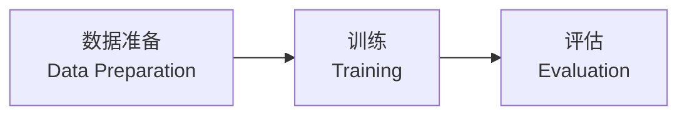

各阶段按顺序运行，前一阶段输出作为后一阶段输入。

### 数据准备

- 下载提示词数据
- 使用推理引擎对目标模型重新生成答案
- 构建 target cache（以默认 Qwen/Qwen3-4B 为例，约 38 TB）
- 需充分评估存储资源

### 训练

- 入口：`bash scripts/train/train.sh`
- 为每张可见 GPU 启动一个 worker
- 通过 `config_path` 在 `config/` 目录选择算法和目标模型
- 支持 `--opts` 覆盖单个配置字段
- 默认面向单节点 8 卡环境

### 评估

- 入口：`bash scripts/eval/eval.sh`
- 使用训练好的草稿模型 checkpoint 在多个基准任务上衡量接受情况

*(来源: wiki/ai/infrastructure/deepspec.md)*

### 支持的算法与模型

| 维度 | 支持项 |
|------|--------|
| 草稿模型 | DSpark、DFlash、Eagle3 |
| 目标模型 | Qwen3、Gemma |
| 评估数据集 | GSM8K、MATH500、AIME25、HumanEval、MBPP、LiveCodeBench、MT-Bench、Alpaca、Arena-Hard-v2 |

涵盖数学推理、代码生成、对话能力和综合问答。^[raw/articles/deepseek-dspark-jxz-2026.md]

---

**Related pages:** [[dspark]], [[deepseek]], [[deepseek-v4-pro]]

*(来源: wiki/ai/infrastructure/deepspec.md)*

### 1. 十类加速配置速查表（必背）

| # | 配置 | 定义位置 | 作用 | 何时开 / 代价 |
|---|---|---|---|---|
| 1 | `--enable-prefix-caching`（`enable_prefix_caching`） | `vllm/config/cache.py` | 自动前缀缓存：block 链式哈希复用历史 KV，跳过重复 prefill，降 TTFT | V1 默认开；多轮对话/长 system prompt 收益大；代价是哈希与内存管理开销，前缀不重复的负载无收益 |
| 2 | `--enable-chunked-prefill`（`enable_chunked_prefill`） | `vllm/config/scheduler.py` | 长 prefill 切块，与 decode 请求混批执行 | 长上下文场景稳 TBT/TPOT、提整体利用率；块大小受 `max_num_batched_tokens` 约束 |
| 3 | `--max-num-seqs` / `--max-num-batched-tokens` | `vllm/config/scheduler.py` | 每步最大并发序列数 / 最大 batch token 数，**吞吐-延迟主旋钮** | 调大提吞吐、单请求延迟上升；调小反之。压测时首先扫这两个 |
| 4 | `--gpu-memory-utilization` | `vllm/config/cache.py` | 显存预算比例（默认 0.9），决定 KV cache 池大小 | 调大 → KV 池大 → 可并发更多/更长请求 → 吞吐升；太大有 OOM 风险 |
| 5 | `--tensor-parallel-size` / `--pipeline-parallel-size` | `vllm/config/parallel.py` | TP 层内切分降单卡显存与延迟；PP 跨机流水 | TP 首选（NVLink 内）；PP 用于跨节点；另有 `--data-parallel-size`、MoE 的 expert parallel |
| 6 | `--quantization`（FP8/AWQ/GPTQ/…） | `vllm/config/model.py` | 权重/激活量化：显存减半、访存带宽减半 → decode 提速 | 精度换速度；KV cache 也可量化（`--kv-cache-dtype fp8`，`vllm/config/cache.py` 的 `cache_dtype`）|
| 7 | CUDA Graph：`compilation_config.cudagraph_mode`（`--compilation-config`、`--cudagraph-capture-sizes`） | `vllm/config/compilation.py`（枚举 NONE/PIECEWISE/FULL/FULL_DECODE_ONLY/FULL_AND_PIECEWISE） | 捕获整段 GPU 执行图消除 kernel launch 的 CPU 开销，decode 小 batch 收益显著 | V1 默认启用 piecewise；`FULL_DECODE_ONLY` 面向 PD 分离的 decode 实例；调试时才 `--enforce-eager` 关掉 |
| 8 | `--speculative-config`（JSON） | `vllm/config/speculative.py` | 投机解码：method 支持 `ngram`/`eagle`/`eagle3`/`mtp`/`medusa`/`suffix` 等 | 低并发、延迟敏感场景开；大 batch 下失效（见专题 02） |
| 9 | `--kv-transfer-config`（JSON） | `vllm/config/kv_transfer.py` | PD 分离/KV 卸载：`kv_connector`（NixlConnector、LMCacheConnectorV1、P2pNcclConnector、Mooncake pipe/store 等，注册表见 `vllm/distributed/kv_transfer/kv_connector/factory.py`）、`kv_role`（producer/consumer/both） | 大规模部署稳 TTFT/TPOT 干扰；单机不需要 |
| 10 | 结构化输出后端：`--structured-outputs-config`（backend=xgrammar/guidance/outlines） | `vllm/config/structured_outputs.py` | 约束解码后端选择与开销控制 | 见专题 03 |

其他值得一提：`--max-model-len`（截短上下文省 KV）、`--block-size`、`--swap-space`/CPU offload、`--scheduling-policy priority`、`--async-scheduling`（V1 异步调度）、torch.compile（`compilation_config.level`）。

*(来源: interview/interview-review/05-vLLM推理加速配置全景.md)*

### 2. 按目标选配置（面试组织答案的框架）

**目标一：降 TTFT** —— prefix caching（复用前缀）、chunked prefill（避免长 prefill 堵队）、PD 分离（prefill 专属资源）、KV 亲和路由（多实例，见专题 04）、量化（prefill 算力减负）。

**目标二：降 TPOT/单请求延迟** —— CUDA graph（消 launch 开销）、投机解码（EAGLE-3/DFlash）、量化（decode 是访存瓶颈，权重减半近似提速一倍）、TP（切分权重访存）。

**目标三：提吞吐** —— 调大 `max_num_seqs`/`max_num_batched_tokens`、`gpu_memory_utilization` 拉高 KV 池、KV cache FP8 量化（同显存装下更多请求）、chunked prefill 混批、MoE 用 EP/DP。

**记忆口诀（背）**："**缓存两个（prefix caching、KV 亲和）、批调度三个（chunked prefill、max-num-seqs、max-num-batched-tokens）、算得快三个（量化、CUDA graph、并行 TP/PP）、猜着算一个（speculative）、拆开算一个（PD 分离）。**"

*(来源: interview/interview-review/05-vLLM推理加速配置全景.md)*

### 3. PD 分离（面试官反问环节亲口提到他们在用）

Prefill 是 compute-bound、decode 是 memory-bound，混跑互相干扰（prefill 插队导致 decode 卡顿、TBT 抖动）。PD 分离把两阶段放到不同实例/集群，各自按特性配资源与并行策略，KV 经高速网络传输。

- vLLM 实现：`vllm/distributed/kv_transfer/`（README 讲三层抽象 KV Pipe → Lookup Buffer → Connector）；connector 有 `NixlConnector`（`kv_connector/v1/nixl_connector.py`）、`P2pNcclConnector`、LMCache、Mooncake（`kv_pipe/mooncake_pipe.py` + `kv_lookup_buffer/mooncake_store.py`）；示例 `examples/online_serving/disaggregated_prefill.sh`。
- Motor 侧：`MindIE-PyMotor/motor/coordinator/router/strategies/unified_pd.py`（PD 统一路由）、`motor/engine_server/core/vllm/vllm_config.py`（`_process_mooncake_connector` 配置 P/D producer/consumer）。
- Mooncake/DeepSeek 大规模实践：xPyD（多 prefill 多 decode）、Kimi K2 128×H200 部署 PD 分离 + 大规模 EP。

*(来源: interview/interview-review/05-vLLM推理加速配置全景.md)*

### 4. vLLM vs SGLang 对照（对方主用 SGLang，Q 反问已确认）

| 维度 | vLLM | SGLang |
|---|---|---|
| 前缀缓存 | block 哈希表（automatic prefix caching） | **RadixAttention**：radix tree 管理 KV，树上 LRU，多分支共享更灵活 |
| 结构化输出 | xgrammar/guidance 多后端 | xgrammar + **压缩 FSM jump-forward**（确定性段一次跳多 token） |
| 投机解码 | EAGLE/MTP/ngram/suffix（`vllm/v1/spec_decode/`） | Spec V1/V2 引擎，EAGLE-3/DFlash/MTP 集成快（DFlash 首发合作方） |
| 调度 | continuous batching + chunked prefill，V1 异步调度 | overlap scheduling（CPU 调度与 GPU 前向重叠）起步更早 |
| 生产栈 | production-stack（router/LMCache/K8s operator） | sgl-router（cache-aware，本工作区 `router/` 仓即同类 Rust 实现） |
| 共性 | PagedAttention 思想、CUDA graph、torch.compile、量化、PD 分离、Mooncake/NIXL 集成两家都有 |  |

一句话（背）："两家核心技术高度趋同，最常被点名的差异是 SGLang 的 RadixAttention 前缀缓存和更激进的 overlap 调度，vLLM 的优势是生态与 production-stack 周边；投机解码新方法（DFlash/DSpark）现在通常两家同步落地。"

*(来源: interview/interview-review/05-vLLM推理加速配置全景.md)*

### 5. 理想回答示范（Q17 满分版，可直接背）

> "分四层说。**缓存层**：`enable-prefix-caching` 开自动前缀缓存，多轮对话 TTFT 收益最大，多实例还要配前缀亲和路由。**批处理层**：`enable-chunked-prefill` 把长 prefill 切块和 decode 混批，稳 TBT；`max-num-seqs` 和 `max-num-batched-tokens` 是吞吐-延迟的主旋钮，压测先扫这两个；`gpu-memory-utilization` 拉高 KV 池提高并发上限。**计算层**：`quantization` 上 FP8/AWQ，decode 是访存瓶颈所以权重减半近似提速一倍，KV cache 也能 FP8；CUDA graph 消 kernel launch 的 CPU 开销，V1 默认 piecewise；`tensor-parallel-size` 在 NVLink 域内切大模型。**算法与架构层**：`speculative-config` 挂 EAGLE-3 或 MTP，低并发延迟敏感场景开、大 batch 会失效；更大规模用 `kv-transfer-config` 做 PD 分离，prefill/decode 各自扩缩。"

*(来源: interview/interview-review/05-vLLM推理加速配置全景.md)*

### 6. 参考链接

- vLLM 文档 Optimization & Tuning：docs.vllm.ai/en/latest/configuration/optimization.html
- vLLM engine args 全量：docs.vllm.ai/en/latest/serving/engine_args.html
- SGLang 文档：docs.sglang.ai（RadixAttention、Spec V2、hierarchical cache）
- DistServe（PD 分离开山论文，OSDI'24，arXiv:2401.09670）；Mooncake FAST'25（见专题 04）

*(来源: interview/interview-review/05-vLLM推理加速配置全景.md)*

### 1. 先分清两层"路由"（面试时先框定概念可以加分）

vLLM 生态里 "router" 至少指两类东西，面试官 Q8 问的是第一类，Q10 问的是第二类：

| 层次 | 项目 | 解决什么 | 决策依据 |
|---|---|---|---|
| **实例级路由**（同一模型多副本） | vllm-project/production-stack 的 vllm-router | 选哪个**副本**处理请求（KV 命中、负载） | 前缀哈希、LMCache 元数据、QPS、session |
| **模型级路由**（不同能力/成本的模型池） | vllm-project/**semantic-router** | 选哪个**模型**回答请求（强模型 vs 弱模型） | 请求语义：意图/领域/难度/安全信号 |

候选人做的 Motor KV 亲和调度属于第一类；面试官问的"强弱模型分发"属于第二类。

*(来源: interview/interview-review/06-vLLM-Router语义路由与强弱模型分发.md)*

### 2. vLLM Semantic Router：强弱模型分发怎么做（Q10 核心答案）

vllm-project/semantic-router（2025 年开源，2026 年发布白皮书《vLLM Semantic Router: Signal Driven Decision Routing for Mixture-of-Modality Models》，arXiv:2603.04444）是一个**信号驱动**的路由框架，整体分三步：

### 2.1 信号提取（Signal Extraction）
对每个请求并行提取十余种信号，从亚毫秒级启发式到神经分类器：
- **领域/意图分类**：轻量 embedding 分类器判断 math / code / 创意写作 / 事实问答等；
- **难度信号（complexity, τcpx）——强弱分发的关键**：用**对比式 embedding 分类器**。预先给每条规则准备两组例句：hard 集（多步推理题等）与 easy 集（简单事实查询等），初始化时算好例句 embedding；请求进来后计算查询 embedding 与两组例句的最大余弦相似度之差 δ = max sim(q, hard) − max sim(q, easy)，按阈值分为 easy / medium / hard（50–100ms 级）；
- 其他：语言、上下文长度、安全（jailbreak/PII）、是否需要事实核查、会话历史等。

### 2.2 决策引擎（Boolean 规则组合）
用可配置的布尔规则把信号组合成路由决策，例如（来自官方部署示例）：
- `domain: math AND complexity: hard` → DeepSeek-V3.2（高推理预算）
- `complexity: easy/medium` 的通用问答 → gpt-oss-120b（低推理预算）
- 简单算术 → 小模型低温直接答
- `keyword: jailbreak` → 直接拦截

### 2.3 模型选择与成本优化
匹配决策后，在该决策的候选模型集合里按"质量-成本"做选择，内置十余种选择算法（rating-based、对比式、级联 AutoMix、RL、延迟感知等），再由 endpoint router 选最便宜的 provider 端点。**难题给强模型 + 高推理预算，简单题给弱模型 + 低预算，在保持准确率的同时显著降成本。**

### 2.4 前沿方向
社区正在引入 **RADAR**（Reasoning-Ability and Difficulty-Aware Routing）式方法：用 IRT（项目反应理论）建模"查询难度 θ × 模型-预算能力 β"，从生产反馈持续更新难度估计，改善对分布外查询的泛化（semantic-router issue #1166）。相关同类工作：RouteLLM、AutoMix、级联推理（先小模型答，置信度低再升级到大模型）。

*(来源: interview/interview-review/06-vLLM-Router语义路由与强弱模型分发.md)*

### 3. 实例级路由对照：production-stack vllm-router

（与本工作区 `router/` 仓对应的开源项目；详细对照见专题 03。）`src/vllm_router/routers/routing_logic.py` 中注册的策略：
- `roundrobin`：轮询；
- `session`：按 session key 哈希做会话粘性；
- `prefixaware`（PrefixAwareRouter）：对请求体**字符/chunk 级哈希建 trie**，最长前缀匹配选实例——这正是候选人 Q8 说"vLLM Router 只做字符级匹配"的出处；
- `kvaware`（KvawareRouter）：查询 LMCache controller 的 KV 元数据，找持有最长前缀 KV 的实例，低于 `kv-aware-threshold`（默认 2000 token）回退 QPS 路由；
- `disaggregated_prefill`：PD 分离下分别路由 prefill/decode 实例。

*(来源: interview/interview-review/06-vLLM-Router语义路由与强弱模型分发.md)*

### 4. 理想回答（可直接背）

> "这属于模型级的语义路由，和我在 Motor 做的实例级 KV 亲和路由是两层。vLLM 社区对应的项目是 semantic-router：它对每个请求提取一组信号——意图领域分类、还有一个专门的**难度信号**：预先准备 hard/easy 两组例句的 embedding，拿请求 embedding 和两组比余弦相似度，差值超阈值就判为难题。然后用可配置的布尔规则把信号组合成决策：难的数学证明、多步推理走 DeepSeek/GPT-4 这类强模型并给高推理预算，简单事实问答走 8B 级小模型低预算，从而在准确率基本不降的情况下大幅省成本。再往深一层它还有级联和 RL 的模型选择算法，以及正在做的 IRT 难度建模。我们 Motor 目前只做了同模型多实例的 KV 亲和，这种按难度分发强弱模型的能力确实是值得引入的一层。"

（最后一句把"不了解"转化为"我知道它在整个栈里的位置"，展示系统视角。）

*(来源: interview/interview-review/06-vLLM-Router语义路由与强弱模型分发.md)*

### 5. 参考链接

- github.com/vllm-project/semantic-router；白皮书 arXiv:2603.04444 / vllm-semantic-router.com/white-paper.pdf
- github.com/vllm-project/production-stack（vllm-router 路由策略源码 `src/vllm_router/routers/routing_logic.py`）
- RouteLLM (arXiv:2406.18665)、AutoMix (arXiv:2310.12963)
- semantic-router issue #1166（RADAR 难度感知路由提案）

*(来源: interview/interview-review/06-vLLM-Router语义路由与强弱模型分发.md)*

### 0. 一图总览：三层架构与职责边界

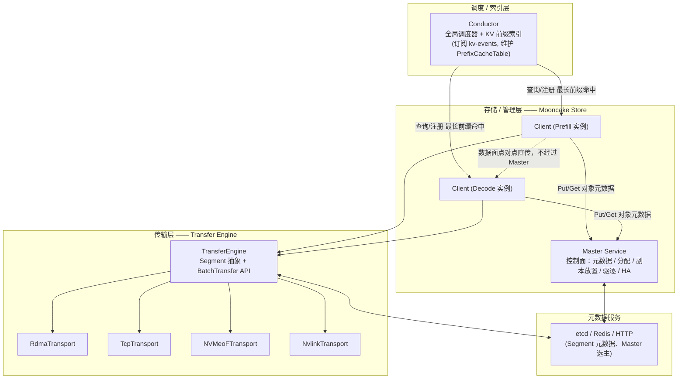

**关键设计判断（面试高频）：控制面与数据面分离**——Master 只管"这个 key 的 KV cache 在哪几个 Segment 上、状态如何"，真正的数据搬运（GB 级）完全由 Client 之间通过 Transfer Engine 点对点完成，不经过 Master、不占用 Master 的网络带宽。这也是为什么 Master 可以是单点瓶颈也不影响整体吞吐——它只做轻量的元数据操作。

---

*(来源: interview/interview-review/10-Mooncake传输引擎与存储管理深度拓展.md)*

### 1. 传输怎么做：Transfer Engine

### 1.1 两个核心抽象：Segment 与 BatchTransfer

源码：`mooncake-transfer-engine/include/transfer_engine.h`

- **Segment**：一段可被远程读写的连续地址空间。每个进程启动时自动创建一个以自己 `local_server_name` 命名的 **RAM Segment**，逻辑上覆盖整个虚拟地址空间；实际只有注册过的部分（**Buffer**）才能被 RDMA 访问。此外还有 **NVMeof Segment**，代表远端 NVMe 上可挂载的文件，用于 KV cache 落盘/取回。
- **BatchTransfer**：一次批量、异步的 Read/Write 请求集合，可以在一个 Segment 内的多段不连续地址和另一批 Segment 的对应地址间做同步，语义类似"更灵活的异步 AllScatter/AllGather"。

对应 C++ API（`TransferEngine` 类）核心调用序列：

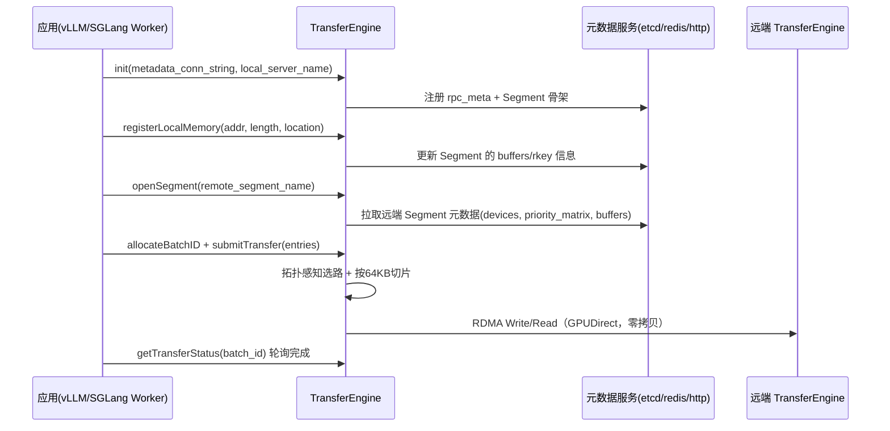

要点：

- **零拷贝**：无论是 RDMA（GPUDirect，网卡直接读写 GPU 显存）还是 NVMe-oF（PCIe 直连 NVMe 到 DRAM/VRAM），数据搬运都不经过 CPU 中转、不做 memcpy。
- **异步 + 批量**：`submitTransfer` 提交一批请求立即返回，通过 `getTransferStatus`/`getBatchTransferStatus` 轮询，天然适合把 KV cache 传输和 prefill 计算做 pipeline 重叠（论文里的 *streaming KVCache transfer*，逐层生成逐层传，不等全部算完再传）。

### 1.2 多协议后端：一套接口，多种传输介质

`Transport` 抽象出统一接口，具体实现按后端分文件：`rdma_transport/`、`tcp_transport/`、`nvmeof_transport/`、`nvlink_transport/`、`hip_transport/`（AMD ROCm）、`ascend_transport/`（华为昇腾 HCCL）、`efa_transport/`（AWS EFA）等。

| 场景 | 首选协议 | 特点 |
|---|---|---|
| 跨节点 DRAM ↔ DRAM/VRAM（主力） | RDMA (GPUDirect) | 绕过 CPU 和内核，微秒级延迟，多网卡可聚合带宽 |
| 无 RDMA 网络环境 | TCP | 通用兜底，走 socket，延迟高但无硬件依赖 |
| KV cache 落盘/取回 | NVMe-oF (cuFile/GDS) | PCIe 直连 NVMe 到 DRAM/VRAM，也是零拷贝 |
| 单机多卡 | NVLink / HIP IPC | 利用卡间高速互联，不走网卡 |
| 昇腾 NPU 集群 | Ascend Transport (HCCL) | vLLM-Ascend 集成用的就是它 |

同一份上层代码（Mooncake Store 的 Put/Get）不关心底层协议，`TransferEngine` 会根据 Segment 元数据里的 `protocol` 字段和内存位置自动选择合适的 `Transport` 实例——这正是"统一传输语义 API"的含义。

**补充：跨厂商异构加速卡场景下，为什么通用 RDMA 传输要"先落 DRAM 再转显存"？**

这是异构互联的通用限制，不是某家方案独有的取舍：同厂商加速卡之间（如 NVLink/NVSwitch，昇腾的 HCCS）有专用高速互联，网卡/互联控制器能直接读写对方的显存/HBM；但跨厂商场景下，通用 RDMA 网卡不一定拿得到目标加速卡显存的直接访问权限（没有对应的 GPUDirect/HBM-Direct 驱动支持），只能先把数据从源端 HBM 拷到本地 DRAM，再用 RDMA 把 DRAM 数据传到对端，对端再从 DRAM 拷回目标显存——多一次中转。

Mooncake 自己在**异构昇腾传输**（910B 做 Prefill、H20 做 Decode 的跨芯片场景）里就是这么处理的，见 `Mooncake/docs/source/design/transfer-engine/heterogeneous_ascend.md`：

```12:13:Mooncake/docs/source/design/transfer-engine/heterogeneous_ascend.md
The copy bandwidth from HBM to DRAM is constrained by the size of data blocks. Small
data blocks smaller than 2MB result in underutilized bandwidth. We have implemented
an optimization using "data aggregation + pipeline parallelism": first, small data
blocks are aggregated into 8MB blocks within HBM before being transferred to DRAM,
while data copying and RDMA transmission are executed in parallel.
```

关键优化点：HBM→DRAM 的拷贝带宽受数据块大小限制（小于 2MB 的小块利用率低），所以先在 HBM 内把小块聚合成 8MB 大块再转 DRAM，且**拷贝和 RDMA 传输并行执行**（流水线掩盖中转延迟），而不是拷完再传。这个"聚合+流水线"手法可以当作任何"需要中转的异构传输场景"的通用应对模板来记。

### 1.3 拓扑感知路径选择（Topology-Aware Path Selection）

这是 Transfer Engine 区别于"随便拿一张网卡传数据"的核心创新，源码见 `mooncake-transfer-engine/src/topology.cpp`。

**问题**：现代推理服务器有多 CPU 插槽、多 GPU、多 RDMA 网卡，如果传输时随意选网卡，数据要跨 UPI（跨 CPU 插槽互联）或 PCIe Switch 中转，带宽和延迟都会打折扣。

**做法**：

1. 节点启动时探测硬件拓扑（NUMA 节点、GPU、RDMA 网卡的 PCIe 挂载关系），生成一份**拓扑矩阵**并广播到集群（存入 etcd 的 Segment 元数据 `priority_matrix` 字段）；
2. 矩阵把每种内存类型（如 `cpu:0`、`cuda:0`）关联到一份 **preferred 网卡列表**和一份 **secondary 列表**：与该内存同 NUMA 节点/同 PCIe Switch 下的网卡进入 preferred；
3. 正常情况下只从 preferred 列表选网卡，保证 RDMA 走本地 NUMA 或本地 PCIe Switch 下的 GPUDirect 路径；只有链路故障时才降级用 secondary 列表；
4. 单次传输若超过 64KB，会被**切片**，不同分片可以走不同网卡路径，多网卡协同工作，实现带宽聚合。

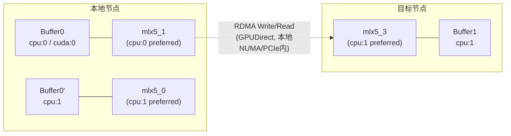

配套的**多网卡带宽聚合**：8×400Gbps 级别的网卡聚合带宽可以接近 DRAM 带宽，这也是论文里强调"当聚合带宽足够高时，跨节点复用 KVCache 比重新 prefill 更划算"的物理基础（LLaMA3-70B 场景下，前缀长度 8K 时只需约 6~19 GB/s 带宽即可打平，现代 RDMA 网络轻松提供 100+ GB/s）。

### 1.4 Endpoint 管理、连接池与故障处理

- **按需建连**：本地 RDMA 网卡与远端 RDMA 网卡之间的连接抽象为 **Endpoint**（内部含一个或多个 QP），Endpoint 在首次请求时才建立，不预先全连接。
- **连接池 + SIEVE 淘汰**：为防止 Endpoint 数量无限增长拖慢请求处理，Mooncake 对活跃连接数设上限，用 **SIEVE 算法**做淘汰（`MC_ENDPOINT_STORE_TYPE` 可选 `FIFO`/`SIEVE`，默认 `SIEVE`）。被淘汰/删除的 Endpoint 先进入等待队列，待其未完成的 in-flight 分片全部结束后再异步回收（避免正在传输的连接被误杀）。
- **故障自动切换**：链路失败时（网卡掉线、QP 出错），自动识别可用的备用路径重新提交请求到另一张 RDMA 网卡；出问题的 RDMA context/CQ 会被临时隔离，故障恢复后再重新纳入可用池——这是"自动 failover"能力的具体实现方式，不是简单重试。

### 1.5 元数据服务与关键运行参数

- Transfer Engine 自身也依赖一个轻量元数据服务（`etcd` / `redis` / `http`，见 `transfer_metadata_plugin.cpp`）来存 Segment 的地址、设备列表、`rkey`、拓扑矩阵等，这与 Mooncake Store Master 用 etcd 做高可用是两个独立但可共用的机制。
- 生产可调参数（环境变量，`MC_*`）覆盖了 QP 数量（`MC_NUM_QP_PER_EP`）、切片粒度（`MC_SLICE_SIZE`）、重试次数（`MC_RETRY_CNT`）、握手超时（`MC_HANDSHAKE_CONNECT_TIMEOUT`，防止连到已下线节点卡住整个内核 TCP 超时周期）、多网卡负载均衡（`MC_MLX5_QP_LAG_PORT_BALANCE`）等——面试如果被问"生产环境怎么调优"，可以提这几个方向：QP/CQ 规模、切片大小、握手超时、设备亲和性（`MC_ENABLE_DEST_DEVICE_AFFINITY`，rail-optimized 拓扑下优先选同名远端网卡减少 QP 数）。
- **实测性能**：论文给出 Transfer Engine 的 RDMA 传输比同类方案快约 **2.4×~4.6×**；官方 benchmark 单机可跑出 19.87 GiB/s（超过单卡网卡理论上限，说明多网卡聚合生效）。

---

*(来源: interview/interview-review/10-Mooncake传输引擎与存储管理深度拓展.md)*

### 2. 管理怎么做：Mooncake Store

### 2.1 Master（控制面）与 Client（数据面）分离

源码：`mooncake-store/src/master_service.cpp`（Master）、`mooncake-store/src/client_service.cpp`（Client）。

- **Master** 只做"账本"：对象元数据（key → 副本列表）、空间分配决策、副本放置策略、后台驱逐、Segment 上下线、HA 选主。所有操作走 RPC（`PutStart`/`PutEnd`/`GetReplicaList`/`BatchEvict` 等），本身不搬数据。
- **Client** 做"搬砖"：`Put`/`Get`/`BatchPut`/`BatchGet` 对象 API 的实际数据搬运，通过 Transfer Engine 与目标 Segment 点对点直传，不经过 Master。

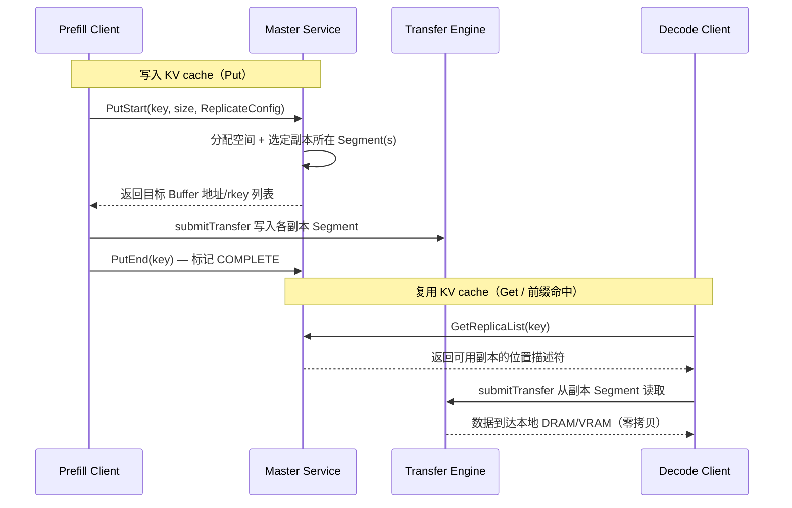

这套"两阶段提交"（`PutStart` 分配 + 写入 + `PutEnd` 确认完成）保证了并发场景下不会有 Client 读到"分配了但还没写完"的半成品数据——对应下面的副本状态机。

**补充：Master 元数据是全局一把锁，还是分片锁？**——是分片锁，且分片数量、路由方式都能在源码里精确核实。`master_service.h` 把对象元数据切成 **1024 个 shard**，每个 shard 有自己的 mutex，用 key 的哈希取模路由到对应分片，而不是一个全局锁串行化所有 Put/Get：

```1206:1235:Mooncake/mooncake-store/include/master_service.h
static constexpr size_t kNumShards = 1024;  // Number of metadata shards
...
std::array<MetadataShard, kNumShards> metadata_shards_;
```

```1372:1381:Mooncake/mooncake-store/include/master_service.h
return std::hash<std::string>{}(user_key) % kNumShards;
...
return std::hash<std::string>{}(key) % kNumShards;
```

文件头部注释里还规定了严格的**加锁顺序**（避免死锁）：`client_mutex_ → tenant_quota_policy_mutex_ → snapshot_mutex_ → metadata_shards_[shard_idx_].mutex → tenant_quota_shards_[shard_idx_].mutex → segment_mutex_`。这是典型的"哈希分片 + 分片锁降低锁竞争"设计，任何自建集群级 KV 元数据服务（不管是不是叫 Mooncake）大概率都会收敛到同一个模式——如果被问到"怎么设计一个能扛高并发的 KV 元数据服务"，这就是标准答案骨架：先按 key 哈希分片、每片一把锁，再考虑要不要在分片锁之前加一层布隆过滤器做"快速确定不存在"的短路判断（Mooncake 本身没做布隆过滤器这层，是可以主动提的优化点）。

### 2.2 对象模型：Key → Replica，Replica 状态机

源码：`mooncake-store/include/replica.h`。每个 key 对应一组 `Replica`，每个 Replica 有类型（`MEMORY` / `DISK` / `LOCAL_DISK` / `NOF_SSD`）和独立的状态机：

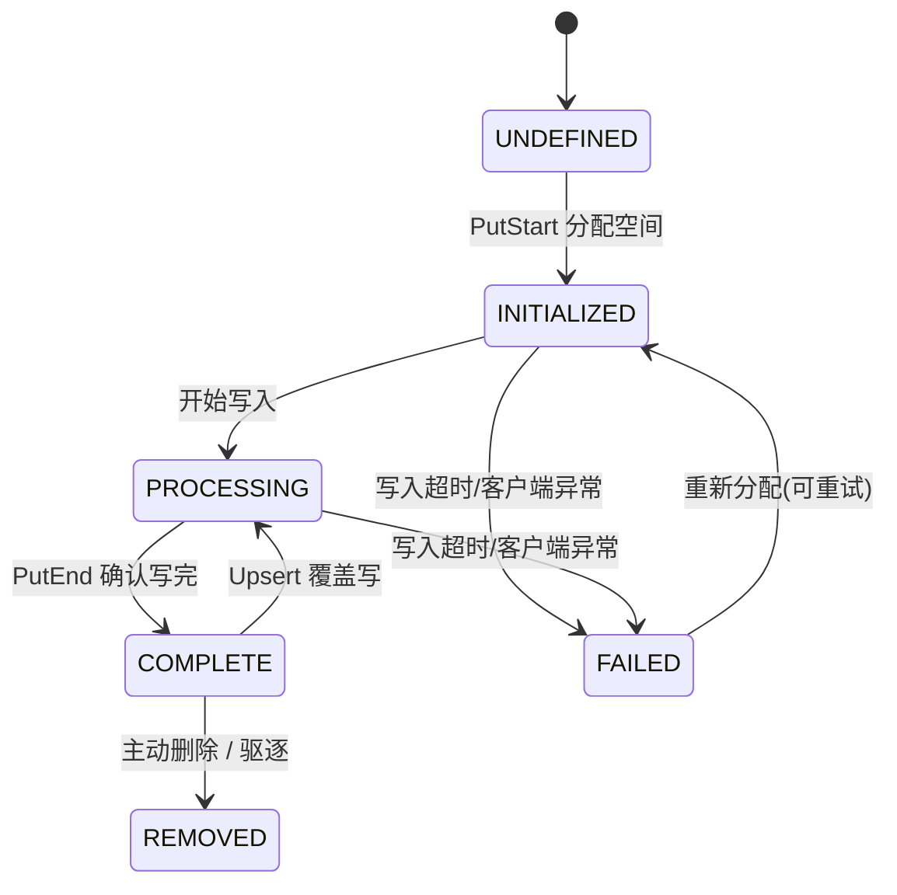

只有 `COMPLETE` 状态的副本才能被 `Get` 读取；`refcnt`（引用计数）在有请求正在读取该副本时 >0，驱逐器不会淘汰"正忙"（`is_busy()`）的副本，这是防止"读的时候被驱逐掉"竞态的关键机制。

### 2.3 副本策略：`ReplicateConfig`

- `replica_num` / `nof_replica_num`：DRAM 副本数、NVMe-oF SSD 副本数，可分别配置——冷数据可以只留 SSD 副本，热点数据加多个 DRAM 副本；
- `preferred_segments`：指定优先放置的 Segment（配合"就近部署"降低跨机传输）；
- `with_soft_pin` / `with_hard_pin`：软钉住（驱逐时最后考虑）/硬钉住（禁止驱逐，比如正在被多个下游引用的系统 prompt 前缀）；
- `group_ids`：把多个 key 分到一组，共享元数据路由、租约续期、驱逐行为的合并处理（减小大量小 KV block 时的元数据开销）。
- 三种写入模式 `ReplicaWriteMode`：`SINGLE_REPLICA`（单副本，最省资源）、`FLEXIBLE_DUAL_REPLICA`（DRAM+SSD 各一份，兼顾速度与成本）、`RELIABLE_MULTI_REPLICA`（任一维度 >1，追求可靠性/热点承载）。

**这就是论文里"热点 block 主动复制到多个节点、冷 block 换出"的落地方式**：Conductor/上层根据访问频率动态调整某个 key 的 `ReplicateConfig`（提高 `replica_num`，或去掉 soft pin 让它更快被淘汰）。

### 2.4 Segment 生命周期

源码：`mooncake-store/include/segment.h`。Segment 代表一台机器贡献出来的一块存储资源（DRAM/SSD），有独立状态机，支持**优雅下线**（不是直接拔线）：

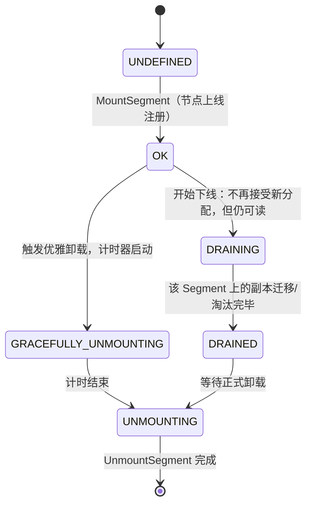

意义：扩缩容 Prefill/Decode 节点池时，可以先把某台机器标记 `DRAINING`，让它上面缓存的 KV cache 自然被读完/淘汰完，再安全下线，不会导致正在被引用的副本突然丢失。

### 2.5 驱逐策略：可插拔 + 后台批量执行

源码：`mooncake-store/include/eviction_strategy.h` + `master_service.cpp` 的 `BatchEvict`。

- **策略抽象** `EvictionStrategy`：`AddKey` / `UpdateKey`（访问时移到链表头，LRU 语义）/ `EvictKey`（从链表尾淘汰）。目前内置 `LRUEvictionStrategy`（最近最少使用）和 `FIFOEvictionStrategy`（先进先出，不响应访问更新）；Transfer Engine 的 Endpoint 池用的是 SIEVE（一种近似 LRU 但更省锁开销的算法，二者是不同层面的驱逐，不要混淆——一个淘汰"连接"，一个淘汰"数据对象"）。
- **触发方式**：Master 有后台线程周期性调用 `BatchEvict(evict_ratio_target, evict_ratio_lowerbound)`，把使用率降到目标水位以下；为避免一次淘汰太多打爆队列，每个周期只处理"淘汰队列上限的一部分"（`kEvictionBatchRatio` 之类的限流）。
- **保护机制**：`is_busy()`（refcnt>0，正被读）和 `with_hard_pin` 的副本永不进入淘汰候选；`with_soft_pin` 的副本优先级最低（最后淘汰）。

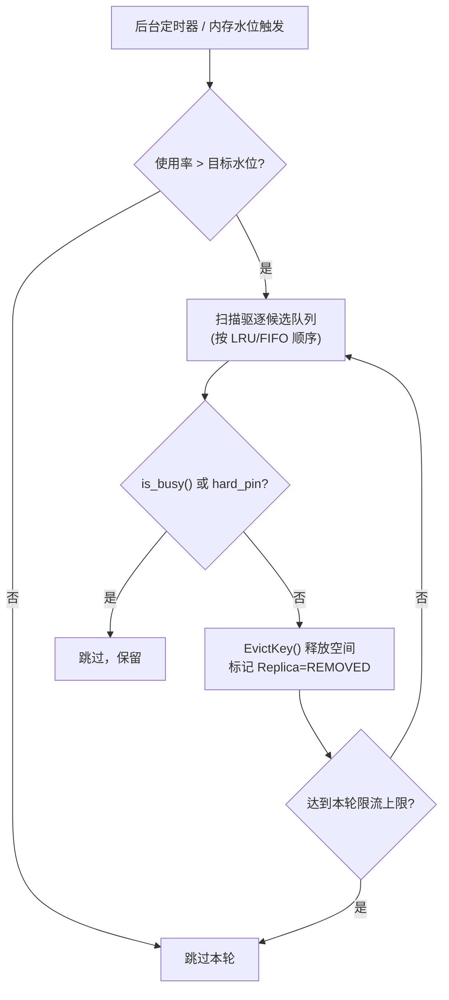

### 2.6 高可用（HA）

- **Master 选主**：多 Master 实例通过 etcd 做 leader 选举（`mooncake-store/src/ha/`，`MasterViewHelper::ElectLeader`），Client 和 Transfer Engine 通过 `Master 视图` 元数据感知当前 leader 地址；
- **故障恢复**：Master 重启/切主后，存活的 Client 会重新 `MountSegment` 把本地贡献的存储资源重新注册回新 Master；`CleanupStaleHandles` 之类的逻辑会清理属于已下线 Client 的 `LOCAL_DISK` 副本（通过对比"存活 client 集合"判断陈旧副本）；
- **快照**（源码里能看到 `snapshot` 相关测试）：Master 元数据可以做快照，加速故障后的状态恢复，避免全量重新扫描所有 Client。

---

*(来源: interview/interview-review/10-Mooncake传输引擎与存储管理深度拓展.md)*

### 3. 串联：一次 PD 分离 + 跨实例前缀命中的完整链路

结合专题 04 的 Conductor 调度视角，把"调度→传输→管理"串成一条完整时序：

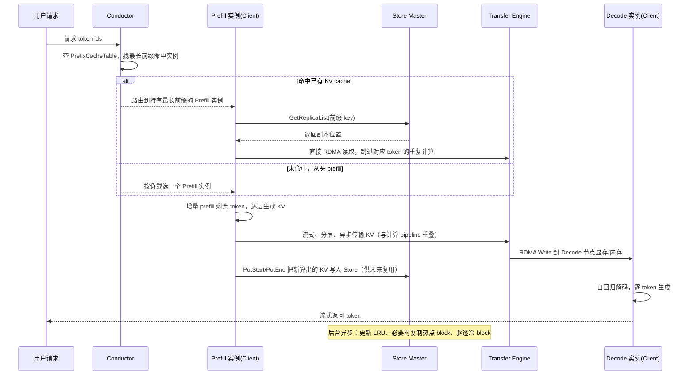

这张图把三个组件的分工说清楚：**Conductor 决定"去哪"，Master 决定"东西在哪、还能不能用"，Transfer Engine 负责"怎么把东西真正搬过去"**——面试被问"KV 亲和调度怎么落地到 Mooncake"时，这是最完整的回答骨架。

---

*(来源: interview/interview-review/10-Mooncake传输引擎与存储管理深度拓展.md)*

### 4. 面试高频问答（聚焦传输 + 管理，与 04 的一分钟版互补）

**Q1：Transfer Engine 为什么能做到零拷贝？**
> RDMA 场景下用 GPUDirect RDMA，网卡直接读写远端 GPU 显存/DRAM，不经过 CPU、不做 memcpy；NVMe-oF 场景下用 cuFile/GPUDirect Storage，数据从远端 NVMe 经 PCIe 直达本地 DRAM/VRAM，同样绕过 CPU。上层统一抽象成 Segment + BatchTransfer，屏蔽了协议差异。

**Q2：多网卡怎么聚合带宽，会不会传输时选错网卡导致跨 NUMA？**
> 每台机器启动时探测 NUMA/PCIe 拓扑生成矩阵，按内存位置（`cpu:0`/`cuda:0`）区分 preferred/secondary 网卡列表，正常只走 preferred（本地 NUMA 或本地 PCIe Switch 下的 GPUDirect 路径）；超过 64KB 的传输会切片，不同分片走不同网卡路径并行，从而聚合多网卡带宽；链路故障时降级用 secondary 列表并自动重试。

**Q3：Master 会不会成为单点瓶颈？**
> 不会，因为 Master 走的是控制面/数据面分离架构：Master 只处理元数据 RPC（`PutStart`/`GetReplicaList` 等，KB 级请求），真正的 GB 级数据搬运由 Client 间通过 Transfer Engine 点对点完成，完全不经过 Master。Master 本身也支持多实例 + etcd 选主做高可用。

**Q4：Mooncake Store 怎么决定一个 KV block 该不该保留多个副本？**
> 通过 `ReplicateConfig`：`replica_num`（DRAM 副本数）、`nof_replica_num`（SSD 副本数）可独立配置，配合 `with_soft_pin`/`with_hard_pin` 控制驱逐优先级。热点前缀可以配置更多副本分散读压力，冷数据降级到 SSD 副本甚至允许被驱逐。

**Q5：驱逐策略和淘汰时的一致性怎么保证？**
> Replica 有独立状态机（`INITIALIZED → PROCESSING → COMPLETE → REMOVED`），只有 `COMPLETE` 才可读；驱逐候选队列跳过 `refcnt>0`（正被读取/正忙）和 `hard_pin` 的副本，`soft_pin` 副本优先级最低但可淘汰。后台 `BatchEvict` 按批限流执行，避免一次性淘汰过多打爆系统。

**Q6：节点下线（扩缩容）时 KV cache 怎么处理，会不会数据丢失导致下游读失败？**
> Segment 有优雅下线状态机：`OK → DRAINING`（停止新分配但仍可读）→ `DRAINED`（副本迁移/淘汰完毕）→ `UNMOUNTING`。不是直接拔线，给了在用副本自然消耗完的窗口。

**Q7：RDMA 连接是不是一开始就全连接好？出故障怎么处理？**
> 按需建连（Endpoint 首次请求时才建立），用连接池 + SIEVE 算法限制活跃连接数上限，防止连接数无限增长拖慢请求处理；被淘汰的连接先进等待队列，未完成的分片传输完再回收。链路故障时自动切换到备用网卡重新提交请求，故障的 RDMA context/CQ 会被临时隔离直到问题解决。

**Q8'：Master 的元数据锁怎么设计才能扛住高并发 Put/Get？**
> 不能用一个全局锁串行化所有请求。Mooncake Master 实测是哈希分片方案：`kNumShards = 1024`，按 `hash(key) % 1024` 把对象元数据路由到 1024 个独立分片，每个分片有自己的 mutex，配合严格的加锁顺序规范（先 client_mutex_，再 shard mutex，最后 segment_mutex_）避免死锁。这是高并发 KV 元数据服务的标准解法；如果还要再优化，可以在分片锁前面加一层布隆过滤器做"快速判断一定不存在"的短路，省掉一次哈希和加锁开销（Mooncake 目前没有这一层）。

**Q8：Transfer Engine 和 Mooncake Store 是什么关系，能分开用吗？**
> Transfer Engine 是纯传输库（Segment + BatchTransfer 语义），可以独立拿来做点对点高速数据搬运（P2P Store 场景）；Mooncake Store 是在 Transfer Engine 之上加了一层对象管理（Master 元数据 + 副本 + 驱逐 + HA），提供 Put/Get 这种更高层的 KV cache 存取语义。类比：Transfer Engine 相当于"高速公路"，Mooncake Store 相当于"物流公司的调度和仓储系统"。

---

*(来源: interview/interview-review/10-Mooncake传输引擎与存储管理深度拓展.md)*

### 5. 参考

- 论文：《Mooncake: Trading More Storage for Less Computation — A KVCache-centric Architecture for Serving LLM Chatbot》FAST'25 最佳论文，arXiv:2407.00079
- 官方文档：kvcache-ai.github.io/Mooncake（Design → Transfer Engine / Mooncake Store / Conductor）
- 源码：工作区 `Mooncake/` 仓
  - 传输：`mooncake-transfer-engine/include/transfer_engine.h`、`src/topology.cpp`、`src/transport/`
  - 管理：`mooncake-store/include/{replica.h, segment.h, eviction_strategy.h}`、`src/master_service.cpp`、`src/client_service.cpp`、`src/ha/`
- 专题 04：`04-KV亲和调度与Mooncake专题.md`（Conductor 调度视角、Motor/router 对照、集成落地）

*(来源: interview/interview-review/10-Mooncake传输引擎与存储管理深度拓展.md)*

### 0. 结论速览表

| 维度 | vLLM | SGLang | 谁更"深" |
|---|---|---|---|
| Mooncake connector 代码位置 | **不在 vllm 仓库**，在 `Mooncake/mooncake-wheel/mooncake/mooncake_connector_v1.py`，靠 `kv_connector_module_path` 动态加载 | **在 sglang 仓库内**，`sglang/srt/disaggregation/mooncake/conn.py`，与 nixl/mori/ascend 并列注册 | SGLang |
| 多 backend 抽象 | 多个**独立 Connector 类**（`P2pNcclConnector`/`NixlConnector`/`LMCacheConnectorV1`/...），Mooncake 甚至不在默认注册表里 | 统一 `TransferBackend` 枚举 + `get_kv_class()` 工厂，`mooncake`/`nixl`/`mori`/`ascend`/`fake` 五个 backend 共享一套 `BaseKVManager/Sender/Receiver/BootstrapServer` 接口 | SGLang |
| PD 传输粒度 | **Block 级，等 Prefill 全部算完后一次性批量传所有层**（`wait_for_layer_load`/`save_kv_layer` 均为空实现） | **Page/chunk 级**，`enable_overlap` 时中间 chunk 边算边传（chunked-prefill 驱动的流式），最后一个 chunk 收尾 | SGLang（更接近论文里的流式思想） |
| 跨实例前缀缓存复用 | `MooncakeStoreConnector` 只有文档，**代码未在仓库中找到**；需要靠 `MultiConnector` 把它和 `MooncakeConnector` 拼在一起 | **HiCache 原生三级缓存树**（L1 GPU/L2 CPU/L3 Mooncake Store），`MooncakeStore` 是一等公民后端，且能**复用同一个 Transfer Engine 实例**（PD 用的和 HiCache 用的是同一个 C++ engine） | SGLang |
| 握手/建连 | Proxy 层 round-robin 配对 + 请求体里传 `kv_transfer_params`（ZMQ 传指针） | 专门的 **HTTP Bootstrap Server**（`CommonKVBootstrapServer`）做拓扑注册，再叠加 ZMQ 传 buffer 元数据，两阶段更规范 | SGLang |
| 路由层 cache-aware | 无，`vllm_v1_proxy_server.py` 就是 `itertools.cycle` 轮询 | Rust `sgl-model-gateway` 有 `PDSelectionPolicy::CacheAware`（近似前缀树 + 负载权衡），虽不直查 Mooncake 元数据，但路由层本身更成熟 | SGLang |
| 底层调用方式 | Python 包直调 C++（`mooncake.engine.TransferEngine`） | 同上，且 PD 与 HiCache **共享同一 engine 实例**，减少重复初始化 | 打平，SGLang 工程细节更精 |
| 容错/黑名单 | 有限（connector 层面的超时/重试） | `failed_sessions` 黑名单 + `send_probe` 探活恢复 | SGLang |

一句话总结：**两边都是薄薄一层 Python binding 包住同一个 C++ Transfer Engine，但 SGLang 把 Mooncake 深度产品化成了框架原生的可插拔组件（backend 抽象 + HiCache 三级树 + engine 复用），vLLM 更像是把 Mooncake 当第三方插件挂在外面，仓库里遗留的 Pipe/Store 原语已经没人用了**。

---

*(来源: interview/interview-review/11-Mooncake在vLLM与SGLang中的实现对比.md)*

### 1. 整体架构对比图

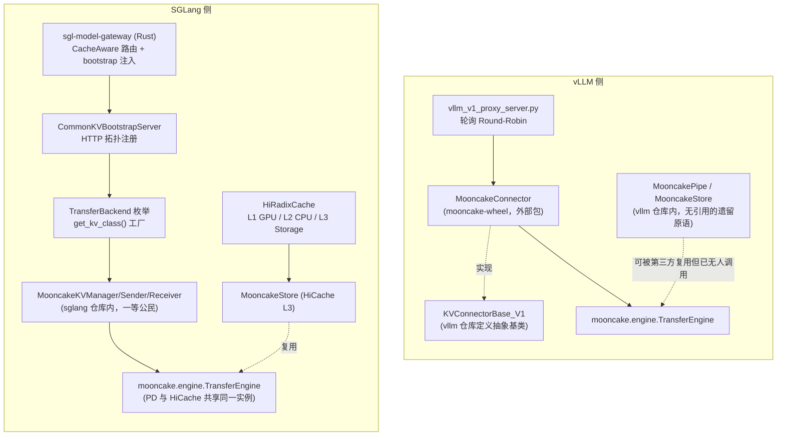

---

*(来源: interview/interview-review/11-Mooncake在vLLM与SGLang中的实现对比.md)*

### 2. 维度一：代码归属与可插拔性

### vLLM：Connector 在仓库外，仓库内是"死代码"

vLLM 仓库内与 Mooncake 相关的文件只有两个，且**均无任何调用方**：

```7:13:vllm/vllm/distributed/kv_transfer/README.md

*(来源: interview/interview-review/11-Mooncake在vLLM与SGLang中的实现对比.md)*

### Abstractions

The KV cache transfer contains three layer of abstractions:
- KV pipe: a FIFO pipe for torch.tensor transmission.
- KV lookup buffer: a lookup buffer for KV caches.
- KV connector: a connector that connects the KV pipe and KV lookup buffer to vLLM.
```

真正实现 `KVConnectorBase_V1` 接口、能跑起来的 `MooncakeConnector`，代码在 `Mooncake/mooncake-wheel/mooncake/mooncake_connector_v1.py`，靠启动参数动态 import：

```text
--kv-transfer-config '{"kv_connector":"MooncakeConnector",
                        "kv_role":"kv_producer",
                        "kv_connector_module_path":"mooncake.mooncake_connector_v1"}'
```

vllm 的 `KVConnectorFactory` 默认注册表里**根本没有 Mooncake**：

```146:192:vllm/vllm/distributed/kv_transfer/kv_connector/factory.py
KVConnectorFactory.register_connector("SharedStorageConnector", ...)
KVConnectorFactory.register_connector("P2pNcclConnector", ...)
KVConnectorFactory.register_connector("LMCacheConnectorV1", ...)
KVConnectorFactory.register_connector("NixlConnector", ...)
KVConnectorFactory.register_connector("MultiConnector", ...)
KVConnectorFactory.register_connector("OffloadingConnector", ...)
```

### SGLang：Mooncake 是内置 backend，和 nixl/mori/ascend 平级

`disaggregation/utils.py` 里的 `TransferBackend` 枚举和 `get_kv_class()` 工厂，把 mooncake/nixl/mori/ascend/fake 五个后端统一抽象成 `KVManager`/`KVSender`/`KVReceiver`/`KVBootstrapServer` 四个角色：

```409:467:sglang/python/sglang/srt/disaggregation/utils.py
class TransferBackend(Enum):
    MOONCAKE = "mooncake"
    MORI = "mori"
    NIXL = "nixl"
    ASCEND = "ascend"
    FAKE = "fake"

def get_kv_class(transfer_backend: TransferBackend, class_type: KVClassType):
    if transfer_backend == TransferBackend.MOONCAKE:
        from sglang.srt.disaggregation.mooncake import (
            MooncakeKVBootstrapServer, MooncakeKVManager,
            MooncakeKVReceiver, MooncakeKVSender,
        )
        class_mapping = {
            KVClassType.MANAGER: MooncakeKVManager,
            KVClassType.SENDER: MooncakeKVSender,
            KVClassType.RECEIVER: MooncakeKVReceiver,
            KVClassType.BOOTSTRAP_SERVER: MooncakeKVBootstrapServer,
        }
```

**面试话术**：vLLM 的多 connector 是"平铺的多个独立实现类"，谁想接入自己写一个 `KVConnectorBase_V1` 子类，Mooncake 只是其中一个外部实现；SGLang 是"统一角色接口 + backend 枚举"，Mooncake/NIXL/Mori/Ascend 四种硬件传输方案严格对齐同一套 Manager/Sender/Receiver/BootstrapServer 语义，切换 backend 只改一个配置项，代码结构更利于横向扩展新硬件（这也解释了为什么 SGLang 能更快接入 Ascend、Mori 等国产/新硬件后端）。

---

*(来源: interview/interview-review/11-Mooncake在vLLM与SGLang中的实现对比.md)*

### 3. 维度二：PD 传输粒度与流水线程度

### vLLM MooncakeConnector：Prefill 算完再传，Block 粒度，非分层流式

`wait_for_layer_load` / `save_kv_layer` 是 `KVConnectorBase_V1` 特意为"逐层流水线传输"开的口子（论文里"streaming KVCache transfer, overlap with incremental prefill"说的就是这个），但 Mooncake 的实现直接留空：

```javascript
// mooncake_connector_v1.py（摘要还原）
def wait_for_layer_load(self, layer_name: str) -> None:
    """MooncakeConnector does not do layerwise saving."""
    pass

def save_kv_layer(self, layer_name, kv_layer, attn_metadata, **kwargs):
    """MooncakeConnector does not save explicitly."""
    pass
```

真正的传输发生在 `request_finished`（prefill 全部完成）之后，一次性把所有层对应 block 的内存批量传走：

```python
# mooncake_connector_v1.py：按 block 拼 src/dst 地址，所有层一起传
for local_layer_addr, remote_layer_addr in zip(local_base_addr, remote_base_addr):
    for group_local_block_id, group_remote_block_id in zip(...):
        src_ptrs.append(local_layer_addr + group_local_block_id[0] * block_len)
        dst_ptrs.append(remote_layer_addr + group_remote_block_id[0] * block_len)
        lengths.append(block_len * len(group_local_block_id))
self.engine.batch_transfer_sync_write(remote_session, src_ptrs, dst_ptrs, lengths)
```

反而是 vLLM 自家的 `P2pNcclConnector` 才用上了逐层流水线（`save_kv_layer` 里每层生成即发送）——**这是本次对比里一个容易被问到的"反直觉点"：Mooncake 论文强调的分层流式，在 vLLM 的 MooncakeConnector 实现里反而没做，框架层的 hook 留空了。**

### SGLang：Chunked-Prefill 驱动的 Page 级流式（介于"全量批传"和"逐层流式"之间）

SGLang 走的是"按 chunk 边算边传"，不是逐层，是按 chunked-prefill 的 chunk 边界：

```705:709:sglang/python/sglang/srt/disaggregation/prefill.py
if self.enable_overlap:
    ...
    self.send_kv_chunk(req, last_chunk=False, end_idx=req.tmp_end_idx)
```

```657:657:sglang/python/sglang/srt/disaggregation/prefill.py
self.send_kv_chunk(req, last_chunk=True)
```

```mermaid
gantt
    dateFormat X
    axisFormat %s
    title vLLM 与 SGLang 的 PD 传输时机对比（示意，非真实耗时）
    section vLLM MooncakeConnector
    Prefill 全部 chunk 计算 :p1, 0, 10
    Prefill 完成后一次性 batch 传所有 block/所有层 :t1, 10, 14
    section SGLang mooncake backend
    Chunk1 计算 :sc1, 0, 3
    Chunk1 边算边传(overlap) :st1, 3, 5
    Chunk2 计算 :sc2, 3, 6
    Chunk2 边算边传(overlap) :st2, 6, 8
    最后 chunk 计算+收尾传输 :sc3, 6, 10
```

**面试话术**："Mooncake 论文里说的分层流式传输，实际在两个引擎的落地都打了折扣——vLLM 的 MooncakeConnector 是等 prefill 全部完成才批量传（block 粒度但不分层不 overlap）；SGLang 是按 chunked-prefill 的 chunk 粒度 overlap，比 vLLM 细一档，但也不是逐 transformer 层传输。真正做到'生成一层传一层'的是 vLLM 自家的 P2pNcclConnector，不是 MooncakeConnector。"

---

*(来源: interview/interview-review/11-Mooncake在vLLM与SGLang中的实现对比.md)*

### 4. 维度三：跨实例前缀缓存复用（Store 侧）

### vLLM：文档里有，代码在仓库里找不到，靠 MultiConnector 拼接

`MooncakeStoreConnector` 只在 Mooncake 官方文档里出现，vllm 和 mooncake-wheel 仓库里都没有找到对应 Python 类定义。官方推荐用法是把两个 connector 通过 `MultiConnector` 组合：

```json
{
  "kv_connector": "MultiConnector",
  "kv_role": "kv_producer",
  "kv_connector_extra_config": {
    "connectors": [
      {"kv_connector": "MooncakeConnector", "kv_role": "kv_producer"},
      {"kv_connector": "MooncakeStoreConnector", "kv_role": "kv_producer"}
    ]
  }
}
```

这说明在 vLLM 侧，"PD 点对点传输"和"跨实例前缀共享"是**两套完全独立、靠外部拼接的机制**，耦合度低但也意味着没有内建的智能协同（比如"这个 block 该走 P2P 直传还是从 Store 里捞现成的"这类判断，需要额外逻辑）。

### SGLang：HiCache 原生三级树，且和 PD 共享同一个 Engine

SGLang 的 `HiRadixCache` 把 GPU 显存（L1）、CPU host pool（L2）、远程存储（L3，可选 mooncake/nixl/hf3fs）统一成一棵树，`MooncakeStore` 是通过后端工厂注册的标准 L3 实现：

```205:209:sglang/python/sglang/srt/mem_cache/storage/backend_factory.py
StorageBackendFactory.register_backend(
    "mooncake",
    "sglang.srt.mem_cache.storage.mooncake_store.mooncake_store",
    "MooncakeStore",
)
```

更值得注意的细节：如果同一进程内已经因为 PD 分离初始化过 `MooncakeTransferEngine`（RDMA + P2PHANDSHAKE 配置匹配），HiCache 的 `MooncakeStore` 会**直接复用这个 engine 实例**，而不是各起一个：

```454:491:sglang/python/sglang/srt/mem_cache/storage/mooncake_store/mooncake_store.py
if (self._shared_mooncake_transfer_engine is not None
        and device_name == self._shared_mooncake_transfer_engine.get_ib_device()
        and self.config.metadata_server == "P2PHANDSHAKE"
        and self.config.protocol == "rdma"):
    transfer_engine = self._shared_mooncake_transfer_engine.get_engine()
    ...
    ret_code = self.store.setup(client_hostname, self.config.metadata_server,
                                 ..., transfer_engine)
```

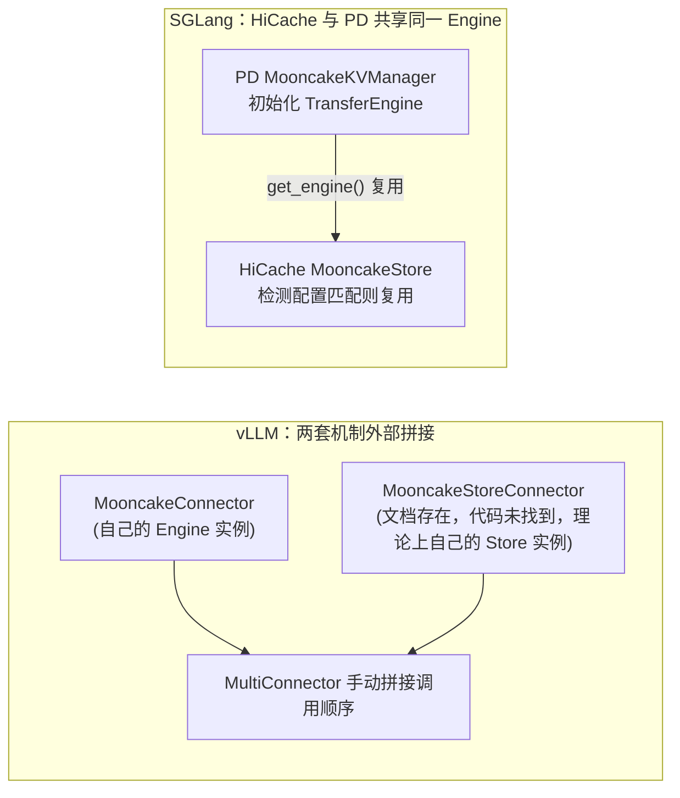

**面试话术**："这是两边工程成熟度差距最大的一点——vLLM 里 PD 传输和前缀共享是两个独立 connector，要用户自己拼 MultiConnector，且 Store connector 的代码我在仓库里没找到，可能还没完全 open source；SGLang 的 HiCache 是把 GPU/CPU/远程存储做成一棵统一的 radix tree，Mooncake Store 只是可插拔的 L3 backend之一，而且工程上做了'同进程复用同一个 Transfer Engine 实例'的优化，避免重复初始化 RDMA 资源。"

---

*(来源: interview/interview-review/11-Mooncake在vLLM与SGLang中的实现对比.md)*

### 5. 维度四：握手/建连机制

### vLLM：Proxy 撮合 + 请求体传元数据，无独立拓扑服务

`vllm_v1_proxy_server.py` 用 `itertools.cycle` 轮询选 Prefill/Decode 实例，Prefill 完成后把 `kv_transfer_params`（含 remote host/port）通过 HTTP 响应体传给 Proxy，再由 Proxy 转发给 Decode 请求：

```135:154:Mooncake/mooncake-wheel/mooncake/vllm_v1_proxy_server.py
def get_next_client(app, service_type: str):
    """Get the next client in round-robin fashion."""
    if service_type == "prefill":
        client_idx = next(app.state.prefill_iterator)
        return app.state.prefill_clients[client_idx]
    elif service_type == "decode":
        client_idx = next(app.state.decode_iterator)
        return app.state.decode_clients[client_idx]
```

没有独立的"拓扑注册中心"，P/D 实例的地址信息完全靠请求体里裹带的字段传递，本质是**请求级、无状态**的撮合。

### SGLang：专门的 HTTP Bootstrap Server 做拓扑注册，两阶段握手更规范

`CommonKVBootstrapServer` 是跑在 Prefill 节点上的独立 aiohttp 服务，Prefill 启动时主动注册自己的拓扑信息：

```390:407:sglang/python/sglang/srt/disaggregation/common/conn.py
def register_to_bootstrap(self):
    """Register prefill server info to bootstrap server via HTTP PUT."""
    url = f"{bootstrap_na.to_url()}/route"
```

Decode 侧先通过这个 HTTP 服务 `GET /route` 拿到目标 Prefill 的地址，再走 ZMQ 交换 GPU buffer 指针等运行时元数据，进入 `Bootstrapping → WaitingForInput → Transferring → Success` 状态机。这是标准的**两阶段握手**：HTTP 层做持久化拓扑发现（类似服务注册中心），ZMQ 层做每次请求的实时元数据交换。

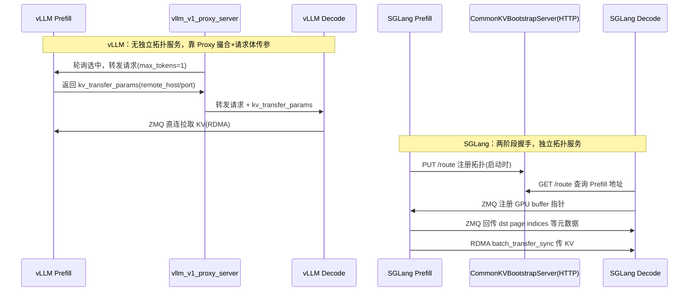

---

*(来源: interview/interview-review/11-Mooncake在vLLM与SGLang中的实现对比.md)*

### 6. 维度五：路由层的 Cache-Aware 能力

- **vLLM**：仓库内示例 Proxy（无论是通用的 `disagg_proxy_p2p_nccl_xpyd.py` 还是 Mooncake 专用的 `vllm_v1_proxy_server.py`）都是**纯轮询**，没有前缀感知调度；真正的 cache-aware 路由要靠外部系统（比如专题 04 提到的 Motor、production-stack router）在 Proxy 之上再加一层。
- **SGLang**：自带 Rust 实现的 `sgl-model-gateway`，`PDSelectionPolicy::CacheAware` 策略维护每个 worker 的近似前缀树，在 Prefill/Decode worker 选择时做**缓存命中与负载的权衡**（`cache_threshold`/`balance_abs_threshold` 等参数）。注意：这个 cache-aware 是 gateway **本地**的启发式树，并不直接查询 Mooncake Store 或 Conductor 的全局 KV 元数据——和专题 04 里 Motor 通过 Mooncake Conductor 查"真实"前缀命中的思路不同，是两种不同的亲和调度实现路线（本地近似树 vs 查询中心化 KV 索引）。

**面试话术**："如果被问 SGLang 和 vLLM 谁的路由更强，可以说 SGLang 自带的 gateway 已经内置 cache-aware 策略，但它本质是路由层自己维护的近似前缀树（类似专题 04 里对比的 vLLM production-stack router 的做法），并不是去查 Mooncake 的全局 KV 索引；vLLM 官方示例 Proxy 干脆没有 cache-aware，这块完全留给了上层调度系统（比如我们项目里的 Motor + Mooncake Conductor）去做。"

---

*(来源: interview/interview-review/11-Mooncake在vLLM与SGLang中的实现对比.md)*

### 7. 维度六：底层调用方式——共性远大于差异

两边**用的是同一个 Mooncake Python wheel**，没有本质区别：

```python
# vLLM MooncakeConnector / SGLang MooncakeKVManager 初始化方式几乎一致
from mooncake.engine import TransferEngine
engine = TransferEngine()
engine.initialize(...)  # 注册 rpc_meta、metadata server
engine.batch_register(ptrs, lens)          # 注册本地内存
engine.batch_transfer_sync(session_id, src_ptrs, dst_ptrs, lengths)  # 实际传输
```

HiCache/Store 侧也是同一套：

```python
from mooncake.store import MooncakeDistributedStore
store = MooncakeDistributedStore()
store.setup(local_hostname, metadata_server, global_segment_size, ...)
store.put(key, value_bytes)
store.get(key)
```

差异只在**谁调用得更"干净"**：SGLang 做了 engine 实例复用（PD 和 HiCache 共享），vLLM 的 `MooncakePipe`/`MooncakeStore` 原语和 `MooncakeConnector` 是两条不相干的调用路径（前者甚至已经是无人引用的遗留代码）。

---

*(来源: interview/interview-review/11-Mooncake在vLLM与SGLang中的实现对比.md)*

### 8. 面试高频问答

**Q1：Mooncake 在 vLLM 和 SGLang 里是不是同一份代码？**
> 底层 C++ Transfer Engine 和 Python wheel（`mooncake.engine`/`mooncake.store`）是同一份，但上层集成代码完全不同、各自维护：vLLM 的 `MooncakeConnector` 在 mooncake-wheel 仓库里按 vLLM 的 `KVConnectorBase_V1` 接口写了一份适配；SGLang 的 `MooncakeKVManager` 等在 sglang 仓库里按自己的 `BaseKVManager` 接口写了另一份适配。两份适配代码互不复用。

**Q2：为什么说 vLLM 的 Mooncake 集成"没有做到论文里的分层流式传输"？**
> vLLM v1 的 `KVConnectorBase_V1` 专门设计了 `wait_for_layer_load`/`save_kv_layer` 两个 hook 支持逐层流水线，但 `MooncakeConnector` 的实现是空函数，实际传输发生在 `request_finished`（prefill 全部完成）之后一次性批量传所有 block 所有层。反而是同仓库的 `P2pNcclConnector` 用上了这套逐层 hook。

**Q3：SGLang 的 chunked-prefill overlap 和"分层流式"是一回事吗？**
> 不是。SGLang 是按 chunked-prefill 的 chunk 边界（比如每 512/1024 token 一个 chunk）做 overlap，一个 chunk 算完就传，不等整个 prompt 算完；但一个 chunk 内部还是所有层一起传，粒度比"每个 transformer 层传一次"粗，比"prefill 全部完成再传"细，是中间态。

**Q4：跨实例前缀缓存复用，两边分别怎么做？**
> vLLM 官方文档给的方案是 `MooncakeConnector`（PD 传输）+ `MooncakeStoreConnector`（前缀共享）通过 `MultiConnector` 拼接使用，但 Store connector 的代码本身在公开仓库里没找到实现，成熟度存疑。SGLang 是把远程存储做成 `HiRadixCache` 的 L3 层，`MooncakeStore` 只是可插拔 backend 之一（还可以换成 nixl/hf3fs），且和 PD 用的 Transfer Engine 是同一个实例，工程上更完整。

**Q5：两边的 PD 握手机制有什么本质区别？**
> vLLM 靠一个无状态的 Proxy 轮询撮合 P/D，双方地址信息靠请求体传递；SGLang 有独立的 HTTP Bootstrap Server 做持久化的拓扑注册（类似服务发现），Decode 先查询再握手，是更规范的两阶段设计，也更容易扩展成支持异构 TP（SGLang 的 staging buffer 模式就依赖这套拓扑信息判断是否需要 gather-scatter）。

**Q6：两个引擎的路由层谁能做 KV 亲和调度？**
> SGLang 自带 Rust gateway 且内置 `CacheAware` 路由策略（本地近似前缀树）；vLLM 官方示例 Proxy 只有轮询，KV 亲和调度需要靠外部系统（生产中常见做法是接入 Mooncake Conductor 的全局前缀索引，或类似 Motor 的方案，见专题 04）。

---

*(来源: interview/interview-review/11-Mooncake在vLLM与SGLang中的实现对比.md)*

### 9. 关键文件速查表

| 引擎 | 组件 | 文件 |
|---|---|---|
| vLLM | KVConnector 抽象基类 | `vllm/vllm/distributed/kv_transfer/kv_connector/v1/base.py` |
| vLLM | Connector 工厂（无 Mooncake 默认注册） | `vllm/vllm/distributed/kv_transfer/kv_connector/factory.py` |
| vLLM | 遗留 Pipe 原语（无引用） | `vllm/vllm/distributed/kv_transfer/kv_pipe/mooncake_pipe.py` |
| vLLM | 遗留 Store 原语（无引用） | `vllm/vllm/distributed/kv_transfer/kv_lookup_buffer/mooncake_store.py` |
| vLLM | 逐层传输 hook（P2pNcclConnector 用，Mooncake 未用） | `vllm/vllm/attention/utils/kv_transfer_utils.py` |
| mooncake-wheel | 真正的 MooncakeConnector 实现 | `Mooncake/mooncake-wheel/mooncake/mooncake_connector_v1.py` |
| mooncake-wheel | vLLM 专用 Proxy | `Mooncake/mooncake-wheel/mooncake/vllm_v1_proxy_server.py` |
| SGLang | 多 backend 工厂 | `sglang/python/sglang/srt/disaggregation/utils.py` |
| SGLang | Mooncake PD 实现（Manager/Sender/Receiver） | `sglang/python/sglang/srt/disaggregation/mooncake/conn.py` |
| SGLang | Transfer Engine 封装（PD 与 HiCache 共享） | `sglang/python/sglang/srt/distributed/device_communicators/mooncake_transfer_engine.py` |
| SGLang | Bootstrap HTTP 服务 | `sglang/python/sglang/srt/disaggregation/common/conn.py` |
| SGLang | HiCache 三级树 | `sglang/python/sglang/srt/mem_cache/hiradix_cache.py` |
| SGLang | HiCache L3 Mooncake 实现 | `sglang/python/sglang/srt/mem_cache/storage/mooncake_store/mooncake_store.py` |
| SGLang | Cache-Aware 路由（Rust） | `sglang/sgl-model-gateway/src/policies/cache_aware.rs` |

---

*(来源: interview/interview-review/11-Mooncake在vLLM与SGLang中的实现对比.md)*

### 10. 参考

- 专题 04：`04-KV亲和调度与Mooncake专题.md`（Conductor 调度视角）
- 专题 10：`10-Mooncake传输引擎与存储管理深度拓展.md`（Transfer Engine / Store 底层机制）
- Mooncake 官方文档：`Mooncake/docs/source/getting_started/examples/vllm-integration/`、SGLang `docs/advanced_features/{pd_disaggregation,hicache_design}.md`
- 本文所有代码引用均来自工作区 `vllm/`、`sglang/`、`Mooncake/` 三个仓库的当前快照，行号可能随版本更新漂移，核心结论（架构差异）不受影响。

*(来源: interview/interview-review/11-Mooncake在vLLM与SGLang中的实现对比.md)*

### 目录

1. [背景：为什么 SGLang 要用 Radix Tree](#1-背景为什么-sglang-要用-radix-tree)
2. [核心数据结构](#2-核心数据结构)
3. [核心算法：match_prefix 与 insert](#3-核心算法match_prefix-与-insert)
4. [引用计数与驱逐（LRU/LFU/优先级）](#4-引用计数与驱逐lrulfu优先级)
5. [与调度器的结合：Cache-Aware 调度](#5-与调度器的结合cache-aware-调度)
6. [进阶特性：分页、EAGLE bigram、命名空间隔离、分层缓存](#6-进阶特性分页eagle-bigram命名空间隔离分层缓存)
7. [面试问答（14 题）](#7-面试问答14-题)
8. [一分钟总结话术](#8-一分钟总结话术)

---

*(来源: interview/sglang/12-SGLang-RadixTree原理与面试问答.md)*

### 1. 背景：为什么 SGLang 要用 Radix Tree

SGLang 论文（*"SGLang: Efficient Execution of Structured Language Model Programs"*, NeurIPS 2024）提出的 **RadixAttention** 机制，核心诉求是：多个请求之间只要共享同样的 token 前缀（system prompt、few-shot 示例、多轮对话历史、树状搜索的公共分支等），就应当复用已经计算好的 KV Cache，而不是重新做 prefill。

要做"任意请求间、任意长度前缀"的复用，本质上是一个**最长公共前缀（Longest Common Prefix, LCP）检索 + 动态插入**问题。相比朴素的哈希表（只能做整串匹配）或简单前缀树（Trie，逐 token 建节点导致树很深、指针开销大），**基数树（Radix Tree / Patricia Trie）**把只有单个子节点的链式路径压缩成一条边（存一段 token 序列），既能做前缀匹配，又比逐字符 Trie 节省大量节点数和内存。

在 SGLang 中，Radix Tree 的**边（edge）存的不是字符，而是一段 token id 序列**，对应的 **value 是这段 token 在 GPU KV Cache 内存池里的物理索引（indices）**。因此这棵树同时承担了两个角色：

- **索引结构**：token 序列 → KV cache 物理地址的映射，支持前缀查找、分裂、插入。
- **引用计数 / LRU 驱逐器**：每个节点还挂了 `lock_ref`、`last_access_time`、`hit_count` 等元数据，配合驱逐策略实现 KV Cache 显存的自动回收。

*(来源: interview/sglang/12-SGLang-RadixTree原理与面试问答.md)*

### 2. 核心数据结构

### 2.1 `RadixKey`：对 token 序列的轻量封装

```60:99:sglang/python/sglang/srt/mem_cache/radix_cache.py
class RadixKey:
    """is_bigram=True: token_ids holds raw tokens (N+1 for N bigrams); slices share one boundary token."""

    __slots__ = ("token_ids", "extra_key", "is_bigram", "limit")

    def __init__(
        self,
        token_ids: array[int],
        extra_key: Optional[str] = None,
        is_bigram: bool = False,
        limit: Optional[int] = None,
    ):
```

要点：

- 用 `array("q", ...)`（C 级别的 int64 数组）而不是 Python list 存 token_ids，`match()` 里用**指数探测 + 二分**在数组切片上找分歧点（167-196 行），避免逐 token 的 Python for 循环，是一处明显的性能优化。
- `extra_key`：命名空间隔离字段（比如 LoRA adapter id、cache salt），两个前缀相同但 `extra_key` 不同的请求，在树里永远不会共享节点（`_check_compatible` 强制校验）。
- `is_bigram`：给 EAGLE 投机解码用的"二元组视图"，同一份 `token_ids` 底层数组，逻辑上呈现成相邻 token 对 `(t_i, t_{i+1})` 的序列，零拷贝切换（`maybe_to_bigram_view`）。
- `limit`：允许"假装"数组被截断到某个长度而不做 O(n) 拷贝，用于 chunked prefill 场景。

### 2.2 `TreeNode`：树节点

```217:243:sglang/python/sglang/srt/mem_cache/radix_cache.py
class TreeNode:

    counter = 0

    def __init__(self, id: Optional[int] = None, priority: int = 0):
        self.children = defaultdict(TreeNode)
        self.parent: TreeNode = None
        self.key: RadixKey = None
        self.value: Optional[torch.Tensor] = None
        self.lock_ref = 0
        self.last_access_time = time.monotonic()
        self.creation_time = time.monotonic()

        self.hit_count = 0
        ...
```

- `children`：`Dict[child_key, TreeNode]`。`child_key` 是这条边第一个"逻辑单元"（1 个 token，或 `page_size` 个 token 组成的 tuple，见 `RadixKey.child_key`），用它做 O(1) 的孩子查找，而不是遍历比较。
- `key`：这条边上完整的 token 序列（`RadixKey`）。
- `value`：这段 token 对应的 GPU KV Cache **物理槽位索引**（`torch.Tensor`），插入/驱逐/分裂时都要跟 `key` 同步切分。
- `lock_ref`：**引用计数**。>0 表示正被某个正在运行的请求占用，禁止被驱逐（GC 里的"根可达"思路）。
- `last_access_time` / `hit_count` / `creation_time` / `priority`：分别服务于 LRU / LFU / FIFO / 优先级驱逐策略。
- `evicted` 属性：`self.value is None`，即该节点的 KV Cache 已被换出/驱逐，但节点结构（key）可能仍保留用于分层缓存（HiCache）场景做占位。

### 2.3 树的整体形态

- **根节点** `root_node` 的 `key` 是空序列，`lock_ref=1`（永远不会被驱逐），代表空前缀。
- 每条从根到某节点的路径拼接起来，就是一个被缓存过的 token 前缀；`value` 拼接起来就是这段前缀对应的 KV Cache 索引。
- 与教科书 Radix Tree 的差异：这里不要求"每个内部节点至少两个孩子"的强压缩不变式——只有匹配和插入过程中动态调用 `_split_node` 时才会分裂，其余保持懒惰。

*(来源: interview/sglang/12-SGLang-RadixTree原理与面试问答.md)*

### 3. 核心算法：match_prefix 与 insert

### 3.1 `match_prefix`：找最长公共前缀

```648:672:sglang/python/sglang/srt/mem_cache/radix_cache.py
def _match_prefix_helper(self, node: TreeNode, key: RadixKey):
    ...
    child_key = key.child_key(self.page_size)

    value = []
    while len(key) > 0 and child_key in node.children.keys():
        child = node.children[child_key]
        child.last_access_time = access_time
        prefix_len = child.key.match(key, page_size=self.page_size)
        if prefix_len < len(child.key):
            new_node = self._split_node(child.key, child, prefix_len)
            value.append(new_node.value)
            node = new_node
            break
        else:
            value.append(child.value)
            node = child
            key = key[prefix_len:]
            if len(key):
                child_key = key.child_key(self.page_size)

    return value, node
```

逐步过程：

1. 用请求 token 序列的首个"逻辑单元"作为 `child_key` 做 O(1) 孩子查找。
2. 找到孩子后，调用 `RadixKey.match()`（167-196 行的指数探测二分）算出这条边上实际共享了多少 token。
3. 三种情况：
   - **完全不匹配**（`child_key` 都不在 `children` 里）：循环终止，当前 `node` 就是匹配终点。
   - **部分匹配**（`prefix_len < len(child.key)`）：这条边比请求前缀长，说明匹配"卡在边的中间"，必须调用 `_split_node` 把这条边从中间切开，生成一个新的中间节点作为精确匹配边界。
   - **完全匹配这条边**（`prefix_len == len(child.key)`）：把 `key` 前进 `prefix_len`，继续往下一层孩子走。
4. 沿途收集每条边的 `value`（KV indices），最后 `torch.cat` 拼成一段连续索引，直接可以喂给 attention kernel。

**这个函数有副作用**：如果匹配点落在某条边中间，会真的执行一次树结构分裂（`_split_node`），这是"以后来的访问模式精细化树结构"的设计——不是纯只读查询。

### 3.2 `_split_node`：把一条边从中间切断

```674:694:sglang/python/sglang/srt/mem_cache/radix_cache.py
def _split_node(self, key: RadixKey, child: TreeNode, split_len: int):
    # new_node -> child
    new_node = TreeNode(priority=child.priority)
    new_node.hit_count = child.hit_count
    new_node.children = {key[split_len:].child_key(self.page_size): child}
    new_node.parent = child.parent
    new_node.lock_ref = child.lock_ref
    new_node.key = child.key[:split_len]
    new_node.value = child.value[:split_len].clone()
    child.parent = new_node
    child.key = child.key[split_len:]
    child.value = child.value[split_len:].clone()
    new_node.parent.children[key.child_key(self.page_size)] = new_node
    ...
    return new_node
```

`原父 -> child` 变成 `原父 -> new_node -> child`：`new_node` 拿走公共前缀部分的 key/value，`child` 收缩成剩余后缀部分。这一步保持 `lock_ref`、`hit_count`、`priority` 在分裂前后语义一致（新节点继承旧节点的这些属性，因为它代表"共享前缀，本来就应该被算作曾经命中过/被引用过"）。

### 3.3 `insert`：写入新前缀

`_insert_helper`（704-757 行）逻辑和 `match_prefix` 高度对称：沿着树往下走，遇到公共前缀不完全匹配的边就分裂，走到头如果还有剩余 token，就新建一个叶子节点挂上去，同时维护 `evictable_size_`（可驱逐 token 数统计）和 `hit_count`（分裂/复用时 `_inc_hit_count`）。

**为什么 `match_prefix` 和 `insert` 要各自独立实现类似逻辑，而不是复用同一份代码？** 因为 `insert` 在末尾需要"新建叶子节点、更新可驱逐大小、发驱逐事件"，而 `match_prefix` 只做只读查询 + 必要的分裂，语义不同，强行合并会让分支判断变复杂，牺牲可读性，SGLang 选择保持两份对称但独立的实现。

一个直观例子（源码文件末尾自带的 demo，`__main__` 部分）：依次插入 `[1,2,3]`、`[1,2,3]`（重复）、`[1,2,4,5]`、`[1,2,4,5,6,7]`、`[8,9,10,11,12]` 后，树会长成：

```
[1,2] --- [3]
      \-- [4,5] --- [6,7]
[8,9,10,11,12]
```

之后查询 `[1,2,3,13,14]` 会匹配到 `[1,2,3]` 这个节点，返回 3 个 token 对应的 KV indices。

*(来源: interview/sglang/12-SGLang-RadixTree原理与面试问答.md)*

### 4. 引用计数与驱逐（LRU/LFU/优先级）

### 4.1 `lock_ref`：防止正在使用的 KV Cache 被驱逐

```592:626:sglang/python/sglang/srt/mem_cache/radix_cache.py
def inc_lock_ref(self, node: TreeNode) -> IncLockRefResult:
    ...
    while node != self.root_node:
        if node.lock_ref == 0:
            self.evictable_size_ -= len(node.key)
            self.protected_size_ += len(node.key)
            delta -= len(node.key)
        node.lock_ref += 1
        self._update_leaf_status(node)
        node = node.parent
    return IncLockRefResult(delta=delta)
```

一个请求正在使用某个节点代表的前缀时，会从该节点**一路往根节点回溯**给每个祖先 `lock_ref += 1`（因为祖先的 KV Cache 也是这个请求依赖的一部分）。只有 `lock_ref == 0` 的节点才会被从"可驱逐"转移到"受保护"的统计桶里。请求结束时 `dec_lock_ref` 做对称的回收。这本质上是一种**引用计数式的树上传播保护**。

### 4.2 驱逐：只淘汰叶子，按策略选择淘汰顺序

```563:590:sglang/python/sglang/srt/mem_cache/radix_cache.py
def evict(self, params: EvictParams) -> EvictResult:
    ...
    leaves = list(self.evictable_leaves)
    eviction_heap = [
        (self.eviction_strategy.get_priority(node), node) for node in leaves
    ]
    heapq.heapify(eviction_heap)

    num_evicted = 0
    while num_evicted < num_tokens and len(eviction_heap):
        _priority, x = heapq.heappop(eviction_heap)
        self.token_to_kv_pool_allocator.free(x.value)
        num_evicted += len(x.value)
        self._delete_leaf(x)
        if len(x.parent.children) == 0 and x.parent.lock_ref == 0:
            new_priority = self.eviction_strategy.get_priority(x.parent)
            heapq.heappush(eviction_heap, (new_priority, x.parent))
        ...
```

关键设计点：

- **只能驱逐叶子节点**（`evictable_leaves` 集合，由 `_update_leaf_status` 维护），因为内部节点的 KV Cache 是其所有子孙共享的前缀，删了会破坏树结构；用最小堆按策略优先级弹出。
- 驱逐一个叶子后，如果它父节点因此变成"无孩子且未被锁定"的新叶子，立即把父节点也推入堆——**级联驱逐**，从叶子往根方向层层回收，直到凑够需要驱逐的 token 数或堆空。
- 驱逐策略是可插拔的 `EvictionStrategy`（`evict_policy.py`）：`LRUStrategy`（默认，按 `last_access_time`）、`LFUStrategy`（按 `hit_count`）、`FIFO` / `MRU` / `FILO`、`PriorityStrategy`（业务优先级 + LRU 兜底）、`SLRUStrategy`（分段 LRU，命中次数到阈值前后区别对待，防止"一次性大请求"把长期热点前缀冲刷掉）。堆的排序 key 就是 `get_priority(node)` 返回的元组，天然支持多级排序。

*(来源: interview/sglang/12-SGLang-RadixTree原理与面试问答.md)*

### 5. 与调度器的结合：Cache-Aware 调度

Radix Tree 不只是被动的缓存，还**反向影响调度顺序**。`schedule_policy.py` 里定义了：

```139:152:sglang/python/sglang/srt/managers/schedule_policy.py
class CacheAwarePolicy(Enum):
    """Scheduling policies that are aware of the tree cache."""
    LPM = "lpm"  # longest prefix match
    DFS_WEIGHT = "dfs-weight"  # depth-first search weighting

class CacheAgnosticPolicy(Enum):
    """Scheduling policies that are not aware of the tree cache."""
    FCFS = "fcfs"  # first come first serve
    LOF = "lof"  # longest output first
    RANDOM = "random"
    ROUTING_KEY = "routing-key"
```

**LPM（Longest Prefix Match）策略**：调度器在等待队列里，优先把与"当前正在运行 batch"或"彼此之间"共享最长前缀的请求排到一起调度。直觉：把共享前缀的请求安排在临近的时间窗口执行，能最大化利用刚被计算出来、还未被驱逐的 KV Cache，减少重复 prefill；`DFS_WEIGHT` 则用树的深度优先遍历顺序做批次内的局部性优化。这也是为什么代码里专门维护了一棵 `self.waiting_queue_radix_tree = RadixCache.create_simulated()`（177 行左右）——**给等待队列单独模拟一棵树**，用于估计"批内前缀共享"，和真正持有 KV Cache 的主 radix tree 是分开的两棵树，避免相互脏写。

`match_prefix_for_req` 把每个请求的 token 序列丢进主树查询，写回 `req.prefix_indices`（命中的 KV indices）与 `req.last_node`（匹配终点节点），后续 `cache_unfinished_req` / `cache_finished_req` 会用这个 `last_node` 做 `inc_lock_ref`/`dec_lock_ref` 的配对操作。

*(来源: interview/sglang/12-SGLang-RadixTree原理与面试问答.md)*

### 6. 进阶特性：分页、EAGLE bigram、命名空间隔离、分层缓存

- **Page-aligned（分页对齐）**：当 `page_size > 1`（Paged Attention 场景），所有 key 在参与树操作前都会 `key.page_aligned(page_size)`，把长度向下取整到 `page_size` 的倍数，`child_key()` 也从"单 token"变成"一个 page 内多个 token 组成的 tuple"。这让 Radix Tree 天然兼容按页管理的 KV Cache 分配器，代价是前缀匹配粒度从 token 级降到 page 级。
- **EAGLE 投机解码的 bigram 视图**：EAGLE draft 模型是基于"相邻 token 对"训练的，`RadixKey.maybe_to_bigram_view` 让同一棵树在不改变底层存储的前提下，把 key 解释成 bigram 序列参与匹配，`match()`/`child_key()` 内部都对 `is_bigram` 分支做了相应处理。
- **`extra_key` 命名空间隔离**：给 LoRA adapter id、cache salt 等场景使用，保证"token 前缀相同但语义上下文不同"的请求不会错误共享 KV Cache（`RadixKey._check_compatible` 强制两个 key 的 `extra_key` 一致才能比较/合并）。
- **优先级感知驱逐**：`priority` 字段沿插入路径取 max 向上传播（`_insert_helper` 118 行左右），配合 `PriorityStrategy`，可以让高优先级会话（如付费用户/系统级 prompt）的前缀更难被驱逐。
- **分层缓存 HiRadixCache**（`hiradix_cache.py`，未在本文详细展开）：在这棵 GPU 侧 radix tree 之上叠加 CPU/磁盘（甚至远程存储，如 `storage/hf3fs`、`lmc_radix_cache.py` 对接 LMCache）多级缓存，`TreeNode.host_value`/`host_ref_counter`/`write_through_pending_id` 这几个字段就是为分层缓存预留的：GPU 驱逐后先"写透"到 host，`host_ref_counter` 保护 host 侧副本不被过早清理。

*(来源: interview/sglang/12-SGLang-RadixTree原理与面试问答.md)*

### 7. 面试问答（14 题）

**Q1. 为什么 SGLang 选择 Radix Tree（基数树）而不是普通 Trie 或哈希表来做前缀缓存？**

A：哈希表只能做"整串精确匹配"，无法支持"任意长度公共前缀"的复用；逐 token 建节点的普通 Trie 能做前缀匹配，但当大部分路径是单分支链时会产生大量只有一个孩子的节点，浪费内存和指针跳转开销。Radix Tree 把这些单分支链压缩成一条边（一个 `TreeNode.key` 存一段 `RadixKey`），既保留了前缀匹配能力，又把节点数降到"分叉点的数量级"。在 SGLang 里边上挂的 `value` 直接是 GPU KV Cache 的物理索引，所以这棵树本质上是"token 序列 → KV Cache 索引"的压缩前缀索引 + 引用计数驱逐器的合体。

**Q2. `match_prefix` 的时间复杂度是多少？如果请求前缀长度是 N，最坏情况会怎样？**

A：从根往下走，每一层用 `child_key` 做哈希查找（`node.children[child_key]`）是 O(1) 均摊；层数最多等于树的深度，深度上界是 min(前缀长度, 分叉点数量)。真正比较 token 是否相同的开销在 `RadixKey.match()` 里，用的是指数探测（倍增窗口）+ 二分定位分歧点，单次匹配复杂度是 O(log L)（L 是共享前缀长度）而不是 O(L)，因为底层比较用的是 C 级别的数组切片相等判断（`t0[lo:hi] != t1[lo:hi]`），一次覆盖一大段。所以整体近似 O(层数 × log(每层匹配长度))，远好于逐 token Python 循环。

**Q3. `match_prefix` 为什么会修改树结构（`_split_node`）？只读查询为什么会有副作用？**

A：因为匹配点可能落在某条边的中间——比如树里已经有 `[1,2,3,4,5]` 这条边，新请求前缀是 `[1,2,3,9]`，公共前缀长度是 3，但这条边长度是 5，3 < 5，说明"匹配点在边内部"。如果不做任何处理，就没有一个真实节点能代表"恰好匹配了 3 个 token"这个位置，无法把这一段的 `value`（KV indices）单独返回，也无法在后续 `insert` 里挂接新分支。所以 `match_prefix` 必须把这条边从中间切断（`_split_node`），生成一个精确对应"3 个 token"边界的新节点。这是"查询顺便优化/精细化树结构"的设计，之后同样前缀的查询会更快命中，无需重复分裂。

**Q4. `insert` 和 `match_prefix` 的核心循环逻辑几乎一样，为什么不复用同一个函数？**

A：两者共同点是都要"沿树往下走、遇到部分匹配的边就分裂"，但收尾语义不同：`match_prefix` 到达匹配终点就返回（只读，不新建节点）；`insert` 到达终点后，如果 key 还有剩余 token，需要新建叶子节点、更新 `evictable_size_`、触发 `hit_count` 自增、发 KV cache 事件（`_record_store_event`）。强行合并成一个函数会让分支判断和返回值语义变得复杂，牺牲可读性和可维护性；保持对称但独立的两份实现，是可读性优先于 DRY 的取舍。

**Q5. `TreeNode.lock_ref` 是干什么的？为什么要一路传播到根节点？**

A：`lock_ref` 是引用计数，表示这个节点代表的 KV Cache 片段当前正被多少个"正在处理中"的请求占用。当一个请求匹配/插入到某个节点时，会调用 `inc_lock_ref(node)`，从这个节点开始沿 `parent` 指针一路加到根，因为该请求的完整 KV Cache 依赖是从根到这个节点的整条路径，任何一段祖先边被驱逐都会破坏这个请求当前占用的 KV Cache。只有 `lock_ref == 0` 的节点才会被记入 `evictable_size_` 并进入可驱逐候选（`evictable_leaves`）。请求结束后调用 `dec_lock_ref` 做对称回收。这是一种"树上传播型引用计数"，类似 GC 里对象图的可达性保护，但方向是从叶子到根。

**Q6. 驱逐（evict）为什么只能对叶子节点做，不能直接驱逐一个内部节点？**

A：内部节点的 `value`（KV Cache）是它所有子孙共享的公共前缀部分，如果直接删除内部节点，会让所有子孙丢失一段自己也依赖的 KV Cache，且树的连通性也会被破坏（子孙的 parent 指针悬空）。所以只有叶子节点——没有任何后代依赖它——才能安全释放。SGLang 用 `evictable_leaves` 这个集合精确维护"当前可驱逐的叶子候选"，驱逐一个叶子后，如果它的父节点因此变成新的空孩子叶子（且未被锁定），立即级联地把父节点也推进驱逐堆，从而实现"自底向上"整段链路的连锁回收。

**Q7. 驱逐策略支持哪些？如果要新增一种驱逐策略（比如"按 token 数加权的 LFU"），该怎么改？**

A：`evict_policy.py` 定义了一个抽象基类 `EvictionStrategy`，只要求实现 `get_priority(node) -> 可比较对象`（返回值可以是元组，堆按元组字典序排序）；已有 `LRUStrategy`（`last_access_time`）、`LFUStrategy`（`(hit_count, last_access_time)`）、`FIFO`/`MRU`/`FILO`、`PriorityStrategy`（业务优先级优先，同优先级内按 LRU）、`SLRUStrategy`（分段 LRU，命中次数越过阈值的节点进入"受保护段"，减少一次性大请求把长期热点冲刷掉的"缓存污染"问题）。要新增策略：继承 `EvictionStrategy`，实现 `get_priority`，在 `utils.py` 的 `_EVICTION_POLICY_FACTORIES` 字典里注册一个策略名字符串即可，`RadixCache.evict()` 里的驱逐主循环完全不需要改动——典型的策略模式（Strategy Pattern）。

**Q8. SGLang 的调度器如何利用 Radix Tree 来优化批处理调度？**

A：`schedule_policy.py` 定义了 Cache-Aware 的 `LPM`（Longest Prefix Match）和 `DFS_WEIGHT` 两种策略：核心想法是"把彼此共享较长前缀的等待请求尽量安排到相邻的调度批次里"，这样刚被前一个请求计算出来、还驻留在 GPU 显存里的 KV Cache 段，能被后一个请求直接复用，减少重复 prefill 计算和显存换入换出。为了估计"等待队列内部彼此的前缀重叠度"，调度器额外维护了一棵独立的模拟树 `waiting_queue_radix_tree = RadixCache.create_simulated()`，与真正持有 KV Cache 物理索引的主树分开，避免相互干扰；再结合 `FCFS`/`LOF`/`RANDOM`/`ROUTING_KEY` 等 Cache-Agnostic 策略做兜底或与优先级调度混合。

**Q9. `RadixKey` 里的 `extra_key` 字段是做什么的？为什么前缀相同的两个请求可能不共享节点？**

A：`extra_key` 是一个命名空间标签，典型场景是多 LoRA 服务（不同 adapter id）、或者需要按 cache salt/版本号强制隔离的请求。即使两个请求的 token 序列完全相同，只要 `extra_key` 不同，`RadixKey._check_compatible` 会在比较/匹配时直接抛异常拒绝合并，`child_key()` 也会把 `extra_key` 编码进哈希 key（`(extra_key, plain)` 元组），保证它们在树里天然落到不同分支，不会发生"用错 LoRA 权重算出来的 KV Cache 被其他 adapter 复用"这类正确性问题。

**Q10. 如果开启了 Paged Attention（`page_size > 1`），Radix Tree 的匹配/插入逻辑要做哪些调整？**

A：所有参与树操作的 key 先做 `page_aligned(page_size)`：把有效长度向下取整到 `page_size` 的整数倍，多余的尾部 token 不进树（由调用方在 `cache_finished_req`/`cache_unfinished_req` 里单独 free 或保留在 `req.prefix_indices` 里）。`child_key()` 从"单个 token"变成"一个 page 内 `page_size` 个 token 组成的 tuple"，保证子节点查找仍是 O(1) 哈希；`RadixKey.match()` 返回的公共前缀长度也会向下取整到 `page_size` 的倍数（`(matched_tokens // page_size) * page_size`）。效果是前缀复用的粒度从"token 级"降到"page 级"，与底层显存分配器的分页粒度保持一致。

**Q11. EAGLE 投机解码为什么要在 Radix Tree 上做"bigram 视图"？具体怎么实现的？**

A：EAGLE 的 draft 模型是以"相邻 token 对（bigram）"为单位建模的，需要 Radix Tree 按 bigram 粒度做前缀匹配和存储，而不是按单 token。SGLang 没有为此复制一份新的 key 表示，而是让 `RadixKey` 带一个 `is_bigram` 标志位：`token_ids` 依然是原始 token 数组（长度 N+1 对应 N 个 bigram），`__len__`/`__iter__`/`__getitem__`/`match`/`child_key` 内部按 `is_bigram` 分支，把逻辑索引重新解释成"滑动窗口 (t_i, t_{i+1})"序列，例如切片 `[start:stop)` 个 bigram 对应原始 token 的 `[start, stop+1)` 区间。这是**零拷贝**的视图切换（`maybe_to_bigram_view` 只是翻转一个布尔标志），避免为投机解码单独维护一棵树或复制 token 数组的开销。

**Q12. 分层缓存（HiCache/HiRadixCache）是怎么和这棵 GPU 侧 Radix Tree 配合的？**

A：`TreeNode` 里预留了 `host_value`（CPU/host 侧的 KV Cache 副本）、`host_ref_counter`（host 侧引用计数，`protect_host`/`release_host`）、`write_through_pending_id`（写透 CPU 的异步任务 id）、`hash_value`（每个 page 的内容哈希，用于跨实例/跨层对接远程存储如 HF3FS、LMCache 时做内容寻址）这几个字段。基本流程是：GPU 侧节点被驱逐前，先异步"写透"到 host 内存或更远的存储层，`host_ref_counter` 保护这份 host 副本在写透完成前不被过早清理；之后如果同样前缀被再次请求命中但 GPU 侧已无副本，可以从 host/远程存储层加载回 GPU（`init_load_back`），减少一次完整的 prefill 重算。这套字段是"同一份 `TreeNode` 元数据，同时描述多级存储位置"的设计，而不是为每一级存储单独建一棵树。

**Q13. 为什么根节点 `root_node` 的 `lock_ref` 初始化为 1，`priority` 初始化为 `-sys.maxsize`？**

A：`lock_ref=1` 保证根节点永远不会因为引用计数归零而被当作可驱逐候选（虽然驱逐逻辑本身也只处理叶子，根节点一般不是叶子，但这仍是一层防御性保护，且 `dec_lock_ref` 的循环条件是 `while node != self.root_node`，根节点的 `lock_ref` 语义上不需要真实递减）。`priority=-sys.maxsize` 是因为 `_insert_helper` 里节点的 `priority` 是沿路径取 `max` 向上传播/覆盖的（"任何经过这条路径的真实优先级都应该覆盖初始值"），根节点作为所有路径的公共起点，必须给一个"绝对最小"的哨兵值，才不会因为它意外地限制或影响真实业务优先级的传播语义。

**Q14. 这套设计和 vLLM 的 Prefix Caching（PagedAttention + Hash-based Block）相比，核心差异是什么？**

A：vLLM 早期版本用的是"按固定 block 做内容哈希，哈希表存 `hash(block content) -> block id`"的方案，本质上是**块级、哈希表**结构，只能做"整块"粒度的精确复用，且对哈希冲突/顺序依赖（前面 block 内容变化会级联改变后面 block 的哈希）要专门处理。SGLang 的 Radix Tree 是**树形、变长边**结构，天然支持"任意 token 边界"的最长前缀匹配（`page_size=1` 时甚至能精确到单 token 边界），不依赖内容哈希做等值比较（除非开启分层缓存做跨实例内容寻址时才用 `hash_value`），且用引用计数 + 可插拔驱逐策略统一管理树上任意节点的生命周期。两者都是为了解决同一个问题（前缀复用换取减少重复 prefill），Radix Tree 的匹配粒度更细、结构更紧凑，但实现复杂度（分裂、级联驱逐、树上传播锁）也明显更高。

*(来源: interview/sglang/12-SGLang-RadixTree原理与面试问答.md)*

### 8. 一分钟总结话术

> SGLang 用 Radix Tree 实现 RadixAttention：树的每条边存一段 token 序列，`value` 是这段 token 在 GPU KV Cache 里的物理索引；`match_prefix` 靠"逐层哈希查孩子 + 指数探测二分找分歧点"在近似 O(层数×log L) 内找到最长公共前缀，匹配点落在边中间时会现场分裂节点；每个节点带 `lock_ref` 引用计数（沿路径传播到根，保护正在使用的前缀不被驱逐）和 `last_access_time`/`hit_count`/`priority` 等元数据，配合可插拔的 LRU/LFU/优先级驱逐策略，只淘汰叶子并支持级联回收；调度器额外用一棵模拟树做 LPM（最长前缀匹配）策略，把共享前缀的请求调度到相邻批次以提升缓存命中率；此外通过 `extra_key` 做多租户/LoRA 隔离、`page_aligned` 适配 Paged Attention、`is_bigram` 视图零拷贝支持 EAGLE 投机解码、`host_value`/`host_ref_counter` 字段为分层缓存（HiCache）预留扩展点。

*(来源: interview/sglang/12-SGLang-RadixTree原理与面试问答.md)*

## 面试要点

**专题 05：vLLM 推理加速配置与技术全景（重点补齐）**

# 专题 05：vLLM 推理加速配置与技术全景（重点补齐）

> 对应失分题：Q17——"有哪些配置能起到加速效果？"候选人一个都没说出来，是全场最严重失分。
> 本文所有配置名均在工作区 `vllm/` 仓核实（定义文件在 `vllm/config/` 下，CLI 映射在 `vllm/engine/arg_utils.py`）。

---

*(来源: interview/interview-review/05-vLLM推理加速配置全景.md)*

**专题 06：vLLM Router 语义路由与强弱模型分发**

# 专题 06：vLLM Router 语义路由与强弱模型分发

> 对应失分题：Q10——"vLLM Router 会按语义/任务难度分发强弱模型，它怎么做到的？"候选人完全没答上。
> 本文覆盖：vLLM 生态里"路由"的两层含义、semantic-router 的强弱模型分发机制、以及可背的理想回答。

---

*(来源: interview/interview-review/06-vLLM-Router语义路由与强弱模型分发.md)*

**专题 10：Mooncake 深度拓展 —— Transfer Engine 怎么传、Mooncake Store 怎么管**

# 专题 10：Mooncake 深度拓展 —— Transfer Engine 怎么传、Mooncake Store 怎么管

> 与专题 04（`04-KV亲和调度与Mooncake专题.md`）的关系：04 讲清楚了"KV 亲和调度为什么需要 Mooncake、Motor 怎么用 Conductor 的索引"，本篇是 04 第 4 章的**放大镜**——只聚焦两个问题：
> 1. **Transfer Engine 如何把一段 KV cache 从 A 机器搬到 B 机器**（传输机制、协议、选路、容错）；
> 2. **Mooncake Store 如何管理这些 KV cache 对象**（元数据、副本、生命周期、淘汰、高可用）。
>
> 所有结论均可在工作区 `Mooncake/` 源码中核实，关键路径已标注文件名。图表用 Mermaid 绘制。

---

*(来源: interview/interview-review/10-Mooncake传输引擎与存储管理深度拓展.md)*

**专题 11：Mooncake 在 vLLM 与 SGLang 中的集成异同（源码级对比）**

# 专题 11：Mooncake 在 vLLM 与 SGLang 中的集成异同（源码级对比）

> 承接专题 04/10。本文基于工作区 `vllm/`、`sglang/`、`Mooncake/`（含 `mooncake-wheel`）三个仓库的**实际源码**，逐项对比两大推理引擎如何"用"Mooncake。核心结论先说：**两者底层都调用同一份 `mooncake` Python wheel（`mooncake.engine.TransferEngine` + `mooncake.store.MooncakeDistributedStore`），但工程集成的成熟度和设计理念明显不同**——SGLang 把 Mooncake 当作原生一等公民、可插拔 backend 深度整合进仓库；vLLM 把 Mooncake 当作外部 connector，仓库内只留了旧版 Pipe/Store 原语，真正的 connector 实现在 `mooncake-wheel` 独立包里动态加载。

---

*(来源: interview/interview-review/11-Mooncake在vLLM与SGLang中的实现对比.md)*

**SGLang RadixAttention / Radix Tree 原理精讲与面试问答**

# SGLang RadixAttention / Radix Tree 原理精讲与面试问答

> 源码全部核实自本工作区 `sglang/` 仓库（核心文件 `python/sglang/srt/mem_cache/radix_cache.py`，
> 配套文件 `base_prefix_cache.py`、`evict_policy.py`、`managers/schedule_policy.py`）。
> 定位：面向"大模型推理"方向面试，考察对 SGLang **前缀缓存复用（Prefix Caching）**核心数据结构的理解深度。

*(来源: interview/sglang/12-SGLang-RadixTree原理与面试问答.md)*

## 源文件索引

- wiki/ai/infrastructure/mooncake.md — Mooncake 分布式 KV 传输框架
- wiki/ai/infrastructure/nvidia-dynamo.md — NVIDIA Dynamo 推理框架
- wiki/ai/infrastructure/clowder-ai.md — Clowder AI 多智能体编排平台
- wiki/ai/infrastructure/deepspec.md — DeepSpec 全栈投机解码训练框架
- interview/interview-review/05-vLLM推理加速配置全景.md — 专题 05：vLLM 推理加速配置与技术全景（重点补齐）
- interview/interview-review/06-vLLM-Router语义路由与强弱模型分发.md — 专题 06：vLLM Router 语义路由与强弱模型分发
- interview/interview-review/10-Mooncake传输引擎与存储管理深度拓展.md — 专题 10：Mooncake 深度拓展 —— Transfer Engine 怎么传、Mooncake Store 怎么管
- interview/interview-review/11-Mooncake在vLLM与SGLang中的实现对比.md — 专题 11：Mooncake 在 vLLM 与 SGLang 中的集成异同（源码级对比）
- interview/sglang/12-SGLang-RadixTree原理与面试问答.md — SGLang RadixAttention / Radix Tree 原理精讲与面试问答
