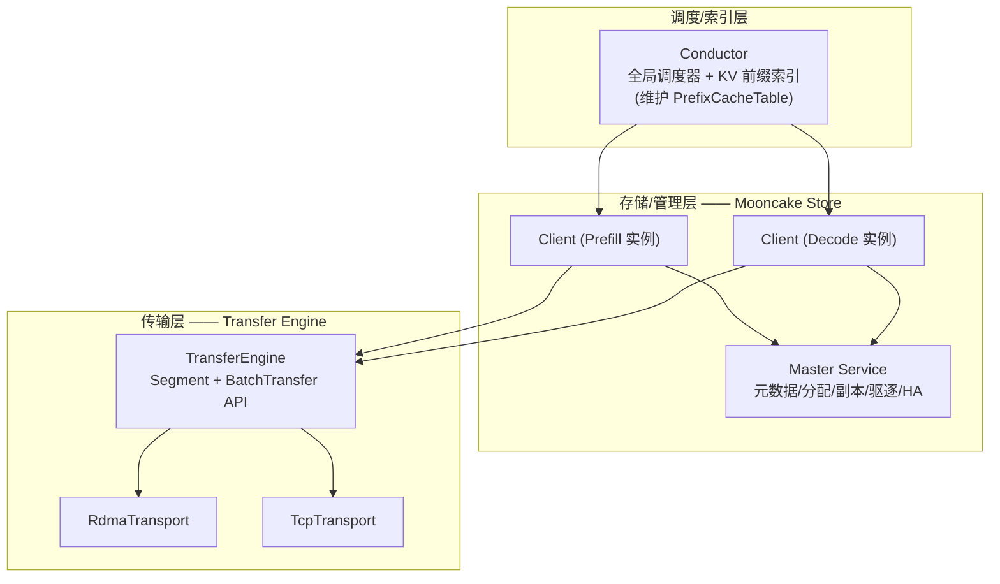

# 推理框架对比
> 覆盖 28 个知识点 | 来源 12 个文件 | 更新于 2026-07-15

## 1. 一句话总结
推理框架生态围绕“如何高效利用 GPU 显存与算力”展开：vLLM 以生产级生态与自动前缀缓存见长，SGLang 以 RadixAttention 基数树和激进的 overlap 调度领先，NVIDIA Dynamo 面向智能体原生工作负载、用统一 cost 路由与 KVBM 分层存储取代外挂路由，Mooncake 则作为独立分布式 KV 传输/存储中间件被各大引擎集成。核心竞争维度集中于前缀缓存粒度、路由亲和度（近似 vs 精确）、PD 分离实现、投机解码成熟度和生态完备性。

## 2. 核心原理
### 2.1 问题背景
LLM 推理面临两大瓶颈：一是 Prefill 阶段为 compute-bound，Decode 阶段为 memory-bound，混合部署时相互争抢资源导致延迟抖动；二是多用户、多轮对话中大量存在可复用的文本前缀（如 system prompt、few-shot 示例），若不共享 KV Cache 会造成重复计算和显存浪费。此外，大规模集群中如何将请求路由到当前持有其所需 KV Cache 的实例，是降低首 token 延迟（TTFT）的决定性因素。

### 2.2 方案概述
推理框架通过**前缀缓存**（自动识别并复用相同 token 前缀的 KV Cache）、**PD 分离**（将 Prefill 和 Decode 拆分到不同实例/集群，各自按特性配资源）、**KV 亲和路由**（基于缓存状态选择最优处理实例）、**投机解码**（用廉价模型猜多个 token 并一次验证）、**量化压缩**（降低权重/激活精度以节省显存和带宽）等技术，在保持模型精度的前提下大幅提升吞吐、降低延迟。其中，像 Mooncake 这类中间件专门负责 KV Cache 的网络传输和分级存储，使 Prefill 和 Decode 节点能够解耦、KV 数据在集群内零拷贝共享。

## 3. 实现细节
### 3.1 前缀缓存：哈希表 vs 基数树
#### vLLM 自动前缀缓存
- 基于 block 内容哈希，将 KV cache 块组成链式哈希表。
- 命中时直接跳过对应 token 的 prefill 计算，降 TTFT。
- V1 默认开启，通过 `--enable-prefix-caching` 控制；代价是哈希计算与内存管理开销，对无前缀重复的负载无效。

#### SGLang RadixAttention
- 使用 **Radix Tree（基数树）** 替代哈希表：边存储 token 序列，`value` 指向 GPU KV Cache 物理索引。
- 支持**最长公共前缀匹配**（`match_prefix`），可在任意 token 边界复用，匹配粒度更细（page size=1 时可精确到单 token）。
- 树上集成了 LRU/LFU/优先级驱逐策略和引用计数（`lock_ref`），天然支持多分支共享（如树状搜索的公共路径）。
- `extra_key` 支持 LoRA 隔离；`is_bigram` 为 EAGLE 投机解码提供零拷贝视图。

**关键代码路径**：`sglang/python/sglang/srt/mem_cache/radix_cache.py`（RadixTree 实现）、`hiradix_cache.py`（分层缓存 HiCache）。

#### NVIDIA Dynamo KVBM
- 采用 **KV Block Manager (KVBM)** 分层存储：G1 Device（GPU 本地）、G2 Host（CPU 锁页内存）、G3 Disk（本地 NVMe，NIXL 写入）、G4 Remote（跨节点远端存储，NIXL 传输）。
- 路由时通过 `overlap_credit` 折算各层的命中收益，从而在 cost 函数中统一亲和与负载，不依赖外部前缀索引。

### 3.2 路由与亲和调度：从近似到精确
| 方案 | 代表框架 | 实现方式 | 数据源 | 精确度 |
|------|----------|----------|--------|--------|
| **近似路由 (Approximate)** | vLLM Router, SGLang cache_aware, AIBrix | 本地维护字符/请求粒度的前缀树或哈希，记录“历史命中”信息；失衡时回退到最短队列 | 请求历史或文本字符 | 🤔 可能给出错误缓存命中（假阳性），且不知道真实驱逐状态 |
| **精确路由 (Precise)** | Dynamo (默认), llm-d Indexer, **Motor + Mooncake Conductor** | 消费引擎的 KV Block 事件（ZMQ/etcd），维护全局 KV 索引；查询时根据真实缓存状态和负载选实例 | `BlockStored`/`BlockRemoved` 事件 | ✅ 真实命中，但受事件延迟影响 |
| **Cost 统一路由** | Dynamo kv-aware routing | 内置 Flash Indexer（170M ops/s），将亲和与多级缓存权重统一为代价函数，取最小 cost 实例 | 实时 indexer + 可选的 KV 事件 | ✅ 精确（默认），退化为近似+TTL |

- **vLLM Router**（Rust 实现的 fork of sgl-model-gateway）使用字符级 trie 做前缀匹配；`kvaware` 模式可查询 LMCache 控制器但非标准内置。
- **SGLang Gateway** 的 `cache_aware` 策略也是字符近似树，失衡或低于阈值时选最小负载；实验性 `sgl-router` 实现了 ZMQ 事件订阅的精确 block-hash 路由。
- **Motor（MindIE-PyMotor）** 走精确路线：Coordinator 先 tokenize 请求，调用 Mooncake Conductor `/query` 获取各实例前缀命中长度，再结合负载打分选机。缺失打分为负载均衡兜底，超时 0.2s 后回退。

### 3.3 PD 分离与 KV 传输：Mooncake 的角色
#### PD 分离实现对比
| 框架 | PD 传输方式 | 传输粒度 | 流式程度 |
|------|------------|---------|---------|
| vLLM | `MooncakeConnector`（原生，主仓库）、`P2pNcclConnector`、`NixlConnector` 等 | Block 级（等 prefill 全完成再批量传所有层） | ❌ 无明显 overlap；P2pNcclConnector 支持逐层流水线但 MooncakeConnector 未实现 |
| SGLang | `Mooncake` 内置 backend（统一 `TransferBackend` 枚举） | Page/Chunk 级 | ✅ `enable_overlap` 时按 chunked-prefill 的 chunk 边界边算边传（非逐层，但优于 vLLM） |
| llm-d | NIXL Connector（PD 专用） | Block 级 | 取决于配置 |
| Dynamo | NIXL 传输 + KVBM G4 | 不透明 blob 级别 | 流式由框架管理 |

#### Mooncake 三层架构

**关键设计**：控制面（Master）与数据面（TE）严格分离。Master 只管理“KV cache 在哪、状态如何”的元数据（轻量 RPC），真正的 GB 级数据搬运由 Client 之间通过 Transfer Engine 的 RDMA 等协议点对点零拷贝完成，不经过 Master。

- **Transfer Engine**：提供 `Segment`（可远程读写的地址空间）和 `BatchTransfer`（批量异步 RDMA 读写）；支持拓扑感知选路（优先同 NUMA/PCIe Switch 下的网卡），多网卡带宽聚合；故障时自动切换备用网卡。
- **Mooncake Store**：对象模型（Key → Replica 列表），副本状态机（INITIALIZED → PROCESSING → COMPLETE → REMOVED）；支持 DRAM/SSD 副本数独立配置，硬/软钉住，可插拔驱逐策略（LRU/FIFO）和优雅下线（DRAINING → DRAINED）。
- **Conductor**：订阅 ZMQ KV 事件，维护全局的前缀索引；提供 HTTP API 响应查询请求，返回各实例前缀命中块数。

### 3.4 投机解码
#### 各框架支持度
| 框架 | 投机解码方式 | 特点 |
|------|-------------|------|
| vLLM | `--speculative-config` 指定 method: eagle/eagle3/mtp/ngram/medusa/suffix | 方法丰富，与结构化输出可通过多位置 mask 和 rollback 共存 |
| SGLang | `--speculative-algorithm` + draft 模型；Spec V2（实验）支持 overlap draft/verify | EAGLE-3/DFlash 集成快，V2 强约束 `topk=1`，适用于 EAGLE/EAGLE3/STANDALONE |
| DeepSpec | 训练框架，提供 DSpark/DFlash/Eagle3 草稿模型训练全流程 | 标准化数据准备→训练→评估三阶段，目标模型支持 Qwen3/Gemma 等 |
| Dynamo | 未在本次文档中详细展开，侧重 agentic 堆栈 | - |

**核心技术点**：
- **拒绝采样**：保证输出分布与纯自回归一致（数学无损），加速比取决于 draft 接受率。
- **大 batch 失效**：此时 decode 变为 compute-bound，verify 开销超越节省，收益消失甚至负优化。
- **与结构化输出互斥**：MindIE 上 MTP 与并行解码/结构化输出入口硬互斥（`InferParam` 层面）；vLLM 部分路径可共存但需额外开发。

### 3.5 量化与通用加速配置
- **量化选择口诀**：“小 batch 延迟 → W4A16（压带宽）；大吞吐 → FP8/W8A8（双收带宽和算力）；极致压缩 → FP4。”
- **vLLM 十大加速旋钮**：`--enable-prefix-caching`、`--enable-chunked-prefill`、`--max-num-seqs` / `--max-num-batched-tokens`、`--gpu-memory-utilization`、`--tensor-parallel-size`、`--quantization`（FP8/AWQ/…）、CUDA Graph（`compilation_config.cudagraph_mode`）、`--speculative-config`、`--kv-transfer-config`（PD 分离）、`--structured-outputs-config`。
- **通用**：几乎所有框架都支持 PagedAttention、CUDA Graph、torch.compile、KV cache FP8 量化、PD 分离等基础能力；差异在于模块化程度和默认优化力度。

## 4. 框架对比
### 4.1 vLLM vs SGLang
| 维度 | vLLM | SGLang |
|------|------|--------|
| 前缀缓存 | 自动 block 哈希表，V1 默认开 | **RadixAttention**：基数树 + LRU/LFU 驱逐，多分支共享更灵活 |
| 路由亲和 | 生产栈 `vllm-router`（字符级近似），无内置精确路由 | Gateway `cache_aware`（近似字符树，失衡回退负载）；实验精确 ZMQ 路由 |
| 投机解码 | EAGLE/MTP/ngram/suffix，v1 spec decode | Spec V1/V2，EAGLE-3/DFlash 集成快，V2 支持 overlap |
| 调度 | continuous batching + chunked prefill，V1 异步 | 默认 **overlap scheduling**（CPU/GPU 并行），起步更早 |
| PD 传输 | 多 Connector（Mooncake/NIXL/P2pNCCL），MooncakeConnector 非分层流式 | 统一 TransferBackend 抽象，Mooncake backend 支持 chunk 流式 |
| 生态/生产栈 | 更成熟：router/LMCache/K8s operator | sgl-router（cache-aware 网关） |
| 共同点 | PagedAttention、CUDA graph、torch.compile、量化、PD 分离、Mooncake/NIXL 集成两家都有 |  |

**一句话总结**：SGLang 在缓存结构和调度激进程度上领先，vLLM 胜在生态完整性与部署标准化；两者核心技术高度趋同，新算法（如 DFlash/DSpark）通常两家同步落地。

### 4.2 NVIDIA Dynamo：面向智能体的全栈方案
Dynamo 的定位不是单纯的推理引擎，而是**智能体原生推理运行时**：
- **Agentic 优化**：前端支持 agent-hints-nvext 协议（传递优先级、输出长度预估等），路由器有优先级队列；KVBM 感知子智能体生命周期，自动回收 ephemeral KV。
- **统一 Cost 路由**：`cost = prefill_load_scale × adjusted_prefill + decode_blocks`，其中 `adjusted_prefill` 减去了设备/主机/磁盘/远程各层的 overlap credit，亲和与负载在一行公式内解决。
- **上层扩展**：可与 Clowder AI 等多智能体平台配合，提供跨模型协作的底层支持。

**对比 MOTOR/Mooncake 精确路由**：Dynamo 是“栈内公式”，把分层缓存权重内化；Motor 是“栈外精确查询”（Conductor `/query`），两种形态解决同一问题。Dynamo 更适合统一 NVIDIA 生态，Motor 则是解耦组件选型的典型案例。

### 4.3 Mooncake 在 vLLM 与 SGLang 中的集成异同
| 维度 | vLLM `MooncakeConnector` | SGLang `Mooncake` backend |
|------|--------------------------|---------------------------|
| 代码归属 | 原生主仓库（`vllm/distributed/kv_transfer/kv_connector/v1/mooncake/`） | 原生 sglang 仓库（`sglang/srt/disaggregation/mooncake/conn.py`） |
| 抽象层次 | 多个独立 Connector 类平铺（无统一 backend 枚举） | 统一 `TransferBackend` 枚举 + `get_kv_class()` 工厂 |
| PD 传输粒度 | Block 级，无分层流式（`wait_for_layer_load` 空实现） | Chunk 级，`enable_overlap` 时边算边传 |
| 跨实例前缀复用 | `MooncakeStoreConnector`（独立 Connector，需 MultiConnector 拼接）无 engine 复用 | **HiCache L3 MooncakeStore**，与 PD 共享同一 Transfer Engine 实例 |
| 握手/建连 | Proxy 轮询撮合 + 请求体传参 | HTTP Bootstrap 服务器拓扑注册 + ZMQ 元数据交换（两阶段） |
| 路由层 cache-aware | 无（官方示例 Proxy 纯轮询） | Gateway 内置 `CacheAware`（字符近似树）；实验精确 ZMQ |

### 4.4 其他相关工具
- **Clowder AI**：多智能体协作平台（支持 Claude Code/Gemini CLI 等），专注于 agent 间持久身份、跨模型 review、共享记忆，可与 Dynamo 等 agent-native 推理运行时协同。
- **DeepSpec**：投机解码草稿模型全栈训练框架，标准化了 DSpark/DFlash/Eagle3 的训练流程，意在降低学术研究到生产部署的门槛。
- **LMCache / NIXL**：LMCache 是引擎中立的独立 KV 服务层；NIXL 是传输存储抽象，在 Dynamo KVBM 和 llm-d 中作为 G3/G4 层出现。它们与 Mooncake 形成竞争，部署选型取决于现有栈与硬件生态。

## 5. 面试要点
### 5.1 常见追问
#### Q: vLLM 和 SGLang 的核心差异是什么？
- SGLang 的 RadixAttention 使用基数树做任意边界的前缀匹配，比 vLLM 的块哈希更灵活，且树自身集成了驱逐和引用计数。
- SGLang 默认开启 overlap scheduling（CPU 调度与 GPU 前向重叠），vLLM 是 continuous batching + chunked prefill，异步调度在 V1 才完善。
- 生产生态上 vLLM 更成熟（router/LMCache/K8s operator）；SGLang 网关路由为近似策略，精确路由仍在实验阶段。
- 两者投机解码和 PD 分离差异小，硬件底层都集成 Mooncake/NIXL。

#### Q: 什么是“猜缓存 vs 查缓存”？
- **猜缓存**（Approximate）：SGLang GW / vLLM Router 等本地维护请求字符的近似影子树，不实际查询引擎 KV 状态，好处是无额外通信开销，缺点是无法感知驱逐和重启，可能给出错误命中（假阳性）。
- **查缓存**（Precise）：Dynamo（默认）和 Motor+Conductor 订阅引擎的 `BlockStored/Removed` 事件，实时查询真实 KV 存在性。假阳性极大降低，但引入事件延迟和控制面开销。

#### Q: Mooncake 怎么做到零拷贝传输？
- Transfer Engine 利用 GPUDirect RDMA 直接使网卡读写远端 GPU 显存/DRAM，数据不经过 CPU 或内核。
- 拓扑感知选路保证优先走同 NUMA 下的网卡；超过 64KB 的传输切片并行，多网卡聚合带宽。
- 上层统一 `Segment + BatchTransfer` 语义，应用无感知底层协议。

#### Q: Dynamo 的 cost 路由和 Motor 的 Conductor 查询，哪个好？
- Dynamo 是统一栈内计算，把设备/主机/磁盘命中的收益和负载写进一个公式，无需额外服务，但成本模型准确性依赖公式调优。
- Motor 是外部精确查询，Conductor 专责前缀索引，灵活可替换，但增加一跳 RPC（tokenize→query→选机），超时或失效时需回退策略。两者是“栈内公式 vs 栈外精确索引”的不同设计哲学，取决于对精确度和复杂度的取舍。

#### Q: 投机解码为什么大 batch 下会失效？
- 大 batch 时 decode 阶段变为 compute-bound，此时 target 前向验证已占满算力，draft 的额外计算和验证不再能“用闲置算力换时间”，反而吃吞吐。
- 接受率 τ 通常也随并发升高而下降，进一步压缩收益。生产上常在大 batch 或高并发时降低 draft 深度或直接关闭投机。

### 5.2 口述话术
> “做推理框架选型，核心看前缀缓存粒度、路由亲和度和 PD 分离实现成熟度。vLLM 生态最全，自动块缓存开箱即用；SGLang 的 RadixAttention 更细粒度，overlap 调度激进，但在生产路由上还是近似为主，实验才有精确路由。我们项目（Motor）走 Mooncake Conductor 的 token 级精确查询，对标 Dynamo 的 cost 公式，都是把亲和和负载统一考虑。Mooncake 负责底层零拷贝 RDMA 传输和分级存储，控制面与数据面解耦，这是大规模 PD 分离的基础。投机解码要小 batch 低延迟场景才划算，与结构化输出要小心互斥。面试中记住：框架对比不是比谁绝对好，而是适配场景——长前缀复用场景选 SGLang，大规模标准化部署选 vLLM，异构自主团队可选自己拼 Motor+Mooncake 栈。”

## 6. 延伸阅读
### 6.1 相关主题
- [SGLang RadixAttention 原理与面试问答](./SGLang-RadixTree原理与面试问答.md)
- [vLLM 推理加速配置与技术全景](./vLLM推理加速配置与技术全景.md)
- [Mooncake 传输引擎与存储管理深度拓展](./Mooncake传输引擎与存储管理深度拓展.md)
- [Mooncake 在 vLLM 与 SGLang 中的实现对比](./Mooncake在vLLM与SGLang中的实现对比.md)
- [投机解码专题](./投机解码专题.md)
- [Dynamo · 投机解码 · 量化 · Profiling 口述卡](./Dynamo投机量化Profiling口述卡.md)

### 6.2 源文件
| 文件路径 | 标题 | 类型 |
|----------|------|------|
| wiki/ai/infrastructure/mooncake.md | Mooncake 分布式 KV 传输框架 | 知识库 |
| wiki/ai/infrastructure/nvidia-dynamo.md | NVIDIA Dynamo 推理框架 | 知识库 |
| wiki/ai/infrastructure/clowder-ai.md | Clowder AI 多智能体协作平台 | 知识库 |
| wiki/ai/infrastructure/deepspec.md | DeepSpec 全栈投机解码训练框架 | 知识库 |
| interview/interview-review/05-vLLM推理加速配置全景.md | vLLM 推理加速配置与技术全景 | 面试复习 |
| interview/interview-review/06-vLLM-Router语义路由与强弱模型分发.md | vLLM Router 语义路由 | 面试复习 |
| interview/interview-review/10-Mooncake传输引擎与存储管理深度拓展.md | Mooncake 深度拓展：传输与存储 | 面试复习 |
| interview/interview-review/11-Mooncake在vLLM与SGLang中的实现对比.md | Mooncake 集成对比（源码级） | 面试复习 |
| interview/sglang/12-SGLang-RadixTree原理与面试问答.md | SGLang RadixAttention 原理与面试问答 | SGLang 专题 |
| interview/2026-07-15/04-SGLang-SpecOverlap与LMCache-NIXL边界.md | SGLang Spec/Overlap + LMCache/NIXL 边界 | 面试笔记 |
| interview/2026-07-15/01-P0口述卡-Dynamo投机量化Profiling.md | P0 口述卡：Dynamo·投机·量化·Profiling | 面试笔记 |
| interview/2026-07-15/26-竞品一句对标速查卡.md | 竞品一句对标速查卡 | 面试笔记 |