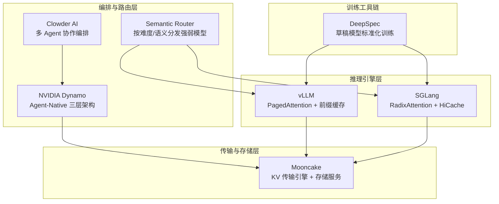
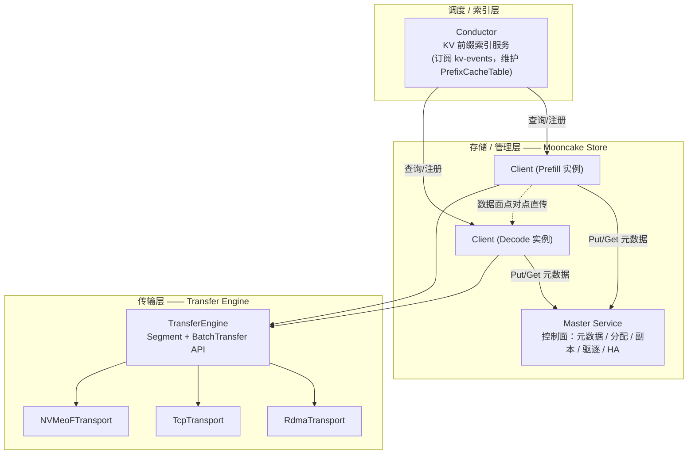
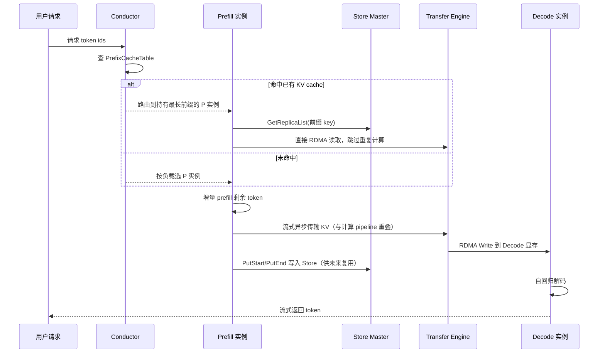
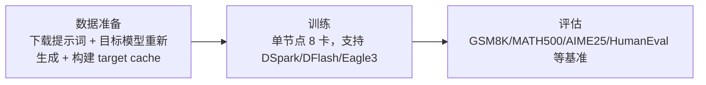

# 推理框架对比
> 覆盖 18 个知识点 | 来源 8 个文件 | 更新于 2026-07-12

## 1. 一句话总结
推理框架生态从单纯“加速单次推理”演化为多层解耦体系：vLLM 与 SGLang 提供引擎内前缀缓存、PD 分离、投机解码等底层加速；Mooncake 提供跨节点的 KV Cache 传输与存储基础设施；NVIDIA Dynamo 专为智能体工作负载提供三层 agent-native 架构；语义路由器按难度/意图分发请求到强弱模型；DeepSpec 标准化投机解码草稿模型的训练流程。整体形成“引擎层 → 传输/存储层 → 路由层 → 编排层”的完整技术栈。

## 2. 核心原理

### 2.1 问题背景
大模型推理面临多层瓶颈：
- **计算与存储矛盾**：Prefill 阶段 compute-bound，Decode 阶段 memory-bound，同机混跑相互干扰
- **智能体开销爆炸**：多智能体协作涉及大量重复 system prompt、上下文切换、子任务临时缓存，没有生命周期感知的 KV 管理导致显存浪费和延迟抖动
- **跨请求前缀复用割裂**：多用户共享相同 system prompt 时各自重算，浪费算力
- **投机解码训练碎片化**：各研究团队的草稿模型训练流程不统一，复现成本高

### 2.2 方案概述
当前主流推理框架形成四层协作架构：

**引擎层**（vLLM/SGLang）：提供单引擎内的 KV Cache 复用、PD 分离、量化、CUDA Graph 等加速手段。核心差异在于前缀缓存数据结构：vLLM 用 block 哈希表，SGLang 用 Radix Tree。

**传输与存储层**（Mooncake）：解耦 Prefill 和 Decode 节点间的 KV 传输时序，提供全局分布式 KV 存储池。

**路由层**（Dynamo Router / Semantic Router）：实例级 KV 感知路由 + 模型级语义难度路由。

**编排层**（Dynamo / Clowder AI）：针对智能体工作负载的 KV 生命周期管理、优先级调度。

## 3. 实现细节

### 3.1 vLLM 推理加速技术全景

#### 十类加速配置速查

| # | 配置 | 作用 | 适用场景 |
|---|---|---|---|
| 1 | `--enable-prefix-caching` | 自动前缀缓存，block 哈希复用历史 KV，降 TTFT | 多轮对话/长 system prompt |
| 2 | `--enable-chunked-prefill` | 长 prefill 切块与 decode 混批，稳 TBT | 长上下文 |
| 3 | `--max-num-seqs` / `--max-num-batched-tokens` | 吞吐-延迟主旋钮 | 压测必扫参数 |
| 4 | `--gpu-memory-utilization` | 显存预算比例，决定 KV 池大小 | 调大提吞吐 |
| 5 | `--tensor-parallel-size` / `--pipeline-parallel-size` | 模型并行切分降单卡显存 | 大模型 |
| 6 | `--quantization`（FP8/AWQ/GPTQ） | 权重/激活量化，decode 访存减半 | 精度换速度 |
| 7 | CUDA Graph（`compilation_config.cudagraph_mode`） | 消 kernel launch CPU 开销 | decode 小 batch 收益显著 |
| 8 | `--speculative-config` | 投机解码：EAGLE/MTP/ngram | 低并发、延迟敏感 |
| 9 | `--kv-transfer-config` | PD 分离 KV 传输 | 大规模部署 |
| 10 | `--structured-outputs-config` | 约束解码后端选择 | 结构化输出 |

**按目标选配置口诀**："缓存两个（prefix caching、KV 亲和）、批调度三个（chunked prefill、max-num-seqs、max-num-batched-tokens）、算得快三个（量化、CUDA graph、并行 TP/PP）、猜着算一个（speculative）、拆开算一个（PD 分离）。"

#### vLLM vs SGLang 核心差异

| 维度 | vLLM | SGLang |
|---|---|---|
| 前缀缓存 | block 哈希表（automatic prefix caching） | **RadixAttention**：radix tree 管理 KV，树上 LRU，多分支共享更灵活 |
| 结构化输出 | xgrammar/guidance 多后端 | xgrammar + **压缩 FSM jump-forward** |
| 投机解码 | EAGLE/MTP/ngram/suffix | EAGLE-3/DFlash/MTP 集成快（DFlash 首发合作方） |
| 调度 | continuous batching + chunked prefill | overlap scheduling（CPU 调度与 GPU 前向重叠） |
| 生产栈 | production-stack（router/LMCache/K8s operator） | sgl-router（cache-aware，Rust 实现） |

### 3.2 SGLang RadixAttention 原理

#### 核心数据结构
SGLang 使用 **Radix Tree（基数树）** 作为 KV Cache 的索引结构：

- **边（edge）**存一段 token id 序列（`RadixKey`），**值（value）** 存 GPU KV Cache 物理槽位索引
- 与普通 Trie 对比：把单分支链压缩成一条边，节点数降至"分叉点数量级"
- 与 vLLM 哈希表对比：天然支持"任意 token 边界"最长前缀匹配，不依赖内容哈希

#### match_prefix 算法
从根节点沿 child_key 做 O(1) 哈希查找，遇到部分匹配的边时调用 `_split_node` 从中间切断，生成精确匹配边界节点。`RadixKey.match()` 用指数探测+二分定位分歧点，复杂度 O(log L) 而非 O(L)。

#### 引用计数与驱逐
- `lock_ref`：从叶子到根的树上传播型引用计数，>0 禁止驱逐
- 只能驱逐叶子节点（内部节点是其子孙共享前缀）
- 可插拔驱逐策略：LRU/LFU/FIFO/Priority/SLRU（分段 LRU 防缓存污染）

#### 与调度器结合
LPM（Longest Prefix Match）策略：把共享最长前缀的请求排到相邻批次，最大化利用刚计算出的 KV Cache。

### 3.3 Mooncake：分布式 KV 传输与存储

Mooncake 是华为昇腾开源的分布式 KV 传输框架，为 PD 分离架构提供基础设施。

#### 三大组件与职责边界

**关键设计判断**：控制面与数据面分离——Master 只管"KV cache 在哪"，数据搬运由 Client 间 Transfer Engine 点对点完成，不经过 Master。

#### Transfer Engine 传输机制

- **Segment**：可被远程读写的连续地址空间；**BatchTransfer**：批量异步 Read/Write
- **零拷贝**：RDMA GPUDirect（网卡直接读写 GPU 显存）或 NVMe-oF PCIe 直连
- **拓扑感知选路**：探测 NUMA/PCIe 拓扑生成矩阵，按内存位置选 preferred 网卡
- **多网卡聚合**：超过 64KB 的传输切片，不同分片走不同网卡路径并行
- **故障切换**：链路失败时自动切换备用网卡重试，故障 RDMA context 临时隔离

**异构加速卡传输**：跨厂商场景（如 910B Prefill + H20 Decode）因通用 RDMA 网卡无目标显存访问权限，需"先落 DRAM 再转显存"，Mooncake 在 HBM 内把小块聚合成 8MB 再转 DRAM，且拷贝与 RDMA 传输流水线并行。

#### Mooncake Store 管理机制

- **对象模型**：Key → Replica 列表，每个 Replica 有独立状态机（`INITIALIZED → PROCESSING → COMPLETE → REMOVED`）
- **两阶段提交**：`PutStart` 分配空间 → Client 通过 Transfer Engine 写入 → `PutEnd` 标记完成，防止读到半成品
- **副本策略**：`ReplicateConfig` 独立配置 DRAM/SSD 副本数，热点前缀多副本分散读压力
- **驱逐**：后台 `BatchEvict` 按 LRU/FIFO 淘汰，跳过 `refcnt>0` 和 `hard_pin` 副本
- **Master 高可用**：多实例 etcd 选主，1024 哈希分片锁（`hash(key) % 1024`）扛高并发

### 3.4 PD 分离完整链路

**分工总结**：Conductor 决定"去哪"，Master 决定"东西在哪"，Transfer Engine 负责"怎么搬"。

### 3.5 NVIDIA Dynamo：Agent-Native 推理

NVIDIA 开源推理框架，专为智能体工作负载优化，三层架构：

- **Layer 1 前端**：支持 `v1/chat/completions`、`agent-hints-nvext` 协议扩展，传递优先级/输出长度预估/预填充缓存预热信号
- **Layer 2 路由器**：Flash Indexer（170M ops/s）KV 感知选 worker + 优先级调度 BinaryHeap + Python 绑定自定义路由策略
- **Layer 3 KV Cache 管理**：4 层内存层次（GPU→CPU→NVMe→远端），TokenRangeRetentionConfig 按 token 范围设缓存优先级和 TTL，智能体生命周期感知自动回收 ephemeral KV

**性能**：Claude Code 在 Dynamo 上 cache hit rate 85-97%（单 worker），4 智能体团队 97.2%。

### 3.6 语义路由：按难度分发强弱模型

vLLM semantic-router 实现模型级强弱分发：

1. **信号提取**：对请求提取十余种信号（领域/意图、难度、安全等）
   - **难度信号**（核心）：预置 hard/easy 两组例句 embedding，计算请求 embedding 与两组最大余弦相似度之差，按阈值分 easy/medium/hard
2. **决策引擎**：可配置布尔规则组合信号 → 路由决策
   - 如：`domain: math AND complexity: hard` → DeepSeek-V3.2（高推理预算）；`complexity: easy` → GPT-oss-120b（低预算）
3. **模型选择**：在该决策候选模型集合里按"质量-成本"选择

**与实例级路由的区别**：实例级路由（如 Motor KV 亲和调度）选"哪个副本"，模型级路由选"哪个模型"。

### 3.7 DeepSpec：投机解码草稿模型训练

DeepSpec 将投机解码草稿模型训练标准化为三阶段流程：

支持的草稿模型：DSpark、DFlash、Eagle3；目标模型：Qwen3、Gemma。

## 4. 框架对比

### 4.1 Mooncake 在 vLLM 与 SGLang 中的集成对比

| 维度 | vLLM | SGLang |
|---|---|---|
| Connector 位置 | **在 mooncake-wheel 外部包**，动态加载 | **在 sglang 仓库内**，与 nixl/mori/ascend 并列 |
| 多 backend 抽象 | 多个独立 Connector 类 | 统一 `TransferBackend` 枚举 + 工厂 |
| PD 传输粒度 | **Block 级**，prefill 全部完成后一次性批量传 | **Page/chunk 级**，`enable_overlap` 时中间 chunk 边算边传 |
| 前缀缓存复用 | `MooncakeStoreConnector` 代码未公开，靠 MultiConnector 拼接 | **HiCache 原生三级树**（L1 GPU/L2 CPU/L3 Mooncake Store），与 PD 共享同一 Transfer Engine 实例 |
| 握手建连 | Proxy 轮询撮合 + 请求体传参 | **HTTP Bootstrap Server** 拓扑注册 + ZMQ 交换元数据 |
| 路由 cache-aware | 无，官方 Proxy 纯轮询 | Rust gateway 内置 CacheAware 策略（近似前缀树） |

**一句话总结**：两边底层调用同一份 `mooncake.engine.TransferEngine`，但 SGLang 把 Mooncake 深度产品化成框架原生可插拔组件，vLLM 把 Mooncake 当第三方插件挂在外面。

### 4.2 vLLM vs SGLang 路由方式对比

| 层次 | vLLM | SGLang |
|---|---|---|
| 实例级路由 | production-stack router：prefixaware/kvaware/QPS | sgl-model-gateway：CacheAware（文本前缀历史推测） |
| 模型级路由 | semantic-router（难度/语义分发） | 无内建方案 |
| KV 事件路由 | 无 | experimental/sgl-router：订阅 `BlockStored/Removed` |

注意：SGLang gateway 的 `cache_aware` 是**历史推测**（文本前缀→上次选中 worker），不查询真实 KV 状态；实验性 `cache_aware_zmq` 才消费 KV block 事件做精确 cache-directory 路由。

### 4.3 前缀缓存：Radix Tree vs Block 哈希表

| 维度 | SGLang Radix Tree | vLLM Block 哈希表 |
|---|---|---|
| 数据结构 | 压缩前缀树，边存 token 序列 | 固定块内容哈希 → block id |
| 匹配粒度 | 精确到 token/page 边界 | 整块粒度 |
| 多分支共享 | 天然支持 | 需额外处理哈希冲突/顺序依赖 |
| 驱逐管理 | 树上引用计数 + 可插拔策略 | 外部内存池管理 |
| 实现复杂度 | 高（分裂、级联驱逐、树上传播锁） | 低 |

## 5. 面试要点

### 5.1 常见追问

#### Q: vLLM 有哪些加速配置？按什么框架组织回答？
- **缓存层**：`enable-prefix-caching`（自动前缀缓存）、KV 亲和路由（多实例前缀命中）
- **批处理层**：`enable-chunked-prefill`、`max-num-seqs`/`max-num-batched-tokens`（吞吐-延迟主旋钮）、`gpu-memory-utilization`
- **计算层**：`quantization`（FP8/AWQ）、CUDA Graph、`tensor-parallel-size`
- **算法架构层**：`speculative-config`（EAGLE-3/MTP）、`kv-transfer-config`（PD 分离）

#### Q: vLLM 和 SGLang 前缀缓存的本质区别？
- vLLM：固定 block 内容哈希 → 整块精确匹配
- SGLang：Radix Tree 压缩前缀树 → 任意 token 边界最长前缀匹配，粒度更细，天然支持多分支共享

#### Q: Mooncake 的 Transfer Engine 如何做到零拷贝？
- RDMA GPUDirect：网卡直接读写远端 GPU 显存，不经过 CPU
- NVMe-oF cuFile/GPUDirect Storage：远端 NVMe 经 PCIe 直达本地 DRAM/VRAM
- 异构跨厂商场景：先落 DRAM 再转显存，通过"数据聚合+流水线并行"掩盖中转延迟

#### Q: Master 会不会成为单点瓶颈？
- 不会：控制面/数据面分离，Master 只处理 KB 级元数据 RPC，GB 级数据搬运由 Client 间 Transfer Engine 点对点完成
- 元数据锁：1024 哈希分片锁并行处理，非全局一把锁
- 高可用：多实例 etcd 选主

#### Q: Mooncake Store 的决定性优势是什么？
- 热点 block 可主动复制到多节点（`ReplicateConfig`），通过偏好段与硬/软钉住精细管理 KV 生命周期
- 有引用计数保护（防止读时被驱逐）和逐出算法
- 支持 Segment 优雅下线，扩缩容时不丢 KV 引用

#### Q: SGLang 的 Radix Tree 驱逐时为什么只能删叶子节点？
内部节点的 KV Cache 是其所有子孙共享的公共前缀，直接删除会破坏树结构并让子孙丢失依赖。驱逐叶子后如果父节点变成新的空孩子叶子，立即级联推入驱逐堆，自底向上连锁回收。

#### Q: 语义路由怎么判断请求难度？
预置 hard/easy 两组例句 embedding，计算请求 embedding 与两组最大余弦相似度之差 δ，按阈值分类。例如 `δ > 0.3` 判为难题，路由到强模型 + 高推理预算。

#### Q: Mooncake 在 vLLM 和 SGLang 的集成差异最关键的一点是？
SGLang 把 Mooncake 做成框架原生的一等公民：HiCache 三级缓存树中 Mooncake Store 是可插拔 L3 backend，且与 PD 传输共享同一个 Transfer Engine 实例。vLLM 的 Mooncake 集成是外部插件，PD 传输和前缀共享是两套独立机制需手动拼接，且 Store connector 代码未在公开仓库找到完整实现。

#### Q: NVIDIA Dynamo 相比 vLLM/SGLang 的独特价值？
专门为智能体工作负载设计的三层 agent-native 架构：agent-hints-nvext 协议传递优先级/缓存预热信号给 orchestrator；Flash Indexer 170M ops/s 实现 KV 感知 worker 选择；TokenRangeRetentionConfig 按 token 范围精细管理缓存生命周期，智能体终止后自动回收 ephemeral KV。vLLM/SGLang 没有这种智能体生命周期感知的 KV 管理。

### 5.2 口述话术

> "当前推理框架形成四层解耦架构。**引擎层** vLLM/SGLang 提供 KV Cache 复用、PD 分离、量化、投机解码等基础加速，核心差异在前缀缓存：vLLM 用 block 哈希表，SGLang 用 Radix Tree 支持更细粒度的最长前缀匹配。**传输与存储层** Mooncake 提供跨节点 KV 传输引擎和分布式存储服务，核心创新是拓扑感知零拷贝 RDMA 传输和 KV 池化管理。**路由层**分两层：实例级 KV 亲和路由决定请求去哪个副本，模型级语义路由按难度和意图分发强弱模型。**编排层** Dynamo 和 Clowder AI 针对多智能体场景做生命周期感知的 KV 管理和优先级调度。投机解码的标准化训练由 DeepSpec 覆盖。"

## 6. 延伸阅读

### 6.1 相关主题
- KV 缓存亲和调度与 Mooncake 集成
- PD 分离架构设计与实践
- 投机解码（EAGLE/DFlash/MTP）原理与部署
- SGLang RadixAttention 深度剖析
- 多智能体协作平台的推理优化

### 6.2 源文件

| 文件路径 | 标题 | 类型 |
|---|---|---|
| wiki/ai/infrastructure/mooncake.md | Mooncake | 框架文档 |
| wiki/ai/infrastructure/nvidia-dynamo.md | NVIDIA Dynamo | 框架文档 |
| wiki/ai/infrastructure/clowder-ai.md | Clowder AI | 框架文档 |
| wiki/ai/infrastructure/deepspec.md | DeepSpec 全栈投机解码训练框架 | 框架文档 |
| interview/interview-review/05-vLLM推理加速配置全景.md | vLLM 推理加速配置与技术全景 | 面试准备 |
| interview/interview-review/06-vLLM-Router语义路由与强弱模型分发.md | vLLM Router 语义路由与强弱模型分发 | 面试准备 |
| interview/interview-review/10-Mooncake传输引擎与存储管理深度拓展.md | Mooncake 深度拓展 | 面试准备 |
| interview/interview-review/11-Mooncake在vLLM与SGLang中的实现对比.md | Mooncake 在 vLLM 与 SGLang 中的集成异同 | 面试准备 |
| interview/sglang/12-SGLang-RadixTree原理与面试问答.md | SGLang RadixAttention 原理精讲 | 面试准备 |