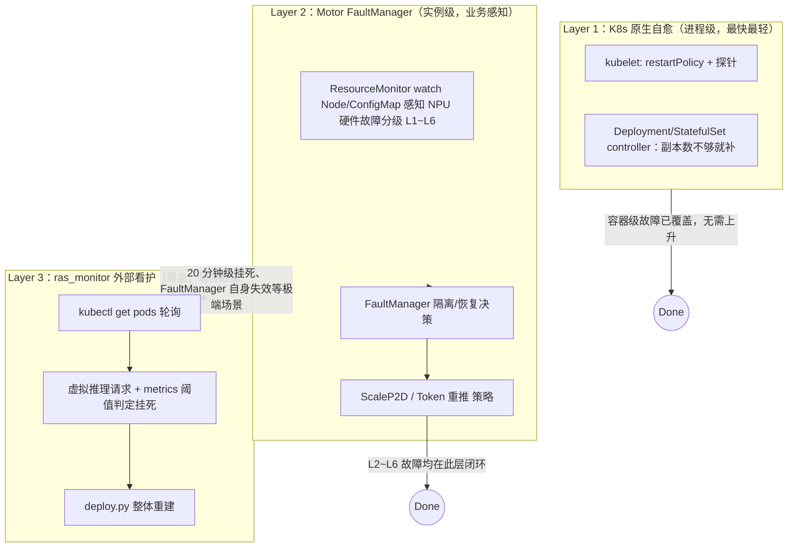
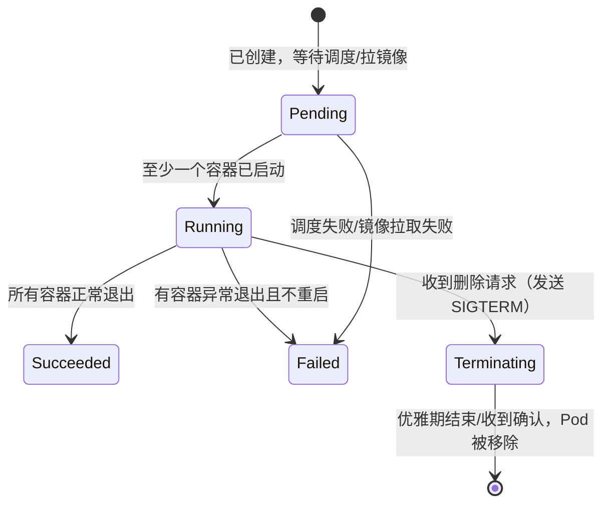

# K8s 与基础设施
> 覆盖 22 个知识点 | 来源 2 个文件 | 更新于 2026-07-11

## 1. 一句话总结
K8s 是声明式容器编排系统，Pod 是其最小调度单元，三种探针管控生命周期；在大模型推理场景下，原生自愈能力（进程级重启）不足，需叠加业务感知的 RAS 三层架构——FaultManager 主动 watch K8s API 获取硬件故障分级信号，做 Token 重推/跨实例资源置换等精细恢复；最外层 ras_monitor 用黑盒探活兜底，代价递增，能力递进，共同构成 K8s 通用能力 + 业务高可用智能的完整方案。


!!! abstract "30 秒速览"
    - **核心原理**
    - **实现细节**
    - **面试要点**
    - 问题背景
    - 方案概述
    - K8s 控制平面与 Pod 抽象

---
## 2. 核心原理
### 2.1 问题背景
大模型分布式推理的故障场景远比“容器死没死”复杂：NPU 卡瞬断只需重推 token、多卡隔离需跨实例置换资源、引擎进程假活需业务级黑盒探活。K8s 原生探针和控制器只能感知进程存活这一种粗粒度二元信号，既看不到硬件故障分级，也不理解 Prefill/Decode 角色的业务语义。单靠 `restartPolicy: Always` 会导致“为一条瞬断重启整个推理实例”的过度恢复，或“容器还活着但推理全超时”的漏检。

### 2.2 方案概述
整体方案是在 K8s 声明式调度基础之上，叠了两层业务感知的 RAS 能力，形成三层递进：


- **Layer 1** 是 K8s 自带能力，负责容器级重启和副本补齐，是 Motor 自动重拉起注册的前置条件
- **Layer 2** 是 Controller 内的 `FaultManager`，主动 watch K8s Node/ConfigMap 获取硬件故障信号，做 Token 重推（无感）或 ScaleP2D（跨实例资源置换），恢复动作走业务 HTTP 协议而非 `kubectl delete`
- **Layer 3** 是独立于 Motor 之外的 `ras_monitor.py`，用 `kubectl` 查询 Pod + 虚拟推理请求判定挂死，代价最大（整体重建），但最可靠


---
## 3. 实现细节
### 3.1 K8s 控制平面与 Pod 抽象
K8s 是声明式系统：用户提交期望状态（YAML 里的 `spec`），控制平面持续将实际状态（`status`）向期望状态收敛。核心组件分工：

| 组件 | 位置 | 职责 |
|---|---|---|
| `kube-apiserver` | 控制平面 | 集群唯一入口，认证/鉴权/准入控制 |
| `etcd` | 控制平面 | 集群状态的唯一持久化来源 |
| `kube-scheduler` | 控制平面 | 为未绑定 Node 的 Pod 选节点，只决策不执行 |
| `kube-controller-manager` | 控制平面 | Deployment/ReplicaSet/Node 等控制器的集合，执行 reconcile 循环 |
| `kubelet` | 每个 Node | 节点代理人，调用容器运行时起停容器，**探针由 kubelet 本地周期性执行** |
| `kube-proxy` | 每个 Node | 维护 iptables/IPVS 规则，实现 Service 流量转发 |
| 容器运行时 | 每个 Node | 拉镜像、起停容器，通过 CRI 被 kubelet 调用 |

Pod 是调度和生命周期管理的最小单位，而非容器本身，因为一组强耦合容器（如主进程 + sidecar）需要共享网络命名空间、存储卷和生命周期。Pod 状态机从 Pending→Running，长驻服务保持在 Running 阶段，删除时进入 Terminating：kubelet 先发 SIGTERM（若有 `preStop` 钩子先执行），等待 `terminationGracePeriodSeconds` 后 SIGKILL 强杀。推理场景下 `preStop` 钩子用于通知 Coordinator 停止调度新请求、等在途请求完成，避免客户端收到连接重置。


### 3.2 探针机制：三种探针的协同工作
三种探针服务于容器生命周期的不同阶段，互相独立但存在先后依赖：

| 探针 | 解决的问题 | 失败后果 | 触发时机 |
|---|---|---|---|
| Startup Probe | 启动是否完成（慢启动场景） | 失败达阈值 → 重启容器 | 容器创建后立即开始，成功一次后永久停止 |
| Readiness Probe | 能否收流量（服务可能活着但暂时不可用） | 从 Service Endpoints 摘除，不重启 | Startup 成功后持续周期性执行 |
| Liveness Probe | 进程是否僵死/死锁 | 失败达阈值 → kill 容器并重建 | Startup 成功后持续周期性执行 |

**先后顺序**：容器启动后，Startup 探针先跑，成功一次后永久退出，Readiness 和 Liveness 才并行开始生效。若未配置 Startup 探针，Liveness 从容器启动就开始探测，对“权重加载要十几分钟”的大模型服务极容易误杀，陷入“重启→再加载→再被杀”死循环。

```mermaid
sequenceDiagram
    participant K as kubelet
    participant C as 容器进程
    Note over K,C: 容器刚启动
    loop 直到成功或达到 failureThreshold
        K->>C: Startup Probe
    end
    Note over K: Startup 探针一旦成功一次，永久停止
        Readiness / Liveness 才开始生效
    par Readiness 持续探测
        loop periodSeconds 周期
            K->>C: Readiness Probe
            C-->>K: 失败 → 从 Service Endpoints 摘除（不重启）
        end
    and Liveness 持续探测
        loop periodSeconds 周期
            K->>C: Liveness Probe
            C-->>K: 达到 failureThreshold → kill 容器并重建
        end
    end
```
#### 关键代码路径
本仓库选用 `exec` 方式探测，由 `probe.sh` 按位置参数（startup/readiness/liveness + role）调用 `probe.py`，后者从业务配置动态拼出 `http://<PodIP>:<port>/{startup|readiness|liveness}`，发 HTTP GET 请求，返回码 200 则 `exit 0`（成功），否则 `exit 1`（失败）。Pod IP 通过 Downward API 以 `POD_IP` 环境变量注入。

```58:76:MindIE-PyMotor/examples/deployer/yaml_template/coordinator_template.yaml
startupProbe:
  exec:
    command:
    - bash
    - -c
    - "$CONFIGMAP_PATH/probe.sh startup"
  periodSeconds: 10
  failureThreshold: 100
readinessProbe:
  exec:
    command:
    - bash
    - -c
    - "$CONFIGMAP_PATH/probe.sh readiness"
  periodSeconds: 10
  timeoutSeconds: 30
  failureThreshold: 5
livenessProbe:
  exec:
    command:
    - bash
    - -c
    - "$CONFIGMAP_PATH/probe.sh liveness"
  periodSeconds: 10
  timeoutSeconds: 30
  failureThreshold: 5
```
**调参要点**：
- `startupProbe.failureThreshold: 100` × `periodSeconds: 10` = 最大容忍 1000 秒启动时间，兼容大模型权重加载
- `timeoutSeconds: 30` 避免推理引擎繁忙时健康检查接口响应延迟被误判为失败
- `failureThreshold: 5` 容忍偶发网络抖动，避免过度敏感

选择 `exec` 而非 `httpGet` 的原因：推理服务支持 mTLS 且端口从运行时业务配置中动态读取，`exec` 将灵活性下沉到脚本，YAML 保持角色无关、可复用。

### 3.3 Pod 调度与容错控制
**亲和性/反亲和性**：Coordinator 用 `podAntiAffinity` 硬约束确保副本分散在不同 Node，推理引擎用 `nodeSelector: accelerator: huawei-Ascend910` 绑定 NPU 节点。

**污点与容忍**：节点故障时先打 `node.kubernetes.io/not-ready`/`unreachable` Taint，Pod 配置 `tolerationSeconds: 30`（而非默认 300 秒），更快判定失联、更快重建——在“规避误判”和“故障恢复 RTO”间取前者。

**Gang Scheduling**：多卡分布式推理要求一组 Pod 要么全部调度成功，要么都不调度。K8s 原生调度器不支持，需切换到 Volcano（`schedulerName: volcano`）并加 `infer.huawei.com/gang-schedule: 'true'` 标签。

**StatefulSet 并行策略**：Prefill/Decode 用 StatefulSet 获取稳定网络标识（`pod-0`、`pod-1`），但显式设 `podManagementPolicy: Parallel` 让 Pod 并行创建，避免默认串行启动拖死多机协同初始化。

### 3.4 FaultManager：主动 Watch K8s API 的故障感知层
RAS 能力的核心运行在 Controller 进程内，**主动** watch K8s 资源做精细化决策，而非被动等通知。

```mermaid
sequenceDiagram
    participant Driver as NPU驱动/固件
    participant MindXDL as mindx-dl 组件
    participant CM as K8s ConfigMap
        mindx-dl-deviceinfo-{node}
    participant RM as ResourceMonitor
        (Motor Controller 内)
    participant FM as FaultManager
    participant IM as InstanceManager

    Driver->>MindXDL: 上报硬件故障(卡故障/网络故障)
    MindXDL->>CM: 写入 DeviceInfoCfg/SwitchInfoCfg
    RM->>CM: K8s Watch API 监听变更
    CM-->>RM: MODIFIED 事件
    RM->>RM: 解析 DeviceInfoCfg/SwitchInfoCfg → FaultInfo
    RM->>FM: 回调通知
    FM->>FM: _refresh_instance_fault_level() 综合评级 L1~L6
    alt fault_level > L2
        FM->>IM: separate_instance() 强制隔离
        FM->>FM: 按角色+等级路由到策略(ScaleP2D/TokenReinference)
    else fault_level ≤ L2 且已隔离
        FM->>IM: recover_instance() 解除隔离
    end
```
**三个核心 K8s API 调用**，均封装在 `motor/controller/fault_tolerance/k8s/` 下：
- **Node Watch** (`resource_monitor.py: _monitor_node()`)：监听 Node 的 Ready Condition，变为 NotReady 时注入 NODE_REBOOT 故障（L6）
- **ConfigMap Watch** (`resource_monitor.py: _monitor_configmap()`)：监听 `mindx-dl-deviceinfo-{node}` ConfigMap，由 MindX DL 设备插件写入 NPU 卡故障/网络故障 JSON，经 `configmap_parser.py` 解析并映射为 L1~L6
- **Pod 反查 Node** (`k8s_client.py: get_node_hostname_by_pod_ip()`)：按 `field_selector=status.podIP=xxx` 查询，用于故障定位和 ScaleP2D 节点所有权交换

#### 关键代码路径
Watch 连接采用“先 List 再 Watch + 立即处理当前状态”模式，且专门处理 `HTTP 410 Gone`（`resourceVersion` 过期，重新 List 获取新版本，不是错误），配合指数退避避免惊群效应。

```18:53:MindIE-PyMotor/motor/controller/fault_tolerance/k8s/k8s_client.py
class K8sClient:
    """Kubernetes client wrapper for common operations"""

    def __init__(self):
        self.v1 = None
        try:
            config.load_incluster_config()
            self.v1 = client.CoreV1Api()
        except Exception as e:
            try:
                config.load_kube_config()
                self.v1 = client.CoreV1Api()
            except Exception as e2:
                logger.warning("Failed to load Kubernetes config: %s, %s", e, e2)

    def get_node_hostname_by_pod_ip(self, pod_ip: str) -> str | None:
        pods = self.v1.list_pod_for_all_namespaces(field_selector=f"status.podIP={pod_ip}")
        for pod in pods.items:
            node_name = getattr(pod.spec, "node_name", None)
            if node_name:
                return node_name
        return None
```
`load_incluster_config()` 优先、失败退回本地 `kubeconfig`，兼顾集群内 Pod 和集群外本地调试两种场景，`is_available()` 让调用方安全降级。

**恢复动作与 K8s 的分工**：
- L2（可自愈）：只触发 Token 重推，**不重启任何容器、不惊动 K8s**
- L4~L6：触发 ScaleP2D，通过 `NodeManagerApiClient.stop()` 对目标实例发 HTTP 请求让其优雅退出，**不走 kubectl delete**——保留“通知 Coordinator 停止调度新请求、等在途请求完成”的业务语义

### 3.5 ras_monitor：K8s 之外的黑盒兜底
独立于 Motor 进程的外部脚本，仅依赖 `kubectl get pods` + HTTP 虚拟推理请求 + Prometheus `request_success_total` 指标判定挂死。设计原则是“看门狗要比被看对象更简单、更独立”——避免 FaultManager 自身卡死时一同失效。检测周期约 20 分钟，恢复手段最重：整个服务删除后重新 `deploy.py` 拉起。

```99:101:MindIE-PyMotor/examples/features/fault_tolerance/ras_monitor/ras_monitor.py
def kubectl_get_pods_info():
    result = subprocess.run(
        [shutil.which("kubectl"), "get", "pods", "-A", "-owide"], capture_output=True, text=True, check=True
    )
```
## 4. 框架对比
### 4.1 CRD 部署模式 vs 传统多 YAML
本仓库同时提供两种部署模式，选择本质是“控制权归谁”的取舍：

| 维度 | `infer_service_set`（CRD，默认） | `multi_deployment`（原生多 YAML） |
|---|---|---|
| apply 对象 | 1 个 InferServiceSet + RBAC | N 个独立 Deployment/Service |
| Pod 创建方 | infer-operator（自定义控制器） | kubectl apply 直接创建 |
| 前置依赖 | 需预装 infer-operator CRD | 无额外依赖 |
| 角色耦合 | 一个 CR 对象管理所有角色，拓扑关系统一约束 | 各角色 YAML 独立维护，脚本编排 |
| RAS 能力 | **不支持**（尚未完成适配验证） | 支持 |

**RAS 能力与 CRD 模式互斥的根因**：CRD 模式下 Pod 由 infer-operator 通过 reconcile 循环持续“纠正”到 InferServiceSet.spec 的期望副本数，而 FaultManager 的 ScaleP2D 策略是**命令式地直接让 Pod 内进程退出**（`NodeManagerApiClient.stop()`），不修改 CRD spec。两个控制器同时操作同一资源会打破 K8s 声明式系统的“单一 owner 原则”，产生“Operator 发现副本数不够→立即拉起新 Pod，Motor 认为该节点已释放”的控制回路冲突。要让 CRD 模式支持 RAS，需把恢复动作改为“修改 InferServiceSet.spec”的形式，将恢复语义纳入声明式体系。


---
## 5. 面试要点
### 5.1 常见追问
#### Q: 为什么大模型服务的探针选 exec 而非 httpGet？
- 端口是运行时从业务配置动态读取的，不同角色端口不同，httpGet 需在 YAML 里写死无法动态适配
- 支持 mTLS，探测脚本需内嵌证书握手逻辑，httpGet 原生探针做不到
- 用 exec 包装脚本，YAML 模板角色无关、可复用

#### Q: RAS 能力是不是在重复造 K8s 的轮子？
- 不算。K8s 只能感知容器存活这一种粗粒度信号，看不到 NPU 的 L1~L6 硬件故障分级，也不理解 P/D 角色的业务语义
- Token 重推（无感）和 ScaleP2D（跨实例资源置换）这类恢复动作远超 K8s“重启容器/补齐副本”的范畴
- K8s 的设计定位是通用容器编排，不应管也管不了这种业务层智能

#### Q: FaultManager 怎么拿到硬件故障信息，是等 K8s 通知吗？
- 不是被动等，是主动用 K8s Watch API 监听 ConfigMap：MindX DL 硬件监控组件将故障信息写入 `mindx-dl-deviceinfo-{node}` ConfigMap，ResourceMonitor 通过 Watch 收到 MODIFIED 事件后解析出分级故障
- 另外也 Watch Node 的 Ready Condition 感知节点失联

#### Q: ScaleP2D 恢复时是调 kubectl delete pod 吗？为什么不是？
- 不是，是通过业务自定义 HTTP 协议（`NodeManagerApiClient.stop()`）让目标 Pod 内进程自己优雅退出
- 这样可以保留业务层的下线通知语义：先让 Coordinator 停止调度新请求、等在途请求完成，再退出进程。直接 kubectl delete 拿不到这个语义

#### Q: K8s Watch 出现 410 Gone 怎么处理？
- 这是 resourceVersion 过期的正常协议行为，不是错误
- 需要专门识别（检查 HTTP 状态码 410），重新发起一次 List 获取新的 resourceVersion，不能当普通异常做统一重试

#### Q: 为什么已经有了 FaultManager，还需要 ras_monitor.py 这层外部脚本？
- FaultManager 覆盖范围是“硬件驱动能感知的故障并通过 ConfigMap 上报”和“EngineCore 通过 ZMQ 主动上报的软件故障”
- 如果 Controller 进程自身卡死，或故障模式属于纯软件死锁且未触发硬件故障码，Layer 2 会完全失效且不自知
- ras_monitor 故意设计为完全独立的外部进程，遵循“看门狗要比被看对象更简单更独立”的分布式系统原则

### 5.2 口述话术
“K8s 是一个声明式的容器编排系统：用户描述期望状态，控制平面不断把实际状态向期望状态收敛。Pod 是它调度和生命周期管理的最小单位；探针是 kubelet 用来判断 Pod 到底‘活没活、能不能收流量、启没启动完’的手段，三种探针分别服务生命周期的三个阶段。

我们在 MindIE-PyMotor 里用 StatefulSet + 自定义 InferServiceSet CRD 拉起 Prefill/Decode 推理实例，探针直接探测推理引擎的 HTTP 健康检查端口，PreStop 钩子做优雅停机。这是把 K8s 原生能力和大模型推理的高可用需求结合起来的一个典型例子。

但要理解一点：K8s 原生自愈只解决‘进程死没死’，大模型推理真正的故障场景复杂得多。所以我们又叠了两层 RAS 能力——FaultManager 主动 watch K8s 的 Node 和 ConfigMap 拿硬件故障分级信号，做 Token 重推或 ScaleP2D 这种跨实例的资源置换；最外面还有一个独立的 ras_monitor 脚本做黑盒兜底。三层是能力递进、代价递增的关系，不是互相替代。这就是 K8s 通用可靠性原语之上叠加业务感知调度智能的完整方案。”


---
## 6. 延伸阅读
### 6.1 相关主题
- **专题 09**（MindIE 并行策略与调度调优）：讲解“实例内”的多卡并行策略（tp/dp/maxBatchSize），与本篇“实例间”的高可用与弹性互补
- `MindIE-PyMotor/docs/zh/design/fault_tolerance/fault_manager.md`：FaultManager 设计细节
- `MindIE-PyMotor/docs/zh/design/fault_tolerance/scale_p2d.md`：ScaleP2D 特性细节
- `MindIE-PyMotor/examples/features/fault_tolerance/ras_monitor/readme.md`：外部看护脚本说明

### 6.2 源文件
| 文件路径 | 标题 | 类型 |
|---|---|---|
| interview/k8s/12-K8s基础探针与Pod专题.md | K8s 基础知识 × 探针 × Pod 专题 | 模拟面试 |
| interview/k8s/13-MindIE-PyMotor的RAS能力与K8s关系专题.md | MindIE-PyMotor 的 RAS 能力与 K8s 关系 | 模拟面试 |