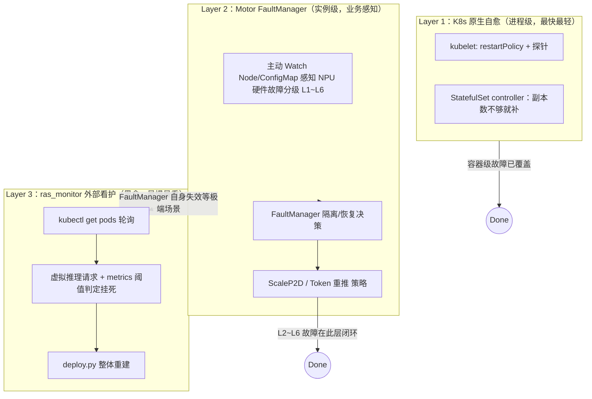
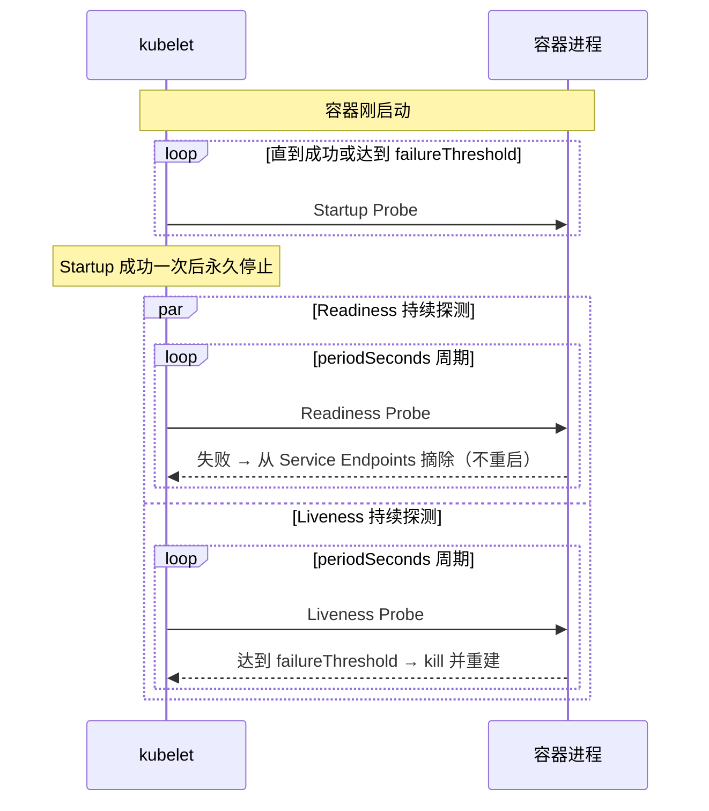

# K8s 与基础设施
> 覆盖 14 个知识点 | 来源 3 个文件 | 更新于 2026-07-15

## 1. 一句话总结
K8s 是声明式容器编排系统，Pod 是其最小调度单元；探针（Startup/Readiness/Liveness）是 kubelet 判断 Pod 生命周期的三种手段；MindIE-PyMotor 的 RAS（可靠性/可用性/可服务性）能力并非重复造轮子，而是在 K8s 原生进程级自愈之上叠加了业务感知的硬件故障分级、跨实例资源置换（ScaleP2D）和外部看门狗三层递进式防护，核心边界在于**单一 owner 原则**——CRD 模式与 FaultManager 的命令式操作存在调谐权冲突，因此 RAS 目前钉在 `multi_deployment` 模式。

## 2. 核心原理
### 2.1 问题背景
大模型分布式推理对基础设施提出三重特殊挑战：
- **启动慢**：权重加载和 NPU 显存初始化可能耗时数十分钟，传统 K8s 探针在启动阶段易误判为僵死并触发重启，陷入“加载被杀 → 重新加载”的死循环。
- **故障粒度细**：K8s 原生探针只能感知“容器进程是否存活”这个二元信号，无法检测 NPU 卡瞬时链路抖动（故障等级 L2）这类硬件微故障，也不懂 Decode 实例因资源不足需要跨实例置换（缩 Prefill 保 Decode）这类业务语义。
- **恢复需优雅**：推理引擎正在处理的请求不能被 `SIGKILL` 粗暴打断，需有完整的优雅下线流程（通知 Coordinator 停止调度新请求、在途请求处理完、显存中 KV Cache 不用丢失）。

### 2.2 方案概述
MindIE-PyMotor 的可靠性方案是三层递进式防护，能力递增、代价也递增：



核心思路：**K8s 负责把进程重新跑起来，Motor 负责让新进程变回集群中正确的那个角色**。K8s 是通用地基，Motor RAS 是在其上叠加的业务调度智能。

## 3. 实现细节
### 3.1 K8s 控制平面与探针三兄弟
#### 控制平面组件职责
K8s 的声明式核心：用户提交期望状态（YAML 的 `spec`），控制面组件持续让实际状态（`status`）向它收敛。

| 组件 | 位置 | 职责 |
|---|---|---|
| `kube-apiserver` | 控制平面 | 集群统一入口，认证/鉴权/准入控制 |
| `etcd` | 控制平面 | 分布式 KV 存储，集群状态唯一持久化来源 |
| `kube-scheduler` | 控制平面 | 为新 Pod 选择合适 Node（只决策不执行） |
| `kube-controller-manager` | 控制平面 | 多控制器集合，每个跑“期望 vs 实际”的 reconcile 循环 |
| `kubelet` | 每个 Node | 调用容器运行时启停容器，本地执行探针探测 |
| `kube-proxy` | 每个 Node | 维护 iptables/IPVS 规则实现 Service 流量转发 |

#### 三探针的先后与语义
这是最容易被问倒的细节：**Startup 成功前 Liveness 不生效；Startup 成功后永久停止，Readiness 和 Liveness 才真正开始工作。**



| 探针 | 解决的问题 | 失败后果 | 何时运行 |
|---|---|---|---|
| **Startup** | 启动完成否？（大模型权重加载慢） | 失败达阈值 → 重启容器 | 容器创建后立即，成功一次后**永久停止** |
| **Readiness** | 能收流量吗？（业务忙/依赖未就绪） | 仅从 Service Endpoints 摘除，**不重启** | Startup 成功后贯穿 Running 阶段 |
| **Liveness** | 进程僵死了吗？ | 失败达阈值 → kubelet 杀掉容器重建 | **Startup 通过后才开始** |

口述铁律：**没配 Startup 时 Liveness 的 initialDelay 扛不住大模型加载；有 Startup 时启动窗内别指望 Liveness 救场——它根本还没上岗。**

#### 调参关键坑位
| 坑 | 正确做法 | 原因 |
|---|---|---|
| 无 Startup + Liveness 阈值短 | 必须配 Startup，`failureThreshold` 给足权重加载时间预算（例：`periodSeconds: 10` × `failureThreshold: 100` ≈ 1000s） | 防止“加载中被杀 → 重新加载 → 又被杀”死循环 |
| Liveness `failureThreshold=1` | 至少设为 3~5 | 一次超时就杀容器代价极大（清空缓存、权重全部重载），宁可漏杀不可误杀 |
| 探活打业务大端口且 timeout 太短 | 探活走管理面轻量端口，`timeoutSeconds` 设 30s 防止高 batch 时健康检查被排队误判 |
| Readiness 与 Liveness 探同一重路径 | 分离：Readiness 可能因业务忙摘流但不应导致重启 |

### 3.2 MindIE-PyMotor 的 exec 探针封装
项目选择了 `exec` 而非原生 `httpGet` 探针，原因：端口是运行时从 `user_config.json` 动态读取的，且 MindIE 支持 mTLS 需要证书握手——`exec` 将灵活性下沉到脚本，YAML 保持角色无关。

Coordinator 探针片段：
```yaml
startupProbe:
  exec:
    command:
    - bash -c "$CONFIGMAP_PATH/probe.sh startup"
  periodSeconds: 10
  failureThreshold: 100   # 最多容忍 1000s 启动时间
readinessProbe:
  exec:
    command:
    - bash -c "$CONFIGMAP_PATH/probe.sh readiness"
  periodSeconds: 10
  timeoutSeconds: 30      # 防止高负载时误判
  failureThreshold: 5     # 容忍偶发抖动
livenessProbe:
  exec:
    command:
    - bash -c "$CONFIGMAP_PATH/probe.sh liveness"
  periodSeconds: 10
  timeoutSeconds: 30
  failureThreshold: 5
```

#### 关键代码路径
- `MindIE-PyMotor/examples/deployer/probe/probe.sh`：薄封装层，按位置参数将 probe 类型和角色传给 Python。
- `MindIE-PyMotor/examples/deployer/probe/probe.py`：真正探测逻辑——按角色查配置文件的端口，拼出 `http(s)://<PodIP>:<port>/{startup|readiness|liveness}`，发 HTTP GET，200 则 `exit 0`，否则 `exit 1`。包括角色收敛设计（prefill/decode/union 统一映射为 `node_manager` 查端口）。

#### 数据流
kubelet exec probe.sh → probe.sh 转发 probe.py role probe_type
  → probe.py 读 env POD_IP (来自 Downward API) + 解析 user_config.json 取端口
  → HTTP GET 推理引擎管理端口
  → 退出码 0（成功）/ 1（失败） → kubelet 按阈值和动作采取行动

### 3.3 Pod 生命周期与优雅停机
Lifecycle 钩子和探针是同一生命周期的两面：
- **PreStop 钩子**：收到删除请求后先跑 `prestop.sh`，做业务层下线通知（通知 Coordinator 停止调度新请求、等在途请求完成），再对 NodeManager 进程发 SIGTERM。
- **terminationGracePeriodSeconds**（默认 30s）：给优雅退出留够时窗，超时才 SIGKILL。
- **Pod 状态机**：Pending（等待调度/拉镜像）→ Running → Terminating（收到删除，跑 preStop 等宽限期）→ 移除。

### 3.4 RAS 三层：FaultManager 如何利用 K8s 做“K8s 管不了的事”
#### Layer 2 与 K8s API 的交互方式
FaultManager 并非被动等 K8s 通知，而是**主动** Watch K8s 资源作为硬件故障信号的入口：

| K8s 能力 | 对应代码模块 | 用途 |
|---|---|---|
| **Node Watch API** | `resource_monitor.py: _monitor_node()` | 监听 Node Ready Condition；变 NotReady 时注入 NODE_REBOOT 故障(L6) |
| **ConfigMap Watch API** | `resource_monitor.py: _monitor_configmap()` | 监听 `mindx-dl-deviceinfo-{node}` ConfigMap（硬件监控组件 MindX DL 写入），解析 NPU 卡故障/网络故障 |
| **Pod 反查 Node** | `k8s_client.py: get_node_hostname_by_pod_ip()` | 按 `field_selector=status.podIP=xxx` 查询 Pod 所在 Node，用于故障定位和 ScaleP2D 里的节点所有权交换 |

Watch 连接的健壮性设计（生产级 K8s Watch 客户端范例）：
1. **先 List 再 Watch，立即处理一次当前状态**——避免漏掉 Watch 建立前已存在的故障。
2. **HTTP 410 Gone 专门处理**——这是 etcd 历史版本窗口过期的正常协议行为，需重新 List 拿到新 `resourceVersion`，不能当普通异常无脑重试。
3. **指数退避 + 重连成功后重置计数**——防止 apiserver 抖动时客户端惊群。

#### Layer 3：ras_monitor 的设计哲学
完全独立于 Motor 进程的外部脚本，只依赖 `kubectl` + HTTP 虚拟推理请求。设计原则：**看门狗要比被看对象更简单、更独立**，防止 Controller 自身卡死时一切失效而不自知。代价是检测周期约 20 分钟、恢复手段最重（`deploy.py` 整体重建整个服务）。

### 3.5 单一 Owner 原则：RAS 与 CRD 部署模式互斥
#### 冲突机制
- **multi_deployment 模式**：Motor 的 `deploy.py` 直接管理原生 Deployment/StatefulSet YAML，拥有完整控制权。FaultManager 可通过 HTTP 协议让 Pod 内进程自行优雅退出，不受干涉。
- **infer_service_set（CRD，默认模式）**：`InferServiceSet` 的 `spec.replicas` 由 infer-operator 的 reconcile 循环持续纠正。如果 FaultManager 命令式绕过它直接让某个 Prefill 实例的进程退出，Operator 仍认为 replicas 数达标，会立即重新拉起一个新 Pod——两个控制回路抢同一资源，违反 K8s 声明式系统的 single writer 原则。

解法方向（架构层面，非现状）：将 ScaleP2D 等动作改为修改 `InferServiceSet.spec`，把恢复动作也纳入 CRD 的声明式语义。目前文档明确记录“CRD 方式尚未完成 RAS 能力适配验证”。

## 4. 框架对比
### 4.1 CRD 部署 vs 原生多 YAML 部署

| 维度 | `infer_service_set`（CRD 方式，默认） | `multi_deployment`（原生多 YAML） |
|---|---|---|
| apply 对象 | 1 个 `InferServiceSet` + RBAC | N 个独立 Deployment/StatefulSet/Service YAML |
| Pod 创建方 | infer-operator（自定义控制器） | `kubectl apply` 直接创建 |
| 前置依赖 | 集群需预装 infer-operator CRD | 无额外依赖，原生 K8s 即可 |
| 扩缩容方式 | 改 CR spec 里 role 的 replicas 再 apply | 对新增/删除的 engine yaml 分别 apply/delete |
| 多角色约束收敛 | Operator 内部保证语义一致性 | 由 deploy.py 脚本编排保证 |
| **RAS 能力支持** | **尚未适配**（单一 owner 冲突） | **完整支持** |

选用原则：当同一批资源存在跨对象的业务约束、且这些约束值得平台层收敛时，用 CRD；否则原生资源 + 脚本编排依赖更少、更简单。

### 4.2 三种探针探测方式对比

| 方式 | 适用场景 | 优点 | 缺点 |
|---|---|---|---|
| `httpGet` | 端口/路径固定，无复杂鉴权 | 配置简洁，K8s 原生支持 | 协议固定，无法动态选端口或 mTLS |
| `exec` | 需脚本级灵活性（动态端口、mTLS、自定义判定逻辑） | 灵活性高，探测逻辑可在 ConfigMap 中热更新 | 依赖镜像内解释器，增加一次进程 fork 开销 |
| `tcpSocket` | 仅需确认端口可达 | 开销最小 | 无法确认服务是否真正处理请求 |

## 5. 面试要点
### 5.1 常见追问
#### Q: 三探针各管什么，失败动作分别是什么？
- **Startup**：启动完成否？失败等同 Liveness → 重启容器。成功一次后永久停止。
- **Readiness**：能收流量否？失败仅从 Endpoints 摘除，**不重启**。
- **Liveness**：僵死了吗？**Startup 通过后才开始**；失败 → kill 并按策略重建。

#### Q: 没配 Startup 探针会有什么问题？
大模型权重加载耗时长（分钟级），Liveness 的 initialDelay 很难找准一个既能快速发现真僵死、又不会在启动期误杀的值。没有 Startup 时极易进入“加载中被杀→重启后又重新加载→又被杀”的循环。

#### Q: K8s 探针有 `restartPolicy: Always` 了，为什么还需要 FaultManager？
K8s 只感知容器存活二元信号。NPU 卡 L2 级瞬时抖动（进程仍绿，无感）、Decode 资源不足需跨实例缩 P 保 D、跨 Pod 组成的推理实例整体恢复——这些都是业务语义，K8s 设计上就不该管。

#### Q: FaultManager 怎么拿到硬件故障信号？是等 K8s 通知吗？
不是被动等。Motor Controller 内 `ResourceMonitor` 线程主动 Watch K8s API：监听 Node 的 Ready Condition 变 NotReady（节点故障）、Watch `mindx-dl-deviceinfo-{node}` ConfigMap（由华为 MindX DL 硬件监控组件写入）获取 NPU 卡/交换机故障分级码。

#### Q: 为什么还要有一层看起来简陋的 ras_monitor？
FaultManager 依赖硬件驱动/ZMQ 上报感知故障，且自身运行在 Controller 内。如果 Controller 自身卡死、或故障模式驱动层感知不到（纯软件死锁），Layer 2 完全失效且不自知。ras_monitor 设计为完全独立的外部看门狗，故意只依赖 kubectl + HTTP，代价是检测慢（20 分钟级）但极端场景下最可靠。

#### Q: CRD 部署模式为什么暂不支持 RAS？
违反 single writer 原则。CRD 模式下 infer-operator 持续以 `spec.replicas` 为期望状态 reconcile。FaultManager 若命令式绕过它直接让 Pod 进程优雅退出，Operator 仍认为 replicas 数达标会立即拉起新 Pod，两个控制回路冲突。RAS 目前钉在 Motor 拥有完全控制权的 `multi_deployment` 模式。

### 5.2 口述话术
**60 秒电梯稿：**

> “K8s 探针三兄弟服务三个问题：Startup——权重加载完没？成功一次后永久停，期间 Liveness 不生效，避免加载中被杀死的循环。Readiness——能不能收流量？失败只摘 Endpoints，不重启。Liveness——进程僵死没？失败才 kill 加重建，阈值要松，因为误杀代价是清空缓存再加载几分钟。
>
> 但探针只能看见容器活/死。NPU 瞬时抖动、Decode 卡要隔离、P 到 D 资源置换，K8s 设计上管不了。Motor RAS 叠三层：K8s 自愈管进程级重启地基；FaultManager 主动 Watch Node/ConfigMap 做硬件分级加隔离/重推/ScaleP2D；ras_monitor 外部 kubectl 加虚拟推理，约 20 分钟级黑盒兜底整服务重拉。
>
> 关键原则：单一 owner。CRD 模式下 infer-operator 拥有 replicas 调谐权，FaultManager 若命令式停进程会和 reconcile 打架，所以 RAS 目前钉在 multi_deployment。”

## 6. 延伸阅读
### 6.1 相关主题
- **K8s 基础与探针/Pod 详细 YAML 落地**：[专题 12](12-K8s基础探针与Pod专题.md)
- **MindIE 并行策略与调度调优**（实例内视角，与本篇实例间高可用互补）：[专题 09](09-MindIE并行策略与调度调优专题.md)
- **FaultManager 设计文档**：`MindIE-PyMotor/docs/zh/design/fault_tolerance/fault_manager.md`
- **ScaleP2D 特性文档**：`MindIE-PyMotor/docs/zh/design/fault_tolerance/scale_p2d.md`

### 6.2 源文件

| 文件路径 | 标题 | 类型 |
|---|---|---|
| `interview/k8s/12-K8s基础探针与Pod专题.md` | K8s 基础知识 × 探针 × Pod 专题 | 面试模拟问答 |
| `interview/k8s/13-MindIE-PyMotor的RAS能力与K8s关系专题.md` | MindIE-PyMotor 的 RAS 能力与 K8s 关系 | 面试模拟问答 |
| `interview/2026-07-15/22-K8s探针与RAS口述卡.md` | K8s 探针与 RAS 口述卡（可背） | 口述卡/速查 |