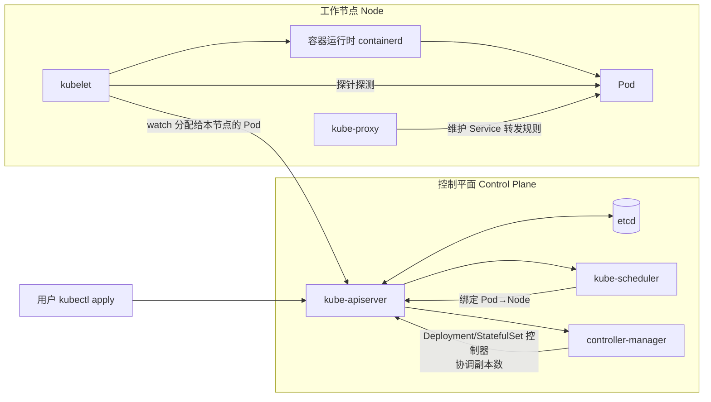
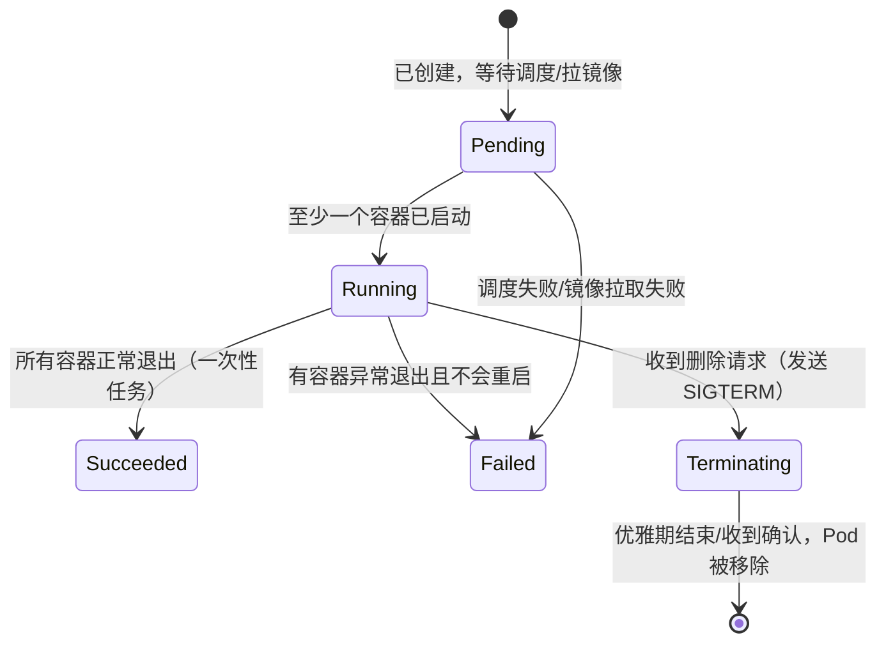
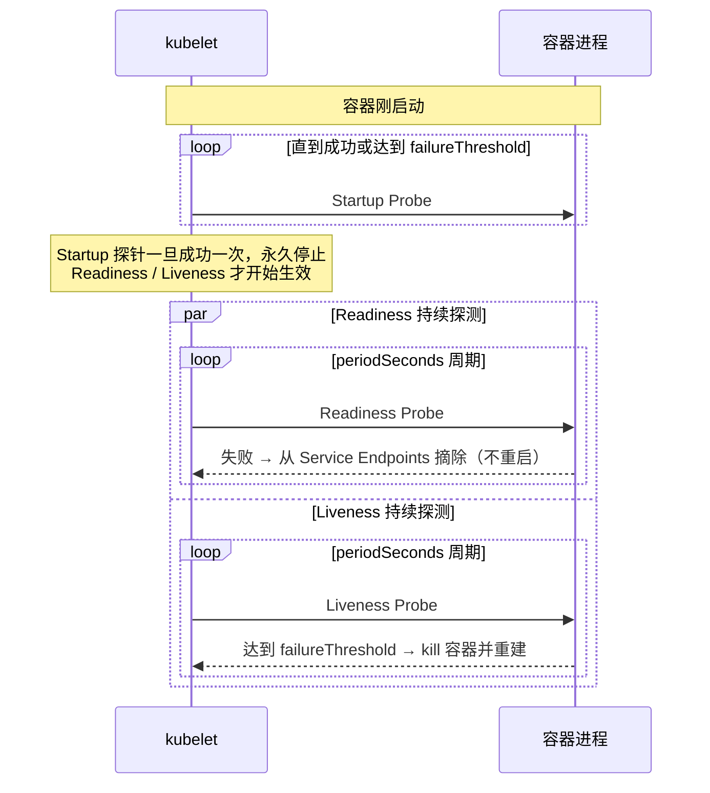
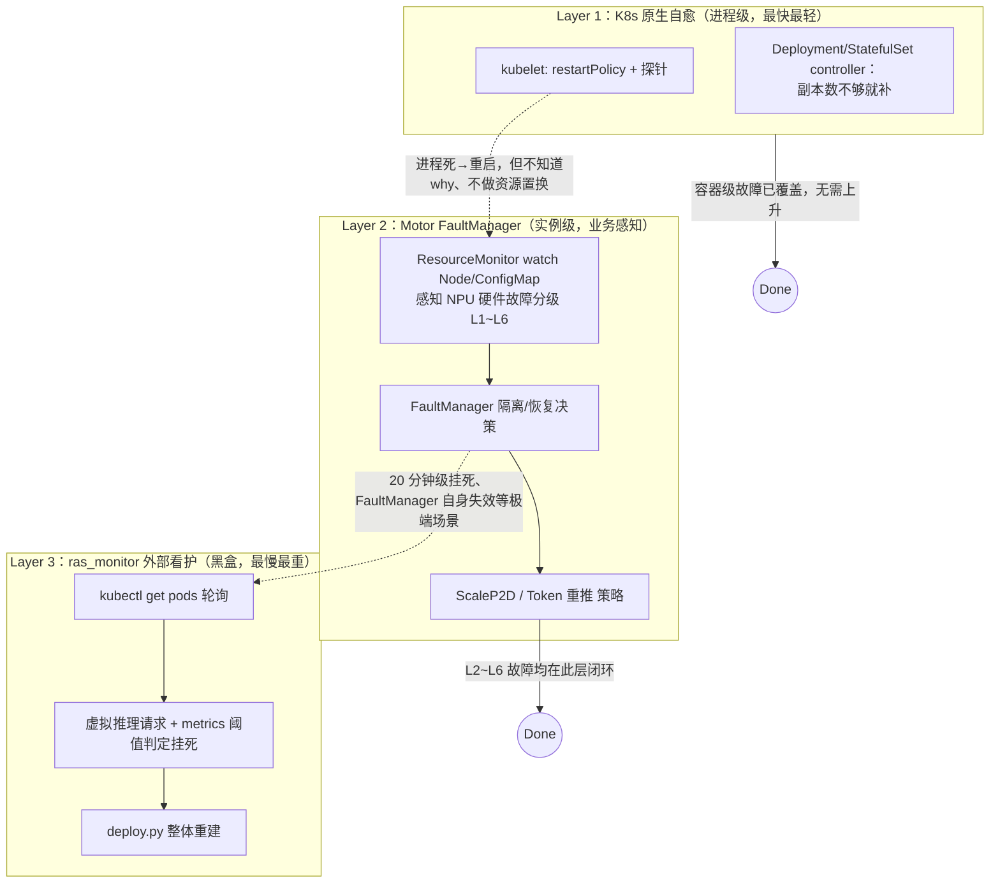
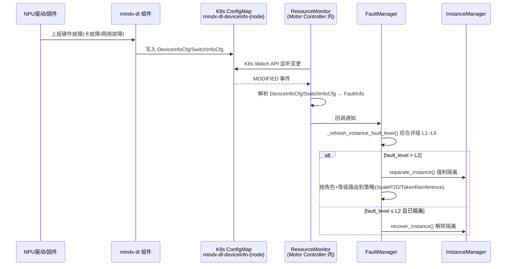
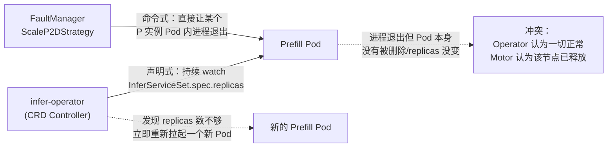

# K8s 与基础设施

> 来源: 2 files | 最后更新: 2026-07-11

## 核心概念

# 专题 12：K8s 基础知识 × 探针（Probe）× Pod 专题——面试官视角问答

*(来源: interview/k8s/12-K8s基础探针与Pod专题.md)*

## 深入分析

### 0. 一句话定位（面试开口先说这句）

> "K8s 是一个声明式的容器编排系统：用户描述'期望状态'（比如'我要 3 个副本、探针配置是这样'），控制平面（apiserver/scheduler/controller-manager/etcd）负责不断把集群的'实际状态'向'期望状态'收敛；Pod 是它调度和生命周期管理的最小单位；探针是 kubelet 用来判断 Pod 到底'活没活、能不能收流量、启没启动完'的手段，三种探针分别服务生命周期的三个阶段。我们在 MindIE-PyMotor 里用 StatefulSet + 自定义 InferServiceSet CRD 拉起 Prefill/Decode 推理实例，探针直接探测推理引擎的 HTTP 健康检查端口，PreStop 钩子做优雅停机，这是把 K8s 原生能力和大模型推理的高可用需求结合起来的一个典型例子。"



---

*(来源: interview/k8s/12-K8s基础探针与Pod专题.md)*

### 1. K8s 基础架构：控制平面 vs 工作节点

**面试官**：K8s 集群由哪些核心组件构成？各自负责什么？

**参考答案**：分成控制平面（Control Plane）和工作节点（Node）两大类。

| 组件 | 所在位置 | 职责 |
|---|---|---|
| `kube-apiserver` | 控制平面 | 集群唯一的统一入口，所有组件（包括 `kubectl`）都通过它读写集群状态；负责认证、鉴权（RBAC）、准入控制（Admission） |
| `etcd` | 控制平面 | 分布式 KV 存储，是集群状态的唯一持久化来源（source of truth），apiserver 是它唯一的读写代理 |
| `kube-scheduler` | 控制平面 | 为新创建的、尚未绑定节点的 Pod 挑选一个合适的 Node（依据资源余量、亲和/反亲和、污点容忍、`nodeSelector` 等），只负责"决策"，不负责"执行" |
| `kube-controller-manager` | 控制平面 | 一堆控制器的集合（Deployment/ReplicaSet/Node/... controller），每个控制器都在跑"期望状态 vs 实际状态"的协调循环（reconcile loop），差距不为 0 就发起动作把差距抹平 |
| `kubelet` | 每个 Node | 节点上的"代理人"，watch 分配给本节点的 Pod，调用容器运行时把 Pod 真正跑起来；**探针也是 kubelet 在本地周期性执行的**，不经过 apiserver 转发 |
| `kube-proxy` | 每个 Node | 维护节点上的转发规则（iptables/IPVS），让访问 Service ClusterIP 的流量能被正确转发到后端 Pod |
| 容器运行时（containerd/CRI-O） | 每个 Node | 真正负责拉镜像、起停容器，通过 CRI 接口被 kubelet 调用 |

**核心心智模型**：K8s 是**声明式**而不是命令式的——你提交的是"我要什么"（YAML 里的 `spec`），而不是"怎么做"；`status` 字段是集群实时反馈的"现在是什么样"；所有控制器都在做同一件事：**让 `status` 追上 `spec`**。这也是为什么"扩缩容"在 K8s 里只是改一个数字（`replicas`）——本仓库 `MindIE-PyMotor` 的扩缩容设计正是如此：

```36:49:MindIE-PyMotor/docs/zh/design/crd_deployment.md
- **replicas**：每 role 有两处 replicas
  - `role.replicas`：实例数目（controller/coordinator 固定为 1；prefill 为 `p_instances_num`；decode 为 `d_instances_num`；PD 混部时 union 为 `hybrid_instances_num`，prefill/decode 置 0）
  - `role.spec.replicas`：对应 multi_yaml 下每个 Deployment 的 pod 数（controller/coordinator 主备时为 2；prefill 为 `single_p_instance_pod_num`；decode 为 `single_d_instance_pod_num`；union 为 `single_hybrid_instance_pod_num`）
```

扩缩容时（`deploy.py --update_instance_num`）本质就是重新生成带有新 `replicas` 值的 `InferServiceSet` YAML 再 `kubectl apply`，剩下的"多退少补"全部交给 CRD controller 的 reconcile 循环去做，业务代码不需要手写"kill 掉哪几个 Pod"。

---

*(来源: interview/k8s/12-K8s基础探针与Pod专题.md)*

### 2. 自定义资源与 Operator：InferServiceSet 是什么

**面试官**：你刚才提到 `InferServiceSet` 不是 K8s 原生资源，这是什么机制？为什么不直接用原生 Deployment？

**参考答案**：K8s 通过 **CRD（CustomResourceDefinition）+ Operator（自定义控制器）** 机制支持用户扩展"资源类型"。CRD 只是往 etcd 里注册一种新的 schema（比如 `apiVersion: mindcluster.huawei.com/v1, kind: InferServiceSet`），本身不带任何行为；真正的"行为"由对应的 Operator（这里是华为 MindCluster 的 infer-operator）以控制器的形式常驻集群，watch 这类 CRD 对象的变化，再据此去创建/更新底层的原生资源（Deployment、StatefulSet、Service）。

为什么大模型推理场景要自定义一个 CRD，而不是直接手写多个 Deployment？因为一次 PD 分离部署天然涉及**多种异构角色**（controller/coordinator/prefill/decode/union，还可能有 kv-pool/kv-conductor），这些角色之间有拓扑关系（比如 prefill 和 decode 数量要联动感知、扩缩容要保证语义一致）。用一个 `InferServiceSet` 对象把这一整组角色声明在一起，比维护一堆互相独立、容易漂移的 Deployment 更利于把"扩缩容一次只能改实例数、不能顺带改部署模式"这类业务约束收敛到 Operator 内部：

```1:53:MindIE-PyMotor/examples/deployer/yaml_template/infer_service_template.yaml
apiVersion: mindcluster.huawei.com/v1
kind: InferServiceSet
metadata:
  name: vllm
  namespace: mindie
  labels: {}
  annotations: {}
spec:
  replicas: 1
  template:
    roles:
    - name: controller
      replicas: 1
      services:
      - name: mindie-motor-service
```

**本仓库的两种部署模式对比，正好体现"原生资源 vs CRD"两条路线的取舍**：

| 维度 | `infer_service_set`（CRD 方式，默认） | `multi_deployment`（原生多 YAML 方式） |
|---|---|---|
| apply 对象 | 1 个 `InferServiceSet` + RBAC | N 个独立 Deployment/Service |
| Pod 创建方 | infer-operator（自定义控制器） | `kubectl apply` 直接创建 |
| 前置依赖 | 集群需预装 infer-operator CRD | 无额外依赖，原生 K8s 即可 |
| 扩缩容 | 改 `InferServiceSet.spec` 里对应 role 的 `replicas` 再 apply | 对新增/删除的 `engine_p*/engine_d*` yaml 分别 apply/delete |

这也是一个很好的"什么时候该用 CRD"的例子：**当同一批资源存在跨对象的业务约束、且这些约束值得被平台层统一兜底时，用 CRD 把复杂度收敛到 Operator；否则原生资源 + 脚本编排（`multi_deployment`）更简单、依赖更少**。

---

*(来源: interview/k8s/12-K8s基础探针与Pod专题.md)*

### 3. Pod 是什么：为什么容器要"套一层" Pod

**面试官**：K8s 为什么不直接调度容器，而要在容器外面套一层 Pod？

**参考答案**：Pod 是 K8s 调度和资源分配的最小单位，一个 Pod 内可以有多个容器，这些容器**共享**：

- **网络命名空间**：同一 Pod 内的容器共用同一个 IP、同一个 `localhost`，通过端口区分服务，天然免去容器间的服务发现问题（sidecar 模式的基础）。
- **存储卷（Volume）**：容器可以挂载同一个 Volume 实现文件级共享（比如日志采集 sidecar 读主容器写的日志文件）。
- **生命周期**：Pod 作为一个整体被调度到某个 Node、一起创建一起销毁；但容器可以有先后依赖（Init Container 先跑完，主容器才启动）。

直接调度容器的问题是：像"一个主容器 + 一个日志采集 sidecar"这种强耦合的组合，如果分别独立调度，没法保证它们被分到同一台机器、共享网络栈；Pod 这一层抽象把"总是需要一起运行、一起failover 的一组容器"打包成一个调度单元，简化了这类场景。

**本仓库的例子**：`InferServiceSet` 里的每个 role（controller/coordinator/prefill/decode）目前都是单容器 Pod（`containers` 数组长度为 1），没有用到多容器 sidecar 模式，这是因为推理场景对**网络时延和资源隔离更敏感**——把日志采集、监控采集都做成独立的 DaemonSet（比如可观测性栈里的 Loki/Prometheus，见 `MindIE-PyMotor/examples/features/observability/stack/`）而不是 sidecar，避免额外容器抢占 NPU 卡所在 Pod 的 CPU/内存配额。

### 3.1 Pod 生命周期与状态机



- **Pending**：Pod 已写入 etcd，但还没有绑定到 Node（等待 scheduler），或已绑定但镜像还在拉取。
- **Running**：至少一个容器在运行（长驻服务通常一直停在这个阶段）。
- **Succeeded / Failed**：针对 Job 类一次性任务；长驻服务（Deployment/StatefulSet 管理的 Pod）异常退出后由控制器直接拉起新 Pod，而不是让旧 Pod 停留在 Failed。
- **Terminating**：`kubectl delete pod` 或滚动更新触发；kubelet 先发 `SIGTERM`（如果配置了 `preStop` 钩子，先跑完钩子脚本），等待 `terminationGracePeriodSeconds`，超时未退出再发 `SIGKILL` 强杀。

**为什么 `terminationGracePeriodSeconds` 和 `preStop` 对推理服务特别重要**：推理引擎正在处理的请求不能被 `SIGKILL` 粗暴打断，否则客户端拿到的是连接重置而不是正常响应。本仓库的做法：

```1:44:MindIE-PyMotor/examples/deployer/prestop/prestop.sh
# PreStop 钩子入口，被 K8s YAML 的 lifecycle.preStop.exec 调用
# 所有输出重定向到 PID 1 的 stdout，供 kubectl logs -f / log_monitor.py 采集
exec >> /proc/1/fd/1 2>&1
...
NM_PID=$(ps -eo pid,args 2>/dev/null | grep "NodeManager" | grep -v grep | awk '{print $1}' | head -1)
python3 "${CONFIGMAP_PATH}/prestop.py" "$@" 2>&1
...
kill -TERM ${NM_PID}
```

流程是：`preStop` 钩子先跑 `prestop.py` 做业务层的"下线通知"（比如让 Coordinator 停止往这个实例调度新请求、等在途请求处理完），再对 NodeManager 进程发 `SIGTERM` 触发它自己的信号处理器优雅停掉 Daemon（推理引擎）、心跳线程、uvicorn server；`terminationGracePeriodSeconds: 30`（见 `engine_template.yaml`）给这一整套优雅退出流程留够时间，超时了 kubelet 才会 `SIGKILL`。这是"K8s 生命周期钩子"这一考点在真实推理系统里的落地。

---

*(来源: interview/k8s/12-K8s基础探针与Pod专题.md)*

### 4. 探针（Probe）：Startup / Readiness / Liveness 三兄弟

**面试官**：K8s 有几种探针？分别解决什么问题？如果三个探针都配了，`kubelet` 的检查顺序是什么样的？

**参考答案**：三种探针服务于容器生命周期的三个不同阶段，**互相独立又有先后依赖关系**：

| 探针 | 解决的问题 | 失败后果 | 典型触发时机 |
|---|---|---|---|
| **Startup Probe** | "这个容器到底有没有启动完成？"——针对启动特别慢的服务（比如要加载几十 GB 模型权重），避免启动阶段被 Liveness 探针误杀 | 探测失败达到阈值 → 直接重启容器（等价于 Liveness 失败的处理） | 容器创建后立即开始，成功一次后**永久停止**，把"活着"的判断权交给 Liveness |
| **Readiness Probe** | "这个容器现在能不能收流量？"——服务可能活着但暂时处理不了请求（比如正在做 GC、模型正在热加载、下游依赖还没连上） | 只是把 Pod 从 Service 的 Endpoints 里摘除，**不重启容器**，等探测恢复成功再重新挂回 | 持续贯穿整个 Running 阶段，周期性执行 |
| **Liveness Probe** | "这个容器是不是死锁/僵死了？"——进程还在但已经失去响应能力 | 探测失败达到阈值 → kubelet 杀掉容器并按重启策略重建 | Startup 探针通过之后才开始，持续贯穿 Running 阶段 |

**三者的先后关系**（这是最容易被问倒的细节）：



**支持的探测方式**：`exec`（执行命令，退出码 0 视为成功）、`httpGet`（请求某端口的某路径，返回码 200-399 视为成功）、`tcpSocket`（端口能否建连）、`grpc`（K8s 1.24+ 原生支持 gRPC 健康检查）。

**关键调参字段**：`initialDelaySeconds`（首次探测前等待）、`periodSeconds`（探测间隔）、`timeoutSeconds`（单次探测超时）、`successThreshold`（连续成功几次才算"通过"，Liveness/Startup 必须是 1）、`failureThreshold`（连续失败几次才判定失败）。

### 4.1 本仓库的探针实现：exec 包装 HTTP 健康检查

`MindIE-PyMotor` 的探针选用了 `exec` 方式，但内部实际发起的是 HTTP 请求——这是一个很实用的工程技巧：**用 `exec` 的形式获得脚本层的灵活性（可以按 role 动态选端口、支持 mTLS），同时探测逻辑本质仍是 HTTP 健康检查**。

Coordinator 的探针配置：

```51:76:MindIE-PyMotor/examples/deployer/yaml_template/coordinator_template.yaml
startupProbe:
  exec:
    command:
    - bash
    - -c
    - "$CONFIGMAP_PATH/probe.sh startup"
  periodSeconds: 10
  failureThreshold: 100
readinessProbe:
  exec:
    command:
    - bash
    - -c
    - "$CONFIGMAP_PATH/probe.sh readiness"
  periodSeconds: 10
  timeoutSeconds: 30
  failureThreshold: 5
livenessProbe:
  exec:
    command:
    - bash
    - -c
    - "$CONFIGMAP_PATH/probe.sh liveness"
  periodSeconds: 10
  timeoutSeconds: 30
  failureThreshold: 5
```

**几个调参细节值得展开讲**：

- `startupProbe.failureThreshold: 100`（配合 `periodSeconds: 10`）意味着最多容忍 **1000 秒（约 16.7 分钟）**的启动时间——这正是为了兼容"大模型权重加载 + NPU 显存初始化"这种慢启动场景；如果没有 Startup Probe、直接让 Liveness 用同样短的阈值探测，容器很可能在权重还没加载完时就被误杀重启，陷入"重启 → 又要重新加载权重 → 又被杀"的死循环。
- Readiness 和 Liveness 都设了 `timeoutSeconds: 30`——因为探测请求本身要打到推理引擎的管理端口，如果引擎正忙于处理大 batch 推理，健康检查接口的响应也可能被排队延迟，30 秒的超时是为了避免"业务繁忙"被误判为"服务不健康"。
- `readinessProbe` 和 `livenessProbe` 的 `failureThreshold` 都设为 `5` 而不是 `1`，是为了容忍网络抖动等偶发失败，避免"一次超时就被摘流量/被重启"的过度敏感。

`probe.sh` 是一层薄封装，按位置参数把 probe 类型和角色传给 Python 脚本：

```12:27:MindIE-PyMotor/examples/deployer/probe/probe.sh
# check probe type
if [ -z "$1" ]; then
    echo "Error: Missing probe type. Please provide one of 'startup', 'readiness', or 'liveness'."
    exit 1
fi
probe_type=$1
if [ -z "$2" ]; then
    role=$ROLE
else
    role=$2
fi
# Execute probe
python3 $CONFIGMAP_PATH/probe.py $role $probe_type
```

`probe.py` 才是真正的探测逻辑——按角色查配置文件里的端口（查不到就用内置默认端口兜底），拼出 `http(s)://<PodIP>:<port>/{startup|readiness|liveness}`，发一次 HTTP GET，200 则 `exit 0`（探测成功），否则 `exit 1`（探测失败，退出码非 0 就是 `exec` 探针判定失败的标准）：

```42:53:MindIE-PyMotor/examples/deployer/probe/probe.py
# Hard-coded URLs for all probe types
PROBE_URLS = {'startup': '/startup', 'readiness': '/readiness', 'liveness': '/liveness'}
# Hard-coded default ports
DEFAULT_PORTS = {
    'controller': 1026,
    'coordinator': 1026,
    'node_manager': 1026,
}
```

```226:227:MindIE-PyMotor/examples/deployer/probe/probe.py
    if role in ('prefill', 'decode', 'union'):
        role = 'node_manager'
```

这里还体现了一个"角色收敛"的小设计：`InferServiceSet` 里 prefill/decode/union 三种角色实际探测的是同一套 NodeManager 管理接口（`node_manager` 配置），只是部署形态不同（PD 分离 vs PD 混部），探针脚本不需要为每种角色单独写一份探测逻辑。

**为什么选 `exec` 而不是原生 `httpGet` 探针**：如果直接用 K8s 原生的 `httpGet` 探针，探测协议（HTTP/HTTPS）、端口这些都要在 YAML 里写死；而 MindIE 支持 mTLS（探针要带证书握手），并且端口是**运行时从业务配置 `user_config.json` 里动态读出来的**（不同角色端口可能不同、也可能被用户自定义覆盖）。`exec` 方式把这部分灵活性下沉到脚本里，YAML 本身保持角色无关、可复用。

---

*(来源: interview/k8s/12-K8s基础探针与Pod专题.md)*

### 5. Pod 调度与容错：亲和性、污点容忍、优雅驱逐

**面试官**：K8s 怎么控制"这个 Pod 必须/不能和另一个 Pod 调度到同一台机器"？节点故障时 Pod 会立刻被判定失败吗？

**参考答案**：

**① 亲和性 / 反亲和性（Affinity / Anti-Affinity）**：通过 `podAffinity`/`podAntiAffinity` 声明"这个 Pod 相对于其他 Pod 的位置偏好"，`nodeAffinity`/`nodeSelector` 声明"这个 Pod 相对于 Node 标签的位置偏好"；`requiredDuringSchedulingIgnoredDuringExecution` 是硬约束（调度时必须满足，不满足则不可调度），`preferredDuringSchedulingIgnoredDuringExecution` 是软约束（尽量满足）。

本仓库 Coordinator 用 `podAntiAffinity` 硬约束，确保 Coordinator 的多个副本不会被调度到同一节点，避免单节点故障导致 Coordinator 整体不可用：

```18:27:MindIE-PyMotor/examples/deployer/yaml_template/coordinator_template.yaml
affinity:
  podAntiAffinity:
    requiredDuringSchedulingIgnoredDuringExecution:
      - labelSelector:
          matchExpressions:
            - key: app
              operator: In
              values:
                - mindie-motor-coordinator
        topologyKey: kubernetes.io/hostname
```

`nodeSelector` 则用于"这个 Pod 必须调度到有昇腾 NPU 卡的机器"这种硬件绑定场景：

```26:29:MindIE-PyMotor/examples/deployer/yaml_template/engine_template.yaml
nodeSelector:
  accelerator: huawei-Ascend910
  accelerator-type: module-910b-8
```

**② 污点与容忍（Taints & Tolerations）**：Taint 打在 Node 上表示"排斥哪些 Pod"，Toleration 声明在 Pod 上表示"我能容忍这个 Taint"，二者匹配才能调度上去（或者已调度上去的 Pod 不会因为 Taint 被驱逐）。节点故障场景下最常用的两个系统级 Taint 是 `node.kubernetes.io/not-ready` 和 `node.kubernetes.io/unreachable`——**节点心跳丢失后，controller-manager 不会立即杀掉上面的 Pod**，而是先打上这两个 Taint，Pod 如果没有对应的 Toleration（或 `tolerationSeconds` 已到期）才会被驱逐重建：

```92:100:MindIE-PyMotor/examples/deployer/yaml_template/infer_service_template.yaml
tolerations:
- key: "node.kubernetes.io/not-ready"
  operator: "Exists"
  effect: "NoExecute"
  tolerationSeconds: 30
- key: "node.kubernetes.io/unreachable"
  operator: "Exists"
  effect: "NoExecute"
  tolerationSeconds: 30
```

这里配置 `tolerationSeconds: 30` 而不是默认的 300 秒，是推理服务对故障恢复时延更敏感的体现——**默认值是为了容忍瞬时网络抖动，但推理服务宁愿更快地判定节点失联、更快地在其他节点上重建实例**，用短暂的"误判驱逐"风险换取整体可用性恢复速度。这个参数本质上是在" avoiding 误判"和"故障恢复 RTO"之间做权衡，是 SRE/高可用设计里的常见考点。

**③ Gang Scheduling（协同调度）**：大模型多卡分布式推理要求"一组 Pod 要么全部调度成功，要么都不调度"（否则会出现"只起来一半节点，分布式初始化卡死等待"的资源黑洞）。本仓库用 Volcano 调度器 + 自定义标签实现：

```309:329:MindIE-PyMotor/examples/deployer/yaml_template/infer_service_template.yaml
metadata:
  labels:
    infer.huawei.com/gang-schedule: 'true'
...
      labels:
        fault-scheduling: grace
        fault-retry-times: "10000"
        app: mindie-server
        ring-controller.atlas: ascend-910b
    spec:
      schedulerName: volcano
```

`schedulerName: volcano` 把调度决策从默认的 `kube-scheduler` 换成 Volcano（批量计算场景常用的调度器），配合 `gang-schedule: 'true'` 标签实现"这一组 Pod 要么同时调度成功，要么都不调度"的语义，这是原生 K8s 默认调度器不具备、需要专用调度器插件补齐的能力——面试如果被问"K8s 原生调度器能不能做 gang scheduling"，答案是**不能，需要 Volcano/Kueue 这类专用调度器扩展**。

**④ `StatefulSet` 的 `podManagementPolicy: Parallel`**：Prefill/Decode 用 `StatefulSet`（而非 `Deployment`）是因为需要**稳定的网络标识**（`pod-0`、`pod-1` 这种可预测的 DNS 名字，分布式推理节点间要按固定编号互联，比如 RDMA/HCCL 建链）；但 `StatefulSet` 默认是按序号**串行**创建/更新 Pod（`OrderedReady`），这对"多机多卡要同时起来才有意义"的推理场景反而是负优化，所以显式配置 `podManagementPolicy: Parallel` 让 Pod 并行创建：

```312:314:MindIE-PyMotor/examples/deployer/yaml_template/infer_service_template.yaml
workload:
  apiVersion: apps/v1
  kind: StatefulSet
...
    podManagementPolicy: Parallel
```

---

*(来源: interview/k8s/12-K8s基础探针与Pod专题.md)*

### 6. Pod 与外部世界：Service、Downward API、ConfigMap

**面试官**：Pod IP 会随着重建而变化，服务发现怎么解决？Pod 内的进程怎么知道自己所在的 Node、Namespace 这些"元信息"？

**参考答案**：

**① Service 解决"稳定入口"问题**：Pod 是易失的（重建后 IP 会变），`Service` 通过 `selector`（标签选择器）动态维护一组匹配 Pod 的 Endpoints 列表，对外暴露一个稳定的 ClusterIP/DNS 名字；`kube-proxy` 在每个节点上维护 iptables/IPVS 规则把发往 Service IP 的流量负载均衡到某个后端 Pod。本仓库用三种 Service 类型服务不同场景：

```172:206:MindIE-PyMotor/examples/deployer/yaml_template/infer_service_template.yaml
- name: mindie-motor-coordinator-infer   # NodePort：集群外部可访问的推理入口
  spec:
    type: NodePort
- name: mindie-motor-coordinator-mgmt    # ClusterIP：集群内部管理面调用（探针、控制器查询）
  spec:
    type: ClusterIP
```

**② Downward API 把 K8s 元信息注入容器**：不需要额外查询 apiserver，直接通过 `env.valueFrom.fieldRef` 把 Pod 自身的字段（IP、所在 Node IP、Namespace 等）作为环境变量注入，这是"探针脚本怎么知道要探测哪个 IP"这个问题的答案：

```126:142:MindIE-PyMotor/examples/deployer/yaml_template/infer_service_template.yaml
env:
- name: POD_IP
  valueFrom:
    fieldRef:
      fieldPath: status.podIP
- name: HOST_IP
  valueFrom:
    fieldRef:
      fieldPath: status.hostIP
- name: POD_NAMESPACE
  valueFrom:
    fieldRef:
      fieldPath: metadata.namespace
```

`probe.py` 正是靠 `POD_IP` 这个 Downward API 注入的环境变量拼出探测地址：

```234:238:MindIE-PyMotor/examples/deployer/probe/probe.py
    pod_ip = os.environ.get('POD_IP')
    if not pod_ip:
        logger.error("POD_IP environment variable not set")
        sys.exit(1)
```

**③ 反过来：Pod 内组件要主动查 apiserver 时，用官方 client-go / kubernetes Python SDK**。本仓库的容错模块需要"给定一个 Pod IP，反查它调度到了哪个物理节点"（用于故障定位、判断是否多个实例共享同一台故障机器），就是直接调用 `CoreV1Api` 按 `field_selector` 过滤查询：

```18:53:MindIE-PyMotor/motor/controller/fault_tolerance/k8s/k8s_client.py
class K8sClient:
    """Kubernetes client wrapper for common operations"""

    def __init__(self):
        self.v1 = None
        try:
            config.load_incluster_config()
            self.v1 = client.CoreV1Api()
        except Exception as e:
            try:
                config.load_kube_config()
                self.v1 = client.CoreV1Api()
            except Exception as e2:
                logger.warning("Failed to load Kubernetes config: %s, %s", e, e2)

    def get_node_hostname_by_pod_ip(self, pod_ip: str) -> str | None:
        pods = self.v1.list_pod_for_all_namespaces(field_selector=f"status.podIP={pod_ip}")
        for pod in pods.items:
            node_name = getattr(pod.spec, "node_name", None)
            if node_name:
                return node_name
        return None
```

这里 `load_incluster_config()` 优先、失败再退回本地 `kubeconfig`，是一个通用的"进程既可能跑在集群内 Pod 里，也可能被开发者在集群外调试"的双模式兼容写法——面试可以顺带提这个细节体现对生产代码鲁棒性的关注：`try/except` 两层兜底、拿不到 client 时 `is_available()` 让调用方能安全降级而不是直接抛异常导致主流程崩溃。

**④ ConfigMap 承载"配置即代码"**：所有角色共用同一个 `motor-config` ConfigMap，把 `user_config.json`（业务配置）、`boot.sh`（启动脚本）、`probe.sh`/`probe.py`（探针脚本）、`prestop.sh`（停机钩子）都作为文件挂载进容器（`defaultMode: 360` 即 `0550`，只读可执行）：

```158:162:MindIE-PyMotor/examples/deployer/yaml_template/infer_service_template.yaml
volumes:
- name: motor-config
  configMap:
    name: motor-config
    defaultMode: 360
```

这样"改探针逻辑 / 改启动参数"不需要重新构建镜像，只需要更新 ConfigMap 再滚动重启 Pod，是"配置与镜像解耦"这条最佳实践的具体体现。

---

*(来源: interview/k8s/12-K8s基础探针与Pod专题.md)*

### 7. 面试速答清单（30 秒版本）

| 问题 | 一句话答案 |
|---|---|
| Pod 是什么 | K8s 调度和生命周期管理的最小单位，内部容器共享网络/存储/生命周期 |
| 三种探针的区别 | Startup 管"启动完没"（只判一次，之后失效）、Readiness 管"能不能收流量"（失败只摘 Endpoints 不重启）、Liveness 管"死没死"（失败会重启容器） |
| exec/httpGet/tcpSocket 怎么选 | 协议固定、无需动态参数选 `httpGet`；需要脚本级灵活性（动态端口、mTLS、自定义判定逻辑）选 `exec`；只关心端口通不通选 `tcpSocket` |
| 为什么大模型服务的 Startup 探针阈值要设很大 | 权重加载/显存初始化耗时可能到分钟级，避免启动阶段被 Liveness 逻辑误杀陷入重启死循环 |
| `preStop` 和 `terminationGracePeriodSeconds` 的作用 | 收到删除请求先跑 `preStop` 做优雅下线（停止接新流量、等在途请求完成），宽限期内没退出才 `SIGKILL` |
| Deployment vs StatefulSet 怎么选 | 无状态、Pod 可互换选 Deployment；需要稳定网络标识/存储、Pod 间有编号依赖（分布式训练/推理节点互联）选 StatefulSet |
| Node 故障后 Pod 立刻重建吗 | 不会立刻。先打 `not-ready`/`unreachable` Taint，`tolerationSeconds` 到期才驱逐重建，默认 300s，高可用敏感场景可调短 |
| K8s 原生调度器支持 Gang Scheduling 吗 | 不支持，需要 Volcano/Kueue 等专用调度器扩展（`schedulerName: volcano`） |
| CRD 和 Operator 的关系 | CRD 只注册新资源的 schema，Operator 是常驻的自定义控制器，真正 watch 该资源并驱动底层原生资源的创建/更新 |
| Downward API 是什么 | 把 Pod 自身元信息（IP、Node IP、Namespace 等）通过 `fieldRef` 注入为容器环境变量/文件，无需额外查询 apiserver |

---

*(来源: interview/k8s/12-K8s基础探针与Pod专题.md)*

### 延伸：与专题 09 的衔接

本篇讲的是 MindIE-PyMotor **Motor 调度层**在 K8s 上"怎么把 Pod 拉起来、怎么保证高可用"；[专题 09](09-MindIE并行策略与调度调优专题.md) 讲的是**推理引擎内部**"多卡之间怎么切并行策略、怎么调度 batch"。两者的关系是：K8s 层的 `replicas`/探针/StatefulSet 决定了"有多少个推理实例、每个实例死没死"，MindIE-LLM 的 `tp`/`dp`/`maxBatchSize` 决定了"单个实例内部怎么榨性能"——一个是"实例间"的高可用与弹性，一个是"实例内"的并行与调度，面试如果连续问到这两块，可以用这条主线把两篇内容串起来讲。

*(来源: interview/k8s/12-K8s基础探针与Pod专题.md)*

### 0. 一句话结论（面试开口先说这句）

> "K8s 原生的可靠性原语（`restartPolicy`、探针、`ReplicaSet`/`StatefulSet` 控制器）只能感知'容器进程死没死'这个粗粒度信号，既看不到 NPU 硬件故障的精细分级，也不知道'这是 Prefill 还是 Decode、坏了该不该做资源置换'这类业务语义。所以 MindIE-PyMotor 的 RAS 能力实际上是**在 K8s 之上叠了两层**：一层是 Controller 里常驻的 `FaultManager`，反过来**主动调用 K8s API**（watch Node、watch ConfigMap、反查 Pod-Node 映射）拿到硬件故障信号，做实例级的隔离/恢复/ScaleP2D/token 重推，这一层比 K8s 原生自愈更细粒度、更快、代价更低；另一层是完全在 K8s 之外的 `ras_monitor.py`，只用 `kubectl` 查询 Pod 状态、拿业务侧的推理请求做黑盒探活，作为前两层都失效时的最后兜底，代价是最重的——整个服务删了重新 `deploy.py` 拉起。这三层是**能力递进、代价递增**的关系，而不是互相替代。"



---

*(来源: interview/k8s/13-MindIE-PyMotor的RAS能力与K8s关系专题.md)*

### 1. 先明确概念：RAS 是什么，为什么推理框架要单独做

**面试官**：RAS 具体指什么？为什么不直接依赖 K8s 的健康检查加 `restartPolicy: Always`？

**参考答案**：RAS = **Reliability（可靠性）+ Availability（可用性）+ Serviceability（可服务性）**，是电信/存储等基础设施领域的老概念，核心诉求是"故障发生时，尽量少丢流量、尽快恢复、恢复代价尽量小"。

K8s 原生自愈（`restartPolicy` + 探针 + 控制器补齐副本数）能覆盖的是**"容器活着还是死了"**这个二元信号；但大模型分布式推理的故障场景要复杂得多：

| 故障场景 | K8s 原生视角 | 业务实际需要的动作 |
|---|---|---|
| 某张 NPU 卡出现瞬时链路抖动（L2） | 容器进程还在跑，探针大概率还是绿的，K8s **完全无感** | 只重推受影响的几个 token，不该重启任何容器 |
| Decode 实例某几张卡需要隔离（L4+） | 只要容器没死、探针没连续失败，K8s 不会有动作 | 需要**跨实例**做资源置换（缩 P 保 D），这已经超出单个 Pod 的范畴 |
| Node 变为 NotReady | K8s 会打 Taint，`tolerationSeconds` 到期后驱逐重建 Pod | 但重建后的新 Pod 要重新向 Controller 注册、拿到正确的 `instance_id`/`ranktable`，这是**业务协议层**的事，K8s 不管 |
| 引擎进程还活着但推理请求全部超时（软件挂死） | 如果探针只测端口/简单 HTTP，可能长期"探测通过"却测不出真实挂死 | 需要业务级的"虚拟推理请求"才能测出来 |

**结论**：K8s 提供的是通用的"进程存活"原语，MindIE-PyMotor 的 RAS 能力要解决的是"NPU 硬件故障怎么分级处理"+"多 Pod 组成的一个推理实例怎么整体恢复"+"P/D 之间怎么做资源置换"这类业务语义问题，这些是 K8s 设计上就不该管、也管不了的部分——**RAS 能力的本质是在 K8s 通用可靠性原语之上叠加一层业务感知的调度智能**。

---

*(来源: interview/k8s/13-MindIE-PyMotor的RAS能力与K8s关系专题.md)*

### 2. RAS 三层能力与 K8s 的具体交互方式

### 2.1 Layer 1：K8s 原生自愈——RAS 的地基，但只解决"重启"

这一层完全是 K8s 自带能力，Motor 不需要写任何代码：

- **kubelet 按 `restartPolicy` 重启容器**：容器异常退出，kubelet 直接原地重启（不换 Pod IP、不重新调度）。
- **探针驱动的重启/摘流量**：见 [专题 12](12-K8s基础探针与Pod专题.md#4-探针probestartup--readiness--liveness-三兄弟)，Liveness 探针连续失败触发容器重启。
- **`StatefulSet`/`Deployment` 控制器补齐副本数**：Pod 被彻底杀掉（比如所在 Node 被驱逐），控制器发现"实际副本数 < 期望副本数"，在其他可用 Node 上重新调度一个新 Pod。

**这一层恰好是"自动重拉起注册"能力的前置条件**：

```70:105:MindIE-PyMotor/docs/zh/design/fault_tolerance/overview.md
Pod 因故障被 K8s 重启
        │
        ▼
NodeManager 启动，EngineManager._register() 发送 RegisterMsg 到 Controller
        │
        ▼
Controller InstanceAssembler.register()
  ...
        ▼
NodeManager 接收 StartCmdMsg
  - Daemon.pull_engine(): 启动 engine_server 推理进程
  - HeartbeatManager.start(): 开始心跳上报
        ▼
InstanceManager 收到心跳 → 状态机: INITIAL → ACTIVE
实例恢复正常服务
```

这条链路第一步"Pod 因故障被 K8s 重启"完全依赖 K8s 原生机制（kubelet 重启容器，或控制器重新调度 Pod）；从第二步开始才是 Motor 自己的业务协议（NodeManager 重新注册 → Controller 重新组装实例 → 下发启动指令）。**换句话说：K8s 负责"把进程重新跑起来"，Motor 负责"让这个新进程重新变回集群里正确的那个角色"**——这正是"K8s 通用能力 + 业务框架专属协议"分层协作的典型例子。

### 2.2 Layer 2：FaultManager——RAS 的核心，反向调用 K8s API 做精细化决策

这一层是 RAS 能力的主体，运行在 Controller 进程内部，**主动**去 watch K8s 资源，而不是被动等 K8s 通知：



**这一层用到的 K8s 能力具体是三个 API，全部封装在 `motor/controller/fault_tolerance/k8s/` 目录下**：

| K8s 能力 | 对应代码 | 用途 |
|---|---|---|
| **Node Watch API** | `resource_monitor.py: _monitor_node()` | 监听 Node 的 `Ready` Condition，变为 `NotReady` 时注入 `NODE_REBOOT` 故障（L6） |
| **ConfigMap Watch API** | `resource_monitor.py: _monitor_configmap()` | 监听 `mindx-dl-deviceinfo-{node_name}` ConfigMap（由华为 MindX DL 设备插件写入），解析出 NPU 卡故障/网络故障/交换机故障 |
| **Pod 反查 Node** | `k8s_client.py: get_node_hostname_by_pod_ip()` | 按 `field_selector=status.podIP=xxx` 查询 Pod 所在 Node，用于故障定位和 ScaleP2D 里的节点所有权交换 |

值得展开的实现细节——**Watch 连接的健壮性设计**，这是"生产级 K8s Watch 客户端应该怎么写"的一个很好的范例：

```172:245:MindIE-PyMotor/motor/controller/fault_tolerance/k8s/resource_monitor.py
def _monitor_node(self) -> None:
    resource_version = None
    consecutive_failures = 0
    while not self.stop_event.is_set():
        try:
            if resource_version is None:
                nodes = self.v1.list_node(field_selector=f"metadata.name={node_name}")
                if nodes.items:
                    resource_version = nodes.metadata.resource_version
                    self._handle_node_change("ADDED", nodes.items[0])  # 立即处理当前状态
            w = watch.Watch()
            for event in w.stream(self.v1.list_node, resource_version=resource_version, ...):
                ...
        except ApiException as e:
            if e.status == 410:
                resource_version = None  # resourceVersion 过期，需要重新 LIST
            delay = self._compute_backoff(consecutive_failures, is_410=(e.status == 410))
            time.sleep(delay)
            consecutive_failures += 1
```

三个值得记住的设计点（面试如果被问"你写过 K8s Watch 客户端吗，要注意什么"可以直接抄这个模型回答）：

1. **先 List 再 Watch，且立即处理一次当前状态**——因为 K8s Watch 语义是"只推送 `resourceVersion` **之后**的增量事件"，如果不先处理一次 List 到的当前状态，会漏掉"Watch 建立前就已经存在的故障"。
2. **`HTTP 410 Gone` 的专门处理**——K8s apiserver 的 Watch 连接底层基于 etcd 的历史版本窗口，`resourceVersion` 太旧会被 apiserver 主动断开并返回 410，这不是"错误"而是**协议内正常事件**，需要专门识别、重新发起一次 List 拿到新的 `resourceVersion`，而不是当成普通异常做统一重试。
3. **指数退避 + 重连成功后重置计数**——避免 apiserver 抖动/重启期间大量客户端同时疯狂重连造成"惊群效应"。

**ConfigMap 里的故障信息具体长什么样、怎么被解析成分级故障**，可以对照 `configmap_parser.py` 里的字段结构：ConfigMap 由华为的 MindX DL 组件写入 `DeviceInfoCfg`（NPU 卡级故障）和 `SwitchInfoCfg`（交换机级故障）两类 JSON，`process_device_info`/`process_switch_info` 分别解析出 `fault_code`（十六进制故障码）和 `fault_level` 字符串（如 `RestartRequest`/`SeparateNPU`），再经 `map_fault_level()` 映射为 PyMotor 内部统一的 `FaultLevel`（L1~L6）。**这一整条链路的本质是：把 K8s 之外的硬件监控系统（MindX DL）的信息，通过 K8s ConfigMap 这个"通用配置分发/变更通知机制"搭便车传递给 Motor**——K8s 在这里被当成了一个跨组件的、自带 Watch 能力的消息总线，而不仅仅是配置存储。

**FaultManager 拿到分级故障后的动作，和 K8s 原生自愈完全不是一个数量级**：

- **L2（可自愈）**：只触发 `TokenReinferenceStrategy`，只重推受影响的 token，**不重启任何容器、不惊动 K8s**。
- **L4~L6（需要隔离/资源不足）**：触发 `ScaleP2DStrategy`——通过 `NodeManagerApiClient.stop()` 主动对若干 Prefill 实例的 NodeManager 发 HTTP 请求让它自己优雅退出，而不是找 K8s 去 `kubectl delete pod`；释放出来的物理节点由**新的 Decode 实例走"自动重拉起注册"流程**认领（这一步又要借助 Layer 1 的 Pod 重建机制）。

**关键认知**：Layer 2 并没有绕开 K8s，而是选择性地使用 K8s 能力——**读（Watch Node/ConfigMap、查 Pod）用 K8s 原生 API，写（让某个实例停止）走自己的业务 HTTP 协议而不是 `kubectl delete`**，这是因为"优雅停止"需要业务层面做"先通知 Coordinator 停止调度新请求、等在途请求完成"这类逻辑（参考专题 12 里 `prestop.sh` 的做法），直接粗暴删 Pod 拿不到这个语义。

### 2.3 Layer 3：ras_monitor.py——K8s 之外的黑盒兜底

这是三层里和 K8s 耦合最浅的一层，本质是一个**独立运行的外部看护脚本**（不在 Controller/NodeManager 进程内，需要用户单独 `nohup` 启动），设计目标是覆盖前两层都覆盖不到的场景：

```1:11:MindIE-PyMotor/examples/features/fault_tolerance/ras_monitor/readme.md
出于PD实例可靠性增强的目的，MindIE-pyMotor 提供一个参考脚本 ras_monitor 进行大EP服务的健康状态监控和快速重启，ras_monitor 启动后，当软件故障发生导致服务不可用时，该脚本20分钟左右可检测到并启动自动重拉。
适用范围说明：
- 适用场景：大EP出现挂死等服务不可用且不可自恢复的场景
```

它和 K8s 的交互方式极其"轻量"、完全是命令行黑盒调用，不使用 Python K8s client、不 watch 任何资源：

```99:101:MindIE-PyMotor/examples/features/fault_tolerance/ras_monitor/ras_monitor.py
def kubectl_get_pods_info():
    result = subprocess.run(
        [shutil.which("kubectl"), "get", "pods", "-A", "-owide"], capture_output=True, text=True, check=True
    )
```

主循环逻辑是"定期发一个虚拟推理请求 + 看 Prometheus 风格的 `request_success_total` 指标是否符合预期"，判定服务挂死后调用 `restart_service()`：

```330:344:MindIE-PyMotor/examples/features/fault_tolerance/ras_monitor/ras_monitor.py
def restart_service(namespace: str, boot_args):
    logging.info("Start to retain logs and restart service")
    ...
    # restart service
    ... 调用 deploy.py 重新部署 ...
```

**为什么要有这样一层看似"简陋"的兜底**：Layer 2 的 FaultManager 覆盖的是"能被硬件驱动/固件感知到、能通过 ConfigMap 上报的故障"以及"vLLM EngineCore 能通过 ZMQ 主动上报的软件故障"；但如果整个 Controller 进程自己卡死、或者故障模式压根没有被驱动层感知到（比如纯软件死锁、没有触发任何硬件故障码），Layer 2 会**完全失效且不自知**。`ras_monitor.py` 故意设计成一个**完全独立、外部、只依赖最基础的 `kubectl` + HTTP 探活**的进程，恰恰是为了避免自己也依赖 Motor 内部状态而"和 Motor 一起挂掉却察觉不到"——这是分布式系统里"看门狗要比被看的对象更简单、更独立"的经典设计原则。代价是它的检测周期是"20 分钟级"、恢复手段是最重的"整个服务删了重新 `deploy.py` 拉起"，符合"越兜底的层，代价可以越重但必须越可靠"的分层设计哲学。

---

*(来源: interview/k8s/13-MindIE-PyMotor的RAS能力与K8s关系专题.md)*

### 3. 一个关键矛盾：RAS 能力与 CRD 部署模式目前互斥

**面试官**：你们的 K8s 部署有两种模式（CRD 方式 vs 传统多 YAML），RAS 能力在两种模式下都能用吗？

**参考答案**：**不能，这是当前架构一个明确记录在文档里的限制**——RAS 能力目前只支持 `multi_deployment`（传统多 YAML）部署模式，`infer_service_set`（CRD 方式，且是默认模式）尚未完成 RAS 能力的适配验证：

```46:46:MindIE-PyMotor/docs/zh/user_guide/deployment/k8s/config_reference.md
| deploy_mode | string | 部署方式...CRD 方式尚未完成 RAS 能力与池化能力的适配验证；若需 RAS（可靠性、可用性、可服务性）或 KV 池化能力，请设置为 `multi_deployment` |
```

**为什么会有这个限制？（面试官大概率会追问原因，这里给出基于架构设计的合理推断）**

核心矛盾在于：**FaultManager 的 ScaleP2D 等策略，是直接绕过"声明式期望状态"、命令式地对某个实例发号施令（调 `NodeManagerApiClient.stop()` 让 Pod 内进程自己退出）**；而 CRD 模式下，Pod 的存在性和数量是由 InferServiceSet 的 `spec.replicas` 决定、由 infer-operator 的 reconcile 循环持续"纠正"回期望状态的。这就会产生**两个控制回路互相打架**的经典问题：



如果在 `multi_deployment` 模式下，Prefill/Decode 的每个角色都是一个独立的 `Deployment`/`StatefulSet` YAML，**Motor 自己的 `deploy.py` 拥有对这些原生资源的完全控制权**（想缩容就改 YAML 里的 replicas 数再 apply，不会有第三方控制器抢着"纠正"）；而在 `infer_service_set` 模式下，这部分控制权被移交给了 infer-operator，Motor 的 FaultManager 如果继续用"直接让进程退出"这种旁路手段，就会和 CRD controller 的调谐循环产生状态不一致——这正是**"谁才是这个资源的唯一 owner（controller）"**这个 K8s 声明式系统设计中的核心原则（single writer principle）被打破的场景。要在 CRD 模式下支持 RAS，理论上需要让 ScaleP2D 这类策略也改为"修改 InferServiceSet.spec"而不是直接操作 Pod/进程，把恢复动作也纳入 CRD 的声明式语义里——这也是文档里"尚未完成适配验证"的合理技术原因。

**这个矛盾点非常适合作为面试的加分项来讲**：它体现了对"声明式系统里，多个控制器同时管理同一份资源会冲突"这一 K8s 设计核心原则的理解，而不是只会背"CRD 就是自定义资源"这种表面概念。

---

*(来源: interview/k8s/13-MindIE-PyMotor的RAS能力与K8s关系专题.md)*

### 4. 全景对照表：三层 RAS 能力 × K8s 交互方式

| 维度 | Layer 1：K8s 原生自愈 | Layer 2：FaultManager | Layer 3：ras_monitor |
|---|---|---|---|
| 运行位置 | K8s 控制平面 + kubelet（集群内置组件） | Controller 进程内常驻线程 | 独立于 Motor 之外的外部脚本 |
| 感知的故障粒度 | 容器存活/端口探测（二元） | NPU 硬件故障 L1~L6 分级 + 软件故障（ZMQ 上报） | 业务级请求成功率/耗时指标 |
| 与 K8s 的交互方式 | 就是 K8s 自身 | **主动** Watch Node/ConfigMap（读）+ 业务 HTTP 协议（写，不走 kubectl） | 只用 `kubectl get pods` 查询（读），恢复靠重新 `deploy.py` apply（写） |
| 典型恢复动作 | 重启容器 / 重新调度 Pod | Token 重推（无感）/ ScaleP2D（跨实例资源置换） | 删除并整体重新拉起服务 |
| 检测时延 | 秒级（探针周期） | 秒级（ConfigMap Watch 是事件驱动，近实时） | 分钟级（约 20 分钟） |
| 恢复代价 | 低（只重启一个容器） | 中（可能停掉若干 P 实例做资源置换） | 高（整个服务重建，业务完全中断一段时间） |
| 对部署模式的依赖 | 两种模式都支持（K8s 通用能力） | **仅 `multi_deployment` 支持**，CRD 模式未适配 | 两种模式都可用（只依赖 kubectl + deploy.py，与部署模式解耦） |

---

*(来源: interview/k8s/13-MindIE-PyMotor的RAS能力与K8s关系专题.md)*

### 5. 面试速答清单

| 问题 | 一句话答案 |
|---|---|
| MindIE-PyMotor 的 RAS 能力算不算"重复造 K8s 的轮子" | 不算，K8s 只感知容器存活这一种粗粒度信号，RAS 要处理的是 NPU 硬件故障分级、P/D 跨实例资源置换这类业务语义，K8s 设计上就不该管这些 |
| FaultManager 怎么拿到硬件故障信息 | 不是等 K8s 通知，而是主动用 K8s Watch API 监听 `mindx-dl-deviceinfo-{node}` ConfigMap（硬件监控组件写入）和 Node Ready 状态 |
| ScaleP2D 恢复时是调用 `kubectl delete pod` 吗 | 不是，是通过业务自定义的 HTTP 协议（`NodeManagerApiClient.stop()`）让目标 Pod 内的进程自己优雅退出，保留了"通知下游、等在途请求完成"的语义 |
| K8s Watch 出现 410 Gone 怎么处理 | 这是 `resourceVersion` 过期的正常协议行为（不是错误），需要重新发起一次 List 拿新的 `resourceVersion`，不能当普通异常无脑重试 |
| 为什么还要有 `ras_monitor.py` 这层看似简陋的兜底 | 覆盖 FaultManager 依赖的硬件驱动/ZMQ 上报都感知不到的"纯软件挂死"场景；看门狗要比被看对象更独立简单，避免自己也跟着挂掉却不自知 |
| RAS 能力两种部署模式都支持吗 | 不支持，目前只有 `multi_deployment`（传统多 YAML）支持，`infer_service_set`（CRD，默认模式）尚未适配——本质是"谁拥有资源调谐权"的单一 owner 原则冲突 |

---

*(来源: interview/k8s/13-MindIE-PyMotor的RAS能力与K8s关系专题.md)*

### 延伸阅读

- 三层 RAS 的第二层细节：[FaultManager 设计文档](../../MindIE-PyMotor/docs/zh/design/fault_tolerance/fault_manager.md)、[ScaleP2D 特性文档](../../MindIE-PyMotor/docs/zh/design/fault_tolerance/scale_p2d.md)
- K8s 基础与探针/Pod：[专题 12](12-K8s基础探针与Pod专题.md)
- MindIE 并行与调度调优（"实例内"视角，与本篇"实例间"高可用视角互补）：[专题 09](../interview-review/09-MindIE并行策略与调度调优专题.md)

*(来源: interview/k8s/13-MindIE-PyMotor的RAS能力与K8s关系专题.md)*

## 面试要点

**专题 12：K8s 基础知识 × 探针（Probe）× Pod 专题——面试官视角问答**

# 专题 12：K8s 基础知识 × 探针（Probe）× Pod 专题——面试官视角问答

> 定位：本篇不基于某次具体转写复盘，而是**模拟面试官出题**，按"K8s 整体架构 → Pod 核心概念 → 三种探针 → 生产级 Pod 编排实践"的顺序考察，每题给出参考答案，并尽量结合本仓库 `MindIE-PyMotor/`（昇腾 MindIE 推理服务的 K8s 部署与调度组件）的真实代码/YAML 落地佐证，做到"会背概念，也能讲清楚工程上怎么用"。
>
> 代码与 YAML 引用均在本工作区核实：探针脚本 `MindIE-PyMotor/examples/deployer/probe/{probe.sh,probe.py}`；PreStop 钩子 `MindIE-PyMotor/examples/deployer/prestop/prestop.sh`；Deployment/StatefulSet 模板 `MindIE-PyMotor/examples/deployer/yaml_template/*.yaml`；CRD 设计 `MindIE-PyMotor/docs/zh/

*(来源: interview/k8s/12-K8s基础探针与Pod专题.md)*

**专题 13：MindIE-PyMotor 的 RAS 能力与 K8s 关系——面试官视角问答**

# 专题 13：MindIE-PyMotor 的 RAS 能力与 K8s 关系——面试官视角问答

> 承接 [12-K8s基础探针与Pod专题](12-K8s基础探针与Pod专题.md)：那一篇讲的是"K8s 原生能力本身怎么用"（探针、Pod、调度），本篇聚焦一个更进一步的问题——**MindIE-PyMotor 的 RAS（Reliability, Availability, Serviceability，可靠性/可用性/可服务性）能力，到底是"用 K8s 做的"还是"绕开 K8s 自己做的"，两者具体是什么分工关系**。这是理解"为什么一个推理框架要在 K8s 之上再造一层故障管理"的关键问题，也是容易被面试官追问"K8s 自己不是有健康检查和自愈吗，为什么还要自己写"的地方。
>
> 代码与文档均在本工作区核实：`MindIE-PyMotor/docs/zh/design/fault_tolerance/{overview,fault_manager,scale_p2d}.md`；`MindIE-PyMotor/motor/controller/fault_tolerance

*(来源: interview/k8s/13-MindIE-PyMotor的RAS能力与K8s关系专题.md)*

## 源文件索引

- interview/k8s/12-K8s基础探针与Pod专题.md — 专题 12：K8s 基础知识 × 探针（Probe）× Pod 专题——面试官视角问答
- interview/k8s/13-MindIE-PyMotor的RAS能力与K8s关系专题.md — 专题 13：MindIE-PyMotor 的 RAS 能力与 K8s 关系——面试官视角问答
