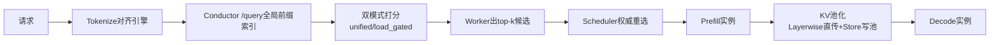
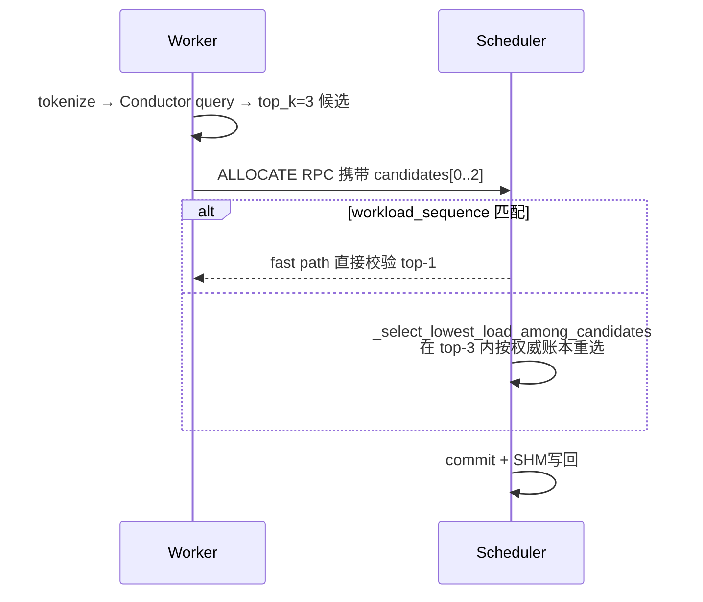
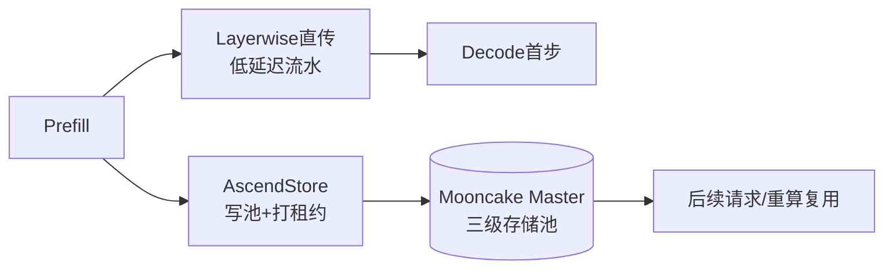

# KV Cache 亲和调度与池化
> 覆盖 12 个知识点 | 来源 21 个文件 | 更新于 2026-07-11

## 1. 一句话总结
在多实例、PD 分离部署场景下，**调度面**通过 Mooncake Conductor 全局前缀索引将请求路由到已缓存最长 token 前缀的 Prefill 节点（亲和）；**数据面**通过 Mooncake Master 构建的跨节点 KV 共享池（池化），打破单卡 HBM 容量瓶颈并解耦 P/D 时序。二者协同将端到端有效前缀命中率从随机路由下的 ~10% 提升至 ~88%，使 TTFT 降低 70%+、E2E 时延降低 50%+。核心创新在于调度面的 **unified/load_gated 双模式亲和-负载融合打分**与 **Worker 提案 + Scheduler 权威重选**防 herding 架构，以及数据面 **MultiConnector 双通道（Layerwise 直传 + Store 池化）**。

## 2. 核心原理
### 2.1 问题背景
- **KV Cache 碎片化**：多 Prefill 副本时，普通轮询/负载均衡将同前缀请求随机打散，导致每个实例都要重复 prefill 相同的 system prompt 等前缀，缓存命中率随实例数下降至 1/N，TTFT 恶化。
- **单卡 HBM 容量天花板**：vLLM 本地 prefix cache 受限于单卡 HBM，长上下文或高并发下热点前缀会被 LRU 驱逐，下次仍需重算。
- **PD 分离时序与显存耦合**：无池化时，P 必须等 D 在线才能直传 KV，P 的 HBM 被占用，并发受限。

### 2.2 方案概述
**总体架构**将问题拆解为调度面与数据面：
- **调度面（Control Plane）**：在 Coordinator 中引入 `KvCacheAffinityPolicy`，对请求进行与引擎一致的 tokenization，通过查 Mooncake Conductor 全局前缀索引获得各实例各 DP rank 的最长前缀命中长度，再通过 unified 或 load_gated 模式将前缀收益与实时负载融合打分，选出最优的 Prefill 实例。
- **数据面（Data Plane）**：基于 Mooncake Master 构建跨节点、分级溢出（HBM→DRAM→远端）的共享 KV 池，通过 `MultiConnector` 组合 `MooncakeLayerwiseConnector`（P→D 逐层直传）和 `AscendStoreConnector`（读写池），解耦 P/D 并实现 KV 全局可达。
- **联合收益模型**：端到端有效命中率 $h = h_{reuse} \times P_{route} \times P_{pool}$，亲和抬高路由命中 $P_{route}$，池化抬高容量命中 $P_{pool}$，二者缺一则整体坍塌。

## 3. 实现细节
### 3.1 调度面：KV Cache 亲和调度

#### 3.1.1 架构与组件职责
调度横跨 Coordinator Worker → Mooncake Conductor → 中央 Scheduler → Prefill 集群四层，核心组件如下：

| 组件 | 层级 | 角色 |
|------|------|------|
| Mooncake Conductor | 外部索引 | 订阅各 DP 的 ZMQ KV Events，维护全局前缀表，暴露 `/query` (HTTP :13333) |
| vLLM Prefill | 执行面 | 发布 KV Events（ZMQ Publisher），执行实际 prefill |
| ConductorApiClient | Coordinator | HTTP 薄封装，注册/注销/查询 Conductor |
| **KvCacheAffinityPolicy v2** | Coordinator | **核心策略**：tokenize → query → 双模式评分 → top-k 候选 |
| TokenizerManager | Coordinator | 对齐 vLLM chat template 的 HF tokenizer 单例 |
| AsyncSchedulerClient | Coordinator | 策略分发，上报 `_AFFINITY_CANDIDATE_TOPK=3` 候选 |
| SchedulerServer | 中央 Scheduler | 用权威 fresh workload ledger 在 top-k 内重选 + commit |
| Workload SHM Reader | Coordinator | ZMQ SUB 推送实时负载，评分前热补丁 |

#### 3.1.2 调度流程
1. **Tokenize**：用 `TokenizerManager` 将 messages/tools 编码为 token_ids，缓存于 `req_info`。
2. **查询 Conductor**：`POST /query` 携带 token_ids、block_size，返回每个 instance 的 `longest_matched` 和 DP rank 级命中长度。
3. **快路径**：若 prompt 短于一个 KV block（无法命中整块索引），跳过 HTTP 调用，直接返回全零匹配。
4. **构建候选**：`_collect_load_candidates` 为每个端点生成 `(load_cost, matched_tokens, prefill_cost = max(0, isl - overlap_credit * matched_tokens))`。
5. **双模式打分**：按配置模式对端点排序，返回分数越低越优的 top-k 候选。
6. **Scheduler 二次决策**：Worker 上报最多 3 个亲和候选，Scheduler 用权威 workload ledger 在候选集内重选负载最低者，防止突发流量 herding。

#### 3.1.3 双模式评分：Unified vs Load-Gated
**Unified 模式（推荐，软融合）**：
$$ score = \eta \cdot \max(0, isl - \gamma \cdot matched) + \beta \cdot load $$
所有量纲统一为 token 数，取 `argmin`。`β=0` 退化为纯前缀贪心；`γ=0` 退化为纯负载均衡。生产推荐 `η=γ=β=1`。

**Load-Gated 模式（硬约束）**：
1. 负载门：`sorted_by(load)[:load_gate_topn]`（默认 topn=2），只保留最轻端点。
2. 亲和排：在门内按 `-matched`、`load` 排序。亲和永远不能把请求拉到最闲集合之外，适合严控长尾场景。

| 维度 | Unified | Load-Gated |
|------|---------|------------|
| 决策形式 | 线性加权，全局 argmin | 两阶段硬约束 |
| 负载影响 | 软影响：负载高但前缀极长仍可胜出 | 硬边界：超出 topn 完全排除 |
| 适用场景 | 负载均匀，追求最大化命中 | 负载波动大，优先保证不过载 |

#### 3.1.4 Top-k候选与Scheduler权威重选（PR#210）
**演进动机**：早期方案用 Worker 本地 `load_overlay` 叠加 in-flight 负载，存在 TTL 难调、跨 Worker 无效、非权威账本等问题，无法防止多 Worker 并发向同一热点发出 herding。

**新方案架构**：
- **Worker 只负责“谁前缀最好”**：Conductor 查询 + 打分，输出 best-first 的 top-3 候选列表。
- **Scheduler 负责“谁现在最空”**：在 Worker 提出的亲和 top-3 内，用自身提交锁下的权威 fresh workload ledger 重选负载最低者。
- 移除 `load_overlay` 和 `overload_threshold`，调度一致性强一致。

**PR #304 升级**：unified 模式改为 Worker 上报**所有端点**的 prefill_cost 与权重标量，Scheduler 全局重算 `score = η * prefill_cost + β * fresh_load`，取全局最小值，避免 top-k 截断丢失真正最优解。

#### 3.1.5 降级与容错
三级瀑布降级：**KV 亲和 → Load Balance → Round Robin**。
- Conductor 超时（0.2s）/ tokenize 失败 / 无 tenant → 自动回退 L2，服务不挂。
- Conductor 是增强路径，非单点依赖。

### 3.2 数据面：KV Cache 池化

#### 3.2.1 池化架构
核心组件 **mooncake_master** (独立 Pod，默认 :50088) 管理三级存储（HBM→DRAM→SSD）、驱逐与租约。引擎通过 **MultiConnector** 对接，实现“写完即走、按需异步读”的解耦模型。

#### 3.2.2 Connector详解
| 通道 | Connector | 优点 | 代价 |
|------|-----------|------|------|
| 快路径 | `MooncakeLayerwiseConnector` | 逐层流水，压低 TTFT | P/D 需同时在线，强耦合 |
| 持久层 | `AscendStoreConnector` | P 写完即走、跨节点共享、可溢出 | 多一跳存储 RTT |
| 组合 | `MultiConnector` | 双通道并行，实时性+解耦兼顾 | 配置复杂 |

- **Layerwise**：P、D 角色分别为 `kv_producer` / `kv_consumer`，不经 Master。
- **Store**：后端 `mooncake`，Prefill 端 `lookup_rpc_port=0`（写），Decode 端 `="1"`（读），支持向 DRAM/SSD 溢出。

#### 3.2.3 驱逐机制与租约
- **水位触发**：占用率 `≥ eviction_high_watermark_ratio`（默认 0.9）→ 批量驱逐 `eviction_ratio × C`（默认 0.1），留出缓冲。
- **租约 TTL**：`default_kv_lease_ttl`（默认 11000ms）保证 Decode 读完前不被驱逐；需大于 `ASCEND_CONNECT/TIMEOUT`。
- **显存回收**：`release_kv` 通知 P 节点释放本地 HBM，但**不删除池中 KV**，二者生命周期解耦。

#### 3.2.4 配置注入
`kv_cache_pool_config` 经 Generator 转为 `mooncake_master` 启动参数与引擎端 `kv_transfer_config`。关键字段：`global_segment_size`、`eviction_high_watermark_ratio`、`port`、`default_kv_lease_ttl`。

### 3.3 调度面与数据面的联合

#### 3.3.1 有效命中率的乘法模型
$$ h = h_{reuse} \times P_{route} \times P_{pool} $$
- $h_{reuse}$：业务负载中逻辑可复用前缀比例（如固定 system prompt）。
- $P_{route}$：请求被**路由到持有该前缀**实例的概率 → **由亲和负责**（Conductor 全局索引，从 ~1/N 提升至 ≈1.0）。
- $P_{pool}$：该前缀在被复用前**仍驻留在缓存**的概率 → **由池化负责**（分级存储+水位驱逐+租约，从受限单卡提升至 ≈1.0）。

任一因子为 0 则整体坍塌：只开池化，随机路由仍使请求落错实例查不到缓存；只开亲和，热点前缀被 HBM 驱逐则命中率上不去。

#### 3.3.2 prefill_cost：乘法链的代码落点
亲和与池化共同作用于 `_collect_load_candidates` 中的 `prefill_cost` 计算：
$$ prefill\_cost = \max(0,\ isl - \overbrace{overlap\_credit}^{\text{池化兑现}} \times \overbrace{matched\_tokens}^{\text{亲和提供}}) $$
- `matched_tokens` 来自 Conductor 前缀查询（亲和提供潜在命中量）。
- `overlap_credit ≈ 1` 意味着命中部分能被 `AscendStoreConnector` 高速搬回而免重算（池化兑现减免）。
- 请求完成后写入 KV 池并打租约，为后续请求维持 $P_{pool}$。

| 场景 | matched_tokens | overlap_credit | prefill_cost |
|------|---------------|----------------|--------------|
| 亲和+池化全开 | 7000 | 1.0 | 1000（省 87.5%） |
| 只开池化随机路由 | 0 | 1.0 | 8000（全重算） |
| 只开亲和前缀被驱逐 | 7000 | ≈0 | ≈8000（取不回全重算） |

#### 3.3.3 收益模型与归因
典型场景（Qwen3-8B, ISL=8000, OSL=15, 固定 system+tools 前缀）：TTFT 从 626ms 降至 127ms（−79.7%），E2E 从 976ms 降至 477ms（−51.1%）。**核心边界**：E2E 降幅 = TTFT 降幅 × prefill 占比，因此强依赖“长输入 + 短输出 + 高前缀复用”。

| 收益来源 | 主要归属 | 机理 |
|----------|---------|------|
| 路由命中 P_route → 1.0 | **亲和** | Conductor 全局索引精确路由 |
| 容量命中 P_pool → 1.0 | **池化** | 分级溢出 + 水位驱逐 + 租约保活 |
| 命中部分免重算 | **池化** | StoreConnector 高速搬 KV 替代重算 |
| 压低 c0（固定开销） | **池化** | Layerwise 逐层直传复用 KV |
| 防 herding 保证满载不回退 | **亲和** | unified 打分 + top-k Scheduler 重选 |

### 3.4 KV Events：全局前缀索引的数据来源
vLLM/SGLang 引擎通过 ZMQ PUB socket 发布三类事件（`BlockStored`/`BlockRemoved`/`AllBlocksCleared`），由 Mooncake Conductor 订阅并增量维护全局 PrefixCacheTable。事件按 block 哈希链表达，与引擎 APC 同构，支持 DP rank 粒度、medium（GPU/CPU/DISK）分层感知。
- **对齐要求**：block_size、hash 算法、tokenizer/render 必须完全一致，否则精确亲和静默 0 分。
- **空窗处理**：路由决策领先于事件到达时，可用 speculative TTL（如 llm-d）短期预测，或接受偶发多一次 prefill。

### 3.5 工程优化与PR演进
- **子块快路径**：`len(token_ids) < block_size` 时跳过 Conductor HTTP，直接视为全零匹配，省去 0.2s RTT。
- **Token ID 缓存**：一次 tokenize 三处复用：Conductor 查询、亲和打分（`isl`）、负载记账（真实 token 数替代字节估算）。
- **负载账本热路径优化**（PR #394）：去重集改有界 FIFO、裸 float 传输 workload、SHM 绝对值修复等。
- **上下文预校验**（PR #349）：tokenize 前置使调度层直接拒绝超模型上下文请求。
- **P 负载即时释放**（PR #368/#393）：prefill 完成即释放 P 负载，不等全请求结束，提升后续 TTFT。

## 4. 框架对比

### 4.1 MindIE 与主流方案对比
| 维度 | MindIE-PyMotor | vLLM APC | SGLang cache_aware | NVIDIA Dynamo | Mooncake 论文 |
|------|---------------|----------|-------------------|---------------|--------------|
| **缓存粒度** | Block (128 tok) | Block (16 tok) | 字符级 radix tree | Block + tier | Block (512 tok) |
| **匹配方式** | Conductor longest_matched | 链式 hash (同机) | 近似 radix 树（字符） | cost=adjusted_prefill+decode | 滚动 hash + 复制 |
| **跨实例支持** | ✓ 原生，DP rank 级 | ⚠ 由 Connector 外接 | Approximate（本地树） | ✓ 原生 | ✓ 核心设计 |
| **驱逐感知** | ✓ (BlockRemoved 实时) | ✗ | ✗（自管 LRU） | ✓ (事件驱动) | ✓ |
| **亲和-负载权衡** | unified(软)/load_gated(硬) | 单机 greedy | 阈值切换（负载失衡→最短队列） | 统一 cost 公式，含分层权重 | 三目标（命中/负载/迁移）联合优化 |
| **池化** | 通过 Mooncake Master 池化 | 无（单机） | 引擎内 HiCache L1-L3 | 统一 KVBM G1-G4 | 三级存储 + TE |
| **核心创新** | 外置 Conductor + 双模式 + Scheduler 重选 | PagedAttention | Radix 树 + HiCache | KVBM + NIXL 全栈 | KVCache-centric 全局调度 |

**关键差异**：SGLang/vLLM Router 的 `cache_aware` 属于 **approximate**（通信无关），用本地字符级近似树推断，精度有限；MindIE 走 **precise** 路线，通过 tokenize 前置 + Conductor 真值索引 + Scheduler 权威仲裁，牺牲一跳 HTTP 和 tokenizer 一致性维护，换取与引擎 block 哈希完全对齐的精确命中和跨 Worker 强一致防 herding。

## 5. 面试要点
### 5.1 常见追问
#### Q: KV 亲和和 KV 池化有什么区别？为什么要一起用？
- 亲和是调度面（请求**路由到哪**），池化是数据面（**KV 怎么存/传**），二者正交互补。
- 有效命中率 $h = h_{reuse} \times P_{route} \times P_{pool}$ 是乘法关系。只开池化，随机路由使请求落错实例，本地查不到缓存仓库里的 KV，$P_{route}≈1/N$；只开亲和，热点前缀可能被单卡 HBM LRU 驱逐，$P_{pool}$ 受限。两者叠加才能使 $h$ 逼近逻辑可复用上限 $h_{reuse}$。

#### Q: unified 和 load_gated 两种模式怎么选？
- **unified**：软融合，`η*prefill_cost + β*load`，取全局最小。适配负载较均匀、追求最大化前缀复用收益的场景。
- **load_gated**：硬门控，先取最闲 TopN，再在里面比命中。适配负载波动大、需严格保证不把请求拉到热点造成长尾的场景。它是亲和边界的安全网。

#### Q: 多 Worker 并发调度时，怎么防止同前缀请求都打到同一个实例（herding）？
- 老方案用 worker 本地 in-flight overlay 叠加虚拟负载，但作用域仅本进程且 TTL 难调，跨 Worker 无效。
- 新方案（PR #210/#304）采用 Worker 提案 + Scheduler 权威重选：Worker 负责亲和计算（查 Conductor 得到 prefill_cost），上报候选列表给中心 Scheduler；Scheduler 用自己提交锁下的最新权威负载账本，在候选集内（或全量端点）重算完整 unified 分数，取全局最优。这样 burst 被新鲜负载自然摊平，亲和不丢。

#### Q: 为什么要在调度层做 tokenize？和字符级匹配比有什么好处？
- Conductor `/query` 需要与引擎一致的 token_ids 做 block 哈希对齐，字符前缀会因 chat template / tools 注入与 token 前缀分叉，且无法对齐 block 边界，导致命中长度估算错误。
- 调度层用与引擎同源的 tokenizer 进行一次 tokenize，不仅获取精确命中长度，还可复用 token 数做负载记账和入口长度预校验，虽增加毫秒级 CPU 开销，但换来了精度和多重收益。

#### Q: 亲和调度失效了怎么办？
- 三级瀑布降级：Conductor 超时（0.2s）/ tokenize 失败 / 无数据 → 回退 **Load Balance**（全局最小负载）→ 仍失败回退 **Round Robin**。亲和是增强通路，不影响服务可用性。
- tokenize 失败采用 fail-closed：返回空 ids，整体降级，宁可不用亲和也不拿错误 token 误导 Conductor。

### 5.2 口述话术
**30秒总括**：  
> “我们做的是精确 KV 亲和调度与池化的联合优化。调度面用 Mooncake Conductor 的全局前缀索引，把请求 tokenize 后查最长命中，再用 unified 或 load_gated 模式融合负载指标选出最优 Prefill 实例，由中心 Scheduler 防 herding；数据面用 Mooncake Master 构建 HBM→DRAM→远端的共享池，MultiConnector 同时走 Layerwise 直传和 Store 池化。最终把有效命中率从 ~10% 拉到 ~88%，TTFT 降 70% 以上。”

**1分钟展开**：
1. **背景**：多实例 PD 分离时，无亲和前缀缓存碎片化，单卡 HBM 易驱逐。
2. **调度面亮点**：不是猜缓存（字符树），而是查真值（Conductor 事件索引）；unified 软融合或 load_gated 硬门控；Worker 做计算、Scheduler 做仲裁的分布式两级架构，解决 burst 一致性。
3. **数据面亮点**：MultiConnector 解耦 P/D，Layerwise 保实时性，Store 实现跨节点共享与分级溢出。
4. **联合**：命中率乘法链，`prefill_cost` 是两者代码交汇点。三者（业务复用+亲和+池化）缺一不可。

## 6. 延伸阅读
### 6.1 相关主题
- [ZMQ KV Events 详解](interview/kv%20knowledge/09-ZMQ-KV-Events详解.md)
- [概念与分层模型](interview/kv%20knowledge/00-概念与分层模型.md)
- [框架对比总表](interview/kv%20knowledge/01-框架对比总表.md)
- [昇腾 HCCL 与 KV 传输](interview/kv%20knowledge/10-昇腾HCCL与KV传输.md)

### 6.2 源文件

| 文件路径 | 标题 / 说明 | 类型 |
|----------|-------------|------|
| wiki/repos/mindie-pymotor/kv-affinity.md | KV Cache 亲和调度 | 核心设计 |
| wiki/repos/mindie-pymotor/kv-pool.md | KV 池化 | 核心设计 |
| wiki/repos/mindie-pymotor/kv-pool-and-affinity.md | KV 池化 × KV 亲和 联合调度 | 核心设计 |
| wiki/raw/articles/pymotor/kv_cache_affinity_deep_analysis.md | KV Cache Affinity 深度技术分析 | 深入分析 |
| wiki/raw/articles/pymotor/kv_cache_affinity_report.md | KV Cache 亲和性调度技术介绍与竞品分析 | 技术报告 |
| wiki/raw/articles/pymotor/kv_cache_affinity_summary_interview.md | KV Cache 亲和调度面试速览 | 面试总结 |
| wiki/raw/articles/pymotor/pr210_kv_affinity_topk_candidates_deep_analysis.md | PR#210 top-k 候选深度分析 | PR 分析 |
| interview/interview-review/04-KV亲和调度与Mooncake专题.md | KV 亲和调度与 Mooncake 专题 | 面试专题 |
| interview/interview-review/12-PyMotor-KV亲和性调度特性全解与简历素材.md | PyMotor KV 亲和调度全解 | 面试专题 |
| interview/interview-review/15-vLLM-Router与SGLang-KV亲和性设计调研.md | vLLM Router 与 SGLang 调研 | 竞品调研 |
| interview/kv knowledge/00-概念与分层模型.md | 概念与分层模型 | 知识体系 |
| interview/kv knowledge/01-框架对比总表.md | 框架对比总表 | 知识体系 |
| interview/kv knowledge/02-llm-d.md | llm-d 细节 | 知识体系 |
| interview/kv knowledge/03-NVIDIA-Dynamo.md | Dynamo 细节 | 知识体系 |
| interview/kv knowledge/04-AIBrix.md | AIBrix 细节 | 知识体系 |
| interview/kv knowledge/05-SGLang-HiCache与Router.md | SGLang HiCache 与 Router | 知识体系 |
| interview/kv knowledge/06-vLLM-Mooncake-Motor.md | vLLM / Mooncake / Motor | 知识体系 |
| interview/kv knowledge/07-亲和与三级池化交互.md | 亲和与三级池化交互 | 知识体系 |
| interview/kv knowledge/08-选型与面试口述.md | 选型与面试口述 | 知识体系 |
| interview/kv knowledge/09-ZMQ-KV-Events详解.md | ZMQ KV Events 详解 | 知识体系 |
| interview/kv knowledge/10-昇腾HCCL与KV传输.md | 昇腾 HCCL 与 KV 传输 | 知识体系 |