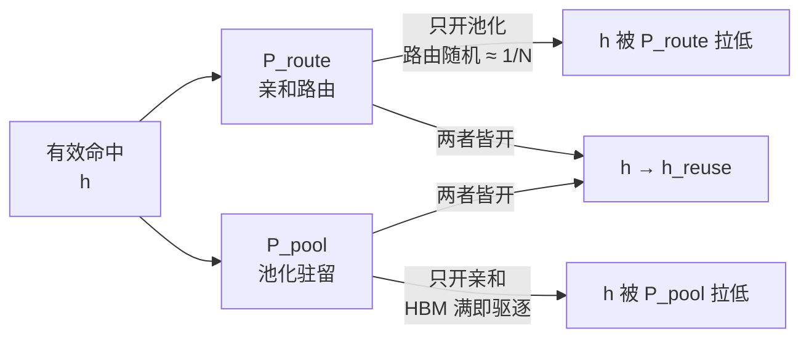
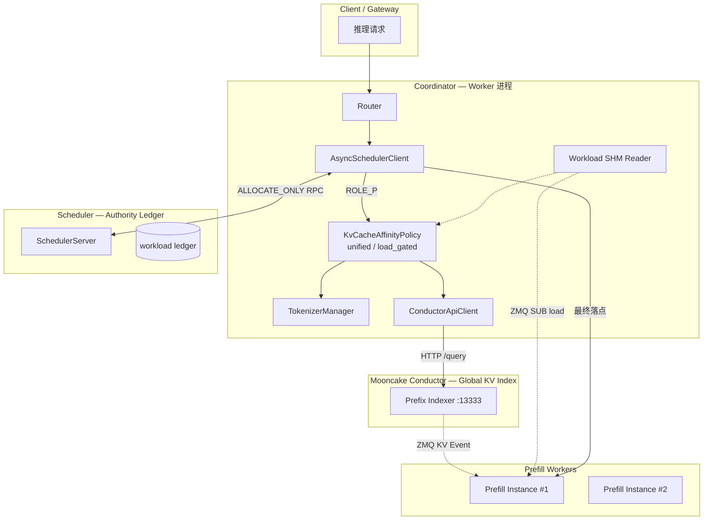
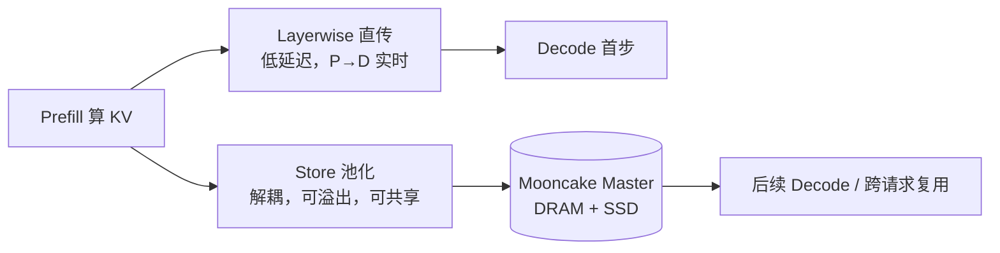

# KV Cache 亲和调度与池化
> 覆盖 25+ 个知识点 | 来源 21 个文件 | 更新于 2026-07-11

## 1. 一句话总结
MindIE‑PyMotor 在 PD 分离、多 Prefill 副本场景下，通过 **调度面** 的 KV 亲和路由（基于 Mooncake Conductor 全局前缀索引与双模式打分）与 **数据面** 的 KV 池化（跨节点分级存储 + 逐层传输），实现将请求精准导向已缓存最长前缀的节点，并保证 KV 跨实例可达。二者形成 `h = h_reuse × P_route × P_pool` 的乘法增益模型，在长上下文、高前缀复用场景下 **TTFT 降 70%+、E2E 降 50%**。核心创新：unified / load_gated 双模式亲和‑负载融合打分、top‑k 候选 + Scheduler 权威重选防 herding、MultiConnector 分级池化与 KvEvents‑Conductor 精确索引的协同。

## 2. 核心原理
### 2.1 问题背景
- **多实例前缀缓存碎片化**：vLLM 单实例 automatic prefix caching 只在本地 HBM 生效。使用 round‑robin / 纯负载均衡时，相同前缀的请求被随机打散到不同 Prefill 节点，每个节点都要**重复计算**相同的 prefill，导致 TTFT 恶化、GPU 算力浪费。集群有效缓存命中率随实例数线性下降（若 N 个实例，同一前缀落对点的概率仅 1/N）。
- **HBM 容量是硬天花板**：单卡 HBM 能缓存的 KV token 数极其有限。超过容量后，热点前缀会被 LRU 驱逐，后续请求仍需重算 prefill。单纯的 `enable‑prefix‑caching` 无法突破单卡物理限制。
- **PD 分离的时序与显存耦合**：无池化时，P→D 走点对点直连，P 必须保留 KV 直到 D 全部接完，导致显存被占、并发受限，且 P/D 必须同时在线。

### 2.2 方案概述
MindIE 将问题拆解为两个正交维度，并形成乘法闭环：

- **调度面 — KV 亲和**：通过全局索引（Mooncake Conductor）感知“哪台 Prefill 实例、哪个 DP rank 已缓存了本次请求的最长前缀”，在亲和收益与实时负载间进行软/硬权衡，将请求路由到最佳节点，把理论命中 `h_reuse` 转化为 **实际路由命中率** \(P_{\text{route}} \to 1.0\)。
- **数据面 — KV 池化**：将 KV Cache 抽象为跨节点、可分级的共享存储池（Mooncake Store + Transfer Engine），突破单卡 HBM 容量限制，并通过租约、高水位批量驱逐等机制保证 KV 持久可达，把 **容量命中率** \(P_{\text{pool}}\) 抬高到 ≈1.0。同时 MultiConnector 提供 Layerwise 直传（低延迟）与 Store 池化（解耦共享）双通道。
- **联合乘法模型**：端到端有效命中率 \(h = h_{\text{reuse}} \times P_{\text{route}} \times P_{\text{pool}}\)，任意一个因子过低都会导致整体命中塌方。亲和与池化在代码落点 `prefill_cost = max(0, isl - overlap_credit × matched_tokens)` 处交汇：`matched_tokens` 由亲和提供，`overlap_credit` 靠池化兑现。



## 3. 实现细节
### 3.1 KV 亲和调度：架构与组件
调度面横跨四层，职责分离：



| 组件 | 职责 | 说明 |
|------|------|------|
| **Mooncake Conductor** | 全局 KV 前缀索引 | 订阅各 Prefill DP 的 KvEvents (ZMQ)，维护 PrefixCacheTable，暴露 `/register`, `/query`, `/unregister` |
| **KvCacheAffinityPolicy** | 核心亲和算法 | Tokenize → query Conductor → 双模式评分 → 输出 top‑k 候选 |
| **TokenizerManager** | 本地 tokenize | 单例 HuggingFace tokenizer，`apply_chat_template` 含 tools，输出与引擎一致的 token_ids |
| **AsyncSchedulerClient** | 策略分发 | 调度类型为 `kv_cache_affinity` 且角色为 `ROLE_P` 时调用亲和策略，其他走 load_balance |
| **SchedulerServer** | 权威负载仲裁 | 接收 Worker 上报的亲和候选，基于实时 workload ledger 进行二次重选 |
| **Workload SHM Reader** | 负载热补丁 | ZMQ SUB 订阅各 endpoint 最新负载，Worker 打分前优选 |

### 3.2 双模式打分：unified 与 load_gated
所有候选端点首先通过 `_collect_load_candidates` 获取 `(load_cost, matched_tokens, prefill_cost)` 三元组，`prefill_cost = max(0, isl - overlap_credit × matched_tokens)`，随后按模式评分。

#### Unified 模式（推荐，软融合）
$$
\text{score} = \text{prefill\_load\_scale} \times \text{prefill\_cost} + \text{load\_weight} \times \text{workload\_score}
$$
选择 **最低分数** 的 top-k 候选。全部采用 token 统一量纲：`prefill_cost` 是被命中打折后仍需计算的 prefill 工作量，`workload_score` 反映实时排队深度。`load_weight=0` 退化为纯亲和，`overlap_credit=0` 退化为纯负载。

#### Load‑Gated 模式（硬约束）
**Stage 1**：保留 `load_gate_topn`（默认 2）个最轻负载端点。  
**Stage 2**：在门控集合内按最长匹配前缀排序（平局取更轻负载）。  
亲和无法将请求拉出门控集合之外，适合负载敏感场景。

#### 关键代码路径
- `motor/coordinator/scheduler/policy/kv_cache_affinity.py`：`select_endpoint_candidates_from_list()`, `_select_with_load()`, `_select_load_gated()`
- `motor/coordinator/api_client/conductor_api_client.py`：`query_conductor()`

### 3.3 Top‑k 候选 + Scheduler 权威重选
**演进动机**：多 Worker 并发 burst 时，若每个 Worker 只报 top‑1 且负载视图滞后，所有 Worker 可能都选同一“最优” endpoint，形成热点 herding。

**最终方案（PR#210 → PR#304）**：
- Worker 完成亲和打分后，上报**全量候选 endpoint 的 `prefill_cost`**（不随时间变化的亲和部分）以及 `scale`/`weight` 参数。
- Scheduler 收取 ALLOCATE RPC，用自己的**权威新鲜 workload ledger** 重新计算完整 unified 分数，全局取 min（平局偏向更低 `prefill_cost`）。
- 此设计将“谁前缀最好”（需要 Conductor + tokenize，Worker 算）与“谁现在最空”（只需 ledger，Scheduler 算）解耦，既消除 in‑flight overlay 的跨进程不一致问题，又完整覆盖所有候选。

**关键代码路径**：
- `motor/coordinator/scheduler/runtime/scheduler_server.py`：`_handle_allocate_only` → `_extract_affinity_candidates` 重算 combined score

### 3.4 三级降级与容错
亲和是增强，不是硬依赖。三级回退保证可用性：
```
L1: KV Cache Affinity → L2: Load Balance → L3: Round Robin
```
触发条件：Conductor `/query` 0.2s 超时返回空、tenant 为空、tokenize 失败（无 prompt/messages）、instance 键名不匹配等均自动降级，不阻塞请求。Conductor 宕机/重启后有 `/services` 对账重注册 + replay_endpoint 补回历史事件。

### 3.5 Tokenize 前置与 KV Event 对齐
- **为什么在调度层 tokenize**：Conductor 索引是按 token 序列 hash 的，必须与引擎收到的 token 完全一致（含 chat template、tools）。字符级近似（如 SGLang `cache_aware`）会因 template 注入导致对齐偏差。一次 tokenize 三处复用：① Conductor 查询 ② 亲和打分 ③ 真实请求长度记账。
- **KV Event 机制**：引擎侧 (vLLM/SGLang) 通过 ZMQ PUB 推送 `BlockStored` / `BlockRemoved` / `AllBlocksCleared` 事件（带 `block_hashes`, `parent_hash`, `medium`）。Conductor 订阅后维护全局前缀索引，因此调度器直接获知“谁真的缓存了哪些 block”，并感知驱逐（假阳性大幅降低）。

### 3.6 KV 池化：多级存储与 MultiConnector
池化将 KV Cache 从单卡 HBM 扩展为跨节点、可分级的共享对象存储。



| 通道 | Connector | 优点 | 代价 |
|------|-----------|------|------|
| 快路径 | `MooncakeLayerwiseConnector` | 逐层流水传输，压低 TTFT | P/D 需同时在线 |
| 持久层 | `AscendStoreConnector` | 写完即释放 P 显存，跨节点共享 | 多一跳存储 RTT |

- `MultiConnector` 组合二者，数组顺序即优先级（通常 `[0]=Layerwise`, `[1]=Store`）。
- 引擎侧通过 `kv_transfer_params` 元数据告知 Decode“去哪取 KV”，Coordinator 只透传不解析。
- `release_kv` 信号仅回收本地 HBM，不删池中数据。

### 3.7 驱逐机制：租约 + 高水位批量驱逐
- **高水位驱逐**：`eviction_high_watermark_ratio`（默认 0.9），超过则批量驱逐 `eviction_ratio × C` 量（默认 0.1），避免频繁逐条。
- **租约 TTL**：写入池时加 `default_kv_lease_ttl`（默认 11000ms），在 TTL 内保证不被驱逐，确保 D 一定读得到。被驱逐或传输失败则触发 recompute 重算。

### 3.8 配置注入与可观测性
- `kv_cache_pool_config`（global_segment_size, 水位, 驱逐比, TTL 等）经 `kv_pool.py` 生成 `mooncake_master` 启动参数。
- 引擎侧 `kv_transfer_config` 自动补全 DP/TP/PP 参数并解析 MultiConnector。
- Prometheus 指标：`kv_pool_ratio`（水位），`kv_pool_eviction`（驱逐计数），`kv_pool_size`（分级容量）。

### 3.9 联合调度：乘法命中率与 prefill_cost 交汇
亲和与池化在代码层面的锚点是 `prefill_cost = max(0, isl - overlap_credit × matched_tokens)`：
- `matched_tokens` 来自亲和：Conductor 指示目标实例已缓存的前缀长度。
- `overlap_credit ≈ 1.0` 靠池化兑现：对应 KV 还驻留在某级存储，且能被 `AscendStoreConnector` 高速取回（而非已驱逐）。
- 任一因子缺失都将导致 prefill 全量重算。例如只开池化但随机路由，则 `matched_tokens=0` → 全量计算。

### 3.10 收益归因与适用边界
| 收益来源 | 主要归属 | 机理 |
|----------|---------|------|
| 将潜在命中变实际路由命中 | **亲和** | Conductor 全局索引 + 精确路由，P_route 0.25→1.0 |
| 命中上限与持久性 | **池化** | 分级存储、租约、水位驱逐，P_pool→1.0 |
| 命中部分免重算 | **池化** | AscendStoreConnector 搬 KV 替代计算 |
| 压低固定开销 c0 | **池化** | Layerwise 逐层直传复用 KV |
| 防羊群、保证满载不回退 | **亲和** | unified 打分 + Scheduler 重排，利用率 ρ 降低排队延迟 |

**适用边界**：强依赖“长输入 + 短输出 + 高前缀复用”。长输出会稀释 E2E 降幅。测算场景（Qwen3-8B, ISL=8000, OSL≈15）：TTFT −79.7%, E2E −51.1%。

## 4. 框架对比

### 4.1 llm-d — KV 亲和与传输设计
llm-d 定位为 K8s 原生推理平台，通过 Envoy Gateway 与可插拔的 Endpoint Picker（EPP）实现调度，后端可对接 vLLM/SGLang 等模型服务器。其 KV 亲和架构围绕三层策略展开：近似匹配（approximate）、精确匹配（precise）以及基于粘滞过滤的会话绑定。在近似模式下，系统通过字符或 token 比例估算前缀命中，并在 EPP 本地维护 LRU 缓存，路由后通过后续请求“学习”缓存分布，适用于 `optimized-baseline` 与 `tiered-prefix-cache` 指南场景。精确模式则依赖 vLLM 的 `/v1/*/render` 端点进行 tokenize，并通过 ZMQ 事件（`BlockStored`、`BlockRemoved`、`AllBlocksCleared`）驱动全局 KV Indexer，实现最长连续前缀链打分，断链后后续 token 无效；tier 权重默认为 GPU 1.0、CPU 0.8，且支持 speculativeIndexing，在路由后写入短 TTL（约 2s）的预测条目以填补事件空窗。此外还有 sticky filter 策略，当 match 率大于 0.8 时收窄候选，结合 Explore 机制和 TTFT 逃逸来平衡精确性。

调度流水线由 ProfileHandler（支持单池或 P/D 双 profile）、Filters（affinity-filter、PD label 等）与 Scorers 加权组合构成，最终由 Picker 选择最高分实例。推荐的精确路由权重为：prefix-cache-scorer 3.0、kv-cache-utilization-scorer 2.0、queue-scorer 2.0、no-hit-lru-scorer 2.0。在传输与卸载方面，llm-d 本身不实现统一池化层，而是通过 guide 组合各引擎的卸载能力：Native offloading 通过 `--kv-offloading-backend native` 及 `TieringOffloadingSpec` 配置 HBM→CPU→文件系统的层级；LMCache 通过 `LMCACHE_MAX_LOCAL_CPU_SIZE` 等环境变量设置 L2 容量；Mooncake Store 则提供嵌入式或独立 DRAM 与 SSD 存储。近似模式下的 tier 路由使用双 `approx-prefix-cache-producer`（GPU + CPU），分别搭配 scorer，手动设置 CPU LRU 容量，但文档指出 autoTune 仅统计 GPU blocks，在 offload tier 场景存在已知缺陷。精确路由与 LMCache/Mooncake 的端到端组合 recipe 仍缺少 validated 方案，反映了其在统一池化索引方面的不足。

### 4.2 NVIDIA Dynamo — KV Router 与 KV Block Manager
Dynamo 面向分布式生成式推理，提供 Frontend、KV Router、KV Block Manager (KVBM)、NIXL 传输库以及 Planner 的全栈运行时。其核心亲和机制基于代价函数路由，实现在 `lib/kv-router/src/scheduling/selector.rs`。该函数计算 `raw_prefill_blocks = (active_prefill_tokens + uncached_tokens) / block_size`，再减去重叠信用块 `overlap_credit_blocks`，该信用块由 `overlap_score_credit` 乘以退化系数与设备重叠量决定，并加入不同介质命中权重与重叠量的乘积：host_cache_hit_weight × host_overlap、disk_cache_hit_weight × disk_overlap、shared_cache_multiplier × shared_beyond_device，最终 `cost = prefill_load_scale × adjusted_prefill + decode_blocks`，选择最低 cost 的 worker。分层权重通过 CLI 直接映射到存储层级：`--router-kv-overlap-score-credit`（设备 L1，默认 1.0）、`--router-host-cache-hit-weight`（L2，默认 0.75）、`--router-disk-cache-hit-weight`（L3，默认 0.25），并可通过 `--shared-cache-type hicache` 加上 `--shared-cache-multiplier` 纳入全局共享 L3 的贡献。

KVBM 实现了统一的四级内存池：G1 Device、G2 Host、G3 Disk、G4 Remote，通过环境变量 `DYN_KVBM_CPU_CACHE_GB` 和 `DYN_KVBM_DISK_CACHE_GB` 配置容量。vLLM 连接器使用 `DynamoConnector` 并指定 `kv_role` 为 `kv_both`，在 disagg 场景常用 `PdConnector` 组合 KVBM 与 NixlConnector，实现 P/D 分离下的 KV 传输。主索引器维护 Radix 树的 Device 层命中，并沿 parent 链 walk 对 Host 和 Disk 层进行 lower-tier 索引（`indexer/lower_tier_indexers.rs`），事件携带 `storage_tier` 和 `medium` 字段，路由器据此更新各层状态。近似降级通过 `--no-router-kv-events` 启用，采用基于路由决策的预测缓存和 TTL（`--router-ttl-secs` 默认 120 秒）退化为 approximate 模式。

在 disagg 架构中，Prefill 阶段亲和度最高，使用完整 overlap 评分；Decode 阶段则设 `overlap_score_credit=0`，`assume_kv_reuse=false`，`track_prefill_tokens=false`。此外还支持 session affinity（`X-Dynamo-Session-ID`）、拓扑感知传输（`DYN_KV_TRANSFER_*`）以及 direct 模式（外部 EPP 指定 worker ID）。Dynamo 与 LMCache 的集成仅限于引擎侧复用，Router 未完整支持全部 LMCache events，可能导致 KV-aware 路由次优；而 Mooncake HiCache 作为共享 L3 时，使用 `/batch_query_keys` 查询 master 并计算共享块贡献。

### 4.3 AIBrix — Gateway 亲和与 L1-L3 池化
AIBrix 是字节跳动开源的 LLM 推理控制面，其设计将 KV 亲和与传输解耦：亲和策略在 Envoy Gateway 层以 Go 插件形式实现，而池化在引擎内部通过 Python 的 `aibrix_kvcache` 框架完成，两者通过 KVCache CRD 编排基础设施。Gateway 侧提供多种路由策略，核心为 `prefix-cache` 算法（`pkg/plugins/gateway/algorithms/prefix_cache.go`），流程包括 tokenize（支持 character、tiktoken 或远程 tokenizer）、block 滚动哈希、负载失衡检测（max_running − min_running > IMBALANCE_ABS 时回退到 least-request）、按匹配前缀比例降序和运行请求数升序选择实例，并要求运行数不超过 mean + load_factor × σ。路由后通过 PostRouteUpdate 将推测性前缀写入本地索引器，以改善后续请求命中率。关键环境变量包括 `AIBRIX_PREFIX_CACHE_BLOCK_SIZE`（默认 128/16）、`AIBRIX_PREFIX_CACHE_POD_RUNNING_REQUEST_IMBALANCE_ABS_COUNT`（默认 8）等。索引精度有三种模式：仅基于本地路由历史的 PrefixHashTable（近似）、通过 Redis StateSync 在多 Gateway 副本间同步的近似全局视图，以及通过 ZMQ 接收引擎 `BlockStored/BlockRemoved` 事件的 KV Event Sync 精确模式（需启用 `AIBRIX_PREFIX_CACHE_KV_EVENT_SYNC_ENABLED` 并使用远程 tokenizer）。

池化框架 `aibrix_kvcache` 将存储分为三层：GPU 引擎内置缓存（对应引擎自身 L1），进程内 DRAM 缓存称为 L1（对应整体架构的 L2），分布式存储称为 L2（对应 L3）。进程内 DRAM 通过 `l1/l1_cache.py` 实现，支持 S3FIFO 和 LRU 淘汰策略，默认容量 10GB，不跨 Pod 共享；分布式 L2 支持 InfiniStore、HPKV、PrisKV、SHFS 等多种后端，通过 `cache_manager.py` 统一管理。读取时若 L1 命中则直接返回；若 miss 且数据大小低于 DOUBLE_GET 阈值则不查询 L2 以规避小请求的远程开销；否则从 L2 拉取并 promote 到 L1。L1→L2 的写入策略有 HOT（默认）、ALL 和 EVICTED 三种。为支持张量并行，`GroupAwareKVCacheManager` 通过 allreduce(MIN) 对齐各 rank 的命中块数。Connector 方面提供 `AIBrixOffloadingConnectorType1/2` 和 `AIBrixPDReuseConnector`，分别用于标准卸载和 PD 分离时的跨请求复用。整体架构强调 Gateway 的 block hash 与 L2 key builder 的独立性：即便 L2 能跨 Pod 拉取 KV 块，路由到已有 GPU 前缀的 Pod 仍是最优路径。AIBrix 还将 LMCache 作为回归对照而非内置后端，突显其自研池化方案的独立性。

### 4.4 SGLang — HiCache 与 cache_aware 路由
SGLang 的池化层由引擎内置的 HiCache 提供，是业界最完整的 L1/L2/L3 一等公民实现之一，设计文档见 `sglang/docs/advanced_features/hicache_design.md`，核心实现在 `hiradix_cache.py`。L1 为 GPU HBM 中的 token 到 KV 池，支持 MHA/MLA 结构；L2 为 Host DRAM，通过 `hicache_ratio` 或 `hicache_size` 配置容量，由 `memory_pool_host.py` 管理；L3 为可插拔存储，通过 `HiCacheStorage` 抽象接口支持 Mooncake Store、3FS 等后端。工作流中，查询先在本地树中匹配出连续的 L1 段和 L2 段（无数据拷贝），若连续命中长度达到阈值（默认 256 token），则触发从 L3 到 L2 的 prefetch，策略可选 `best_effort`、`wait_complete` 或 `timeout`。写回策略支持 `write_through`、`write_through_selective` 和 `write_back`，且 L2→L3 仅写入远端尚缺的数据块以减少传输。控制器 `HiCacheController` 协调各层操作。Mooncake 作为 L3 时，通过 `MooncakeHostMemAllocator` 管理 L2 内存，开启 `enable_ssd_offload` 后可利用 Store 的 SSD 层，PD 与 HiCache 共享 TransferEngine。KV 事件定义在 `disaggregation/kv_events.py` 中，媒介包括 GPU、CPU_PINNED、DISK、EXTERNAL，可供外部 Conductor 或 Dynamo 消费。

亲和路由方面，SGLang Model Gateway 默认采用 `cache_aware` 策略，实现于 `sgl-model-gateway/src/policies/cache_aware.rs`，这是一种无通信的近似前缀匹配：当负载不平衡时回退到最短队列；否则对原始文本进行字符匹配（未 tokenize），若 match_rate 超过阈值则路由到命中 worker，否则选择最小负载实例，并将路由信息插入本地 radix 树。此树按 `pool::model` 隔离 prefill 和 decode，可选 mesh 拓扑，但 receive 侧未完全接线。vLLM Router 也 fork 了类似逻辑，更多强调 consistent_hash 与 P/D 结合。这种设计的张力在于：HiCache 提供精确的 token 级 radix 匹配和透明的跨层 prefetch，但 cache_aware 路由仅依靠历史路由猜测 L1 命中，对 L2/L3 的全局分布一无所知，导致多实例共享 L3 时路由目标与 L3 命中完全脱钩。因此，当启用 L3 共享池时，官方建议升级到基于 KV 事件的 precise 路由（如 Conductor/Dynamo 方案），或接受“L3 兜底、路由仅优化本地 L1 近似推断”的折衷。

### 4.5 vLLM — APC 与 Mooncake Connector
vLLM 原生提供 L1 自动前缀缓存（APC），通过链式哈希 `block_hash_i = H(parent_{i-1}, token_ids_block_i, extra_keys)` 在 `vllm/v1/core/kv_cache_utils.py` 中实现，仅作用于本机 GPU 块池，跨实例缓存共享依赖外部亲和路由。其进程内三级存储由 `OffloadingConnector` 管理（`vllm/v1/kv_offload/tiering/manager.py`），L1 为 GPU block pool，L2 为主要 CPU 层 `CPUPrimaryTierOffloadingManager`，L3 为二级层，支持文件系统、对象存储或 P2P 传输的 `SecondaryTierFactory`；GPU 驱逐时会 cascade 至 secondary，但 promotion 必须经过 CPU 网关，不允许直接加载到 GPU。

分布式 L3 连接器通过工厂模式（`factory.py`）提供多种选择：`MooncakeStoreConnector` 实现基于 hash 去重的共享 KV 池，利用 Mooncake Store 作为全局缓存；`MooncakeConnector` 用于 P/D 分离的点对点传输；`LMCacheConnectorV1` 对接外置 LMCache Controller；`MultiConnector` 组合多个连接器（如 PD + Store）；`NixlConnector` 利用 NIXL 进行跨节点传输。Mooncake 自身提供 Store（共享 L3）和 Transfer Engine（RDMA/TCP/NVMe-oF 等），内部 RAM 与 SSD 间通过 `offload_on_evict` 和 `promotion_on_hit` 策略流转。Mooncake Conductor 维护精确的跨 tier 前缀索引，通过 `/query` 接口返回每个实例/DP 在 GPU、CPU、DISK 层的 `longest_matched` 信息。

MindIE-PyMotor（路径 `MindIE-PyMotor/motor/coordinator/scheduler/policy/kv_cache_affinity.py`）作为调度消费者实现了精确前缀缓存感知：它向 Conductor 发送 POST `/query` 获取每个实例的最长前缀长度，结合负载进行统一（unified）或负载门控（load_gated）决策，并由 Scheduler 权威账本防止 herding。该组件不维护本地 radix 树，真值完全依赖 Conductor，短于 1 block 的请求走 fast path，并支持按 GPU/CPU/DISK 分项扣减搬运成本。vLLM 官方 Router fork 自 SGLang Gateway，其 cache_aware 策略仍为 approximate 模式，不涉及三级池化，更侧重 session affinity 的 consistent_hash 和 P/D 编排。整体上，vLLM 坚守 L1 和可插拔卸载连接器的边界，而 Mooncake 提供共享 L3、TE 和 Conductor 全局索引，Motor 则作为精确调度与亲和查询的样板实现。

### 4.6 六框架总览对比表

| 维度 | MindIE | llm-d | Dynamo | AIBrix | SGLang | vLLM |
|------|--------|-------|--------|--------|--------|-------|
| 缓存粒度 | 实例级最长前缀长度（GPU/CPU/DISK分层） | 实例级（prefix-cache-scorer 按最长连续前缀链打分，支持 GPU/CPU tier 权重） | 实例级代价函数（基于 block 级 overlap 和卸载 tier 权重） | 实例级前缀哈希表（block 级滚动 hash），可选精确 KV events | 引擎内 token 级 radix（HiCache）；路由侧为字符级近似树 | L1 为 block 链式哈希；卸载为 block 级 tiering |
| 跨实例支持 | Conductor 全局索引，通过 /query 获取各 DP 命中 | EPP Indexer 全局索引（ZMQ 事件）或近似本地 LRU | 主 Radix + 下层索引器，跨所有 worker | Gateway 本地表/Redis 同步/KV Event Sync 三种模式 | 路由树每 worker 独立，无跨实例同步 | L1 仅本机；L3 通过 Mooncake Store 或 LMCache 共享 |
| 匹配方式 | 向 Conductor POST 查询精确 token 化最长前缀 | Approximate: 字符/token 比例+LRU；Precise: render tokenize+ZMQ 事件 | 精确事件驱动（storage_tier），可降级为 TTL 近似预测 | 字符/远程 tokenizer + block hash；精确模式通过 KV Event Sync | 路由：字符匹配；HiCache：token 级 radix 匹配 | APC: 链式 block hash；无全局路由匹配，依赖外部 |
| 负载权衡 | 统一融合或 load_gated：先按负载筛低载实例再按亲和度评分 | 加权打分（prefix-cache 3.0、kv-util 2.0、queue 2.0等），最终 max-score | 仅通过代价函数排序选择最低 cost，无显式 load 项 | 负载失衡阈值回退 least-request，否则按 match% DESC + running ASC 选 | 负载不平衡时回退最短队列，否则按 match_rate 选 | 无内置亲和+负载联合；分离调度器（如 Motor）决策 |
| 池化机制 | 依赖 Conductor 索引各 tier，Motor 不管理数据 | 不实现统一池化；通过 guide 组合 Native tiering、LMCache、Mooncake | KVBM 统一 G1 Device/G2 Host/G3 Disk/G4 Remote 四级池 | 引擎内 L1 DRAM（S3FIFO/LRU）+ L2 分布式 InfiniStore/HPKV 等，CRD 编排 | HiCache L1 GPU + L2 Host + L3 可插拔存储，自动 prefetch/write-back | 进程内 CPU tiering + Secondary 卸载；分布式 L3 通过 Mooncake/LMCache Connector |
| 降级策略 | 短请求 fast path；无 Conductor 时无法精确路由 | approximate 模式：固定 block + rolling hash，无真实驱逐信息 | --no-router-kv-events 近似预测，默认 TTL 120s | 负载失衡 → least-request；无事件时用本地表或 Redis | cache_aware 无事件，仅凭历史路由树猜测 | 无路由降级；卸载层可退化至仅 GPU 缓存 |
| 核心创新 | 直接查询分布式精确索引，权威账本防 herding | 可插拔 EPP 打分框架 + speculative indexing 填补事件空窗 | 代价函数统一层权重与 overlap，统一 KVBM 四级传输 | Gateway 亲和与自研 L1/L2 卸载完全解耦，CRD 管理 L2 集群 | 引擎内完整三级池化与路由脱钩，提供极致本地缓存性能 | L1 APC + 可插拔 Connector 生态，与 Mooncake TE 深度集成 |

## 5. 面试要点
### 5.1 常见追问
#### Q: 亲和调度和普通负载均衡的核心差异是什么？
- 普通 LB 将请求视为无状态；亲和调度将 **KV cache 作为一等公民**，请求根据已缓存的前缀落点。
- 纯负载均衡会主动浪费已算好的 prefix，在多实例下缓存命中率 ≈ 1/N。
- 亲和调度通过 Conductor 全局索引，使 \(P_{\text{route}} \to 1.0\)，与负载调和的 unified/load_gated 模式防止单点过热。

#### Q: 为什么调度层需要本地 tokenize？
- Conductor API 要求 token_ids，且必须与引擎所用 tokenizer（含 chat template、tools 注入）逐字节一致，否则前缀匹配为 0。
- 字符级近似（如 SGLang `cache_aware`）无法对齐 block 边界，且无法感知 tools 等注入带来的 token 序列分叉。
- 一次 tokenize 多重收益：查 Conductor、算亲和分、按真实 token 数记负载账、入口长度校验。

#### Q: 多 Worker 并发 burst 时如何防止 herding？
- 早期方案在 Worker 本地维护 in‑flight overlay，但跨 Worker 无效且 TTL 难调。
- **最终方案**：Worker 上报所有候选的 `prefill_cost`，Scheduler 用权威 workload ledger 全局重算 unified 分数并取 min，彻底解决跨进程一致性。等同于“Worker 告诉 Scheduler 谁亲和最好，Scheduler 决定谁现在最空”。

#### Q: 亲和和池化哪个更重要？
- 二者是乘法关系，**缺一不可**。
- 只开池化：路由仍随机，请求落错实例导致 `matched_tokens=0`，池中有 KV 但本地查不到，仍需全量 prefill。
- 只开亲和：HBM 满则驱逐，`P_pool` 降低，命中率上不去。
- 联合设计才能让 \(h \to h_{\text{reuse}}\)。

#### Q: 如何验证亲和调度有效性？
- 日志：Scheduler 权威分配日志包含 matched / load / score / repicked。
- 透传指标：引擎响应中 `usage.prompt_tokens_details.cached_tokens` 直接展示命中 token 数。
- E2E 测试：同 tools 请求 ≥90% 落在同一实例，TTFT 较随机路由基线下降 30%+。

#### Q: Conductor 挂了怎么办？
- 查询超时 0.2s 快速失败，调度自动回退 LoadBalance → Round Robin。
- Conductor 重启后通过 `/services` 对账重注册，kv‑events 的 replay_endpoint 可补回历史事件。
- 亲和是增强路径，不威胁可用性。

### 5.2 口述话术
**30 秒版**：MindIE 在 PD 分离下用 Mooncake Conductor 做 Prefill 的全局 KV 前缀路由：vLLM 发 KV Event 建索引，Coordinator tokenize 后 query，按最长匹配和负载融合打分；失败则降级负载均衡。数据面用 MultiConnector 分级池化，把 KV 从单卡 HBM 扩展为跨节点共享池。亲和与池化形成乘法命中率模型，长上下文场景 TTFT 降 70%+。

**60 秒联合口径**：
1. 分层：亲和解决“路由到哪”，池化解“KV 存哪联”，互不替代。
2. 乘法命中：\(h = h_{reuse} \times P_{route} \times P_{pool}\)，任一为 0 则整体失效。
3. 最反直觉点：只开池化收益≈0，因为随机路由让请求落到查不到该前缀的实例。
4. 收益归因：\(P_{route}\) 归亲和，\(P_{pool}\) 与免重算归池化，防羊群归亲和负载项。
5. 边界：强依赖“长输入+短输出+高复用”；长输出稀释 E2E。

## 6. 延伸阅读
### 6.1 相关主题
- 专题 04：KV 亲和调度与 Mooncake 架构
- 专题 10：Mooncake 传输引擎与存储管理
- 专题 12：PyMotor KV 亲和性调度特性全解
- 专题 15：vLLM Router 与 SGLang KV 亲和设计调研
- KV 知识 00：概念与分层模型
- KV 知识 09：ZMQ KV Events 详解

### 6.2 源文件

| 文件路径 | 标题 | 类型 |
|----------|------|------|
| wiki/repos/mindie-pymotor/kv-affinity.md | KV Cache 亲和调度 | 核心文档 |
| wiki/repos/mindie-pymotor/kv-pool.md | KV 池化：意义与实现细节 | 核心文档 |
| wiki/repos/mindie-pymotor/kv-pool-and-affinity.md | KV 池化 × KV 亲和联合调度 | 核心文档 |
| wiki/raw/articles/pymotor/kv_cache_affinity_deep_analysis.md | KV Cache Affinity 深度技术分析 (Spec V2) | 深度分析 |
| wiki/raw/articles/pymotor/kv_cache_affinity_report.md | KV Cache 亲和性调度技术介绍与竞品分析 | 竞品报告 |
| wiki/raw/articles/pymotor/kv_cache_affinity_summary_interview.md | KV Cache 亲和调度面试速览 | 面试总结 |
| wiki/raw/articles/pymotor/pr210_kv_affinity_topk_candidates_deep_analysis.md | PR #210：top-k 候选 + Scheduler 权威重选 | 变更分析 |
| interview/interview-review/04-KV亲和调度与Mooncake专题.md | 面试专题 04：KV 亲和调度与 Mooncake | 面试专题 |
| interview/interview-review/12-PyMotor-KV亲和性调度特性全解与简历素材.md | 专题 12：PyMotor KV 亲和性调度特性全解 | 面试专题 |
| interview/interview-review/15-vLLM-Router与SGLang-KV亲和性设计调研.md | 专题 15：vLLM Router 与 SGLang KV 亲和设计 | 面试专题 |
| interview/kv knowledge/00-概念与分层模型.md | 概念与分层模型 | 知识体系 |
| interview/kv knowledge/01-框架对比总表.md | 框架对比总表 | 知识体系 |
| interview/kv knowledge/02-llm-d.md | llm-d 框架 | 竞品分析 |
| interview/kv knowledge/03-NVIDIA-Dynamo.md | NVIDIA Dynamo | 竞品分析 |
| interview/kv knowledge/04-AIBrix.md | AIBrix | 竞品分析 |
| interview/kv knowledge/05-SGLang-HiCache与Router.md | SGLang HiCache 与 Router | 竞品分析 |
| interview/kv knowledge/06-vLLM-Mooncake-Motor.md | vLLM / Mooncake / Motor | 框架关联 |
| interview/kv knowledge/07-亲和与三级池化交互.md | 亲和与三级池化交互 | 交互分析 |
| interview/kv knowledge/08-选型与面试口述.md | 选型与面试口述 | 选型指导 |
| interview/kv knowledge/09-ZMQ-KV-Events详解.md | ZMQ KV Events 详解 | 机制详解 |
| interview/kv knowledge/10-昇腾HCCL与KV传输.md | 昇腾 HCCL 与 KV 传输 | 平台实现 |