# KV Cache 亲和调度与池化

> 来源: 21 files | 最后更新: 2026-07-11

## 核心概念

> **KV Cache 亲和调度** | 类型: repo | 标签: `architecture`, `inference`, `kv-cache`, `scheduler`

# KV Cache 亲和调度
*(来源: wiki/repos/mindie-pymotor/kv-affinity.md)*

> **KV 池化：意义与实现细节** | 类型: repo | 标签: `architecture`, `inference`, `kv-cache`, `pd-separation`, `npu`

# KV 池化：意义与实现细节
*(来源: wiki/repos/mindie-pymotor/kv-pool.md)*

> **KV 池化 × KV 亲和 联合调度** | 类型: repo | 标签: `architecture`, `inference`, `kv-cache`, `scheduler`, `pd-separation`

# KV 池化 × KV 亲和 联合调度
*(来源: wiki/repos/mindie-pymotor/kv-pool-and-affinity.md)*

> **KV Cache Affinity 深度分析 (Spec V2)**

### 📑 目录
*(来源: wiki/raw/articles/pymotor/kv_cache_affinity_deep_analysis.md)*

> **KV Cache Affinity 技术报告**

### 目录
*(来源: wiki/raw/articles/pymotor/kv_cache_affinity_report.md)*

> **KV Cache Affinity 面试问答汇总**

# MindIE-PyMotor KV Cache 亲和调度
*(来源: wiki/raw/articles/pymotor/kv_cache_affinity_summary_interview.md)*

> **PR#210 KV Affinity TopK 候选深度分析**

### 目录
*(来源: wiki/raw/articles/pymotor/pr210_kv_affinity_topk_candidates_deep_analysis.md)*

## 深入分析

### 解决的问题

在 PD 分离 + 多 Prefill 副本场景下：

- **随机路由** → 每次 Prefill 都重新计算，浪费 GPU 算力
- **前缀缓存浪费** → 同一 system prompt 在不同 Prefill 节点上重复缓存

*(来源: wiki/repos/mindie-pymotor/kv-affinity.md)*

### 架构与组件

### 系统架构总览

KV 亲和调度横跨 **Coordinator Worker → Mooncake Conductor → 中央 Scheduler → Prefill 集群** 四层，职责分离如下：

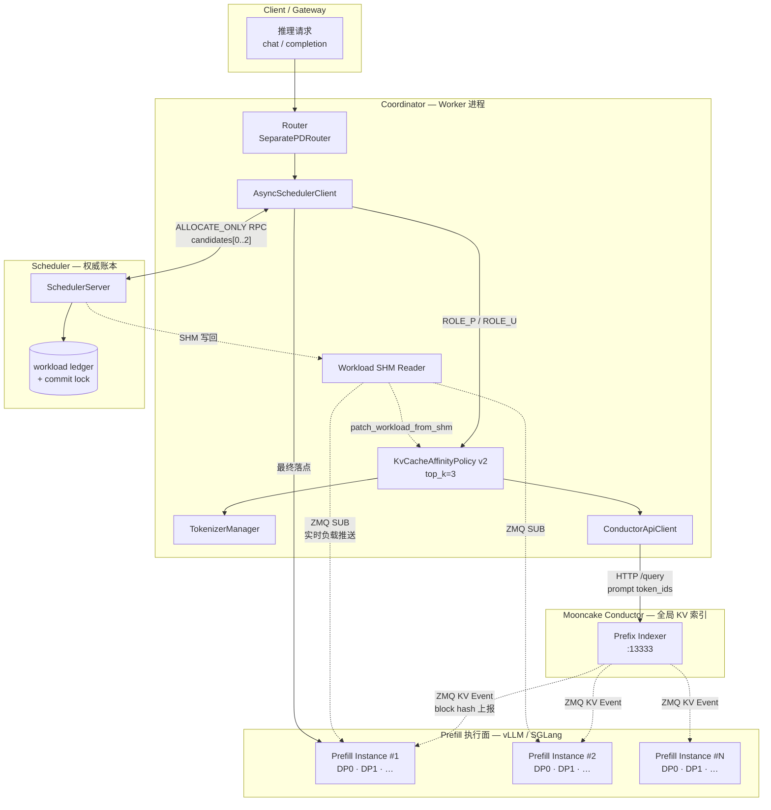

**数据流说明：**

| 链路 | 方向 | 内容 |
|------|------|------|
| KV Event | Prefill → Conductor | 各 DP endpoint 的 block hash / prefix 索引 |
| `/query` | Coordinator → Conductor | token_ids → 各 instance/DP 的 `longest_matched` |
| SHM 负载 | Prefill → Coordinator | endpoint 实时 workload，评分前热补丁 |
| ALLOCATE RPC | Coordinator → Scheduler | top-k 亲和候选 + primary=candidates[0] |
| 权威重选 | Scheduler 内部 | 在 top-k 内按 fresh ledger 选最低负载 |
| 降级链 | Policy 内部 | Conductor 失败 → load_balance → round_robin |

### 策略内部架构

`KvCacheAffinityPolicy` 的选点流水线与 Scheduler 二次决策：

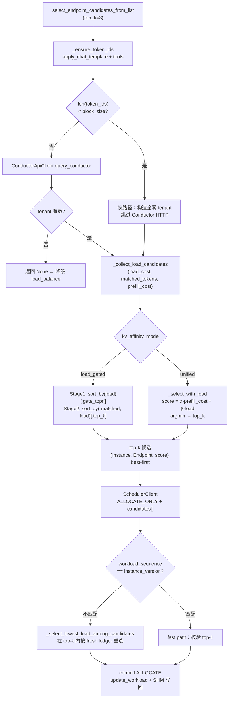

### 组件职责

| 组件 | 层级 | 角色 | 说明 |
|------|------|------|------|
| [[mooncake]] | 外部索引 | KV 前缀索引服务 | 订阅 ZMQ KV Event，维护全局 prefix 表，暴露 `/query` (:13333) |
| vLLM Prefill | 执行面 | 数据上报 + 计算 | ZMQ Publisher 发 KV Event；执行 prefill 计算 |
| ConductorApiClient | Coordinator | HTTP 薄封装 | register / query / unregister Conductor |
| **KvCacheAffinityPolicy v2** | Coordinator | 核心策略 | tokenize → query → 双模式评分 → top-k 候选 |
| TokenizerManager | Coordinator | Token 化 | HF tokenizer 线程安全单例，对齐 vLLM chat template |
| AsyncSchedulerClient | Coordinator | 策略分发 | 调用 Policy，上报 `_AFFINITY_CANDIDATE_TOPK=3` 候选 |
| SchedulerServer | 中央 Scheduler | 权威重选 | fresh workload ledger 在 top-k 内二次选点 + commit |
| Workload SHM Reader | Coordinator | 负载热补丁 | ZMQ SUB 推送，评分前 `patch_workload_from_shm` |

*(来源: wiki/repos/mindie-pymotor/kv-affinity.md)*

### 整体流程

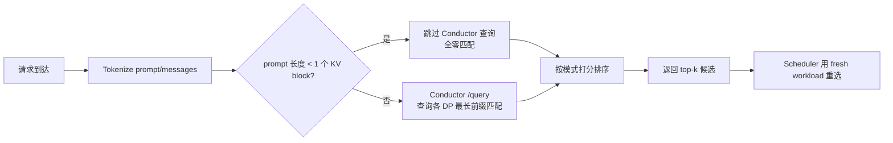

1. **Tokenize**：用 `TokenizerManager` 将 prompt/messages（含 tools）编码为 token ids，与 vLLM/SGLang 实际推理一致，并缓存在 `req_info.token_ids`。
2. **查询 Conductor**：向 Mooncake Conductor 查询各 Prefill instance 各 DP endpoint 的 `longest_matched`（已缓存前缀 token 数）。
3. **快路径**：若 prompt 短于一个 KV block，Conductor 只能返回 0 匹配，直接跳过 HTTP 调用。
4. **打分选点**：按配置模式对所有 endpoint 排序，返回分数越低越好的 top-k 候选。
5. **Scheduler 二次决策**：Worker 上报最多 3 个亲和候选（`ROLE_P`），Scheduler 用权威 workload ledger 在候选集内重选，避免突发流量扎堆到同一热点 endpoint。

**适用角色与降级链：**

| 条件 | 行为 |
|------|------|
| `scheduler_type = kv_cache_affinity` 且 `role ∈ {ROLE_P, ROLE_U}` | 走 KV 亲和选点 |
| Conductor 无数据 / tokenize 失败 | 降级 → **load_balance** → **round_robin** |
| Decode 等非 KVA 角色 | 不走 Conductor，直接 load_balance |

*(来源: wiki/repos/mindie-pymotor/kv-affinity.md)*

### 核心算法：v1 vs v2

### v1（旧版，已废弃）— 纯前缀贪心

1. 遍历实例，找 `longest_matched` 最大的实例
2. 在该实例 DP 字典中找 `DP[endpoint_id]` 最大的端点
3. 完全不考虑负载 → 热点堆叠

### v2（当前）— 双模式亲和-负载融合

1. **公共层** `_collect_load_candidates`：构建每个端点的 `(load_cost, matched_tokens, prefill_cost)` 三元组
2. **双模式评分**：见下节
3. 支持 **top-k 候选**（默认 top_k=3）返回，由 Scheduler 服务端权威重选
4. 子块请求 **跳过 HTTP**，直接返回 all-zero 匹配（快速路径）

*(来源: wiki/repos/mindie-pymotor/kv-affinity.md)*

### 双模式评分

### Unified 模式（推荐）

统一融合评分，**越低越好**：

$$
\text{score} = \text{prefill\_load\_scale} \times \max(0, \text{isl} - \text{overlap\_credit} \times \text{matched\_tokens})
      + \text{load\_weight} \times \text{workload\_score}
$$

选点方式：`argmin(score)`，取前 `top_k` 个最优候选。

**参数语义：**

| 参数 | 默认值 | 含义 |
|------|--------|------|
| `prefill_load_scale` | 1.0 | 亲和减免代价项的权重 |
| `load_weight` | 1.0 | 实时负载项权重（设为 0 = 纯前缀贪心） |
| `overlap_credit` | 1.0 | 前缀命中的折扣系数（0 = 不减免，退化为纯负载） |

**极端配置等价：**
- `load_weight=0` → 纯前缀亲和（类 v1，但全端点遍历）
- `overlap_credit=0` + `load_weight=1` → 纯负载均衡
- `load_weight=1, overlap_credit=1` → 标准亲和-负载融合（**生产推荐**）

### Load-Gated 模式

两阶段硬约束：

$$
\text{Stage 1（负载门）：} \quad \text{gated} = \text{sort\_by(load\_cost)[:load\_gate\_topn]}

$$
$$
\text{Stage 2（亲和排）：} \quad \text{ranked} = \text{sort\_by((-matched\_tokens, load\_cost))[:top\_k]}
$$

**参数：** `load_gate_topn`（默认 2）—— 保留 N 个最轻端点进入 Stage 2。

| 维度 | Unified | Load-Gated |
|------|---------|------------|
| 核心思路 | 线性加权：亲和折扣 + 负载，全局 argmin | 负载门过滤 → 亲和排序，两阶段硬约束 |
| 负载影响 | 软影响：负载高但前缀极长仍可胜出 | 硬约束：超出 topn 完全排除 |
| 适用场景 | 负载均匀，前缀复用为主 | 负载波动大，优先保证不过载 |
| 配置键 | `kv_affinity_mode = "unified"` | `kv_affinity_mode = "load_gated"` |

*(来源: wiki/repos/mindie-pymotor/kv-affinity.md)*

### 工程优化

### 5.1 子块快速路径（Fast Path）

当 `len(token_ids) < block_size` 时，跳过 HTTP query，直接返回 `matched=0`。避免短请求的 0.2s Conductor 查询延迟。

### 5.2 Token ID 缓存

`_ensure_token_ids` 写 `req_info.token_ids`，最多 tokenize 一次。

### 5.3 PR#210：top-k 候选 + Scheduler 权威重选

**背景与动机：** PR#210 是 KV 亲和能力的第三次演进（基础亲和 → unified/load_gated → top-k + Scheduler 重选），由 tobking 提交（核心 commit `547a119`）。解决多 Worker 并发 burst 时落点一致性问题。

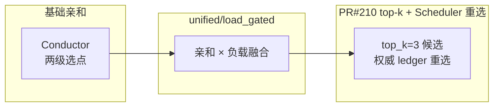

**旧方案痛点（in-flight overlay）：** 在 top-k 方案之前，Worker 在本地 SHM workload 之上维护一层 **in-flight overlay**：在 ALLOCATE 完成前把「即将分配的负载」叠加到本地视图。存在三类问题：

1. **TTL 难调**：overlay 存活时间过短无法覆盖 RPC 往返，过长则与真实账本漂移
2. **单 Worker 有效**：overlay 只修正本进程视角，无法协调其他 Worker
3. **非权威**：中央 Scheduler 的 workload ledger 才是 ALLOCATE 提交真相源

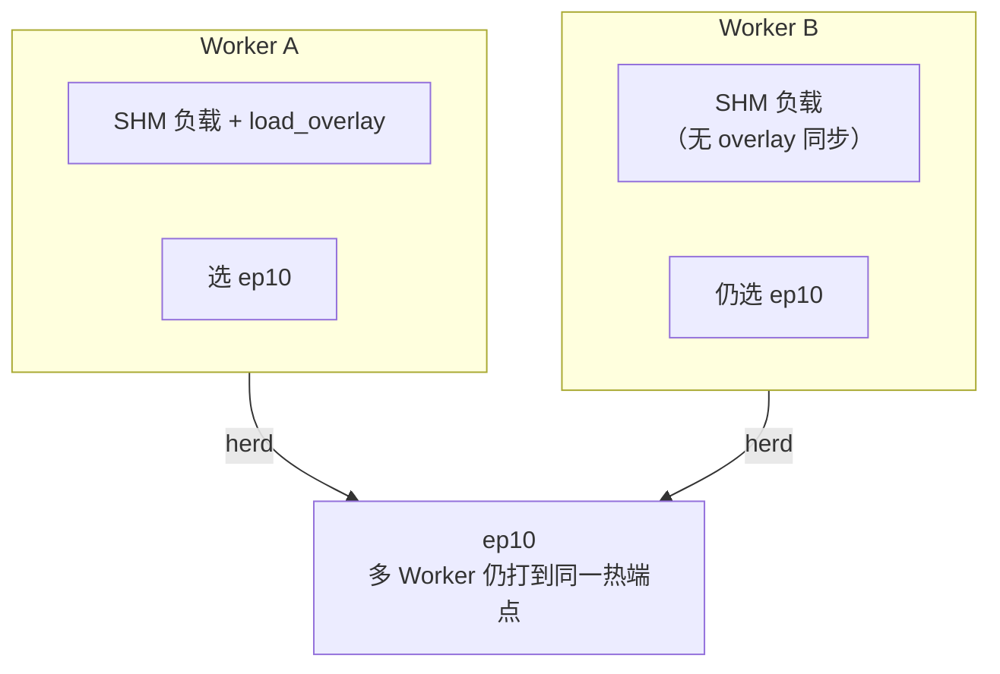

**新方案（PR#210）架构：**

核心思路：**Worker 只负责「谁前缀最好」**，**Scheduler 负责「谁现在最空」**——在 Worker 提出的 top-3 里重选，打散 burst，不再用 client 侧 overlay。

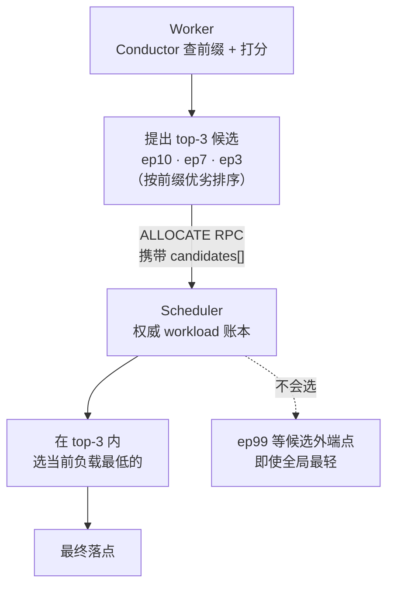

**谁做什么：**

| | Worker | Scheduler |
|---|--------|-----------|
| **职责** | 确定前缀最好的 3 个端点 | 在这 3 个里选负载最低的 |
| **依据** | Conductor + 本地 SHM 负载 | 权威账本（fresh ledger） |
| **输出** | top-3 候选列表 | 最终 (instance, endpoint) |

**核心变更对比：**

| 维度 | 变更前 | PR#210 后 |
|------|--------|----------|
| 亲和策略输出 | 单个 (Instance, Endpoint) | 最多 top_k 个 (Instance, Endpoint, score)，best-first |
| burst 打散 | Worker load_overlay | Scheduler 在候选集内按 fresh ledger 重选 |
| 过载保护 | overload_threshold | 移除；由权威重选 + 负载评分承担 |
| Prefill 上报 | top-1 | `_AFFINITY_CANDIDATE_TOPK = 3` |

**调度时序（新方案）：**

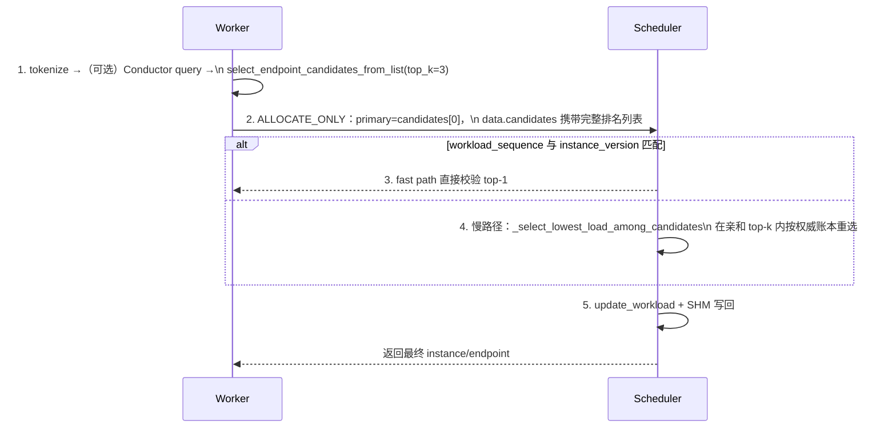

**权威重选逻辑（scheduler_server.py）：**

```python
if candidate_policy == CANDIDATE_POLICY_KV_CACHE_AFFINITY and len(candidates) > 1:
    selected = self._select_lowest_load_among_candidates(candidates, role)
    # 在 Worker 提出的亲和 top-k 内，用 LoadBalancePolicy.calculate_endpoint_score
    # 按 fresh ledger 选最低分；tie 保留最早（亲和最优）候选
```

**边界保证：** 全局最轻 endpoint 若不在 Worker 提交的 `candidates` 列表中，Scheduler **不会**越界选取——亲和边界由 Worker 排名保证，负载优化仅在边界内完成。

**关键设计决策：**

- **为何移除 in-flight overlay？** overlay 是进程内近似，无法成为集群级真相；TTL 与 RPC 延迟强相关，跨 Worker 无效。移除后 Worker 只负责「提出亲和合理的候选集」，burst 打散交给 Scheduler。
- **为何 top-k + Scheduler 重选？** Scheduler 持有提交锁下的最新 workload ledger，在 Worker 提出的 top-k（已按亲和排序）内二次选最低负载，既保留前缀亲和边界，又用权威视图打散 stale-view burst。
- **top_k=1 退化：** `select_endpoint_from_list` 内部调用 candidates 版本且 `top_k=1`，行为等价于旧单结果模式。
- **fast path 保留：** 当 Worker 的 `workload_sequence` 与 `instance_version` 与 Scheduler 完全一致时，仍只校验 Worker top-1，避免每次 ALLOCATE 都扫描候选集。

**受影响文件：**

| 文件 | 变更性质 |
|------|---------|
| `kv_cache_affinity.py` | +213 行量级重构：candidates API、双模式 top_k、短 prompt 快路径 |
| `scheduler_client.py` | 上报 top-3、移除 overlay 维护 |
| `scheduler_server.py` | 候选解析 + 权威重选 + fast path |
| `scheduler_connection_manager.py` | 清理 overlay 相关逻辑 |
| `test_kv_cache_affinity.py` | top_k 排名 UT |
| `test_scheduler_allocate_arbitration.py` | 新增重选 / policy 分支 UT |

**配置清理：** PR 移除了与 overlay / 过载阈值相关的调度配置项；`motor/config/coordinator.py` 保留 `kv_affinity_mode`、`kv_affinity_load_weight`、`kv_affinity_overlap_credit`、`kv_affinity_prefill_load_scale`、`kv_affinity_load_gate_topn` 等亲和调参。

**竞品对比：**

| 方面 | in-flight overlay | top-k + Scheduler 重选 |
|------|------------------|------------------------|
| 一致性模型 | 最终一致（依赖 TTL + 本地叠加） | ALLOCATE 提交点 **强一致**（commit lock + 权威 ledger） |
| 跨 Worker | 无协调 | 共享 Scheduler 视图 |
| 亲和边界 | 单点决策，易 herd | Worker 限定 top-k 集合，Scheduler 仅在集合内优化负载 |
| 运维复杂度 | 需调 overlay TTL / overload_threshold | 主要调 `top_k`（代码常量 3）与亲和 mode 参数 |

**权衡：** 若 Scheduler 对全集群端点做精确全局排序，可得到理论最优负载，但计算成本随实例数线性增长，且可能选出 Worker 未评估亲和度的远端点。top-k 方案将搜索空间限制在 Worker 已查询 Conductor 的亲和前沿，复杂度 O(k)，k=3 在 burst 打散与 RPC 体积之间取平衡。

^[raw/articles/pymotor/pr210_kv_affinity_topk_candidates_deep_analysis.md]

*(来源: wiki/repos/mindie-pymotor/kv-affinity.md)*

### 性能收益与典型场景

亲和调度 + KV 多级缓存全局池化在特定负载下可达 **首 token 时延（TTFT）−70%+、端到端时延（E2E）−50%**。下面从代码模型出发给出量化推导与适用边界（面试/汇报口径：标注为「代表性测算」，非实测）。

### 时延构成（PD 分离）

一条请求经 `SeparatePDRouter` 串起：调度 P → Prefill → release_kv → 调度 D → Decode 出首 token + 后续 token。

```math
\text{TTFT} = c_0 + T_{prefill}^{full}\cdot(1-h), \qquad \text{E2E} = \text{TTFT} + (\text{OSL}-1)\times \text{TPOT}
```

- \(c_0\)：固定开销（`query_conductor` 调度 + P→D KV 传输 + 首步 decode），不随 prompt 增长
- \(T_{prefill}^{full}\cdot(1-h)\)：唯一随 prompt 线性增长、且可被前缀命中抹掉的大头
- \(h = matched\_tokens / isl\)：有效命中率，直接来自 `_collect_load_candidates` 的 `prefill_cost = max(0, isl - overlap_credit × matched_tokens)`

**关键约束：E2E 降幅 = TTFT 降幅 × prefill 占比 \(r = TTFT/E2E\)。** 只有「长输入 + 短输出」才能让 r 足够大，使 E2E −50% 成立；长输出会被 decode 段稀释。

### 推荐场景：长上下文 + 短输出 + 高前缀复用

> **企业知识库批量抽取 / RAG 长文档问答 Agent**：对同一份长文档/知识库上下文发起多个不同问题。例如一份 8000 token 合同批量抽取 20 个字段（20 条请求共享同一前缀）；或固定 system prompt + 工具定义 + 热点文档被大量用户反复查询；或多轮对话在同一上传文档上持续追问。

三层天然可复用前缀：①共享 system prompt + 工具定义（~2000 token，100% 相同）；②文档/检索上下文（~5000 token，批量/多轮/热点高度复用）；③对话历史（会话内逐轮累积）。

**建模参数：**

| 参数 | 取值 | 说明 |
|------|------|------|
| 模型 / 部署 | Qwen3-8B，PD 分离，TP2×DP2，4×P | 与部署示例一致 |
| ISL（输入） | 8000 token | system+tools 2000 + 文档 5000 + 历史 1000 |
| OSL（输出） | ~15 token | 结构化短答案 / 字段值 / 分类标签 |
| Prefill 速率 | ~12.5k tok/s ⇒ 全量 ≈ 640 ms | 8B NPU 量级 |
| TPOT | ~25 ms/token ⇒ decode ≈ 350 ms | 14 步解码 |
| 固定开销 \(c_0\) | ~50 ms | 调度 + KV 传输 + 首步 |

### 命中率：基线 vs 开启（70% 的真正来源）

有效命中率拆为 \(h = h_{reuse} \times P_{route} \times P_{pool}\)：

| 因子 | 基线（随机路由 + 仅本地 HBM） | 开启（亲和 + 多级全局池） |
|------|------------------------------|--------------------------|
| 路由命中 \(P_{route}\) | ≈ 1/N = 0.25 | ≈ 1.0（Conductor 全局索引精确路由） |
| 容量命中 \(P_{pool}\) | 受单卡 HBM 限制，热点易驱逐 | ≈ 1.0（HBM→DRAM→Mooncake 多级 + 水位驱逐） |
| **有效 \(h\)** | **≈ 0.10** | **≈ 0.88** |

> 基线 0.10：即使引擎开了 `enable-prefix-caching`，随机路由让多数请求落到无该前缀的实例 → 本地 miss → 全量 prefill。

### 数字代入

| 指标 | 基线 | 开启后 | 降幅 |
|------|------|--------|------|
| TTFT = \(c_0 + 640(1-h)\) | 50 + 640×0.90 = **626 ms** | 50 + 640×0.12 = **127 ms** | **−79.7%** |
| E2E = TTFT + decode | 626 + 350 = **976 ms** | 127 + 350 = **477 ms** | **−51.1%** |

其中 \(r = 626/976 = 0.64\)，故 \(\Delta E2E/E2E = 0.797 \times 0.64 \approx 0.51\)。

### 性能提升来源点（对应代码）

1. **主收益：prefill 计算量被前缀命中抹掉（占 TTFT 降幅 ~90%）**——`prefill_cost = isl·(1-h)`，h 0.10→0.88 使待算 token 7200→960。
2. **亲和调度把「潜在命中」变「实际命中」**——`query_conductor` 拉全局前缀分布，按 `matched_tokens` 路由到持有最长前缀的 P 实例；没有这步 h 永远停在 ~0.1。
3. **多级全局池化保住高 h 的上限与持久性**——`kv_cache_pool_config`（`global_segment_size` + `eviction_high_watermark_ratio`）把前缀沉到 DRAM/远端，使 \(P_{pool}≈1\)；命中部分经 `AscendStoreConnector`/`MooncakeLayerwiseConnector` 高速搬 KV 而非重算（`overlap_credit≈1`）。
4. **P→D 用 layerwise KV 传输替代重算**——D 端复用 prefill 的 KV（`kv_transfer_params`），压低 \(c_0\)。
5. **负载感知避免羊群效应（高并发下对 E2E 的安全垫）**——unified 分数 `prefill_load_scale×prefill_cost + load_weight×load_cost` + top-k Scheduler 重选，使全集群利用率 ρ 下降、排队时延 \(\propto ρ/(1-ρ)\) 显著下降；满载时这一项保证降幅不回退。
6. **次要：短 prompt fast-path**——不足一个 block 跳过 Conductor 阻塞往返，省一次 RTT。

### 适用边界（防追问）

- **强依赖「长输入 + 短输出 + 高前缀复用」**：短输入或长输出场景 TTFT 仍有收益，但 E2E 降幅被 decode 稀释。
- **三者缺一不可**：只开亲和受单卡 HBM 容量限制（h 上不去）；只开池化没有全局路由（请求落错实例本地都查不到）；`_KVA_ROLES` 注册 + `query_conductor` + `MultiConnector` 协同才成立。
- **测算 vs 实测**：实测应跑 A/B，基线 `scheduler_type=round_robin/load_balance`，对照 `kv_cache_affinity` + 池化，固定 ISL/OSL 与前缀复用比例。

*(来源: wiki/repos/mindie-pymotor/kv-affinity.md)*

### 降级与容错（三级瀑布）

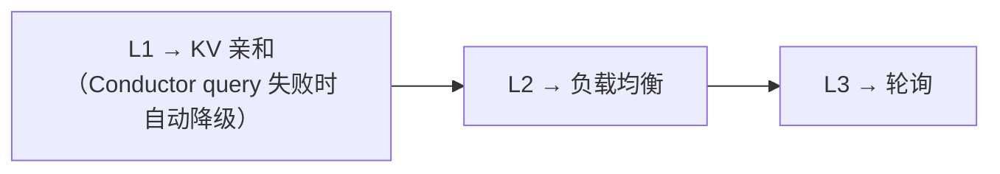

请求不阻塞，每级降级有日志告警。

**静默失败常见根因：**
- `conductor_service` 配置错误（未定义或端口不通）
- `model_path` 与 Conductor 侧不一致（hash 不匹配）
- Conductor 未启动或被防火墙阻断

*(来源: wiki/repos/mindie-pymotor/kv-affinity.md)*

### SHM Workload 热补丁

`patch_workload_from_shm` 在评分前热补最新负载数据，通过 ZMQ SUB 推送刷新。

^[raw/articles/pymotor/kv_cache_affinity_deep_analysis.md] [raw/articles/pymotor/pr210_kv_affinity_topk_candidates_deep_analysis.md]

*(来源: wiki/repos/mindie-pymotor/kv-affinity.md)*

### 设计选型依据

本节从业界对比角度解释「为什么是这套设计」。

### 根本动机：为什么不能只用负载均衡？

业界共识是：**LLM 推理是有状态的，普通 round-robin / 纯负载均衡对 prefix caching 是「有害的」**。

- Prefill 阶段会为 prompt 构建 KV cache；只有**落到已有相同前缀 cache 的 worker** 才能跳过重复计算。
- 若相同 system prompt / 多轮对话前缀被随机打散到不同 endpoint，每次都要重算 prefill，TTFT 和 GPU 利用率都变差。
- [Mooncake 论文](https://arxiv.org/html/2407.00079v3)（Kimi 生产平台）的核心论点：**KV cache 分布应成为调度的一等公民**，目标是在满足 TTFT/TBT SLO 的前提下最大化 goodput。
- GKE Inference Gateway / llm-d 也明确：纯负载均衡会主动浪费已算好的 prefix。

因此 `scheduler_type = kv_cache_affinity` 不是「锦上添花」，而是**长上下文、多轮对话、共享 system prompt** 场景下的必要优化。

### 为什么用 Mooncake Conductor 而非 Coordinator 自建索引？

这是**职责分离**，与 Mooncake 生态设计一致：

| 组件 | 角色 | 原因 |
|------|------|------|
| vLLM/SGLang | 计算引擎 | 只负责 prefill/decode，不应感知全局 cache 分布 |
| **Conductor** | 全局 KV 索引器 | 订阅各 DP 的 KV Event（ZMQ），维护 prefix 表，暴露 `/query` |
| **Coordinator** | 路由/调度 | 每次 prefill 前 tokenize + 查 Conductor，做选点决策 |

[Conductor 架构文档](https://kvcache-ai.github.io/Mooncake/design/conductor/conductor-architecture-design.html)的定位：

> Router 只需回答一个问题：**对这个 request prefix，哪个 instance 有最好的可复用 KV cache？**

同类方案对比：
- **llm-d**：scheduler 订阅 vLLM KV Event，自建 indexer
- **LMCache**：controller 提供 `/lookup`，router 查最长前缀
- **vLLM V1**：`DPPrefixCacheRouter` 用 block hash 做 DP 内 prefix 路由

MindIE 选 Conductor，是因为已在 Mooncake 生态里，**复用成熟的全局 indexer**，避免 Coordinator 重复实现 ZMQ 事件消费、block hash、多 tier 索引等复杂逻辑。

### 为什么必须本地 Tokenize，且 tools 不能丢？

[Conductor Indexer API](https://kvcache-ai.github.io/Mooncake/design/conductor/indexer-api-design.html) 要求 router 提供 **prompt token IDs**（与 engine tokenizer 一致）。原因：**prefix 匹配是在 token 序列上做的，不是 raw text**。

- chat template、tools、generation prompt 都会改变 token 序列；
- 若 Coordinator 的 token 与 vLLM 实际 prefill 不一致，`longest_matched` 会**系统性偏低或错位**，亲和调度反而帮倒忙。

行业做法一致：
- llm-d precise-prefix-cache：scheduler 侧 tokenizer 的 `modelName`、`blockSize`、`hashSeed` 必须与 vLLM 完全一致。

MindIE 的 `TokenizerManager` 用与推理相同的 `apply_chat_template(..., tools=...)`，tokenize 失败则返回 `[]` 并降级——这是 **fail-closed**：宁可不用亲和，也不误导 Conductor。

### 为什么有「短 prompt 跳过 Conductor」快路径？

Conductor **按完整 block 做 prefix hash**（trailing partial block 不参与 `/query`）。因此 prompt 长度 < 1 个 KV block 时，**不可能有 cache hit**，查 Conductor 只会得到全零，却多一次 ~200ms 级 HTTP 往返。快路径是性能优化，不改变语义——与 Conductor「只索引整块」的设计一致。

### 为什么有两种模式：unified 和 load_gated？

这对应业界「**缓存局部性 vs 负载**」的两种经典权衡。

**Mooncake 论文的代价函数（§6）** 对每个 prefill instance 估算 TTFT：

$$
\text{TTFT} \approx T_{transfer} + T_{queue} + T_{prefill}(\text{prompt\_len} - \text{prefix\_len})
$$

选 TTFT 最小的 instance——本质是：**剩余 prefill 工作量 + 排队延迟** 的联合优化。

MindIE 的 `unified` 模式与以下方案同构：

| 方案 | 代价函数形式 |
|------|-------------|
| Mooncake | \(T_{prefill}\) 随 prefix_len 增大而减小，\(T_{queue}\) 反映负载 |
| NVIDIA Dynamo KV Router | `Cost = overlap_weight × Prefill_Blocks + Decode_Blocks` |
| BentoML / llm-d | cache locality scorer + load scorer 加权组合 |

`load_weight=0` 退化为纯最长前缀；`load_weight>0` 则允许「无缓存但极空闲」的 endpoint 胜出，**避免所有流量挤到同一热点 prefix 节点**。

`load_gated` 是更保守的策略：给负载设**硬边界**，亲和永远不能把请求拉到高负载 endpoint——类似 GKE EPP 的「prefix 匹配弱时 fallback 到 kv_cache_usage 最低 replica」——先保 SLO，再用亲和做 tie-break。

默认 `unified` 是因为 Mooncake / Dynamo 实验证明**软加权**通常比纯亲和或纯负载均衡更优；`load_gated` 留给运维在热点 prefix 导致排队时切换。

### 为什么是 Worker top-3 候选 + Scheduler 用 fresh ledger 重选？

这是分布式调度里的 **stale view** 问题：

```
Worker 本地：Conductor 结果 + 可能过期的 workload 视图
Scheduler 中央：权威的实时 workload ledger
```

若 Worker 只报 1 个亲和最优 endpoint，突发流量会**全部打到同一热点**（herding）。

top-k（当前为 3）+ Scheduler 重选的设计：

1. Worker 负责「**谁 cache 最好**」——需要 tokenize + Conductor，成本高；
2. Scheduler 负责「**谁现在最空**」——在 top-k 内按 fresh load 打散；
3. 去掉 client 侧 `load_overlay`，避免双重记账、视图不一致。

这与 llm-d EPP「prefix scorer + max-score-picker + load scorer 组合」的思路一致，只是把「组合打分」拆成 **Worker 亲和排名 + Scheduler 负载重选** 两层，更适合 PyMotor 的 ZMQ Scheduler 架构。

### 为什么降级链是 kv_affinity → load_balance → round_robin？

Conductor 是**增强路径**，不是硬依赖：

- Conductor 宕机 / tenant 无数据 → 仍要 serving；
- tokenize 失败 → 错误亲和比无亲和更糟，应 fail-closed；
- Decode（非 `ROLE_P`/`ROLE_U`）→ KV 复用发生在 prefill，decode 走 load_balance 即可。

这与 LMCache router「lookup 失败 fallback 到 occupancy scoring」、GKE EPP「无强 prefix 匹配时 fallback 到 cache usage」一致。

### 为什么选点之后仍要 update_workload？

亲和只决定**落点**；中央 workload 账本仍服务：decode 路径的负载均衡、降级到 load_balance 时的评分、Worker SHM 同步。Mooncake Conductor 选完 instance 后也会更新该 instance 的 queue 估计；MindIE 同理，否则亲和与负载信号会脱节。

### 设计选型汇总对照表

| 设计点 | 选型 | 行业/理论依据 |
|--------|------|----------------|
| 调度范式 | KV-cache-centric | Mooncake §6；有状态 worker 不宜 cache-blind LB |
| 全局索引 | 外部 Conductor `/query` | Conductor = indexer；与 llm-d/LMCache 同类 |
| Tokenize | 本地、对齐 vLLM、含 tools | prefix 在 token 空间匹配；错 token 比不亲和更糟 |
| 打分 | `unified` 软加权 / `load_gated` 硬门控 | ≈ Mooncake TTFT 代价 / Dynamo overlap+load 双目标 |
| 分布式 | Worker top-k + Scheduler 重选 | 解 stale view + 防 prefix 热点 herding |
| 快路径 | sub-block 跳过 query | Conductor 只索引整块 |
| 容错 | 三级 fallback + tokenize fail-closed | Conductor 是增强，不是单点 |

一句话：**MindIE 的 KV 亲和策略，是把 Mooncake「以 KV cache 为中心、在 prefix 复用与负载之间估 TTFT」的论文思想，落地成 Coordinator 可调参的 `unified`/`load_gated` 两档，并接入 Conductor 作为 precise prefix indexer 的工程实现**——不是从零发明算法，而是在 PD 分离、多 Worker、中央 Scheduler 的架构约束下，选了与业界一致且可运维的一组折中。

*(来源: wiki/repos/mindie-pymotor/kv-affinity.md)*

### 一句话定位

| 维度 | 内容 |
|------|------|
| 属于哪一面 | **数据面**（KV 如何存放/传输），区别于亲和的**调度面**（请求路由到哪） |
| 解决什么 | KV 跨节点共享、HBM 容量瓶颈、P/D 时序耦合 |
| 靠什么实现 | Mooncake Master（存储） + MultiConnector（Layerwise 直传 + Store 池化） |
| 关键收益 | 提升前缀缓存的**容量命中率** \(P_{pool}\)、解耦 P→D、降低显存压力 |

*(来源: wiki/repos/mindie-pymotor/kv-pool.md)*

### 为什么需要池化（意义）

### 1. 单卡 HBM 是 prefix cache 的硬天花板

vLLM 的 `enable-prefix-caching` 让相同前缀的 KV 块可被复用，但缓存只活在**单个实例的本地 HBM** 里。HBM 容量极其有限，能缓存的 token 数为：

$$
N_{\text{cache}} \approx \frac{M_{\text{HBM}} \times (1 - u_{\text{weights+act}})}{2 \times L \times H \times d_{\text{head}} \times b_{\text{kv}}}
$$

- \(M_{\text{HBM}}\)：单卡显存；\(u\)：权重与激活占用比例
- 分母 \(2 \times L \times H \times d_{head}\)：每 token 的 K、V 两份、按层数 \(L\) × KV 头数 \(H\) × 头维度累加；\(b_{kv}\)：每元素字节数

容量一旦超限，热点前缀会被 **LRU 驱逐**，下一次复用又得重算 prefill。**池化的第一意义：把 HBM 的「秒级、GB 级」缓存，扩展成 HBM→DRAM→远端的「分钟级、百 GB 级」分级缓存**，抬高容量命中率上限 \(P_{pool} \to 1\)。

### 2. PD 分离下 P→D 的时序与显存耦合

无池化时 KV 走**点对点直连**（P 算完直接 push 给 D）：

- D 必须**实时在线等待** P 传输 → 时序强耦合
- P 的 HBM 必须**保留 KV 直到传完** → 显存被占住、并发上不去
- P、D 必须保持直接网络连通；无法溢出到 CPU/SSD

池化把传输改成 **「P 写池 → 释放 → D 按需读池」** 的异步解耦模型。

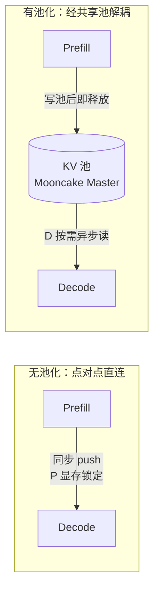

### 3. 跨节点共享 = 让「别人算过的前缀」也能用

池化让 KV 成为**集群级共享资产**：A 实例 prefill 出的 system prompt KV，B 实例的请求也能复用。这正是池化与 [[mindie-pymotor/kv-affinity|KV 亲和调度]] 联动的物理基础——亲和负责「把请求路由到有缓存的地方」，池化负责「让缓存在集群里真实可达且不被过早驱逐」。

*(来源: wiki/repos/mindie-pymotor/kv-pool.md)*

### 架构与组件

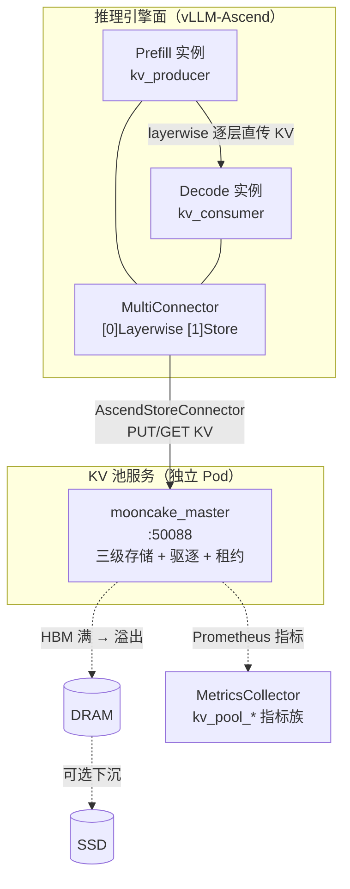

| 组件 | 角色 | 关键点 |
|------|------|--------|
| **mooncake_master** | 池化存储主进程 | 独立 Pod（默认 :50088）；管理三级存储、驱逐、租约 |
| **AscendStoreConnector** | vLLM 插件（写/读池） | `backend=mooncake`；P 端 `lookup_rpc_port="0"`（写），D 端 `"1"`（读） |
| **MooncakeLayerwiseConnector** | vLLM 插件（P→D 直传） | 逐层流水传输，**不经 Master**，压低 TTFT |
| **MultiConnector** | 组合连接器 | `connectors[0]=Layerwise` 快路径 + `connectors[1]=Store` 持久化，双通道并行 |
| **kv_transfer_params** | 元数据 | Prefill 响应返回，告诉 D「去哪取 KV」（Coordinator 仅透传不解析） |
| **MetricsCollector** | 可观测 | 从 Master Prometheus 端点拉 `kv_pool_size/ratio/keys/eviction` |

*(来源: wiki/repos/mindie-pymotor/kv-pool.md)*

### Connector 详解：Layerwise / Store / Multi

Connector 是 vLLM 侧的 KV 传输插件，决定「KV 往哪写、从哪读」。池化实现里最值得讲的折中是 **实时性 vs 解耦性**——两个目标用两条通道分别满足，再由 `MultiConnector` 组合。

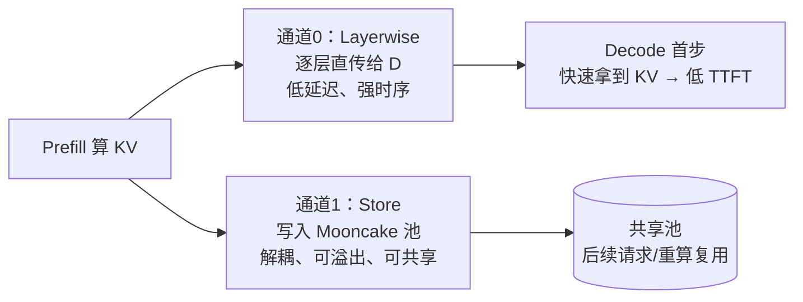

| 通道 | Connector | 优点 | 代价 |
|------|-----------|------|------|
| 快路径 | `MooncakeLayerwiseConnector` | 逐层流水 → 首 token 等待短 | 需 P/D 同时在线，强耦合 |
| 持久层 | `AscendStoreConnector` | P 写完即走、跨节点共享、可溢出 | 多一跳存储 RTT |

### MooncakeLayerwiseConnector（逐层直传）

直接建立 P→D KV 传输通道，**不经 Master 存储**；按 Transformer 层流水传输，D 端拿到第 1 层即可开始首步 decode，从而压低 TTFT。

| 参数 | 说明 |
|------|------|
| `kv_connector` | `MooncakeLayerwiseConnector` |
| `kv_role` | Prefill：`kv_producer`；Decode：`kv_consumer` |
| `kv_port` | KV 传输端口（按 dp_rank 偏移分配，避免冲突） |
| `send_type` | `PUT`（P 主动推送）或 `GET`（D 主动拉取） |

### AscendStoreConnector（池化存储）

经 Mooncake Master 落地 KV：P 写入、D 按 `instance_id` 查找读取，支持向 DRAM/SSD 溢出，是**跨节点共享 + 解耦时序**的关键。

| 参数 | 说明 |
|------|------|
| `kv_connector` | `AscendStoreConnector` |
| `backend` | `mooncake` |
| `lookup_rpc_port` | Prefill：`"0"`（写方）；Decode：`"1"`（读方） |
| `mooncake_rpc_port` | MooncakeStoreV1 时承载 instance_id |

### MultiConnector（双通道组合）

```json
"kv_connector": "MultiConnector",
"kv_connector_extra_config": {
  "use_layerwise": true,
  "connectors": [
    { "kv_connector": "MooncakeLayerwiseConnector", ... },  // [0] 快路径：逐层直传
    { "kv_connector": "AscendStoreConnector", ... }          // [1] 持久化：Master 池化
  ]
}
```

- 数组顺序即优先级：`[0]` Layerwise 给实时性，`[1]` Store 给解耦与共享。
- `use_layerwise` 开关控制 Layerwise 通道是否启用：**纯池化**部署示例设 `true`（双通道并行）；**KV 亲和**部署示例设 `false`（仅 Store，依赖池化做全局可达落地）。两者按需组合，体现叠加时数据通道的取舍。

*(来源: wiki/repos/mindie-pymotor/kv-pool.md)*

### KV 路由元数据与 release_kv 时序

Connector 选定后，「D 如何知道去哪取 KV」由 **`kv_transfer_params`** 元数据承载，Coordinator 全程**只透传、不解析内容**：

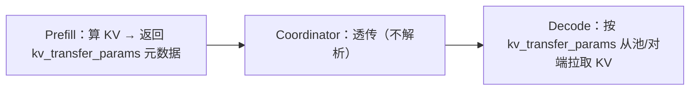

典型字段：`remote_engine_id`、`remote_block_ids`、`remote_host`、`remote_port`。

**release_kv（显存回收信号）：** Prefill 完成后，Coordinator 调用 `release_kv(prefill_resource)` 告知 P 节点该 KV 的传输引用计数归零，可回收本地 HBM。

> 关键边界：`release_kv` 是**显存回收**信号，**不等于删除池中数据**——池中 KV 的生命周期由租约 TTL + 水位驱逐（见下节）独立控制。正是这一解耦让 P「写完即走」，而 D 仍能稍后异步读到。

*(来源: wiki/repos/mindie-pymotor/kv-pool.md)*

### 驱逐机制：水位线与租约（可推导细节）

池容量有限，必须驱逐。`mooncake_master` 启动参数（由 `kv_cache_pool_config` 生成，见 `kv_pool.py` / `kv_pool.sh`）：

```bash
mooncake_master --port "$KV_POOL_PORT" \
    --eviction_high_watermark_ratio "$RATIO" \
    --eviction_ratio "$EVICT" \
    --default_kv_lease_ttl "$TTL"
```

### 高水位触发 + 批量驱逐

设池总容量 \(C\)、当前占用 \(U\)，则使用率 \(\rho = U / C\)。驱逐逻辑：

$$
\rho \ge \text{high\_watermark} \;\Rightarrow\; \text{驱逐量} = \text{eviction\_ratio} \times C
$$

- `eviction_high_watermark_ratio`（默认 0.9）：占用率达 90% 触发驱逐
- `eviction_ratio`（默认 0.1）：单次批量驱逐池容量的 10%（**批量驱逐而非逐条**，摊薄开销、避免抖动）

驱逐后占用从 \(0.9C\) 降到约 \(0.8C\)，留出缓冲。批量驱逐是工程常见手法：把「频繁单条驱逐」换成「攒一批一次清」，降低锁竞争与元数据更新频率。

### 租约 TTL：保证 Decode 取得到

$$
\text{default\_kv\_lease\_ttl} > \max(T_{\text{decode}},\ \text{ASCEND\_CONNECT\_TIMEOUT},\ \text{ASCEND\_TRANSFER\_TIMEOUT})
$$

- KV 写入池后在 TTL 内**保证不被驱逐**，确保 D 一定读得到
- 默认 11000ms；**必须大于** vLLM 实例的连接/传输超时，否则 D 还没读完就被驱逐 → recompute
- 这是「驱逐」与「正确性」的安全边界：水位驱逐是容量回收，租约是正确性下限

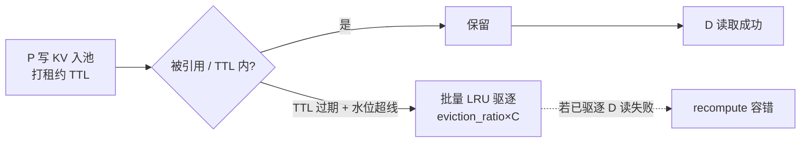

*(来源: wiki/repos/mindie-pymotor/kv-pool.md)*

### 配置注入与部署链路

`kv_cache_pool_config` 是池化全局配置，经 `deploy.py` → `kv_pool.py`(`normalize_kv_cache_pool_config` / `gen_kv_pool_env`) 转成 `mooncake_master` 的环境变量与启动参数：

| 配置键 | 默认 | 作用 |
|--------|------|------|
| `metadata_server` | `P2PHANDSHAKE` | 元数据握手模式（点对点） |
| `protocol` | `ascend` | 底层传输协议 |
| `device_name` | `""` | 绑定网卡，空则自动选 |
| `global_segment_size` | `1GB` | 全局共享显存段大小 |
| `eviction_high_watermark_ratio` | `0.9` | 高水位驱逐线 |
| `eviction_ratio` | `0.1` | 单次驱逐比例 |
| `port` | `50088` | 池服务端口（缺省自动补） |
| `default_kv_lease_ttl` | `11000` | 租约 TTL（ms） |

引擎侧 `kv_transfer_config` 由 `vllm_config.py` 自动补全（无需手填并行度）：

- `_process_multi_connector`：按 role 设 `kv_role`、`engine_id`
- `_process_mooncake_connector`：注入 DP/TP/PP 并行参数
- `_process_store_connector`：把 `lookup_rpc_port` 替换为真实 `instance_id`

*(来源: wiki/repos/mindie-pymotor/kv-pool.md)*

### 容错：Recompute

KV 传输/读取失败（如租约过期被驱逐、网络抖动）时的兜底：

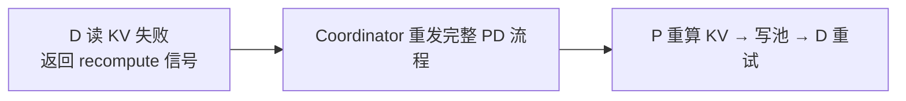

池化是**增强**而非正确性单点：失败可回退到重算，serving 不中断。

*(来源: wiki/repos/mindie-pymotor/kv-pool.md)*

### 可观测性：Prometheus 指标族

`MetricsCollector` 从 Mooncake Master 拉取并重命名为四个指标族（见 `metrics_collector.py`）：

| 指标 | 标签 | 含义 |
|------|------|------|
| `kv_pool_size` | `layer=cpu\|ssd\|all, stat=usage\|total` | 池容量（GB） |
| `kv_pool_ratio` | `layer=…, stat=usage_rate` | 使用率 0–1（驱逐水位的实时观测量） |
| `kv_pool_keys` | — | 池中 KV 条目数 |
| `kv_pool_eviction` | `stat=success\|attempts` | 驱逐成功/尝试计数 |

面试可点出：`kv_pool_ratio` 接近 `eviction_high_watermark_ratio` 时应观察 `kv_pool_eviction` 上升 → 命中率可能回落 → 提示扩容 `global_segment_size`。

*(来源: wiki/repos/mindie-pymotor/kv-pool.md)*

### 面试速记（30 秒口径）

1. **是什么**：把 KV Cache 从单卡 HBM 抽象成跨节点、分级溢出、可驱逐、有租约的共享池（Mooncake Master）。
2. **为什么**：HBM 容量是 prefix cache 天花板；PD 分离下 P→D 点对点直连有时序与显存耦合。
3. **怎么做**：MultiConnector 双通道——Layerwise 逐层直传压 TTFT，Store 写池解耦+共享；Master 用高水位+批量驱逐管容量，用租约 TTL 保正确性。
4. **配什么**：`kv_cache_pool_config`（段大小/水位/驱逐比/TTL）→ `mooncake_master` 启动参数。
5. **怎么观测**：`kv_pool_ratio` 看水位、`kv_pool_eviction` 看驱逐、`kv_pool_size` 看分级容量。
6. **和亲和的关系**：池化抬高**容量命中率** \(P_{pool}\)，亲和抬高**路由命中率** \(P_{route}\)，两者相乘才是端到端有效命中率——见 [[mindie-pymotor/kv-pool-and-affinity|联合调度文档]]。

^[raw/articles/mindie-pymotor-docs-2026.md]

*(来源: wiki/repos/mindie-pymotor/kv-pool.md)*

### 一句话区分

| | KV 亲和调度 | KV 池化 |
|---|------------|---------|
| **面** | 调度面（control plane） | 数据面（data plane） |
| **回答的问题** | 请求**路由到哪个** Prefill 节点 | KV **如何存放/传输**、能否跨节点可达 |
| **核心组件** | Conductor（前缀索引）+ Policy 打分 | Mooncake Master（分级存储）+ MultiConnector |
| **抬高的命中因子** | 路由命中 \(P_{route}\) | 容量命中 \(P_{pool}\) |
| **可独立用** | ✓（但受单卡 HBM 容量限制） | ✓（但请求可能落错实例查不到） |

*(来源: wiki/repos/mindie-pymotor/kv-pool-and-affinity.md)*

### 核心论点：命中率是「乘法」不是「加法」

端到端**有效前缀命中率** \(h\) 决定 prefill 能省掉多少计算。它可分解为三个独立因子的乘积：

$$
h = h_{\text{reuse}} \times P_{\text{route}} \times P_{\text{pool}}
$$

| 因子            | 含义                                          | 谁负责抬高                     |
| ------------- | ------------------------------------------- | ------------------------- |
| \(h_{reuse}\) | 请求间**逻辑上**可复用的前缀比例（system prompt / 文档 / 历史） | 业务负载特性（长输入+复用）            |
| \(P_{route}\) | 请求被**路由到持有该前缀**实例的概率                        | **KV 亲和**（Conductor 全局索引） |
| \(P_{pool}\)  | 该前缀在被复用前**仍驻留在缓存**的概率                       | **KV 池化**（分级+水位驱逐+租约）     |

**乘法结构是关键洞察**：任一因子接近 0，整体 \(h\) 就坍塌。这解释了「单开一个能力收益有限，必须叠加」：

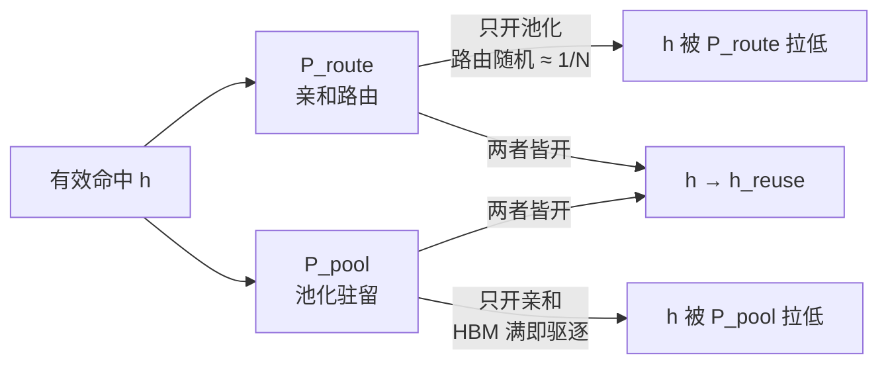

### 只开一个会怎样

| 配置 | \(P_{route}\) | \(P_{pool}\) | 有效 \(h\) | 瓶颈 |
|------|--------------|-------------|-----------|------|
| 都不开（随机+本地 HBM） | ≈ 1/N | 低（易驱逐） | ≈ 0.10 | 路由 + 容量双低 |
| 只开池化 | ≈ 1/N | ≈ 1.0 | 仍 ≈ 0.10 | **请求落错实例，本地池查不到** |
| 只开亲和 | ≈ 1.0 | 受单卡 HBM 限 | 中等且不稳 | **热点前缀被 LRU 驱逐，h 上不去** |
| **亲和 + 池化** | ≈ 1.0 | ≈ 1.0 | **≈ 0.88** | 逼近 \(h_{reuse}\) 上限 |

> 「只开池化」的失效最反直觉：池子里**有**这份 KV，但随机路由把请求送到一个本地索引查不到该前缀的实例，于是仍然全量 prefill。亲和提供的全局路由（Conductor）才把「池里有」变成「路由得到、查得到」。

*(来源: wiki/repos/mindie-pymotor/kv-pool-and-affinity.md)*

### 联合端到端流程

一条请求如何同时穿过调度面与数据面：

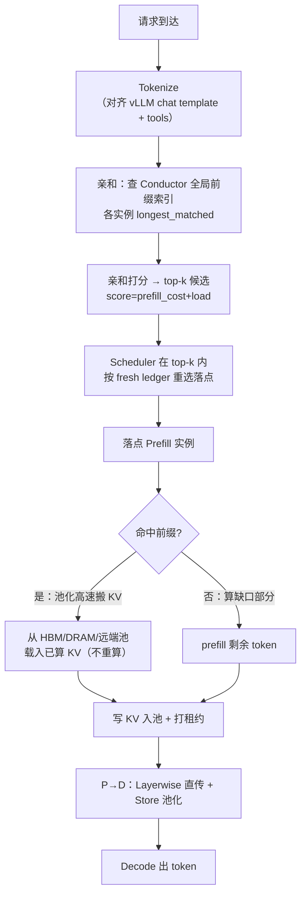

- **调度面（蓝色逻辑）**：Tokenize → Conductor 查询 → 打分 → top-k → Scheduler 重选，决定**落点**，抬高 \(P_{route}\)。
- **数据面（绿色逻辑）**：命中部分由池化**高速搬运而非重算**（`overlap_credit≈1`），并把新 KV 写池续命，抬高/维持 \(P_{pool}\)。
- 两面在 `prefill_cost = max(0, isl - overlap_credit × matched_tokens)` 这个量上**交汇**：`matched_tokens` 由亲和+Conductor 得到，`overlap_credit` 的兑现靠池化把 KV 真正取回来。

### 交汇点详解：prefill_cost 是乘法链的代码落点

上面第三条是整页的枢纽——**亲和与池化看似管两件事，最终都落在同一个公式上**。该公式（对应 `kv_cache_affinity.py` 的 `_collect_load_candidates`）算的是「这条请求**还需真正计算多少 token** 的 prefill」，`prefill_cost` 越小 TTFT 越低：

$$
\text{prefill\_cost} = \max(0,\ \text{isl} - \underbrace{\text{overlap\_credit}}_{\text{池化兑现}} \times \underbrace{\text{matched\_tokens}}_{\text{亲和提供}})
$$

| 符号 | 含义 | 谁决定 |
|------|------|--------|
| `isl` | 输入总 token 数（prompt 长度） | 业务请求本身 |
| `matched_tokens` | 命中、可复用的前缀 token 数 | **亲和（调度面）**：让它不为 0 |
| `overlap_credit` | 命中部分的「折扣兑现率」，≈1 = 命中部分**完全免算** | **池化（数据面）**：让它真兑现到 ≈1 |

关键在于 `overlap_credit × matched_tokens` 是**乘法**，两个因子各由一面提供，缺一即坍塌：

- **`matched_tokens` 来自亲和**：Conductor 索引说「哪个实例缓存了多长前缀」，亲和把请求路由过去。路由错 → 被选实例 `matched_tokens=0` → `prefill_cost=isl` 全量重算。
- **`overlap_credit` 靠池化兑现**：Conductor 说的命中只是「**理论上有**」；要变「**实际能用**」，得那段 KV 还驻留在某级存储且能被 `AscendStoreConnector` 高速搬回（而非已驱逐）。池化用分级存储+租约+水位驱逐保证「还在、能取」，`overlap_credit` 才保持 ≈1；否则取不回 → 重算 → 实质掉到 0。
- **写池续命**：本请求算完的完整 KV 写回池并打租约，让**后续请求**的同一前缀继续可复用，维持下一轮 \(P_{pool}\)。

**数字例子**（`isl=8000`，Conductor 报目标实例缓存 7000 前缀）：

| 场景 | `matched_tokens` | `overlap_credit` | `prefill_cost` | 解读 |
|------|------------------|------------------|----------------|------|
| 都开（亲和+池化） | 7000 | 1.0 | `max(0, 8000−7000)=1000` | 只算缺口，省 87.5% |
| 只开池化、随机路由 | **0**（落错实例） | 1.0 | `8000` | 池里有，但请求没去那 → 全算 |
| 只开亲和、前缀被驱逐 | 7000 | **≈0**（取不回，重算） | `≈8000` | 路由对了，但 KV 没了 → 全算 |

两行「只开一个」都回到 `prefill_cost ≈ isl`，正是「[乘法命中率](#核心论点命中率是乘法不是加法)任一因子为 0 则坍塌」在工程代码里的具体落点。

*(来源: wiki/repos/mindie-pymotor/kv-pool-and-affinity.md)*

### 收益模型（代表性测算，非实测）

PD 分离时延分解：

$$
\text{TTFT} = c_0 + T_{prefill}^{full}\cdot(1-h), \qquad \text{E2E} = \text{TTFT} + (\text{OSL}-1)\times \text{TPOT}
$$

代入 Qwen3-8B、ISL=8000、OSL≈15、\(T_{prefill}^{full}≈640\text{ms}\)、decode≈350ms、\(c_0≈50\text{ms}\)：

| 指标 | 基线（h≈0.10） | 亲和+池化（h≈0.88） | 降幅 |
|------|---------------|---------------------|------|
| TTFT = \(c_0+640(1-h)\) | 626 ms | 127 ms | **−79.7%** |
| E2E = TTFT + decode | 976 ms | 477 ms | **−51.1%** |

其中 prefill 占比 \(r = 626/976 = 0.64\)，故 \(\Delta E2E/E2E = 0.797 \times 0.64 \approx 0.51\)。

> **关键约束**：E2E 降幅 = TTFT 降幅 × prefill 占比 \(r\)。只有「**长输入 + 短输出 + 高前缀复用**」才能让 \(r\) 足够大。长输出会被 decode 段稀释收益。

*(来源: wiki/repos/mindie-pymotor/kv-pool-and-affinity.md)*

### 收益归因（哪部分归亲和、哪部分归池化）

| 收益来源 | 主要归属 | 机理 |
|----------|---------|------|
| 把「潜在命中」变「实际路由命中」 | **亲和** | Conductor 全局索引 → 路由到持最长前缀实例，\(P_{route}: 0.25\to1.0\) |
| 命中上限与持久性 | **池化** | 分级溢出 + 水位驱逐 + 租约，\(P_{pool}\to1.0\)，热点不被过早驱逐 |
| 命中部分免重算 | **池化** | `AscendStoreConnector` 高速搬 KV 替代重算（`overlap_credit≈1`） |
| 压低固定开销 \(c_0\) | **池化** | P→D `MooncakeLayerwiseConnector` 逐层直传复用 KV |
| 防羊群、保满载不回退 | **亲和** | unified 打分 + top-k Scheduler 重选，降低集群利用率 ρ，排队时延 \(\propto \rho/(1-\rho)\) |

*(来源: wiki/repos/mindie-pymotor/kv-pool-and-affinity.md)*

### 部署：两者如何在同一份 config 里共存

实际部署中两能力共用一份 `user_config.json`（见 `KV_cache_affinity_deployment.md`）：

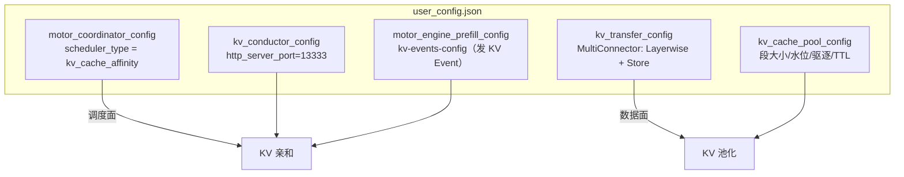

| 配置块 | 服务于 | 关键字段 |
|--------|--------|---------|
| `scheduler_config.scheduler_type` | 亲和 | `kv_cache_affinity` |
| `kv-events-config`（P 实例） | 亲和 | P 向 Conductor 发布 KV Event |
| `kv_conductor_config` | 亲和 | Conductor 端口（默认 13333） |
| `kv_transfer_config` | 池化 | `MultiConnector` 双通道 |
| `kv_cache_pool_config` | 池化 | Master 段大小/水位/驱逐/租约 |

> 注意亲和部署示例里 `use_layerwise=false`（依赖 Store 池化做 KV 落地 + 全局可达），与纯池化示例 `use_layerwise=true` 不同——这正体现两能力叠加时数据通道的取舍。

*(来源: wiki/repos/mindie-pymotor/kv-pool-and-affinity.md)*

### 三者缺一不可（防追问）

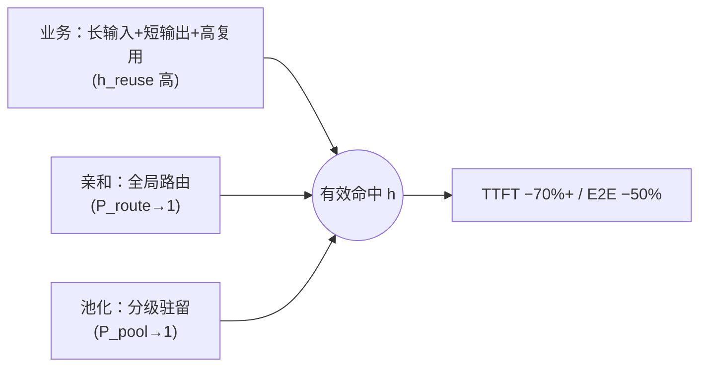

- **缺业务复用**：再好的路由与池化也没有可省的前缀。
- **缺亲和**：池里有 KV 但请求落错实例，本地查不到 → 仍全量 prefill。
- **缺池化**：路由对了但 HBM 容量满、前缀被驱逐 → 命中率上不去、且 PD 时序耦合。
- 工程上由 `_KVA_ROLES` 注册 + `query_conductor` + `MultiConnector` 协同保证三者落地。

*(来源: wiki/repos/mindie-pymotor/kv-pool-and-affinity.md)*

### 面试速记（联合口径）

1. **分层**：亲和是调度面（路由），池化是数据面（存储/传输），互不替代。
2. **乘法命中**：\(h = h_{reuse} \times P_{route} \times P_{pool}\)，任一为 0 则整体坍塌 → 必须叠加。
3. **最反直觉点**：只开池化收益≈0，因为随机路由让请求落到查不到该前缀的实例。
4. **收益归因**：\(P_{route}\) 归亲和，\(P_{pool}\) 与免重算、低 \(c_0\) 归池化，防羊群归亲和的负载项。
5. **边界**：强依赖「长输入+短输出+高复用」；长输出会稀释 E2E 降幅。
6. **A/B 验证**：基线 `scheduler_type=round_robin` + 关池化，对照 `kv_cache_affinity` + MultiConnector 池化，固定 ISL/OSL 与复用比。

^[raw/articles/pymotor/kv_cache_affinity_deep_analysis.md]

*(来源: wiki/repos/mindie-pymotor/kv-pool-and-affinity.md)*

### 第 1 章：KV Cache 亲和性调度 — 应用背景

### 1.1 分布式 LLM 推理与 PD 分离架构

大规模 LLM 在线推理普遍采用 **Prefill / Decode 分离（PD Disaggregation）** ：Prefill 阶段计算密集、处理完整 prompt；Decode 阶段内存带宽密集、逐 token 自回归。MindIE-PyMotor 的 Coordinator 按 `PDRole.ROLE_P` / `ROLE_D` 将请求路由到不同实例池。

PD 分离推理路径

Client

→

Coordinator

路由 P / D 角色

↓

Prefill Pool

ROLE_P · 计算 prompt KV

Decode Pool

ROLE_D · 逐 token 生成

Prefill Pool → KV 传递 → Decode Pool

### 1.2 KV Cache 的角色与业务痛点

KV Cache 存储每层 Attention 的 Key/Value 张量。序列越长，KV 占用显存与 Prefill 算力越大，成为长上下文与 Agent（多轮 tools）场景的**首要瓶颈** 。

痛点| 现象| 对业务的影响  
---|---|---  
跨实例 KV 传输| Prefill 与 Decode 不在同一节点时需搬运 KV| 带宽与延迟开销，Mooncake 等传输层为此而存在  
同 tools 请求分散| 相同 function-call tools 定义被路由到不同 Prefill| KV prefix cache miss → 重复 prefill 相同 system/tools 前缀  
TTFT 劣化| 首 token 需等待完整 prefill| Agent 场景用户感知延迟显著上升  
  
无亲和性 · 请求散落到不同实例

P1

25%

P2

25%

P3

25%

P4

25%

Round-Robin 均匀分发 → 每实例仅 25% 命中本地 KV 前缀 → TTFT 高、算力浪费

有亲和性 · 请求集中在同一实例

P1

92%

P2

4%

P3

4%

KV Cache Affinity → 绝大多数命中同一实例已缓存前缀 → TTFT P50 可下降 ≥30%（Scenario C）

### 1.3 Mooncake 与本模块目标

**Mooncake** 在本项目中承担 **KV Cache 高速传输与池化层** （KV Pool Master + Conductor 事件索引），解决跨节点 KV 段搬运问题。本模块（`KvCacheAffinityPolicy`）的目标则是在此之上，通过**调度亲和性最大化 KV 前缀命中率** ——在 Prefill 调度时将请求导向 Conductor 索引显示 `longest_matched` 最长的实例/DP rank。

**价值闭环：** Mooncake 让 KV「可搬」；亲和性调度让 KV「不必搬、不必重算」——二者互补，分别解决传输层与调度层问题。

**设计权衡：** 亲和性调度依赖 Coordinator 侧 tokenizer 与引擎侧 tokenization 严格一致；任何 chat-template / tools 渲染差异都会导致 `longest_matched=0`，策略退化为 load_balance。

* * *

*(来源: wiki/raw/articles/pymotor/kv_cache_affinity_deep_analysis.md)*

### 第 2 章：系统架构与设计逻辑

### 2.1 架构组件图

Client

HTTP /v1/chat/completions

↓

Coordinator

AsyncSchedulerClient  
scheduler_type=kv_cache_affinity

→

KvCacheAffinityPolicy

TokenizerManager (单例)

↓ POST /query (0.2s timeout)

KV Conductor

:13333 · register/unregister

↔

KV Pool (Mooncake)

:50088 · tcp://

↑ Mooncake connector · KV events

Prefill Instance

vLLM · ROLE_P

Decode Instance

ROLE_D

组件| 源码| 职责  
---|---|---  
KvCacheAffinityPolicy| `motor/coordinator/scheduler/policy/kv_cache_affinity.py`| 静态 `select_endpoint_from_list` 两级选择  
ConductorApiClient| `motor/coordinator/api_client/conductor_api_client.py`| /register /unregister /query HTTP  
AsyncSchedulerClient| `motor/coordinator/scheduler/runtime/scheduler_client.py`| 策略分发与三级降级  
InstanceManager| `motor/coordinator/domain/instance_manager.py`| Prefill ADD/DEL 时 register/unregister  
  
### 2.2 数据流时序图

1

Infer Worker

**请求到达** — 收到 `RequestInfo`，`scheduler_type=kv_cache_affinity` 且 `role=ROLE_P`

2

TokenizerManager

**Tokenize** — `messages` → `apply_chat_template(messages, tools)`；否则 `prompt` → `encode`

3

Policy

Conductor

**Query Conductor** — `POST /query { model, block_size, token_ids }`，返回 `tenant[instance_id].longest_matched` 与 `DP`

4

Policy

**Stage-1 选实例** — 取 `longest_matched` 最大的 Prefill instance

5

Policy

**Stage-2 选端点** — 在胜出实例的 `DP[endpoint.id]` 中取最大值对应 endpoint

6

Engine(P)

**转发** — 返回 `(Instance, Endpoint)`；失败则降级 load_balance → round_robin

#### 2.3.1 调度决策流程（select_endpoint_from_list）

1

RequestInfo

TokenizerManager

Tokenize — `messages+tools` → `apply_chat_template`，或 `prompt` → `encode`，得到 `encoded_ids`

2

Policy

Conductor

Query — `POST /query` 携带 `{ model, block_size, token_ids }`，解析 `tenant` 响应

3

Policy

Stage-1 — 遍历 `vllm-prefill-{id}`，取 `longest_matched` 最大 → `selected_instance`

4

Policy

Stage-2 — 在 `selected_data_dp` 中比 `DP[ep.id]`，取最大 → `selected_endpoint`

5

Router

Return — `(selected_instance, selected_endpoint)`；任一步失败返回 None 触发降级

### 2.3 设计决策分析

决策| 原因| 权衡  
---|---|---  
2-stage 选择（实例→端点）| Conductor 按 instance 聚合 `longest_matched`，DP 字典细化到 rank| 实例平局时后遍历者覆盖（无随机 tie-break）  
基类 `_select_instance/_select_endpoint` 返回 None| 亲和选择需要 `RequestInfo`，无法走无上下文的 ABC 路径| 实际入口为静态 `select_endpoint_from_list`  
TokenizerManager 单例| HF AutoTokenizer 加载成本高（数百 MB）| 多 Worker 各持一份，非跨进程共享  
query 需要 token_ids| Conductor 做 block 级前缀 hash 匹配，输入必须是与引擎一致的 token 序列| tools 须纳入 chat-template 渲染  
select_endpoint_from_list — 核心逻辑
    
    
    @staticmethod
    def select_endpoint_from_list(instances, req_info):
        encoded_ids = []
        messages = req_info.req_data.get(OpenAIField.MESSAGES, None)
        tools = req_info.req_data.get(OpenAIField.TOOLS, None)
        if messages is not None:
            encoded_ids = TokenizerManager().apply_chat_template(messages, tools)
        else:
            prompt = req_info.req_data.get(OpenAIField.PROMPT, None)
            if prompt is not None:
                encoded_ids = TokenizerManager().encode(prompt)
        rsp = ConductorApiClient.query_conductor(instances, encoded_ids)
        tenant = rsp.get(TENANT_ID, None)
        if tenant is None: return None
        # Stage-1: max longest_matched → selected_instance
        # Stage-2: max DP[ep.id] → selected_endpoint
        return (selected_instance, selected_endpoint)

行| 代码| 解释  
---|---|---  
L49-51| encoded_ids=[], 取 messages/tools| 初始化 token 列表；tools 参与 chat-template 渲染，影响 prefix hash  
L53-58| messages 优先，否则 prompt| 对齐 OpenAI chat/completions 与 completions 两种 API  
L60-64| query_conductor + tenant 校验| HTTP 失败或空响应 → tenant=None → 触发降级  
L71-82| 遍历 instances，key=`vllm-prefill-{id}`| 与 register_post 的 instance_id 命名必须一致  
L76-78| data_matched < max 则 continue| Stage-1：保留最长前缀匹配实例  
L92-99| 双层循环 endpoints，比 DP 值| Stage-2：同一实例内选 KV 命中最长的 DP rank  
L104| 日志 select_endpoint: ...| E2E 脚本 grep 此日志验证粘性  
  
### 2.4 容错：三级降级链路

kv_cache_affinity

仅 ROLE_P

↓ 返回 None / 异常

load_balance

Decode 角色直接使用

↓ 仍失败

round_robin

最终兜底

失败条件| 行为| 日志  
---|---|---  
tenant is None| 返回 None → 降级| `tenant is none`  
无 vllm-prefill-{id} 数据| 跳过该 instance| —  
selected_instance is None| 返回 None| warning  
DP 字典为空| 返回 None| `selected_data_dp is None`  
query HTTP 超时 0.2s| 返回 {}| 高并发下可能频繁降级  
  
**设计权衡：** query 超时仅 0.2s 是为避免调度热路径阻塞；代价是 Conductor 慢响应时 affinity 命中率下降，系统退化为负载均衡——可用性优先于最优亲和。

* * *

*(来源: wiki/raw/articles/pymotor/kv_cache_affinity_deep_analysis.md)*

### 第 3 章：核心实现细节

### 3.1 ConductorApiClient 三接口

#### register_post — 注册 Prefill 端点

1

InstanceManager

Prefill 实例 ADD — 过滤 `ROLE_P`，遍历每个 endpoint

2

ConductorApiClient

构建 endpoint — 解析模板 `host*:base_port` → `{prefix}{ip}:{base+endpoint.id}`

3

ConductorApiClient

Conductor

`POST /register` timeout=2s — 载荷含 instance_id, endpoint, dp_rank, block_size, modelname, type；可选 replay_endpoint

4

Conductor

索引更新 — 订阅 KV events，维护 `vllm-prefill-{id}` 前缀索引

注册字段| 来源| 说明  
---|---|---  
instance_id| `f"vllm-prefill-{instance.id}"`| query 响应 key 必须一致  
endpoint| 模板 + endpoint.ip + id 偏移| KV 事件订阅地址  
dp_rank| endpoint.id| 数据并行 rank  
block_size| prefill_kv_event_config| 默认 128，与引擎对齐  
modelname / type| instance.model_name / engine_type| 模型与引擎标识  
replay_endpoint| 可选配置| KV 事件回放独立通道  
  
#### query_conductor — 前缀查询

query_conductor 与响应解析
    
    
    def query_conductor(cls, instances, encoded_ids):
        query_data = {
            "model": instances[0].model_name,
            "block_size": prefill_kv_event_config.block_size,
            "token_ids": encoded_ids,
        }
        with SafeHTTPSClient(timeout=0.2, ...) as client:
            response = client.post("/query", query_data)
            return response  # { "default": { "vllm-prefill-X": { longest_matched, DP } } }

行| 代码| 解释  
---|---|---  
L162| model = instances[0].model_name| 假定同批候选实例服务同一模型  
L163-164| block_size + token_ids| block 粒度与 token 序列是 Conductor 前缀匹配输入  
L175| timeout=0.2| 极短超时保护调度热路径  
响应| tenant[id].longest_matched, DP| longest_matched=最长匹配 token 数；DP=各 rank 匹配长度  
查询字段| 类型| 说明  
---|---|---  
model| string| 模型名，隔离不同模型 KV 索引  
block_size| int| KV block 大小，须与注册一致  
token_ids| list[int]| Coordinator 侧 tokenizer 输出  
tenant_id| string (可选)| 非 default 租户时附加  
  
1

KvCacheAffinityPolicy

组装 query_data — `{ model, block_size, token_ids: encoded_ids }`

2

ConductorApiClient

Conductor

`POST /query` timeout=0.2s — SafeHTTPSClient 发送至 `conductor_service:http_server_port`

3

Conductor

前缀匹配 — 按 block_size 分块 hash，计算各 instance 的 `longest_matched` 与 `DP[rank]`

4

Policy

响应解析 — `{ "default": { "vllm-prefill-X": { longest_matched, DP } } }`；失败返回 `{}`

#### unregister_post — 优雅下线

实例 DEL 时发送 `POST /unregister`，载荷含 instance_id、dp_rank、modelname、block_size、type，使 Conductor 移除 stale 索引。

### 3.2 TokenizerManager

TokenizerManager 初始化流程
    
    
    class TokenizerManager(ThreadSafeSingleton):
        def __init__(self, config=None):
            if hasattr(self, '_initialized'): return
            self._initialized = True
            config = config or CoordinatorConfig()
            if config.prefill_kv_event_config.conductor_service == "":
                return  # tokenizer=None，禁用
            os.environ['TORCH_DEVICE_BACKEND_AUTOLOAD'] = '0'
            self.tokenizer = AutoTokenizer.from_pretrained(model_path, trust_remote_code=True)
            self.openai_standard = os.environ.get("OPENAI_STANDARD", "STANDARD")

行| 代码| 解释  
---|---|---  
L159-160| _initialized 防重入| 单例模式下 __init__ 可能被多次调用  
L171-173| conductor_service 空则 return| 未部署 Conductor 时不加载 tokenizer  
L177-179| TORCH_DEVICE_BACKEND_AUTOLOAD=0 + from_pretrained| 避免多余 torch 后端初始化  
L183| OPENAI_STANDARD 环境变量| 非 STANDARD 时走 preprocess 分支  
编码路径| 触发条件| 行为  
---|---|---  
标准 apply_chat_template| OPENAI_STANDARD=STANDARD| 直接 `tokenizer.apply_chat_template(messages)`  
preprocess + encode| OPENAI_STANDARD≠STANDARD| 修正 tool_calls arguments、tool content、tools 字段序后 encode  
encode(prompt)| /v1/completions| 纯 prompt 编码  
  
**注意事项：** tokenizer=None 时 encode 返回 `[]`，Conductor 无法匹配任何前缀，亲和策略形同虚设。Worker 启动时 `inference_manager.py` 应预热 `TokenizerManager(config)`。

### 3.3 update_workload 设计意图

KV-affinity 只决定 Prefill 落点，但仍需更新中心化 workload ledger：Decode/fallback 路径、Worker SHM 同步、指标采集均依赖负载快照。
    
    
    async def update_workload(self, instance_id, endpoint_id, req_id, action, change):
        await self._instance_provider.update_instance_workload(instance_id, endpoint_id, change)
        return True

容错矩阵| 条件| 结果  
---|---|---  
Level-1| tenant is None| None → load_balance  
Level-2| instance_data is None| 跳过 / 最终 None  
Level-3| DP 为空| None → load_balance  
HTTP| query 异常| {} → 三级全触发  
workload| 无 update_instance_workload| RuntimeError（硬依赖）  
  
* * *

*(来源: wiki/raw/articles/pymotor/kv_cache_affinity_deep_analysis.md)*

### 第 4 章：Mooncake 集成分析

### 4.1 mooncake_config.py 双模配置生成

1

user_config.json

读取用户配置 — `kv_cache_pool_config` / `kv_conductor_config`

2

mooncake_config.py

Pool 模式

`python mooncake_config.py pool` → 生成 `kv_cache_pool_config.json`，`master_server_address = {KVP_MASTER_SERVICE}:{port}`

3

mooncake_config.py

Conductor 模式

`python mooncake_config.py conductor` → 生成 `kv_conductor_config.json`，`mooncake_master.endpoint = tcp://{KVP_MASTER_SERVICE}:{port}`，`modelname = resolve_model_name(prefill_config)`

mooncake_config.py 核心逻辑
    
    
    def generate_kv_cache_pool_config(output_path, user_config_path):
        kvp_master_service = os.getenv("KVP_MASTER_SERVICE", "")
        master_server_port = kv_cfg.get("port", "50088")
        out_cfg["master_server_address"] = f"{kvp_master_service}:{master_server_port}"
    
    def generate_kv_conductor_config(output_path, user_config_path):
        mooncake_master["endpoint"] = f"tcp://{kvp_master_service}:{master_server_port}"
        mooncake_master["modelname"] = resolve_model_name(user_cfg["motor_engine_prefill_config"])

行| 代码| 解释  
---|---|---  
L68-71| 读取 KVP_MASTER_SERVICE| 运行时 K8s Service FQDN，非 user_config 静态值  
L73| master_server_address| Pool 模式：host:port 无 tcp 前缀  
L108| tcp:// 前缀| Conductor 连接 Mooncake Master 的底层传输协议标识  
L110-111| resolve_model_name| 从 prefill engine 配置解析模型名注入 Conductor  
user_config 键| 生成字段| Conductor/Pool 用途  
---|---|---  
kv_cache_pool_config.port| master_server_address 端口| 默认 50088  
kv_conductor_config.http_server_port| Coordinator prefill_kv_event_config| 默认 13333  
kvevent_instance.mooncake_master| endpoint + modelname| Conductor ↔ Mooncake 桥接  
eviction_* (pool)| 原样 → KV Pool 进程参数| 内存水位与驱逐比例  
  
### 4.2 KVP_MASTER_SERVICE 传递链

kv_pool.py generator

ENV: KVP_MASTER_SERVICE

↓ kvp-master.{ns}.svc.cluster.local

KV Pool Pod

Conductor Pod

Prefill Pod

↓ kv_conductor.sh → mooncake_config.py conductor

mooncake_conductor

读取 tcp://{KVP_MASTER_SERVICE}:50088

**角色定位：** Mooncake 是 KV 物理存储与跨节点传输层；Conductor 是前缀索引服务；Coordinator 是调度决策层——三者职责分离，通过 HTTP 与 tcp:// 协议衔接。

* * *

*(来源: wiki/raw/articles/pymotor/kv_cache_affinity_deep_analysis.md)*

### 第 5 章：部署与配置体系

### 5.1 模板 → Generator → YAML

组件| 模板| Generator| 产出  
---|---|---|---  
KV Pool| kv_pool_template.yaml| lib/generator/kv_pool.py| Deployment + Service kvp-master  
KV Conductor| kv_conductor_template.yaml| lib/generator/kv_conductor.py| Deployment + Service kv-conductor  
  
user_config.json

↓

kv_cache_pool_config

kv_pool.py

↓

mindie-motor-kv-pool.yaml  
env: KVP_MASTER_SERVICE, KV_POOL_PORT

kv_conductor_config

kv_conductor.py

↓

mindie-motor-kv-conductor.yaml  
env: KVP_MASTER_SERVICE

↓

Coordinator user_config

prefill_kv_event_config  
scheduler_type = kv_cache_affinity

### 5.2 启动脚本

脚本| 角色| 行为  
---|---|---  
roles/kv_pool.sh| kv_pool| set_kv_pool_env → mooncake_master --port $KV_POOL_PORT  
roles/kv_conductor.sh| kv_conductor| mooncake_config.py conductor → mooncake_conductor  
  
### 5.3 kv_vllm_multi_connector.patch

为 vLLM `multi_connector.py` 增加 `MultiConnectorKVEvents`，使 Mooncake/LMCache connector 的 KV 块生命周期事件可被 Conductor 订阅，从而维护 `longest_matched` 索引。无此 patch，Conductor 无法感知引擎侧 KV 状态。

**部署权衡：** KV Pool 仅在 prefill engine `kv_connector=multi_connector` 时启用；Conductor 在 `http_server_port!=0` 时启用——避免无 KV 传输需求时部署冗余组件。

### 5.4 服务端口映射

服务| K8s Service| 端口| 配置键  
---|---|---|---  
KV Pool (Mooncake Master)| kvp-master| 50088| kv_cache_pool_config.port  
KV Conductor HTTP| kv-conductor| 13333| kv_conductor_config.http_server_port  
Coordinator → Conductor| —| 同 13333| prefill_kv_event_config.http_server_port  
  
* * *

*(来源: wiki/raw/articles/pymotor/kv_cache_affinity_deep_analysis.md)*

### 第 6 章：测试策略与质量保障

### 6.1 单元测试覆盖矩阵

测试用例| 覆盖代码路径| 边界条件  
---|---|---  
test_select_endpoint_from_list_with_messages| messages → apply_chat_template → query → 选择| 正常 chat API  
test_select_endpoint_from_list_with_prompt| prompt → encode| completions API  
test_select_endpoint_from_list_no_messages_or_prompt| 空 req_data, encoded_ids=[]| 返回 None  
test_select_endpoint_from_list_no_tenant| query 返回 {}| tenant=None  
test_select_endpoint_from_list_no_instance_data| key 不匹配 vllm-prefill-*| selected_instance=None  
test_select_endpoint_from_list_no_selected_instance| key=instance-7 无前缀| 命名规范校验  
test_select_endpoint_from_list_no_selected_endpoint| DP={}| 空 DP  
test_select_instance / test_select_endpoint| 基类桩返回 None| 设计预期  
test_init_with_model_path| Tokenizer 加载与 encode| tokenizer=None → []  
test_init_with_empty_conductor_service| 禁用 TokenizerManager| conductor_service=""  
test_singleton_pattern| ThreadSafeSingleton| 两次构造同一对象  
TestPreprocessInput / Exchange*| OPENAI_STANDARD 预处理链| tool_calls JSON、字段排序  
  
边界条件归类 (12+)

输入层

无 messages/prompt  
tools 变化  
OPENAI_STANDARD 分支

查询层

tenant 空  
HTTP 超时  
encoded_ids 空

选择层

instance key 错  
DP 空  
endpoint 不匹配

生命周期

conductor_service 空  
singleton 重入  
基类桩 None

### 6.2 E2E 三场景详解

场景| 方法| 判据| 验证什么  
---|---|---|---  
**A：同 tools 粘性**|  100 请求同 tools_v1、不同 user content；grep `select_endpoint:`| Top 实例 ≥ 90%| tools 前缀渲染进 token → 路由稳定  
**B：tools 改变分流**|  tools_v1 vs tools_v2（多 refund 工具）| 各组内部 ≥ 90%| 不同 tools → 不同 token 前缀 → 可分流  
**C：TTFT 加速**|  warmup + stream 测 time_starttransfer；对比 BASELINE_TTFT| P50 改善 ≥ 30%| 亲和命中 → 跳过重复 prefill  
  
E2E 三场景验证矩阵

Scenario A

同 tools 粘性  
100 请求 tools_v1  
判据: Top 实例 ≥ 90%

Scenario B

tools 改变分流  
tools_v1 vs tools_v2  
判据: 各组内部 ≥ 90%

Scenario C

TTFT 加速  
warmup + stream 测 TTFT  
判据: P50 改善 ≥ 30%

A

**Scenario A** — 验证「同 tools → 同 instance」；失败时检查 tokenizer 与 chat-template tools 渲染。

B

**Scenario B** — tools_v2 多一个工具定义，token 前缀必然不同；两组各自粘性达标即可，不强制不同实例。

C

**Scenario C** — 第 1 请求 warmup 建 cache，后续 N-1 为命中样本；需无 affinity 基线日志对比。

### 6.3 测试缺口分析

未覆盖路径| 风险| 建议  
---|---|---  
update_workload 真实调用| workload 账本不一致| 集成测试 mock InstanceProvider  
register_post HTTP 集成| 注册字段错误未被发现| Conductor mock server  
多实例 longest_matched 平局| 非确定性路由| 明确 tie-break 策略并测试  
openai_standard 非 STANDARD 分支| 非标准模型 token 不一致| 端到端 token 对齐测试  
scheduler_client 降级链| 降级顺序错误| mock query 失败 + 断言 policy 标签  
  
**质量风险提示：** E2E 依赖 Coordinator INFO 日志 `select_endpoint:`；若 LOG_LEVEL 过高或日志轮转，Scenario A/B 会误报失败。

* * *

*(来源: wiki/raw/articles/pymotor/kv_cache_affinity_deep_analysis.md)*

### 第 7 章：竞品分析

### 7.1 vLLM Prefix Caching / Automatic Prefix Caching (APC)

vLLM 从 v0.4+ 起支持 **Prefix Caching** ，v0.6+ 演进为 **Automatic Prefix Caching (APC)** ：按 block（默认与 block_size 对齐）对 token 前缀计算 hash，在**单实例 GPU 内存** 内复用已计算的 KV blocks。

vLLM APC 原理（单实例内）

token_ids

→

hash(block_0)

→

hash(block_1)

→

...

↓ 命中则跳过 prefill 计算

KV Block Cache

单实例 GPU 内存内复用

维度| vLLM APC| MindIE KV Affinity  
---|---|---  
优化粒度| Block 级 prefix hash| Block 级 longest_matched（Conductor 索引）  
作用范围| 单进程 / 单实例 GPU 内存| 跨 Prefill 实例调度  
额外组件| 无（引擎内置）| Conductor + KV Pool + Coordinator tokenizer  
tools 场景| 同实例内自动复用| 跨请求路由到同一实例才能复用  
优劣| 零运维、低延迟；多副本间不共享| 集群级命中率；依赖外部索引与 token 对齐  
  
**互补关系：** MindIE 在 vLLM multi_connector + Mooncake 之上做**跨实例调度** ；APC 解决单实例内复用。二者可同时启用：APC 管本地，Affinity 管路由。

### 7.2 TGI (Text Generation Inference) Prefix Cache

Hugging Face TGI 在 Rust 推理服务中实现 **前缀缓存** ：对 prompt token 序列做前缀匹配，命中则跳过已缓存部分的 prefill。主要为**单服务多请求批处理** 场景优化，缓存位于 TGI 进程内存。

TGI Router

↓

TGI Replica A

prefix cache in-process

TGI Replica B

独立 cache，不共享

对比项| TGI Prefix Cache| MindIE  
---|---|---  
调度层| TGI router 可选 sticky session| Conductor 驱动的 KV 感知调度  
跨副本| 默认各副本独立 cache| Conductor 全局可见各 Prefill 的 KV 状态  
PD 分离| 需额外架构支持| 原生 PD + Prefill 亲和  
  
### 7.3 SGLang RadixAttention

SGLang 的 **RadixAttention** 用**基数树（Radix Tree）** 组织 token 前缀，支持多请求共享树节点上的 KV，尤其擅长多轮对话、分支推理（同一前缀多个 continuation）。

RadixAttention 树形前缀缓存

sys prompt

根节点

↓

tools A

分支 1

tools B

分支 2

↓ 共享前缀节点 KV

user q1

user q2

对比项| SGLang RadixAttention| MindIE KV Affinity  
---|---|---  
数据结构| 进程内 Radix Tree| 外置 Conductor 哈希索引  
分支共享| 原生支持树分叉| 线性 longest_matched，不表达分支  
跨实例| 需自行分片或复制| 设计目标即为多 Prefill 调度  
引擎| SGLang runtime| vLLM + Mooncake connector  
  
### 7.4 MindIE 内部调度策略对比

策略| 粒度| 跨实例 KV 感知| 需 Conductor| 适用场景  
---|---|---|---|---  
load_balance| endpoint workload 分数| 否| 否| 通用、无 KV 复用需求  
round_robin| 轮询 counter| 否| 否| 简单均匀分发 / 降级兜底  
kv_cache_affinity| longest_matched + DP| 是| 是| Agent/tools 高重复前缀  
  
### 7.5 对比总表与 KV 传输方案

方案| 缓存/调度粒度| 跨实例| 额外组件| 典型场景  
---|---|---|---|---  
vLLM APC| Block hash| 否| 无| 单副本高 QPS  
TGI Prefix Cache| Token 前缀| 弱（副本独立）| 无| HF 生态推理  
SGLang RadixAttention| Radix 树节点| 否| 无| 多轮/分支推理  
MindIE KV Affinity| Conductor 索引| 是| Conductor+Pool| PD 分离多 Prefill  
KV 传输| 协议/介质| 延迟| Mooncake 定位  
---|---|---|---  
RDMA| InfiniBand/RoCE 远程内存| 最低（μs 级）| 生产环境可选 backend  
TCP (tcp://)| 通用网络| 中等| MindIE 默认 Mooncake endpoint 格式  
Shared Memory| 同节点进程间| 最低（本地）| 单容器 PD 场景，非本模块重点  
  
**竞品结论：** vLLM APC / TGI / SGLang 均聚焦**单运行时内的前缀复用** ；MindIE KV Affinity 填补的是**分布式 Prefill 池上的路由层空白** ，与 Mooncake 传输层组合形成「调度 + 搬运」完整方案。

* * *

*(来源: wiki/raw/articles/pymotor/kv_cache_affinity_deep_analysis.md)*

### 第 8 章：代码关键细节与设计洞察

### 8.1 ThreadSafeSingleton 模式
    
    
    class ThreadSafeSingleton:
        _instances = {}
        _lock = threading.Lock()
        def __new__(cls, *args, **kwargs):
            with cls._lock:
                if cls not in cls._instances:
                    cls._instances[cls] = super().__new__(cls)
            return cls._instances[cls]

行| 解释  
---|---  
__new__ + Lock| 多线程 Worker 并发首次访问时保证只创建一个 TokenizerManager  
_initialized in __init__| 单例仍可能多次 __init__，用标志位跳过重复加载 tokenizer  
  
### 8.2 基类桩方法设计意图

`BaseSchedulingPolicy.select_instance_and_endpoint()` 无 RequestInfo 参数；KV Affinity 必须在有请求上下文时才能 query Conductor。桩方法返回 None 防止误走旧接口，工厂仍注册策略实例以承载 `update_workload`。

**设计权衡：** 静态方法 bypass 基类使 API 不一致，但避免了改动所有 Policy 的 ABC 签名；代价是新开发者可能误调用 `select_instance_and_endpoint()` 得到 None。

### 8.3 encoded_ids 前缀匹配底层原理

1

Coordinator

token_ids: [t0, t1, ..., tN] — TokenizerManager 输出

2

Conductor

按 block_size 分块 hash — block0 hash → 实例 A 有 / 实例 B 无

3

Conductor

连续命中 block → `longest_matched` = 连续命中 token 总数；`DP[rank]` = 该 rank 最长匹配长度

### 8.4 openai_standard 预处理分支

非 STANDARD 模型（如部分国产模型 chat-template 对 tool_calls.arguments 要求 dict 而非 JSON 字符串）走 `preprocess_input`：exchange_arguments、exchange_tool_content、exchange_tools 修正后再 encode，保证与引擎侧 token 一致。

### 8.5 配置体系关联

CoordinatorConfig

↓ prefill_kv_event_config

conductor_service

KV_CONDUCTOR_SERVICE

http_server_port

13333

block_size

与引擎一致

model_path

Tokenizer 目录

endpoint

register 地址模板

* * *

*(来源: wiki/raw/articles/pymotor/kv_cache_affinity_deep_analysis.md)*

### 附录

### A. 源文件索引

路径| 核心符号  
---|---  
motor/coordinator/scheduler/policy/kv_cache_affinity.py| KvCacheAffinityPolicy, TokenizerManager  
motor/coordinator/api_client/conductor_api_client.py| ConductorApiClient, TENANT_ID  
motor/coordinator/scheduler/runtime/scheduler_client.py| 策略分发与降级  
motor/coordinator/domain/instance_manager.py| register_kv_instance 触发点  
motor/config/coordinator.py| PrefillKvEventConfig, SchedulerType  
motor/common/utils/singleton.py| ThreadSafeSingleton  
motor/coordinator/scheduler/policy/utils.py| preprocess_input  
examples/deployer/startup/mooncake_config.py| generate_kv_*_config  
examples/deployer/lib/generator/kv_pool.py| K8s KV Pool YAML  
examples/deployer/lib/generator/kv_conductor.py| K8s Conductor YAML  
examples/deployer/patch/kv_vllm_multi_connector.patch| MultiConnectorKVEvents  
tests/coordinator/scheduler/test_kv_cache_affinity.py| 单元测试  
scripts/test_kv_cache_affinity_e2e.sh| E2E 黑盒验证  
  
### B. 关键数据结构速查

结构| 字段| 含义  
---|---|---  
register_data| instance_id, endpoint, dp_rank, block_size, modelname, type| Prefill 注册载荷  
query_data| model, block_size, token_ids| 前缀查询请求  
query 响应 tenant| vllm-prefill-{id}.longest_matched, .DP| 实例级 + rank 级匹配长度  
EndpointCandidate| (instance, endpoint, score)| load_balance 降级时使用  
  
### C. 配置参数速查

参数| 默认值| 说明  
---|---|---  
scheduler_config.scheduler_type| load_balance| 须设为 kv_cache_affinity  
prefill_kv_event_config.conductor_service| Env 注入| 空则禁用 KV 事件  
prefill_kv_event_config.http_server_port| 13333| Conductor HTTP  
prefill_kv_event_config.block_size| 128| KV block 粒度  
kv_cache_pool_config.port| 50088| Mooncake Master  
KVP_MASTER_SERVICE| kvp-master.{ns}.svc...| 运行时 Master FQDN  
OPENAI_STANDARD| STANDARD| 非标准模型预处理开关  
HIT_THRESHOLD (E2E)| 90| 粘性集中度判据 (%)  
TTFT_IMPROVE_THRESHOLD (E2E)| 30| TTFT P50 改善判据 (%)  
  
Generated by Hermes Agent → Cursor Agent (composer-2.5-fast) 

← 后退 1/30 前进 →

*(来源: wiki/raw/articles/pymotor/kv_cache_affinity_deep_analysis.md)*

### 1\. MindIE-PyMotor KV 亲和性调度实现

### 1.1 架构概览

MindIE-PyMotor 的 KV Cache 亲和性调度采用 **Coordinator + Conductor 两级架构** ，Coordinator 负责请求接入与策略路由，外部 Conductor 服务作为集中式 KV 状态索引。

#### Coordinator (Motor)

AsyncSchedulerClient  
策略分发 · 三级降级

→

KvCacheAffinityPolicy  
两级选择 · static method

→

TokenizerManager  
HF Tokenizer · 线程安全单例

→

ConductorApiClient  
HTTP POST /register /unregister /query

⇢  
HTTP

#### Conductor Service (External)

**POST /register**  
实例上线注册 · instance_id + dp_rank

**POST /unregister**  
实例下线注销

**POST /query**  
KV 命中查询 · 返回 longest_matched + DP

组件| 位置| 职责  
---|---|---  
`KvCacheAffinityPolicy`| `motor/coordinator/scheduler/policy/kv_cache_affinity.py`| 核心选择逻辑 — `select_endpoint_from_list`  
`TokenizerManager`| 同上文件| 线程安全单例 · HuggingFace Tokenizer 编码  
`ConductorApiClient`| `motor/coordinator/api_client/conductor_api_client.py`| HTTP 通信 — register / unregister / query  
`PrefillKvEventConfig`| `motor/config/coordinator.py`| 配置项 — conductor 地址、block_size、engine_type 等  
`AsyncSchedulerClient`| `motor/coordinator/scheduler/runtime/scheduler_client.py`| 调度客户端 · 三级降级策略路由  
  
### 1.2 调度时序

一次完整的 KV 亲和性调度流程，从请求到选定 (instance, endpoint)：

1

**API Server 接收请求**  
`RequestInfo { req_id, req_data: { messages/prompt, tools } }`

2

**AsyncSchedulerClient 策略分发**  
`scheduler_type == "kv_cache_affinity" && role == ROLE_P`

3

**TokenizerManager Tokenize**  
`messages → apply_chat_template → token_ids` 或 `prompt → encode → token_ids`

4

**ConductorApiClient 查询**  
POST `/query { model, block_size, token_ids }`  
← Response `{ "default": { "vllm-prefill-1": { longest_matched, DP } } }`

5

**一级选择 — 实例级**  
遍历所有 candidate instances，选 `longest_matched` 最大值:  
`instance* = argmax_i tenant["vllm-prefill-{i.id}"].longest_matched`

6

**二级选择 — 端点级 (DP rank)**  
在选定实例内，遍历 endpoints，选 `kv_dp` 最大值:  
`endpoint* = argmax_e selected_data_dp[ep.id]`

7

**返回结果**  
`(selected_instance, selected_endpoint)` → 后续 workload 分配

### 1.3 配置体系

motor/config/coordinator.py — PrefillKvEventConfig
    
    
    @dataclass
    class PrefillKvEventConfig:
        # Conductor 服务地址；空字符串表示禁用 KV 亲和调度
        conductor_service: str = ""
        # Conductor HTTP 端口
        http_server_port: int = 13333
        # KV 缓存块粒度 (tokens)
        block_size: int = 128
        # 端点模板 "ip_prefix*:port_base"
        endpoint: str = ""
        replay_endpoint: str = ""
        # 注册时的引擎类型标识
        engine_type: str = "vLLM"
        # HuggingFace 模型路径 (用于加载 tokenizer)
        model_path: str = ""

### 1.4 容错与降级链路

调度客户端实现 **三级退化 (Graceful Degradation)** ：

级别| 策略| 判据| 触发条件  
---|---|---|---  
L1 | **KV Cache Affinity** | `longest_matched` \+ `kv_dp` | Conductor 可用 · 返回有效 tenant 和 DP 数据  
L2 | **Load Balance** | `endpoint.workload` 最小优先 | tenant 为空 / instance_data 缺失 / DP 为空  
L3 | **Round Robin** | 轮转计数器 | Load Balance 也无可用候选  
  
**关键设计：** KV 亲和性调度仅在 `role == ROLE_P`（prefill）时生效。decode 请求直接走 load_balance → round_robin 路径 — decode 阶段没有 prefill KV 缓存复用语义。

### 1.5 关键代码解析

#### 1.5.1 两级判据选择算法

kv_cache_affinity.py — select_endpoint_from_list
    
    
    @staticmethod
    def select_endpoint_from_list(
        instances: list[Instance],
        req_info: RequestInfo
    ) -> tuple[Instance, Endpoint] | None:
    
        # ── Step 1: Tokenize ──
        messages = req_info.req_data.get(OpenAIField.MESSAGES, None)
        if messages is not None:
            encoded_ids = TokenizerManager().apply_chat_template(messages, tools)
        else:
            prompt = req_info.req_data.get(OpenAIField.PROMPT, None)
            if prompt is not None:
                encoded_ids = TokenizerManager().encode(prompt)
    
        # ── Step 2: Query Conductor ──
        rsp = ConductorApiClient.query_conductor(instances, encoded_ids)
        tenant = rsp.get(TENANT_ID, None)
        if tenant is None:
            return None    # ← 触发 L2 降级
    
        # ── Step 3: Instance-level → max longest_matched ──
        max_kv_matched = 0
        for instance in instances:
            instance_data = tenant.get(f"vllm-prefill-{instance.id}", None)
            if instance_data is None: continue
            data_matched = instance_data.get("longest_matched", 0)
            if data_matched < max_kv_matched: continue
            max_kv_matched = data_matched
            selected_instance = instance
            selected_data_dp = instance_data.get("DP", {})
    
        # ── Step 4: Endpoint-level → max kv_dp (DP rank) ──
        max_kv_dp = 0
        for endpoint in selected_instance.endpoints.values():
            for ep in endpoint.values():
                kv_dp = selected_data_dp.get(f"{ep.id}", 0)
                if kv_dp < max_kv_dp: continue
                max_kv_dp = kv_dp
                selected_endpoint = ep
    
        return (selected_instance, selected_endpoint)

#### 1.5.2 TokenizerManager — 线程安全单例 + 懒加载

kv_cache_affinity.py — TokenizerManager
    
    
    class TokenizerManager(ThreadSafeSingleton):
    
        def __init__(self, config: CoordinatorConfig | None = None):
            if hasattr(self, '_initialized'):
                return           # 单例已初始化 → 直接返回
            self.attr._initialized = True
    
            # Conductor 未配置 → 跳过 tokenizer 加载
            if config.prefill_kv_event_config.conductor_service == "":
                return
    
            model_path = config.prefill_kv_event_config.model_path
            if model_path:
                os.environ['TORCH_DEVICE_BACKEND_AUTOLOAD'] = '0'
                from transformers import AutoTokenizer
                self.attr.tokenizer = AutoTokenizer.from_pretrained(
                    model_path, trust_remote_code=True
                )

#### 1.5.3 Conductor HTTP 协议

注册实例 — POST /register (timeout=2s)
    
    
    {
      "endpoint":    "192.168.1.10:41333",
      "type":       "vLLM",
      "modelname":   "qwen-72b",
      "block_size":  128,
      "instance_id": "vllm-prefill-1",
      "dp_rank":     0
    }

KV 命中查询 — POST /query (timeout=0.2s)
    
    
    // Request
    { "model": "qwen-72b", "block_size": 128, "token_ids": [1, 2, 3, ...] }
    
    // Response
    {
      "default": {
        "vllm-prefill-1": {
          "longest_matched": 1024,
          "DP": { "0": 512, "1": 256 }
        },
        "vllm-prefill-2": {
          "longest_matched": 2048,
          "DP": { "0": 1024, "1": 1024 }
        }
      }
    }

#### 1.5.4 三层降级调度实现

scheduler_client.py — _select_endpoint_candidates_from_list_with_policy
    
    
    elif st == "kv_cache_affinity":
        if role is PDRole.ROLE_P:
            # ── L1: 尝试 KV 亲和 ──
            selected = KvCacheAffinityPolicy.select_endpoint_from_list(
                instances, req_info
            )
            if selected is not None:
                instance, endpoint = selected
                return [(instance, endpoint, 0.0)], CANDIDATE_POLICY_KV_CACHE_AFFINITY
    
            # ── L2: KV 亲和失败 → 降级到 load_balance ──
            logger.warning("kv_cache_affinity failed, falling back to load_balance")
            candidates = self.attr._select_endpoint_candidates_by_load_balance(...)
            if candidates:
                return candidates, CANDIDATE_POLICY_LOAD_BALANCE
    
            # ── L3: load_balance 也失败 → 降级到 round_robin ──
            logger.warning("load_balance also failed, falling back to round-robin")
    
    else:
        # decode 角色直接走 load_balance
        candidates = self.attr._select_endpoint_candidates_by_load_balance(...)

* * *

*(来源: wiki/raw/articles/pymotor/kv_cache_affinity_report.md)*

### 2\. 竞品方案分析

### 2.1 vLLM — Automatic Prefix Caching (APC)

单实例前缀共享 Hash-based Block Matching 通过 Connector 支持跨实例

#### 机制

  * 将 prompt 拆分为固定大小 **token block** （默认 16 tokens）
  * 每个 block 计算 **content hash + prefix hash** （滚动哈希去重）
  * 调度器检查 GPU 缓存中是否存在 match，命中则 **跳过 prefill**
  * **原生仅单实例内共享** ；跨实例依赖外部 connector（Mooncake、NIXL、LMCache）


#### 路由

  * 单实例：调度器内部 greedy prefix match，无外部路由
  * 多实例 disaggregated：Proxy 支持 round-robin 和 cache-aware routing（实验性）


#### 性能

  * Prefill 时间缩短与匹配前缀长度成正比
  * 长文档 QA、多轮对话场景最优（重复 system prompt + 文档前缀）
  * v0.6.0 multi-step scheduling + APC：**+29% 吞吐**


**论文：** Efficient Memory Management for LLM Serving with PagedAttention (SOSP 2023)

### 2.2 SGLang — RadixAttention

Radix Tree 前缀匹配 Token 级粒度 原生 Cache-Aware Scheduling

#### 机制

  * 用 **Radix Tree（基数树）** 存储 token 序列 → KV cache tensor 映射
  * 树存在 CPU 侧，维护开销极小；支持变长边，空间效率极高
  * 查找：树中搜索最长公共前缀，命中直接复用 GPU KV cache
  * 粒度比 vLLM 更细（**token 级 vs block 级** ），处理复杂复用模式：few-shot、tree-of-thought、self-consistency


#### 路由

  * 内置 **LRU 淘汰** 策略（递归淘汰叶子节点）
  * **Cache-aware scheduling** ：优先调度可受益于缓存的请求
  * EPD (Encode-Prefill-Decode) disaggregation：通过 Mooncake TE 跨实例路由
  * SGLang **HiCache** ：分层 KV 缓存（GPU → CPU → Remote via Mooncake Store）


#### 性能

  * 相对基线最高 **5× 吞吐提升** （Llama-7B on A10G）
  * 无命中也几乎零开销（默认开启）


**论文：** Efficiently Programming Large Language Models with SGLang (arXiv:2312.07104)

### 2.3 TensorRT-LLM — Disaggregated Serving

内置 Disaggregation Block-level KV Exchange Rate-Matching 调度

#### 机制

  * 三种部署模式：trtllm-serve disaggregated、Dynamo Smart Router、Triton Orchestrator
  * **模块化 KV Cache Exchange 子系统** ：解耦管理器和通信库
  * 支持跨并行策略的 cache layout 转换（context TP/EP/DP/PP → generation 不一致时）
  * Direct device-to-device transfer


#### 路由

  * Disaggregated Orchestrator 支持 Round-robin 和 **KV cache-aware routing**
  * **Rate matching** ：两步计算最优 context:generation GPU 比例
  * KV 传输与计算异步重叠


#### 性能

  * Disaggregation vs aggregated：**1.1×–2.0× 加速**
  * MTP (Multi-Token Prediction) 进一步 +5–10%


### 2.4 Mooncake — KVCache-Centric Disaggregated Architecture

全局 KVCache Scheduler RDMA Transfer Engine FAST 2025 Best Paper

#### 机制

  * Moonshot AI **Kimi** 生产环境架构 — 面向超大规模多租户场景
  * **Conductor（全局调度器）** ：联合优化三个目标 — 缓存复用最大化、负载均衡、SLO 保证
  * **Transfer Engine** ：统一接口支持 TCP、RDMA、CXL、NVMe-oF 数据传输
  * 三级存储：**GPU VRAM → CPU DRAM → SSD**
  * 512 token block + **rolling hash** （content hash 含 prefix hash 去重）


#### 路由

  * 四步完整 workflow：**KVCache Reuse → Incremental Prefill → KVCache Transfer → Decoding**
  * Chunked Pipeline Parallelism (CPP) 处理长上下文
  * **Early rejection** ：预测未来负载，提前拒绝无法满足 SLO 的请求
  * **Hot block replication** 避免传输热点


#### 性能

  * 长上下文场景 **最大 525% 吞吐提升** （模拟）
  * Kimi 生产环境：处理 **+75% 请求**
  * 已被 vLLM、SGLang、TensorRT-LLM、LMCache、LMDeploy 等集成


**论文：** Mooncake: A KVCache-centric Disaggregated Architecture for LLM Serving (FAST 2025 Best Paper)

* * *

*(来源: wiki/raw/articles/pymotor/kv_cache_affinity_report.md)*

### 3\. 竞品对比总表

维度 | MindIE-PyMotor | vLLM APC | SGLang | TensorRT-LLM | Mooncake  
---|---|---|---|---|---  
**缓存粒度** | Block (128 tok) | Block (16 tok) | Token 级 (radix tree) | Block-level | Block (512 tok)  
**匹配方式** | Conductor longest_matched | Hash (content + prefix) | Radix tree 前缀搜索 | Block ID mapping | Rolling hash (content + prefix)  
**跨实例支持** | ✓ 原生 集中协调 | ⚠ 由 connector | ⚠ Mooncake TE | ✓ 内置 orchestrator | ✓ 原生 核心设计  
**传输后端** | HTTP (仅元信息) | RDMA / NIXL | RDMA (Mooncake TE) | Device-device / Mooncake | GPUDirect RDMA / TCP / CXL  
**调度决策** | 两级: matched + dp | 单实例 greedy match | LRU + cache-aware | Rate-matching + KV-aware | 三目标联合优化  
**降级策略** | L1→L2→L3 三级 | 无降级概念 | Radix tree 零开销 | Round-robin fallback | Early rejection + tier  
**存储层级** | GPU VRAM (Conductor 跟踪) | GPU VRAM only | GPU + CPU + Remote | GPU VRAM | GPU → CPU → SSD (3 tiers)  
**Tokenization** | Coordinator 侧 (HF) | Engine 内部 | Runtime 内部 | Engine 内部 | Conductor (block hash)  
**最佳场景** | PD 分离 + 多 prefill + 集中调度 | 单实例前缀共享 | 复杂复用模式 | 生产 disaggregated | 超大规模长上下文  
**核心创新** | 外部 Conductor + 三级降级 | PagedAttention | Radix Tree KV 管理 | Rate-matched disaggregation | 全局 KVCache-centric 调度  
**论文** | Huawei Ascend (内部) | SOSP 2023 | arXiv:2312.07104 | NVIDIA Blog 2025 | FAST 2025 Best Paper  
  
* * *

*(来源: wiki/raw/articles/pymotor/kv_cache_affinity_report.md)*

### 4\. 总结与展望

### 4.1 MindIE 方案的优势

  * **集中式 Conductor 调度：** 类似 Mooncake 的 Conductor 设计理念，中心化掌握所有 prefill 实例的 KV 缓存状态，能做出全局最优决策，而非局部 greedy
  * **优雅的三级降级：** affinity → load_balance → round_robin，保证极端情况下服务不中断
  * **轻量协议：** Conductor 仅返回元信息（longest_matched + DP map），不实际传输 KV 缓存数据，调度延迟极低（0.2s timeout）
  * **策略可插拔：** 通过 `SchedulingPolicyFactory` \+ Registry 模式，新增调度策略无需修改 Scheduler 代码
  * **DP 感知：** 在选定实例后进一步按 DP rank 分布选择最优端点，充分利用张量并行的缓存局部性


### 4.2 可改进方向

  * **判据维度扩展：** 当前仅使用 `longest_matched` 单一维度，可引入实例当前负载 (active_tokens / active_kv_cache)、延迟指标、健康状态等形成综合评分
  * **Tie-breaking 策略：** 当前使用后到者覆盖（`<` 而非 `<=`），可改为确定性算法（如相同匹配时优先负载最低的实例）
  * **KV 传输机制：** 目前 Conductor 仅做匹配判断，KV 缓存仍依赖引擎内部管理。可引入 RDMA / KVCache Transfer 机制实现真正的跨实例 KV 迁移
  * **Tokenization 开销：** 每次请求都在 Coordinator 侧做完整 tokenization，可考虑缓存 prompt hash → token_ids 映射，避免重复编码
  * **Conductor 高可用：** 当 Conductor 不可用时直接降级到 L2，可考虑本地 cache 一份上轮 KV 状态做近似决策


### 4.3 行业趋势

  * **KV Cache 成为核心瓶颈：** 长上下文场景下 KV cache 占用显存远超模型权重。Mooncake 证明将 KV cache 作为一等公民设计可获 5×+ 吞吐
  * **Disaggregation + Affinity 标配化：** PD 分离 + KV 亲和路由已成为主流推理系统的标配（vLLM、SGLang、TRT-LLM 均已原生支持）
  * **RDMA 成为事实标准：** 跨节点 KV 传输的延迟要求（10–100μs 级别）使得 RDMA 成为唯一可用手段。Mooncake Transfer Engine 被几乎所有系统集成
  * **分层存储渐成共识：** GPU → CPU DRAM → SSD 三层 KV 缓存池，利用集群闲置的 CPU 内存和 SSD 扩展有效缓存容量


* * *

MindIE-PyMotor KV Cache Affinity 技术调研  ·  代码分析 cursor-agent (gpt-5.3-codex-xhigh)  ·  竞品研究 delegate_task (deepseek-v4-flash)  ·  报告编排 Hermes (deepseek-v4-pro) 

(function(){ const links = document.querySelectorAll('#sidebar a'); const sections = []; links.forEach(a => { const id = a.getAttribute('href').slice(1); const el = document.getElementById(id); if (el) sections.push({ el, a }); }); function onScroll() { let current = sections[0]; const scrollY = window.scrollY + 120; for (const s of sections) { if (s.el.offsetTop <= scrollY) current = s; } links.forEach(a => a.classList.remove('active')); if (current) current.a.classList.add('active'); } window.addEventListener('scroll', onScroll, { passive: true }); onScroll(); })(); 

window.crossNavBack = function() { var stack = getNavStack(); if (stack.length > 0) { var entry = stack.pop(); setNavStack(stack); window.location.href = entry.url; } }; window.crossNavForward = function() { window.history.forward(); }; function updateNavBtns() { var stack = getNavStack(); var b = document.getElementById('navBtnBack'); var i = document.getElementById('navBtnIndicator'); if (b) b.disabled = stack.length === 0; if (i) i.textContent = stack.length > 0 ? stack.length + '→' : '-'; } window.addEventListener('load', updateNavBtns);

*(来源: wiki/raw/articles/pymotor/kv_cache_affinity_report.md)*

### 一、一句话与目标

**KV Cache 亲和调度** ：在 PD 分离、多 Prefill 副本场景下，把新请求的 **Prefill** 路由到**已缓存最长相同 token 前缀** 的节点，减少重复 prefill，降低 **TTFT** 、提高吞吐。

MindIE 实现方式：**调度面** 集成 **Mooncake 社区 Conductor** （`mooncake_conductor`，HTTP indexer API）；**数据面** 由 vLLM 通过 **KV Event（ZMQ）** 向 Conductor 上报 KV 块变化；Coordinator 本地 tokenize 后 `POST /query`，按 `longest_matched` \+ `DP` 两级选点。

**重要澄清：** 文档中的 Conductor **不是** PyMotor 自研服务，而是 **Mooncake Conductor** （`dev/kv-indexer` 分支编译）。PyMotor 仅提供 `ConductorApiClient` 适配层。 

多 Prefill 副本 随机路由 → 重复 Prefill TTFT 高 · 浪费算力 ⇒ KV Cache 亲和 路由到最长前缀命中节点 Mooncake Conductor + /query → 复用已有 KV 块 更低 TTFT · 更高吞吐 MindIE 目标链路

图 1 · 问题与目标：从随机 Prefill 到前缀感知路由

*(来源: wiki/raw/articles/pymotor/kv_cache_affinity_summary_interview.md)*

### 二、架构与组件分工

**Mooncake Conductor** KV 索引 + /register /unregister /query，默认端口 13333

**vLLM Prefill** kv-events-config 发布 ZMQ 事件；prefix caching

**ConductorApiClient** Coordinator 侧 HTTP 薄封装

**KvCacheAffinityPolicy** tokenize → query → 两级选 (Instance, Endpoint)

**AsyncSchedulerClient** 策略分发、缓存、ZMQ Scheduler、ALLOCATE_ONLY

**InstanceManager (Mgmt)** Prefill 上下线时 register/unregister Conductor

**TokenizerManager** 与引擎一致的 HF tokenizer，生成 token_ids

**Mooncake KV Pool / Connector** 跨节点 KV 存储与 PD 传输，与 event 索引互补

### 与 Mooncake 论文生态的关系

能力| 组件| 在 MindIE 中的体现  
---|---|---  
全局 KV 感知调度| Mooncake Conductor| `kv_cache_affinity` \+ `/query`  
KV 状态输入| KV Event + Indexer| vLLM ZMQ → Conductor 订阅  
跨节点 KV 搬运| Transfer Engine / Store| `MooncakeLayerwiseConnector`、`kv_cache_pool_config`  
  
PyMotor Coordinator Router · 策略 Mgmt register KvCacheAffinityPolicy TokenizerManager · ConductorApiClient AsyncSchedulerClient → Scheduler ZMQ Mooncake Conductor KV Indexer · :13333 /register · /query vLLM Prefill 池 Prefill #1 prefix cache Prefill #2 prefix cache kv-events-config → ZMQ Publisher topic: kv-events · endpoint / replay Mooncake KV Pool / Connector（可选） PD 间 KV 传输 · 与「选点索引」互补 Client HTTP /query /register ZMQ KV Event 订阅 ALLOCATE 后转发推理 调度面（路由到哪） Conductor + KV Event 数据面（KV 怎么搬） Mooncake TE / Store / Connector

图 2 · 系统架构：索引维护（绿线 ZMQ）与请求调度（蓝线 HTTP）分离

*(来源: wiki/raw/articles/pymotor/kv_cache_affinity_summary_interview.md)*

### 三、Mooncake Conductor 与 PyMotor 交互

#### 3.1 三个 HTTP 接口

接口| 调用方| 超时| 作用  
---|---|---|---  
`POST /register`| Mgmt InstanceManager| 2s| 登记 Prefill 实例/DP：ZMQ 地址、model、block_size、instance_id  
`POST /unregister`| 实例删除时| 2s| 从 Conductor 移除索引源  
`POST /query`| 每次 Prefill 调度| **0.2s**|  按 token_ids 查最长前缀匹配  
  
#### 3.2 Register 关键字段
    
    
    instance_id: "vllm-prefill-{instance.id}"   // 与 query 解析键必须一致
    dp_rank:     endpoint.id
    endpoint:    "{模板前缀}{ep.ip}:{基址端口 + endpoint.id}"   // KV Event 实时 ZMQ
    replay_endpoint: 可选，事件回放地址
    modelname, block_size, type (如 vLLM)

#### 3.3 Query 请求与响应

**请求：**
    
    
    {
      "model": "<instances[0].model_name>",
      "block_size": 128,
      "token_ids": [1, 2, 3, ...]
    }

**响应（约定形状）：**
    
    
    {
      "default": {
        "vllm-prefill-<instance_id>": {
          "longest_matched": 1024,
          "GPU": 100,
          "DP": { "<endpoint_id>": 512 }
        }
      }
    }

#### 3.4 两级选点算法（KvCacheAffinityPolicy）

  1. **实例级：** 在候选 instances 中，取 Conductor 返回的 `longest_matched` **最大** 的实例（键必须为 `vllm-prefill-{id}`）。
  2. **端点级：** 在该实例 `DP` 字典中，对本地 `endpoint.id` 取 `kv_dp` **最大** 的 Endpoint。
  3. 响应中的 `GPU` 字段当前**未参与** 选点；平局时遍历顺序靠后的实例/端点胜出。


Conductor /query 响应 → 两级选点 候选 Prefill 实例 vllm-prefill-1 matched: 512 vllm-prefill-2 ✓ matched: 1024 ← max vllm-prefill-3 · 256 → L1 实例级 argmax longest_matched → 实例 2 的 DP 字典 DP rank 0 · kv_dp: 200 DP rank 1 ✓ · 512 DP rank 2 · 100 → 结果 Instance 2 Endpoint rank 1

图 3 · 两级选点：先 max longest_matched，再 max DP[endpoint_id]

Mgmt 实例上下线 Conductor :13333 Coordinator 每次 P 调度 /register 2s /unregister /query 0.2s register 携带: ZMQ endpoint · instance_id · dp_rank · block_size query 携带: token_ids · model · block_size 返回: tenant → vllm-prefill-* → { longest_matched, DP }

图 4 · 三条 HTTP 路径：注册（慢路径）vs 查询（热路径 0.2s）

*(来源: wiki/raw/articles/pymotor/kv_cache_affinity_summary_interview.md)*

### 四、KV Event 机制

### 4.1 定义

**KV Event** 是推理引擎在 KV Cache 状态变化时发出的**事件通知** （块分配、释放、前缀缓存命中等），**不包含** KV 张量数据本身。Conductor 消费事件流，维护全局 KV 块/前缀索引，供 `/query` 使用。

### 4.2 生产者：vLLM Prefill
    
    
    "kv-events-config": {
      "publisher": "zmq",
      "enable_kv_cache_events": true,
      "endpoint": "tcp://*:5557",
      "topic": "kv-events",
      "replay_endpoint": "tcp://*:6667"
    },
    "enable-prefix-caching": true

字段| 含义  
---|---  
`endpoint`| 实时事件 ZMQ 绑定地址（模板端口 + dp_rank）  
`replay_endpoint`| 回放通道，Conductor 晚接入时补历史索引  
`topic`| 订阅主题，如 `kv-events`  
  
### 4.3 消费者：Mooncake Conductor

vLLM **只发布** ；Conductor 根据 `/register` 中的地址**订阅 ZMQ** ，更新 indexer。Coordinator **不订阅 ZMQ** ，只发 HTTP `/query`。

### 4.4 PyMotor 地址对齐

  * **引擎侧：**`EndpointConfig.update_engine_config()` 将 `endpoint` / `replay_endpoint` 端口加上 `dp_rank`。
  * **Coordinator 侧：**`prefill_kv_event_config` 从 `user_config` 的 `kv-events-config` 同步；register 时用 `endpoint.ip + 基址端口 + endpoint.id` 与引擎一致。


**无 KV Event 或未 register 的后果：** Conductor 索引为空或过期 → `longest_matched` 不可信 → 亲和失败 → 自动降级 L2/L3 调度。 

KV Event：只传「状态」，不传 KV 张量 vLLM Prefill 块分配 / 释放 / 前缀命中 KVCacheEvent ZMQ Pub kv-events Mooncake Conductor 订阅 endpoint \+ replay 补历史 KV Indexer 全局前缀 / 块索引 供 /query 读取 Mgmt /register 告诉 Conductor 订阅哪 Coordinator /query HTTP · 不碰 ZMQ 只读索引 · token_ids 地址对齐: 模板端口 + dp_rank（引擎）≈ ip + 基址 + endpoint.id（register） endpoint 实时流 · replay_endpoint 冷启动回放

图 5 · KV Event 异步建索引；Coordinator 仅 HTTP 查询索引

*(来源: wiki/raw/articles/pymotor/kv_cache_affinity_summary_interview.md)*

### 五、调度策略与代码路径

### 5.1 AsyncSchedulerClient 策略分发

scheduler_type| role| 行为  
---|---|---  
`kv_cache_affinity`| `ROLE_P` (Prefill)| `KvCacheAffinityPolicy.select_endpoint_from_list` → Conductor query  
`kv_cache_affinity`| Decode 等| 直接 **load_balance** ，不走 Conductor  
`load_balance`| 任意| 按 workload 打分  
`round_robin`| 任意| 实例/端点轮转；allocate workload 为 0  
  
AsyncSchedulerClient 策略决策（kv_cache_affinity） role? scheduler_type 非 ROLE_P Load Balance ROLE_P KV Affinity + Conductor select_endpoint_from_list 成功? 否 L2 Load Balance 是 返回候选 L2 仍失败? L3 Round Robin

图 6 · 策略分发与三级降级（仅 Prefill 走 Conductor）

### 5.2 select_and_allocate 流程

  1. 可选：Workload SHM 读心跳/版本 → 刷新实例缓存
  2. 本地选候选（缓存或 `GET_AVAILABLE_INSTANCES`）
  3. 计算 allocation workload（RR=空，LB=需求 workload）
  4. `ALLOCATE_ONLY` RPC 到 Scheduler 服务端确认占位
  5. 返回 `(Instance, Endpoint, Workload)`


### 5.3 update_workload

KV 亲和只决定**落点** ；仍须 `update_workload` 更新中央 workload 账本（decode、fallback、SHM 同步）。`KvCacheAffinityPolicy.update_workload` 委托 `InstanceProvider.update_instance_workload`。

### 5.4 关键文件

文件| 职责  
---|---  
`motor/coordinator/scheduler/policy/kv_cache_affinity.py`| 选点 + TokenizerManager  
`motor/coordinator/api_client/conductor_api_client.py`| register / unregister / query  
`motor/coordinator/scheduler/runtime/scheduler_client.py`| 策略分发、缓存、ZMQ、降级  
`motor/coordinator/domain/instance_manager.py`| Mgmt 侧 register（仅 TYPE_MGMT）  
`docs/zh/user_guide/KV_cache_affinity_deployment.md`| 部署与 Mooncake 编译说明

*(来源: wiki/raw/articles/pymotor/kv_cache_affinity_summary_interview.md)*

### 六、配置与部署要点

// user_config.json 最小集
    motor_coordinator_config.scheduler_config.scheduler_type = "kv_cache_affinity"
    motor_engine_prefill_config.engine_config["kv-events-config"] = { ... }
    kv_conductor_config = { "http_server_port": 13333, "kvevent_instance": { "mooncake_master": {...} } }
    kv_cache_pool_config = { ... }   // 可选，Mooncake Master / PD KV 传输

  * `prefill_kv_event_config.conductor_service` 为空 → 禁用 KV Conductor 与 TokenizerManager。
  * 镜像可能**不含** Mooncake Conductor，需按文档从 `kvcache-ai/Mooncake` `dev/kv-indexer` 编译 `mooncake_conductor`。
  * Coordinator `model_path` 必须与 vLLM 使用**同一 tokenizer** ，否则 query 前缀匹配错误。
  * `block_size` 须与引擎 KV 块粒度一致（默认 128）。
  * E2E 验证：`scripts/test_kv_cache_affinity_e2e.sh`（同 tools 粘性、tools 变更分流、TTFT 对比）。

*(来源: wiki/raw/articles/pymotor/kv_cache_affinity_summary_interview.md)*

### 七、降级与容错

级别| 策略| 触发条件  
---|---|---  
L1| KV Cache Affinity| Conductor 可用；tenant/DP 数据有效  
L2| Load Balance| query 超时(0.2s)/异常；无 tenant；键名不匹配；DP 为空  
L3| Round Robin| L2 仍无候选  
  
**静默失败场景：** tokenizer 不一致、无 messages/prompt、实例未 register、候选列表与 Conductor 不同步、`encoded_ids` 为空等——均打日志并降级，不阻塞请求。

Graceful Degradation L1 KV Affinity longest_matched + DP 失败 L2 Load Balance workload 最小优先 L3 Round Robin 保证请求仍可发出 query 超时 无 tenant DP 为空

图 7 · 三级降级瀑布：亲和 → 负载均衡 → 轮询

*(来源: wiki/raw/articles/pymotor/kv_cache_affinity_summary_interview.md)*

### 八、端到端时序

Client Coordinator Conductor vLLM P Scheduler 阶段 A · 部署 / 索引预热（异步持续） 启动 ZMQ Publisher 订阅 KV Event → 建索引 阶段 B · 单次请求调度（同步热路径） HTTP 请求 tokenize POST /query 选 Instance+EP ALLOCATE_ONLY Prefill（复用 KV） update_workload 并行背景：vLLM 持续发 KV Event → Conductor 更新索引（不阻塞单次 query） query 仅读快照 · 0.2s 超时则跳过 L1

图 8 · 端到端时序：部署期建索引 + 请求期热路径（泳道图）

*(来源: wiki/raw/articles/pymotor/kv_cache_affinity_summary_interview.md)*

### 九、面试问答（精选 24 题）

基础什么是 KV Cache 亲和调度？解决什么问题？

在多 Prefill 副本下，把请求路由到已缓存最长相同 token 前缀的节点，减少重复 prefill，降低 TTFT、提高吞吐。MindIE 通过 Mooncake Conductor 的 longest-prefix 查询 + Coordinator 两级选点实现。

基础Conductor 是 PyMotor 自研的吗？

不是。是 Mooncake 社区的 `mooncake_conductor`（Go，`dev/kv-indexer` 分支）。PyMotor 的 `ConductorApiClient` 只是 HTTP 适配；索引逻辑在 Conductor 进程内，不在本仓库。

基础Coordinator 和 Mooncake Conductor 各做什么？

Conductor：维护全局 KV 索引，响应 /register、/query。Coordinator：API 入口、tokenize、选点、Scheduler allocate、workload 账本。Mgmt：实例生命周期时 register/unregister。

基础为什么 KV 亲和只对 Prefill (ROLE_P) 生效？

复用的是 Prefill 阶段写入的 KV blocks；Decode 是已有 KV 上自回归，跨请求复用语义不同。scheduler_client 对非 P 角色直接 load_balance。

KV EventKV Event 是什么？传的是 KV 数据吗？

是 vLLM 发出的 KV Cache **状态变更事件** （块增删、前缀命中等），经 ZMQ 发布，**不传** KV 张量。Mooncake Conductor 订阅后建索引，供 /query 使用。

KV Eventendpoint 和 replay_endpoint 区别？

endpoint 是实时事件流；replay_endpoint 用于 Conductor 晚启动或重启后回放历史事件，减少索引冷启动空白。register 时两者都可交给 Conductor。

协议/register 和 /query 分别解决什么？

register：告诉 Conductor 去哪订阅哪个 DP rank 的 KV events（拓扑配置）。query：给定 token_ids，问各副本最长匹配与 DP 分数（运行时路由）。

协议为什么 query 前要在 Coordinator 本地 tokenize？

Conductor API 接收 token_ids，与 vLLM 块索引对齐；避免 Conductor 依赖多套 tokenizer。代价是 Coordinator model_path/template 必须与引擎严格一致。

协议instance_id 为何必须是 vllm-prefill-{id}？

register 与 select_endpoint_from_list 使用同一键空间；键不一致则 tenant 下找不到 instance_data，返回 None 并降级。

协议longest_matched 和 DP 字段含义？

longest_matched：实例级最长 token 前缀命中长度。DP[endpoint_id]：该数据并行 rank 上的匹配度。先选实例再选 rank，避免实例对但 DP 错。

协议block_size 配错会怎样？

Conductor 按块粒度对齐前缀；与 vLLM KV 块大小不一致会导致匹配长度偏差，亲和失效。register 与 query 须使用同一 block_size。

可靠Conductor 不可用或 query 超时怎么办？

query 超时 0.2s 或异常返回 {} → 无 tenant → 降级 load_balance → 再失败 round_robin。服务可继续，仅失去 KV 复用收益。

可靠为何 query 超时 0.2s 而 register 2s？

query 在请求热路径，宁可快失败走降级；register 在实例变更时偶发执行，允许更长超时。典型 latency vs completeness 权衡。

可靠列举 KV 亲和静默失败的常见原因。

conductor_service 为空；无 messages/prompt；tokenizer 不一致；未 register；Conductor 键名非 vllm-prefill-*；DP 为空；候选 instances 与已注册集合不同步。

设计与 SGLang RadixAttention / vLLM 本机 prefix cache 有何不同？

RadixAttention 等多在单引擎进程内维护 radix tree；MindIE 用外置 Mooncake Conductor + HTTP query 做**跨副本全局** 选点，多一跳网络与 tokenizer 对齐成本，适合 K8s 多 Pod Prefill 池。

设计KV Event 与 Mooncake Connector / KV Pool 关系？

KV Event + Conductor：解决「路由到哪」；Connector/Pool：解决「命中后 KV 如何跨节点存储/传输」。互补，不能互相替代。

设计query 用 instances[0].model_name 隐含什么假设？

假定候选列表同一模型。混模型同批传入时 query 可能错误；正常按 role 拉取的列表应同构。

设计longest_matched 相同时如何决胜负？

代码用严格小于跳过，相等则更新为当前遍历项，即列表中**后者优先** 。可扩展用 GPU 或 workload 做 tie-break（当前未用 GPU 字段）。

设计索引过期（幽灵命中）如何应对？

代码层无强一致校验，依赖 Conductor 事件新鲜度、短 query 超时、allocate 失败重试。工程上可加版本号、负载上限、引擎侧 cache miss 再 fallback。

工程update_workload 在 KV 亲和下为何仍需要？

亲和只决定落点；中央 workload 仍服务 decode、L2 降级、worker SHM。KvCacheAffinityPolicy 显式更新 InstanceProvider 账本。

工程如何 E2E 验证亲和生效？

scripts/test_kv_cache_affinity_e2e.sh：同 tools ≥90% 同 instance；换 tools 两组各自集中；TTFT P50 较基线降 ≥30%。需 ≥2 Prefill、Conductor、kv_cache_affinity。

工程TENANT_ID 硬编码 default 的影响？

当前单租户；多租户需扩展配置，register/query 仅在非 default 时带 tenant_id。面试可答为待产品化的扩展点。

深挖若要把 GPU 利用率纳入选点改哪里？

Conductor 已返回 GPU 字段但未使用。可在 longest_matched 接近时以 GPU 或 endpoint.workload 做 tie-break，或加权 score = α·matched − β·load。

深挖AsyncSchedulerClient 中 ALLOCATE_ONLY 与本地选点的关系？

亲和/LB/RR 在客户端缓存上先选候选；ALLOCATE_ONLY 由 Scheduler 服务端做最终占用/校验，携带 candidate_policy、workload、instance_version 等，避免仅本地决策与全局状态不一致。

深挖多 Coordinator 客户端如何避免 RR 扎堆？

client_index / client_count 在 round_robin 上施加分片起始偏移；KV 亲和本身由 Conductor 全局视图决策，不依赖 RR 偏移。

*(来源: wiki/raw/articles/pymotor/kv_cache_affinity_summary_interview.md)*

### 十、速记卡

关键词| 一句话  
---|---  
目标| 少重复 prefill → 降 TTFT  
Conductor| Mooncake 外置 indexer，:13333，/register /query  
KV Event| vLLM ZMQ 广播块变更 → Conductor 建索引  
谁 register| Mgmt，仅 Prefill，vllm-prefill-{id}  
谁 query| 每次 P 调度，token_ids + block_size  
选点| max longest_matched → max DP[rank]  
范围| 仅 ROLE_P；Decode 走 LB  
降级| 亲和 → LB → RR  
风险| tokenizer、键名、0.2s 超时、未开 kv-events  
  
**面试开场 30 秒版：** MindIE 在 PD 分离下用 Mooncake Conductor 做 Prefill 的全局 KV 前缀路由：vLLM 通过 KV Event 喂索引，Coordinator tokenize 后 query，按最长匹配选实例和 DP；失败则负载均衡降级；与 Mooncake TE 传 KV 是调度与传输两层能力。 

相关文档：[KV_cache_affinity_deployment.md](<zh/user_guide/KV_cache_affinity_deployment.md>) · [kv_cache_affinity_report.html（竞品分析）](<kv_cache_affinity_report.html>) · 代码路径：`motor/coordinator/scheduler/policy/kv_cache_affinity.py`、 `motor/coordinator/scheduler/runtime/scheduler_client.py`、 `motor/coordinator/api_client/conductor_api_client.py`

← 后退 - 前进 →

*(来源: wiki/raw/articles/pymotor/kv_cache_affinity_summary_interview.md)*

### 1\. 应用背景

### 1.1 在 KV 亲和演进中的位置

MindIE-PyMotor 的 Prefill 调度在 PD 分离架构下，通过 Conductor（Mooncake 索引）查询各 DP rank 的 KV 前缀命中长度，将请求导向缓存命中最高的实例/Endpoint。PR #210 是在**功能叠加 function_call 之后** 的能力增强：不改变 Conductor 查询与两级评分哲学，而是解决**多 Worker 并发 burst 时落点一致性** 问题。

KV 亲和能力演进（时间线）

基础亲和

Conductor + 两级选点

→

unified / load_gated

亲和 × 负载融合

→

PR #210

top-k + Scheduler 重选

### 1.2 旧方案：in-flight overlay 的局限

在 top-k 方案之前，Worker 在本地 SHM workload 之上维护一层 **in-flight overlay** ：在 ALLOCATE 完成前把「即将分配的负载」叠加到本地视图，试图缓解同一 Worker 上的突发 herd。该方案存在三类结构性问题：

  * **TTL 难调：** overlay 存活时间过短无法覆盖 RPC 往返，过长则与真实账本漂移，参数缺乏稳定工作点。
  * **单 Worker 有效：** overlay 只修正本进程视角，无法协调其他 Worker 同时看到的「最轻 endpoint」。
  * **非权威：** 中央 Scheduler 的 workload ledger 才是 ALLOCATE 提交真相源，本地叠加与权威账本可能不一致。


旧方案 — Worker 本地 in-flight overlay（已移除）

Worker A

SHM 负载

+

load_overlay

本地叠加

→

选 ep10

Worker B（无 overlay 同步）

SHM 负载

→

仍选 ep10

herd

↓ 多 Worker 仍可能打到同一「亲和最优」热端点

### 1.3 PR 目标

维度| 变更前| PR #210 后  
---|---|---  
亲和策略输出| 单个 `(Instance, Endpoint)`| 最多 `top_k` 个 `(Instance, Endpoint, score)`，best-first  
burst 打散| Worker `load_overlay`| Scheduler 在候选集内按 fresh ledger 重选  
过载保护| `overload_threshold`| 移除；由权威重选 + 负载评分承担  
Prefill 上报| top-1| `_AFFINITY_CANDIDATE_TOPK = 3`

*(来源: wiki/raw/articles/pymotor/pr210_kv_affinity_topk_candidates_deep_analysis.md)*

### 2\. 设计逻辑

### 2.1 架构总览

top-k 候选 + Scheduler 权威重选 — 组件与数据流

Worker 侧（Coordinator）

SchedulerClient

Prefill ALLOCATE_ONLY

→

KvCacheAffinityPolicy

top_k=3 排名

→

Conductor

prefix 命中（可跳过）

↓ RPC：instance_id, endpoint_id, candidates[], candidate_policy

Scheduler 侧（权威）

SchedulerServer

ALLOCATE 慢路径

→

fresh workload ledger

在候选集内最低分

→

commit ALLOCATE

### 2.2 调度时序：旧 overlay vs 新 top-k

#### 新方案（PR #210）

1

Worker

tokenize →（可选）Conductor query → `select_endpoint_candidates_from_list(top_k=3)`

2

Worker

ALLOCATE_ONLY：primary=`candidates[0]`，`data.candidates` 携带完整排名列表

3

Scheduler

若 `workload_sequence` 与 `instance_version` 匹配 → fast path 直接校验 top-1

4

Scheduler

慢路径：`_select_lowest_load_among_candidates` 在亲和 top-k 内按权威账本重选

5

Scheduler

`update_workload` \+ SHM 写回 → 返回最终 instance/endpoint

#### 旧方案（已移除步骤）

—

load_overlay

Worker 在选点前叠加 in-flight 负载（仅本地可见）

—

overload_threshold

超过阈值则拒绝亲和落点（与 overlay 耦合）

### 2.3 设计决策与权衡

**决策 1 — 为何移除 in-flight overlay？** overlay 是进程内近似，无法成为集群级真相；TTL 与 RPC 延迟强相关，跨 Worker 无效。移除后 Worker 只负责「提出亲和合理的候选集」，burst 打散交给 Scheduler。

**决策 2 — 为何 top-k + Scheduler 重选？** Scheduler 持有提交锁下的最新 workload ledger，在 Worker 提出的 top-k（已按亲和排序）内二次选最低负载，既保留前缀亲和边界，又用权威视图打散 stale-view burst。UT `test_allocate_only_affinity_reselects_least_loaded_among_candidates` 证明：全局最轻的 ep11 不在候选集时不会被选中。

**决策 3 — top_k=1 退化：** `select_endpoint_from_list` 内部调用 candidates 版本且 `top_k=1`，行为等价于旧单结果模式，便于测试与简单调用方。

**决策 4 — fast path 保留：** 当 Worker 的 `workload_sequence` 与 `instance_version` 与 Scheduler 完全一致时，仍只校验 Worker top-1，避免每次 ALLOCATE 都扫描候选集。

### 2.4 unified 与 load_gated 的设计哲学

模式| 评分公式 / 阶段| 负载边界| top_k 行为  
---|---|---|---  
unified | `prefill_load_scale × prefill_cost + load_weight × load_cost`  
prefill_cost = max(0, isl − overlap_credit × matched) | **软融合** ：无缓存前缀的轻载端点仍可胜出 | 全端点排序后取前 top_k（分数越低越好）  
load_gated | 阶段1：保留 `load_gate_topn` 个最轻载端点  
阶段2：按最长前缀、再按负载 tie-break | **硬门控** ：亲和无法把请求拉出最轻载集合 | 在门控集合内取 top_k（返回 load_cost 作 score）  
  
### 2.5 短 prompt 快速路径

当 prompt token 数 `< block_size`（Conductor 按整块 hash，子块 prompt 不可能命中缓存前缀）时，跳过阻塞式 Conductor HTTP，用全零 match map 排名——与 Conductor 实际返回一致，但省去网络 RTT。

短 prompt 快路径判定

tokenize

→

len(token_ids) < block_size?

→

全零 tenant map

|

否则

→

Conductor query

*(来源: wiki/raw/articles/pymotor/pr210_kv_affinity_topk_candidates_deep_analysis.md)*

### 3\. 实现细节

### 3.1 核心接口变更

项目| 变更前| 变更后（PR #210）  
---|---|---  
主入口| `select_endpoint_from_list(...) → tuple | None`| `select_endpoint_candidates_from_list(..., top_k) → list[tuple[Inst, Ep, float]] | None`  
便利封装| —| `select_endpoint_from_list` 内部 `top_k=1` 取 ranked[0]  
已移除参数| `load_overlay`| —（Worker 不再维护 in-flight 叠加）  
已移除参数| `overload_threshold`| —（Scheduler 权威重选替代）  
返回值语义| 单一最优| best-first 列表；**分数越低越好** （unified 为融合分，load_gated 为 load_cost）  
核心 API — kv_cache_affinity.py
    
    
    def select_endpoint_candidates_from_list(
        instances: list[Instance],
        req_info: RequestInfo,
        mode: str = "unified",
        overlap_credit: float = 1.0,
        prefill_load_scale: float = 1.0,
        load_weight: float = 1.0,
        load_gate_topn: int = 0,
        top_k: int = 1,
    ) -> list[tuple[Instance, Endpoint, float]] | None:
        # Worker 提出排名候选；Scheduler 可在 fresh ledger 上重选

### 3.2 unified 模式候选选择流程

unified — _select_with_load

_collect_load_candidates

每 endpoint 元组

→

融合 score

prefill + load

→

sorted ↑

取 [:top_k]

→

[(inst, ep, score)...]

### 3.3 load_gated 模式候选选择流程

load_gated — _select_load_gated（两阶段）

阶段 1 — 负载门控

全部 endpoint

→

按 load_cost 排序

→

保留 top-N

默认 N=2

↓

阶段 2 — 亲和 tie-break

按 matched_tokens ↓

→

tie → load_cost ↑

→

[:top_k] 候选

### 3.4 scheduler_client：候选上报

Prefill + `kv_cache_affinity` 策略时，`request_top_k = _AFFINITY_CANDIDATE_TOPK (3)`；其他角色/策略仍为 top-1。ALLOCATE_ONLY 请求携带 `candidates` 数组与 `candidate_policy`。

scheduler_client.py — 常量与 ALLOCATE 载荷
    
    
    _AFFINITY_CANDIDATE_TOPK = 3
    
    request_top_k = (
        _AFFINITY_CANDIDATE_TOPK
        if (role is PDRole.ROLE_P and (self._scheduler_type or "") == "kv_cache_affinity")
        else 1
    )
    candidate_endpoints = [
        {"instance_id": cand_instance.id, "endpoint_id": cand_endpoint.id}
        for cand_instance, cand_endpoint, _score in candidates
    ]

### 3.5 scheduler_server：ALLOCATE 慢路径重选

_handle_allocate_only 决策分支

解析 candidates

→

fast_path?

sequence + version 匹配

→

KV 亲和 + len>1

候选集内最低分

→

否则校验 top-1

scheduler_server.py — 权威重选逻辑
    
    
    if candidate_policy == CANDIDATE_POLICY_KV_CACHE_AFFINITY and len(candidates) > 1:
        selected = self._select_lowest_load_among_candidates(candidates, role)
        # 在 Worker 提出的亲和 top-k 内，用 LoadBalancePolicy.calculate_endpoint_score
        # 按 fresh ledger 选最低分；tie 保留最早（亲和最优）候选

**边界保证（UT 覆盖）：** 全局最轻 endpoint 若不在 Worker 提交的 `candidates` 列表中，Scheduler **不会** 越界选取——亲和边界由 Worker 排名保证，负载优化仅在边界内完成。

### 3.6 配置清理

PR 移除了与 overlay / 过载阈值相关的调度配置项；`motor/config/coordinator.py` 保留 `kv_affinity_mode`、`kv_affinity_load_weight`、`kv_affinity_overlap_credit`、`kv_affinity_prefill_load_scale`、`kv_affinity_load_gate_topn` 等亲和调参。`pool_metrics_*` 与 KV 亲和调度无直接耦合，属于独立的 metrics 采集配置。

文件| 变更性质  
---|---  
`kv_cache_affinity.py`| +213 行量级重构：candidates API、双模式 top_k、短 prompt 快路径  
`scheduler_client.py`| 上报 top-3、移除 overlay 维护  
`scheduler_server.py`| 候选解析 + 权威重选 + fast path  
`scheduler_connection_manager.py`| 清理 overlay 相关逻辑  
`test_kv_cache_affinity.py`| top_k 排名 UT  
`test_scheduler_allocate_arbitration.py`| 新增重选 / policy 分支 UT

*(来源: wiki/raw/articles/pymotor/pr210_kv_affinity_topk_candidates_deep_analysis.md)*

### 4\. 竞品分析

### 4.1 与 vLLM 原生调度对比

vLLM 在单进程/单集群内通过 Automatic Prefix Caching（APC）在**本节点 KV 池** 内复用前缀，调度器不做「跨实例 prefill 亲和 + 实时负载」的融合打分。MindIE 在 PD 分离 + 多实例场景下，把 Conductor 全局索引与中央 workload 账本结合，PR #210 进一步把 burst 一致性提升到 Scheduler 层。

vLLM APC

节点内 prefix cache

无跨 Worker top-k 重选

MindIE PR #210

Conductor 全局命中

Scheduler 权威重选

### 4.2 与 SGLang RadixAttention 对比

SGLang 的 RadixAttention 在**推理节点本地** 维护 radix 树做 prefix 共享与调度，不涉及多 Worker 向中央 Scheduler 提交候选集。MindIE 的 top-k 模式面向**分布式 Coordinator + Scheduler** 架构，亲和计算在 Worker、一致性仲裁在 Scheduler。

### 4.3 移除 overlay 前后的一致性保证

方面| in-flight overlay| top-k + Scheduler 重选  
---|---|---  
一致性模型| 最终一致（依赖 TTL + 本地叠加）| ALLOCATE 提交点**强一致** （commit lock + 权威 ledger）  
跨 Worker| 无协调| 共享 Scheduler 视图  
亲和边界| 单点决策，易 herd| Worker 限定 top-k 集合，Scheduler 仅在集合内优化负载  
运维复杂度| 需调 overlay TTL / overload_threshold| 主要调 `top_k`（代码常量 3）与亲和 mode 参数  
  
### 4.4 top-k 候选 vs 精确全局排序

**权衡：** 若 Scheduler 对**全集群** 端点做精确全局排序，可得到理论最优负载，但计算成本随实例数线性增长，且可能选出 Worker 未评估亲和度的远端点（前缀命中未知）。top-k 方案将搜索空间限制在 Worker 已查询 Conductor 的亲和前沿，复杂度 O(k)，k=3 在 burst 打散与 RPC 体积之间取平衡。

策略| 优点| 缺点  
---|---|---  
精确全局排序| 负载最优；可跳出 Worker 局部视野| 昂贵；可能牺牲 KV 亲和；需全量 Conductor 视图  
**top-k + 重选（本 PR）**|  亲和边界明确；Scheduler O(k)；权威负载| 全局最优可能被 top-k 截断；k 过小则打散不足  
top_k=1（退化）| 与旧单结果等价；fast path 友好| 无 burst 打散能力

*(来源: wiki/raw/articles/pymotor/pr210_kv_affinity_topk_candidates_deep_analysis.md)*

### 附录

#### 涉及提交与文件清单

  * PR：<https://gitcode.com/Ascend/MindIE-PyMotor/pull/210>
  * 提交：`547a119` — KV亲和改用top-k候选+scheduler端权威重选，移除in-flight overlay
  * 7 files, +310 / −477（规格统计）


#### 关键符号

符号| 含义  
---|---  
`isl`| prompt token 长度（input sequence length）  
`matched_tokens`| Conductor 报告的缓存前缀命中长度（ capped 至 isl）  
`CANDIDATE_POLICY_KV_CACHE_AFFINITY`| ALLOCATE 重选分支标识  
`fast_path`| Worker 视图与 Scheduler ledger 版本完全一致  
  
* * *

Generated by Hermes Agent → Cursor Agent (composer-2.5-fast) 

← 后退 1/22 前进 →

*(来源: wiki/raw/articles/pymotor/pr210_kv_affinity_topk_candidates_deep_analysis.md)*

### 1. 问题：多实例下的前缀缓存碎片化

单实例的 vLLM 有自动前缀缓存（automatic prefix caching）：KV cache 按 block（如 16 token）组织，每个 block 的哈希 = 链式哈希(父 block hash, 本 block token ids)，新请求按 block hash 找最长命中前缀，跳过已算部分的 prefill。工作区佐证：

- `vllm/v1/core/kv_cache_utils.py` —— `BlockHash`、`hash_block_tokens()`（链式哈希，算法可选 sha256，见 `vllm/config/cache.py` 的 `prefix_caching_hash_algo`）
- `vllm/v1/core/kv_cache_manager.py` —— `get_computed_blocks()` 返回最长命中
- `vllm/v1/core/single_type_kv_cache_manager.py` —— `find_longest_cache_hit()`
- 开关：`enable_prefix_caching`（`vllm/config/cache.py`，V1 默认开启）

**多实例部署时问题出现**：普通负载均衡（round-robin）把同前缀的请求打散到不同实例，每个实例都要重复 prefill 同样的前缀——缓存命中率随实例数下降。**KV 亲和调度（prefix-cache-aware routing）**要做的就是：请求进来前先判断"哪个实例已经缓存了这个请求的最长前缀"，在缓存收益与负载均衡之间做权衡。

*(来源: interview/interview-review/04-KV亲和调度与Mooncake专题.md)*

### 2. MindIE Motor 的设计（候选人项目，配 PyMotor 仓佐证）

Motor（工作区 `MindIE-PyMotor/`）是多实例调度层：拉起/管理底下多个 vLLM 引擎实例，在其上做负载均衡、KV 亲和、PD 分离路由与高可用。

**调度策略框架：**
- `motor/coordinator/scheduler/policy/factory.py` —— 注册三种策略：`ROUND_ROBIN`、`LOAD_BALANCE`、`KV_CACHE_AFFINITY`
- `motor/coordinator/scheduler/policy/load_balance.py` —— 基于实例 workload score 的负载均衡
- `motor/coordinator/scheduler/scheduler.py` —— 调度门面

**KV 亲和核心（`motor/coordinator/scheduler/policy/kv_cache_affinity.py`）三步：**

1. **Tokenize 前置**：文件内的 `TokenizerManager` 单例用 HuggingFace `AutoTokenizer` + `apply_chat_template`（含 tools 处理）在 coordinator 层把请求转成与下层 vLLM/SGLang **一致的 token ids**；tokenizer 是实例拉起时从下层模型动态加载的（对应 Q9 的回答）。tokenize 失败则返回空并回退负载均衡。辅助：`motor/coordinator/scheduler/policy/utils.py` 做 OpenAI 兼容的 messages/tools 预处理。
2. **查询最长前缀**：拿 token ids 通过 `motor/coordinator/api_client/conductor_api_client.py` 调 Mooncake Conductor 的 `/query` 接口，Conductor 按 **KV block（token 级整块哈希）** 索引返回各实例的 `longest_matched`。实例上下线时由 `motor/coordinator/domain/instance_manager.py` 调 `/register`、`/unregister` 维护 Conductor 侧的 kv-events 订阅。注意：Motor 本地**没有** radix tree，前缀索引整体托管给 Conductor；prompt 短于一个 block 会走 fast path 跳过查询。
3. **亲和与负载的权衡**：支持两种模式——`unified`（亲和收益与负载分数加权融合）与 `load_gated`（先筛出低负载实例、再在其中比前缀命中），避免"所有同前缀请求都灌进一个实例"造成热点。副产品：`motor/coordinator/domain/workload_calculator.py` 里，已有 token ids 时用真实 token 数估算 prefill 负载（比字节长度启发式更准）——tokenize 前置的第二收益。

**效果**：客户场景（约 4K 上下文、前缀重复率高）TTFT 降约 70%。

**高可用（Q20 提到的另一职责）**：`motor/controller/fault_tolerance/fault_manager.py`（故障分级）、`strategy/token_reinference.py`（token 级重推理恢复）、`motor/common/standby/standby_manager.py`（ETCD 锁主备切换）等。

*(来源: interview/interview-review/04-KV亲和调度与Mooncake专题.md)*

### 3. 对比：vLLM production-stack / SGLang router 的做法（工作区 `router/` 仓）

工作区 `router/` 仓是 Rust 实现的 vLLM Router（README 确认），路由策略在 `src/policies/factory.rs` 注册：`random`、`round_robin`、`power_of_two`、`cache_aware`、`consistent_hash`、`rendezvous_hash`。

**关键对照——cache_aware 策略：**
- `src/policies/cache_aware.rs`：为每个 worker 维护近似前缀树，按最长前缀匹配选 worker，并在负载不均时切回负载均衡模式；
- `src/tree.rs`：近似 radix tree，**节点 key 是 `char`（字符级）**（`DashMap<char, NodeRef>`），带 LRU 淘汰与 per-model 多租户；文件注释明确"存原始文本字符、避免 tokenization 开销"，返回 `matched_char_count`。

这正是候选人 Q8 的论点来源，且经代码证实：**该 router 的前缀匹配是字符级的，是刻意用精度换 tokenize 开销的设计**。字符级的问题：
1. 字符前缀相同 ≠ token 前缀相同（tokenizer 合并规则、chat template、system prompt、tools 注入都会让 token 序列分叉），估出的"命中长度"与引擎内部按 token block 哈希的真实命中对不上；
2. 引擎 prefix cache 以 block（16 token 等）为粒度，字符数无法对齐 block 边界，无法精确估算可复用的 block 数。

**Motor 的 token 级方案**准确性高，代价是 coordinator 层多一次 tokenize（毫秒级 CPU）和 tokenizer 加载/一致性维护。另注意 production-stack 的 Python router（vllm-project/production-stack 的 `src/vllm_router/routers/routing_logic.py`）还有 `kvaware` 策略：直接查 LMCache controller 的 KV 元数据找最长前缀持有者，低于 `kv-aware-threshold`（默认 2000 token）回退 QPS 路由——思路与 Motor+Conductor 相同（问真正的 KV 元数据而不是猜）。

**面试表述升级（背）：**
> "字符级匹配是拿精度换开销：不用 tokenize、trie 便宜，但 chat template 和 tools 注入会让字符前缀和真实 token 前缀分叉，且对不齐引擎 16-token 的 block 边界。我们把 tokenize 前置到调度层，用与引擎一致的 tokenizer 拿到真实 token ids，再按 block 粒度问 Mooncake Conductor 谁持有最长前缀——本质上和 production-stack 后来加的 kvaware 路由是同一哲学：不猜缓存，查真实缓存元数据。"

*(来源: interview/interview-review/04-KV亲和调度与Mooncake专题.md)*

### 4. Mooncake 底层原理（Q6–Q7 的完整答案，配 `Mooncake/` 仓佐证）

Mooncake 是月之暗面 Kimi 的推理平台（FAST'25 最佳论文《Mooncake: Trading More Storage for Less Computation—A KVCache-centric Architecture for Serving LLM Chatbot》），核心哲学：**以 KV cache 为中心组织整个推理集群，用更多存储换更少计算**。三大组件：

### 4.1 Conductor（全局调度器 / KV 索引）
- 论文角色：全局调度器。为每个请求选择 prefill/decode 实例对，决策综合三要素：**前缀缓存命中长度、实例负载、KV 迁移代价**；还会对热点 KV block 主动**复制**、冷 block 换出。
- 开源仓中：`docs/source/design/conductor/conductor-architecture-design.md` —— Conductor 作为 **KV cache 索引器**：订阅 vLLM/SGLang 的 KV events，维护 PrefixCacheTable，对外提供 HTTP 注册/查询 API（`docs/source/design/conductor/indexer-api-design.md`）。Motor 调用的正是这套 API。（注意：Conductor 的 Go 实现 `mooncake-conductor/conductor-ctrl/` 不在本仓内，仓内只有设计文档。）

### 4.2 Mooncake Store（分布式 KV cache 池）
把 GPU 集群里**闲置的 CPU、DRAM、SSD** 组成分布式对象存储，KV block 作为对象管理：
- `mooncake-store/src/master_service.cpp` —— Master：对象元数据、空间分配、副本放置、后台 `BatchEvict()` 淘汰（near-LRU：优先淘汰 lease 快到期的、尊重 soft pin）；HA 模式多 master 用 etcd 选主（`mooncake-store/src/ha/`）；
- `mooncake-store/src/client_service.cpp` —— Client 数据面：`Put/Get/BatchPut/BatchGet`，数据不过 Master、经 Transfer Engine 点对点直传（控制面/数据面分离）；
- `mooncake-store/include/replica.h` —— `ReplicateConfig`（副本数、preferred segments）；
- `mooncake-store/include/eviction_strategy.h` —— 可插拔 LRU/FIFO 淘汰。

### 4.3 Transfer Engine（高性能传输引擎）
统一抽象的零拷贝数据面：
- `mooncake-transfer-engine/include/transfer_engine.h` —— Segment 注册 + `submitTransfer()` 批量异步传输 API；
- `mooncake-transfer-engine/src/transport/` —— 多后端：`rdma_transport/`（主力，GPUDirect、多网卡聚合）、`tcp_transport/`、`nvmeof_transport/`、`nvlink_transport/`、`cxl_transport/`、`ascend_transport/`（昇腾 HCCL，vllm-ascend 集成用的就是它）等；
- `mooncake-transfer-engine/src/topology.cpp` —— **拓扑感知路径选择**：探测 NIC/NUMA/GPU 亲和生成拓扑矩阵，按 buffer 位置（`cuda:0`/`cpu:0`）选 preferred 网卡，大传输切片走多路径；
- 元数据服务：`mooncake-transfer-engine/src/transfer_metadata_plugin.cpp` —— etcd / Redis / HTTP / P2P handshake 四种可选。

### 4.4 与推理引擎的集成
- vLLM PD 分离：`mooncake-wheel/mooncake/mooncake_connector_v1.py`（实现 vLLM `KVConnectorBase_V1`，prefill→decode 经 RDMA 传 KV）+ `vllm_v1_proxy_server.py`；vLLM 侧亦有 `vllm/distributed/kv_transfer/kv_pipe/mooncake_pipe.py` 与 `kv_lookup_buffer/mooncake_store.py`；
- 跨实例 KV 共享：`mooncake-wheel/mooncake/mooncake_store_service.py`（Store 作分布式 prefix cache 池）；
- SGLang：HiCache 三级缓存（L1 GPU / L2 CPU / L3 Mooncake Store，`docs/source/design/hicache-design.md`）。

### 4.5 论文级要点（提到能加分）
- **PD 分离 + KVCache 分层**：prefill 集群追求 TTFT 与缓存复用，decode 集群追求 TBT 与大 batch；KV 从 prefill 侧分块/分层流式传给 decode 侧（chunked pipeline）；
- **过载调度（overload-oriented scheduling）**：高负载时基于预测的 early rejection，避免在注定超 SLO 的请求上浪费 prefill；
- 效果：真实 trace 下有效请求容量 +59%~498%，线上支撑 Kimi 每日千亿级 token。

*(来源: interview/interview-review/04-KV亲和调度与Mooncake专题.md)*

### 5. vLLM 调度器如何处理"等待远程 KV"的请求（RequestStatus.WAITING_FOR_REMOTE_KVS）

PD 分离场景下，Decode 侧的请求要等 Prefill 传完 KV 才能真正开始跑，vLLM V1 调度器（`vllm/v1/core/sched/scheduler.py`）对这类请求有一套明确的**优先级 + 轮询激活**机制，面试被问"调度器怎么处理正在等远程 KV 的请求"可以直接照这个答：

1. **每个 step 先调度 RUNNING 队列**，用完 `token_budget` 才轮到 WAITING 队列——即正在跑的请求（包括正常 decode 和 prefill chunk）永远比新请求优先拿到本 step 的计算预算：

```440:442:vllm/vllm/v1/core/sched/scheduler.py
# First, schedule the RUNNING requests.
req_index = 0
while req_index < len(self.running) and token_budget > 0:
```

2. **WAITING 队列用 RUNNING 剩下的预算调度**，其中处于"阻塞态"（`WAITING_FOR_REMOTE_KVS` / 等结构化输出 grammar 编译 / 等流式请求）的请求会被单独分到 `skipped_waiting` 队列，每个 step 尝试"提升"（promote）一次，提升失败就继续留在原地，不占用本 step 的调度尝试：

```1852:1857:vllm/vllm/v1/core/sched/scheduler.py
def _is_blocked_waiting_status(status: RequestStatus) -> bool:
    return status in (
        RequestStatus.WAITING_FOR_STRUCTURED_OUTPUT_GRAMMAR,
        RequestStatus.WAITING_FOR_REMOTE_KVS,
        RequestStatus.WAITING_FOR_STREAMING_REQ,
    )
```

3. **"轮询激活"的真正触发点**：不是傻等，是 Worker 侧 KVConnector 每步汇报 `finished_recving`（比如 MooncakeConnector 判断某个 request 的 RDMA 传输已完成），调度器在 `update_from_output` 里把这个 request_id 记进 `finished_recving_kv_req_ids`；下一次调度循环走到这个请求时，`_try_promote_blocked_waiting_request` 检查这个集合命中就把状态从 `WAITING_FOR_REMOTE_KVS` 打回 `WAITING`（或 `PREEMPTED`，如果之前被抢占过），重新进入正常可调度队列：

```2436:2451:vllm/vllm/v1/core/sched/scheduler.py
def _try_promote_blocked_waiting_request(self, request: Request) -> bool:
    if request.status == RequestStatus.WAITING_FOR_REMOTE_KVS:
        # finished_recving_kv_req_ids is populated during
        # update_from_output(), based on worker-side connector signals
        if request.request_id not in self.finished_recving_kv_req_ids:
            return False
        self._update_waiting_for_remote_kv(request)
        request.status = (
            RequestStatus.PREEMPTED if request.num_preemptions else RequestStatus.WAITING
        )
        return True
```

**一句话总结**："vLLM 调度器每个 step 都优先跑 RUNNING 队列，剩余预算才给 WAITING 队列；WAITING 队列里等远程 KV 的请求不会真的空转轮询，而是被隔离到一个'阻塞态'子队列，靠 Worker 侧 KVConnector 汇报 `finished_recving` 事件驱动状态迁移（`WAITING_FOR_REMOTE_KVS → WAITING`），下一次调度循环自然把它捡回正常队列——本质是事件驱动 + 每步一次的低成本轮询检查，不是忙等。"

*(来源: interview/interview-review/04-KV亲和调度与Mooncake专题.md)*

### 6. 认知补充：集群级 KV Cache 调度类项目（如面试官提到的"High Scheduler"）

> 这类方案通常是团队里独立的项目/合作方产出，不是候选人主导开发。**面试作答口径把握好边界**：讲清楚"它要解决什么问题、大致往哪个方向做、和我们 Motor+Mooncake 的关系与结论"即可，不需要深挖对方内部实现细节，避免说错话或被追问到答不上来。

### 6.1 问题出发点（和我们已有认知同源）
- Agentic 推理、多轮对话场景下重复前缀极其常见（系统 prompt、工具定义、历史对话），但**单机 KV cache 无法跨节点复用**——请求一旦被负载均衡分到不同实例，即使前缀完全相同也要重新 prefill。
- 解法方向：把 KV cache 从"单机私有资源"升级为"集群级可调度资源"，靠一个全局元数据平面记录"哪个前缀的 KV 缓存在哪台机器"，调度时做全局最长前缀匹配，从而降低 TTFT。
- **这和 Motor 查询 Mooncake Conductor 的 `PrefixCacheTable` 是同一个问题、同一个解法方向**：都是"不猜缓存命中，查全局真实缓存位置"（对照本文第 2、3 节）。

### 6.2 架构选型的认知：旁挂式 vs NVIDIA Dynamo 全栈绑定
- 这类方案常见做法是**旁挂式**：在 vLLM（或 SGLang）之外挂一层调度/元数据服务，直接复用 Mooncake 现成的 Transfer Engine 做搬运、Mooncake Store 做存储，不改推理框架核心调度逻辑——接入成本低，能在存量集群上快速试点。
- 对比对象 NVIDIA Dynamo：Dynamo 是官方全栈式分布式推理运行时，自带 Frontend/Router/Planner，自研传输库 **NIXL**（对标 Mooncake Transfer Engine）、自研 **KV Block Manager**（对标 Mooncake Store），路由、传输、存储三层都自己做，并与 NVIDIA 自家硬件栈（NVLink、GPUDirect）深度绑定，换来的是端到端协同优化的更高天花板。
- **一句话认知**："旁挂式方案是站在 Mooncake 已经把'传输'和'存储'两个硬骨头啃下来的基础上，往上加一层集群调度大脑，好处是不用重新造轮子、接入快；Dynamo 是把这三层全包了并绑定自家硬件栈，换更极致的协同优化空间，但迁移/绑定成本更高。这是'借力现成基础设施'和'全栈自研换上限'两种工程路线的取舍，没有绝对优劣，看团队想要多快落地还是多高天花板。"

### 6.3 待优化点其实是 Motor 已经踩过的坑——可以直接迁移结论
- 这类方案常提到的局限："当前 cache-aware 调度只匹配 KV 复用最多的节点，后续需要加入节点负载、排队情况等因子优化成本函数。"
- **这正是本文第 2.3 节 Motor 的 `unified` / `load_gated` 两种模式要解决的问题**：`unified` 模式把前缀命中收益和负载分数加权融合成一个综合分；`load_gated` 模式先筛出低负载实例、再在筛选结果里比前缀命中，目的都是避免"所有同前缀请求全灌进一个节点"的热点。
- **面试话术**："这个待优化点我们在 Motor 里已经做过、验证过了——只看命中率会有热点风险，我们的解法是 xxx（挑 unified 或 load_gated 展开讲，见第 2.3 节），这不是新问题，是 KV 亲和调度绕不开的经典权衡。"

*(来源: interview/interview-review/04-KV亲和调度与Mooncake专题.md)*

### 7. 一分钟版 Mooncake 回答（背）

> "Mooncake 是 Kimi 的推理平台、FAST'25 最佳论文，核心是'以 KV cache 为中心、用存储换计算'。三个组件：Transfer Engine 是零拷贝传输层，抽象 RDMA/TCP/NVMe-oF 等后端并做拓扑感知选路；Mooncake Store 把集群闲置的 DRAM/SSD 组成分布式 KV 池，Master 管元数据和副本、数据面点对点直传、near-LRU 淘汰；Conductor 是全局调度器兼 KV 索引，订阅各引擎的 KV events 维护前缀表，请求进来综合缓存命中、负载、迁移代价选实例。我们 Motor 用的就是 Conductor 的索引查询能力——注册 kv-events、拿 token ids 查各实例最长前缀命中。"

*(来源: interview/interview-review/04-KV亲和调度与Mooncake专题.md)*

### 8. 参考链接

- Mooncake 论文：FAST'25（usenix.org/conference/fast25/presentation/qin）；arXiv:2407.00079
- 开源仓：github.com/kvcache-ai/Mooncake；文档 kvcache-ai.github.io/Mooncake
- vLLM prefix caching 设计文档：docs.vllm.ai → Design → Automatic Prefix Caching
- NVIDIA Dynamo 架构文档：docs.nvidia.com/dynamo（Overall Architecture / Disaggregated Serving，NIXL 传输库、KV Block Manager）
- production-stack router：github.com/vllm-project/production-stack；SGLang router：docs.sglang.ai/router

*(来源: interview/interview-review/04-KV亲和调度与Mooncake专题.md)*

### 0. 一句话与一张图

**一句话**：在多实例（含 PD 分离/PD 混部）部署下，Coordinator 层把请求 tokenize 成与引擎完全一致的 token ids，查询 Mooncake Conductor 的全局 KV 前缀索引，得到每个实例每个 DP rank 的缓存命中长度，再用"亲和收益 × 实时负载"的融合打分选择 prefill 落点，并由中心 Scheduler 按权威负载账本做最终仲裁——客户场景（约 4K 上下文、高前缀重复率）TTFT 降约 70%。

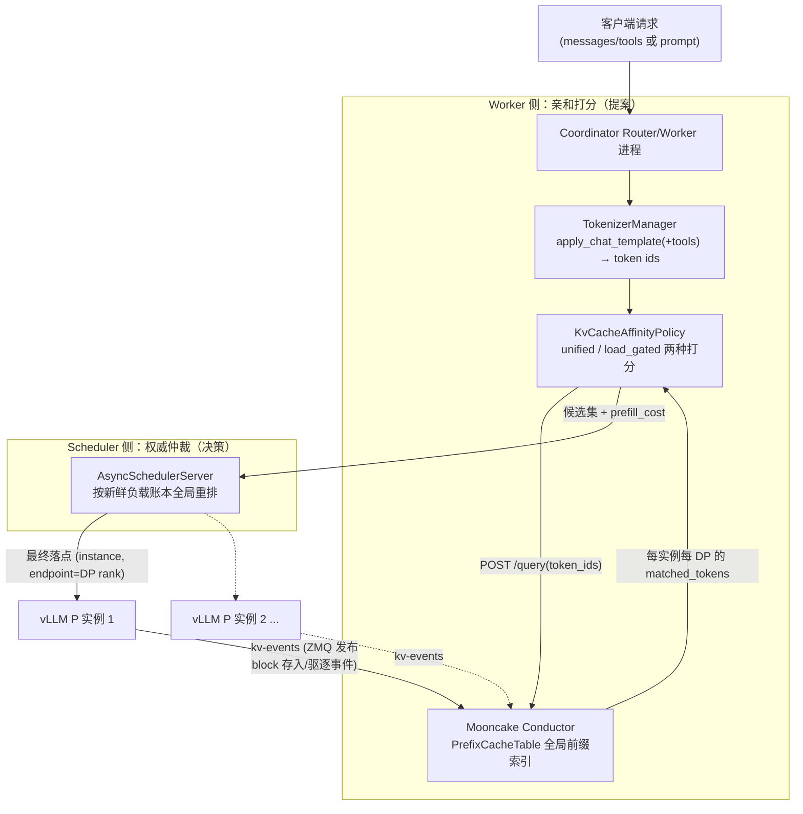

三个角色分工：**Conductor 回答"缓存在哪"**（订阅各实例 kv-events 维护前缀表），**Worker 回答"综合打分谁最优"**（亲和 + 本地负载视图），**Scheduler 回答"最终去哪"**（权威新鲜负载，防并发 herding）。

---

*(来源: interview/interview-review/12-PyMotor-KV亲和性调度特性全解与简历素材.md)*

### 1. 需求分析与竞品对标

### 1.1 需求分析：为什么要做这个特性

**业务场景**：企业客户的典型流量是多轮对话、RAG、Agent/Function Call——每个请求携带很长的公共前缀（system prompt、tools schema、历史轮次），4K 上下文里前缀重复率极高。同时部署形态是多实例水平扩展（含 PD 分离、PD 混部、vLLM DP）。

**痛点量化**：vLLM 单实例的 automatic prefix caching 只在实例内部生效。N 个实例做 round-robin 时，同前缀请求落到"上次算过它的那个实例"的概率只有 1/N——**集群前缀命中率随实例数线性稀释**；而 prefill 恰是 TTFT 的主项，长前缀反复重算直接把 TTFT 打爆。

**需求拆解**（当时的设计约束，面试可以按这个顺序讲）：

| 类别 | 需求 | 落地对应 |
|---|---|---|
| 功能 | F1 请求路由感知"谁缓存了我的最长前缀" | Conductor 全局索引 + /query |
| 功能 | F2 亲和收益与负载均衡可控权衡（不能造热点） | unified / load_gated 双算法 |
| 功能 | F3 覆盖 PD 分离与 PD 混部两种形态 | `_KVA_SELECT_ROLES = {P, U}` |
| 功能 | F4 精确到 DP rank（每个 DP 有独立 KV 池） | per-endpoint 注册与打分 |
| 非功能 | N1 命中估计必须与引擎真实命中一致（含 tools/chat template） | tokenize 前置 + token 级 block 哈希 |
| 非功能 | N2 亲和是优化不是依赖：组件故障不影响服务可用性 | 0.2s 超时 + 逐级回退 LoadBalance |
| 非功能 | N3 调度延迟预算毫秒级 | sub-block fast path、SHM 负载、热路径优化 |
| 非功能 | N4 效果可观测 | cached_tokens 透传、权威分配日志 |

**关键选型**：前缀索引放哪？两条路线——① 调度层自建**本地近似 radix tree**（SGLang router 的做法）：零外部依赖、无网络往返，但它只能"猜"（按自己路由过什么推测缓存了什么），不知道引擎真实的存入/驱逐，且字符级匹配在 tools/chat template 场景误差大；② **中心化真实索引**：订阅引擎 kv-events 维护全局前缀表，准确、含驱逐感知，代价是每请求一跳 HTTP 和一个新组件的可用性风险。Motor 选 ②（Mooncake Conductor），用 0.2s 超时快速回退把可用性风险兜住——本质判断是：**我们的目标客户场景前缀很长，命中估计错一个 block 就是几百上千 token 的重复 prefill，精度比省一跳 HTTP 值钱**。

### 1.2 竞品对标：vLLM 与 SGLang 生态的同类方案

（细节佐证见专题 04 §3、专题 11；`router/`、`sglang/` 仓源码已核实）

| 维度 | SGLang sgl-router / model-gateway（Rust） | vLLM production-stack router（Python） | vLLM 官方示例 Proxy | **Motor（本特性）** |
|---|---|---|---|---|
| 策略名 | `cache_aware`（PD 场景 `PDSelectionPolicy::CacheAware`） | `session`（粘性）/ `prefix-aware` / `kvaware` | 无（`itertools.cycle` 轮询） | `kv_cache_affinity` |
| 索引来源 | **本地近似 radix tree**：路由器按"我路由过什么"自建树，无引擎反馈 | `kvaware` 查 LMCache controller 的**真实 KV 元数据**；`prefix-aware` 为本地 trie | — | **Conductor 中心索引**，订阅引擎 kv-events（真实存入+驱逐） |
| 匹配粒度 | **字符级**（`tree.rs`: `DashMap<char, NodeRef>`，文档明示为省 tokenize 的取舍） | kvaware 为 token/block 级 | — | **token 级、block 对齐**（与引擎哈希同构） |
| 驱逐感知 | 无（本地树自己 LRU，与引擎实际驱逐无关，会假阳性） | kvaware 有（查真实元数据） | — | 有（BlockRemoved 事件实时更新） |
| 负载权衡 | 树命中率超 `cache_threshold` 走亲和，负载失衡（`balance_abs/rel_threshold`）切回最短队列——**二选一开关式** | kvaware 低于阈值（默认 2000 token）回退 QPS 路由 | — | **融合打分（unified）或硬门控（load_gated），连续可调** |
| 决策粒度 | worker 级 | 实例级 | 实例级 | **DP rank 级** |
| 多调度进程一致性 | 单路由器进程，不涉及 | 不涉及 | 不涉及 | **worker 提案 + scheduler 权威账本全局重排** |
| tokenize 成本 | 零（字符匹配的卖点） | kvaware 需要 | — | 毫秒级，且一次 tokenize 三处复用（查询/打分/记账/长度预校验） |

**对标结论（面试话术）**：

> "业界同类方案分两派：'猜缓存'派（SGLang router 的字符级本地树——便宜但不准、无驱逐感知）和'查缓存'派（production-stack 的 kvaware 查 LMCache 元数据）。Motor 和 kvaware 同属'查'派哲学，但走得更完整：索引是事件驱动的中心索引（含驱逐）、粒度到 DP rank、命中长度按引擎同构的 token block 哈希算；并且在'亲和与负载怎么叠加'上比两家都细——SGLang 是超阈值二选一切换，我们是 token 统一量纲的连续融合分（或可选硬门控），外加多调度进程下的中心权威仲裁，这两点是竞品都没有的。"

差异的根源在架构假设：SGLang router 假设"路由器是唯一入口、单进程"，所以本地树够用；Motor 的 Coordinator 是多 worker 进程 + 中心 Scheduler 的架构，天然需要（也有条件做）权威仲裁这一层。

---

*(来源: interview/interview-review/12-PyMotor-KV亲和性调度特性全解与简历素材.md)*

### 2. 全链路机制逐层拆解

### 2.1 Tokenize 前置：调度层拿到与引擎一致的 token ids

源码：`motor/coordinator/scheduler/policy/kv_cache_affinity.py` 的 `TokenizerManager`（单例）。

- 用 HuggingFace `AutoTokenizer` 加载与下层引擎**同一份模型权重目录**的 tokenizer（`prefill_kv_event_config.model_path`），对 chat 请求走 `apply_chat_template(conversation, tools, add_generation_prompt=True, tokenize=True)`——产出的 token 序列与 vLLM/SGLang prefill 实际收到的**逐字节一致**，Conductor 返回的 `longest_matched` 才真实反映集群 KV 分布。
- **tools 必须透传**：函数调用请求的 tools 会被 chat template 注入 prompt，漏传会导致 token 序列分叉、命中长度虚高（这是修过的真实 bug，`apply_chat_template` 的 docstring 里特意写了 "dropping it silently was the bug fixed in this revision"）。
- **fail-closed 兜底**：主路径和 tools-aware fallback 都失败时返回 `[]`，让调度整体回退 LoadBalance——宁可放弃亲和，也不能拿"漏了 tools 的半对 token 序列"去误导 Conductor（`_safe_fallback_encode` 注释原话）。
- tokenize 结果缓存在 `req_info.token_ids`，一次 tokenize 三处复用：① Conductor 前缀查询；② `isl`（输入长度）参与亲和打分；③ `calculate_demand_workload` 用真实 token 数记账（见 2.6）。

**对比面**（详见专题 04 §3）：SGLang router / production-stack 的 `cache_aware` 用字符级近似 radix tree，省 tokenize 但对不齐 block 边界；Motor 用 token 级真实索引，代价是调度层毫秒级 CPU 和 tokenizer 一致性维护。

### 2.2 Conductor 注册与查询：DP rank 粒度的前缀索引

源码：`motor/coordinator/api_client/conductor_api_client.py`。

- **注册**（实例上线时）：对每个 KVA 角色实例（`ROLE_P` 和混部 `ROLE_U`）的每个 endpoint（= DP rank）调 `POST /register`，上报该 DP 的 kv-events ZMQ 端点（`基础端口 + endpoint.id`）、`block_size`、`instance_id`（`vllm-prefill-{id}` / `vllm-union-{id}`）、`dp_rank`。Conductor 据此订阅各 DP 的 KV block 存入/驱逐事件流。
- **查询**（每个请求）：`POST /query` 带 `token_ids` 和 `block_size`，返回 `{tenant: {instance_id: {"DP": {dp_rank: matched_tokens}}}}`——**亲和粒度精确到 DP rank**，不是实例级。这与 vLLM DP 部署下"每个 DP rank 有独立 KV cache 池"的事实对齐。
- **超时即回退**：查询超时设 0.2s（注册 2s），Conductor 慢/挂时快速失败，调度回退 LoadBalance，不阻塞请求主路径。
- **对账重注册**：`re_register_kv_instances` 拉取 Conductor 的 `/services` 列表与本地期望比对，缺失即补注册——覆盖 Conductor 重启丢状态的场景。

### 2.3 kv-events：索引的数据从哪来（vLLM 侧机制）

Conductor 之所以"知道谁缓存了什么"，靠的是 vLLM 的 **KV cache events** 机制（源码：`vllm/vllm/distributed/kv_events.py`；开启方式即部署配置里的 `kv-events-config`）。

**事件是什么**：vLLM V1 的 prefix cache 以 block（默认 16 token）为单位、用链式哈希标识（`block_hash = hash(parent_hash, token_ids)`）。引擎每次缓存状态变化时发布三类事件：

| 事件 | 触发时机 | 关键字段 |
|---|---|---|
| `BlockStored` | 新 block 写入 prefix cache | `block_hashes`（本批 block 的哈希链）、`parent_block_hash`、`token_ids`、`block_size`、`lora_name`（LoRA 隔离命名空间）、`medium` |
| `BlockRemoved` | block 被 LRU 驱逐 | `block_hashes`、`medium` |
| `AllBlocksCleared` | 缓存整体清空（如 reset） | — |

事件按调度步聚合成 `KVEventBatch`（带时间戳和单调递增序列号）批量发布。

**怎么发布**：`ZmqEventPublisher`——ZMQ **PUB** socket 推送事件流（部署配置里的 `endpoint: tcp://*:5557`），外加一个 **ROUTER** socket 做重放服务（`replay_endpoint: tcp://*:6667`）：发布端在内存里保留最近 N 个 batch（`buffer_steps`），订阅者发现序列号跳变（丢包/晚加入/自己重启）时，发一个起始序列号过去即可**增量补拉**，不用全量重建。这正是 Conductor 重启后能快速恢复索引、以及 Motor 注册时要同时上报 `replay_endpoint` 的原因。

**DP 拓扑对齐**：DP 部署下**每个 DP rank 起独立的 publisher**（`EventPublisher` 的设计注释明确：避免重复事件、保证事件归属），端口按 rank 偏移——这与 Motor 侧"每个 endpoint 按 `基础端口 + endpoint.id` 单独注册"严格对齐，是 DP rank 粒度亲和成立的物理基础。TP 多 worker 场景另有 `KVEventAggregator` 做去重：只有所有 TP worker 都上报的事件才算数（KV 在 TP 组内是分片的同一份逻辑缓存）。

**Conductor 消费侧**：订阅各 DP 的事件流，把 `BlockStored/BlockRemoved` 应用到 PrefixCacheTable（哈希链 → 持有者集合）。`/query` 时把请求 token_ids 按同样的 block 哈希算法切块，逐块沿哈希链查表，返回每个 (instance, DP) 的最长连续命中 token 数。**索引是事件驱动的真实状态**（含驱逐），这就是它比路由器本地"猜测树"准的根本原因。

一句话串起来：**引擎每存/驱逐一个 block 就发事件 → Conductor 增量维护全局前缀表 → Motor 查表拿到与引擎真实缓存一致的命中长度**。

### 2.4 两种调度算法：unified 与 load_gated（PR #210）

源码：`kv_cache_affinity.py` 的 `_select_with_load` / `_select_load_gated`；配置常量在 `motor/config/coordinator.py`。

**unified（默认）——单一融合分数，全局最小者胜：**

\[
score = prefill\_load\_scale \times \max(0,\ isl - overlap\_credit \times matched) + load\_weight \times workload
\]

- 所有量纲统一为 **token 数**：第一项是"扣掉缓存命中后还要真算的 prefill 工作量"，第二项是该 endpoint 的实时负载分。
- `overlap_credit` 控制"命中 1 个 token 折抵多少 prefill 工作"（默认 1.0）；`load_weight=0` 时退化为纯亲和（最长前缀胜）。
- 关键性质：**没有缓存命中的空闲 endpoint 也可能赢**——避免同前缀请求全部灌进一个热点实例。

**load_gated——两阶段"负载优先、亲和次之"：**

1. 先按负载筛出 Top-N 最低负载 endpoint（`kv_affinity_load_gate_topn`，默认 2）；
2. 只在这 N 个里面按最长前缀命中排序（平局取更低负载）。

给了一个**硬负载上界**：亲和永远不能把请求拉到"最闲集合"之外——适合负载敏感、宁可牺牲部分命中率也不能出现长尾的场景。

| | unified | load_gated |
|---|---|---|
| 决策形式 | 软权衡（加权和） | 硬约束（先筛后选） |
| 亲和能否压过负载 | 能（取决于权重） | 不能（只在最闲 Top-N 内比） |
| 调参 | `load_weight`/`overlap_credit`/`prefill_load_scale` | `load_gate_topn` |
| 适用 | 前缀重复率高、想最大化命中收益 | 严控负载长尾、防止热点 |

**fast path**：prompt 短于一个 KV block（indexer 只对整块哈希）不可能命中，直接跳过 Conductor HTTP 往返，按全零命中排序——省一次网络调用，行为完全等价。

### 2.5 Worker 提案 + Scheduler 权威仲裁：并发下防 herding（PR #210 → #134 → #304 演进）

这是整个特性最"分布式系统"的部分，也是面试最容易被追问的点。

**问题**：多个 Coordinator worker 进程并发调度时，每个 worker 的本地负载视图有滞后。一波同前缀 burst 进来，所有 worker 都会算出同一个"最优" endpoint → 全部灌过去 → 打爆（herding/羊群效应）。

**演进三步**（对应你的 commit 记录）：

1. **最初方案（后被移除）**：worker 本地 in-flight overlay——本地记"我刚发过去还没确认的请求"临时加负载。问题：只能缓解单 worker burst，TTL 难调，跨 worker 无效。
2. **PR #210：top-k 候选 + scheduler 重选**。worker 亲和打分后上报 top-k（k=3）候选（best-first），Scheduler 在慢路径按**权威新鲜账本**在候选集内重选最低负载者——既权威又跨 worker，且候选集本身就是亲和 top-k，不破坏亲和。
3. **PR #304：unified 模式升级为全局重排**。固定 top-k 仍可能"最优解不在候选集里"。改为 worker 把**每个 endpoint** 的亲和折扣 prefill_cost 全量上报（`kv_affinity_debug` → `candidate_endpoints` 带 `prefill_cost` 字段），Scheduler 端用自己的新鲜负载重算完整 unified 分数：

```743:747:MindIE-PyMotor/motor/coordinator/scheduler/runtime/scheduler_server.py
            combined = pscale * prefill_cost + lweight * load
            if best is None:
                best = (instance, endpoint, combined, prefill_cost)
            elif combined < best[2] or (combined == best[2] and prefill_cost < best[3]):
                best = (instance, endpoint, combined, prefill_cost)
```

分工的精髓：**亲和的数学 worker 已经算完（prefill_cost 不随时间变），负载的新鲜值由 Scheduler 补上**——Scheduler 不需要 prompt、不需要再查 Conductor，一次全局 min 即可。平局时偏向更低 prefill_cost（更好亲和）。load_gated 模式则**保持固定 top-k 提案**——它的硬负载界不能被 Scheduler 的软分数"松绑"。

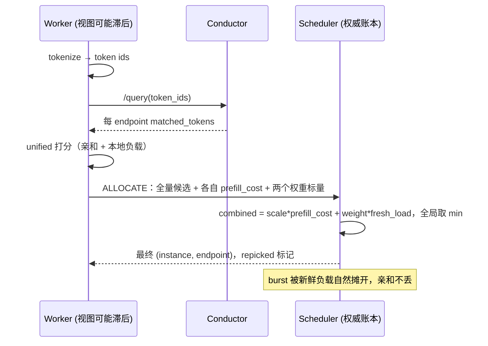

### 2.6 负载账本与量纲统一

源码：`motor/coordinator/domain/workload_calculator.py`。

- KV 亲和路径下 `req_info.token_ids` 已存在，prefill 负载记账直接用 `len(token_ids)`（真实 token 数）；否则回退历史的字节长度线性拟合（`length/4*0.0345+120`）。
- 这一步让 unified 分数的两项**共享 token 量纲**——`load_weight=1.0` 的物理含义是"1 token 排队负载 = 1 token 待算 prefill"，调参有原则可循，而不是两个不可比的数硬加。
- 负载分发/同步走共享内存（SHM）+ ZMQ：worker 每次调度前 `_refresh_cache_from_workload_reader()` 从 SHM 补新鲜负载，心跳过期或实例版本变化才拉全量列表。

### 2.7 防御性工程（多个 PR 的 bugfix 沉淀）

- **上下文长度预校验（PR #349）**：tokenize 前置的副产品——调度层已知真实 token 数，直接在入口拒绝超过 `max_model_len` 的请求（与 vLLM 最新 render 方案的校验行为对齐），不用等请求穿透到引擎才报错。
- **多进程负载强一致（PR #134）**：全局 endpoint 打分 + scheduler 仲裁、DP 负载最小堆、修复 encode 负载异常、KVA 负载上报补齐。
- **P 负载及时释放（PR #368/#393）**：PD 分离下 prefill 完成即释放 P 实例负载（不等整个请求结束），并修复请求结束时负载更新被 cancel 的问题——直接改善后续请求的 TTFT；CPCD 场景改为 prefill 后再选 D 实例，D 的选择基于更新鲜的负载。
- **热路径优化（PR #394）**：UPDATE_WORKLOAD 幂等去重集改有界 FIFO 防无界增长；ALLOCATE 的 workload 用两个裸 float 传输省去 pydantic 序列化；request_id 用"一次性 uuid 前缀 + 进程内自增"替代每请求 uuid4；修复"增量当绝对负载写 SHM"的账本污染 bug。
- **错误码透传（PR #304/#450）**：引擎侧错误码直通客户端，P 阶段 `usage.prompt_tokens_details.cached_tokens`（命中的缓存 token 数）透传合并到最终响应——客户能直接观测亲和命中效果。
- **日志分层**：worker 的选择日志压到 DEBUG（只是提案），Scheduler 提交的最终分配打 INFO（含 matched/load/score/repicked）——负载分析只信权威日志。

---

*(来源: interview/interview-review/12-PyMotor-KV亲和性调度特性全解与简历素材.md)*

### 3. 配置面与部署形态

源码：`motor/config/coordinator.py`（`SchedulerConfig`）；部署文档 `docs/zh/user_guide/features/KV_cache_affinity.md`。

```json
"motor_coordinator_config": {
  "scheduler_config": {
    "scheduler_type": "kv_cache_affinity",
    "kv_affinity_mode": "unified",        // 或 "load_gated"
    "kv_affinity_load_weight": 1.0,        // 0 = 纯亲和
    "kv_affinity_overlap_credit": 1.0,     // 命中 token 的 prefill 折扣
    "kv_affinity_prefill_load_scale": 1.0,
    "kv_affinity_load_gate_topn": 0        // load_gated 专用，0 → 默认 2
  }
}
```

引擎侧三件套：P 实例（或混部 union 实例）开 `enable-prefix-caching` + `kv-events-config`（ZMQ 发布 block 事件，含 `replay_endpoint` 供 Conductor 重放补状态）+ `kv_transfer_config`（`MultiConnector` 组合 `MooncakeLayerwiseConnector` PD 传输层与 `AscendStoreConnector` KV 池后端）。Conductor 独立部署（Go 实现，`kv_conductor_config.http_server_port` 默认 13333）。

**两种形态都支持**：PD 分离（亲和作用于 P 实例选择）与 PD 混部（`ROLE_U`，`vllm-union-{id}` 注册，`_KVA_SELECT_ROLES = {ROLE_P, ROLE_U}`，测试见 `tests/coordinator/scheduler/test_kva_role_u_support.py`）。非 KVA 角色（D/E）走 LoadBalance。

---

*(来源: interview/interview-review/12-PyMotor-KV亲和性调度特性全解与简历素材.md)*

### 4. PR 演进时间线（tobking，Gitcode Ascend/MindIE-PyMotor）

| 时间 | PR | 内容 | 状态 | 规模 |
|---|---|---|---|---|
| 5月 | #134 | 多进程负载强一致 + KVA 负载上报修复；全局 endpoint 打分、scheduler 仲裁、DP 负载最小堆、高 QPS 优化 | merged | +1503/-174 |
| 6月初 | #210 | **两种算法落地**：unified 加权融合 + load_gated Top-2 最低负载选其一；top-k 候选 + scheduler 权威重选，移除 in-flight overlay；sub-block fast path | merged | +1092/-126 |
| 6月中 | #304 | **unified 升级全局重排**：并发时 scheduler 看全局 DP 负载而非固定 TopK；错误码透传、cached_tokens 透传 | merged | +3995/-1219 |
| 6月下 | #349 | KVA 请求长度预校验，超模型上下文直接拒绝 | open | +557/-4 |
| 6月底 | #368 | TTFT 恶化修复：prefill 完成即释放 P 负载 + 负载更新防 cancel；proxy 透传模式 | open | +3074/-323 |
| 7月初 | #393 | PD 分离负载释放流程 + CPCD 时 prefill 后再选 D | merged | +1579/-83 |
| 7月初 | #394 | scheduler workload 账本热路径优化（有界 FIFO 去重、裸 float 传输、SHM 绝对值修复）；ROLE_U 调度状态补全 | open | +1877/-758 |

配套周边（同作者）：#194 断链后释放引擎堆积请求、#83 CPCD D 故障转混部、#235 render 前置到 coordinator、#450 错误码与引擎侧对齐。**全部 23 个 PR、13 个已合入，围绕"KV 亲和 + 负载均衡 + PD 分离可靠性"一条主线。**

---

*(来源: interview/interview-review/12-PyMotor-KV亲和性调度特性全解与简历素材.md)*

### 5. 面试高频追问 Q&A

**Q1：为什么把 tokenize 放在调度层？开销不大吗？**
> 因为亲和判断必须用与引擎一致的 token 序列——chat template、tools 注入都会让字符前缀与 token 前缀分叉，字符级近似（SGLang router 的做法）对不齐引擎 16-token block 边界。开销是毫秒级 CPU，且一次 tokenize 三处复用：查 Conductor、算亲和分、按真实 token 数记负载账，第三点还顺手解锁了入口长度预校验（超上下文直接拒绝）。

**Q2：亲和和负载均衡怎么"叠加"？**
> 两种模式。unified 是软融合：`prefill_load_scale*max(0, isl-overlap_credit*matched) + load_weight*load`，全部 token 量纲，取最小；`load_weight=0` 退化纯亲和。load_gated 是硬约束：先筛 Top-N 最低负载，再在里面比最长前缀——亲和永远出不了最闲集合。前者最大化命中收益，后者严控负载长尾，按业务 SLO 选。

**Q3：多个调度进程并发时，同前缀请求会不会都打到同一个实例？**
> 会，这正是我们迭代了三版的问题。一句话版：本地 overlay → top-k 候选 + 权威重选 → 全量上报 + 全局重排。三个版本的细节：

**V1：worker 本地 in-flight overlay（已废弃）**

- 做法：每个 worker 进程本地记一张"我刚派出去、还没在负载账本里体现"的 in-flight 表，打分时把这部分虚拟负载叠加到目标 endpoint 上，防止自己连续把请求灌向同一处。
- 为什么不行（三条都要能说）：① **作用域错了**——overlay 只对本 worker 可见，8 个 worker 各自的"最优"仍是同一个 endpoint，跨 worker 的 herding 一点没解；② **TTL 无解**——overlay 条目何时过期？过期太快等于没有，太慢会让该 endpoint 被长期高估负载、命中好的实例反而接不到请求（人为制造亲和损失）；③ **与真实账本双写**——请求真正落账后 overlay 还没清，同一份负载被算两次。
- 结论：局部视图上打补丁修不好全局一致性问题，方向本身错了，所以 PR #210 里整体移除而不是继续调参。

**V2（PR #210）：top-k 候选提案 + scheduler 权威重选**

- 做法：worker 完成亲和打分后不再只报 top-1，而是上报 **best-first 的 top-k（k=3）候选列表**；Scheduler 收到后在慢路径（检测到 worker 负载视图版本落后时）用自己的**权威新鲜账本**在这 k 个候选里重选最低负载者。快路径（视图一致）仍直接用 worker top-1，不加开销。
- 解决了什么：仲裁点从"每个 worker 自己"收敛到"唯一的 Scheduler"，跨 worker 的 burst 会被权威账本摊到 top-3 里负载最低的那个——**权威、跨进程、且候选集本身就是亲和排序的前 k 名，重选不破坏亲和**。
- 残留问题：k 是拍的。k=3 时，如果 top-3 恰好都被这波 burst 打热，而第 4 名（命中略差但完全空闲）才是真正的全局最优——它根本不在候选集里，Scheduler 无从选起。k 调大又增加消息体积和仲裁成本，本质是"截断集合"与"全局最优"的矛盾。

**V3（PR #304）：全量候选 + scheduler 全局重排（unified 模式最终形态）**

- 做法：利用 unified 分数可分解的性质——`score = scale × prefill_cost + weight × load`，其中 **prefill_cost（亲和折扣后的待算量）不随时间变化，load 才是易腐数据**。于是 worker 把**每一个** endpoint 的 prefill_cost 连同两个权重标量一起上报，Scheduler 用自己账本里的新鲜 load 对全部 endpoint 重算完整分数、取全局 min（平局偏向更低 prefill_cost，即更好亲和）。
- 妙处：Scheduler 不需要 prompt、不需要 tokenizer、不需要再查 Conductor——贵的亲和计算 worker 已做完，Scheduler 只做一次 O(endpoints) 的线性扫描加权求和。没有截断，"第 4 名才是最优"的场景自然覆盖。
- 边界：**load_gated 模式刻意不升级到 V3**，仍走 V2 的固定 top-k——因为它的语义是"硬负载上界"（选择永远不出最闲 Top-N 集合），如果让 Scheduler 拿软分数全局重排，等于把硬约束松绑成软权衡，模式的存在意义就没了。

**Q4：Conductor 挂了/慢了怎么办？**
> 查询超时 0.2s 快速失败，整条亲和路径返回 None，调度回退 LoadBalance——亲和是优化不是依赖，可用性不受影响。Conductor 重启后有 `/services` 对账重注册补状态，kv-events 有 replay_endpoint 重放机制。tokenize 失败同理 fail-closed 回退。

**这里的 LoadBalance 是什么**（`motor/coordinator/scheduler/policy/load_balance.py`，也是 D/E 等非 KVA 角色的默认策略）：

- **不是轮询**，是全局最小负载选择：把所有实例的所有 endpoint（DP rank）摊平打分，用 `heapq.nsmallest` 取负载分最低者。负载分来自 `Workload.calculate_workload_score`（active_tokens/active_kv_cache 记账，见 2.6），与 KV 亲和 unified 分数的第二项是**同一个数**——所以"回退"只是把亲和项去掉，负载视角完全连续。
- **复合打分保留实例压力感知**：`endpoint_score + weight × (instance_score / endpoint_count)`（`calculate_endpoint_score`）。纯 endpoint 最小值会漏掉"这个 DP 本身不忙、但同实例其他 DP 已经很满"的整机压力信号；instance 分除以 endpoint 数是为了不惩罚 DP 多的大实例。`endpoint_instance_score_weight` 默认 0.05，可配。
- **平局旋转**：`start_index` 按 worker 编号旋转遍历起点，只影响同分时的选择顺序——多 worker 在冷启动/全空闲时不会齐刷刷选中同一个 endpoint（herding 的低配版防护）。
- **同样受 Scheduler 仲裁**：LoadBalance 的候选也走"worker 提案 + scheduler 权威重选"通道（`_select_endpoint_candidates_by_load_balance` → scheduler 全局扫描），与亲和路径共享一套仲裁基础设施。
- 完整回退链：`kv_cache_affinity`（Conductor 无数据/超时/tokenize 失败）→ `load_balance`（异常）→ `round_robin` 兜底。

**Q5：亲和粒度是实例级还是更细？**
> DP rank 级。vLLM DP 部署下每个 DP rank 有独立 KV 池，注册时每个 endpoint（DP rank）单独上报 kv-events 端口（基础端口+rank），Conductor 返回 `{instance: {"DP": {rank: matched}}}`，打分和最终落点都精确到 (instance, endpoint)。

**Q6：怎么验证特性有效？**
> 三层：① 引擎返回的 `usage.prompt_tokens_details.cached_tokens` 透传到客户端响应，命中直接可观测；② Scheduler 权威分配日志带 matched/load/score/repicked；③ 客户场景（约 4K 上下文、高前缀重复）TTFT 降约 70%。

**Q7：和 Mooncake 是什么关系？**（引专题 04/10）
> 我们用 Mooncake 的 Conductor 组件做全局 KV 前缀索引（订阅 kv-events、维护 PrefixCacheTable、HTTP register/query API），KV 传输与池化用 Transfer Engine/Store 系（昇腾场景 `ascend_transport` + `AscendStoreConnector`）。调度决策本身（打分算法、仲裁架构）是 Motor 自研。

---

*(来源: interview/interview-review/12-PyMotor-KV亲和性调度特性全解与简历素材.md)*

### 6. 简历项目素材

### 6.1 项目描述（可直接粘贴）

> **大规模 LLM 推理服务 KV Cache 亲和性调度（MindIE-PyMotor，开源）**
> 面向多实例/PD 分离部署下前缀缓存碎片化导致的重复 prefill 问题，设计并落地 KV 亲和性调度特性：调度层前置与引擎一致的 tokenization（含 chat template/tools），基于 Mooncake Conductor 全局前缀索引获取 DP rank 粒度缓存命中，提出 unified（亲和-负载加权融合，token 统一量纲）与 load_gated（负载硬约束内选最长前缀）两种可配置算法；针对多调度进程并发 herding 问题，设计"worker 亲和提案 + 中心 scheduler 权威负载全局重排"的两级决策架构。配套完成负载账本强一致、prefill 完成即时释放负载、调度热路径优化（SHM/有界去重/序列化精简）等工程化改进。客户场景（4K 上下文、高前缀重复率）TTFT 下降约 70%；累计向开源仓提交 20+ PR。

### 6.2 STAR 展开（面试口述版）

- **S**：多实例部署下 round-robin/负载均衡把同前缀请求打散，每实例重复 prefill 相同前缀，缓存命中率随实例数下降，TTFT 恶化。
- **T**：让请求路由"知道"集群里谁缓存了它的最长前缀，并且在命中收益与负载均衡之间可控权衡；同时不能引入可用性风险和明显调度延迟。
- **A**：四个关键设计——① token 级精确索引（对比字符级 radix tree 的精度取舍）；② 双算法可配置（软融合 vs 硬门控）；③ 两级决策防 herding（亲和数学 worker 算、负载新鲜值 scheduler 补、全局 min）；④ 全链路 fail-closed 回退（Conductor 超时 0.2s/tokenize 失败均回退 LoadBalance）。
- **R**：TTFT 降约 70%（客户实测）；cached_tokens 透传使命中率可观测；特性覆盖 PD 分离与混部两种形态；相关 PR 合入开源主干。

### 6.3 关键词（JD 匹配用）

LLM 推理服务、KV Cache / Prefix Caching、PD 分离（Prefill-Decode Disaggregation）、Mooncake（Conductor / Transfer Engine）、vLLM kv-events、分布式调度、负载均衡、一致性（权威账本仲裁）、昇腾 NPU、Kubernetes 云原生部署、ZMQ / 共享内存、高并发热路径优化。

### 6.4 追问防线（每条素材背后的代码依据）

| 简历表述 | 被追问时的展开点 | 代码/PR 依据 |
|---|---|---|
| "token 统一量纲的融合打分" | 公式逐项解释 + 为什么真实 token 数记账 | `kv_cache_affinity.py` `_select_with_load`；`workload_calculator.py` `_prefill_load_score` |
| "两级决策防 herding" | in-flight overlay → top-k → 全局重排三版演进 | PR #210/#304；`scheduler_server.py` `_extract_affinity_candidates` + combined 重算 |
| "DP rank 粒度亲和" | kv-events 端口 = 基址+rank；/query 返回 DP map | `conductor_api_client.py` `register_post`/`query_conductor` |
| "fail-closed 可用性" | 0.2s 超时、tokenize 兜底、对账重注册 | `query_conductor` timeout；`_safe_fallback_encode`；`re_register_kv_instances` |
| "TTFT 降 70%" | 客户场景条件（4K 上下文、高重复率）；另有 prefill 即时释放负载的调度侧 TTFT 修复 | 客户实测；PR #368/#393 |
| "热路径优化" | 有界 FIFO 去重、裸 float 传输、SHM 绝对值 bug | PR #394 commit 记录 |

---

*(来源: interview/interview-review/12-PyMotor-KV亲和性调度特性全解与简历素材.md)*

### 7. 参考

- 专题 04（问题背景与 Mooncake 三组件）、专题 10（Transfer Engine/Store 深挖）、专题 11（vLLM vs SGLang 集成对比）
- 源码：`MindIE-PyMotor/motor/coordinator/scheduler/policy/kv_cache_affinity.py`、`policy/load_balance.py`、`runtime/scheduler_client.py`、`runtime/scheduler_server.py`、`api_client/conductor_api_client.py`、`domain/workload_calculator.py`、`config/coordinator.py`；`vllm/vllm/distributed/kv_events.py`（kv-events 机制）
- 部署文档：`MindIE-PyMotor/docs/zh/user_guide/features/KV_cache_affinity.md`
- PR 列表：gitcode.com/Ascend/MindIE-PyMotor（作者 tobking，23 PR / 13 merged）
- Conductor API 设计：Mooncake 仓 `docs/source/design/conductor/indexer-api-design.md`（dev/kv-indexer 分支）

*(来源: interview/interview-review/12-PyMotor-KV亲和性调度特性全解与简历素材.md)*

### 0. 一句话结论

两边**生产默认**的 KV 亲和都是「路由器本地近似前缀树 + 负载门控」，**不查 worker 真实 KV**。官方 vLLM Router 是 SGLang Model Gateway 的 Rust fork，`cache_aware` 算法同源。精确亲和（ZMQ block 事件 / LMCache Lookup）在 llm-d、Dynamo、production-stack `kvaware`、SGLang 实验 router 里——换 fork 名字不会自动升级到精确档。

---

*(来源: interview/interview-review/15-vLLM-Router与SGLang-KV亲和性设计调研.md)*

### 1. 命名地图（先分清「谁是谁」）

| 说法 | 实际指什么 | 语言 | 官方地位 |
|------|------------|------|----------|
| **vLLM Router**（2025-12 博客） | [`vllm-project/router`](https://github.com/vllm-project/router)，工作区 `router/` | Rust | **当前官方主推独立 LB**；明确 fork 自 SGLang Model Gateway |
| **SGLang Model Gateway** | [`sgl-model-gateway`](https://github.com/sgl-project/sglang/tree/main/sgl-model-gateway)，工作区 `sglang/sgl-model-gateway/` | Rust | vLLM Router 的上游；默认 `--policy cache_aware` |
| **production-stack `vllm_router`** | [`production-stack`](https://github.com/vllm-project/production-stack) 内 Python 包 | Python/FastAPI | K8s 参考栈组件；`prefixaware` / `kvaware`；**不是**上面那个 Rust Router |
| **llm-d / GIE EPP** | Endpoint Picker + KV indexer | Go 等 | K8s 网关侧**精确** prefix-cache 打分 |
| **NVIDIA Dynamo KV Router** | Dynamo 组件 | — | 默认消费 KV events；可降级近似 |

官方博客原文（2025-12-13）：*“derived from a fork of the SGLang model gateway”* → [vllm.ai/blog/2025-12-13-vllm-router-release](https://vllm.ai/blog/2025-12-13-vllm-router-release)

```
SGLang Model Gateway (Rust)
        │ fork (2025)
        ▼
vllm-project/router  ←── 官方博客称 “vLLM Router”
        │
        ✕ 不是同一代码库
        │
vllm-project/production-stack
        └── Python vllm_router：PrefixAware / Kvaware / Session
```

---

*(来源: interview/interview-review/15-vLLM-Router与SGLang-KV亲和性设计调研.md)*

### 2. 要解决什么问题

单机 APC（vLLM）/ RadixAttention（SGLang）只能复用**本机** KV。多 replica 时 round-robin 会把共享前缀打散 → 每台重算 prefill → TTFT↑、吞吐↓。

**KV cache affinity / cache-aware routing** 的目标：在负载可接受时，把请求送到「最可能已有该前缀 KV」的 worker。

SGLang v0.4 官方数据（共享前缀负载）：吞吐约 **1.9×**，cache hit **20% → 75%**（约 3.8×）。来源：[LMSYS v0.4 博客](https://lmsys.org/blog/2024-12-04-sglang-v0-4/)。

本质：把「无状态 L7 负载均衡」升级为「对引擎内部缓存状态敏感的调度」。

---

*(来源: interview/interview-review/15-vLLM-Router与SGLang-KV亲和性设计调研.md)*

### 3. 能力分层（概念 taxonomy）

| 层 | 机制 | 知道真实 KV？ | 跨用户共享前缀 | 代表 |
|----|------|---------------|----------------|------|
| **A Session sticky** | session/user consistent hash | 否 | 否 | vLLM Router `consistent_hash`；SGLang sticky |
| **B Prefix hash** | `hash(前 N token)` → ring | 否 | 部分 | SGLang `prefix_hash` |
| **C 近似打分** | 本地 radix/trie，按路由历史猜 | 否 | 是（可假阳性） | **两边默认 `cache_aware`**；production-stack `prefixaware` |
| **D 真值反馈** | ZMQ BlockStored/Removed 或 LMCache Lookup | 是 | 是且更准 | llm-d；Dynamo；production-stack `kvaware`；SGLang experimental |

**易混概念：**

- Sticky = 「跟对人」（同会话同机）
- Prefix hash = 「跟对字符串桶」
- Prefix-aware scoring = 「跟对最长可复用前缀」，再与负载权衡

有了 Mooncake/LMCache 远程 KV 后：miss 从「必重算」变成「付传输费」，打分应含迁移成本——亲和价值仍在，但语义从二元命中变成成本优化。

---

*(来源: interview/interview-review/15-vLLM-Router与SGLang-KV亲和性设计调研.md)*

### 4. 生产默认：近似树 `cache_aware`（两边同构）

### 4.1 设计哲学

**Communication-Free**：不向 worker 查询真实 cache 状态；用「我把请求发到哪」维护影子树（approximate radix tree）。树存 **raw text characters**，刻意不做 tokenize，换精度省开销。

### 4.2 决策伪代码

```
if (max_load - min_load) > abs_threshold
   AND max_load > rel_threshold * min_load:
    # 失衡 → 最短队列；仍 insert 更新近似树
    return argmin load
else:
    result = tree.prefix_match(text)
    match_rate = matched_chars / input_chars
    if match_rate > cache_threshold:
        route to that tenant (if healthy)
    else:
        route to min-load   # 文档曾写 smallest tree，实现多为 min-load
    tree.insert(text, chosen_url)   # 懒更新
```

### 4.3 关键参数（典型默认）

| 参数 | 典型值 | 作用 |
|------|--------|------|
| `cache_threshold` | 0.3–0.5 | 低于此 match_rate 不当作 cache hit |
| `balance_abs_threshold` | 32–64 | 绝对负载差 |
| `balance_rel_threshold` | 1.1–1.5 | 相对负载比 |
| `eviction_interval_secs` | 30–120 | LRU 驱逐周期 |
| `max_tree_size` | 很大 | 树节点上限 |

### 4.4 工作区代码路径

| 组件 | 路径 |
|------|------|
| vLLM Router `cache_aware` | `router/src/policies/cache_aware.rs` |
| vLLM Router 近似树 | `router/src/tree.rs`（`DashMap<char, NodeRef>`，字符级） |
| SGLang Gateway `cache_aware` | `sglang/sgl-model-gateway/src/policies/cache_aware.rs` |
| SGLang 多租户树 | `sglang/sgl-model-gateway/src/policies/tree.rs` |

### 4.5 两边差异（同源但非字面同一份代码）

| 维度 | SGLang Model Gateway | vLLM Router |
|------|----------------------|-------------|
| 树键 | `pool::model`（隔离 prefill/decode/regular） | 按 `model` 建树 |
| 行数/能力 | 更完整（~1500 行）；mesh sync、PeriodicTask | 简化版（~500+ 行） |
| 官方叙事 | `cache_aware` 是一等公民（v0.4 起） | 博客更强调 **consistent_hash + P/D 编排** |
| P/D | 有；树键隔离防互相冲刷 | 强调 NIXL / NCCL+ZMQ / Mooncake 的 P→D 协调 |
| mesh | `smg-mesh`（receive 未完全接线） | 无 |

**面试口径：**

> 若要「便宜、无外部依赖、单入口猜缓存」——SGLang / vLLM Router 的 `cache_aware` 同一档（C 层）。  
> 若要「和引擎 block 哈希一致、含驱逐、可 DP-rank 打分」——必须上 D 层（llm-d / Dynamo / LMCache / Mooncake Conductor），不是换一个 fork 名字就能得到。

### 4.6 字符级近似的已知误差

1. 字符公共前缀 ≠ token 公共前缀（chat template / tools 注入会分叉）
2. 对不齐引擎 block 边界 → 无法精确估可复用 block 数
3. 无 `BlockRemoved` → 引擎已驱逐时仍可能「假命中」

（与 Motor「tokenize 前置 + 查 Conductor」形成对比，见专题 04 / 12。）

---

*(来源: interview/interview-review/15-vLLM-Router与SGLang-KV亲和性设计调研.md)*

### 5. SGLang 完整策略光谱

| 策略 | 信号 | 说明 |
|------|------|------|
| `cache_aware` | prompt 原文最长前缀 | **生产默认**；近似树 |
| `prefix_hash` | 前 N token（默认 256）xxhash → ring | O(log n)；HTTP 常无 tokens，更适合 gRPC |
| `consistent_hashing` | `X-SMG-Routing-Key` / `X-SMG-Target-Worker` | 会话亲和，非 prefix 感知 |
| `power_of_two` | 随机抽 2 取更轻 | 配合 LoadMonitor |
| `cache_aware_zmq`（实验） | 真 block-hash + ZMQ 事件 | `experimental/sgl-router` |

### 5.1 PD / DP 配套

- **PD**：Prefill / Decode 分池；可 `--prefill-policy cache_aware --decode-policy power_of_two`；注入 `bootstrap_host/port/room`
- **DP**：URL 可带 `dp_rank`；HTTP 注入 `data_parallel_rank`；每 attn-DP rank 独立 KV，各自可开 ZMQ publisher（port = base + rank）
- Affinity 主要优化 **Prefill 池**（长前缀命中）；Decode 更偏负载

### 5.2 Worker 如何暴露 cache 状态

**生产默认：不暴露。**

真 KV 路径（实验 / Dynamo 等）：

1. `RadixCache` + `KVCacheEventMixin`（`sglang/python/sglang/srt/mem_cache/events.py`）
2. store/evict → `BlockStored` / `BlockRemoved` / `AllBlocksCleared`
3. `ZmqEventPublisher`（`sglang/python/sglang/srt/disaggregation/kv_events.py`）
4. CLI：`--kv-events-config '{"publisher":"zmq","endpoint":"tcp://*:5557",...}'`
5. `/server_info` → `kv_events` 描述符（`block_size`、`dp_size`、port_base）

---

*(来源: interview/interview-review/15-vLLM-Router与SGLang-KV亲和性设计调研.md)*

### 6. vLLM 生态完整光谱

### 6.1 官方 Rust Router（工作区 `router/`）

策略：`random` / `round_robin` / `power_of_two` / `cache_aware` / `consistent_hash` / `rendezvous_hash`（见 `router/src/policies/factory.rs`）。

博客强调：conversational 用 **Consistent Hashing** 保会话粘滞；另有原生 **P/D disaggregation** 编排。

### 6.2 production-stack Python Router

| 策略 | 机制 | 精度 |
|------|------|------|
| `session` | HashRing + session header | 间接亲和 |
| `prefixaware` | `HashTrie`：128 字符 chunk + xxhash；最长前缀匹配后 random.choice | 近似；**假设不淘汰** |
| `kvaware` | tokenize → LMCache Controller `LookupMsg` → 最长匹配；不足 threshold 回退 session/QPS | **半精确/精确**（依赖 controller） |

### 6.3 引擎侧：APC + KV Events（精确路由的根基）

链式 block hash：

```text
block_hash_i = H(parent_hash_{i-1}, token_ids_in_block_i, extra_keys)
```

- 只缓存满 block（默认 `block_size=16`）
- `extra_keys`：LoRA、多模态 image hash、`cache_salt` 等
- 因果性：只能复用从 block 0 起**连续命中**的前缀

工作区路径：

| 路径 | 要点 |
|------|------|
| `vllm/vllm/v1/core/kv_cache_utils.py` | `hash_block_tokens` |
| `vllm/vllm/v1/core/block_pool.py` | 分配/驱逐时发事件 |
| `vllm/vllm/distributed/kv_events.py` | `BlockStored` / `BlockRemoved` / `AllBlocksCleared`；ZMQ PUB |

启用示例：

```bash
vllm serve MODEL --block-size 16 \
  --kv-events-config '{"enable_kv_cache_events": true}'
```

### 6.4 精确路由计分范式（llm-d / Dynamo / bet0x）

```text
tokenize(prompt) → token_ids
→ 按 block_size 切分 → 链式 block_hashes（须与引擎算法一致）
→ 对每个候选 worker：从 B0 起数连续命中数
→ 选最高分；0 分则 fallback least-loaded / session / QPS
→ 可选 speculative insert（TTL ~2s）填补「路由→事件到达」空窗
```

连续前缀示例：

```text
Keys:  B0 B1 B2 B3 B4
Pod A: ✓  ✓  ✓  ✓  ✗  → score 4
Pod B: ✓  ✓  ✗  -  -  → score 2（在 B2 断链）
Pod C: ✗  -  -  -  -  → score 0（即使碰巧有 B3/B4 也无用）
```

---

*(来源: interview/interview-review/15-vLLM-Router与SGLang-KV亲和性设计调研.md)*

### 7. 生态对比矩阵

| 系统 | 主要策略 | 索引来源 | 匹配粒度 | 驱逐感知 | 分类 |
|------|----------|----------|----------|----------|------|
| SGLang Gateway | `cache_aware` | 本地近似 radix | **字符级** | 否（自管 LRU） | **C**（+A） |
| vLLM Router | 同源 `cache_aware` + `consistent_hash` | 同左 | 字符级 | 否 | **C**（+A） |
| production-stack | `prefixaware` / `kvaware` | HashTrie / LMCache | 字符 chunk / token | kvaware 有 | **C / D** |
| llm-d + GIE | prefix-cache-scorer + util + queue | KV-Events → Indexer | block 级 | 有 | **D**（主）+ A |
| NVIDIA Dynamo | cost = prefill + decode − overlap | NATS/ZMQ 事件（默认可关） | token/block | 事件模式有 | **D** 默认；可降 **C** |
| Mooncake Conductor | 命中 + 负载 + **迁移代价** | 订阅引擎 KV events | block 哈希链 | 有 | **D** + 迁移 |
| Motor（本项目） | tokenize + Conductor `/query` | Conductor 真值 | token/block | 有 | **D** |

---

*(来源: interview/interview-review/15-vLLM-Router与SGLang-KV亲和性设计调研.md)*

### 8. 权衡与失效模式

| 问题 | 近似树 (C) | 真值事件 (D) |
|------|------------|--------------|
| 假阳性（已驱逐） | 常见 | `BlockRemoved` 后下降 |
| 运维成本 | 低，零同步 | 高：ZMQ / tokenizer / hash 对齐 |
| 跨用户共享前缀 | 强 | 更强且更准 |
| 热点风险 | 需负载门控 | 需多 scorer 加权 |
| 字符 ≠ token | 有误差 | tokenize/render 对齐可消 |
| 多 Gateway 副本 | 树不同步，hit 可能降 10–20% | 每副本独立订阅可收敛 |
| Hash 不一致 | — | router 与引擎 block_size/algo/LoRA 不一致 → 永远 0 分 |
| 事件空窗 | — | speculative TTL 填补 |

---

*(来源: interview/interview-review/15-vLLM-Router与SGLang-KV亲和性设计调研.md)*

### 9. 选型速查

| 场景 | 建议 |
|------|------|
| 多轮聊天、前缀共享弱 | `consistent_hash` / session（A） |
| 零依赖、要快速增益 | SGLang / vLLM Router `cache_aware`（C） |
| 长 system / Agent / 高共享要准 | llm-d / Dynamo / LMCache `kvaware` / Conductor（D） |
| PD 分离 | Prefill 用 cache_aware；Decode 用 PoT/load |
| 已有分布式 KV（Mooncake/LMCache） | 亲和仍有价值；打分应含传输成本 |
| 与 Motor 对标面试 | 「他们猜缓存（字符树）；我们查缓存（token + Conductor）」 |

---

*(来源: interview/interview-review/15-vLLM-Router与SGLang-KV亲和性设计调研.md)*

### 10. 面试口述（60 秒版）

> 多实例下 prefix cache 不能跨机，round-robin 会把共享前缀打散。SGLang 从 v0.4 起默认用 cache-aware LB：路由器维护一棵**近似 radix 树**，按请求历史猜谁有最长前缀，负载失衡就切最短队列——**零同步、字符级、可假阳性**。官方 vLLM Router 是它的 Rust fork，算法同源，博客更强调会话 consistent hash 和 P/D 编排。  
> 要精确命中，得走另一条路：引擎发 ZMQ BlockStored/Removed，或查 LMCache/Mooncake Conductor——和我们 Motor「tokenize 前置 + 查真实元数据」是同一哲学。字符级是拿精度换开销；token 级对齐引擎 block 边界，但要维护 tokenizer 一致性。

---

*(来源: interview/interview-review/15-vLLM-Router与SGLang-KV亲和性设计调研.md)*

### 11. 一手来源

| 资源 | URL / 路径 |
|------|------------|
| SGLang v0.4 博客（Cache-Aware LB） | https://lmsys.org/blog/2024-12-04-sglang-v0-4/ |
| vLLM Router 发布博文 | https://vllm.ai/blog/2025-12-13-vllm-router-release |
| SGLang `cache_aware.rs` | `sglang/sgl-model-gateway/src/policies/cache_aware.rs` |
| vLLM Router `cache_aware.rs` | `router/src/policies/cache_aware.rs` |
| vLLM Router 字符树 | `router/src/tree.rs` |
| vLLM APC 设计 | `vllm/docs/design/prefix_caching.md`（上游） |
| vLLM KV events | `vllm/vllm/distributed/kv_events.py` |
| Preble 论文 | https://arxiv.org/abs/2407.00023 |
| Mooncake 论文 | https://arxiv.org/abs/2407.00079 |
| llm-d prefix routing | https://github.com/llm-d/llm-d/blob/main/docs/architecture/advanced/kv-management/prefix-cache-aware-routing.md |

---

*(来源: interview/interview-review/15-vLLM-Router与SGLang-KV亲和性设计调研.md)*

### 12. 记忆钩子

```
Sticky 跟会话；Hash 跟桶；Approximate 跟路由器的记忆；Live feedback 跟引擎的真相。
vLLM Router ≈ SGLang 的 C 层 + 更强的 vLLM P/D 编排 ≠ 自动升级到 D 层。
Motor = D 层（查 Conductor），不是猜树。
```

*(来源: interview/interview-review/15-vLLM-Router与SGLang-KV亲和性设计调研.md)*

### 1. 两个正交问题

| 问题 | 问的是什么 | 不做会怎样 |
|------|------------|------------|
| **KV 亲和（Affinity / Cache-Aware Routing）** | 请求应打到哪台 worker？ | 共享前缀被 round-robin 打散 → 重复 prefill |
| **三级池化（Tiered KV Pooling）** | KV block 落在哪层介质？ | HBM 装不下 → OOM 或被迫缩小 batch；无法跨实例复用 |

二者可独立演进，也可组合：

```text
有亲和、无池化：多机 L1 命中率高，但单机容量仍受 HBM 限制
无亲和、有池化：任意机可从 L2/L3 拉回，但仍付 PCIe/RDMA；不如本地 L1
有亲和 + 有池化：本地 L1 最优；miss 时付分层成本，仍优于重算
```

---

*(来源: interview/kv knowledge/00-概念与分层模型.md)*

### 2. 路由策略分类（业界常用术语）

业界（尤其 llm-d / Dynamo / SGLang 文档）通常不按字母分层，而按**状态来源与匹配精度**区分：

| 策略 | 英文常用名 | 路由依据 | 是否感知真实 KV | 代表实现 |
|------|------------|----------|-----------------|----------|
| **会话亲和** | Session affinity / sticky routing | `session_id` / `user_id` → 固定 worker | 否（间接：同会话同机） | `consistent_hash`、session-affinity scorer |
| **一致性哈希** | Consistent hashing | 会话键或前缀 hash 进环 | 否 | SGLang `prefix_hash`、`consistent_hashing` |
| **近似前缀缓存感知** | Approximate prefix-cache-aware routing | 路由器本地 radix/trie，按**路由历史**推断 | 否 | SGLang/vLLM `cache_aware`；llm-d approx；AIBrix 默认 `prefix-cache` |
| **精确前缀缓存感知** | Precise / KV-event-aware routing | ZMQ `BlockStored/Removed` 或 Controller Lookup | **是** | llm-d precise；Dynamo KV Router；AIBrix Event Sync；Motor+Conductor；LMCache `kvaware` |

**易混概念：**

- **Session affinity** 只保证「同用户同机」，**不**保证跨用户共享 system prompt 的复用。
- **Approximate** 与 **Precise** 都是 prefix-cache-aware；差别在索引是「推测」还是「引擎事件/元数据真值」。
- 有了远程 KV（L3）后，路由目标从「必须同机」变成「本地命中 / 远程拉取 / 重算」的**成本权衡**，但策略名称仍用上表。

**状态来源一句话：**

```text
Session / Consistent hash  →  身份或内容桶，无 cache 视图
Approximate                →  路由器本地学习（communication-free）
Precise                    →  KV events 或 Controller 全局索引
```

---

*(来源: interview/kv knowledge/00-概念与分层模型.md)*

### 3. 三级池化统一语义

业界命名不统一（G1/G2/G3、L1/L2、HostPinned/Disk），本文统一：

| 层级 | 介质 | 典型延迟 | 共享范围 | 常见实现 |
|------|------|----------|----------|----------|
| **L1** | GPU HBM | 最低 | 单引擎进程 | vLLM APC / SGLang RadixAttention |
| **L2** | CPU DRAM（常 pinned） | PCIe 搬运 | 通常单机 | HiCache host pool；KVBM G2；AIBrix L1 DRAM；vLLM OffloadingConnector CPU |
| **L3** | NVMe / 共享 FS / 分布式 Store | 磁盘或 RDMA | **可跨实例** | Mooncake Store；HiCache storage；KVBM G3/G4；AIBrix L2 InfiniStore；LMCache disk/remote |

```text
L1 (GPU) ──驱逐/写回──► L2 (CPU) ──异步落盘/远程──► L3 (Disk/Store)
     ▲                      │                              │
     └──── promotion / prefetch ←──────────────────────────┘
```

**注意命名冲突：**

- AIBrix 把进程内 DRAM 叫 **L1**、分布式叫 **L2**（相对 GPU 的 offload 视角）
- Dynamo KVBM 用 **G1–G4**（Device / Host / Disk / Remote）
- SGLang HiCache 用 **L1/L2/L3**（与本文一致）
- Mooncake Conductor 用 **medium: GPU / CPU / DISK**

阅读文档时先对齐「相对谁的 L1」。

---

*(来源: interview/kv knowledge/00-概念与分层模型.md)*

### 4. 与 PD 分离的关系

| 池 | 亲和价值 | 池化价值 |
|----|----------|----------|
| **Prefill** | 最大（省 TTFT） | L2/L3 命中可跳过大量 prefill 算力 |
| **Decode** | 通常按负载 / 会话；KV 从 P 传入 | 本机 decode 侧少做跨请求前缀复用 |

典型组合：

- Prefill：`cache_aware` / precise prefix scorer / Dynamo prefill router（完整 overlap）
- Decode：PoT / least-load；Dynamo 显式 **关闭** decode 侧 overlap credit

---

*(来源: interview/kv knowledge/00-概念与分层模型.md)*

### 5. 基础概念词典（由浅入深 · 面试必会）

> 目标：先建立「地图」，再能对面试官追问。  
> 工作区对照：`Mooncake/`（TE/Store/Conductor）、`dynamo/`（KVBM/NIXL）、`sglang/`（HiCache）、`vllm/`（KV Connector）、`MindIE-PyMotor/`（Conductor 调度）。

先看一张总图——后面每个词都落在这张图的某一层：

```text
客户端
  │
  ▼
┌─────────────────────────────────────────────────────────┐
│ 路由层：cache-aware / session affinity / indexer 查询     │  ← 决定「去哪台」
└───────────────────────────┬─────────────────────────────┘
                            │
         ┌──────────────────┼──────────────────┐
         ▼                  ▼                  ▼
    Prefill Worker     Decode Worker      （或同构 replica）
         │                  ▲
         │   KV Transfer    │                 ← 搬「张量数据」
         │  (NIXL / TE / …) │
         └──────────────────┘
         │
         ▼
┌─────────────────────────────────────────────────────────┐
│ 池化层：HiCache / KVBM / LMCache / Mooncake Store         │  ← 决定「存在哪」
│   L1 GPU  ↔  L2 CPU  ↔  L3 Disk/Remote                    │
└─────────────────────────────────────────────────────────┘
         │
         │  KV Events (ZMQ 元数据，不是张量)
         ▼
┌─────────────────────────────────────────────────────────┐
│ Indexer / Conductor：前缀 → 哪台机、哪一层 medium          │
└─────────────────────────────────────────────────────────┘
```

**两条总线不要混：**

| 总线 | 传什么 | 典型组件 |
|------|--------|----------|
| **数据面** | KV 张量 / block 字节 | KV Transfer、NIXL、Mooncake TE、PCIe H2D |
| **控制/元数据面** | block hash、存删通知、查询结果 | ZMQ KV Events、Indexer、Conductor `/query`、LMCache Lookup |

---

### 5.1 第一层：三个最容易混的词

#### （1）cache-aware（前缀缓存感知路由）

**是什么：** 选 worker 时考虑「谁更可能已经有这段 prompt 前缀的 KV」，而不是纯 round-robin。

**不是什么：** 不是把 KV 搬到另一台机器的技术；也不等于三级池化。

**两种精度（见 §2）：**

- **Approximate**：路由器本地树，按历史推断（SGLang/vLLM `cache_aware`）。
- **Precise**：查 Indexer / Conductor / LMCache（事件或 Lookup）。

**面试一句话：**  
> cache-aware 解决调度问题；KV transfer 解决搬数问题；池化解决存哪的问题。

#### （2）Indexer（前缀索引器）

**是什么：** 维护「哪些 block hash 现在在哪台实例、哪层 medium」的全局（或半全局）表，供路由打分。

**谁在当 Indexer：**

| 实现 | 形态 | 查询方式 |
|------|------|----------|
| Mooncake Conductor | 独立服务 | HTTP `/query`、`/register` |
| llm-d EPP 内 Indexer | 与 Endpoint Picker 同进程 | 调度时直接查内存索引 |
| Dynamo KvIndexer | 与 KV Router 同进程 | cost 函数内查 overlap |
| AIBrix SyncPrefixHashTable | Gateway 内 | MatchPrefix |
| LMCache Controller | 独立控制面 | HTTP Lookup |

**和引擎的关系：** 引擎通过 **KV Events** 喂索引；Indexer **不存 KV 张量**，只存元数据。

**面试追问：「没有 Indexer 能不能 cache-aware？」**  
能——那就是 approximate（本地猜）。有 Indexer 才能 precise，并正确处理驱逐。

##### 实现原理（统一流水线）

各家产品形态不同，但 Indexer 都落在同一条元数据流水线上：

```text
引擎 BlockPool / Radix / Offload
        │  BlockStored / Removed / Cleared（ZMQ 等）
        ▼
┌─ Ingest ─┐  订阅、解码、按 event_id 排序、丢包 replay
        ▼
┌─ Normalize ┐  对齐 model / block_size / salt / LoRA / tenant / medium / dp_rank
        ▼
┌─ Index Store ┐  只存「hash → 谁有、在哪层」，不存 KV 张量
        ▼
┌─ Query ─┐  对请求前缀做最长连续命中 → 打分用的 M(w) / overlap
```

| 阶段 | 做什么 | 失败会怎样 |
|------|--------|------------|
| **Ingest** | 订事件流；跟踪序号；断线后 `replay_endpoint` 补洞 | 索引陈旧 → 假命中或漏命中 |
| **Normalize** | 引擎 hash 与 Indexer 标准 hash 对齐；挂上 instance/medium | 跨引擎 hash 不一致则无法命中 |
| **Store** | 更新「前缀/block → pods/tiers」 | 内存爆了要 LRU/按字节淘汰索引项（≠ 引擎驱逐 KV） |
| **Query** | 按因果链扫最长连续前缀 | 扫穿第一个 miss 必须停——后面的命中不可用 |

**因果链（最重要的正确性约束）：**  
Attention 因果性 ⇒ block $i$ 可复用 **当且仅当** $0..i-1$ 都在同一 worker 上。因此 Query 不是「集合交集有多少 block」，而是：

```text
请求 blocks:  B0 → B1 → B2 → B3 → B4
Worker A:     ✓    ✓    ✓    ✓    ✗     → 命中深度 4
Worker B:     ✓    ✓    ✗    （有 B3 也没用）→ 命中深度 2
Worker C:     ✗    …                     → 0
```

##### 哈希：本地块 hash vs 滚动序列 hash

Indexer 与引擎必须对「同一前缀」算出同一键。业界（Mooncake Conductor RFC、llm-d-kv-cache）常见约定：

```text
local_hash[i]  = H(token_ids of block i)          # 只看本块
seq_hash[0]    = local_hash[0]
seq_hash[i]    = H(seq_hash[i-1] ‖ local_hash[i]) # 滚动：整段前缀的指纹
```

- 事件里带的往往是 **滚动 hash**（或 parent_hash + 本块，由 Indexer 接成链）。
- 若引擎 hash 方案与 Indexer 不一致，事件需带 `token_ids`，由 Indexer **重算**标准 hash（Conductor 设计如此）。
- 额外维度折进键或命名空间：`block_size`、`additional_salt` / `cache_salt`、`lora_name`、多模态 `extra_keys`、tenant——否则「同文不同图 / 不同 LoRA」会串缓存。

##### 三种常见索引数据结构

| 结构 | 直觉 | 代表 | 查询复杂度直觉 |
|------|------|------|----------------|
| **block_key → {pods, tiers}** | 正向：问「谁有这个 block」 | llm-d Index（两级 LRU / Ristretto / Redis） | 沿请求 block 链逐个查，遇 miss 停 |
| **Radix / 前缀树** | 节点=前缀位置，边=local hash，节点挂 worker 集 | Dynamo KvIndexer | 沿树走深度 $D$；共享前缀省空间 |
| **(model,lora) → prefixHash → pods** | 按上下文分桶的 hash 表 | AIBrix `SyncPrefixHashTable`；Conductor `PrefixCacheTable` | 按完整块算 hash 后顺序探测 |

Dynamo 还演进过 **positional / Flash Indexer**（按深度分片的并发结构），长序列时减少指针追逐；原理仍是「按前缀深度找 worker 集合，遇分叉/miss 收敛」。

**分层（medium）：** 同一 block 可同时在 GPU/CPU/DISK。索引项带 tier；打分取 **max(tier weight)** 或分别返回 `GPU/CPU/DISK` 命中长度（Conductor `/query`），让路由对「要不要付 H2D/拉盘成本」知情。Dynamo 用主 Radix 管 Device，LowerTierIndexer 从匹配终点沿 parent 链 walk Host→Disk。

##### 各实现怎么落地

**1）Mooncake Conductor（独立 Indexer 服务）**

```text
/register → EventManager 建 ZMQClient(instance, tenant, dp_rank)
                → KVEventHandler 规范化
                → PrefixCacheTable 更新
Router ──POST /query(token_ids|seq_hashes)──► 按完整块算前缀 hash
                → 顺序扫描，首 miss 终止
                → 返回 longest_matched + GPU/CPU/DISK + DP{}
```

- 作用域：`ModelContext = (tenant, model, lora, block_size, salt, instance)`。
- 表内：`engine_hash → conductor_hash`、前缀 hash → {replica、medium 集、dp_rank 集}。
- `instance_id`（路由目标）与 `backend_id`（事件里的缓存所有者）可分离：Store 守护进程持 KV，请求仍打到引擎实例。
- 路径：`Mooncake/docs/source/design/conductor/{conductor-architecture,indexer-api}-design.md`。

**2）llm-d EPP Indexer（进程内）**

- **Index** 订 ZMQ：`BlockStored` / `BlockRemoved` / `AllBlocksCleared`。
- 投递形态：**Centralized**（引擎 PUB → 单 EPP SUB）或 **Pod discovery**（每引擎 bind，多 EPP 各自订全量 → 多副本收敛）。
- 后端：默认两级 LRU（block → pods）；Cost-Aware（按字节预算）；少见 Redis/Valkey。
- **Data Producer** 先 tokenize（含多模态），**Scorer** 算最长连续前缀并按 tier 加权（如 gpu=1.0, cpu=0.8），再进 Filter-Score-Pick。
- **Speculative indexing**：路由后立刻写入短 TTL（~2s）预测条目，缓解事件空窗。
- 路径：`llm-d/docs/architecture/advanced/kv-management/kv-indexer.md`。

**3）Dynamo KvIndexer**

- 事件驱动维护 **radix 前缀树**；`find_matches` 得各 worker 的 overlap 深度，进入 cost 函数。
- 写路径按 worker 粘滞到线程池保序；读路径 `RwLock` 并发遍历。
- 可配合 predicted TTL / overlap credit；Lower-tier 索引感知 Host/Disk。
- 路径：`dynamo/lib/kv-router/src/indexer/`、`dynamo/docs/digest/flash-indexer/`。

**4）AIBrix `SyncPrefixHashTable`**

- Gateway 内：`(ModelName, LoraID) → prefixHash → PodInfo`；`MatchPrefix` 返回各 ready pod 命中。
- 事件同步更新；上下文数 / 每上下文前缀数有上限，定时按 LastAccess 淘汰索引项。
- 路径：`aibrix/pkg/utils/syncprefixcacheindexer/`。

##### Indexer 与 Approximate 本地树的差别

| | Approximate（如 SGLang `cache_aware`） | Precise Indexer |
|--|----------------------------------------|-----------------|
| 写入来源 | 路由器自己「猜」：我刚把请求打到 W，就假定 W 会有前缀 | 引擎真实 `BlockStored/Removed` |
| 驱逐 | 通常不知道引擎 LRU | 订 `Removed` / `Cleared` |
| 多模态 / LoRA / 分层 | 难精确 | 键与 medium 可编码 |
| 代价 | 零外部依赖 | 要事件通路 + 索引内存/一致性 |

##### 一致性与运维要点

| 问题 | 机制 |
|------|------|
| 丢事件 | 序号检测 + **replay**（Conductor `replay_endpoint`） |
| 决策早于事件 | **Speculative / Predicted TTL**（见下节事件空窗） |
| 引擎整表清空 | `AllBlocksCleared` / `cleared` → 删光该 pod 条目 |
| Indexer 多副本 | 各订全量事件各自建索引（llm-d pod-discovery），或共享 Redis（少用） |
| 索引内存 | 限制 key 数或字节预算；淘汰的是**元数据**，不是远端 KV |

**面试叙事（可背）：**  
> Indexer 是元数据面的「前缀→实例×介质」真值表：ZMQ 事件喂进来，按滚动 hash 和因果链维护；查询时从 B0 往下走，第一个 miss 就停，得到最长可复用前缀。Conductor 是独立 HTTP 服务版；llm-d/Dynamo 是路由进程内嵌版；都不存张量。没有它只能 approximate，有了 `Removed` 才能在驱逐后仍打准。

#### （3）事件空窗（event window / indexing blind spot）

**是什么：** 时间线上的一小段空白：

```text
t0  路由器把请求打到 W1（此时索引可能还没有这次写入）
t1  W1 算完，BlockPool 发出 BlockStored
t2  Indexer 收到并更新
```

在 $[t0,t2]$ 之间，后续请求**看不到**刚写入的 cache → 可能又打到别的机，或打到 W1 但索引分不够。

**缓解：**

| 手段 | 做法 |
|------|------|
| Speculative indexing（llm-d） | 路由后立刻写入短 TTL（~2s）预测条目，等 `BlockStored` 确认或过期 |
| Predicted TTL（Dynamo） | 旁路预测索引，给兄弟请求共址 |
| 接受空窗 | 高 QPS 下偶发多一次 prefill，换实现简单 |

**面试一句话：**  
> 事件空窗是「决策领先于元数据到达」的延迟；speculative TTL 用短暂假阳性换连续性。

---

### 5.2 第二层：KV Transfer——把 KV「搬走」

#### （1）KV Transfer 是什么？

**定义：** 在两个（或更多）计算角色之间，把已经算好的 **KV cache 张量**从源地址拷到目的地址。

最典型场景：**Prefill/Decode 分离（PD disaggregation）**

```text
Prefill 机：吃长 prompt，写出 KV
     │  KV Transfer（RDMA / HCCL / …）
     ▼
Decode 机：用这份 KV 继续自回归生成，不再重算 prefill
```

也用于：跨实例从共享 Store **拉回**前缀 KV、L2→L1 promotion 等（广义上都是「搬 block」）。

**在 vLLM 里的落点：** `--kv-transfer-config` + `KVConnector`（如 `NixlConnector`、`MooncakeConnector`、`LMCacheConnectorV1`、`MultiConnector`）。

**面试对照：**

| 概念 | 问题 |
|------|------|
| cache-aware | 下一次请求去哪台？ |
| KV Transfer | 这一次 PD 之间 KV 怎么到 Decode？ |
| 池化 offload | 本机/集群里 KV 降级到 CPU/盘怎么管？ |

#### （2）NIXL 是什么？

**NIXL**（NVIDIA Inference Xfer Library，Dynamo/vLLM 生态常用）：面向推理的 **跨节点/跨进程 KV 与内存传输库**，常走 RDMA，提供统一的读写描述符。

在 Dynamo 中：

- PD：`NixlConnector` 做 Prefill→Decode 传 KV。
- KVBM：G2/G3/G4 的升降级 I/O 也走 NIXL（含可选 GDS）。

**一句话：** NIXL ≈ NVIDIA 栈里的「KV/内存搬运后端」；和 Mooncake TE 是**同类角色、不同实现**。

#### （3）Mooncake Transfer Engine（TE）是什么？

**Mooncake TE**（工作区 `Mooncake/mooncake-transfer-engine/`）：高性能、尽量零拷贝的传输库。

核心抽象：

| 概念 | 含义 |
|------|------|
| **Segment** | 可被引用的地址空间（本机 DRAM/VRAM 注册区等） |
| **BatchTransfer** | 批量异步读写请求 |
| **Transport** | 具体后端：RDMA、TCP、NVMe-oF、NVLink、**Ascend** 等 |
| **拓扑感知** | 按 NUMA/GPU/NIC 选首选网卡，避免跨 UPI/PCIe 瓶颈 |

谁在用 TE：

- Mooncake Store 的 Put/Get 数据面  
- SGLang HiCache ↔ Mooncake L3  
- vLLM `MooncakeConnector`（PD 点对点）  
- 昇腾场景下的 Ascend transport  

**NIXL vs Mooncake TE（面试对比表）：**

| | NIXL | Mooncake TE |
|--|------|-------------|
| 生态 | NVIDIA Dynamo / vLLM NixlConnector | Mooncake / SGLang HiCache / 多后端 |
| 角色 | 传输库 | 传输库 |
| 特色 | 与 KVBM、Dynamo Router 深度绑定 | Segment/BatchTransfer、拓扑矩阵、多协议含昇腾 |
| 是否管「谁有前缀」 | 否 | 否（那是 Conductor/Indexer） |

#### （4）昇腾上的方案（结合本项目）

昇腾（Ascend NPU）上同样有「搬 KV」和「查前缀」两件事，只是后端换成华为栈。

**先分清两个「HCCL」：**

| | 集合通信（TP/EP） | KV 点对点（TE） |
|--|------------------|-----------------|
| API 直觉 | `ProcessGroupHCCL` / AllReduce | `transportMemTask` + stream fence |
| 用途 | 权重切片同步 | Prefill→Decode / Store 搬 block |
| 类比 | NCCL collective | RDMA WRITE / NIXL transfer |

**数据面四条 TE 后端**（`ascend_transport/`，`protocol=="ascend"` 由编译宏决定实现）：

| 宏 / proto | 实现 | 场景 |
|------------|------|------|
| `USE_ASCEND` | `HcclTransport` | 同构 NPU；读 `/etc/hccn.conf` 填 rank；initiator/accept 双环 |
| `USE_ASCEND_DIRECT` | `AscendDirectTransport` | 直连/ADXL；本地 memcpy + 远端引擎 |
| `USE_ASCEND_HETEROGENEOUS` | `HeterogeneousRdmaTransport` | 910B↔H20：HBM 聚合→DRAM→RDMA（流水线） |
| `USE_UBSHMEM` → `"ubshmem"` | `UBShmemTransport` | 昇腾 UB 共享内存路径 |

| 能力 | 常见落点（工作区） | 说明 |
|------|-------------------|------|
| **KV Transfer 数据面** | 上表 TE；或 MindIE `LLMDataDist`（不经 Mooncake） | 类比 GPU RDMA/NIXL |
| **PD 编排** | vLLM-Ascend `Mooncake*Connector` / `MultiConnector` + `AscendStoreConnector` | Layerwise=按层 PD；Store=共享池 |
| **精确亲和** | **Motor + Mooncake Conductor** | Events → 索引 → `/query`（与传输正交） |
| **池化** | 本机 offload / Mooncake Store / AscendStore | 介质：NPU HBM + Host + Store |
| **身份配置** | `ip:port:npu_x`、`hccn.conf`、Motor ranktable（A2/A3） | 卡号与设备网 IP 绑定 |

展开：[10-昇腾HCCL与KV传输.md](10-昇腾HCCL与KV传输.md)。

**面试叙事（可背）：**  
> 昇腾上问题定义不变：亲和 + 传输 + 可选池化。传输用 Mooncake TE 的 Ascend 后端（HCCL TransportMem / Direct / 异构 RDMA）替代 GPU RDMA/NIXL——注意别和 TP 的 HCCL AllReduce 混谈；亲和仍是 Conductor 事件 + Motor，和 llm-d/Dynamo 的 precise 路径同构。

---

### 5.3 第三层：池化运行时——HiCache、KVBM、LMCache

三者都在回答：**KV 除了放 GPU，还能放哪、怎么升上去？** 但产品边界不同。

#### （1）HiCache（SGLang）

**是什么：** SGLang 引擎内的 **分层 KV 缓存**（一等公民）。

| 层 | 含义 |
|----|------|
| L1 | GPU device pool |
| L2 | Host DRAM（`hicache_ratio` / size） |
| L3 | 可插拔存储（常接 Mooncake Store） |

工作流直觉：本地 match（L1/L2）→ 不够再 prefetch L3 → 写回策略（write_through / write_back…）。

路径：`sglang/docs/advanced_features/hicache_design.md`、`hiradix_cache.py`。

**注意：** HiCache **不等于** Gateway 的 `cache_aware`。前者管本机/集群存储层次；后者管请求打到哪台 worker。

#### （2）KVBM（Dynamo KV Block Manager）

**是什么：** Dynamo 的 **统一 KV block 内存管理器**，把多级池做成 G1–G4：

| 池 | 介质 |
|----|------|
| G1 | Device（GPU） |
| G2 | Host pinned CPU |
| G3 | Local Disk/NVMe |
| G4 | Remote（经 NIXL 的远端/云存储抽象） |

升降级数据面大量走 **NIXL**；并向 Router 发带 `storage_tier` 的事件，让 cost 函数给 Host/Disk 命中打折。

路径：`dynamo/docs/design-docs/kvbm-design.md`。

**HiCache vs KVBM：**

| | HiCache | KVBM |
|--|---------|------|
| 归属 | SGLang 引擎内 | Dynamo 运行时 |
| 传输 | 常接 Mooncake TE | 常接 NIXL |
| 与路由 | 默认 Gateway 不知 L2/L3 | 与 Dynamo KV Router 原生联动 |

#### （3）LMCache

**是什么：** 独立的 **KV cache 复用与 offload 中间件**（可接 vLLM connector），口号接近「prefill once, reuse everywhere」。

能力概览：

- 本地 CPU / Disk 缓存  
- 跨实例复用（视 backend）  
- **Controller**：worker 上报 admit/evict；Router 可 **Lookup** 最长匹配（production-stack `kvaware`）

**和 Mooncake Store：** 同属「共享/分层 KV」赛道；Mooncake 更强调 Store+TE+Conductor 一体；LMCache 更强调可插拔 connector + Controller API。AIBrix 回归测试里常把 LMCache 当对照基线。

**面试一句话：**  
> LMCache / HiCache / KVBM 都是池化与复用；差别在绑定引擎（SGLang vs Dynamo vs 外置）和是否自带全局 Lookup。

---

### 5.4 概念关系速查（面试对照卡）

| 你想说… | 用哪个词 |
|---------|----------|
| 请求打到有前缀的机器 | **cache-aware routing** |
| 维护「谁有哪些 block」 | **Indexer / Conductor** |
| Prefill 算完把 KV 给 Decode | **KV Transfer**（NIXL 或 Mooncake TE） |
| GPU 放不下，落到 CPU/盘/远程 | **Tiered pooling**（HiCache / KVBM / LMCache / Store） |
| 路由时索引还没更新 | **事件空窗**；可用 speculative TTL |
| 昇腾上怎么做 | TE Ascend/HCCL 传数 + Conductor/Motor 做 precise 亲和 |

**常见追问短答：**

1. **NIXL 和 TE 能同时存在吗？**  
   可以在不同路径上：例如 Dynamo 用 NIXL，SGLang+Mooncake 用 TE；`MultiConnector` 也可组合多种 connector，但要理清每段链路的职责，避免双写混乱。

2. **有了 LMCache/Mooncake Store 还要 cache-aware 吗？**  
   要。远程命中仍有 RDMA/PCIe；打到本地 L1 热的机器仍是 TTFT 最优。

3. **Indexer 挂了会怎样？**  
   Precise 退化为无命中信号 → 应 fallback 到 least-load / session；Motor/llm-d 都有降级路径。

4. **事件空窗和假命中（驱逐）区别？**  
   空窗：索引**还没加上**已有的 cache。  
   驱逐未同步：索引**还没删掉**已不存在的 cache。  
   方向相反，都导致错误的 $M(w)$。

---

### 5.5 接到简历项目（Motor）上怎么讲

建议 30 秒结构：

> 我们做的是 **precise cache-aware**：引擎侧 KV 变更走事件进 **Conductor（Indexer）**，Motor **tokenize** 后 `/query` 拿最长前缀，再和负载做 unified/load_gated，避免热前缀 herding。  
> PD 时 Prefill 侧重前缀命中；KV 从 P 到 D 走 **Transfer（昇腾上是 Mooncake TE/HCCL 路径）**——那是数据面，和 Indexer 的元数据面分开。  
> 若上三级池化，Conductor 的 medium（GPU/CPU/DISK）可以进打分；事件空窗用「查询真值 + 调度账本」收敛，而不是只靠本地猜树。

深挖文档：[09-ZMQ-KV-Events](09-ZMQ-KV-Events详解.md)、[06-vLLM-Mooncake-Motor](06-vLLM-Mooncake-Motor.md)、[03-Dynamo](03-NVIDIA-Dynamo.md)、[05-HiCache](05-SGLang-HiCache与Router.md)。

---

*(来源: interview/kv knowledge/00-概念与分层模型.md)*

### 6. 打分函数：先懂原理，再看各家公式

> 先用「三台机器 + 一个热 system prompt」把直觉讲透，再用 LaTeX 写出各家公式。  
> 读完应能回答：路由器到底在优化什么？为什么不能只看命中？为什么还要 seed、还要管驱逐？

---

### 6.0 直觉：路由器在算什么？

假设集群有三台 worker $W_1,W_2,W_3$，大量请求共享同一段很长的 system prompt（「热前缀」）。

**引擎侧事实：**

- 某台机器若已经算过这段前缀，KV 还在 GPU 里，新请求只需算「后缀」→ **TTFT 低**。
- 若 KV 已被 LRU 挤掉，或请求打到从未见过该前缀的机器 → **整段前缀重算** → TTFT 高。

**路由器不知道（或不完全知道）引擎内部**，于是用一个「分数 / 代价」近似：

$$
\text{选机} = \arg\min_{w}\; \underbrace{C_{\text{prefill}}(w)}_{\text{还要算多少 prefill}} + \underbrace{C_{\text{load}}(w)}_{\text{这台已经多忙}}
$$

其中 prefill 代价通常被「能复用的前缀」打折：

$$
C_{\text{prefill}}(w) \approx \max\bigl(0,\; L - \gamma \cdot M(w)\bigr)
$$

| 符号 | 含义 |
|------|------|
| $L$ | 本请求 prompt 长度（token 或字符，视实现） |
| $M(w)$ | 路由器认为 worker $w$ **已缓存的最长前缀长度** |
| $\gamma$ | 命中折扣（常取 $1$：命中多少就少算多少） |

**只优化 $M(w)$（纯亲和）会怎样？**  
所有带同一 system prompt 的请求都选 $M$ 最大的那台 → **热前缀 herding（羊群效应）**：一台过热排队，另外两台空闲但没缓存。

**只优化负载（纯 least-load）会怎样？**  
请求被打散 → 每台都要重算同一前缀 → **缓存碎片化**，命中率崩。

所以生产打分几乎都是二者折中；再往上加两层现实约束：

1. **冷机 seed**：偶尔把请求送到「还没有该前缀」的机器，让它也长出缓存，否则集群永远只有一台「懂」这个前缀，扩容/故障时很脆。
2. **cache 可能已被释放**：路由器索引里写着「$W_1$ 有前缀」，但引擎早已 `BlockRemoved` → 假命中。必须靠事件删除、Controller 查询，或至少用 TTL / 索引容量上限降低谎言寿命。

---

### 6.1 三个必须同时满足的目标

| 目标 | 物理含义 | 不做会怎样 | 典型手段 |
|------|----------|------------|----------|
| **最大化可复用前缀** | 少算 prefill | TTFT 差、浪费算力 | $M(w)$ / overlap / longest_matched |
| **避免热前缀 herding** | 别把所有人塞进同一台 | 单机队列爆炸，整体吞吐掉 | 负载门控、$\alpha M-\beta\mathrm{load}$、温度采样、Explore |
| **反映真实 cache 状态** | 别信过期索引 | 假命中：以为省算力实际全重算 | `BlockRemoved`、Lookup、推测条目 TTL |

抽象演进（每一层都是在修上一层的病）：

$$
\begin{aligned}
\text{朴素} &\colon && \arg\max_w M(w) \\
\text{+负载} &\colon && \arg\min_w \bigl(\alpha\,C_{\text{prefill}}(w)+\beta\,C_{\text{load}}(w)\bigr) \\
\text{+分层} &\colon && M(w)=\sum_{t\in\{\mathrm{gpu},\mathrm{cpu},\mathrm{disk}\}} w_t\, B_t(w) \\
\text{+探索} &\colon && \text{以概率 }1-\varepsilon\text{ Exploit；以 }\varepsilon\text{ Explore 冷机} \\
\text{+状态} &\colon && M(w)\text{ 由事件/Lookup 维护，过期则清零}
\end{aligned}
$$

---

### 6.2 三个概念用小例子钉死

#### （1）热前缀 herding

$W_1$ 先接到几个带 system prompt $S$ 的请求 → 路由器记住「$S$ 在 $W_1$」。  
之后所有含 $S$ 的请求若只看 $M(w)$，全部打向 $W_1$。  
$W_1$ 的队列长度飙升，即使 $M(W_1)$ 很大，**排队等待可能吃掉 cache 省下的时间**。

对策形态：

- **硬门控**：负载差太大就**禁止**看亲和，强制 least-load。
- **软加权**：代价里同时加 $C_{\text{load}}$，忙机即使命中也未必赢。
- **粘性打破**：预测到 sticky 机 TTFT 更差就放行到别的机。

#### （2）冷机 seed / Explore

若永远 Exploit（只打有缓存的机），则 $W_2,W_3$ 永远学不会 $S$。  
一旦 $W_1$ 挂了或扩容，命中率从高位摔下来。

「seed」= 故意让冷机也接到一些带 $S$ 的请求，使它的 KV 里长出 $S$：

- **流量探索**：以小概率 $\varepsilon$ 忽略亲和（ε-greedy）。
- **冷请求打散**：对 $M(w)=0$ 的请求，用 LRU/轮转把「第一次 prefill」均匀洒开（llm-d `no-hit-lru`）。
- **主动复制**：存储层把热点 block 拷到多机（Mooncake 论文）——不靠碰运气。

#### （3）KV 已被释放

时间线：

```text
t0  路由把请求 A 打到 W1，索引写入「W1 有前缀 S」
t1  W1 显存满，引擎驱逐 S 的 KV，发出 BlockRemoved
t2  请求 B 到来：若索引仍写着 W1 有 S → 假命中 → B 在 W1 全量重算
```

| 做法 | 能否在 t2 纠正 |
|------|----------------|
| 近似前缀缓存感知（只根据「我路由过」学习） | 通常**不能**；最多靠索引自己的 LRU 碰巧删掉 |
| 精确路由（订 `BlockRemoved` / Conductor Lookup） | **能** |
| Speculative 条目 + 短 TTL | 空窗内允许「先当真」，TTL 后若无 `BlockStored` 确认则删除 |

---

### 6.3 各家公式（LaTeX）

#### A. SGLang / vLLM Router · `cache_aware`（阈值切换，不是连续分）

源码：`sglang/sgl-model-gateway/src/policies/cache_aware.rs`、`router/src/policies/cache_aware.rs`

先定义负载失衡：

$$
\mathrm{Imbalanced}
\iff
\bigl(L_{\max}-L_{\min}\bigr) > T_{\mathrm{abs}}
\;\land\;
L_{\max} > T_{\mathrm{rel}}\, L_{\min}
$$

命中率（字符级近似）：

$$
r(w)=\frac{M_{\mathrm{char}}(w)}{L_{\mathrm{char}}}
$$

决策：

$$
w^{\star}=
\begin{cases}
\arg\min_w L(w) & \text{若 Imbalanced} \\[4pt]
\arg\max_w M_{\mathrm{char}}(w) & \text{若 } \neg\mathrm{Imbalanced}\ \land\ r(w)>r_{\mathrm{th}} \\[4pt]
\arg\min_w L(w) & \text{否则（低命中 → 当冷请求打散）}
\end{cases}
$$

选完后执行 $\mathrm{TreeInsert}(\text{text},\,w^{\star})$（懒更新近似树）。

- **防 herding**：靠 $\mathrm{Imbalanced}$ 硬切。
- **冷机 seed**：低 $r$ 时走 $\arg\min L$（间接）。
- **驱逐感知**：❌ 树 LRU 只管理路由器内存。

#### B. AIBrix · `prefix-cache`

文档：`aibrix/pkg/plugins/gateway/algorithms/prefix_cache_readme.md`

失衡（硬放弃亲和）：

$$
\mathrm{Imbalanced}
\iff
R_{\max}-R_{\min} > T_{\mathrm{imb}}
$$

其中 $R(w)$ 为 running requests。均衡时对候选排序主键为命中率 $p(w)=M(w)/L$，次键为 $R(w)$，并要求：

$$
R(w)\le \mu_R + k\,\sigma_R
$$

（$\mu_R,\sigma_R$ 为集群 running 的均值与标准差，$k$ 为 `load_factor`。）  
不满足则回退 $\arg\min_w R(w)$。

PD Prefill scorer（**越低越好**）：

$$
s_{\mathrm{pd}}(w)=0.1\cdot\bigl(100-p(w)\cdot 100\bigr)+\frac{R(w)}{R_{\max}}
$$

- 开 **KV Event Sync** 后：$M(w)$ 跟 `BlockRemoved`，公式不变、状态变真。

#### C. llm-d EPP · 多 Scorer 加权

文档：`llm-d/docs/architecture/core/router/epp/scheduling.md`

每个 scorer 输出归一化分 $s_i(w)\in[0,1]$，最终：

$$
S(w)=\sum_i \lambda_i\, s_i(w),\qquad
w^{\star}=\arg\max_w S(w)
$$

典型权重：$\lambda_{\mathrm{prefix}}=3,\;\lambda_{\mathrm{kvutil}}=2,\;\lambda_{\mathrm{queue}}=2,\;\lambda_{\mathrm{nohit}}=2$。

Precise 前缀分可用分层块数（必须是从 block 0 起的**连续**命中）：

$$
s_{\mathrm{prefix}}(w)
\propto
\sum_{t} w_t\, B_t^{\mathrm{contig}}(w)
\quad (w_{\mathrm{gpu}}=1.0,\; w_{\mathrm{cpu}}=0.8)
$$

**冷请求 seed（`no-hit-lru-scorer`）：**

$$
s_{\mathrm{nohit}}(w)=
\begin{cases}
\text{偏好「从未接过冷请求 / 最久未用」的 }w & \text{若 } M(w)=0 \\
\text{常数（打平，不参与区分）} & \text{若 } M(w)>0
\end{cases}
$$

**粘性 Filter + Explore（`prefix-cache-affinity-filter`）：**

$$
\begin{aligned}
&\text{若 } \max_w s_{\mathrm{prefix}}(w) > \tau\ (\tau\approx 0.8): \\
&\quad\text{以概率 }1-\varepsilon\text{ 只保留 warm 集合（Exploit）} \\
&\quad\text{以概率 }\varepsilon\text{ 不过滤（Explore / 冷机 seed）} \\
&\text{若 sticky 机预测 TTFT 明显差于全局最优 → 打破粘性（load gate）}
\end{aligned}
$$

**Speculative indexing：** 路由后立刻写入预测条目，TTL $\Delta t\approx 2\mathrm{s}$；收到 `BlockStored` 则转正，超时未确认则删除。

#### D. NVIDIA Dynamo · 统一代价（越低越好）

源码：`dynamo/lib/kv-router/src/scheduling/selector.rs`

$$
\begin{aligned}
B_{\mathrm{raw}}(w)
&= \frac{T_{\mathrm{active\text{-}prefill}}(w)+T_{\mathrm{uncached}}}{B_{\mathrm{size}}} \\[6pt]
B_{\mathrm{credit}}(w)
&= c\cdot\delta(w)\cdot B_{\mathrm{dev}}(w)
 + w_{\mathrm{host}} B_{\mathrm{host}}(w)
 + w_{\mathrm{disk}} B_{\mathrm{disk}}(w)
 + m\cdot\max\bigl(0,\, B_{\mathrm{shared}}(w)-B_{\mathrm{dev}}(w)\bigr) \\[6pt]
C(w)
&= \eta\cdot\max\bigl(0,\, B_{\mathrm{raw}}(w)-B_{\mathrm{credit}}(w)\bigr)
 + B_{\mathrm{decode}}(w)
\end{aligned}
$$

| 符号 | 含义（典型默认） |
|------|------------------|
| $c$ | device overlap credit（常 $1.0$） |
| $\delta(w)$ | 过载时对 device credit 的衰减（抑 herding） |
| $w_{\mathrm{host}},w_{\mathrm{disk}}$ | L2/L3 折扣（常 $0.75$ / $0.25$） |
| $m$ | 共享 L3（HiCache/Mooncake）乘数 |
| $\eta$ | `prefill_load_scale` |

选择：

$$
w^{\star}=\arg\min_w C(w)
$$

若温度 $\tau>0$，则对 $-C(w)$ 做 softmax 采样（弱 Explore）：

$$
P(w)=\frac{e^{-C(w)/\tau}}{\sum_{w'} e^{-C(w')/\tau}}
$$

Disagg 的 decode 阶段强制 $c=0$（不追前缀，只看 decode 负载）。

#### E. Motor + Conductor

源码：`MindIE-PyMotor/.../kv_cache_affinity.py`

**unified（默认，越低越好）：**

$$
\mathrm{score}(w)
= \eta\cdot\max\bigl(0,\, L - \gamma\cdot M(w)\bigr)
+ \beta\cdot \mathrm{Load}(w)
$$

- $M(w)$：Conductor `/query` 的命中 token（可到 DP rank）。
- $\beta>0$ 时：闲且无缓存的机可以赢过忙但有缓存的机 → **软防 herding**。
- Scheduler 用权威账本对提案重排 → **第二道防 herding**。

**load_gated：**

$$
\begin{aligned}
\mathcal{S}&=\operatorname{TopN}_{w}\bigl(\mathrm{Load}(w),\, N\bigr)
\quad\text{（最闲的 }N\text{ 台）}\\
w^{\star}&=\arg\max_{w\in\mathcal{S}} M(w)
\quad\text{（门内比命中；并列取更闲）}
\end{aligned}
$$

硬负载上界：亲和**无法**把请求送到 $\mathcal{S}$ 之外的热机。

#### F. Mooncake 论文哲学

$$
w^{\star}
\approx
\arg\min_w
f\bigl(M(w),\,\mathrm{Load}(w),\,\mathrm{MigrateCost}(w)\bigr)
$$

并对热点 block 做**主动复制**（多副本 seed），而不是只靠流量 $\varepsilon$-Explore。

#### G. production-stack `kvaware`

$$
\begin{aligned}
M(w)&=\mathrm{LMCacheLookup}(\mathrm{tokens})[w] \\
w^{\star}&=
\begin{cases}
\arg\max_w M(w) & \text{若 } M(w^{\star})\ge \max(L-T,\,0) \\
\text{session / QPS fallback} & \text{否则}
\end{cases}
\end{aligned}
$$

（$T$ 常约 $2000$ token：命中太短就认为不值得亲和。）

---

### 6.4 对照表：热前缀 · 冷机 seed · cache 释放

| 方案 | 热前缀 herding | 冷机 seed / Explore | KV 被释放（驱逐）感知 |
|------|----------------|---------------------|------------------------|
| **SGLang/vLLM `cache_aware`** | ✅ $T_{\mathrm{abs}},T_{\mathrm{rel}}$ 失衡 → $\arg\min L$ | △ 低 $r$ 走 min-load；无显式 $\varepsilon$ | ❌ 只 LRU 裁**路由树** |
| **AIBrix `prefix-cache`** | ✅ $T_{\mathrm{imb}}$ 硬切；$\mu+k\sigma$ 限流 | △ 无命中 → least-request | ❌ 默认推测；✅ Event Sync 后跟 Removed |
| **AIBrix Preble** | ✅ 联合 decode/负载 | △ 树+histogram | △ 自管树 ≠ 引擎真值 |
| **llm-d approx** | ✅ queue + kv-util | ✅ **`no-hit-lru`** | ❌ 本地 LRU；可对齐 HBM 容量 |
| **llm-d precise** | ✅ 同上 | ✅ no-hit-lru + Filter **Explore** | ✅ Removed + **speculative TTL** |
| **llm-d sticky filter** | ✅ TTFT load gate | ✅ **$\varepsilon$-greedy Explore** | 依赖 producer |
| **Dynamo** | ✅ $C$ 含负载；$\delta$ 衰减；$P(w)$ 温度 | △ 温度/低 overlap 分散 | ✅ 事件；近似靠 TTL |
| **Motor unified** | ✅ $\beta\cdot\mathrm{Load}$ + Scheduler 重排 | △ 闲机可赢 | ✅ Conductor |
| **Motor load_gated** | ✅ 硬 TopN 门 | △ 门内比 $M$ | ✅ Conductor |
| **Mooncake 论文** | ✅ 负载+迁移代价 | ✅ **热点复制** | ✅ 事件索引 |
| **LMCache kvaware** | △ 命中不足 fallback | △ fallback | ✅ Controller admit/evict |

**读表三句话：**

1. **防热前缀**：硬门控（AIBrix / Motor `load_gated`）vs 软加权（Dynamo / Motor `unified` / llm-d）vs 粘性打破（llm-d TTFT gate）。
2. **冷机 seed**：最显式的是 llm-d（`no-hit-lru` + $\varepsilon$-Explore）；Mooncake 用复制；其余多为「低命中时退化 least-load」。
3. **驱逐**：只有 **precise / event-aware**（或 Event Sync）真正知道；approximate 最多用索引 LRU / TTL **降低**假阳性，不能保证。

---

### 6.5 设计权衡（面试可直接用）

$$
\begin{aligned}
\text{只 }\arg\max M &\Rightarrow \text{热前缀单点过热} \\
\text{只 }\arg\min \mathrm{Load} &\Rightarrow \text{缓存碎片化} \\
\text{固定 }\alpha M-\beta\mathrm{Load} &\Rightarrow \text{流量 regime 一变就失谐（故有 Latency Predictor）} \\
\varepsilon\text{-Explore / no-hit-lru} &\Rightarrow \text{用少量命中率换可扩展的种子} \\
\text{事件}+\text{speculative TTL} &\Rightarrow \text{真值与空窗之间的折中} \\
\text{分层 }w_t &\Rightarrow \text{有 L2/L3 时别把远程命中当 HBM}
\end{aligned}
$$

**一句话：** 稳的生产亲和 = **命中信号** + **herding 抑制** + **驱逐/TTL 一致性**；缺 seed 在小集群还能忍，缺驱逐感知会在高 churn 下系统性假命中。

---

*(来源: interview/kv knowledge/00-概念与分层模型.md)*

### 7. KV Events 契约（精确路由的公共语言）

> **展开阅读：** [09-ZMQ-KV-Events详解.md](09-ZMQ-KV-Events详解.md)（谁发、谁订、报文、亲和/池化如何用、坑）。

vLLM / SGLang 均可发 ZMQ multipart 事件（`topic | seq | msgpack`）：

| 事件 | 谁触发 | 含义 |
|------|--------|------|
| `BlockStored` | BlockPool/Radix 写入（含 offload 到某 medium） | 索引应**增加**这些 hash |
| `BlockRemoved` | 驱逐 / 失效 | 索引应**删除**，否则假命中 |
| `AllBlocksCleared` | 整池清空 | 该实例相关条目清空 |

**发出方：** 推理引擎进程内的 `ZmqEventPublisher`（默认 PUB `tcp://*:5557`）。  
**管理/消费方：** Mooncake Conductor、llm-d EPP Indexer、Dynamo KvIndexer、AIBrix `pkg/kvevent`、实验 SGLang router——它们维护「前缀→实例」表，供打分用的 $M(w)$ / $B_t(w)$。

**对齐要求：** `block_size`、hash 算法、tokenizer/render、`PYTHONHASHSEED`、LoRA/`extra_keys` 必须与引擎一致，否则精确路由静默 0 分。

**和池化的关系：** 事件里的 `medium`（GPU/CPU/DISK/…）告诉调度器命中在哪一层；**搬 KV 数据**仍靠 PCIe/NIXL/Transfer Engine，ZMQ 只传元数据通知。

*(来源: interview/kv knowledge/00-概念与分层模型.md)*

### 1. 总览矩阵

| 框架 | 默认路由 | 精确前缀缓存感知 | 三级池化 | 路由×分层感知 | PD 编排 | 形态 |
|------|----------|------------------|----------|---------------|---------|------|
| **llm-d** | Approximate（EPP） | ZMQ + Indexer + precise producer | 引擎侧：native/LMCache/Mooncake | precise 有 medium 权重；tiered guide 用双 approx producer | 有（disagg profile） | K8s Gateway + EPP |
| **Dynamo** | Precise（`--router-mode kv`） | NATS/ZMQ 事件；可 `--no-router-kv-events` 降为 approximate | **KVBM G1–G4** 一等公民 | Device/Host/Disk/Shared **独立权重** | Prefill 完整 overlap；Decode 关 overlap | 全栈 runtime |
| **AIBrix** | Approximate（`prefix-cache`） | KV Event Sync + remote tokenizer | 自研 DRAM + InfiniStore/HPKV… | 路由与 offload **解耦**；组合部署 | `pd` + PDReuseConnector | K8s + Envoy + CRD |
| **SGLang** | Approximate（`cache_aware`） | experimental ZMQ / 外部 Conductor | **HiCache L1/L2/L3** 最完整 | Gateway **不知** L2/L3 | bootstrap + Mooncake/NIXL | 引擎 + Gateway |
| **vLLM Router** | Approximate / Session affinity（博客偏 consistent_hash） | 无（靠外部） | 无（引擎侧另接） | 无 | 强（NIXL/Mooncake） | Rust LB（fork SGLang） |
| **production-stack** | Approximate `prefixaware` / Precise `kvaware` | LMCache Lookup | 经 LMCache | kvaware 查 layout | 有 | Helm 参考栈 |
| **Mooncake** | Conductor 索引（供 precise 调度） | kv-events → PrefixCacheTable | Store RAM+SSD + TE | `/query` 返回 GPU/CPU/DISK | MooncakeConnector | 存储+索引+传输 |
| **Motor** | Precise（Conductor `/query`） | tokenize + Conductor | 不实现，消费 Conductor | 可用 longest_matched；可扩展 per-medium | ScaleP2D 等 | 昇腾调度层 |

---

*(来源: interview/kv knowledge/01-框架对比总表.md)*

### 2. 亲和机制细表

| 框架 | 算法摘要 | 匹配粒度 | 驱逐感知 | 负载门控 |
|------|----------|----------|----------|----------|
| llm-d approx | rolling hash + 本地 LRU「学」路由 | 近似 block | 弱 | queue + kv-util scorer 加权 |
| llm-d precise | render tokenize + 连续 block 链 | token/block | 有 | 同左 + speculative TTL |
| llm-d sticky filter | match>0.8 收窄 + Explore + TTFT gate | 依赖 producer | 间接 | 预测 TTFT |
| Dynamo | cost = adjusted_prefill + decode | block + tier | 有（事件） | 内嵌于 cost；queue/threshold |
| AIBrix prefix-cache | MatchPrefix + σ 负载带 | character/tiktoken block | 默认无；Event Sync 有 | imbalance abs count |
| AIBrix Preble | LPRadix + 解码成本 | 树 | 部分 | 联合优化 |
| SGLang/vLLM Router cache_aware | 近似字符树 + imbalance | **字符** | 自管 LRU | abs+rel 阈值 |
| Motor | Conductor longest_matched + unified/load_gated | token/block/DP | 有 | 双模式 + 防 herding |

---

*(来源: interview/kv knowledge/01-框架对比总表.md)*

### 3. 三级池化细表

| 框架 | L1 | L2 | L3 | 升降策略 | 跨实例共享 |
|------|----|----|-----|----------|------------|
| SGLang HiCache | device pool | host pool (`hicache_ratio`) | HiCacheStorage（Mooncake/3FS…） | prefetch / write_through|back | L3 是 |
| Dynamo KVBM | G1 Device | G2 Host | G3 Disk / G4 Remote(NIXL) | D2H / NIXL Write/Read | G4 + 事件 |
| AIBrix kvcache | GPU 引擎内置 | 进程 DRAM（其文档称 L1） | InfiniStore 等（称 L2） | HOT/ALL/EVICTED ingest；double-get 阈值 | L2 是 |
| vLLM Offloading | APC | CPU primary | fs/obj/p2p secondary | cascade 驱逐；staged promotion | secondary 视后端 |
| vLLM MooncakeStore | APC | — | Mooncake Store | Store 侧 offload/promotion | 是 |
| LMCache | 引擎 | local CPU | disk/remote | Controller Lookup/Move | 是 |
| Mooncake Store | — | RAM Segment | DFS/SSD | offload_on_evict；promotion_on_hit | 是 |
| llm-d | 组合上述 | native/LMCache/Mooncake guides | 同左 | 随 connector | 随后端 |

---

*(来源: interview/kv knowledge/01-框架对比总表.md)*

### 4. 哲学差异（面试金句）

| 对比 | 说法 |
|------|------|
| Dynamo vs llm-d | Dynamo：**统一 KVBM 内存 API**；llm-d：**刻意分离** in-memory tier 与 durable/remote（见 `llm-d/proposals/llm-d.md`） |
| AIBrix vs LMCache | AIBrix **自研** offload 框架，LMCache 作回归对照而非内置 backend |
| SGLang vs 路由 | 池化在引擎（HiCache）；默认路由仍是 communication-free 的 approximate `cache_aware` |
| Motor vs `cache_aware` | approximate 靠路由历史推断；Motor 用 Conductor 做 precise lookup |

---

*(来源: interview/kv knowledge/01-框架对比总表.md)*

### 5. 工作区路径速查

| 框架 | 根目录 |
|------|--------|
| llm-d | `llm-d/docs/architecture/advanced/kv-management/` |
| Dynamo | `dynamo/lib/kv-router/`、`dynamo/docs/design-docs/kvbm-design.md` |
| AIBrix | `aibrix/pkg/plugins/gateway/algorithms/`、`aibrix/python/aibrix_kvcache/` |
| SGLang | `sglang/python/sglang/srt/mem_cache/hiradix_cache.py`、`sgl-model-gateway/` |
| vLLM | `vllm/vllm/v1/kv_offload/`、`vllm/distributed/kv_events.py` |
| Mooncake | `Mooncake/docs/source/design/` |
| Motor | `MindIE-PyMotor/motor/coordinator/scheduler/policy/kv_cache_affinity.py` |
| Router | `router/src/policies/cache_aware.rs` |

*(来源: interview/kv knowledge/01-框架对比总表.md)*

### 1. 定位

K8s 原生推理平台：Gateway（Envoy）+ **EPP（Endpoint Picker）** 做可插拔调度；Model Server 侧接 vLLM/SGLang 的 APC 与 offload connector。

三大支柱（`docs/architecture/advanced/kv-management/README.md`）：

1. Prefix-Cache Aware Routing  
2. KV-Cache Indexing  
3. KV Offloading  

```text
Client → Gateway → ext-proc → EPP
                              Filter → Score → Pick
Model Server ──ZMQ KV-Events──► EPP Indexer（precise）
```

---

*(来源: interview/kv knowledge/02-llm-d.md)*

### 2. KV 亲和

### 2.1 三档策略

| 模式 | 机制 | Guide |
|------|------|-------|
| **Approximate** | 字符/token 比例 + EPP 本地 LRU，路由后「学习」 | `optimized-baseline`、`tiered-prefix-cache` |
| **Precise** | vLLM `/v1/*/render` tokenize + ZMQ 事件 + 全局 Index | `precise-prefix-cache-routing` |
| **Sticky filter** | match>0.8 收窄候选 + Explore + TTFT 逃逸 | `predicted-latency-routing`、`agentic-serving` |

另有 `session-affinity-scorer`（会话硬绑定，与 prefix 不同维）。

### 2.2 调度流水线

1. ProfileHandler（单池 / P/D 双 profile）  
2. Filters（affinity-filter、PD label…）  
3. Scorers 加权：`score = Σ(w_i × s_i)`  
4. Picker（默认 max-score）

**推荐权重**（optimized-baseline / precise）：

| Scorer | Weight |
|--------|--------|
| prefix-cache-scorer | 3.0 |
| kv-cache-utilization-scorer | 2.0 |
| queue-scorer | 2.0 |
| no-hit-lru-scorer | 2.0 |

### 2.3 Precise 算法要点

1. **token-producer** → render Service 拿精确 token IDs  
2. Indexer 消费 `BlockStored` / `BlockRemoved` / `AllBlocksCleared`  
3. 打分 = **最长连续 prefix 链**（断链后后续无效）  
4. Tier 权重默认：`gpu=1.0`，`cpu=0.8`  
5. **speculativeIndexing**（默认建议开）：路由后写短 TTL（~2s）预测条目，填补事件空窗  

投递拓扑：

- Centralized：MS → 单一 EPP `:5557`  
- Pod discovery（HA）：每 MS bind，每 EPP 副本订阅全量 Pod  

配置示例：`guides/precise-prefix-cache-routing/router/precise-prefix-cache-routing.values.yaml`  
MS 侧：`--kv-events-config` + `--block-size` 必须与 `tokenProcessorConfig.blockSize` 一致。

### 2.4 Approximate 要点

- `approx-prefix-cache-producer`：固定 block + rolling hash  
- `lruCapacityPerServer` / `autoTune`（从 `num_gpu_blocks` 推）  
- **局限**：不知真实驱逐；offload tier 时 autoTune 只数 GPU blocks（已知 issue）

---

*(来源: interview/kv knowledge/02-llm-d.md)*

### 3. 三级池化（Model Server 侧）

llm-d **不统一实现**池化，通过 guides 组合：

| 后端 | L2 | L3 | 路径 |
|------|----|----|------|
| Native | `--kv-offloading-backend native` | `TieringOffloadingSpec` + fs | `guides/tiered-prefix-cache/.../native/` |
| LMCache | `LMCACHE_MAX_LOCAL_CPU_SIZE` | disk env | `.../lmcache-connector/` |
| Mooncake Store | embedded/standalone DRAM | SSD via Master | `helpers/mooncake-*` + mooncake-store guide |

**重要缺口（文档明示）：**

- Native **HBM→CPU→FS 统一层级**仍在完善  
- **tiered-prefix-cache guide 当前用 approximate 双 producer**（gpu + cpu），因 vLLM 往往不 emit CPU block 的 KV-Events  
- precise guide 与 LMCache/Mooncake **缺少端到端 validated 组合 recipe**

`guides/tiered-prefix-cache/router/tiered-prefix-cache-cpu.values.yaml`：两个 `approx-prefix-cache-producer` + 两个 scorer，手动设 CPU 的 `lruCapacityPerServer`。

---

*(来源: interview/kv knowledge/02-llm-d.md)*

### 4. 与 Dynamo 的哲学差

`proposals/llm-d.md`：优先 **in-memory tier 与 durable/remote 强分离**，而非 Dynamo KVBM 式统一 memory API。

---

*(来源: interview/kv knowledge/02-llm-d.md)*

### 5. 关键本地路径

| 主题 | 路径 |
|------|------|
| KV 管理总览 | `llm-d/docs/architecture/advanced/kv-management/README.md` |
| Prefix 路由 | `.../prefix-cache-aware-routing.md` |
| Indexer | `.../kv-indexer.md` |
| Offloader | `.../kv-offloader.md` |
| EPP 调度 | `llm-d/docs/architecture/core/router/epp/scheduling.md` |
| Precise guide | `llm-d/guides/precise-prefix-cache-routing/` |
| Tiered guide | `llm-d/guides/tiered-prefix-cache/` |

*(来源: interview/kv knowledge/02-llm-d.md)*

### 6. 一句话

llm-d = **可插拔 EPP 打分框架** + 引擎侧可选 offload；生产精确亲和靠 **render + ZMQ + Indexer**；分层路由在 guide 层仍偏 approximate 双 scorer。

*(来源: interview/kv knowledge/02-llm-d.md)*

### 1. 定位

面向分布式生成式推理的全栈 runtime：Frontend + **KV Router** + **KVBM** + NIXL + Planner。默认 `--router-mode kv` 走事件驱动的代价函数路由。

```text
Client → Frontend
           ├─ PrefillRouter（完整 overlap）
           └─ Decode KvRouter（overlap 强制 0）
Workers ──KV Events (storage_tier)──► KvIndexer + LowerTierIndexers
KVBM: G1 Device → G2 Host → G3 Disk → G4 Remote(NIXL)
```

---

*(来源: interview/kv knowledge/03-NVIDIA-Dynamo.md)*

### 2. KV Router 代价函数

实现：`dynamo/lib/kv-router/src/scheduling/selector.rs`  
文档：`dynamo/docs/components/router/router-concepts.md`

```text
raw_prefill_blocks = (active_prefill_tokens + uncached_tokens) / block_size

overlap_credit_blocks =
    overlap_score_credit × decay × device_overlap
  + host_cache_hit_weight × host_overlap
  + disk_cache_hit_weight × disk_overlap
  + shared_cache_multiplier × shared_beyond_device

adjusted_prefill = max(raw_prefill_blocks − overlap_credit_blocks, 0)
cost = prefill_load_scale × adjusted_prefill + decode_blocks
```

选 **最低 cost**；`--router-temperature > 0` 时对 logits 做 softmax 采样。

### 分层权重（与三级池化直接挂钩）

| StorageTier | 介质 | CLI | 默认 |
|-------------|------|-----|------|
| Device | GPU L1 | `--router-kv-overlap-score-credit` | 1.0 |
| HostPinned | CPU L2 | `--router-host-cache-hit-weight` | 0.75 |
| Disk / External | L3 | `--router-disk-cache-hit-weight` | 0.25 |
| Shared (HiCache/Mooncake) | 全局 L3 | `--shared-cache-type hicache` + `--shared-cache-multiplier` | 0.0（关） |

Lower-tier 索引：主 Radix 管 Device；从匹配终点沿 parent 链 walk Host→Disk（`indexer/lower_tier_indexers.rs`）。

### 近似降级

`--no-router-kv-events`：按路由决策预测缓存 + TTL（`--router-ttl-secs`，默认 120）→ 退化为 **approximate** 模式。

---

*(来源: interview/kv knowledge/03-NVIDIA-Dynamo.md)*

### 3. KVBM：统一三级（四级）池化

设计：`dynamo/docs/design-docs/kvbm-design.md`  
指南：`dynamo/docs/components/kvbm/kvbm-guide.md`

| 层 | 名称 | 传输 |
|----|------|------|
| G1 | Device Pool | — |
| G2 | Host Pool | CUDA D2H |
| G3 | Disk Pool | NIXL Write |
| G4 | Remote | NIXL / 跨节点 |

环境变量示例：

```bash
DYN_KVBM_CPU_CACHE_GB=4
DYN_KVBM_DISK_CACHE_GB=8
```

vLLM 连接：

```json
{"kv_connector":"DynamoConnector","kv_connector_module_path":"kvbm.vllm_integration.connector","kv_role":"kv_both"}
```

Disagg 常用 `PdConnector` = KVBM + NixlConnector。

事件带 `storage_tier` / `medium`，Router 据此更新 lower-tier 索引。

---

*(来源: interview/kv knowledge/03-NVIDIA-Dynamo.md)*

### 4. Prefill / Decode 与亲和

文档：`dynamo/docs/components/router/router-disaggregated-serving.md`

| 阶段 | 行为 |
|------|------|
| Prefill | 完整 KV overlap 评分（亲和主战场） |
| Decode | `overlap_score_credit=0`，`assume_kv_reuse=false`，`track_prefill_tokens=false` |

另有：

- **Session affinity**：`X-Dynamo-Session-ID` + TTL；P/D 各自独立 binding  
- **Topology-aware transfer**：decode 与 prefill 同 AZ 等（`DYN_KV_TRANSFER_*`）  
- **direct 模式**：外部 EPP（如 GAIE）指定 worker ID  

---

*(来源: interview/kv knowledge/03-NVIDIA-Dynamo.md)*

### 5. 与 LMCache / Mooncake

| 集成 | 说明 |
|------|------|
| LMCache | 引擎侧复用；文档称 Router **未完整支持全部 LMCache events**，KV-aware 可能次优（`docs/integrations/lmcache-integration.md`） |
| Mooncake HiCache | `--shared-cache-type hicache` 查 Mooncake master `/batch_query_keys`，按 multiplier 折算超出 device 的 shared blocks |

示例：

- `examples/backends/vllm/launch/agg_kvbm_router.sh`  
- `examples/backends/vllm/launch/disagg_kvbm_router.sh`  
- `examples/backends/vllm/launch/agg_lmcache.sh`（通常无 `--router-mode kv`）

---

*(来源: interview/kv knowledge/03-NVIDIA-Dynamo.md)*

### 6. 关键 CLI 速查

| CLI | 作用 |
|-----|------|
| `--router-mode kv` | 启用 KV-aware |
| `--no-router-kv-events` | 近似模式 |
| `--router-host-cache-hit-weight` | L2 权重 |
| `--router-disk-cache-hit-weight` | L3 权重 |
| `--shared-cache-type hicache` | 全局 L3 |
| `--router-session-affinity-ttl-secs` | 会话粘滞 |
| `--load-aware` | 预设：overlap=0、关事件 |

配置源：`dynamo/components/src/dynamo/common/configuration/groups/kv_router_args.py`

*(来源: interview/kv knowledge/03-NVIDIA-Dynamo.md)*

### 7. 一句话

Dynamo = **代价函数路由 + KVBM 统一分层内存**；亲和与 L1/L2/L3 权重在同一公式里；Disagg 时亲和集中在 Prefill。

*(来源: interview/kv knowledge/03-NVIDIA-Dynamo.md)*

### 1. 定位

字节开源的 LLM 推理控制面：Envoy Gateway + 路由插件 + 自研 KV offload 框架 + K8s CRD。  
**亲和在 Gateway；池化在引擎 Connector**——两层正交、可组合。

```text
Gateway prefix-cache ──► 已有 GPU prefix 的 Pod
Pod 内: GPU HBM ↔ L1 DRAM(进程) ↔ L2 InfiniStore/HPKV/SHFS…
```

设计文档：

- `aibrix/docs/source/designs/aibrix-router.rst`  
- `aibrix/docs/source/designs/aibrix-kvcache-offloading-framework.rst`

---

*(来源: interview/kv knowledge/04-AIBrix.md)*

### 2. KV 亲和（Gateway）

### 2.1 策略

| 策略 | 文件 | 说明 |
|------|------|------|
| `prefix-cache` | `pkg/plugins/gateway/algorithms/prefix_cache.go` | 默认前缀路由 |
| `prefix-cache-preble` | `prefix_cache_preble.go` | Preble：命中×负载联合 |
| `pd` | `pd_disaggregation.go` | Prefill 可挂 `prefix_cache` scorer |
| `session-affinity` | — | 会话粘滞 |
| `least-kv-cache` | — | 按 GPU KV 占用（非前缀） |

Header：`routing-strategy: prefix-cache`

### 2.2 prefix-cache 流程

文档：`pkg/plugins/gateway/algorithms/prefix_cache_readme.md`

```text
tokenize (character | tiktoken | remote)
→ block rolling hash
→ 负载失衡？ max_running−min_running > IMBALANCE_ABS → least-request
→ MatchPrefix → 按 match% DESC、running ASC
→ 选 running ≤ mean + load_factor×σ 的第一个
→ PostRouteUpdate 写入 indexer（推测性）
```

关键 env：

| 变量 | 默认 | 含义 |
|------|------|------|
| `AIBRIX_PREFIX_CACHE_TOKENIZER_TYPE` | character | 分词 |
| `AIBRIX_PREFIX_CACHE_BLOCK_SIZE` | 128 / 16 | block 大小 |
| `AIBRIX_PREFIX_CACHE_POD_RUNNING_REQUEST_IMBALANCE_ABS_COUNT` | 8 | 失衡阈值 |

### 2.3 三种 Index 精度

| 模式 | 数据源 | 准确度 |
|------|--------|--------|
| 本地 PrefixHashTable | 路由历史推断 | 中（approximate） |
| Redis StateSync | 多 Gateway 副本同步推断 | 中（approximate） |
| **KV Event Sync** | ZMQ BlockStored/Removed | 高（precise / event-aware） |

KV Event Sync：

- `AIBRIX_PREFIX_CACHE_KV_EVENT_SYNC_ENABLED=true`  
- 必须 remote tokenizer  
- `pkg/kvevent/manager.go` → `SyncPrefixHashTable`  

---

*(来源: interview/kv knowledge/04-AIBrix.md)*

### 3. 三级池化：`aibrix_kvcache`

> 命名注意：相对 **GPU**，文档称进程 DRAM 为 **L1**、分布式为 **L2**（对应本文 L2/L3）。

| 层 | AIBrix 名 | 实现 | 共享 |
|----|-----------|------|------|
| GPU | 引擎内置 | vLLM/SGLang prefix cache | 单进程 |
| 进程 DRAM | **L1** | `l1/l1_cache.py`，S3FIFO/LRU，默认 10GB | 否 |
| 分布式 | **L2** | InfiniStore / HPKV / PrisKV / SHFS / EIC… | **是** |

核心：`python/aibrix_kvcache/aibrix_kvcache/cache_manager.py`

读写：

```text
L1 hit → 返回
miss 且低于 DOUBLE_GET 阈值 → 不查 L2（避小 miss 远程开销）
否则 L2 get → promote 回 L1
```

L1→L2 ingestion：`HOT`（默认）/ `ALL` / `EVICTED`  
TP：`GroupAwareKVCacheManager` 用 allreduce(MIN) 对齐命中 block 数。

### Connector

| Connector | 用途 |
|-----------|------|
| `AIBrixOffloadingConnectorType1/2` | 标准 offload |
| `AIBrixPDReuseConnector` | PD + L2 跨请求复用 |

路径：`python/aibrix_kvcache/.../integration/vllm/kv_connector/`

---

*(来源: interview/kv knowledge/04-AIBrix.md)*

### 4. KVCache CRD

- API：`api/orchestration/v1alpha1/kvcache_types.go`  
- CRD：`config/crd/orchestration/orchestration.aibrix.ai_kvcaches.yaml`  
- Controller：`pkg/controller/kvcache/`  
- Backend：Vineyard / InfiniStore / HPKV  

职责：编排 **集群级 L2 基础设施**（+ 可选 Redis metadata）。  
`aibrix-kvcache` 也可 pip 独立使用，不依赖完整控制面。

---

*(来源: interview/kv knowledge/04-AIBrix.md)*

### 5. 与 LMCache 的关系

**LMCache 不是内置 backend**，而是 regression 对照（`test/regression/v0.3.0/`）：

- Production Stack + LMCache  
- AIBrix prefix-cache only  
- AIBrix + L1 DRAM  
- AIBrix + L2 InfiniStore  

---

*(来源: interview/kv knowledge/04-AIBrix.md)*

### 6. 亲和 × 池化组合（官方回归）

| 配置 | 路由 | 卸载 |
|------|------|------|
| `aibrix_naive_prefix_cache.yaml` | prefix-cache | 无 |
| `aibrix_kvcache_dram.yaml` | prefix-cache | L1 only |
| `aibrix_kvcache_external.yaml` | prefix-cache | L2 InfiniStore |
| PD reuse | pd + prefix_cache prefill | L2 SHFS，常关 L1 |

**解耦点：** Gateway block hash ≠ L2 key builder；即使有 L2 跨 Pod 拉取，路由到 GPU 已有 prefix 仍最快。

*(来源: interview/kv knowledge/04-AIBrix.md)*

### 7. 一句话

AIBrix = **Gateway 前缀亲和（可升级 Event Sync）+ 自研 DRAM/分布式 offload**；用 CRD 管 L2 集群；与 LMCache 竞品对照而非内嵌。

*(来源: interview/kv knowledge/04-AIBrix.md)*

### 1. 定位

- **池化**：引擎内 **HiCache** 是业界最完整的 L1/L2/L3 一等公民实现之一  
- **亲和**：Model Gateway 默认 **`cache_aware`（approximate prefix-cache-aware）**，与 HiCache **正交**——Gateway 默认不知 L2/L3 全局分布

---

*(来源: interview/kv knowledge/05-SGLang-HiCache与Router.md)*

### 2. HiCache 三级池化

设计：`sglang/docs/advanced_features/hicache_design.md`  
实现：`sglang/python/sglang/srt/mem_cache/hiradix_cache.py`

| 层 | 介质 | 配置/实现 |
|----|------|-----------|
| **L1** | GPU HBM | device token→KV pool（MHA/MLA） |
| **L2** | Host DRAM | `hicache_ratio` / `hicache_size`；`memory_pool_host.py` |
| **L3** | 可插拔存储 | `HiCacheStorage`；Mooncake Store / 3FS 等 |

### 工作流

1. **Local match**：树遍历 → L1 段 + L2 段（无拷贝）  
2. **Prefetch L3**：连续命中 ≥ 阈值（默认 256 token）→ 拉到 L2；策略 `best_effort` / `wait_complete` / `timeout`  
3. **Write-back**：`write_through` / `write_through_selective` / `write_back`；L2→L3 只写远端尚无的数据  

控制器：`sglang/python/sglang/srt/managers/cache_controller.py`（`HiCacheController`）

### Mooncake 作 L3

`sglang/python/sglang/srt/mem_cache/storage/mooncake_store/mooncake_store.py`  
- `MooncakeHostMemAllocator` 可作 L2  
- `enable_ssd_offload` 接 Store 磁盘  
- PD 与 HiCache **共享 TransferEngine**

### KV Events 的 medium

`sglang/python/sglang/srt/disaggregation/kv_events.py`：

```text
GPU | CPU_PINNED | DISK | EXTERNAL
```

供 Conductor / Dynamo / experimental router 消费。

---

*(来源: interview/kv knowledge/05-SGLang-HiCache与Router.md)*

### 3. cache_aware Router

| 项目 | 路径 |
|------|------|
| SGLang Gateway | `sglang/sgl-model-gateway/src/policies/cache_aware.rs` |
| 多租户树 | `.../policies/tree.rs` |
| vLLM Router fork | `router/src/policies/cache_aware.rs`、`router/src/tree.rs` |

算法（Communication-Free）：

```text
负载失衡 → 最短队列（仍 insert）
否则 prefix_match(raw text) → match_rate > threshold → 命中 worker
否则 min-load
tree.insert(text, url)
```

- 存 **字符** 不 tokenize  
- SGLang：`pool::model` 隔离 prefill/decode；可选 mesh（receive 未完全接线）  
- vLLM Router：按 model 建树；博客更强调 consistent_hash + P/D  

实验精确路径：`sglang/experimental/sgl-router` 的 `CacheAwareZmqPolicy`。

---

*(来源: interview/kv knowledge/05-SGLang-HiCache与Router.md)*

### 4. 亲和 × HiCache 的张力

| 层 | HiCache | cache_aware |
|----|---------|-------------|
| L1 | 精确 token radix | 猜「谁被路由过」 |
| L2/L3 | 自动 prefetch/write-back | **完全不知** |
| 多实例 + 共享 L3 | 任意机可拉 L3 | 路由目标与 L3 命中**脱钩** |

**结论：** 有共享 L3 时，默认 Gateway 仍应升级到 Conductor / Dynamo / KV-event 的 **precise** 路由，或接受「L3 兜底、路由只优化本地 L1 的 approximate 推断」。

---

*(来源: interview/kv knowledge/05-SGLang-HiCache与Router.md)*

### 5. PD

- Prefill：`--prefill-policy cache_aware`（前缀价值大）  
- Decode：`power_of_two` / load  
- bootstrap_host/port/room 对齐 KV 传输

*(来源: interview/kv knowledge/05-SGLang-HiCache与Router.md)*

### 6. 一句话

SGLang：**池化在引擎做到极致（HiCache）**；**默认路由仍是零同步近似树**——这是理解「亲和 vs 池化正交」的最佳活教材。

*(来源: interview/kv knowledge/05-SGLang-HiCache与Router.md)*

### 1. vLLM：L1 APC + 可插拔 Offload / Connector

### 1.1 L1：Automatic Prefix Caching

| 项 | 路径 |
|----|------|
| 设计 | `vllm/docs/design/prefix_caching.md` |
| 链式 hash | `vllm/vllm/v1/core/kv_cache_utils.py` |
| 事件 | `vllm/vllm/distributed/kv_events.py` |

```text
block_hash_i = H(parent_{i-1}, token_ids_block_i, extra_keys)
```

仅本机 L1；多 replica 需外部亲和路由。

### 1.2 进程内三级：OffloadingConnector

| 层 | 实现 |
|----|------|
| L1 | GPU block pool |
| L2 primary | `CPUPrimaryTierOffloadingManager` |
| L3 secondary | `fs` / `obj` / `p2p`（`SecondaryTierFactory`） |

路径：`vllm/vllm/v1/kv_offload/tiering/manager.py`  
策略：GPU 驱逐 cascade 到 secondary；promotion 必须 **经 CPU 网关**（secondary 不直访 GPU）。

### 1.3 分布式 L3 Connectors

`vllm/vllm/distributed/kv_transfer/kv_connector/factory.py`：

| Connector | 角色 |
|-----------|------|
| `MooncakeStoreConnector` | 共享 KV 池（hash 去重前缀） |
| `MooncakeConnector` | PD P→D 点对点（≠ Store） |
| `LMCacheConnectorV1` | 外置 LMCache + Controller |
| `MultiConnector` | 组合（如 PD + Store） |
| `NixlConnector` | NIXL 传输 |

---

*(来源: interview/kv knowledge/06-vLLM-Mooncake-Motor.md)*

### 2. Mooncake：Store + TE + Conductor

### 2.1 三级在 Mooncake 中的两层含义

**A. 作为 HiCache L3 后端**（见 [05](05-SGLang-HiCache与Router.md)）

**B. Store 自身 RAM ↔ SSD**

| 机制 | 行为 | 路径 |
|------|------|------|
| `offload_on_evict` | 内存满 → 异步落盘 | `mooncake-store/src/master_service.cpp` |
| `promotion_on_hit` | 磁盘命中 → 提升到 RAM | 同上 |

控制面 Master / 数据面 Client + **Transfer Engine**（RDMA/TCP/NVMe-oF/Ascend…）：  
`Mooncake/mooncake-transfer-engine/`

**昇腾数据面：** `ascend_transport/` 下 HCCL / Direct / 异构 RDMA / UBShmem；上层常接 `MooncakeLayerwiseConnector` + `AscendStoreConnector`。详见 [10-昇腾HCCL与KV传输.md](10-昇腾HCCL与KV传输.md)。

### 2.2 Conductor：跨 tier 的精确前缀索引

文档：`Mooncake/docs/source/design/conductor/indexer-api-design.md`

```text
G1 Device → medium: gpu
G2 Host   → medium: cpu
G3 Disk   → medium: disk
```

`/query` 返回示例字段：`longest_matched`、`GPU`、`CPU`、`DISK`、`DP`。

实现在独立 Go 仓；本工作区主要是设计文档 + Motor 客户端。

---

*(来源: interview/kv knowledge/06-vLLM-Mooncake-Motor.md)*

### 3. MindIE-PyMotor：精确前缀缓存感知的调度消费者

路径：`MindIE-PyMotor/motor/coordinator/scheduler/policy/kv_cache_affinity.py`

```text
1. TokenizerManager（与引擎一致的 chat template / tools）
2. Conductor POST /query → longest_matched per instance/DP
3. unified（亲和+负载融合）或 load_gated（先筛低负载）
4. Scheduler 权威账本防 herding
```

- **不维护**本地 radix；真值在 Conductor  
- 短于 1 block 走 fast path  
- 可扩展：对 `GPU`/`CPU`/`DISK` 分项扣减搬运成本（API 已支持，打分可加深）

与 `cache_aware` 对标话术见 [08](08-选型与面试口述.md)。

---

*(来源: interview/kv knowledge/06-vLLM-Mooncake-Motor.md)*

### 4. vLLM Router（官方）

- Fork SGLang Gateway：`router/`  
- `cache_aware` = **approximate** prefix-cache-aware；博客更强调 **session affinity（consistent_hash）+ P/D**
- **不实现**三级池化；P/D 编排接 NIXL/Mooncake  

详见 [`interview-review/15`](../interview-review/15-vLLM-Router与SGLang-KV亲和性设计调研.md)。

---

*(来源: interview/kv knowledge/06-vLLM-Mooncake-Motor.md)*

### 5. production-stack（补充）

| 策略 | 层 |
|------|-----|
| `prefixaware` HashTrie | C |
| `kvaware` → LMCache Lookup | D |
| `session` | A |

---

*(来源: interview/kv knowledge/06-vLLM-Mooncake-Motor.md)*

### 6. 一句话

vLLM 守 L1 + 可插拔 offload/connector；Mooncake 提供 **共享 L3 + TE + Conductor 索引**；Motor 是 **tokenize + 查真值** 的调度样板。

*(来源: interview/kv knowledge/06-vLLM-Mooncake-Motor.md)*

### 1. 组合部署矩阵

| 形态 | L1 亲和谁做 | L2/L3 谁管 | 路由应如何打分 |
|------|-------------|------------|----------------|
| 多 replica，仅 APC | cache_aware / llm-d approx / AIBrix prefix-cache | 无 | approximate 推断，或事件中的 GPU |
| + 本机 CPU offload | 同上 | Offloading / HiCache L2 / KVBM G2 / AIBrix DRAM | 理想：`w_cpu < w_gpu`；现实：许多 **approximate** 路由**看不见** CPU |
| + 共享 L3（Mooncake/InfiniStore/LMCache） | **Precise** 最佳 | Store / L2 分布式 | `w_disk`/`shared`；miss 付 RDMA，仍优于重算 |
| PD 分离 | Prefill 亲和 | TE/NIXL 传 KV；可选 L3 reuse | Prefill 看 overlap；Decode 看负载/拓扑 |
| llm-d tiered guide | 双 approx producer（gpu+cpu） | native/LMCache/Mooncake | 临时方案：手动 LRU 容量 |
| Dynamo + KVBM | 同一 cost 公式 | G1–G4 事件 | **最完整的分层感知路由** |
| Motor + Conductor | `/query` | Mooncake 全栈 | `longest_matched`；可扩 per-medium |

---

*(来源: interview/kv knowledge/07-亲和与三级池化交互.md)*

### 2. 为什么「有 L3 仍要亲和」

```text
本地 L1 命中     ：延迟 ≈ 0 额外
本机 L2 命中     ：+ PCIe H2D
远程 L3 命中     ：+ RDMA/磁盘 + 可能 promotion
完全 miss        ：重算整段 prefill（最贵）
```

亲和把请求送到 L1 热的机器，把「付传输费」变成「零搬运」。  
L3 降低的是 **miss 惩罚上界**，不是取消亲和。

---

*(来源: interview/kv knowledge/07-亲和与三级池化交互.md)*

### 3. 分层感知打分（目标形态）

```text
score(worker) =
    w_gpu  * matched_gpu_blocks
  + w_cpu  * matched_cpu_blocks
  + w_disk * matched_disk_blocks
  + w_shared * shared_beyond_local
  − β * load
  − γ * migrate_cost(topology)
```

| 系统 | 是否接近 |
|------|----------|
| Dynamo | ✅ 显式 host/disk/shared 权重 |
| llm-d precise | ✅ medium 权重（gpu/cpu）；disk 视事件 |
| Mooncake Conductor API | ✅ 返回 GPU/CPU/DISK；调度侧需消费 |
| Motor | △ 用 longest_matched；分项可扩展 |
| SGLang/vLLM Router cache_aware | ❌ |
| AIBrix 默认 prefix-cache | ❌（Event Sync 后可知 GPU blocks，仍不区分 L2） |
| llm-d tiered approx | △ 双 producer 模拟 |

---

*(来源: interview/kv knowledge/07-亲和与三级池化交互.md)*

### 4. 失效模式

| 失效 | Approximate | Precise + 三级池化 |
|------|-------------|-------------------|
|------|----------|-------------|
| 已驱逐仍路由 | 假阳性常见 | BlockRemoved 更新 |
| 只在 L3、路由当 L1 | 不感知 | 应用 w_disk，避免高估 |
| 字符 ≠ token | 系统性误差 | tokenize/render |
| hash/block_size 不一致 | — | 精确路由静默 0 分 |
| 多 Gateway 副本 | 树/LRU 分裂 | 共享 Indexer / Redis sync / 每副本订事件 |
| 事件空窗 | — | speculative TTL（llm-d）/ predicted TTL（Dynamo） |
| LMCache events 不全 | — | Dynamo 文档：路由可能次优 |
| 热前缀 herding | 负载门控 | Preble / sticky Explore / Motor 防 herding |

---

*(来源: interview/kv knowledge/07-亲和与三级池化交互.md)*

### 5. PD × 分层

```text
Prefill 池：prefix 亲和 + 可选读 L2/L3
    │ KV transfer (NIXL / Mooncake TE / SHFS)
    ▼
Decode 池：负载 / 拓扑 / session；通常不追历史前缀
```

AIBrix `AIBrixPDReuseConnector`：Prefill 写 L2，Decode 读 L2——**传输与跨请求复用合一**。  
Dynamo：Prefill 完整 overlap；Decode `overlap_credit=0`。

---

*(来源: interview/kv knowledge/07-亲和与三级池化交互.md)*

### 6. 架构一页纸

```text
                    ┌────── Routing Plane ──────┐
                    │ session / consistent hash │
                    │ approximate / precise     │
                    └─────────────┬─────────────┘
                                  │ pick worker
                                  ▼
              ┌──────────────────────────────────────┐
              │              Worker                   │
              │  L1 GPU ←→ L2 CPU ←→ L3 Store/Disk   │
              │         (pool / KVBM / HiCache)       │
              └──────────────────────────────────────┘
                                  │
                    BlockStored(medium=…) / Lookup
                                  │
                    ┌─────────────▼─────────────┐
                    │ Indexer / Conductor / KVBM │
                    └───────────────────────────┘
```

*(来源: interview/kv knowledge/07-亲和与三级池化交互.md)*

### 1. 选型速查

| 场景 | 更合适 |
|------|--------|
| K8s 标准化、可插拔打分、多云 | **llm-d**（先 approx，再上 precise） |
| 要统一分层内存 API + 强 Disagg | **Dynamo**（KV Router + KVBM） |
| 已有 Envoy、要自研 offload + CRD | **AIBrix** |
| 单引擎极致 prefix + 多级缓存 | **SGLang HiCache**；路由可另接 precise（Conductor / KV events） |
| 昇腾 / 已有 Mooncake | **Motor + Conductor**；或 llm-d Mooncake guide |
| 快速零依赖增益 | SGLang / vLLM Router `cache_aware`（approximate，接受误差） |
| 多轮会话为主、前缀共享弱 | Session affinity / `consistent_hash` |
| 长 system / Agent / 跨用户高共享 | **Precise**（llm-d precise / Dynamo / Conductor / Event Sync） |
| 只要扩单机 KV 容量 | L2 DRAM offload（不必上分布式） |
| 要跨实例共享前缀 | L3：Mooncake Store / InfiniStore / LMCache remote |

---

*(来源: interview/kv knowledge/08-选型与面试口述.md)*

### 2. 框架一句话名片

| 框架 | 名片 |
|------|------|
| llm-d | EPP 插件化打分；precise=render+ZMQ；池化在 MS 侧组合 |
| Dynamo | cost=prefill−tiered_overlap+decode；KVBM G1–G4 |
| AIBrix | Gateway approximate 或 Event Sync；自研 DRAM/分布式 offload |
| SGLang | HiCache 三级最完整；Gateway 默认 approximate `cache_aware` |
| vLLM Router | SGLang fork；approximate / session affinity + 强 P/D 编排 |
| Mooncake | Store+TE+Conductor；跨 tier 精确索引 |
| Motor | tokenize + Conductor `/query`；precise lookup，而非 approximate 推断 |


---

*(来源: interview/kv knowledge/08-选型与面试口述.md)*

### 3. 60 秒口述（通用）

> KV 优化分两块：亲和决定请求去哪台，池化决定 KV 存在哪层。  
> 路由从 session affinity、approximate prefix-cache-aware，到 KV-event / Controller 的 precise 路由，精度和运维成本一起涨。  
> 池化一般是 GPU→CPU→远程/磁盘；有了远程层，miss 从「必重算」变成「付传输费」，但本地 GPU 命中仍最优，所以亲和不能省。  
> 业界里 Dynamo 把分层权重写进同一个 cost；llm-d 用 EPP 插件在 K8s 上打分；AIBrix 把路由和自研 offload 拆开组合；SGLang 引擎内 HiCache 最完整但默认路由仍是 approximate。  
> 我们 Motor 走的是 tokenize 后查 Mooncake Conductor，按最长前缀和负载融合——同一问题的 precise 解法。

---

*(来源: interview/kv knowledge/08-选型与面试口述.md)*

### 4. 与简历项目对标（Motor）

| 竞品说法 | Motor 对应 |
|----------|------------|
| SGLang/vLLM Router 字符树 | tokenize 前置，对齐引擎 token |
| 推测性 indexer | Conductor 订阅 BlockStored/Removed |
| 只看 L1 | API 已有 GPU/CPU/DISK；可讲迁移成本演进 |
| 热前缀打爆单机 | load_gated / unified + Scheduler 防 herding |
| 有 L3 还要不要路由 | 要；L3 降惩罚上界，L1 亲和降延迟下界 |

深挖见：[`interview-review/12-PyMotor-KV亲和性`](../interview-review/12-PyMotor-KV亲和性调度特性全解与简历素材.md)

---

*(来源: interview/kv knowledge/08-选型与面试口述.md)*

### 5. 追问弹药（短答）

**Q：为什么字符级不够？**  
A：chat template/tools 让字符前缀≠token 前缀；且对不齐 block 边界，无法估可复用 block 数。

**Q：精确路由最容易踩的坑？**  
A：block_size、hash 算法、tokenizer/render、PYTHONHASHSEED、LoRA extra_keys 任一不一致 → 全 0 分。

**Q：Dynamo 和 llm-d 最大差别？**  
A：Dynamo 统一 KVBM 内存 API 并把 tier 权重写进 cost；llm-d 强调 in-memory 与 durable 分离，用 EPP 插件组合。

**Q：有了 InfiniStore/Mooncake 还要 prefix 路由吗？**  
A：要。远程命中仍有 RDMA/PCIe；路由到 GPU 已有前缀的 Pod 仍是 TTFT 最优。

**Q：PD 时亲和打在哪？**  
A：Prefill；Decode 通常关 overlap，按负载/拓扑/session。

*(来源: interview/kv knowledge/08-选型与面试口述.md)*

### 0. 一句话

**ZMQ KV Events = 推理引擎（或 offload 层）把「哪个 block 写进/踢出了哪层介质」实时广播出去的通知流。**  
路由器 / Conductor / Indexer **订阅**这条流，维护「谁手里有什么前缀」的全局视图，从而做 **precise prefix-cache-aware routing**，并在有 `medium` 字段时感知 **L1/L2/L3**。

没有这条流时，路由器只能做 **approximate**（本地推断）；有了它，才能基于引擎真值索引调度。

---

*(来源: interview/kv knowledge/09-ZMQ-KV-Events详解.md)*

### 1. 先补一点 ZMQ 背景（够用即可）

[ZeroMQ](https://zeromq.org/) 是进程间消息库，常用模式：

| 模式 | 角色 | 在 KV Events 里怎么用 |
|------|------|----------------------|
| **PUB / SUB** | 一方广播，多方订阅 | 引擎 **PUB** 事件；Conductor/Router **SUB** |
| **ROUTER / DEALER**（可选） | 请求-应答 | **Replay**：订阅方说「我从序号 N 丢了，请重放」 |

和「业务 HTTP API」的区别：

- HTTP `/query`：路由器**主动问**「谁有这个前缀？」（拉）
- ZMQ events：引擎**主动推**「我刚存了 / 删了这些 block」（推）

两者常组合：**ZMQ 养索引，HTTP 查索引**（Mooncake Conductor 就是这样）。

---

*(来源: interview/kv knowledge/09-ZMQ-KV-Events详解.md)*

### 2. 谁发出？（Publisher）

### 2.1 真正的源头：引擎里的 BlockPool / RadixCache

不是「路由器发事件」，而是 **GPU 上 KV block 状态一变就发**。

以 vLLM 为例（`vllm/vllm/v1/core/block_pool.py`）：

```text
请求 prefill 完成，新满 block 写入 prefix cache
  → BlockPool 构造 BlockStored(...)
  → 放进 kv_event_queue
  → Scheduler 周期性取出
  → ZmqEventPublisher.publish(...)
  → ZMQ PUB socket 发出去
```

驱逐时：

```text
显存不够，LRU 踢掉某些 block
  → BlockRemoved(...)
  → 同样经 Publisher 发出
```

整池清空（如 reset）：

```text
→ AllBlocksCleared
```

SGLang 同理：`RadixCache` / HiCache 在 store/evict 时经 `KVCacheEventMixin` → `ZmqEventPublisher`（`sglang/python/sglang/srt/disaggregation/kv_events.py`）。

Offload 层也可发：block 从 GPU 落到 CPU/Disk 时，`medium` 字段会变成 `CPU` / `DISK` 等（视实现），让订阅方知道「命中在哪一层」。

### 2.2 如何打开（vLLM）

配置类：`vllm/vllm/config/kv_events.py` → `KVEventsConfig`

```bash
vllm serve MODEL \
  --kv-events-config '{
    "enable_kv_cache_events": true,
    "publisher": "zmq",
    "endpoint": "tcp://*:5557",
    "replay_endpoint": "tcp://*:5558",
    "topic": "kv@pod-a"
  }'
```

| 字段 | 含义 |
|------|------|
| `enable_kv_cache_events` | 引擎内是否生成事件 |
| `publisher` | `"zmq"` 或 `"null"`（关掉外发） |
| `endpoint` | PUB 地址；`tcp://*:5557` = 本机绑定 5557 |
| `replay_endpoint` | 可选；丢包后重放 |
| `topic` | 订阅过滤用字符串 |
| `hwm` / `buffer_steps` | 高水位与重放缓冲深度 |

DP 多 rank：每个 DP rank 常有**独立 Publisher**，端口按 rank 偏移（SGLang `select_kv_publisher_dp_rank`；vLLM `offset_endpoint_port`），这样订阅方能按 replica/DP 区分。

### 2.3 线上报文长什么样？

ZMQ **multipart** 三帧（vLLM `ZmqEventPublisher`）：

```text
[ topic 字节 ] [ seq: 8 字节大端整数 ] [ msgpack(EventBatch) ]
```

`EventBatch` 内含时间戳 + 若干 `BlockStored` / `BlockRemoved` / `AllBlocksCleared`。

**`BlockStored` 关键字段**（亲和索引真正用的）：

| 字段 | 作用 |
|------|------|
| `block_hashes` | 本批写入的 block 哈希（与引擎 APC 链式 hash 一致） |
| `parent_block_hash` | 父 block；保证**前缀链**可重建 |
| `token_ids` / `block_size` | 可选；用于校验或重建 |
| `medium` | `"GPU"` / CPU / DISK… → **分层感知** |
| `lora_name` / `extra_keys` | LoRA、多模态等，进入 hash 隔离 |
| `group_idx` | 多 KV group（如 hybrid attention） |

**`BlockRemoved`：** 带 `block_hashes` + `medium` → 索引里删掉，避免假命中。

---

*(来源: interview/kv knowledge/09-ZMQ-KV-Events详解.md)*

### 3. 谁管理 / 谁消费？（Subscriber）

「管理」分两层：

1. **传输层**：谁 SUB、谁维护连接、序号、replay  
2. **索引层**：谁把事件变成「前缀 → 哪些实例」的表，供路由打分

### 3.1 角色总图

```text
┌─────────────────── 发出方（引擎进程内）───────────────────┐
│  BlockPool / RadixCache / OffloadConnector                 │
│       ↓                                                    │
│  ZmqEventPublisher  (PUB :5557, 可选 ROUTER replay)        │
└──────────────────────────┬────────────────────────────────┘
                           │ ZMQ (topic|seq|msgpack)
                           ▼
┌─────────────────── 消费方（调度 / 索引进程）───────────────┐
│  Mooncake Conductor  ZMQClient → PrefixCacheTable → /query │
│  llm-d EPP Indexer   (precise-prefix-cache-producer)       │
│  Dynamo KvIndexer    (+ LowerTierIndexer by medium)        │
│  AIBrix Gateway      pkg/kvevent → SyncPrefixHashTable    │
│  SGLang experimental CacheAwareZmqPolicy                   │
└────────────────────────────────────────────────────────────┘
                           │
                           ▼
              路由打分：M(w)、B_gpu/B_cpu/B_disk、cost(w)
```

### 3.2 各消费方在干什么

| 消费方 | 管什么 | 路由怎么用 |
|--------|--------|------------|
| **Mooncake Conductor** | 每实例一个 ZMQClient；规范化事件 → `PrefixCacheTable`（含 medium、DP） | Motor 等调 HTTP `/query` 拿 `longest_matched` / GPU/CPU/DISK |
| **llm-d EPP** | 进程内 Indexer（内存 LRU 或 Redis）；precise producer 消费事件 | `prefix-cache-scorer` 按连续 block 链打分 |
| **Dynamo** | `KvIndexer` + lower-tier 索引 | cost 公式里的 $B_{\mathrm{dev/host/disk}}$ |
| **AIBrix** | Gateway 侧 `SyncPrefixHashTable` | `prefix-cache` 的 `MatchPrefix` 用真值而非纯推测 |
| **实验 SGLang router** | 本地 HashTree | `match_rate` 按真 block hash |

**重要：** 引擎**不负责**全局索引；它只负责发事件。  
「谁有什么前缀」的权威视图在 **Conductor / EPP Indexer / Dynamo Router** 一侧。

### 3.3 两种常见部署拓扑

**A. 集中式（简单）**

```text
各 Worker PUB ──connect──► 单一 Conductor/EPP 的 SUB（或反过来 Worker BIND、消费者 CONNECT）
```

**B. Pod discovery / 多副本 HA（生产常见）**

```text
每个 Worker BIND :5556
每个 EPP/Conductor 副本各自 SUB 全部 Worker
→ 每副本独立重建索引（最终一致）
```

llm-d precise guide 默认偏后者；Conductor 则是「注册实例 → 为每个实例建 ZMQClient」。

### 3.4 丢包与 Replay

PUB/SUB **不保证**永不丢（HWM 满会丢）。可靠一点的做法：

1. 每条 batch 带单调 `seq`  
2. 消费者发现缺口 → 向 `replay_endpoint` 要「从 seq=N 开始重放」  
3. Publisher 内存里留最近 `buffer_steps` 批

Conductor 文档明确：reconnect 后用 replay 补洞。

---

*(来源: interview/kv knowledge/09-ZMQ-KV-Events详解.md)*

### 4. 在 KV 亲和里起什么作用？

回顾打分里的 $M(w)$（某 worker 上可复用前缀长度）：

| 无 ZMQ（approximate） | 有 ZMQ（precise / event-aware） |
|----------------|----------------|
| $M(w)$ ≈「我曾经把相似请求路由到 $w$」 | $M(w)$ =「$w$ 当前索引里从 block0 起连续命中多长」 |
| 引擎驱逐了也不知道 | `BlockRemoved` → $M(w)$ 立刻下降 |
| 假命中常见 | 假命中主要来自空窗（路由后、事件前） |

### 4.1 请求路径（以 Motor + Conductor 为例）

```text
1. 引擎算完前缀 → BlockStored(hash链, medium=GPU) → ZMQ
2. Conductor 更新 PrefixCacheTable
3. 新请求到达 Motor
4. Motor tokenize → POST Conductor /query(tokens)
5. 返回各实例 longest_matched（及 GPU/CPU/DISK）
6. Motor 用 unified/load_gated 打分选机
7. 请求打到选中实例；若再产生新 block → 又回到步骤 1
```

### 4.2 请求路径（以 llm-d / Dynamo 进程内 Indexer 为例）

```text
1. 同上，事件进 EPP/Dynamo 内存索引
2. 新请求：tokenize/render → 算本请求的 block hash 链
3. 对每个候选 pod：从 B0 起数连续命中数（可乘 medium 权重）
4. 与 queue/load 等 scorer 加权 → 选机
5. 可选：先写 speculative 条目（TTL~2s），等 BlockStored 确认
```

### 4.3 和「近似树」差在哪？

```text
近似树：  路由决策 ──insert──► 树   （假设「发过去就会有 cache」）
事件流：  引擎真写入 ──BlockStored──► 索引
          引擎真驱逐 ──BlockRemoved──► 索引删除
```

近似树解决的是「零依赖快速增益」；事件流解决的是「别骗自己」。

---

*(来源: interview/kv knowledge/09-ZMQ-KV-Events详解.md)*

### 5. 在三级池化里起什么作用？

事件里的 **`medium`（存储介质）** 把「亲和」和「池化」接起来：

| medium（示意） | 层级 | 路由含义 |
|----------------|------|----------|
| `GPU` | L1 | 命中最值钱（权重常 $1.0$） |
| `CPU` / `CPU_PINNED` | L2 | 命中次之（需 H2D，权重常 $0.75\sim0.8$） |
| `DISK` | L3 | 更便宜的命中（权重常 $0.25$） |
| `EXTERNAL` | 远程共享池 | 类似 L3/共享层 |

SGLang 枚举（`StorageMedium`）：`GPU` / `CPU_PINNED` / `DISK` / `EXTERNAL`。

**池化本身**（HiCache 升降、KVBM G1→G2→G3、Mooncake Store offload）仍在引擎/存储进程内完成；  
**ZMQ 的作用**是把「升降结果」告诉调度器，让打分变成：

$$
M_{\mathrm{eff}}(w)=w_{\mathrm{gpu}}B_{\mathrm{gpu}}+w_{\mathrm{cpu}}B_{\mathrm{cpu}}+w_{\mathrm{disk}}B_{\mathrm{disk}}
$$

而不是把远程命中当成「已经在 HBM 里」。

**现实缺口：** 有的栈（如 llm-d tiered guide）因引擎对 CPU block 事件不完整，仍用双 approximate producer 模拟 GPU/CPU——说明 **池化可以先做，事件覆盖往往滞后**。

---

*(来源: interview/kv knowledge/09-ZMQ-KV-Events详解.md)*

### 6. 生命周期时序（一张图记住）

```text
时间 →

引擎:  allocate/store block     evict block
         │                        │
         ▼                        ▼
       BlockStored              BlockRemoved
         │                        │
         └──── ZMQ PUB ───────────┘
                    │
                    ▼
              Indexer / Conductor
                    │
         ┌──────────┴──────────┐
         │                     │
    更新「w 有这些 hash」   删除「w 不再有」
         │
         ▼
   路由打分用的 M(w) / B_*(w)
         │
         ▼
   选机 → 发请求 → 可能再 store → …
```

**空窗问题：** 选机之后、`BlockStored` 到达之前，下一请求可能看不到刚写入的 cache。  
缓解：llm-d **speculative indexing**（先按「会写入」记一笔，TTL 内有效）。

---

*(来源: interview/kv knowledge/09-ZMQ-KV-Events详解.md)*

### 7. 常见坑（面试 / 排障）

| 坑 | 现象 | 处理 |
|----|------|------|
| 没开 `enable_kv_cache_events` | 订阅方永远空索引 | 检查引擎启动参数 |
| `block_size` / hash 算法不一致 | 精确打分永远 0 | 与引擎、tokenizer/render 对齐 |
| `PYTHONHASHSEED` 不一致 | 跨实例 hash 对不上 | 集群统一 |
| 只订了 Stored 没处理 Removed | 假命中随时间恶化 | 必须处理 Removed / Cleared |
| HWM 丢包且无 replay | 索引漂移 | 开 replay；监控 seq gap |
| 多 DP 只订了一个 port | 漏掉部分 rank 的 cache | 按 rank 订齐 publisher |
| 以为 ZMQ 就是池化 | 概念混淆 | ZMQ 是**通知**；池化是**搬数据** |

---

*(来源: interview/kv knowledge/09-ZMQ-KV-Events详解.md)*

### 8. 和本文其他章节的关系

| 章节 | 关系 |
|------|------|
| [00 §2 路由策略](00-概念与分层模型.md) | ZMQ（或 Lookup）是 **precise** 路由的数据面 |
| [00 §5 打分](00-概念与分层模型.md) | $M(w)$ / $B_t(w)$ 的真值来源 |
| [02 llm-d](02-llm-d.md) | precise = render + ZMQ Indexer |
| [03 Dynamo](03-NVIDIA-Dynamo.md) | KvIndexer 吃带 `storage_tier` 的事件 |
| [04 AIBrix](04-AIBrix.md) | KV Event Sync 把 Gateway 从 approximate 升为 event-aware |
| [06 Motor](06-vLLM-Mooncake-Motor.md) | Conductor 订 ZMQ，Motor 只 HTTP `/query` |

---

*(来源: interview/kv knowledge/09-ZMQ-KV-Events详解.md)*

### 9. 记忆钩子

```text
谁发？  引擎 BlockPool / Radix（状态变更时）
谁管？  Conductor / EPP / Dynamo / AIBrix Gateway（建索引）
干嘛？  把 approximate 推断升级为 precise 索引；medium 字段接通三级池化打分
不是？  不是 KV 数据面本身（搬 tensor 的是 TE/NIXL/PCIe，不是这路 ZMQ）
```

*(来源: interview/kv knowledge/09-ZMQ-KV-Events详解.md)*

### 30 秒结论

1. 昇腾上 **KV 亲和问题定义不变**（去哪台 / 存在哪）；变的是 **数据面后端**：用 Mooncake TE 的 `ascend_transport`（HCCL / Direct / 异构 RDMA / UBShmem）替代 GPU 侧的 RDMA/NIXL。
2. **HCCL 有两层用法不要混**：训练/推理里的 **集合通信**（TP AllReduce 等）≠ PD/池化里的 **点对点 KV 搬块**（TE 里的 `transportMem*`）。
3. 上层仍是 **Connector 编排 + TE 传数**：Motor/vLLM-Ascend 配 `Mooncake*Connector` / `AscendStoreConnector`；精确亲和仍走 Conductor 事件索引，与传输正交。

---

*(来源: interview/kv knowledge/10-昇腾HCCL与KV传输.md)*

### 1. 在整体架构里的位置

```text
Motor / 网关（亲和：Conductor /query）
        │  元数据面：ZMQ KV Events
        ▼
引擎（vLLM-Ascend / MindIE）
        │  kv_transfer_config → Connector
        ▼
Mooncake Transfer Engine
        │  protocol = "ascend" | "ubshmem" | …
        ▼
ascend_transport/*
        │  HCCL transportMem / ADXL Direct / HBM→DRAM→RDMA / UBShmem
        ▼
NPU HBM ↔ 对端 NPU / Host / 异构 GPU
```

| 总线 | 昇腾落点 | 不做什么 |
|------|----------|----------|
| **数据面** | TE Ascend 系列、MindIE `LLMDataDist` | 不决定「谁有前缀」 |
| **元数据面** | KV Events → Conductor → Motor | 不搬张量 |

---

*(来源: interview/kv knowledge/10-昇腾HCCL与KV传输.md)*

### 2. HCCL：集合通信 vs KV 点对点

### 2.1 集合通信（模型并行）

MindIE / torch_npu 里常见的 `backend="hccl"`、`ProcessGroupHCCL`、`get_hccl_comm_name`，对应 **TP/EP/DP 组内** AllReduce、AllGather、MC2 等。  
Rank 布局、连续 TP 切片、陪跑 `new_group` 等，见 [`interview-review/09`](../interview-review/09-MindIE并行策略与调度调优专题.md)。

这类通信：**同一份权重切片之间的高频同步**，不是 Prefill→Decode 的 KV block 搬运。

### 2.2 点对点 KV（Transfer Engine）

Mooncake `HcclTransport` 走的是昇腾 **TransportMem** 一类 API（源码里 `transportMemTask` / `transportMemAccept` / `transportMemAddOpFence`），语义接近「注册本地/远端 NPU 地址 → 按 slice 写/读 → stream 同步」，对标 GPU 侧 RDMA WRITE，而不是 NCCL AllReduce。

**面试一句：**  
> 同叫 HCCL 生态，但 PD 传 KV 用的是 TE 封装的点对点 TransportMem；TP 用的是 ProcessGroup 集合通信——别把 AllReduce 说成 KV Transfer。

---

*(来源: interview/kv knowledge/10-昇腾HCCL与KV传输.md)*

### 3. Mooncake `ascend_transport` 四条后端

路径：`Mooncake/mooncake-transfer-engine/src/transport/ascend_transport/`  
工厂：`multi_transport.cpp` —— 编译宏决定 `protocol=="ascend"` 实例化哪一类。

| 编译宏 | 类 | `getName()` / proto | 典型场景 |
|--------|-----|---------------------|----------|
| `USE_ASCEND` | `HcclTransport` | `"ascend"` | 同构昇腾集群 PD / Store 搬 KV（vLLM-Ascend 常见路径） |
| `USE_ASCEND_DIRECT` | `AscendDirectTransport` | `"ascend"` | 直连/ADXL 路径，本地 `aclrtMemcpy` + 远端引擎 |
| `USE_ASCEND_HETEROGENEOUS` | `HeterogeneousRdmaTransport` | `"ascend"` | **910B Prefill ↔ H20 Decode**：NPU→DRAM 聚合再 RDMA |
| `USE_UBSHMEM` | `UBShmemTransport` | `"ubshmem"` | 昇腾侧共享内存风格传输（独立 proto） |

同一逻辑名 `"ascend"` 在不同构建产物里是不同实现；部署时要看镜像/编译选项，不能只看配置字符串。

官方异构说明：`Mooncake/docs/source/design/transfer-engine/heterogeneous_ascend.md`。

---

*(来源: interview/kv knowledge/10-昇腾HCCL与KV传输.md)*

### 4. `HcclTransport` 技术要点

源码：`hccl_transport/hccl_transport.cpp`

### 4.1 身份与 Rank 信息

- TE 初始化时，昇腾要求 `local_server_name` 带物理卡号：`ip:port:npu_x`（见 `transfer_engine_impl.cpp` 中 `USE_ASCEND` 分支）；元数据里的 `desc_name` 仍多为 `ip:port`。
- `rankInfoParse`：读 **`/etc/hccn.conf`** 的 `address_<phyId>=<deviceIp>`，填 `local_rank_info_`（hostIp/deviceIp、hostPort/devicePort、devicePhyId/LogicId 等）。
- 对端信息来自 Segment 元数据的 `rank_info`，initiator 侧填入 `remote_rank_info_` 再调 `transportMemTask`。

Motor 侧另有 **实例 ranktable**（A2/A3 从 `HCCL_PATH` 读 JSON 写本地；A5 可跳过），给引擎/HCCL 域用，与 TE 的 `hccn.conf` 设备 IP 表是不同层配置，但都服务「谁是哪张卡」。

### 4.2 线程模型

| 线程 | 职责 |
|------|------|
| `initiatorLoop` | 本端主动提交：取 batch → `transportMemTask` → `transportMemAddOpFence` → `aclrtSynchronizeStreamWithTimeout` |
| `acceptLoop` | 对端接入：`transportMemAccept`，等待被写 |

失败可重试：超时后 `aclrtStreamAbort`，按开关 `clearTransportMem` / `clearTransportMems` 触发重连。

### 4.3 与 RDMA 路径的对照

| | GPU RDMA TE | 昇腾 HcclTransport |
|--|-------------|-------------------|
| 注册内存 | MR / GPUDirect | ACL + TransportMem 侧注册 |
| 提交 | QP post | `transportMemTask` + fence |
| 完成 | CQ / 轮询 | `aclrtSynchronizeStream*` |
| 拓扑 | NUMA/PCIe preferred NIC | 设备 IP（hccn）+ rank/phyId |

上层 `BatchTransfer` / Segment 语义不变，换的是 Transport 实现。

---

*(来源: interview/kv knowledge/10-昇腾HCCL与KV传输.md)*

### 5. 异构：`HeterogeneousRdmaTransport`

场景：**910B 做 Prefill，H20 做 Decode**，跨厂商无法 NPU↔GPU 直达显存。

路径（文档 + 头文件常量）：

1. 源端 NPU HBM 上小块 **聚合**（文档：小于 2MB 利用率差 → 聚成约 8MB）  
2. HBM → Host DRAM（`acl` copy stream）  
3. 内嵌 `RdmaTransport` 把 DRAM 打到对端（H20 侧可 GPUDirect）  
4. **拷贝与 RDMA 流水线并行**，掩盖中转延迟  

头文件要点：`AGGREGATE_SIZE_LIMIT`、`HUGE_DEVICE_SIZE`、`aggTransport` / `noAggTransport`。  
当前文档写明：**仅 WRITE**；READ 后续。

这是「异构互联必须中转」的通用模板，不只昇腾：无对端 HBM-Direct 时只能 DRAM 中转 + 聚合流水线。

---

*(来源: interview/kv knowledge/10-昇腾HCCL与KV传输.md)*

### 6. `AscendDirectTransport` 与 `UBShmem`

- **Direct**：`ascend_direct_transport/`，install 时走 ADXL/直连上下文；slice 带 `ascend_direct.dest_addr` / `engine_id`；同机可走 `aclrtMemcpy`，跨机走远端 transfer executor。编译 `USE_ASCEND_DIRECT` 时占用 `"ascend"` 名。
- **UBShmem**：独立 proto `"ubshmem"`，面向昇腾 UB 共享内存语义的另一条数据面，与 HCCL TransportMem 并列可选。

选型直觉：同构 NPU 集群优先 HCCL/Direct；异构 Prefill/Decode 用 Heterogeneous；特定 UB 拓扑再开 ubshmem。

---

*(来源: interview/kv knowledge/10-昇腾HCCL与KV传输.md)*

### 7. 上层怎么接到引擎 / Motor

### 7.1 vLLM-Ascend + Mooncake Connector

Motor 测试与示例常见配置：

```text
kv_connector: MooncakeConnectorV1 | MooncakeLayerwiseConnector | AscendStoreConnector
kv_connector_module_path: vllm_ascend.distributed.mooncake_connector
```

| Connector | 角色 |
|-----------|------|
| `MooncakeConnector` / `V1` | PD 点对点：P→D 搬 KV（底层 TE ascend） |
| `MooncakeLayerwiseConnector` | 按层拆分传输；与部分 CP 场景不兼容（Motor 文档注明） |
| `AscendStoreConnector` | 共享 KV 池（Store 侧），偏 L3/跨请求复用 |
| `MultiConnector` | 组合：例如 Layerwise（PD）+ AscendStore（池） |

精确亲和仍依赖：`enable-prefix-caching` + `kv-events-config` + Conductor；**Connector 只负责数据面**。

### 7.2 MindIE-LLM：`LLMDataDist`（另一条 PD 数据面）

`MindIE-LLM/.../separate_deployment_engine.py` 使用华为 `llm_datadist`（`LLMDataDist`、`LLMRole`、`BlocksCacheKey`、link 状态机），是 **MindIE 原生 PD 分离** 的 KV/block 分发路径，不一定经过 Mooncake TE。

对比记忆：

| | Mooncake TE Ascend | MindIE LLMDataDist |
|--|--------------------|--------------------|
| 生态 | 与 vLLM-Ascend / Store / Conductor 对齐 | MindIE 自研分离部署 |
| 抽象 | Segment + TransferRequest | CacheDesc / BlocksCacheKey / Link |
| 亲和索引 | 通常仍可接 KV Events + Conductor | 视产品是否接同一套事件 |

---

*(来源: interview/kv knowledge/10-昇腾HCCL与KV传输.md)*

### 8. Ranktable / 配置清单（运维向）

| 配置 | 谁用 | 作用 |
|------|------|------|
| `/etc/hccn.conf` `address_*` | `HcclTransport::rankInfoParse` | 物理卡 → 设备网 IP |
| `local_server_name=ip:port:npu_x` | TE Ascend 初始化 | 绑定本端 NPU |
| Motor `HCCL_PATH` / ranktable JSON | NodeManager → 引擎 | 实例级 HCCL 域（A2/A3；A5 可空） |
| `kv_transfer_config` | 引擎 | 选哪个 Connector |
| Mooncake 编译宏 | TE 二进制 | 决定 `"ascend"` 是哪套实现 |

---

*(来源: interview/kv knowledge/10-昇腾HCCL与KV传输.md)*

### 9. 与亲和 / 三级池化的关系

```text
亲和打分（Motor）──查──► Conductor（GPU/CPU/DISK medium）
                              ▲
                         KV Events
引擎 L1 NPU HBM
   │  miss / PD
   ▼
TE Ascend ──搬──► 对端 NPU 或 Store（AscendStore）
   │
   └─ 异构时：HBM → DRAM → RDMA → 对端
```

- **命中在本机 L1**：尽量不走 HCCL 传 KV。  
- **PD**：必走数据面（HCCL/Direct/异构）。  
- **L3 Store 命中**：TE 从远端/磁盘路径拉回，成本应在 Conductor medium 分里体现（与 CUDA 栈同构）。

---

*(来源: interview/kv knowledge/10-昇腾HCCL与KV传输.md)*

### 10. 面试口述（约 45 秒）

> 昇腾上 KV 还是两件事：调度侧用 Conductor + Motor 做精确前缀亲和；传输侧用 Mooncake Transfer Engine 的 ascend 后端。  
> 注意 HCCL 在 TP 里是集合通信，在 TE 里是 TransportMem 点对点搬 KV。  
> 同构 NPU 走 HcclTransport 或 Direct；910B 配 H20 这种异构 PD 要 HBM 聚合落 DRAM 再 RDMA，拷贝和传输打流水线。  
> 引擎用 MooncakeLayerwise / AscendStore 等 Connector 接到这条数据面，和元数据事件总线分开。

---

*(来源: interview/kv knowledge/10-昇腾HCCL与KV传输.md)*

### 11. 源码索引

| 主题 | 路径 |
|------|------|
| 协议工厂 | `Mooncake/.../multi_transport.cpp` |
| HCCL TE | `.../ascend_transport/hccl_transport/` |
| Direct | `.../ascend_transport/ascend_direct_transport/` |
| 异构 | `.../heterogeneous_rdma_transport.*` + `docs/.../heterogeneous_ascend.md` |
| UBShmem | `.../ubshmem_transport/` |
| Ascend server_name | `.../transfer_engine_impl.cpp`（`USE_ASCEND`） |
| Motor Connector | `MindIE-PyMotor/motor/engine_server/constants/`、examples |
| MindIE DataDist | `MindIE-LLM/.../separate_deployment_engine.py` |

*(来源: interview/kv knowledge/10-昇腾HCCL与KV传输.md)*

## 面试要点

**专题 04：KV cache 亲和调度 / prefix-aware routing 与 Mooncake 架构**

# 专题 04：KV cache 亲和调度 / prefix-aware routing 与 Mooncake 架构

> 对应题目：Q4–Q9（候选人的核心项目，其中 Q6–Q7 Mooncake 底层没答上）。本文把 Motor 的做法、vLLM production-stack router 的做法、Mooncake 底层三块打通，全部配工作区真实代码路径。

---

*(来源: interview/interview-review/04-KV亲和调度与Mooncake专题.md)*

**专题 12：PyMotor KV 亲和性调度特性全解（源码 + PR 演进 + 简历素材）**

# 专题 12：PyMotor KV 亲和性调度特性全解（源码 + PR 演进 + 简历素材）

> 与前序专题的关系：04 讲"为什么需要 KV 亲和调度、Mooncake 三大组件是什么"；10 深挖 Mooncake 的传输与存储管理；11 对比 vLLM/SGLang 的 Mooncake 集成。**本篇聚焦你自己的工作**——MindIE-PyMotor（Motor）里 KV 亲和性调度特性的完整实现、你提交的 PR 演进脉络、以及可直接写进简历/在面试中展开的素材。
>
> 所有代码结论均在工作区 `MindIE-PyMotor/` 源码中核实；PR 信息来自 Gitcode `Ascend/MindIE-PyMotor` 仓（作者 tobking）的 23 个 PR（13 merged）。

---

*(来源: interview/interview-review/12-PyMotor-KV亲和性调度特性全解与简历素材.md)*

**专题 15：vLLM Router 与 SGLang 的 KV 亲和性设计与实现**

# 专题 15：vLLM Router 与 SGLang 的 KV 亲和性设计与实现

> 调研日期：2026-07-10  
> 工作区佐证：`router/`（vLLM Router）、`sglang/`（Model Gateway + experimental）、`vllm/`（APC + KV Events）  
> 关联专题：[04-KV亲和调度与Mooncake](04-KV亲和调度与Mooncake专题.md)、[12-PyMotor-KV亲和性](12-PyMotor-KV亲和性调度特性全解与简历素材.md)

---

*(来源: interview/interview-review/15-vLLM-Router与SGLang-KV亲和性设计调研.md)*

**00 · 概念与分层模型**

# 00 · 概念与分层模型

*(来源: interview/kv knowledge/00-概念与分层模型.md)*

**01 · 框架对比总表**

# 01 · 框架对比总表

> 基于工作区源码与官方文档（2026-07）。路由策略术语见 [00](00-概念与分层模型.md)。

*(来源: interview/kv knowledge/01-框架对比总表.md)*

**02 · llm-d**

# 02 · llm-d

> 本地仓：`llm-d/`（文档 + Helm/Kustomize guides；**Go 实现在外部** `llm-d-router` / `llm-d-kv-cache`）

*(来源: interview/kv knowledge/02-llm-d.md)*

**03 · NVIDIA Dynamo**

# 03 · NVIDIA Dynamo

> 本地仓：`dynamo/`（完整实现：`lib/kv-router/`、`lib/llm/`、KVBM、docs）

*(来源: interview/kv knowledge/03-NVIDIA-Dynamo.md)*

**04 · AIBrix**

# 04 · AIBrix

> 本地仓：`aibrix/`（Gateway Go 插件 + `python/aibrix_kvcache/` + KVCache CRD）

*(来源: interview/kv knowledge/04-AIBrix.md)*

**05 · SGLang HiCache 与 Router**

# 05 · SGLang HiCache 与 Router

> 本地仓：`sglang/`（引擎 HiCache + `sgl-model-gateway`）+ `router/`（vLLM 官方 fork）

*(来源: interview/kv knowledge/05-SGLang-HiCache与Router.md)*

**06 · vLLM / Mooncake / Motor**

# 06 · vLLM / Mooncake / Motor

> 本地仓：`vllm/`、`Mooncake/`、`MindIE-PyMotor/`、`router/`

*(来源: interview/kv knowledge/06-vLLM-Mooncake-Motor.md)*

**07 · 亲和与三级池化交互**

# 07 · 亲和与三级池化交互

*(来源: interview/kv knowledge/07-亲和与三级池化交互.md)*

**08 · 选型与面试口述**

# 08 · 选型与面试口述

*(来源: interview/kv knowledge/08-选型与面试口述.md)*

**09 · ZMQ KV Events 详解**

# 09 · ZMQ KV Events 详解

> 面向「谁发、谁管、怎么进亲和/池化」的入门说明。  
> 工作区佐证：`vllm/vllm/distributed/kv_events.py`、`vllm/vllm/v1/core/block_pool.py`、`sglang/.../kv_events.py`、`Mooncake/docs/.../conductor-architecture-design.md`、`aibrix/pkg/kvevent/`、`dynamo/lib/kv-router/`

---

*(来源: interview/kv knowledge/09-ZMQ-KV-Events详解.md)*

**10 · 昇腾上的 HCCL 与 KV 传输**

# 10 · 昇腾上的 HCCL 与 KV 传输

> 本地仓：`Mooncake/mooncake-transfer-engine/`、`MindIE-PyMotor/`、`MindIE-LLM/`  
> 关联：[00 §5.2](00-概念与分层模型.md)、[06](06-vLLM-Mooncake-Motor.md)、[`interview-review/10`](../interview-review/10-Mooncake传输引擎与存储管理深度拓展.md)

*(来源: interview/kv knowledge/10-昇腾HCCL与KV传输.md)*

## 源文件索引

- wiki/repos/mindie-pymotor/kv-affinity.md — KV Cache 亲和调度
- wiki/repos/mindie-pymotor/kv-pool.md — KV 池化：意义与实现细节
- wiki/repos/mindie-pymotor/kv-pool-and-affinity.md — KV 池化 × KV 亲和 联合调度
- wiki/raw/articles/pymotor/kv_cache_affinity_deep_analysis.md — KV Cache Affinity 深度分析 (Spec V2)
- wiki/raw/articles/pymotor/kv_cache_affinity_report.md — KV Cache Affinity 技术报告
- wiki/raw/articles/pymotor/kv_cache_affinity_summary_interview.md — KV Cache Affinity 面试问答汇总
- wiki/raw/articles/pymotor/pr210_kv_affinity_topk_candidates_deep_analysis.md — PR#210 KV Affinity TopK 候选深度分析
- interview/interview-review/04-KV亲和调度与Mooncake专题.md — 专题 04：KV cache 亲和调度 / prefix-aware routing 与 Mooncake 架构
- interview/interview-review/12-PyMotor-KV亲和性调度特性全解与简历素材.md — 专题 12：PyMotor KV 亲和性调度特性全解（源码 + PR 演进 + 简历素材）
- interview/interview-review/15-vLLM-Router与SGLang-KV亲和性设计调研.md — 专题 15：vLLM Router 与 SGLang 的 KV 亲和性设计与实现
- interview/kv knowledge/00-概念与分层模型.md — 00 · 概念与分层模型
- interview/kv knowledge/01-框架对比总表.md — 01 · 框架对比总表
- interview/kv knowledge/02-llm-d.md — 02 · llm-d
- interview/kv knowledge/03-NVIDIA-Dynamo.md — 03 · NVIDIA Dynamo
- interview/kv knowledge/04-AIBrix.md — 04 · AIBrix
- interview/kv knowledge/05-SGLang-HiCache与Router.md — 05 · SGLang HiCache 与 Router
- interview/kv knowledge/06-vLLM-Mooncake-Motor.md — 06 · vLLM / Mooncake / Motor
- interview/kv knowledge/07-亲和与三级池化交互.md — 07 · 亲和与三级池化交互
- interview/kv knowledge/08-选型与面试口述.md — 08 · 选型与面试口述
- interview/kv knowledge/09-ZMQ-KV-Events详解.md — 09 · ZMQ KV Events 详解
- interview/kv knowledge/10-昇腾HCCL与KV传输.md — 10 · 昇腾上的 HCCL 与 KV 传输
