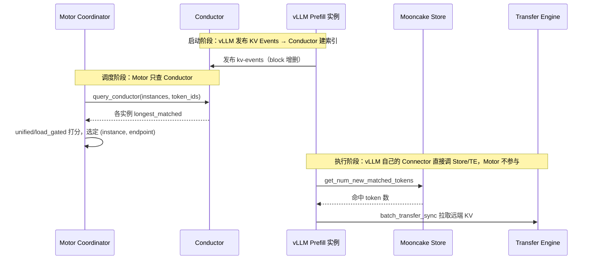

# KV Cache 亲和调度与池化
> 覆盖 15 个知识点 | 来源 11 个文件 | 更新于 2026-07-15

## 1. 一句话总结
KV Cache 亲和调度解决"请求该去哪台 Prefill 节点以复用已有缓存前缀"的**调度面**问题，KV 池化解决"KV 数据如何跨节点分级存放和传输"的**数据面**问题。两者通过"乘法命中率"协同：亲和把请求路由到持有最长前缀的节点（抬高路由命中率 \(P_{route}\)），池化用分级存储 + 水位驱逐保证缓存在集群内真实可达且不被过早驱逐（抬高容量命中率 \(P_{pool}\)），联合后有效命中率从约 0.10 提升至 0.88，在长上下文 + 高复用场景下可实现 TTFT −70%+、E2E −50% 的收益。

## 2. 核心原理
### 2.1 问题背景
在 PD 分离 + 多 Prefill 副本场景下：
- **随机路由**导致每次 Prefill 都重新计算，浪费 GPU 算力，缓存命中率随实例数线性稀释（N 实例约 1/N 命中率）
- **前缀缓存碎片化**：同一 system prompt / tools 定义被路由到不同 Prefill 节点，每个节点都要重复 prefill 相同前缀
- **单卡 HBM 容量天花板**：vLLM 虽然支持 `enable-prefix-caching`，但缓存只活在单实例本地 HBM 内，容量超限后热点前缀被 LRU 驱逐，复用率上不去
- **P→D 点对点直连**带来时序与显存耦合，D 必须实时等待 P 传输，P 显存被 KV 占住无法释放

### 2.2 方案概述
**调度面（亲和）**：通过 Mooncake Conductor（全局 KV 前缀索引）让 Coordinator 在每次 Prefill 决策前查询各实例的最长前缀命中长度，将请求路由到已缓存最长相同 token 前缀的节点，减少重复 prefill，降低 TTFT。

**数据面（池化）**：Mooncake Master 将 KV Cache 从单卡 HBM 抽象为跨节点、可分级溢出（HBM → DRAM → SSD）、可驱逐、有租约的共享存储池，MultiConnector 组合 Layerwise 直传（低延迟）与 Store 持久化（解耦、共享）。

**联合关系**：亲和负责"路由到哪"，池化负责"在那能取到"。端到端有效命中率 \(h = h_{reuse} \times P_{route} \times P_{pool}\)——两者为乘法关系，任一为 0 则整体坍塌，必须配合使用。

## 3. 实现细节
### 3.1 KV 亲和调度核心流程
**三步核心逻辑**（对应 `kv_cache_affinity.py` 静态方法）：

1. **Tokenize 前置**：Coordinator 侧 `TokenizerManager`（HF 单例）用与引擎一致的 `apply_chat_template(messages, tools, add_generation_prompt=True)` 将请求转为 token IDs，确保与 vLLM/SGLang 实际推理完全一致（tools 必须透传，否则 token 序列分叉导致命中长度虚高）
2. **查询 Conductor**：`ConductorApiClient.query_conductor()` 以 `POST /query`（0.2s 超时）携带 `{model, block_size, token_ids}`，返回各实例的 `longest_matched` 与 `DP[dp_rank]`
3. **两级选点 → 双模式打分**：先按 `longest_matched` 取最大实例，再在实例内按 `DP[dp_rank]` 选最优端点；通过 `unified`（亲和-负载融合加权）或 `load_gated`（先筛低负载再比前缀）模式排序返回 top-k 候选

**与 Conductor 的完整交互链路**：


### 3.2 双模式评分算法（PR #210 核心创新）
#### Unified 模式（推荐，生产默认）
软融合评分，**分数越低越好**：

$$
\text{score} = \text{prefill\_load\_scale} \times \max(0, \text{isl} - \text{overlap\_credit} \times \text{matched\_tokens}) + \text{load\_weight} \times \text{workload\_score}
$$

- 所有量纲统一为 token 数（预计算负载 + 排队负载）
- `load_weight=0` 退化为纯最长前缀亲和（类 v1）
- `overlap_credit=0` 退化为纯负载均衡
- 关键性质：**没有缓存命中但负载极轻的空闲端点也可能胜出**，避免所有同前缀请求灌进一个热点实例

#### Load-Gated 模式（严控负载长尾）
两阶段硬约束：
- **Stage 1（负载门）**：保留 `load_gate_topn`（默认 2）个最轻端点
- **Stage 2（亲和排）**：只在门内按最长前缀命中排序（平局取更轻负载）
- 亲和永远不能把请求拉到"最闲集合"之外，适合负载敏感场景

| 维度 | Unified | Load-Gated |
|------|---------|------------|
| 决策形式 | 软权衡（加权和） | 硬约束（先筛后选） |
| 亲和能否压过负载 | 能（取决于权重） | 不能（只在最闲 Top-N 内比） |
| 调参 | `load_weight`/`overlap_credit`/`prefill_load_scale` | `load_gate_topn` |

### 3.3 Worker 提案 + Scheduler 权威仲裁（防 Herding）
**演进三版**（PR #210 → #304），解决多 Worker 并发 burst 时落点一致性问题：

1. **初版（已废弃）**：Worker 本地 in-flight overlay（本地叠加"即将分配的负载"），仅在单 Worker 内缓解 burst，跨 Worker 无效，TTL 难调
2. **PR #210**：Worker 上报 top-k（k=3）亲和候选 + Scheduler 在慢路径按权威 workload ledger 重选最低负载者——权威、跨进程、候选集本身是亲和前 k 名不破坏亲和
3. **PR #304**：Unified 模式升级为**全局重排**——Worker 把**每个 endpoint** 的 `prefill_cost`（亲和折扣后待算量）全量上报，Scheduler 用自己账本里的新鲜负载重算完整分数、全局取 min。妙处：Scheduler 不需要 prompt/tokenizer/Conductor，只做 O(endpoints) 线性扫描

分工精髓：**亲和的数学 worker 已算完（prefill_cost 不随时间变），负载的新鲜值由 Scheduler 补上**。

### 3.4 KV 池化实现：MultiConnector 三通道组合
池化用两条通道分别满足"实时性"与"解耦性"，由 `MultiConnector` 组合：

```json
"kv_connector": "MultiConnector",
"kv_connector_extra_config": {
  "use_layerwise": true,
  "connectors": [
    { "kv_connector": "MooncakeLayerwiseConnector" },  // [0] 快路径：逐层直传，压 TTFT
    { "kv_connector": "AscendStoreConnector" }          // [1] 持久化：Master 池化，跨节点共享
  ]
}
```

| 通道 | Connector | 优点 | 代价 |
|------|-----------|------|------|
| 快路径 | `MooncakeLayerwiseConnector` | 逐层流水 → 首 token 等待短；不经 Master | 需 P/D 同时在线，强耦合 |
| 持久层 | `AscendStoreConnector` | P 写完即走、跨节点共享、可溢出到 DRAM/SSD | 多一跳存储 RTT |

### 3.5 池化的驱逐与租约机制
`mooncake_master` 启动参数（由 `kv_cache_pool_config` 生成）：

| 参数 | 默认值 | 作用 |
|------|--------|------|
| `eviction_high_watermark_ratio` | 0.9 | 池使用率 ≥ 90% 触发驱逐 |
| `eviction_ratio` | 0.1 | 单次批量驱逐池容量的 10%（批量而非逐条，摊薄开销） |
| `default_kv_lease_ttl` | 11000ms | 租约：KV 写入后在 TTL 内不被驱逐，保证 D 一定读得到（必须大于 vLLM 实例的连接/传输超时） |

驱逐后占用从 0.9C 降到约 0.8C，留缓冲；租约是驱逐与正确性的安全边界——水位驱逐是容量回收，租约是正确性下限。

### 3.6 联合交汇点：prefill_cost 公式
亲和与池化看似管两件事，最终都落在同一量上——该请求还需真正计算多少 token 的 prefill：

$$
\text{prefill\_cost} = \max(0,\ \text{isl} - \underbrace{\text{overlap\_credit}}_{\text{池化兑现}} \times \underbrace{\text{matched\_tokens}}_{\text{亲和提供}})
$$

- `matched_tokens` 来自亲和（Conductor 索引）：路由到正确实例才不为 0
- `overlap_credit` 靠池化兑现：命中部分的 KV 必须真实驻留且可被 `AscendStoreConnector` 高速搬回，才保持 ≈1
- `overlap_credit × matched_tokens` 是乘法，缺一即坍塌（只开池化的收益≈0，因为随机路由让请求落到查不到该前缀的实例）

### 3.7 工程优化与容错
#### 三条降级链路
所有关键组件挂掉都不阻塞请求：
```text
KV 亲和（Conductor 超时/无数据/tokenize 失败）→ LoadBalance（全局最小负载选择 + endpoint_instance_score 整机压力感知）→ Round Robin（轮询兜底）
```
- Conductor 查询超时 0.2s 快速失败
- Tokenize 失败返回 `[]`，fail-closed 回退（宁可放弃亲和也不误导 Conductor）
- `load_balance` **不是轮询**：所有 endpoint 按 workload 分取最小，平局旋转起点防同分 herding；同样受 Scheduler 仲裁

#### 子块快速路径（Fast Path）
当 `len(token_ids) < block_size`（Conductor 只索引整块，子块 prompt 不可能命中）时，跳过 HTTP 查询，直接返回 `matched=0`——省 ~200ms 网络往返，行为完全等价。

#### 防御性工程（多个 PR 的 bugfix 沉淀）
- **上下文长度预校验**（PR #349）：tokenize 前置后，调度层已知真实 token 数，直接在入口拒绝超过 `max_model_len` 的请求
- **P 负载及时释放**（PR #368/#393）：PD 分离下 prefill 完成即释放 P 实例负载（不等整个请求结束），提升后续请求 TTFT
- **热路径优化**（PR #394）：UPDATE_WORKLOAD 去重改有界 FIFO；ALLOCATE 负载用裸 float 传输省 pydantic 序列化
- **账本绝对/增量 bug 修复**：修复把增量当绝对负载写 SHM 的账本污染问题（导致 endpoint 负载飙升、不再被调度选中）
- **cached_tokens 透传**：P 阶段 `usage.prompt_tokens_details.cached_tokens` 透传合并到最终响应，客户可直接观测亲和命中效果

### 3.8 性能收益与适用边界
#### 代表性测算（以 Qwen3-32B、TP4、8K 输入、6.5K 共享前缀为例）
| 指标 | 基线（h≈0.10） | 亲和+池化（h≈0.78） | 降幅 |
|------|-----------------|--------------------|------|
| TTFT | ≈ 1187 ms | ≈ 351 ms | **−70.5%** |
| E2E（OSL≈16） | ≈ 1712 ms | ≈ 876 ms | **−48.9%** |

> **重要说明**：这是代表性测算（估算模型，非实测）。收益 = TTFT 降幅 × prefill 占比 \(r\)，只有「长输入 + 短输出 + 高前缀复用」才能让 r 足够大，长输出会被 decode 段稀释。面试时用此测算解释收益量级来源和适用前提，不能声称是客户实测。

#### 收益归因（哪部分归亲和、哪部分归池化）
| 收益来源 | 主要归属 | 机理 |
|----------|---------|------|
| 从随机路由到精确路由命中（\(P_{route}: 0.25 \to 1.0\)） | **亲和** | Conductor 全局索引 → 路由到持最长前缀实例 |
| 命中上限与持久性（\(P_{pool} \to 1.0\)） | **池化** | 分级溢出 + 水位驱逐 + 租约 |
| 命中部分由搬运替代重算（overlap_credit≈1） | **池化** | AscendStoreConnector 高速搬 KV |
| 压低固定开销 \(c_0\) | **池化** | P→D Layerwise 直传 |
| 防羊群、保证满载不回退 | **亲和** | Unified 打分 + Scheduler 权威重选 |

## 4. 框架对比

### 4.1 llm-d — KV 亲和与传输设计
llm-d 定位为 K8s 原生推理平台，通过 Envoy Gateway 与可插拔的 Endpoint Picker（EPP）实现调度，后端可对接 vLLM/SGLang 等模型服务器。其 KV 亲和架构围绕三层策略展开：近似匹配（approximate）、精确匹配（precise）以及基于粘滞过滤的会话绑定。在近似模式下，系统通过字符或 token 比例估算前缀命中，并在 EPP 本地维护 LRU 缓存，路由后通过后续请求“学习”缓存分布，适用于 `optimized-baseline` 与 `tiered-prefix-cache` 指南场景。精确模式则依赖 vLLM 的 `/v1/*/render` 端点进行 tokenize，并通过 ZMQ 事件（`BlockStored`、`BlockRemoved`、`AllBlocksCleared`）驱动全局 KV Indexer，实现最长连续前缀链打分，断链后后续 token 无效；tier 权重默认为 GPU 1.0、CPU 0.8，且支持 speculativeIndexing，在路由后写入短 TTL（约 2s）的预测条目以填补事件空窗。此外还有 sticky filter 策略，当 match 率大于 0.8 时收窄候选，结合 Explore 机制和 TTFT 逃逸来平衡精确性。

调度流水线由 ProfileHandler（支持单池或 P/D 双 profile）、Filters（affinity-filter、PD label 等）与 Scorers 加权组合构成，最终由 Picker 选择最高分实例。推荐的精确路由权重为：prefix-cache-scorer 3.0、kv-cache-utilization-scorer 2.0、queue-scorer 2.0、no-hit-lru-scorer 2.0。在传输与卸载方面，llm-d 本身不实现统一池化层，而是通过 guide 组合各引擎的卸载能力：Native offloading 通过 `--kv-offloading-backend native` 及 `TieringOffloadingSpec` 配置 HBM→CPU→文件系统的层级；LMCache 通过 `LMCACHE_MAX_LOCAL_CPU_SIZE` 等环境变量设置 L2 容量；Mooncake Store 则提供嵌入式或独立 DRAM 与 SSD 存储。近似模式下的 tier 路由使用双 `approx-prefix-cache-producer`（GPU + CPU），分别搭配 scorer，手动设置 CPU LRU 容量，但文档指出 autoTune 仅统计 GPU blocks，在 offload tier 场景存在已知缺陷。精确路由与 LMCache/Mooncake 的端到端组合 recipe 仍缺少 validated 方案，反映了其在统一池化索引方面的不足。

### 4.2 NVIDIA Dynamo — KV Router 与 KV Block Manager
Dynamo 面向分布式生成式推理，提供 Frontend、KV Router、KV Block Manager (KVBM)、NIXL 传输库以及 Planner 的全栈运行时。其核心亲和机制基于代价函数路由，实现在 `lib/kv-router/src/scheduling/selector.rs`。该函数计算 `raw_prefill_blocks = (active_prefill_tokens + uncached_tokens) / block_size`，再减去重叠信用块 `overlap_credit_blocks`，该信用块由 `overlap_score_credit` 乘以退化系数与设备重叠量决定，并加入不同介质命中权重与重叠量的乘积：host_cache_hit_weight × host_overlap、disk_cache_hit_weight × disk_overlap、shared_cache_multiplier × shared_beyond_device，最终 `cost = prefill_load_scale × adjusted_prefill + decode_blocks`，选择最低 cost 的 worker。分层权重通过 CLI 直接映射到存储层级：`--router-kv-overlap-score-credit`（设备 L1，默认 1.0）、`--router-host-cache-hit-weight`（L2，默认 0.75）、`--router-disk-cache-hit-weight`（L3，默认 0.25），并可通过 `--shared-cache-type hicache` 加上 `--shared-cache-multiplier` 纳入全局共享 L3 的贡献。

KVBM 实现了统一的四级内存池：G1 Device、G2 Host、G3 Disk、G4 Remote，通过环境变量 `DYN_KVBM_CPU_CACHE_GB` 和 `DYN_KVBM_DISK_CACHE_GB` 配置容量。vLLM 连接器使用 `DynamoConnector` 并指定 `kv_role` 为 `kv_both`，在 disagg 场景常用 `PdConnector` 组合 KVBM 与 NixlConnector，实现 P/D 分离下的 KV 传输。主索引器维护 Radix 树的 Device 层命中，并沿 parent 链 walk 对 Host 和 Disk 层进行 lower-tier 索引（`indexer/lower_tier_indexers.rs`），事件携带 `storage_tier` 和 `medium` 字段，路由器据此更新各层状态。近似降级通过 `--no-router-kv-events` 启用，采用基于路由决策的预测缓存和 TTL（`--router-ttl-secs` 默认 120 秒）退化为 approximate 模式。

在 disagg 架构中，Prefill 阶段亲和度最高，使用完整 overlap 评分；Decode 阶段则设 `overlap_score_credit=0`，`assume_kv_reuse=false`，`track_prefill_tokens=false`。此外还支持 session affinity（`X-Dynamo-Session-ID`）、拓扑感知传输（`DYN_KV_TRANSFER_*`）以及 direct 模式（外部 EPP 指定 worker ID）。Dynamo 与 LMCache 的集成仅限于引擎侧复用，Router 未完整支持全部 LMCache events，可能导致 KV-aware 路由次优；而 Mooncake HiCache 作为共享 L3 时，使用 `/batch_query_keys` 查询 master 并计算共享块贡献。

### 4.3 AIBrix — Gateway 亲和与 L1-L3 池化
AIBrix 是字节跳动开源的 LLM 推理控制面，其设计将 KV 亲和与传输解耦：亲和策略在 Envoy Gateway 层以 Go 插件形式实现，而池化在引擎内部通过 Python 的 `aibrix_kvcache` 框架完成，两者通过 KVCache CRD 编排基础设施。Gateway 侧提供多种路由策略，核心为 `prefix-cache` 算法（`pkg/plugins/gateway/algorithms/prefix_cache.go`），流程包括 tokenize（支持 character、tiktoken 或远程 tokenizer）、block 滚动哈希、负载失衡检测（max_running − min_running > IMBALANCE_ABS 时回退到 least-request）、按匹配前缀比例降序和运行请求数升序选择实例，并要求运行数不超过 mean + load_factor × σ。路由后通过 PostRouteUpdate 将推测性前缀写入本地索引器，以改善后续请求命中率。关键环境变量包括 `AIBRIX_PREFIX_CACHE_BLOCK_SIZE`（默认 128/16）、`AIBRIX_PREFIX_CACHE_POD_RUNNING_REQUEST_IMBALANCE_ABS_COUNT`（默认 8）等。索引精度有三种模式：仅基于本地路由历史的 PrefixHashTable（近似）、通过 Redis StateSync 在多 Gateway 副本间同步的近似全局视图，以及通过 ZMQ 接收引擎 `BlockStored/BlockRemoved` 事件的 KV Event Sync 精确模式（需启用 `AIBRIX_PREFIX_CACHE_KV_EVENT_SYNC_ENABLED` 并使用远程 tokenizer）。

池化框架 `aibrix_kvcache` 将存储分为三层：GPU 引擎内置缓存（对应引擎自身 L1），进程内 DRAM 缓存称为 L1（对应整体架构的 L2），分布式存储称为 L2（对应 L3）。进程内 DRAM 通过 `l1/l1_cache.py` 实现，支持 S3FIFO 和 LRU 淘汰策略，默认容量 10GB，不跨 Pod 共享；分布式 L2 支持 InfiniStore、HPKV、PrisKV、SHFS 等多种后端，通过 `cache_manager.py` 统一管理。读取时若 L1 命中则直接返回；若 miss 且数据大小低于 DOUBLE_GET 阈值则不查询 L2 以规避小请求的远程开销；否则从 L2 拉取并 promote 到 L1。L1→L2 的写入策略有 HOT（默认）、ALL 和 EVICTED 三种。为支持张量并行，`GroupAwareKVCacheManager` 通过 allreduce(MIN) 对齐各 rank 的命中块数。Connector 方面提供 `AIBrixOffloadingConnectorType1/2` 和 `AIBrixPDReuseConnector`，分别用于标准卸载和 PD 分离时的跨请求复用。整体架构强调 Gateway 的 block hash 与 L2 key builder 的独立性：即便 L2 能跨 Pod 拉取 KV 块，路由到已有 GPU 前缀的 Pod 仍是最优路径。AIBrix 还将 LMCache 作为回归对照而非内置后端，突显其自研池化方案的独立性。

### 4.4 SGLang — HiCache 与 cache_aware 路由
SGLang 的池化层由引擎内置的 HiCache 提供，是业界最完整的 L1/L2/L3 一等公民实现之一，设计文档见 `sglang/docs/advanced_features/hicache_design.md`，核心实现在 `hiradix_cache.py`。L1 为 GPU HBM 中的 token 到 KV 池，支持 MHA/MLA 结构；L2 为 Host DRAM，通过 `hicache_ratio` 或 `hicache_size` 配置容量，由 `memory_pool_host.py` 管理；L3 为可插拔存储，通过 `HiCacheStorage` 抽象接口支持 Mooncake Store、3FS 等后端。工作流中，查询先在本地树中匹配出连续的 L1 段和 L2 段（无数据拷贝），若连续命中长度达到阈值（默认 256 token），则触发从 L3 到 L2 的 prefetch，策略可选 `best_effort`、`wait_complete` 或 `timeout`。写回策略支持 `write_through`、`write_through_selective` 和 `write_back`，且 L2→L3 仅写入远端尚缺的数据块以减少传输。控制器 `HiCacheController` 协调各层操作。Mooncake 作为 L3 时，通过 `MooncakeHostMemAllocator` 管理 L2 内存，开启 `enable_ssd_offload` 后可利用 Store 的 SSD 层，PD 与 HiCache 共享 TransferEngine。KV 事件定义在 `disaggregation/kv_events.py` 中，媒介包括 GPU、CPU_PINNED、DISK、EXTERNAL，可供外部 Conductor 或 Dynamo 消费。

亲和路由方面，SGLang Model Gateway 默认采用 `cache_aware` 策略，实现于 `sgl-model-gateway/src/policies/cache_aware.rs`，这是一种无通信的近似前缀匹配：当负载不平衡时回退到最短队列；否则对原始文本进行字符匹配（未 tokenize），若 match_rate 超过阈值则路由到命中 worker，否则选择最小负载实例，并将路由信息插入本地 radix 树。此树按 `pool::model` 隔离 prefill 和 decode，可选 mesh 拓扑，但 receive 侧未完全接线。vLLM Router 也 fork 了类似逻辑，更多强调 consistent_hash 与 P/D 结合。这种设计的张力在于：HiCache 提供精确的 token 级 radix 匹配和透明的跨层 prefetch，但 cache_aware 路由仅依靠历史路由猜测 L1 命中，对 L2/L3 的全局分布一无所知，导致多实例共享 L3 时路由目标与 L3 命中完全脱钩。因此，当启用 L3 共享池时，官方建议升级到基于 KV 事件的 precise 路由（如 Conductor/Dynamo 方案），或接受“L3 兜底、路由仅优化本地 L1 近似推断”的折衷。

### 4.5 vLLM — APC 与 Mooncake Connector
vLLM 原生提供 L1 自动前缀缓存（APC），通过链式哈希 `block_hash_i = H(parent_{i-1}, token_ids_block_i, extra_keys)` 在 `vllm/v1/core/kv_cache_utils.py` 中实现，仅作用于本机 GPU 块池，跨实例缓存共享依赖外部亲和路由。其进程内三级存储由 `OffloadingConnector` 管理（`vllm/v1/kv_offload/tiering/manager.py`），L1 为 GPU block pool，L2 为主要 CPU 层 `CPUPrimaryTierOffloadingManager`，L3 为二级层，支持文件系统、对象存储或 P2P 传输的 `SecondaryTierFactory`；GPU 驱逐时会 cascade 至 secondary，但 promotion 必须经过 CPU 网关，不允许直接加载到 GPU。

分布式 L3 连接器通过工厂模式（`factory.py`）提供多种选择：`MooncakeStoreConnector` 实现基于 hash 去重的共享 KV 池，利用 Mooncake Store 作为全局缓存；`MooncakeConnector` 用于 P/D 分离的点对点传输；`LMCacheConnectorV1` 对接外置 LMCache Controller；`MultiConnector` 组合多个连接器（如 PD + Store）；`NixlConnector` 利用 NIXL 进行跨节点传输。Mooncake 自身提供 Store（共享 L3）和 Transfer Engine（RDMA/TCP/NVMe-oF 等），内部 RAM 与 SSD 间通过 `offload_on_evict` 和 `promotion_on_hit` 策略流转。Mooncake Conductor 维护精确的跨 tier 前缀索引，通过 `/query` 接口返回每个实例/DP 在 GPU、CPU、DISK 层的 `longest_matched` 信息。

MindIE-PyMotor（路径 `MindIE-PyMotor/motor/coordinator/scheduler/policy/kv_cache_affinity.py`）作为调度消费者实现了精确前缀缓存感知：它向 Conductor 发送 POST `/query` 获取每个实例的最长前缀长度，结合负载进行统一（unified）或负载门控（load_gated）决策，并由 Scheduler 权威账本防止 herding。该组件不维护本地 radix 树，真值完全依赖 Conductor，短于 1 block 的请求走 fast path，并支持按 GPU/CPU/DISK 分项扣减搬运成本。vLLM 官方 Router fork 自 SGLang Gateway，其 cache_aware 策略仍为 approximate 模式，不涉及三级池化，更侧重 session affinity 的 consistent_hash 和 P/D 编排。整体上，vLLM 坚守 L1 和可插拔卸载连接器的边界，而 Mooncake 提供共享 L3、TE 和 Conductor 全局索引，Motor 则作为精确调度与亲和查询的样板实现。

### 4.6 六框架总览对比表

| 维度 | MindIE | llm-d | Dynamo | AIBrix | SGLang | vLLM |
|------|--------|-------|--------|--------|--------|-------|
| 缓存粒度 | 实例级最长前缀长度（GPU/CPU/DISK分层） | 实例级（prefix-cache-scorer 按最长连续前缀链打分，支持 GPU/CPU tier 权重） | 实例级代价函数（基于 block 级 overlap 和卸载 tier 权重） | 实例级前缀哈希表（block 级滚动 hash），可选精确 KV events | 引擎内 token 级 radix（HiCache）；路由侧为字符级近似树 | L1 为 block 链式哈希；卸载为 block 级 tiering |
| 跨实例支持 | Conductor 全局索引，通过 /query 获取各 DP 命中 | EPP Indexer 全局索引（ZMQ 事件）或近似本地 LRU | 主 Radix + 下层索引器，跨所有 worker | Gateway 本地表/Redis 同步/KV Event Sync 三种模式 | 路由树每 worker 独立，无跨实例同步 | L1 仅本机；L3 通过 Mooncake Store 或 LMCache 共享 |
| 匹配方式 | 向 Conductor POST 查询精确 token 化最长前缀 | Approximate: 字符/token 比例+LRU；Precise: render tokenize+ZMQ 事件 | 精确事件驱动（storage_tier），可降级为 TTL 近似预测 | 字符/远程 tokenizer + block hash；精确模式通过 KV Event Sync | 路由：字符匹配；HiCache：token 级 radix 匹配 | APC: 链式 block hash；无全局路由匹配，依赖外部 |
| 负载权衡 | 统一融合或 load_gated：先按负载筛低载实例再按亲和度评分 | 加权打分（prefix-cache 3.0、kv-util 2.0、queue 2.0等），最终 max-score | 仅通过代价函数排序选择最低 cost，无显式 load 项 | 负载失衡阈值回退 least-request，否则按 match% DESC + running ASC 选 | 负载不平衡时回退最短队列，否则按 match_rate 选 | 无内置亲和+负载联合；分离调度器（如 Motor）决策 |
| 池化机制 | 依赖 Conductor 索引各 tier，Motor 不管理数据 | 不实现统一池化；通过 guide 组合 Native tiering、LMCache、Mooncake | KVBM 统一 G1 Device/G2 Host/G3 Disk/G4 Remote 四级池 | 引擎内 L1 DRAM（S3FIFO/LRU）+ L2 分布式 InfiniStore/HPKV 等，CRD 编排 | HiCache L1 GPU + L2 Host + L3 可插拔存储，自动 prefetch/write-back | 进程内 CPU tiering + Secondary 卸载；分布式 L3 通过 Mooncake/LMCache Connector |
| 降级策略 | 短请求 fast path；无 Conductor 时无法精确路由 | approximate 模式：固定 block + rolling hash，无真实驱逐信息 | --no-router-kv-events 近似预测，默认 TTL 120s | 负载失衡 → least-request；无事件时用本地表或 Redis | cache_aware 无事件，仅凭历史路由树猜测 | 无路由降级；卸载层可退化至仅 GPU 缓存 |
| 核心创新 | 直接查询分布式精确索引，权威账本防 herding | 可插拔 EPP 打分框架 + speculative indexing 填补事件空窗 | 代价函数统一层权重与 overlap，统一 KVBM 四级传输 | Gateway 亲和与自研 L1/L2 卸载完全解耦，CRD 管理 L2 集群 | 引擎内完整三级池化与路由脱钩，提供极致本地缓存性能 | L1 APC + 可插拔 Connector 生态，与 Mooncake TE 深度集成 |


---

## 5. KV 缓存利用率与假命中

| 框架 | 利用率 | Removed | Cleared | Speculative | 风险 |
|------|--------|---------|---------|-------------|------|
| llm-d | ✅ 软加权 | ✅ | ✅ | ✅ ~2s | 低 |
| Dynamo | ✅ 硬门控 | ✅ | ✅ | ✅ | 低 |
| AIBrix sync | △ | ✅ | ❌ | ❌ | 中 |
| SGLang/vLLM | ❌ | ❌ | ❌ | ❌ | 高 |
| Motor | ❌ | 经Conductor | 经Conductor | ❌ | 中 |

---


## 5. 面试要点
### 5.1 常见追问
#### Q: 为什么 tokenize 要放在调度层？字符级近似不够吗？
- chat template、tools 注入会让字符前缀与真实 token 前缀分叉（字符相同 ≠ token 相同）
- 引擎 prefix cache 以 block（16/128 token）为粒度哈希，字符数无法对齐 block 边界，无法精确估算可复用 block 数
- Motor 用与引擎同源 tokenizer + `apply_chat_template(+tools)`，产出的 token 序列与 vLLM 实际 prefill 逐字节一致，查询 Conductor 返回的命中长度才真实反映集群 KV 分布
- 额外收益：一次 tokenize 三处复用（查 Conductor、算亲和分、按真实 token 数记负载账），还顺手解锁了入口长度预校验

#### Q: 亲和和负载均衡怎么叠加？为什么不能只看最长前缀？
- 只看最长前缀 → 热前缀 herding（所有同前缀请求全灌进一台实例，排队打爆，缓存收益被排队时延吃掉）
- Unified 模式是**软融合**：`score = prefill_cost + load_weight × 实时负载`，所有量纲统一为 token 数，空载但无缓存的实例可以赢过热载有缓存的实例
- Load_gated 模式是**硬约束**：先把最闲 N 台筛出来，亲和永远不出这个集合，适合严控长尾的场景
- 再加一层**防 herding 保险**：多 worker 并发 burst 时，worker 上报候选集 + Scheduler 用权威新鲜账本全局重排，避免所有 worker 算出同一个"最优 endpoint"

#### Q: 多个调度进程并发，同前缀请求会不会都打到同一个实例？
- 这是"羊群效应"问题，我们迭代了三版。初版 worker 本地 in-flight overlay（只对单进程有效、TTL 难调、跨 worker 同步失败），已在 PR #210 中整体移除
- V2（PR #210）：worker 报 top-3 候选，Scheduler 用权威账本在候选集内重选最低负载者
- V3（PR #304，当前 unified 模式最终形态）：worker 把**每个 endpoint** 的亲和折扣 prefill_cost 全量上报，Scheduler 用自己的新鲜负载算完整 unified 分、取全局 min——Scheduler 不需要 tokenizer/Conductor，一次 O(endpoints) 线性扫描即可。亲和数学 worker 算完、负载新鲜值 Scheduler 补、平局取更好亲和

#### Q: Conductor 挂了或慢了怎么办？
- 查询超时 0.2s 快速失败 → 整条亲和路径返回 None → 自动回退到 LoadBalance → 再失败则 Round Robin 兜底（三级降级瀑布）
- Conductor 是增强路径，不是硬依赖，可用性不受影响
- Conductor 重启后有：① `/services` 对账重注册补状态；② kv-events `replay_endpoint` 重放机制快速重建索引
- Tokenize 失败同理 fail-closed（返回 `[]` 回退 LoadBalance），宁可放弃亲和也不拿半对 token 序列误导 Conductor

#### Q: 为什么只开 KV 池化但不开亲和，收益几乎为零？
- 池子里有这份 KV，但随机路由把请求送到一个本地索引查不到该前缀的实例 → 仍然全量 prefill
- 有效命中率是乘法：\(h = h_{reuse} \times P_{route} \times P_{pool}\)。只开池化让 \(P_{pool} \to 1\)，但 \(P_{route} \approx 1/N\)，整体 h 仍被路由因子拉低
- 亲和提供的全局路由（Conductor）才把"池里有"变成"路由得到、查得到"

#### Q: 亲和粒度是实例级还是更细？
- **DP rank 级**。vLLM DP 部署下每个 DP rank 有独立 KV cache 池，注册时每个 endpoint（DP rank）按 `基础端口 + endpoint.id` 单独注册 kv-events ZMQ 端口；Conductor 返回 `{instance: {"DP": {rank: matched}}}`，打分和最终落点都精确到 (instance, endpoint)

#### Q: 怎么验证特性是否生效？
- 响应 `usage.prompt_tokens_details.cached_tokens` 透传（PR #304），直接可观测
- Scheduler 权威分配日志带 matched/load/score/repicked，可验证是否因亲和造成负载倾斜
- 正确 A/B：Baseline 设为 `load_balance`（两组都开 Prefix Cache），Experiment 设为 `kv_cache_affinity`，比较 TTFT 分位数和 endpoint 负载分布
- 不能用"关闭 Prefix Cache vs 同时开启 Prefix Cache 和亲和"来宣称亲和收益，否则测到的是两层叠加而非纯亲和的增量

#### Q: 你们和 vLLM 最新 Render 方案是什么关系？
- 同一哲学、不同落地。vLLM 最新 Render 把 chat template + tokenize + 校验产品化成独立可部署的 CPU 服务（`/v1/*/render`，`vllm launch render`），llm-d Precise 用它拿精确 token 再查 ZMQ 索引
- Motor 更早用 Coordinator 内 TokenizerManager 做等价事（同源 model_path + apply_chat_template），并在 PR #235/#349 向官方 Render 主线对齐
- Render 解决的是"token 从哪来要一致"；Motor 的调度层还要解决"查谁、怎么和负载叠加、多进程如何不 herding"——这些是 Render 本身不提供、调度系统要补的
- 下一步演进方向：把 TokenizerManager 抽象为 `TokenProducer` 接口，可选接 vLLM Render 后端，消除模型专属语义覆盖不全的风险（Harmony/Mistral 特化格式、多模态等）

### 5.2 口述话术
**项目面试 30 秒版**：
> 我们在 PD 分离多实例部署下，把请求 tokenize 成与引擎一致的 token ids（含 chat template + tools），查 Mooncake Conductor 全局前缀索引，拿每个 DP rank 的缓存命中长度，再用 unified（亲和-负载加权融合）或 load_gated（负载硬门控内选最长前缀）打分选 prefill 落点。并发防 herding 靠 worker 提案 + Scheduler 权威账本全局重排。整体分两层：亲和管路由（调度面），Mooncake 池化（MultiConnector: Layerwise 直传 + Store 分级存储）管数据面——两者乘法关系，长输入短输出高复用场景可测算约七成 TTFT 降幅。

**若被追问 Mooncake 底层**（约 45 秒）：
> Mooncake 是 Kimi 的推理平台、FAST'25 最佳论文，核心是以 KV cache 为中心组织集群。它不是单体：Transfer Engine 是零拷贝传输地基，抽象 RDMA/TCP/NVMe-oF/Ascend 后端并做拓扑感知选路；Mooncake Store 把集群闲置 DRAM/SSD 组成分布式 KV 池，Master 管元数据和高水位驱逐、数据面点对点直传；Conductor 是 KV 前缀索引器，订阅各引擎 ZMQ kv-events 维护 PrefixCacheTable，暴露 HTTP `/register`、`/query`。我们 Motor 只用 Conductor 的索引查询，真正的 KV 传输是 vLLM 实例自己的 Connector（MooncakeLayerwise / AscendStore）在调 Store 和 Transfer Engine，Motor 不碰数据面。

## 6. 延伸阅读
### 6.1 相关主题
- **概念分层**：路由策略分类（approximate vs precise）、三级池化统一语义（L1 GPU / L2 CPU / L3 Disk/Remote）、Indexer 与 KV Events 详解
- **竞品深挖**：SGLang HiCache 三级实现、Dynamo KVBM G1–G4 + NIXL、AIBrix prefix-cache 与自研 offload、llm-d EPP 插件化打分框架
- **工程演进**：PR #210 top-k 候选 + Scheduler 重选（移除 in-flight overlay）、PR #304 全局重排、PR #394 账本热路径优化
- **昇腾生态**：Mooncake TE Ascend 后端（HCCL TransportMem / Direct / 异构 RDMA），数据面与元数据面解耦
- **Render 对齐**：vLLM token-in/token-out 协议、Render/Derender 分离式 Serving，Motor 接入方向

### 6.2 源文件
| 文件路径 | 标题 | 类型 |
|---------|------|------|
| wiki/repos/mindie-pymotor/kv-affinity.md | KV Cache 亲和调度 | 核心机制 + 设计选型 |
| wiki/repos/mindie-pymotor/kv-pool.md | KV 池化：意义与实现细节 | 数据面 + Connector 详解 |
| wiki/repos/mindie-pymotor/kv-pool-and-affinity.md | KV 池化 × KV 亲和 联合调度 | 协同机制 + 收益模型 |
| wiki/raw/articles/pymotor/kv_cache_affinity_deep_analysis.md | KV Cache Affinity 模块深度技术分析 | 架构源码 + E2E 测试 |
| wiki/raw/articles/pymotor/kv_cache_affinity_report.md | 技术介绍与竞品分析报告 | 竞品对比 |
| wiki/raw/articles/pymotor/kv_cache_affinity_summary_interview.md | 面试速览：全景技术总结 | 面试 Q&A 24 题 |
| wiki/raw/articles/pymotor/pr210_kv_affinity_topk_candidates_deep_analysis.md | PR #210 深度分析 | top-k 演进 + Scheduler 重选 |
| interview/interview-review/04-KV亲和调度与Mooncake专题.md | KV 亲和调度与 Mooncake 架构 | 专题综述 |
| interview/interview-review/12-PyMotor-KV亲和性调度特性全解与简历素材.md | PyMotor KV 亲和性特性全解 | 源码 + PR 演进 + 简历素材 |
| interview/interview-review/15-vLLM-Router与SGLang-KV亲和性设计调研.md | vLLM/SGLang Router 设计调研 | 竞品源码分析 |
| interview/kv knowledge/00-概念与分层模型.md | 概念与分层模型 | 基础概念词典 |
| interview/kv knowledge/01-框架对比总表.md | 框架对比总表 | 全景矩阵 |
| interview/kv knowledge/06-vLLM-Mooncake-Motor.md | vLLM / Mooncake / Motor | 三框架各自角色 |
| interview/kv knowledge/11-KV缓存利用率与假命中.md | KV cache utilization 与假命中 | 驱逐/空窗对策 |
| interview/kv knowledge/10-昇腾HCCL与KV传输.md | 昇腾 HCCL 与 KV 传输 | 数组面后端 |