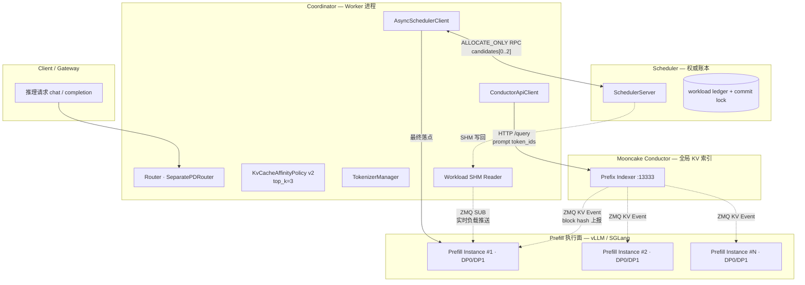
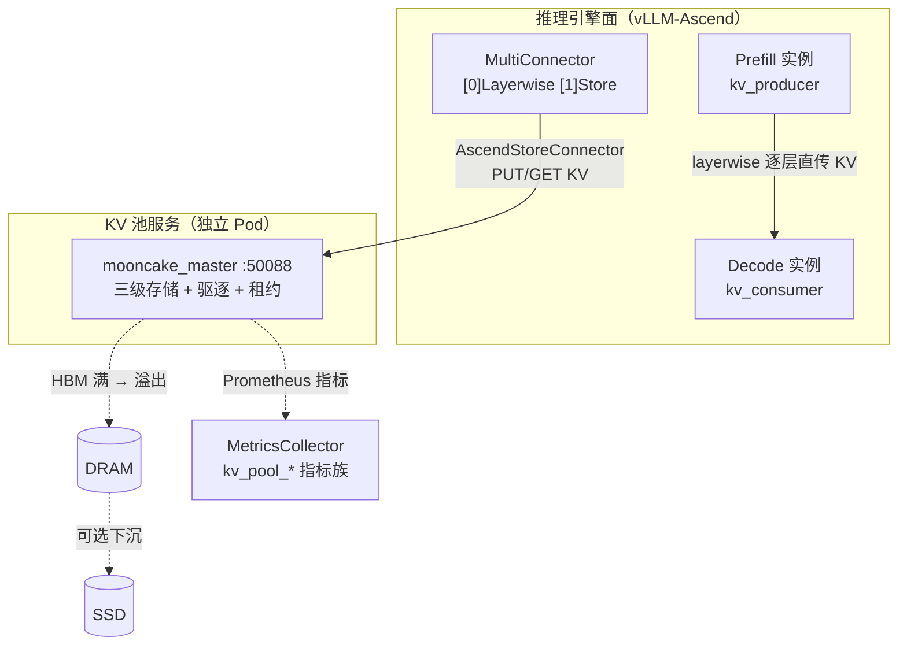
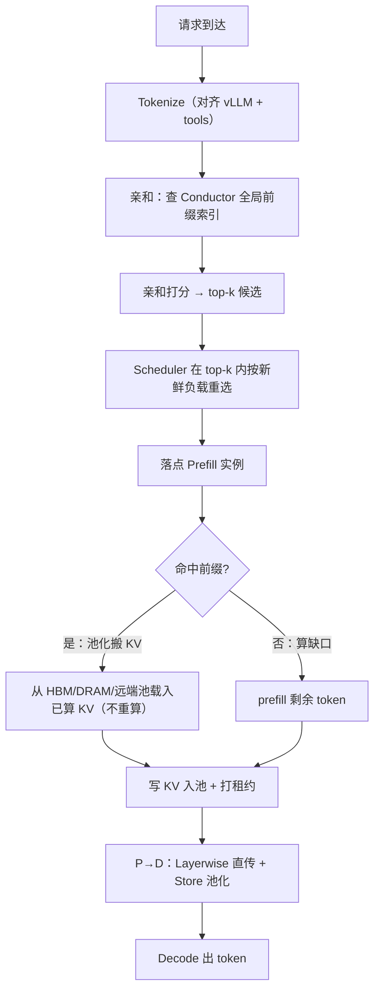

# KV Cache 亲和调度与池化
> 覆盖 12 个知识点 | 来源 13 个文件 | 更新于 2026-07-11

## 1. 一句话总结
在多实例（PD 分离/混部）部署下，将请求通过**调度面（亲和路由）**打到已缓存最长相同前缀的 Prefill 节点，并通过**数据面（池化存储）**让 KV Cache 跨节点共享、分级驻留，从而避免重复 prefill，将端到端有效前缀命中率从 ~10% 提升到 ~88%，在典型场景下实现 TTFT 减 70%+、E2E 时延减 50%。

## 2. 核心原理
### 2.1 问题背景
- **前缀缓存碎片化**：单实例 vLLM/SGLang 的自动前缀缓存仅在本地 HBM 生效。多副本做 round-robin/随机路由时，相同前缀请求被均匀打散到不同实例，每个实例都要重复 prefill，集群整体缓存命中率随实例数线性下降（N 实例时 ≈ 1/N）。Prefill 是 TTFT 的主项，长前缀反复重算直接打爆 TTFT。
- **HBM 容量天花板**：单卡 HBM 只能存有限 token 的 KV cache。热点前缀容易被 LRU 驱逐，下一次复用又得重算。同时 P/D 分离架构下 Prefill 完成后需把 KV 传给 Decode，点对点直连导致时序耦合、P 端显存占用，无法解耦。
- **并发 burst 下的羊群效应**：多 Worker 并发调度时，若所有 Worker 只看「谁的缓存前缀最长」，会把同前缀的突发流量全灌进同一个热点 endpoint，造成局部过载。

### 2.2 方案概述
MindIE-PyMotor 提供「调度面（KV 亲和）+ 数据面（KV 池化）」的组合方案：
- **调度面（KV 亲和/控制面）**：Coordinator 将请求本地 tokenize（与引擎严格一致），查询 Mooncake Conductor 的全局前缀索引（由各实例的 KV Events 实时构建），拿到各 Prefill 实例/DP rank 的缓存命中长度。然后用 `unified`（亲和-负载加权融合）或 `load_gated`（先负载门控再比亲和）两种策略打分，选出 top-k 候选上报给中心 Scheduler，Scheduler 用权威负载账本在候选集内重选最终落点，防止并发 herding。
- **数据面（KV 池化/传输面）**：通过 Mooncake Master 将 KV Cache 抽象为跨节点的三级存储池（GPU HBM → DRAM → SSD/远端）；MultiConnector 组合 Layerwise（逐层直传 P→D 压低 TTFT）与 Store（写池解耦，释放 P 端显存、支持跨请求复用）；高水位批量驱逐 + 租约 TTL 保证容量管理与正确性。

**联合效果**：端到端有效前缀命中率 $h = h_{reuse} \times P_{route} \times P_{pool}$。亲和负责抬高路由命中 $P_{route}$，池化负责抬高容量命中 $P_{pool}$，两者缺一则乘积坍塌。代码交汇于 `prefill_cost = max(0, isl - overlap_credit × matched_tokens)`。

## 3. 实现细节
### 3.1 调度面：KV Cache 亲和调度
#### 3.1.1 核心组件与职责
系统横跨四层，职责分离：

| 组件 | 级别 | 角色 |
|------|------|------|
| Mooncake Conductor | 外部索引 | 订阅各 DP 的 ZMQ KV Events，维护全局前缀表，暴露 `/query` |
| vLLM Prefill | 执行面 | 发布 KV Event (ZMQ PUB)，执行计算 |
| ConductorApiClient | Coordinator | HTTP 薄封装：register/unregister/query |
| KvCacheAffinityPolicy v2 | Coordinator | 核心策略：tokenize → query → 双模式评分 → top-k |
| TokenizerManager | Coordinator | HF tokenizer 单例，与引擎一致 |
| AsyncSchedulerClient | Coordinator | 策略分发，上报 top-3 候选 |
| SchedulerServer | 中央 Scheduler | 权威负载重选 + commit allocate |
| Workload SHM Reader | Coordinator | ZMQ SUB 推送，评分前热补丁 |

#### 3.1.2 双模式评分算法
所有 endpoint 的评分都从 `_collect_load_candidates` 产生的三元组出发生成：`(load_cost, matched_tokens, prefill_cost)`，其中 `prefill_cost = max(0, isl - overlap_credit × matched_tokens)`。

**Unified 模式（默认）**：软加权融合，越低越好。

$$
\text{score} = \text{prefill\_load\_scale} \times \max(0, \text{isl} - \text{overlap\_credit} \times \text{matched\_tokens})
      + \text{load\_weight} \times \text{workload\_score}
$$

- `load_weight=0` → 纯前缀贪心；`overlap_credit=0` + `load_weight=1` → 纯负载均衡。
- 关键性质：没有缓存命中的空闲 endpoint 也可能胜出，避免热前缀 herding。

**Load-Gated 模式**：两阶段硬约束：

1. Stage 1（负载门）：按负载排序，保留 Top-N 最低负载 endpoint（`load_gate_topn` 默认 2）。
2. Stage 2（亲和排）：在门控集合内按 `(matched_tokens DESC, load_cost ASC)` 排序取 top_k。

| 维度 | Unified | Load-Gated |
|------|---------|------------|
| 核心思路 | 线性加权，全局 argmin | 负载门过滤 → 亲和排序 |
| 负载影响 | 软影响：忙但命中高仍可能胜出 | 硬约束：超出 topn 直接排除 |
| 适用场景 | 负载均匀，前缀复用为主 | 负载波动大，严格限流 |

#### 3.1.3 分布式决策：Worker top-k 提案 + Scheduler 权威重选
多 Worker 进程并发时，本地负载视图可能滞后，导致 burst 全部 hit 同一热点。PR#210 引入三级演进：

**V1（已移除）：本地 in-flight overlay** —— 每个 Worker 本地叠加未确认的负载，但只作用单进程、TTL 难调、跨 Worker 无效。

**V2（PR#210）：top-k 候选 + Scheduler 重选**：
- Worker：Conductor 查询 + 本地打分 → 提出 best-first 排序的 top-k 候选（k=3）。
- Scheduler：在 ALLOCATE 慢路径中，用**权威 workload ledger** 在候选集内选最低负载者。
- 保证：比候选集更优的「全局最轻但亲和差的 endpoint」不会被越界选取。

**V3（PR#304）：unified 全量上报 + 全局重排**：
- 利用 `score = prefill_load_scale × prefill_cost + load_weight × load` 的可分解性，Worker 上报每个 endpoint 的 `prefill_cost`（亲和折扣后的待算量，不随时间变化），Scheduler 用自己的新鲜负载重算完整 unified 分数，做全局 min。
- Scheduler 无需再次 tokenize/查 Conductor，只需一次 O(endpoints) 扫描。平局偏向更低 prefill_cost。
- load_gated 模式保持固定 top-k 提案不变（硬负载上界不可被软分松绑）。

**三级降级链**：kv_cache_affinity（超时/无数据/tokenize 失败） → load_balance（全局最小负载 + 实例压力感知） → round_robin 兜底。亲和是增强路径，不是单点。

#### 3.1.4 关键代码路径
- `motor/coordinator/scheduler/policy/kv_cache_affinity.py`：`KvCacheAffinityPolicy.select_endpoint_candidates_from_list()` / `_select_with_load()` / `_select_load_gated()`；`TokenizerManager`
- `motor/coordinator/api_client/conductor_api_client.py`：`ConductorApiClient.register_post()` / `query_conductor()`
- `motor/coordinator/scheduler/runtime/scheduler_client.py`：`_AFFINITY_CANDIDATE_TOPK = 3`
- `motor/coordinator/scheduler/runtime/scheduler_server.py`：`_select_lowest_load_among_candidates()` / global unified 重算
- `motor/coordinator/domain/workload_calculator.py`：prefill 负载用真实 `len(token_ids)` 记账

#### 3.1.5 Tokenize 前置与 Conductor 交互
- **TokenizerManager**：单例加载与引擎相同模型目录的 HF tokenizer，`apply_chat_template(messages, tools, ...)`，保证 tools 注入对齐。失败返回 `[]`，fail-closed 降级。
- **Conductor 注册**：实例上线时，对每个 KVA 角色实例（`ROLE_P` / `ROLE_U`）的每个 endpoint（即 DP rank）调 `POST /register`，上报 `instance_id`、ZMQ 地址、`block_size` 等，让 Conductor 订阅该 DP 的事件流。
- **Conductor 查询**：`POST /query(token_ids, block_size)`，返回每实例每 DP 的 `longest_matched`（最长连续命中 token 数）及可选的 `GPU/CPU/DISK` 分层命中。
- **快路径**：若 `len(token_ids) < block_size`，跳过 HTTP 往返，直接走全零匹配（Conductor 按整块哈希，子块 prompt 不可能命中）。

### 3.2 数据面：KV 池化
#### 3.2.1 架构与组件

| 组件 | 角色 |
|------|------|
| mooncake_master | 池化主进程，管理三级存储、水位驱逐、租约 |
| AscendStoreConnector | vLLM 插件，P 写（lookup_rpc_port="0"）、D 读（"1"） |
| MooncakeLayerwiseConnector | P→D 逐层直传，不经 Master，压低 TTFT |
| MultiConnector | 组合 [0]Layerwise 快路径 + [1]Store 持久化 |

#### 3.2.2 驱逐与租约
- **高水位批量驱逐**：占用率 $\ge$ `eviction_high_watermark_ratio` (默认 0.9) 时，一次驱逐 `eviction_ratio × 总容量` (默认 0.1)，避免频繁单条操作。
- **租约 TTL**：写入 KV 后，在 `default_kv_lease_ttl`（默认 11s）内保证不被驱逐，确保 D 端能读到。TTL 必须大于 Decode 耗时与传输超时。
- **release_kv**：Prefill 完成后 Coordinator 通知 P 端可回收本地 HBM，但**不删除池中数据**；池内生命周期由 TTL + 驱逐独立控制。

#### 3.2.3 关键代码与配置路径
- `motor/coordinator/vllm_config.py`：`_process_multi_connector/_process_store_connector`
- 部署生成器：`motor/deployer/lib/generator/kv_pool.py`、`kv_conductor.py`
- 用户配置：`kv_cache_pool_config` (全局段大小、水位、驱逐比、TTL) → `mooncake_master` 启动参数
- 指标：`kv_pool_size`、`kv_pool_ratio`、`kv_pool_eviction` 等

### 3.3 亲和 × 池化：联合部署与收益模型
#### 3.3.1 为何必须叠加
有效命中率 $h = h_{reuse} \times P_{route} \times P_{pool}$ 是**乘法**，任一因子接近 0 则整体坍塌。
- 只开池化、随机路由：池里有 KV 但请求落错实例 → `matched_tokens=0` → 全量 prefill。
- 只开亲和、无池化：路由对了但单卡 HBM 超限前缀被驱逐 → `overlap_credit≈0`（取不回） → 全量 prefill。

#### 3.3.2 联合流程

计算交汇：`prefill_cost = max(0, isl - overlap_credit × matched_tokens)`。`matched_tokens` 由亲和提供，`overlap_credit` 靠池化兑现（命中部分必须能从池中取回才免算）。

#### 3.3.3 部署配置共存
一份 `user_config.json` 同时包含：
- `scheduler_type = "kv_cache_affinity"` （调度面）
- `kv-events-config` （P 发 KV Event）
- `kv_transfer_config`: `MultiConnector` (Layerwise + Store)
- `kv_cache_pool_config` (段大小/水位/驱逐/TTL)
- `kv_conductor_config.http_server_port = 13333`

## 4. 框架对比

### 4.1 llm-d — KV 亲和与传输设计
llm-d 定位为 K8s 原生推理平台，通过 Envoy Gateway 与可插拔的 Endpoint Picker（EPP）实现调度，后端可对接 vLLM/SGLang 等模型服务器。其 KV 亲和架构围绕三层策略展开：近似匹配（approximate）、精确匹配（precise）以及基于粘滞过滤的会话绑定。在近似模式下，系统通过字符或 token 比例估算前缀命中，并在 EPP 本地维护 LRU 缓存，路由后通过后续请求“学习”缓存分布，适用于 `optimized-baseline` 与 `tiered-prefix-cache` 指南场景。精确模式则依赖 vLLM 的 `/v1/*/render` 端点进行 tokenize，并通过 ZMQ 事件（`BlockStored`、`BlockRemoved`、`AllBlocksCleared`）驱动全局 KV Indexer，实现最长连续前缀链打分，断链后后续 token 无效；tier 权重默认为 GPU 1.0、CPU 0.8，且支持 speculativeIndexing，在路由后写入短 TTL（约 2s）的预测条目以填补事件空窗。此外还有 sticky filter 策略，当 match 率大于 0.8 时收窄候选，结合 Explore 机制和 TTFT 逃逸来平衡精确性。

调度流水线由 ProfileHandler（支持单池或 P/D 双 profile）、Filters（affinity-filter、PD label 等）与 Scorers 加权组合构成，最终由 Picker 选择最高分实例。推荐的精确路由权重为：prefix-cache-scorer 3.0、kv-cache-utilization-scorer 2.0、queue-scorer 2.0、no-hit-lru-scorer 2.0。在传输与卸载方面，llm-d 本身不实现统一池化层，而是通过 guide 组合各引擎的卸载能力：Native offloading 通过 `--kv-offloading-backend native` 及 `TieringOffloadingSpec` 配置 HBM→CPU→文件系统的层级；LMCache 通过 `LMCACHE_MAX_LOCAL_CPU_SIZE` 等环境变量设置 L2 容量；Mooncake Store 则提供嵌入式或独立 DRAM 与 SSD 存储。近似模式下的 tier 路由使用双 `approx-prefix-cache-producer`（GPU + CPU），分别搭配 scorer，手动设置 CPU LRU 容量，但文档指出 autoTune 仅统计 GPU blocks，在 offload tier 场景存在已知缺陷。精确路由与 LMCache/Mooncake 的端到端组合 recipe 仍缺少 validated 方案，反映了其在统一池化索引方面的不足。

### 4.2 NVIDIA Dynamo — KV Router 与 KV Block Manager
Dynamo 面向分布式生成式推理，提供 Frontend、KV Router、KV Block Manager (KVBM)、NIXL 传输库以及 Planner 的全栈运行时。其核心亲和机制基于代价函数路由，实现在 `lib/kv-router/src/scheduling/selector.rs`。该函数计算 `raw_prefill_blocks = (active_prefill_tokens + uncached_tokens) / block_size`，再减去重叠信用块 `overlap_credit_blocks`，该信用块由 `overlap_score_credit` 乘以退化系数与设备重叠量决定，并加入不同介质命中权重与重叠量的乘积：host_cache_hit_weight × host_overlap、disk_cache_hit_weight × disk_overlap、shared_cache_multiplier × shared_beyond_device，最终 `cost = prefill_load_scale × adjusted_prefill + decode_blocks`，选择最低 cost 的 worker。分层权重通过 CLI 直接映射到存储层级：`--router-kv-overlap-score-credit`（设备 L1，默认 1.0）、`--router-host-cache-hit-weight`（L2，默认 0.75）、`--router-disk-cache-hit-weight`（L3，默认 0.25），并可通过 `--shared-cache-type hicache` 加上 `--shared-cache-multiplier` 纳入全局共享 L3 的贡献。

KVBM 实现了统一的四级内存池：G1 Device、G2 Host、G3 Disk、G4 Remote，通过环境变量 `DYN_KVBM_CPU_CACHE_GB` 和 `DYN_KVBM_DISK_CACHE_GB` 配置容量。vLLM 连接器使用 `DynamoConnector` 并指定 `kv_role` 为 `kv_both`，在 disagg 场景常用 `PdConnector` 组合 KVBM 与 NixlConnector，实现 P/D 分离下的 KV 传输。主索引器维护 Radix 树的 Device 层命中，并沿 parent 链 walk 对 Host 和 Disk 层进行 lower-tier 索引（`indexer/lower_tier_indexers.rs`），事件携带 `storage_tier` 和 `medium` 字段，路由器据此更新各层状态。近似降级通过 `--no-router-kv-events` 启用，采用基于路由决策的预测缓存和 TTL（`--router-ttl-secs` 默认 120 秒）退化为 approximate 模式。

在 disagg 架构中，Prefill 阶段亲和度最高，使用完整 overlap 评分；Decode 阶段则设 `overlap_score_credit=0`，`assume_kv_reuse=false`，`track_prefill_tokens=false`。此外还支持 session affinity（`X-Dynamo-Session-ID`）、拓扑感知传输（`DYN_KV_TRANSFER_*`）以及 direct 模式（外部 EPP 指定 worker ID）。Dynamo 与 LMCache 的集成仅限于引擎侧复用，Router 未完整支持全部 LMCache events，可能导致 KV-aware 路由次优；而 Mooncake HiCache 作为共享 L3 时，使用 `/batch_query_keys` 查询 master 并计算共享块贡献。

### 4.3 AIBrix — Gateway 亲和与 L1-L3 池化
AIBrix 是字节跳动开源的 LLM 推理控制面，其设计将 KV 亲和与传输解耦：亲和策略在 Envoy Gateway 层以 Go 插件形式实现，而池化在引擎内部通过 Python 的 `aibrix_kvcache` 框架完成，两者通过 KVCache CRD 编排基础设施。Gateway 侧提供多种路由策略，核心为 `prefix-cache` 算法（`pkg/plugins/gateway/algorithms/prefix_cache.go`），流程包括 tokenize（支持 character、tiktoken 或远程 tokenizer）、block 滚动哈希、负载失衡检测（max_running − min_running > IMBALANCE_ABS 时回退到 least-request）、按匹配前缀比例降序和运行请求数升序选择实例，并要求运行数不超过 mean + load_factor × σ。路由后通过 PostRouteUpdate 将推测性前缀写入本地索引器，以改善后续请求命中率。关键环境变量包括 `AIBRIX_PREFIX_CACHE_BLOCK_SIZE`（默认 128/16）、`AIBRIX_PREFIX_CACHE_POD_RUNNING_REQUEST_IMBALANCE_ABS_COUNT`（默认 8）等。索引精度有三种模式：仅基于本地路由历史的 PrefixHashTable（近似）、通过 Redis StateSync 在多 Gateway 副本间同步的近似全局视图，以及通过 ZMQ 接收引擎 `BlockStored/BlockRemoved` 事件的 KV Event Sync 精确模式（需启用 `AIBRIX_PREFIX_CACHE_KV_EVENT_SYNC_ENABLED` 并使用远程 tokenizer）。

池化框架 `aibrix_kvcache` 将存储分为三层：GPU 引擎内置缓存（对应引擎自身 L1），进程内 DRAM 缓存称为 L1（对应整体架构的 L2），分布式存储称为 L2（对应 L3）。进程内 DRAM 通过 `l1/l1_cache.py` 实现，支持 S3FIFO 和 LRU 淘汰策略，默认容量 10GB，不跨 Pod 共享；分布式 L2 支持 InfiniStore、HPKV、PrisKV、SHFS 等多种后端，通过 `cache_manager.py` 统一管理。读取时若 L1 命中则直接返回；若 miss 且数据大小低于 DOUBLE_GET 阈值则不查询 L2 以规避小请求的远程开销；否则从 L2 拉取并 promote 到 L1。L1→L2 的写入策略有 HOT（默认）、ALL 和 EVICTED 三种。为支持张量并行，`GroupAwareKVCacheManager` 通过 allreduce(MIN) 对齐各 rank 的命中块数。Connector 方面提供 `AIBrixOffloadingConnectorType1/2` 和 `AIBrixPDReuseConnector`，分别用于标准卸载和 PD 分离时的跨请求复用。整体架构强调 Gateway 的 block hash 与 L2 key builder 的独立性：即便 L2 能跨 Pod 拉取 KV 块，路由到已有 GPU 前缀的 Pod 仍是最优路径。AIBrix 还将 LMCache 作为回归对照而非内置后端，突显其自研池化方案的独立性。

### 4.4 SGLang — HiCache 与 cache_aware 路由
SGLang 的池化层由引擎内置的 HiCache 提供，是业界最完整的 L1/L2/L3 一等公民实现之一，设计文档见 `sglang/docs/advanced_features/hicache_design.md`，核心实现在 `hiradix_cache.py`。L1 为 GPU HBM 中的 token 到 KV 池，支持 MHA/MLA 结构；L2 为 Host DRAM，通过 `hicache_ratio` 或 `hicache_size` 配置容量，由 `memory_pool_host.py` 管理；L3 为可插拔存储，通过 `HiCacheStorage` 抽象接口支持 Mooncake Store、3FS 等后端。工作流中，查询先在本地树中匹配出连续的 L1 段和 L2 段（无数据拷贝），若连续命中长度达到阈值（默认 256 token），则触发从 L3 到 L2 的 prefetch，策略可选 `best_effort`、`wait_complete` 或 `timeout`。写回策略支持 `write_through`、`write_through_selective` 和 `write_back`，且 L2→L3 仅写入远端尚缺的数据块以减少传输。控制器 `HiCacheController` 协调各层操作。Mooncake 作为 L3 时，通过 `MooncakeHostMemAllocator` 管理 L2 内存，开启 `enable_ssd_offload` 后可利用 Store 的 SSD 层，PD 与 HiCache 共享 TransferEngine。KV 事件定义在 `disaggregation/kv_events.py` 中，媒介包括 GPU、CPU_PINNED、DISK、EXTERNAL，可供外部 Conductor 或 Dynamo 消费。

亲和路由方面，SGLang Model Gateway 默认采用 `cache_aware` 策略，实现于 `sgl-model-gateway/src/policies/cache_aware.rs`，这是一种无通信的近似前缀匹配：当负载不平衡时回退到最短队列；否则对原始文本进行字符匹配（未 tokenize），若 match_rate 超过阈值则路由到命中 worker，否则选择最小负载实例，并将路由信息插入本地 radix 树。此树按 `pool::model` 隔离 prefill 和 decode，可选 mesh 拓扑，但 receive 侧未完全接线。vLLM Router 也 fork 了类似逻辑，更多强调 consistent_hash 与 P/D 结合。这种设计的张力在于：HiCache 提供精确的 token 级 radix 匹配和透明的跨层 prefetch，但 cache_aware 路由仅依靠历史路由猜测 L1 命中，对 L2/L3 的全局分布一无所知，导致多实例共享 L3 时路由目标与 L3 命中完全脱钩。因此，当启用 L3 共享池时，官方建议升级到基于 KV 事件的 precise 路由（如 Conductor/Dynamo 方案），或接受“L3 兜底、路由仅优化本地 L1 近似推断”的折衷。

### 4.5 vLLM — APC 与 Mooncake Connector
vLLM 原生提供 L1 自动前缀缓存（APC），通过链式哈希 `block_hash_i = H(parent_{i-1}, token_ids_block_i, extra_keys)` 在 `vllm/v1/core/kv_cache_utils.py` 中实现，仅作用于本机 GPU 块池，跨实例缓存共享依赖外部亲和路由。其进程内三级存储由 `OffloadingConnector` 管理（`vllm/v1/kv_offload/tiering/manager.py`），L1 为 GPU block pool，L2 为主要 CPU 层 `CPUPrimaryTierOffloadingManager`，L3 为二级层，支持文件系统、对象存储或 P2P 传输的 `SecondaryTierFactory`；GPU 驱逐时会 cascade 至 secondary，但 promotion 必须经过 CPU 网关，不允许直接加载到 GPU。

分布式 L3 连接器通过工厂模式（`factory.py`）提供多种选择：`MooncakeStoreConnector` 实现基于 hash 去重的共享 KV 池，利用 Mooncake Store 作为全局缓存；`MooncakeConnector` 用于 P/D 分离的点对点传输；`LMCacheConnectorV1` 对接外置 LMCache Controller；`MultiConnector` 组合多个连接器（如 PD + Store）；`NixlConnector` 利用 NIXL 进行跨节点传输。Mooncake 自身提供 Store（共享 L3）和 Transfer Engine（RDMA/TCP/NVMe-oF 等），内部 RAM 与 SSD 间通过 `offload_on_evict` 和 `promotion_on_hit` 策略流转。Mooncake Conductor 维护精确的跨 tier 前缀索引，通过 `/query` 接口返回每个实例/DP 在 GPU、CPU、DISK 层的 `longest_matched` 信息。

MindIE-PyMotor（路径 `MindIE-PyMotor/motor/coordinator/scheduler/policy/kv_cache_affinity.py`）作为调度消费者实现了精确前缀缓存感知：它向 Conductor 发送 POST `/query` 获取每个实例的最长前缀长度，结合负载进行统一（unified）或负载门控（load_gated）决策，并由 Scheduler 权威账本防止 herding。该组件不维护本地 radix 树，真值完全依赖 Conductor，短于 1 block 的请求走 fast path，并支持按 GPU/CPU/DISK 分项扣减搬运成本。vLLM 官方 Router fork 自 SGLang Gateway，其 cache_aware 策略仍为 approximate 模式，不涉及三级池化，更侧重 session affinity 的 consistent_hash 和 P/D 编排。整体上，vLLM 坚守 L1 和可插拔卸载连接器的边界，而 Mooncake 提供共享 L3、TE 和 Conductor 全局索引，Motor 则作为精确调度与亲和查询的样板实现。

### 4.6 六框架总览对比表

| 维度 | MindIE | llm-d | Dynamo | AIBrix | SGLang | vLLM |
|------|--------|-------|--------|--------|--------|-------|
| 缓存粒度 | 实例级最长前缀长度（GPU/CPU/DISK分层） | 实例级（prefix-cache-scorer 按最长连续前缀链打分，支持 GPU/CPU tier 权重） | 实例级代价函数（基于 block 级 overlap 和卸载 tier 权重） | 实例级前缀哈希表（block 级滚动 hash），可选精确 KV events | 引擎内 token 级 radix（HiCache）；路由侧为字符级近似树 | L1 为 block 链式哈希；卸载为 block 级 tiering |
| 跨实例支持 | Conductor 全局索引，通过 /query 获取各 DP 命中 | EPP Indexer 全局索引（ZMQ 事件）或近似本地 LRU | 主 Radix + 下层索引器，跨所有 worker | Gateway 本地表/Redis 同步/KV Event Sync 三种模式 | 路由树每 worker 独立，无跨实例同步 | L1 仅本机；L3 通过 Mooncake Store 或 LMCache 共享 |
| 匹配方式 | 向 Conductor POST 查询精确 token 化最长前缀 | Approximate: 字符/token 比例+LRU；Precise: render tokenize+ZMQ 事件 | 精确事件驱动（storage_tier），可降级为 TTL 近似预测 | 字符/远程 tokenizer + block hash；精确模式通过 KV Event Sync | 路由：字符匹配；HiCache：token 级 radix 匹配 | APC: 链式 block hash；无全局路由匹配，依赖外部 |
| 负载权衡 | 统一融合或 load_gated：先按负载筛低载实例再按亲和度评分 | 加权打分（prefix-cache 3.0、kv-util 2.0、queue 2.0等），最终 max-score | 仅通过代价函数排序选择最低 cost，无显式 load 项 | 负载失衡阈值回退 least-request，否则按 match% DESC + running ASC 选 | 负载不平衡时回退最短队列，否则按 match_rate 选 | 无内置亲和+负载联合；分离调度器（如 Motor）决策 |
| 池化机制 | 依赖 Conductor 索引各 tier，Motor 不管理数据 | 不实现统一池化；通过 guide 组合 Native tiering、LMCache、Mooncake | KVBM 统一 G1 Device/G2 Host/G3 Disk/G4 Remote 四级池 | 引擎内 L1 DRAM（S3FIFO/LRU）+ L2 分布式 InfiniStore/HPKV 等，CRD 编排 | HiCache L1 GPU + L2 Host + L3 可插拔存储，自动 prefetch/write-back | 进程内 CPU tiering + Secondary 卸载；分布式 L3 通过 Mooncake/LMCache Connector |
| 降级策略 | 短请求 fast path；无 Conductor 时无法精确路由 | approximate 模式：固定 block + rolling hash，无真实驱逐信息 | --no-router-kv-events 近似预测，默认 TTL 120s | 负载失衡 → least-request；无事件时用本地表或 Redis | cache_aware 无事件，仅凭历史路由树猜测 | 无路由降级；卸载层可退化至仅 GPU 缓存 |
| 核心创新 | 直接查询分布式精确索引，权威账本防 herding | 可插拔 EPP 打分框架 + speculative indexing 填补事件空窗 | 代价函数统一层权重与 overlap，统一 KVBM 四级传输 | Gateway 亲和与自研 L1/L2 卸载完全解耦，CRD 管理 L2 集群 | 引擎内完整三级池化与路由脱钩，提供极致本地缓存性能 | L1 APC + 可插拔 Connector 生态，与 Mooncake TE 深度集成 |

## 5. 面试要点
### 5.1 常见追问
#### Q: 为什么要做 KV 亲和调度？
- 多副本时，普通负载均衡会把相同前缀请求打散，每个实例都要重复 prefill，缓存命中率崩溃，TTFT 恶化。
- 亲和路由通过全局索引把请求送到已缓存最长前缀的节点，避免重复 prefill。
- MindIE 使用 Mooncake Conductor 作为精确 prefix indexer，查询 `longest_matched` 对齐引擎缓存。

#### Q: Motor 的 unified 和 load_gated 怎么选？
- **unified**（默认）：prefill_cost 和负载加权融合（`α×prefill_cost + β×load`），允许空闲但缓存少的 endpoint 胜出，适合负载较均匀、追求整体命中率最大化的场景。
- **load_gated**：先筛出 Top-N 最闲 endpoint，再在里面比亲和，硬保证请求只进低负载集合，适合对延迟长尾敏感、必须防止热点过载的场景。

#### Q: 多个 Coordinator Worker 并发时怎么防止 herd？
- 旧方案：本地 in-flight overlay 只能作用本进程，TTL 难调，跨 Worker 无效。
- 新方案：Worker 提出亲和 top-k 候选（best-first），中央 Scheduler 用权威负载账本在候选集内重选最低负载者（PR#210）；而后进一步演化为 unified 全量上报 prefill_cost，Scheduler 全局重算完整分数（PR#304）。
- 核心：Scheduler 持有 commit lock 下的新鲜负载，打散 stale-view burst；且不越出 Worker 提交的亲和候选边界。

#### Q: 只开池化不开亲和会怎样？
- 池子里有所需 KV，但请求被随机路由到未缓存该前缀的实例，该实例本地查不到，仍然全量 prefill。
- 有效命中率受路由命中 $P_{route} \approx 1/N$ 限制，整体 h 仍低。

#### Q: 池化的驱逐如何保证正确性？
- 租约 TTL：写入 KV 时打上 TTL（默认 11s），在 TTL 内保证不被驱逐，覆盖 Decode 读取窗口。
- 水位批量驱逐：当占用率超过高水位（90%），批量驱逐 10% 容量；驱逐时优先淘汰 TTL 过期或 LRU 冷块。
- 若 D 端读失败（如 TTL 过期、网络异常），触发 recompute 兜底，不影响服务可用性。

#### Q: 字符级 (cache_aware) 和 token/block 级 (precise) 亲和有什么本质区别？
- 字符级（SGLang/vLLM Router `cache_aware`）：存 raw text，不 tokenize；优点是零开销、无外部依赖；缺点是对不齐引擎 block 边界，chat template/tools 注入会导致字符前缀与 token 前缀分叉，且不知道引擎内部驱逐，假阳性常见。
- token/block 级（Motor, llm-d precise, Dynamo）：在调度层用与引擎一致的 tokenizer 做 tokenize，按 block 哈希查全局索引，结果与引擎内部缓存一致；代价是调度层 CPU 开销和组件依赖，但准确度和防驱逐假命中能力更强。

#### Q: 昇腾 NPU 上怎么做 KV 传输？
- 数据面使用 Mooncake Transfer Engine 的 `ascend` 后端：同构时 HCCL TransportMem 点对点搬 KV（与 TP 的集合通信 HCCL AllReduce 不同）；异构（如 910B Prefill + H20 Decode）时走 HBM→DRAM 聚合 + RDMA 流水线。
- 上层通过 `MooncakeLayerwiseConnector`（P→D 逐层直传）或 `AscendStoreConnector`（写池/读池）接入。

### 5.2 口述话术
**30 秒版**：MindIE 用 Mooncake Conductor 做全局 KV 前缀路由，Coordinator 本地 tokenize 后查最长匹配，按「亲和收益 + 实时负载」统一打分，选出 top-k 候选由中心 Scheduler 用权威负载账本做最终裁决，防止并发打爆热点。数据面配合 KV 池化让缓存跨节点可达且不被过早驱逐。乘积效应使有效命中率从 ~10% 提高到 ~88%，典型长上下文短输出场景 TTFT 降 70%+。

**联合口径（1 分钟）**：
1. **分层**：亲和是调度面（路由），池化是数据面（存储/传输），互不替代。
2. **乘法命中**：$h = h_{reuse} \times P_{route} \times P_{pool}$，任一为 0 则坍塌，必须叠加。
3. **最反直觉**：只开池化收益≈0（随机路由落错实例，本地查不到 KV）；只开亲和容量有限（HBM 满即驱逐）。
4. **收益归因**：$P_{route}$ 归亲和，$P_{pool}$ 与免重算/低开销归池化，防羊群归亲和中的负载项和 Scheduler 重选。
5. **边界**：强依赖「长输入 + 短输出 + 高前缀复用」；长输出会稀释 E2E 降幅。

## 6. 延伸阅读
### 6.1 相关主题
- MindIE-PyMotor 调度策略设计文档（PR #134, #210, #304 等）
- Mooncake 论文：*Mooncake: A KVCache-centric Disaggregated Architecture for LLM Serving* (FAST '25 Best Paper)
- vLLM Automatic Prefix Caching 设计
- SGLang RadixAttention 与 HiCache
- llm-d precise prefix-cache routing

### 6.2 源文件

| 文件路径 | 标题 | 类型 |
|----------|------|------|
| wiki/repos/mindie-pymotor/kv-affinity.md | KV Cache 亲和调度 | 技术文档 |
| wiki/repos/mindie-pymotor/kv-pool.md | KV 池化：意义与实现细节 | 技术文档 |
| wiki/repos/mindie-pymotor/kv-pool-and-affinity.md | KV 池化 × KV 亲和 联合调度 | 技术文档 |
| wiki/raw/articles/pymotor/kv_cache_affinity_deep_analysis.md | KV Cache Affinity 深度技术分析报告 | 深度分析 |
| wiki/raw/articles/pymotor/kv_cache_affinity_report.md | KV Cache 亲和性调度：技术介绍与竞品分析 | 竞品报告 |
| wiki/raw/articles/pymotor/kv_cache_affinity_summary_interview.md | MindIE-PyMotor KV Cache 亲和调度 面试速览 | 面试速览 |
| wiki/raw/articles/pymotor/pr210_kv_affinity_topk_candidates_deep_analysis.md | PR #210 KV 亲和 top-k 候选深度分析 | PR 分析 |
| interview/interview-review/04-KV亲和调度与Mooncake专题.md | 专题 04：KV cache 亲和调度与 Mooncake 架构 | 面试专题 |
| interview/interview-review/12-PyMotor-KV亲和性调度特性全解与简历素材.md | 专题 12：PyMotor KV 亲和性调度特性全解 | 面试专题 |
| interview/interview-review/15-vLLM-Router与SGLang-KV亲和性设计调研.md | 专题 15：vLLM Router 与 SGLang KV 亲和性设计调研 | 调研专题 |
| interview/kv knowledge/00-概念与分层模型.md | 00 · 概念与分层模型 | 知识体系 |
| interview/kv knowledge/01-框架对比总表.md | 01 · 框架对比总表 | 知识体系 |
| interview/kv knowledge/06-vLLM-Mooncake-Motor.md | 06 · vLLM / Mooncake / Motor | 知识体系 |