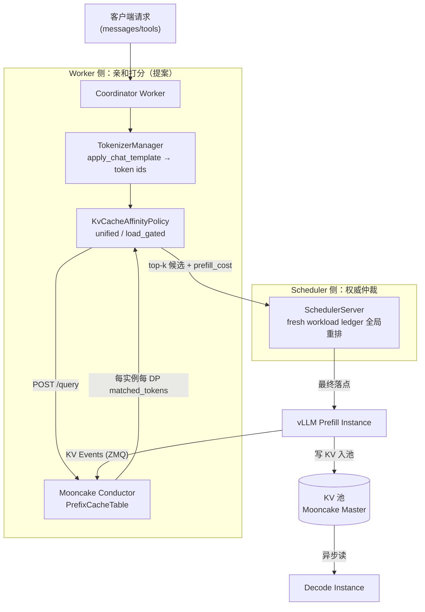

# KV Cache 亲和调度与池化
> 覆盖 12 个知识点 | 来源 8 个文件 | 更新于 2026-07-12

## 1. 一句话总结
在 PD 分离、多 Prefill 副本部署下，KV Cache 亲和调度把请求路由到已缓存最长相同 token 前缀的节点，减少重复 prefill 计算、下降 TTFT；KV 池化则把单卡 HBM 缓存扩展成跨节点分级共享池，抬高容量命中率。二者乘法叠加（命中率 = 路由命中 × 容量命中）才能实现生产级收益——客户 4K 上下文场景 TTFT 降约 70%、E2E 降约 50%。核心创新：unified/load_gated 双模式亲和 → Worker top-k 提案 → 中心 Scheduler 权威负载重选，双层防 herding；Mooncake Master 高水位批量驱逐 + 租约 TTL 保池化正确性。

## 2. 核心原理

### 2.1 问题背景
大规模 LLM 在线推理普遍采用 **Prefill / Decode 分离（PD Disaggregation）**，Prefill 计算密集，Decode 内存带宽密集。同系统 prompt、tools schema、历史轮次前缀在多实例间高度重复：
- **随机路由** → 每次请求可能落到不同 Prefill 节点，重复 prefill 相同前缀 → 算力浪费、TTFT 恶化。
- **单卡 HBM 限制** → 本地 prefix cache 容量极有限，热点前缀易被 LRU 驱逐，下一次复用又得重算。
- **PD 时序耦合** → 无池化时 P 算完必须实时等 D 在线 → 直连传输锁死显存与时序。

### 2.2 方案概述
MindIE-PyMotor（Motor）在调度面通过 **Mooncake Conductor** 全局 KV 前缀索引，把请求 tokenize 后查询各实例各 DP rank 的缓存命中长度，再用 unified（亲和-负载加权融合）或 load_gated（先筛低负载再比前缀）打分，选出最优 Prefill 落点；数据面通过 **Mooncake Store** 把 KV 抽象成跨节点分级共享池（HBM → DRAM → 远端），解耦 P→D 传输并抬高容量命中率。

**三层角色分工：** Conductor 回答“缓存在哪”（订阅引擎 KV Events 维护前缀表）；Worker 回答“谁综合最优”（亲和 + 本地负载视图打分）；Scheduler 做最终仲裁（权威新鲜负载账本防 herding）。

## 3. 实现细节

### 3.1 Tokenize 前置：调度层拿到与引擎一致的 token ids
**为什么必须本地 tokenize：** Conductor 按 token block 对齐做前缀匹配，chat template 与 tools 注入会改变 token 序列。Coordinator 若用字符级近似或缺失 tools，`longest_matched` 会系统性偏错，亲和调度反帮倒忙。

**实现要点：**
- `TokenizerManager`（单例）用 HuggingFace `AutoTokenizer` 加载与引擎**同一模型路径**的 tokenizer，调 `apply_chat_template(messages, tools, add_generation_prompt=True)`。
- tokenize 结果缓存在 `req_info.token_ids`，一次 tokenize 三处复用：Conductor 前缀查询、`isl` 参与亲和打分、`calculate_demand_workload` 用真实 token 数记账。
- **fail-closed**：tokenize 失败返回 `[]`，调度整体回退 LoadBalance——宁可放弃亲和，也不拿半对序列误导 Conductor。
- **短 prompt 快路径**：prompt 短于 1 个 KV block 时跳过 HTTP 查询（Conductor 只索引整块），直接按全零命中排序。

### 3.2 双模式亲和评分（v2，当前生产使用）
KvCacheAffinityPolicy v2 的通用层 `_collect_load_candidates` 先构建每个 endpoint 的 `(load_cost, matched_tokens, prefill_cost)` 三元组，然后按配置模式排序：

**Unified 模式（默认推荐）—— 软融合，全局取最小：**
$$
\text{score} = \text{prefill\_load\_scale} \times \max(0, \text{isl} - \text{overlap\_credit} \times \text{matched\_tokens}) + \text{load\_weight} \times \text{workload\_score}
$$
- `overlap_credit` 默认 1.0 → 命中 1 个 token 就少算 1 个 prefill。
- `load_weight` 默认 1.0 → 两项共享 token 量纲，物理含义是“1 token 排队负载 ≈ 1 token 待算 prefill”。
- 关键性质：无缓存的空闲 endpoint **也能赢过**有缓存但忙的热点，天然防 herding。
- 参数调优：`load_weight=0` 退化为纯亲和；`overlap_credit=0` 退化为纯负载均衡。

**Load-Gated 模式—— 硬约束，先筛后选：**
1. Stage 1（负载门）：保留 `load_gate_topn`（默认 2）个最轻载 endpoint。
2. Stage 2（亲和排）：只在门内按最长前缀命中排序（平局取更闲），返回 top-k。
- 亲和**永远不能**把请求拉到“最闲集合”之外——适合严控负载长尾的场景。

### 3.3 Worker 提案 + Scheduler 权威仲裁（防 herding 的三版演进）
多 Worker 并发 burst 时，所有 Worker 本地都会算出同一个“亲和最优” endpoint → 全部灌过去 → 热点打爆。Motor 从 overlay 本地补丁演进到全网权威仲裁：

| 版本 | 方案 | 问题 | 代表 PR |
|------|------|------|---------|
| V1（已废弃） | Worker 本地 in-flight overlay | 单 Worker 有效，跨 Worker 无效，TTL 难调 | — |
| V2 | Worker 提 top-k（k=3）候选，Scheduler 在候选集内重选 | k 可能截断全局最优 | #210 |
| V3（unified 最终态） | Worker 上报全量 prefill_cost + 权重，Scheduler 全局重算完整 unified 分数 | 最优；load_gated 保持 V2 固定 top-k（硬界不能松绑） | #304 |

**V3 的精髓：** `score = scale × prefill_cost + weight × load` 中，prefill_cost（亲和的数学）不随时间变化、Worker 已算完；load（负载的新鲜值）由 Scheduler 权威账本补上。Scheduler 不需要 prompt、不需要再查 Conductor，一次 O(endpoints) 扫描就得到全局 min。

### 3.4 KV 池化：MultiConnector 双通道与三级存储
池化数据面用 **MultiConnector** 组合两条通道，分别满足实时性与解耦性：

| 通道 | Connector | 优点 | 代价 |
|------|-----------|------|------|
| 快路径 | `MooncakeLayerwiseConnector` | 按层流水直传 P→D，首 token 等待短 | 需 P/D 同时在线 |
| 持久层 | `AscendStoreConnector` | P 写完即释放显存、跨节点共享、可溢出到 DRAM/SSD | 多一跳存储 RTT |

`kv_transfer_params` 元数据（`remote_engine_id`、`remote_block_ids` 等）由 Coordinator 透传，告诉 D“去哪取 KV”。

**驱逐机制：**
- 高水位触发：占用率 ρ ≥ `eviction_high_watermark_ratio`（默认 0.9）→ 批量驱逐 `eviction_ratio × C`（默认 0.1）。
- 租约 TTL（默认 11000ms）：KV 写入后在 TTL 内保证不被驱逐，大于 `max(T_decode, ASCEND_CONNECT_TIMEOUT, ASCEND_TRANSFER_TIMEOUT)`，杜绝 D 还没读完就被淘汰。

**release_kv ≠ 删除池中数据：** `release_kv` 只是回收 Prefill 本地 HBM，池中 KV 由租约 + 水位独立管理。

### 3.5 KV Events：精确路由的数据底座
vLLM/SGLang 在 block 存入/驱逐时通过 ZMQ PUB 发布 KV Events（`BlockStored` / `BlockRemoved` / `AllBlocksCleared`），**只传元数据（block_hash、medium）不传张量**。Mooncake Conductor 订阅后维护全局 PrefixCacheTable，使 `/query` 返回的 `longest_matched` 与引擎真实缓存一致，包括`BlockRemoved` 驱逐感知。

**对齐要求：** `block_size`、hash 算法、tokenizer、`PYTHONHASHSEED` 必须与引擎一致，否则匹配长度全 0。

### 3.6 联合调度：亲和 × 池化的乘法命中率
端到端有效命中率 $h = h_{\text{reuse}} \times P_{\text{route}} \times P_{\text{pool}}$，是乘法链，任一因子缺失即坍塌：

| 因子 | 含义 | 谁负责 |
|------|------|--------|
| $h_{reuse}$ | 业务上可复用的前缀比例 | 负载特性 |
| $P_{route}$ | 请求被路由到持有该前缀实例的概率 | **KV 亲和**（Conductor 全局索引） |
| $P_{pool}$ | 该前缀在被复用前仍驻留的概率 | **KV 池化**（分级存储+租约） |

**最反直觉的点：** 只开池化收益≈0——虽然池子里有 KV，但随机路由把请求送到一个本地索引查不到该前缀的实例，仍然全量 prefill。亲和提供的全局路由才把“池里有”变成“路由得到”。

**代码交汇点：** `prefill_cost = max(0, isl - overlap_credit × matched_tokens)`，`matched_tokens` 由亲和提供，`overlap_credit` 的兑现靠池化搬回 KV。

## 4. 框架对比

### 4.1 llm-d — KV 亲和与传输设计
llm-d 定位为 K8s 原生推理平台，通过 Envoy Gateway 与可插拔的 Endpoint Picker（EPP）实现调度，后端可对接 vLLM/SGLang 等模型服务器。其 KV 亲和架构围绕三层策略展开：近似匹配（approximate）、精确匹配（precise）以及基于粘滞过滤的会话绑定。在近似模式下，系统通过字符或 token 比例估算前缀命中，并在 EPP 本地维护 LRU 缓存，路由后通过后续请求“学习”缓存分布，适用于 `optimized-baseline` 与 `tiered-prefix-cache` 指南场景。精确模式则依赖 vLLM 的 `/v1/*/render` 端点进行 tokenize，并通过 ZMQ 事件（`BlockStored`、`BlockRemoved`、`AllBlocksCleared`）驱动全局 KV Indexer，实现最长连续前缀链打分，断链后后续 token 无效；tier 权重默认为 GPU 1.0、CPU 0.8，且支持 speculativeIndexing，在路由后写入短 TTL（约 2s）的预测条目以填补事件空窗。此外还有 sticky filter 策略，当 match 率大于 0.8 时收窄候选，结合 Explore 机制和 TTFT 逃逸来平衡精确性。

调度流水线由 ProfileHandler（支持单池或 P/D 双 profile）、Filters（affinity-filter、PD label 等）与 Scorers 加权组合构成，最终由 Picker 选择最高分实例。推荐的精确路由权重为：prefix-cache-scorer 3.0、kv-cache-utilization-scorer 2.0、queue-scorer 2.0、no-hit-lru-scorer 2.0。在传输与卸载方面，llm-d 本身不实现统一池化层，而是通过 guide 组合各引擎的卸载能力：Native offloading 通过 `--kv-offloading-backend native` 及 `TieringOffloadingSpec` 配置 HBM→CPU→文件系统的层级；LMCache 通过 `LMCACHE_MAX_LOCAL_CPU_SIZE` 等环境变量设置 L2 容量；Mooncake Store 则提供嵌入式或独立 DRAM 与 SSD 存储。近似模式下的 tier 路由使用双 `approx-prefix-cache-producer`（GPU + CPU），分别搭配 scorer，手动设置 CPU LRU 容量，但文档指出 autoTune 仅统计 GPU blocks，在 offload tier 场景存在已知缺陷。精确路由与 LMCache/Mooncake 的端到端组合 recipe 仍缺少 validated 方案，反映了其在统一池化索引方面的不足。

### 4.2 NVIDIA Dynamo — KV Router 与 KV Block Manager
Dynamo 面向分布式生成式推理，提供 Frontend、KV Router、KV Block Manager (KVBM)、NIXL 传输库以及 Planner 的全栈运行时。其核心亲和机制基于代价函数路由，实现在 `lib/kv-router/src/scheduling/selector.rs`。该函数计算 `raw_prefill_blocks = (active_prefill_tokens + uncached_tokens) / block_size`，再减去重叠信用块 `overlap_credit_blocks`，该信用块由 `overlap_score_credit` 乘以退化系数与设备重叠量决定，并加入不同介质命中权重与重叠量的乘积：host_cache_hit_weight × host_overlap、disk_cache_hit_weight × disk_overlap、shared_cache_multiplier × shared_beyond_device，最终 `cost = prefill_load_scale × adjusted_prefill + decode_blocks`，选择最低 cost 的 worker。分层权重通过 CLI 直接映射到存储层级：`--router-kv-overlap-score-credit`（设备 L1，默认 1.0）、`--router-host-cache-hit-weight`（L2，默认 0.75）、`--router-disk-cache-hit-weight`（L3，默认 0.25），并可通过 `--shared-cache-type hicache` 加上 `--shared-cache-multiplier` 纳入全局共享 L3 的贡献。

KVBM 实现了统一的四级内存池：G1 Device、G2 Host、G3 Disk、G4 Remote，通过环境变量 `DYN_KVBM_CPU_CACHE_GB` 和 `DYN_KVBM_DISK_CACHE_GB` 配置容量。vLLM 连接器使用 `DynamoConnector` 并指定 `kv_role` 为 `kv_both`，在 disagg 场景常用 `PdConnector` 组合 KVBM 与 NixlConnector，实现 P/D 分离下的 KV 传输。主索引器维护 Radix 树的 Device 层命中，并沿 parent 链 walk 对 Host 和 Disk 层进行 lower-tier 索引（`indexer/lower_tier_indexers.rs`），事件携带 `storage_tier` 和 `medium` 字段，路由器据此更新各层状态。近似降级通过 `--no-router-kv-events` 启用，采用基于路由决策的预测缓存和 TTL（`--router-ttl-secs` 默认 120 秒）退化为 approximate 模式。

在 disagg 架构中，Prefill 阶段亲和度最高，使用完整 overlap 评分；Decode 阶段则设 `overlap_score_credit=0`，`assume_kv_reuse=false`，`track_prefill_tokens=false`。此外还支持 session affinity（`X-Dynamo-Session-ID`）、拓扑感知传输（`DYN_KV_TRANSFER_*`）以及 direct 模式（外部 EPP 指定 worker ID）。Dynamo 与 LMCache 的集成仅限于引擎侧复用，Router 未完整支持全部 LMCache events，可能导致 KV-aware 路由次优；而 Mooncake HiCache 作为共享 L3 时，使用 `/batch_query_keys` 查询 master 并计算共享块贡献。

### 4.3 AIBrix — Gateway 亲和与 L1-L3 池化
AIBrix 是字节跳动开源的 LLM 推理控制面，其设计将 KV 亲和与传输解耦：亲和策略在 Envoy Gateway 层以 Go 插件形式实现，而池化在引擎内部通过 Python 的 `aibrix_kvcache` 框架完成，两者通过 KVCache CRD 编排基础设施。Gateway 侧提供多种路由策略，核心为 `prefix-cache` 算法（`pkg/plugins/gateway/algorithms/prefix_cache.go`），流程包括 tokenize（支持 character、tiktoken 或远程 tokenizer）、block 滚动哈希、负载失衡检测（max_running − min_running > IMBALANCE_ABS 时回退到 least-request）、按匹配前缀比例降序和运行请求数升序选择实例，并要求运行数不超过 mean + load_factor × σ。路由后通过 PostRouteUpdate 将推测性前缀写入本地索引器，以改善后续请求命中率。关键环境变量包括 `AIBRIX_PREFIX_CACHE_BLOCK_SIZE`（默认 128/16）、`AIBRIX_PREFIX_CACHE_POD_RUNNING_REQUEST_IMBALANCE_ABS_COUNT`（默认 8）等。索引精度有三种模式：仅基于本地路由历史的 PrefixHashTable（近似）、通过 Redis StateSync 在多 Gateway 副本间同步的近似全局视图，以及通过 ZMQ 接收引擎 `BlockStored/BlockRemoved` 事件的 KV Event Sync 精确模式（需启用 `AIBRIX_PREFIX_CACHE_KV_EVENT_SYNC_ENABLED` 并使用远程 tokenizer）。

池化框架 `aibrix_kvcache` 将存储分为三层：GPU 引擎内置缓存（对应引擎自身 L1），进程内 DRAM 缓存称为 L1（对应整体架构的 L2），分布式存储称为 L2（对应 L3）。进程内 DRAM 通过 `l1/l1_cache.py` 实现，支持 S3FIFO 和 LRU 淘汰策略，默认容量 10GB，不跨 Pod 共享；分布式 L2 支持 InfiniStore、HPKV、PrisKV、SHFS 等多种后端，通过 `cache_manager.py` 统一管理。读取时若 L1 命中则直接返回；若 miss 且数据大小低于 DOUBLE_GET 阈值则不查询 L2 以规避小请求的远程开销；否则从 L2 拉取并 promote 到 L1。L1→L2 的写入策略有 HOT（默认）、ALL 和 EVICTED 三种。为支持张量并行，`GroupAwareKVCacheManager` 通过 allreduce(MIN) 对齐各 rank 的命中块数。Connector 方面提供 `AIBrixOffloadingConnectorType1/2` 和 `AIBrixPDReuseConnector`，分别用于标准卸载和 PD 分离时的跨请求复用。整体架构强调 Gateway 的 block hash 与 L2 key builder 的独立性：即便 L2 能跨 Pod 拉取 KV 块，路由到已有 GPU 前缀的 Pod 仍是最优路径。AIBrix 还将 LMCache 作为回归对照而非内置后端，突显其自研池化方案的独立性。

### 4.4 SGLang — HiCache 与 cache_aware 路由
SGLang 的池化层由引擎内置的 HiCache 提供，是业界最完整的 L1/L2/L3 一等公民实现之一，设计文档见 `sglang/docs/advanced_features/hicache_design.md`，核心实现在 `hiradix_cache.py`。L1 为 GPU HBM 中的 token 到 KV 池，支持 MHA/MLA 结构；L2 为 Host DRAM，通过 `hicache_ratio` 或 `hicache_size` 配置容量，由 `memory_pool_host.py` 管理；L3 为可插拔存储，通过 `HiCacheStorage` 抽象接口支持 Mooncake Store、3FS 等后端。工作流中，查询先在本地树中匹配出连续的 L1 段和 L2 段（无数据拷贝），若连续命中长度达到阈值（默认 256 token），则触发从 L3 到 L2 的 prefetch，策略可选 `best_effort`、`wait_complete` 或 `timeout`。写回策略支持 `write_through`、`write_through_selective` 和 `write_back`，且 L2→L3 仅写入远端尚缺的数据块以减少传输。控制器 `HiCacheController` 协调各层操作。Mooncake 作为 L3 时，通过 `MooncakeHostMemAllocator` 管理 L2 内存，开启 `enable_ssd_offload` 后可利用 Store 的 SSD 层，PD 与 HiCache 共享 TransferEngine。KV 事件定义在 `disaggregation/kv_events.py` 中，媒介包括 GPU、CPU_PINNED、DISK、EXTERNAL，可供外部 Conductor 或 Dynamo 消费。

亲和路由方面，SGLang Model Gateway 默认采用 `cache_aware` 策略，实现于 `sgl-model-gateway/src/policies/cache_aware.rs`，这是一种无通信的近似前缀匹配：当负载不平衡时回退到最短队列；否则对原始文本进行字符匹配（未 tokenize），若 match_rate 超过阈值则路由到命中 worker，否则选择最小负载实例，并将路由信息插入本地 radix 树。此树按 `pool::model` 隔离 prefill 和 decode，可选 mesh 拓扑，但 receive 侧未完全接线。vLLM Router 也 fork 了类似逻辑，更多强调 consistent_hash 与 P/D 结合。这种设计的张力在于：HiCache 提供精确的 token 级 radix 匹配和透明的跨层 prefetch，但 cache_aware 路由仅依靠历史路由猜测 L1 命中，对 L2/L3 的全局分布一无所知，导致多实例共享 L3 时路由目标与 L3 命中完全脱钩。因此，当启用 L3 共享池时，官方建议升级到基于 KV 事件的 precise 路由（如 Conductor/Dynamo 方案），或接受“L3 兜底、路由仅优化本地 L1 近似推断”的折衷。

### 4.5 vLLM — APC 与 Mooncake Connector
vLLM 原生提供 L1 自动前缀缓存（APC），通过链式哈希 `block_hash_i = H(parent_{i-1}, token_ids_block_i, extra_keys)` 在 `vllm/v1/core/kv_cache_utils.py` 中实现，仅作用于本机 GPU 块池，跨实例缓存共享依赖外部亲和路由。其进程内三级存储由 `OffloadingConnector` 管理（`vllm/v1/kv_offload/tiering/manager.py`），L1 为 GPU block pool，L2 为主要 CPU 层 `CPUPrimaryTierOffloadingManager`，L3 为二级层，支持文件系统、对象存储或 P2P 传输的 `SecondaryTierFactory`；GPU 驱逐时会 cascade 至 secondary，但 promotion 必须经过 CPU 网关，不允许直接加载到 GPU。

分布式 L3 连接器通过工厂模式（`factory.py`）提供多种选择：`MooncakeStoreConnector` 实现基于 hash 去重的共享 KV 池，利用 Mooncake Store 作为全局缓存；`MooncakeConnector` 用于 P/D 分离的点对点传输；`LMCacheConnectorV1` 对接外置 LMCache Controller；`MultiConnector` 组合多个连接器（如 PD + Store）；`NixlConnector` 利用 NIXL 进行跨节点传输。Mooncake 自身提供 Store（共享 L3）和 Transfer Engine（RDMA/TCP/NVMe-oF 等），内部 RAM 与 SSD 间通过 `offload_on_evict` 和 `promotion_on_hit` 策略流转。Mooncake Conductor 维护精确的跨 tier 前缀索引，通过 `/query` 接口返回每个实例/DP 在 GPU、CPU、DISK 层的 `longest_matched` 信息。

MindIE-PyMotor（路径 `MindIE-PyMotor/motor/coordinator/scheduler/policy/kv_cache_affinity.py`）作为调度消费者实现了精确前缀缓存感知：它向 Conductor 发送 POST `/query` 获取每个实例的最长前缀长度，结合负载进行统一（unified）或负载门控（load_gated）决策，并由 Scheduler 权威账本防止 herding。该组件不维护本地 radix 树，真值完全依赖 Conductor，短于 1 block 的请求走 fast path，并支持按 GPU/CPU/DISK 分项扣减搬运成本。vLLM 官方 Router fork 自 SGLang Gateway，其 cache_aware 策略仍为 approximate 模式，不涉及三级池化，更侧重 session affinity 的 consistent_hash 和 P/D 编排。整体上，vLLM 坚守 L1 和可插拔卸载连接器的边界，而 Mooncake 提供共享 L3、TE 和 Conductor 全局索引，Motor 则作为精确调度与亲和查询的样板实现。

### 4.6 六框架总览对比表

| 维度 | MindIE | llm-d | Dynamo | AIBrix | SGLang | vLLM |
|------|--------|-------|--------|--------|--------|-------|
| 缓存粒度 | 实例级最长前缀长度（GPU/CPU/DISK分层） | 实例级（prefix-cache-scorer 按最长连续前缀链打分，支持 GPU/CPU tier 权重） | 实例级代价函数（基于 block 级 overlap 和卸载 tier 权重） | 实例级前缀哈希表（block 级滚动 hash），可选精确 KV events | 引擎内 token 级 radix（HiCache）；路由侧为字符级近似树 | L1 为 block 链式哈希；卸载为 block 级 tiering |
| 跨实例支持 | Conductor 全局索引，通过 /query 获取各 DP 命中 | EPP Indexer 全局索引（ZMQ 事件）或近似本地 LRU | 主 Radix + 下层索引器，跨所有 worker | Gateway 本地表/Redis 同步/KV Event Sync 三种模式 | 路由树每 worker 独立，无跨实例同步 | L1 仅本机；L3 通过 Mooncake Store 或 LMCache 共享 |
| 匹配方式 | 向 Conductor POST 查询精确 token 化最长前缀 | Approximate: 字符/token 比例+LRU；Precise: render tokenize+ZMQ 事件 | 精确事件驱动（storage_tier），可降级为 TTL 近似预测 | 字符/远程 tokenizer + block hash；精确模式通过 KV Event Sync | 路由：字符匹配；HiCache：token 级 radix 匹配 | APC: 链式 block hash；无全局路由匹配，依赖外部 |
| 负载权衡 | 统一融合或 load_gated：先按负载筛低载实例再按亲和度评分 | 加权打分（prefix-cache 3.0、kv-util 2.0、queue 2.0等），最终 max-score | 仅通过代价函数排序选择最低 cost，无显式 load 项 | 负载失衡阈值回退 least-request，否则按 match% DESC + running ASC 选 | 负载不平衡时回退最短队列，否则按 match_rate 选 | 无内置亲和+负载联合；分离调度器（如 Motor）决策 |
| 池化机制 | 依赖 Conductor 索引各 tier，Motor 不管理数据 | 不实现统一池化；通过 guide 组合 Native tiering、LMCache、Mooncake | KVBM 统一 G1 Device/G2 Host/G3 Disk/G4 Remote 四级池 | 引擎内 L1 DRAM（S3FIFO/LRU）+ L2 分布式 InfiniStore/HPKV 等，CRD 编排 | HiCache L1 GPU + L2 Host + L3 可插拔存储，自动 prefetch/write-back | 进程内 CPU tiering + Secondary 卸载；分布式 L3 通过 Mooncake/LMCache Connector |
| 降级策略 | 短请求 fast path；无 Conductor 时无法精确路由 | approximate 模式：固定 block + rolling hash，无真实驱逐信息 | --no-router-kv-events 近似预测，默认 TTL 120s | 负载失衡 → least-request；无事件时用本地表或 Redis | cache_aware 无事件，仅凭历史路由树猜测 | 无路由降级；卸载层可退化至仅 GPU 缓存 |
| 核心创新 | 直接查询分布式精确索引，权威账本防 herding | 可插拔 EPP 打分框架 + speculative indexing 填补事件空窗 | 代价函数统一层权重与 overlap，统一 KVBM 四级传输 | Gateway 亲和与自研 L1/L2 卸载完全解耦，CRD 管理 L2 集群 | 引擎内完整三级池化与路由脱钩，提供极致本地缓存性能 | L1 APC + 可插拔 Connector 生态，与 Mooncake TE 深度集成 |

---

## 5. KV 缓存利用率与假命中

亲和调度中，**match 分数**只回答"哪个实例前缀最长"，但两个决定高负载稳定性的因素常被忽略：**KV 缓存利用率**（选中的热机会不会溢出）和**假命中**（索引告诉你命中、实际已被驱逐）。

### 5.1 KV 缓存利用率：亲和的稳定性约束

KV 缓存利用率度量的是显存/块池压力，不等于"前缀还在"：

kv_usage = u_kv ≈ used_kv_blocks / capacity

亲和把同前缀请求打到同一台 → 该机利用率升高 → LRU 驱逐 → **高 M 自我失效**。因此利用率是亲和的**稳定性约束**，不是普通负载装饰项。

| 框架 | 利用率进调度？ | 方式 |
|------|----------------|------|
| **llm-d** | ✅ 软加权 | `kv-cache-utilization-scorer` 权重 2.0 |
| **Dynamo** | ✅ 硬门控 | busy 阈值 + overlap credit 衰减 |
| **AIBrix** | △ 独立策略 | `least-kv-cache` / PD decode scorer |
| **SGLang/vLLM** | ❌ | 仅字符级负载 |
| **Motor** | ❌ | SHM workload，`kv_cache_usage_perc` 仅观测 |

### 5.2 两类假命中

- **类型 A · 驱逐滞后（假阳性）**：索引仍写「W 有前缀 S」，引擎已 BlockRemoved → 按高 M 打到 W，实际全量重算
- **类型 B · 事件空窗**：路由决策领先 BlockStored 到达 → 假阴性打散；若开 speculative TTL 则可控假阳性

二者与利用率正反馈：满 → 驱逐多 → 假命中多 → 更满。

### 5.3 各框架驱逐/空窗覆盖度

| 框架 | Removed | Cleared | Speculative | 默认假命中风险 |
|------|---------|---------|-------------|----------------|
| **llm-d precise** | ✅ | ✅ | ✅ ~2s TTL | 低 |
| **Dynamo precise** | ✅ | ✅ | ✅ predicted TTL | 低 |
| **AIBrix Event Sync** | ✅ | ❌ 空实现 | ❌ | 中 |
| **SGLang/vLLM cache_aware** | ❌ | ❌ | ❌ | **高** |
| **Motor + Conductor** | 经 Conductor | 经 Conductor | ❌ | 中 |

### 5.4 对 Motor 的启示

| 优先级 | 动作 | 对标 |
|--------|------|------|
| **P0** | 确认 Removed/Cleared/replay 生产开启 | llm-d/Dynamo |
| **P1** | `kv_cache_usage_perc` 进 `unified` 或高水位硬门 | llm-d/Dynamo |
| **P1** | 路由后短 TTL speculative | llm-d/Dynamo |
| **P2** | 观测假命中率 + 高利用率衰减 `overlap_credit` | 闭环 |

---

## 5. 面试要点

### 5.1 常见追问

#### Q: 为什么把 tokenize 放在调度层？开销不大吗？
- 前缀匹配必须在 token 空间做，chat template、tools 注入会让字符前缀与 token 前缀分叉，字符级近似（SGLang router 的做法）对不齐引擎 16-token block 边界。
- 开销是毫秒级 CPU，且一次 tokenize 三处复用：查 Conductor、算亲和分、按真实 token 数记负载账——第三点还顺手解锁了入口长度预校验（超 context 直接拒绝）。

#### Q: 亲和粒度是实例级还是更细？
- DP rank 级。vLLM DP 部署下每个 DP rank 有独立 KV 池，注册时每个 endpoint 按“基础端口 + rank”单独上报 kv-events 端点，Conductor 返回 `DP: {rank: matched_tokens}`，打分和最终落点都精确到 (instance, endpoint)。

#### Q: 多个 Worker 并发时，同前缀请求会不会都打到一个实例？
- 这正是我们迭代了三版解决的问题：本地 overlay → top-k 候选 + Scheduler 重选（V2,#210）→ 全量 candidate + Scheduler 全局重排（V3,#304）。V3 利用 unified 分数的可分解性——prefill_cost（亲和）不随时间变、Worker 算完；load（负载新鲜值）由 Scheduler 权威账本补上，一次全局 min 就打破所有 Worker 同时看中同一热点。

#### Q: Conductor 挂了/慢了怎么办？
- 查询超时设 0.2s 快速失败，整条亲和路径返回 None，调度回退 LoadBalance → 再失败 round_robin。——亲和是优化不是依赖，可用性不受影响。Conductor 重启后有 `/services` 对账重注册补状态；kv-events 有 `replay_endpoint` 重放机制。

#### Q: 只开KV池化、不开亲和，行不行？
- 收益≈0。虽然池子里有这份 KV，但随机路由把请求送到一个本地索引查不到该前缀的实例，引擎仍然全量 prefill。Conductor 全局路由才把“池里有”变成“路由得到、查得到”，将容量命中率转化为实际免除 prefill 的 `overlap_credit`。

#### Q: 有了 L3 远程池化，还要亲和调度吗？
- 要。远程命中仍有 RDMA/PCIe 搬运成本；把请求打到本地 HBM 已热缓存的机器仍是 TTFT 最低——池化降的是 miss 惩罚上界，亲和降的是延迟下界，两者叠加才逼近最优。

### 5.2 口述话术（30 秒版）
> Motor 在 PD 分离下用 Mooncake Conductor 做 Prefill 的精确前缀路由：Coordinator 先 tokenize（对齐引擎），查 Conductor 拿各实例各 DP 的最长前缀命中，按 unified（亲和-负载加权融合，token 统一量纲）打分，提全量 prefill_cost 给中心 Scheduler，Scheduler 用权威新鲜负载账本全局重排、防 herding。Conductor 不可用或 tokenize 失败则回退 LoadBalance。池化侧数据面由 Mooncake Master 做跨节点分级存储，高水位批量驱逐 + 租约 TTL 保证 D 端一定读到。两者乘法叠加，客户场景 TTFT 降约 70%。

## 6. 延伸阅读

### 6.1 相关主题
- [专题 04：KV cache 亲和调度 / prefix-aware routing 与 Mooncake 架构](interview/interview-review/04-KV亲和调度与Mooncake专题.md)
- [专题 12：PyMotor KV 亲和性调度特性全解（源码 + PR 演进 + 简历素材）](interview/interview-review/12-PyMotor-KV亲和性调度特性全解与简历素材.md)
- [专题 15：vLLM Router 与 SGLang 的 KV 亲和性设计与实现](interview/interview-review/15-vLLM-Router与SGLang-KV亲和性设计调研.md)
- [KV 知识专题 00：概念与分层模型](interview/kv%20knowledge/00-概念与分层模型.md)
- [KV 知识专题 01：框架对比总表](interview/kv%20knowledge/01-框架对比总表.md)
- [KV 知识专题 09：ZMQ KV Events 详解](interview/kv%20knowledge/09-ZMQ-KV-Events详解.md)

### 6.2 源文件
| 文件路径 | 标题 | 类型 |
|----------|------|------|
| `wiki/repos/mindie-pymotor/kv-affinity.md` | KV Cache 亲和调度 | 主文档 |
| `wiki/repos/mindie-pymotor/kv-pool.md` | KV 池化：意义与实现细节 | 主文档 |
| `wiki/repos/mindie-pymotor/kv-pool-and-affinity.md` | KV 池化 × KV 亲和 联合调度 | 主文档 |
| `wiki/raw/articles/pymotor/kv_cache_affinity_deep_analysis.md` | 深度技术分析报告 (Spec V2) | 源码分析 |
| `wiki/raw/articles/pymotor/kv_cache_affinity_report.md` | 技术介绍与竞品分析报告 | 竞品分析 |
| `wiki/raw/articles/pymotor/kv_cache_affinity_summary_interview.md` | KV Cache 面试速览 | 面试素材 |
| `wiki/raw/articles/pymotor/pr210_kv_affinity_topk_candidates_deep_analysis.md` | PR #210 — top-k 候选 + Scheduler 权威重选 | PR 分析 |
| `interview/interview-review/04-KV亲和调度与Mooncake专题.md` | 专题 04：KV cache 亲和调度与 Mooncake 架构 | 面试专题 |
| `interview/interview-review/12-PyMotor-KV亲和性调度特性全解与简历素材.md` | 专题 12：PyMotor KV 亲和性调度特性全解 | 面试专题 |
| `interview/interview-review/15-vLLM-Router与SGLang-KV亲和性设计调研.md` | 专题 15：vLLM Router 与 SGLang KV 亲和性设计 | 竞品分析 |
| `interview/kv knowledge/00-概念与分层模型.md` | 概念与分层模型 | 知识文档 |
| `interview/kv knowledge/01-框架对比总表.md` | 框架对比总表 | 知识文档 |
| `interview/kv knowledge/02-llm-d.md` 至 `11-KV缓存利用率与假命中.md` | llm-d / Dynamo / AIBrix / SGLang / vLLM / 亲和池化交互 / 选型 / KV Events / 昇腾 / 利用率与假命中 | 知识文档 |