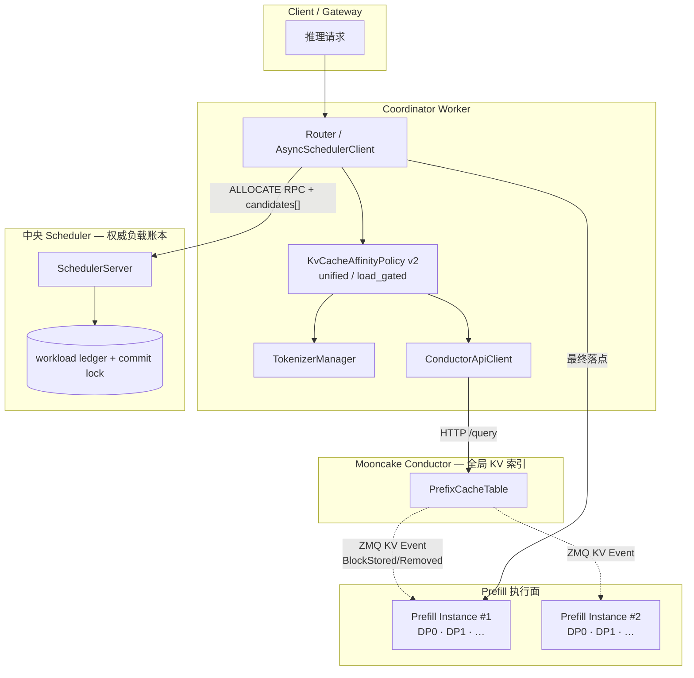
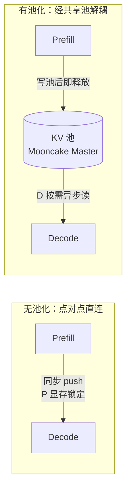
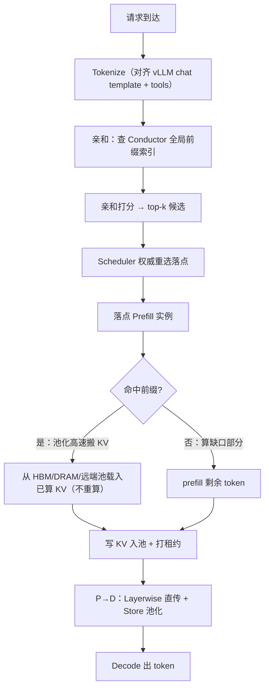

# KV Cache 亲和调度与池化
> 覆盖 12+ 个知识点 | 来源 12 个文件 | 更新于 2026-07-14

## 1. 一句话总结
在 PD 分离、多 Prefill 副本的 LLM 推理架构下，**KV 亲和调度**将新请求路由到已缓存最长相同前缀的节点，减少重复 Prefill，降低首 Token 时延（TTFT）并提升吞吐；**KV 池化**将原本锁死在单卡 HBM 的 KV Cache 抽象为跨节点、可分级的共享存储池，解除容量与时序耦合。二者通过“有效命中率 = 业务复用率 × 路由命中率 × 容量命中率”的乘法模型联合生效，在长上下文、短输出、高前缀复用场景下可测算 TTFT 降低约 70%+、E2E 降低约 50%。核心创新包括：基于 Mooncake Conductor 的全局精确前缀索引、unified / load_gated 双模式亲和‑负载融合评分、Worker top‑k 候选 + Scheduler 权威重选的防羊群架构、MultiConnector 双通道（逐层直传 + 池化存储）、以及带水位线与租约的 KV 驱逐机制。

## 2. 核心原理
### 2.1 问题背景
多实例部署时，普通负载均衡（round‑robin / least‑load）会把共享相同前缀（system prompt、tools 定义、多轮历史）的请求随机打散到不同 Prefill 实例。单实例 vLLM 虽然具有 Automatic Prefix Caching（APC），但**缓存在单个进程的 GPU HBM 内，跨实例不可见**，导致集群前缀缓存命中率随实例数线性稀释，大量 Prefill 重复计算，TTFT 恶化，GPU 浪费。

另一方面，单卡 HBM 是 prefix cache 的硬天花板：缓存容量有限，热点前缀会被 LRU 驱逐；PD 分离下 Prefill 与 Decode 的点对点直连带来时序强耦合与显存占用，进一步限制并发与可伸缩性。因此需要两类能力：

- **调度面（Control Plane）**：让请求“知道”集群内谁缓存了它的最长前缀——**KV 亲和调度**；
- **数据面（Data Plane）**：让缓存跨节点可达、可溢出、可持久——**KV 池化**。

### 2.2 方案概述
整体架构横跨四层，职责分离：

- **Mooncake Conductor**：订阅各 Prefill 实例的 KV Events（ZMQ PUB），维护全局前缀索引，对外暴露 `/query`（HTTP）。  
- **KvCacheAffinityPolicy**：Coordinator 侧策略核心。先用 `TokenizerManager` 本地 tokenize（含 chat template + tools）得到与引擎一致的 token ids；再查 Conductor 获取每个实例每个 DP rank 的 `longest_matched`；最后按配置的 unified 或 load_gated 模式综合亲和与负载打分，输出 top‑k 候选。  
- **中央 Scheduler**：持有权威 workload ledger，收到 Worker 提交的亲和候选后，按最新负载在候选集内重选最低负载者，防止多 Worker 并发时羊群效应（herding）。  
- **KV 池化（数据面）**：采用 Mooncake Master 管理共享存储，MultiConnector 双通道并存（Layerwise 直传 + Store 池化），支持 HBM → DRAM → 远端的多级溢出、高水位驱逐与租约保护。

亲和调度与池化在 `prefill_cost = max(0, input_len - overlap_credit × matched_tokens)` 这一公式上交汇：`matched_tokens` 由亲和 + Conductor 提供，`overlap_credit` 的兑现靠池化高速搬运 KV 而非重算。单独开启任一能力都会因命中链缺失而导致有效命中率崩塌。

## 3. 实现细节
### 3.1 亲和调度核心机制
#### 3.1.1 Tokenize 前置与 Conductor 交互
- **TokenizerManager**（`motor/coordinator/scheduler/policy/kv_cache_affinity.py`）：线程安全单例，用 HuggingFace `AutoTokenizer` 加载与引擎同源模型目录的 tokenizer。对 chat 请求执行 `apply_chat_template(messages, tools, add_generation_prompt=True, tokenize=True)`，确保产出的 token ids 与 vLLM/SGLang 实际 Prefill 完全一致。  
- **ConductorApiClient**：封装三个 HTTP 接口：`POST /register`（实例上线时上报 ZMQ 地址、block_size、dp_rank，超时 2s）、`POST /unregister`（下线注销）、`POST /query`（每次 Prefill 调度，超时 0.2s）。查询请求携带 `{model, block_size, token_ids}`，返回 `{tenant: {instance_id: {longest_matched, DP: {dp_rank: matched_count}}}}`。  
- **快路径优化**：当 prompt 长度小于一个 KV block 时，Conductor 无法命中（只对整块 hash），直接构造全零匹配跳过 HTTP 调用。

#### 3.1.2 双模式评分算法（v2）
公共层 `_collect_load_candidates` 为每个 endpoint 构建 `(load_cost, matched_tokens, prefill_cost)` 三元组，其中 `prefill_cost = max(0, input_len - overlap_credit × matched_tokens)`。

- **Unified 模式（推荐）**：统一融合评分，取全局最小：
  \[
  score = prefill\_load\_scale \times \max(0, isl - overlap\_credit \times matched) + load\_weight \times workload
  \]
  所有量纲均为 token 数，`load_weight = 0` 退化为纯前缀亲和，`overlap_credit = 0` 退化为纯负载均衡；默认两者均为 1.0，即标准亲和‑负载融合。

- **Load‑Gated 模式**：两阶段硬约束。Stage 1：按负载排序，保留前 `load_gate_topn`（默认 2）个最轻 endpoint；Stage 2：在这些 endpoint 内按 `matched_tokens` 降序（平局取更轻负载）排序，返回 top‑k 候选。亲和无法将请求拖出最轻集合之外。

#### 3.1.3 Worker top‑k 候选 + Scheduler 权威重选（PR #210）
**动机**：多 Worker 并发时，本地 SHM 负载视图可能滞后，若只上报一个亲和最优 endpoint，极易造成同前缀 burst 全部涌向同一热点（herding）。

**方案演进**：
1. **初始方案（已废弃）**：Worker 本地维护 in‑flight overlay，在 ALLOCATE 返回前临时叠加负载。缺陷：只对本进程可见，TTL 难调，无法跨 Worker 协调，且与中央账本双写。
2. **PR #210（当前）**：Worker 输出 top‑k（代码常量 3）个候选（best‑first），通过 ALLOCATE RPC 的 `candidates[]` 上报。Scheduler 在慢路径（检测到 Worker 负载版本落后时）用自己的权威 workload ledger 在候选集内重选最低负载者。fast path（版本一致）则直接校验 Worker top‑1。核心分工：**Worker 负责“谁前缀最好”（需 tokenize + Conductor），Scheduler 负责“谁现在最空”**，亲和边界由 Worker 排名保证，负载优化仅在边界内完成。
3. **后续演进（PR #304）**：unified 模式进一步将每个 endpoint 的 `prefill_cost` 全量上报，Scheduler 用新鲜负载重算完整分数并取全局 min（平局偏向更优亲和）。load_gated 模式仍保持固定 top‑k 提案，以维持硬负载上界语义。

#### 3.1.4 降级链路与容错
三级瀑布降级，保证可用性优先：
L1：kv_cache_affinity（Conductor 可用且返回有效 tenant）
    ↓ 失败（超时/异常/无数据）
L2：load_balance（按 endpoint workload 分数选择）
    ↓ 失败
L3：round_robin（兜底）
仅 `ROLE_P` 和混部 `ROLE_U` 走亲和路径；Decode 等角色直接走 load_balance。

#### 3.1.5 SHM Workload 热补丁
Worker 评分前通过 `patch_workload_from_shm` 热补最新负载数据，经 ZMQ SUB 推送刷新，减小本地视图延迟。

### 3.2 KV 池化机制
#### 3.2.1 架构与组件
池化将 KV Cache 从单卡 HBM 扩展到跨节点、可分级溢出、可驱逐、有租约的共享存储池，基于 Mooncake Master 实现。

- **Mooncake Master**：独立 Pod，默认端口 50088，管理三级存储、驱逐与租约。  
- **MultiConnector**：组合 `MooncakeLayerwiseConnector`（快路径，逐层直传 P→D，压低 TTFT）与 `AscendStoreConnector`（持久层，写入池，支持跨节点共享与溢出）。数组顺序即优先级。  
- **KV 路由元数据**：Prefill 完成后返回 `kv_transfer_params`（remote_engine_id、remote_block_ids 等），Coordinator 透传不解析，Decode 据此从池/对端拉取 KV。  
- **release_kv**：Prefill 完成后显存回收信号，**不等于删除池中数据**；池中 KV 生命周期由租约 TTL + 驱逐独立控制。

#### 3.2.2 驱逐机制：高水位 + 租约
- **触发条件**：池使用率 `ρ ≥ eviction_high_watermark_ratio`（默认 0.9）。  
- **批量驱逐**：单次驱逐 `eviction_ratio × C`（默认 0.1，即 10% 容量），避免频繁单条驱逐的开销与抖动。  
- **租约保护**：KV 写入池后，在 `default_kv_lease_ttl`（默认 11000ms）内**保证不被驱逐**，确保 D 一定读得到；该数值必须大于 vLLM 的连接/传输超时，否则会导致 recompute。

#### 3.2.3 配置与观测
`kv_cache_pool_config` 经 Generator 转为 Mooncake Master 启动参数：
| 配置键 | 默认 | 作用 |
|--------|------|------|
| `global_segment_size` | 1GB | 共享显存段大小 |
| `eviction_high_watermark_ratio` | 0.9 | 高水位线 |
| `eviction_ratio` | 0.1 | 单次驱逐比例 |
| `default_kv_lease_ttl` | 11000 | 租约 TTL（ms） |
| `port` | 50088 | 池服务端口 |

Prometheus 指标族：`kv_pool_size`（容量）、`kv_pool_ratio`（使用率）、`kv_pool_eviction`（驱逐计数）等。

### 3.3 亲和与池化联合调度
#### 3.3.1 乘法命中模型
端到端有效前缀命中率分解为：
\[
h = h_{reuse} \times P_{route} \times P_{pool}
\]
- \(h_{reuse}\)：请求间逻辑可复用的前缀比例（业务决定）；  
- \(P_{route}\)：请求被路由到持有该前缀实例的概率（亲和抬高）；  
- \(P_{pool}\)：该前缀在被复用前仍驻留在缓存中的概率（池化抬高）。

任一因子接近 0，整体 \(h\) 坍塌。最反直觉的点：**只开池化、不开亲和**，随机路由使请求落到查不到该前缀的实例，池中虽有 KV 却无法命中。

#### 3.3.2 联合端到端流程

交汇点 `prefill_cost = max(0, isl - overlap_credit × matched_tokens)` 中，`matched_tokens` 由亲和 + Conductor 提供，`overlap_credit` 靠池化兑现。

#### 3.3.3 收益模型（代表性测算）
以 **Qwen3‑32B Dense**、PD 分离（4×P + 4×D，TP4）、ISL=8192（其中 ~6.5K 为共享前缀）、OSL≈16、TPOT≈35ms 为例进行理论估算：

| 指标 | 基线（h≈0.10） | 亲和+池化（h≈0.78） | 降幅 |
|------|----------------|---------------------|------|
| TTFT = \(c_0 + T_{prefill}^{full}(1-h)\) | ≈1187 ms | ≈351 ms | **−70.5%** |
| E2E = TTFT + decode | ≈1712 ms | ≈876 ms | **−48.9%** |

> 注：所有数字均为基于典型参数的代表性测算，不等同于某次具体实测。实际收益取决于前缀复用率、负载、缓存容量等。

### 3.4 设计选型依据与工程优化
#### 3.4.1 为什么用 Mooncake Conductor 而非本地近似树？
- **精确性**：Conductor 订阅引擎真实的 `BlockStored/Removed` 事件，索引含驱逐感知，匹配在 token 级 block 哈希上完成，与引擎前缀缓存严格一致。近似树（字符级 radix）会因 chat template / tools 注入导致字符前缀与 token 前缀分叉，且不感知驱逐，高 churn 下假阳性严重。  
- **职责分离**：Conductor 专职索引，Coordinator 专职路由，避免在 Coordinator 内重复实现复杂的 ZMQ 事件消费、block hash、多 tier 索引等逻辑。

#### 3.4.2 为什么必须本地 Tokenize？
Conductor 的索引是基于 token 序列的 block 哈希，因此必须传入与引擎完全一致的 token ids。Coordinator 侧的 `TokenizerManager` 与引擎使用同一模型目录和 chat template，并将 tools 一并渲染，确保 token 对齐。若不一致，`longest_matched` 会系统性偏低或错位，亲和反成负担。

#### 3.4.3 为什么有两种评分模式？
- **Unified**：软权衡，允许无缓存但极空闲的 endpoint 靠负载项胜出，避免所有同前缀请求堆到一台机器。本质与 Mooncake 论文的“最优 TTFT = prefill 剩余工作 + 排队延迟”同构。  
- **Load‑Gated**：硬门控，先筛最低负载集合，再在集合内比亲和。适合负载波动大、需要严控尾部延迟的场景。

#### 3.4.4 三级降级的设计哲学
Conductor 是增强路径而非硬依赖：其不可用或查询超时，直接降级到 load_balance → round_robin，服务不中断。tokenize 失败同理，宁可不走亲和，也不拿错误 token 误导 Conductor。

## 4. 框架对比

### 4.1 llm-d — KV 亲和与传输设计
llm-d 定位为 K8s 原生推理平台，通过 Envoy Gateway 与可插拔的 Endpoint Picker（EPP）实现调度，后端可对接 vLLM/SGLang 等模型服务器。其 KV 亲和架构围绕三层策略展开：近似匹配（approximate）、精确匹配（precise）以及基于粘滞过滤的会话绑定。在近似模式下，系统通过字符或 token 比例估算前缀命中，并在 EPP 本地维护 LRU 缓存，路由后通过后续请求“学习”缓存分布，适用于 `optimized-baseline` 与 `tiered-prefix-cache` 指南场景。精确模式则依赖 vLLM 的 `/v1/*/render` 端点进行 tokenize，并通过 ZMQ 事件（`BlockStored`、`BlockRemoved`、`AllBlocksCleared`）驱动全局 KV Indexer，实现最长连续前缀链打分，断链后后续 token 无效；tier 权重默认为 GPU 1.0、CPU 0.8，且支持 speculativeIndexing，在路由后写入短 TTL（约 2s）的预测条目以填补事件空窗。此外还有 sticky filter 策略，当 match 率大于 0.8 时收窄候选，结合 Explore 机制和 TTFT 逃逸来平衡精确性。

调度流水线由 ProfileHandler（支持单池或 P/D 双 profile）、Filters（affinity-filter、PD label 等）与 Scorers 加权组合构成，最终由 Picker 选择最高分实例。推荐的精确路由权重为：prefix-cache-scorer 3.0、kv-cache-utilization-scorer 2.0、queue-scorer 2.0、no-hit-lru-scorer 2.0。在传输与卸载方面，llm-d 本身不实现统一池化层，而是通过 guide 组合各引擎的卸载能力：Native offloading 通过 `--kv-offloading-backend native` 及 `TieringOffloadingSpec` 配置 HBM→CPU→文件系统的层级；LMCache 通过 `LMCACHE_MAX_LOCAL_CPU_SIZE` 等环境变量设置 L2 容量；Mooncake Store 则提供嵌入式或独立 DRAM 与 SSD 存储。近似模式下的 tier 路由使用双 `approx-prefix-cache-producer`（GPU + CPU），分别搭配 scorer，手动设置 CPU LRU 容量，但文档指出 autoTune 仅统计 GPU blocks，在 offload tier 场景存在已知缺陷。精确路由与 LMCache/Mooncake 的端到端组合 recipe 仍缺少 validated 方案，反映了其在统一池化索引方面的不足。

### 4.2 NVIDIA Dynamo — KV Router 与 KV Block Manager
Dynamo 面向分布式生成式推理，提供 Frontend、KV Router、KV Block Manager (KVBM)、NIXL 传输库以及 Planner 的全栈运行时。其核心亲和机制基于代价函数路由，实现在 `lib/kv-router/src/scheduling/selector.rs`。该函数计算 `raw_prefill_blocks = (active_prefill_tokens + uncached_tokens) / block_size`，再减去重叠信用块 `overlap_credit_blocks`，该信用块由 `overlap_score_credit` 乘以退化系数与设备重叠量决定，并加入不同介质命中权重与重叠量的乘积：host_cache_hit_weight × host_overlap、disk_cache_hit_weight × disk_overlap、shared_cache_multiplier × shared_beyond_device，最终 `cost = prefill_load_scale × adjusted_prefill + decode_blocks`，选择最低 cost 的 worker。分层权重通过 CLI 直接映射到存储层级：`--router-kv-overlap-score-credit`（设备 L1，默认 1.0）、`--router-host-cache-hit-weight`（L2，默认 0.75）、`--router-disk-cache-hit-weight`（L3，默认 0.25），并可通过 `--shared-cache-type hicache` 加上 `--shared-cache-multiplier` 纳入全局共享 L3 的贡献。

KVBM 实现了统一的四级内存池：G1 Device、G2 Host、G3 Disk、G4 Remote，通过环境变量 `DYN_KVBM_CPU_CACHE_GB` 和 `DYN_KVBM_DISK_CACHE_GB` 配置容量。vLLM 连接器使用 `DynamoConnector` 并指定 `kv_role` 为 `kv_both`，在 disagg 场景常用 `PdConnector` 组合 KVBM 与 NixlConnector，实现 P/D 分离下的 KV 传输。主索引器维护 Radix 树的 Device 层命中，并沿 parent 链 walk 对 Host 和 Disk 层进行 lower-tier 索引（`indexer/lower_tier_indexers.rs`），事件携带 `storage_tier` 和 `medium` 字段，路由器据此更新各层状态。近似降级通过 `--no-router-kv-events` 启用，采用基于路由决策的预测缓存和 TTL（`--router-ttl-secs` 默认 120 秒）退化为 approximate 模式。

在 disagg 架构中，Prefill 阶段亲和度最高，使用完整 overlap 评分；Decode 阶段则设 `overlap_score_credit=0`，`assume_kv_reuse=false`，`track_prefill_tokens=false`。此外还支持 session affinity（`X-Dynamo-Session-ID`）、拓扑感知传输（`DYN_KV_TRANSFER_*`）以及 direct 模式（外部 EPP 指定 worker ID）。Dynamo 与 LMCache 的集成仅限于引擎侧复用，Router 未完整支持全部 LMCache events，可能导致 KV-aware 路由次优；而 Mooncake HiCache 作为共享 L3 时，使用 `/batch_query_keys` 查询 master 并计算共享块贡献。

### 4.3 AIBrix — Gateway 亲和与 L1-L3 池化
AIBrix 是字节跳动开源的 LLM 推理控制面，其设计将 KV 亲和与传输解耦：亲和策略在 Envoy Gateway 层以 Go 插件形式实现，而池化在引擎内部通过 Python 的 `aibrix_kvcache` 框架完成，两者通过 KVCache CRD 编排基础设施。Gateway 侧提供多种路由策略，核心为 `prefix-cache` 算法（`pkg/plugins/gateway/algorithms/prefix_cache.go`），流程包括 tokenize（支持 character、tiktoken 或远程 tokenizer）、block 滚动哈希、负载失衡检测（max_running − min_running > IMBALANCE_ABS 时回退到 least-request）、按匹配前缀比例降序和运行请求数升序选择实例，并要求运行数不超过 mean + load_factor × σ。路由后通过 PostRouteUpdate 将推测性前缀写入本地索引器，以改善后续请求命中率。关键环境变量包括 `AIBRIX_PREFIX_CACHE_BLOCK_SIZE`（默认 128/16）、`AIBRIX_PREFIX_CACHE_POD_RUNNING_REQUEST_IMBALANCE_ABS_COUNT`（默认 8）等。索引精度有三种模式：仅基于本地路由历史的 PrefixHashTable（近似）、通过 Redis StateSync 在多 Gateway 副本间同步的近似全局视图，以及通过 ZMQ 接收引擎 `BlockStored/BlockRemoved` 事件的 KV Event Sync 精确模式（需启用 `AIBRIX_PREFIX_CACHE_KV_EVENT_SYNC_ENABLED` 并使用远程 tokenizer）。

池化框架 `aibrix_kvcache` 将存储分为三层：GPU 引擎内置缓存（对应引擎自身 L1），进程内 DRAM 缓存称为 L1（对应整体架构的 L2），分布式存储称为 L2（对应 L3）。进程内 DRAM 通过 `l1/l1_cache.py` 实现，支持 S3FIFO 和 LRU 淘汰策略，默认容量 10GB，不跨 Pod 共享；分布式 L2 支持 InfiniStore、HPKV、PrisKV、SHFS 等多种后端，通过 `cache_manager.py` 统一管理。读取时若 L1 命中则直接返回；若 miss 且数据大小低于 DOUBLE_GET 阈值则不查询 L2 以规避小请求的远程开销；否则从 L2 拉取并 promote 到 L1。L1→L2 的写入策略有 HOT（默认）、ALL 和 EVICTED 三种。为支持张量并行，`GroupAwareKVCacheManager` 通过 allreduce(MIN) 对齐各 rank 的命中块数。Connector 方面提供 `AIBrixOffloadingConnectorType1/2` 和 `AIBrixPDReuseConnector`，分别用于标准卸载和 PD 分离时的跨请求复用。整体架构强调 Gateway 的 block hash 与 L2 key builder 的独立性：即便 L2 能跨 Pod 拉取 KV 块，路由到已有 GPU 前缀的 Pod 仍是最优路径。AIBrix 还将 LMCache 作为回归对照而非内置后端，突显其自研池化方案的独立性。

### 4.4 SGLang — HiCache 与 cache_aware 路由
SGLang 的池化层由引擎内置的 HiCache 提供，是业界最完整的 L1/L2/L3 一等公民实现之一，设计文档见 `sglang/docs/advanced_features/hicache_design.md`，核心实现在 `hiradix_cache.py`。L1 为 GPU HBM 中的 token 到 KV 池，支持 MHA/MLA 结构；L2 为 Host DRAM，通过 `hicache_ratio` 或 `hicache_size` 配置容量，由 `memory_pool_host.py` 管理；L3 为可插拔存储，通过 `HiCacheStorage` 抽象接口支持 Mooncake Store、3FS 等后端。工作流中，查询先在本地树中匹配出连续的 L1 段和 L2 段（无数据拷贝），若连续命中长度达到阈值（默认 256 token），则触发从 L3 到 L2 的 prefetch，策略可选 `best_effort`、`wait_complete` 或 `timeout`。写回策略支持 `write_through`、`write_through_selective` 和 `write_back`，且 L2→L3 仅写入远端尚缺的数据块以减少传输。控制器 `HiCacheController` 协调各层操作。Mooncake 作为 L3 时，通过 `MooncakeHostMemAllocator` 管理 L2 内存，开启 `enable_ssd_offload` 后可利用 Store 的 SSD 层，PD 与 HiCache 共享 TransferEngine。KV 事件定义在 `disaggregation/kv_events.py` 中，媒介包括 GPU、CPU_PINNED、DISK、EXTERNAL，可供外部 Conductor 或 Dynamo 消费。

亲和路由方面，SGLang Model Gateway 默认采用 `cache_aware` 策略，实现于 `sgl-model-gateway/src/policies/cache_aware.rs`，这是一种无通信的近似前缀匹配：当负载不平衡时回退到最短队列；否则对原始文本进行字符匹配（未 tokenize），若 match_rate 超过阈值则路由到命中 worker，否则选择最小负载实例，并将路由信息插入本地 radix 树。此树按 `pool::model` 隔离 prefill 和 decode，可选 mesh 拓扑，但 receive 侧未完全接线。vLLM Router 也 fork 了类似逻辑，更多强调 consistent_hash 与 P/D 结合。这种设计的张力在于：HiCache 提供精确的 token 级 radix 匹配和透明的跨层 prefetch，但 cache_aware 路由仅依靠历史路由猜测 L1 命中，对 L2/L3 的全局分布一无所知，导致多实例共享 L3 时路由目标与 L3 命中完全脱钩。因此，当启用 L3 共享池时，官方建议升级到基于 KV 事件的 precise 路由（如 Conductor/Dynamo 方案），或接受“L3 兜底、路由仅优化本地 L1 近似推断”的折衷。

### 4.5 vLLM — APC 与 Mooncake Connector
vLLM 原生提供 L1 自动前缀缓存（APC），通过链式哈希 `block_hash_i = H(parent_{i-1}, token_ids_block_i, extra_keys)` 在 `vllm/v1/core/kv_cache_utils.py` 中实现，仅作用于本机 GPU 块池，跨实例缓存共享依赖外部亲和路由。其进程内三级存储由 `OffloadingConnector` 管理（`vllm/v1/kv_offload/tiering/manager.py`），L1 为 GPU block pool，L2 为主要 CPU 层 `CPUPrimaryTierOffloadingManager`，L3 为二级层，支持文件系统、对象存储或 P2P 传输的 `SecondaryTierFactory`；GPU 驱逐时会 cascade 至 secondary，但 promotion 必须经过 CPU 网关，不允许直接加载到 GPU。

分布式 L3 连接器通过工厂模式（`factory.py`）提供多种选择：`MooncakeStoreConnector` 实现基于 hash 去重的共享 KV 池，利用 Mooncake Store 作为全局缓存；`MooncakeConnector` 用于 P/D 分离的点对点传输；`LMCacheConnectorV1` 对接外置 LMCache Controller；`MultiConnector` 组合多个连接器（如 PD + Store）；`NixlConnector` 利用 NIXL 进行跨节点传输。Mooncake 自身提供 Store（共享 L3）和 Transfer Engine（RDMA/TCP/NVMe-oF 等），内部 RAM 与 SSD 间通过 `offload_on_evict` 和 `promotion_on_hit` 策略流转。Mooncake Conductor 维护精确的跨 tier 前缀索引，通过 `/query` 接口返回每个实例/DP 在 GPU、CPU、DISK 层的 `longest_matched` 信息。

MindIE-PyMotor（路径 `MindIE-PyMotor/motor/coordinator/scheduler/policy/kv_cache_affinity.py`）作为调度消费者实现了精确前缀缓存感知：它向 Conductor 发送 POST `/query` 获取每个实例的最长前缀长度，结合负载进行统一（unified）或负载门控（load_gated）决策，并由 Scheduler 权威账本防止 herding。该组件不维护本地 radix 树，真值完全依赖 Conductor，短于 1 block 的请求走 fast path，并支持按 GPU/CPU/DISK 分项扣减搬运成本。vLLM 官方 Router fork 自 SGLang Gateway，其 cache_aware 策略仍为 approximate 模式，不涉及三级池化，更侧重 session affinity 的 consistent_hash 和 P/D 编排。整体上，vLLM 坚守 L1 和可插拔卸载连接器的边界，而 Mooncake 提供共享 L3、TE 和 Conductor 全局索引，Motor 则作为精确调度与亲和查询的样板实现。

### 4.6 六框架总览对比表

| 维度 | MindIE | llm-d | Dynamo | AIBrix | SGLang | vLLM |
|------|--------|-------|--------|--------|--------|-------|
| 缓存粒度 | 实例级最长前缀长度（GPU/CPU/DISK分层） | 实例级（prefix-cache-scorer 按最长连续前缀链打分，支持 GPU/CPU tier 权重） | 实例级代价函数（基于 block 级 overlap 和卸载 tier 权重） | 实例级前缀哈希表（block 级滚动 hash），可选精确 KV events | 引擎内 token 级 radix（HiCache）；路由侧为字符级近似树 | L1 为 block 链式哈希；卸载为 block 级 tiering |
| 跨实例支持 | Conductor 全局索引，通过 /query 获取各 DP 命中 | EPP Indexer 全局索引（ZMQ 事件）或近似本地 LRU | 主 Radix + 下层索引器，跨所有 worker | Gateway 本地表/Redis 同步/KV Event Sync 三种模式 | 路由树每 worker 独立，无跨实例同步 | L1 仅本机；L3 通过 Mooncake Store 或 LMCache 共享 |
| 匹配方式 | 向 Conductor POST 查询精确 token 化最长前缀 | Approximate: 字符/token 比例+LRU；Precise: render tokenize+ZMQ 事件 | 精确事件驱动（storage_tier），可降级为 TTL 近似预测 | 字符/远程 tokenizer + block hash；精确模式通过 KV Event Sync | 路由：字符匹配；HiCache：token 级 radix 匹配 | APC: 链式 block hash；无全局路由匹配，依赖外部 |
| 负载权衡 | 统一融合或 load_gated：先按负载筛低载实例再按亲和度评分 | 加权打分（prefix-cache 3.0、kv-util 2.0、queue 2.0等），最终 max-score | 仅通过代价函数排序选择最低 cost，无显式 load 项 | 负载失衡阈值回退 least-request，否则按 match% DESC + running ASC 选 | 负载不平衡时回退最短队列，否则按 match_rate 选 | 无内置亲和+负载联合；分离调度器（如 Motor）决策 |
| 池化机制 | 依赖 Conductor 索引各 tier，Motor 不管理数据 | 不实现统一池化；通过 guide 组合 Native tiering、LMCache、Mooncake | KVBM 统一 G1 Device/G2 Host/G3 Disk/G4 Remote 四级池 | 引擎内 L1 DRAM（S3FIFO/LRU）+ L2 分布式 InfiniStore/HPKV 等，CRD 编排 | HiCache L1 GPU + L2 Host + L3 可插拔存储，自动 prefetch/write-back | 进程内 CPU tiering + Secondary 卸载；分布式 L3 通过 Mooncake/LMCache Connector |
| 降级策略 | 短请求 fast path；无 Conductor 时无法精确路由 | approximate 模式：固定 block + rolling hash，无真实驱逐信息 | --no-router-kv-events 近似预测，默认 TTL 120s | 负载失衡 → least-request；无事件时用本地表或 Redis | cache_aware 无事件，仅凭历史路由树猜测 | 无路由降级；卸载层可退化至仅 GPU 缓存 |
| 核心创新 | 直接查询分布式精确索引，权威账本防 herding | 可插拔 EPP 打分框架 + speculative indexing 填补事件空窗 | 代价函数统一层权重与 overlap，统一 KVBM 四级传输 | Gateway 亲和与自研 L1/L2 卸载完全解耦，CRD 管理 L2 集群 | 引擎内完整三级池化与路由脱钩，提供极致本地缓存性能 | L1 APC + 可插拔 Connector 生态，与 Mooncake TE 深度集成 |

---

## 5. KV 缓存利用率与假命中

亲和调度中，**match 分数**只回答"哪个实例前缀最长"，但两个决定高负载稳定性的因素常被忽略：**KV 缓存利用率**和**假命中**。

### 5.1 KV 缓存利用率

| 框架 | 利用率进调度？ | 方式 |
|------|----------------|------|
| **llm-d** | ✅ 软加权 | `kv-cache-utilization-scorer` 权重 2.0 |
| **Dynamo** | ✅ 硬门控 | busy 阈值 + overlap credit 衰减 |
| **AIBrix** | △ 独立策略 | `least-kv-cache` |
| **SGLang/vLLM** | ❌ | 仅字符级负载 |
| **Motor** | ❌ | `kv_cache_usage_perc` 仅观测 |

### 5.2 两类假命中

- **类型 A（驱逐滞后）**：索引写 W 有前缀，引擎已 BlockRemoved → 假阳性
- **类型 B（事件空窗）**：决策领先 BlockStored → 假阴性；speculative TTL 可控

| 框架 | Removed | Cleared | Speculative | 风险 |
|------|---------|---------|-------------|------|
| llm-d precise | ✅ | ✅ | ✅ ~2s | 低 |
| Dynamo precise | ✅ | ✅ | ✅ | 低 |
| AIBrix sync | ✅ | ❌ | ❌ | 中 |
| SGLang/vLLM | ❌ | ❌ | ❌ | **高** |
| Motor | 经Conductor | 经Conductor | ❌ | 中 |

### 5.3 对 Motor 启示

| 优先级 | 动作 |
|--------|------|
| P0 | 确认 Removed/Cleared/replay 生产开启 |
| P1 | `kv_cache_usage_perc` 进 `unified` |
| P1 | 短 TTL speculative |
| P2 | 高利用率衰减 `overlap_credit` |

---

## 5. 面试要点
### 5.1 常见追问
#### Q: KV 亲和和 KV 池化的本质区别是什么？
- 亲和是**调度面**问题——决定请求去哪台机器；池化是**数据面**问题——决定 KV 存在哪、怎么搬。双方独立演进但必须组合。
- 有效命中率 = 业务复用 × 路由命中（亲和）× 容量命中（池化），任一为 0 整体坍塌。

#### Q: 为什么只开池化收益≈0？
- 随机路由把请求送到查不到该前缀的实例，虽然 KV 在池中，但本地索引未命中，仍按全量 Prefill 重算。亲和提供的全局索引（Conductor）才将“池中有”变为“路由得到、查得到”。

#### Q: 多 Worker 并发时如何防 herding？
- Worker 计算亲和 top‑k 候选，但**不做最终决策**。中央 Scheduler 持有权威 workload ledger，在候选集内重选当前负载最低者。亲和数学 Worker 算完，负载新鲜度由 Scheduler 补上，跨 Worker 一致。

#### Q: Conductor 超时/挂了怎么办？
- 查询超时仅 0.2s，失败/无数据 → 降级 load_balance → round_robin，亲和作优化而非强依赖。Conductor 重启后利用 `replay_endpoint` 回放 KV events 恢复索引。

#### Q: 如何处理短 prompt？
- prompt 长度小于一个 KV block 时，Conductor 只能返回 0 匹配。快路径直接跳过 HTTP 查询，使用全零匹配结果评分，省去网络往返且语义等价。

#### Q: 怎么验证亲和效果？
- 代码层面：透传 `usage.prompt_tokens_details.cached_tokens`、Scheduler 权威分配日志（含 matched/load/score/repicked）。
- 测试方案：保持两组 Prefix Cache 均开启，仅切换 `scheduler_type`（load_balance ↔ kv_cache_affinity），回放同一批请求，对比 TTFT 分位数和 cached_ratio。

### 5.2 口述话术（60 秒版）
> MindIE 的 KV 优化分两面：亲和用 Mooncake Conductor 做全局前缀索引，Coordinator tokenize 后查最长命中，再通过 unified（加权融合）或 load_gated（负载门控）选出 top‑k 候选，由中央 Scheduler 用权威负载账本最终仲裁，防止并发 herding。池化用 Mooncake Store + MultiConnector 实现跨节点分级存储和异步解耦，水位驱逐与租约保正确性。两者通过乘法命中模型协同，在长系统提示、高复用的 Agent/RAG 场景下可大幅降低重复 Prefill，TTFT 降七成量级。

## 6. 延伸阅读
### 6.1 相关主题
- Mooncake 论文（FAST'25）：以 KV cache 为中心的分离式架构  
- llm‑d precise prefix‑cache routing：render + ZMQ indexer + EPP 打分  
- NVIDIA Dynamo KV Router：代价函数路由 + KVBM 分层内存  
- SGLang HiCache + cache_aware：引擎侧三级缓存与近似路由

### 6.2 源文件
| 文件路径 | 标题 | 类型 |
|----------|------|------|
| wiki/repos/mindie-pymotor/kv-affinity.md | KV Cache 亲和调度 | 设计文档 |
| wiki/repos/mindie-pymotor/kv-pool.md | KV 池化：意义与实现细节 | 设计文档 |
| wiki/repos/mindie-pymotor/kv-pool-and-affinity.md | KV 池化 × KV 亲和 联合调度 | 设计文档 |
| wiki/raw/articles/pymotor/kv_cache_affinity_deep_analysis.md | KV Cache Affinity 深度技术分析报告 | 分析报告 |
| wiki/raw/articles/pymotor/kv_cache_affinity_report.md | KV Cache 亲和性调度技术介绍与竞品分析报告 | 分析报告 |
| wiki/raw/articles/pymotor/kv_cache_affinity_summary_interview.md | KV Cache 亲和调度面试速览 | 面试准备 |
| wiki/raw/articles/pymotor/pr210_kv_affinity_topk_candidates_deep_analysis.md | PR #210 — KV 亲和 top‑k 候选深度分析 | PR 分析 |
| interview/interview-review/04-KV亲和调度与Mooncake专题.md | 专题 04：KV cache 亲和调度 / prefix‑aware routing 与 Mooncake 架构 | 面试专题 |
| interview/interview-review/12-PyMotor-KV亲和性调度特性全解与简历素材.md | 专题 12：PyMotor KV 亲和性调度特性全解 | 面试专题 |
| interview/interview-review/15-vLLM-Router与SGLang-KV亲和性设计调研.md | 专题 15：vLLM Router 与 SGLang 的 KV 亲和性设计 | 调研报告 |
| interview/kv knowledge/00-概念与分层模型.md | 概念与分层模型 | 知识卡片 |
| interview/kv knowledge/01-框架对比总表.md | 框架对比总表 | 知识卡片 |