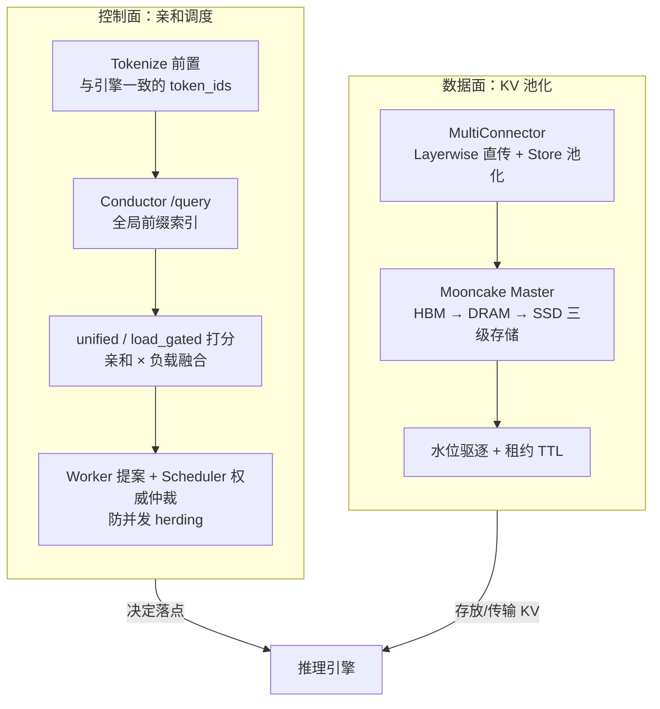
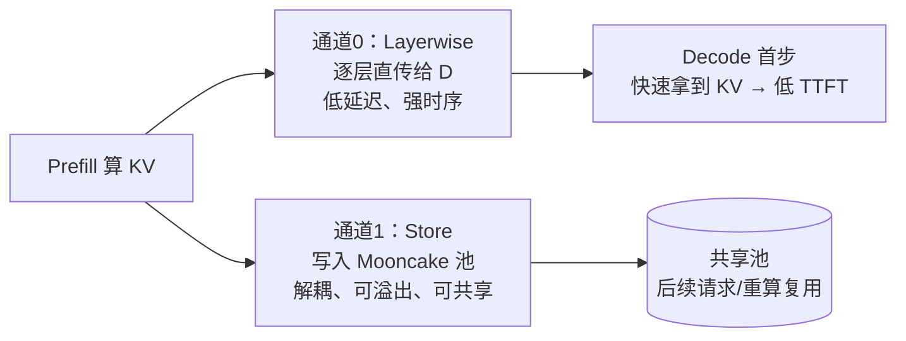

# KV Cache 亲和调度与池化
> 覆盖 23 个知识点 | 来源 22 个文件 | 更新于 2026-07-21

## 1. 一句话总结
在 PD 分离、多 Prefill 副本部署下，通过 **KV 亲和调度（控制面）** 将请求路由到已缓存最长前缀的节点，通过 **KV 池化（数据面）** 将 KV Cache 扩展为跨节点分级共享存储池；两者以乘法关系协同，在长输入、短输出、高前缀复用场景下，可测算 TTFT 降幅达约 70%（代表性测算），核心创新在于将前缀缓存从"单机私有资源"升级为"集群级可调度资产"。

## 2. 核心原理
### 2.1 问题背景
- **多实例前缀缓存碎片化**：vLLM 单实例的 Automatic Prefix Caching（APC）只在实例内部生效。N 个实例做 round-robin 时，同前缀请求落到"上次算过它的那台"的概率仅 `1/N`，集群前缀命中率随实例数线性稀释。
- **单卡 HBM 容量天花板**：HBM 容量极其有限，热点前缀会被 LRU 驱逐，下一次复用又得重算 prefill，无法跨节点共享。
- **PD 分离下 P→D 的时序与显存耦合**：无池化时 KV 走点对点直连，D 必须实时在线等待，P 的 HBM 须保留 KV 直到传完，并发上不去。

### 2.2 方案概述
**两层正交架构，协同解决"路由到哪里"与"KV 放在哪里"两个问题：**



**乘法命中率模型：** 端到端有效前缀命中率 `h = h_reuse × P_route × P_pool`
- `h_reuse`：业务逻辑可复用前缀比例（业务特性决定）
- `P_route`：请求被路由到持有该前缀实例的概率（**亲和调度**负责，Conductor 全局索引将 `P_route` 从 `≈1/N` 拉到 `≈1.0`）
- `P_pool`：该前缀在被复用前仍驻留缓存的概率（**KV 池化**负责，分级存储+水位驱逐+租约保证 `P_pool ≈ 1.0`）

## 3. 实现细节
### 3.1 Tokenize 前置：调度层拿到与引擎一致的 token_ids
**为什么必须做**：Conductor 的前缀匹配在 token 序列上进行（按 block 哈希链式索引），不是 raw text。Coordinator 侧的 token 序列与引擎 prefill 实际收到的必须逐字节一致，否则 `longest_matched` 会系统性偏低或错位。

**实现方式**（`motor/coordinator/scheduler/policy/kv_cache_affinity.py`）：
- `TokenizerManager` 线程安全单例，用 HuggingFace `AutoTokenizer` 加载与下层引擎同一份 `prefill_kv_event_config.model_path`
- 对 chat 请求走 `apply_chat_template(conversation, tools=tools, add_generation_prompt=True, tokenize=True)`
- **tools 必须透传**：函数调用请求的 tools 会被 chat template 注入 prompt，漏传会导致 token 序列分叉（修过的真实 bug）
- **fail-closed 兜底**：tokenize 失败返回 `[]`，调度整体回退 LoadBalance——宁可放弃亲和，也不拿半对序列误导 Conductor
- tokenize 结果一次三处复用：① Conductor 前缀查询；② `isl` 参与亲和打分；③ 负载记账用真实 token 数

**与竞品字符级近似的关键差异**：SGLang/vLLM Router 的 `cache_aware` 用字符级近似 radix tree，刻意不做 tokenize 省开销，但字符前缀相同 ≠ token 前缀相同（chat template / tools 注入会分叉），且对不齐引擎 block 边界。

### 3.2 Conductor 注册与查询：DP rank 粒度的前缀索引
**Conductor 是什么**：Mooncake 社区的全局 KV 前缀索引服务（Go 实现，`dev/kv-indexer` 分支编译），订阅引擎 ZMQ KV Events，维护 PrefixCacheTable，暴露 HTTP 接口。Motor 的 `ConductorApiClient` 是对其的 HTTP 适配层，不实现索引逻辑。

**三个 HTTP 接口**：

| 接口 | 调用方 | 超时 | 作用 |
|------|--------|------|------|
| `POST /register` | Mgmt InstanceManager | 2s | 登记 Prefill 实例/DP：ZMQ 地址、model、block_size、instance_id |
| `POST /unregister` | 实例删除时 | 2s | 从 Conductor 移除索引源 |
| `POST /query` | 每次 Prefill 调度 | **0.2s** | 按 token_ids 查询各 DP 最长前缀匹配 |

**DP rank 粒度**：vLLM DP 部署下每个 DP rank 有独立 KV 池，注册时每个 endpoint 按 `基础端口 + endpoint.id` 单独注册。`/query` 返回 `{instance_id: {"DP": {dp_rank: matched_tokens}}}`，亲和粒度精确到 DP rank 而非实例级。若只做实例级路由，DP=4 时期望有效命中会将 6000 命中稀释到 `1/4 × 6000 = 1500 token`。

**kv-events 机制**：vLLM 引擎每次 BlockPool 状态变更发布 ZMQ 事件（`BlockStored` / `BlockRemoved` / `AllBlocksCleared`），Conductor 订阅后增量维护全局前缀表。事件含 `block_hashes`（链式哈希）、`parent_block_hash`、`medium`（GPU/CPU/DISK，供分层感知）等字段。Conductor 不存 KV 张量，只维护"哪个哈希块在哪个实例/DP"的元数据。

### 3.3 双模式评分：unified 与 load_gated
**unified（默认）——软融合，全局最小者胜：**

```text
score = prefill_load_scale × max(0, isl − overlap_credit × matched) + load_weight × load
```

- 两项均在 **token 量纲**：`prefill_cost` = 扣掉命中后还要真算的 token 数；`load` = `active_tokens + 0.3 × active_kv_cache`
- 默认值 `overlap_credit = load_weight = prefill_load_scale = 1.0`（命中 1 token 恰省 1 token prefill，1 token 排队负载 = 1 token 待算 prefill）
- 极端配置：`load_weight = 0` → 纯前缀亲和；`overlap_credit = 0` + `load_weight = 1` → 纯负载均衡

**load_gated——硬负载上界，两阶段：**
1. 先按负载筛出 Top-N 最低负载 endpoint（`kv_affinity_load_gate_topn`，默认 2）
2. 只在这 N 个里按最长前缀命中排序

**为何必须两种模式**：`unified` 是加权和，命中足够大时任何有限 `load_weight` 都能被翻盘；`load_gated` 要的是**字典序**（先负载、再亲和），负载是硬天花板，无法用任何有限权重的加权和表达。

### 3.4 防并发 herding：Worker 提案 + Scheduler 权威仲裁（三版演进）

**问题**：多个 Coordinator Worker 并发时，各自本地负载视图有滞后，同前缀 burst 会全部算出同一最优 endpoint → 打爆热点。

**V1（已废弃）——in-flight overlay**：Worker 本地记"我刚派出去还没确认的请求"临时加负载。**方向错**：herding 是跨 Worker 现象，overlay 只改本进程视角，其他 N-1 个 Worker 仍堆同一台；且 TTL 两难——太短无效、太长过度惩罚。

**V2（PR #210）——top-k 候选 + Scheduler 重选**：Worker 上报 best-first top-k（k=3）候选，Scheduler 用权威新鲜账本在候选集内重选最低负载者。解决了跨 Worker 一致性问题，但 k 是截断——若 top-3 全被打热但第 4 名完全空闲，选不到。

**V3（PR #304）——全量上报 + 全局重排**：利用 unified 分数可分解性——`prefill_cost`（亲和折扣后的待算量）不随时间变化，`load` 才是易腐数据。Worker 把**每个** endpoint 的 `prefill_cost` 连同权重标量全量上报，Scheduler 用自己新鲜负载重算完整分数取全局 min。无截断，第 4 名场景自然覆盖，Scheduler 不需 prompt/tokenizer/Conductor。

**load_gated 刻意不升级**：其存在意义是硬负载上界，若让 Scheduler 拿软分数全局重排等于把硬约束松绑成软权衡，模式语义被破坏。代码侧 `_select_load_gated` 不带 `with_prefill`，prefill_cost 存 `None` → Scheduler 结构上拿不到重算量。

### 3.5 KV 池化：MultiConnector 双通道 + Mooncake Master
**为什么需要池化**：
1. 单卡 HBM 是 prefix cache 硬天花板，容量一旦超限热点前缀被 LRU 驱逐
2. PD 分离下 P→D 点对点直连有时序与显存耦合
3. 跨节点共享——让"别人算过的前缀"也能用

**MultiConnector 双通道设计：**



| 通道 | Connector | 优点 | 代价 |
|------|-----------|------|------|
| 快路径 | `MooncakeLayerwiseConnector` | 逐层流水，不经 Master，压低 TTFT | 需 P/D 同时在线，强耦合 |
| 持久层 | `AscendStoreConnector` | P 写完即走、跨节点共享、可溢出 | 多一跳存储 RTT |

**典型配置**：`connectors[0]` = Layerwise 做 PD 直传，`connectors[1]` = AscendStore 做共享池持久化。亲和部署示例中 `use_layerwise = false`（仅 Store，依赖池化做全局可达落地），纯池化示例中 `use_layerwise = true`（双通道并行）。

### 3.6 池化驱逐与租约机制
**Mooncake Master 启动参数**（由 `kv_cache_pool_config` 生成）：

| 参数 | 默认 | 含义 |
|------|------|------|
| `eviction_high_watermark_ratio` | 0.9 | 占用率达 90% 触发驱逐 |
| `eviction_ratio` | 0.1 | 单次批量驱逐池容量的 10%（批量非逐条，摊销开销） |
| `default_kv_lease_ttl` | 11000ms | KV 写入后在 TTL 内保证不被驱逐 |

**租约 TTL 的安全边界**：`default_kv_lease_ttl > max(T_decode, ASCEND_CONNECT_TIMEOUT, ASCEND_TRANSFER_TIMEOUT)` ——确保 D 一定读得到，否则还没读完就被驱逐 → recompute。

**release_kv**：Prefill 完成后通知 P 节点本地 HBM 可回收，但**不等于删除池中数据**——池中 KV 的生命周期由租约 TTL + 水位驱逐独立控制。

### 3.7 防御性工程与可观测性
- **上下文长度预校验（PR #349）**：tokenize 前置后调度层已知真实 token 数，直接在入口拒绝超长请求
- **P 负载及时释放（PR #368/#393）**：PD 分离下 prefill 完成即释放 P 实例负载，不等整个请求结束
- **热路径优化（PR #394）**：UPDATE_WORKLOAD 幂等去重集改有界 FIFO；ALLOCATE 用裸 float 传输省序列化；request_id 用"前缀+自增"替代 uuid4
- **cached_tokens 透传**：响应中 `usage.prompt_tokens_details.cached_tokens` 透传，客户能直接观测亲和命中效果
- **Prometheus 指标**：`kv_pool_size`（容量）、`kv_pool_ratio`（使用率）、`kv_pool_eviction`（驱逐计数）、`kv_pool_keys`（条目数）
- **日志分层**：Worker 选点日志压 DEBUG（提案），Scheduler 提交的最终分配打 INFO（含 matched/load/score/repicked）

## 4. 框架对比
### 4.1 四档路由精度对照

| 档位 | 机制 | 知道真实 KV？ | 跨用户共享前缀 | 代表 |
|------|------|---------------|----------------|------|
| A Session sticky | session/user consistent hash | 否 | 否 | vLLM Router `consistent_hash` |
| B Prefix hash | `hash(前 N token)` → ring | 否 | 部分 | SGLang `prefix_hash` |
| C **近似打分** | 本地 radix/trie，按路由历史猜 | **否**（无驱逐感知） | 是（可假阳性） | **SGLang/vLLM Router `cache_aware`** |
| D **真值反馈** | ZMQ BlockStored/Removed 或 LMCache Lookup | **是**（含驱逐感知） | 是且更准 | **Motor + Conductor**；Dynamo；llm-d precise |

**金句**："他们猜缓存（字符级近似树），我们查缓存（token 级 + Conductor 全局索引）。"

### 4.2 关键竞品对标

| 维度 | SGLang / vLLM Router `cache_aware` | Motor + Conductor |
|------|-----------------------------------|-------------------|
| 索引来源 | 路由器本地近似 radix tree，按路由历史推断 | Conductor 订阅引擎 ZMQ BlockStored/Removed 真实事件 |
| 匹配粒度 | **字符级**（`DashMap<char, NodeRef>`） | **token 级、block 对齐**（与引擎哈希同构） |
| 驱逐感知 | 无（自管 LRU 只裁路由树，不知引擎已驱逐） | 有（BlockRemoved 事件实时更新，无假阳性） |
| 算法 | 失衡 → 最短队列；否则 match_rate > threshold → 命中 worker | unified（软融合）/ load_gated（硬门控），均加 Scheduler 权威仲裁防 herding |
| 假阳性 | 系统性（引擎已驱逐但路由树仍认为有） | 主要为事件空窗假阴性（残缺索引 → 少算命中 → 安全退化 LB） |
| tokenize 成本 | 零（字符匹配的卖点） | 毫秒级 CPU，一次 tokenize 三处复用 |

## 5. 面试要点
### 5.1 常见追问
#### Q: 亲和调度为什么必须 tokenize 前置？字符级近似不够吗？
- Conductor 前缀匹配在 token 序列上做（block 哈希链式），不是 raw text
- chat template / tools 注入 / 多模态占位符展开会使字符前缀与 token 前缀分叉
- 对不齐引擎 block 边界（block_size 通常 16 或 128），无法精确估可复用 block 数
- 一次错判前缀边界在长输入场景可导致级联 miss 整段前缀（数千 token 重算）

#### Q: unified 和 load_gated 为什么必须两种模式，不能用 load_weight 调出来？
- `unified` 是加权和，单调可交易——命中足够大时任何有限 `load_weight` 都能被翻盘
- `load_gated` 要**字典序**（先负载、再亲和），负载是硬天花板
- 字典序无法用任何有限权重的加权和表达：要"负载绝对优先"得 `load_weight → ∞`，那亲和被彻底压死、退化纯 LB
- 数学上做不到用单一模式覆盖两种语义

#### Q: 多个 Worker 并发调度，怎么防止同前缀请求都打到同一实例？
- 三版演进：本地 in-flight overlay（废弃：只改本进程，跨 Worker 无效）→ top-k 候选 + Scheduler 重选（k=3 截断可能漏全局最优）→ 全量上报 prefill_cost + Scheduler 全局重排
- 当前 V3：Worker 把每 endpoint 的亲和折扣量（prefill_cost）全量上报，Scheduler 用权威新鲜负载重算完整 unified 全局 min
- 分工精髓：亲和的数学 Worker 已算完（prefill_cost 不随时间变），负载的新鲜值由 Scheduler 补上——不重复 prompt/tokenizer/Conductor 查询

#### Q: Conductor 挂了或查询超时怎么办？
- 查询超时 0.2s → 亲和路径返回 None → 回退 LoadBalance → 再失败 round_robin
- 亲和是**优化不是依赖**，可用性不受影响
- Conductor 重启后：拓扑对账重注册（`re_register_kv_instances`）+ kv-events replay 增量补拉重建索引
- 重启窗口内 `/query` 返回残缺索引，但错向是**安全**的：假阴性 → 少算命中 → 退化 LoadBalance，不会像本地树假阳性那样把请求打到已被驱逐的实例

#### Q: TTFT 降幅 70% 是实测还是测算？
- **代表性测算，非实测**：基于 Qwen3-32B、TP4、ISL≈8192、共享前缀≈6.5K、单 P ~6.5k token/s 的假设模型
- 公式 `TTFT = c0 + T_prefill × (1 − h)`，基线 h≈0.10 → 1187ms，亲和 h≈0.78 → 351ms（−70.5%）
- 三个假设按脆弱度排序：h 从 0.10 升到 0.78 **最脆**（非测量）、6.5k token/s 量级粗估（可能高估）、c0≈80ms 加性常数对百分比影响小
- **代码和可观测链路可验证机制成立**（cached_tokens 透传、Scheduler 权威日志），但无留存可复核的端到端 A/B 原始实测数据
- 验证方案：两组都开 prefix-caching，只切 `load_balance ↔ kv_cache_affinity`（不能用"关 cache vs 开 cache+亲和"对照，那会把引擎前缀缓存功劳算给路由）；固定同批请求回放；报 P50 + P95/P99；冷启动轮次单独分桶剔除

#### Q: 亲和粒度为什么必须到 DP rank 而非实例级？
- vLLM DP 下每个 DP rank 有独立 KV 池，前缀在 rank A 不等于 rank B 有
- 实例级路由只知道"实例命中多少"却不知在哪个 rank，落点等于实例内随机选 rank
- DP=4、matched=6000 时代入：实例级期望有效命中 = `1/4 × 6000 + 3/4 × 0 = 1500 token`，有效命中率从 0.73 掉到 0.18
- 粒度错一层，收益直接打到 1/DP

### 5.2 口述话术
**30 秒电梯稿**：
> MindIE 在 PD 分离 + 多 Prefill 副本场景下做 KV 亲和调度与池化：调度侧用 Coordindator 本地 tokenize（与引擎完全一致）后查询 Mooncake Conductor 的全局前缀索引，再通过 unified（亲和-负载融合打分）或 load_gated（负载硬约束内选最长前缀）两种模式选择最优 Prefill 实例及 DP rank；针对多调度进程并发 herding 问题，设计了"Worker 亲和提案 + 中心 Scheduler 权威负载全局重排"的两级决策架构。数据面用 MultiConnector 组合 Layerwise 逐层直传（压低 TTFT）和 AscendStore 写入 Mooncake 分布式 KV 池（解耦 P→D、跨节点共享）。两者以乘法命中率模型 `h = h_reuse × P_route × P_pool` 协同：亲和负责抬高路由命中概率，池化负责保证缓存持久可访问。

**与竞品对标一句**："SGLang/vLLM Router 用字符级本地树猜缓存（零依赖但无驱逐感知、工具/模板场景易偏差）；Motor 用同源 tokenize + 查 Conductor 真索引——付毫秒级 CPU 和一跳 HTTP，换 token/block 级精度与驱逐感知。"

## 6. 延伸阅读
### 6.1 相关主题
- **PagedAttention 与 Continuous Batching**：引擎内核中 Prefix Cache 的链式哈希、LRU 驱逐与 ref_cnt 机制
- **ZMQ KV Events 详解**：BlockStored/Removed/AllBlocksCleared 事件格式、发布-订阅拓扑、Replay 机制
- **Mooncake 三层架构**：Transfer Engine（数据面）/ Store（对象存储）/ Conductor（前缀索引）的职责分离
- **NVIDIA Dynamo KV Router**：代价函数路由、KVBM G1-G4 统一分层内存、与 Motor 的 precise 解法对比
- **昇腾上的 KV 传输**：Mooncake TE Ascend 后端（HCCL TransportMem / Direct / 异构 RDMA）与 TP 中 HCCL AllReduce 的区分
- **KV Cache Utilization 与假命中**：亲和调度在高负载下的稳定性闭环节

### 6.2 源文件

| 文件路径 | 标题 | 类型 |
|---------|------|------|
| wiki/repos/mindie-pymotor/kv-affinity.md | KV Cache 亲和调度 | 核心文档 |
| wiki/repos/mindie-pymotor/kv-pool.md | KV 池化：意义与实现细节 | 核心文档 |
| wiki/repos/mindie-pymotor/kv-pool-and-affinity.md | KV 池化 × KV 亲和 联合调度 | 核心文档 |
| wiki/raw/articles/pymotor/kv_cache_affinity_deep_analysis.md | KV Cache Affinity 深度技术分析报告 | 技术分析 |
| wiki/raw/articles/pymotor/kv_cache_affinity_report.md | KV Cache 亲和性调度技术介绍与竞品分析报告 | 竞品分析 |
| wiki/raw/articles/pymotor/kv_cache_affinity_summary_interview.md | KV Cache 亲和调度面试速览 | 面试速览 |
| wiki/raw/articles/pymotor/pr210_kv_affinity_topk_candidates_deep_analysis.md | PR #210 top-k 候选 + Scheduler 权威重选 | PR 分析 |
| interview/interview-review/04-KV亲和调度与Mooncake专题.md | KV cache 亲和调度与 Mooncake 架构 | 面试专题 |
| interview/interview-review/12-PyMotor-KV亲和性调度特性全解与简历素材.md | PyMotor KV 亲和性调度特性全解 | 面试专题 |
| interview/interview-review/15-vLLM-Router与SGLang-KV亲和性设计调研.md | vLLM Router 与 SGLang KV 亲和性设计 | 竞品调研 |
| interview/kv knowledge/00-概念与分层模型.md | 概念与分层模型 | 知识库 |
| interview/kv knowledge/01-框架对比总表.md | 框架对比总表 | 知识库 |
| interview/kv knowledge/02-llm-d.md | llm-d KV 亲和与池化 | 知识库 |
| interview/kv knowledge/03-NVIDIA-Dynamo.md | NVIDIA Dynamo KV Router | 知识库 |
| interview/kv knowledge/04-AIBrix.md | AIBrix KV 亲和与池化 | 知识库 |
| interview/kv knowledge/05-SGLang-HiCache与Router.md | SGLang HiCache 与 Router | 知识库 |
| interview/kv knowledge/06-vLLM-Mooncake-Motor.md | vLLM / Mooncake / Motor | 知识库 |
| interview/kv knowledge/07-亲和与三级池化交互.md | 亲和与三级池化交互 | 知识库 |
| interview/kv knowledge/08-选型与面试口述.md | 选型与面试口述 | 知识库 |
| interview/kv knowledge/09-ZMQ-KV-Events详解.md | ZMQ KV Events 详解 | 知识库 |
| interview/kv knowledge/12-KV池化完整综述.md | KV 池化完整综述 | 知识库 |
| interview/interview-review/13-KV亲和性调度模拟面试对练实录.md | KV 亲和性调度模拟面试对练实录 | 面试实录 |