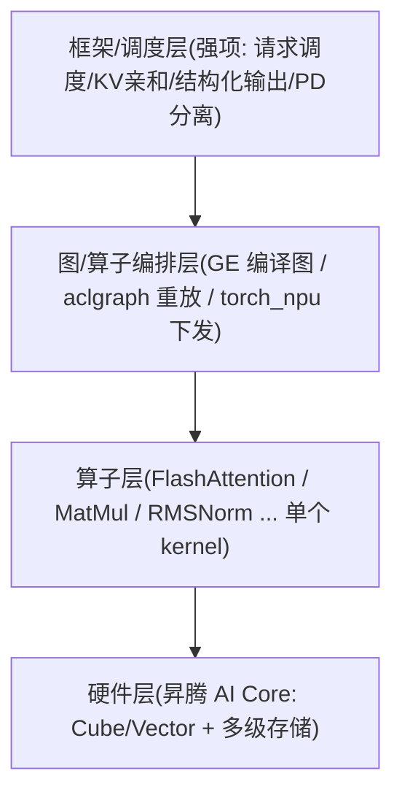

# 汇总（一）· 推理算子与硬件总纲

> 覆盖 50+ 个知识点 | 来源 35+ 个文件 | 更新于 2026-07-22

> 本篇把 `docs/suanzi/` 全套技术内容融合成一条自洽主线：**硬件 → Roofline → 图下发 → FlashAttention → Attention 家族 → Linear/FFN/MoE → Norm/量化 → 调度交界**。
> 面向「懂推理框架/调度、但没写过底层算子」的读者。诚实边界贯穿全篇：框架/调度是主战场，算子层靠 Roofline + 读源码（`ops-transformer`/`runtime`）撑住追问，不谎称独立交付 AscendC/HCCL kernel。
> 姊妹篇：`汇总-简历算子面试答辩总纲.md`（把下面的技术挂到简历口述与答辩口径）。

---

## 0. 一张从框架到硬件的全景图



- **框架层**决定「哪个请求先算、KV 放哪、batch 怎么攒」。
- **算子层**决定「一次矩阵乘/一次 attention 具体怎么在芯片上算」。
- **硬件层**是算子最终落地的地方；理解算子必须先懂一点硬件。

一句话主线：**推理优化的很大一部分，就是想办法少搬数据、让搬进来的数据多算几次。**

---

## 1. 硬件与 Roofline：判断「卡在哪」

### 1.1 昇腾 NPU 关键部件

| 术语 | 大白话 | 类比 NVIDIA |
|---|---|---|
| AI Core | NPU 里真正干活的计算核心，一张卡几十个 | SM |
| **Cube（AIC）** | 专做**矩阵乘**的单元，算力极高 | Tensor Core |
| **Vector（AIV）** | 做逐元素/向量运算（加乘、exp、softmax、norm）| CUDA Core |
| HBM / GM | 显存，大但**慢**，所有核共享 | HBM |
| L2 / L1 / L0 / UB | 逐级更快更小的片上缓存；L1 软件显式管理，UB 是 Vector 专用 | Shared Memory 附近 |

数据默认躺在慢而大的 HBM，算之前一层层搬到快而小的片上缓存（L2→L1→L0/UB），算完再搬回去。

### 1.2 Cube 为什么怕「M=1」（fractal 16×16×16）

Cube 做矩阵乘的最小硬件粒度叫 **fractal**，形状固定 `M×N×K = 16×16×16`，一次必须凑够 16 行（M=16）才启动。Decode 每步只算 1 个 token，矩阵乘 M 维只有 1 → 被迫 padding 到 16，**只有 1/16 ≈ 6.25% 算力在做有用功**。这就是「Decode attention 访存密集、Cube 利用率极低」的微观原因。

### 1.3 矩阵乘三维度 M / N / K

```
A[M, K] × B[K, N] → C[M, N]
     ↑        ↑         ↑
    行数≈token  归约维    输出列
```

| 维 | 含义 | Decode 里常出的问题 |
|----|------|---------------------|
| **M** | 输出行数 ≈ token 数 | Decode 常 =1 → Cube 喂不饱 |
| **K** | 归约维（inner）| 一般够大，不是主因 |
| **N** | 输出列数（TP Column 常切 N）| 可切分 |

**关键**：只看 K、N 大不能说明 Cube 打满——**决定性的是 M**。K/N 大只说明「有东西可切、可累加」，M 太小照样浪费。

### 1.4 Roofline 与四种 bound

| 术语 | 含义 |
|---|---|
| **算术强度 OI** | 每从 HBM 搬 1 字节能做多少次计算（FLOPs/Byte），越高越划算 |
| **屋脊点** | 峰值算力 ÷ 峰值带宽（昇腾 910B ≈ 209）|
| **计算密集（compute-bound）** | OI > 屋脊点，瓶颈在算力。典型：**Prefill**。救法：加大 batch、TP |
| **访存密集（memory-bound）** | OI < 屋脊点，瓶颈在带宽。典型：**Decode**。救法：量化/减 KV/融合 |
| **Host-bound** | 瓶颈在 CPU 逐个下发算子太慢、Device 空等。典型：小 shape、层多的 Decode。aclgraph 专治 |

**必背结论**：
- **Prefill 计算密集**：一段几千 token 的 prompt 共用一份 KV，搬一次算几千次，OI 高。
- **Decode 访存密集**：每次只出 1 个 token，搬一大堆权重/KV 却只算 1 次，OI≈1。
- 这条结论直接推出 **PD 分离**：Prefill 节点开大 TP 打满算力降 TTFT，Decode 节点用 DP/EP 扩吞吐。

**三分支排查口令**：
- NPU 利用率低 + CPU/下发间隙大 → Host-bound → 上 Graph。
- NPU 忙 + HBM 带宽打满 → memory-bound → 量化 / 减 KV / 融合。
- NPU 忙 + 算力打满、带宽有余 → compute-bound → TP / 算法减算。

### 1.5 指标三件套

| 指标 | 含义 | 主要反映 |
|------|------|----------|
| **TTFT** | 首 token 时延 | Prefill + 排队 |
| **TPOT** | 每生成 token 间隔 | 单步 Decode |
| **吞吐** | tokens/s 或 req/s | 集群效率，常与 TPOT/batch 权衡 |

优化前先问客户要哪一个，三者手段不同。

---

## 2. 图下发：GE 图编译 vs aclgraph

两者**不在同一层，比的是「省什么」**：

- **aclgraph = 运行期 Capture & Replay**：把 forward 里已有的一串单算子 Kernel 原样录下来，之后从 Host 一次性重放。不碰 Kernel 内部，**只省 Host 侧逐个下发的调度开销**。
- **GE = 编译期整图优化**（`torch.compile` 的 max-autotune）：FX 图 → Ascend IR → 图引擎编译，做算子融合 / SuperKernel / 全图内存复用 / 多流并行，**直接降低 Device 侧计算与访存**。

### 2.1 核心对比表（可直接背）

| 维度 | aclgraph | GE 图模式 |
|---|---|---|
| 优化时机 | 运行期：录 Kernel 流重放 | 编译期：整图融合/内存/调度 |
| 省什么 | **Host 调度开销** | **Device 计算/访存** + Host |
| 算子融合 | **不做**，原样录制 | 支持（图融合+UB融合+SuperKernel）|
| 内存规划 | 各图独立，复用有限 | 全图复用，峰值显存更低 |
| 约束 | 强静态 shape、attention 需打补丁 | 需注册 Ascend IR、编译慢、动态性弱 |
| 擅长 | **Host-bound**（小 shape、decode）、快速上线 | **Device-bound**、可融合、追极致 |

两者**可叠加**：编译期先融合省 Device，运行期再叠加捕获重放省 Host。

### 2.2 aclgraph 的 API 链与两个「为什么」

```
aclmdlRICaptureBegin(stream, MODE)   // 开始捕获，任务只下沉不执行
   ...下发算子/拷贝任务...
aclmdlRICaptureEnd(stream, &modelRI) // 得到可复用的 CaptureModel
aclmdlRIExecuteAsync(modelRI, stream)// 重放，Host 不再逐个下发
aclmdlRIDestroy(modelRI)
```

- **为什么必须静态 shape**：捕获时 Host 侧 tiling / block_dim / 输入输出地址全冻进图，重放时不再重算，shape 一变就对不上。
- **为什么 attention 要打补丁**：attention 的 tiling 依赖每步在变的 `seq_lens`，冻结值会算错。上层用 `update_attn_params` 这类 hook，在独立 stream 上用新 `seq_lens` 重算 tiling 并「打补丁」进捕获图（底层是 runtime 的 `aclmdlRICaptureTaskUpdateBegin/End`）。

### 2.3 怎么判断该上谁（诊断表）

| 现象（profiling） | 更可能 | 优先动作 |
|-------------------|--------|----------|
| NPU 利用率低，下发间隙大 | Host-bound | aclgraph，减碎 kernel |
| NPU 忙，HBM 带宽打满 | memory-bound | 量化、融合、压 KV |
| NPU 算力打满，带宽有余 | compute-bound | TP、减冗余计算 |
| 小算子多、中间结果频繁落 GM | Device 访存碎 | 手写/GE 融合；单靠 aclgraph 不够 |

**误区**：已 Device-bound 时只开 aclgraph，Device 负载不变，收益很小甚至因 padding/重捕获变慢。

---

## 3. FlashAttention 与 online softmax（核心考点）

朴素 Attention：`S=QKᵀ → P=softmax(S) → O=PV`，中间 `S/P` 反复进出 HBM，O(N²) 访存、算力闲置。FA 靠三招砍掉：

| 招 | 作用 |
|---|---|
| **Tiling** | Q/K/V 分块驻留片上，不物化完整 `S/P` |
| **融合** | 块内一口气做 `QK→softmax→×V`，只把最终 `O` 写回 HBM |
| **Online Softmax** | 维护 running max/sum 分块增量修正，**数学等价**于对全行做 softmax |

### 3.1 Online softmax 增量公式（能白板手推）

softmax 要先对整行求 max（数值稳定）再求 sum，但 FA 把 KV 按块流入、看不到整行。解法是「边看边修正」，维护三个 running 状态 `m`（max）、`l`（sum）、`O`（部分输出）。来一个新块 `S_i`：

```
m_i   = max(m_{i-1}, rowmax(S_i))          # 更新全局最大值
scale = exp(m_{i-1} - m_i)                  # 旧状态修正因子（关键，≤1）
l_i   = scale · l_{i-1} + rowsum(exp(S_i - m_i))
O_i   = scale · O_{i-1} + exp(S_i - m_i) · V_i
```

最后统一 `O = O_last / l_last`。**直觉**：max 变大后，之前用旧 max 算的东西都「偏大」，乘上 `scale` 缩放到新基准，就跟一次性看整行完全等价。**要背的只有 `scale=exp(m_old−m_new)`。**

### 3.2 两块手算例子

一行 score 切成两块 `S0=[2,1]`、`S1=[3,0]`：

```
一次性 safe softmax：整行 max=3，sum ≈ e^{-1}+e^{-2}+1+e^{-3} ≈ 1.553

Online 分块：
  块0: m0=2, l0=e^0+e^{-1}≈1.368
  块1: m1=max(2,3)=3, scale=exp(-1)≈0.368
       l1=0.368×1.368 + (1+e^{-3}) ≈ 1.553  ✓（与一次性一致）
```

### 3.3 对到源码（可复述）

最直观的实现在 `fused_infer_attention_score` 的 epilogue：`.../online_softmax/fused_block_epilogue_online_softmax_softmax.inc.hpp`。命名规律：`lm/ll`=本块 max/sum，`gm/gl`=running max/sum，`hm`=合并后新 max，`dm`=修正因子 `exp(gm-hm)`。

- `Max(hm, lm, gm)` → `m_i = max(m_{i-1}, rowmax(S_i))`
- `Sub(dm, gm, hm)` + `Exp(dm)` → `scale = exp(m_{i-1}-m_i)`
- `Sub(ls, hm) + Exp(ls)` → `exp(S - m_i)`
- `Mul(gl, dm, gl) + Add(gl, ll)` → `gl = dm*gl + ll`，一字不差就是 `l_i = scale·l_{i-1} + rowsum(...)`

部分输出 `O` 的 `scale·O_{i-1} + P·V` 修正在 `MM[PV]` 累加/输出阶段完成。训练/prefill 主算子用高阶封装 `SoftmaxFlashV2`（同一套逻辑）。

### 3.4 FA 版本演进（对照即可）

v1 提出 tiling+online softmax；v2 改 Q 外层循环、更好 warp 切分；v3 针对 Hopper（TMA/WGMMA/FP8）；v4 Blackwell。昇腾侧对应 FAS/PFA/IFA/FIA，算法内核一致、实现栈不同。

### 3.5 AscendC 工程组织（会用层面）

一个算子目录就是「Host 切分 + Device 计算」两段：`op_host/`（算子定义+infershape+tiling，决定怎么切到各核/核内）、`op_kernel/`（真正跑在 AI Core 上的 kernel，四阶段流水 `IterateBmm1→ProcessVec1(online softmax)→IterateBmm2→ProcessVec2`）、`op_api/`（aclnn 接口）。**Tiling 是算子性能的灵魂**：FA 有 B/N2/G/S1/S2 五个轴，先核内选切分轴、再核间按核数切；CV 分离下 Cube 基本块 `128×128`、Vector `8×1024`，按 1:16 配比减少 CV 通信。

---

## 4. Attention 家族 / PagedAttention / MLA

### 4.1 选型表（先背）

| 场景 | 用哪个 | 为什么 |
|------|--------|--------|
| 训练/通用 FA | `flash_attention_score` (FAS) | 完整 FA + 常有 grad |
| 推理 Prefill | `prompt_flash_attention` (PFA) | Q 长，切 Q，Cube 满，计算密集 |
| 推理 Decode | `incre_flash_attention` (IFA) | Q=1，切 KV，可能 ALL_VEC |
| Prefill+Decode 统一 | `fused_infer_attention_score` (FIA) | 一个入口；online softmax 目录最清晰 |
| DeepSeek MLA | `mla_preprocess/prolog` + `kv_quant_sparse_flash_attention`/`sparse_flash_mla` | 压 KV + absorb |
| Paged KV 读写 | `scatter_pa_kv_cache` / `gather_pa_kv_cache` | block_table 散列/聚集 |

口诀：**训练 FAS；Prefill PFA；Decode IFA；懒得分就 FIA；DSv3 走 MLA 链。**

### 4.2 Prefill vs Decode 为何拆成两套算子

| | Prefill (PFA) | Decode (IFA) |
|--|---------------|--------------|
| Q 长度 | 大（整段 prompt）| 1（+MTP 时 4~8）|
| 切谁 | 切 Q（s1BaseSize≈128）| 切 KV |
| Cube M 维 | ≈128，满 | ≈1（或 GQA/MLA 拼 head）|
| Reduce | 每核独立出自己的 Q 块 | 多核局部 softmax 要合并 |
| OI | 高，计算密集 | 低，访存密集 |

不是「两个名字」，是两套 tiling 哲学——一个喂饱 Cube，一个在 Q=1 下抢救带宽与多核。IFA 的 tiling 可能在 `CUBE_VIEW_MM`（KV 够长仍走 Cube）、`ALL_VEC`（Vector 做点积）、`CUBE_VIEW_MM_MLA`（MLA 专用，M 被 head 拉大）之间切换——这是「算子承认 Decode 喂不饱 Cube」的工程证据。

**IFA 为什么必须 Reduce**：PFA 各核负责不同 Q 行块，直接写出自己的 O，不用合并；IFA 只有 1 行 Q 却把 KV 切给多个核，每核只有局部 `(m,l,O)`，必须按 online softmax 规则再合并一次，否则 softmax 分母不对。**一句话：PFA 切的是「输出行」，IFA 切的是「同一行的输入 KV」——后者才要 reduce。**

### 4.3 PagedAttention

| 框架概念 | 算子动作 |
|----------|----------|
| `block_table` | 逻辑 token → 物理 block 索引表 |
| `block_size` | 每页装多少 token（如 16/128）；太小索引开销大，太大浪费碎片 |
| 写入新 K/V | `scatter_pa_kv_cache`（也可融入 `*_rope_cache`），按表写非连续 block |
| Attention 读 KV | **多数路径 FA/IFA kernel 内部按 block_table 间接寻址**，不一定先 gather |
| 显式聚集 | `gather_pa_kv_cache`：需要连续 KV 缓冲时才用 |

**常见误解**：以为每次 Decode 都是 `gather→FA→scatter`。实际常常是 **scatter 写 + FA 直接读 paged 布局**。收益：显存按页分配，避免按 max_len 预留；与 Continuous Batching 配套。多请求不同长度靠 TND/VarLen packed 拼成一个大 tensor（用前缀和 `actual_seq_qlen` 标边界），让核持续吃到大 Q 块。

**和 Graph 的矛盾**：Graph 喜欢固定地址/shape，而 `block_table`/`seq_lens` 每步变。CUDA Graph 用 FULL+更新 metadata / PIECEWISE / padding；ACL Graph 用 `update_attn_params` / TaskUpdate 打补丁。

### 4.4 MLA（DeepSeek）——只记能防守的深度

| 架构 | 每 token KV 量级 | Decode OI 特征 |
|------|------------------|----------------|
| MHA | 很大（多 head×D×2）| OI 近似恒定且低 |
| GQA | 中等 | 仍偏低 |
| **MLA absorb** | **~576 维 latent** | KV 极省；OI 可随 S_kv 爬升 |

算子链要分清：`mla_preprocess`（Prefill 编码，hidden→latent 写入 cache）vs `mla_prolog`（Decode 前处理，准备 Q'/K），真正算注意力用 `kv_quant_sparse_flash_attention` / `sparse_flash_mla`。

两个易混点（面试加分）：
1. **Cube fractal M=128 满载 ≠ 整步计算密集**：MLA 可把 128 head 拼进 M，但短 S_kv 时 `W_absorb ~200MB/步` 仍可主导搬运 → 仍访存密集。**只有长上下文 + MTP 才更可能翻转**，勿绝对化背「MLA Decode 已是计算密集」。
2. **线性层靠 batching 拉 M；Attention 不能跨请求拼 KV**，只能靠 GQA/MLA（head 维）+ MTP（token 维）。

长序列稀疏（`sparse_flash_*`、`block_sparse_attention`、`nsa_*`）知道存在即可，加分项不阻塞主线。

---

## 5. Linear / FFN / MatMul / SwiGLU

Decode 一步里 **Linear/FFN 往往吃掉大半时间**（读超大权重）。Transformer 一层的权重相乘步骤：QKV 投影、O 投影、FFN(gate/up→SwiGLU→down)、LM Head。Prefill 时 M 大 → 大 GEMM 偏计算密集；Decode 时 M≈1 → 像 GEMV 偏访存密集。**优化主线：少读权重、把 M 做大、把小算子融进大 MatMul。**

### 5.1 大 batch 为何救 FFN 特别狠

所有请求乘同一份权重 W，可把 token 拼成 `[B,H]×W`：权重 HBM 读取 ≈ `K×N`（**与 M 无关**），计算量 ∝ M。M 从 1→100，同一份权重摊到 100 个 token，OI 飙升，Cube 从空转到接近满。**粗算直觉 `OI ≈ M`**：

| M | 粗算 OI（仅摊权重）|
|---|-------------|
| 1 | ~1 |
| 32 | ~32 |
| 128 | ~128 |

昇腾 910B 屋脊点约 209，M 到几十～上百，FFN 才有机会接近/超过屋脊点。这是 Continuous Batching 在算子层的收益来源。

### 5.2 Attention 为什么不能像 FFN 一样拼 M（钉死句）

每条请求 KV Cache **内容不同**，不能拼成一个大 MatMul。Decode Attention 只能多核各跑各的 M=1，或用架构改造（GQA/MLA 在 head 维拼 M）+ MTP。**金句：大 batch 让 FFN「单核变快」；让 Attention「核都有活干」，但单核 Cube 仍可能打不满。**

### 5.3 QKV 合并与 SwiGLU 融合

- **QKV 合并**：三次独立投影 = 三次读权重启动；合并成一次 MatMul 减 launch、权重只走一遍 HBM、TP 按 head 切更自然。
- **SwiGLU**：`FFN(x) = (SiLU(x·W_gate) ⊙ (x·W_up))·W_down`。落地常为 Gate+Up 一次合并 MatMul 出两半 → `silu_and_mul` 一个 kernel 做激活与逐元乘 → Down MatMul。MoE 场景常用 `gmm/grouped_matmul_swiglu_quant`（GMM+dequant+SwiGLU+quant 一条龙）。

### 5.4 TP 下 Linear 怎么切

| 切法 | 切权重哪一维 | 典型层 | 通信 |
|------|--------------|--------|------|
| Column Parallel | N（输出维）| QKV、gate/up | 前向可无 |
| Row Parallel | K（输入维）| O、down | AllReduce / ReduceScatter |

**M（token 维）在 TP 下通常完整**——切的是权重不是序列（切序列叫 SP）。这解释了「TP 降 TTFT」：每卡算力与权重搬运都变少。Row Parallel 的 MatMul+AllReduce 最适合用 MC2 通算融合叠起来。

---

## 6. Norm / RoPE / 小算子融合

Norm、RoPE 本身算得快，但若每个都单独起 kernel，Host 下发 + `UB↔GM` 往返会在 Decode 里被放大。**昇腾推理里 Norm/RoPE 的正确打开方式往往是融合大算子，而不是裸 `rms_norm` 三次。**

- **RMSNorm**：`y = x / sqrt(mean(x²)+eps) * weight`，没有减均值项，比 LayerNorm 轻，但仍是 Vector 小算子，单独起 kernel 税很高。
- **RoPE**：用 sin/cos 对 Q/K 旋转注入位置，**V 通常不转**。两种实现风格 `rotate_half`（前后半配对）与 `interleaved`（相邻维配对）**不能混用同一套 cos/sin cache**，否则位置编码错、Attention 静默变差——风格一致比背公式更重要。
- **融合落点**（`posembedding/`）：`kv_rms_norm_rope_cache`（Norm→RoPE→scatter 写 cache）、`qkv_rms_norm_rope_cache`（更重的一条龙）、`rope_quant_kvcache`（RoPE→量化→写 cache）。**Decode 每步产生新 K/V 后马上要 Norm/RoPE/量化/按 block_table 写 Paged KV，四步拆开则多轮 HBM 往返，融合成一条龙一次搬完。**

小算子的税 = Host 准备下发 + Device 启动 kernel + HBM 读入算写回，Decode 每层每步都做、层数×步数后很重。这和「aclgraph 省 Host、GE/手写融合省 Device 访存」是同一战场的两侧。

---

## 7. MoE 与通算融合 MC2

### 7.1 MoE 一层链路

```
Hidden
  → moe_gating_top_k(_softmax)       # 每个 token 打分选 top-k 专家
  → moe_init_routing / token_permute # 按专家把 token 重排到连续内存
  → grouped_matmul (+ swiglu_quant)  # 每个专家各自 GEMM，一次 GMM 跑完
  → moe_token_unpermute / finalize   # 还原顺序，按权重加权求和
```

口述：「门控 → 按专家重排 → GMM → 还原加权」，具体 API 名以版本为准。

**为什么用 Grouped MatMul**：8 个专家分到的 token 数不同，朴素做法要 8 次 MatMul 或 pad 到等长（启动多/浪费）；GMM 一次 kernel 处理多组不等长 GEMM，按 `group_list` 切。**MoE 的计算形态是「多组小/中 GEMM」，不是一个大 dense FFN。**

**负载不均**（常追问）：热门专家分到远多于平均的 token → GMM 里最长 group 拖尾、EP AllToAll 也不均。对策：aux loss（训练）、限流/重平衡、容量因子、专家副本策略。要承认「MoE 的理论算力节省会被不均和通信吃掉一部分」。

### 7.2 MC2：通信藏进计算

| 算子 | 融合 | 用途 |
|------|------|------|
| `matmul_all_reduce` | GEMM ⊕ AllReduce | TP Row-Parallel：O/down proj |
| `matmul_reduce_scatter` | GEMM ⊕ ReduceScatter | 配 SP/TP 降通信量 |
| `moe_distribute_dispatch` | 量化打包 ⊕ AllToAllV | EP：token 发给专家所在卡 |
| `moe_distribute_combine` | AllToAllV ⊕ 加权合并 | EP：收回专家输出 |

**收益本质**：AI Core 算矩阵时，HCCL 在别的引擎搬数据 → comm-compute overlap。MC2 是性能优化，不是功能必需（没有它 MatMul 与 AllReduce 串行、通信暴露）。

### 7.3 EP dispatch/combine 与并行偏好

EP（专家并行）不同卡持有不同专家：token 在 Attn 卡算完 → dispatch 按 expert 映射 AllToAll 到专家卡 → GMM/SwiGLU → combine AllToAll 回来加权。通信量级 `~ T×k×H×b`（batch token、top-k、hidden、字节），k↑/T↑ 压力↑，负载不均比平均量更伤尾延迟。

| 阶段 | 更爱 | 原因 |
|------|------|------|
| Prefill | TP（适度）| 降 TTFT；计算长，通信占比小 |
| Decode | DP/EP | 要吞吐；单步短 TP 通信占比大；MLA 的 n_kv=1 限制 TP 切 KV |

---

## 8. 量化与 KV Cache

量化的逻辑只有一句：**用更少位宽换带宽与显存，并控制精度损失**。Decode 是访存密集 → 量化权重/KV 往往比再挤算力更划算。

### 8.1 三个位置与粒度

| 位置 | 量化什么 | 收益 |
|------|----------|------|
| 权重 W | Linear/FFN/MoE 专家权重 | 少读 HBM（Decode 大头）|
| 激活 A | 某些 W8A8 路径 | 配合权重量化；动态量化有开销 |
| KV Cache | 历史 K/V 或 MLA latent | 少显存→更大 batch；少读 KV→救长上下文 Decode |

粒度：per-tensor（一个 scale，快但粗）、per-channel（权重常用）、per-token（激活/动态常用，精度好）。**W8A8** = 权重存 INT8（离线标定只读）+ 激活运行时量化 INT8（常 per-token），走 INT8 吞吐或砍搬运约一半，层间常 dequant 回 FP16/BF16。**KV INT8 是另一件事**：管 cache 里历史 K/V，服务 Attention 读带宽与显存。

### 8.2 本仓路径与读写时机

计算路径：`gmm/grouped_matmul_swiglu_quant`（MoE 主路径）等；KV/RoPE 路径：`rope_quant_kvcache`、`dequant_rope_quant_kvcache`、`kv_quant_sparse_flash_attention`（Attention 直接吃量化 KV）。**写**：RoPE→quant→scatter 进 cache（低比特存放）；**读**：FA/IFA 取数 →（kernel 内或显式）dequant → 参与 BMM。为何和 RoPE/Cache 融合：量化往往紧挨「写出」，拆开多一轮 HBM 往返。

### 8.3 和 Roofline / PD 的关系

Decode OI 低 = 时间花在搬数据；权重 INT8 化后配合大 batch，才有机会把瓶颈推回算力。KV 量化省显存 → batch 上限升高 → FFN 的 M 更大（间接救 Linear）；长上下文读 KV 字节下降（直接救 Attention）。PD 分离下 Prefill 可保留更高精度、Decode 更激进 KV/W 量化——又是「阶段不同，算子与数值策略不同」。精度风险要看校准（PTQ）、敏感层是否跳过、是否有回退 FP16 的开关。

---

## 9. 调度与算子交界

**金句**：调度改的是「喂给算子的 shape 与拓扑」，算子决定「这种 shape 下硬件能不能吃饱」。

- **Continuous Batching**：请求不等齐动态组 batch。收益首先来自 FFN 从 GEMV 变成更饱的 GEMM；Attention 侧是「别让核空着」+ Prefill 混部带飞。极限受 KV 显存限制 → 要 PagedAttention/KV 量化。
- **Chunked Prefill**：超长 prompt 切 chunk（如 2048）分段，中间插 Decode，降尾延迟。chunk 内 OI 仍高，但每 chunk 可能重搬权重；chunk 太小 → M 不够 → Prefill 也掉向访存密集。大小是 OI/延迟折中。
- **PD 分离 vs 混部**：混部部署简单、前缀本地性好，但大块 Prefill 与细粒度 Decode 抢 Cube/带宽；分离 TTFT/TPOT 更稳、好调参，但有 KV 传输与调度复杂度。**算子层依据：Prefill 计算密集 vs Decode 访存密集 → 最优 TP/DP/EP、图模式、量化策略都不同。**
- **投机解码 / MTP**：草稿模型多提 token、目标模型一次验证（验证步 M>1，像小 Prefill）；MTP 一步预测多 token（Decode S_q=4~8，Cube M↑、OI↑）。边界：主场是算法与调度，算子侧「享受更大的 M」，不要说成自己写了 MTP kernel。
- **采样与 Logits**：softmax + temperature/top-p 常在图外或轻量 kernel；结构化输出 bitmask 在采样前改 logits（Vector）；Graph 常把 Sampler 留图外（动态控制流）。

**Profiling 六层排查**：① Host（下发间隙→Graph）② Kernel（各算子耗时→融合/换 FA/量化）③ 带宽（HBM→量化/减搬运）④ 通信（HCCL→MC2/调 TP-EP）⑤ 显存（KV→Paged/量化/前缀缓存）⑥ 调度（队列/抢占→CB/chunk/PD/亲和）。**套路：先指标 → 再分层定位 → 再改一处用数据验证。忌上来就开满量化。**

---

## 10. Decode Step 算子时间线（把知识钉在一条链上）

```
Embed → RMSNorm → QKV proj → RoPE → KV write → Attention → O proj
      → RMSNorm → FFN/MoE → … ×L 层 → LM Head → Sampler(+mask)
```

| Step | 算子层在干什么 | 常见瓶颈 |
|------|----------------|----------|
| Embed | 查表（V→H）| 通常小 |
| Pre-Attn Norm | Vector 归一化，常融入 `qkv_rms_norm_rope_cache` | 小算子税 |
| QKV proj | Cube MatMul/GEMV；MLA 用 `mla_preprocess/prolog`；TP 用 `mc2/*` | Decode 访存密集 |
| RoPE | Vector 旋转，宜融合 | 小算子 |
| KV write | `scatter_pa_kv_cache` / `rope_quant_kvcache` | 带宽 |
| Attention | Prefill PFA / Decode IFA / 统一 FIA / MLA 链 | Prefill 算力 / Decode 带宽 |
| O proj | MatMul + 常 AllReduce（`matmul_all_reduce`）| TP 通信 |
| Post Norm | Vector，常融入 `*_add_rms_norm` | 小算子税 |
| Dense FFN / MoE | `ffn/ffn` / `moe/*`+`gmm/*`+`mc2/*` | Decode 访存 / EP 通信+专家负载 |
| LM Head | MatMul（N=V，大词表）；可 vocab parallel | 大 V 带宽 |
| Sampler(+mask) | Vector / 图外；bitmask 屏蔽 logits | Host/错位/约束 |

---

## 11. 易混淆速查（面试防踩坑）

| 容易混 | 正确区分 |
|--------|----------|
| GEMM vs GEMV | 都是矩阵乘；GEMV 是 M≈1 的窄 GEMM |
| 计算密集 vs 跑得快 | 计算密集只说瓶颈在算力；绝对 FLOPs 大反而可能更慢 |
| OI 高 vs MFU 高 | OI 是算/搬比值；MFU 才是硬件有没有做有用功 |
| aclgraph vs GE | 运行期省 Host vs 编译期省 Device；不是谁替代谁 |
| aclgraph 融不融合 | **不融合**，录原样 Kernel；融合靠手写大算子/GE |
| FA vs PagedAttention | FA=怎么算；Paged=KV 怎么存。常组合 |
| PFA vs IFA | Prefill 切 Q；Decode 切 KV。同一套 online softmax，tiling 相反 |
| 大 batch 救 FFN vs Attention | FFN 拼 M 让单核变快；Attn 不能跨请求拼 KV，主要打满多核 |
| MLA fractal 满 vs 整步计算密集 | M=128 只说 Cube 不浪费；短上下文 W_absorb 仍可让整步访存密集 |
| TP vs SP vs DP vs EP | 切权重维 / 切序列维 / 多副本扩吞吐 / 专家分卡；TP 不切 M |
| W 量化 vs KV 量化 | 救权重搬运/显存 vs 救 KV 显存/长上下文读带宽 |
| Host-bound vs memory-bound | Host 下发跟不上 vs Device 等 HBM；救法 Graph vs 量化/少搬 |

---

## 12. 技术自检清单

- [ ] 用大白话解释 Cube/Vector、fractal 16×16×16 及 1/16 利用率。
- [ ] 说清 OI/屋脊点/计算密集 vs 访存密集，并推出 PD 分离。
- [ ] 白板手推 online softmax，说明为什么等价（`scale=exp(m_old−m_new)`）。
- [ ] 区分 PFA(切 Q) 与 IFA(切 KV)，并解释 IFA 为何要 reduce。
- [ ] 画 GE vs aclgraph 对比表，讲清各省什么、怎么选、可叠加。
- [ ] 说清大 batch 对 FFN(拼 M) 与 Attention(多核) 的不同机制。
- [ ] 讲 MoE 五段链路 + GMM 动机 + MC2 通算融合。
- [ ] 讲量化三位置/粒度，并连到 Decode 访存密集与 batch 上限。
- [ ] 按 6 层做 profiling 口述。
