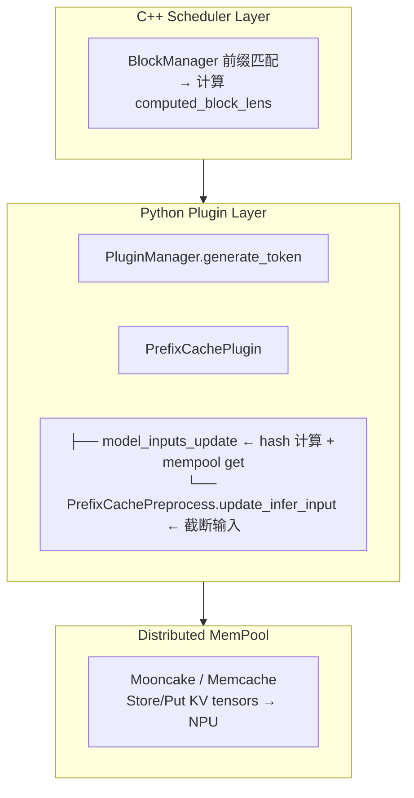

# Prefix Cache 前缀缓存
> 覆盖 12 个知识点 | 来源 5 个文件 | 更新于 2026-07-15

## 1. 一句话总结
Prefix Cache 通过缓存公共前缀的 KV Cache 避免重复计算，降低 TTFT 并提升吞吐。MindIE 采用插件式架构，通过滚动哈希链和 Mooncake 分布式 MemPool 实现跨机共享；vLLM 采用内核集成的链式 block hash 方案。两者正交互补：引擎内 APC 负责同实例复用，跨实例亲和（Conductor/Motor）负责把请求路由到已有缓存的机器。

## 2. 核心原理
### 2.1 问题背景
LLM 推理中，大量请求共享相同的前缀内容（system prompt、few-shot examples、多轮对话历史），每次重复计算这些前缀的 KV Cache 浪费算力。传统方案无缓存时 TTFT 高、吞吐低，且前缀越长浪费越严重。

### 2.2 方案概述
将 KV Cache 按固定 block 切分，对每块计算链式 hash。新请求到达时，沿 block 链查询缓存：命中则直接复用物理块、跳过对应 prefill 计算；未命中则正常计算并将新块写入缓存。MindIE 增加跨机共享能力：C++ 调度层做前缀匹配，Python 插件层做 hash 计算和分布式 mempool 读写。



## 3. 实现细节
### 3.1 Hash 算法：链式滚动哈希

MindIE 使用自定义滚动哈希，基于 `hash_combine` 设计：

```python
hash_block(prefix_hash, block_tokens):
    seed = 0
    seed ^= hash_combine(seed, prefix_hash)     # 链式：前一个 block 的 hash
    for token_id in block_tokens:
        seed = hash_combine(seed, token_id)      # 增量累加
    seed = hash_combine(seed, EXTRA_HASH=0)      # sentinel 终止符
    return seed

hash_combine(seed, val):
    seed ^= hash(val) + 0x9e3779b97f4a7c15 + (seed << 6) + (seed >> 2)
    return 1 if seed == 0 else seed % 2^64
```

关键特性：
- **链式嵌套**：每个 block 依赖前一个 block 的 hash，保证不同顺序产生不同 hash
- **64-bit 空间**：碰撞概率极低，非加密但用于 KV Cache key 无安全问题
- **EXTRA_HASH sentinel**：防止不同长度序列碰撞
- **不支持部分匹配**：必须完全匹配前缀 block 序列

vLLM 使用 SHA-256 内容哈希：`block_hash = H(parent_hash, tokens_in_block, extra_keys)`。extra_keys 含 LoRA / multimodal / cache_salt，防止串缓存。链式保证因果性：block i 可复用当且仅当 0..i-1 已在同一 worker。

### 3.2 两级缓存模型
**Local Cache (computed_blocks)**：本地 NPU 上已有的 block，需查询 MemPool 但无需远程传输。

**Remote Cache (remote_computed_blocks)**：其他节点（Mooncake cluster）上已有的 block，通过 RDMA/Ascend Direct 传输，命中后直接写入 NPU。

### 3.3 完整数据流
#### Prefill 阶段
1. **C++ Scheduler 前缀匹配**：BlockManager 计算 `computed_block_lens` 和 `remote_computed_block_lens`
2. **InputMetadata 解析**：解析 protobuf 中的 block lens（SCP 场景 reshape 二维）
3. **PrefixCachePlugin.model_inputs_update()**：从 mempool 拉取 KV Cache，调用 `PrefixCachePreprocess.update_infer_input()` 截断 input_ids、重算 position_ids 和 slots

#### Postprocess 阶段
- `put_prefix_kvcache_to_mempool()` 遍历 full block，对新建 block 计算 hash 并写入 mempool
- 每 prefill batch 打印 local/remote hit rate

#### 关键代码路径
| 文件 | 职责 |
|------|------|
| `prefix_cache_plugin.py` | Plugin 主类：hash 计算、mempool get/put、命中率统计 |
| `prefix_cache_preprocess.py` | 输入预处理：截断 input_ids/position_ids/slots |
| `mooncake_mempool.py` | Mooncake 分布式 KV Store（RDMA/Ascend Direct） |
| `input_metadata.py` | computed_blocks / remote_computed_blocks |

### 3.4 SCP (Sequence Context Parallelism) 适配
- Block 按 round-robin 分配到各 scp 维度
- Hash key 格式：`"{hash}_{scp_rank}_{scp_size}_{model_name}"`
- computed_blocks 二维 `[batch_size, scp_size]`
- Slots 需在 all-gather 后重排；不同 rank 的 block 数需 padding 对齐

### 3.5 驱逐与引用计数
vLLM APC 驱逐机制：
- 满块 hash 入表，`ref_cnt++` 当请求命中
- 请求结束 `ref_cnt--`；LRU 候选仅限 `ref_cnt==0`
- 公共前缀引用计数高 → 比后缀更抗踢
- vLLM v1 仅 recompute 抢占，无 SWAPPED

### 3.6 跨实例亲和：两层关系

```text
┌─ 层 A：引擎 APC / PrefixCache ──────────────┐
│  同机链式 hash → 共享物理块 → 跳过 prefill    │
│  事实源：BlockPool；发 BlockStored/Removed    │
└────────────────────┬─────────────────────────┘
                     │ ZMQ 通知面（元数据，不搬张量）
                     ▼
┌─ 层 B：跨实例亲和 ──────────────────────────┐
│  Conductor PrefixCacheTable；Motor 打分路由   │
│  目的：把请求送到「层 A 存货最长」的实例       │
└──────────────────────────────────────────────┘
```

- **机内 prefix cache**：同实例复用物理块，跳过 prefill 计算
- **跨实例亲和**：路由共址，提高命中概率，但不替代引擎内核
- **ZMQ 是通知面**：BlockStored/Removed 事件养 Conductor 索引，HTTP `/query` 查询最长匹配

## 4. 框架对比
### 4.1 MindIE vs vLLM

| 维度 | MindIE | vLLM |
|------|--------|------|
| **架构风格** | 插件式，通过 PluginManager 集成 | 核心内建，集成在 BlockManager |
| **核心数据结构** | 滚动哈希链 + Mooncake 分布式 KV Store | 链式 block hash (hash map) |
| **Block Size** | 固定 128 tokens | 默认 16 tokens |
| **Hash 算法** | 自定义 hash_combine 滚动哈希 | SHA-256 内容哈希 |
| **前缀匹配位置** | C++ BlockManager / Scheduler | Scheduler 隐式完成 |
| **输入修改** | Python 手动截断 input_ids/position_ids/slots | Scheduler 分配 block 时隐式完成 |
| **分布式缓存** | 原生支持 Mooncake/Memcache 多机共享 | 无原生支持 |
| **SCP 支持** | 深度适配 (sp_rank, block round-robin) | 无对应概念 |
| **PD 分离** | 支持 P/D 实例间共享 | 需借助外部缓存 |
| **内存淘汰** | Mooncake/Memcache 内部策略 | LRU（仅 ref_cnt==0 可逐） |
| **配置复杂度** | 高：需配置 MemPool、protobuf、plugin | 低：一个 flag 即可启用 |

**设计权衡**：
- MindIE 适合多机部署、高并发长前缀复用（few-shot、system prompt）、PD 分离场景
- vLLM 适合单机部署、灵活配置的通用方案
- MindIE 128 token 块减少 hash 管理开销，但前缀复用率较低
- vLLM 16 token 块提高前缀复用率，但 hash 计算和管理的开销可能超过收益

## 5. 面试要点
### 5.1 常见追问
#### Q: 前缀全命中为何还要算 1 token？
- 需要 logits 采样
- num_computed_tokens 需 block 对齐，尾块可能整块重算
- max_cache_hit_length = num_tokens - 1

#### Q: block hash 怎么保证安全共享？
- 链式 hash + extra_keys（LoRA/multimodal/cache_salt）隔离
- ref_cnt 引用计数；不去重保证 block ID append-only 稳定

#### Q: 有了 APC 还要跨实例亲和干什么？
- APC 不解决 N 机 round-robin 稀释问题
- 亲和优化命中概率与负载，不替代引擎内核
- 跨实例 Conductor 聚全局 hash 视图，Motor 送回最长前缀机

#### Q: 假阳性亲和为何比 round-robin 更糟？
- 假阳性：索引说 W 有前缀 S，引擎已 BlockRemoved
- 会确定性把同前缀 burst 全灌到空壳机 → 满量重算 + 热点排队
- RR 至少 1/N 摊开，还有偶然命中

#### Q: vLLM 是 RadixTree 吗？
- **否**。vLLM 是 hash map + 链式 block hash
- RadixTree 是 SGLang 的实现

#### Q: block_size 不一致会怎样？
- 引擎与索引必须一致；不一致 → 精确亲和静默全 miss、退化为 LB
- Motor/Conductor 常配 128，引擎常见 16

### 5.2 口述话术
**60 秒电梯稿**：
> vLLM 用 PagedAttention 把 KV 切成固定 block。Prefix Cache/APC 在满块上算链式 hash：`block_hash_i = H(parent_hash, tokens_in_block_i, extra_keys)`——同 hash 即同整段前缀路径。新请求从 B0 沿表查，遇 miss 必须停（因果）；命中则挂同一物理块、ref_cnt++，跳过对应 prefill。
>
> 驱逐走 LRU，但只有 `ref_cnt==0` 才可踢——公共前缀被多请求引用，比后缀更抗踢。全命中也至少留 1 token 算 logits。
>
> 两层正交：APC 只解决同实例复用；N 机乱打会稀释命中。跨实例靠 ZMQ 事件养 Conductor，Motor tokenize + `/query` 把请求送到「存货最长」的机——落点后仍靠引擎 APC 真跳过计算。ZMQ 是通知面，不搬 KV。

## 6. 延伸阅读
### 6.1 相关主题
- PagedAttention 与 Continuous Batching：KV Cache 物理块管理基础
- ZMQ KV Events：引擎 BlockStored/Removed 事件 → 跨实例索引
- 假命中与驱逐感知：假阳性 vs 假阴性、Motor vs 近似树对比
- 打分函数与 Herding：负载门控、冷机 seed、利用率约束

### 6.2 源文件

| 文件路径 | 标题 | 类型 |
|----------|------|------|
| wiki/repos/mindie-pyserver/prefix-cache.md | MindIE Prefix Cache 前缀缓存 | 技术文档 |
| wiki/raw/articles/pyserver/prefix_cache_analysis.md | Prefix Cache 分析 | 分析文档 |
| interview/2026-07-10/01-PagedAttention与ContinuousBatching调度专题.md | PagedAttention + Prefix Caching | 面试专题 |
| interview/kv knowledge/00-概念与分层模型.md | 概念与分层模型 | 知识库 |
| interview/2026-07-15/27-引擎PrefixCache内核口述卡.md | 引擎 PrefixCache 内核口述卡 | 口述卡 |
| interview/2026-07-15/12-假命中与驱逐感知口述卡.md | 假命中与驱逐感知口述卡 | 口述卡 |
| interview/2026-07-15/25-ZMQ-KV-Events速答卡.md | ZMQ KV Events 速答卡 | 口述卡 |