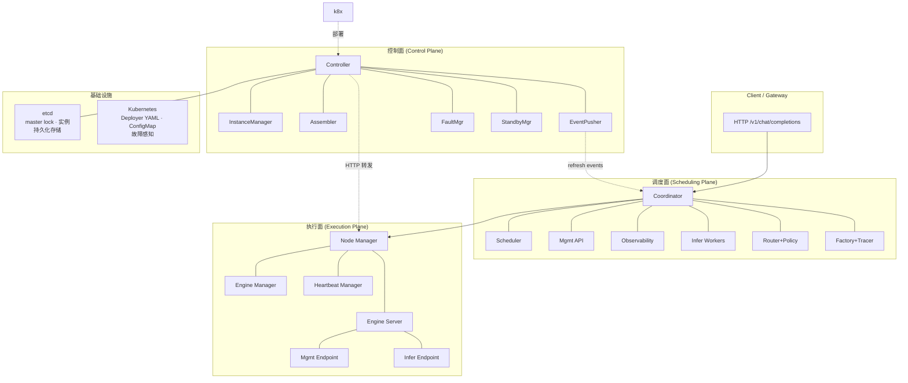
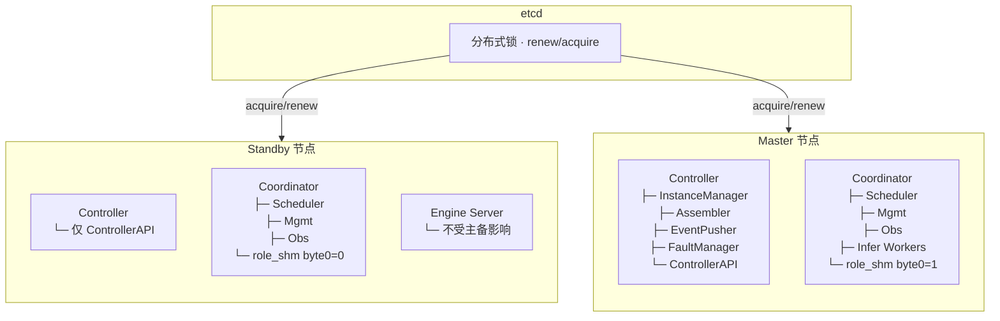
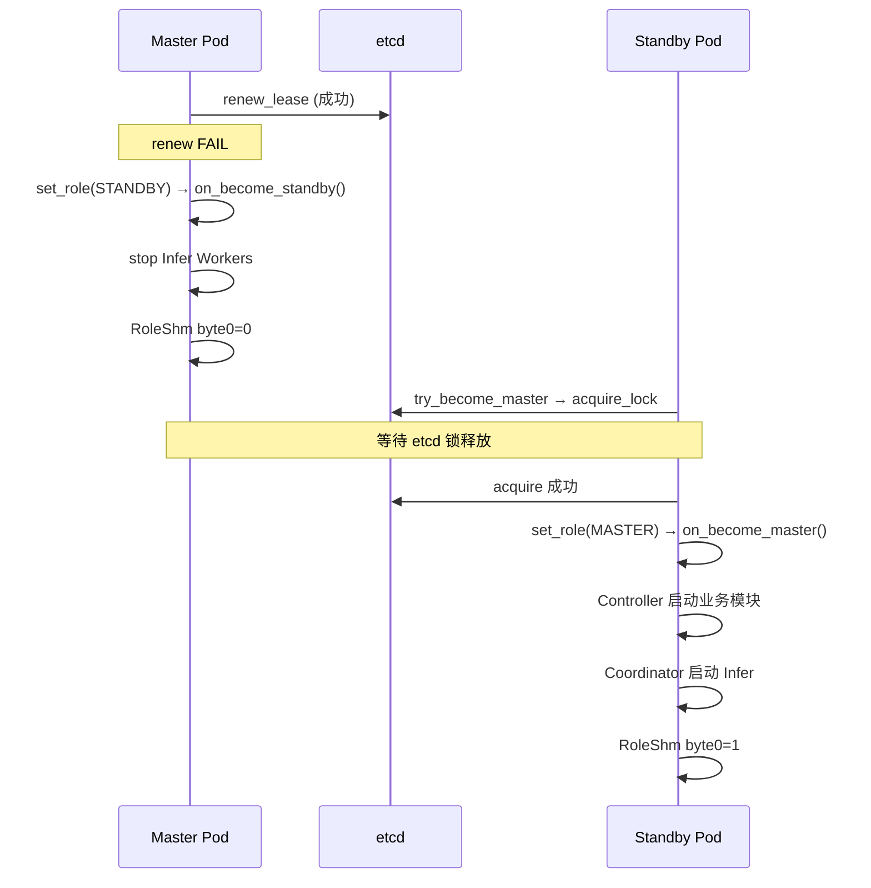
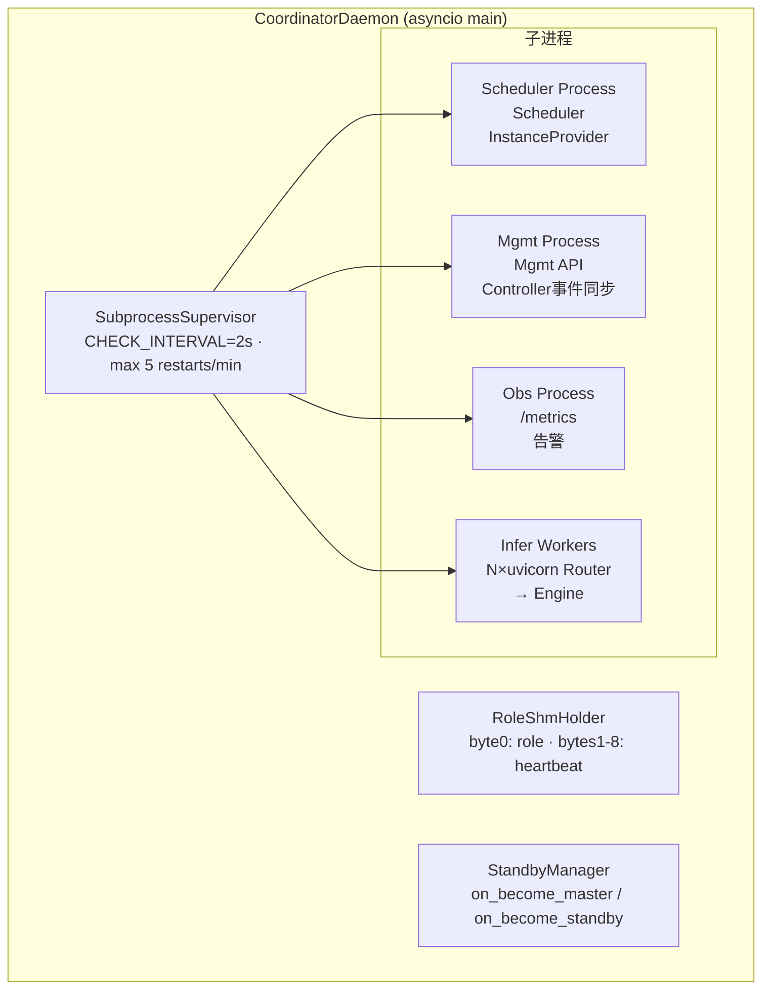
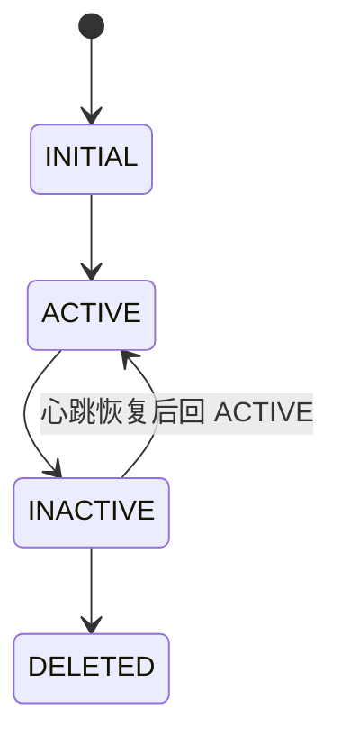
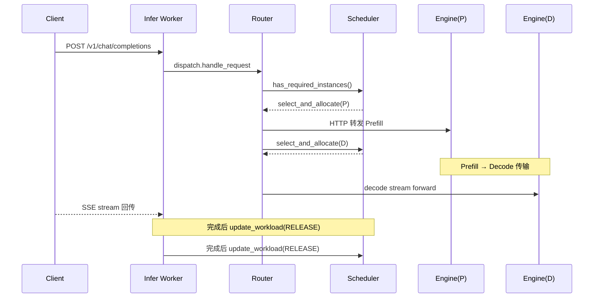
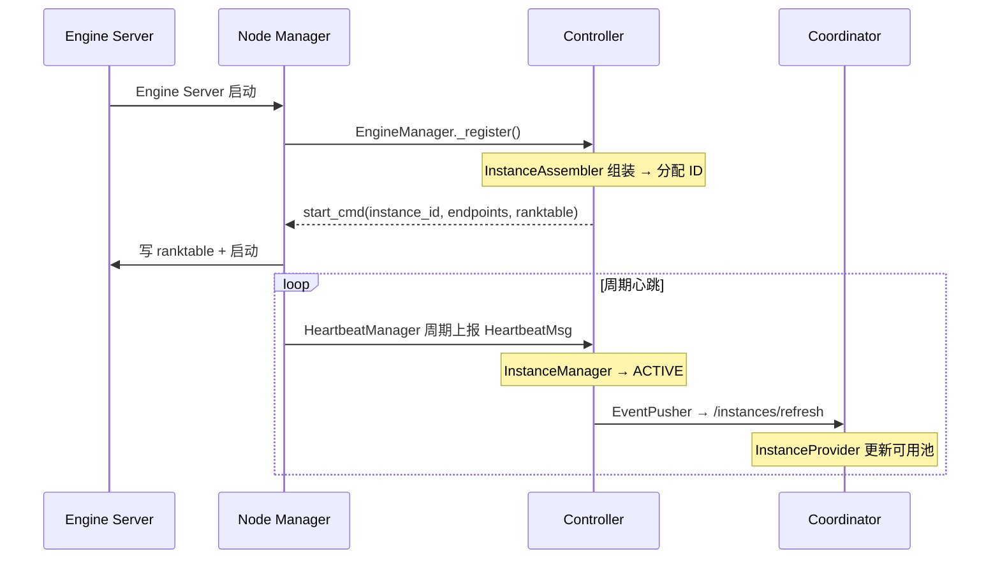
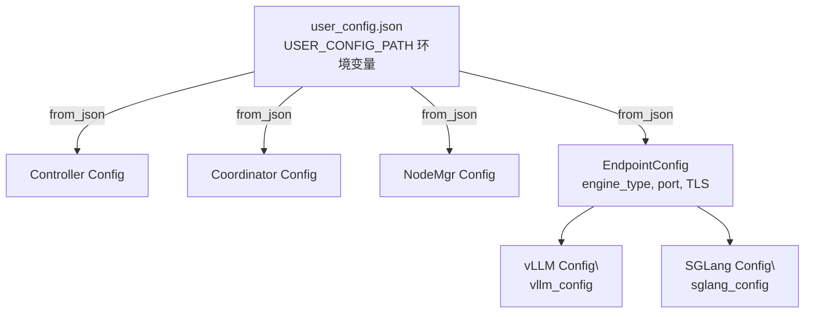
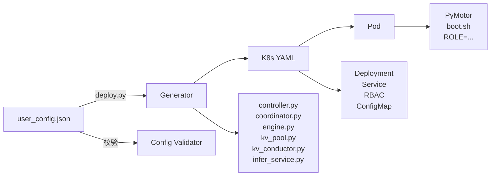
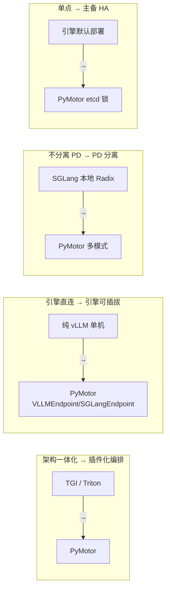

# PyMotor 整体架构

> 来源: 3 files | 最后更新: 2026-07-11

## 核心概念

> **MindIE-PyMotor 推理编排框架** | 类型: repo | 标签: `architecture`, `inference`, `llm`, `open-source`

# MindIE-PyMotor
*(来源: wiki/repos/mindie-pymotor/index.md)*

> **MindIE-PyMotor 三层架构** | 类型: repo | 标签: `architecture`, `inference`, `llm`, `open-source`, `pd-separation`

# MindIE-PyMotor 三层架构
*(来源: wiki/repos/mindie-pymotor/architecture.md)*

> **PyMotor 整体架构深度分析**

### 📑 目录
*(来源: wiki/raw/articles/pymotor/pymotor_architecture_deep_analysis.md)*

## 深入分析

### 概述

PyMotor 是 MindIE 推理引擎的「大脑」，主要负责：

- **请求路由与调度**：将 Prefill 和 Decode 请求分发到合适的推理实例
- **KV Cache 亲和调度**：根据前缀命中情况，将请求路由到已缓存最长前缀的 Prefill 节点，减少重复计算
- **KV 池化管理**：协调 PD 分离场景下的 KV 数据传输（通过 [[mooncake]] Master）
- **策略分发**：支持多种调度策略（KV 亲和、负载均衡、轮询）的可插拔切换

*(来源: wiki/repos/mindie-pymotor/index.md)*

### 核心架构组件

### Coordinator
- **Router**：策略分发层，根据配置选用不同调度策略
- **Scheduler Policy**：[[mindie-pymotor/kv-affinity|KvCacheAffinityPolicy]]（KV 亲和）、RR、负载均衡

### 关键子组件
- **ConductorApiClient**：HTTP 薄封装，与 [[mooncake|Mooncake Conductor]] 通信
- **TokenizerManager**：线程安全单例，与推理引擎共用同一 HF tokenizer
- **_SchedulerInstanceCache**：本地实例缓存 + SHM workload 热补丁
- **AsyncSchedulerClient**：策略分发、ZMQ 通信、ALLOCATE_ONLY RPC
- **MetricsCollector**：从 Mooncake Master Prometheus 端点拉取指标

*(来源: wiki/repos/mindie-pymotor/index.md)*

### 已实现的核心特性

### 1. [[mindie-pymotor/kv-affinity|KV Cache 亲和调度]]
在 PD 分离、多 Prefill 副本场景下，将请求路由到已缓存最长前缀的节点，降低 TTFT、提升吞吐。

### 2. [[mindie-pymotor/kv-pool|KV 池化：意义与实现]]
将 KV Cache 抽象成跨节点、分级溢出、可驱逐、有租约的共享池（Mooncake Master），抬高容量命中率、解耦 P/D 时序；含 Connector（Layerwise / Store / Multi）字段级机制。

### 3. [[mindie-pymotor/kv-pool-and-affinity|KV 池化 × KV 亲和 联合调度]]
数据面（池化）与调度面（亲和）的协同：有效命中率 \(h = h_{reuse} \times P_{route} \times P_{pool}\) 是乘法关系，两者必须叠加才能逼近收益上限。

*(来源: wiki/repos/mindie-pymotor/index.md)*

### 代码基线

```
motor/coordinator/scheduler/policy/kv_cache_affinity.py   # KV 亲和策略
motor/coordinator/scheduler/runtime/scheduler_client.py   # 调度客户端
motor/coordinator/api_client/conductor_api_client.py      # Conductor 接口
motor/coordinator/router/strategies/pd_separate.py        # PD 分离路由
motor/engine_server/core/vllm/vllm_config.py              # vLLM 配置注入
motor/coordinator/metrics/metrics_collector.py            # 指标采集
```

*(来源: wiki/repos/mindie-pymotor/index.md)*

### 部署架构

PyMotor 作为 Coordinator 层运行，通过 HTTP 与 Mooncake Conductor 交互，通过 ZMQ 与 vLLM Prefill/Decode 实例通信。

*(来源: wiki/repos/mindie-pymotor/index.md)*

### 与其他组件的关系

- [[mooncake]]：KV 前缀索引服务（Conductor）和 KV 存储服务（Master）
- 昇腾硬件：运行在华为昇腾 NPU 上
- vLLM：底层推理引擎（通过 patch 适配昇腾）
^[raw/articles/mindie-pymotor-docs-2026.md]

*(来源: wiki/repos/mindie-pymotor/index.md)*

### 一、整体架构：三层职责分离

PyMotor 将职责划分为 **控制面（Control Plane）→ 调度面（Scheduling Plane）→ 执行面（Execution Plane）** 三层。Client 推理流量进入 Coordinator；Controller 管理实例生命周期并向 Coordinator 推送变更；Node Manager 与 Engine Server 同 Pod 部署，承担实际推理执行。



^[raw/articles/pymotor/pymotor_architecture_deep_analysis.md]

### 各层职责速览

| 层 | 组件 | 核心职责 |
|-----|------|---------|
| **控制面** | Controller | 实例生命周期管理、主备切换、故障容错、配置热更新 |
| **调度面** | Coordinator | 请求路由、调度策略执行、可观测性、Infer Workers |
| **执行面** | Node Manager + Engine Server | 节点注册、心跳上报、推理执行（vLLM/SGLang） |

### 设计原则

- **控制面「慢而全」**：InstanceManager 状态机、FaultManager 故障策略等复杂度集中在此
- **调度面「快而专」**：低延迟路由，Scheduler 独立进程避免 GIL 阻塞
- **执行面「薄而稳」**：Node Manager 仅做注册/心跳代理，Engine Server 专注推理

^[raw/articles/pymotor/pymotor_architecture_deep_analysis.md]

*(来源: wiki/repos/mindie-pymotor/architecture.md)*

### 二、组件通信关系

| 调用方 | 被调用方 | 协议/路径 | 用途 |
|--------|---------|-----------|------|
| Client | Coordinator Infer Workers | HTTP OpenAI API | 推理请求入口 |
| Infer Worker | Scheduler Process | IPC / AsyncSchedulerClient | 选实例、更新 workload |
| Router | Engine Server InferEndpoint | HTTP 转发 | Prefill / Decode 执行 |
| Node Manager | Controller | register / heartbeat / reregister | 实例生命周期 |
| Controller EventPusher | Coordinator Mgmt | /instances/refresh | 实例池变更推送 |
| Controller InstanceAssembler | Node Manager | start_cmd | 下发 ranktable + endpoints |
| HeartbeatManager | Engine Server MgmtEndpoint | /status | 端点健康探测 |
| StandbyManager | etcd | acquire_lock / renew_lease | 主备选主 |

^[raw/articles/pymotor/pymotor_architecture_deep_analysis.md]

*(来源: wiki/repos/mindie-pymotor/architecture.md)*

### 三、主备架构（Active-Standby）

Controller 与 Coordinator 均集成 `StandbyManager` 单例，通过 etcd 分布式锁实现 Active-Standby。Coordinator 额外引入 `RoleShmHolder` 共享内存，供 Mgmt 进程感知 Daemon 存活与当前角色。



- **Master 节点**：Controller 启动全部业务模块，Coordinator 启动 Infer Workers
- **Standby 节点**：Controller 仅运行 ControllerAPI（接受心跳/注册）；Coordinator 运行 Scheduler/Mgmt/Obs 保持 warm，Infer 不启动
- **Engine Server 数据面 Pod 不参与主备选举**：Failover 仅影响调度与控制流量入口，已运行实例继续服务

^[raw/articles/pymotor/pymotor_architecture_deep_analysis.md]

### 主备切换流程



^[raw/articles/pymotor/pymotor_architecture_deep_analysis.md]

*(来源: wiki/repos/mindie-pymotor/architecture.md)*

### 四、Coordinator 子进程拓扑

`CoordinatorDaemon` 统一管理四个子进程，启动顺序为 Scheduler → Mgmt → Obs → Infer，停止顺序相反。`SubprocessSupervisor` 每 2 秒健康检查，滑动窗口限制每分钟最多 5 次重启。



### 主备回调逻辑

```mermaid
flowchart LR
    subgraph MASTER["on_become_master()"]
        A1[RoleShm byte0 = 1 (MASTER)]
        A2[启动 InferenceProcess\n（仅 Infer Workers）]
        A3[Controller 启动业务模块]
        A1 --> A2 --> A3
    end

    subgraph STANDBY["on_become_standby()"]
        B1[RoleShm byte0 = 0 (STANDBY)]
        B2[停止 Infer Workers\n（保留 Scheduler/Mgmt/Obs）]
        B3[Controller 停止业务模块\n（保留 ControllerAPI）]
        B1 --> B2 --> B3
    end
```

^[raw/articles/pymotor/pymotor_architecture_deep_analysis.md]

### 设计权衡：备节点保持 warm

备节点上 Scheduler/Mgmt/Obs 持续运行，主备切换时 Mgmt 可立即感知角色变化并开始接受实例注册。代价是备节点仍消耗部分资源运行管理面进程。

*(来源: wiki/repos/mindie-pymotor/architecture.md)*

### 五、Controller — 控制面子系统

Controller 采用单例 + 观察者模式，由以下核心模块组成：

| 模块 | 设计模式 | 关键职责 |
|------|---------|---------|
| InstanceManager | Singleton + State Machine + Observer Subject | 实例状态机（INITIAL → ACTIVE ↔ INACTIVE → DELETED）、心跳超时检测 |
| InstanceAssembler | Singleton + 异步组装循环 | RegisterMsg → StartCmdMsg 组装 |
| EventPusher | Observer + Producer-Consumer 队列 | 实例变更 → Coordinator refresh |
| FaultManager | Observer + Strategy Map | ConfigMap 设备故障策略执行 |
| ConfigWatcher | Observer + File Watcher | user_config.json 热更新回调 |
| ControllerAPI | FastAPI 服务 | register / heartbeat / reregister 入口 |

### 实例状态机



^[raw/articles/pymotor/pymotor_architecture_deep_analysis.md]

*(来源: wiki/repos/mindie-pymotor/architecture.md)*

### 六、Coordinator — 调度面子系统

### 6.1 Scheduler 策略工厂

| SchedulerType | 策略类 | 特点 |
|--------------|--------|------|
| `round_robin` | RoundRobinPolicy | 简单轮询，无 workload 跟踪 |
| `load_balance` | LoadBalancePolicy | least-workload，ALLOCATION/RELEASE 更新负载 |
| `kv_cache_affinity` | KvCacheAffinityPolicy | Conductor longest_matched 两级选择，详见 [[mindie-pymotor/kv-affinity]] |

### 6.2 Router 层

根据 `DeployMode` 选择 Router 实现：

- `SeparateCDPRouter` — CDP / PD 分离（Encode + Prefill + Decode）
- `SeparatePDRouter` — CPCD 分离
- `PDHybridRouter` — 单节点混合
- `SeparatePDDualDispatchRouter` — 双发 PD

### 6.3 三平面 API Server

| 平面 | 类 | 职责 |
|------|-----|------|
| Inference | InferenceServer | /v1/completions、流式 SSE、rate limit |
| Management | ManagementServer | 实例 refresh、就绪探针 |
| Observability | ObservabilityServer | /metrics、告警 |

^[raw/articles/pymotor/pymotor_architecture_deep_analysis.md]

*(来源: wiki/repos/mindie-pymotor/architecture.md)*

### 七、Engine Server & Node Manager — 执行面

### 7.1 Engine Server 插件化架构

```mermaid
flowchart TB
    CLI[engine_server CLI (main.py)]
    CF[ConfigFactory\n按 engine_type 解析配置]
    ME[MgmtEndpoint\n:status / :metrics / HealthCollector]
    IE[InferEndpoint\n/v1/chat/completions · 流式推理]
    VE[VLLMEndpoint\nvLLM-Ascend]
    SE[SGLangEndpoint\nSGLang 引擎]

    CLI --> CF
    CLI --> ME
    CLI --> IE
    IE --> VE
    IE --> SE
```

`EndpointFactory` 通过 `_CREATOR_MAP` 字典实现动态 import，新增引擎不改 CLI 入口。

### 7.2 Node Manager

| 模块 | 关键交互 | 职责 |
|------|---------|------|
| EngineManager | ControllerApiClient.register | 启动时注册；接收 start_cmd 写 ranktable |
| HeartbeatManager | EngineServerApiClient.query_status | 轮询 Engine Server /status；5 次异常触发 suicide |
| NodeManagerAPI | 本地 HTTP | 接收 Controller start_cmd |

^[raw/articles/pymotor/pymotor_architecture_deep_analysis.md]

*(来源: wiki/repos/mindie-pymotor/architecture.md)*

### 八、推理请求完整生命周期（PD 分离模式）



^[raw/articles/pymotor/pymotor_architecture_deep_analysis.md]

*(来源: wiki/repos/mindie-pymotor/architecture.md)*

### 九、实例注册与心跳流程



### 消息类型汇总

| 阶段 | 消息类型 | 方向 |
|------|---------|------|
| 注册 | RegisterMsg | NM → Controller |
| 启动指令 | StartCmdMsg | Controller → NM |
| 心跳 | HeartbeatMsg | NM → Controller |
| 实例同步 | InsEventMsg (ADD/DEL/UPDATE) | Controller → Coordinator Mgmt |
| 重注册 | ReregisterMsg | NM → Controller（503 触发） |

^[raw/articles/pymotor/pymotor_architecture_deep_analysis.md]

*(来源: wiki/repos/mindie-pymotor/architecture.md)*

### 十、部署体系

### 10.1 配置分层



### 10.2 Deployer 部署流程



### 10.3 部署模式

| 模式 | 特征 | 配置项 |
|------|------|--------|
| standalone | 单副本，无 etcd 选主 | `enable_master_standby=false` |
| master-standby | Controller/Coordinator replicas=2 | `standby_config.enable_master_standby=true` |
| PD 分离 | 独立 Prefill / Decode Deployment | `deploy_mode=pd_separate|cdp_separate|...` |
| 单容器全组合 | SINGLE_CONTAINER 角色 | `all_combine_in_single_container.sh` |

^[raw/articles/pymotor/pymotor_architecture_deep_analysis.md]

*(来源: wiki/repos/mindie-pymotor/architecture.md)*

### 十一、设计决策分析

| 决策 | 动机 | 代价/权衡 |
|------|------|----------|
| PD 分离 | Prefill 计算密集、Decode 带宽密集，解耦后可独立扩缩容 | 跨节点 KV 传输开销；需 Mooncake / disaggregation bootstrap |
| Controller ↔ Coordinator 分离 | 控制面（实例状态、故障、组装）与调度面（低延迟路由）职责不同 | 多一跳 EventPusher 同步；需处理 Coordinator 重启后的实例 refresh |
| 插件化引擎 | EndpointFactory 按 engine_type 动态 import，新增引擎不改 CLI 入口 | 各引擎配置差异大，需 ConfigFactory 分别解析 |
| Infer 多 Worker + 共享 socket | 突破单进程 GIL，提升并发连接处理能力 | Scheduler IPC 连接池管理复杂度上升 |
| 主备仅停 Infer | 备节点 Scheduler/Mgmt 保持 warm，主备切换时 Mgmt 可立即感知角色 | 备节点仍消耗部分资源 |

^[raw/articles/pymotor/pymotor_architecture_deep_analysis.md]

*(来源: wiki/repos/mindie-pymotor/architecture.md)*

### 十二、竞品对比

| 维度 | MindIE-PyMotor | vLLM | TGI | Triton | SGLang |
|------|---------------|------|-----|--------|--------|
| 定位 | LLM 集群编排框架 | LLM 推理引擎 | LLM 推理服务 | 通用模型推理平台 | LLM 推理引擎（RadixAttention） |
| PD 分离 | 原生多 DeployMode | Disaggregated Prefill（实验/扩展） | 有限支持 | 需自定义 backend | Disaggregation 支持 |
| 调度策略 | RR / LB / KV Affinity 可插拔 | 内置 scheduler | Router 队列调度 | Dynamic Batching | Continuous batch + Radix |
| 控制面 | 独立 Controller + etcd | 无（需外部 K8s operator） | minimal | Model Repository | minimal |
| 高可用 | etcd 主备 + 角色 shm | 依赖外部 LB | 多副本部署 | 多实例 + LB | 依赖外部 |
| 硬件 | 昇腾 NPU 优先（HCCL ranktable） | CUDA 为主 / Ascend 扩展 | CUDA | GPU 为主 | CUDA / 多后端 |
| API | OpenAI 兼容（Coordinator） | OpenAI 兼容 | OpenAI 兼容 | gRPC/HTTP 通用 | OpenAI 兼容 |

^[raw/articles/pymotor/pymotor_architecture_deep_analysis.md]

### 设计光谱



### 核心洞察

PyMotor 的价值不在「再造一个推理引擎」，而在为 PD 分离 LLM 集群提供 **生产级控制面 + 可插拔调度面**。与 vLLM/SGLang 是互补关系；与 TGI/Triton 相比，它更垂直于 LLM + NPU + PD 场景，牺牲通用性换取端到端部署与 HA 能力。

*(来源: wiki/repos/mindie-pymotor/architecture.md)*

### 相关页面

- [[mindie-pymotor/index]] — MindIE-PyMotor 实体页面
- [[mindie-pymotor/kv-affinity]] — KV Cache 亲和调度策略
- [[mindie-pymotor/kv-pool]] — KV 池化与 PD 传输
- [[mindie-pymotor/kv-pool-and-affinity]] — KV 池化 × KV 亲和 联合调度
- [[mooncake]] — Mooncake KV 传输框架

---

*Sources: `raw/articles/pymotor/pymotor_architecture_deep_analysis.md` (primary), `raw/articles/pymotor/kv_cache_affinity_deep_analysis.md`, `raw/articles/pymotor/kv_cache_affinity_report.md`*

*(来源: wiki/repos/mindie-pymotor/architecture.md)*

### 第 1 章：项目概览与应用背景

### 1.1 定位与核心能力

MindIE-PyMotor 是华为 MindIE 生态中的 **Python 推理编排框架** ，专注于 **Prefill / Decode（PD）分离** 场景下的大规模 LLM 集群部署。它不替代底层推理引擎，而是提供控制面、调度面与节点管理的完整链路，使 vLLM-Ascend、SGLang 等引擎能以云原生方式横向扩展。

核心能力| 实现要点| 源码入口  
---|---|---  
一键 PD 分离部署| Deployer YAML 生成 + 多 DeployMode 路由| `examples/deployer/`、`router/dispatch.py`  
云原生插件化| K8s Generator、ConfigMap 故障感知| `examples/deployer/lib/generator/`  
多引擎适配| EndpointFactory 动态加载 vLLM / SGLang| `engine_server/factory/endpoint_factory.py`  
高性能调度| Round-Robin / Load-Balance / KV Cache Affinity| `scheduler/policy/factory.py`  
高可用主备| etcd 分布式锁 + StandbyManager| `common/standby/standby_manager.py`  
  
#### 核心能力 vs 竞品对比

核心能力| PyMotor| vLLM / SGLang| TGI / Triton  
---|---|---|---  
PD 分离集群编排| 原生 多 DeployMode + Router 策略| 引擎层实验性 disagg，无集群控制面| 需自定义 backend / 无 LLM PD 专设  
实例生命周期管理| 原生 Controller + NM 注册/心跳| 无| Model Repository / 无 HCCL 拓扑  
调度策略可插拔| 原生 PolicyFactory 三策略| 内置 Continuous Batching| Dynamic Batching / Router 队列  
主备 HA| 原生 etcd 锁 + StandbyManager| 依赖外部 LB| 多副本 + LB  
昇腾 NPU 集群| 原生 ranktable + HCCL 组装| vLLM-Ascend 扩展| GPU 为主  
  
### 1.2 使用场景

大规模 LLM 在线推理

OpenAI 兼容 API · 多 P/D 池独立扩缩容

Agent / 长上下文

KV Cache Affinity 前缀复用

昇腾 NPU 集群

HCCL ranktable + Node Manager 注册

生产级 HA 部署

Controller / Coordinator 双副本 + etcd 选主 · 备节点仅运行管理面

### 1.3 技术栈与包结构

层次| 技术选型| 说明  
---|---|---  
语言运行时| Python ≥ 3.11| `setup.py` 声明 `python_requires=">=3.11"`  
Web 框架| FastAPI + uvicorn + asyncio| Coordinator 三平面 API、Engine Server 双端点  
协调存储| etcd（锁、持久化、ConfigMap 联动）| `motor/common/etcd/`  
容器编排| Kubernetes| Deployer 生成 Deployment / Service / RBAC  
可观测性| Prometheus 多进程、OpenTelemetry Tracer| `MgmtEndpoint`、`TracerManager`  
  
**与同类项目的初步定位：** vLLM / SGLang 是**推理引擎** ；TGI / Triton 是**一体化推理服务** ；PyMotor 是**集群级编排层** ，可挂载多种引擎，专注 PD 分离与多实例调度。详见第 6 章竞品分析。

* * *

*(来源: wiki/raw/articles/pymotor/pymotor_architecture_deep_analysis.md)*

### 第 2 章：整体架构设计

### 2.1 三层架构图（要件 A）

PyMotor 将职责划分为控制面、调度面、执行面三层。Client 推理流量进入 Coordinator；Controller 管理实例生命周期并向 Coordinator 推送变更；Node Manager 与 Engine Server 同 Pod 部署，承担实际推理执行。

入口层

Client / Gateway

HTTP /v1/chat/completions

↓

调度面 (Scheduling Plane)

Coordinator

Scheduler · Mgmt · Obs · Infer Workers  
Router + PolicyFactory + Tracer

↓ refresh events   ↑ HTTP 转发

控制面 (Control Plane)

Controller

InstanceManager · Assembler · EventPusher  
FaultManager · StandbyManager

↓ register / heartbeat / start_cmd

执行面 (Execution Plane)

Node Manager

EngineManager · HeartbeatManager

→

Engine Server

MgmtEndpoint · InferEndpoint  
vLLM / SGLang · ROLE_P / ROLE_D

×

多 Pod 副本

Prefill / Decode 独立扩缩容

etcd

master lock · 实例持久化

Kubernetes

Deployer YAML · ConfigMap 故障感知

### 2.2 组件通信关系（要件 B）

调用方| 被调用方| 协议 / 路径| 用途  
---|---|---|---  
Client| Coordinator Infer Workers| HTTP OpenAI API| 推理请求入口  
Infer Worker| Scheduler Process| IPC / AsyncSchedulerClient| 选实例、更新 workload  
Router| Engine Server InferEndpoint| HTTP 转发| Prefill / Decode 执行  
Node Manager| Controller| register / heartbeat / reregister| 实例生命周期  
Controller EventPusher| Coordinator Mgmt| /instances/refresh| 实例池变更推送  
Controller InstanceAssembler| Node Manager| start_cmd| 下发 ranktable + endpoints  
HeartbeatManager| Engine Server MgmtEndpoint| /status| 端点健康探测  
StandbyManager| etcd| acquire_lock / renew_lease| 主备选主  
  
### 2.3 主备架构（要件 C）

Controller 与 Coordinator 均集成 `StandbyManager` 单例，通过 etcd 分布式锁实现 Active-Standby。Coordinator 额外引入 `RoleShmHolder` 共享内存，供 Mgmt 进程感知 Daemon 存活与当前角色。

Standby 节点

Controller

仅 ControllerAPI 运行

Coordinator

Scheduler + Mgmt + Obs  
role_shm byte0 = 0

Engine Server

不受主备影响（数据面）

⇄

etcd

分布式锁  
renew / acquire

⇄

Master 节点

Controller

InstanceManager / Assembler /  
EventPusher / FaultManager 全启

Coordinator

Scheduler + Mgmt + Obs + Infer  
role_shm byte0 = 1

Engine Server

不受主备影响（数据面）

### 2.4 Coordinator 子进程拓扑（要件 D）

`CoordinatorDaemon` 统一管理四个子进程，启动顺序为 Scheduler → Mgmt → Obs → Infer，停止顺序相反（见 `process/constants.py`）。`SubprocessSupervisor` 每 2 秒健康检查，滑动窗口限制每分钟最多 5 次重启。

CoordinatorDaemon (asyncio main)

RoleShmHolder

byte0: role · bytes1-8: heartbeat

StandbyManager

on_become_master / standby

SubprocessSupervisor

CHECK_INTERVAL=2s

↓ 管理

SchedulerProcess

Scheduler + InstanceProvider

MgmtProcess

Management API · Controller 事件同步

ObsProcess

Observability /metrics

InferenceProcess

N × uvicorn workers · Router → Engine

CoordinatorDaemon · 主备回调
    
    
    def _on_become_master(self, should_report_event=False):
        if self._role_shm_holder is not None:
            self._write_role_shm_byte(ROLE_SHM_MASTER)  # byte0 = 1
        self._start_processes([PROCESS_KEY_INFERENCE])   # 仅启动推理 Workers
    
    def _on_become_standby(self):
        if self._role_shm_holder is not None:
            self._write_role_shm_byte(ROLE_SHM_STANDBY)  # byte0 = 0
        self._stop_all_processes(exclude={SCHEDULER, MGMT, OBS})

### 2.5 设计决策分析

决策| 动机| 代价 / 权衡  
---|---|---  
**PD 分离**|  Prefill 计算密集、Decode 带宽密集，解耦后可独立扩缩容，提升 GPU/NPU 利用率| 跨节点 KV 传输开销；需 Mooncake / disaggregation bootstrap  
**Controller ↔ Coordinator 分离**|  控制面（实例状态、故障、组装）与调度面（低延迟路由）职责不同，可独立伸缩与升级| 多一跳 EventPusher 同步；需处理 Coordinator 重启后的实例 refresh  
**插件化引擎**| `EndpointFactory` 按 `engine_type` 动态 import，新增引擎不改 CLI 入口| 各引擎配置差异大，需 `ConfigFactory` 分别解析  
**Infer 多 Worker + 共享 socket**|  突破单进程 GIL，提升并发连接处理能力| Scheduler IPC 连接池管理复杂度上升  
**主备仅停 Infer**|  备节点 Scheduler/Mgmt 保持 warm，主备切换时 Mgmt 可立即感知角色| 备节点仍消耗部分资源（Scheduler/Mgmt/Obs）  
  
**架构原则：** 控制面「慢而全」、调度面「快而专」、执行面「薄而稳」——三层边界清晰，便于在 K8s 中按角色独立部署 Pod。

* * *

*(来源: wiki/raw/articles/pymotor/pymotor_architecture_deep_analysis.md)*

### 第 3 章：核心子系统详解

### 3.1 Controller — 控制面

#### InstanceManager — 实例状态机

单例 + 观察者模式。维护 `InsStatus` 状态机（INITIAL → ACTIVE ↔ INACTIVE → DELETED），通过心跳超时检测驱动状态迁移，并通知 `EventPusher`、`FaultManager` 等 Observer。

INITIAL

→

ACTIVE

⇄

INACTIVE

→

DELETED

#### InstanceAssembler — 实例组装

接收 Node Manager 的 `RegisterMsg`，按 job_name + role + ranktable 策略组装 Instance，向 NM 下发 `StartCmdMsg`（含 instance_id、endpoints、ranktable）。支持 re-register 路径。

#### EventPusher — 事件推送

作为 Observer 监听 InstanceManager 变更，异步队列消费后调用 `CoordinatorApiClient` 推送 `/instances/refresh`，并周期性检测 Coordinator 心跳以触发全量 reset。

#### FaultManager — 故障容错

可选模块（`enable_fault_tolerance`），监听 K8s ConfigMap 设备故障码，执行 scale P→D、网络恢复等策略。支持 ConfigWatcher 热启停。

#### ConfigWatcher — 配置热更新

监听 `user_config.json` 变更，回调 `on_config_updated` 动态启停 FaultManager 并刷新各模块配置。

模块| 设计模式| 关键职责| 关键文件  
---|---|---|---  
InstanceManager| Singleton + State Machine + Observer Subject| 实例状态机、心跳超时检测| `controller/core/instance_manager.py`  
InstanceAssembler| Singleton + 异步组装循环| RegisterMsg → StartCmdMsg 组装| `controller/core/instance_assembler.py`  
EventPusher| Observer + Producer-Consumer 队列| 实例变更 → Coordinator refresh| `controller/core/event_pusher.py`  
FaultManager| Observer + Strategy Map| ConfigMap 故障策略执行| `controller/fault_tolerance/fault_manager.py`  
ControllerAPI| FastAPI 服务| register / heartbeat / reregister 入口| `controller/api_server/controller_api.py`  
Controller main · 主备模块启停
    
    
    def on_become_master(should_report_event: bool):
        init_all_modules()
        start_all_modules(exclude_modules={"ControllerAPI"})  # API 始终运行
    
    def on_become_standby():
        stop_all_modules(exclude_modules={"ControllerAPI"})

### 3.2 Coordinator — 调度面

#### Scheduler 门面

`Scheduler` 类作为调度门面，通过 `SchedulingPolicyFactory` 创建策略实例，对外暴露 `select_and_allocate`、`update_workload`、`has_required_instances` 等接口。

SchedulerType| 策略类| 特点| 源码  
---|---|---|---  
`round_robin`| RoundRobinPolicy| 简单轮询，无 workload 跟踪| `scheduler/policy/round_robin.py`  
`load_balance`| LoadBalancePolicy| least-workload，ALLOCATION/RELEASE 更新负载| `scheduler/policy/load_balance.py`  
`kv_cache_affinity`| KvCacheAffinityPolicy| Conductor longest_matched 两级选择| `scheduler/policy/kv_cache_affinity.py`  
  
#### Router 层

`dispatch.handle_request` 根据 `DeployMode` 选择 Router 实现：

  * `SeparateCDPRouter` — CDP / PD 分离（Encode + Prefill + Decode）
  * `SeparatePDRouter` — CPCD 分离
  * `PDHybridRouter` — 单节点混合
  * `SeparatePDDualDispatchRouter` — 双发 PD

模块| 职责| 关键类 / 文件  
---|---|---  
CoordinatorDaemon| 四子进程统一管理、主备回调| `daemon/coordinator_daemon.py`  
Router| 按 DeployMode 路由 P/D 请求| `router/dispatch.py`、`router/strategies/`  
Scheduler IPC| Infer Worker ↔ Scheduler 跨进程通信| `scheduler/runtime/scheduler_client.py`  
InstanceProvider| 维护可用实例池（Mgmt refresh 驱动）| `domain/instance_manager.py`  
Rate Limiter| 推理 API 限流| `middleware/rate_limiter.py`  
  
#### 三平面 API Server

平面| 类| 端口配置项| 职责  
---|---|---|---  
Inference| `InferenceServer`| `coordinator_api_infer_port`| /v1/completions、流式 SSE、rate limit  
Management| `ManagementServer`| `coordinator_api_mgmt_port`| 实例 refresh、就绪探针  
Observability| `ObservabilityServer`| `coordinator_api_obs_port`| /metrics、告警  
  
**设计权衡：** Scheduler 独立进程 + Infer Worker 通过 `SchedulerConnectionManager` IPC 通信，避免 Infer 高并发阻塞调度逻辑；代价是跨进程序列化与连接管理开销。

### 3.3 Engine Server — 执行面

engine_server CLI (main.py)

Prometheus

setup_multiprocess_prometheus()

ConfigFactory

按 engine_type 解析配置

↓

MgmtEndpoint

/status · /metrics · HealthCollector

+

InferEndpoint

/v1/chat/completions · 流式推理

↓ EndpointFactory

VLLMEndpoint

vLLM-Ascend 引擎

SGLangEndpoint

SGLang 引擎

模块| 职责| 关键文件  
---|---|---  
EndpointFactory| 按 engine_type 动态 import 引擎实现| `factory/endpoint_factory.py`  
ConfigFactory| vLLM / SGLang 专属配置解析| `factory/config_factory.py`  
MgmtEndpoint| 健康采集、Prometheus metrics| `core/mgmt_endpoint.py`  
InferEndpoint| OpenAI 兼容推理 API| `core/infer_endpoint.py`  
HealthCollector| 端点状态聚合| `core/health_collector.py`  
EndpointFactory · 插件化引擎
    
    
    class EndpointFactory:
        _CREATOR_MAP = {
            "vllm": "motor.engine_server.core.vllm.vllm_endpoint.VLLMEndpoint",
            "sglang": "motor.engine_server.core.sglang.sglang_endpoint.SGLangEndpoint",
        }
    
        def get_infer_endpoint(self, config):
            module_path, class_name = target.rsplit(".", 1)
            module = importlib.import_module(module_path)
            return getattr(module, class_name)(config)

### 3.4 Node Manager — 节点管理

模块| 职责| 关键交互| 关键文件  
---|---|---|---  
EngineManager| 启动时向 Controller 注册；接收 start_cmd 写 ranktable；支持 reregister| ControllerApiClient.register| `core/engine_manager.py`  
HeartbeatManager| 轮询 Engine Server /status；周期性上报 Controller；5 次异常触发 suicide| EngineServerApiClient.query_status| `core/heartbeat_manager.py`  
NodeManagerAPI| 本地 HTTP 服务，接收 Controller start_cmd| EngineManager.parse_start_cmd| `api_server/node_manager_api.py`  
  
Controller

start_cmd / heartbeat

⇄

Node Manager

EngineManager · HeartbeatManager

→

同 Pod

Engine Server

MgmtEndpoint :status · InferEndpoint :infer

* * *

*(来源: wiki/raw/articles/pymotor/pymotor_architecture_deep_analysis.md)*

### 第 4 章：关键数据流

### 4.1 推理请求完整生命周期（要件 E）

以下以 **PD 分离模式（CPCD_SEPARATE + SeparatePDRouter）** 为例，展示从请求到达到结果返回的全链路。

1

Client

Infer Worker

POST /v1/chat/completions — InferenceServer 校验 OpenAI 字段、API Key、rate limit

2

Infer Worker

Router

dispatch.handle_request 构建 RequestInfo（req_id、body、trace context）

3

Router

Scheduler

has_required_instances() 确认 P/D 池就绪；select_and_allocate(ROLE_P) 选 Prefill 实例

4

Router

Engine(P)

HTTP 转发 Prefill 请求；获取 KV / metaserver 信息

5

Router

Scheduler

select_and_allocate(ROLE_D) 选择 Decode 实例并分配 workload

6

Router

Engine(D)

decode stream forward — 流式 SSE chunk 生成

7

Engine(D)

Client

SSE stream 经 Infer Worker 回传；完成后 update_workload(RELEASE)；Tracer spans: CPCP_Prefill → CPCP_Decode

### 4.2 实例注册与心跳（要件 F）

1

Engine Server

Node Manager

Engine Server 启动（同 Pod Node Manager 已就绪）

2

Node Manager

Controller

EngineManager._register() → ControllerApiClient.register(RegisterMsg)

3

Controller

Controller

InstanceAssembler 组装 → 分配 instance_id

4

Controller

Node Manager

start_cmd(instance_id, endpoints, ranktable)

5

Node Manager

Engine Server

写 ranktable 到 RANKTABLE_PATH；启动 Engine Server

6

Node Manager

Controller

HeartbeatManager 周期上报 HeartbeatMsg（含各 endpoint status）

7

Controller

Coordinator

InstanceManager 状态 → ACTIVE；EventPusher → /instances/refresh

8

Coordinator

Coordinator

InstanceProvider 更新可用池 → Infer API readiness 通过

阶段| 消息类型| 方向  
---|---|---  
注册| `RegisterMsg`| NM → Controller  
启动指令| `StartCmdMsg`| Controller → NM  
心跳| `HeartbeatMsg`| NM → Controller（间隔可配）  
实例同步| `InsEventMsg` (ADD/DEL/UPDATE)| Controller → Coordinator Mgmt  
重注册| `ReregisterMsg`| NM → Controller（503 触发）  
  
### 4.3 主备切换流程（要件 G）

1

Master Pod

etcd

StandbyManager._master_standby_loop：Master 周期性 renew_lease

2

Master Pod

Master Pod

renew FAIL → set_role(STANDBY) → on_become_standby() · stop Infer / modules · RoleShm byte0=0

3

Standby Pod

etcd

_try_become_master() → acquire_lock(key, ttl) → lease_id success

4

Standby Pod

Standby Pod

set_role(MASTER) → on_become_master() · Controller 启动业务模块 · Coordinator 启动 Infer · RoleShm byte0=1

5

Standby Pod

Client

对外提供推理服务；非预期切换时 should_report_event 触发 ControllerToSlaveEvent 告警

**注意：** Engine Server 数据面 Pod 不参与 Controller/Coordinator 主备选举；Failover 仅影响调度与控制流量入口，已运行实例继续服务直至被 Controller 重新编排。

### 4.4 KV Cache 亲和性调度（引用）

当 `scheduler_type=kv_cache_affinity` 时，Prefill 调度走 Conductor 前缀索引两级选择。详细机制见 `docs/kv_cache_affinity_deep_analysis.html`，此处摘要核心结论：

环节| 行为  
---|---  
Tokenize| Coordinator 侧 `TokenizerManager` 对 prompt/messages+tools 编码  
Query| POST KV Conductor `/query` → 各 instance `longest_matched`  
选择| Stage-1 选 instance；Stage-2 选 DP endpoint  
降级| Conductor 超时 / 无匹配 → load_balance → round_robin  
  
**与架构的关系：** KV Cache Affinity 是 Coordinator 调度策略家族的一员，不改变三层边界；其外部依赖 KV Conductor / KV Pool（Mooncake）属于 PD 分离基础设施层。

* * *

*(来源: wiki/raw/articles/pymotor/pymotor_architecture_deep_analysis.md)*

### 第 5 章：部署与配置体系

### 5.1 配置分层

user_config.json

USER_CONFIG_PATH 环境变量

↓ from_json()

ControllerConfig

instance · fault · standby · etcd

CoordinatorConfig

scheduler · api · rate_limit · standby

NodeManagerConfig

controller 地址 · heartbeat

EndpointConfig

engine_type · port · parallel · TLS

↓ ConfigFactory

vLLM Config

vllm_config.py

SGLang Config

sglang_config.py

Config 类| 关键配置域  
---|---  
`ControllerConfig`| instance_config、fault_tolerance_config、standby_config、etcd_config  
`CoordinatorConfig`| scheduler_config (deploy_mode, scheduler_type)、api_config、rate_limit、standby  
`EndpointConfig`| engine_type、port、parallel_config、TLS  
`StandbyConfig`| enable_master_standby、master_lock_key、lock TTL、check interval  
  
### 5.2 Deployer 部署流程

1

user_config.json

deploy.py

读取用户配置，校验 ConfigValidator

2

deploy.py

Generator

controller.py · coordinator.py · engine.py · kv_pool.py · kv_conductor.py · infer_service.py

3

Generator

K8s YAML

write_yaml → Deployment / Service / RBAC / ConfigMap

4

K8s

Pod

boot.sh -- ROLE=controller|coordinator|prefill|decode|...

5

Pod

PyMotor

startup script → motor/controller/main.py · coordinator/main.py · engine_server/cli/main.py 等

部署模式| 特征| 配置项  
---|---|---  
standalone| 单副本，无 etcd 选主| `enable_master_standby=false`  
master-standby| Controller/Coordinator replicas=2| `standby_config.enable_master_standby=true`  
PD 分离| 独立 Prefill / Decode Deployment| `deploy_mode=pd_separate|cdp_separate|...`  
单容器全组合| SINGLE_CONTAINER 角色| `all_combine_in_single_container.sh`  
  
#### 环境变量注入链（Coordinator 示例）

  * `ROLE=coordinator` — boot.sh 路由到 coordinator.sh
  * `JOB_NAME` — Generator 生成的唯一 job 标识
  * `CONTROLLER_SERVICE` / `COORDINATOR_SERVICE` — K8s Service DNS
  * `KV_CONDUCTOR_SERVICE` — 启用 KV Cache Affinity 时注入
  * `DISAGGREGATION_BOOTSTRAP_PORT` — PD 分离 bootstrap 端口


**设计权衡：** Deployer 采用「YAML 模板 + Python 修改器」而非 Helm，便于在华为内部 CI 流水线中精确控制 Ascend 特有挂载（ranktable、HCCL、权重路径）；代价是与社区 Helm Chart 生态互操作性较弱。

* * *

*(来源: wiki/raw/articles/pymotor/pymotor_architecture_deep_analysis.md)*

### 第 6 章：竞品分析与设计洞察

### 6.1 与各竞品的关系

#### vLLM

PyMotor 通过 `VLLMEndpoint` 适配 vLLM-Ascend，自身承担**集群调度与控制面** 。vLLM 原生提供单机/多卡 Continuous Batching 与 PagedAttention，但缺少 PD 分离集群级实例编排、主备 HA 与 Ascend ranktable 组装——这些由 PyMotor 补齐。

#### TGI（Text Generation Inference）

HuggingFace TGI 是**一体化推理服务器** （Rust router + Python backend），内置 batching 与量化。对比：TGI Router 轻量但绑定 HF 模型生态；PyMotor 调度面更重（多 DeployMode、KV Affinity、故障策略），引擎可插拔。

#### Triton Inference Server

Triton 强调**多框架模型管理与动态批处理** （TensorRT、ONNX、Python backend）。对比：Triton 面向通用 ML 模型 serving；PyMotor 专注 LLM PD 分离与 NPU 集群，Instance/Endpoint 模型更贴合 LLM 实例组与 HCCL 拓扑。

#### SGLang

SGLang 以 **RadixAttention** 实现 KV 前缀共享，单机性能优异。PyMotor 通过 `SGLangEndpoint` 接入，在集群层用 KV Cache Affinity + Mooncake 实现**跨节点** 前缀亲和，与 SGLang 本地 RadixAttention 形成「节点内 + 集群间」两级 KV 优化。

### 6.2 子系统对比总表

维度| MindIE-PyMotor| vLLM| TGI| Triton| SGLang  
---|---|---|---|---|---  
定位| LLM 集群编排框架| LLM 推理引擎| LLM 推理服务| 通用模型推理平台| LLM 推理引擎（RadixAttention）  
PD 分离| 原生多 DeployMode| Disaggregated Prefill（实验/扩展）| 有限支持| 需自定义 backend| Disaggregation 支持  
调度策略| RR / LB / KV Affinity 可插拔| 内置 scheduler| Router 队列调度| Dynamic Batching| Continuous batch + Radix  
控制面| 独立 Controller + etcd| 无（需外部 K8s operator）| minimal| Model Repository| minimal  
高可用| etcd 主备 + 角色 shm| 依赖外部 LB| 多副本部署| 多实例 + LB| 依赖外部  
硬件| 昇腾 NPU 优先（HCCL ranktable）| CUDA 为主 / Ascend 扩展| CUDA| GPU 为主| CUDA / 多后端  
API| OpenAI 兼容（Coordinator）| OpenAI 兼容| OpenAI 兼容| gRPC/HTTP 通用| OpenAI 兼容  
可观测性| 三平面 Obs + Prometheus 多进程| Prometheus metrics| metrics endpoint| 全面 metrics| 内置 metrics  
  
### 6.3 设计总结

架构选型光谱

TGI / Triton

一体化

→

PyMotor

插件化编排

→

纯 vLLM 单机

引擎直连

SGLang 本地 Radix

不分离 PD

→

PyMotor 多模式

PD 分离

→

vLLM disagg

引擎层分离

引擎默认部署

单点

→

PyMotor etcd 锁

主备 HA

→

外部 K8s LB

基础设施 HA

设计选择| PyMotor 取向| 理由  
---|---|---  
插件化 vs 一体化| **插件化** （引擎工厂 + 策略工厂）| 昇腾生态需同时支持 vLLM-Ascend 与 SGLang，解耦升级节奏  
PD 分离 vs 不分离| **默认 PD 分离** ，保留 SINGLE_NODE fallback| 长上下文与 Agent 场景 Prefill/Decode 资源特征差异大  
主备 vs 单点| **etcd 主备** ，Infer 面按需启停| 控制/调度面故障可快速 Failover，数据面无状态转发  
进程模型| Coordinator 多子进程| 隔离 Scheduler 与 Infer GIL；Supervisor 自动恢复  
  
**核心洞察：** PyMotor 的价值不在「再造一个推理引擎」，而在为 PD 分离 LLM 集群提供**生产级控制面 + 可插拔调度面** 。与 vLLM/SGLang 是互补关系；与 TGI/Triton 相比，它更垂直于 LLM + NPU + PD 场景，牺牲通用性换取端到端部署与 HA 能力。

**潜在改进方向：** ① Helm Chart 社区化降低 Deployer 门槛；② Scheduler IPC 可探索共享内存批量选实例降低延迟；③ 统一 Observability 追踪 ID 贯穿 Controller → Coordinator → Engine 全链路。

* * *

Generated by Hermes Agent → Cursor Agent (composer-2.5-fast)

分析依据：`docs/_analysis_spec.md` · 源码范围：motor/ 全模块 + examples/deployer/

← 后退 1/26 前进 →

*(来源: wiki/raw/articles/pymotor/pymotor_architecture_deep_analysis.md)*

## 面试要点

*该主题暂无专门的面试要点文件*

## 源文件索引

- wiki/repos/mindie-pymotor/index.md — MindIE-PyMotor 推理编排框架
- wiki/repos/mindie-pymotor/architecture.md — MindIE-PyMotor 三层架构
- wiki/raw/articles/pymotor/pymotor_architecture_deep_analysis.md — PyMotor 整体架构深度分析
